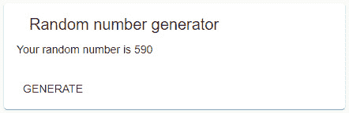

# 第六章：*第九章*: 使用新的 Ivy 运行时 API 进行调试

Angular Ivy 引入了一个新的 API，用于在运行时检查和调试我们的 Angular 应用程序。它替换了之前的`NgProbe` API，并允许`DebugElement`进行摇树优化。

我们将探索 Angular 最有用的运行时调试函数，包括以下内容：

+   `ng.applyChanges`

+   `ng.getComponent`

+   `ng.getContext`

+   `ng.getListeners`

拥有这些调试工具将允许您在运行时验证关于活动组件、它们的模板和它们的 DOM 绑定的假设。

本章涵盖以下主题：

+   新 Ivy 运行时 API 简介

+   检查活动组件

+   检查事件监听器

+   检查嵌入式视图上下文

熟悉这些主题将提高您实现 Angular Ivy 应用程序的开发工作流程。

# 技术要求

为了支持本章代码示例中使用的所有功能，您的应用程序至少需要以下要求：

+   Angular Ivy 版本 12.0

+   TypeScript 版本 4.2

此外，请注意，运行时调试 API 仅在 Angular 以开发模式运行时才可用。

您可以在本书的配套 GitHub 仓库中找到随机数生成器的完整代码示例，网址为[`github.com/PacktPublishing/Accelerating-Angular-Development-with-Ivy/tree/main/projects/chapter9/random-number`](https://github.com/PacktPublishing/Accelerating-Angular-Development-with-Ivy/tree/main/projects/chapter9/random-number)。

# 新 Ivy 运行时 API 介绍

如果您之前使用过 Angular 版本，您可能熟悉`NgProbe` API，该 API 在运行时作为全局作用域中的`ng.probe`函数可用。Angular Ivy 用一组新的运行时调试函数替换了此 API，这些函数仅在 Angular 开发模式下可用。

新 API 包含以下函数：

+   `ng.applyChanges(component: {}): void;`

    如果指定的组件正在使用`OnPush`变更检测策略，则标记该组件进行脏检查。之后，触发变更检测周期。

+   `ng.getComponent<T>(element: Element): T | null;`

    解析附加到指定 DOM 元素的 Angular 组件。

+   `ng.getContext<T>(element: Element): T | null;`

    当传递由结构指令（如`NgIf`或`NgFor`）生成的 DOM 元素时，解析嵌入式视图的视图上下文。在其他情况下，解析父组件。

+   `ng.getDirectiveMetadata(directiveOrComponentInstance: any): ComponentDebugMetadata | DirectiveDebugMetadata | null;`

    解析指定 Angular 组件或指令实例的元数据。

+   `ng.getDirectives(element: Element): {}[];`

    解析附加到指定 DOM 元素的 Angular 指令（但不是组件）。

+   `ng.getHostElement(componentOrDirective: {}): Element;`

    解析指定组件或指令附加到的宿主元素。

+   `ng.getInjector(elementOrDir: {} | Element): Injector;`

    解决与指定元素、指令或组件关联的注入器。

+   `ng.getListeners(element: Element): Listener[];`

    解决附加到指定 DOM 元素的事件监听器。这不包括由指令或组件元数据创建的主监听器，但包括 Angular 未添加的事件监听器。

+   `ng.getOwningComponent<T>(elementOrDir: {} | Element): T | null;`

    解决指定 DOM 元素、指令或组件的主组件。

+   `ng.getRootComponents(elementOrDir: {} | Element): {}[];`

    解决与指定 DOM 元素、指令或组件关联的根组件，即由 Angular 引导的组件。

由`ng.getListeners`返回的`Listener`数据结构具有以下接口：

```js
interface Listener {
  callback: (value: any) => any;
  element: Element;
  name: string;
  type: 'dom' | 'output';
  useCapture: boolean;
}
```

由`ng.getDirectiveMetadata`返回的数据结构具有以下接口：

```js
interface DirectiveDebugMetadata {
  inputs: Record<string, string>;
  outputs: Record<string, string>;
}
interface ComponentDebugMetadata extends DirectiveDebugMetadata {
  changeDetection: ChangeDetectionStrategy;
  encapsulation: ViewEncapsulation;
}
```

在前面的调试元数据接口中定义的`inputs`和`outputs`属性包含从数据绑定属性名称到组件属性名称的对象映射。

重要的是要注意，`ComponentDebugMetadata#changeDetection`和`ComponentDebugMetadata#encapsulation`属性是数字枚举，因此它们的值在运行时将是数字，而不是字符串。这使得它们在调试时稍微难以解释。

如前所述的概述所示，大多数这些运行时调试实用程序接受一个参数，即 DOM 元素、组件实例或指令实例。从指定的对象中，它们查找 DOM 元素、一个或多个组件实例、一个或多个指令实例、一个注入器或附加到 DOM 的事件监听器。

其中最引人注目的是`ng.applyChanges`。我们将在下一节讨论何时以及如何使用它。

# 检查组件实例

为了在运行时以编程方式探索我们的应用程序，我们通常需要一个活动组件实例的引用。一旦我们有了组件引用，我们就可以更改绑定属性并调用事件处理器或其他方法。

然而，首先，我们需要一个对指令实例或附加了组件的 DOM 元素的引用。使用`$0`变量。或者，我们可以使用`document.querySelector`或任何其他 DOM 查询或遍历 API。

假设我们有一个生成随机数的组件，如图所示：



图 9.1 – 生成随机数的组件

它具有以下代码块中所示组件模型：

```js
import { Component } from '@angular/core';
@Component({
  selector: 'app-random-number',
  templateUrl: './random-number.component.html',
  styleUrls: ['./random-number.component.css'],
})
export class RandomNumberComponent {
  generatedNumber?: number;
  onNumberGenerated(generatedNumber: number): void {
    this.generatedNumber = generatedNumber;
  }
}
```

在其模板中，它使用 Angular Material 的按钮组件，如下面的代码列表所示：

```js
<ng-container
  #generator="appRandomNumber"
  appRandomNumber
  (numberGenerated)="onNumberGenerated($event)"
  ></ng-container>
<mat-card>
  <mat-card-header>
    <mat-card-title>Random number generator</mat-card-
     title>
  </mat-card-header>
  <mat-card-content>
    <p>Your random number is {{ generatedNumber }}</p>
  </mat-card-content>
  <mat-card-actions>
    <button mat-button (click)= "generator.generateNumber()">GENERATE</button>
  </mat-card-actions>
</mat-card>
```

由于我们在`$0`变量中有一个对`<button>` DOM 元素的引用，我们可以执行以下操作以解决两个不同的组件实例：

```js
ng.getComponent($0);
// -> MatButton
ng.getOwningComponent($0);
// -> RandomNumberComponent
```

`ng.getComponent`和`ng.getOwningComponent`之间存在一个微妙但重要的区别。第一次调用返回一个`MatButton`组件的实例，该实例附加到`<button>`DOM 元素上。第二次调用给我们提供了一个`RandomNumberComponent`活动实例的引用。

我们得出结论，`ng.getComponent`返回指定 DOM 元素附加的组件，在本例中是`MatButton`组件。现在，`ng.getOwningComponent`返回与用于生成指定 DOM 元素的组件模板关联的组件实例，在本例中是一个`RandomNumberComponent`实例。

`generatedNumber`UI 属性绑定到 Angular 为随机生成器组件创建的 DOM 中的文本。如果我们想将其更改为特定的值，比如`42`呢？有了活动组件实例的引用，我们可以直接更改 UI 属性，如下所示：

```js
const component = ng.getOwningComponent($0);
component.generatedNumber = 42;
```

然而，当我们查看渲染的应用程序时，我们注意到 DOM 尚未更新以反映这个新的组件状态。当使用运行时调试 API 时，我们必须让 Angular 知道我们已经手动更改了状态，并希望 Angular 更新它所管理的 DOM。

我们通过将组件实例传递给`ng.applyChanges`来通知 Angular 脏状态，如下所示：

```js
ng.applyChanges(component);
```

在 Angular 完成一个变更检测周期后，我们注意到新的状态已反映在 DOM 中，如下所示：


图 9.2 – 显示手动指定数字的组件

太好了，现在你已经熟悉了最常见的运行时调试函数，这些函数使我们能够控制 Angular 组件。在接下来的章节中，我们将探讨对运行时调试至关重要的调试 API，但它们并不像常见的 API 那样被广泛使用。

# 检查事件监听器

我们将重用来自“检查组件实例”部分的随机数生成器示例。

为了参考，以下是在随机数组件模板中使用的随机数指令：

```js
import {
  Directive, EventEmitter, OnInit, Output
} from '@angular/core';
@Directive({
  exportAs: 'appRandomNumber',
  selector: '[appRandomNumber]'
})
export class RandomNumberDirective implements OnInit {
  #generatedNumber?: number;
  @Output()
  numberGenerated = new EventEmitter<number>();
  ngOnInit(): void {
    this.generateNumber();
  }
  generateNumber(): void {
    this.#generatedNumber = 
      Math.floor(1000 * Math.random());
    this.numberGenerated.emit(this.#generatedNumber);
  }
}
```

当其`generateNumber`方法被调用时，它通过`numberGenerated`输出属性输出随机生成的数字。随机数组件已将其事件处理程序`RandomNumberComponent#onNumberGenerated`绑定到这个自定义组件事件上。

## DOM 事件监听器

我们在`$0`中选择了`<button>`元素。

注意在组件模板中，按钮组件有一个点击事件绑定。我们想要访问它，以便可以触发它。为此，将按钮 DOM 元素传递给`ng.getListeners`函数，如下所示：

```js
const [onButtonClick] = ng.getListeners($0);
// onButtonClick -> Listener
onButtonClick.callback();
```

我们解包`ng.getListeners`返回的第一个也是唯一的事件监听器，当传递按钮 DOM 元素时。这个`Listener`数据结构存储在`onButtonClick`变量中。

我们通过调用 `onButtonClick.callback` 来调用点击事件处理器。这触发了与点击 **生成** 按钮相同的州更新。然而，Angular 并不知道脏状态。

重要提示

在 Angular 代码之外注册的 DOM 事件监听器也由 `ng.getListeners` 返回。

您可能还记得在 *检查组件实例* 部分中，我们必须通过运行时调试 API 通知 Angular 我们通过运行时调试 API 引入的状态变化。我们通过将组件实例传递给 `ng.applyChanges` 来这样做，如下所示：

```js
const component = ng.getOwningComponent($0);
ng.applyChanges(component);
```

当 Angular 完成变更检测周期后，新生成的数字将在随机数生成组件的 DOM 中显示，该组件由 Angular 管理。

注意，我们没有向 `Listener#callback` 方法传递任何参数。在我们的用例中，事件处理器不接受任何参数。如果它接受，我们很可能会需要传递期望类型的参数才能使其工作。例如，一个点击事件监听器可能接受一个类型为 `click` 的 `MouseEvent` 事件。

## 自定义组件事件绑定

通过 Angular 自定义组件事件绑定绑定的事件处理器也被注册为监听器。我们的示例组件为自定义的 `numberGenerated` 事件绑定了一个内联事件处理器。

我们在 `$0` 中选择 `<span>` 元素。

我们将 `span` 元素传递给 `ng.getListeners`，并注意到它列出了两个监听器，一个是类型为 `"dom"` 的监听器，另一个是类型为 `"output"` 的监听器，如下所示：

```js
const [domListener, outputListener] = ng.getListeners($0);
// domListener -> Listener { element: span, name: "numberGenerated", useCapture: false, type: "dom", callback: ƒ }
// outputListener -> Listener { element: span, name: "numberGenerated", useCapture: false, type: "output", callback: ƒ }
```

我们通过将 `7` 传递给 `outputListener.callback` 来模拟随机数生成，并通过将组件传递给 `ng.applyChanges` 来运行变更检测。这如下面的浏览器控制台列表所示：

```js
const component = ng.getOwningComponent($0);
outputListener.callback(7);
ng.applyChanges(component);
```

一旦完成变更检测周期，我们模拟的随机数生成将在 DOM 中显示，这是由 Angular 管理的。

这就是使用 Angular 运行时调试 API 检查原生和自定义事件监听器的全部内容。在本章的最后部分，我们将学习嵌入视图上下文是什么，以及如何使用 Angular Ivy 的运行时调试 API 来检查它。

# 检查嵌入视图上下文

结构指令用于在组件的生命周期内添加和删除 DOM 元素。它们创建一个嵌入视图，该视图绑定到视图上下文。这是 Angular 框架中 `NgIf` 和 `NgFor` 指令的情况。

重要提示

只能将一个结构指令附加到元素上。如果您需要应用多个结构指令，请将元素包裹在特殊的 `<ng-container>` 元素中，将外部结构指令附加到该元素上，依此类推。

当我们将带有结构指令的元素传递给 `ng.getContext` 时，它返回视图上下文。例如，当我们传递带有 `NgIf` 指令的元素时，返回 `NgIfContext`，它具有以下形状：

```js
interface NgIfContext {
  $implicit: boolean;
  ngIf: boolean;
}
```

由 `NgIf` 动态创建的嵌入视图绑定到 `NgIfContext` 的 `$implicit` 属性。

如果我们传递一个带有`NgFor`指令的元素，则返回`NgForOfContext`。它具有以下形状：

```js
interface NgForOfContext<T> {
  $implicit: T;
  count: number;
  index: number;
  ngForOf: T[];
  even: boolean;
  first: boolean;
  last: boolean;
  odd: boolean;
}
```

`NgFor`指令为`NgForOfContext#ngForOf`中的每个项目动态创建一个嵌入式视图。每个嵌入式视图都绑定到特定于该项目的`NgForOfContext`的`$implicit`属性。

然而，每个嵌入式视图也可以访问`NgForOfContext`中指定的其他属性。例如，我们可以遍历用户列表并存储对`index`和`first`上下文属性的引用，如下所示：

```js
<ul>
  <li *ngFor="let user of users; index as i; first as 
   isFirst">
    {{i}}/{{users.length}}.
    {{user}} <span *ngIf="isFirst">(default)</span>
  </li>
</ul>
```

为每个用户创建的嵌入式视图可以访问并使用`index`和`first`属性，分别别名为`i`和`isFirst`。

将前一个代码列表中的列表项元素传递给`ng.getContext`会导致返回一个`NgForOfContext`值，例如以下代码列表中的示例：

```js
const listItems = document.querySelectorAll('li');
ng.getContext(listItems[0]);
// -> NgForOfContext { $implicit: "Nacho", count: 4, index: 0, ngForOf: ["Nacho", "Santosh", "Serkan", "Lars"], even: true, first: true, last: false, odd: false }
ng.getContext(listItems[1]);
// -> NgForOfContext { $implicit: "Santosh", count: 4, index: 1, ngForOf: ["Nacho", "Santosh", "Serkan", "Lars"], even: false, first: false, last: false, odd: true }
```

同样，如果我们把`<span>`元素传递给`ng.getContext`，我们得到一个`NgIfContext`值，如下所示：

```js
ng.getContext(document.querySelector('span'));
// -> NgIfContext { $implicit: true, ngIf: true }
```

特别注意传递带有结构指令的元素，否则你将收到最近的组件实例。

现在，你知道如何检查带有结构指令的模板元素的嵌入式视图上下文。

# 摘要

我希望你喜欢我们在本章中添加到你的工具箱中的新工具。我们从一个概述开始，介绍了 Angular Ivy 的运行时调试 API，该 API 仅在开发模式下可用。

接下来，我们学习了如何使用`ng.getComponent`和`ng.getOwningComponent`检查组件实例。我们还更改了组件状态，然后使用`ng.applyChanges`更新 DOM。

在*检查事件监听器*部分，我们使用`ng.getListeners`来检查原生 DOM 事件监听器和自定义组件事件监听器。我们向它们的回调传递参数，并使用`ng.applyChanges`触发变更检测。

最后，你现在知道什么是嵌入式视图上下文以及如何检查它，例如，它是如何创建并绑定到由`NgFor`指令管理的每个组件或元素。同样，我们探索了一个由`NgIf`指令管理的元素的嵌入式视图上下文示例。

在获得所有这些新技能后，你就可以通过直接检查和更新状态或通过事件来调试 Angular 应用程序，然后通过触发变更检测来反映这些更改。

你甚至能够检查那些难以找到的嵌入式视图上下文。太棒了！

在下一章中，你将了解 Angular 兼容性编译器以及何时以及为什么需要它。我们将探索其配置选项，并针对 CI/CD 工作流程进行优化。
