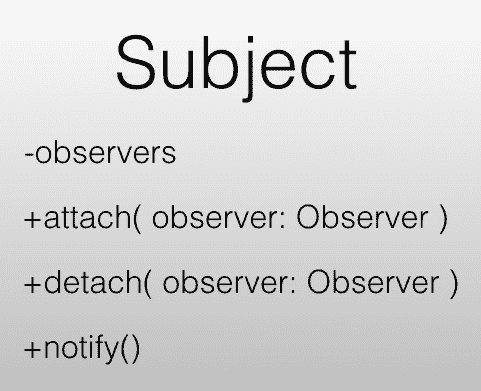
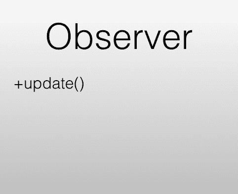

# 第五章：RxJS 基础

**JavaScript 的响应式扩展**（**RxJS**）是由 Matt Podwysocky 创建的一系列库。库的第四版由微软维护和开发。第四版可以在以下链接找到：[`github.com/Reactive-Extensions/RxJS`](https://github.com/Reactive-Extensions/RxJS)。

第五版是对第四版的完全重写，可以在以下地址找到：[`github.com/ReactiveX/rxjs`](https://github.com/ReactiveX/rxjs)。其最大贡献者是 *Ben Lesh*，其他值得注意的贡献者包括 *Andre Staltz*。第五版也是 Angular 在处理 HTTP 等方面的库选择。

在本章中，您将学习：

+   组成 RxJS 的模式有哪些

+   RxJS 的核心概念

+   如何手动创建自己的 Observables 并订阅它们

+   你可以创建 Observable 的多种方式

+   管理清理的重要性

+   通过学习实现 RxJS 库的核心部分来理解其底层原理

# 观察者模式

观察者模式是四人帮模式。这是一个因被包含在 *Erich Gamma*、*Richard Helm*、*Ralph Johnson* 和 *John Vlissides* 所著的《设计模式：可复用面向对象软件元素》一书中而闻名的设计模式。该模式有两个关键参与者：一个 **Subject** 和一个 **Observer**。Subject 被观察者观察。通常，Subject 持有一个内部观察者列表，当 Subject 上发生更改时应该通知这些观察者。Subject 通常是一个模型，而观察者是一些 UI 组件。简而言之，Subject 应该能够：

+   维护观察者列表

+   添加观察者

+   移除观察者

+   当发生更改时通知所有观察者

相反，观察者应该只持有一个属性，那就是一个可以在更新发生时由主题调用的 `update()` 方法。这个模式背后的想法是创建不同层之间的松散耦合。主题和观察者都不应该直接通过名称了解对方，而应该通过抽象。因此，一个主题的类图可能如下所示：



在这里，我们包括了所有必需的方法：`attach()`、`detach()` 和 `notify()`，并且我们明确指出我们处理的是抽象观察者，而不是具体类型。至于观察者，这通常是一个只有一个方法 `update()` 的接口，可以由以下类图表示：



给定这些类图，让我们编写一些代码来演示实现可能的样子，并且我们从主题开始。对于这个例子，我们将使用 TypeScript，因为 TypeScript 知道接口是什么：

```js
// observer-subject/subject.ts

import { Observer } from "./observer";

export class Subject {
  observers: Array<Observer>;

  constructor() {
    this.observers = new Array<Observer>();
  }

  attach(observer: Observer) {
    if (this.observers.indexOf(observer) === -1) {
      this.observers.push(observer);
    }
  }

  detach(observer) {
    let index = this.observers.indexOf(observer);
    if (index !== -1) {
      this.observers = this.observers.slice(index, 1);
    }
  }

  notify() {
    this.observers.forEach(observer => observer.update());
  }
}
```

如您所见，基本实现非常简短，但它是一个强大的结构。至于 `Observer`，它甚至更短：

```js
// observer-subject/observer.ts
export interface Observer {
  update();
}
```

我们可以通过创建一个文件，例如 `app.ts`，来尝试这个例子：

```js
// observer-subject/app.ts

import { Subject } from "./subject";
import { Observer } from "./observer";

const subject = new Subject();
const observer = <Observer>{
  update: () => console.log("First Observer Updated")
};

const observer2 = <Observer>{
  update: () => console.log("Second Observer updated")
};

subject.attach(observer);
subject.attach(observer2);
subject.notify();

// should emit:
// First Observer Updated
// Second Observer updated
```

通过运行前面的代码，我们看到`Subject`实例允许我们通过调用`attach()`方法将其附加到`Observer`实例上。然后我们在`Subject`实例上调用`notify()`，以确保所有订阅的`Observer`实例都得到通知。

好的，所以现在我们已经有一些核心实现，一个实际的使用案例是什么样的呢？想象一下，我们有一个扮演`Subject`角色的`ProductModel`类和一个扮演`Observer`角色的`ProductUI`类。`ProductModel`类的一个简单实现可能如下所示：

```js
// product-model/product.model.ts

import { Subject } from "./subject";

export class ProductModel extends Subject {
  private titleValue = "";
  private makeValue = "";

  get title(){ 
    return this.titleValue;
  }

  set title(value) {
    this.titleValue = value;
    this.notify();
  }

  get make() {
    return this.makeValue;
  }

  set make(value) {
    this.makeValue = value;
    this.notify();
  }
}
```

在这里，我们可以看到我们有两个属性，`title`和`make`，当它们两者都发生变化时，我们调用从基类`Subject`继承的`notify()`方法。让我们看看`ProductUI`类可能是什么样子：

```js
// product-model/product.ui.ts

import { Observer } from "./observer";
import { ProductModel } from "./product.model";

export class ProductUI implements Observer {
  constructor(private model: ProductModel) {
    this.model.attach(this); // add ProductUI to the observer list
    this.renderUI();
  }

  renderUI() {
    console.log("calling renderUI");
    this.draw();
  }

  draw() {
    // implement
    console.log("calling draw");
  }

  update() {
    console.log("calling update");
    this.renderUI(); // rerender the UI when update() is called
  }
}
```

在前面的代码中，我们看到我们在构造函数中接收一个`ProductModel`实例，并且我们还对该实例调用`attach()`方法，以便将其注册为`Observer`。我们还定义了一个`update()`方法，其中我们决定如果它被调用，我们将重新渲染 UI。

这是一个使用观察者模式并用于模型到 UI 通信的典型示例，这只是许多使用可能性之一。一般原则是在`Subject`和`Observer`实例之间以松耦合的方式进行通信。真正的优势是能够在单个`Subject`上拥有多个`Observer`实例，这样如果`Subject`发生变化，所有其`Observer`实例也会随之变化。这也被称为发布/订阅，通常简称为 Pub/Sub。

# RxJS 核心概念

RxJS 由一些核心概念组成，这些概念对于你早期理解非常重要。那些是：

+   **可观察的**：这是一个表示数据流的类。

+   **观察者**：这是一个能够发出数据的类。

+   **生产者**：这是内部产生数据的东西，观察者最终会发出这些数据。

+   **操作符**：这是`Observable`上的一个方法，它允许我们操作流本身或它发出的数据。

+   **流**：这与`Observable`的一个实例同义。之所以称之为流，是因为你应该将数据视为连续的，而不是真正有结束，除非你明确地定义一个结束。

# 可观察的和观察者

在定义了我们最初需要了解的所有概念之后，现在是我们将这些概念放入上下文中，以进一步加深我们的理解。让我们从一个定义`Observable`开始，并逐步深入到之前提到的每个概念。`Observable`可以通过以下代码创建：

```js
let stream$ = Rx.Observable.create(observer => observer.next(1));
```

这是创建一个`Observable`所需的最少代码量。在这个阶段，屏幕上没有写入任何内容，因为我们需要订阅流。让我们给我们的`Observable`添加一个订阅者。我们通过在流实例上调用`subscribe()`方法来实现这一点：

```js
let stream$ = Rx.Observable.create(observer => observer.next(1));
stream$.subscribe(data => console.log('data',data) ) // write data, 1 to the console
```

看看这段代码，我们看到`Observable`调用了`create()`方法，该方法反过来创建了一个`Observable`的实例。有趣的是，`create()`方法接受一个函数作为参数；这个函数本身接受一个观察者实例。因此，我们有一个看起来像这样的 API：`Observer.create(fn(observerInstance))`。在这个函数内部发生的事情是，我们调用`observer.next(1)`。在更高层次上，我们通过使用`create()`这个`factory`函数创建了一个`Observable`。在这个例子中，我们的`Observable`行为非常简单，就是发射值 1。当我们调用`observer.next(1)`时，我们发射数据。为了获取发射的数据，我们需要调用`subscribe()`方法。

# 生产者

如果我们尝试将此与观察者模式进行比较，我们会看到一些概念是重复的，例如观察者。在这个模式中，当发生某些事情时，观察者会收到通知，而主题会主动改变。看看之前的代码，看起来像观察者是主动改变的一方。但这并不完全正确；它更像是一个中介，这带我们来到了 RxJS 的下一个概念，即`Producer`。`Producer`负责生成我们需要的值。通过在我们的代码中引入`Producer`，我们看到观察者更像是一个中介：

```js
// rxjs-example/producer.js

const Rx = require("rxjs/Rx");

class Producer {
  constructor() {
    this.counterMax = 5;
    this.current = 0;
  }

  hasValues() {
    return this.current < this.counterMax;
  }

  next() {
    return this.current++;
  }
}

let stream$ = Rx.Observable.create(observer => {
  let producer = new Producer();

  while (producer.hasValues()) {
    observer.next(producer.next());
  }
});

stream$.subscribe(data => console.log("data", data));
// data 0, data 1, data 2, data 3, data 4
```

如我们所见，生产者是负责生成数据的一方，而观察者负责将数据传递给订阅者。

# 可观察的错误和完成

流不仅仅是生成数据；流还可以生成错误以及达到其完成状态。如果发生错误或完成，流将不再生成任何值。为了表示我们有一个错误，我们在观察者上调用`error()`方法，如下所示：

```js
let stream$ = Rx.Observable.create(observer => {
  observer.error('we have an error');
});
```

为了捕获发射的错误，我们需要在我们的`subscribe()`调用中引入第二个回调，如下所示：

```js
// rxjs-example/error.js 

const Rx = require("rxjs/Rx");

let stream$ = Rx.Observable.create(observer => {
  observer.error("we have an error");
});

stream$.subscribe(
  data => console.log("data", data),
  error => console.error("err", error)
)
```

到目前为止，我们已经学习了如何发射数据，以及如何发出错误信号。我们能做的最后一件事是关闭流，或者完成它，因为关闭流也被称为完成。我们通过在观察者上调用`complete()`来实现这一点。这将确保不再发射任何值。为了捕获完成信号，我们需要在我们的`subscribe()`调用中添加另一个回调。你可以这样使用它：

```js
// rxjs-example/completion.js

const Rx = require("rxjs/Rx");

let stream$ = Rx.Observable.create(observer => {
  observer.next(1);
  observer.complete();
});

stream$.subscribe( 
  data => console.log("data", data), // 1
  error => console.error("err", error), // never hit
  () => console.log("complete") ); // will be hit
```

# 操作符

我们要讨论的最后一个概念是操作符。操作符简单地说是一个作用于`Observable`并按某种方式改变流的函数。操作符本质上是不可变的。这种不可变性使得代码更容易测试和推理。RxJS 提供了 60 多个操作符，以帮助在大多数情况下定义你的流及其行为。

可能会有这样的情况，你需要创建自己的操作符，但很可能是已经有了一个操作符可以完成你想要的功能。

当你定义你的流及其行为时，你将使用一个或多个操作符。它可能看起来像以下这样：

```js
let stream$ = Rx.Observable.of(1,2)
 .map( x => x +1 )
 .filter( x > 2 );

stream$.subscribe( data => console.log('data', data)) 
// data 3
```

在这里，我们可以看到我们正在使用 `.map()` 操作符和 `.filter()` 来改变我们的流数据。`.map()` 通过将每个值增加一来对流中的每个值进行操作。`.filter()` 对改变后的流进行操作；由调用 `.map()` 引起的改变。它也针对流中的每个值进行操作，但条件性地决定应该发出什么。最终结果只发出一个值，`3`。还有许多其他的操作符，但这应该能给你一个关于操作符是什么以及如何使用它们的想法。

# 创建 Observables

大多数时候，在创建 Observables 时，你不会使用`create()`方法。你将使用其他方法。为什么是这样呢？好吧，一个 Observable 实例通常源于某种异步概念。在使用 RxJS 创建 Angular 应用程序的上下文中，Observable 实例将通过执行以下操作之一来创建：

+   使用 AJAX 通过 HTTP 创建或获取数据

+   使用响应式表单监听输入变化

+   监听路由变化

+   监听 UI 事件

+   包装异步概念

在 RxJS 中，有一些不同的创建操作符可以帮助你解决这些任务，但 Angular 框架实际上可能在内部创建 Observables。让我们看看除了`create()`方法之外的一些创建操作符：

# 创建操作符

如我们之前所述，Observable 是一种表示随时间发出的数据的表现形式。有时，数据会立即到达，有时则需要时间。无论哪种情况，能够以相同的方式对数据进行建模都是非常强大的。

# of()

让我们看看一个非常简单的创建操作符，`of()`。它接受一个可变数量的参数，这些参数将被作为值发出，如下所示：

```js
let stream$ = Rx.Observable.of(1, 2, 3, 4);
stream$.subscribe( data => console.log(data)) // 1, 2, 3 ,4
```

值会立即触发。这在只想测试事情时非常有用。

# interval()

另一个有趣的操作符是`interval()`操作符，它接受一个毫秒数作为参数。这定义了每条发出数据之间的延迟时间（以毫秒为单位）。它将从数字 0 开始。需要注意的是，除非例如应用了`take()`操作符，否则它将无限期地生成值。`take()`操作符将限制发出的值的数量并关闭流。该操作符的典型用法如下：

```js
let stream$ = Rx.Observable.interval(1000)
  .take(3); // 1s delay between values, starting at 0

stream$.subscribe(data => console.log(data)) 
// 0, 1, 2
```

# from()

`from()`操作符允许我们从其他异步/同步概念创建一个`Observable`。当几乎所有东西都可以被制作成`Observable`时，这非常强大，因为它允许丰富的组合。以下是一个典型的代码片段示例：

```js
let stream$ = Rx.Observable.from(new Promise(resolve, reject) => {
  resolve('some data');
});

stream$.subscribe( data => console.log(data)); // some data

let stream2$ = Rx.Observable.from([1,2,3,4]);
stream2$.subscribe( data => console.log(data)); // 1,2,3,4
```

# fromEvent()

我们已经多次提到丰富的组合以及将一切转换为 Observable 的力量。我们已经将承诺转换为 Observables，这使得一切变成了数据流，使得整个情况更容易推理。我们的意思是，当每个异步概念都被转换为 Observable 时，我们突然能够以相同的方式思考它们。可以应用于鼠标点击的操作符也可以应用于 AJAX 请求等等。

此外，我们甚至可以将 UI 事件转换为 Observables。通过使用 `.fromEvent()` 操作符，我们能够将一个元素及其对应的事件转换为一个 Observable。这是我们手中的真正力量，它允许我们将诸如自动完成等场景简化为 3-4 行代码。此操作符的典型用法如下：

```js
let elem = document.getElementById('input'); 
// we assume we have a <input id="input"> in our markup

let keyStream$ = Rx.Observable.fromEvent(elem, 'keyUp'); 
// listens to the keyUp event
```

# bindCallback()

到目前为止，我们已经列出了很多方法，无论是同步还是异步，都可以将一个结构转换为 Observable。回调是第一个尝试解决整个异步问题的模式，并且应该指出，由于可读性差，回调可能是解决异步代码的最差方式。幸运的是，有一个操作符可以将回调转换为 Observable，称为 `bindCallback()`。它可以按以下方式使用：

```js
function fnWithCallback(cb) {
  setTimeout(() => cb('data'), 3000);
}

let fnWithCallbackBinded = Rx.Observable.bindCallback(fnWithCallback);
let source$ = fnWithCallbackBinded();

source$.subscribe(data => console.log('callback', data));

```

我们可以看到，我们首先定义了一个名为 `fnWithCallback()` 的函数。我们将这个函数作为参数传递给 `bindCallback()` 方法。这会产生一个 `fnWithCallbbackBinded()` 函数。调用该函数将生成一个我们可以订阅的 `Observable`。因此，每当 `fnWithCallback()` 函数中的 `cb('data')` 因为 `setTimeout()` 而被调用时，这将导致我们的 `source$` 的数据回调被调用。这在实践中是如何工作的呢？这实际上非常简单。让我们尝试实现我们自己的 `Observable`。我们已经学习了以下内容：

+   `bindCallback()` 方法接受一个函数作为参数

+   调用 `bindCallback()` 应该生成一个函数

+   调用 `bindCallback()` 的结果应该生成一个 `Observable`

+   调用 `subscribe()` 应意味着我们的数据回调应该是 `fnWithCallback()` 中的 `cb` 参数

因此，最终的实现应该看起来像这样：

```js
// rxjs-creation-operators/bind-callback.ts

class Observable {
  behaviorFn;
  constructor(behaviorFn) {
    this.behaviorFn = behaviorFn;
  }

  static bindCallback(behaviorFn): Function {
    return (): Observable => {
      return new Observable(behaviorFn);
    };
  }

  subscribe(dataCb) {
    this.behaviorFn(dataCb);
  }
}

let fn = Observable.bindCallback(cb => {
  setTimeout(() => cb("data"), 3000);
});

const stream$ = fn();
stream$.subscribe(data => console.log("data", data));
// outputs: data data
```

# 清理

我们现在已经涵盖了核心概念，如 Observable、Observer、Producer 和操作符。我们还探讨了如何手动创建一个 Observable，但意识到有不同类型的创建操作符可以帮助您从其他结构创建 Observable，有时 Angular 框架本身会为您创建 Observable。但我们遗漏了一个重要的事情，那就是清理。会有一些情况，Observable 会分配资源或简单地永远持续，就像`interval()`操作符一样。有一种明确的补救措施——在我们完成 Observable 后定义并运行一个清理函数。定义这样的函数迫使我们回到`create`操作符，并在其行为函数中修改一些代码，如下所示：

```js
let stream$ = Rx.Observable.create(observer => {
  let counter = 0;
  let id = setInterval(() => observer.next(counter++), 1000);

  return function cleanUpFn() { clearInterval(id); }
});
```

# 订阅

前面的代码描述了一个需要清理发生的情况。我们定义了一个`setInterval()`结构，它似乎会无限期地发出值。`cleanUpFn()`有取消这种行为的能力，前提是它被调用。我们在行为函数的末尾返回`cleanUpFn()`。

问题是，我们如何获取它？答案是，我们需要讨论一个新概念：订阅。订阅是在对流调用`subscribe()`时返回的东西。让我们用这个来修改前面的代码：

```js
let stream$ = Rx.Observable.create(observer => {
  let counter = 0;
  let id = setInterval(() => observer.next(counter++), 1000);
 return function cleanUpFn() { clearInterval(id); }
});

let subscription = stream$.subscribe((data) => console.log('data'));
setTimeout(() => subscription.unsubscribe(), 2000);
```

在前面的代码中，我们通过调用`subscribe()`创建了变量`subscription`，但真正有趣的部分发生在最后一行：我们定义了一个超时，它会在我们的`subscription`上调用`unsubscribe()`。这将调用我们的`cleanUpFn()`，以便取消间隔。

你处理的大多数流都不需要取消订阅，但那些分配资源或启动一些永远持续的结构，而我们没有拦截的，将需要有一个清理行为，我们在完成我们的流后需要调用这个行为。

# 创建 RxJS 的核心实现

理解某事物有不同的阶段。理解一个库就是学习其概念，并正确地利用其方法。然后是更深层次的理解，比如根据你在博客中找到的一些最佳实践指南，知道应该使用哪些方法。最后，你将达到一个真正深入的理解阶段，你想要理解正在发生的事情，开始对源代码本身进行修改，并可能通过向项目提交 Pull Request 来尝试增强它，这很可能是基于 GitHub 的。

本节旨在立即向您提供部分这种更深入的知识。我们意识到，在这个时候，您的大脑可能因为所有新学的概念和一些巧妙的操作符而有些混乱。让我们从头开始，先从最初介绍的概念入手，尝试逆向工程正在发生的事情。

# 实现 create()

在本章的开头，我们学习了如何创建一个 Observable。代码看起来是这样的：

```js
let stream$ = Rx.Observable.create( observer => observer.next(1));
stream$.subscribe( data => console.log(data));
```

只需看一下代码，我们就可以对底层正在发生的事情做出有根据的猜测。很明显，我们需要一个`Observable`类。

这个类需要一个接受函数作为参数的`create()`方法。`create()`方法应该返回一个`Observable`。此外，我们的`Observable`类需要一个接受函数作为参数的`subscribe()`方法。让我们从这里开始，看看我们会走到哪里。

首先，让我们定义我们的`Observable`类，并使用上述方法：

```js
class MyObservable {
  static create(behaviourFn): MyObservable {}
  constructor() {}
  subscribe(dataFn) {}
}
```

好的，所以我们有一个包含三个方法的类；让我们尝试实现这些方法。让我们从我们所知道的`create()`方法开始：

```js
class MyObservable {
  static create(behaviourFn): MyObservable {
    return new Observable(behaviourFn);
  }
  constructor(private behaviourFn) {}
  subscribe(dataFn) {}
}
```

我们用粗体标出了所需更改，并在类中引入了一个名为`behaviourFn()`的字段。此外，我们的`create()`方法通过传递`create()`方法参数中的`behaviourFn`来实例化一个`Observable`。这意味着构造函数需要接受一个函数作为参数，并将其保存以供以后使用。关于传递给`create`方法的`behaviourFn()`，我们知道它接受一个观察者实例作为参数，并规定了观察者实例应该发出哪些值。为了使任何东西能够捕获这些发出的值，我们需要实现我们的最后一个方法，`subscribe()`。我们知道`subscribe()`接受`dataFn()`作为参数，并在调用`subscribe()`方法时以某种方式调用我们的`behaviourFn`以触发行为。因此，让我们在我们的现有代码中修改这一点：

```js
class MyObservable {
  static create(private behaviourFn): MyObservable { 
    return new MyObservable(behaviourFn);
  }
  constructor(behaviourFn) { this.behaviourFn = behaviourFn; }
  subscribe(dataFn) {
    this.behaviourFn(observer);
  }
}
```

在这一点上，我们意识到我们需要一个`Observer`类，这样我们才能向`behaviourFn()`传递一些东西。我们还需要弄清楚如何调用`dataFn()`以及何时调用。经过一分钟思考，我们意识到观察者必须负责调用`dataFn()`，因此似乎只有将`dataFn()`传递到我们的`Observer`类的构造函数中，以便以后使用，才是合理的，如下所示：

```js
class Observer {
  constructor(private dataFn) {}
  next(value) { this.dataFn(val) }
}
```

通过实现这个`Observer`类，我们做了三件事：一是通过构造函数传递`dataFn()`并将其作为`Observer`类的一个字段；二是创建了一个`next()`方法在`Observer`上，这是我们必须做的，因为我们了解到观察者实例应该调用`next()`来生成值；第三，我们确保在`next()`方法内部调用`dataFn()`，以确保每当通过调用`next()`方法生成值时，订阅者都会被告知。将所有这些代码放在一起，我们创建了一个非常基础的 RxJS 实现，实际上它是可以工作的！为了更好地理解我们目前所拥有的，让我们显示到目前为止使用的所有代码：

```js
// rxjs-core/Observable.ts

class Observer {
  constructor(private dataFn) {}
  next(value) { this.dataFn(value) }
}

class MyObservable {
  behaviourFn;
  static create(behaviourFn): MyObservable {
    return new Observable(behaviourFn);
  }
  constructor(behaviourFn) { this.behaviourFn = behaviourFn; }
  subscribe(dataFn) {
    let observer = new Observer(dataFn);
    this.behaviourFn( observer );
  }
}

let stream$ = MyObservable.create( observer => observer.next(1)); // 1
```

# 处理订阅

在上一节中，我们学习了如何实现一个非常基本的内核。然而，在本章的早期部分，提到有时你的 Observable 会分配资源或显示一种明显无法停止生成值的行为。处理这种情况是我们的责任。RxJS 明确地在这里指出了路径，即定义一个清理函数并确保在调用 `unsubscribe()` 时调用它。让我们展示这样一个场景，其中我们显然需要关注清理：

```js
// rxjs-core/Observer-with-subscription.ts

interface Subscription {
  unsubscribe();
}

class MyObservableWithSubscription {
  static create(behaviourFn): MyObservableWithSubscription {
    return new MyObservableWithSubscription(behaviourFn);
  }

  constructor(private behaviourFn) {}

  subscribe(dataFn): Subscription {
    let observer = new MyObserver(dataFn);
    let cleanUpFn = this.behaviourFn(observer);
    return {
      unsubscribe: cleanUpFn
    };
  }
}

let streamWithSubscription$ = MyObservableWithSubscription.create(observer => {
  let counter = 0;
  let id = setInterval(() => observer.next(counter++), 1000);
  return function cleanUpFn() {
    clearInterval(id);
  };
});

const subscription = streamWithSubscription$.subscribe(data =>
  console.log("data", data)
);

subscription.unsubscribe();
```

查看代码，我们发现当我们定义行为函数（代码片段的底部）时，我们设置了一个 `setInterval()` 构造，该构造定期调用 `observer.next(`）。我们确保将引用保存在变量 ID 中。我们需要确保当我们选择取消 `setInterval()` 行为时可以做到这一点。我们通过在 `behaviourFn` 函数的最后一行定义一个 `cleanUpFn()` 来做到这一点。这使我们来到了代码片段的上半部分。在这里，我们看到我们通过确保将调用 `this.behaviourFn()` 的结果保存到名为 `cleanUpFn` 的变量中来修改 `subscribe()` 方法。这确实是我们在 `behaviourFn()` 中定义的 `cleanUpFn()`。最后，我们通过将其作为对象的一部分返回并将其分配给 `unsubscribe()` 属性来公开 `cleanUpFn()` 属性。最后我们需要做的是调用 `unsubscribe()` 方法以确保我们的分配资源被释放，或者在这个特定例子中，取消 `setInterval()` 构造。调用 unsubscribe 将会调用 `cleanUpFn()`，然后它将调用 `clearInterval()`，这将取消间隔。

# 添加操作符

我们在定义自己的 RxJS 内核实现方面已经走了很长的路，但我们还缺少一个重要的拼图——操作符。操作符是 RxJS 的真正力量，可以被视为一个实用方法，它允许我们轻松地操作我们的流。让我们以 `filter()` 作为我们的示例目标。一个过滤操作符是一个你可以对其流调用的方法。想法是提供一个函数，能够逐个值地确定特定值是否应该被发出。一个典型的用例如下：

```js
let stream$ = Observable.of(1,2,3)
  .filter( x => x > 1 );

stream$.subscribe( data => console.log(data)) 
// will emit 2,3
```

在前面的代码中，我们可以看到我们提供给过滤函数的参数函数有效地排除了任何不符合条件的值。在这种情况下，所有大于 `1` 的值将被发出，从而对值 `1` 进行排序。让我们将 `filter()` 方法添加到我们之前定义的 `MyObservable` 类中，如下所示：

```js
// rxjs-core/operator/Observable.ts, starting off with MyObservable, more to come

import { MyObserver } from "./Observer";

class MyObservable {
  behaviorFn;

  static create(behaviourFn): MyObservable {
    return new MyObservable(behaviourFn);
  }

 constructor(behaviorFn) {
   this.behaviorFn = behaviorFn;
 }

 filter(filterFn): FilterableObservable {
   /* implement */
 }

 subscribe(dataFn) {
   let observer = new MyObserver(dataFn);
   let cleanUpFn = this.behaviorFn(observer);

   return {
     unsubscribe: cleanUpFn
   };
 }
}
```

从前面的代码片段中我们可以看到，`filter()`方法被添加到了`MyObservable`中，我们看到它本身返回一个 Observable，同时接受一个`filterFn()`参数。你需要问自己的问题是，我们现有的`MyObservable`构造函数是否足够。我们现有的构造函数接受一个`behaviourFn()`，我们很可能需要存储传入的`filterFn`参数，因此我们需要扩展构造函数或选择一个新的`MyObservable`实现。我们思考了一下，意识到选择一个新的、更专门的`MyObservable`可能更好，因为我们想避免大量的分支逻辑。因此，该方法的实现应该修改为类似以下的样子：

```js
// rxjs-core/operator/Observable.ts, starting off with MyObservable, more to come

import { MyObserver } from "./Observer";

class MyObservable {
  behaviorFn;

  static create(behaviourFn): MyObservable {
    return new MyObservable(behaviourFn);
  }

 constructor(behaviorFn) {
   this.behaviorFn = behaviorFn;
 }

 filter(filterFn): FilterableObservable {
   return new FilterableObservable(filterFn, this.behaviorFn);
 }

 subscribe(dataFn) {
   let observer = new MyObserver(dataFn);
   let cleanUpFn = this.behaviorFn(observer);

   return {
     unsubscribe: cleanUpFn
   };
 }
}
```

好的，现在我们有一个新的类要实现，`FilterableObservable`。这个类应该共享`MyObservable`的大部分行为，但展示我们如何发出数据。因此，我们是在从`MyObservable`继承，但有自己的特别之处。让我们尝试一个实现：

```js
// rxjs-core/operator/Observable.ts

import { MyObserver } from "./Observer";

class MyObservable {
  behaviorFn;

  static create(behaviourFn): MyObservable {
    return new MyObservable(behaviourFn);
  }

  constructor(behaviorFn) {
    this.behaviorFn = behaviorFn;
  }

  filter(filterFn): FilterableObservable {
    return new FilterableObservable(filterFn, this.behaviorFn);
  }

  subscribe(dataFn) {
    let observer = new MyObserver(dataFn);
    let cleanUpFn = this.behaviorFn(observer);

     return {
      unsubscribe: cleanUpFn
     };
  }
}

export class FilterableObservable extends MyObservable {
  constructor(private filterFn, behaviourFn) {
    super(behaviourFn);
  }

  subscribe(dataFn) {
    let observer = new MyObserver(dataFn);

    observer.next = value => {
      if (this.filterFn(value)) {
        dataFn(value);
 }
 };

    let cleanUpFn = this.behaviorFn(observer);
    return {
      unsubscribe: cleanUpFn
    };
  }
}

const stream$ = new MyObservable(observer => {
  observer.next(1);
  observer.next(2);
  observer.next(3);
}).filter(x => x > 2);

stream$.subscribe(data => console.log("data", data));

// prints 3
```

在前面的代码片段中，我们可以看到我们重写了`subscribe()`实现，或者更具体地说，我们在`Observer`实例上重写了`next()`方法。我们使用`filterFn()`来评估是否应该生成某个值。现在我们已经成功实现了`filter()`操作符。

# 回顾基础知识，添加错误和完成

在完成了 RxJS 基础实现的英勇壮举之后，我们希望对理解其内部工作原理感到相当满意。到目前为止，我们只在`subscribe()`中实现了`dataFn`；`subscribe()`方法中还有两个回调需要实现。让我们看一个代码片段并突出显示缺失的部分：

```js
let stream$ = Rx.Observable.of(1,2,3);
stream$.subscribe(
  data => console.log(data),
 err => console.error(err),
 () => console.log('complete');  
)
```

我们已经突出了最后两个回调作为缺失的功能。我们知道，为了触发错误回调，我们需要调用`observer.error('some message')`。我们也知道，在抛出错误后不应再发出任何值。让我们提供一个这样的例子：

```js
let stream$ = Rx.Observable.create( observer => {
  observer.next(1);
  observer.error('err');
  observer.next(2); 
});

stream$.subscribe( 
  data => console.log(data),
  err => console.error(err)
);  
// should emit 1, err
```

在这个阶段，我们意识到需要修改我们的`Observer`类以支持`error()`方法调用。我们还需要警惕我们刚才描述的条件，因为错误发生后不应再发出更多值。让我们直接进入实现：

```js
class Observer {
  hasError: boolean;
  constructor(private dataFn, private errorFn) {}
  next(value) { 
 if (!this.hasError) { 
      this.dataFn(value); 
 } 
  }

  error(err) { 
    this.errorFn(err); 
    this.hasError = true; 
  }
}
```

在前面的代码片段中，我们可以看到我们向`errorFn`构造函数传递了另一个参数。`next()`方法需要更新，因此我们需要用条件包装它，以确定是否生成值。最后，我们需要定义`error()`方法，调用传入的`errorFn`并设置`hasError`字段为`true`。

我们还需要做一件事，那就是更新`Observable`类中的`subscribe()`方法：

```js

class Observable {
  behaviourFn;
  static create(behaviourFn): Observable {
    return new Observable(behaviourFn);
  }

  constructor(behaviourFn) { 
    this.behaviourFn = behaviourFn; 
  }

  subscribe(dataFn, errorFn) {
    let observer = new Observer(dataFn, errorFn);
    let cleanUpFn = this.behaviourFn(observer);

    return { 
      unsubscribe: cleanUpFn 
    };
  }
}

```

提前提醒一下，当我们定义 `filter()` 操作符以覆盖 `next()` 方法时，我们需要确保这个操作符在确定是否生成值时考虑到 `hasError`。我们将把这个留给你，亲爱的读者，去实现。

最后一件待办事项是支持完成。完成与抛出错误有许多相似之处，即不应再发出更多值。区别在于我们应该触发最后一个回调。与 `error()` 方法实现一样，我们从 `Observer` 实现开始：

```js
// rxjs-core/error-complete/Observer.ts

class Observer {
  hasError: boolean;
  isCompleted: boolean; 
  constructor(
    private dataFn, 
    private errorFn, 
 private completeFn  ) {}

  next(value) { 
    if(!this.hasError && !this.isCompleted) { 
      this.dataFn(value); 
 } 
  }

  error(err) { 
    this.errorFn(err); 
    this.hasError = true; 
  }
  complete() { 
    this.completeFn(); 
    this.isCompleted = true; 
  }
}
```

根据前面的代码，我们看到我们的更改包括添加一个 `isCompleted` 字段。我们还向构造函数中传递了一个 `completeFn()`。需要在 `next()` 值中添加逻辑，因为完成现在是我们需要寻找的另一个状态，除了错误之外。最后，我们添加了 `complete()` 方法，它只是调用传入的函数并将 `isComplete` 字段设置为 `true`。

与之前一样，我们需要更新 `Observable` 类以传递完成函数：

```js
// rxjs-core/error-complete/Observable.ts

import { Observer } from './Observer';

class Observable {
  behaviourFn; 
  static create(behaviourFn): Observable {
    return new Observable(behaviourFn);
  }

  constructor(behaviourFn) { 
    this.behaviourFn = behaviourFn; 
  }

  filter(filterFn):Observable {
    return new FilterableObservable(
      filterFn, 
      this.behaviourFn
    );
  }

  subscribe(dataFn, errorFn, completeFn) {
    let observer = new Observer(dataFn, errorFn, completeFn);
    let cleanUpFn = this.behaviourFn( observer );

    return { 
      unsubscribe: cleanUpFn 
    };
  }
}

const stream$ = new Observable(observer => {
  observer.next(1);
  observer.error("error");
  observer.next(2);
});

stream$.subscribe(
  data => console.log("data", data),
  err => console.log("error", err),
  () => console.log("completed")
);

// prints 1, error, no more is emitted after that
```

这里做一个快速的实际情况检查：我们实际上已经实现了 RxJS 的核心功能——观察者、Observable 和一个操作符。我们离理解正在发生的事情更近了。我们意识到实现其他 59 个操作符是一项相当大的成就，而且当有一个团队维护现有的 RxJS 存储库时，这可能不是一个好主意。我们新获得的知识并非徒劳；理解正在发生的事情永远不会错。谁知道呢？也许你们中的某位读者将成为贡献者；你们确实已经得到了工具。

# 摘要

我们首先讨论了构成 RxJS 的模式。接着，我们描述了其核心概念。随后，我们解释了何时以及为什么需要创建自己的 Observable，选择 RxJS 的众多创建操作符之一，或者依赖 Angular 框架来完成这项工作。我们简要讨论了清理 Observable 的重要性以及何时这样做是个好主意。

最后，我们承担了实现 RxJS 核心部分的任务，以更深入地理解其核心概念以及它是如何结合在一起的。这希望给你们提供了一个相当坚实的基础和深入的理解，当我们进入下一章时，将涵盖更多操作符和一些更高级的概念。
