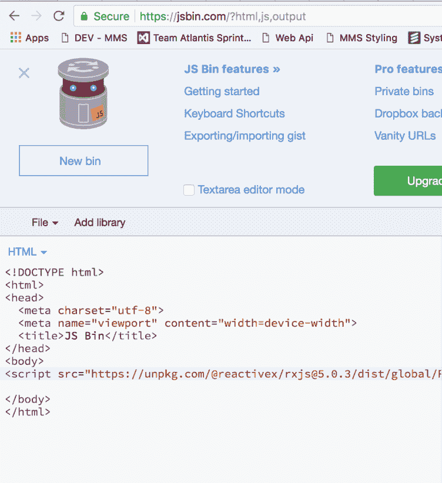
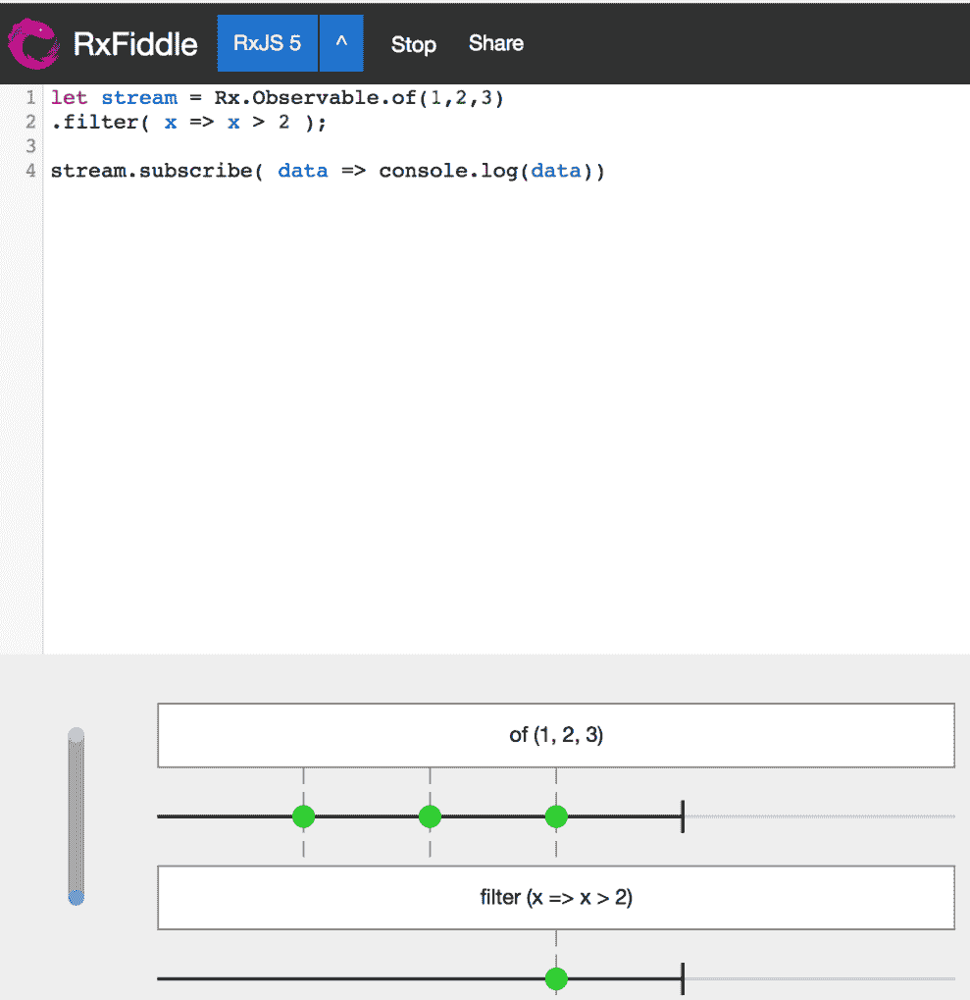
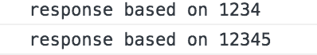

# 第六章：操作流及其值

让我们从回顾上一章开始，提醒自己我们已经对 RxJS 有了多深的理解。我们学习了诸如`Observable`、`Observer`和`Producer`等概念，以及它们是如何相互作用的。此外，我们还了解了订阅过程，以便我们实际上可以接收我们渴望的值。我们还研究了如何从流中取消订阅，以及在哪些情况下需要定义这种行为。最后，我们通过学习如何构建 RxJS 的核心实现，从而看到了所有这些概念的实际应用。拥有所有这些知识，我们应该对 RxJS 的基础感到相当自信，但正如上一章提到的，我们需要操作符的帮助来真正对我们的流做些有意义的事情。

让我们不再拖延，开始讨论本章内容。操作符是我们可以在流上调用的函数，可以以许多不同的方式执行操作。操作符是不可变的，这使得流易于推理，也将使测试变得相当容易。正如你将在本章中看到的那样，我们很少只处理一个流，而是处理许多流，理解如何构建和控制这些流将使你从认为它是*黑暗魔法*转变为实际上能够在需要时应用 RxJS。

在本章中，我们将涵盖以下内容：

+   如何使用基本操作符

+   使用操作符以及现有工具调试流

+   深入了解不同的操作符类别

+   培养以 Rx 方式解决问题的思维方式

# 开始

你几乎总是通过创建一个静态值的流来开始使用 RxJS 进行编码。为什么是静态值呢？好吧，没有必要让它变得过于复杂，而你真正需要开始推理的只是一个`Observable`。随着你在解决问题的过程中逐渐进步，你可能会用更合适的 AJAX 调用或来自其他异步源值的调用来替换静态值。

然后，你开始思考你想要实现的目标。这会让你考虑你可能需要的操作符以及它们的顺序。你也可能会考虑如何将问题分解；这通常意味着创建多个流，其中每个流解决一个特定的问题，这些问题与你试图解决的更大问题相连接。

让我们从创建流开始，看看我们如何迈出与流一起工作的第一步。

以下代码创建了一个静态值的流：

```js
const staticValuesStream$ = Rx.Observable.of(1, 2, 3, 4);

staticValuesStream$.subscribe(data => console.log(data)); 
// emits 1, 2, 3, 4
```

这是一个非常基础的例子，展示了我们如何创建一个流。我们使用`of()`创建操作符，它接受任意数量的参数。所有参数都会在有订阅者时依次发出。在上面的代码中，我们还通过调用`subscribe()`方法并传递一个以发出值为参数的函数来订阅`staticValuesStream$`。

让我们引入一个操作符 `map()`，它像一个投影一样工作，允许你改变正在发出的内容。`map()` 操作符在发出之前对流中的每个值进行调用。

你可以通过提供一个函数并执行一个投影来使用 `map()` 操作符，如下所示：

```js
const staticValuesStream$ = 
Rx.Observable
  .of(1, 2, 3, 4)
  .map(data => data + 1); 

staticValuesStream$.subscribe(data => console.log(data))
// emits 2, 3, 4, 5
```

在前面的代码中，我们将 `map()` 操作符附加到 `staticValuesStream$` 上，并在发出之前对每个值应用它，并将其增加一。因此，结果数据发生了变化。这就是将操作符附加到流上的方法：简单地创建流，或者使用现有的一个，然后逐个添加操作符。

让我们添加另一个操作符 `filter()`，以确保我们真正理解如何使用操作符。`filter()` 做什么？嗯，就像 `map()` 操作符一样，它应用于每个值，但它不是创建一个投影，而是决定哪些值将被发出。`filter()` 接收一个布尔值。任何评估为 `true` 的表达式意味着值将被发出；如果为 `false`，则表达式将不会发出。

你可以使用以下方式使用 `filter()` 操作符：

```js
const staticValuesStream$ = 
Rx.Observable
  .of(1, 2, 3, 4)
  .map(data => data + 1)
  .filter(data => data % 2 === 0 ); 

staticValuesStream$.subscribe(data => console.log(data));
// emits 2, 4
```

我们通过将其链接到现有的 `map()` 操作符来添加 `filter()` 操作符。我们给 `filter()` 操作符的条件是只对能被 `2` 整除的值返回 `true`，这就是模运算符的作用。我们知道从之前的内容中，`map()` 操作符本身确保了值 `2`、`3`、`4` 和 `5` 被发出。这些是现在由 `filter()` 操作符评估的值。在这四个值中，只有 `2` 和 `4` 满足 `filter()` 操作符设定的条件。

当然，当在流上工作并应用操作符时，事情可能并不总是像前面的代码那样简单。可能无法准确预测将发出什么。在这些场合，我们有一些技巧可以使用。其中一种技巧是使用 `do()` 操作符，这将允许我们检查每个值而不改变它。这为我们提供了充足的机会来用于调试目的。根据我们在流中的位置，`do()` 操作符将输出不同的值。让我们看看 `do()` 操作符应用时不同情况下的不同影响：

```js
const staticValuesStream$ = 
Rx.Observable.of(1, 2, 3, 4)
  .do(data => console.log(data)) // 1, 2, 3, 4 
  .map(data => data + 1)
  .do(data => console.log(data)) // 2, 3, 4, 5
  .filter(data => data % 2 === 0 )
  .do(data => console.log(data)); // 2, 4 

// emits 2, 4
staticValuesStream$.subscribe(data => console.log(data))
```

如您所见，仅通过使用 `do()` 操作符，我们就有了调试流的好方法，随着流复杂性的增加，这变得是必要的。

# 理解操作符

到目前为止，我们已经展示了如何创建一个流，并在它上面使用一些非常基本的运算符来改变发出的值。我们还介绍了如何使用 `do()` 运算符在不改变流的情况下检查流。并不是所有的运算符都像 `map()`、`filter()` 和 `do()` 运算符那样容易理解。你可以使用不同的策略来尝试理解每个运算符的作用，以便你知道何时使用它们。使用 `do()` 运算符是一种方法，但还有一种图形化的方法可以采用。这种方法被称为弹珠图。它由一个代表时间从左到右流逝的箭头组成。在这个箭头上有一些代表发出的值的圆圈或弹珠。弹珠中有一个值，但弹珠之间的距离也可能描述了随时间发生的事情。弹珠图通常至少由两个带有弹珠的箭头和一个运算符组成。其想法是表示应用运算符后流发生了什么。第二个箭头通常表示结果流。

这里是一个弹珠图的例子：


RxJS 中的大多数运算符都在 RxMarbles 网站上用弹珠图表示：[`rxmarbles.com/`](http://rxmarbles.com/)。这是一个真正伟大的资源，可以快速了解运算符的作用。然而，要真正理解 RxJS，你需要编写代码；这是不可避免的。当然，有不同方法可以做到这一点。你可以轻松设置自己的项目并从 NPM 安装 RxJS，通过 CDN 链接引用它，或者你可以使用像 JS Bin ([www.jsbin.com](http://www.jsbin.com)) 这样的页面，它让你能够轻松地将 RxJS 作为库添加，并允许你立即开始编码。它看起来像这样：



JS Bin 让开始变得容易，但如果我们能将弹珠图和 JS Bin 结合起来，并得到你编码时的图形表示，那岂不是更好？你可以用 RxFiddle 实现这一点：[`rxfiddle.net/`](http://rxfiddle.net/)。你可以输入你的代码，点击运行，然后你会看到一个弹珠图，显示你刚刚编写的代码，它看起来像这样：



# 流中的流

我们一直在研究不同的运算符，它们会改变正在发出的值。流还有一个不同的方面：如果你需要从一个现有的流中创建一个新的流怎么办？另一个好问题是：这种情况下通常在什么时候发生？有很多情况，例如：

+   基于 keyup 事件流进行 AJAX 调用。

+   计算点击次数并确定用户是单击、双击还是三击。

你应该明白了；我们从一个需要变成另一种类型的流的流类型开始。

让我们先看看如何创建一个流，并看看当我们尝试使用运算符创建流时会发生什么：

```js
let stream$ = Rx.Observable.of(1,2,3)
  .map(data => Rx.Observable.of(data));

// Observable, Observable, Observable
stream$.subscribe(data => console.log(data));
```

在这个阶段，通过`map()`操作符传递的每个值都会产生一个新的`Observable`。当你订阅`stream$`时，每个发出的值都将是一个流。你的第一个本能可能是为这些值中的每一个都附加一个`subscribe()`，就像这样：

```js
let stream$ = Rx.Observable
  .of(1,2,3)
  .map(data => Rx.Observable.of(data))

stream$.subscribe(data => {
  data.subscribe(val => console.log(val))
});

// 1, 2, 3
```

抵制这种冲动。这将只会创建难以维护的代码。你想要做的是将这些流合并成一个，这样你只需要一个`subscribe()`。有一个操作符正是为此而设计的，称为`flatMap()`。`flatMap()`的作用是将你的流数组转换成一个流，一个元流。

它的使用方式如下：

```js
let stream$ = Rx.Observable.of(1,2,3)
  .flatMap(data => Rx.Observable.of(data))

stream$.subscribe(data => {
  console.log(val);
});

// 1, 2, 3
```

好的，我们明白了，我们不想得到一个 Observable 流，而是一个值流。这个操作符看起来真的很棒。但我们仍然不确定何时使用它。让我们使这个例子更现实一些。想象一下，你有一个由一个输入字段组成的 UI。用户将字符输入到这个输入字段中。想象一下，你想要对输入的一个或多个字符做出反应，例如，在字符输入后执行一个 AJAX 请求。在这里，我们关注两个问题：如何收集输入的字符以及如何执行 AJAX 请求。

让我们从第一件事开始，捕捉输入字段中输入的字符。为此，我们需要一个 HTML 页面和一个 JavaScript 页面。让我们从 HTML 页面开始：

```js
<html>
  <body>
    <input id="input" type="text">
    <script src="img/Rx.min.js"></script>
    <script src="img/app.js"></script>
  </body>
</html>

```

这展示了我们的输入元素和 RxJS 的脚本引用，以及`app.js`文件的引用。然后是`app.js`文件，其中我们获取输入元素的引用，并在输入被输入时立即开始监听按键：

```js
let elem = document.getElementById('input');
let keyStream$ = Rx.Observable
  .fromEvent(elem, 'keyup')
  .map( ev => ev.key);

keyStream$.subscribe( key => console.log(key));

// emits entered key chars
```

值得强调的是，我们通过调用`fromEvent()`创建操作符来开始监听由`keyup`事件发出的内容。然后，我们应用`map()`操作符来挖掘`ev.key`上的字符值存储。最后，我们订阅这个流。正如预期的那样，运行这段代码将在你输入 HTML 页面中的值时立即在控制台中打印出输入的字符。

让我们通过基于我们输入的内容执行一个 AJAX 请求来使这个例子更具体。为此，我们将使用`fetch()` API 和一个名为 swapi（swapi.com）的在线 API，它包含了一系列包含《星球大战》电影信息的 API。让我们首先定义我们的 AJAX 调用，然后看看它如何融入我们现有的键流中。

我们说过我们会使用`fetch()`。它允许我们像这样简单地制定一个 GET 请求：

```js
fetch('https://swapi.co/api/people/1')
  .then(data => data.json())
  .then(data => console.log('data', data));
```

当然，我们希望将这个请求转换成一个`Observable`，以便它能很好地与我们的`keyStream$`协同工作。幸运的是，通过使用`from()`操作符，我们可以轻松地实现这一点。然而，让我们首先将`fetch()`调用重写成一个易于操作的方法。重写后的结果如下：

```js
function getStarwarsCharacterStream(id) {
  return fetch('https://swapi.co/api/people/' + id)
    .then(data => data.json());
}

```

这段代码允许我们提供一个用于构造 URL 的参数，我们使用它通过 AJAX 获取一些数据。在这个阶段，我们准备将我们的函数连接到现有的流。我们通过输入以下内容来实现这一点：

```js
let keyStream$ = Rx.Observable.fromEvent(elem, 'keyup')
  .map(ev => ev.key)
  .filter(key => key !== 'Backspace')
 .flatMap( key =>
    Rx.Observable
      .from(getStarwarsCharacterStream(key))
  );

```

我们使用`from()`转换操作符以粗体形式突出显示`flatMap()`操作符的使用。最后提到的操作符将我们的`getStarwarsCharacterStream()`函数作为参数。`from()`操作符将此函数转换为流。

在这里，我们学习了如何连接两个不同的流，以及如何将`Promise`转换为流。尽管这种方法在纸面上看起来很好，但使用`flatMap()`有其局限性，了解这些局限性非常重要。因此，让我们接下来谈谈`switchMap()`操作符。使用`switchMap()`操作符的好处将在执行长时间运行的任务时变得更加明显。为了论证，让我们定义这样一个任务，如下所示：

```js
function longRunningTask(input) {
  return new Promise(resolve => {
    setTimeout(() => {
      resolve('response based on ' + input);
    }, 5000);
  });
}
```

在此代码中，我们有一个执行需要 5 秒钟的函数；这足以展示我们试图说明的点。接下来，让我们展示如果我们继续在以下代码中使用`flatMap()`操作符会产生什么效果：

```js
let longRunningStream$ = keyStream$
  .map(ev => ev.key)
  .filter(key => elem.value.length >3)
  .filter( key => key !== 'Backspace')
  .flatMap( key =>
    Rx.Observable
      .from(longRunningTask(elem.value))
  );

longRunningStream$.subscribe(data => console.log(data));
```

上述代码的工作方式如下：每次我们按下键，它都会生成一个事件。然而，我们有一个`.filter()`操作符，它确保只有当至少输入了四个键时才会生成事件，`filter(key => elem.value.length >3)`。让我们谈谈此时用户的期望。如果一个用户在一个输入控件中输入键，他们最可能期望在完成输入时发起一个请求。用户定义完成输入为输入一些字符，并且如果输入错误，他们应该能够删除字符。因此，我们可以假设以下输入序列：

```js
// enters abcde
abcde
// removes 'e'
```

到目前为止，他们已经输入了字符，并在合理的时间内编辑了他们的答案。用户期望根据`abcd`得到一个答案。然而，使用`flatMap()`操作符意味着用户将得到两个答案，因为在现实中，他们输入了`abcde`和`abcd`。想象一下，如果我们根据这两个输入得到一个结果列表；它很可能是两个看起来有些不同的列表。基于我们代码的响应将看起来像这样：



我们的代码很可能能够通过在收到新响应时立即重新渲染结果列表来处理所描述的情况。然而，这里有两个问题：首先，我们对`abcde`进行了不必要的网络请求，其次，如果后端响应足够快，我们将在结果列表渲染一次后，基于第二个响应再次渲染，从而在 UI 中看到闪烁。这不是一个好的情况，我们希望有一个情况，即如果我们继续输入，第一个请求将被放弃。这就是`switchMap()`操作符发挥作用的地方。它确实做到了这一点。因此，让我们将前面的代码更改为以下代码：

```js
let longRunningStream$ = keyStream$
  .map(ev => ev.key)
  .filter(key => elem.value.length >3)
  .filter( key => key !== 'Backspace')
  .switchMap( key =>
    Rx.Observable
    .from(longRunningTask(elem.value))
  );
```

在此代码中，我们只是将`flatMap()`切换为`switchMap()`。当我们现在以完全相同的方式执行代码时，即用户首先输入`12345`，然后很快将其更改为`1234`，最终结果是：


如我们所见，我们只得到一个请求。这是因为当发生新事件时，前一个事件会被中止——`switchMap()` 正在施展它的魔法。用户很高兴，我们也很高兴。

# AJAX

我们已经触及了制作 AJAX 请求的主题。有许多方法可以制作 AJAX 请求；最常见的方法有两种：

+   使用 fetch API；fetch API 是一个网络标准，因此内置在大多数浏览器中

+   使用内置在 RxJS 库中的 `ajax()` 方法；它曾经存在于一个名为 Rx.Dom 的库中

# fetch()

`fetch()` API 是一个网络标准。您可以在以下链接中找到官方文档：[`developer.mozilla.org/en-US/docs/Web/API/Fetch_API`](https://developer.mozilla.org/en-US/docs/Web/API/Fetch_API)。`fetch()` API 是基于 `Promise` 的，这意味着在使用之前我们需要将其转换为 `Observable`。该 API 暴露了一个 `fetch()` 方法，它以强制性的 URL 参数作为第一个参数，第二个参数是一个可选对象，允许您控制发送哪个正文（如果有），使用哪个 HTTP 动词，等等。

我们已经在 RxJS 的上下文中提到了如何最好地处理它。尽管如此，这仍然值得重复。但这并不像只是将我们的 fetch 操作符放入 `from()` 操作符中那么简单。让我们写一些代码来看看原因：

```js
let convertedStream$ = 
Rx.Observable.from(fetch('some url'));

convertedStream$.subscribe(data => 'my data?', data);
```

我们得到了我们的数据吗？抱歉，没有，我们得到了一个 `Response` 对象。但这很容易，只需在 `map()` 操作符中调用一个 `json()` 方法，然后我们肯定就有数据了？再次抱歉，没有，当你输入以下内容时，`json()` 方法返回一个 `Promise`：

```js
let convertedStream$ = Rx.Observable.from(fetch('some url'))
  .map( r=> r.json());

// returns PromiseObservable
convertedStream$.subscribe(data => 'my data?', data);
```

我们已经在上一节中展示了可能的解决方案，如下所示：

```js
getData() {
  return fetch('some url')
    .then(r => r.json());
}

let convertedStream$ = Rx.Observable.from(getData());
convertedStream$.subscribe(data => console.log('data', data));
```

在这段代码中，我们所做的是在将数据交给 `from()` 操作符之前简单地处理我们的数据。与 RxJS 不太一样，感觉与 Promise 玩耍。你可以采取一个更基于流的方案；我们几乎做到了，我们只需要做一些小的调整：

```js
let convertedStream$ = Rx.Observable.from(fetch('some url'))
  .flatMap( r => Rx.Observable.from(r.json()));

// returns data
convertedStream$.subscribe(data => console.log('data'), data);
```

就这样：我们的 `fetch()` 调用现在像流一样提供数据。那么我们做了什么？嗯，我们将 `map()` 调用更改为 `flatMap()` 调用。这样做的原因是当我们调用 `r.json()` 时，我们得到了一个 `Promise`。我们通过将其包裹在 `from()` 调用中，`Rx.Observable.from(r.json())` 来解决这个问题。如果不将 `map()` 更改为 `flatMap()`，那么流将发出一个 `PromiseObservable`。正如我们在上一节中学到的，如果我们冒着在流中创建流的危险，我们需要 `flatMap()` 来拯救我们，它确实做到了。

# ajax() 操作符

与基于 `Promise` 的 `fetch()` API 不同，`ajax()` 方法实际上是基于 `Observable` 的，这使得我们的工作变得稍微容易一些。使用它非常直接，如下所示：

```js
Rx.Observable
  .ajax('https://swapi.co/api/people/1')
  .map(r => r.response)
  .subscribe(data => console.log('from ajax()', data));
```

如我们所见，前面的代码使用 URL 作为参数调用`ajax()`操作符。值得提及的第二件事是调用`map()`操作符，它从`response`属性中提取我们的数据。因为它是一个`Observable`，我们只需像往常一样通过调用`subscribe()`方法并给它提供一个监听函数作为参数来订阅它。

这涵盖了当你想使用 HTTP 动词`GET`获取数据时的简单情况。幸运的是，对于我们的需求来说，通过使用重载版本的`ajax()`操作符来创建、更新或删除数据相当容易，这个操作符接受一个`AjaxRequest`对象实例，它具有以下字段：

```js
url?: string;
body?: any;
user?: string;
async?: boolean;
method?: string;
headers?: Object;
timeout?: number;
password?: string;
hasContent?: boolean;
crossDomain?: boolean;
withCredentials?: boolean;
createXHR?: () => XMLHttpRequest;
progressSubscriber?: Subscriber<any>;
responseType?: string;
```

从这个对象规范中我们可以看出，所有字段都是可选的，我们还可以通过我们的请求配置相当多的事情，例如`headers`、`timeout`、`user`、`crossDomain`等等；基本上这是我们期望从良好的 AJAX 包装功能中得到的。除了`ajax()`操作符的重载之外，还存在一些简写选项：

+   `get()`: 使用`GET`动词获取数据

+   `put()`: 使用`PUT`动词更新数据

+   `post()`: 使用`POST`动词创建数据

+   `patch()`: 使用`PATCH`动词的目的是更新部分资源

+   `delete()`: 使用`DELETE`动词删除数据

+   `getJSON()`: 使用`GET`动词获取数据，并将响应类型设置为`application/json`

# 级联调用

到目前为止，我们已经介绍了你将使用 AJAX 发送或接收数据的两种主要方式。当涉及到接收数据时，通常并不像获取数据并渲染它那样简单。实际上，你很可能依赖于何时可以获取哪些数据。一个典型的例子是在获取剩余数据之前需要执行登录调用。在某些情况下，可能需要首先登录，然后获取登录用户的资料，一旦有了这些资料，就可以获取消息、订单或任何可能特定于某个用户的数据。这种以这种方式获取数据的现象被称为级联调用。

让我们看看如何使用承诺（Promises）进行级联调用，并逐步学习如何使用 RxJS 做同样的事情。我们之所以这样做，是因为我们假设大多数阅读这本书的人对承诺（Promises）都很熟悉。

让我们看看我们最初提到的依赖情况，我们需要按以下顺序执行以下步骤：

1.  用户首先登录到系统中

1.  然后我们获取用户的资料

1.  然后我们获取用户订单的信息

使用承诺（promises），代码中可能看起来是这样的：

```js
// cascading/cascading-promises.js

login()
  .then(getUser)
  .then(getOrders);

// we collect username and password from a form
const login = (username, password) => {
  return fetch("/login", {
    method: "POST",
    body: { username, password }
  })
  .then(r => r.json())
  .then(token => {
    localStorage.setItem("auth", token);
  });
};

const getUser = () => {
  return fetch("/users", {
    headers: {
      Authorization: "Bearer " + localStorage.getToken("auth")
    }
  }).then(r => r.json());
};

const getOrders = user => {
  return fetch(`/orders/user/${user.id}`, {
    headers: {
      Authorization: "Bearer " + localStorage.getToken("auth")
    }
  }).then(r => r.json());
};
```

这段代码描述了我们首先使用`login()`方法登录系统，并获取一个令牌。我们使用这个令牌在未来的任何调用中确保我们进行认证调用。我们还看到我们如何执行`getUser()`调用并获取一个用户实例。我们使用相同的用户实例来执行我们的最后一个调用`getOrders()`，其中用户 ID 用作路由参数：`` `/orders/user/${user.id}` ``。

我们已经展示了如何使用承诺（promises）来执行级联调用；我们这样做是为了为我们要解决的问题建立一个共同的基础。RxJS 的方法非常相似：我们已经展示了`ajax()`操作符的存在，并且当处理 AJAX 调用时，它使我们的生活变得更简单。为了使用 RxJS 实现级联调用效果，我们只需简单地使用`switchMap()`操作符。这将使我们的代码看起来像这样：

```js
// cascading/cascading-rxjs.js

let user = "user";
let password = "password";

login(user, password)
  .switchMap(getUser)
  .switchMap(getOrders);

// we collect username and password from a form
const login = (username, password) => {
  return Rx.Observable.ajax("/login", {
    method: "POST",
    body: { username, password }
  })
  .map(r => r.response)
  .do(token => {
    localStorage.setItem("auth", token);
  });
};

const getUser = () => {
  return Rx.Observable.ajax("/users", {
    headers: {
      Authorization: "Bearer " + localStorage.getToken("auth")
    }
  }).map(r => r.response);
};

const getOrders = user => {
  return Rx.Observable.json(`/orders/user/${user.id}`, {
    headers: {
      Authorization: "Bearer " + localStorage.getToken("auth")
    }
  }).map(r => r.response);
};
```

我们已经指出了前面代码中需要更改的部分。简而言之，更改如下：

+   `fetch()`被`ajax()`操作符替换

+   我们调用`.map(r => r.response)`而不是`.then(r => r.json())`

+   我们对每个级联调用执行`.switchMap()`调用，而不是`.then(getOrders)`

还有一个有趣的方面需要我们探讨，那就是并行调用。当我们获取用户和订单时，我们在发起下一个调用之前等待前一个调用完全完成。在很多情况下，这可能并不是严格必要的。想象一下，我们有一个与之前类似的情况，但围绕用户有很多有趣的信息我们需要获取。除了获取订单之外，用户可能还有一个朋友集合或消息集合。获取这些数据的前提条件只是我们已经获取了用户，因此我们知道应该查询哪个朋友集合以及需要查询哪个消息集合。在承诺的世界中，我们会使用`Promise.all()`构造来实现并行化。考虑到这一点，我们更新我们的`Promise`代码，使其看起来像这样：

```js
// parallell/parallell-promise.js

// we collect username and password from a form
login(username, password) {
  return new Promise(resolve => {
    resolve('logged in');
  });
}

getUsersData(user) {
  return Promise.all([
    getOrders(user),
    getMessages(user),
    getFriends(user) 
    // not implemented but you get the idea, another call in parallell
  ])
}

getUser() {
  // same as before
}

getOrders(user) {
  // same as before
}

login()
  .then(getUser)
  .then(getUsersData);
```

如前所述的代码所示，我们引入了新的`getUsersData()`方法，该方法并行获取订单、消息和朋友集合，使我们的应用更快地响应，因为数据将比逐个获取更快地到达。

我们可以通过引入`forkJoin()`操作符轻松地使用 RxJS 实现相同的效果。它接受一系列流，并并行获取所有内容。因此，我们更新我们的 RxJS 代码，使其看起来如下：

```js
// parallell/parallell-rxjs.js

import Rx from 'rxjs/Rx';
// imagine we collected these from a form
let user = 'user';
let password = 'password';

login(user, password)
  .switchMap(getUser)
  .switchMap(getUsersData)

// we collect username and password from a form
login(username, password) {
  // same as before
}

getUsersData(user) {
  return Rx.Observable.forkJoin([
    getOrders(),
    getMessages(),
    getFriends()
  ])
}

getUser() {
  // same as before
}

getOrders(user) {
  // same as before
}

login()
  .then(getUser)
  .then(getUsersData);
```

# 深入探讨

到目前为止，我们已经查看了一些可以让你使用`map()`和`filter()`操作符创建或更改流的操作符，我们学习了如何管理不同的 AJAX 场景，等等。基础是有的，但我们还没有以结构化的方式真正接近操作符的话题。我们这是什么意思呢？嗯，操作符可以被认为是属于不同的类别。我们可用的操作符数量令人震惊，有 60 多个。如果我们真的要学习所有这些，这将需要时间。不过，这里的关键是：我们只需要知道存在哪些不同类型的操作符，这样我们就可以在适当的地方应用它们。这减少了我们的认知负担和记忆。一旦我们知道有哪些类别，我们只需要深入挖掘，很可能会最终知道总共 10-15 个操作符，其余的我们可以在需要时查阅。

目前，我们有以下类别：

+   **创建操作符**：这些操作符帮助我们首先创建流。几乎任何东西都可以通过这些操作符转换为流。

+   **组合操作符**：这些操作符帮助我们结合值以及流。

+   **数学操作符**：这些操作符对正在发射的值执行数学评估。

+   **基于时间的操作符**：这些操作符改变值发射的速度。

+   **分组操作符**：这些操作符的思路是对一组值而不是单个值进行操作。

# 创建操作符

我们使用创建操作符来创建流本身，因为坦白说：我们需要转换为流的东西并不总是流，但通过将其转换为流，它将必须与其他流很好地协同工作，最好的是，将能够利用使用操作符的全部力量。

那么，这些其他非流由什么组成呢？嗯，可以是任何异步或同步的内容。重要的是，这些是需要在某一点发射的数据。因此，存在一系列创建操作符。在接下来的小节中，我们将展示所有这些操作符中的一部分，足够你认识到将任何事物转换为流的力量。

# of()操作符

我们已经有机会使用这个操作符几次了。它接受未知数量的以逗号分隔的参数，可以是整数、字符串或对象。如果你只想发射一组有限的值，这是一个你想要使用的操作符。要使用它，只需输入：

```js
// creation-operators/of.js

const numberStream$ = Rx.Observable.of(1,2, 3);
const objectStream$ = Rx.Observable.of({ age: 37 }, { name: "chris" });

// emits 1 2 3
numberStream$.subscribe(data => console.log(data));

// emits { age: 37 }, { name: 'chris' }
objectStream$.subscribe(data => console.log(data));
```

从代码中可以看出，我们在`of()`操作符中放置什么内容其实并不重要，它无论如何都能发射出来。

# from()操作符

这个操作符可以接受数组或`Promise`作为输入，并将它们转换为流。要使用它，只需像这样调用：

```js
// creation-operators/from.js

const promiseStream$ = Rx.Observable.from(
  new Promise(resolve => setTimeout(() => resolve("data"),3000))
);

const arrayStream$ = Rx.Observable.from([1, 2, 3, 4]);

promiseStream$.subscribe(data => console.log("data", data));
// emits data after 3 seconds

arrayStream$.subscribe(data => console.log(data));
// emits 1, 2, 3, 4
```

这样做可以节省我们很多麻烦，不必处理不同类型的异步调用。

# range()操作符

这个操作符允许你指定一个范围，一个起始数字和一个结束数字。这是一个很好的简写，可以快速创建一个具有数字范围的流。要使用它，只需输入：

```js
// creation-operators/range.js

const stream$ = Rx.Observable.range(1,99);

stream$.subscribe(data => console.log(data));
// emits 1... 99 
```

# fromEvent() 操作符

现在事情变得非常有趣。`fromEvent()`操作符允许我们将 UI 事件（如`click`或`scroll`事件）混合起来，并将其转换成一个流。到目前为止，我们一直假设异步调用只与 AJAX 调用有关。这远非事实。我们可以将 UI 事件与任何类型的异步调用混合，这创造了一个非常有趣的情况，使我们能够编写非常强大、表达力丰富的代码。我们将在下一节中进一步探讨这个话题，*在流中思考*。

要使用这个操作符，你需要给它提供两个参数：一个 DOM 元素和事件名称，如下所示：

```js
// creation-operators/fromEvent.js

// we imagine we have an element in our DOM looking like this <input id="id" />
const elem = document.getElementById("input");
const eventStream$ = Rx.Observable
  .fromEvent(elem, "click")
  .map(ev => ev.key);

// outputs the typed key
eventStream$.subscribe(data => console.log(data));
```

# 组合

组合操作符是关于组合不同流中的值。我们有几个操作符可以帮助我们。当我们需要从多个地方而不是一个地方获取数据时，这种类型的操作符是有意义的。如果没有我们即将描述的强大操作符，从不同来源组合数据结构可能会很繁琐且容易出错。

# merge() 操作符

`merge()`操作符从不同的流中获取数据并将其合并。然而，这些流可以是任何类型，只要它们是`Observable`类型。这意味着我们可以将定时操作、承诺、`of()`操作符的静态数据等的数据组合起来。合并所做的就是交错发出的数据。这意味着在以下示例中，它将同时从两个流中发出。使用这个操作符有两种方式，作为静态方法，也可以作为实例方法：

```js
// combination/merge.js

let promiseStream = Rx.Observable
.from(new Promise(resolve => resolve("data")))

let stream = Rx.Observable.interval(500).take(3);
let stream2 = Rx.Observable.interval(500).take(5);

// instance method version of merge(), emits 0,0, 1,1 2,2 3, 4
stream.merge(stream2)
  .subscribe(data => console.log("merged", data));

// static version of merge(), emits 0,0, 1,1, 2, 2, 3, 4 and 'data'
Rx.Observable.merge(
  stream,
  stream2,
  promiseStream
)
.subscribe(data => console.log("merged static", data));
```

这里的要点是，如果你只需要将一个流与另一个流组合，那么使用这个操作符的实例方法版本，但如果你有多个流，那么使用静态版本。此外，指定流的顺序也很重要。

# combineLatest()

想象一下，你与几个提供数据的端点建立了连接。你所关心的是每个端点发出的最新数据。你可能处于这样的情况：一段时间后，一个或多个端点停止发送数据，你想要知道最后发生了什么。在这种情况下，我们希望能够结合所有相关端点的最新值。这就是`combineLatest()`操作符发挥作用的地方。你可以按照以下方式使用它：

```js
// combination/combineLatest.js

let firstStream$ = Rx.Observable
  .interval(500)
  .take(3);

let secondStream$ = Rx.Observable
  .interval(500)
  .take(5);

let combinedStream$ = Rx.Observable.combineLatest(
  firstStream$,
  secondStream$
)

// emits [0, 0] [1,1] [2,2] [2,3] [2,4] [2,5]
combinedStream$.subscribe(data => console.log(data));
```

我们可以看到，由于`take()`操作符限制了项目数量，`firstStream$`在一段时间后停止发出值。然而，`combineLatest()`操作符确保我们仍然得到了`firstStream$`发出的最后一个值。

# zip()

这个运算符的目的是尽可能多地拼接值。我们可能正在处理连续的流，也可能在处理有值数限制的流。你使用这个运算符的方式如下：

```js
// combination/zip.js

let stream$ = Rx.Observable.of(1, 2, 3, 4);
let secondStream$ = Rx.Observable.of(5, 6, 7, 8);
let thirdStream$ = Rx.Observable.of(9, 10); 

let zippedStream$ = Rx.Observable.zip(
  stream$,
  secondStream$,
  thirdStream$
)

// [1, 5, 9] [2, 6, 10]
zippedStream$.subscribe(data => console.log(data))
```

如我们所见，在这里，我们垂直拼接值，并通过最小公倍数，`thirdStream$` 是最短的，计算发出的值的数量。这意味着我们将从左到右取值并将它们压缩在一起。由于 `thirdStream$` 只有两个值，我们最终只发出两个值。

# concat()

初看，`concat()` 运算符看起来像另一个 `merge()` 运算符，但这并不完全正确。区别在于 `concat()` 会等待其他流完成后再从下一个流中发出流。你在调用 `concat()` 时的流排列方式很重要。运算符的使用方式如下：

```js
// combination/concat.js

let firstStream$ = Rx.Observable.of(1,2,3,4);
let secondStream$ = Rx.Observable.of(5,6,7,8);

let concatStream$ = Rx.Observable.concat(
  firstStream$,
  secondStream$
);

concatStream$.subscribe(data => console.log(data));
```

# 数学

数学运算符是执行数学运算的运算符，例如找到最大或最小值，汇总所有值等。

# max

`max()` 运算符用于找到最大值。它有两种形式：我们或者不带参数直接调用 `max()` 运算符，或者提供一个 `compare` 函数。然后 `compare` 函数决定某个值是否大于、小于或等于一个发出的值。让我们看看两种不同的版本：

```js
// mathematical/max.js

let streamWithNumbers$ = Rx.Observable
  .of(1,2,3,4)
  .max();

// 4
streamWithNumbers$.subscribe(data => console.log(data)); 

function comparePeople(firstPerson, secondPerson) {
  if (firstPerson.age > secondPerson.age) {
    return 1; 
  } else if (firstPerson.age < secondPerson.age) {
    return -1;
  } 
  return 0;
}

let streamOfObjects$ = Rx.Observable
  .of({
    name : "Yoda",
    age: 999
  }, {
    name : "Chris",
    age: 38 
  })
  .max(comparePeople);

// { name: 'Yoda', age : 999 }
streamOfObjects$.subscribe(data => console.log(data));
```

我们可以从前面的代码中看到，我们得到一个结果，并且它是最大的。

# min

`min()` 运算符基本上是 `max()` 运算符的相反；它有两种形式：带参数和不带参数。它的任务是找到最小值。要使用它，请输入：

```js
// mathematical/min.js

let streamOfValues$ = Rx.Observable
  .of(1, 2, 3, 4)
  .min();

// emits 1
streamOfValues$.subscribe(data => console.log(data));

```

# sum

曾经有一个名为 `sum()` 的运算符，但它在几个版本中已经不存在了。取而代之的是 `.reduce()`。使用 `reduce()` 运算符，我们可以轻松地实现相同的功能。以下是如何使用 `reduce()` 编写 `sum()` 运算符的示例：

```js
// mathematical/sum.js

let stream = Rx.Observable.of(1, 2, 3, 4)
  .reduce((acc, curr) => acc + curr);

// emits 10
stream.subscribe(data => console.log(data));
```

这个运算符的作用是遍历所有发出的值并将结果相加。所以，本质上，它汇总了所有内容。当然，这种运算符不仅可以应用于数字，也可以应用于对象。区别在于你如何执行 `reduce()` 操作。以下示例涵盖了这种情况：

```js
let stream = Rx.Observable.of({ name : "chris" }, { age: 38 })
  .reduce((acc, curr) => Object.assign({},acc, curr));

// { name: 'chris', age: 38 }
stream.subscribe(data => console.log(data)); 
```

如前述代码所示，`reduce()` 运算符确保所有对象的属性都合并到一个对象中。

# 时间

当谈论流时，时间是一个非常重要的概念。想象一下，你有多个具有不同带宽的流，或者一个流比另一个流快，或者你有一个在特定时间间隔内重试 AJAX 调用的场景。在这些所有情况下，我们需要控制数据发出的速度，时间在这些场景中都起着重要作用。在我们手中，有一大堆运算符，就像魔术师一样，使我们能够根据需要构建和控制我们的值。

# `interval()`操作符

在 JavaScript 中，有一个`setInterval()`函数，允许你以固定的时间间隔执行代码，直到你选择停止它。RxJS 有一个与此行为相同的操作符，即`interval()`操作符。它接受一个参数：通常是发出值之间的毫秒数。你可以按以下方式使用它：

```js
// time/interval.js

let stream$ = Rx.Observable.interval(1000);

// emits 0, 1, 2, 3 ... n with 1 second in between emits, till the end of time
stream$.subscribe(data => console.log(data));
```

注意：这个操作符会一直发出，直到你停止它。停止它的最佳方法是将其与一个`take()`操作符结合。`take()`操作符接受一个参数，指定在停止之前它想要发出多少个值。更新后的代码如下：

```js
// time/interval-take.js

let stream$ = Rx.Observable.interval(1000)
  .take(2);

// emits 0, 1, stops emitting thanks to take() operator
stream$.subscribe(data => console.log(data));
```

# `timer()`操作符

`timer()`操作符的任务是在一定时间后发出值。它有两种风味：你可以在一定毫秒数后发出一个值，或者你可以在它们之间保持一定的延迟继续发出值。让我们看看可用的两种不同风味：

```js
// time/timer.js

let stream$ = Rx.Observable.timer(1000);

// delay with 500 milliseconds
let streamWithDelay$ = Rx.Observable.timer(1000, 500) 

// emits 0 after 1000 milliseconds, then no more
stream$.subscribe(data => console.log(data));

streamWithDelay$.subscribe(data => console.log(data));
```

# `delay()`操作符

`delay()`操作符延迟所有发出值，并按以下方式使用：

```js
// time/delay.js

let stream$ = Rx.Observable
.interval(100)
.take(3)
.delay(500);

// 0 after 600 ms, 1 after 1200 ms, 2 after 1800 ms
stream.subscribe(data => console.log(data));
```

# `sampleTime()`操作符

`sampleTime()`操作符用于在样本周期过后才发出值。一个很好的用例是当你想要有一个*冷却*功能。想象一下，你有用户频繁地按保存按钮。保存可能需要几秒钟才能完成。一种方法是保存时禁用保存按钮。另一种有效的方法是简单地忽略按钮的任何点击，直到操作有机会完成。以下代码正是这样做的：

```js
// time/sampleTime.js

let elem = document.getElementById("btn");
let stream$ = Rx.Observable
  .fromEvent(elem, "click")
  .sampleTime(8000);

// emits values every 8th second
stream$.subscribe(data => console.log("mouse clicks",data));

```

# `debounceTime()`操作符

`sampleTime()`操作符能够忽略用户一段时间，但`debounceTime()`操作符采取了不同的方法。防抖作为一个概念意味着我们在发出值之前等待事情平静下来。想象一下用户输入的输入元素。用户最终会停止输入。我们想确保用户确实已经停止了，所以我们等待一段时间后才真正采取行动。这正是`debounceTime()`操作符为我们做的事情。以下示例展示了我们如何监听用户在输入元素中输入，等待用户停止输入，最后执行一个 AJAX 调用：

```js
// time/debounceTime.js
const elem = document.getElementById("input");

let stream$ = Rx.Observable.fromEvent(elem, "keyup")
  .map( ev => ev.key)
  .filter(key => key !== "Backspace")
  .debounceTime(2000)
  .switchMap( x => {
    return new Rx.Observable.ajax(`https://swapi.co/api/people/${elem.value}`);
  })
  .map(r => r.response);

stream$.subscribe(data => console.log(data));
```

当用户在文本框中输入一个数字时，在 2 秒的无操作后，keyup 事件将被触发。之后，将使用我们的文本框输入执行一个 AJAX 调用。

# 分组

分组操作符允许我们对一组收集的事件进行操作，而不是一次只对一个发出的事件进行操作。

# `buffer()`操作符

`buffer()`操作符的想法是我们可以收集大量事件，而无需立即发出。该操作符本身接受一个参数，一个`Observable`，它定义了何时停止收集事件。在那个时刻，我们可以选择对这些事件做什么。以下是你可以使用此操作符的方法：

```js
// grouping/buffer.js

const elem = document.getElementById("input");

let keyStream$ = Rx.Observable.fromEvent(elem,"keyup");
let breakStream$ = keyStream$.debounceTime(2000);
let chatStream$ = keyStream$
  .map(ev => ev.key)
  .filter(key => key !== "Backspace")
  .buffer(breakStream$)
  .switchMap(newContent => Rx.Observable.of("send text as I type", newContent));

chatStream$.subscribe(data=> console.log(data));

```

这所做的是收集事件，直到有 2 秒的空闲时间。在那个时刻，我们释放所有已经缓冲起来的关键事件。当我们释放所有这些事件时，例如，我们可以通过 AJAX 将它们发送到某个地方。这在聊天应用中是一个典型的场景。使用前面的代码，我们总是可以发送最新输入的字符。

# bufferTime()运算符

与`buffer()`非常相似的运算符是`bufferTime()`。这个运算符允许我们指定我们希望缓冲事件多长时间。它比`buffer()`稍微灵活一些，但仍然非常有用。

# 流式思维

到目前为止，我们已经经历了一系列场景，这些场景展示了我们有哪些运算符可供使用，以及它们如何被串联起来。我们还看到了像`flatMap()`和`switchMap()`这样的运算符如何在我们从一种类型的可观察对象移动到另一种类型时真正改变事情。那么，当与可观察对象一起工作时，你应该采取哪种方法？显然，我们需要使用运算符来表示一个算法，但我们应该从哪里开始呢？我们首先需要做的是思考起点和终点。我们想要捕获哪些类型的事件，最终结果应该是什么样子？这已经给我们提供了关于我们需要执行多少转换才能达到那里的线索。如果我们只想转换数据，那么我们可能只需要一个`map()`运算符和一个`filter()`运算符。如果我们想从一个`Observable`转换到下一个，那么我们需要一个`flatMap()`或`switchMap()`。我们是否有特定的行为，比如等待用户停止输入？如果有，那么我们需要查看`debounceTime()`或类似的运算符。这实际上与所有问题是一样的：分解问题，看看你有哪些部分，分解并征服。不过，让我们尝试将其分解成一系列步骤：

+   输入是什么？UI 事件或其他什么？

+   输出是什么？最终结果是什么？

+   根据第二个要点，我需要哪些转换才能达到目标？

+   我是否需要处理多个流？

+   我是否需要处理错误，如果是的话，应该如何处理？

希望这能让你了解如何思考流。记住，从小处着手，逐步实现你的目标。

# 摘要

我们着手学习更多关于基本操作符的知识。在这个过程中，我们遇到了`map()`和`filter()`操作符，它们使我们能够控制被发射的内容。对`do()`操作符的了解为我们提供了调试流的方法。此外，我们还了解了存在沙盒环境，例如 JS Bin 和 RxFiddle，以及它们如何帮助我们快速开始使用 RxJS。接下来，我们深入探讨了 AJAX 这一主题，并构建了对可能出现的不同场景的理解。在深入 RxJS 的过程中，我们研究了不同的操作符类别。我们对这一点只是略作了解，但它为我们提供了一种方法来了解库中哪些类型的操作符。最后，我们通过探讨如何改变和发展我们的思维方式来思考流，结束了这一章节。

正是凭借所有这些获得的知识，我们现在准备进入下一章更高级的 Rx 主题。我们掌握了基础知识，现在是时候精通它们了。
