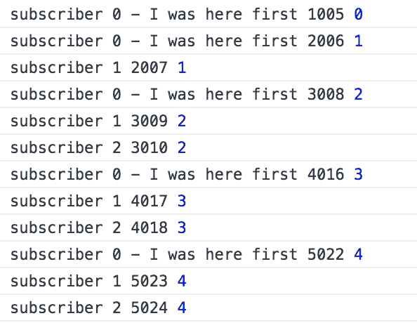
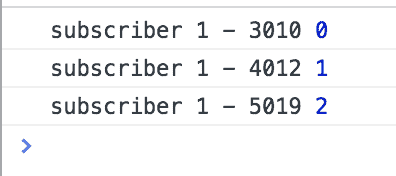
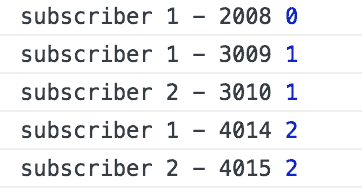
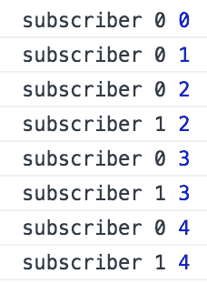
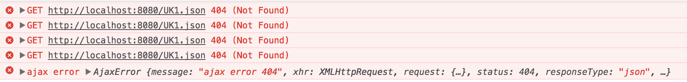

# 第七章：RxJS 高级

我们刚刚完成了最后一章，本章让我们更多地了解了有哪些操作符以及如何有效地利用它们。有了这些知识，我们现在将更深入地探讨这个主题。我们将从了解存在哪些部分，到真正理解 RxJS 的本质。了解 RxJS 的本质涉及到了解是什么让它运转。为了揭示这一点，我们需要涵盖诸如热、温、冷观测量之间的区别；了解主题及其用途；以及有时被忽视的主题——调度器。

我们还想要涵盖与 Observable 一起工作的其他方面，特别是如何处理错误以及如何测试您的观测量。

在本章中，您将了解以下内容：

+   热观测量、冷观测量和温观测量

+   主题：它们与 Observable 的区别，以及何时使用它们

+   可管道操作符，RxJS 库中的最新增项，以及它们如何影响您组合观测量的方式

+   大理石测试，这是帮助您测试观测量的测试设备

# 热观测量、冷观测量和温观测量

存在着热、冷、温观测量。我们实际上是什么意思呢？首先，让我们说，您将处理的大部分内容都是冷观测量。这有帮助吗？如果没有帮助？那么，让我们先谈谈 Promise。Promise 是热的。它们之所以是热的，是因为当我们执行它们的代码时，它会立即发生。让我们看看一个例子：

```js
// hot-cold-warm/promise.js

function getData() {
  return new Promise(resolve => {
    console.log("this will be printed straight away");
    setTimeout(() => resolve("some data"), 3000); 
  });
}

// emits 'some data' after 3 seconds
getData().then(data => console.log("3 seconds later", data));
```

如果您来自非 RxJS 背景，您在这个时候可能会想：好吧，是的，这正是我预期的。不过，我们想要表达的观点是：调用`getData()`会使您的代码立即运行。这与 RxJS 不同，因为在 RxJS 中，类似的代码实际上只有在存在一个关心结果的监听器/订阅者时才会运行。RxJS 回答了古老的哲学问题：如果森林里没有人来听，树倒下会发出声音吗？在 Promise 的情况下，会。在 Observable 的情况下，则不会。让我们用一个类似的代码示例来澄清我们刚才所说的，使用 RxJS 和 Observable：

```js
// hot-cold-warm/observer.js

const Rx = require("rxjs/Rx");

function getData() {
  return Rx.Observable(observer => {
    console.log("this won't be printed until a subscriber exists");
    setTimeout(() => {
      observer.next("some data");
      observer.complete();
    }, 3000);
  });
}

// nothing happens
getData();
```

在 RxJS 中，这样的代码被认为是冷的，或者说是懒的。我们需要一个订阅者才能使某些事情真正发生。我们可以添加一个订阅者，如下所示：

```js
// hot-cold-warm/observer-with-subscriber

const Rx = require("rxjs/Rx");

function getData() {
  return Rx.Observable.create(observer => {
    console.log("this won't be printed until a subscriber exists");

    setTimeout(() => {
      observer.next("some data");
      observer.complete();
    }, 3000);
  });
}

const stream$ = getData();
stream$.subscribe(data => console.log("data from observer", data));
```

这是 Observables 与 Promises 行为之间的一大区别，了解这一点很重要。这是一个冷 Observables；那么，什么是热 Observables 呢？在这个时候，人们可能会认为热 Observables 是立即执行的东西；然而，这不仅仅是那样。关于什么是热 Observables 的官方解释之一是，任何订阅它的东西都会与其他订阅者共享生产者。生产者是 Observables 内部内部产生值的来源。这意味着数据是共享的。让我们看看冷 Observables 订阅场景，并将其与热 Observables 订阅场景进行对比。我们将从冷场景开始：

```js
// hot-cold-warm/cold-observable.js
const Rx = require("rxjs/Rx");

const stream$ = Rx.Observable.interval(1000).take(3);

// subscriber 1 emits 0, 1, 2
stream$.subscribe(data => console.log(data));

// subscriber 2, emits 0, 1, 2
stream$.subscribe(data => console.log(data));

// subscriber 3, emits 0, 1, 2, after 2 seconds
setTimeout(() => {
  stream$.subscribe(data => console.log(data)); 
}, 3000);
```

在前面的代码中，我们有三个不同的订阅者，它们各自接收发出的值的副本。每次我们添加一个新的订阅者时，值都是从开始处开始的。当我们查看前两个订阅者时，这可能是个预期。至于第三个订阅者，它是在两秒后作为订阅者添加的。是的，甚至那个订阅者也会收到它自己的值集。解释是每个订阅者在订阅时都会收到它自己的生产者。

在热 Observables 的情况下，只有一个生产者，这意味着上述场景将会有不同的表现。让我们写下热 Observables 场景的代码：

```js
// hot observable scenario

// subscriber 1 emits 0, 1, 2
hotStream$.subscribe(data => console.log(data));

// subscriber 2, emits 0, 1, 2
hotStream$.subscribe(data => console.log(data));

// subscriber 3, emits 2, after 2 seconds
setTimeout(() => {
  hotStream$.subscribe(data => console.log(data)); 
}, 3000);
```

第三个订阅者只输出值`2`的原因是其他值已经发出。第三个订阅者没有看到这一发生。在第三个值发出时，它出现了，这就是它接收值`2`的原因。

# 使流变热

这个`hotStream$`是如何创建的呢？你确实说过大多数创建的流都是冷的吗？我们有一个操作符专门用于此，实际上有两个操作符。我们可以通过使用`publish()`和`connect()`操作符将流从冷变为热。让我们从一个冷 Observables 开始，并添加提到的操作符，如下所示：

```js
// hot-cold-warm/hot-observable.js

const Rx = require("rxjs/Rx");

let start = new Date();
let stream = Rx.Observable
  .interval(1000)
  .take(5)
  .publish();

setTimeout(() => {
  stream.subscribe(data => {
    console.log(`subscriber 1 ${new Date() - start}`, data);
  });
}, 2000);

setTimeout(() => {
  stream.subscribe(data => {
    console.log(`subscriber 2 ${new Date() - start}`, data)
  });
}, 3000);

stream.connect();
stream.subscribe(
  data => console.log(
    `subscriber 0 - I was here first ${new Date() - start}`, 
    data
  )
);
```

从前面的代码中我们可以看到，我们创建了一个 Observable，并指示它每秒发出一个值。此外，它应该在发出五个值后停止。然后我们调用`publish()`操作符。这使我们处于准备模式。然后我们设置在两秒和三秒后分别发生的几个订阅。然后我们调用流上的`connect()`。这将使流从热变为冷。因此，我们的流开始发出值，任何订阅者，无论何时开始订阅，都将与任何未来的订阅者共享生产者。最后，我们在`connect()`调用后立即添加一个订阅者。让我们通过以下截图来展示输出结果：



我们的第一位订阅者在 1 秒后开始发出值。第二位订阅者在又过了 1 秒后开始工作。这次它的值是`1`，它错过了第一个值。又过了 1 秒，第三位订阅者被附加。该订阅者发出的第一个值是`2`，它错过了前两个值。我们清楚地看到`publish()`和`connect()`运算符如何帮助我们创建热可观察对象，同时也看到开始订阅热可观察对象的重要性。

我为什么要用热可观察对象呢？它的应用领域在哪里？嗯，想象一下你有一个实时流，一场足球比赛，你将其流式传输给许多订阅者/观众。他们不想看到比赛开始的第一分钟发生的事情，而是想看到比赛当前的状态，在订阅的时间（当他们坐在电视机前的时候）。所以，确实存在一些情况下，热可观察对象是最佳选择。

# 温流

到目前为止，我们一直在描述和讨论冷可观察对象和热可观察对象，但还有一种第三种类型：温可观察对象。温可观察对象可以想象成是一个冷可观察对象，但在某些条件下变成了热可观察对象。让我们通过引入`refCount()`运算符来看一个这样的例子：

```js
// hot-cold-warm/warm-observer.js

const Rx = require("rxjs/Rx");

let warmStream = Rx.Observable.interval(1000).take(3).publish().refCount();
let start = new Date();

setTimeout(() => {
  warmStream.subscribe(data => {
    console.log(`subscriber 1 - ${new Date() - start}`,data);
  });
}, 2000);
```

好吧，所以我们开始使用`publish()`运算符，看起来我们即将使用`connect()`运算符，并且有一个热可观察对象，对吧？嗯，是的，但我们的做法不是调用`connect()`，而是调用`refCount()`。这个运算符会加热我们的可观察对象，使得当第一个订阅者到来时，它会表现得像冷可观察对象。好吗？这听起来就像一个冷可观察对象，对吧？让我们先看看输出结果：



为了回答前面的问题，是的，它确实表现得就像一个冷的可观察对象；我们没有错过任何发出的值。有趣的事情发生在我们得到第二个订阅者的时候。让我们添加第二个订阅者，看看会有什么效果：

```js
// hot-cold-warm/warm-observable-subscribers.js

const Rx = require("rxjs/Rx");

let warmStream = Rx.Observable.interval(1000).take(3).publish().refCount();
let start = new Date();

setTimeout(() => {
  warmStream.subscribe(data => {
    console.log(`subscriber 1 - ${new Date() - start}`,data);
  });
}, 1000);

setTimeout(() => {
  warmStream.subscribe(data => {
    console.log(`subscriber 2 - ${new Date() - start}`,data);
  });
}, 3000);
```

第二位订阅者被添加；现在，让我们看看结果是什么：



从上面的结果中我们可以看到，第一位订阅者是唯一接收数字`0`的人。当第二位订阅者到来时，它的第一个值是`1`，这证明了流从表现得像冷可观察对象转变为热可观察对象。

我们还可以通过使用`share()`运算符来做温可观察对象。`share()`运算符可以看作是一个更智能的运算符，它允许我们的可观察对象根据情况从冷状态变为热状态。有时候这确实是个好主意。所以，对于可观察对象有以下几种情况：

+   作为热可观察对象创建；流还没有完成，而且没有任何订阅者的订阅次数超过一次

+   回退为冷可观察对象；在新的订阅到达之前，任何之前的订阅都已经结束

+   作为冷可观察对象（cold Observable）创建；在订阅发生之前，可观察对象本身已经完成

让我们尝试用代码来展示第一点可以发生的情况：

```js
// hot-cold-warm/warm-observable-share.js

const Rx = require("rxjs/Rx");

let stream$ = Rx.Observable.create((observer) => {
  let i = 0;
  let id = setInterval(() => {
    observer.next(i++);
  }, 400);

  return () => {
    clearInterval(id);
  };
}).share();

let sub0, sub;

// first subscription happens immediately
sub0 = stream$.subscribe(
  (data) => console.log("subscriber 0", data),
  err => console.error(err),
  () => console.log("completed"));

// second subscription happens after 1 second
setTimeout(() => {
  sub = stream$.subscribe(
  (data) => console.log("subscriber 1", data),
  err => console.error(err),
  () => console.log("completed"));
}, 1000);

// everything is unscubscribed after 2 seconds
setTimeout(() => {
  sub0.unsubscribe();
  sub.unsubscribe();
}, 2000);
```

上述代码描述了一种情况，我们定义了一个带有立即发生的订阅的流。第二个订阅在一秒后发生。现在，根据`share()`操作符的定义，这意味着流将作为一个冷可观察对象创建，但在第二个订阅者到达时，它将变成热可观察对象，因为有一个预先存在的订阅者，并且流尚未完成。让我们检查我们的输出以验证这一点：



第一个订阅者似乎在它得到的值中是明显独立的。当第二个订阅者到达时，它似乎与生产者共享，因为它不是从零开始，而是从第一个订阅者所在的位置开始监听。

# 主题（Subjects）

我们习惯于以某种方式使用可观察对象（Observables）。我们从某个东西构建它们，并开始监听它们发出的值。通常，我们几乎无法在创建点之后影响正在发出的内容。当然，我们可以改变和过滤它，但除非我们将它与其他流合并，否则几乎不可能向我们的`Observable`添加更多内容。让我们看看当我们真正控制可观察对象（Observables）发出内容时的情况，使用`create()`操作符：

```js
let stream$ = Rx.Observable.create(observer => {
  observer.next(1);
  observer.next(2);
});

stream$.subscribe(data => console.log(data));
```

我们看到可观察对象（Observable）就像一个包装器，围绕真正发出我们值的对象——观察者（Observer）。在我们的观察者实例中，观察者正在调用`next()`，并传递一个参数来发出值——这些值是我们通过`subscribe()`方法监听的。

本节是关于主题（Subject）的。主题与可观察对象（Observable）的不同之处在于它可以在创建后影响流的内容。让我们通过以下代码片段来看看这一点：

```js
// subjects/subject.js

const Rx = require("rxjs/Rx");

let subject = new Rx.Subject();

// emits 1
subject.subscribe(data => console.log(data));

subject.next(1);
```

我们首先注意到的是，我们只是调用构造函数，而不是像在可观察对象（Observable）上那样使用`create()`或`from()`等工厂方法。第二件事是我们注意到在第二行我们订阅了它，而只有在最后一行我们才通过调用`next()`来发出值。为什么代码要按照这种顺序编写呢？好吧，如果我们不这样写，并且`next()`调用发生在第二件事，我们的订阅就不会存在，值会立即发出。尽管如此，我们知道两件事是确定的：我们正在调用`next()`，我们正在调用`subscribe()`，这使得`Subject`具有双重性质。我们之前还提到`Subject`能够做到的另一件事：在创建后改变流。我们的`next()`调用实际上就是在做这件事。让我们添加更多的调用，以确保我们真正理解这个概念：

```js
// subjects/subjectII.js

const Rx = require("rxjs/Rx");

let subject = new Rx.Subject();

// emits 10 and 100 2 seconds after
subject.subscribe(data => console.log(data));
subject.next(10);

setTimeout(() => {
  subject.next(100);
}, 2000);
```

如我们之前所述，我们对`next()`方法的每一次调用都能影响流；我们在`subscribe()`方法中看到，每次对`next()`的调用都会触发`subscribe()`，或者技术上，我们传递给它的第一个函数。

# 使用主题进行级联列表

那么，重点是什么？为什么我们应该使用主题而不是可观察对象？这实际上是一个相当深刻的问题。解决大多数与流相关的问题有很多方法；对于那些诱使我们使用主题的问题，通常可以通过其他方式解决。尽管如此，让我们看看我们可以用它来做什么。让我们来谈谈级联下拉列表。我们所说的意思是，我们想知道一个城市中存在哪些餐馆。想象一下，因此，我们有一个下拉列表，允许我们选择我们感兴趣的国家。一旦我们选择了一个国家，我们应该从城市下拉列表中选择我们感兴趣的城市。然后，我们可以从餐馆列表中进行选择，最后选择我们感兴趣的餐馆。在标记中，它可能看起来像这样：

```js
// subjects/cascading.html

<html>
<body>
  <select id="countries"></select>
  <select id="cities"></select>
  <select id="restaurants"></select>

  <script src="img/Rx.min.js"></script>
  <script src="img/cascadingIV.js"></script>
</body>
</html>

```

在应用程序开始时，我们还没有选择任何内容，唯一被选中的下拉列表是第一个，它填充了国家。想象一下，因此，我们在 JavaScript 中设置了以下代码：

```js
// subjects/cascadingI.js

let countriesElem = document.getElementById("countries");
let citiesElem = document.getElementBtyId("cities");
let restaurantsElem = document.getElementById("restaurants");

// talk to /cities/country/:country, get us cities by selected country
let countriesStream = Rx.Observable.fromEvent(countriesElem, "select");

// talk to /restaurants/city/:city, get us restaurants by selected restaurant
let citiesStream = Rx.Observable.fromEvent(citiesElem, "select");

// talk to /book/restaurant/:restaurant, book selected restaurant
let restaurantsElem = Rx.Observable.fromEvent(restaurantsElem, "select");

```

到目前为止，我们已经确定我们想要监听每个下拉列表的选择事件，并且我们想要在国家和城市下拉列表的情况下过滤即将到来的下拉列表。比如说我们选择了一个特定的国家，那么我们希望重新填充/过滤城市下拉列表，使其只显示所选国家的城市。对于餐馆下拉列表，我们希望根据我们的餐馆选择进行预订。听起来很简单，对吧？我们需要一些订阅者。城市下拉列表需要监听国家下拉列表的变化。因此，我们将此添加到我们的代码中：

```js
// subjects/cascadingII.js

let countriesElem = document.getElementById("countries");
let citiesElem = document.getElementBtyId("cities");
let restaurantsElem = document.getElementById("restaurants");

fetchCountries();

function buildList(list, items) {
  list.innerHTML ="";
  items.forEach(item => {
    let elem = document.createElement("option");
    elem.innerHTML = item;
    list.appendChild(elem);
  });
}

function fetchCountries() {
  return Rx.Observable.ajax("countries.json")
    .map(r => r.response)
    .subscribe(countries => buildList(countriesElem, countries.data));
}

function populateCountries() {
  fetchCountries()
    .map(r => r.response)
    .subscribe(countries => buildDropList(countriesElem, countries));
}

let cities$ = new Subject();
cities$.subscribe(cities => buildList(citiesElem, cities));

Rx.Observable.fromEvent(countriesElem, "change")
  .map(ev => ev.target.value)
  .do(val => clearSelections())
  .switchMap(selectedCountry => fetchBy(selectedCountry))
  .subscribe( cities => cities$.next(cities.data));

Rx.Observable.from(citiesElem, "select");

Rx.Observable.from(restaurantsElem, "select");
```

因此，在这里，当我们选择一个国家时，我们有一个执行 AJAX 请求的行为；我们得到一个过滤后的城市列表，并引入新的主题实例`cities$`。我们用过滤后的城市作为参数调用它的`next()`方法。最后，我们通过在流上调用`subscribe()`方法来监听`cities$`流的变化。如您所见，当数据到达时，我们在那里重建我们的城市下拉列表。

我们意识到我们的下一步是响应我们在城市下拉列表中进行选择时的变化。所以，让我们设置一下：

```js
// subjects/cascadingIII.js

let countriesElem = document.getElementById("countries");
let citiesElem = document.getElementBtyId("cities");
let restaurantsElem = document.getElementById("restaurants");

fetchCountries();

function buildList(list, items) {
  list.innerHTML = "";
  items.forEach(item => {
    let elem = document.createElement("option");
    elem.innerHTML = item;
    list.appendChild(elem);
  });
}

function fetchCountries() {
  return Rx.Observable.ajax("countries.json")
    .map(r => r.response)
    .subscribe(countries => buildList(countriesElem, countries.data));
}

function populateCountries() {
  fetchCountries()
    .map(r => r.response)
    .subscribe(countries => buildDropList(countriesElem, countries));
}

let cities$ = new Subject();
cities$.subscribe(cities => buildList(citiesElem, cities));

let restaurants$ = new Rx.Subject();
restaurants$.subscribe(restaurants => buildList(restaurantsElem, restaurants));

Rx.Observable.fromEvent(countriesElem, "change")
  .map(ev => ev.target.value)
  .do( val => clearSelections())
  .switchMap(selectedCountry => fetchBy(selectedCountry))
  .subscribe( cities => cities$.next(cities.data));

Rx.Observable.from(citiesElem, "select")
 .map(ev => ev.target.value)
  .switchMap(selectedCity => fetchBy(selectedCity))
  .subscribe( restaurants => restaurants$.next(restaurants.data)); // talk to /book/restaurant/:restaurant, book selected restaurant
Rx.Observable.from(restaurantsElem, "select");
```

在前面的代码中，我们添加了一些代码来响应我们城市下拉列表中的选择。我们还添加了一些代码来监听`restaurants$`流的变化，这最终导致了我们的餐厅下拉列表被重新填充。最后一步是监听我们在餐厅下拉列表中选择餐厅时的变化。这里应该发生什么取决于你，亲爱的读者。一个建议是查询一些 API 以获取所选餐厅的营业时间或菜单。发挥你的创造力。不过，我们将给你一些最终的订阅代码：

```js
// subjects/cascadingIV.js

let cities$ = new Rx.Subject();
cities$.subscribe(cities => buildList(citiesElem, cities));

let restaurants$ = new Rx.Subject();
restaurants$.subscribe(restaurants => buildList(restaurantsElem, restaurants));

function buildList(list, items) {
  list.innerHTML = "";
  items.forEach(item => {
    let elem = document.createElement("option");
    elem.innerHTML = item;
    list.appendChild(elem);
  });
}

function fetchCountries() {
  return Rx.Observable.ajax("countries.json")
    .map(r => r.response)
    .subscribe(countries => buildList(countriesElem, countries.data));
}

function fetchBy(by) {
  return Rx.Observable.ajax(`${by}.json`)
  .map(r=> r.response);
}

function clearSelections() {
  citiesElem.innerHTML = "";
  restaurantsElem.innerHTML = "";
}

let countriesElem = document.getElementById("countries");
let citiesElem = document.getElementById("cities");
let restaurantsElem = document.getElementById("restaurants");

fetchCountries();

Rx.Observable.fromEvent(countriesElem, "change")
  .map(ev => ev.target.value)
  .do(val => clearSelections())
  .switchMap(selectedCountry => fetchBy(selectedCountry))
  .subscribe(cities => cities$.next(cities.data));

Rx.Observable.fromEvent(citiesElem, "change")
  .map(ev => ev.target.value)
  .switchMap(selectedCity => fetchBy(selectedCity))
  .subscribe(restaurants => restaurants$.next(restaurants.data));

Rx.Observable.fromEvent(restaurantsElem, "change")
  .map(ev => ev.target.value)
  .subscribe(selectedRestaurant => console.log("selected restaurant", selectedRestaurant));
```

这个代码示例相当长，应该指出的是，这并不是解决这类问题的最佳方式，但它确实展示了 Subject 的工作原理：它可以在想要的时候向流中添加值，并且可以被订阅。

# BehaviorSubject

到目前为止，我们一直在查看 Subject 的默认类型，并揭露了一些它的秘密。然而，还有许多其他类型的 Subject。其中一种有趣的 Subject 类型是`BehaviorSubject`。那么，为什么我们需要`BehaviorSubject`，它有什么用呢？好吧，当我们处理默认 Subject 时，我们能够向流中添加值，以及订阅流。`BehaviorSubject`给我们提供了一些额外的能力，形式如下：

+   一个起始值，如果我们能在等待 AJAX 调用完成时向 UI 展示一些内容，那就太好了

+   我们可以查询最新值；在某些情况下，知道最后一个发出的值是什么很有趣

针对第一个要点，让我们编写一些代码并展示这一功能：

```js
// subjects/behavior-subject.js

let behaviorSubject = new Rx.BehaviorSubject("default value");

// will emit 'default value'
behaviorSubject.subscribe(data => console.log(data));

// long running AJAX scenario
setTimeout(() => {
  return Rx.Observable.ajax("data.json")
    .map(r => r.response)
    .subscribe(data => behaviorSubject.next(data));
}, 12000);
```

# ReplaySubject

对于一个普通的 Subject，我们开始订阅的时间很重要。如果我们在我们设置订阅之前开始发出值，这些值就会简单地丢失。如果我们有一个`BehaviorSubject`，我们有一个稍微好一点的场景。即使我们订阅得晚，已经发出了一个值，我们仍然可以访问到最后一个发出的值。那么，接下来的问题是：如果在订阅发生之前发出了两个或更多值，而我们又关心这些值，那么会发生什么？

让我们通过一个场景来展示 Subject 和`BehaviorSubject`分别会发生什么：

```js
// example of emitting values before subscription

const Rx = require("rxjs/Rx");

let subject = new Rx.Subject();
subject.next("subject first value");

// emits 'subject second value'
subject.subscribe(data => console.log("subscribe - subject", data));
subject.next("subject second value");

let behaviourSubject = new Rx.BehaviorSubject("behaviorsubject initial value");
behaviourSubject.next("behaviorsubject first value");
behaviourSubject.next("behaviorsubject second value");

// emits 'behaviorsubject second value', 'behaviorsubject third value' 
behaviourSubject.subscribe(data =>
  console.log("subscribe - behaviorsubject", data)
);

behaviourSubject.next("behaviorsubject third value");
```

从前面的代码中我们可以看到，如果我们关心在我们订阅之前的值，Subject 不是一个好的选择。`BehaviorSubject`构造函数在这种情况下稍微好一些，但如果我们真的关心之前的值，而且有很多这样的值，那么我们应该看看`ReplaySubject`。`ReplaySubject`有能力指定两件事：缓冲大小和窗口大小。缓冲大小简单地说是它应该记住过去多少个值，窗口大小指定了它应该记住它们多长时间。让我们通过代码来展示这一点：

```js
// subjects/replay-subject.js

const Rx = require("rxjs/Rx");

let replaySubject = new Rx.ReplaySubject(2);

replaySubject.next(1);
replaySubject.next(2);
replaySubject.next(3);

// emitting 2 and 3
replaySubject.subscribe(data => console.log(data));
```

在前面的代码中，我们可以看到我们发射了 `2` 和 `3`，即最后两个发射的值。这是因为我们在 `ReplaySubject` 构造函数中指定了缓冲区大小为 2。我们唯一丢失的值是 1。相反，如果我们构造函数中指定了 3，那么所有三个值都会到达订阅者。关于缓冲区大小及其工作原理就这么多；那么窗口大小属性呢？让我们用以下代码来说明它是如何工作的：

```js
// subjects/replay-subject-window-size.js

const Rx = require("rxjs/Rx");

let replaySubjectWithWindow = new Rx.ReplaySubject(2, 2000);
replaySubjectWithWindow.next(1);
replaySubjectWithWindow.next(2);
replaySubjectWithWindow.next(3);

setTimeout(() => {
  replaySubjectWithWindow.subscribe(data =>
    console.log("replay with buffer and window size", data));
  }, 
2010);
```

在这里，我们将窗口大小指定为 2,000 毫秒；这就是值应该在缓冲区中保持多长时间。我们可以在下面看到，我们延迟订阅的创建，使其在 2,010 毫秒后发生。结果是，不会发射任何值，因为缓冲区在订阅发生之前就已经清空了。窗口大小的更高值本可以解决这个问题。

# AsyncSubject

`AsyncSubject` 的容量为 1，这意味着我们可以发射大量的值，但只有最新的一个值会被存储。实际上，它也没有真正丢失，除非你完成流。让我们看看一段代码，它正好说明了这一点：

```js
// subjects/async-subject.js

let asyncSubject = new Rx.AsyncSubject();
asyncSubject.next(1);
asyncSubject.next(2);
asyncSubject.next(3);
asyncSubject.next(4);

asyncSubject.subscribe(data => console.log(data), err => console.error(err));

```

之前我们发射了四个值，但似乎没有任何东西到达订阅者。在这个时候，我们不知道这是因为它就像一个主题，扔掉了在订阅之前发生的所有发射的值，还是不是这样。因此，让我们调用 `complete()` 方法，看看结果如何：

```js
// subjects/async-subject-complete.js

let asyncSubject = new Rx.AsyncSubject();
asyncSubject.next(1);
asyncSubject.next(2);
asyncSubject.next(3);
asyncSubject.next(4);

// emits 4
asyncSubject.subscribe(data => console.log(data), err => console.error(err));
asyncSubject.complete();

```

这将发射一个 `4`，因为 `AsyncSubject` 只记得最后一个值，而我们正在调用 `complete()` 方法，从而发出流完成的信号。

# 错误处理

错误处理是一个非常大的话题。这是一个容易被低估的领域。通常，在编码时，我们可能会认为我们只需要做某些事情，比如确保我们没有语法错误或运行时错误。对于流来说，我们主要考虑运行时错误。问题是，当发生错误时，我们应该怎么做？我们应该假装下雨，只是扔掉错误吗？我们应该希望在未来尝试相同的代码时得到不同的结果，或者当存在某种类型的错误时，我们可能只是放弃？让我们尝试整理我们的思路，看看 RxJS 中存在的不同错误处理方法。

# 捕获并继续

总有一天，我们会遇到一个会抛出错误的流。让我们看看它可能是什么样子：

```js
// example of a stream with an error

let stream$ = Rx.Observable.create(observer => {
  observer.next(1);
  observer.error('an error is thrown');  
  observer.next(2);
});

stream$.subscribe(
  data => console.log(data), // 1 
  error => console.error(error) // 'error is thrown'
);
```

在前面的代码中，我们设置了一个场景，首先发射一个值，然后发射一个错误。第一个值被捕获在我们的 `subscribe` 方法中的第一个回调中。第二个发射的内容，即错误，被我们的错误回调捕获。第三个发射的值没有发送给我们的订阅者，因为我们的流已经被错误中断。我们可以在这里做的是使用 `catch()` 操作符。让我们将其应用到我们的流中，看看会发生什么：

```js
// error-handling/error-catch.js
const Rx = require("rxjs/Rx");

let stream$ = Rx.Observable.create(observer => {
  observer.next(1);
  observer.error("an error is thrown");
  observer.next(2);
}).catch(err => Rx.Observable.of(err));

stream$.subscribe(
  data => console.log(data), // emits 1 and 'error is thrown'
  error => console.error(error)
);

```

在这里，我们使用`catch()`操作符捕获错误。在`catch()`操作符中，我们取我们的错误，并使用`of()`操作符将其作为正常的 Observable 发出。那么我们发出的`2`会发生什么呢？仍然没有成功。`catch()`操作符能够将我们的错误转换为一个正常的发出值；而不是错误，我们不会从流中获得所有值。

让我们看看当我们处理多个流时的一个场景：

```js
// example of merging several streams

let merged$ = Rx.Observable.merge(
  Rx.Observable.of(1),
  Rx.Observable.throw("err"),
  Rx.Observable.of(2)
);

merged$.subscribe(data => console.log("merged", data));
```

在上述场景中，我们合并了三个流。第一个流只发出数字`1`，没有其他任何东西被发出。这是因为我们的第二个流将所有内容都拆除了，因为它发出了一个错误。让我们尝试应用我们新发现的`catch()`操作符，看看会发生什么：

```js
// error-handling/error-merge-catch.js

const Rx = require("rxjs/Rx");

let merged$ = Rx.Observable.merge(
  Rx.Observable.of(1),
  Rx.Observable.throw("err").catch(err => Rx.Observable.of(err)),
  Rx.Observable.of(2)
);

merged$.subscribe(data => console.log("merged", data));
```

我们运行上述代码，并注意到`1`被发出，错误作为一个正常值被发出，最后甚至`2`也被发出了。我们的结论是，在流被合并到我们的流之前应用一个`catch()`操作符是一个好主意。

如前所述，我们也可以得出结论，`catch()`操作符能够阻止流仅仅因为错误而停止，但错误之后本应发出的其他值实际上已经丢失了。

# 忽略错误

如前所述，`catch()`操作符在确保一个发生错误的流在与其他流合并时不会引起任何问题方面做得很好。`catch()`操作符使我们能够捕获错误，调查它，并创建一个新的 Observable，它将发出一个值，就像什么都没发生一样。然而，有时你甚至不想处理发生错误的流。对于这样的场景，有一个不同的操作符，称为`onErrorResumeNext()`：

```js
// error-handling/error-ignore.js
const Rx = require("rxjs/Rx");

let mergedIgnore$ = Rx.Observable.onErrorResumeNext(
  Rx.Observable.of(1),
  Rx.Observable.throw("err"),
  Rx.Observable.of(2)
);

mergedIgnore$.subscribe(data => console.log("merge ignore", data));
```

使用`onErrorResumeNext()`操作符的含义是，第二个流，即发出错误的那个流，被完全忽略，而值`1`和`2`被发出。如果你的场景只是关心不发生错误的流，这是一个非常好的操作符。

# 重试

你可能出于不同的原因想要重试一个流。如果你的流正在处理 AJAX 调用，更容易想象为什么你想要这样做。有时，你所在的本地网络可能不可靠，或者你试图调用的服务可能因为某些原因暂时关闭。无论原因如何，你都会遇到一种情况，即调用该端点有时会回复答案，有时会返回 401 错误。我们在这里描述的是在流中添加重试逻辑的业务案例。让我们看看一个设计来失败的流：

```js
// error-handling/error-retry.js
const Rx = require("rxjs/Rx");

let stream$ = Rx.Observable.create(observer => {
  observer.next(1);
  observer.error("err");
})
.retry(3);

// emits 1 1 1 1 err
stream$
  .subscribe(data => console.log(data));
```

上述代码的输出是值`1`被发出四次，然后是我们的错误。发生的情况是我们流的值在错误回调被触发之前被重试了三次。使用`retry()`操作符延迟了错误实际上被视为错误的时间。然而，前面的例子没有重试的必要，因为错误总是会发生的。因此，让我们看看更好的例子——一个网络连接可能会来也可能去的 AJAX 调用：

```js
// example of using a retry with AJAX

let ajaxStream$ = Rx.Observable.ajax("UK1.json")
  .map(r => r.response)
  .retry(3);

ajaxStream$.subscribe(
  data => console.log("ajax result", data),
  err => console.error("ajax error", err)
);
```

在这里，我们尝试对似乎不存在的文件发起一个 AJAX 请求。查看控制台，我们遇到了以下结果：



在上面的日志中，我们看到有四个失败的 AJAX 请求导致了错误。我们实际上已经将我们的简单流转换成了一个更可靠的 AJAX 请求流，具有相同的行为。如果文件突然开始存在，我们可能会遇到两次失败尝试和一次成功尝试的情况。然而，我们的方法有一个缺陷：我们过于频繁地重试我们的 AJAX 尝试。如果我们实际上在处理间歇性网络连接，我们需要在尝试之间设置某种延迟。尝试之间至少设置 30 秒或更长时间的延迟是合理的。我们可以通过使用一个稍微不同的重试操作符来实现这一点，该操作符接受毫秒数而不是尝试次数作为参数。它看起来如下所示：

```js
// retry with a delay

let ajaxStream$ = Rx.Observable.ajax("UK1.json")
  .do(r => console.log("emitted"))
  .map(r => r.response)
  .retryWhen(err => {
    return err.delay(3000);
  });
```

我们在这里使用的是`retryWhen()`操作符。`retryWhen()`操作符在其生命周期中的任务是返回一个流。在这个点上，你可以通过附加一个`.delay()`操作符来操作它返回的流，该操作符接受毫秒数。这样做的结果是它将无限期地重试 AJAX 调用，这可能不是你想要的。

# 高级重试

我们最可能想要的是将重试尝试之间的延迟与指定我们想要重试流多少次的能力结合起来。让我们看看我们如何实现这一点：

```js
// error-handling/error-retry-advanced.js

const Rx = require("rxjs/Rx");

let ajaxStream$ = Rx.Observable.ajax("UK1.json")
  .do(r => console.log("emitted"))
  .map(r => r.response)
  .retryWhen(err => {
    return err
    .delay(3000)
    .take(3);
});

```

这里有趣的部分是我们使用了`.take()`操作符。我们指定了从这个内部可观察对象中想要发出的值的数量。我们现在已经实现了一种很好的方法，使我们能够控制重试次数和重试之间的延迟。这个方法有一个我们没有尝试的方面，即我们希望所有重试何时结束。在前面的代码中，流在经过*x*次重试并且没有成功结果后只是完成了。然而，我们可能希望流出错。我们可以通过向代码中添加一个操作符来实现这一点，如下所示：

```js
// error-handling/error-retry-advanced-fail.js

let ajaxStream$ = Rx.Observable.ajax("UK1.json")
  .do(r => console.log("emitted"))
  .map(r => r.response)
  .retryWhen(err => {
    return err
    .delay(3000)
    .take(3)
    .concat(Rx.Observable.throw("giving up"));
});
```

在这里，我们添加了一个`concat()`操作符，它添加了一个只失败的流。因此，我们保证在三次失败尝试后会发生错误。这通常比在*x*次失败尝试后流默默地完成要好。

虽然这不是一个完美的方法；想象一下，你想调查你得到什么类型的错误。在 AJAX 请求的情况下，我们得到的 HTTP 状态码是 400 多还是 500 多，这很重要。它们意味着不同的事情。对于 500 错误，后端可能出了大问题，我们可能想立即放弃。然而，对于 404 错误，这表明资源不存在，但在间歇性网络连接的情况下，这意味着由于我们的连接离线，资源无法访问。因此，404 错误可能值得重试。要在代码中解决这个问题，我们需要检查发出的值以确定要做什么。我们可以使用 `do()` 操作符来检查值。

在以下代码中，我们调查响应的 HTTP 状态类型并确定如何处理它：

```js
// error-handling/error-retry-errorcodes.js

const Rx = require("rxjs/Rx");

function isOkError(errorCode) {
  return errorCode >= 400 && errorCode < 500;
}

let ajaxStream$ = Rx.Observable.ajax("UK1.json")
  .do(r => console.log("emitted"))
  .map(r => r.response)
  .retryWhen(err => {
    return err
      .do(val => {
        if (!isOkError(val.status) || timesToRetry === 0) {
          throw "give up";
        }
      })
      .delay(3000);
  });
```

# Marble 测试

测试异步代码可能具有挑战性。一方面，我们有时间因素。我们指定用于我们精心设计的算法的操作符的方式导致算法执行时间从 2 秒到 30 分钟不等。因此，一开始可能会觉得测试它没有意义，因为它无法在合理的时间内完成。尽管如此，我们有一种测试 RxJS 的方法；它被称为 Marble 测试，它允许我们控制时间流逝的速度，以便我们可以在毫秒内执行测试。

我们已经知道了 Marble 的概念。我们可以表示一个或多个流以及操作符对一或多个流产生的影响。我们通过将流绘制成线条，将值绘制成线条上的圆圈来实现这一点。操作符显示在输入流下面的动词。接下来的操作符是一个第三流，即通过将输入流应用操作符得到的结果，也就是所谓的 marble 图。线条代表一个连续的时间线。我们采用这个概念并将其应用于测试。这意味着我们可以将我们的输入值表示为图形表示，并对其应用我们的算法，然后对结果进行断言。

# 设置

让我们正确设置我们的环境，以便我们可以编写 marble 测试。我们需要以下内容：

+   NPM 库 jasmine-marbles

+   搭建 Angular 应用程序

通过这样，我们搭建了我们的 Angular 项目，如下所示：

```js
ng new MarbleTesting
```

在项目搭建完成后，是时候添加我们的 NPM 库了，如下所示：

```js
cd MarbleTesting
npm install jasmine-marbles --save
```

现在我们已经完成了设置，所以是时候编写测试了。

# 编写你的第一个 marble 测试

让我们创建一个新的文件 `marble-testing.spec.ts`。它应该看起来像以下这样：

```js
// marble-testing\MarbleTesting\src\app\marble-testing.spec.ts

import { cold } from "jasmine-marbles";
import "rxjs/add/operator/map";

describe("marble tests", () => {
  it("map - should increase by 1", () => {
    const one$ = cold("x-x|", { x: 1 });
    expect(one$.map(x => x + 1)).toBeObservable(cold("x-x|", { x: 2 }));
  });
});
```

在这里正在发生许多有趣的事情。我们从 NPM 库 marble-testing 中导入 `cold()` 函数。之后，我们通过调用 `describe()` 来设置测试套件，然后通过调用 `it()` 来指定测试规范。然后我们调用我们的 `cold()` 函数并给它提供一个字符串。让我们仔细看看这个函数调用：

```js
const stream$ = cold("x-x|", { x: 1 });
```

上述代码设置了一个期望发出两个值然后流结束的流。我们如何知道这一点？现在是时候解释 `x-x|` 的含义了。`x` 是任何值，横线 `-` 表示时间已经过去。管道 `|` 表示我们的流已经结束。在 `cold` 函数的第二个参数是一个映射对象，它告诉我们 `x` 的含义。在这种情况下，它已经意味着值 1。

接下来，让我们看看下一行：

```js
expect(stream$.map(x => x + 1)).toBeObservable(cold("x-x|", { x: 2 }));
```

上述代码应用了 `.map()` 操作符，并将每个在流中发出的值增加了一个。之后，我们调用 `.toBeObservable()` 辅助方法，并验证它是否满足预期的条件，

```js
cold("x-x|", { x: 2 })
```

之前的状态表明我们期望流应该发出两个值，但这两个值现在应该具有数字 2。这很有道理，因为我们的 `map()` 函数正是这样做的。

# 通过更多的测试来完善

让我们再写一个测试。这次我们将测试 `filter()` 操作符。这个操作符很有趣，因为它会过滤掉不满足特定条件的值。我们的测试文件现在应该看起来像下面这样：

```js
import { cold } from "jasmine-marbles";
import "rxjs/add/operator/map";
import "rxjs/add/operator/filter";

describe("marble testing", () => {
  it("map - should increase by 1", () => {
    const one$ = cold("x-x|", { x: 1 });
    expect(one$.map(x => x + 1)).toBeObservable(cold("x-x|", { x: 2 }));
  });

  it("filter - should remove values", () => {
    const stream$ = cold("x-y|", { x: 1, y: 2 });
    expect(stream$.filter(x => x > 1)).toBeObservable(cold("--y|", { y: 2 }));
  });
});
```

这个测试的设置基本上和我们的第一个测试一样。这次我们使用 `filter()` 操作符，但突出的是我们期望的流：

```js
cold("--y|", { y: 2 })
```

`--y` 表示我们的第一个值被移除了。根据过滤器条件的定义，我们并不感到惊讶。然而，双横线 `-` 的原因是因为时间仍在流逝，但取而代之的是横线本身代替了发出的值。

要了解更多关于 Marble 测试的信息，请查看官方文档中的以下链接，[`github.com/ReactiveX/rxjs/blob/master/doc/writing-marble-tests.md`](https://github.com/ReactiveX/rxjs/blob/master/doc/writing-marble-tests.md)

# 可连接的操作符

到目前为止，我们还没有过多地提到它，但 RxJS 库在应用中使用时相当重。在当今以移动为先的世界里，当你将库包含到你的应用中时，每个千字节都很重要。这是因为用户可能在使用 3G 连接，如果加载时间过长，用户可能会离开，或者最终可能不喜欢你的应用，因为它感觉加载缓慢，这可能会导致你收到差评或失去用户。到目前为止，我们已经使用了两种不同的方式来导入 RxJS：

+   导入整个库；这在大小方面相当昂贵

+   只导入我们需要的操作符；这确保了包的大小显著减小

不同的选项看起来是这样的，用于导入整个库及其所有操作符：

```js
import Rx from "rxjs/Rx";
```

或者像这样，只导入我们需要的：

```js
import { Observable } from 'rxjs/Observable';
import "rxjs/add/operator/map";
import "rxjs/add/operator/take";

let stream = Observable.interval(1000)
  .map(x => x +1)
  .take(2)
```

这看起来不错，是吗？嗯，是的，但这是一种有缺陷的方法。让我们解释一下当你输入以下内容时会发生什么：

```js
import "rxjs/add/operator/map";
```

通过输入上述代码，我们向 `Observable` 的原型中添加了内容。查看 RxJS 的源代码，它看起来像这样：

```js
var Observable_1 = require('../../Observable');
var map_1 = require('../../operator/map');

Observable_1.Observable.prototype.map = map_1.map;
```

如您从前面的代码中看到的，我们导入了`Observable`以及相关的操作符，并将操作符添加到原型上，通过将其分配给原型的`map`属性。这有什么问题呢？您可能会想知道？问题是摇树优化，这是我们用来去除未使用代码的过程。摇树优化在确定您使用和未使用的内容方面有困难。您实际上可能导入了`map()`操作符，并将其添加到`Observable`中。随着时间的推移，代码发生变化，您可能不再使用它。您可能会争辩说，在那个时刻您应该移除导入，但是您可能有大量的代码，很容易忽略。如果只有使用的操作符包含在最终的包中会更好。正如我们之前提到的，使用当前方法，摇树优化过程很难知道什么被使用，什么没有被使用。因此，RxJS 进行了一次大规模的重写，添加了所谓的可管道操作符，这有助于我们解决上述问题。修补原型的另一个缺点是，它创建了一个依赖。如果库发生变化，当我们修补它（调用导入）时，操作符不再被添加，那么我们就会遇到问题。我们不会在运行时检测到这个问题。我们更愿意被告知操作符已经通过我们导入并显式使用它，如下所示：

```js
import { operator } from 'some/path';

operator();
```

# 使用 let()创建可重用操作符

`let()`操作符让您拥有整个操作符并对其操作，而不仅仅是像使用`map()`操作符那样操纵值。使用`let()`操作符可能看起来像这样：

```js
import Rx from "rxjs/Rx";

let stream = Rx.Observable.of(0,1,2);
let addAndFilter = obs => obs.map( x => x * 10).filter(x => x % 10 === 0);
let sub3 = obs => obs.map(x => x - 3);

stream
  .let(addAndFilter)
  .let(sub3)
  .subscribe(x => console.log('let', x));

```

在前面的例子中，我们能够定义一组操作符，如`addAndFilter`和`sub3`，并使用`let()`操作符在流上使用它们。这使得我们能够创建可组合和可重用的操作符。正是基于这种知识，我们现在继续探讨可管道操作符的概念。

# 转向可管道操作符

如我们之前提到的，可管道操作符已经在这里了，你可以通过从`rxjs/operators`目录导入相应的操作符来找到它们，如下所示：

```js
import { map } from "rxjs/operators/map";
import { filter } from "rxjs/operators/filter";
```

要使用它，我们现在依赖于作为父操作符的`pipe()`操作符。因此，使用前面的操作符将看起来像这样：

```js
import { map } from "rxjs/operators/map";
import { filter } from "rxjs/operators";
import { of } from "rxjs/observable/of";
import { Observable } from "rxjs/Observable";

let stream = of(1,2);
stream.pipe(
  map(x => x + 1),
  filter(x => x > 1)
)
.subscribe(x => console.log("piped", x)); // emits 2 and 3
```

# 摘要

本章通过涵盖诸如热、冷和温 Observables 等主题，深入探讨了 RxJS，并讨论了在一般情况下何时订阅流以及它们在特定条件下如何共享生产者。接下来，我们介绍了 Subjects，并指出 Observable 并不是唯一可以订阅的东西。Subjects 还允许我们在任何时候向流中追加值，我们还了解到存在不同类型的 Subjects，这取决于具体情况。

我们深入探讨了一个重要主题——测试，并尝试解释测试异步代码的难度。我们讨论了当前的测试状况以及现在可以用于测试场景的库。最后，我们介绍了可管道操作符，以及我们新推荐的方式来导入和组合操作符，以确保我们最终得到尽可能小的包大小。

在掌握了所有这些 RxJS 知识之后，现在是时候在下一章中接受 Redux 模式及其核心概念了，这样我们就可以在本书的最后一章中处理 NgRx。如果你之前还没有感到兴奋，现在是时候激动起来了。
