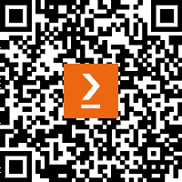

# 前言

构建企业级 Vue.js 应用意味着遵循最佳实践来创建高性能和可扩展的 Vue.js 应用。

对于任何在大型 Vue.js 代码库中工作且性能和可扩展性至关重要的开发者来说，本书是必读的。你将学习如何配置和设置 Vue.js 3 和组合式 API，以及如何使用它构建实际应用。然后，你将学习如何在 Vue.js 3 中创建可重用组件并扩展 Vue.js 3 应用中的性能。

你将学习如何通过异步懒加载、图像压缩、代码拆分和摇树优化来扩展性能。接下来，你将学习如何使用 RESTful API、Docker、GraphQL 以及不同类型的测试来确保你的 Vue.js 3 应用具有可扩展性和可维护性。本书结束时，你将能够使用最佳实践在 Vue.js 3 中实现 RESTful API、Docker、GraphQL 以及不同的测试方法来构建和部署你的企业级 Vue.js 3 应用。

# 本书面向对象

本书面向 Vue.js 开发者以及希望从设计到部署构建高性能、生产级和企业级可扩展 Vue.js 应用的资深前端开发者。本书假设读者已具备 Vue.js 和 JavaScript 编程的实际知识。

# 本书涵盖内容

[*第一章*]，*Vue.js 3 入门*，涵盖了 Vue.js、选项 API、新的 Vue.js 3 以及组合式 API。因此，它建立了对 Vue.js 的理解。此外，本章将深入探讨 Vue.js 3 的组合式 API，并作为理解其他章节的指南。

*第二章*，*使用库进行大型应用开发*，涵盖了 Vuex、Axios 和 Vue Router 的基本方面以及如何将它们与 Vue 3 集成以开发企业应用。这些背景信息将使你更好地理解这些库的术语和概念，并帮助你理解如何构建和扩展企业级应用。

*第三章*, *Vue.js 3 中的性能扩展*，深入探讨了如何扩展大型 Vue 应用。你将学习如何通过异步懒加载、图像压缩、代码拆分、摇树优化以及许多其他技巧来提高你的 Vue.js 3 企业级应用的性能。

*第四章*，*大型 Web 应用的架构*，教你如何处理大型企业级项目，从管理更大的文件结构到使用微前端架构。你还将学习如何处理 Vue.js 3 项目的国际化本地化。

*第五章*，*GraphQL、查询、突变和 RESTful API 简介*，探讨了 GraphQL、Apollo Server 2、查询、突变以及如何将这些技术集成到你的 Vue.js 3 应用程序中。此外，你将学习如何利用 GraphQL 来提供可扩展和高性能的应用程序。

*第六章*，*使用 GraphQL 构建完整的 Pinterest 克隆*，讨论了如何使用 Vue 3 和 GraphQL 构建完整的 Pinterest 克隆。你将利用 GraphQL 的知识来开发和交付企业应用程序，如 Pinterest，使用 Vue 3 和 GraphQL。

*第七章*，*将 Vue 3 应用 Docker 化*，探讨了将你的 Vue 项目 Docker 化的方方面面。此外，你将学习 Docker 化和部署企业级 Vue.js 3 Web 应用程序的最佳实践和行业标准。本章还将通过 Docker 化一个全栈 Web 应用程序并将容器部署到云平台（使用 Docker Compose）来更加实用。你将学习如何使用这个工具处理更大的项目。

*第八章*，*Vue.js 3 中的测试和要测试的内容*，探讨了测试的整个概念。你将学习从可用的组件和方法数组中要测试的内容。此外，你还将学习测试库的最佳实践和行业标准，以及如何将它们与 Vue.js 3 集成。

*第九章*，*单元测试的最佳实践*，深入探讨了与单元测试相关的所有内容。你将学习如何对 Vue.js 3 组件及其方法和页面进行单元测试。你还将了解单元测试工具，如 Jest 和 Mocha，并使用它们来有效地进行单元测试企业项目。

*第十章*，*Vue.js 3 的集成测试*，涵盖了与集成测试相关的所有内容。你将深入了解如何在 Vue.js 3 组件和页面上执行集成测试。你还将了解集成测试工具，如 Vue-Test-Library，以及如何有效地使用它们来测试企业项目。

*第十一章*，*行业标准的端到端测试*，探讨了与端到端测试相关的所有内容。你将深入了解如何在 Vue.js 3 组件和页面上执行端到端测试。此外，你还将了解端到端测试工具，如 Cypress 和 Puppeteer，以及如何有效地使用它们来测试企业项目端到端。

*第十二章*，*部署准备就绪的 Vue.js 3*，展示了如何将 Vue.js 3 项目部署到 AWS 云。你将学习部署到 AWS 的最佳实践。此外，你还将了解大公司如何部署他们的企业级 Vue 应用程序。

*第十三章*，*高级 Vue.js 框架*，提供了 Nuxt.js 的权威指南。您将学习 Nuxt.js 的细节以及如何使用 Vue.js 3 构建和交付企业级 SSR 项目。我们还将提供 Gridsome 的权威指南。您将学习 Gridsome 的细节以及如何使用 Vue.js 3 构建和交付企业级 CSR 项目。

# 要充分利用本书

| **本书涵盖的软件/硬件** | **操作系统要求** |
| --- | --- |
| Node.js 16.0 或更高版本 | Windows、macOS 或 Linux |
| 熟悉命令行 | Windows、macOS 或 Linux |
| 熟悉命令行 | Windows、macOS 或 Linux |
| Vue.js 3 | Windows、macOS 或 Linux |
| Docker 和 AWS | Windows、macOS 或 Linux |

**如果您正在使用本书的数字版，我们建议您亲自输入代码或从本书的 GitHub 仓库（下一节中有一个链接）获取代码。这样做将帮助您避免与代码的复制和粘贴相关的任何潜在错误。**

*要运行第 *7 章* 中展示的代码，你需要了解 Docker 和容器化技术*。

*要充分利用本书，您需要了解 AWS 和云计算，以便运行第 *12 章* 中展示的代码*。

# 下载示例代码文件

您可以从 GitHub 下载本书的示例代码文件 [`github.com/PacktPublishing/Architecting-Vue.js-3-Enterprise-Ready-Web-Applications`](https://github.com/PacktPublishing/Architecting-Vue.js-3-Enterprise-Ready-Web-Applications)。如果代码有更新，它将在 GitHub 仓库中更新。

我们还提供了来自我们丰富的书籍和视频目录中的其他代码包，可在 [`github.com/PacktPublishing/`](https://github.com/PacktPublishing/) 找到。查看它们吧！

# 下载彩色图像

我们还提供了一个包含本书中使用的截图和图表的彩色图像 PDF 文件。您可以从这里下载：[`packt.link/4Lgta`](https://packt.link/4Lgta)。

# 使用的约定

本书使用了多种文本约定。

`文本中的代码`：表示文本中的代码单词、数据库表名、文件夹名、文件名、文件扩展名、路径名、虚拟 URL、用户输入和推特用户名。以下是一个示例：“如果你正在跟随，请在 `.github/workflows` 文件夹内创建一个名为 `staging.yml` 的新文件。”

代码块设置如下：

```js
lint:
  runs-on: ubuntu-latest
  steps:
    - uses: actions/checkout@v3
    - run: |
        yarn
        yarn lint
```

任何命令行输入或输出都如下所示：

```js
npm install --save graphql graphql-tag @apollo/client @vue/apollo-composable
```

**粗体**：表示新术语、重要单词或屏幕上看到的单词。例如，菜单或对话框中的单词以粗体显示。以下是一个示例：“在其他选项中点击 **下一步：权限** 选项，最后点击 **创建用户** 按钮。”

小贴士或重要提示

看起来像这样。

# 联系我们

欢迎读者反馈。

**一般反馈**：如果您对本书的任何方面有疑问，请通过 customercare@packtpub.com 给我们发邮件，并在邮件主题中提及书名。

**勘误**: 尽管我们已经尽最大努力确保内容的准确性，但错误仍然可能发生。如果您在这本书中发现了错误，我们非常感谢您能向我们报告。请访问[www.packtpub.com/support/errata](http://www.packtpub.com/support/errata)并填写表格。

**盗版**: 如果您在互联网上以任何形式发现我们作品的非法副本，我们非常感谢您能提供位置地址或网站名称。请通过 copyright@packt.com 与我们联系，并提供材料的链接。

**如果您有兴趣成为作者**：如果您在某个领域有专业知识，并且您有兴趣撰写或为书籍做出贡献，请访问[authors.packtpub.com](http://authors.packtpub.com)。

# 分享您的想法

一旦您阅读了*《构建 Vue.js 3 企业级 Web 应用程序》*，我们非常乐意听听您的想法！请[点击此处直接进入该书的亚马逊评论页面](https://packt.link/r/1801073902)并分享您的反馈。

您的评论对我们和科技社区非常重要，并将帮助我们确保我们提供高质量的内容。

# 下载本书的免费 PDF 副本

感谢您购买这本书！

您喜欢随时随地阅读，但无法携带您的印刷书籍吗？您的电子书购买是否与您选择的设备不兼容？

别担心，现在，每购买一本 Packt 书籍，您都可以免费获得该书的 DRM 免费 PDF 版本。

在任何地方、任何设备上阅读。直接从您最喜欢的技术书籍中搜索、复制和粘贴代码到您的应用程序中。

优惠不会就此停止，您还可以获得独家折扣、新闻通讯以及每天收件箱中的精彩免费内容。

按照以下简单步骤获取福利：

1.  扫描下面的二维码或访问以下链接



[`packt.link/free-ebook/9781801073905`](https://packt.link/free-ebook/9781801073905)

1.  提交您的购买证明

1.  就这样！我们将直接将您的免费 PDF 和其他福利发送到您的邮箱

# 第一部分：Vue.js 入门

这第一部分为您提供了本书其余部分的理论和历史背景。它涵盖了 Vue.js、Options API、新的 Vue.js 3 和 Composition API。您还将学习如何使用 Vue CLI 创建新的 Vue 应用程序，然后，我们将更深入地探讨如何使用 Vuex、Vue Router 和 Axios 构建企业级应用程序。

本部分包括以下章节：

+   *第一章*, [*Vue.js 3 入门*](https://epic.packtpub.services/index.php?module=oss_Chapters&action=DetailView&record=24f7a5c3-bcc5-3d01-67b5-61d6c93c0b03)

+   *第二章*, [*大规模应用中的库使用*](https://epic.packtpub.services/index.php?module=oss_Chapters&action=DetailView&record=f8110ed5-ecdd-316b-b151-61d6c97da1e6) *应用*
