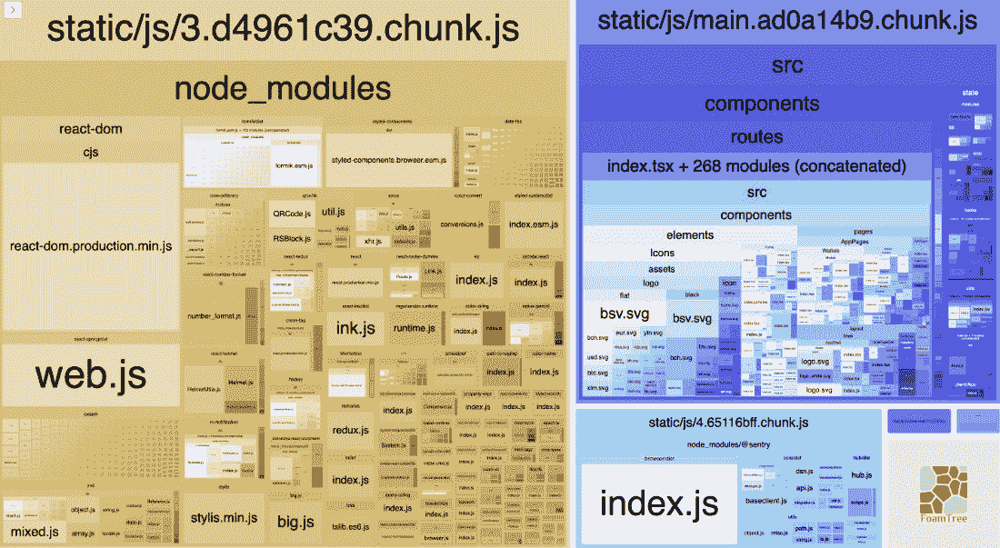
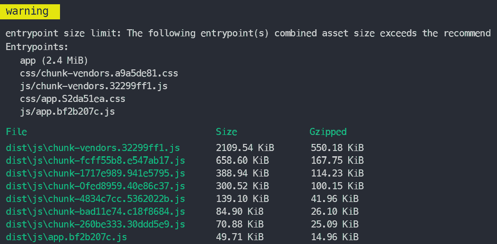
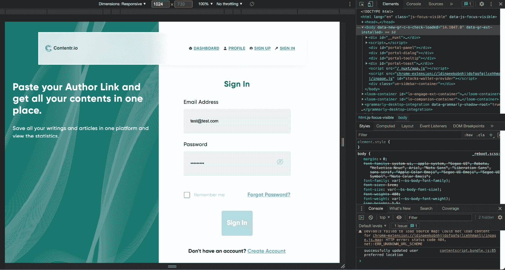
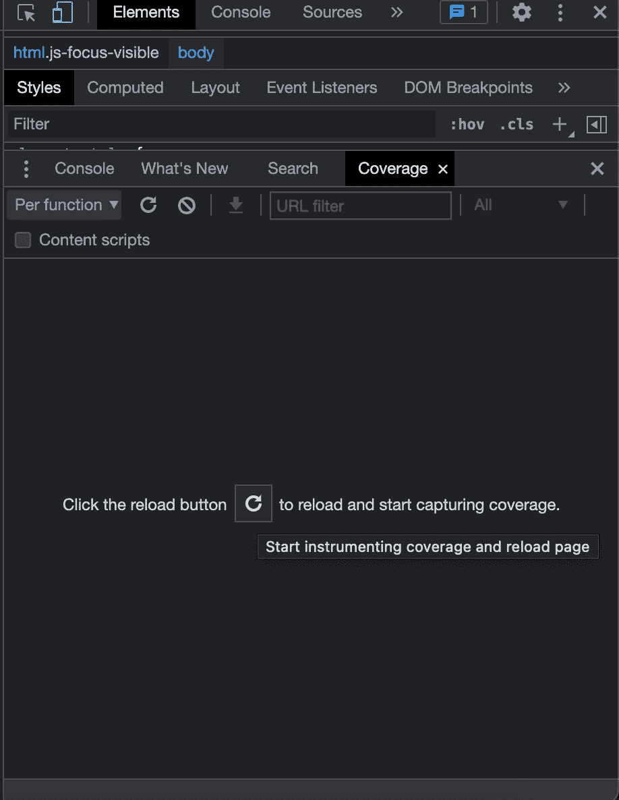
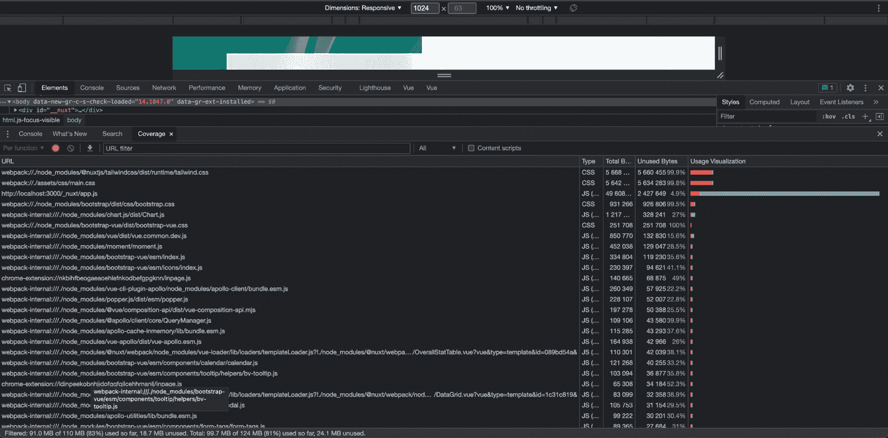

# 第三章：在 Vue.js 3 中扩展性能

本章完全依赖于前几章的知识，我们在那里探讨了使用 Vue.js 3 开发大规模和企业级应用的不同库。本章将进一步深入探讨扩展大型 Vue 应用。你将学习如何通过异步懒加载、图像压缩、代码拆分、摇树优化以及许多其他技巧来提高你的 Vue.js 3 企业级应用性能。

在本章中，我们将涵盖以下关键主题：

+   我们为什么需要 Vue.js 性能优化？

+   导致 Vue 性能不佳的主要原因

+   检查你的 Vue.js 应用包大小

+   优化企业级 Vue 应用的性能

一旦你掌握了这些主题中的每一个，你将准备好开始使用 Vue 3 构建你的第一个企业级应用。

# 技术要求

要开始本章的学习，我建议你阅读*第一章*，*Vue.js 3 入门*，在那里你将了解 Vue 3 和本章中广泛使用的组合 API 的概述。

# 我们为什么需要 Vue.js 性能优化？

在本节中，我们将学习为什么应用中的性能稳定性很重要，以及如何以性能为导向开发应用。

在开发应用时，如果不采取行动确保应用的稳定性能，可能会给应用带来很大损失。开发一个加载、导航、提交或执行任何用户操作需要较长时间的应用，会导致用户流失，从而逐渐偏离应用的初始计划。

假设最终用户对企业的用户体验和加载时间、Vue.js 性能和效率不满意。在这种情况下，投入的时间和编写的代码都不重要；用户可能不会返回到该应用。

以下是一些来自 Kinsta 的不同事实，展示了糟糕的性能如何影响市场上企业级应用的表现：[`kinsta.com/blog/laravel-caching/`](https://kinsta.com/blog/laravel-caching/)。

一项在线研究([`kinsta.com/learn/page-speed/#slow-how-slow`](https://kinsta.com/learn/page-speed/#slow-how-slow))发现，对于每 1 秒的加载延迟，亚马逊每年损失 16 亿美元的销售额。

另一项谷歌研究([`www.thinkwithgoogle.com/future-of-marketing/digital-transformation/the-google-gospel-of-speed-urs-hoelzle/`](https://www.thinkwithgoogle.com/future-of-marketing/digital-transformation/the-google-gospel-of-speed-urs-hoelzle/))报告称，即使搜索结果慢了一秒钟，人们也会减少搜索。这意味着 400 毫秒的延迟会导致搜索量下降 0.44%。

进一步的研究表明，如果有五分之四的互联网用户在视频加载时遇到卡顿，他们将会离开。

前面的研究表明，你的网页加载时间稍有延迟可能会对你的用户体验产生巨大影响，并可能导致大量资金损失。

现在我们知道了为什么我们需要在应用中保持性能稳定性，在下一节中，让我们看看 Vue 性能不佳的主要原因。

# Vue 性能不佳的主要原因

Vue 性能不佳的原因有很多，我们将在本节中探讨主要和最显著的原因。

Vue 应用变慢的明显原因在于结构。作为一个企业应用，很明显，应用越大，应用运行就越慢。

例如，企业 Vue 应用性能不佳的一个重要原因可能因不同项目和它们处理**服务器端渲染**（SSR）的方式而异。

任何 Vue **单页应用**（SPA）或 SSR 企业应用性能不佳的主要原因是包大小。包越大，Vue 的性能就越慢。

企业 Vue 应用性能不佳还有其他一些常见原因，例如以下内容：

+   没有正确地结构化 CSS 和 JS 文件

+   没有明智地使用第三方库

+   不必要的 API 请求

+   忽视代码拆分和懒加载

性能不佳的原因还有很多，我们只列举了其中一些。在我们讨论如何解决这些问题之前，让我们在下一节中探讨如何检查企业 Vue 应用的包大小。

# 检查你的 Vue 应用包大小

包大小是浏览器将要加载的 Vue 应用的总大小。大小越大，应用加载速度就越慢。

在使用 Vue 框架时，检查 Vue 包大小有两种不同的方法。

让我们更详细地逐一介绍这些方法。

## 生成报告

你可以使用带有`--report`标志的`build`命令来生成你的应用报告。这种方法提供了所有使用包和每个包大小的视觉表示。此外，通过从该视觉报告中生成的信息，你可以找出如何替换任何占用比预期更多空间和大小的包。

此外，请注意，只有当安装了`webpack-bundle-analyzer`时，`build`命令才会生成报告。

要为你的应用生成报告，请按照以下步骤操作：

1.  首先，使用以下命令安装包：

    ```js
    npm install webpack-bundle-analyzer
    ```

1.  接下来，在你的`package.json`文件中创建一个脚本：

    ```js
    "build-report": "vue-cli-service build --report"
    ```

1.  最后，执行以下命令以生成报告：

    ```js
    npm run build-report
    ```

执行前面的命令后，在`dist`文件夹内会创建一个名为`report.html`的文件。当你打开这个文件时，你会看到以下内容：



图 3.1 – 应用包大小报告

## 运行 npm 构建命令

运行你的 Vue 应用程序的`build`方法将生成不同块和包大小的列表。从这些信息中，你可以看到有关哪个块具有更大的包大小以及如何改进它的额外警告。以下是它的样子：



图 3.2 – 块和包的大小

在本节中，我们学习了为什么我们需要 Vue.js 性能优化，性能不佳的主要原因以及检查 Vue.js 包大小的不同方法。

在下一节中，我们将学习如何使用不同的标准方法优化 Vue 应用程序的性能。

# 优化企业 Vue 应用程序的性能

创建企业应用程序的一个缺点是应用程序的大小，包括代码库、数据量以及响应用户操作的速度。

一种可能的解决方案是在企业应用程序的后端和前端实施适当的缓存机制。

你会同意开发一个应用程序是有挑战性的。然而，创建一个性能优化或甚至解决企业应用程序性能瓶颈的应用程序更具挑战性。

在本节中，我们将探讨一些你可以实施的技巧来提高你的企业 Vue 应用程序的性能。

## 异步/延迟组件加载

我们将首先从异步/延迟组件加载开始，以减轻你探索 Vue.js 性能优化的挑战。

在 Vue.js 中，异步/延迟组件加载是一个术语，用于描述在用户需要模块/组件时加载模块/组件。在企业应用程序中，当用户访问网站时，没有必要从 JavaScript 包中加载所有模块，因为这样做将导致性能瓶颈。

在企业项目中，你会同意存在许多模态框、工具提示和其他相互关联的复杂组件，如果不延迟加载，这些组件将减慢应用程序的性能。

在我们探索如何延迟加载组件之前，你可以通过以下简单步骤检查你网页上使用的实际 JavaScript 代码：

1.  点击**DevTools**。以下屏幕将出现：



图 3.3 – Chrome 中实时 DevTools 的示例

1.  按*Cmd* + *Shift* + *P*。

1.  输入`Coverage`。一旦输入，屏幕底部将出现以下信息：



图 3.4 – 显示覆盖率标签的屏幕截图

1.  点击**记录**。

在记录和分析网页后，它将以红色突出显示一些 URL，这表明这些 URL 未使用，可以延迟加载：



图 3.5 – 使用 DevTools 分析时显示的不同 URL 的截图

如果懒加载得到适当的实现，您的企业应用程序的包大小可以减少到 60%，从而提高应用程序的速度。

最后，让我们探讨如何强制执行懒加载。我们可以使用 Webpack 动态导入而不是常规导入来分离懒加载模块的块。

传统上，这是 JavaScript 中导入组件/模块的方式：

```js
// photo.js
const Photo = {
  testPhoto: function () {
    console.log("This is just a Photo Component!")
  }
}
export default Photo
// app.js
import Photo from './photo.js'
Photo.testPhoto()
```

以这种方式导入此模块，Webpack 将在其依赖图中创建一个名为`photo.js`的文件作为`app.js`文件的节点，并将其捆绑在一起，即使用户不需要使用该模块。

但为了稍微改进一下，我们可以使用动态导入或懒加载来克服之前方法中的性能瓶颈。以下代码块展示了动态/懒加载的实际应用：

```js
// app.js
const getPhoto = () => import('./photo.js')
// later when some user action tasks place as hitting the
// route
getPhoto()
  .then({ testPhoto } => testPhoto())
```

在 Vue.js 中实现懒加载是减少包大小和优化性能的最佳实践之一。Vue 建议包的大小不应超过 244 KiB，但您也可以尝试优化您的网页，以确保即使包的大小略高于推荐值，性能也不会非常慢。养成一个习惯，知道哪些模块您不需要，除非有明确用户操作，然后懒加载它们以获得更好的性能。

## WebP 图像和图像压缩

大型包大小和缓慢的应用程序的一个主要原因是图像对应用程序包大小贡献很大。如果图像没有正确优化，当应用程序渲染较大尺寸的图像时，可能会增加应用程序的加载时间。

实现图像优化的方法有很多，我们将讨论两种流行的方法：

+   压缩图片

+   优化**内容分发网络**（**CDN**）图像

### 压缩图片

如果您的企业应用程序包含少量的小图像，这些图像将本地提供服务，同时应用不同的压缩算法以减小每个图像的大小。

有成千上万的在线工具可以压缩图像，以下是一些流行的工具列表：

+   TinyPNG

+   Compressnow

+   Image Compressor

+   Adobe Photoshop

此外，用于减少图像大小的最佳压缩算法是 Google 开发的 WebP 图像格式（[`developers.google.com/speed/webp`](https://developers.google.com/speed/webp)），它由 Google 开发和维护。

### 优化 CDN 图像

CDN 用于优化图像。它提供通过减少图像大小高达 70%的转换功能，而不会影响 UI 和像素化。当您的企业应用程序处理大量媒体使用时，也建议使用 CDN。

在图像优化方面最受欢迎的 CDN 工具是**Cloudinary**和**ImageKit**。

媒体在任何企业应用中都占用相当大的空间，因此如果不进行优化和适当提供，可能会导致延迟和缓慢的性能。

## [Co](https://developer.mozilla.org/en-US/docs/Glossary/Code_splitting)de splitting

MDN 解释如下（[`developer.mozilla.org/en-US/docs/Glossary/Code_splitting`](https://developer.mozilla.org/en-US/docs/Glossary/Code_splitting)）：

“代码拆分是将代码拆分为各种包或组件的过程，这些包或组件可以按需或并行加载。”

随着应用程序复杂性的增加或维护，CSS 和 JavaScript 文件或包的大小也会增加，特别是随着包含的第三方库的数量和大小增加。”

在创建企业应用时，总会存在许多路由、文件和包，这些都会增加企业应用的字节大小。代码拆分是分离和仅加载较小和按需文件的答案，从而提高您企业应用的加载时间。

让我们的企业应用有两个页面，我们使用流行的`vue-router`库来实现，如下所示：

```js
```

// routing.js

import Dashboard from './Dashboard.vue'

import Photo from './Photo.vue'

const routes = [

{ path: '/', component: Dashboard }

{ path: '/photo', component: Photo }

]

```js
```

由于 Vue.js 的编码标准，当用户访问任何页面时，我们脚本中的所有组件都将被下载。由于页面的数量、每个页面的复杂性和大型的包大小，这种活动会导致性能缓慢。

为了避免这个问题，我们可以实现适当的路由代码拆分，将我们的大型包拆分成不同的路由包，这意味着当用户访问该页面时，每个页面都将有一个小的包进行下载。

使用动态导入技术，而不是像之前演示的那样直接导入组件，我们可以传递动态路由并按需加载组件，如下面的代码块所示：

```js
```

// routing.js

const routes = [

{ path: '/', component: () => import('./Dashboard.vue') }

{ path: '/photo', component: () => import('./Photo.vue') }

]

```js
```

通过遵循此方法，您可以减半您的包大小。同时，确定哪些组件可以使用动态导入也非常重要。

# 摘要

在本章中，我们深入探讨了扩展 Vue 应用的缩放。我们讨论了如何通过异步懒加载、图像压缩、代码拆分、摇树优化以及许多其他技巧来提高 Vue.js 3 企业级应用的性能。

我们还详细讨论了为什么需要性能优化，以及如果性能没有故意构建到应用程序中，您的企业应用可能会失去什么。我们还讨论了企业应用性能不佳的原因以及如何修复它们。

接下来，我们讨论了如何检查我们的 Vue.js 应用程序的包大小，通过简单的说明如何使用 Webpack 和命令生成包报告来演示这一点。我们还讨论了如何理解报告，并从生成的报告中发现如何改进应用程序，以进一步提升我们的企业应用程序的性能。

在下一章中，我们将学习如何处理一个大型企业级项目，从管理更大的文件结构到使用微前端架构。你还将了解如何处理你的 Vue.js 3 项目的国际化与本地化。
