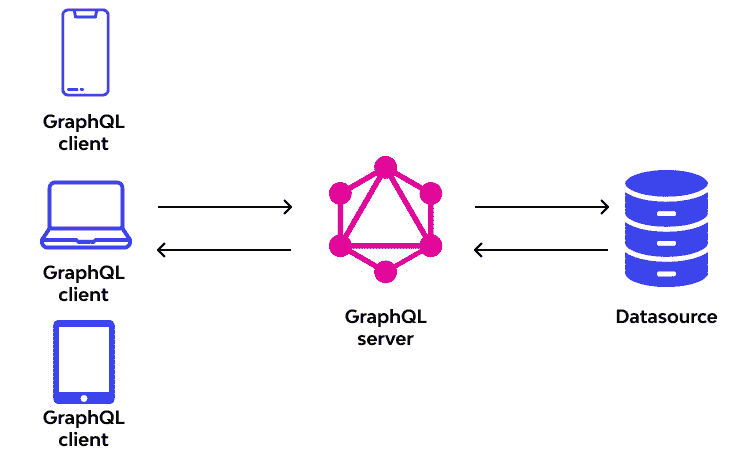
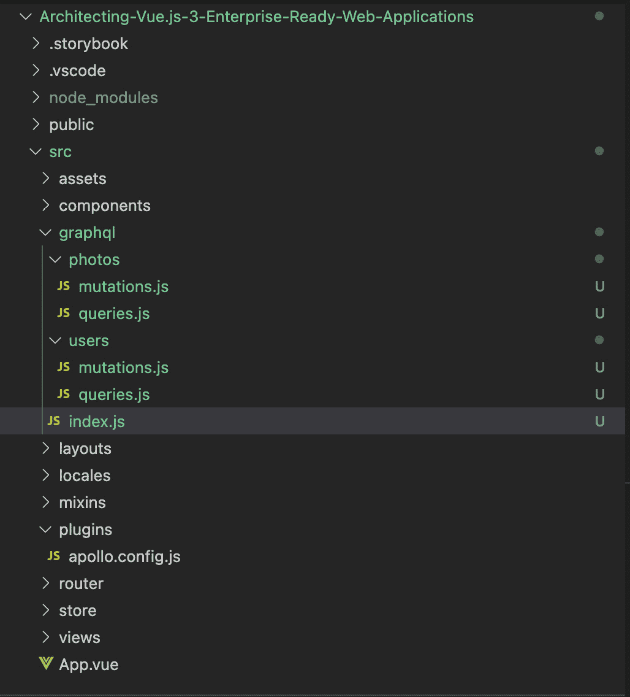
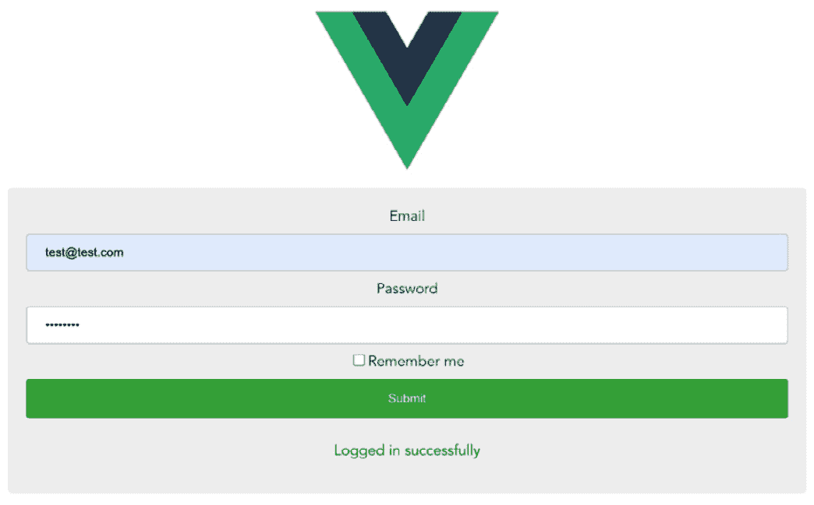

# 第五章：GraphQL、查询、突变和 RESTful API 简介

在前面的章节中，我们探讨了使用 Vue 3 开发大规模企业应用的不同库和方法。在本章中，我们将首先了解 GraphQL 是什么以及它与 REST 的不同之处。接下来，我们将探索 GraphQL、GraphQL Apollo Server 2、查询和突变，以及如何将这些技术集成到您的 Vue.js 3 应用程序中。此外，您还将学习如何利用 GraphQL 来提供可扩展且性能高的应用程序。

本章将涵盖以下关键主题：

+   GraphQL 简介

+   理解查询和突变

+   将 GraphQL Apollo 客户端与 Vue 3 集成

此外，在本章中，您将学习如何将 GraphQL 集成到 Vue 3 中，并按照可预测性原则正确地构建它，通过使用 GraphQL Apollo 客户端和 Vue 3 实现登录和注册认证系统。

# 技术要求

要开始本章的学习，我们建议您阅读 *第四章*，*大规模 Web 应用程序的架构*，其中我们探讨了使用不同的行业标准结构、架构和标准来构建大规模企业应用。

本章的所有代码文件可以在以下位置找到：[`github.com/PacktPublishing/Architecting-Vue.js-3-Enterprise-Ready-Web-Applications/tree/chapter-5`](https://github.com/PacktPublishing/Architecting-Vue.js-3-Enterprise-Ready-Web-Applications/tree/chapter-5)。

# GraphQL 简介

GraphQL 是 API 开发行业中的新热点。虽然 REST 仍然是暴露服务器数据最流行的方式，但它带来了许多 GraphQL 倾向于解决的局限性。

GraphQL 是由 Facebook 创建和维护的一种查询语言。创建 GraphQL 的目的是构建基于直观和灵活语法的客户端应用程序，以描述它们的数据需求和交互。

GraphQL 的一个好处是，我们有一个单一的端点可以访问服务器上的所有数据，而不是在 REST 中有多个端点。

在本节中，我们将探讨您需要了解的所有关于 GraphQL 的内容，GraphQL 的不同独特特性，以及为什么您应该考虑使用 GraphQL 而不是 RESTful API 设计模式。最后，我们将指导您创建并设置您的第一个 GraphQL 服务器，使用 Express。

## 什么是 GraphQL？

根据官方文档（https://graphql.org/），

GraphQL 是一种用于 API 的查询语言，也是执行这些查询的运行时环境。GraphQL 为您的 API 中的数据提供了完整且易于理解的定义，赋予客户端请求所需数据的权力，而不需要更多，这使得 API 随时间演变变得更加容易，并使强大的开发者工具成为可能。

GraphQL 是一个服务器端运行时，用于执行使用您为数据定义的类型系统进行的查询。此外，GraphQL 不绑定到任何特定的数据库或存储引擎，而是由您现有的代码和数据支持。



图 5.1 – 解释 GraphQL 的图表（来源：https://www.wallarm.com/what/what-is-graphql-definition-with-example）

GraphQL 类型系统定义了可以在 GraphQL 应用程序中使用的各种数据类型。这个类型系统有助于定义将在 GraphQL 应用程序中使用的模式。

要创建 GraphQL 服务，你需要首先定义模式类型，并在这些类型上创建字段，然后提供在每个字段上执行的功能。

例如，我们可以在以下代码片段中定义一个新的模式类型 `Photo`，以演示类型在 GraphQL 中的工作方式：

```js
type Photo {
 id: ID!
 name: String!
url: String!
description: String
}
```

现在我们对 GraphQL 有了一定的了解，也看到了如何定义 GraphQL 模式类型。接下来，在我们深入创建 GraphQL 查询和解析器之前，让我们探索 GraphQL 的特性。

## GraphQL 的特性

GraphQL 拥有出色的功能。我们将在接下来的小节中探索 GraphQL 的几个功能。

### 易于开始

GraphQL 的学习曲线很容易，尤其是对于熟悉使用 RESTful 设计模式构建 API 的开发者来说。

用户可以从使用小查询立即获取数据开始使用 GraphQL，稍后可以了解一些高级特性。

### 为交互式应用程序而构建

GraphQL 是为实时和交互式应用程序而构建的，因为客户端和服务器之间的变化几乎立即发生，从而提供快速响应。

### 小巧灵活

GraphQL 允许用户请求并接收请求的确切数据。此功能解决了 RESTful API 中过度和不足获取的问题。

### 兼容性强

GraphQL Apollo 是为了与任何构建设置、任何 GraphQL 服务器和任何 GraphQL 模式兼容而构建的。

### 可逐步采用

GraphQL 是为了使集成到新项目或现有项目中变得毫不费力而构建的，而不会破坏任何更改。它很容易适应。

## 为什么要使用 GraphQL 而不是 REST？

在本节中，我们将确定 GraphQL 的一些特性，并讨论为什么你应该在后续的 API 开发中使用 GraphQL 而不是 RESTful API。我们将讨论这些特性中的几个。此外，我们将在本节中详细比较这些技术与 GraphQL 与 RESTful API 指南。

以下小节将提到使用 GraphQL 而不是 RESTful API 的前五个原因。

### 强类型模式

在 GraphQL 中，**模式定义语言**（**SDL**）用于定义客户端和服务器之间的合同以及定义客户端如何访问服务器中的数据。GraphQL 使用强类型系统来定义 API 的功能。所有暴露给客户端的 API 都记录在一个称为 SDL 的架构中。

一旦定义了这些架构，前端和后端就可以在没有任何进一步更改或帮助的情况下单独通信，因为前端知道架构中的数据始终会在整个系统中保持同步或一致。

这解决了 REST 中的数据不一致问题。前端期望获取特定的数据集，但由于没有定义一致的架构，因此检索到了不同的数据。

### 无过度或不足获取数据

过度或不足获取数据的问题是 RESTful API 中已知的问题，其中客户端通过访问返回固定数据结构或获取过多或过少数据的端点来下载数据。

过度获取数据是获取比应用程序所需更多数据的问题。它也可以意味着获取比满足请求所需更多的数据。在使用 RESTful API 时，你必须获取所有用户的详细信息或创建一个新的端点，该端点仅返回应用程序中所有用户的名称，只是为了在您的前端应用程序中显示用户的名称。而在 GraphQL 中，你可以使用单个查询仅返回所有用户的名称或任何其他详细信息，通过创建单独的查询或端点。

不足获取数据很少见，但发生在特定端点没有提供所有所需信息的情况下。客户端必须根据需要发出附加请求以访问其他信息。

GraphQL 通过提供一个客户端指定所需信息的媒介来解决此问题，并返回所需的确切信息。

### 节省时间和带宽

过度获取数据的问题可能会导致客户端带宽消耗增加，这可能会随着时间的推移导致应用程序出现延迟。使用 RESTful API 设计模式，从大量负载中整理所需信息需要更多时间。

GraphQL 允许你只选择你需要的内容，从而减少通过网络传输的数据量。

### 多个端点

RESTful API 的重要问题之一是端点过多，难以访问信息。例如，如果客户端想要通过 ID 访问特定用户，你将看到 `/users/1`。此外，如果你要访问该用户的照片，你必须向另一个端点 `/users/1/photos` 发送请求。

在 GraphQL 中，你只有一个端点，并且不需要发送多个请求来获取关于用户的不同信息。

如下所示，使用 GraphQL，你可以在单个请求中访问所有用户的信息：

```js
{
    me {
        name,
        photos {
            title,
url
        }
    }
}
```

上述脚本将仅访问用户的`name`以及所有用户的`photos`的`title`和`url`。

### 版本控制不是必需的

版本控制是 RESTful API 的一个特性，当对 API 进行更改和更新时，会为 API 分配不同的版本。这样做是为了避免在生产中造成破坏性更改，可能会对用户造成问题。

如果我们希望用户使用最新版本的我们的新功能，我们必须强迫他们更新应用程序，这并不是一个好的用户体验。

在 GraphQL 中，无需担心版本控制，也不需要强迫用户更新他们的应用程序以使用新更改，因为它是自动发生的，客户端只实现 SDL 中可用的功能。

在这里，我们讨论了使用 GraphQL 的不同功能和好处，以及为什么你应该考虑使用 GraphQL 而不是 RESTful API。在下一节中，我们将进一步讨论 GraphQL 与 RESTful API 之间的区别。

## GraphQL 与 RESTful API 的区别

GraphQL 与 REST 之间的核心区别在于，GraphQL 是一个规范和查询语言，而 REST API 是网络应用程序的架构概念。

这两个概念在创建和维护可扩展的微服务和大型企业应用中发挥着重要作用。

因此，选择特定的技术将取决于你在每种技术中的国际化程度，你团队对哪种技术更舒适，以及哪种技术使你的产品开发更容易、更快。

以下要点展示了你可能想要考虑的其他差异：

+   GraphQL 是一种查询语言，通过集成 API 来解决问题，而 REST API 是一种描述设计 API 的传统标准的架构风格

+   此外，使用 GraphQL，你可以使用单个端点访问服务器上的所有数据，无需多个端点，而 REST API 允许多个端点和一组 URL，每个 URL 都暴露一个单一的资源，这可能会让人难以理解

+   GraphQL 使用客户端驱动的架构，缺乏内置的缓存机制，而 REST API 使用服务器驱动的架构并自动使用缓存

+   在 GraphQL 中不需要 API 版本控制，其响应仅以 JSON 格式，而 REST API 支持多个 API 版本控制，并允许以 XML、JSON 或 YAML 格式输出响应

+   GraphQL 提供类型安全和自动生成的文档，它还允许模式拼接和远程数据获取，而 REST API 不提供类型安全或自动生成的文档，简化与多个端点的工作需要昂贵的自定义中间件

+   GraphQL 也是一种用于执行现有数据查询的应用层服务器端技术，而 REST 是一种用于定义创建网络服务约束的软件架构风格

+   GraphQL 可以根据模式组织，而 REST 则不是根据模式组织，而是根据端点组织

+   与 REST API 相比，GraphQL 的开发速度更快

+   GraphQL 突变的消息格式应该是一个字符串，而 REST API 的消息格式可以是任何内容

+   GraphQL 使用元数据来进行查询验证，而 REST 没有可缓存的机器可读元数据

我们已经探讨了 GraphQL 和 REST API 之间的区别，以便让你了解哪个更适合你的企业应用。我们将让你做出选择，但在接下来的章节中我们将更深入地探讨 GraphQL。在下一节中，我们将讨论查询和突变，进一步介绍如何创建你的第一个查询和突变。

# 理解 GraphQL 中的查询和突变

查询和突变在 GraphQL 中至关重要，因为它们是访问或从前端向 GraphQL 服务器发送数据的唯一方式。

## 使用查询

GraphQL 查询定义了客户端可以在 GraphQL API 上运行的查询。如果你熟悉 REST API，它与流行的 `GET` 请求同义。

你可以用多种方式定义 GraphQL 查询，但建议定义一个根查询来包装所有的查询。

以下代码片段展示了如何定义一个名为 `RootQuery` 的根查询：

```js
type RootQuery {
  user(id: ID): User    # Corresponds to GET /api/users/:id
  users: [User]         # Corresponds to GET /api/users
  photo(id: ID!): Photo #Corresponds to GET/api/photos/:id
  photos: [Photo]        # Corresponds to GET /api/photos
}
```

你也可以像这样为 `User` 和 `Photo` 定义单独的查询：

```js
type User {
id: ID!
name:String!
email: String!
}
type Photo {
id: ID!
title:String!
description: String
url: String!
user: User
}
```

通过前面的查询，我们已经成功定义了端点来检索用户和照片，这与使用 REST API 的 `GET` 方法执行的方式相同。

接下来，我们将探讨如何使用突变在 GraphQL API 上创建或更新数据。

## 使用突变

GraphQL 中的突变用于从我们的 GraphQL API 创建、更新和删除数据，分别与 REST API 的 `POST`、`PUT` 和 `DELETE` 方法同义。

在 GraphQL 中创建突变很简单；看看下面的代码片段：

```js
type RootMutation {
  createUser(input: UserInput!): User
  # Corresponds to POST /api/users
  updateUser(id: ID!, input: UserInput!): User
  # Corresponds to PATCH /api/users
  removeUser(id: ID!): User
  # Corresponds to DELETE /api/users
  createPhoto(input: PhotoInput!): Photo
  updatePhoto(id: ID!, input: PhotoInput!): Photo
  removePhoto(id: ID!): Photo
}
```

前面的代码片段展示了如何创建突变。此外，我们还创建了 `createUser`、`updateUser` 和 `removeUser` 来从 GraphQL API 中创建、更新和删除用户。

最重要的是，为了让 GraphQL 连接到我们的数据库并在查询和突变操作中执行操作，我们需要定义一个解析器，这将在下一小节中介绍。

### 解析器

GraphQL 解析器将我们的查询和突变连接到执行的正确方法。它通知 GraphQL 在请求每个查询/突变时应该做什么。这是一个基本功能，它执行击中数据库层以执行 CRUD 操作、击中内部 REST 端点或调用微服务以满足客户端请求的繁重工作。

让我们将前面章节中创建的查询/突变映射到一个解析器上，该解析器将在请求任何查询/突变时被调用：

```js
import sequelize from '../models';
export default function resolvers () {
  const models = sequelize.models;
  return {
// Resolvers for Queries
    RootQuery: {
      user (root, { id }, context) {
        return models.User.findById(id, context);
      },
      users (root, args, context) {
        return models.User.findAll({}, context);
      }
    },
// Resolvers for Mutations
RootMutation: {
  createUser (root, { input }, context) {
    return models.User.create(input, context);
  },
  updateUser (root, { id, input }, context) {
    return models.User.update(input, { ...context,
                                      where: { id } });
  },
  removeUser (root, { id }, context) {
    return models.User.destroy(input, { ...context,
                                       where: { id } });
  },
  // ... Resolvers for Photos
}
};
}
```

为了促进理解，我们导入了来自 `sequelize` 的模型，这是一个用于使用定义的方法操作数据库表的 **对象关系映射**（**ORM**）。

接下来，我们创建并导出了一个 `resolver` 函数，它返回一个包含 `RootQuery` 和 `RootMutation` 的对象。

接下来，在 `RootQuery` 和 `RootMutation` 对象内部，我们使用适当的企业逻辑解决每个方法。

例如，当客户端请求所有用户时，GraphQL 前端客户端将调用定义在 `sequelize` ORM 中的用户查询。相同的逻辑适用于所有突变。

在本节中，我们解释了 GraphQL 的工作原理以及如何创建自己的 GraphQL API，以了解在前端为大型项目结构化 GraphQL 客户端的最佳方式。

在下一节中，我们将探讨如何以最佳方式结构化你的企业级 Vue.js 应用程序，以实现可扩展性和更快地被团队成员接受。记住我们在 *第三章** 中讨论的团队的可预测性法律* *Vue.js 3* *中的性能扩展*。

# 将 GraphQL Apollo 客户端与 Vue 3 集成

很容易想知道将 GraphQL 客户端集成到 Vue 3 的最佳方式以及如何在企业项目中结构化它以促进团队成员，包括新成员的快速采用。

在我的全栈软件工程师职业生涯中，我最近加入了一家使用 Vue 3 和 GraphQL 来颠覆德国金融科技行业的金融科技公司，我对这样一个大型代码库的安排以及我如何轻松地直接解决我的第一个任务印象深刻。

使用 GraphQL 结构你的 Vue 3 项目有许多方法，但我想要概述一下我见过的最适合小型或大型企业项目的方法，包括我参与的那个金融科技项目。

GraphQL Apollo 客户端是一个 JavaScript 库，用于连接到 GraphQL 服务器以交换数据。使用该库，您可以连接到服务器，发送请求，并从服务器接收响应。

首先，我们将开始列出并安装 Vue 3 中 GraphQL 和 GraphQL 客户端所需的必要包。

## 安装

按照以下步骤安装所有必要的包：

1.  输入以下命令来安装 `graphql`、`graphql-tag`、`apollo-composable` 和 `apollo client`。这些是从官方文档中推荐的库，用于通过 Vue 3 与 GraphQL 服务器进行通信：

    ```js
    npm install --save graphql graphql-tag @apollo/client @vue/apollo-composable
    ```

1.  安装后，我们将在我们创建的文件夹结构中（在 *第三章**，*Vue.js 3* 中的性能扩展*）的 `plugins` 文件夹内创建一个名为 `apollo.config.js` 的新文件，并添加以下脚本以配置 `graphql` 客户端：

    ```js
    ```js

    import { ApolloClient, createHttpLink, InMemoryCache } from '@apollo/client/core'

    // 与 API 的 HTTP 连接

    const httpLink = createHttpLink({

    // 这里应使用绝对 URL

    uri: 'http://localhost:3020/graphql',

    })

    // 缓存实现

    const cache = new InMemoryCache()

    // 创建 Apollo 客户端

    const apolloClient = new ApolloClient({

    link: httpLink,

    cache,

    })

    export default apolloClient

    ```js
    ```

1.  最后，在您的 Vue 3 `main.js` 文件中，向现有的脚本中添加以下脚本：

    ```js
    ```js

    import { createApp, provide, h } from 'vue'

    import apolloClient from "./plugins/apollo.config";

    import { DefaultApolloClient } from '@vue/apollo-composable'

    …

    const app = createApp({

    setup () {

    provide(DefaultApolloClient, apolloClient)

    },

    render: () => h(App),

    })

    …

    ```js
    ```

在前面的步骤中，我们展示了如何在 Vue 3 企业应用程序中安装 GraphQL 客户端，并与其他库完全设置。在下一节中，我们将讨论使用 GraphQL 结构化我们的 Vue 3 应用程序的最佳实践。

## 结构化 GraphQL

在成功安装和配置 Apollo Client 与 Vue 3 后，让我们根据可预测性原则来结构化我们的查询和突变，以便老成员和新成员能够轻松适应项目。

在 `src` 文件夹内创建一个名为 `graphql` 的新文件夹。这个新文件夹将包含所有我们的查询和突变，根据应用程序的功能分组到不同的目录中。

让我们从上一节中开发的模式中举一个例子。从模式中可以看出，我们的项目有 `User` 和 `Photo` 功能，因此我们将在通用的 `graphql` 文件夹内为这些特定功能创建不同的文件夹。

使用以下命令行或从您的代码编辑器手动创建新文件夹：

```js
mkdir src/graphql
mkdir graphql/users graphql/photos
```

您应该有一个新的文件夹结构，如下面的截图所示：



图 5.2 – 安装和设置 GraphQL 后的文件夹结构

安装和设置 GraphQL 后，您的文件夹结构应该看起来像前面的截图，包含每个功能及其对应的查询和突变文件。

以这种方式结构化您的 GraphQL API，使您的团队能够自动理解在哪里找到与 GraphQL 查询或突变相关的内容，以及它们在寻找它们的功能中。

现在我们已经确定了预测性的文件夹结构，在下一节中，我们将通过一个实际练习来演示，使用我们在前几节中学到的结构，通过 GraphQL Apollo 客户端和安装在 GraphQL 服务器上的 JWT 来认证用户。

## JWT 认证用于登录/注册

在地面上已有的结构基础上，添加新功能和编写查询/突变变得容易，而不会在代码库中分散。

让我们通过以下步骤演示如何使用 GraphQL 和 Vue 3 实现登录和注册认证过程：

1.  首先，在 `graphql` 文件夹内创建一个名为 `auth` 的新文件夹，并在其中添加 `mutations.js`：

    ```js
    mkdir graphql/auth
    touch graphql/auth/mutations.js
    ```

1.  在新创建的突变文件中，为注册和登录端点添加以下脚本：

    ```js
    import { gql } from "graphql-tag";
    export const LOGIN_USER = gql`
     mutation loginUser($input: LoginUserInput!) {
       loginUser(data: $input) {
         id
         name
         email
         token
       }
     }
    `;
    export const REGISTER = gql`
     mutation register($input: RegisterUserInput!) {
       register(data: $input) {
         id
         name
         email
       }
     }
    `;
    ```

1.  接下来，将我们之前创建的 `graphql/index.js` 文件中的突变导出，使其在 Vue 应用程序中可用：

    ```js
    export * from "./auth/mutations";
    ```

`export` 脚本使得导入我们的 GraphQL 查询和突变变得容易得多。

接下来，我们将探讨如何在 Vue 3 组件中调用认证突变并检索用户信息。

使用我们之前安装的 `vue-composable` 库，我们可以使用不同的 GraphQL 钩子，例如 `useMutation` 和 `useQuery`，来操作 GraphQL API。

1.  在 `organisms` 文件夹内创建一个 `login` 组件，并添加以下代码：

    ```js
    <template>
     <form @submit.prevent="login">
       <TextField
         v-model="email"
         required
         type="email"
         class="mb-6"
         name="email"
         label="Email Address"
         placeholder="Enter your email address"
      />
       <TextField
         v-model="password"
         required
         minlength="6"
         class="mb-6"
         type="password"
         maxlength="50"
         placeholder="Enter your full password"
         label="Password"
       ></TextField>
       <div class="flex justify-between mb-6">
         <CheckField id="remember" v-model="remember">
          Remember me</CheckField>
       </div>
       <div class="flex justify-center my-9 w-full">
         <Button>Sign In</Button>
       </div>
     </form>
    </template>
    ```

第一个代码片段显示了组件的模板和视图部分；它包含一个表单组件，其中包含四个子组件，包括 `TextField`、`CheckField` 和 `Button`：

```js
<script>
import { LOGIN_USER } from "../../graphql";
export default {
 setup(props) {
   const email = ref("");
   const password = ref("");
   const remember = ref(false);
   const { mutate: loginUser } =
     useMutation(LOGIN_USER, () => ({
     variables: {
       email: email,
       password: password,
       remember,
     },
   }));
   const login = () => {
     const user = loginUser();
     if (!user) return
    // Save State and Redirect to Dashboard
   };
   return {
     login,
     email,
     password,
     remember,
   };
 },
};
</script>
```

组件的脚本部分执行业务逻辑；它有许多属性和一个名为 `Login` 的函数，该函数执行应用程序的认证过程。

前面的代码片段展示了如何实现我们项目的登录功能。您可以实现注册组件或查看仓库 ([`github.com/PacktPublishing/Architecting-Vue.js-3-Enterprise-Ready-Web-Applications/tree/chapter-5`](https://github.com/PacktPublishing/Architecting-Vue.js-3-Enterprise-Ready-Web-Applications/tree/chapter-5)) 以获取本章的完整代码库。



图 5.3 – 展示登录表单实现的截图

# 摘要

本章深入探讨了 GraphQL、GraphQL Apollo Server 2、查询、突变，以及如何将这些技术集成到您的 Vue.js 3 应用程序中。此外，我们还学习了如何利用 GraphQL 来交付可扩展且性能高的应用程序。

我们还详细介绍了如何将 GraphQL 集成到 Vue 3 中，并按照可预测性原则正确地构建其结构。

最后，我们展示了如何使用 GraphQL Apollo Client 和 Vue 3 实现登录和注册认证系统。

在下一章中，您将学习如何使用 Vue 3 和 GraphQL 构建一个完整的 Pinterest 克隆。您将利用对 GraphQL 的了解，使用 Vue 3 和 GraphQL 开发和交付一个如 Pinterest 一样的企业级应用程序。
