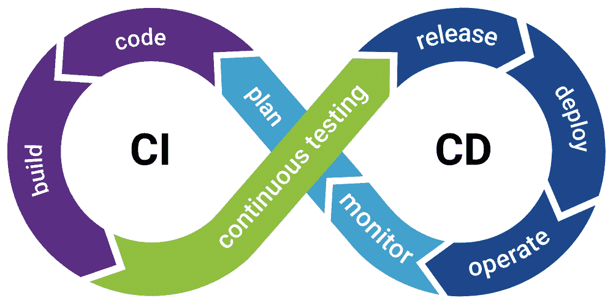
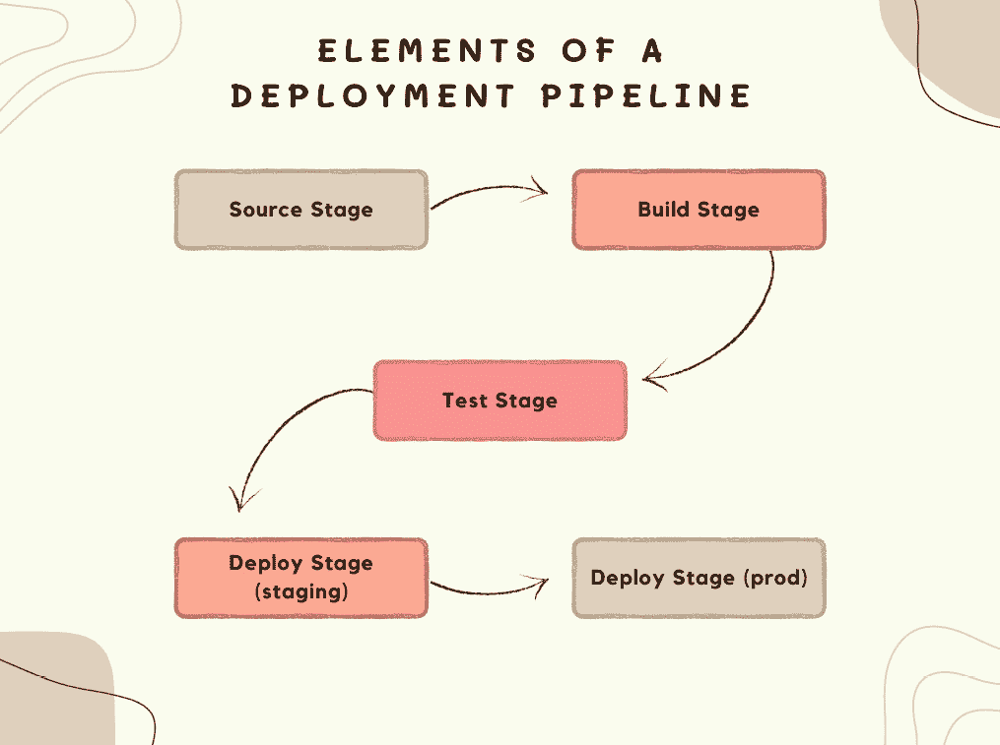
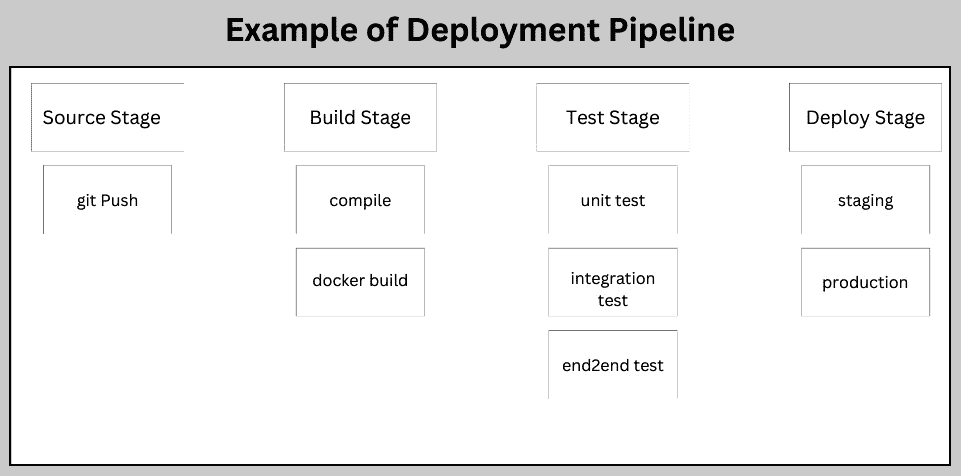
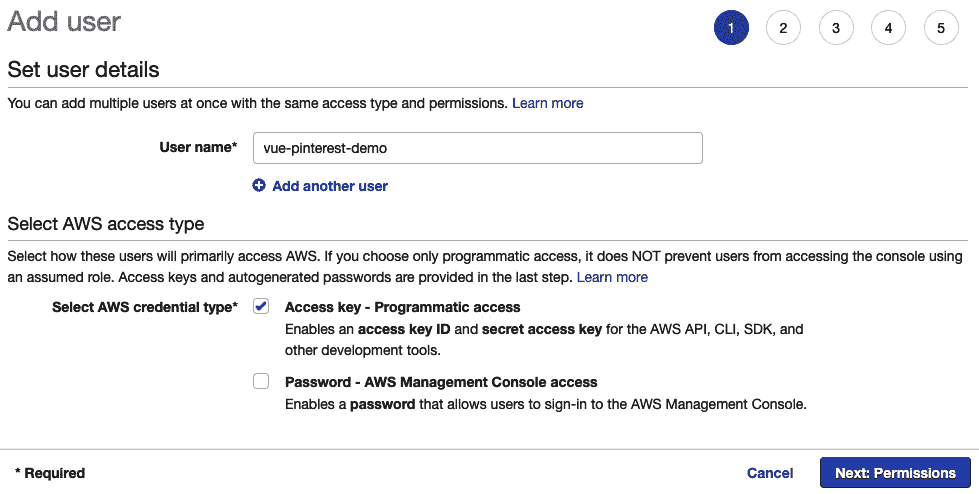
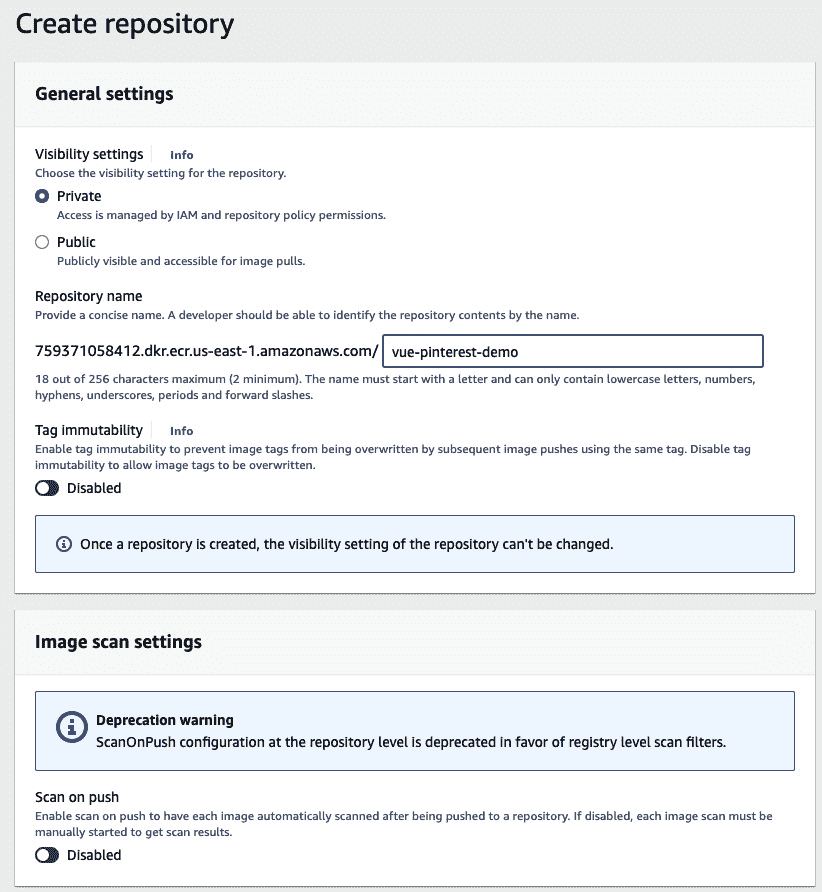
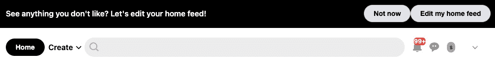

# 第十二章：部署企业级 Vue.js 3

在上一章中，我们探讨了与**端到端**（**e2e**）测试相关的所有内容。我们深入学习了如何在 Vue.js 3 组件和页面上执行 e2e 测试。此外，我们还了解了端到端测试工具，如 Cypress 和 Puppeteer，以及如何有效地使用它们来测试企业级项目。

本章，我们将学习如何将 Vue.js 3 项目部署到 AWS 云。我们将学习部署到 AWS 的最佳实践。此外，我们还将了解企业公司如何部署他们的企业级 Vue.js 3 应用程序。

此外，我们还将了解并探索不同的部署选项和最佳实践，以便将您的 Vue.js 3 项目部署到各种云服务提供商。我们将学习如何将应用程序部署到 AWS 和 Azure。

本章将涵盖以下关键主题：

+   CI/CD 简介

+   CI/CD 概述

+   什么是部署管道？

+   GitHub Actions 概述

+   部署到 AWS

# 技术要求

要开始，我建议阅读第十一章，*行业标准端到端测试*，其中我们探讨了 e2e 测试的概念以及从一系列组件和方法中选择要测试的内容。我们将在这个章节中大量依赖该章节的知识来学习 Vue.js 3 企业级单元测试。

本章的所有代码文件都可以在[`github.com/PacktPublishing/Architecting-Vue.js-3-Enterprise-Ready-Web-Applications/tree/chapter-12`](https://github.com/PacktPublishing/Architecting-Vue.js-3-Enterprise-Ready-Web-Applications/tree/chapter-12)找到。

# CI/CD 简介

开发一个企业级应用程序很容易，但不断地将新开发的更改、错误修复或功能部署给用户是一个令人畏惧的过程，尤其是如果频繁进行，特别是对于企业级应用程序。此外，随着您的应用程序、团队和部署基础设施的复杂性增加，持续发布和部署新更改、功能和产品给客户可能是一个复杂的过程。

为了快速且一致地解决开发、测试和发布软件的复杂过程，开发者和组织已经创建了三个相关但不同的策略来管理和自动化这些流程。

在下一节中，我们将探讨这三个被称为 CI/CD 的支柱，并解释这些策略以及它们是如何相互关联的。最重要的是，我们将探讨如何构建并将这些策略纳入我们的企业应用程序生命周期，以便它能够改变我们的软件开发和发布实践。

# CI/CD 概述

**CI**/**CD**代表**持续集成**/**持续交付**。这是一种策略，允许企业团队更快、更高效地发布软件。它使产品能够以前所未有的速度进入市场，允许代码持续流入生产环境，并通过最有效的交付方式提供持续的新功能和错误修复。

CI/CD 管道被编写用于自动化从开发阶段到生产环境的软件交付过程。它构建、测试并安全地部署应用程序的新版本。

自动化管道的主要优势在于它消除了在部署过程中可能检测到的手动错误，并为开发者提供标准化的反馈循环，以加快产品迭代。

CI/CD 是不同策略和支柱的组合，共同构成了强大的企业软件交付管道；我们将在本节中详细探讨这些策略。



图 12.1 – CI/CD

## 持续集成

CI 是一种过程，允许团队中的开发者频繁地将他们的代码集成到一个共享的仓库中。这些开发者可以在隔离的环境中编写代码，并使用持续集成过程进行集成。这种做法鼓励每个开发者独立构建，并在一天中多次将代码与共享仓库集成。

当代码在开发周期的早期阶段集成时，开发者可以及早发现新旧代码之间的冲突。这个过程通过使其成为早期考虑的事项来最小化集成成本。

通过实施适当的持续集成策略，开发团队能够降低集成成本并及早应对缺陷。

为了使企业团队能够在稳健、自动化和快速的企业软件集成、部署和交付中取得成功，必须培养频繁迭代和对构建问题的快速响应的文化。

## 持续交付

CD（持续交付）是持续集成的扩展，旨在简化软件交付流程，并使团队能够轻松且放心地将代码部署到生产环境中。它通过自动化部署构建所需的步骤来降低部署或发布过程的难度，从而使得代码能够在任何时候安全地发布。

此外，持续交付是一个允许将完成的代码自动传输到各种设置的过程，例如测试和开发。它为代码被发送到这些区域提供了一个可靠和自动的方法。

此外，持续交付还包括基础设施的配置和部署，这可以手动完成并涉及多个步骤。这种类型的交付通常涉及整个团队的参与，并自动化这些流程。

持续交付依赖于部署管道来自动化对构建运行越来越全面的测试套件的过程，每个阶段都是一个连续的步骤。如果构建未通过测试，团队会收到通知，但如果通过，它将自动进入下一阶段。

对于企业软件团队来说，实施持续交付是至关重要的，因为它自动化了从提交代码到确定是否将经过良好测试、功能完善的建设部署到生产环境之间的过程。这一步骤有助于确保代码的质量和准确性自动化，而最终发布什么由工程团队决定。

## 持续部署

持续部署是持续交付的扩展，它将每个通过完整测试周期的构建部署出去，而不需要人工干预。这是有益的，因为手动部署可能导致延迟和不规则的部署。持续部署系统将部署在持续交付阶段设置的部署管道中通过的任何构建。

此外，自动部署代码并不意味着新功能不能有条件地激活或停用。事实上，持续部署可以配置为仅将特定功能部署到用户子集，或在稍后时间有条件地激活。

围绕持续部署的辩论通常集中在自动化部署的安全性以及它所承担的风险是否值得回报。然而，对于组织来说，这也有利可图，因为它们可以持续收到关于新功能的反馈，并在浪费过多时间和精力之前快速检测到任何错误。

我们已经探讨了 CI/CD 的概念以及如何自动化部署和发布企业项目。在下一节中，我们将探讨部署管道以及如何为企业 Vue.js 3 应用程序创建一个企业级部署管道。

# 什么是部署管道？

部署管道简化了企业应用程序的部署和交付。它编译代码，执行所有测试，并安全地部署应用程序的新版本。

使用部署管道自动化部署和交付流程可以消除手动错误，为开发者提供标准化的反馈循环，并使产品迭代更快。

此外，在构建企业产品时，你的组织结构、开发团队和模式将决定创建部署管道所使用的策略，因为它们可能因项目而异。

然而，企业项目中已经采用的不同策略可以根据需要采纳和修改。

在部署管道中，有一些必需的阶段（或元素）构成了 CI/CD 管道。在下一节中，我们将探讨这些元素，并学习如何为我们的演示企业项目设置部署管道。

## 部署管道的元素

部署管道由任何开发者在发布软件产品的新版本时必须遵循的可执行指令组成。

自动部署管道的美丽之处在于，它通过自动化流程来取代企业软件部署和交付的精确规范的手动过程。

下图显示了大多数企业软件中典型的软件发布阶段：



图 12.2 – 部署管道的元素

这些阶段可以手动执行，前提是每个步骤都按照相应的方式进行。然而，缺点是巨大的，正如你所看到的：

+   **耗时**：手动部署可能需要很长时间才能完成，尤其是当有多个组件需要部署时

+   **易出错**：手动部署容易出错，这可能导致代价高昂的错误和停机时间

+   **缺乏可扩展性**：手动部署不易扩展，因为它需要对每个需要部署的组件进行手动干预

为了避免这种情况，已经创建了一个自动部署管道来执行各个阶段，并在出现任何错误时通知负责的开发者，或者通过电子邮件、Slack 等发送通知。此外，当成功完成生产部署时，管道还可以通知整个团队。

现在，让我们逐一检查每个阶段，以了解其中包含的内容。这将帮助我们了解如何为我们的企业 Vue.js 3 应用程序开发一个良好的部署管道。

### 源阶段

在源阶段，管道通常由源代码仓库启动。每当代码发生变化时，它会通知 CI/CD 流程执行相关的管道。此外，其他常见的触发器包括用户触发的流程和自动计划的流程。

### 构建阶段

在构建阶段，我们将源代码及其所有依赖项组合在一起，构建一个可运行的实例，该实例打算发送给用户。在这个阶段，软件被编译或与其依赖项捆绑在一起。

构建阶段试图打包项目以使其可部署。如果构建阶段遇到任何问题，这表明项目设置或配置存在潜在问题，应立即处理。

### 测试阶段

一旦构建阶段成功完成，下一步就是进行测试阶段。这个阶段涉及运行自动化测试，以确保代码准确无误，项目运行正常。这个阶段作为保障措施，确保任何可以轻松复制的错误不会发送给最终用户或通过管道传递。

在这个阶段，所有由开发者编写的测试用例（包括但不限于单元测试、集成测试、端到端测试等）都将被测试和检查，以确保它们全部通过，然后才允许当前构建进入部署阶段。

测试阶段对于识别开发者可能忽略的代码问题至关重要。这种反馈对开发者来说很重要，因为它是在问题仍然在他们脑海中新鲜时提供的。如果在测试阶段发生任何失败，它们可以揭示代码中的问题。

### 部署阶段

在这个阶段之前，管道已创建了一个新的代码或修改的功能版本，它已经通过了所有预定的测试，现在准备部署。

通常，为开发团队建立了多个部署环境，例如产品团队的“预发布”环境、开发团队的“开发”环境以及最终用户的“生产”环境。

根据团队、组织选择的模型，可以建立各种部署环境。采用基于测试和实时观察的敏捷开发模型的团队，通常在将接受修改推送到最终用户的生产环境之前，将代码部署到预发布环境进行进一步的手动测试和审查。

## 部署管道概述

在本节中，我们将探讨一个部署管道的实际示例。管道是项目复杂性的反映。因此，为每次代码更改配置一个管道将节省团队未来的许多痛苦和重复性任务。

下图清晰地展示了部署管道的示例以及需要执行的不同作业。

当更改推送到 CI/CD 激活的特定分支时，`source`阶段被触发，然后它进入构建阶段，使用编译器（如果有）编译代码，或者使用`docker build`过程构建项目的镜像。

接下来，测试阶段运行所有必要的和激活的测试周期，例如单元测试、集成测试和端到端测试。

测试成功后，管道进入部署阶段，将代码部署到实时预发布环境进行进一步测试，最终部署到生产环境。



图 12.3 – 部署管道示例

在前面的图中，我们探讨了部署管道的概述、不同阶段以及每个不同阶段内部的情况。在本节中，我们探讨了部署管道及其涉及的不同阶段。接下来，我们将讨论如何使用 GitHub Actions 将我们的 Pinterest 演示部署到 AWS 云。

# GitHub Actions 概述

在 CI/CD 的世界中，已经创建了众多工具来自动化构建、测试和部署项目的流程。GitHub Actions 恰好是这些工具之一，并且已经获得了极大的普及。

GitHub Actions 是一个 CI/CD 平台，允许开发者自动化构建、测试和运行部署管道的过程。

GitHub Actions 之所以受欢迎，是因为它直接集成到 GitHub 中，可以配置以创建工作流程，构建和测试您存储库中的每个拉取请求，或将合并的拉取请求部署到生产环境。

关于 GitHub Actions，有许多概念需要学习：不同的术语、概念、使用 GitHub Actions 相较于其他 CI/CD 平台的益处和优势。您可以从官方文档中学习所有这些内容，文档链接为[`docs.github.com/en/actions/learn-github-actions/understanding-github-actions`](https://docs.github.com/en/actions/learn-github-actions/understanding-github-actions)。

尽管如此，我们仍将向您展示如何为我们在前几章中开发的 Pinterest 演示项目创建部署管道。

部署企业级项目是繁琐的，需要大量检查以确保频繁的 bug 不会在生产环境中出现。

在部署企业级项目之前，有许多因素需要检查，从 linting、格式化和风格到测试。清单无穷无尽，有时还取决于您的团队以及开发工作流程的设置。

在下一节中，我们将探讨项目在部署到生产之前需要通过的不同阶段或检查。

## 部署管道中的作业

部署管道中的作业因项目而异，也因团队而异。在以下子节中，我们将探讨一些您可以在部署管道中构建的重要作业，以确保在部署到生产之前完全检查您的项目。

### Linting（Eslint、Stylelint、Prettier）

Linting 是一个过程，其中 linting 程序会审查特定编程语言或代码库的源代码，以检测任何潜在问题，如错误、bug、风格错误和可疑结构。这有助于识别在编码过程中可能犯下的常见和罕见错误。此外，linting 会遍历您的源代码，以识别任何格式差异，检查是否符合编码标准和约定，并指出程序中可能存在的潜在逻辑错误。

此外，linting 通过在整个开发团队中创建一致的代码库，有助于提高团队的开发者体验。

我们将在我们的管道中设置 linting，以确保在部署管道中的风格指南、格式和命名约定之间的一致性，如下所示：

```js
lint:
  runs-on: ubuntu-latest
  steps:
    - uses: actions/checkout@v3
    - run: |
        yarn
        yarn lint
```

### Lighthouse 预算检查

Lighthouse 是一个开源的自动化工具，用于提高网页质量。此工具允许您对网页（公开或需要认证）运行测试。它帮助开发者审计网页的性能、可访问性、SEO 等方面。

此外，您可以通过将其添加到您的部署管道中来自动化此过程，在将网页部署给用户之前测试网页的性能。这个过程允许企业级应用程序开发者自动化在实时测试应用程序性能的过程。

该操作允许我们设置多个选项，包括以下内容：

+   对多个路径进行测试

+   提供预算路径

+   运行次数（CI 应该审计 URL 的次数）

我们将设置 Lighthouse 机器人（[`github.com/ebidel/lighthousebot`](https://github.com/ebidel/lighthousebot)）与 GitHub Actions 一起，以审计我们的部署和用户体验（UX）完整性。

这里是 Lighthouse 作业设置的片段：

```js
lighthouse:
   runs-on: ubuntu-latest
   needs: deploy
   steps:
     - uses: actions/checkout@v2
     - name: Run Lighthouse on urls and validate with
             lighthouserc
       uses: treosh/lighthouse-ci-action@v7
       with:
         urls: |
           ${{ needs.deploy.outputs.preview-url }}
         budgetPath: ./budget.json
         runs: 3
```

上述代码用于将 Lighthouse 插件添加到部署管道中，该插件使用`actions/checkout`插件来访问仓库工作区，以便访问包含 Lighthouse 应执行的任务的`budget.json`文件。这个 Lighthouse GitHub Action 对于依赖于谷歌搜索流量的网站来说非常有用。如果不尽早解决，随着网站的发展，捆绑包的大小通常会变得更大，从而导致 Lighthouse 评分降低。此操作允许我们监控每次提交中的任何差异。

### 自动化软件测试

软件测试是确定您的企业应用程序状态并确保其符合项目要求的一个关键因素。正如前几章所探讨的，我们已经开发了三种主要的软件测试类型，并实践了如何为我们的 Pinterest 应用程序演示创建更好的测试套件。

因此，我们将设置三个任务来运行我们演示应用程序的整个软件测试套件。在我们的演示中，软件测试套件包括以下内容：

+   单元测试

+   集成（组件）测试

+   端到端测试（E2e testing）

作业将运行这些测试中的每一个，并相应地做出反应。如果测试失败，它将暂停部署并通过 Slack 通知或电子邮件向开发团队报告问题。否则，如果测试通过，它将继续到下一阶段。

这里是所有测试设置的片段：

```js
unit_test:
  runs-on: ubuntu-latest
  steps:
    - uses: actions/checkout@v3
    - run: |
        yarn
        yarn test:unit
component_test:
  runs-on: ubuntu-latest
  needs: unit_test
  steps:
    - uses: actions/checkout@v3
    - run: |
        yarn
        yarn test:component
e2e_test:
  runs-on: ubuntu-latest
  needs: component_test
  steps:
    - uses: actions/checkout@v3
    - run: |
        yarn
        yarn test:e2e
```

脚本设置了测试阶段，其中包含运行不同测试周期（如单元测试、集成测试和端到端测试）的脚本。在每个管道任务中，我们使用`actions/checkout`来检出工作区仓库，然后运行`yarn`命令安装所有包，然后再运行`test`命令。

### 净土部署（Netlify deployment for staging）

Netlify 是一个综合平台，它使您能够集成您首选的工具和 API，以构建最快的网站、商店和适用于可组合网络的 应用程序。它允许您使用任何前端框架构建、预览并将内容部署到全球网络，从 Git 开始。

您可以将企业应用程序部署到多个环境，例如开发、预发布和生产，具体取决于您的团队设置。

GitHub Actions 允许您为这些不同的环境创建多个工作流程。在每个环境中，您可以设置不同的作业来执行。例如，您可能不想再次检查 Lighthouse 性能，因为当部署到预发布环境时已经测试过了。

这里有一个设置作业以部署到 Netlify 的代码片段：

```js
deploy:
   runs-on: ubuntu-latest
   needs: e2e_test
   steps:
     - uses: actions/checkout@v2
     - name: Deploy to Netlify
       uses: nwtgck/actions-netlify@v1.2
       id: deploy-to-netlify
       with:
         publish-dir: './dist'
         production-branch: master
         github-token: ${{ secrets.GITHUB_TOKEN }}
         deploy-message: "Deploy from GitHub Actions"
         enable-pull-request-comment: false
         enable-commit-comment: true
         overwrites-pull-request-comment: true
       env:
         NETLIFY_AUTH_TOKEN: ${{ secrets.NETLIFY_AUTH_TOKEN
                              }}
         NETLIFY_SITE_ID: ${{ secrets.NETLIFY_SITE_ID }}
       timeout-minutes: 1
   outputs:
     preview-url:
       ${{ steps.deploy-to-netlify.outputs.deploy-url }}
```

之前的脚本使用 Netlify GitHub Action 插件将 Vue.js 3 应用程序部署到 Netlify。它需要一个 Netlify 令牌和密钥（这些在 GitHub 仓库的“密钥”部分添加），最后，在部署后提供预览 URL。

在下一节中，我们将使用 GitHub Actions 创建一个完整的部署管道，以在将应用程序推送到主分支之前进行更多手动测试，这将触发生产部署管道。

# 使用 GitHub Actions 创建部署管道

要使用 GitHub Actions 创建部署管道，我们需要为每个管道配置环境创建配置文件。

按照以下步骤创建您的第一个使用 GitHub Actions 的预发布环境部署管道。

打开 Pinterest 示例应用程序或从本章的官方仓库克隆它，以查看 GitHub Actions 的完整设置。

如果您正在跟随，请创建一个名为 `staging.yml` 的新文件，位于 `.github/workflows` 文件夹内。

重要的一点是，文件夹的名称必须完全相同，GitHub Actions 才能在您向仓库推送时选择配置。

### 预发布环境的管道

打开 `staging.yml` 文件，并添加以下脚本以创建预发布环境的部署管道：

```js
on:
pull_request:
  branches:
    - chapter-12
jobs:
lint:
  runs-on: ubuntu-latest
  steps:
    - uses: actions/checkout@v3
    - run: |
        yarn
        yarn lint
unit_test:
  runs-on: ubuntu-latest
  steps:
    - uses: actions/checkout@v3
    - run: |
        yarn
        yarn test:unit
component_test:
  runs-on: ubuntu-latest
  needs: unit_test
  steps:
    - uses: actions/checkout@v3
    - run: |
        yarn
        yarn test:component
e2e_test:
  runs-on: ubuntu-latest
  needs: component_test
  steps:
    - uses: actions/checkout@v3
    - run: |
        yarn
        yarn test:e2e
deploy:
   runs-on: ubuntu-latest
   needs: e2e_test
   steps:
     - uses: actions/checkout@v2
     - name: Deploy to Netlify
       uses: nwtgck/actions-netlify@v1.2
       id: deploy-to-netlify
       with:
         publish-dir: './dist'
         production-branch: master
         github-token: ${{ secrets.GITHUB_TOKEN }}
         deploy-message: "Deploy from GitHub Actions"
         enable-pull-request-comment: false
         enable-commit-comment: true
         overwrites-pull-request-comment: true
       env:
         NETLIFY_AUTH_TOKEN: ${{ secrets.NETLIFY_AUTH_TOKEN }}
         NETLIFY_SITE_ID: ${{ secrets.NETLIFY_SITE_ID }}
       timeout-minutes: 1
   outputs:
     preview-url:
       ${{ steps.deploy-to-netlify.outputs.deploy-url }}
lighthouse:
   runs-on: ubuntu-latest
   needs: deploy
   steps:
     - uses: actions/checkout@v2
     - name: Run Lighthouse on urls and validate with
             lighthouserc
       uses: treosh/lighthouse-ci-action@v7
       with:
         urls: |
           ${{ needs.deploy.outputs.preview-url }}
         budgetPath: ./budget.json
         runs: 3
```

在本节中，我们详细讨论了如何自动化部署企业应用程序的过程。我们学习了部署管道以及如何使用 GitHub Actions 创建一个。在下一节中，我们将学习如何通过自动化部署管道的过程将我们的应用程序部署到 **AWS**（**亚马逊网络服务**）生产环境。

# 部署到 AWS

在本节中，我们将使用 GitHub Actions 和 AWS App Runner 实现对 Vue.js 3 应用程序的持续部署。

在将应用程序推送到生产之前，经过彻底检查预发布应用程序以确保其满足所有要求后，此过程可以手动触发。然而，它也可以自动化，以便在预发布完成后立即发生。

在本演示中，我们将创建部署管道以使用 AWS App Runner 将应用程序部署到 AWS 生产服务器，并立即自动化该过程。

重要提示

建议手动触发部署过程，这样在将新版本部署到生产环境之前，可以手动检查所有在预发布环境中的要求。

要部署到 AWS，您需要一个 AWS 账户和一个具有适当权限的 AWS IAM 账户。在本节中，我们探讨了如何创建管道并将我们的项目部署到 AWS。在下一节中，我们将继续使用 Docker 和上一章中创建的 Dockerfile 部署我们的项目。

## 使用 Docker

在 *第七章**，Docker 化 Vue 3 应用程序* 中，我们讨论了 Docker 化 Vue.js 3 项目时涉及的细节。此外，我们还学习了 Docker 化和部署企业级 Vue.js 3 网络应用程序的最佳实践和行业标准。

我们将使用为该项目创建的 Dockerfile，这样我们就可以将其作为容器化应用程序在 AWS 基础设施上运行。

更新我们之前创建的 Dockerfile，使用以下代码片段：

```js
# Use the official Node.js 14 Alpine image from https://hub.docker.com/_/node.
# Using an image with specific version tags allows deterministic builds.
FROM node:fermium-alpine3.14 AS builder
# Create and change to the app directory.
WORKDIR /app
# Copy important root files to the builder image.
COPY package*.json ./
# Install production dependencies.
RUN npm install
# Copy the Vue 3 source to the container image.
COPY . .
# build app for production with minification
RUN npm run build
# Production stage
FROM nginx:stable-alpine as production-stage
# Copy the Vue 3 source to the container image.
COPY --from=builder /app/dist /usr/share/nginx/html
VOLUME /app/node_modules
EXPOSE 80
# Run the Vue service on container startup.
CMD ["nginx", "-g", "daemon off;"]
```

这是我们上一章中用来将我们的项目 Docker 化的相同 Dockerfile。您可以参考该章节了解如何将 Vue.js 3 应用程序 Docker 化的更多信息。

基础镜像将是 `nginx:stable-alpine`，应用程序将监听端口 `80`。有关逐步 Docker 化指南，请参阅 Vue.js 的官方文档，链接为 [`v2.vuejs.org/v2/cookbook/dockerize-vuejs-app.html?redirect=true`](https://v2.vuejs.org/v2/cookbook/dockerize-vuejs-app.html?redirect=true)。

由于我们已经定义了 `docker-compose.yml` 文件，您可以使用以下 Docker Compose 命令测试应用程序容器（*第七章**，Docker 化 Vue 3 应用程序）：

```js
docker build -t vue-paper-dashboard .
docker run -dt --name vue-paper-dashboard -p 8080:80 vue-paper-dashboard:latest
```

成功运行应用程序容器后，您应该能够通过与 `npm run dev` 命令相同的地址访问仪表板。接下来，让我们配置 AWS 资源。

## 配置 AWS 资源

我们将使用 GitHub Actions 将我们的 Vue.js 3 应用程序持续部署到 AWS，因此我们需要在 AWS 上创建一个 IAM 账户和一个用户管理的角色，这些将在下一步中使用。

### 创建 IAM 账户

此 IAM 账户将由 GitHub Actions 代理使用。访问控制台 [`us-east-1.console.aws.amazon.com/iamv2/home#/home`](https://us-east-1.console.aws.amazon.com/iamv2/home#/home) 并在 AWS 上创建一个 IAM 账户和一个用户管理的角色。



图 12.4 – 在 IAM 中为 GitHub Actions 创建新用户

点击 **下一步：权限** 选项，然后点击 **创建用户** 按钮。最后，点击 **下载.csv** 下载新用户的凭证并将其保存在某处——我们很快就会用到它。

### 为 IAM 用户创建角色

在本演示中，我们将创建一个名为 `app-runner-service-role` 的新角色，并附加 `AWSAppRunnerServicePolicyForECRAccess` 策略。此角色将由 AWS App Runner 服务使用，以便它们能够访问弹性容器注册（ECR）以管理我们的 Docker 镜像。

要创建服务角色，请按照以下步骤操作：

1.  点击 **角色** 菜单。

1.  点击 **创建角色** 按钮，选择 **自定义可信策略** 选项，并输入以下 JSON：

    ```js
    {
       "Version": "2012-10-17",
       "Statement": [
           {
               "Effect": "Allow",
               "Principal": {
                   "Service":
                     "build.apprunner.amazonaws.com"
               },
               "Action": "sts:AssumeRole"
           }
       ]
    }
    ```

此代码片段是一个 JSON 文件，用于创建用于部署到亚马逊 **弹性容器服务**（**ECS**）的自定义可信策略。

在成功创建 `app-runner-service-role` 后，如图所示，请确保复制并记录亚马逊资源名称（ARN），因为它将在以后使用。


图 12.5 – 创建 app-runner-service-role

在本节中，我们逐步完成了创建 `app-runner-service-role` 和亚马逊 IAM 为 ECS 部署的权限的过程。在下一节中，我们将创建 IAM 用户的策略。

### 为 IAM 用户创建策略

导航到 `github-vue-pinterest-demo` IAM 权限，并附加以下内联策略，这将授予 GitHub Actions（通过 IAM 角色）与 ECR 和 App Runner 一起工作的权限：

```js
{
   "Version": "2012-10-17",
   "Statement": [
       {
           "Sid": "VisualEditor0",
           "Effect": "Allow",
           "Action": "apprunner:*",
           "Resource": "*"
       },
       {
           "Sid": "VisualEditor1",
           "Effect": "Allow",
           "Action": [
               "iam:PassRole",
               "iam:CreateServiceLinkedRole"
           ],
           "Resource": "*"
       },
       {
           "Sid": "VisualEditor2",
           "Effect": "Allow",
           "Action": "sts:AssumeRole",
           "Resource": "{ENTER_YOUR_SERVICE_ROLE_ARN_HERE}"
       },
       {
           "Sid": "VisualEditor3",
           "Effect": "Allow",
           "Action": [
               "ecr:GetDownloadUrlForLayer",
               "ecr:BatchGetImage",
               "ecr:BatchCheckLayerAvailability",
               "ecr:PutImage",
               "ecr:InitiateLayerUpload",
               "ecr:UploadLayerPart",
               "ecr:CompleteLayerUpload",
               "ecr:GetAuthorizationToken"
           ],
           "Resource": "*"
       }
   ]
}
```

通过更新 IAM 策略使其更具体（即，ARN 特定而不是通配符），可以通过创建策略并将其附加到 IAM 用户来解决与前面 JSON 相关的安全问题。

### 创建 ECR 私有仓库

我们几乎完成了；最后一步是在 ECR 上创建一个私有仓库来管理我们的 Docker 镜像。在提供的框中添加您选择的仓库名称，然后点击 **创建** 按钮，保留其余选项为默认值。



图 12.6 – 创建名为 vue-pinterest-demo 的私有仓库

在创建您的 ECR 实例后，前往您的 GitHub 仓库并添加部署应用程序所需的所有密钥和环境变量。

在本节中，我们创建了 ECR 实例并将我们的密钥添加到我们的 GitHub 仓库，以及所有所需的环境变量。在下一节中，我们将探讨如何使用 GitHub Actions 自动化部署过程。

### 使用 GitHub Actions

在本节中，我们将使用 GitHub Actions 自动化将应用程序部署到亚马逊 ECR 的过程。我们首先将添加亚马逊密钥到我们的 GitHub 仓库。按照以下步骤添加您的密钥：

1.  在您的 GitHub 仓库中，转到 **设置** | **密钥** | **操作** 并添加所有必要的密钥变量。

1.  打开您在创建 IAM 用户时下载的 `new_user_credentials.csv` 文件。

1.  复制**AWS_ACCESS_KEY_ID**和**AWS_SECRET_ACCESS_KEY**的值，并将它们粘贴到你的 GitHub Secrets 中作为环境变量。

1.  此外，你可以使用`us-east-1 for AWS_REGION`和你的`app-runner-service-role`的 ARN 作为`ROLE_ARN`。

在成功添加你的凭证后，在下一节中，我们将创建一个流水线，用于将企业项目部署到 AWS App Runner，并使用 ECR 来管理我们的 Docker 镜像。

## 生产环境流水线

打开`production.yml`文件，并添加以下脚本以创建生产环境的部署流水线：

```js
name: PRODUCTION - Deploy container to AWS App Runner
on:
 push:
   branches:
     - master
 workflow_dispatch: # Allow manual invocation of the
                    # workflow
env:
 ENVIRONMENT_NAME: production
 ECR_REPOSITORY_NAME: vue-pinterest-demo
jobs:
 deploy:
   runs-on: ubuntu-latest
   steps:
     - name: Checkout
       uses: actions/checkout@v2
       with:
         persist-credentials: false
     - name: Configure AWS credentials
       id: aws-credentials
       uses: aws-actions/configure-aws-credentials@v1
       with:
         aws-access-key-id: ${{ secrets.AWS_ACCESS_KEY_ID }}
         aws-secret-access-key:
           ${{ secrets.AWS_SECRET_ACCESS_KEY }}
         aws-region: ${{ secrets.AWS_REGION }}
     - name: Login to Amazon ECR
       id: ecr-login
       uses: aws-actions/amazon-ecr-login@v1
     - name: Build, tag, and push image to Amazon ECR
       id: build-image
       env:
         ECR_REGISTRY: ${{ steps.ecr-login.outputs.registry }}
         ECR_REPOSITORY: ${{ env.ECR_REPOSITORY_NAME }}
         IMAGE_TAG: ${{ github.sha }}
       run: |
         docker build -t
         $ECR_REGISTRY/$ECR_REPOSITORY:$IMAGE_TAG .
         docker push
         $ECR_REGISTRY/$ECR_REPOSITORY:$IMAGE_TAG
         echo "::set-output name=
           image::$ECR_REGISTRY/$ECR_REPOSITORY:$IMAGE_TAG"
     - name: Deploy to App Runner
       id: deploy-app
       uses: awslabs/amazon-app-runner-deploy@main
       with:
         service: erp-app-${{ env.ENVIRONMENT_NAME }}
         image: ${{ steps.build-image.outputs.image }}
         access-role-arn: ${{ secrets.ROLE_ARN }}
         region: ${{ secrets.AWS_REGION }}
         cpu : 1
         memory : 2
         port: 80
         wait-for-service-stability: false
     - name: App Runner output
       run: echo "App runner output
         ${{ steps.deploy-app.outputs.service-id }}"
```

如果一切顺利，导航到 App Runner 服务控制台；将会有一个名为你指定的服务。你可以点击默认域名来预览你的应用或设置自定义域名。



图 12.7 – Pinterest 演示应用的预览

# 摘要

在本章中，我们学习了如何将 Vue.js 3 项目部署到 AWS 云，以及部署到 AWS 的一些最佳实践。我们通过探索部署流水线、展示不同的部署阶段以及如何配置每个阶段以执行特定任务，探讨了持续集成和持续交付。我们还检查了每个阶段的表现以及如何部署到预发布环境。

此外，我们还探讨了不同的部署选项以及如何使用 Amazon ECR 和 Docker 进行部署。我们通过实际操作学习了如何创建账户并设置 Amazon ECR 与 Docker，最后，我们实现了使用 CI/CD、Docker、Amazon ECR 和 GitHub Actions 的自动化部署。

在下一章中，我们将探讨 Nuxt.js 的 definitive guide。你将学习 Nuxt.js 的细节以及如何使用 Vue.js 3 构建和交付企业级 SSR 项目。我们还将探讨 Gridsome 的 definitive guide，你将学习 Gridsome 的细节以及如何使用 Vue.js 3 构建和交付企业级 CSR 项目。
