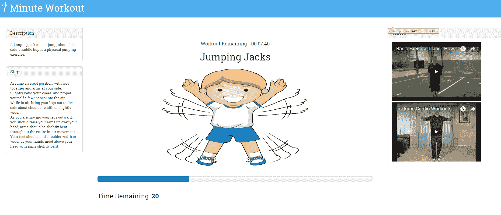
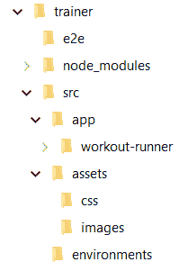
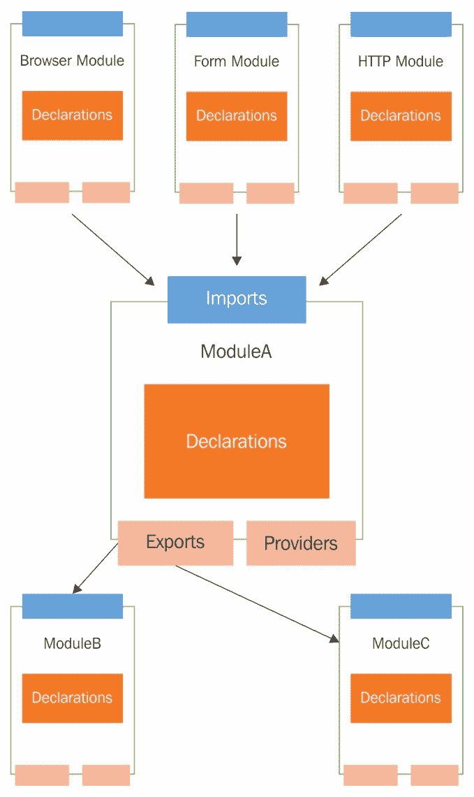
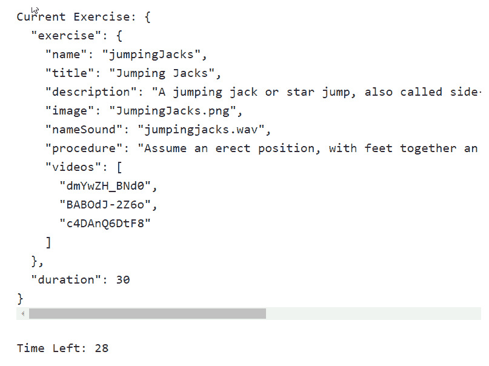
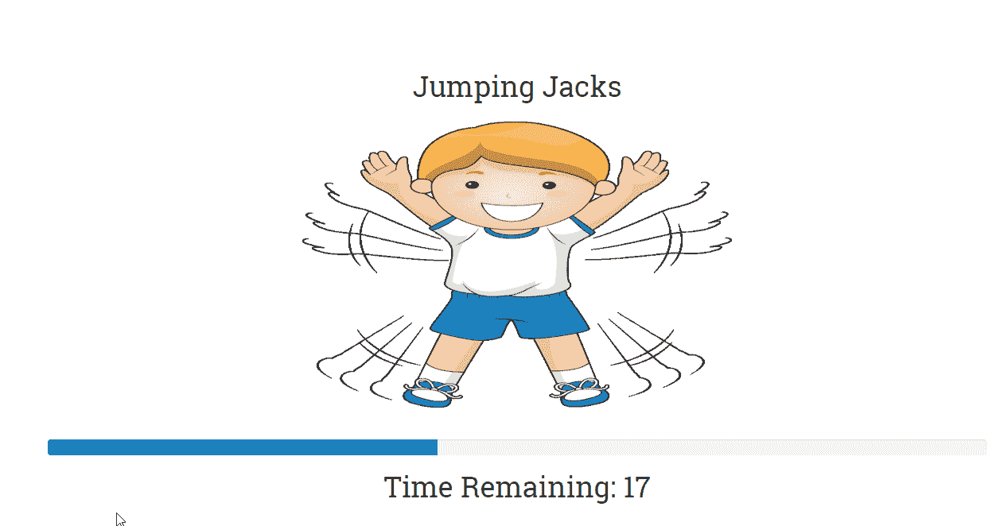
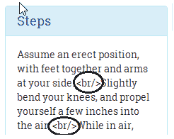
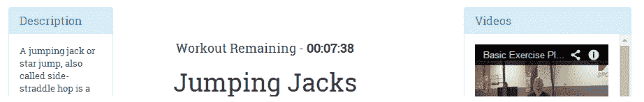
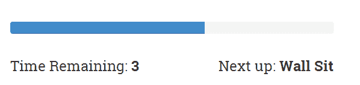
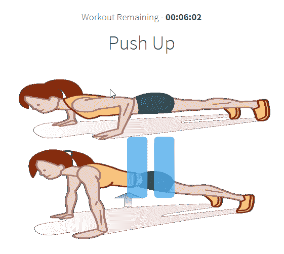
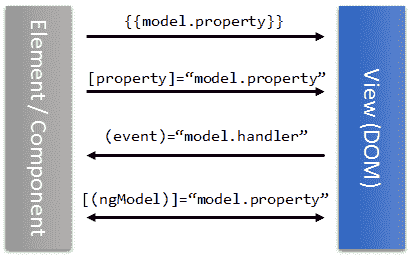

# 第一章：构建我们的第一个应用程序 - 7 分钟锻炼

我们将在 Angular 中构建一个新的应用程序，并在此过程中更加熟悉该框架。此应用程序还将帮助我们探索 Angular 的一些新功能。

本章我们将涉及的主题包括以下内容:

+   **7 分钟锻炼问题描述**: 我们详细描述了本章中我们构建的应用程序的功能。

+   **代码组织**: 对于我们的第一个真正的应用程序，我们将尝试解释如何组织代码，特别是 Angular 代码。

+   **设计模型**: 我们应用程序的基本构建块之一是其模型。我们根据应用程序的需求设计应用程序模型。

+   **理解数据绑定基础设施**: 在构建*7 分钟锻炼*视图时，我们将了解框架的数据绑定能力，其中包括*属性*、*属性*、*类*、*样式*和*事件*绑定。

+   **探索 Angular 平台指令**: 我们将涉及的一些指令有 `ngFor`、`ngIf`、`ngClass`、`ngStyle` 和 `ngSwitch`。

+   **使用输入属性进行跨组件通信**: 当我们构建嵌套组件时，我们学习了如何使用输入属性将数据从父组件传递给其子组件。

+   **使用事件进行跨组件通信**: Angular 组件可以订阅和触发事件。我们将介绍 Angular 中的事件绑定支持。

+   **Angular 管道**: Angular 管道提供了一种格式化视图内容的机制。我们将探索一些标准的 Angular 管道，并构建我们自己的管道以支持从秒数转换为 hh:mm:ss 的转换。

让我们开始吧！我们要做的第一件事是定义我们的*7 分钟锻炼*应用程序。

# 什么是 7 分钟锻炼？

我们希望每个阅读本书的人都能保持身体健康。因此，本书应该具有双重目的；它不仅应该刺激您的大脑，还应该敦促您关注您的身体健康。有什么比构建一个针对身体健康的应用程序更好的方法呢!

*7 分钟锻炼* 是一款在七分钟内快速连续进行一组 12 个练习的锻炼应用程序。*7 分钟锻炼* 因其短小而产生了巨大的好处而变得相当受欢迎。我们无法证实或否认这些说法，但进行任何形式的费力的体力活动比不做任何事情要好。如果您对这项锻炼感兴趣，那么请访问 [`well.blogs.nytimes.com/2013/05/09/the-scientific-7-minute-workout/`](http://well.blogs.nytimes.com/2013/05/09/the-scientific-7-minute-workout/) 了解更多信息。

应用的技术细节包括完成一组 12 个练习，每个练习耗时 30 秒。在开始下一个练习之前，会有一个简短的休息时间。对于我们要构建的应用程序，我们将每次休息 10 秒。因此，总时长略长于七分钟。

在本章结束时，我们将准备好*7 分钟锻炼*应用程序，它看起来类似于以下内容：



7 分钟锻炼应用

# 下载代码库

该应用程序的代码可以从专门为本书创建的 GitHub 站点（[`github.com/chandermani/angular6byexample`](https://github.com/chandermani/angular6byexample)）上下载。由于我们正在逐步构建该应用程序，我们已经创建了**多个检查点**，与**GitHub 分支**如`checkpoint2.1`、`checkpoint2.2`等相对应。在叙述过程中，我们会强调用于参考的分支。这些分支将包含直到该时间点为止的应用程序完成的工作。

*7 分钟锻炼*的代码可以在名为`trainer`的存储库文件夹中找到。

那么，让我们开始吧！

# 搭建构建环境

请记住，我们正在构建一个现代平台，浏览器仍然缺乏支持。因此，在 HTML 中直接引用脚本文件是行不通的（虽然常见，但这是一种应该避免的陈旧方法）。浏览器不理解**TypeScript**；这意味着必须有一个过程将使用 TypeScript 编写的代码转换为标准的**JavaScript（ES5）**。因此，为任何 Angular 应用程序设置构建变得至关重要。由于 Angular 的日益流行，我们永远不缺选项。

如果你是一个在 web 技术栈上工作的前端开发人员，那么你无法避免使用**Node.js**。这是最广泛使用的用于 web/JavaScript 开发的平台。因此，可以想像到大多数 Angular 构建解决方案都是由 Node 支持的。像**Grunt**、**Gulp**、**JSPM**和**webpack**这样的包是任何构建系统的常见构建模块。

由于我们正在建立在 Node.js 平台上，所以请在开始之前安装 Node.js。

对于本书和这个示例应用程序，我们推荐使用**Angular CLI**（[`bit.ly/ng6be-angular-cli`](http://bit.ly/ng6be-angular-cli)）。作为一个命令行工具，它有一个构建系统和一个脚手架工具，极大简化了 Angular 的开发工作流程。它受欢迎、易于设置、易于管理，并支持几乎所有现代构建系统应有的功能。关于它的更多内容稍后再说。

与任何成熟的框架一样，Angular CLI 并不是 Web 上唯一的选择。社区创建的一些值得注意的起始站点加构建设置如下:

| **启动站点** | **位置** |
| --- | --- |
| `angular2-webpack-starter` | [`bit.ly/ng2webpack`](http://bit.ly/ng2webpack) |
| `angular-seed` | [`github.com/mgechev/angular-seed`](https://github.com/mgechev/angular-seed) |

让我们从安装 Angular CLI 开始。在命令行上输入以下内容:

```ts
npm i -g @angular/cli
```

安装后，Angular CLI 会向我们的执行环境添加一个名为`ng`的新命令。要从命令行创建一个新的 Angular 项目，请运行以下命令:

```ts
ng new PROJECT-NAME
```

这将生成一个文件夹结构，一堆文件，一个模板 Angular 应用程序和一个预配置的构建系统。要从命令行运行应用程序，请执行以下命令：

```ts
ng serve --open
```

然后你就能看到一个基本的 Angular 应用程序在运行！

对于我们的*7 分钟锻炼*应用程序，我们不打算从零开始，而是打算从基于`ng new`生成的项目结构的版本进行一些微小的修改。按照以下步骤开始：

想知道默认项目包含什么？试试运行`ng new PROJECT-NAME`命令。查看生成的内容结构和 Angular CLI 文档，了解默认设置包含了哪些内容。

1.  从[`bit.ly/ngbe-base`](http://bit.ly/ngbe-base)下载这个应用程序的基础版本并解压到计算机上的某个位置。如果你熟悉 Git 的工作原理，你可以直接克隆存储库并检出`base`分支：

```ts
git checkout base
```

这段代码作为我们应用程序的起点。

1.  从命令行导航到`trainer`文件夹，并执行`npm install`命令来安装我们应用程序的**包依赖**。

在 Node.js 的世界中，**包**是第三方库（比如我们应用程序中的 Angular）或者支持应用程序构建过程的库。**npm** 是一个命令行工具，用于从远程存储库中拉取这些包。

1.  一旦 npm 从 npm 库中拉取了应用程序的依赖，我们就可以准备构建和运行应用程序了。从命令行输入以下命令：

```ts
    ng serve --open
```

这将编译并运行应用程序。如果构建过程正常进行，将会在默认的浏览器窗口/标签中打开一个基本的应用程序页面（`http://localhost:4200/`）。我们已经准备好开始在 Angular 中开发我们的应用程序了！

但在那之前，了解一下 Angular CLI 及我们对 Angular CLI 生成的默认项目模板进行的自定义会很有趣。

# Angular CLI

**Angular CLI** 的创建旨在规范化和简化 Angular 应用程序的开发和部署工作流程。正如文档所建议的：

"Angular CLI 可以轻松创建一个应用程序，它已经可以直接使用。它已经遵循了我们的最佳实践！"

它包括：

+   基于**webpack**的构建系统

+   一个用于生成所有标准 Angular 组件的**脚手架工具**，包括模块、指令、组件和管道

+   遵循**Angular 样式指南**（[`bit.ly/ngbe-styleguide`](http://bit.ly/ngbe-styleguide)），确保我们在各种形状和大小的项目中使用社区驱动的标准

也许你从来没有听说过"样式指南"这个术语，或者不明白它的意义。在任何技术中，样式指南都是一组指导方针，帮助我们组织和编写易于开发、维护和扩展的代码。要理解和欣赏 Angular 自己的样式指南，需要对框架本身有一定的了解，而我们已经开始了这个过程。

+   一个有针对性的**代码检查器；** Angular CLI 集成了**codelyzer**（[`bit.ly/ngbe-codelyzer`](http://bit.ly/ngbe-codelyzer)），这是一个**静态代码分析工具**，用于验证我们的 Angular 代码是否符合规定的一组规则，以确保我们编写的代码符合 Angular 风格指南中制定的标准。

+   预配置的**单元测试**和**端到端**（**e2e**）测试框架

还有更多！

想象一下，如果我们必须手动完成所有这些工作！陡峭的学习曲线会迅速让我们感到不知所措。幸运的是，我们不必处理它，Angular CLI 会为我们完成。

Angular CLI 构建设置基于 webpack，但它不会公开底层 webpack 配置；这是有意的。Angular 团队希望将开发人员与 webpack 的复杂性和内部工作隔离开来。Angular CLI 的最终目标是消除任何入门障碍，使设置和运行 Angular 代码变得简单。

这并不意味着 Angular CLI 不可配置。有一个*配置文件*（`angular.json`），我们可以用它来更改构建设置。我们将不在此处进行处理。查看 7 分钟锻炼的配置文件，并在这里阅读文档：[`bit.ly/ng6be-angular-cli-config`](http://bit.ly/ng6be-angular-cli-config)。

我们对默认生成的项目模板所做的调整包括：

+   在`style.css`文件中引用了 Bootstrap CSS。

+   升级了一些 npm 库版本。

+   将生成代码的前缀配置更改为使用`abe`（Angular By Example 的简称）而不是`app`。通过这种更改，我们所有的组件和指令选择器将以`abe`作为前缀，而不是`app`。查看`app.component.ts`；`selector`是`abe-root`，而不是`app-root`。

谈到 Angular CLI 和构建的话题，有一件事情我们在继续之前应该了解。

*我们编写的 TypeScript 代码会怎样呢？*

# 代码转译

众所周知，浏览器只能处理 JavaScript，它们不理解 TypeScript。因此，我们需要一种机制将我们的 TypeScript 代码转换为纯 JavaScript（**ES5**是我们最安全的选择）。这个工作由**TypeScript 编译器** 完成。编译器接收 TypeScript 代码并将其转换为 JavaScript。这个过程通常被称为**转译**，而由于 TypeScript 编译器完成了这项工作，因此称为**转译器**。

多年来，JavaScript 作为一种语言不断发展，每个新版本都为语言增加新的特性/功能。最新的版本，ES2015，继承自 ES5，并对语言进行了重大更新。虽然发布于 2015 年 6 月，但一些较旧的浏览器仍然缺乏对 JavaScript ES2015 版本的支持，这使得其采用成为一项挑战。

当将 TypeScript 代码转译为 JavaScript 时，我们可以指定要使用的 JavaScript 版本。如前所述，ES5 是最安全的选择，但如果我们计划只使用最新和最好的浏览器，那就选择 ES2015。对于 7 分钟锻炼应用程序，我们要转译的代码是 ES5 格式。我们在`tsconfig.json`中设置了这个 TypeScript 编译器的配置（参见`target`属性）。

有趣的是，转译可以在构建/编译时和运行时都发生：

+   **构建时转译**：作为构建过程的一部分，将脚本文件（在我们的例子中，TypeScript 的`.ts`文件）编译成普通的 JavaScript。Angular CLI 就是实现构建时转译的。

+   **运行时转译**：这发生在浏览器运行时。我们直接引用 TypeScript 文件（在我们的例子中是`.ts`文件），而浏览器中先加载的 TypeScript 编译器会即时编译这些脚本文件。这只适用于小范例/代码片段，因为加载转译器和即时转译代码会增加额外的性能开销。

转译的过程不仅局限于 TypeScript。针对 Web 的每一种编程语言，比如**CoffeeScript**、**ES2015**（是的，JavaScript 本身！）或者其他任何浏览器不本能理解的语言，都需要转译。大多数语言都有转译器，而最著名的（除了 TypeScript）是**tracuer**和**babel**。

Angular CLI 的构建系统负责设置 TypeScript 编译器，并设置文件监视器，以便在我们每次对 TypeScript 文件进行更改时重新编译代码。

如果你对 TypeScript 还不熟悉，要记住 TypeScript 并不依赖 Angular；实际上，Angular 是建立在 TypeScript 之上的。我强烈推荐你查看官方的 TypeScript 文档（[`www.typescriptlang.org/`](https://www.typescriptlang.org/)），并在 Angular 的范畴之外学习这门语言。

让我们回到我们正在构建的应用程序，开始探索代码设置。

# 代码组织

Angular CLI 的优势在于它规定了适用于各种应用程序规模的代码组织结构。下面是当前的代码组织结构：



+   `trainer`是应用程序的根文件夹。

+   `trainer`文件夹内的文件是配置文件和一些标准文件，这些文件都是标准的节点应用程序的一部分。

+   `e2e`文件夹将包含应用程序的端到端测试。

+   `src`是所有开发活动发生的主要文件夹。所有应用程序产物都放在`src`里。

+   `src`文件夹内的`assets`文件夹托管静态内容（比如图片、CSS、音频文件等）。

+   `app`文件夹里包含了应用的源代码。

+   `environments`文件夹对于设置不同部署环境（比如*dev, qa, production*）的配置非常有用。

要将 Angular 代码组织在 `app` 文件夹内，我们参考了 Angular 团队发布的 Angular 风格指南 ([`bit.ly/ng6be-style-guide`](http://bit.ly/ng6be-style-guide))。

# 功能文件夹

风格指南建议使用 **功能文件夹** 来组织代码。使用功能文件夹，与单个功能相关的文件被放在一起。如果一个功能增长，我们将其进一步拆分为子功能，将代码存放在子文件夹中。考虑将 `app` 文件夹作为我们的第一个功能文件夹！随着应用程序的增长，`app` 将添加子功能以更好地组织代码。

让我们直接开始构建应用程序。我们的第一个关注点是应用程序的模型！

# 7 分钟训练模型

为这个应用程序设计模型需要我们首先详细描述 *7 分钟训练* 应用程序的功能方面，然后推导出一个满足这些要求的模型。根据早些定义的问题陈述，一些明显的要求如下：

+   能够开始训练。

+   提供关于当前练习及其进度的视觉线索。这包括以下内容：

    +   提供当前练习的视觉描述

    +   提供如何执行特定练习的逐步说明

    +   当前练习剩余时间

+   当训练结束时通知用户。

我们将添加到这个应用程序的一些其他有价值的功能如下：

+   暂停当前训练的能力。

+   提供下一个要执行的练习的信息。

+   提供音频线索，使用户可以在不断看屏幕的情况下执行训练。这包括：

    +   定时器点击声音

    +   下一个练习的详细信息

    +   表示即将开始的练习

+   显示正在进行的练习的相关视频，并具备播放它们的能力。

如我们所见，这个应用程序的中心主题是 **训练** 和 **练习**。在这里，一个训练是按特定顺序在特定时间内进行的一组练习。因此，让我们继续为我们的训练和练习定义模型。

根据刚才提到的要求，我们将需要关于一个练习的以下详细信息：

+   名称。这应该是唯一的。

+   标题。这将显示给用户。

+   练习的描述。

+   如何执行练习的说明。

+   练习的图片。

+   练习的音频片段名称。

+   相关视频。

使用 TypeScript，我们可以为我们的模型定义类。

`Exercise` 类如下所示：

```ts
export class Exercise { 
  constructor( 
    public name: string,
    public title: string,
    public description: string, 
    public image: string,
    public nameSound?: string,
    public procedure?: string,
    public videos?: Array<string>) { }
} 
```

TypeScript 技巧

使用 `public` 或 `private` 声明构造函数参数是一种一次性创建和初始化类成员的简写方式。在 `nameSound`、`procedure` 和 `videos` 后面的 `?` 后缀表示这些是可选参数。

对于训练，我们需要跟踪以下属性：

+   名称。这应该是唯一的。

+   标题。这将显示给用户。

+   训练中包含的练习。

+   每个练习的持续时间。

+   两个练习之间的休息时间。

用于跟踪 workout 进度的模型类(`WorkoutPlan`)如下所示:

```ts
export class WorkoutPlan { 
  constructor( 
    public name: string, 
    public title: string, 
    public restBetweenExercise: number, 
 public exercises: ExercisePlan[], 
    public description?: string) { } 

  totalWorkoutDuration(): number { ... } 
} 
```

`totalWorkoutDuration`函数返回 workout 的总持续时间（以秒为单位）。

`WorkoutPlan`在前面的定义中有另一个类`ExercisePlan`的引用。它跟踪 workout 中的练习及其持续时间,这一点很明显,一旦我们查看`ExercisePlan`的定义:

```ts
export class ExercisePlan { 
  constructor( 
    public exercise: Exercise, 
    public duration: number) { } 
} 
```

让我为您节省一些输入时间,告诉您从哪里获取模型类,但在此之前,我们需要决定在哪里添加它们。我们已经准备好我们的第一个特性了。

# 第一个特性模块

*7 Minute Workout*的主要功能是执行预定义的一组练习。因此，我们现在要创建一个特性模块，并稍后将特性实现添加到这个模块中。我们把这个模块称为`workout-runner`。让我们使用 Angular CLI 的脚手架功能初始化这个特性。

从命令行导航到`trainer/src/app`文件夹,并运行以下命令:

```ts
ng generate module workout-runner --module app.module.ts
```

关注控制台日志,了解生成了哪些文件。该命令基本上是:

+   在一个新的`workout-runner`文件夹内创建一个新的 Angular `WorkoutRunnerModule`模块

+   将新创建的模块导入到主应用程序模块`app（app.module.ts）`中。

我们现在拥有一个新的**特性模块**。

给每个特性一个自己的模块。

特别注意 Angular CLI 在搭建 Angular 构件时遵循的约定。从前面的示例中,命令行提供的模块名称为`workout-runner`。虽然生成的文件夹和文件名使用相同的名称,但生成的模块的类名为`WorkoutRunnerModule`（帕斯卡大小写,带有`Module`后缀）。

打开新生成的模块定义(`workout-runner.module.ts`)并查看生成的内容。`WorkoutRunnerModule`导入`CommonModule`，这是一个包含常用 Angular 指令（如`ngIf`和`ngFor`）的模块，允许我们在`WorkoutRunnerModule`中定义的任何组件/指令中使用这些常用指令。

模块是 Angular 组织代码的方式。我们将很快讨论 Angular 模块。

将`model.ts`文件从[`bit.ly/ng6be-2-1-model-ts`](http://bit.ly/ng6be-2-1-model-ts)复制到`workout-runner`文件夹。稍后,我们将看到如何利用这些模型类。

由于我们已经启动了一个预配置的 Angular 应用程序，我们只需要了解应用程序如何启动。

# 应用程序引导

*7 Minute Workout*的应用程序引导过程可以从`src`文件夹中进行。有一个`main.ts`文件通过调用以下命令来引导应用程序:

```ts
platformBrowserDynamic().bootstrapModule(AppModule)
    .catch(err => console.log(err));
```

繁重的工作由 Angular CLI 完成，它编译应用程序，将脚本和 CSS 引用包含到`index.html`中，并运行应用程序。我们不需要配置任何东西。这些配置是 Angular CLI 默认配置（`.angular-cli.json`）的一部分。

我们创建了一个新模块，并将一些模型类添加到`module`文件夹中。在进一步实现该功能并开始之前，让我们稍微谈一下**Angular 模块**。

# 探索 Angular 模块

随着 *7 分钟锻炼* 应用程序的增长，我们向其中添加新的组件/指令/管道/其他构件，需要组织这些项目。其中的每一项都需要成为 Angular 模块的一部分。

一个天真的方法是在我们应用的根模块（`AppModule`）中声明所有内容，就像我们对`WorkoutRunnerComponent`所做的那样，但这背离了 Angular 模块的整体目的。

要了解为什么单一模块方法永远不是一个好主意，请探索 Angular 模块。

# 理解 Angular 模块

在 Angular 中，**模块**是一种将代码组织成属于一起并作为一个统一单元工作的方式。模块是 Angular 分组和组织代码的方式。

Angular 模块主要定义：

+   它拥有的组件/指令/管道

+   它向其他模块公开的组件/指令/管道

+   其依赖的其他模块

+   模块希望应用程序范围内提供的服务

任何规模较大的 Angular 应用都将模块相互连接在一起：一些模块从其他模块消费构件，一些模块将构件提供给其他模块，一些模块都进行了两者。

作为标准做法，模块的分离是基于特性的。将应用程序划分成特性或子特性（对于大型特性），并为每个特性创建模块。即使框架也遵循此准则，因为所有框架构件都被分为各个模块：

+   有`CommonModule`，汇集了在每个基于浏览器的 Angular 应用中使用的标准框架构件

+   如果想要使用 Angular 路由框架，则有`RouterModule`。

+   如果我们的应用需要通过 HTTP 与服务器通信，有`HtppModule`。

Angular 模块是通过将 `@NgModule` 装饰器应用于 TypeScript 类来创建的。装饰器定义公开了足够的元数据，允许 Angular 加载模块引用的一切。

装饰器具有多个属性，允许我们定义：

+   外部依赖项（使用`imports`）。

+   模块构件（使用`declarations`）。

+   模块输出（使用`exports`）。

+   在模块内定义的需要全局注册的服务（使用`providers`）。

+   主应用视图，称为**根组件**，承载所有其他应用视图。只有根模块才应该使用`bootstrap`属性进行设置。

此图表突出显示了模块内部及其相互链接的内容：



在 Angular 上下文中定义的模块（使用 `@NgModule` 装饰器）和我们在 TypeScript 文件中使用 `import` 语句导入的模块是不同的。通过 `import` 语句导入的模块是**JavaScript 模块**，可以采用*CommonJS*、*AMD*或*ES2015*规范的不同格式，而 Angular 模块是 Angular 用来分隔和组织其构件的构造物。除非讨论的上下文明确是 JavaScript 模块，否则对模块的任何引用都意味着是一个 Angular 模块。我们可以在这里了解更多信息：[`bit.ly/ng2be6-module-vs-ngmodule`](http://bit.ly/ng2be6-module-vs-ngmodule)。

我们希望从所有这些讨论中有一件事是清楚的：除非您正在构建一些基本的东西，否则创建单一的应用程序范围模块并不是 Angular 模块的正确用法。

现在是时候投入行动了；让我们构建我们的第一个组件。

# 我们的第一个组件 - WorkoutRunnerComponent

`WorkoutRunnerComponent`是我们的*7 分钟锻炼*应用的核心部分，它将包含执行锻炼的逻辑。

我们在`WorkoutRunnerComponent`实现中将要做的事情如下：

1.  开始锻炼。

1.  显示正在进行的锻炼和显示进度指示器。

1.  练习时间结束后，显示下一个练习。

1.  重复这个过程，直到所有的练习都结束。

我们准备创建（或脚手架）我们的组件。

从命令行，进入`src/app`文件夹并执行以下`ng`命令：

```ts
ng generate component workout-runner -is
```

生成器在`workout-runner`文件夹中生成一堆文件（三个），并更新`WorkoutRunnerModule`中的模块声明以包括新创建的`WorkoutRunnerComponent`。

`-is`标志用于停止为组件生成单独的 CSS 文件。由于我们使用全局样式，我们不需要组件特定的样式。

请记住从`src/app`文件夹而不是`src/app/workout-runner`文件夹运行此命令。如果我们从`src/app/workout-runner`运行前面的命令，Angular CLI 将创建一个新的子文件夹，并包含`workout-runner`组件定义。

用于组件的前述`ng generate`命令生成这三个文件：

+   `<component-name>.component.html`：这是组件的视图 HTML。

+   `<component-name>.component.spec.ts`：单元测试中使用的测试规范文件。

+   `<component-name>.component.ts`：包含组件实现的主要组件文件。

再次，我们鼓励你查看生成的代码，以了解生成了什么。Angular CLI 组件生成器节省了我们一些按键操作，一旦生成，样板代码可以根据需要进行修改。

虽然我们只看到了四个装饰器元数据属性（比如 `templateUrl`），但是组件装饰器也支持一些其他有用的属性。查看 Angular 文档以了解更多关于这些属性及其应用的信息。

一个敏锐的读者可能会注意到生成的`selector`属性值具有前缀`abe`；这是有意为之。因为我们正在扩展 HTML 的**领域特定语言**（**DSL**）以包含一个新元素，前缀`abe`帮助我们划分了我们开发的 HTML 扩展。因此，我们在 HTML 中使用`<abe-workout-runner></abe-workout-runner>`而不是`<workout-runner></workout-runner>`。前缀值已在`angular.json`中配置，参见`prefix`属性。

请始终为您的组件选择器添加前缀。

现在我们已经有了`WorkoutRunnerComponent`的样板；让我们开始添加实现，首先是添加模型引用。

在`workout-runner.component.ts`中，导入所有训练模型：

```ts
import {WorkoutPlan, ExercisePlan, Exercise} from './model';
```

接下来，我们需要设置训练数据。让我们通过在生成的`ngOnInit`函数和与`WorkoutRunnerComponent`类相关的类属性中添加一些代码来完成：

```ts
workoutPlan: WorkoutPlan; 
restExercise: ExercisePlan; 
ngOnInit() { 
   this.workoutPlan = this.buildWorkout(); 
   this.restExercise = new ExercisePlan( 
     new Exercise('rest', 'Relax!', 'Relax a bit', 'rest.png'),  
     this.workoutPlan.restBetweenExercise);   
} 
```

`ngOnInit`是 Angular 在组件初始化时调用的特殊函数。我们即将讨论`ngOnInit`。

`buildWorkout`在`WorkoutRunnerComponent`上设置完成的训练计划，正如我们即将定义的那样。我们还初始化了一个`restExercise`变量，以跟踪甚至作为练习的休息时间（注意，`restExercise`是`ExercisePlan`类型的对象）。

`buildWorkout`函数很长，最好从可在 Git 分支 checkpoint2.1 中获取的 workout runner 的实现中复制实现（[`bit.ly/ng6be-2-1-workout-runner-component-ts`](http://bit.ly/ng6be-2-1-workout-runner-component-ts)）。`buildWorkout`代码如下：

```ts
buildWorkout(): WorkoutPlan { 
let workout = new WorkoutPlan('7MinWorkout',  
"7 Minute Workout", 10, []); 
   workout.exercises.push( 
      new ExercisePlan( 
        new Exercise( 
          'jumpingJacks', 
          'Jumping Jacks', 
          'A jumping jack or star jump, also called side-straddle hop
           is a physical jumping exercise.', 
          'JumpingJacks.png', 
          'jumpingjacks.wav', 
          `Assume an erect position, with feet together and 
           arms at your side. ...`, 
          ['dmYwZH_BNd0', 'BABOdJ-2Z6o', 'c4DAnQ6DtF8']), 
        30)); 
   // (TRUNCATED) Other 11 workout exercise data. 
   return workout; 
} 
```

此代码构建了`WorkoutPlan`对象，并将练习数据推入`exercises`数组（一组`ExercisePlan`对象），返回新构建的训练计划。

初始化工作完成；现在是时候实际实现*开始*训练了。将以下`start`函数添加到`WorkoutRunnerComponent`的实现中：

```ts
start() { 
   this.workoutTimeRemaining =  
   this.workoutPlan.totalWorkoutDuration(); 
   this.currentExerciseIndex = 0;  
   this.startExercise(this.workoutPlan.exercises[this.currentExerciseIndex]); 
} 
```

然后在顶部声明在函数中使用的新变量，以及其他变量声明：

```ts
workoutTimeRemaining: number; 
currentExerciseIndex: number; 
```

`workoutTimeRemaining`变量跟踪训练的剩余时间，`currentExerciseIndex`跟踪当前执行的练习索引。调用`startExercise`实际上开始了一项练习。以下是`startExercise`的代码：

```ts
startExercise(exercisePlan: ExercisePlan) { 
    this.currentExercise = exercisePlan; 
    this.exerciseRunningDuration = 0; 
    const intervalId = setInterval(() => { 
      if (this.exerciseRunningDuration >=  this.currentExercise.duration) { 
          clearInterval(intervalId);  
      } 
      else { this.exerciseRunningDuration++; } 
    }, 1000); 
} 
```

我们首先初始化`currentExercise`和`exerciseRunningDuration`。`currentExercise`变量跟踪正在进行的练习，而`exerciseRunningDuration`跟踪其持续时间。这两个变量也需要在顶部声明：

```ts
currentExercise: ExercisePlan; 
exerciseRunningDuration: number; 
```

我们使用`setInterval` JavaScript 函数，延迟一秒（1,000 毫秒），以取得进展。在`setInterval`回调内，`exerciseRunningDuration`会随着每过一秒而增加。嵌套的`clearInterval`调用将在运动持续时间结束时停止计时器。

TypeScript 箭头函数

传递给`setInterval`的回调参数（`()=>{...}`）是一个 lambda 函数（或者是 ES2015 中的箭头函数）。Lambda 函数是匿名函数的简写表示，带有额外的好处。您可以在 [`bit.ly/ng2be-ts-arrow-functions`](http://bit.ly/ng2be-ts-arrow-functions) 了解更多关于它们的知识。

组件的第一次切割几乎完成了，但是它目前有一个静态视图（UI），因此我们无法验证实现。我们可以通过添加一个初步的视图定义迅速纠正这种情况。打开`workout-runner.component.ts`，注释掉`templateUrl`属性，添加一个内联模板属性（`template`）并将其设置为以下内容：

```ts
template: `<pre>Current Exercise: {{currentExercise | json}}</pre>
<pre>Time Left: {{currentExercise.duration - exerciseRunningDuration}}</pre>`,
```

用反引号（`` ``）括起来的字符串是 ES2015 的一个新加入的特性。也被称为模板字面量，这样的字符串字面量可以是多行的，并且允许在其中嵌入表达式（不要与 Angular 表达式混淆）。在 MDN 的文章 [`bit.ly/template-literals`](http://bit.ly/template-literals) 中查看更多细节。

内联与外部视图模板上面的`template`属性是**内联组件模板**的一个例子。这允许组件开发人员内联指定组件模板，而不是使用单独的 HTML 文件。内联模板方法通常适用于视图较为简单的组件。内联模板有一个缺点：HTML 格式化变得困难，而且 IDE 支持非常有限，因为内容被视为字符串字面量。当我们将 HTML 外部化时，我们可以开发一个模板作为一个普通的 HTML 文档。我们建议您为复杂的视图使用**外部模板文件**（通过`templateUrl`指定）。Angular CLI 默认生成外部模板引用，但我们可以通过向`ng`组件生成命令传递`--inline-template`标志来影响此行为，例如 `--inline-template true`。

前面的模板 HTML 将呈现原始的`ExercisePlan`对象以及剩余的练习时间。在第一个插值内有一个有趣的表达式：`currentExercise | json`。`currentExercise`属性在`WorkoutRunnerComponent`中定义，但是`|`符号及其后的内容（`json`）是什么？在 Angular 世界中，这被称为一个**管道**。管道的唯一目的是转换/格式化模板数据。

此处的`json`管道是对 JSON 数据进行格式化。您将在本章后面学到更多关于管道的知识，但为了大致了解`json`管道的作用，我们可以移除`json`管道和 `|` 符号，然后呈现模板；我们将在下一步中执行此操作。

要呈现新的`WorkoutRunnerComponent`实现，它必须被添加到根组件的视图中。修改`src/components/app/app.component.html`，使用以下代码替换`h3`标签：

```ts
<div class="container body-content app-container">
      <abe-workout-runner></abe-workout-runner>
</div>
```

虽然实现看起来可能已经完成，但是还缺少一个关键的部分。代码中实际上并没有启动练习。练习应该在页面加载时立即开始。

组件的生命周期钩子将拯救我们！

# 组件的生命周期钩子

Angular 组件的生命周期是充满事件的。组件被创建，在其生命周期内状态发生变化，最终被销毁。Angular 提供了一些**生命周期钩子**/**函数**，当发生这样的事件时（在组件上）框架会调用它们。考虑以下示例：

+   当组件被初始化时，Angular 会调用`ngOnInit`

+   当组件的数据绑定属性发生变化时，Angular 会调用`ngOnChanges`

+   当组件被销毁时，Angular 会调用`ngOnDestroy`

作为开发人员，我们可以利用这些关键时刻，并在相应的组件内执行一些自定义逻辑。

我们将在这里使用的钩子是`ngOnInit`。`ngOnInit`函数在组件的数据绑定属性初始化完成后（但在视图初始化开始之前）首次触发。

虽然`ngOnInit`和类构造函数看起来类似，但它们有不同的用途。*构造函数*是一种语言特性，用于初始化类成员。另一方面，`ngOnInit`用于在组件准备就绪后执行一些初始化操作。避免使用构造函数来进行除成员初始化之外的任何操作。

更新`WorkoutRunnerComponent`类中的`ngOnInit`函数，以调用开始锻炼的代码：

```ts
ngOnInit() { 
    ...
    this.start(); 
} 
```

作为组件脚手架的一部分，Angular CLI 已经为`ngOnInit`生成了签名。`ngOnInit`函数声明在核心 Angular 框架的`OnInit`接口上。我们可以通过查看`WorkoutRunnerComponent`的导入部分来确认这一点：

```ts
import {Component,OnInit} from '@angular/core'; 
... 
export class WorkoutRunnerComponent implements OnInit {
```

还有许多其他生命周期钩子，包括`ngOnDestroy`，`ngOnChanges`和`ngAfterViewInit`，组件都支持，但我们在这里不打算深究其中任何一个。查看开发人员指南（[`angular.io/guide/lifecycle-hooks`](https://angular.io/guide/lifecycle-hooks)）上的生命周期钩子，了解更多关于其他钩子的信息。

实现接口（前面的示例中的`OnInit`）是可选的。只要函数名匹配，这些生命周期钩子就可以起作用。我们仍然建议您使用接口来清晰地传达意图。

是时候运行我们的应用程序了！打开命令行，导航到`trainer`文件夹，并输入以下命令：

```ts
ng serve --open
```

代码编译通过，但没有 UI 呈现。是什么让我们失败了？让我们查看浏览器控制台是否有错误。

打开浏览器的开发工具（常见的键盘快捷键`F12`），并查看控制台标签页以查看错误。有一个模板解析错误。Angular 无法定位`abe-workout-runner`组件。让我们进行一些健全性检查以验证我们的设置：

+   `WorkoutRunnerComponent` 实现完成 - *检查*

+   在`WorkoutRunnerModule`中声明了组件 - *检查*

+   `WorkoutRunnerModule` 导入到`AppModule`中 - *检查*

但是，`AppComponent`模板无法定位`WorkoutRunnerComponent`。这是因为`WorkoutRunnerComponent`和`AppComponent`在不同的模块中吗？的确，这就是问题所在！虽然`WorkoutRunnerModule`已经导入了`AppModule`，但`WorkoutRunnerModule`仍然没有导出新的`WorkoutRunnerComponent`，这将允许`AppComponent`使用它。

请记住，将组件/指令/管道添加到模块的`declaration`部分会使它们在模块内可用。只有在我们导出组件/指令/管道之后，它才可以在模块之间使用。

通过更新`WorkoutRunnerModule`声明的导出数组，来导出`WorkoutRunnerComponent`：

```ts
declarations: [WorkoutRunnerComponent],
exports:[WorkoutRunnerComponent]
```

这次，我们应该看到以下输出：



如果希望在其他模块中使用 Angular 模块内定义的组件，始终导出这些组件。

模型数据随着每秒的过去而更新！现在你会明白为什么插值表达式（`{{ }}`）是一个很好的调试工具。

这也是测试以不使用`json`管道渲染`currentExercise`的好时机，看看会渲染出什么。

我们还没有完成！在页面上等待足够长的时间，我们会发现计时器在 30 秒后停止。应该是时候修复它了！

更新`setInterval`函数内的代码：

```ts
if (this.exerciseRunningDuration >=  this.currentExercise.duration) { 
   clearInterval(intervalId); 
 const next: ExercisePlan = this.getNextExercise(); if (next) { if (next !== this.restExercise) { this.currentExerciseIndex++; } this.startExercise(next);}
 else { console.log('Workout complete!'); } 
} 
```

`if`条件`if (this.exerciseRunningDuration >= this.currentExercise.duration)`用于在当前练习的时间持续时间结束后切换到下一个练习。我们使用`getNextExercise`获取下一个练习，并再次调用`startExercise`来重复这个过程。如果`getNextExercise`调用没有返回任何练习，那么训练被认为已经完成。

在练习过渡期间，只有下一个练习不是休息练习时，我们才会增加`currentExerciseIndex`。请记住，原始的训练计划没有休息练习。为了保持一致性，我们创建了一个休息练习，现在在休息和训练计划中的标准练习之间进行交换。因此，当下一个练习是休息时，`currentExerciseIndex`不会改变。

让我们快速添加`getNextExercise`函数。将函数添加到`WorkoutRunnerComponent`类中：

```ts
getNextExercise(): ExercisePlan { 
    let nextExercise: ExercisePlan = null; 
    if (this.currentExercise === this.restExercise) { 
      nextExercise = this.workoutPlan.exercises[this.currentExerciseIndex + 1]; 
    } 
    else if (this.currentExerciseIndex < this.workoutPlan.exercises.length - 1) { 
      nextExercise = this.restExercise; 
    } 
    return nextExercise; 
} 
```

`getNextExercise`函数返回需要执行的下一个练习。

请注意，`getNextExercise`返回的对象是一个`ExercisePlan`对象，其中包含了练习细节和练习运行的持续时间。

实现方法非常易懂。如果当前练习是休息，就从`workoutPlan.exercises`数组中取下一个练习（基于`currentExerciseIndex`）；否则，下一个练习是休息，前提是我们不在最后一个练习（`else if`条件检查）。

有了这个，我们就可以测试我们的实现了。练习应该在每隔 10 或 30 秒后翻转。太棒了！

当前的构建设置在保存文件时自动编译对脚本文件所做的任何更改；它还在这些更改后刷新浏览器。但是，如果 UI 没有更新或事情不像预期的那样工作，请刷新浏览器窗口。如果您在运行代码时遇到问题，请查看 Git 分支`checkpoint2.1`，了解我们目前所做的工作的可用版本。或者，如果您不使用 Git，请从[`bit.ly/ng6be-checkpoint2-1`](http://bit.ly/ng6be-checkpoint2-1)下载 Checkpoint 2.1 的快照（ZIP 文件）。首次设置快照时，请参阅`trainer`文件夹中的`README.md`文件。

我们已经对组件做了足够的工作，现在让我们构建视图。

# 构建 7 分钟锻炼视图

在定义模型和实现组件时，大部分工作已经完成。现在，我们只需要利用 Angular 的超赞数据绑定功能对 HTML 进行美化。这将简单、甜美且优雅！

对于*7 分钟锻炼*视图，我们需要显示锻炼名称、锻炼图片、进度指示器和剩余时间。请用来自 Git 分支`checkpoint2.2`的文件内容替换`workout-runner.component.html`文件的本地内容（或者从[`bit.ly/ng6be-2-2-workout-runner-component-html`](http://bit.ly/ng6be-2-2-workout-runner-component-html)下载）。视图 HTML 如下所示：

```ts
<div class="row">
  <div id="exercise-pane" class="col-sm">
    <h1 class="text-center">{{currentExercise.exercise.title}}</h1>
    <div class="image-container row">
      
    </div>
    <div class="progress time-progress row">
      <div class="progress-bar col-sm" 
            role="progressbar" 
            [attr.aria-valuenow]="exerciseRunningDuration" 
            aria-valuemin="0" 
            [attr.aria-valuemax]="currentExercise.duration"
            [ngStyle]="{'width':(exerciseRunningDuration/currentExercise.duration) * 
                                                                100 + '%'}">
      </div>
    </div>
    <h1>Time Remaining: {{currentExercise.duration-exerciseRunningDuration}}</h1>
  </div>
</div>
```

`WorkoutRunnerComponent`当前使用内联模板；相反，我们需要恢复使用外部模板。更新`workout-runner.component.ts`文件，去掉`template`属性，然后取消注释我们先前注释掉的`templateUrl`。

在我们理解视图中的 Angular 部分之前，让我们再次运行应用程序。保存`workout-runner.component.html`中的更改，如果一切顺利，我们将看到完整版本的锻炼应用程序：



基本应用程序现在已经启动并正在运行。锻炼图片和标题显示出来了，进度指示器显示了进度，并且当锻炼时间结束时发生了锻炼切换。这肯定感觉很棒！

如果您在运行代码时遇到问题，请查看 Git 分支`checkpoint2.2`，了解我们目前所做的工作的可用版本。您还可以从此 GitHub 位置下载`checkpoint2.2`的快照（ZIP 文件）：[`bit.ly/ng6be-checkpoint-2-2`](http://bit.ly/ng6be-checkpoint-2-2)。首次设置快照时，请参阅`trainer`文件夹中的`README.md`文件。

查看视图的 HTML 时，除了一些 Bootstrap 样式外，还有一些有趣的 Angular 部分需要我们的关注。在我们详细研究这些视图构造之前，让我们先分解这些元素并提供一个快速摘要：

+   `<h1 ...>{{currentExercise.exercise.title}}</h1>`：使用**插值**

+   ``：使用**属性绑定**将图像的`src`属性绑定到组件模型属性`currentExercise.exercise.image`

+   `<div ... [attr.aria-valuenow]="exerciseRunningDuration" ... >`：使用**属性绑定**将*div*上的 aria 属性绑定到`exerciseRunningDuration`

+   `< div ... [ngStyle]="{'width':(exerciseRunningDuration/currentExercise.duration) * 100 + '%'}">`：使用**指令**`ngStyle`将进度条`div`上的`style`属性绑定到一个表达式，该表达式评估了运动进度

哇！牵扯到了很多绑定。让我们深入了解绑定基础设施。

# Angular 绑定基础设施

大多数现代 JavaScript 框架如今都具有强大的模型-视图绑定支持，Angular 也不例外。任何绑定基础设施的主要目标都是减少开发人员需要编写的样板代码，以保持模型和视图同步。强大的绑定基础设施总是声明性和简洁的。

Angular 绑定基础设施允许我们将模板（原始）HTML 转换为与模型数据绑定的活动视图。根据使用的绑定构造，数据可以在模型到视图和视图到模型两个方向上流动并保持同步。

组件的模型与其视图之间的链接是通过`@Component`装饰器的`template`或`templateUrl`属性建立的。除了`script`标签以外，几乎任何 HTML 片段都可以作为 Angular 绑定基础设施的模板。

要使这种绑定魔法生效，Angular 需要获取视图模板，编译它，将其与模型数据关联并使其与模型更新同步，而无需编写任何自定义样板同步代码。

基于数据流方向，这些绑定可以分为三种类型：

+   **一种从模型到视图的单向绑定**：在模型到视图绑定中，模型的变化与视图保持同步。插值、属性、属性、类和样式绑定属于这个类别。

+   **一种从视图到模型的单向绑定**：在这个类别中，视图变化流向模型。事件绑定属于这一类。

+   **双向绑定**：双向绑定，顾名思义，保持视图和模型同步。用于双向绑定的特殊绑定构造是`ngModel`，一些标准的 HTML 数据输入元素如`input`和`select`支持双向绑定。

让我们了解如何利用 Angular 的绑定功能来支持视图模板化。Angular 提供了这些绑定构造：

+   插值

+   属性绑定

+   属性绑定

+   类绑定

+   样式绑定

+   事件绑定

现在是学习所有这些绑定构造的好时机。**插值**是第一个。  

# 插值

**内插**非常简单。内插符号（`{{ }}`）中的表达式（通常称为**模板表达式**）在模型（或组件类成员）的上下文中进行评估，评估的结果（字符串）被嵌入到 HTML 中。这是一个方便的框架构造，用于显示组件的数据/属性。我们使用内插渲染了练习标题和练习剩余时间：

```ts
<h1>{{currentExercise.exercise.title}}</h1>
... 
<h1>Time Remaining: {{currentExercise.duration?-exerciseRunningDuration}}</h1> 
```

记住，内插将模型变化与视图同步。内插是一种从模型到视图的单向绑定。

在 Angular 中，视图绑定始终在组件作用域中进行评估。

事实上，内插是属性绑定的一个特例，它允许我们将任何 HTML 元素/组件属性绑定到模型上。我们很快会讨论如何使用属性绑定语法来编写内插。认为内插是属性绑定的语法糖。

# 属性绑定

属性绑定允许我们将本机 HTML/组件属性绑定到组件的模型并保持同步（从模型->视图）。让我们从不同的角度来看一下属性绑定。

看一下 7 分钟锻炼的组件视图（`workout-runner.component.html`）中的视图摘录：

```ts
 
```

看起来我们在将 `img` 的 `src` 属性绑定到一个在运行时求值的表达式。但我们真的在绑定一个属性吗？还是这是一个属性？属性和属性之间的区别是什么？

在 Angular 领域中，虽然前面的语法看起来像是设置 HTML 元素的属性，实际上它是在进行**属性绑定**。此外，由于许多人不了解 HTML 元素的属性和其属性之间的区别，这个表达式令人非常困惑。因此，在我们了解属性绑定的工作原理之前，让我们试着理解一下元素的属性和属性之间的区别。

# 属性与属性之间的区别

拿起任何 DOM 元素的 API，你会发现属性、属性、函数和事件。虽然事件和函数是不言自明的，但很难理解属性和属性之间的区别。在日常使用中，我们互换使用这些词，这也不会有太大帮助。以这行代码为例：

```ts
<input type="text" value="Awesome Angular"> 
```

当浏览器为这个输入文本框创建一个 DOM 元素（确切地说是 `HTMLInputElement`）时，它使用 `input` 上的 `value` 属性来设置 `input` 的 `value` 属性的初始状态为 `Awesome Angular`。

在初始化之后，对 `input` 的 `value` 属性的任何更改都不会反映在 `value` 属性上；属性始终是`Awesome Angular`（除非明确地再次设置）。可以通过查询 `input` 的状态来确认。

假设我们将 `input` 的数据更改为 `Angular rocks!` 并查询 `input` 元素的状态：

```ts
input.value // value property 
```

`value` 属性始终返回当前输入的内容，即 `Angular rocks!`。而这个 DOM API 函数：

```ts
input.getAttribute('value')  // value attribute 
```

返回`value`属性，并始终是最初设置的`了不起的 Angular`。

元素属性的主要作用是在创建相应的 DOM 对象时初始化元素的状态。

还有许多其他细微差别会增加这种混乱。其中包括以下几点：

+   属性和属性同步在不同属性上不一致。正如我们在上面的例子中看到的，对`input`的`value`属性的更改不会影响`value`属性，但这并不适用于所有属性-值对。图像元素的`src`属性就是一个典型的例子；对属性或属性值的更改始终保持同步。

+   令人惊讶的是，属性和属性之间的映射也不是一一对应的。有许多属性没有任何后备属性（如`innerHTML`），也有一些属性在 DOM 上没有定义相应的属性（如`colspan`）。

+   属性和属性映射也增加了这种混乱，因为它们没有遵循一致的模式。一个很好的例子是在 Angular 开发者指南中，我们将逐字重现的。

`disabled`属性是另一个奇葩的例子。按钮的`disabled`属性默认为`false`，因此按钮是启用的。当我们添加 disabled 属性时，其存在单独将按钮的`disabled`属性初始化为`true`，因此按钮被禁用。添加和删除 disabled 属性会禁用和启用按钮。属性的值是无关紧要的，这就是为什么我们无法通过编写`<button disabled="false">仍然禁用</button>`来启用按钮。

此讨论的目的是确保我们了解 DOM 元素的属性和属性之间的区别。这种新的思维模式将帮助我们继续探索框架的属性和属性绑定能力。让我们回到我们对属性绑定的讨论。

# 属性绑定继续……

现在我们了解了属性和属性之间的区别，让我们再次看一看绑定的例子：

```ts
 
```

`[propertName]`方括号语法用于将`img.src`属性绑定到 Angular 表达式。

属性绑定的一般语法如下所示：

```ts
[target]="sourceExpression"; 
```

在属性绑定的情况下，`目标`是 DOM 元素或组件上的属性。通过属性绑定，我们可以绑定到 DOM 元素上的任何属性。`img`元素上的`src`属性就是我们所使用的；这种绑定适用于任何 HTML 元素及其上的每个属性。

表达式目标也可以是事件，我们很快会看到当我们探索事件绑定时。

绑定的源和目标了解 Angular 绑定中源和目标的区别很重要。出现在`[]`内的属性是目标，有时也被称为**绑定目标**。目标是数据的消费者，并且总是指向组件/元素上的属性。**源**表达式构成了提供数据给目标的数据源。

在运行时，表达式在组件/元素属性的上下文中进行评估（在前面的案例中为`WorkoutRunnerComponent.currentExercise.exercise.image`属性）。

记得始终在目标周围加上方括号`[]`。如果不这样做，Angular 将会把表达式视为字符串常量，并且目标将简单地被分配字符串值。

属性绑定、事件绑定和属性绑定不使用插值符号。以下是无效的：`[src]="{{'/static/images/' + currentExercise.exercise.image}}"`。

如果你曾经使用过 AngularJS，属性绑定和事件绑定一起使 Angular 能够摆脱多个指令，比如`ng-disable`、`ng-src`、`ng-key*`、`ng-mouse*`等一些指令。

从数据绑定的角度来看，Angular 对待组件和原生元素的方式是一样的。因此，属性绑定也适用于组件属性！组件可以定义**输入**和**输出属性**，这些属性可以绑定到视图，比如这样：

```ts
<workout-runner [exerciseRestDuration]="restDuration"></workout-runner> 
```

这个假设的代码片段将`WorkoutRunnerComponent`类上的`exerciseRestDuration`属性绑定到容器组件（父组件）上定义的`restDuration`属性，使我们可以将休息时长作为参数传递给`WorkoutRunnerComponent`。随着我们改进应用程序并开发新组件，你将学会如何在组件上定义自定义属性和事件。

我们可以使用`bind-`语法启用属性绑定，这是一种属性绑定的标准形式。这意味着`[src]="'/assets/images/' + currentExercise.exercise.image"`等同于以下内容：`bind-src="img/' + currentExercise.exercise.image"`.

属性绑定，就像插值一样，是单向的，从组件/元素源到视图。对模型数据的更改与视图保持同步。

我们刚刚创建的模板视图只有一个属性绑定（在`[src]`上）。其他带方括号的绑定不属于属性绑定，我们马上会介绍它们。

# 插值语法糖在属性绑定之上

我们通过描述插值为属性绑定提供了一种语法糖来总结插值部分。我们的意图是强调两者如何可以互换使用。插值语法比属性绑定更为简洁，因此非常有用。这就是 Angular 如何解释插值的方式：

```ts
<h3>Main heading - {{heading}}</h3> 
<h3 [text-content]="' Main heading - '+ heading"></h3>
```

Angular 将第一个语句中的插值转换为`textContent`属性绑定（第二个语句）。

内插法可以用在比你想象的更多地方。以下示例对比了使用内插和属性绑定的相同绑定：

```ts

      // interpolation on attribute

<span [text-content]="helpText"></span>
<span>{{helpText}}</span>
```

尽管属性绑定（和内插）让我们可以轻松将任何表达式绑定到目标属性，但我们应该谨慎选择所使用的表达式。只要我们的组件存活，Angular 的变更检测系统将在应用程序的生命周期内多次评估您的表达式绑定。因此，在将表达式绑定到属性目标时，请牢记这两点指导原则。

# 快速表达式评估

属性绑定表达式应该快速评估。慢速表达式评估可能会影响应用的性能。当执行 CPU 密集型工作的函数作为表达式的一部分时，就会发生这种情况。考虑这个绑定：

```ts
<div>{{doLotsOfWork()}}</div> 
```

Angular 在执行变更检测时，将评估之前的`doLotsOfWork()`表达式。这些变更检测运行的频率比我们想象的要频繁，并且基于一些内部启发式算法，因此我们使用的表达式需要快速评估才是至关重要的。

# 无副作用的绑定表达式

如果在绑定表达式中使用了函数，它应该是无副作用的。考虑另一个绑定：

```ts
<div [innerHTML]="getContent()"></div> 
```

而底层函数`getContent`：

```ts
getContent() { 
  var content=buildContent(); 
  this.timesContentRequested +=1; 
  return content; 
} 
```

`getContent`调用通过每次调用更新`timesContentRequested`属性来改变组件的状态。如果这个属性在视图中使用，比如：

```ts
<div>{{timesContentRequested}}</div> 
```

Angular 会抛出诸如：

```ts
Expression '{{getContent()}}' in AppComponent@0:4' has changed after it was checked. Previous value: '1'. Current value: '2'
```

Angular 框架以开发和生产两种模式工作。如果我们在应用中启用生产模式，则前述错误不会出现。阅读[`bit.ly/enableProdMode`](http://bit.ly/enableProdMode)获取更多框架文档详情。

底线是，在属性绑定中使用的表达式应该是无副作用的。

现在让我们看看一些有趣的东西，`[ngStyle]`，看起来像是属性绑定，但实际上不是。方括号`[]`中指定的目标不是组件/元素的属性（`div`没有`ngStyle`属性），而是一个指令。

需要引入两个新概念，**目标选择**和**指令**。

# Angular 指令

作为一个框架，Angular 试图增强 HTML 的**DSL**（代表**领域特定语言**）：

+   在 HTML 中，组件通过自定义标签引用，例如`<abe-workout-runner></abe-workout-runner>`（不是标准的 HTML 构造）。这突出了第一个扩展点。

+   用于属性和事件绑定的`[]`和`()`定义了第二个扩展点。

+   然后有**指令**，第三个扩展点，进一步分类为**属性**和**结构型指令**，以及**组件**（组件也是指令！）。

尽管组件自带视图，但属性指令用于增强现有元素/组件的外观和/或行为。

结构指令也没有自己的视图；它们改变了应用在其上的元素的 DOM 布局。我们将在本章后面专门讨论理解这些结构指令的完整部分。

在`workout-runner`视图中使用的`ngStyle`指令实际上是一个属性指令。

```ts
<div class="progress-bar" role="progressbar"  
 [ngStyle] = "{'width':(exerciseRunningDuration/currentExercise.duration) * 100 + '%'}"></div>  
```

`ngStyle`指令并没有自己的视图；相反，它允许我们使用绑定表达式在 HTML 元素上设置多个样式（在这种情况下是`width`）。我们将在本书的后面涵盖许多框架属性指令。

指令名称

指令是一个用于组件指令（也称为组件）、属性指令和结构指令的总称。在本书中，当我们使用术语指令时，根据上下文我们将指的是属性指令或结构指令中的一个。组件指令总是被称为组件。

有了对 Angular 具有的指令类型的基本理解，我们就能理解绑定的目标选择过程。

# 绑定的目标选择

在`[]`中指定的目标不限于组件/元素属性。虽然属性名是一个常见的目标，但 Angular 模板引擎实际上进行启发式处理来决定目标类型。Angular 首先搜索注册的已知指令（属性或结构），这些指令具有匹配的选择器，然后再寻找匹配目标表达式的属性。考虑这个视图片段：

```ts
<div [ngStyle]='expression'></div> 
```

寻找目标的过程始于框架查找所有具有匹配选择器（`ngStyle`）的内置和自定义指令。由于 Angular 已经有一个`NgStyle`指令，它成为了目标（指令类名为`NgStyle`，而选择器是`ngStyle`）。如果 Angular 没有内置的`NgStyle`指令，绑定引擎将会在底层组件上寻找名为`ngStyle`的属性。

如果没有匹配目标表达式，就会抛出未知指令错误。

这完成了我们对目标选择的讨论。下一部分是关于属性绑定的。

# 属性绑定

属性绑定存在的唯一原因是 Angular 中存在一些没有相关 DOM 属性的 HTML 属性。`colspan`和`aria`属性就是一些没有相关属性的良好示例。我们的视图中的进度条 div 使用了属性绑定。

如果属性指令仍然让你困惑，我可以理解，它可能变得有点混乱。基本上，它们是不同的。属性指令（例如`[ngStyle]`）改变了 DOM 元素的外观或行为，正如其名称所示，它们是指令。在任何 HTML 元素上没有名为`ngStyle`的属性或属性。另一方面，属性绑定是关于绑定到没有对应 DOM 属性的 HTML 属性。

*7 分钟锻炼*在两个地方使用了属性绑定，分别是`[attr.aria-valuenow]`和`[attr.aria-valuemax]`。我们可能会问一个问题：我们能否使用标准的插值语法来设置属性呢？不能，那是行不通的！让我们试试：打开`workout-runner.component.html`，将两个`[]`中的 aria 属性`attr.aria-valuenow`和`attr.aria-valuemax`替换为下划线代码：

```ts
<div class="progress-bar" role="progressbar"  
    aria-valuenow = "{{exerciseRunningDuration}}"  
    aria-valuemin="0"  
    aria-valuemax= "{{currentExercise.duration}}"  ...> </div> 
```

保存视图，如果应用程序未运行，请运行它。这个错误将在浏览器控制台中弹出:

```ts
Can't bind to 'ariaValuenow' since it isn't a known native property in WorkoutRunnerComponent ... 
```

Angular 试图搜索在不存在的`div`中的`ariaValuenow`属性！记住，插值实际上是属性绑定。

我们希望这能传达要点：要绑定到 HTML 属性，使用属性绑定。

Angular 默认绑定到属性而不是属性。

为了支持属性绑定，Angular 使用了前缀表示法，在`[]`内使用`attr`。属性绑定如下所示:

```ts
[attr.attribute-name]="expression" 
```

恢复原来的 aria 设置使属性绑定生效：

```ts
<div ... [attr.aria-valuenow]="exerciseRunningDuration" 
    [attr.aria-valuemax]="currentExercise.duration" ...> 
```

请注意，如果不附加显式的`attr.`前缀，属性绑定是不起作用的。

虽然我们在训练视图中没有使用样式和类绑定，但这些是一些方便的绑定功能，可能会派上用场。因此，值得探索一下。

# 样式和类绑定

我们使用**类绑定**根据组件状态设置或移除特定类，如下所示：

```ts
[class.class-name]="expression" 
```

当`expression`为`true`时，添加`class-name`，当`expression`为`false`时，移除它。一个简单的例子可能如下所示:

```ts
<div [class.highlight]="isPreferred">Jim</div> // Toggles the highlight class 
```

使用样式绑定根据组件状态设置内联样式:

```ts
[style.style-name]="expression";
```

虽然在训练视图中我们使用了`ngStyle`指令，但我们也可以使用样式绑定，因为我们只涉及到单一样式。使用样式绑定后，同样的`ngStyle`表达式会变成下面这样:

```ts
[style.width.%]="(exerciseRunningDuration/currentExercise.duration) * 100" 
```

`width`是一种样式，由于它还带有单位，我们扩展我们的目标表达式以包含`%`符号。

请记住，`style.`和`class.`是方便的绑定方式，用于设置单一类或样式。为了更灵活，还有相应的属性指令：`ngClass`和`ngStyle`。

在本章早些时候，我们正式介绍了指令及其分类。其中一个指令类型是属性指令（再次强调，不要将它们与我们在前一节介绍的属性绑定混淆）。在下一节中，我们将着重讲述属性指令。

# 属性指令

属性指令是改变组件/元素外观、感觉或行为的 HTML 扩展。正如在 Angular 指令部分中描述的那样，这些指令不定义自己的视图。

除了`ngStyle`和`ngClass`指令外，核心框架还提供了一些其他属性指令。`ngValue`、`ngModel`、`ngSelectOptions`、`ngControl`和`ngFormControl`都是 Angular 提供的一些属性指令。

由于*7 分钟锻炼*使用了`ngStyle`指令，更加深入地探究这个指令及其密切相关的`ngClass`是明智的选择。

虽然下一节专门介绍了如何使用`ngClass`和`ngStyle`属性指令，但直到第四章，*深入学习 Angular 指令*，我们才学习如何创建我们自己的属性指令。

# 使用`ngClass`和`ngStyle`为 HTML 设置样式

Angular 有两个出色的指令，可以让我们在任何元素上动态设置样式并切换 CSS 类。对于 Bootstrap 进度条，我们使用`ngStyle`指令动态设置元素的`width`样式，随着练习的进行而变化：

```ts
<div class="progress-bar" role="progressbar" ... 
    [ngStyle]="{'width':(exerciseRunningDuration/currentExercise.duration) * 100 + '%'}"> </div> 
```

`ngStyle`允许我们一次绑定一个或多个样式到组件的属性。它以对象作为参数。对象上的每个属性名称都是样式名称，值是绑定到该属性的 Angular 表达式，例如以下示例：

```ts
<div [ngStyle]= "{ 
'width':componentWidth,  
'height':componentHeight,  
'font-size': 'larger',  
'font-weight': ifRequired ? 'bold': 'normal' }"></div> 
```

样式不仅可以绑定到组件属性（`componentWidth`和`componentHeight`），还可以设置为常量值（`'larger'`）。表达式解析器还允许使用三元运算符（`?:`）；查看`isRequired`。

如果在 HTML 中样式变得过于复杂，我们也可以选择在我们的组件中编写一个返回对象哈希的函数，并将其设置为表达式：

```ts
<div [ngStyle]= "getStyles()"></div> 
```

此外，组件中的`getStyles`看起来如下所示：

```ts
getStyles () { 
    return { 
      'width':componentWidth, 
      ... 
    } 
} 
```

`ngClass`也是按照相同的原则工作，只是它用于切换一个或多个类。例如，看看以下代码：

```ts
<div [ngClass]= "{'required':inputRequired, 'email':whenEmail}"></div> 
```

当`inputRequired`为`true`时将应用`required`类，反之则将其移除。

指令（自定义或平台）像任何其他 Angular 构件一样，始终属于一个模块。要跨模块使用它们，需要导入该模块。想知道`ngStyle`是在哪里定义的吗？`ngStyle`是核心框架模块`CommonModule`的一部分，并已在训练模块定义中（`workout-runner.module.ts`）导入。`CommonModule`定义了许多方便的指令，它们在整个 Angular 中被使用。

好了！这就涵盖了我们需要了解的有关我们新开发的视图的一切。

正如之前所述，如果在运行代码时遇到问题，请查看 Git 分支`checkpoint2.2`。如果不使用 Git，请从[`bit.ly/ng2be-checkpoint2-2`](http://bit.ly/ng2be-checkpoint2-2)下载`checkpoint2.2`的快照（ZIP 文件）。在第一次设置快照时，请参考`trainer`文件夹中的`README.md`文件。

是时候添加一些增强功能并更多地了解这个框架了！

# 更多了解练习

对于第一次进行这项锻炼的人来说，详细描述每个练习中涉及的步骤将是有益的。我们还可以为每个练习添加一些 YouTube 视频的引用，以帮助用户更好地理解练习。

我们将在左侧面板中添加练习描述和说明，并将其称为**描述面板**。我们还将在右侧面板中添加对 YouTube 视频的引用，即视频播放器面板。为了使事情更加模块化并学习一些新概念，我们将为每个描述面板和视频面板创建独立的组件。

此模型数据已经可用。`Exercise`类的`description`和`procedure`属性（见`model.ts`）提供了有关练习的必要详细信息。`videos`数组包含一些相关的 YouTube 视频 ID，将用于获取这些视频。

# 添加描述和视频面板

Angular 应用程序实际上就是一组组件的层次结构，类似于树结构。截止目前，*7 Minute Workout* 有两个组件，根组件`AppComponent`和其子组件`WorkoutRunnerComponent`，与 HTML 组件布局一致，现在看起来如下：

```ts
<abe-root>
    ...
    <abe-workout-runner>...</abe-workout-runner>
</abe-root>
```

运行应用程序并查看源代码以验证此层次结构。随着我们在应用程序中添加更多组件以实现新功能，该组件树将不断增长并分支出。

我们将向`WorkoutRunnerComponent`添加两个子组件，分别用于支持练习描述和练习视频。虽然我们可以直接向`WorkoutRunnerComponent`视图添加一些 HTML，但我们希望在这里学习一些有关组件间通信的知识。让我们从在左侧添加描述面板开始，并了解组件如何接受输入。

# 带有输入的组件

转到`workour-runner`文件夹并生成一个样板练习描述组件：

```ts
ng generate component exercise-description -is
```

向生成的`exercise-description.component.ts`文件添加突出显示的代码：

```ts
import { Component, OnInit, Input } from '@angular/core';
...
export class ExerciseDescriptionComponent { 
 @Input() description: string; 
  @Input() steps: string; } 
```

`@Input`装饰器表示该组件属性可用于数据绑定。在我们深入研究`@Input`装饰器之前，让我们完成视图并将其与`WorkoutRunnerComponent`集成。

从`workout-runner/exercise-description`文件夹中的 Git 分支`checkpoint2.3`复制练习描述的视图定义，`exercise-description.component.html`。查看练习描述的突出显示的 HTML：

```ts
<div class="card-body">
    <div class="card-text">{{description}}</div>
</div> 
...  
<div class="card-text">
    {{steps}}
</div> 
```

前面的插值引用了`ExerciseDescriptionComponent`的输入属性：`description`和`steps`。

组件定义完成。现在，我们只需在`WorkoutRunnerComponent`中引用`ExerciseDescriptionComponent`并为`ExerciseDescriptionComponent`的`description`和`steps`提供值，以便视图正确呈现。

打开`workout-runner.component.html`并根据以下代码中突出显示部分更新 HTML 片段。在`exercise-pane` div 之前添加一个名为`description-panel`的新 div，并调整`exercise-pane` div 的一些样式，如下所示：

```ts
<div class="row">
    <div id="description-panel" class="col-sm-3">
 <abe-exercise-description 
            [description]="currentExercise.exercise.description"
 [steps]="currentExercise.exercise.procedure"></abe-exercise-description>
 </div>
   <div id="exercise-pane" class="col-sm-6">  
   ... 
```

如果应用正在运行，则描述面板应显示在左侧，并显示相关的练习详情。

`WorkoutRunnerComponent`能够使用`ExerciseDescriptionComponent`是因为它已经在`WorkoutRunnerModule`上声明了（参见`workout-runner.module.ts`中的声明属性）。Angular CLI 组件生成器为我们执行这项工作。

回顾前面视图中的`abe-exercise-description`声明。我们以与本章前面对 HTML 元素属性的引用方式相同的方式引用`description`和`steps`属性。简单、直观且非常优雅！

Angular 数据绑定基础设施确保当`WorkoutRunnerComponent`上的`currentExercise.exercise.description`和`currentExercise.exercise.procedure`属性发生变化时，`ExerciseDescriptionComponent`上绑定的属性`description`和`steps`也会被更新。

`@Input`装饰符可以接受一个属性别名作为参数，这意味着以下内容：考虑一个属性声明，如：`@Input("myAwesomeProperty") myProperty:string`。它可以在视图中如下引用：`<my-component [myAwesomeProperty]="expression"....`

Angular 绑定基础设施的强大之处允许我们将任何组件属性作为可绑定属性，方法是将`@Input`装饰器（和`@Output`也是）附加到它上。我们不限于基本数据类型，如`string`、`number`和`boolean`；也可以是复杂对象，接下来我们将在添加视频播放器时看到：

`@Input`装饰器也可以应用于复杂对象。

在`workout-runner`目录下为视频播放器生成一个新组件：

```ts
ng generate component video-player -is
```

通过从位于 GitHub 位置[`bit.ly/ng6be-2-3-video-player`](http://bit.ly/ng6be-2-3-video-player)的`trainer/src/components/workout-runner/video-player`目录下的`video-player.component.ts`和`video-player.component.html`复制实现，更新生成的样板代码（位于 Git 分支`checkpoint2.3`中）。

让我们来看看视频播放器的实现。打开`video-player.component.ts`并查看`VideoPlayerComponent`类：

```ts
export class VideoPlayerComponent implements OnInit, OnChanges { 
  private youtubeUrlPrefix = '//www.youtube.com/embed/'; 

  @Input() videos: Array<string>; 
  safeVideoUrls: Array<SafeResourceUrl>; 

  constructor(private sanitizer: DomSanitizationService) { } 

  ngOnChanges() { 
    this.safeVideoUrls = this.videos ? 
        this.videos 
            .map(v => this.sanitizer.bypassSecurityTrustResourceUrl(this.youtubeUrlPrefix + v)) 
    : this.videos; 
  } 
} 
```

这里的`videos`输入属性接受一个字符串数组（YouTube 视频代码）。虽然我们将`videos`数组作为输入，但我们并不直接在视频播放器视图中使用该数组；相反，我们将输入数组转换成一个新的`safeVideoUrls`数组并进行绑定。这可以通过查看视图实现来确认：

```ts
<div *ngFor="let video of safeVideoUrls"> 
   <iframe width="198" height="132" [src]="video" frameborder="0" allowfullscreen></iframe> 
</div> 
```

视图还使用了一个名为`ngFor`的新的 Angular 指令来绑定`safeVideoUrls`数组。`ngFor`指令属于一类名为**结构指令**的指令。该指令的作用是根据绑定集合中的元素数量重新生成 HTML 片段。

如果你对`ngFor`指令如何与`safeVideoUrls`一起使用以及为什么我们需要生成`safeVideoUrls`而不是使用`videos`输入数组感到困惑，稍等片刻，因为我们很快就要解决这些问题。但是，让我们先完成`VideoPlayerComponent`与`WorkoutRunnerComponent`的集成，以查看最终结果。

在`exercise-pane` div 后添加组件声明更新`WorkoutRunnerComponent`视图：

```ts
<div id="video-panel" class="col-sm-3">
    <abe-video-player [videos]="currentExercise.exercise.videos"></abe-video-player>
</div> 
```

`VideoPlayerComponent`的`videos`属性绑定到运动的视频集合。

启动/刷新应用程序，视频缩略图应显示在右侧。

如果您在运行代码时遇到问题，请查看 Git 分支`checkpoint2.3`，以获取迄今为止我们所做内容的可工作版本。您还可以从[`bit.ly/ng6be-checkpoint-2-3`](http://bit.ly/ng6be-checkpoint-2-3)下载`checkpoint2.3`的快照（ZIP 文件）。在首次设置快照时，请参考`trainer`文件夹中的`README.md`文件。

现在，是时候回顾并了解`VideoPlayerComponent`实现的部分。我们特别需要理解：

+   `ngFor`指令的工作原理

+   为什么需要将输入的`videos`数组转换为`safeVideoUrls`

+   Angular 组件生命周期事件`OnChanges`的重要性（在视频播放器中使用）

首先，是时候正式介绍`ngFor`和它所属的指令类别：结构指令。

# 结构指令

指令的第三种分类，结构指令，用于操作其布局的组件/元素。

Angular 文档简洁描述了结构指令：

“与定义和控制视图（如组件指令）或修改元素外观和行为（如属性指令）不同，结构指令通过添加和移除整个元素子树来操纵布局。”

由于我们已经涉及到组件指令（例如`workout-runner`和`exercise-description`）和属性指令（例如`ngClass`和`ngStyle`），我们可以很好地将它们的行为与结构指令进行对比。

`ngFor`指令属于这个类。我们可以通过`*`前缀轻松识别这类指令。除了`ngFor`，Angular 还提供了一些其他结构指令，如`ngIf`和`ngSwitch`。

# 非常有用的`NgForOf`

每种模板语言都有构造，允许模板引擎通过重复生成 HTML。Angular 有`NgForOf`。`NgForOf`指令是一个非常有用的指令，用于将 HTML 片段的一部分复制 n 次。让我们再次看看我们如何在视频播放器中使用`NgForOf`：

```ts
<div *ngFor="let video of safeVideoUrls"> 
   <iframe width="198" height="132" [src]="video" frameborder="0" allowfullscreen></iframe> 
</div>
```

`NgForOf`的指令选择器为`{selector: '[ngFor][ngForOf]'}`，因此我们可以在视图模板中使用`ngFor`或`ngForOf`。我们有时也将此指令称为`ngFor`。

前面的代码为每个训练视频（使用`safeVideoUrls`数组）重复`div`片段。 字符串表达式`let video of safeVideoUrls`的解释如下：在`safeVideoUrls`数组中取每个视频，并将其分配给模板输入变量`video`。

现在可以在`ngFor`模板 HTML 中引用此输入变量，就像我们设置`src`属性绑定时那样。

有趣的是，分配给`ngFor`指令的字符串并不是典型的 Angular 表达式。 相反，它是一种**微语法**—一种 Angular 引擎可以解析的微语言。

您可以在 Angular 的开发者指南中了解有关微语法的更多信息：[`bit.ly/ng6be-micro-syntax`](http://bit.ly/ng6be-micro-syntax)。

这个微语法公开了一些迭代上下文属性，我们可以将它们分配给模板输入变量，并在`ngFor` HTML 区块内使用它们。

`index`就是一个这样的例子。`index`在每次迭代时从 0 增加到数组的长度，类似于任何编程语言中的`for`循环。 以下示例显示了如何捕获它：

```ts
<div *ngFor="let video of videos; let i=index"> 
     <div>This is video - {{i}}</div> 
</div> 
```

除`index`之外，还有一些迭代上下文变量；这些包括`first`、 `last`、 `even`和`odd`。 这些上下文数据允许我们做一些巧妙的事情。 考虑这个例子：

```ts
<div *ngFor="let video of videos; let i=index; let f=first"> 
     <div [class.special]="f">This is video - {{i}}</div> 
</div> 
```

它对第一个视频`div`应用了`special`类。

`NgForOf`指令可以应用于 HTML 元素以及我们的自定义组件。 这是`NgForOf`的有效用法：

```ts
<user-profile *ngFor="let userDetail of users" [user]= "userDetail"></user-profile>
```

**始终记住在`ngFor`（和其他结构指令）之前加上星号（`*`）。** `*`有其重要性。

# 结构指令中的星号（*）

`*`前缀是一种更简洁的格式，用于表示结构指令。 例如，视频播放器使用`ngFor`的用法。 `ngFor`模板：

```ts
<div *ngFor="let video of safeVideoUrls"> 
   <iframe width="198" height="132" [src]="video" frameborder="0" allowfullscreen></iframe> 
</div>
```

实际上扩展为以下内容：

```ts
<ng-template ngFor let-video [ngForOf]="safeVideoUrls">  
    <div>
        <iframe width="198" height="132"  [src]="video" ...></iframe>  
    </div> 
</ng-template>  
```

`ng-template`标签是一个 Angular 元素，有一个对`ngFor`的声明，一个模板输入变量（`video`）和指向`safeVideoUrls`数组的属性（`ngForOf`）。 前述两个声明都是`ngFor`的有效用法。

不知道你怎么看，但我更喜欢`ngFor`的更简洁的格式！

# `NgForOf`性能

由于`NgForOf`根据集合元素生成 HTML，它因导致性能问题而声名狼藉。 但我们不能责怪指令。 它只是在应该做的事情：迭代和生成元素！ 如果底层集合很庞大，UI 渲染可能会受到性能影响，特别是如果集合经常发生变化。 持续销毁和创建元素以响应不断变化的集合的成本可以很快变得禁止。

对于`NgForOf`的性能调整之一允许我们在底层集合元素添加或删除时改变`ngForOf`的行为，从而创建和销毁 DOM 元素。

想象一种情况，我们经常从服务器获得一个对象数组，并使用`NgForOf`将其绑定到视图。`NgForOf`的默认行为是在每次刷新列表时重新生成 DOM（因为 Angular 进行标准对象相等性检查）。然而，作为开发人员，我们可能很清楚并没有太多的变化。可能有一些新对象已经添加，一些删除，也许一些修改。但是 Angular 只是重新生成整个 DOM。

为了缓解这种情况，Angular 允许我们指定一个自定义的**跟踪函数**，让 Angular 知道何时两个比较的对象是相等的。看看以下函数：

```ts
trackByUserId(index: number, hero: User) { return user.id; } 
```

诸如这样的函数可以在`NgForOf`模板中用来告诉 Angular 基于它的`id`属性而不是进行引用相等性检查来比较 *user* 对象。

这就是我们如何在`NgForOf`模板中使用先前的函数：

```ts
<div *ngFor="let user of users; trackBy: trackByUserId">{{user.name}}</div> 
```

`NgForOf` 现在将避免为已呈现的用户 ID 重新创建 DOM。

请记住，如果用户的绑定属性发生了变化，Angular 仍然可能会更新现有的 DOM 元素。

对`ngFor`指令就讲到这里，让我们继续吧。

我们仍然需要了解`VideoPlayerComponent`实现中的`safeVideoUrls`和`OnChange`生命周期事件的作用。让我们首先解决前者，并了解对`safeVideoUrls`的需求。

# Angular 安全性

了解为什么我们需要绑定到`safeVideoUrls`而不是`videos`输入属性的最简单方法是尝试一下`videos`数组。用以下内容替换现有的`ngFor`片段 HTML：

```ts
<div *ngFor="let video of videos"> 
    <iframe width="198" height="132"  
        [src]="'//www.youtube.com/embed/' + video"  frameborder="0" allowfullscreen></iframe> 
</div>
```

看一下浏览器的控制台日志（可能需要刷新页面）。框架会抛出一堆错误，比如：

`Error: unsafe value used in a resource URL context (see http://g.co/ng/security#xss)`

猜猜发生了什么！Angular 正试图保护我们的应用免受**跨站脚本**（**XSS**）攻击。

这种攻击使攻击者能够将恶意代码注入到我们的网页中。一旦注入，恶意代码可以从当前站点上下文读取数据。这允许它窃取机密信息，还可以冒充已登录用户，从而获得对特权资源的访问权限。

Angular 已经设计成通过清理注入到 Angular 视图中的任何外部代码/脚本来阻止这些攻击。请记住，内容可以通过许多机制被注入到视图中，包括属性/属性/样式绑定或内插。

考虑通过组件模型绑定 HTML 标记到 HTML 元素的`innerHTML`属性（属性绑定）的例子：

```ts
this.htmlContent = '<span>HTML content.</span>'    // Component

<div [innerHTML]="htmlContent"> <!-- View -->
```

在发出 HTML 内容时，会剥离任何不安全的内容（比如 *脚本*）。

那么 iframe 呢？在我们之前的例子中，Angular 也会阻止将属性绑定到 iframe 的 `src` 属性。这是针对使用 iframe 在我们自己的站点中嵌入第三方内容的警告。Angular 也会阻止这样做。

总的来说，该框架围绕内容消毒定义了四个安全上下文。这包括：

1.  **HTML 内容消毒**，当使用`innerHTML`属性绑定 HTML 内容时

1.  **样式消毒**，当将 CSS 绑定到`style`属性中时

1.  **URL 消毒**，当使用`anchor`和`img`等标签时使用 URL

1.  **资源消毒**，当使用`Iframes`或`script`标签时；在这种情况下，内容无法进行消毒，因此默认情况下会被阻止

Angular 正在尽其所能地让我们远离危险。但有时，我们知道内容是安全的，因此希望规避默认的消毒行为。

# 信任安全内容

为了让 Angular 知晓绑定的内容是安全的，我们使用`DomSanitizer`并根据刚刚描述的安全上下文调用适当的方法。可用的函数如下：

+   `bypassSecurityTrustHtml`

+   `bypassSecurityTrustScript`

+   `bypassSecurityTrustStyle`

+   `bypassSecurityTrustUrl`

+   `bypassSecurityTrustResourceUrl`

在我们的视频播放器实现中，我们使用了`bypassSecurityTrustResourceUrl`；它将视频 URL 转换为一个受信任的`SafeResourceUrl`对象：

```ts
this.videos.map(v => this.sanitizer.bypassSecurityTrustResourceUrl(this.youtubeUrlPrefix + v)) 
```

`map`方法将 videos 数组转换为一组`SafeResourceUrl`对象并将其分配给`safeVideoUrls`。

先前列出的每个方法都需要一个字符串参数。这是我们希望 Angular 知道是安全的内容。然后返回的对象，可能是`SafeStyle`、`SafeHtml`、`SafeScript`、`SafeUrl`或`SafeResourceUrl`，然后可以绑定到视图中。

有关该主题的全面介绍可以在[`bit.ly/ng6be-security`](http://bit.ly/ng6be-security)的框架安全指南中找到。强烈推荐阅读！

最后要回答的一个问题是为什么要在`OnChanges` Angular 生命周期事件中进行这样的操作？

# OnChange 生命周期事件

每当组件的输入发生变化时，都会触发`OnChanges`生命周期事件。对于`VideoPlayerComponent`来说，每当加载新的练习时，`videos`数组输入属性发生变化。我们利用这个生命周期事件来重新创建`safeVideoUrls`数组并重新绑定到视图。简单！

视频面板实现现在已经完成。让我们添加一些小的增强措施，以及在 Angular 中进行更多的探索。

# 使用 innerHTML 绑定格式化练习步骤

目前应用程序中的一个痛点是练习步骤的格式。这些步骤有点难以阅读。

步骤应该要么有一个换行符（`<br>`），要么以 HTML `list`的格式进行格式化以便易于阅读。这似乎是一项直接的任务，我们可以直接改变绑定到步骤插值的数据，或者编写一个管道，使用行分隔约定（`。`）来添加一些 HTML 格式化。为了快速验证，让我们在`workout-runner.component.ts`中更新第一个练习的步骤，每一行后面都添加一个换行符（`<br>`）：

```ts
`Assume an erect position, with feet together and arms at your side. <br> 
 Slightly bend your knees, and propel yourself a few inches into the air. <br> 
 While in air, bring your legs out to the side about shoulder width or slightly wider. <br> 
 ... 
```

当锻炼重新开始时，看看第一个练习步骤。输出不符合我们的预期，如下所示：



换行标记在浏览器中被直接呈现。Angular 没有将插值呈现为 HTML；相反，它转义了 HTML 字符，并且我们知道原因是安全问题！

如何修复它？很简单！用属性绑定替换插值，将步骤数据绑定到元素的`innerHTML`属性（在`exercise-description.html`中），就完成了！

```ts
<div class="card-text" [innerHTML]="steps"> 
```

刷新锻炼页面以确认。

防止跨站脚本攻击（XSS）问题

通过使用`innerHTML`，我们指示 Angular 不要转义 HTML，但 Angular 仍然会像早先的安全部分所描述的那样对输入的 HTML 进行清理。它会删除诸如`<script>`标签和其他 JavaScript 之类的内容，以防止 XSS 攻击。如果你想要动态地向 HTML 注入样式/脚本，请使用`DomSanitizer`来绕过这个清理检查。

是时候再次进行增强了！现在是学习 Angular 管道的时候了。

# 使用管道显示剩余的锻炼持续时间

如果我们可以告诉用户完成锻炼所剩下的时间，并不仅仅是进行中的练习的持续时间，那将会很好。我们可以在练习窗格的某个位置添加一个倒计时计时器，以显示整体剩余的时间。

我们要采取的方法是定义一个名为`workoutTimeRemaining`的组件属性。该属性将在锻炼开始时初始化为总时间，并随着每秒的流逝而减少，直到达到零。由于`workoutTimeRemaining`是一个数值，但我们想以`hh:mm:ss`的格式显示计时器，所以我们需要在秒数数据和时间格式之间进行转换。**Angular 管道**是实现这种功能的一个很好的选择。

# Angular 管道

管道的主要目的是格式化视图中显示的数据。**管道**允许我们将内容转换逻辑（格式化）打包为可重用的元素。框架本身带有多个预定义的管道，例如`date`、`currency`、`lowercase`、`uppercase`、`slice`等。

这是我们如何在视图中使用管道：

```ts
{{expression | pipeName:inputParam1}} 
```

表达式后面跟着管道符号（`|`），后面跟着管道名称，然后是一个可选参数（`inputParam1`），用冒号（`:`）分隔。如果管道有多个输入，它们可以一个接一个地以冒号分隔显示，如内置的`slice`管道，它可以对数组或字符串进行切片：

```ts
{{fullName | slice:0:20}} //renders first 20 characters  
```

传递给管道的参数可以是一个常数或组件属性，这意味着我们可以使用带有管道参数的模板表达式。请看下面的例子：

```ts
{{fullName | slice:0:truncateAt}} //renders based on value truncateAt 
```

以下是一些使用`date`管道的例子，如 Angular `date`文档中描述的。假设`dateObj`初始化为*2015 年 6 月 15 日* *21:43:11*，区域设置为*en-US*：

```ts
{{ dateObj | date }}               // output is 'Jun 15, 2015        ' 
{{ dateObj | date:'medium' }}      // output is 'Jun 15, 2015, 9:43:11 PM' 
{{ dateObj | date:'shortTime' }}   // output is '9:43 PM            ' 
{{ dateObj | date:'mmss' }}        // output is '43:11'     
```

一些最常用的管道如下：

+   **date:** 正如我们刚刚看到的，日期过滤器用于以特定方式格式化日期。该过滤器支持许多格式，而且还具有地域设置。要了解日期管道支持的其他格式，请查看[`bit.ly/ng2-date`](http://bit.ly/ng2-date)上的框架文档。

+   **uppercase**和**lowercase:** 正如名称所示，这两个管道改变字符串输入的大小写。

+   **decimal**和**percent:** `decimal`和`percent`管道用于根据当前浏览器地域设置格式化十进制和百分比数值。

+   **currency:** 这用于根据当前浏览器地域设置将数值格式化为货币：

```ts
 {{14.22|currency:"USD" }} <!-Renders USD 14.22 --> 
    {{14.22|currency:"USD":'symbol'}}  <!-Renders $14.22 -->
```

+   **json:** 这是一个方便的调试管道，可以使用`JSON.stringify`将任何输入转换为字符串。我们在本章的开始部分很好地利用了它来呈现`WorkoutPlan`对象（请参阅 Checkpoint 2.1 代码）。

+   **slice:** 这个管道允许我们将列表或字符串值拆分，创建一个更小的修剪列表/字符串。我们在前面的代码中看到了一个例子。

我们不会详细介绍前面的管道。从开发的角度来看，只要我们知道有哪些管道以及它们有什么用处，我们总是可以参考平台文档来获得准确的使用说明。

# 管道链接

管道的一个非常强大的特性是它们可以被链接在一起，其中一个管道的输出可以作为另一个管道的输入。考虑这个例子：

```ts
{{fullName | slice:0:20 | uppercase}} 
```

第一个管道切割`fullName`的前 20 个字符，第二个管道将它们转换为大写。

现在我们已经了解了管道是什么以及如何使用它们，为什么不为*7 Minute Workout*应用程序实现一个**秒转时间**管道呢？

# 实现自定义管道 - SecondsToTimePipe

`SecondsToTimePipe`，顾名思义，应该将数值转换为`hh:mm:ss`格式。

在 `workout-runner` 文件夹中创建一个名为`shared`的文件夹，并从 shared 文件夹中调用此 CLI 命令来生成管道样板：

```ts
ng generate pipe seconds-to-time
```

`shared`文件夹已被创建，用于添加可以在`workout-runner`模块中使用的常用组件/指令/管道。这是我们在不同层次组织共享代码时遵循的约定。将来，我们可以在应用程序模块级别创建一个共享文件夹，其中包含全局共享的工件。实际上，如果需要在其他应用程序模块中使用 second to time 管道，它也可以移动到应用程序模块中。

将以下`transform`函数实现复制到`seconds-to-time.pipe.ts`（也可以从 Git 分支`checkpoint.2.4`上的 GitHub 网站[`bit.ly/nng6be-2-4-seconds-to-time-pipe-ts`](http://bit.ly/nng6be-2-4-seconds-to-time-pipe-ts)下载该定义）：

```ts
export class SecondsToTimePipe implements PipeTransform { 
  transform(value: number): any { 
    if (!isNaN(value)) { 
      const hours = Math.floor(value / 3600);
      const minutes = Math.floor((value - (hours * 3600)) / 60);
      const seconds = value - (hours * 3600) - (minutes * 60);

      return ('0' + hours).substr(-2) + ':'
        + ('0' + minutes).substr(-2) + ':'
        + ('0' + seconds).substr(-2);
    } 
    return; 
  } 
} 
```

在 Angular 管道中，实现逻辑放在 `transform` 函数中。作为 `PipeTransform` 接口的一部分，前面的 `transform` 函数将输入的秒值转换为 *hh:mm:ss* 字符串。`transform` 函数的第一个参数是管道输入。如果提供了后续参数，那么这些参数会作为管道的参数，使用冒号分隔符 (`pipe:argument1:arugment2..`) 从视图中传递过来。

对于 `SecondsToTimePipe`，虽然 Angular CLI 生成了一个样板参数 (`args?:any`)，但我们没有使用任何管道参数，因为实现并不需要它。

管道实现非常直接，因为我们将秒转换为小时、分钟和秒。然后，我们将结果连接成一个字符串值并返回该值。对于 `hours`、`minutes` 和 `seconds` 变量，左边添加 0 是为了在小时、分钟或秒的计算值小于 10 的情况下，格式化该值为具有前导 0 的值。

我们刚刚创建的管道只是一个标准的 TypeScript 类。正是 Pipe 装饰器 (`@Pipe`) 指示 Angular 将这个类视为管道：

```ts
@Pipe({ 
  name: 'secondsToTime' 
}) 
```

管道定义完成，但是在 `WorkoutRunnerComponent` 中使用管道，该管道必须在 `WorkoutRunnerModule` 中声明。Angular CLI 在生成时已经为我们做好了这一点（请参阅 `workout-runner.module.ts` 中的 `declaration` 部分）。

现在我们只需要在视图中添加管道。通过添加下面突出显示的片段来更新 `workout-runner.component.html`：

```ts
<div class="exercise-pane" class="col-sm-6"> 
    <h4 class="text-center">Workout Remaining - {{workoutTimeRemaining | secondsToTime}}</h4>
    <h1 class="text-center">{{currentExercise.exercise.title}}</h1> 
```

令人惊讶的是，实现还没有完成！还有一步。我们已经定义了一个管道，并在视图中引用了它，但是 `workoutTimeRemaining` 需要在每秒钟更新一次才能让 `SecondsToTimePipe` 生效。

我们已经在 `start` 函数中用总的锻炼时间初始化了 `WorkoutRunnerComponent` 的 `workoutTimeRemaining` 属性：

```ts
start() { 
    this.workoutTimeRemaining = this.workoutPlan.totalWorkoutDuration(); 
    ... 
} 
```

现在的问题是：如何在每秒钟更新 `workoutTimeRemaining` 变量？记住我们已经设置了一个 `setInterval` 来更新 `exerciseRunningDuration`。虽然我们可以为 `workoutTimeRemaining` 编写另一个 `setInterval` 实现，但如果一个单独的 `setInterval` 设置可以满足两个要求会更好。

在 `WorkoutRunnerComponent` 中添加一个名为 `startExerciseTimeTracking` 的函数；它看起来是这样的：

```ts
startExerciseTimeTracking() {
    this.exerciseTrackingInterval = window.setInterval(() => {
      if (this.exerciseRunningDuration >= this.currentExercise.duration) {
        clearInterval(this.exerciseTrackingInterval);
        const next: ExercisePlan = this.getNextExercise();
        if (next) {
          if (next !== this.restExercise) {
            this.currentExerciseIndex++;
          }
          this.startExercise(next);
        }
        else {
          console.log('Workout complete!');
        }
        return;
      }
      ++this.exerciseRunningDuration;
      --this.workoutTimeRemaining;
    }, 1000);
  }  
```

正如你所看到的，这个函数的主要目的是跟踪锻炼的进度，并在完成后切换锻炼。然而，它还跟踪 `workoutTimeRemaining`（它会递减这个计数器）。第一个 `if` 条件设置只是确保当所有锻炼完成时清除计时器。内部的 `if` 条件用于保持 `currentExerciseIndex` 与正在进行的锻炼保持同步。

该函数使用一个名为 `exerciseTrackingInterval` 的数值实例变量。将其添加到类声明部分。我们稍后将使用此变量来实现练习暂停行为。

从 `startExercise` 中删除完整的 `setInterval` 设置，并用调用 `this.startExerciseTimeTracking();` 替换它。我们已经准备好测试我们的实现了。如果需要的话，刷新浏览器并验证实现：



下一节介绍了另一个内置的 Angular 指令 `ngIf`，以及另一个小的增强。

# 使用 `ngIf` 添加下一个练习指示器

用户在短暂的休息时间内被告知下一个练习是什么会很好。这将帮助他们为下一个练习做好准备。所以让我们添加上去。

要实现这一功能，我们可以简单地从 `workoutPlan.exercises` 数组中输出下一个练习的标题。我们将标题显示在 `Time Remaining` 倒计时部分旁边。

更改练习 div（`class="exercise-pane"`）以包含突出显示的内容，并移除现有的 `Time Remaining` `h1`：

```ts
<div class="exercise-pane"> 
<!-- Exiting html --> 
   <div class="progress time-progress"> 
       <!-- Exiting html --> 
   </div> 
 <div class="row">
 <h4 class="col-sm-6 text-left">Time Remaining:
 <strong>{{currentExercise.duration-exerciseRunningDuration}}</strong>
 </h4>
 <h4 class="col-sm-6 text-right" *ngIf="currentExercise.exercise.name=='rest'">Next up:
 <strong>{{workoutPlan.exercises[currentExerciseIndex + 1].exercise.title}}</strong>
 </h4>
 </div>
</div> 
```

我们包裹现有的 `Time Remaining h1`，并在一个新的 `div` 中添加另一个 `h3` 标签，在其中显示下一个练习，并进行一些样式更新。此外，第二个 `h3` 中有一个新的指令 `ngIf`。`*` 前缀意味着它属于 `ngFor` 所属的同一组指令：**结构指令**。让我们稍微谈谈 `ngIf`。

`ngIf` 指令用于根据提供给它的表达式是否返回 `true` 或 `false` 来添加或移除 DOM 的特定部分。当表达式评估为 `true` 时，DOM 元素被添加，否则被销毁。将 `ngIf` 声明与之前的视图隔离开来:

```ts
ngIf="currentExercise.details.name=='rest'" 
```

该指令表达式检查我们当前是否处于休息阶段，并相应地显示或隐藏链接的 `h3`。

同样在相同的 `h3` 中，我们有一个插值，显示来自 `workoutPlan.exercises` 数组的练习名称。

在这里需要注意：`ngIf` 添加和销毁 DOM 元素，因此它不同于我们用来显示和隐藏元素的可见性构造。虽然 `style`、`display:none` 的最终结果与 `ngIf` 相同，但机制完全不同：

```ts
<div [style.display]="isAdmin" ? 'block' : 'none'">Welcome Admin</div> 
```

与这行相比：

```ts
<div *ngIf="isAdmin" ? 'block' : 'none'">Welcome Admin</div> 
```

使用`ngIf`，每当表达式从`false`变为`true`时，内容会完全重新初始化。从父级到子级递归创建新元素/组件，并设置数据绑定。当表达式从`true`变为`false`时，所有这些都会被销毁。因此，如果`ngIf`包裹了大量内容并且附加到它的表达式经常更改，使用`ngIf`有时可能会变得很昂贵。但是，将视图包裹在`ngIf`中比使用基于 CSS/样式的显示或隐藏更高效，因为当`ngIf`表达式求值为`false`时，既不会创建 DOM，也不会设置数据绑定表达式。

Angular 的新版本也支持分支结构。这样我们就可以在视图 HTML 中实现**if then else**流程。以下示例直接摘自`ngIf`的平台文档：

```ts
<div *ngIf="show; else elseBlock">Text to show</div>
<ng-template #elseBlock>Alternate text while primary text is hidden</ng-template>
```

`else`绑定到一个具有模板变量`#elseBlock`的`ng-template`。

还有另一个指令属于这类：`ngSwitch`。当定义在父 HTML 中时，它可以根据`ngSwitch`表达式交换子 HTML 元素。考虑这个例子：

```ts
<div id="parent" [ngSwitch] ="userType"> 
<div *ngSwitchCase="'admin'">I am the Admin!</div> 
<div *ngSwitchCase="'powerUser'">I am the Power User!</div> 
<div *ngSwitchDefault>I am a normal user!</div> 
</div> 
```

我们将`userType`表达式绑定到`ngSwitch`。根据`userType`的值（`admin`，`powerUser`，或任何其他`userType`），将呈现一个内部 div 元素。`ngSwitchDefault`指令是通配符匹配/默认匹配，当`userType`既不是`admin`也不是`powerUser`时，它就会被呈现。

如果你还没有意识到，注意这里有三个指令协同工作，以实现类似 switch-case 的行为：

+   `ngSwitch`

+   `ngSwitchCase`

+   `ngSwitchDefault`

回到我们的下一个锻炼实现，我们已经准备好验证实现，启动应用程序，并等待休息时间。在休息期间应该提到下一个锻炼，如下所示：



应用程序正在不断完善。如果你用过这个应用程序并进行了一些体育锻炼，你会非常想念暂停功能。锻炼直到结束才停止。我们需要修复这个行为。

# 暂停一项锻炼

要暂停一项锻炼，我们需要停止计时器。我们还需要在视图中的某个位置添加一个按钮，让我们可以暂停和恢复锻炼。我们计划通过在页面中心的锻炼区域上绘制一个按钮覆盖层来实现这一点。点击它将在暂停和运行之间切换锻炼状态。我们还将通过按键绑定`p`或`P`来添加键盘支持以暂停和恢复锻炼。让我们更新组件。

更新`WorkoutRunnerComponent`类，添加这三个函数，并声明`workoutPaused`变量：

```ts
workoutPaused: boolean; 
...
pause() { 
    clearInterval(this.exerciseTrackingInterval); 
    this.workoutPaused = true; 
} 

resume() { 
    this.startExerciseTimeTracking(); 
    this.workoutPaused = false; 
} 

pauseResumeToggle() { 
    if (this.workoutPaused) { this.resume();    } 
    else {      this.pause();    } 
} 
```

暂停的实现很简单。我们首先要做的是通过调用`clearInterval(this.exerciseTrackingInterval);`来取消现有的`setInterval`设置。恢复时，我们再次调用`startExerciseTimeTracking`，再次从我们离开的地方开始跟踪时间。

现在我们只需要为视图调用`pauseResumeToggle`函数。在`workout-runner.html`中添加以下内容：

```ts
<div id="exercise-pane" class="col-sm-6"> 
 <div id="pause-overlay" (click)="pauseResumeToggle()"><span class="pause absolute-center" 
            [ngClass]="{'ion-md-pause' : !workoutPaused, 'ion-md-play' : workoutPaused}">
        </span> </div> 
    <div class="row workout-content"> 
```

`div`上的`click`事件处理程序切换了训练运行状态，而`ngClass`指令用于在`ion-md-pause`和`ion-md-play`之间切换类-标准的 Angular 东西。现在缺少的是能够在按下*P*键时暂停和恢复。

一种方法是在`div`上应用`keyup`事件处理程序：

```ts
 <div id="pause-overlay" (keyup)= "onKeyPressed($event)"> 
```

但这种方法存在一些缺点：

+   `div`元素没有焦点的概念，因此我们还需要在`div`上添加`tabIndex`属性才能使其工作

+   即使这样，它只有在我们至少点击一次`div`时才会起作用

有一种更好的实现方式；将事件处理程序附加到全局`window`事件`keyup`上。这就是应该在`div`上应用事件绑定的方式：

```ts
<div id="pause-overlay" (window:keyup)= "onKeyPressed($event)">
```

注意在`keyup`事件之前的特殊`window:`前缀。我们可以使用这种语法来将事件附加到任何全局对象，比如`document`。这是 Angular 绑定基础设施的一个方便而非常强大的功能！`onKeyPressed`事件处理程序需要添加到`WorkoutRunnerComponent`。将这个函数添加到类中：

```ts
onKeyPressed(event: KeyboardEvent) {
    if (event.which === 80 || event.which === 112) {
      this.pauseResumeToggle();
    }
  }
```

`$event`对象是 Angular 可供操作的标准**DOM 事件对象**。由于这是一个键盘事件，特殊的类是`KeyboardEvent`。`which`属性与`p`或`P`的 ASCII 值相匹配。刷新页面，当鼠标悬停在训练图像上时，您应该看到播放/暂停图标，如下所示：



当我们谈论**事件绑定**时，这将是探索 Angular 事件绑定基础设施的好机会

# Angular 事件绑定基础设施

Angular 事件绑定允许组件通过事件与其父组件进行通信。

如果回顾应用实现，到目前为止我们遇到的是属性/属性绑定。这种绑定允许组件/元素从外部世界获取输入。数据流入组件。

事件绑定是属性绑定的反向。它允许组件/元素通知外部世界有关任何状态变化。

正如我们在暂停/恢复实现中看到的，事件绑定使用圆括号（`()`）来指定目标事件：

```ts
<div id="pause-overlay" (click)="pauseResumeToggle()"> 
```

这将`pauseResumeToggle()`表达式绑定到`div`上，当点击`div`时调用该表达式。

像属性一样，事件也有一个规范形式。可以使用`on-`前缀，而不是使用圆括号：`on-click="pauseResumeToggle()"`

Angular 支持所有类型的事件。与键盘输入、鼠标移动、按钮点击和触摸有关的事件。该框架甚至允许我们为自己创建的组件定义自定义事件，比如：

```ts
<workout-runner (paused)= "stopAudio()"></workout-runner> 
```

期望事件会产生副作用；换句话说，事件处理程序可能会改变组件的状态，进而可能触发一个连锁反应，导致多个组件对状态变化做出反应并改变它们自己的状态。这与属性绑定表达式不同，后者应该是无副作用的。即使在我们的实现中，点击`div`元素也会切换练习运行状态。

# 事件冒泡

当 Angular 将事件处理程序附加到标准 HTML 元素事件时，事件传播工作方式与标准 DOM 事件传播方式相同。这也称为**事件冒泡**。子元素上的事件向上传播，因此也可以在父元素上进行事件绑定，方式如下：

```ts
<div id="parent " (click)="doWork($event)"> Try 
  <div id="child ">me!</div> 
</div> 
```

点击任一`div`都会调用父`div`上的`doWork`函数。此外，`$event.target`包含了派发事件的`div`的引用。

在 Angular 组件上创建的自定义事件不支持事件冒泡。

如果目标分配的表达式计算结果为`falsey`值（如`void`，`false`），那么事件冒泡会停止。因此，为了继续传播，表达式应该计算结果为`true`：

```ts
<div id="parent" (click)="doWork($event) || true"> 
```

在这里，`$event`对象也值得特别关注。

# 绑定$event 对象

Angular 在目标事件触发时提供了一个`$event`对象。这个`$event`包含了发生的事件的细节。

这里需要注意的重要事情是，`$event`对象的形状是根据事件类型确定的。对于 HTML 元素，它是一个 DOM 事件对象（[`developer.mozilla.org/en-US/docs/Web/Events`](https://developer.mozilla.org/en-US/docs/Web/Events)），根据实际事件可能有所不同。

但如果是自定义组件事件，传递给`$event`对象的内容由组件实现决定。

我们现在已经介绍了 Angular 的大多数数据绑定功能，只剩下双向绑定。在我们结束本章之前，有必要快速介绍一下双向绑定构造。

# 使用 ngModel 进行双向绑定

**双向绑定**帮助我们保持模型和视图同步。对模型的更改会更新视图，对视图的更改也会更新模型。双向绑定适用的明显领域是表单输入。让我们看一个简单的例子：

```ts
<input [(ngModel)]="workout.name"> 
```

这里的`ngModel`指令在`input`的`value`属性和底层组件的`workout.name`属性之间建立了双向绑定。用户在`input`中输入的任何内容都会与`workout.name`同步，`workout.name`的任何更改也会反映到前面的`input`上。

有趣的是，我们甚至可以在不使用`ngModel`指令的情况下，通过结合属性和事件绑定语法来实现相同的效果。考虑下一个例子；它的工作方式与之前的`input`一样：

```ts
<input [value]="workout.name"  
    (input)="workout.name=$event.target.value" > 
```

在`value`属性上设置了一个属性绑定，并在`input`事件上设置了一个事件绑定，使双向同步工作。

我们将在第二章，*个人教练*，中更详细地介绍双向绑定，我们将在那里构建自定义的锻炼。

我们已经创建了一个总结到目前为止所有绑定的数据流模式的图表。这是一个方便的图表，可以帮助您记忆每个绑定构造以及数据流动的方式：



现在我们有了一个功能齐全的*7 分钟锻炼*，而且还有一些附加功能，希望您在创建应用程序时玩得开心。是时候来总结本章的教训了。

如果您在运行代码时遇到问题，请查看`checkpoint2.4`Git 分支，以获取到目前为止我们所做的工作的可用版本。您也可以在这个 GitHub 位置下载`checkpoint2.4`的快照（一个 ZIP 文件）：[`bit.ly/ng6be-checkpoint-2-4`](http://bit.ly/ng6be-checkpoint-2-4)。首次设置快照时，请参阅`trainer`文件夹中的`README.md`文件。

# 使用 Angular 事件进行跨组件通信

现在是时候更深入地了解事件了。让我们为*7 分钟锻炼*添加音频支持。

# 使用音频跟踪锻炼进度

对于*7 分钟锻炼*应用程序来说，添加声音支持是至关重要的。一个人不可能一直盯着屏幕运动。音频提示帮助用户有效地完成锻炼，他们可以只需跟随音频指示即可。

这是我们如何利用音频提示来支持锻炼追踪：

+   在练习期间，会有一个滴答声的时钟声音

+   一半的指示器声音会响起，表示练习已经进行了一半

+   当练习即将结束时，会播放一个练习完成的音频剪辑

+   在休息阶段，会播放一个音频剪辑，并通知用户接下来的练习是什么

每种情况下都会有一个音频剪辑。

现代浏览器对音频有很好的支持。HTML5 的`<audio>`标签提供了将音频剪辑嵌入 HTML 内容中的机制。我们也将使用`<audio>`标签来播放我们的剪辑。

由于计划使用 HTML 的`<audio>`元素，我们需要创建一个包装指令，允许我们从 Angular 中控制音频元素。请记住，指令是没有视图的 HTML 扩展。

`checkpoint3.4` Git 和`trainer/static/audio`文件夹包含了所有用于播放的音频文件；首先复制它们。如果您不使用 Git，可以在[`bit.ly/ng6be-checkpoint-3-4`](http://bit.ly/ng6be-checkpoint-3-4)下载并解压章节代码的快照。下载并复制音频文件。

# 构建 Angular 指令封装 HTML 音频

如果你在使用 JavaScript 和 jQuery 时工作得很多，你可能会意识到，我们故意避免直接访问 DOM 来实现任何组件。其实我们并没有必要这样做。Angular 中的数据绑定基础设施，包括属性、属性和事件绑定，帮助我们在不触碰 DOM 的情况下操作 HTML。

对于音频元素，访问模式也应该符合 Angular 规范。在 Angular 中，唯一可以接受和实践直接 DOM 操作的地方就是指令内部。让我们创建一个指令来封装对音频元素的访问。

转到 `trainer/src/app/shared` 并运行以下命令生成一个模板指令：

```ts
ng generate directive my-audio
```

由于这是我们第一次创建指令，我们鼓励你查看生成的代码。

由于指令被添加到了共享模块中，它也需要被导出。在 `exports` 数组中添加 `MyAudioDirective` 的引用（`shared.module.ts`）。然后更新指令定义与以下代码：

```ts
    import {Directive, ElementRef} from '@angular/core'; 

    @Directive({ 
      selector: 'audio', 
      exportAs: 'MyAudio' 
    }) 
    export class MyAudioDirective { 
      private audioPlayer: HTMLAudioElement; 
      constructor(element: ElementRef) { 
        this.audioPlayer = element.nativeElement; 
      } 
    } 
```

类 `MyAudioDirective` 被装饰为 `@Directive`。 `@Directive` 装饰器类似于 `@Component` 装饰器，除了我们不能附加视图。因此，不允许使用 `template` 或 `templateUrl`！

前面的 `selector` 属性使框架能够识别要应用指令的位置。我们用 `audio` 替换了生成的 `[abeMyAudioDirective]` 属性选择器，使得我们的指令在 HTML 中的每个 `<audio>` 标签上加载。新的选择器作为元素选择器。

在标准场景中，指令选择器是基于属性的（例如生成的代码为 `[abeMyAudioDirective]`），这有助于我们识别指令被应用在哪里。我们偏离了这个规范，使用了元素选择器来创建 `MyAudioDirective` 指令。我们希望这个指令能够加载到每个音频元素上，并且不用为每个音频声明单独添加指令特定的属性。因此选择了元素选择器。

在视图模板中使用这个指令时， `exportAs` 的使用变得清晰了。

构造函数中注入的 `ElementRef` 对象是 Angular 元素（在这种情况下是 `audio`）的实例，加载了该指令。当 Angular 编译和执行 HTML 模板时，为每个组件和指令创建 `ElementRef` 实例。在构造函数中请求时，DI 框架定位到对应的 `ElementRef` 并注入。我们使用 `ElementRef` 来在代码中获取底层的音频元素（`HTMLAudioElement` 的实例）。 `audioPlayer` 属性保存了这个引用。

现在指令需要暴露一个 API 以便操作音频播放器。添加以下函数到 `MyAudioDirective` 指令中：

```ts
    stop() { 
      this.audioPlayer.pause(); 
    }

    start() { 
      this.audioPlayer.play();
    }
    get currentTime(): number { 
      return this.audioPlayer.currentTime; 
    }

    get duration(): number { 
      return this.audioPlayer.duration; 
    }

    get playbackComplete() { 
      return this.duration == this.currentTime; 
    }
```

`MyAudioDirective`API 有两个函数（`start`和`stop`）和三个 getter（`currentTime`、`duration`，以及一个名为`playbackComplete`的布尔属性）。这些函数和属性的实现只是对音频元素函数进行了封装。

从 MDN 文档中了解这些音频功能：[`bit.ly/html-media-element`](http://bit.ly/html-media-element)。

要理解我们如何使用音频指令，让我们创建一个新的组件来管理音频播放。

# 为音频支持创建 WorkoutAudioComponent

如果我们回过头来看所需的音频提示，我们需要四个不同的音频提示，因此我们将创建一个包含五个嵌入式`<audio>`标签的组件（两个音频标签一起工作来产生下一个音频提示）。

从命令行转到`trainer/src/app/workout-runner`文件夹，并使用 Angular CLI 添加一个新的`WorkoutAudioComponent`组件。

打开`workout-audio.component.html`并用这段 HTML 代码替换现有视图模板：

```ts
<audio #ticks="MyAudio" loop src="img/tick10s.mp3"></audio>
<audio #nextUp="MyAudio" src="img/nextup.mp3"></audio>
<audio #nextUpExercise="MyAudio" [src]="'/assets/audio/' + nextupSound"></audio>
<audio #halfway="MyAudio" src="img/15seconds.wav"></audio>
<audio #aboutToComplete="MyAudio" src="img/321.wav"></audio> 
```

有五个`<audio>`标签，每个用于以下内容：

+   **Ticking audio**: 第一个音频标签产生滴答声，并在练习开始时启动。

+   **Next up audio and exercise audio**: 接下来的两个音频标签一起工作。第一个标签发出"下一个"声音。实际的练习音频由第三个标签处理（在前面的代码片段中）。

+   **Halfway audio**: 第四个音频标签在练习进行到一半时播放。

+   **About to complete audio**: 最后一个音频标签播放一段音乐来表示练习的完成。

你注意到每个`audio`标签中都使用了`#`符号了吗？在 Angular 世界中，这些带有`#`前缀的变量被称为**模板引用变量**或者有时候叫做**模板变量**。

正如平台指南定义的那样：

模板引用变量通常是模板中的一个 DOM 元素或指令的引用。

不要将它们与我们之前使用`ngFor`指令时使用的模板输入变量混淆，例如`*ngFor="let video of videos"`。**模板输入变量**（在这种情况下是`video`）的作用域仅限于它被声明的 HTML 片段内，而模板引用变量可以在整个模板中访问。

看看最后一节，`MyAudioDirective`被定义了。`exportAs`元数据被设置为`MyAudio`。在为每个音频标签分配`模板引用变量`时我们重复了相同的`MyAudio`字符串：

```ts
#ticks="MyAudio"
```

`exportAs`的作用是定义可以在视图中用来分配这个指令的变量的名称。记住，单个元素/组件可以应用多个指令。`exportAs`允许我们基于等号右侧的内容选择应该分配给模板引用变量的哪个指令。

通常,一旦声明了模板变量,就可以访问它们所附加的视图元素/组件,并将其用于视图的其他部分,这是我们将很快讨论的。但在我们的例子中,我们将使用模板变量来引用来自父组件代码的多个`MyAudioDirective`。让我们了解如何使用它们。

使用以下大纲更新生成的`workout-audio.compnent.ts`:

```ts
import { Component, OnInit, ViewChild } from '@angular/core';
import { MyAudioDirective } from '../../shared/my-audio.directive';

@Component({
 ...
})
export class WorkoutAudioComponent implements OnInit {
 @ViewChild('ticks') private ticks: MyAudioDirective;
 @ViewChild('nextUp') private nextUp: MyAudioDirective;
 @ViewChild('nextUpExercise') private nextUpExercise: MyAudioDirective;
 @ViewChild('halfway') private halfway: MyAudioDirective;
 @ViewChild('aboutToComplete') private aboutToComplete: MyAudioDirective;
 private nextupSound: string;

  constructor() { } 
  ...
}
```

这个大纲中有趣的是五个属性上带有`@ViewChild`装饰器。`@ViewChild`装饰器允许我们将子组件/指令/元素引用注入到父组件中。传递给装饰器的参数是模板变量名,这有助于 DI 匹配要注入的元素/指令。当 Angular 实例化主`WorkoutAudioComponent`时,它会根据`@ViewChild`装饰器和传递的模板引用变量名注入相应的音频指令。在我们详细了解`@ViewChild`之前,让我们先完成基本类的实现。

如果没有在`MyAudioDirective`指令上设置`exportAs`,则`@ViewChild`注入会注入相关的`ElementRef`实例,而不是`MyAudioDirective`实例。我们可以通过从`myAudioDirective`中删除`exportAs`属性,然后查看`WorkoutAudioComponent`中注入的依赖项来确认这一点。

剩下的任务就是在正确的时间播放正确的音频组件。将这些函数添加到`WorkoutAudioComponent`:

```ts
stop() {
    this.ticks.stop();
    this.nextUp.stop();
    this.halfway.stop();
    this.aboutToComplete.stop();
    this.nextUpExercise.stop();
  }
  resume() {
    this.ticks.start();
    if (this.nextUp.currentTime > 0 && !this.nextUp.playbackComplete) 
        { this.nextUp.start(); }
    else if (this.nextUpExercise.currentTime > 0 && !this.nextUpExercise.playbackComplete)
         { this.nextUpExercise.start(); }
    else if (this.halfway.currentTime > 0 && !this.halfway.playbackComplete) 
        { this.halfway.start(); }
    else if (this.aboutToComplete.currentTime > 0 && !this.aboutToComplete.playbackComplete) 
        { this.aboutToComplete.start(); }
  }

  onExerciseProgress(progress: ExerciseProgressEvent) {
    if (progress.runningFor === Math.floor(progress.exercise.duration / 2)
      && progress.exercise.exercise.name != 'rest') {
      this.halfway.start();
    }
    else if (progress.timeRemaining === 3) {
      this.aboutToComplete.start();
    }
  }

  onExerciseChanged(state: ExerciseChangedEvent) {
    if (state.current.exercise.name === 'rest') {
      this.nextupSound = state.next.exercise.nameSound;
      setTimeout(() => this.nextUp.start(), 2000);
      setTimeout(() => this.nextUpExercise.start(), 3000);
    }
  } 
```

写这些函数有困难吗?它们可以在`checkpoint3.3`Git 分支中找到。

前面代码中使用了两个新的模型类。将它们的声明添加到`model.ts`中,如下所示(也可在`checkpoint3.3`中找到):

```ts
export class ExerciseProgressEvent {
    constructor(
        public exercise: ExercisePlan,
        public runningFor: number,
        public timeRemaining: number,
        public workoutTimeRemaining: number) { }
}

export class ExerciseChangedEvent {
    constructor(
        public current: ExercisePlan,
        public next: ExercisePlan) { }
} 
```

这些是用于跟踪进度事件的模型类。`WorkoutAudioComponent`实现使用这些数据。请记得在`workout-audio.component.ts`中导入`ExerciseProgressEvent`和`ExerciseProgressEvent`的引用。

重申一下,音频组件通过定义两个事件处理程序`onExerciseProgress`和`onExerciseChanged`来使用事件。事件是如何生成的将随着我们的深入而变得更加清晰。

`start`和`resume`函数在 workout 开始、暂停或完成时停止和恢复音频播放。`resume`函数中的额外复杂性是为了处理 workout 在下一个、即将完成或中途暂停的情况。我们只想从之前停止的地方继续。

应该调用`onExerciseProgress`函数来报告 workout 的进度。它用于根据 workout 的状态播放 halfway 音频和 about-to-complete 音频。传递给它的参数是一个包含 exercise 进度数据的对象。

当 exercise 改变时应该调用`onExerciseChanged`函数。输入参数包含当前和下一个 exercise,帮助`WorkoutAudioComponent`决定何时播放下一个 exercise 的音频。

在本节中我们提到了两个新概念：模板引用变量和将子元素/指令注入到父元素中。在继续实现之前，值得更详细地探讨这两个概念。我们将首先学习更多关于模板引用变量的知识。

# 理解模板引用变量

**模板引用变量**在视图模板上创建，并且大多数情况下从视图中使用。正如你已经学到的，这些变量可以通过`#`前缀声明来识别。

模板变量最大的好处之一是它们便于在视图模板层面进行跨组件通信。一旦声明了这样的变量，它们就可以被同级元素/组件及其子元素引用。请查看以下代码片段：

```ts
    <input #emailId type="email">Email to {{emailId.value}} 
    <button (click)= "MailUser(emaild.value)">Send</button> 
```

此代码片段声明了一个模板变量`emailId`，然后在插值和按钮`click`表达式中引用它。

Angular 模板引擎将`input`（`HTMLInputElement`的一个实例）的 DOM 对象分配给`emailId`变量。由于该变量在同级元素中可用，我们在按钮的`click`表达式中使用它。

模板变量也适用于组件。我们可以轻松地做到：

```ts
    <trainer-app> 
     <workout-runner #runner></workout-runner> 
     <button (click)= "runner.start()">Start Workout</button> 
    </trainer-app> 
```

在这种情况下，`runner`引用了`WorkoutRunnerComponent`对象，并且按钮用于启动锻炼。

`ref-`前缀是`#`的规范替代品。`#runner`变量也可以声明为`ref-runner`。

# 模板变量赋值

你可能没有注意到，但在最近几节介绍的模板变量赋值中有一些有趣的事情。简而言之，我们使用了三个示例：

```ts
<audio #ticks="MyAudio" loop src="img/tick10s.mp3"></audio> 

<input #emailId type="email">Email to {{emailId.value}}

<workout-runner #runner></workout-runner> 
```

变量分配的内容取决于变量声明的位置。这受 Angular 规则的约束：

+   如果指令存在于元素上，例如前面显示的第一个示例中的`MyAudioDirective`，则指令设置该值。`MyAudioDirective`指令将`ticks`变量设置为`MyAudioDirective`的一个实例。

+   如果没有指令存在，变量分别分配给了底层 HTML DOM 元素或组件对象（如`input`和`workout-runner`示例中所示）。

我们将采用这种技术来实现训练音频组件与训练运行组件的集成。这个介绍给了我们需要的头部起步。

我们答应要介绍的另一个新概念是使用`ViewChild`和`ViewChildren`装饰器进行子元素/指令注入。

# 使用@ViewChild 装饰器

`@ViewChild`装饰器指示 Angular DI 框架在组件树中搜索特定的子组件/指令/元素，并将其注入到父组件中。这允许父组件使用对子组件的引用来与子组件/元素进行交互，这是一种新的通信模式！

在上面的代码中，音频元素指令（`MyAudioDirective`类）被注入到`WorkoutAudioComponent`中。

为了建立上下文，让我们重新检查`WorkoutAudioComponent`的视图片段：

```ts
    <audio #ticks="MyAudio" loop src="img/tick10s.mp3"></audio> 
```

Angular 会将指令（`MyAudioDirective`）注入到`WorkoutAudioComponent`的属性`ticks`中：搜索是基于传递给`@ViewChild`装饰器的选择器的。让我们再次看一下音频示例：

```ts
 @ViewChild('ticks') private ticks: MyAudioDirective;
```

在`ViewChild`上的选择器参数可以是一个字符串值，此时 Angular 会搜索匹配的模板变量，就像之前一样。

或者可以是*类型*。这是有效的，并应该注入一个`MyAudioDirective`的实例：

```ts
@ViewChild(MyAudioDirective) private ticks: MyAudioDirective; 
```

但是，在我们的情况下，它不起作用。为什么？因为在`WorkoutAudioComponent`视图中声明了多个`MyAudioDirective`指令，每一个都对应一个`<audio>`标签。在这种情况下，只有第一个匹配项被注入。并不是很有用。如果视图中只有一个`<audio>`标签，那么传递类型选择器就可以工作了！

使用`@ViewChild`修饰的属性一定会在组件的`ngAfterViewInit`事件钩子被调用之前设置。这意味着如果在构造函数内部访问这些属性，它们会是`null`。

Angular 还有一个装饰器用于定位和注入多个子组件/指令：`@ViewChildren`。

# `@ViewChildren`装饰器

`@ViewChildren`的工作原理类似于`@ViewChild`，只不过它可以把多个子类型注入到父级中。再次以上面的音频组件为例，在`WorkoutAudioComponent`中使用`@ViewChildren`，我们可以得到所有`MyAudioDirective`指令的实例，如下所示：

```ts
@ViewChildren(MyAudioDirective) allAudios: QueryList<MyAudioDirective>; 
```

仔细看，`allAudios`不是标准的 JavaScript 数组，而是一个自定义类`QueryList<Type>`。`QueryList`类是一个不可变集合，其中包含了 Angular 基于传递给`@ViewChildren`装饰器的过滤条件所能定位的组件/指令的引用。这个列表的最好之处在于 Angular 会将这个列表与视图的状态保持同步。当动态地向视图中添加/移除指令/组件时，这个列表也会被更新。利用`ng-for`生成的组件/指令就是这种动态行为的一个典型例子。考虑上面的`@ViewChildren`使用和这个视图模板：

```ts
<audio *ngFor="let clip of clips" src="img/ "+{{clip}}></audio> 
```

Angular 创建的`MyAudioDirective`指令的数量取决于`clips`的数量。使用`@ViewChildren`时，Angular 会将正确数量的`MyAudioDirective`实例注入到`allAudio`属性中，并在从`clips`数组中添加或移除项时保持同步。

虽然使用`@ViewChildren`允许我们获取所有`MyAudioDirective`指令，但它不能用于控制播放。你看，我们需要获取单独的`MyAudioDirective`实例，因为音频播放的时间是变化的。因此，就有了独特的`@ViewChild`实现。

一旦我们获得了附加到每个音频元素的`MyAudioDirective`指令，只需按时播放音频轨道。

# 整合 WorkoutAudioComponent

虽然我们已经将音频播放功能组件化为`WorkoutAudioComponent`，但它始终紧密耦合到`WorkoutRunnerComponent`的实现中。`WorkoutAudioComponent`从`WorkoutRunnerComponent`获取其操作智能。因此，这两个组件需要交互。`WorkoutRunnerComponent`需要提供`WorkoutAudioComponent`的状态改变数据，包括锻炼开始时，锻炼进度，锻炼停止，暂停和恢复时等等。

实现这种集成的一种方式是使用当前公开的`WorkoutAudioComponent` API（停止、恢复和其他功能）来自`WorkoutRunnerComponent`。

可以通过将`WorkoutAudioComponent`注入`WorkoutRunnerComponent`来完成某些操作，就像我们之前将`MyAudioDirective`注入`WorkoutAudioComponent`一样。

声明将`WorkoutAudioComponent`放在`WorkoutRunnerComponent`的视图中，例如：

```ts
<div class="row pt-4">...</div>
<abe-workout-audio></abe-workout-audio>
```

这样做可以在`WorkoutRunnerComponent`的实现中给我们一个对`WorkoutAudioComponent`的引用：

```ts
@ViewChild(WorkoutAudioComponent) workoutAudioPlayer: WorkoutAudioComponent; 
```

然后可以在代码的不同位置从`WorkoutRunnerComponent`调用`WorkoutAudioComponent`的函数。例如，暂停会改变如下：

```ts
    pause() { 
      clearInterval(this.exerciseTrackingInterval); 
      this.workoutPaused = true; 
 this.workoutAudioPlayer.stop(); 
    }
```

而播放接下来的语音需要改变`startExerciseTimeTracking`函数的一部分：

```ts
this.startExercise(next); 
this.workoutAudioPlayer.onExerciseChanged(new ExerciseChangedEvent(next, this.getNextExercise()));
```

这是一个非常可行的选择，其中`WorkoutAudioComponent`成为`WorkoutRunnerComponent`控制的一个哑组件。这个解决方案的唯一问题是它给`WorkoutRunnerComponent`的实现增加了一些噪音。`WorkoutRunnerComponent`现在也需要管理音频播放。

然而，也有另一种选择。

`WorkoutRunnerComponent`可以暴露在锻炼执行不同时间触发的事件，例如锻炼开始，锻炼暂停等。`WorkoutRunnerComponent`暴露事件的优势在于，它允许我们使用相同的事件将其他组件/指令与`WorkoutRunnerComponent`集成。不管是`WorkoutAudioComponent`还是我们未来创建的组件。

# 暴露 WorkoutRunnerComponent 事件

到目前为止，我们只探讨了如何消费事件。Angular 也允许我们触发事件。Angular 组件和指令可以使用`EventEmitter`类和`@Output`修饰符来暴露自定义事件。

将这些事件声明添加到`WorkoutRunnerComponent`的变量声明部分的末尾：

```ts
workoutPaused: boolean; 
@Output() exercisePaused: EventEmitter<number> = 
    new EventEmitter<number>(); @Output() exerciseResumed: EventEmitter<number> = 
    new EventEmitter<number>() @Output() exerciseProgress:EventEmitter<ExerciseProgressEvent> = 
    new EventEmitter<ExerciseProgressEvent>(); @Output() exerciseChanged: EventEmitter<ExerciseChangedEvent> = 
    new EventEmitter<ExerciseChangedEvent>(); @Output() workoutStarted: EventEmitter<WorkoutPlan> = 
    new EventEmitter<WorkoutPlan>(); @Output() workoutComplete: EventEmitter<WorkoutPlan> = 
    new EventEmitter<WorkoutPlan>();
```

事件的名称不言自明，在我们的`WorkoutRunnerComponent`实现中，我们需要在适当的时候触发它们。

记得把`ExerciseProgressEvent`和`ExerciseChangeEvent`导入到顶部已声明的`model`中。并且将`Output`和`EventEmitter`导入到`@angular/core`中。

让我们尝试理解`@Output`装饰器和`EventEmitter`类的作用。

# `@Output` 装饰器

在本章中，我们介绍了很多 Angular 事件处理的能力。我们具体学习了如何使用`[]`语法在组件、指令或 DOM 元素上消耗任何事件。那我们如何触发自己的事件呢？

在 Angular 中，我们可以创建和触发自己的事件，这些事件表示在我们的组件/指令中发生了值得注意的事情。使用`@Output`装饰器和`EventEmitter`类，我们可以定义和触发自定义事件。

现在是一个恰当的时机来回顾我们学到的有关事件的知识。

记住：正是通过事件，组件才能与外部世界通信。当我们声明：

```ts
@Output() exercisePaused: EventEmitter<number> = new EventEmitter<number>(); 
```

这表示`WorkoutRunnerComponent`公开了一个名为`exercisePaused`的事件（在锻炼暂停时触发）。

要订阅此事件，我们可以执行以下操作：

```ts
<abe-workout-runner (exercisePaused)="onExercisePaused($event)"></abe-workout-runner>
```

这看起来与我们在锻炼运行器模板中进行 DOM 事件订阅非常相似。看看从锻炼运行者视图中摘取的这个样本：

```ts
<div id="pause-overlay" (click)="pauseResumeToggle()" (window:keyup)="onKeyPressed($event)"> 
```

`@Output` 装饰器指示 Angular 使该事件可用于模板绑定。没有使用`@Output` 装饰器创建的事件无法在 HTML 中引用。

`@Output` 装饰器也可以带有一个参数，表示事件的名称。如果没有提供，则装饰器使用属性名称：`@Output("workoutPaused") exercisePaused: EventEmitter<number> ...`。这声明了一个名为`workoutPaused`的事件，而不是`exercisePaused`。

像任何装饰器一样，`@Output` 装饰器只是为了提供 Angular 框架所需的元数据。真正的工作由 `EventEmitter` 类完成。

# 使用 EventEmitter 进行事件处理

Angular 支持基于事件的**响应式编程**（也被称为**Rx**风格的编程）来支持异步操作。如果您第一次听到这个词，或者对响应式编程不是很了解，那么您并不孤单。

响应式编程是关于针对**异步数据流**进行编程。这样的流实际上是根据它们发生的时间顺序排列的一系列正在进行的事件。我们可以想象流就像是生成数据的管道（以某种方式），并将其推送给一个或多个订阅者。由于这些事件被订阅者异步捕获，它们被称为异步数据流。

数据可以是任何内容，从浏览器/DOM 元素事件到用户输入再到使用 AJAX 加载远程数据。使用 Rx 风格，我们统一消耗这些数据。

在 Rx 世界中，有观察者和可观察对象，这是从非常流行的**观察者设计模式**派生出来的概念。**可观察对象**是发出数据的流。另一方面，**观察者**订阅这些事件。

在 Angular 中，`EventEmitter` 类主要负责提供事件支持。它既充当*观察者*又充当*可观察对象*。我们可以在其上触发事件，它也可以监听事件。

在`EventEmitter`上有两个我们感兴趣的函数可用：

+   `emit`：顾名思义，使用这个函数来引发事件。它接受一个事件数据作为参数。`emit`*是可观察端*。

+   `subscribe`：使用这个函数来订阅`EventEmitter`引发的事件。`subscribe`是观察者端。

让我们进行一些事件发布和订阅，以了解前面的函数是如何工作的。

# 从 WorkoutRunnerComponent 中引发事件

看一下`EventEmitter`的声明。这些已经用`type`参数声明了。`EventEmitter`上的`type`参数表示所发出数据的类型。

让我们从文件顶部开始，逐步向下，在`workout-runner.component.ts`中添加事件实现。

在`start`函数的末尾添加这个语句：

```ts
this.workoutStarted.emit(this.workoutPlan);
```

我们使用`EventEmitter`的`emit`函数来引发一个带有当前锻炼计划参数的`workoutStarted`事件。

要暂停，将这行代码添加到引发`exercisePaused`事件的函数中：

```ts
this.exercisePaused.emit(this.currentExerciseIndex); 
```

要恢复，添加以下行：

```ts
this.exerciseResumed.emit(this.currentExerciseIndex); 
```

每次触发`exercisePaused`和`exerciseResumed`事件时，我们将当前练习索引作为参数传递给`emit`。

在`startExerciseTimeTracking`函数中，在调用`startExercise`之后添加上面的代码：

```ts
this.startExercise(next); 
this.exerciseChanged.emit(new ExerciseChangedEvent(next, this.getNextExercise()));
```

传递的参数包含即将开始的练习（`next`）和下一个练习（`this.getNextExercise()`）。

在同一个函数中，添加上面突出显示的代码：

```ts
this.tracker.endTracking(true); 
this.workoutComplete.emit(this.workoutPlan); 
this.router.navigate(['finish']); 
```

当锻炼完成时，触发该事件。

在同一个函数中，我们会触发一个事件来传达锻炼的进度。添加这个语句：

```ts
--this.workoutTimeRemaining; 
this.exerciseProgress.emit(new ExerciseProgressEvent( this.currentExercise, this.exerciseRunningDuration, this.currentExercise.duration -this.exerciseRunningDuration, this.workoutTimeRemaining));
```

这完成了我们的事件实现。

你可能已经猜到了，`WorkoutAudioComponent`现在需要消耗这些事件。这里的挑战是如何组织这些组件，以便它们能以最小的依赖关系互相通信。

# 组件通信模式

目前的实现中，我们有：

+   一个基本的`WorkoutAudioComponent`实现

+   通过公开锻炼生命周期事件扩展了`WorkoutRunnerComponent`

这两个组件现在只需要互相交流。

如果父组件需要与其子组件通信，可以通过以下方式完成：

+   **属性绑定**：父组件可以在子组件上建立属性绑定，向子组件推送数据。例如，当锻炼暂停时，这个属性绑定可以停止音频播放器：

```ts
        <workout-audio [stopped]="workoutPaused"></workout-audio>
```

属性绑定，在这种情况下，完全正常。当锻炼暂停时，音频也会停止。但并非所有情况都可以使用属性绑定来处理。播放下一个练习音频或中途音频需要更多控制。

+   **调用子组件的函数**：如果父组件可以获取到子组件，那么父组件也可以调用子组件的函数。我们已经看到了如何在`WorkoutAudioComponent`的实现中使用`@ViewChild`和`@ViewChildren`装饰器来实现这一点。这种方法及其缺点也已经在*集成 WorkoutAudioComponent*部分中简要讨论过。

还有一种不太好的选项。而不是父引用子组件，子引用父组件。这允许子组件调用父组件的公共函数或订阅父组件的事件。

我们将尝试这种方法，然后放弃实现一个更好的方案！从我们计划实施的不太优化的解决方案中可以得到很多学习。

# 将父组件注入到子组件中

在最后一个闭合的`div`之前将`WorkoutAudioComponent`添加到`WorkoutRunnerComponent`的视图中：

```ts
 <abe-workout-audio></abe-workout-audio> 
```

接下来，将`WorkoutRunnerComponent`注入到`WorkoutAudioComponent`中。打开`workout-audio.component.ts`并添加以下声明并更新构造函数：

```ts
private subscriptions: Array<any>; 

constructor( @Inject(forwardRef(() => WorkoutRunnerComponent)) 
    private runner: WorkoutRunnerComponent) { 
    this.subscriptions = [ 
      this.runner.exercisePaused.subscribe((exercise: ExercisePlan) => 
          this.stop()), 
      this.runner.workoutComplete.subscribe((exercise: ExercisePlan) => 
          this.stop()), 
      this.runner.exerciseResumed.subscribe((exercise: ExercisePlan) => 
          this.resume()), 
      this.runner.exerciseProgress.subscribe((progress: ExerciseProgressEvent) => 
          this.onExerciseProgress(progress)),

      this.runner.exerciseChanged.subscribe((state: ExerciseChangedEvent) =>  
          this.onExerciseChanged(state))]; 
    } 
```

记得添加这些导入：

```ts
    import {Component, ViewChild, Inject, forwardRef} from '@angular/core'; 
    import {WorkoutRunnerComponent} from '../workout-runner.component'  
```

在运行应用程序之前，让我们试着理解我们之前做过的事情。在构造注入中涉及一些诡计。如果我们直接尝试将`WorkoutRunnerComponent`注入到`WorkoutAudioComponent`中，Angular 会抱怨找不到所有的依赖关系。仔细阅读代码，并且认真思考；潜藏着一个微妙的循环依赖问题。`WorkoutRunnerComponent`已经依赖于`WorkoutAudioComponent`，因为我们在`WorkoutRunnerComponent`视图中引用了`WorkoutAudioComponent`。现在通过将`WorkoutRunnerComponent`注入到`WorkoutAudioComponent`中，我们创建了一个依赖循环。

循环依赖对于任何 DI 框架来说都是具有挑战性的。当创建具有循环依赖的组件时，框架必须以某种方式解决循环。在前面的例子中，我们使用`@Inject`装饰器并传递使用`forwardRef()`全局框架函数创建的令牌来解决循环依赖问题。

一旦正确进行了注入，在构造函数内部，我们使用`EventEmitter`的`subscribe`函数为`WorkoutRunnerComponent`事件绑定处理程序。传递给`subscribe`的箭头函数在特定的事件参数发生时被调用。我们将所有的订阅收集到一个`subscription`数组中。当我们需要取消订阅时，这个数组会很有用，以避免内存泄漏。

关于`EventEmitter`的一点说明：`EventEmmiter`的订阅(`subscribe`函数)接受三个参数：

```ts
    subscribe(generatorOrNext?: any, error?: any, complete?: any) : any 
```

+   第一个参数是一个回调函数，每当事件被触发时被调用

+   第二个参数是一个错误回调函数，在可观察对象（生成事件的部分）发生错误时被调用

+   最后一个参数接受一个回调函数，该函数在可观察对象完成发布事件时被调用。

我们已经做了足够的工作，使音频集成可以工作。运行应用程序并开始锻炼。除了滴答声音以外，所有的音频剪辑都在正确的时间播放。您可能需要等一段时间才能听到其他音频剪辑。问题在哪里？

然后，事实证明我们从未在锻炼开始时播放滴答声音。我们可以通过在`ticks`音频元素上设置`autoplay`属性或使用组件生命周期事件来触发滴答声音来修复它。我们采取第二种方法。

# 使用组件生命周期事件

注入到`WorkoutAudioComponent`中的`MyAudioDirective`在视图初始化之前是不可用的。

```ts
<audio #ticks="MyAudio" loop src="img/tick10s.mp3"></audio>
<audio #nextUp="MyAudio" src="img/nextup.mp3"></audio>
...
```

我们可以通过访问构造函数中的`ticks`变量来进行验证；它将为空。Angular 仍然没有进行魔法，我们需要等待`WorkoutAudioComponent`的子组件初始化。

组件的生命周期钩子现在可以帮助我们了。`AfterViewInit`事件钩子在组件视图初始化后调用，因此是从中访问组件的子指令/元素的安全位置。让我们快点做吧。

通过添加接口实现和必要的导入，更新`WorkoutAudioComponent`，如下所示：

```ts
import {..., AfterViewInit} from '@angular/core'; 
... 
export class WorkoutAudioComponent implements OnInit, AfterViewInit { 
    ngAfterViewInit() { 
          this.ticks.start(); 
    }
```

继续测试该应用程序。该应用程序已经具备了完整的音频反馈功能。很好！

尽管一切看起来都很美好，但是现在应用程序中存在一些内存泄漏。如果在锻炼过程中，我们从锻炼页面导航到开始或完成页面，然后再返回到锻炼页面，多个音频剪辑就会在随机时间播放。

似乎`WorkoutRunnerComponent`在路由导航时没有被销毁，因此包括`WorkoutAudioComponent`在内的所有子组件都没有被销毁。结果呢？每次我们导航到锻炼页面时都会创建一个新的`WorkoutRunnerComponent`，但在导航离开时却不会从内存中删除。

此内存泄漏的主要原因是我们在`WorkoutAudioComponent`中添加的事件处理程序。当音频组件卸载时，我们需要取消订阅这些事件，否则`WorkoutRunnerComponent`的引用将永远不会被解除引用。

另一个组件生命周期事件在这里为我们解决问题：`OnDestroy`。将此实现添加到`WorkoutAudioComponent`类中：

```ts
    ngOnDestroy() { 
      this.subscriptions.forEach((s) => s.unsubscribe()); 
    }
```

另外，记得像我们为`AfterViewInit`那样为`OnDestroy`事件接口添加引用。

希望我们在事件订阅期间创建的`subscription`数组现在有意义了。一次性取消订阅！

此音频集成现在已经完成。虽然这种方法不是集成这两个组件的办法，但我们可以做得更好。子组件引用父组件似乎是不可取的。

在继续之前，删除我们从*将父组件注入子组件*部分开始添加到`workout-audio.component.ts`的代码。

# 使用事件和模板变量进行兄弟组件交互

如果`WorkoutRunnerComponent`和`WorkoutAudioComponent`组织为兄弟组件会怎样？

如果`WorkoutAudioComponent`和`WorkoutRunnerComponent`变成兄弟组件，我们可以充分利用 Angular 的*事件*和*模板引用变量*。 糊涂了吗？ 好吧，首先，组件应该这样布局：

```ts
    <workout-runner></workout-runner> 
    <workout-audio></workout-audio> 
```

这有什么提示吗？ 从这个模板开始，你可以猜到最终的 HTML 模板会长什么样吗？ 在继续之前好好考虑一下。

仍然在挣扎？ 一旦我们将它们设置为兄弟组件，Angular 模板引擎的强大之处就展现出来了。 以下模板代码足以集成`WorkoutRunnerComponent`和`WorkoutAudioComponent`：

```ts
<abe-workout-runner (exercisePaused)="wa.stop()" 
    (exerciseResumed)="wa.resume()" 
    (exerciseProgress)= "wa.onExerciseProgress($event)" 
    (exerciseChanged)= "wa.onExerciseChanged($event)" 
    (workoutComplete)="wa.stop()" 
    (workoutStarted)="wa.resume()"> 
</abe-workout-runner> 
<abe-workout-audio #wa></abe-workout-audio> 
```

对`WorkoutRunnerComponent`模板变量`wa`通过在`WorkoutRunnerComponent`上的事件处理器表达式中引用该变量进行操纵。 相当优雅！ 我们仍然需要解决这种方法中最大的难题：前面的代码放在哪里？ 记住，`WorkoutRunnerComponent`作为路由加载的一部分加载。 在代码中，我们在没有这样的语句的地方：

```ts
    <workout-runner></workout-runner> 
```

我们需要重新组织组件树，并引入一个可以承载`WorkoutRunnerComponent`和`WorkoutAudioComponent`的容器组件。 然后路由器加载此容器组件而不是`WorkoutRunnerComponent`。 让我们做吧。

通过导航到`trainer/src/app/workout-runner`并执行以下命令，从命令行生成新的组件代码：

```ts
ng generate component workout-container -is
```

复制描述事件的 HTML 代码到模板文件中。 运动容器组件已经准备好了。

我们只需要重构路由设置。 打开`app-routing.module.ts`。 更改运动员的路由并添加必要的导入：

```ts
import {WorkoutContainerComponent} 
 from './workout-runner/workout-container/workout-container.component'; 
..
{ path: '/workout', component: WorkoutContainerComponent },
```

我们已经有一个可以工作的音频集成，清晰、简洁，色彩搭配令人愉悦！

现在是时候结束本章了，但在解决前几节介绍的视频播放器对话框故障之前还不要结束。 当视频播放器对话框打开时，运动不会停止/暂停。

我们不会在这里详细说明修复的内容，并且敦促读者在不查阅`checkpoint3.4`代码的情况下尝试一下。

这里有一个明显的提示。 使用事件基础设施！

还有一个：从`VideoPlayerComponent`触发事件，每个事件对应一个开始和结束的播放。

最后一个提示：对话框服务（`Modal`）上的`open`函数返回一个 promise，在对话框关闭时解析。

如果您在运行代码时遇到问题，请查看到目前为止我们所做的工作的工作版本在 `checkpoint3.4` Git 分支中。或者，如果您没有使用 Git，请从 [`bit.ly/ng6be-checkpoint-3-4`](http://bit.ly/ng6be-checkpoint-3-4) 下载 `checkpoint3.4` 的快照（ZIP 文件）。第一次设置快照时，请参考 `trainer` 文件夹中的 `README.md` 文件。

# 总结

我们开始本章的目的是创建一个复杂的 Angular 应用程序。 *7 分钟健身* 应用程序符合要求，在构建这个应用程序的过程中，你学到了很多关于 Angular 框架的知识。

为了构建应用程序，我们首先定义了应用程序的模型。一旦模型就位，我们开始通过构建一个 **Angular 组件** 来执行实际的实现。Angular 组件只不过是用特定于框架的装饰器 `@Component` 装饰的类。

我们还学习了关于 **Angular 模块** 以及 Angular 如何使用它们来组织代码构件。

一旦我们有了完全功能的组件，我们为应用程序创建了一个支持视图。我们还探究了框架的数据绑定能力，包括 **属性**，**属性**，**类**，**样式** 和 **事件绑定**。此外，我们强调了 **插值** 是属性绑定的一个特例。

组件是具有附加视图的指令的特殊类别。我们简要介绍了指令是什么以及指令的特殊类别，包括 **属性** 和 **结构性指令**。

我们学习了如何使用 **输入属性** 进行跨组件通信。我们组合的两个子组件（`ExerciseDescriptionComponent` 和 `VideoPlayerComponent`）使用输入属性从父组件 `WorkoutRunnerComponent` 获取它们的输入。

然后，我们介绍了 Angular 中的另一个核心构件，**管道**。我们看到了如何使用管道，比如日期管道，以及如何创建我们自己的管道。

在整个章节中，我们接触了许多 Angular 指令，包括以下内容：

+   `ngClass/ngStyle`: 用于使用 Angular 绑定能力应用多个样式和类

+   `ngFor`: 用于使用循环结构生成动态 HTML 内容

+   `ngIf`: 用于有条件地创建/销毁 DOM 元素

+   `ngSwitch`: 用于使用 switch-case 结构创建/销毁 DOM 元素

我们现在有一个基本的 *7 分钟健身* 应用程序。为了提供更好的用户体验，我们还添加了一些小的增强功能，但我们仍然缺少一些使我们的应用程序更易用的功能。 从框架的角度来看，我们有意忽略了一些核心/高级概念，如 **变更检测**，**依赖注入**，**组件路由** 和数据流模式。

最后，我们接触了一个重要的话题：跨组件通信，主要使用 Angular 事件。我们详细介绍了如何使用 `@Output` 装饰器和 `EventEmitter` 创建自定义事件。

在本章中，我们提到的 `@ViewChild` 和 `@ViewChildren` 装饰器帮助我们理解了父组件如何获取子组件并进行使用。Angular DI 还允许将父组件注入到子组件中。

我们通过构建一个 `WorkoutAudioComponent` 来结束了本章，并突出了如何使用 Angular 事件和模板变量进行兄弟组件通信。

接下来呢？我们将构建一个新的应用，*个人健身教练*。这个应用将允许我们构建自定义的训练。一旦我们能够创建自己的训练，我们将把 *7 分钟训练* 应用程序改造成通用的 *训练运行器* 应用程序，可以运行我们使用 *个人健身教练* 构建的训练。

对于下一章，我们将展示 Angular 的表单功能，同时构建一个允许我们创建、更新和查看自定义训练/练习的 UI。
