# 第二章：个人教练

*7 分钟健身* 应用程序为我们学习 Angular 提供了绝佳的机会。通过使用该应用程序，我们已经涵盖了许多 Angular 构造。尽管如此，仍然有一些领域，比如 Angular 表单支持和客户端-服务器通信，尚未被探索。这在一定程度上是因为从功能角度来看，7 分钟健身对最终用户的接触点有限。交互仅限于启动、停止和暂停健身。此外，该应用程序既不消费也不生成任何数据（除了健身历史记录）。

在本章中，我们计划更深入地研究前面提到的两个领域之一，即 Angular 表单支持。为了跟上健康和健身主题（无恶意），我们计划构建一个 *个人教练* 应用程序。新的应用程序将是 *7 分钟健身* 的延伸，使我们能够构建属于自己的定制健身计划，而不仅仅局限于我们已经拥有的 *7 分钟健身* 计划。

本章致力于理解 Angular 表单以及如何在构建 *个人教练* 应用程序时将其应用。

本章我们将涵盖的主题包括以下内容：

+   **定义个人教练需求**：因为我们在本章构建一个新应用程序，所以我们从定义应用程序需求开始。

+   **定义个人教练模型**：任何应用程序设计都始于定义其模型。我们定义了 *个人教练* 的模型，它与之前构建的 *7 分钟健身* 应用程序类似。

+   **定义个人教练布局和导航**：我们为新应用程序定义布局、导航模式和视图。我们还设置了与 Angular 路由和主视图集成的导航系统。

+   **添加支持页面**：在我们专注于表单功能并构建健身组件之前，我们要构建一些用于健身和锻炼列表的支持组件。

+   **定义健身构建器组件结构**：我们布置了健身构建器组件，我们将用它来管理健身。

+   **构建表单**：我们广泛使用 HTML 表单和输入元素来创建自定义健身计划。在这个过程中，我们将了解更多关于 Angular 表单的概念。我们将覆盖的概念包括：

    +   **表单类型**：在 Angular 中可以构建的两种表单类型分别是模板驱动型和响应式型。本章我们将使用这两种类型的表单。

    +   **ngModel**：这为模板驱动表单提供了双向数据绑定，允许我们跟踪更改并验证表单输入。

    +   **响应式表单控件**：这些包括表单构建器、表单控件、表单组和表单数组。这些用于以编程方式构建表单。

    +   **数据格式化**：这些是允许我们对用户的反馈进行样式化的 CSS 类。

    +   **输入验证**：我们将了解 Angular 表单的验证能力。

# 个人教练需求

基于管理训练和练习的概念，这是我们的*个人教练*应用程序应该满足的一些要求：

+   列出所有可用的训练的能力。

+   **创建和编辑训练**的能力。在创建和编辑训练时，它应包括：

    +   为训练添加名称、标题、描述和休息时间等训练属性的能力

    +   为训练添加/移除多个练习的能力

    +   对训练中的练习进行排序的能力

    +   **保存训练数据**的能力

+   列出所有可用的练习的能力。

+   **创建和编辑练习**的能力。在创建和编辑练习时，它应包括：

    +   能够添加诸如名称、标题、描述和程序之类的练习属性

    +   为练习添加图片的能力

    +   为练习添加相关视频的能力

    +   为练习添加**音频提示**的能力

所有要求似乎都很简单明了，所以让我们先从应用程序的设计开始。依照惯例，我们首先需要考虑能够支持这些要求的模型。

# 开始使用个人教练的代码

首先，从 GitHub 仓库中的`checkpoint4.1`下载新*个人教练*应用程序的基本版本。

该代码可在 GitHub [`github.com/chandermani/angular6byexample`](https://github.com/chandermani/angular6byexample) 上下载。检查点在 GitHub 中作为分支实现。要下载的分支如下：`GitHub Branch: checkpoint4.1`。如果您未使用 Git，请从以下 GitHub 位置下载 Checkpoint 4.1 的快照（ZIP 文件）：[`github.com/chandermani/angular6byexample/archive/checkpoint4.1.zip`](https://github.com/chandermani/angular6byexample/archive/checkpoint4.1.zip)。首次设置快照时，请参考`trainer`文件夹中的`README.md`文件。

这个代码包含完整的*7 分钟训练（训练运行器）*应用程序。我们添加了一些内容来支持新的*个人教练*应用程序。一些相关的更新包括：

+   添加新的`WorkoutBuilder`功能。此功能包含与*个人教练*相关的实现。

+   更新应用程序的布局和样式。

+   在`trainer/src/app`的`workout-builder`文件夹下为*个人教练*添加一些组件和带有占位内容的 HTML 模板。

+   定义到`WorkoutBuilder`功能的新路由。我们将在接下来的部分介绍如何在应用程序中设置这个路由。

+   正如我们刚才提到的，将现有的`model.ts`文件移动到`core`文件夹中。

让我们讨论一下我们将如何使用这个模型。

# 在 Workout Builder 服务中使用个人教练模型

服务对于在控制器和其他 Angular 结构之间共享数据非常有用。打开位于 `app` 下 `core` 文件夹中的 `model.ts` 文件。在这个类中，实际上我们并没有任何数据，而是描述了数据的形状。我们计划使用服务来公开这个模型结构。 在 Workout Runner 中，我们已经做到了这一点。现在，我们将在 Workout Builder 中做同样的事情。

`model.ts` 文件已经移动到 `core` 文件夹中，因为它在*健身计划生成器*和*健身计划执行器*应用程序之间共享。注意：在 `checkpoint4.1` 中，我们已经更新了 `workout-runner.component.ts`、`workout-audio.component.ts` 和 `workout-history-tracker-service.ts` 中的导入语句，以反映这一变化。

在第一章 *建立我们的第一个应用程序 - 7 分钟锻炼* 中，我们回顾了模型文件中的类定义：`Exercise`, `ExercisePlan`, 和 `WorkoutPlan`**。** 正如我们之前提到的，这三个类构成了我们的基础模型。我们现在将开始在我们的新应用程序中使用这个基础模型。

这就是模型设计的全部内容。我们接下来要做的是定义新应用程序的结构。

# 个人健身教练布局

*个人健身教练* 的骨架结构���下所示：

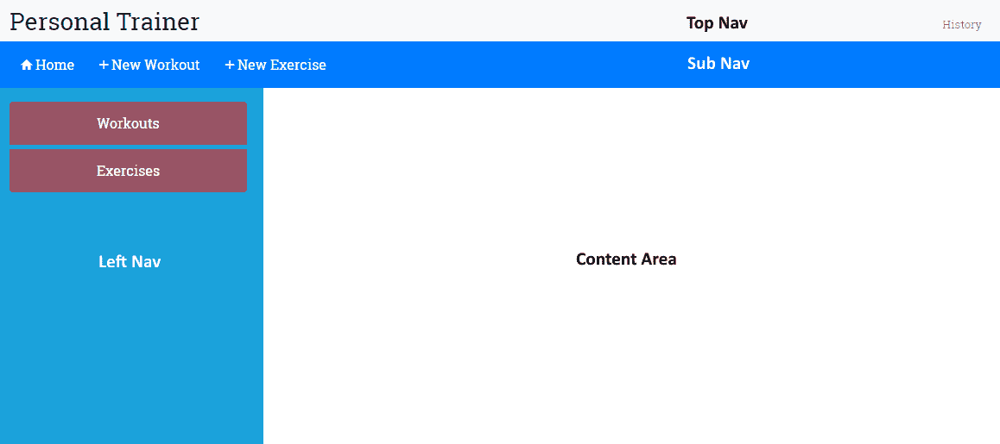

这里有以下组件：

+   顶部导航：这包含应用程序品牌标题和历史链接。

+   子导航：这里有导航元素，根据活动组件的变化而变化。

+   左侧导航：这包含依赖于活动组件的元素。

+   内容区域：这是我们组件的主视图显示的地方。这里发生了大部分的操作。我们将在这里创建/编辑练习和健身计划，并在这里显示练习和健身计划列表。

看看源代码文件；在 `trainer/src/app` 下有一个新的 `workout-builder` 文件夹。它具有我们先前描述的每个组件的文件，还有一些占位符内容。在本章中我们将按照这一过程逐步构建这些组件。

但是，我们首先需要在应用程序中连接这些组件。这要求我们定义健身计划生成器应用程序的导航模式，并相应地定义应用程序路由。

# 个人健身教练导航及路线

我们打算在应用程序中使用的导航模式是列表-详细信息模式。我们将为应用程序中可用的练习和健身计划创建列表页面。单击任何列表项将带我们到该项目的详细视图，我们可以在这里执行所有 CRUD 操作（创建/读取/更新/删除）。以下路线遵循这一模式：

| **路线** | **描述** |
| --- | --- |
| `/builder` | 这只是重定向到 **builder/workouts** |
| `/builder/workouts` | 这列出了所有可用的健身计划。这是*健身计划生成器*的登陆页面 |
| `/builder/workout/new` | 这将创建一个新的健身计划 |
| `/builder/workout/:id` | 这将编辑具有特定 ID 的现有健身计划 |
| `/builder/exercises` | 这列出所有可用的练习 |
| `/builder/exercise/new` | 这创建一个新的练习 |
| `/builder/exercise/:id` | 这将使用特定 ID 编辑现有练习 |

# 开始使用个人健身教练导航

此时，如果您查看`app-routing.module.ts`中的路由配置，您将在`src/app`文件夹中找到一个新的路由定义，`builder`**：**

```ts
const routes: Routes = [
    ...
    { path: 'builder', component: WorkoutBuilderComponent },
    ...
];
```

如果您运行应用程序，您会发现起始屏幕显示另一个链接，创建一个锻炼：

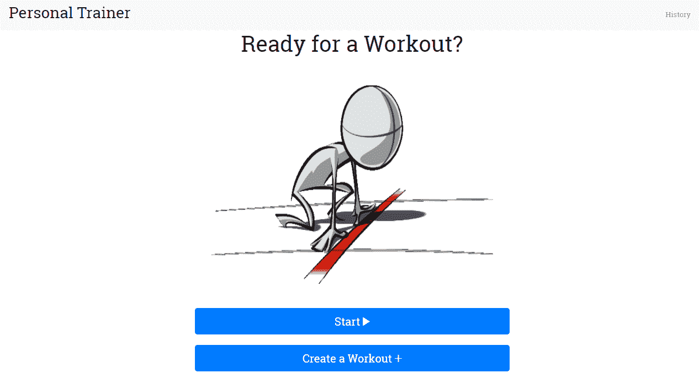

幕后，我们已将另一个路由链接添加到`start.component.html`中的此链接中：

```ts
<a routerLink="/builder" class="btn btn-primary btn-lg btn-block" role="button" aria-pressed="true">
   <span>Create a Workout</span>
   <span class="ion-md-add"></span>
</a>
```

如果你点击这个链接，你将进入以下视图：

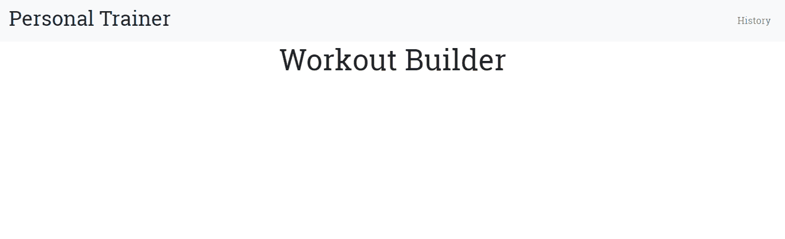

同样，在幕后，我们已将`workout-builder.component.ts`添加到`trainer/src/app/workout-builder`文件夹，并包含以下内联模板：

```ts
  template: `
    <div class="row">
      <div class="col-sm-3"></div>
      <div class="col-sm-6">
          <h1 class="text-center">Workout Builder</h1>
      </div>
      <div class="col-sm-3"></div>
    </div>
  `
```

并且这个视图在屏幕上显示在我们的`app.component.html`模板中使用的路由器插座下的标题下：

```ts
<div class="container body-content app-container"> 
    <router-outlet></router-outlet> 
</div>` 
```

我们已将此组件（以及我们为此功能生成的其他文件）包装在名为`workout-builder.module.ts`的新模块中：

```ts
import { NgModule } from '@angular/core';
import { CommonModule } from '@angular/common';

import { WorkoutBuilderComponent } from './workout-builder.component';
import { ExerciseComponent } from './exercise/exercise.component';
import { ExercisesComponent } from './exercises/exercises.component';
import { WorkoutComponent } from './workout/workout.component';
import { WorkoutsComponent } from './workouts/workouts.component';

@NgModule({
  imports: [
    CommonModule
  ],
  declarations: [WorkoutBuilderComponent, ExerciseComponent, ExercisesComponent, WorkoutComponent, WorkoutsComponent]
})
export class WorkoutBuilderModule { }
```

这里可能与我们创建的其他模块有所不同的是，我们导入的是`CommonModule`而不是`BrowserModule`。这样避免了第二次导入整个`BrowserModule`，这会在实现此模块的延迟加载时产生错误。

最后，我们已向`app.module.ts`添加了此模块的导入：

```ts
  ... 
@NgModule({ 
  imports: [ 
  ... 
 WorkoutBuilderModule], 
  ... 
```

所以，没有什么新奇的地方。根据这些模式，我们现在应该开始考虑为我们的新功能添加先前概述的附加导航。然而，在我们着手进行之前，有一些事情我们需要考虑。

首先，如果我们开始将我们的路由添加到`app.routing-module.ts`文件中，那么存储在那里的路由数量将增加。这些用于*Workout Builder*的新路由也将与*Workout Runner*的路由混合在一起。虽然我们现在添加的路由数量可能看起来微不足道，但随着时间的推移，这可能成为一个维护问题。

其次，我们需要考虑到我们的应用程序现在由两个功能组成——*Workout Runner*和*Workout Builder*。我们应该考虑如何在应用程序中分离这些功能，以便它们可以独立开发。

换句话说，我们希望我们构建的功能之间具有**松耦合**。使用这种模式可以让我们在应用程序中替换功能而不影响其他功能。例如，远期，我们可能希望将*Workout Runner*转换为移动应用程序，但保留*Workout Builder*作为基于 Web 的应用程序。

这种分离我们组件的能力是 Angular 实现的**组件设计模式**的重要优势之一。幸运的是，Angular 的路由器为我们提供了将我们的路由分离成逻辑上组织良好的**路由配置**的能力，这些路由配置与我们应用程序的特性紧密匹配。

为了实现这种分离，Angular 允许我们使用**子路由**，在这里我们可以隔离每个功能的路由。在本章中，我们将使用**子路由**来分离*Workout Builder*的路由。

# 介绍为 Workout Builder 添加子路由

Angular 支持我们隔离新*Workout Builder*的路由的目标，它为我们提供了在我们应用程序中创建路由器组件层次结构的能力。目前，我们只有一个路由器组件，它位于我们应用程序的根组件中。但是 Angular 允许我们在根组件下添加所谓的**子路由器组件**。这意味着一个功能可以对另一个功能使用的路由一无所知，每个功能都可以自由地根据该功能内部的更改来调整其路由。

返回我们的应用程序，我们可以在 Angular 中使用**子路由**来匹配我们应用程序的两个功能的路由与将要使用它们的代码。因此，在我们的应用程序中，我们可以将路由结构化为以下路由层次结构，用于我们的*Workout Builder*（此时，我们将*Workout Runner*保持不变，以展示之前和之后的比较）：

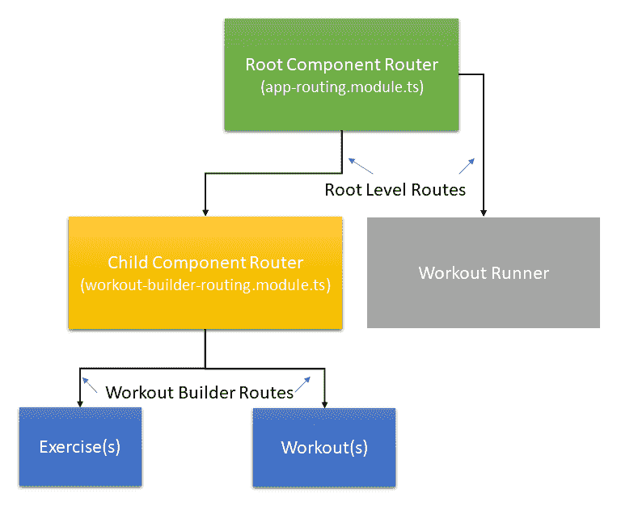

通过这种方法，我们可以通过特性进行逻辑分离，并使其更易于管理和维护。

那么，让我们开始为我们的应用程序添加子路由。

从本节开始，我们将添加到前面在本章中下载的代码中。如果您想查看下一节的完整代码，可以在 GitHub 仓库的 `checkpoint 4.2` 中下载。如果您想和我们一起为该部分编写代码，请确保在这个检查点中添加 `trainer/src` 文件夹中的 `styles.css` 中的更改，因为我们在这里不会讨论它们。还要确保从仓库的 `trainer/src/app/workout-builder` 文件夹中添加 exercise(s)、workout(s) 和 navigation 的文件。在这个阶段，这些只是存根文件，我们将在本章后面实现它们。但是，您需要这些存根文件来实现 *Workout Builder* 模块的导航。该代码可以在 GitHub 上下载：[`github.com/chandermani/angular6byexample`](https://github.com/chandermani/angular6byexample)。检查点在 GitHub 中作为分支实现。要下载的分支如下：`GitHub 分支：checkpoint4.2`。如果您不使用 Git，请从以下 GitHub 位置下载 `Checkpoint 4.2` 的快照（ZIP 文件）：[`github.com/chandermani/angular6byexample/archive/checkpoint4.2.zip`](https://github.com/chandermani/angular6byexample/archive/checkpoint4.2.zip)。在第一次设置快照时，请参考 `trainer` 文件夹中的 `README.md` 文件。

# 添加子路由组件

在 `workout-builder` 目录中，添加一个名为 `workout-builder.routing.module.ts` 的新的 TypeScript 文件，并加入以下引用：

```ts
import { NgModule } from '@angular/core';
import { Routes, RouterModule } from '@angular/router';
import { WorkoutBuilderComponent } from './workout-builder.component';
import { WorkoutsComponent } from './workouts/workouts.component';
import { WorkoutComponent } from './workout/workout.component';
import { ExercisesComponent } from './exercises/exercises.component';
import { ExerciseComponent } from './exercise/exercise.component';
```

正如您所见，我们正在引入刚提到的组件；它们将成为我们的 *Workout Builder*（exercise, exercises, workout 和 workouts）的一部分。除了这些引用外，我们还从 Angular 核心模块中引入 `NgModule`，以及从 Angular 路由器模块中引入 `Routes` 和 `RouterModule`。这些引用将使我们能够添加和导出子路由。

我们没有在这里使用 Angular CLI，因为它没有一个单独的蓝图用于创建路由模块。然而，您可以在创建模块时使用 `--routing` 选项让 CLI 创建一个路由模块。在这种情况下，我们已经有一个现有的模块创建，所以我们无法使用该标志。查看如下链接以了解更多关于如何实现这一点的细节：[`github.com/angular/angular-cli/blob/master/docs/documentation/stories/routing.md`](https://github.com/angular/angular-cli/blob/master/docs/documentation/stories/routing.md)。

然后，在文件中添加以下路由配置：

```ts
const routes: Routes = [
  {
    path: 'builder',
    component: WorkoutBuilderComponent,
    children: [
         {path: '', pathMatch: 'full', redirectTo: 'workouts'},
         {path: 'workouts', component: WorkoutsComponent },
         {path: 'workout/new', component: WorkoutComponent },
         {path: 'workout/:id', component: WorkoutComponent },
         {path: 'exercises', component: ExercisesComponent},
         {path: 'exercise/new', component: ExerciseComponent },
         {path: 'exercise/:id', component: ExerciseComponent }
    ]
  },
];
```

第一个配置`path: 'builder'`设置了子路由的基本 URL，以便每个子路由都会将其作为前缀。下一个配置将`WorkoutBuilder`组件标识为此文件中子组件的特色区域根组件。这意味着它将是每个子组件使用`router-outlet`显示的组件。最后的配置是一个或多个子级，定义了子组件的路由。

这里需要注意的一点是，我们已经设置`Workouts`作为默认的子路由，配置如下：

```ts
{path:'', pathMatch: 'full', redirectTo: 'workouts'}, 

```

这个配置表示如果有人导航到`builder`，它们将被重定向到`builder/workouts`路由。`pathMatch: 'full'`设置意味着只有当 workout/builder 之后的路径为空字符串时才会进行匹配。这可以防止如果路由是其他内容，比如`workout/builder/exercises`或者在这个文件中配置的其他路由，那么重定向就不会发生。

最后，添加以下类声明，前面有一个`@NgModule`装饰器，定义了我们模块的导入和导出：

```ts
@NgModule({
  imports: [RouterModule.forChild(routes)],
  exports: [RouterModule]
})
export class WorkoutBuilderRoutingModule { }
```

这个导入与`app.routing-module.ts`中的导入非常相似，只有一个区别 - 我们使用的是`RouterModule.forChild`，而不是`RouterModule.forRoot`。这种差异的原因似乎是不言自明的：我们创建子路由，而不是应用程序根目录中的路由，这就是我们表示的方式。然而，在底层，有一个显著的区别。这是因为我们的应用程序中不能有多个路由器服务处于激活状态。`forRoot`创建路由器服务，但`forChild`不会。

# 更新 WorkoutBuilder 组件

我们接下来需要更新`WorkoutBuilder`组件以支持我们的新子路由。为此，将 Workout Builder 的`@Component`装饰器改为：

1.  移除`selector`

1.  在模板中添加一个`<abe-sub-nav-main>`自定义元素

1.  在模板中添加一个`<router-outlet>`标签

装饰器现在应该看起来像下面这样：

```ts
@Component({
  template: `<div class="container-fluid fixed-top mt-5">
                <div class="row mt-5">
                  <abe-sub-nav-main></abe-sub-nav-main>
                </div>
                <div class="row mt-2">
                  <div class="col-sm-12">
                    <router-outlet></router-outlet>
                  </div>
                </div>
            <div>`
})
```

我们移除选择器，因为`WorkoutBuilderComponent`不会被嵌入到应用程序根目录`app.component.ts`中。相反，它将通过路由从`app.routing-module.ts`中到达。虽然它将处理来自`app.routes.ts`的传入路由请求，但它将反过来将它们路由到 Workout Builder 特色中包含的其他组件。

这些组件将使用我们刚刚添加到`WorkoutBuilder`模板中的`<router-outlet>`标签来显示它们的视图。考虑到`Workout BuilderComponent`的模板将是简单的，我们使用内联`template`而不是`templateUrl`。

通常情况下，我们建议为组件的视图使用`templateUrl`指向一个单独的 HTML 模板文件。特别是当你预期该视图会涉及超过几行 HTML 时。在这种情况下，更容易处理一个视图在其自己的 HTML 文件中。

我们还添加了一个`<abe-sub-nav-main>`元素，它将用于创建用于在*Workout Builder*功能内进行导航的二级顶级菜单。我们稍后在本章中会讨论这一点。

# 更新 Workout Builder 模块

现在，让我们更新`WorkoutBuilderModule`。首先，在文件中添加以下导入:

```ts
import { WorkoutBuilderRoutingModule } from './workout-builder-routing.module';
```

它导入了我们刚刚设置的子路由。接下来，更新`@NgModule`装饰器以添加`workoutBuilderRoutingModule`:

```ts
...
@NgModule({
  imports: [
    CommonModule,
    WorkoutBuilderRoutingModule
  ],
...
}) 
```

最后，添加新的导航组件的导入和声明，可以在`checkpoint4.2`中找到:

```ts
import { LeftNavExercisesComponent } from './navigation/left-nav-exercises.component';
import { LeftNavMainComponent } from './navigation/left-nav-main.component';
import { SubNavMainComponent } from './navigation/sub-nav-main.component';
...
  declarations: [
    ...
    LeftNavExercisesComponent,
    LeftNavMainComponent,
    SubNavMainComponent]
```

# 更新 App 路由模块

最后一步：返回`app.routing-module.ts`，删除`WorkoutBuilderComponent`的导入和指向构建器的路由定义：`{ path: 'builder', component: WorkoutBuilderComponent },`。

确保不要改变在`app.module.ts`中的`WorkoutBuilderModule`的导入。当我们讨论懒加载时，我们会在下一节中讨论删除它。

# 将所有内容组合在一起

现在我们有包含子路由的区域或功能路由，并且与*Workout Builder*相关的所有路由都分别包含在它们自己的路由配置中。这意味着我们可以在`WorkoutBuilderRoutes`组件中管理*Workout Builder*的所有路由，而不影响应用程序的其他部分。

如果我们现在从开始页面导航到 Workout Builder，我们可以看到路由如何将`app.routes.ts`中的路由与`workout-builder.routes.ts`中的默认路由组合在一起:

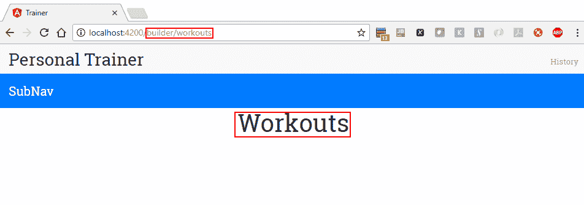

如果我们在浏览器中查看 URL，它是`/builder/workouts`。你会记得开始页面上的路由链接是`['/builder']`。那么路由是如何带我们到这个位置的呢？

它是这样做的：当链接被点击时，Angular 路由器首先查找`app-routing.module.ts`中的`builder`路径，因为该文件包含了我们应用程序中根路由的配置。路由器没有找到该路径，因为我们已经从该文件的路由中删除了它。

但是，`WorkoutBuilderModule`已经被导入到`AppModule`中，而该模块又导入`workoutBuilderRoutingModule`。后者文件包含了我们刚刚配置的子路由。路由器发现`builder`是该文件中的父路由，因此它使用该路由。它还找到了默认设置，该设置将在`builder`路径以空字符串结尾时重定向到子路径`workouts`。

如果您查看屏幕，您会看到它显示的是`Workouts`的视图（而不是以前的*Workout Builder*）。这意味着路由器已成功将请求路由到`WorkoutsComponent`，这是我们在`workoutBuilderRoutingModule`中设置的子路由配置中的默认路由的组件。

路由分辨过程如下所示：

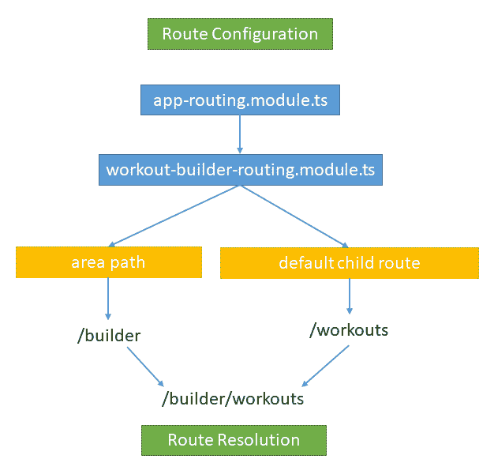

对于子路由的最后一个想法。当您查看我们的子路由组件`workout-builder.component.ts`时，您会发现它没有引用其父组件`app.component.ts`（`<selector>`标签已被删除，因此`WorkoutBuilderComponent`没有嵌入在根组件中）。这意味着我们已经成功地封装了`WorkoutBuilderComponent`（以及在`WorkoutBuilderModule`中导入的所有相关组件），这将使我们能够将其全部移到应用程序的其他位置，甚至是到一个新的应用程序中。

现在，是时候将我们的 Workout Builder 的路由转换为使用延迟加载，并构建其导航菜单了。如果您想查看此下一部分的已完成代码，您可以从`checkpoint 4.3`中的相关代码库中进行下载。同样，如果您正在跟着我们构建应用程序，请确保更新`styles.css`文件，这里我们不讨论。

代码也可以在 GitHub 上找到：[`github.com/chandermani/angular6byexample`](https://github.com/chandermani/angular6byexample)。检查点在 GitHub 中实现为分支。要下载的分支如下：`GitHub 分支：checkpoint4.3`（文件夹 - `trainer`）。如果您没有使用 Git，请从以下 GitHub 位置下载`Checkpoint 4.3`的快照（ZIP 文件）：[`github.com/chandermani/angular6byexample/archive/checkpoint4.3.zip`](https://github.com/chandermani/angular6byexample/archive/checkpoint4.3.zip)。在首次设置快照时，请参考`trainer`文件夹中的`README.md`文件。

# 路由的延迟加载

当我们推出我们的应用程序时，我们期望我们的用户每天都会访问 Workout Runner（我们知道这对你来说是必须的！）。但是，我们预计他们只会偶尔使用 Workout Builder 来构建他们的练习和锻炼计划。因此，如果我们能够避免在用户只是在 Workout Runner 中做练习时加载 Workout Builder 的开销，那将是很好的。相反，我们更希望在用户想要添加或更新他们的练习和锻炼计划时，仅在需要时加载 Workout Builder。这种方法称为**延迟加载**。延迟加载允许我们在加载模块时采用异步方法。这意味着我们可以仅加载启动应用程序所需的内容，然后在需要时加载其他模块。

在幕后，当我们使用 Angular CLI 构建和提供我们的应用程序时，它使用了 WebPack 的捆绑和分块功能来实现惰性加载。在我们实现应用程序中的惰性加载时，我们将讨论这些功能。

因此，在我们的 *个人健身教练* 中，我们希望更改应用程序，以便只在需要时才加载**Workout Builder**。而 Angular 路由器允许我们仅仅用惰性加载来实现这一点。

但在开始实现惰性加载之前，让我们来看看我们当前的应用程序以及它如何加载我们的模块。在开发者工具中的"来源"选项卡打开后，启动应用程序；当你的浏览器中出现起始页面时，如果你在源树中查看 web pack 节点下，你将看到应用程序中加载的所有文件，包括 *Workout Runner* 和 *Workout Builder* 文件：

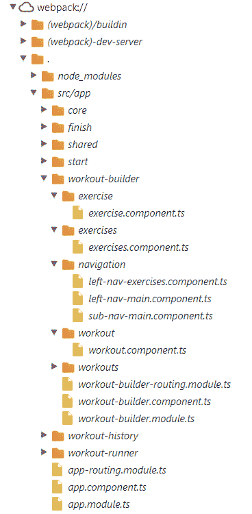

因此，即使我们可能只想使用 *Workout Runner*，我们也必须加载 *Workout Builder*。在某种程度上，如果你将我们的应用程序视为**单页面应用程序**（**SPA**），这是有道理的。为了避免与服务器的往返，SPA 通常会在用户首次启动应用程序时加载所有需要使用应用程序的资源。但就我们来说，重要的一点是，当应用程序首次加载时，我们不需要 *Workout Builder*。相反，我们希望只有在用户决定添加或更改训练或练习时才加载这些资源。

所以，让我们开始做到这一点。

首先，修改 `app.routing-module.ts` 以添加以下路由配置用于 `WorkoutBuilderModule`：

```ts
const routes: Routes = [
    ...
    { path: 'builder', loadChildren: './workout-builder/workout-builder.module#WorkoutBuilderModule'},
    { path: '**', redirectTo: '/start' }
];
```

注意 `loadChildren` 属性是：

```ts
module file path + # + module name 
```

该配置提供了加载和实例化 `WorkoutBuilderModule` 所需的信息。

接下来回到 `workout-builder-routing.module.ts` 并将 `path` 属性更改为空字符串：

```ts
export const Routes: Routes = [ 
    { 
 path: '', 
. . . 
    } 
]; 
```

我们进行此更改是因为现在我们将 `path`（`builder`）设置为 `app.routing-module.ts` 中新增的对应的 `WorkoutBuilderRoutes` 的新配置中。

最后，回到 `app-module.ts` ，并在该文件中的 `@NgModule` 配置中移除 `WorkoutBuilderModule` 的导入。这意味着，与其在应用程序首次启动时加载**Workout Builder**功能，我们只在用户访问*Workout Builder*路由时加载它。

让我们用 `ng serve` 再次构建和运行应用程序。在终端窗口中，你应该看到类似如下的输出：

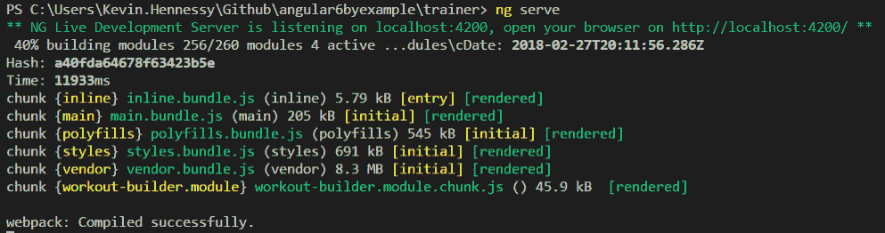

这里有趣的地方在于最后一行显示了一个名为`workout.builder.module`的单独文件，名为`workout-builder.module.chunk.js.`。**WebPack**使用了所谓的代码拆分来将我们的锻炼构建模块划分为一个单独的块。该块在需要时才会在我们的应用程序中加载（即路由器导航到`WorkoutBuilderModule`时）。

现在，在 Chrome 开发者工具中保持 Sources 标签页打开，再次在浏览器中打开应用程序。当起始页面加载时，只有与*Workout Runner*相关的文件出现，而与*Workout Builder*相关的文件却没有出现，如下图所示：

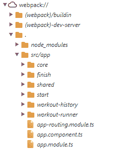

然后，如果我们清除网络标签页并点击“创建锻炼”链接，我们将看到加载`workout-builder.module`块：

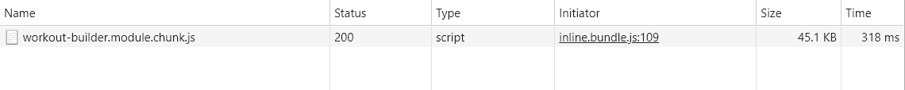

这意味着我们已经实现了我们新功能的封装，并且通过异步路由，我们能够使用惰性加载在需要时加载所有其组件。

子级和异步路由使得实现允许我们应用程序在客户端具有强大导航的同时，还可以将功能封装在单独的子路由组件中，并且只在需要时加载它们变得简单。

Angular 路由器的这种强大和灵活性赋予我们能力，通过密切映射应用程序的行为和响应性来满足用户的期望。在这种情况下，我们利用了这些功能来实现我们的目标：*立即加载 Workout Runner*，这样我们的用户就可以立即开始锻炼，但避免加载*Workout Builder*的开销，而是在用户想要构建锻炼时才加载它。

现在我们已经在*Workout Builder*中设置好了路由配置，我们将把注意力转向构建子级和左侧导航；这将使我们能够使用此路由。接下来的部分将介绍实现此导航。

# 集成子级和侧边级导航

将子级和侧面级导航集成到应用程序的基本理念是为基于活动视图变化而变化的上下文感知子视图提供支持。例如，当我们在列表页面而不是编辑项目时，我们可能希望在导航中显示不同的元素。一个很好的例子是电子商务网站。想象亚马逊的搜索结果页面和产品详情页面。随着上下文从产品列表变为特定产品，加载的导航元素也会发生变化。

# 子级导航

我们将首先在*Workout Builder*中添加子级导航。我们已经将`SubNavMainComponent`导入到*Workout Builder*中。但是，目前它只显示占位内容：

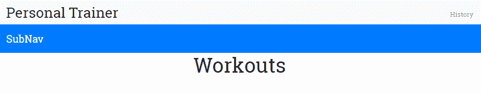

现在，我们将用三个路由链接替换该内容：首页、新锻炼和新练习。

打开`sub-nav-main.component.html`文件，并将其 HTML 更改为以下内容：

```ts
<nav class="navbar fixed-top navbar-dark bg-primary mt-5">
    <div>
        <a [routerLink]="['/builder/workouts']" class="btn btn-primary">
        <span class="ion-md-home"></span> Home
        </a>
        <a [routerLink]="['/builder/workout/new']" class="btn btn-primary">
        <span class="ion-md-add"></span> New Workout
        </a>
        <a [routerLink]="['/builder/exercise/new']" class="btn btn-primary">
        <span class="ion-md-add"></span> New Exercise
        </a>
    </div>
</nav>
```

现在，重新运行应用程序，你将会看到三个导航链接。如果我们点击“新练习”链接按钮，我们将被路由到`ExerciseComponent`，并且其视图将会出现在*Workout Builder*视图的路由器出口中。


新锻炼链接按钮的工作方式类似；点击时，它将把用户带到`WorkoutComponent`并在路由器出口中显示其视图。点击首页链接按钮将返回用户到`WorkoutsComponent`和视图。

# 侧边导航

*Workout Builder*内的侧边导航将根据我们导航到的子组件而异。例如，当我们首次导航到*Workout Builder*时，我们被带到了锻炼屏幕，因为`WorkoutsComponent`路由是*Workout Builder*的默认路由。该组件将需要侧边导航；它将允许我们选择查看锻炼列表或练习列表。

Angular 的基于组件的特性为我们实现这些上下文敏感菜单提供了一种简单的方法。我们可以为每个菜单定义新的组件，然后将其导入到需要它们的组件中。在这种情况下，我们有三个需要侧边菜单的组件：**锻炼**，**练习**和**锻炼**。前两个组件实际上可以使用相同的菜单，所以我们实际上只需要两个侧边菜单组件：`LeftNavMainComponent`，它将类似于前面的菜单，并将被`Exercises`和`Workouts`组件使用，以及`LeftNavExercisesComponent`，它将包含现有练习列表，并将被`Workouts`组件使用。

我们已经有了两个菜单组件的文件，包括模板文件，并已将它们导入到`WorkoutBuilderModule`。我们现在将把它们整合到需要它们的组件中。

首先，修改`workouts.component.html`模板以添加菜单的选择器：

```ts
<div class="row">
    <div>
        <abe-left-nav-main></abe-left-nav-main>
    </div>
    <div class="col-sm-10 builder-content">
        <h1 class="text-center">Workouts</h1>
    </div>
  </div>
```

然后，在`left-nav-main.component.html`中用导航链接替换占位符文本到`WorkoutsComponent`和`ExercisesComponent`：

```ts
<div class="left-nav-bar">
    <div class="list-group">
        <a [routerLink]="['/builder/workouts']" class="list-group-item list-group-item-action">Workouts</a>
        <a [routerLink]="['/builder/exercises']" class="list-group-item list-group-item-action">Exercises</a>
    </div>
</div>
```

运行应用程序，你应该看到以下内容：

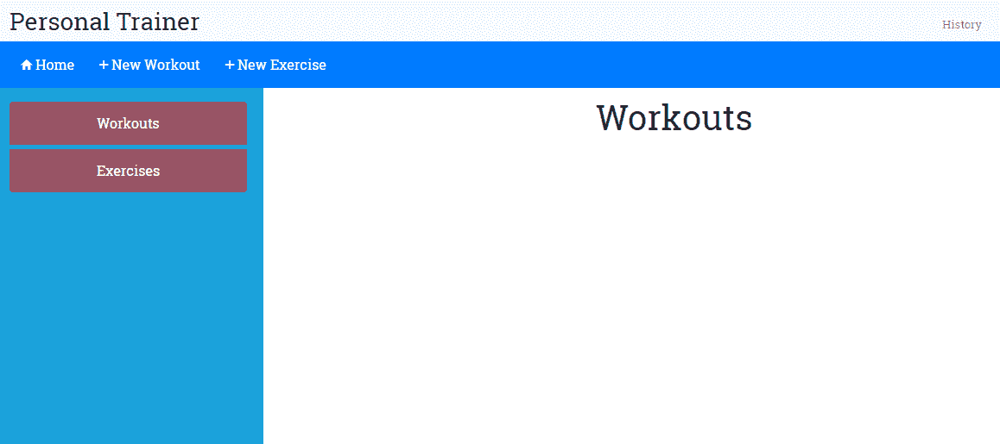

遵循完全相同的步骤来完成`Exercises`组件的侧边菜单。

我们不会在这里展示菜单的代码，但你可以在 GitHub 存储库的`checkpoint 4.3`中`trainer/src/app`下的`workout-builder/exercises`文件夹中找到它。

对于锻炼屏幕的菜单，步骤相同，只是你应该将`left-nav-exercises.component.html`更改为以下内容：

```ts
<div class="left-nav-bar">
  <h3>Exercises</h3>
</div> 
```

我们将使用这个模板作为构建出现在屏幕左侧的锻炼列表的起点，并且可以选择加入到锻炼中的起点。

# 实施运动和练习列表

即使在我们开始实现运动和练习列表页面之前，我们需要一个用于练习和运动数据的数据存储。当前计划是使用内存数据存储并使用 Angular 服务公开它。在第三章中，*支持服务器数据持久化*中，我们会将这些数据移到服务器存储以进行长期持久化。目前，内存存储就足够了。让我们添加存储实现。

# WorkoutService 作为运动和练习库

在这里的计划是创建一个`WorkoutService`实例，负责在两个应用程序之间公开运动和锻炼数据。服务的主要职责包括：

+   **与练习相关的 CRUD 操作**：获取所有练习，根据名称获取特定练习，创建练习，更新练习并删除它

+   **与锻炼相关的 CRUD 操作**：这些操作与与运动相关的操作类似，但针对的是运动实体

代码可在 GitHub 上下载，链接为[`github.com/chandermani/angular6byexample`](https://github.com/chandermani/angular6byexample)。要下载的分支如下：**GitHub 分支：checkpoint4.4**（文件夹`trainer`）。如果您不使用 Git，请从以下 GitHub 位置下载`Checkpoint 4.4`的快照（ZIP 文件）：[`github.com/chandermani/angular6byexample/archive/checkpoint4.4.zip`](https://github.com/chandermani/angular6byexample/archive/checkpoint4.4.zip)。在首次设置快照时，请参考`trainer`文件夹中的`README.md`文件。再次提醒，如果您跟随我们构建应用程序，请确保更新`styles.css`文件，这里我们不讨论。由于本节中的一些文件相当长，而不是在这里显示代码，我们有时还会建议您简单地将文件复制到您的解决方案中。

在`trainer/src/core`文件夹中找到`workout-service.ts`。该文件中的代码应该如下所示，除了我们由于长度而留出的两个方法`setupInitialExercises`和`setupInitialWorkouts`的实现：

```ts
import {Injectable} from '@angular/core'; 
import {ExercisePlan} from './model'; 
import {WorkoutPlan} from './model'; 
import {Exercise} from "./model";
import { CoreModule } from './core.module'; 

@Injectable({
  providedIn: CoreModule
})
export class WorkoutService { 
    workouts: Array<WorkoutPlan> = []; 
    exercises: Array<Exercise> = []; 

    constructor() { 
        this.setupInitialExercises(); 
        this.setupInitialWorkouts(); 
    } 

    getExercises(){ 
        return this.exercises; 
    } 

    getWorkouts(){ 
        return this.workouts; 
    } 
    setupInitialExercises(){ 
     // implementation of in-memory store. 
    } 

    setupInitialWorkouts(){ 
     // implementation of in-memory store. 
    } 
}} 
```

正如我们之前提到的，Angular 服务的实现是直截了当的。在这里，我们声明了一个名为`WorkoutService`的类，并用`@Injectable`进行装饰。在`@Injectable`装饰器中，我们设置了`provided-in`属性为`CoreModule`。这样就把`WorkoutService`注册为 Angular 的**依赖注入**框架的提供者，并使其在整个应用程序中可用。

在类定义中，我们首先创建两个数组：一个用于`Workouts`，一个用于`Exercises`。这些数组分别属于`WorkoutPlan`和`Exercise`类型，因此我们需要从`model.ts`中导入`WorkoutPlan`和`Exericse`以获取它们的类型定义。

-   构造函数调用两个方法来设置 Workouts 和 Services 列表。目前，我们只是使用一个内存存储来填充这些列表数据。

-   两个方法，`getExercises`和`getWorkouts`，顾名思义，分别返回练习和锻炼的列表。由于我们计划使用内存存储来存储锻炼和锻炼数据，`Workouts`和`Exercises`数组存储着这些数据。随着我们的进展，我们将向服务添加更多的功能。

-   是时候为锻炼和练习列表构建组件了！

# -   训练和锻炼列表组件

-   首先，打开`trainer/src/app/workout-builder/workouts`文件夹中的`workouts.component.ts`文件，并按以下方式更新导入：

```ts
import { Component, OnInit } from '@angular/core';
import { Router } from '@angular/router';

import { WorkoutPlan } from '../../core/model';
import { WorkoutService } from '../../core/workout.service';; 
```

-   这段新代码导入了 Angular 的`Router`，以及`WorkoutService`和`WorkoutPlan`类型。

-   接下来，用以下代码替换类定义：

```ts
export class WorkoutsComponent implements OnInit { 
    workoutList:Array<WorkoutPlan> = []; 

    constructor( 
        public router:Router, 
        public workoutService:WorkoutService) {} 

    ngOnInit() { 
        this.workoutList = this.workoutService.getWorkouts(); 
    } 

    onSelect(workout: WorkoutPlan) { 
        this.router.navigate( ['./builder/workout', workout.name] ); 
    } 
} 
```

-   这段代码在构造函数中添加了`Router`和`WorkoutService`。然后，在`ngOnInit`方法中调用`WorkoutService`的`getWorkouts`方法，并用从该方法调用返回的`WorkoutPlans`列表填充了一个`workoutList`数组。我们将使用`workoutList`数组来填充将在`Workouts`组件视图中显示的锻炼计划列表。

-   你会注意到，我们将调用`WorkoutService`的代码放在了`ngOnInit`方法中。我们不想把这段代码放在构造函数中。最终，我们将把这个服务使用的内存存储替换为对外部数据存储的调用，我们不希望我们组件的实例化受到这个调用的影响。将这些方法调用添加到构造函数中也会使组件的测试变得更加复杂。

-   为避免这种意外副作用，我们将代码放在`ngOnInit`方法中。这个方法实现了 Angular 的生命周期钩子之一，`OnInit`，Angular 在创建服务实例后调用这个方法。这样，我们依赖于 Angular 以一种可预测的方式调用这个方法，不会影响组件的实例化。

-   接下来，我们将对`Exercises`组件进行几乎相同的更改。与`Workouts`组件一样，这段代码将锻炼服务注入到我们的组件中。这次，我们然后使用锻炼服务来检索练习。

-   由于这与`Workouts`组件类似，我们这里不会显示代码。只需从`检查点 4.4`的`workout-builder/exercises`文件夹中添加它。

# -   锻炼和练习列表视图

-   现在，我们需要实现到目前为止一直为空的列表视图！

-   在本节中，我们将用`检查点 4.4`更新`检查点 4.3`的代码。所以，如果你正在跟着我们编码，只需按照本节中列出的步骤进行操作。如果你想看到完成的代码，那就把`检查点 4.4`的文件复制到你的解决方案中。

# -   工作列表视图

-   要使视图正常工作，打开`workouts.component.html`并添加以下标记：

```ts
<div class="row">
    <div>
        <abe-left-nav-main></abe-left-nav-main>
    </div>
    <div class="col-sm-10 builder-content">
        <h1 class="text-center">Workouts</h1>
        <div *ngFor="let workout of workoutList|orderBy:'title'" class="workout tile" (click)="onSelect(workout)">
          <div class="title">{{workout.title}}</div>
          <div class="stats">
              <span class="duration" title="Duration"><span class="ion-md-time"></span> - {{(workout.totalWorkoutDuration? workout.totalWorkoutDuration(): 0)|secondsToTime}}</span>
              <span class="float-right" title="Exercise Count"><span class="ion-md-list"></span> - {{workout.exercises.length}}</span>
          </div>
      </div>
    </div>
  </div>
```

我们正在使用 Angular 核心指令之一，`ngFor`，来循环遍历锻炼计划列表并在页面上以列表形式显示它们。我们在`ngFor`前面添加`*`号来标识它为 Angular 指令。使用`let`语句，我们将`workout`分配为一个本地变量，我们用它来遍历锻炼计划列表并识别每个锻炼计划要显示的值（例如`workout.title`）。然后，我们使用我们的自定义管道之一，`orderBy`，以按标题字母顺序显示锻炼计划列表。我们还使用另一个自定义管道，`secondsToTime`，来格式化显示总锻炼计划持续时间的时间。

如果您正在与我们一起编码，您将需要将`secondsToTime`管道移动到共享文件夹中，并将其包含在`SharedModule`中。然后，将`SharedModule`添加到`WorkoutBuilderModule`作为额外的导入。这个更改已经在 GitHub 存储库的`checkpoint 4.4`中进行了。

最后，我们将点击事件绑定到以下`onSelect`方法，我们将其添加到我们的组件中：

```ts
 onSelect(workout: WorkoutPlan) { 
     this.router.navigate( ['/builder/workout', workout.name] ); 
 }  
```

这将设置导航到锻炼计划详情页面。当我们点击锻炼计划列表中的项目时，导航将发生。所选锻炼计划名称作为路由`/URL`的一部分传递到锻炼计划详情页面。

请继续刷新构建器页面（`/builder/workouts`）；显示一个锻炼计划，即 7 分钟锻炼。点击该锻炼计划的瓷砖。您将被带到锻炼屏幕，锻炼计划名称`7MinWorkout`将出现在 URL 末尾：

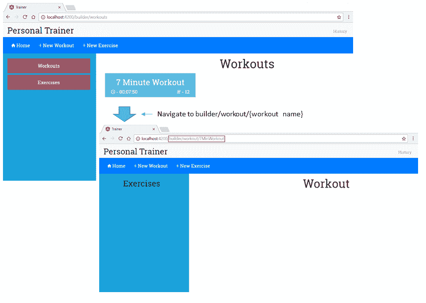

锻炼计划屏幕

# 锻炼计划列表视图

对于`锻炼`列表视图，我们将按照与`锻炼计划`列表视图相同的方式进行操作，只是在这种情况下，我们实际上将实现两个视图：一个用于`锻炼`组件（当用户导航到该组件时将显示在主内容区域中），另一个是用于`LeftNavExercisesComponent`锻炼上下文菜单（当用户导航到`锻炼计划`组件以创建或编辑锻炼计划时将显示）。

对于`锻炼`组件，我们将遵循几乎与在`锻炼计划`组件中显示锻炼计划列表相同的方法。所以，我们不会在这里显示那些代码。只需添加来自`checkpoint 4.4`的`exercises.component.ts`和`exercises.component.html`文件。

复制文件完成后，请点击左侧导航中的`锻炼`链接，以加载您在`WorkoutService`中已经配置的 12 个锻炼计划。

针对`锻炼计划`列表，这将设置导航到锻炼计划详情页面。在锻炼计划列表中点击项目会带我们到锻炼计划详情页面。所选锻炼计划名称作为路由`/URL`的一部分传递到锻炼计划详情页面。

在最终列表视图中，我们将添加一个显示在*锻炼计划生成器*屏幕左侧上下文菜单中的锻炼列表。当我们创建或编辑锻炼计划时，该视图会加载在左侧导航中。使用 Angular 的基于组件的方法，我们将更新`leftNavExercisesComponent`及其相关视图以提供此功能。只需从`trainer/src/app/navigation`文件夹中`checkpoint 4.4`中添加`left-nav-exercises.component.ts`和`left-nav-exercises.component.html`文件。

复制完那些文件后，点击*锻炼计划生成器*的子导航菜单中的新建锻炼计划按钮，您将会在左侧导航菜单中看到一份现有配置在`WorkoutService`中的锻炼的列表。

是时候添加加载、保存和更新锻炼/锻炼计划数据的功能了！

# 构建锻炼计划

*个人健身教练*提供的核心功能主要集中在锻炼和锻炼计划的构建上。所有功能都旨在支持这两个功能。在这一部分，我们将重点放在使用 Angular 构建和编辑锻炼计划。

`WorkoutPlan`模型已经定义，因此我们知道构成锻炼计划的各个元素。*锻炼计划生成器*页面促进用户输入，并允许我们构建/保存锻炼计划数据。

完成后，*锻炼计划生成器*页面将如下所示：

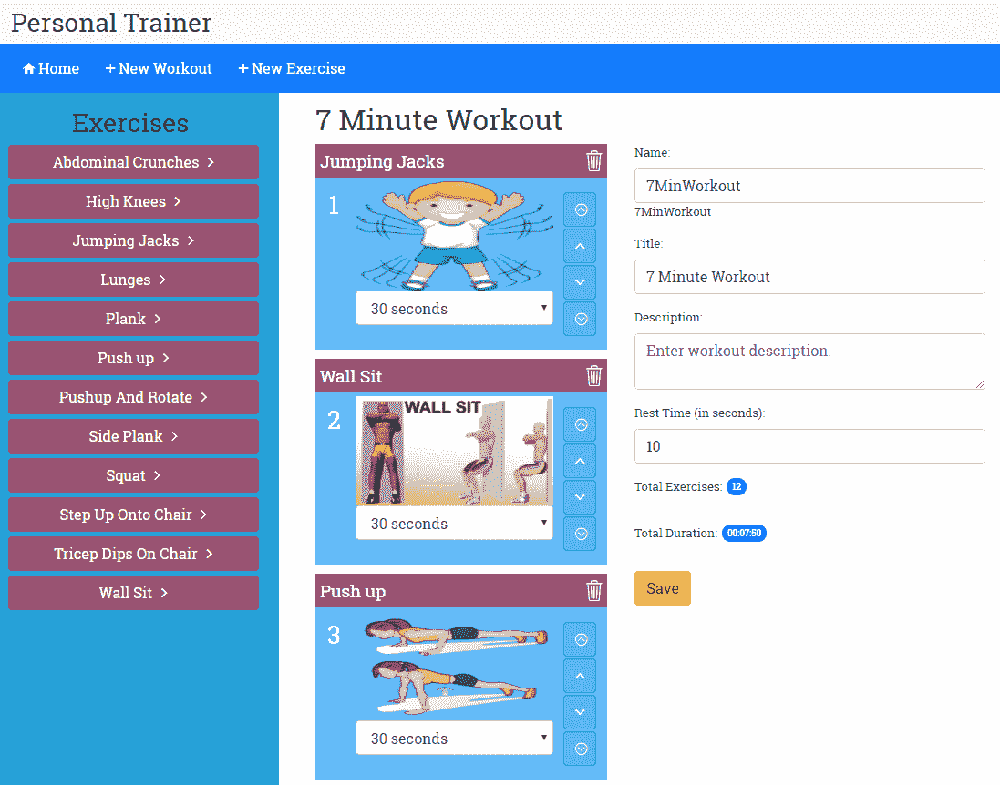

页面左侧导航列出了可以添加到锻炼计划中的所有锻炼。点击右侧的箭头图标即可将锻炼添加到锻炃计划的末尾。

中间区域专门用于构建锻炼计划。它由按顺序排列的锻炼磁贴和一个表单组成，允许用户提供关于锻炼计划的其他详细信息，如名称、标题、描述和休息时间。

此页面操作有两种模式：

+   创建/新建：此模式用于创建新的锻炼计划。网址为`#/ builder/workout/new`。

+   编辑：此模式用于编辑现有的锻炼计划。网址为`#/ builder/workout/:id`，其中的`:id`映射到锻炼计划的名称。

了解了页面元素和布局的情况后，现在是时候构建每个元素了。我们将首先从左侧导航开始。

# 完成左侧导航

在上一节的最后，我们更新了`Workout`组件的左导航视图，以显示锻炼列表。我们的意图是让用户点击锻炼旁边的箭头将其添加到锻炼计划中。当时，我们推迟了对绑定到该点击事件的`LeftNavExercisesComponent`中的`addExercise`方法的实现。现在，我们将继续实现这一步。

我们在这里有一些选择。`LeftNavExercisesComponent`是`WorkoutComponent`的子组件，因此我们可以实现子/父组件间的通信来完成这一功能。我们在上一章中处理*7 分钟锻炼*时已经涵盖了这种技术。

然而，将锻炼添加到锻炼计划中是构建锻炼计划的更大过程的一部分，使用子/父级组件间通信会使`AddExercise`方法的实现与我们将要添加的其他功能有所不同。

为此，更合理的做法是采用另一种数据共享方法，这样我们可以在整个制定锻炼计划的过程中始终保持一致。这种方法涉及使用服务。当我们开始添加其他功能来创建实际的锻炼计划，比如保存/更新逻辑和实现其他相关组件时，选择使用服务的好处将变得越来越明显。

因此，我们在这种情况下引入了一个新的服务：`WorkoutBuilderService`。`WorkoutBuilderService`服务的最终目标是在构建锻炼计划时协调`WorkoutService`（用于检索和持久化锻炼计划）和组件（如`LeftNavExercisesComponent`和其他我们稍后将添加的组件）之间的关系，从而将`WorkoutComponent`中的代码量减少到最低程度。

# 添加 WorkoutBuilderService

`WorkoutBuilderService`监视应用程序用户正在构建的锻炼计划的状态。它：

+   跟踪当前的锻炼计划

+   创建一个新的锻炼计划

+   加载现有的锻炼计划

+   保存锻炼计划

从`checkpoint 4.5`中的`trainer/src/app`的`workout-builder/builder-services`文件夹下复制`workout-builder-service.ts`文件。

该代码也可供所有人在 GitHub 上下载，网址为[`github.com/chandermani/angular6byexample`](https://github.com/chandermani/angular6byexample)。在 GitHub 上，检查点作为分支进行了实现。要下载的分支如下：`GitHub 分支：checkpoint4.5`（文件夹—`trainer`）。如果你不使用 Git，可以从以下 GitHub 位置下载`Checkpoint 4.5`的快照（ZIP 文件）：[`github.com/chandermani/angular6byexample/archive/checkpoint4.5.zip`](https://github.com/chandermani/angular6byexample/archive/checkpoint4.5.zip)。在首次设置快照时，请参阅`trainer`文件夹中的`README.md`文件。再次强调，如果你跟着我们一起构建应用程序，请确保更新`styles.css`文件，这里我们不讨论。

虽然我们通常会使服务在整个应用程序中可用，但`WorkoutBuilderService`只会在*Workout Builder*功能中使用。因此，我们并没有在`AppModule`中的提供者中注册它，而是在`WorkoutBuilderModule`的提供者数组中注册如下（在文件顶部添加了导入后）：

```ts
@NgModule({
....
  providers: [WorkoutBuilderService]
})
```

在这里将其作为提供者添加意味着只有在访问*Workout Builder*功能时才会加载它，外部无法访问。这意味着它可以独立于应用程序中的其他模块进行演化，并且可以在不影响应用程序其他部分的情况下进行修改。

让我们看一下服务的一些相关部分。

`WorkoutBuilderService` 需要 `WorkoutPlan`、`ExercisePlan` 和 `WorkoutService` 的类型定义，因此我们将这些导入到组件中。

```ts
import { WorkoutPlan, ExercisePlan } from '../../core/model';
import { WorkoutService } from '../../core/workout.service';
```

`WorkoutBuilderService` 依赖于 `WorkoutService` 来提供持久性和查询功能。我们通过将 `WorkoutService` 注入到 `WorkoutBuilderService` 的构造函数中来解决这个依赖**：**

```ts
 constructor(public workoutService: WorkoutService) {}
```

`WorkoutBuilderService` 还需要跟踪正在构建的训练。我们使用 `buildingWorkout` 属性来进行跟踪。当我们在服务上调用 `startBuilding` 方法时，跟踪开始：

```ts
startBuilding(name: string){ 
    if(name){ 
        this.buildingWorkout = this.workoutService.getWorkout(name) 
        this.newWorkout = false; 
    }else{ 
        this.buildingWorkout = new WorkoutPlan("", "", 30, []); 
        this.newWorkout = true; 
    } 
    return this.buildingWorkout; 
} 
```

这个跟踪函数的基本思想是设置一个 `WorkoutPlan` 对象 (`buildingWorkout`)，以便让组件可以操作训练细节。`startBuilding` 方法以训练名作为参数。如果没有提供名称，那么意味着我们正在创建一个新的训练，因此会创建并分配一个新的 `WorkoutPlan` 对象；如果有提供名称，则通过调用 `WorkoutService.getWorkout(name)` 加载训练细节。无论如何，`buildingWorkout` 对象都有正在进行的训练。

`newWorkout` 对象表示训练是新的还是已经存在。在调用该服务的 `save` 方法时，它用于区分保存和更新情况。

其余的方法 `removeExercise`、`addExercise` 和 `moveExerciseTo` 是不言自明的，并影响训练的练习列表 (`buildingWorkout`)。

`WorkoutBuilderService` 调用了 `WorkoutService` 上的一个新方法 `getWorkout`，我们还没有添加这个方法。继续复制`checkpooint 4.5`下`trainer/src`文件夹中`services`文件夹中的`workout-service.ts`文件中的`getWorkout`实现。我们不会深究新的服务代码，因为实现相当简单。

让我们回到左侧导航并实现剩余的功能。

# 使用 ExerciseNav 添加练习

要向我们正在构建的训练中添加练习，我们只需要导入 `WorkoutBuilderService` 和 `ExercisePlan`，将 `WorkoutBuilderService` 注入 `LeftNavExercisesComponent` 中，并调用其 `addExercise` 方法，传递所选练习作为参数：

```ts
constructor( 
    public workoutService:WorkoutService, 
 public workoutBuilderService:WorkoutBuilderService) {} 
. . . 
addExercise(exercise:Exercise) { 
 this.workoutBuilderService.addExercise(new ExercisePlan(exercise, 30)); 
} 
```

内部，`WorkoutBuilderService.addExercise` 使用新的练习更新 `buildingWorkout` 模型数据。

前面的实现是共享数据在独立组件之间的经典案例。共享服务以受控的方式向任何请求数据的组件提供数据。在共享数据时，最好的做法始终是使用方法来暴露状态/数据，而不是直接暴露数据对象。我们也可以在组件和服务的实现中看到这一点。`LeftNavExercisesComponent` 不直接更新训练数据；事实上，它没有直接访问正在构建的训练。相反，它依赖于服务方法 `addExercise` 来改变当前训练的练习列表。

由于服务是共享的，需要注意一些潜在的问题。由于服务可以通过系统进行注入，我们无法阻止任何组件依赖于任何服务并以不一致的方式调用其函数，从而导致不希望的结果或错误。例如，`WorkoutBuilderService`需要在调用`addExercise`之前通过调用`startBuilding`来初始化。如果组件在初始化之前调用`addExercise`会发生什么？

# 实现锻炼组件

`WorkoutComponent`负责管理锻炼。这包括创建、编辑和查看锻炼。由于引入了`WorkoutBuilderService`，这个组件的整体复杂性将会减少。除了与其模板视图集成、公开和交互的主要责任外，我们将大部分其他工作委托给`WorkoutBuilderService`。

`WorkoutComponent`与两个`路线/视图`相关联，即`/builder/workout/new`和`/builder/workout/:id`。这些路线处理创建和编辑锻炼的情况。组件的第一个任务是加载或创建它需要操作的锻炼。

# 路线参数

但在开始构建`WorkoutComponent`及其关联视图之前，我们需要简要介绍将用户带到该组件的屏幕的导航。这个组件处理创建和编辑锻炼的情况。组件的第一个任务是加载或创建它需要操作的锻炼。我们计划使用 Angular 的路由框架向组件传递必要的数据，以便它知道是否正在编辑现有的锻炼还是创建新的锻炼，并在现有的锻炼的情况下，应该编辑哪个组件。

这是如何实现的呢？`WorkoutComponent`与两个路线相关，即`/builder/workout/new`和`/builder/workout/:id`。这两个路线的不同之处在于这些路线的结尾; 在一种情况下，它是`/new`，在另一种情况下，它是`/:id`。这些被称为**路线参数**。第二个路线中的`:id`是一个路线参数的令牌。路由器将令牌转换为锻炼组件的 ID。正如我们之前看到的，这意味着在*7 分钟锻炼*的情况下，将传递给组件的 URL 将是`/builder/workout/7MinuteWorkout`。

我们怎么知道这个锻炼名称是 ID 的正确参数呢？当你回忆起我们设置了处理在锻炼屏幕上的锻炼图块点击事件的事件时，那会带我们到锻炼屏幕上，我们将锻炼名称指定为 ID 的参数，就像这样：

```ts
 onSelect(workout: WorkoutPlan) { 
     this.router.navigate( ['./builder/workout', workout.name] ); 
 }  
```

在这里，我们使用路由器的程序化接口来构建路由。`router.navigate`方法接受一个数组。这被称为**链接参数数组**。数组中的第一项是路由的路径，第二项是一个路由参数，指定 workout 的 ID。在这种情况下，我们将`id`参数设置为 workout 名称。我们还可以通过路由链接构建相同类型的 URL，或者直接在浏览器中输入它，以便转到 Workouts 屏幕并编辑特定的 workout。

两条路由中的另一条以`/new`结尾。由于这条路由没有`token`参数，路由器将简单地将 URL 无修改地传递给`WorkoutComponent`。然后，`WorkoutComponent`需要解析传入的 URL，以确定它应该创建一个新组件。

# 路由守卫

但是，在链接将用户带到`WorkoutComponent`之前，我们还需要考虑另一个步骤。始终存在 ID 在 URL 中传递用于编辑 workout 可能是不正确或丢失的情况。在这种情况下，我们不希望加载组件，而是希望将用户重定向到另一个页面或返回到他们来自的页面。

Angular 提供了一种使用**路由守卫**来实现这一结果的方法。顾名思义，路由守卫**提供了一种阻止导航到路由的方法**。路由守卫可以用于注入自定义逻辑，可以执行诸如检查授权、加载数据和进行其他验证以确定是否需要取消对组件的导航等操作。所有这些都是在组件加载之前完成的，因此如果取消了路由，则永远不会看到组件。

Angular 提供了几种路由守卫，包括`CanActivate`、`CanActivateChild`、`CanDeActivate`、`Resolve`和`CanLoad`**。**目前，我们对`Resolve`路由守卫感兴趣**。**`Resolve`守卫不仅允许我们检查 workout 的存在，还允许在加载`WorkoutComponent`之前加载与 workout 相关的数据。这样做的优势是我们避免了在`WorkoutComponent`中检查数据是否加载的必要性，并且在其组件模板中去添加条件逻辑以确保在渲染时数据已经存在。 这在下一章中使用`observables`时将会特别有用，因为我们必须等待 observable 完成，然后才能保证它提供的数据已经存在。 `Resolve`守卫将处理等待 observable 完成的问题，这意味着`WorkoutComponent`在加载之前将保证拥有它所需的数据。

# 实现 resolve 路由守卫

`Resolve` 保护允许我们预取训练的数据。在我们的情况下，我们想使用 `Resolve` 来检查已有训练的任何 ID 的有效性。具体来说，我们将通过调用 `WorkoutBuilderService` 来检查该 ID，以检索训练计划并查看是否存在。如果存在，我们将加载与训练计划相关的数据，以便它可用于 `WorkoutComponent`；如果不存在，我们将重定向回训练页面。

从 `trainer/src/app/workout` 下 `workout-builder/workout` 文件夹中的 `checkpoint 4.5` 复制 `workout.resolver.ts`，你会看到以下代码：

```ts
import 'rxjs/add/operator/map';
import 'rxjs/add/operator/take';
import { Injectable } from '@angular/core';
import { Observable } from 'rxjs/Observable';
import { Router, Resolve, RouterStateSnapshot,
         ActivatedRouteSnapshot } from '@angular/router';
import { WorkoutPlan } from '../../core/model';
import { WorkoutBuilderService } from '../builder-services/workout-builder.service';

@Injectable()
export class WorkoutResolver implements Resolve<WorkoutPlan> {
  public workout: WorkoutPlan;

  constructor(
    public workoutBuilderService: WorkoutBuilderService,
    public router: Router) {}

  resolve(
    route: ActivatedRouteSnapshot,
    state: RouterStateSnapshot): WorkoutPlan {
    let workoutName = route.paramMap.get('id');

    if (!workoutName) {
        workoutName = '';
    }

    this.workout = this.workoutBuilderService.startBuilding(workoutName);

    if (this.workout) {
        return this.workout;
    } else { // workoutName not found
        this.router.navigate(['/builder/workouts']);
        return null;
    }
  }
}
```

正如你所见，`WorkoutResolver` 是一个可注入的类，实现了 `Resolve` 接口。 代码将 `WorkoutBuilderService` 和 `Router` 注入到类中，并使用 `resolve` 方法实现了接口。`resolve` 方法接受两个参数；`ActivatedRouteSnapshot` 和 `RouterStateSnapshot`。在这种情况下，我们只对这两个参数中的第一个感兴趣，即 `ActivatedRouteSnapshot`。它包含一个 `paramMap`，我们从中提取路由的 ID 参数。

`resolve` 方法然后使用路由中提供的参数调用 `WorkoutBuildingService` 的 `startBuilding` 方法。如果训练存在，`resolve` 就会返回数据并继续导航；如果不存在，它会重新定向用户到训练页面并返回 false。如果将 `new` 作为一个 ID 传递，`WorkoutBuilderService` 将加载一个新的训练计划，`Resolve` 保护将允许导航到 `WorkoutComponent`。

`resolve` 方法可以返回一个 `Promise`、一个 `Observable` 或一个同步值。如果我们返回一个 `Observable`，我们需要确保在继续导航之前 `Observable` 完成。然而，在这种情况下，我们只是对本地内存数据存储进行同步调用，所以我们只返回一个值。

要完成 `WorkoutResolver` 的实现，首先确保导入并将其添加到 `WorkoutBuilderModule` 中作为提供者：

```ts
....
import { WorkoutResolver } from './workout/workout.resolver';

@NgModule({
....
  providers: [WorkoutBuilderService, WorkoutResolver]
})
....
```

然后，通过更新 `workout-builder-routing.module.ts`，将其添加到 `WorkoutComponent` 的路由配置中：

```ts
....
import { WorkoutResolver } from './workout/workout.resolver';
....
const routes: Routes = [
  {
    path: '',
    component: WorkoutBuilderComponent,
    children: [
         {path: '', pathMatch: 'full', redirectTo: 'workouts'},
         {path: 'workouts', component: WorkoutsComponent },
 {path: 'workout/new', component: WorkoutComponent, resolve: { workout: WorkoutResolver} },
 {path: 'workout/:id', component: WorkoutComponent, resolve: { workout: WorkoutResolver} },
         {path: 'exercises', component: ExercisesComponent},
         {path: 'exercise/new', component: ExerciseComponent },
         {path: 'exercise/:id', component: ExerciseComponent }
    ]
  },
];
```

正如你所见，我们将 `WorkoutResolver` 添加到路由模块的导入中。然后，我们将 `resolve { workout: WorkoutResolver }` 添加到 `workout/new` 和 `workout/:id` 路由配置的末尾。这指示路由器使用 `WorkoutResolver` 的解析方法，并将其返回值分配给路由数据中的 `workout`。这个配置意味着 `WorkoutResolver` 将在路由器导航到 `WorkoutComponent` 之前被调用，并且在加载时将可用于 `WorkoutComponent`。接下来我们将看到如何在 `WorkoutComponent` 中提取这些数据。

# 实现训练组件继续...

现在我们已经建立了将我们带到“训练”组件的路由，让我们转向完成它的实现。因此，从`checkpoint 4.5`下的“trainer/src/app/workout-builder/workout”文件夹中复制`workout.component.ts`文件。（同时，从`workout-builder`文件夹中复制`workout-builder.module.ts`文件。当我们到达 Angular 表单时，我们将稍后讨论对该文件的更改。）

打开`workout.component.ts`，你会看到我们已经添加了一个注入`ActivatedRoute`和`WorkoutBuilderService`的构造函数：

```ts
    constructor( 
    public route: ActivatedRoute, 
    public workoutBuilderService:WorkoutBuilderService){ } 
```

此外，我们添加了以下`ngOnInit`方法：

```ts
  ngOnInit() {
      this.sub = this.route.data
          .subscribe(
            (data: { workout: WorkoutPlan }) => {
              this.workout = data.workout;
            }
          );
  }
```

该方法订阅了`route`并从`route.data`中提取了`workout`。没有必要检查训练是否存在，因为我们在“训练解析器”中已经做过了。

我们订阅`route.data`，因为作为`ActivatedRoute`，`route`将其`data`公开为一个`Observable`，在组件的生命周期内可以随时改变。这给了我们能力在同一组件实例中使用不同的参数，即使该组件的`OnInit`生命周期事件只被调用一次。我们将在下一章节详细介绍`Observables`。

除了这段代码外，我们还为“训练组件”添加了一系列方法，用于添加、删除和移动训练。这些方法都调用了“训练生成器服务”上的相应方法，我们将不在这里详细审查它们。我们还添加了一个“持续时间”数组用于填充持续时间下拉列表。

目前，这就足够了**组件**类的实现。让我们更新相关的“训练”模板。

# 实现训练模板

现在，从`checkpoint 4.5`下的“trainer/src/app/workout-builder/workout”文件夹中复制`workout.component.html`文件。运行应用程序，导航至`/builder/workouts`，双击“7 分钟训练”磁贴。这应该会加载类似于“构建训练”章节开头所示的视图的“7 分钟训练”细节。

在出现任何问题的情况下，您可以参考“GitHub 仓库：分支：checkpoint4.5”中的`checkpoint4.5`代码（文件夹-`trainer`）。

我们将会在这个视图上花费很多时间，所以让我们在这里了解一些具体内容。

练习列表 div（`id="exercise-list"`）按顺序列出组成训练的练习。我们在内容区域的左边以从上到下的形式显示它们。在功能上，这个模板有：

+   删除按钮用于删除练习

+   重新排列按钮可以将练习移到列表中的上下位置，以及移到顶部和底部。

我们使用`ngFor`来遍历练习列表并显示它们：

```ts
<div *ngFor="let exercisePlan of workout.exercises; let i=index" class="exercise-item"> 
```

你会注意到我们在`ngFor`前面使用了 `*` 星号，这是`<template>`标签的简写。我们还使用`let`来设置两个局部变量：`exerisePlan`用于标识练习列表中的项目，`i`用于设置一个索引值，我们将用它来在屏幕上显示练习的编号。我们还将使用索引值来管理重新排序和从列表中删除练习。

用于训练数据的第二个 div 元素（`id="workout-data"`）包含了 HTML 输入元素，用于输入名称、标题和休息时长，并有一个保存训练变动的按钮。

完整列表被包裹在 HTML 表单元素内，以便我们可以利用 Angular 提供的与表单相关的功能。那么这些功能是什么呢？

# Angular 表单

表单是 HTML 开发的一个不可或缺的部分，任何旨在客户端开发的框架都不能忽视它们。Angular 提供了一组小而明确定义的构造，使标准的基于表单的操作更加容易。

如果我们仔细考虑的话，任何形式的交互都可以归结为：

+   允许用户输入

+   根据业务规则对输入进行验证

+   将数据提交到后端服务器

Angular 对所有以上用例都有所提供。

对于用户输入，它允许我们在表单输入元素和底层模型之间创建双向绑定，从而避免我们为模型输入同步而必须编写的样板代码。

它还提供了构造来在提交之前验证输入。

最后，Angular 提供了用于客户端服务器交互和将数据持久化到服务器的 HTTP 服务。我们将在第三章中涵盖这些服务，*支持服务器数据持久化*。

由于前两个用例是本章的主要关注点，让我们更多地了解一下 Angular 用户输入和数据验证支持。

# 模板驱动和响应式表单

Angular 提供两种类型的表单：**模板驱动**和**响应式**。在本章中我们将讨论这两种类型的表单。因为 Angular 团队表示我们中的许多人主要将使用**模板驱动表单**，这就是我们将在本章开始使用的内容。

# 模板驱动表单

正如其名，**模板驱动表单**侧重于在 HTML 模板内开发表单，并处理大部分表单输入、数据验证、保存和更新逻辑的工作。结果就是，在与表单模板关联的组件类中几乎不需要写太多与表单相关的代码。

**模板驱动表单**大量使用`ngModel`表单指令。我们将在接下来的章节中讨论它。它为表单控件提供双向数据绑定，这确实是一个很好的特性。它让我们编写更少的样板代码来实现一个表单。它还帮助我们管理表单的状态（例如，表单控件是否已更改，这些更改是否已保存）。而且，它还能轻松构造消息，显示出表单控件的验证要求未满足的情况（例如，未提供必填字段，电子邮件格式不正确等）。

# 入门

为了在`Workout`组件中使用 Angular 表单，我们必须首先添加一些额外的配置。在`checkpoint 4.5`的`trainer/src/app`文件夹下的`workout-builder`文件夹中打开`workout-buider.module.ts`。您将看到它导入了`FormsModule`：

```ts
....
import { FormsModule } from '@angular/forms';
....
@NgModule({ 
    imports: [ 
        CommonModule, 
 FormsModule, 
        SharedModule, 
        workoutBuilderRouting 
    ], 
```

这提供了我们实现表单所需的一切，包括：

+   `NgForm`

+   `ngModel`

让我们开始使用这些来构建我们的表单。

# 使用 NgForm

在我们的模板（`workout.component.html`）中，我们添加了以下`form`标签：

```ts
<form #f="ngForm" class="row" name="formWorkout" (ngSubmit)="save(f.form)">. . . 
</form> 
```

让我们看看我们在这里有什么。一个有趣的是，我们仍然使用标准的`<form>`标签，而不是特殊的 Angular 标签。我们还使用`#`来定义一个本地变量`f`，并将`ngForm`分配给它。创建这个本地变量使我们能够方便地在表单中的其他地方使用它进行与表单相关的活动。例如，您可以看到我们在将`f.form`传递给绑定到`(ngSubmit)`的`onSubmit`事件的打开`form`标签的结束处使用它作为参数。

最后那个绑定到`(ngSubmit)`的内容告诉我们这里有些不同。尽管我们没有明确添加`NgForm`指令，但我们的`<form>`现在具有额外的事件，如`ngSubmit`，我们可以对其绑定操作。这是怎么发生的？嗯，这不是因为我们为本地变量分配了`ngForm`而触发的。相反，这是*自动*发生的，因为我们将表单模块导入了`workout-builder.module.ts`。

有了这个导入，Angular 扫描我们的模板以查找`<form>`标签，并将该`<form>`标签包装在`NgForm`指令内。Angular 文档指出，组件中的`<form>`元素将升级为使用 Angular 表单系统。这很重要，因为这意味着`NgForm`的各种功能现在可以与表单一起使用。这包括`ngSubmit`事件，它在用户触发表单提交时发出信号，并提供在提交表单之前验证整个表单的能力。

# ngModel

`ngModel`是模板驱动表单的基本构建块之一，并且你会发现它在整个表单中都被使用。`ngModel`的主要作用之一是支持用户输入和底层模型之间的双向绑定。有了这样的设置，模型中的更改会反映在视图中，视图的更新也会反映回模型中。到目前为止，我们讨论过的大多数其他指令都只支持从模型到视图的单向绑定。`ngModel`是双向的。但是，请注意，它仅在`NgForm`中可用，用于允许用户输入的元素。

正如你所知，我们已经有一个用于锻炼页面的模型，`WorkoutPlan`。下面是来自`model.ts`的`WorkoutPlan`模型：

```ts
export class WorkoutPlan { 
  constructor( 
    public name: string, 
    public title: string, 
    public restBetweenExercise: number, 
    public exercises: ExercisePlan[], 
    public description?: string) { 
  } 
totalWorkoutDuration(): number{ 
 . . . [code calculating the total duration of the workout]. . . 
} 
```

注意在`description`后面使用`?`。这意味着它是我们模型中的一个可选属性，不需要创建`WorkoutPlan`。在我们的表单中，这意味着我们不需要输入描述，一切都可以正常运行。

在`WorkoutPlan`模型中，我们还引用了由另一种类型的模型实例组成的数组：`ExercisePlan`。`ExercisePlan`又由一个数字（`duration`）和另一个模型（`Exercise`）组成，看起来像这样：

```ts
export class Exercise {
    constructor(
        public name: string,
        public title: string,
        public description: string,
        public image: string,
        public nameSound?: string,
        public procedure?: string,
        public videos?: Array<string>) { }
}
```

使用这些嵌套类显示了我们可以创建复杂的模型层次结构，这些模型都可以在我们的表单中使用`NgModel`进行数据绑定。因此，在整个表单中，每当我们需要更新`WorkoutPlan`或`ExercisePlan`中的一个值时，我们都可以使用`NgModel`来做到这一点（在以下示例中，`WorkoutPlan`模型将由名为`workout`的本地变量表示）。

# 使用`ngModel`处理 input 和 textarea

打开`workout-component.html`，查找`ngModel`。它已被应用于允许用户输入数据的表单元素，包括 input、textarea 和 select。选练名输入设置如下所示：

```ts
<input type="text" name="workoutName" class="form-control" id="workout-name" placeholder="Enter workout name. Must be unique." [(ngModel)]="workout.name">
```

前面的`[(ngModel)]`指令在输入控件和`workout.name`模型属性之间建立了双向绑定。方括号和括号应该各自很熟悉。以前，我们将它们分开使用：`[]`方括号用于属性绑定，`()`括号用于事件绑定。在后一种情况下，我们通常将事件绑定到与模板相关联的组件中的方法的调用。你可以在用户点击以删除练习的按钮的表单中看到这样的例子：

```ts
<span class="btn float-right trashcan" (click)="removeExercise(exercisePlan)"><span class="ion-ios-trash-outline"></span></span>

```

这里，点击事件明确绑定到我们`Workout`组件类中名为`removeExercise`的方法。但对于`workout.name`输入，我们没有将方法显式绑定到组件上。那么这里发生了什么，更新如何进行而我们没有在组件上调用方法？对这个问题的答案是，组合`[( )]`是绑定模型属性到输入元素和连接更新模型的事件的速记方式。

换句话说，如果我们在表单中引用一个模型元素，`ngModel`足够聪明以知道我们要做的是更新该元素（这里是`workout.name`）当用户输入或更改与其绑定的输入字段中的数据时。在幕后，Angular 创建了一个类似于我们否则必须自己编写的更新方法。太棒了！这种方法让我们不必编写重复的代码来更新我们的模型。

Angular 支持大多数 HTML5 输入类型，包括文本、数字、选择、单选和复选框。这意味着模型和任何这些输入类型之间的绑定都可以直接使用。

`textarea`元素与输入框的用法相同：

```ts
<textarea name="description" . . . [(ngModel)]="workout.description"></textarea> 
```

在这里，我们将`textarea`绑定到`workout.description`。在幕后，`ngModel`会根据我们在文本区域中键入的内容每次改变都更新我们模型中的 workout 描述。

要测试这是如何工作的，为什么不验证一下这个绑定？在任何一个链接的输入框的末尾添加一个模型插值表达式，比如这样一个：

```ts
<input type="text". . . [(ngModel)]="workout.name">{{workout.name}} 
```

打开 Workout 页面，在输入框中输入一些内容，看看插值是如何立即更新的。双向绑定的神奇！

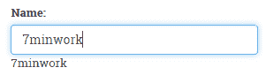

# 使用 ngModel 与 select

让我们来看一下`select`是如何设置的：

```ts
<select . . . name="duration" [(ngModel)]="exercisePlan.duration"> 
    <option *ngFor="let duration of durations" [value]="duration.value">{{duration.title}}</option> 
</select> 
```

我们在这里使用`ngFor`绑定到一个数组，`durations`，它在`Workout`组件类中。数组的结构如下：

```ts
 [{ title: "15 seconds", value: 15 }, 
  { title: "30 seconds", value: 30 }, ...] 
```

`ngFor`组件将循环数组，并使用插值将下拉框的值与数组中相应的值填充，每个项目的标题使用插值显示，`{{duration.title}}`。 然后`[(ngModel)]`将下拉选择绑定到模型中的`exercisePlan.duration`。

注意这里，我们将绑定到嵌套模型：`ExercisePlan`。 可能会有多个练习要应用这个绑定。在这种情况下，我们必须使用另一个 Angular 表单指令— `ngModelGroup`—来处理这些绑定。`ngModelGroup`将允许我们在我们的模型中创建一个包含在训练中包含的练习列表的嵌套组，并然后循环每个练习来将其持续时间绑定到模型。

首先，我们将在表单中创建的 div 标签上添加`ngModelGroup`，以保存我们的练习列表：

```ts
<div id="exercises-list" class="col-sm-2 exercise-list" ngModelGroup="exercises">
```

这样就创建了嵌套的练习列表。现在，我们必须处理列表中的单个练习，我们可以在包含每个练习的单独 div 中添加另一个`ngModelGroup`来做到这一点：

```ts
<div class="exercise tile" [ngModelGroup]="i">
```

在这里，我们使用循环的索引动态创建每个练习的单独模型组。这些模型组将嵌套在我们创建的第一个模型组中。临时地，在表单的底部添加标签`<pre>{{ f.value | json }}</pre>`，就可以看到这个嵌套模型的结构：

```ts
{
  "exercises": {
    "0": {
      "duration": 15
    },
    "1": {
      "duration": 60
    },
    "2": {
      "duration": 45
    },
    "exerciseCount": 3
  },
  "workoutName": "1minworkout",
  "title": "1 Minute Workout",
  "description": "desc",
  "restBetweenExercise": 30
}
```

这是一个强大的功能，让我们能够创建带有嵌套模型的复杂表单，所有这些都可以使用`ngModel`进行数据绑定**。**

您可能已经注意到我们刚刚介绍的两个`ngModelGroup`指令标记之间微妙的区别。其中第二个标记被包裹在尖括号`[]`中，而第一个没有。这是因为在第一个标记中，我们只是为我们的模型组命名，而在第二个标记中，我们是动态地将其绑定到每个练习的 div 标记，使用我们的 for 循环的索引。

和输入一样，选择也支持双向绑定。我们已经看到了改变选择项会更新模型，但是模型到模板的绑定可能不太明显。要验证模型到模板的绑定是否有效，打开 *7 分钟锻炼* 应用程序并验证持续时间下拉菜单。每个下拉菜单的值都与模型值（30 秒）一致。

Angular 通过使用`ngModel`很好地保持了模型和视图的同步。更改模型并查看视图更新；更改视图并观察模型立即更新。

现在，让我们给表单添加验证。

下一节的代码也可以在 GitHub 上下载：[`github.com/chandermani/angular6byexample`](https://github.com/chandermani/angular6byexample)。检查点在 GitHub 里作为分支实现。要下载的分支如下：`GitHub 分支：checkpoint4.6`（文件夹—`trainer`）。或者如果没有使用 Git，可以从以下 GitHub 位置下载 Checkpoint 4.6 的快照（ZIP 文件）：[`github.com/chandermani/angular6byexample/archive/checkpoint4.6.zip`](https://github.com/chandermani/angular6byexample/archive/checkpoint4.6.zip)。第一次设置完快照，参考`trainer`文件夹里的`README.md`文件。同样，如果和我们一起构建应用程序，请务必更新`styles.css`文件，在这里我们不会讨论。

# Angular 验证

俗话说，“不要相信用户输入”。Angular 支持验证，包括标准的 required、min、max 和 pattern，以及自定义验证器。

# ngModel

`ngModel`是我们用来实现验证的基本模块。它为我们做了两件事情：维护模型状态并提供一种机制来识别验证错误并显示验证消息。

要开始，我们需要在所有要验证的表单控件中，为`ngModel`分配一个本地变量。在每种情况下，我们需要为这个本地变量使用一个唯一的名称。例如，对于锻炼名称，我们在该控件的`input`标签内添加`#name="ngModel"`，以及 HTML 5 的`required`属性。现在锻炼名称的`input`标签应该是这样的：

```ts
<input type="text" name="workoutName" #name="ngModel" class="form-control" id="workout-name" placeholder="Enter workout name. Must be unique." [(ngModel)]="workout.name" required> 
```

通过表单，为每个输入分配`ngModel`到本地变量。同时，为所有必填字段添加`required`属性。

# Angular 模型状态

每当我们使用`NgForm`时，我们表单中的每个元素（包括输入、文本区域和选择）都会有与相关模型定义的某些状态。`ngModel`为我们跟踪这些状态。跟踪的状态包括：

+   `pristine`：只要用户不与输入进行交互，其值就为`true`。对`input`字段的任何更新都将使`ng-pristine`更改为`false`。

+   `dirty`：这与`ng-pristine`相反。当输入数据已更新时为`true`。

+   `touched`：如果控件曾经获得焦点，则为`true`。

+   `untouched`：如果控件从未失去焦点，则为`true`。这只是`ng-touched`的相反。

+   `valid`：如果`input`元素上定义了验证，并且没有任何验证失败，则为`true`。

+   `invalid`：如果元素上定义的任何验证失败，则为`true`。

`pristine``dirty`或`touched``untouched`是有用的属性，可帮助我们决定何时显示错误标签。

# Angular CSS 类

基于模型状态，Angular 会向输入元素添加一些 CSS 类。这些包括以下内容：

+   `ng-valid`：如果模型有效，则使用该标识。

+   `ng-invalid`：如果模型无效，则使用该标识。

+   `ng-pristine`：如果模型是原始的，则使用该标识

+   `ng-dirty`：如果模型已更改，则使用该标识。

+   `ng-untouched`：如果输入从未被访问过，则使用该标识

+   `ng-touched`：如果输入已获得焦点，则使用该标识。

要进行验证，请返回到`workoutName`输入标签，并在`input`标签内添加名为`spy`的模板引用变量。

```ts
<input type="text" name="workoutName" #name="ngModel" class="form-control" id="workout-name" placeholder="Enter workout name. Must be unique." [(ngModel)]="workout.name" required #spy> 
```

然后，在标签下面添加以下标签：

```ts
<label>{{spy.className}}</label> 
```

重新加载应用程序，并点击*训练构建器*中的新训练链接。在屏幕上什么都不动之前，会显示以下内容：

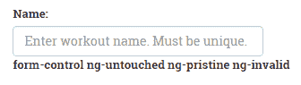

将一些内容添加到名称输入框中，并切换到其他位置。标签会更改为：

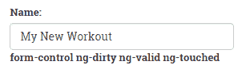

这里我们看到的是，随着用户与其交互，Angular 会更改应用于该控件的 CSS 类。您还可以通过在开发者控制台中检查`input`元素来查看这些更改。

如果我们希望根据其状态对元素应用可视提示，这些 CSS 类转换将非常有用。例如，看看这个片段：

```ts
input.ng-invalid {  border:2px solid red; } 
```

这将在任何输入控件周围绘制红色边框，表示数据无效。

当您向训练页面添加更多验证时，您可以观察（在开发者控制台中）这些类在用户与`input`元素交互时是如何添加和删除的。

现在我们已经了解了模型状态及其用法，让我们回到验证的讨论（在继续之前，请删除刚刚添加的变量名和标签）。

# 训练验证

需要验证训练数据是否符合一系列条件。

在为`input`字段添加了`ngModel`和`required`属性的本地变量引用之后，我们已经能够看到`ngModel`如何跟踪这些控件的状态变化以及如何切换 CSS 样式。

# 显示适当的验证消息

现在，输入必须有值，否则验证将失败。但是，我们如何知道验证是否失败呢？`ngModel`在这里来拯救我们。它可以提供特定输入的验证状态。这就给了我们显示适当验证消息所需的信息。

让我们回到训练计划名称的输入控件。为了显示验证消息,我们必须先修改输入标签如下:

```ts
<input type="text" name="workoutName" #name="ngModel" class="form-control" id="workout-name" placeholder="Enter workout name. Must be unique." [(ngModel)]="workout.name" required> 
```

我们添加了一个名为`#name`的本地变量,并将`ngModel`分配给它。这被称为模板引用变量,我们可以使用以下标签来显示输入的验证消息:

```ts
<label *ngIf="name.control.hasError('required') && (name.touched)" class="alert alert-danger validation-message">Name is required</label>  
```

当未提供名称并且控件已被触摸时，我们会显示验证消息。为了检查第一个条件，我们检索控件的`hasError`属性并查看错误类型是否为`required`。我们检查名称输入是否已被`touched`，因为我们不希望在表单首次加载新训练计划时显示消息。

你会注意到，我们使用了一种相对冗长的方式来识别验证错误，而不是简单地使用`!name.valid`。这种方法允许我们以更具体的方式识别验证错误，这在我们开始为表单控件添加多个验证器时将非常重要。我们将在本章稍后讨论使用多个验证器。为了保持一致性，我们将坚持使用这种更冗长的方法。

现在加载新的训练计划页面(`/builder/workouts/new`)。在名称输入框中输入一个值,然后删除它。错误标签会像下面的截图所示的那样显示出来。

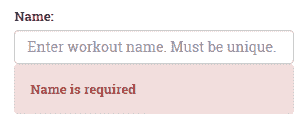

# 添加更多验证

Angular 提供了几个现成的验证器，包括：

+   `required`

+   `minLength`

+   `maxLength`

+   `email`

+   `pattern`

有关现成验证器的完整列表，请参阅[`angular.io/api/forms/Validators`](https://angular.io/api/forms/Validators)中`Validators`类的文档。

我们已经看到了`required`验证器的工作原理。现在,让我们看看另外两个现成的验证器:`minLength`和`maxLength`。除了将其设为必填项外，我们还希望训练计划的标题长度在 5 到 20 个字符之间（我们稍后将介绍`pattern`验证器）。

除了之前添加到标题输入框的`required`属性外，我们还将添加`minLength`属性并将其设置为`5`，并添加`maxLength`属性并将其设置为`20`。

```ts
<input type="text" . . . minlength="5" maxlength="20" required> 
```

然后，我们添加另一个标签，其中包含在不满足此验证条件时将显示的消息:

```ts
<label *ngIf="(title.control.hasError('minlength') || title.control.hasError('maxlength')) && workout.title.length > 0" class="alert alert-danger validation-message">Title should be between 5 and 20 characters long.</label>  
```

# 管理多个验证消息

你会发现，现在显示消息的条件是测试长度不为零。这可以防止在控件被触摸但留空的情况下显示消息。在这种情况下，标题需要的消息应该显示。这条消息只有在字段中没有输入任何内容时才显示，我们通过明确检查控件的`hasError`类型是否为`required`来实现这一点:

```ts
<label *ngIf="title.control.hasError('required')" class="alert alert-danger validation-message">Title is required.</label>
```

由于我们将两个验证器附加到此输入字段，我们可以通过在检查是否满足该条件的 div 标签中包含两个验证器来简化对输入被触摸的检查:

```ts
<div *ngIf="title.touched"> 
  . . . [the two validators] . . . 
</div> 
```

我们刚刚所做的展示了如何将多个验证附加到单个输入控件，并在不满足其中一个验证条件时显示适当的消息。然而，很明显，这种方法在处理更复杂的场景时并不可扩展。一些输入包含很多验证，并且控制验证消息何时显示可能变得复杂。随着处理各种显示的表达式变得更加复杂，我们可能希望重构并将它们移入一个自定义指令中。如何创建自定义指令将在第四章，*深入理解 Angular 指令*中详细介绍。

# 对于一个锻炼的自定义验证消息

运动而没有任何锻炼是无用的。锻炼中至少应该有一种锻炼，我们应该验证这一限制。

锻炼计数验证的问题在于用户没有直接输入它，而框架却要验证它。尽管如此，我们仍然希望一种机制来验证锻炼计数，类似于此表单上的其他验证。

我们要做的是向表单中添加一个隐藏的输入框，其中包含了锻炼的计数。然后我们将其绑定到`ngModel`并添加一个模式验证器，以确保有多于一个锻炼。我们将输入框的值设置为锻炼的计数:

```ts
<input type="hidden" name="exerciseCount" #exerciseCount="ngModel" ngControl="exerciseCount" class="form-control" id="exercise-count" [(ngModel)]="workout.exercises.length" pattern="[1-9][0-9]*"> 
```

然后，我们将类似于我们刚刚对其他验证器所做的操作附加到它的验证消息:

```ts
<label *ngIf="exerciseCount.control.hasError('pattern')" class="alert alert-danger extended-validation-message">The workout should have at least one exercise!</label>  
```

我们在这里并没有真正使用`ngModel`。这里没有涉及双向绑定。我们只对使用它进行自定义验证感兴趣。

打开新的锻炼页面，添加一个锻炼，然后将其删除; 我们应该看到这个错误:

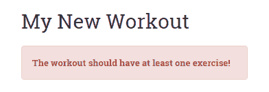

我们在这里做的事情本来可以很容易地完成，而不涉及任何模型验证基础设施。但是，通过将我们的验证钩入该基础设施中，我们会获得一些好处。我们现在可以以一种一致而熟悉的方式确定特定模型的错误和整个表单的错误。最重要的是，如果我们的验证在这里失败，整个表单将无效。

实现刚刚进行的自定义验证通常不是您经常想要做的事情。相反，通常更合理的做法是在自定义指令内部实现这种复杂逻辑。我们将在第四章的*深入理解 Angular 指令*中详细介绍创建自定义指令。

我们新实现的`Exercise Count`验证的一个讨厌之处是，在新的`Workout`屏幕首次出现时就会显示。使用这个消息，我们无法使用`ng-touched`来隐藏显示。因为练习是以程序方式添加的，并且我们使用来跟踪其数量的隐藏输入在练习被添加或删除时从未改变为已接触的状态。

要解决这个问题，我们需要一个额外的值来检查练习列表的状态何时减少到零，除非表单是第一次加载。这种情况发生的唯一方式是用户添加然后从锻炼中删除练习，直到没有更多的练习为止。因此，我们将向组件添加另一个属性，用于跟踪删除方法是否已被调用。我们称这个值为`removeTouched`并设置其初始值为`false`：

```ts
removeTouched: boolean = false; 
```

然后，在删除方法中，我们将该值设置为`true`：

```ts
removeExercise(exercisePlan: ExercisePlan) { 
    this.removeTouched = true; 
    this.workoutBuilderService.removeExercise(exercisePlan); 
} 
```

接下来，我们将将`removeTouched`添加到我们的验证消息条件中，如下所示：

```ts
<label *ngIf="exerciseCount.control.hasError('pattern') && (removeTouched)" 
```

现在，当我们打开一个新的锻炼屏幕时，验证消息将不会显示。但是，如果用户添加然后删除所有练习，那么它将显示。

要理解模型验证如何转化为表单验证，我们需要了解表单级别验证提供了什么。但是，即使在那之前，我们也需要实现保存锻炼并从锻炼表单中调用它。

# 保存锻炼

我们正在构建的锻炼需要被持久化（仅内存中）。我们需要做的第一件事就是扩展`WorkoutService`和`WorkoutBuilderService`。

`WorkoutService`需要两个新方法，`addWorkout`和`updateWorkout`：

```ts
addWorkout(workout: WorkoutPlan){ 
    if (workout.name){ 
        this.workouts.push(workout); 
        return workout; 
    } 
} 

updateWorkout(workout: WorkoutPlan){ 
    for (var i = 0; i < this.workouts.length; i++) { 
        if (this.workouts[i].name === workout.name) { 
            this.workouts[i] = workout; 
            break; 
        } 
    } 
} 
```

`addWorkout`方法对锻炼名称进行基本检查，然后将锻炼推入锻炼数组中。由于没有涉及后备存储，如果刷新页面，数据就会丢失。我们将在下一章中修复这个问题，将数据持久保存到服务器。

`updateWorkout`方法在现有的锻炼数组中查找具有相同名称的锻炼，并在找到时进行更新和替换。

我们只需要向`WorkoutBuilderService`添加一个保存方法，因为我们已经在追踪进行中的锻炼构建的上下文：

```ts
save(){ 
    let workout = this.newWorkout ? 
        this._workoutService.addWorkout(this.buildingWorkout) : 
        this._workoutService.updateWorkout(this.buildingWorkout); 
    this.newWorkout = false; 
    return workout; 
} 
```

`save`方法根据是否正在创建新的锻炼或正在编辑现有的锻炼，在`Workout`服务中调用`addWorkout`或`updateWorkout`。

从服务的角度来看，这就足够了。是时候将保存锻炼的能力集成到`Workout`组件中，并了解更多关于表单指令的知识了！

在更详细地查看`NgForm`之前，让我们向`Workout`添加保存方法，以便在单击`保存`按钮时保存训练计划。将以下代码添加到`Workout`组件中：

```ts
save(formWorkout:any){ 
    if (!formWorkout.valid) return; 
    this.workoutBuilderService.save(); 
    this.router.navigate(['/builder/workouts']); 
}  
```

我们使用其 invalid 属性检查表单的验证状态，如果表单状态有效，则调用`WorkoutBuilderService.save`方法。

# NgForm 更多内容

在 Angular 中，与传统的向服务器发送数据的表单相比，表单扮演了不同的角色。如果我们回头再看一下 form 标签，会发现它缺少标准的 action 属性。使用 Angular 等 SPA 框架时，通过完整页面的回发方式向服务器发送数据不合理。在 Angular 中，所有服务器请求都是通过起源于指令或服务的异步调用进行的。

在幕后，Angular 还关闭了浏览器的内置验证。正如您在本章中看到的，我们仍在使用`required`等验证属性，看起来与原生 HTML 验证属性相同。然而，正如 Angular 文档所解释的那样，在 Angular 表单内部，“Angular 使用指令将这些属性与框架中的验证器函数匹配。” 参见[`angular.io/guide/form-validation#template-driven-validation`](https://angular.io/guide/form-validation#template-driven-validation)。

这里的表单扮演着不同的角色。当表单封装一组输入元素（如输入、文本框和选择）时，它提供了一个 API 来：

+   根据表单上的输入控件确定表单的状态，例如表单是脏的还是原始的

+   在表单或控制级别检查验证错误

如果您仍希望使用标准表单行为，可以向`form`元素添加`ngNoForm`属性，但这肯定会导致完整页面刷新。您还可以通过添加`ngNativeValidate`属性来开启浏览器的内置验证。在本章后面的部分，当我们看到如何保存表单和实现验证时，我们将更详细地探讨`NgForm` API 的具体内容。

表单内 FormControl 对象的状态由`NgForm`监视。如果其中任何一个无效，那么`NgForm`会将整个表单设置为无效。在这种情况下，我们已经能够使用`NgForm`确定一个或多个`FormControl`对象是无效的，因此整个表单的状态也是无效的。

在完成本章节之前，让我们再看一起问题。

# 修复表单的保存和验证消息

打开一个新的 Workout 页面，直接点击保存按钮。由于表单无效，什么也没有被保存，但是单个表单输入的验证根本不会显示出来。现在很难知道是哪些元素导致了验证失败。这种行为背后的原因非常明显。如果我们查看名称输入元素的错误消息绑定，会看到以下内容：

```ts
*ngIf="name.control?.hasError('required') && name.touched"
```

请记住，在本章的早些时候，我们明确禁用了显示验证消息，直到用户触摸输入控件为止。同样的问题又回来找我们了，我们现在需要修复它。

我们没有办法显式地将控件的触摸状态更改为未触摸状态。相反，我们将求助于一点欺诈来完成工作。我们将引入一个名为`submitted`的新属性。将其添加在`Workout`类定义的顶部，并将其初始值设置为`false`，如下所示：

```ts
submitted: boolean = false;
```

当保存按钮被点击时，变量将被设置为`true`。通过添加以下高亮显示的代码来更新保存的实现：

```ts
save(formWorkout){ 
 this.submitted = true; 
    if (!formWorkout.valid) return; 
    this._workoutBuilderService.save(); 
    this.router.navigate(['/builder/workouts']); 
} 
```

然而，这有什么帮助呢？好吧，这个修复的另一个部分需要我们更改我们正在验证的每个控件的错误消息。现在表达式变成了：

```ts
*ngIf="name.control.hasError('required') && (name.touched || submitted)"   
```

通过这个修复，当控件被触摸时或表单提交按钮被按下时（`submitted`为`true`），错误消息将被显示。此表达式修复现在必须适用于每个出现检查的验证消息。

如果现在打开新的 Workout 页面并点击保存按钮，则应该在输入控件上看到所有验证消息：

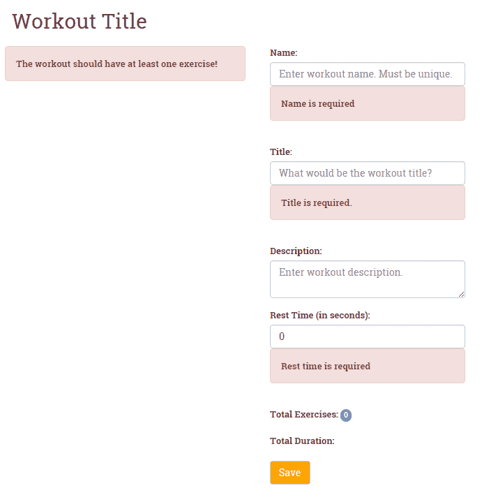

# 响应式表单

Angular 支持的另一种表单类型称为**响应式**表单。**响应式表单**始于在组件类中构建的模型。通过这种方式，我们使用**表单构建器 API**在代码中创建一个表单，并将其与一个模型关联起来。

给定我们必须编写的最小代码来使模板驱动表单工作，那么为什么以及何时应考虑使用响应式表单呢？有几种情况下，我们可能想要使用它们。这些情况包括我们想要以编程方式控制创建表单的情况。尤其是在我们试图基于从服务器检索到的数据动态创建表单控件时，这是特别有益的，正如我们将看到的那样。

如果我们的验证变得复杂，通常更容易在代码中处理。使用响应式表单，我们可以将这些复杂的逻辑从 HTML 模板中分离出来，使模板语法更简单。

响应式表单的另一个重要优势是，它使得对表单进行单元测试成为可能，这对**模板驱动表单**来说并非如此。我们可以在我们的测试中简单实例化我们的表单控件，然后在页面上的标记之外对它们进行测试。

**响应式表单**使用了三个我们之前没有讨论过的新表单指令：`FormGroup`、 `FormControl` 和 `FormArray`。这些指令允许在代码中构建的表单对象与模板中的 HTML 标记直接绑定。在组件类中创建的表单控件随后也直接可用于表单本身。从技术上讲，这意味着我们不需要在响应式表单中使用 `ngModel`（这是模板驱动表单的核心部分），尽管它也可以使用。总体上，这种方法使得模板更清晰、更简洁，更专注于驱动表单的代码。让我们开始构建一个响应式表单。

# 使用响应式表单入门

我们将使用响应式表单来构建添加和编辑练习的表单。除其他内容外，该表单将允许用户在 YouTube 上添加练习视频的链接。由于他们可以添加任意数量的视频链接，我们需要能够动态添加这些视频链接的控件。这个挑战将对响应式表单在开发更复杂的表单时的有效性提出良好的测试。

表单将如下所示：

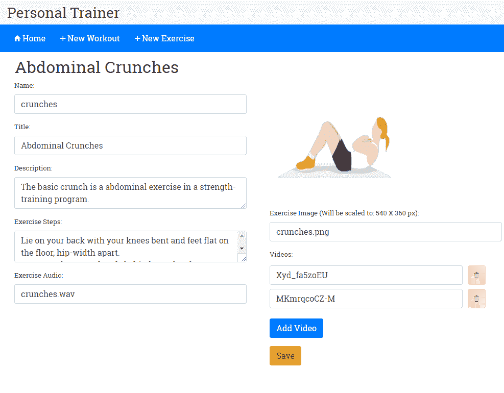

要开始，请打开 `workout-builder.module.ts` 并添加以下`import`：

```ts
import { FormsModule, ReactiveFormsModule }   from '@angular/forms'; 
 ... 
@NgModule({ 
    imports: [ 
        CommonModule, 
        FormsModule, 
 ReactiveFormsModule, 
        SharedModule, 
        workoutBuilderRouting 
    ],
```

`ReactiveFormsModule` 包含了构建响应式表单所需的内容。

接下来，从 `checkpoint 4.6` 下的 `trainer/src/app` 中的 `workout-builder/builder-services` 文件夹中复制 `exercise-builder-service.ts` 并将其导入到 `workout-builder.module.ts` 中：

```ts
import { ExerciseBuilderService } from "./builder-services/exercise-builder-service"; 
```

然后，在同一文件中的提供者数组中将其添加为附加提供者：

```ts
@NgModule({ 
   . . . 
  providers: [
    WorkoutBuilderService,
    WorkoutResolver,
    ExerciseBuilderService,
    ExerciseResolver
   ]
}) 
```

请注意，我们还已将 `ExerciseResolver` 添加为提供者。我们在这里不会讨论这个，但你应该从 `exercise` 文件夹下也复制它，并且还要复制更新后的 `workout-builder-routing.module.ts`，将它作为导航到 `ExerciseComponent` 的路由守卫。

现在，打开 `exercise.component.ts` 并添加以下导入语句：

```ts
import { Validators, FormArray, FormGroup, FormControl, FormBuilder } from '@angular/forms';
```

这将引入我们将用来构建表单的以下内容：

+   `FormBuilder`

+   `FormGroup`

+   `FormControl`

+   `FormArray`

最后，我们将 `FormBuilder`（以及 `Router`、 `ActivatedRoute` 和 `ExerciseBuilderService`）注入到我们类的构造函数中：

```ts
  constructor(
      public route: ActivatedRoute,
      public router: Router,
      public exerciseBuilderService: ExerciseBuilderService,
      public formBuilder: FormBuilder
  ) {}
```

通过完成这些初步步骤，我们现在可以开始构建我们的表单了。

# 使用 FormBuilder API

`FormBuilder` API 是响应式表单的基础。你可以把它想象成是在我们的代码中构建表单的工厂。现在，在你的类中添加 `ngOnInit` 生命周期钩子，如下所示：

```ts
  ngOnInit() {
    this.sub = this.route.data
        .subscribe(
          (data: { exercise: Exercise }) => {
            this.exercise = data.exercise;
          }
        );

      this.buildExerciseForm();
  } 
```

当 `ngOnInit` 被触发时，它将从由 `ExerciseResolver` 检索和返回的路由数据中提取现有或新的 `exercise` 的数据。这与初始化 `Workout` 组件时遵循的模式相同。

现在，让我们通过添加以下代码来实现 `buildExerciseForm` 方法：

```ts
buildExerciseForm(){ 
    this.exerciseForm = this.formBuilder.group({ 
        'name': [this.exercise.name, [Validators.required, AlphaNumericValidator.invalidAlphaNumeric]], 
        'title': [this.exercise.title, Validators.required], 
        'description': [this.exercise.description, Validators.required], 
        'image': [this.exercise.image, Validators.required], 
        'nameSound': [this.exercise.nameSound], 
        'procedure': [this.exercise.procedure], 
        'videos': this.addVideoArray() 
    }) 
}  
```

让我们来看一下这段代码。首先，我们使用注入的`FormBuilder`实例来构建表单并将其分配给一个本地变量`exerciseForm`。使用`formBuilder.group`，我们向表单添加了多个表单控件。我们通过简单的键/值映射添加了每个表单控件：

```ts
'name': [this.exercise.name, Validators.required], 
```

映射的左侧是`FormControl`的名称，右侧是一个数组，它的第一个元素是控件的值（在我们的例子中是我们练习模型上对应的元素），第二个是验证器（在这种情况下是开箱即用的必需验证器）。非常整洁！通过在模板之外设置表单控件来设置它们，肯定更容易看到和理解我们的表单控件。

我们不仅可以用这种方式在我们的表单中构建`FormControls`，还可以添加`FormControlGroups`和`FormControlArray`，它们包含其中的`FormControls`。这意味着我们可以创建包含嵌套输入控件的复杂表单。在我们的情况下，正如我们已经提到的，我们需要考虑用户可能向练习中添加多个视频的情况。我们可以通过添加以下代码来实现：

```ts
'videos': this.addVideoArray() 
```

我们在这里做的是将一个`FormArray`分配给视频，这意味着我们可以在这个映射中分配多个控件。为了构造这个新的`FormArray`，我们向我们的类添加了以下`addVideoArray`方法：

```ts
addVideoArray(){ 
    if(this.exercise.videos){ 
        this.exercise.videos.forEach((video : any) => { 
            this.videoArray.push(new FormControl(video, Validators.required)); 
        }); 
    } 
    return this.videoArray; 
} 
```

这个方法为每个视频构造了一个`FormControl`；然后将每个视频添加到分配给我们的表单中的`videos`控件的`FormArray`中。

# 将表单模型添加到我们的 HTML 视图

到目前为止，我们一直在我们的类中幕后工作来构建我们的表单。下一步是将我们的表单连接到视图。为此，我们使用了同样的控件，用来在我们的代码中构建表单：`formGroup`，`formControl`和`formArray`。

打开`exercise.component.html`并添加如下的`form`标签：

```ts
<form class="row" [formGroup]="exerciseForm" (ngSubmit)="onSubmit(exerciseForm)">  
```

在标签内，我们首先将我们刚刚在代码中构建的`exerciseForm`分配给`formGroup`。这样建立了我们编码模型与视图中表单的连接。我们还将`ngSubmit`事件与代码中的`onSubmit`方法连接起来（我们稍后会讨论这个方法）。

# 将表单控件添加到我们的表单输入中

接下来，我们开始构建我们表单的输入。我们将以我们练习名称的输入开始：

```ts
<input name="name" formControlName="name" class="form-control" id="name" placeholder="Enter exercise name. Must be unique.">  
```

我们将我们编码的表单控件的名称分配给`formControlName`。这样就建立了我们代码中的控件与标记中的`input`字段之间的链接。这里另一个值得注意的是，我们没有使用`required`属性。

# 添加验证

我们接下来要做的是向控件添加验证消息，以便在验证出错时显示：

```ts
<label *ngIf="exerciseForm.controls['name'].hasError('required') && (exerciseForm.controls['name'].touched || submitted)" class="alert alert-danger validation-message">Name is required</label>
```

请注意，这种标记非常类似于我们在模板驱动表单中用于验证的内容，只是用于识别控件的语法有点更冗长。它再次检查控件的`hasError`属性状态，以确保它是有效的。

但等一下！我们如何验证此输入？我们难道没有从标签中删除`required`属性吗？这就是我们在代码中添加的控件映射发挥作用的地方。如果回顾一下表单模型的代码，您可以看到`name`控件的以下映射:

```ts
'name': [this.exercise.name, Validators.required], 
```

映射数组中的第二个元素将必填验证器分配给名称表单控件。这意味着我们不必在模板中添加任何内容；相反，表单控件本身附加了一个必填验证器到模板上。在代码中添加验证器的能力使我们能够方便地在模板之外添加验证器。当涉及编写具有复杂逻辑的自定义验证器时，这是特别有用的。

# 添加动态表单控件

我们正在构建的练习表单要求允许用户向练习中添加一个或多个视频。由于我们不知道用户可能希望添加多少视频，我们将不得不在用户点击添加视频按钮时动态构建这些视频的`input`字段。它将如下所示:

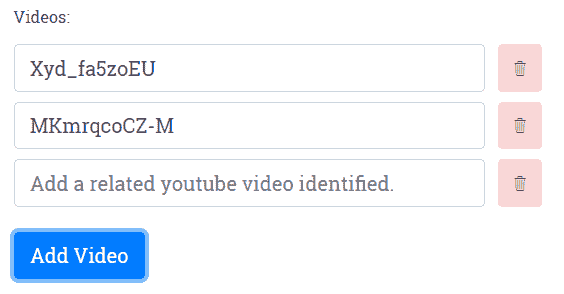

我们已经在我们的组件类中看到了用于执行此操作的代码。现在，让我们看看如何在我们的模板中实现它。

首先，我们使用`ngFor`循环遍历视频列表。然后，我们将视频在列表中的索引赋值给本地变量`i`。到目前为止，没有什么意外。

```ts
<div *ngFor="let video of videoArray.controls; let i=index" class="form-row align-items-center">
```

在循环内，我们做了三件事。首先，我们为当前练习中的每个视频动态添加一个视频`input`字段。

```ts
<div class="col-sm-10">
    <input type="text" class="form-control" [formControlName]="i" placeholder="Add a related youtube video identified."/>
</div>
```

接下来，我们添加一个按钮，允许用户删除视频:

```ts
<span class="btn alert-danger" title="Delete this video." (click)="deleteVideo(i)">
    <span class="ion-ios-trash-outline"></span>
</span> 
```

我们将组件类中的`deleteVideo`方法绑定到按钮的`click`事件上，并传递给它被删除的视频的索引。

然后，我们为每个视频`input`字段添加验证消息:

```ts
<label *ngIf="exerciseForm.controls['videos'].controls[i].hasError('required') && (exerciseForm.controls['videos'].controls[i].touched || submitted)" class="alert alert-danger validation-message">Video identifier is required</label>
```

验证消息遵循了在本章其他地方使用的显示消息的相同模式。我们进入`exerciseFormControls`组以找到特定索引的控件。再次，语法冗长但足够容易理解。

# 保存表单

构建响应式表单的最后一步是处理表单的保存。在先前构造表单标签时，我们将`ngSubmit`事件绑定到代码中的以下`onSubmit`方法上。

```ts
  onSubmit(formExercise: FormGroup) {
      this.submitted = true;
      if (!formExercise.valid) { return; }
      this.mapFormValues(formExercise);
      this.exerciseBuilderService.save();
      this.router.navigate(['/builder/exercises']);
  }
```

此方法将`submitted`设置为`true`，这将触发可能之前因表单未被触摸而隐藏的任何验证消息的显示。如果没有任何验证错误，则返回而不保存。如果没有错误，则调用以下`mapFormValues`方法，将表单中的值分配给将要保存的`exercise`。

```ts
  mapFormValues(form: FormGroup) {
      this.exercise.name = form.controls['name'].value;
      this.exercise.title = form.controls['title'].value;
      this.exercise.description = form.controls['description'].value;
      this.exercise.image = form.controls['image'].value;
      this.exercise.nameSound = form.controls['nameSound'].value;
      this.exercise.procedure = form.controls['procedure'].value;
      this.exercise.videos = form.controls['videos'].value;
  }
```

然后它调用了`ExerciseBuilderService`中的保存方法，并将用户路由回练习列表屏幕（请记住，任何新练习不会显示在该列表中，因为我们尚未在应用程序中实现数据持久性）。

我们希望这让事情变得清晰起来；当我们尝试构建更复杂的表单时，响应式表单提供了许多优势。它们允许将编程逻辑从模板中移除。它们允许以编程方式向表单添加验证器。而且，它们支持在运行时动态构建表单。

# 自定义验证器

现在，在我们结束本章之前，我们再看一件事。任何在构建 Web 表单上工作过的人（无论是在 Angular 还是任何其他 Web 技术上）都知道，我们经常需要创建适用于我们正在构建的应用程序的独特验证。Angular 为我们提供了通过构建自定义验证器来增强我们的响应式表单验证的灵活性。

在构建我们的运动形式时，我们需要确保输入的内容，因为名称只包含字母数字字符且没有空格。这是因为当我们开始将练习存储在远程数据存储中时，我们将使用练习的名称作为其键。因此，除了标准的必填字段验证器之外，让我们构建另一个验证器，以确保输入的名称只以字母数字形式存在。

创建自定义控件非常简单。在其最简单的形式中，Angular 自定义验证器是一个以控件作为输入参数的函数，运行验证检查，并返回 true 或 false。因此，让我们首先添加一个名为`alphanumeric-validator.ts`的 TypeScript 文件。在该文件中，首先从`@angular/forms`中导入`FormControl`，然后在该文件中添加以下类：

```ts
export class AlphaNumericValidator {
    static invalidAlphaNumeric(control: FormControl): { [key: string]: boolean } {
        if ( control.value.length && !control.value.match(/^[a-z0-9]+$/i) ) {
            return {invalidAlphaNumeric: true };
        }
        return null;
    }
}
```

该代码遵循我们刚提到的创建验证器的模式。唯一可能有点意外的是当验证失败时它返回 true！只要你明白这个怪癖，你就应该没有问题编写自己的自定义验证器。

# 将自定义验证器整合到我们的表单中

那么我们如何将自定义验证器插入我们的表单中？如果我们使用响应式表单，答案非常简单。当我们在代码中构建表单时，我们就像添加内置验证器那样添加它。让我们这样做。打开`exercise.component.ts`并首先为我们的自定义验证器添加一个导入：

```ts
import { AlphaNumericValidator } from '../alphanumeric-validator'; 
```

然后，修改表单构建器代码，将验证器添加到`name`控件中：

```ts
buildExerciseForm(){ 
    this.exerciseForm = this._formBuilder.group({ 
'name': [this.exercise.name, [Validators.required, AlphaNumericValidator.invalidAlphaNumeric]], 
  . . . [other form controls] . . . 
    }); 
} 

```

由于名称控件已经具有必填验证器，我们使用一个包含两个验证器的数组将`AlphaNumericValidator`作为第二个验证器添加到控件中。该数组可以用于向控件添加任意数量的验证器。

最后一步是在我们的模板中将控件的适当验证消息合并到我们的模板中。打开`workout.component.html`并在显示所需验证器消息的标签下方添加以下标签：

```ts
<label *ngIf="exerciseForm.controls['name'].hasError('invalidAlphaNumeric') && (exerciseForm.controls['name'].touched || submitted)" class="alert alert-danger validation-message">Name must be alphanumeric</label> 
```

如果在名称输入框中输入了非字母数字值，练习屏幕现在将显示验证消息：

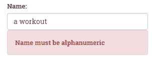

正如我们所希望的那样，响应式表单使我们能够以简单的方式向我们的表单添加自定义验证器，这样我们就可以在代码中维护验证逻辑，并将其轻松地集成到我们的模板中。

你可能已经注意到，在本章中，我们没有涵盖如何在模板驱动的表单中使用自定义验证器。因为实现它们需要额外的步骤，即构建一个自定义指令。我们将在第四章中进行介绍，《深入理解 Angular 指令》。

# 运行验证的配置选项

在我们从验证中离开之前，还有一个话题要覆盖，那就是运行验证的配置选项。到目前为止，我们一直使用默认选项，即在每次输入事件上运行验证检查。然而，你可以选择将它们配置为在“blur”（即用户离开输入控件时）或在表单提交时运行。你可以在表单级别或逐个控件的基础上进行配置。

例如，我们可能决定为避免在锻炼表单中处理缺少的锻炼的复杂性，我们将该表单设置为仅在提交时进行验证。我们可以通过向表单标签添加以下高亮显示的`NgFormOptions`来设置：

```ts
<form #f="ngForm" name="formWorkout" (ngSubmit)="save(f.form)" [ngFormOptions]="{updateOn: 'submit'}" class="row">
```

这将指示 Angular 仅在`submit`时进行验证。尝试一下，你会发现当你在表单中输入时，不会出现任何验证。留空表单并按保存按钮，你会看到验证信息出现。当然，采用这种方法意味着用户在按保存按钮之前不会收到关于验证的任何视觉提示。

在我们的表单中使用这种方法的时候也会有一些意想不到的副作用。首先是，当我们在标题输入框中输入时，标题不会再在屏幕顶部更新。只有在按保存按钮时，该值才会更新。其次，如果你添加一个或多个锻炼然后移除所有的锻炼，你还会看到一个验证信息出现。这是因为我们为这个控件设置了特殊的条件，导致它在常规验证流程之外触发。

所以，也许我们应该采取一种不同的方法。Angular 提供了一种更细粒度地控制验证流程的选项，即允许我们在控件级别上做这样的配置，使用`ngModelOptions`。例如，让我们从表单标签中移除`ngFormOptions`的赋值，并修改标题输入控件以添加`ngModelOptions`，如下所示：

```ts
<input type="text" name="title" class="form-control" #title="ngModel" id="workout-title" placeholder="What would be the workout title?" [(ngModel)]="workout.title" [ngModelOptions]="{updateOn: 'blur'}" minlength="5" maxlength="20" required>
```

当你在输入框里输入标题时，你会注意到直到你移开它（触发`updateOn`事件），标题才更新到屏幕上：

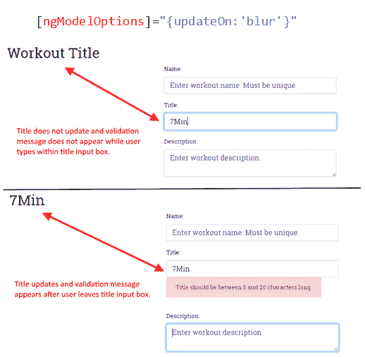

正如你记得的，将标题更新为每次按键都会造成默认选项。这是一个刻意的例子，但它说明了这些配置的差异如何工作。

你可能看不出在这里使用模糊设置的必要性。但是，在可能需要通过调用外部数据存储进行验证的情况下，这种方法可以帮助限制调用的次数。在我们实现自定义指令时，会进行这样的远程调用，这就是我们将在第四章中所做的事情，*深入理解 Angular 指令*。该指令将检查我们远程数据存储中已经存在的重复名称。因此，让我们将此配置从标题输入控件中移除，并放置在名称输入控件中，就像这样：

```ts
<input type="text" name="workoutName" #name="ngModel" class="form-control" id="workout-name" placeholder="Enter workout name. Must be unique." [(ngModel)]="workout.name" [ngModelOptions]="{updateOn: 'blur'}" required>
```

我们还可以在响应式表单中设置验证的时间选项。根据我们已经学到的关于响应式表单的知识，你可能不会感到惊讶，我们将在代码中应用这些设置而不是模板中。例如，要为表单组设置它们，使用以下语法：

```ts
new FormGroup(value, {updateOn: 'blur'}));
```

我们还可以将它们应用到单个表单控件上，在我们的锻炼表单的情况下就是这样。与锻炼表单一样，我们希望能够通过远程调用验证名称的唯一性。因此，我们希望以类似的方式限制验证检查。我们将通过在创建名称表单控件的代码中添加以下内容来实现该目的：

```ts
  buildExerciseForm() {
      this.exerciseForm = this.formBuilder.group({
          'name': [
            this.exercise.name,
 {
 updateOn: 'blur',
 validators: [Validators.required, AlphaNumericValidator.invalidAlphaNumeric]
 }
          ],
        ....
      });
  }
```

请注意，我们将设置和`validators`数组放在大括号对内的选项对象中。

# 总结

我们现在有了一个*个人教练*应用程序。将特定的*7 分钟锻炼*应用程序转换为通用的*个人教练*应用程序的过程帮助我们学习了许多新概念。本章开始时，我们定义了新应用程序的需求。然后，我们将模型设计为共享服务。

我们为*个人教练*应用程序定义了一些新视图和对应的路由。我们还使用了子路由和异步路由来将*锻炼构建器*从应用程序的其余部分分离出来。

然后，我们将注意力转到了锻炼建设上。本章的主要技术焦点之一是 Angular 表单。*锻炼构建器*使用了许多表单输入元素，并且我们使用了模板驱动和响应式表单实现了许多常见的表单场景。我们还深入探讨了 Angular 验证，并实现了自定义验证器。我们还介绍了配置运行验证的时间选项。

下一章将讨论客户端-服务器交互。我们创建的锻炼和练习需要被持久化。在下一章中，我们将构建一个持久化层，这将允许我们在服务器上保存锻炼和练习数据。

在我们结束这一章之前，这里有一个友好的提醒。如果你还没有完成*个人教练*的练习建设例程，请继续。您可以随时将您的实施与伴侣代码库中提供的内容进行比较。您还可以在原始实施中添加一些内容，例如练习图像的文件上传，一旦您对客户端-服务器交互更加熟悉，还可以远程检查确定 YouTube 视频是否真的存在。
