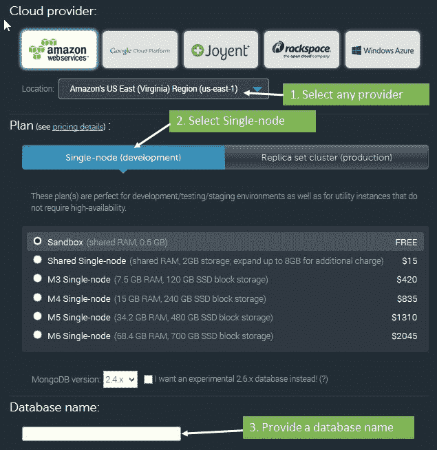
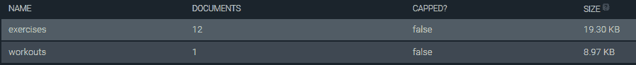
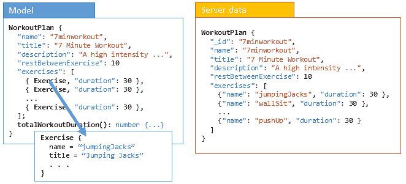
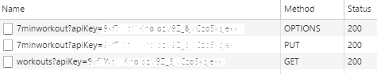
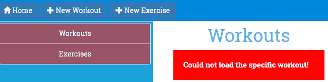

# 第三章：支持服务器数据持久性

现在是时候与服务器进行交流了！创建锻炼、添加练习并保存下来，然后发现所有努力都白费，因为数据没有持久化存储。我们需要解决这个问题。

应用程序很少是自包含的。无论大小如何，任何消费者应用程序都有与其边界之外的元素交互的部分。对于基于 Web 的应用程序，交互主要是与服务器进行的。应用程序与服务器交互用于认证、授权、存储/检索数据、验证数据以及执行其他操作。

本章探讨了 Angular 提供的用于客户端-服务器交互的构造。在这个过程中，我们为*个人教练* 添加了一个持久化层，用于向后端服务器加载和保存数据。

本章我们讨论的主题包括以下内容：

+   **配置后端以持久化训练数据**：我们设置一个 MongoLab 账户，并使用其数据 API 来访问和存储锻炼数据。

+   **了解 Angular HttpClient**：`HttpClient`允许我们通过 HTTP 与服务器进行交互。您将学习如何使用`HttpClient` 发起各种类型的`GET`、`POST`、`PUT` 和 `DELETE` 请求。

+   **实现锻炼数据的加载和保存**：我们使用`HTTPClient`加载并存储 MongoLab 数据库中的锻炼数据。

+   **我们可以使用 HttpClient 的 XMLHttpRequest 的两种方式**：使用 Observables 或承诺。

+   **使用 RxJS 和 Observables**：用于订阅和查询数据流。

+   **使用承诺**：在本章中，我们将学习如何在 HTTP 调用和响应中使用承诺。

+   **跨域访问工作**：由于我们要与不同域的 MongoLab 服务器进行交互，您将了解浏览器对跨域访问的限制。您还将学习 JSONP 和 CORS 如何帮助我们轻松进行跨域访问，以及 Angular 对 JSONP 的支持。

让我们开始吧。

# Angular 和服务器交互

任何客户端-服务器交互通常归结为向服务器发送 HTTP 请求并从服务器接收响应。对于重型 JavaScript 应用程序，我们依赖 AJAX 请求/响应机制与服务器通信。为了支持基于 AJAX 的通信，Angular 提供了 Angular `HttpClient` 模块。在深入研究`HttpClient` 模块之前，我们需要设置存储数据并允许我们管理数据的服务器平台。

# 设置持久化存储

对于数据持久性，我们使用名为 MongoDB（[`www.mongodb.com/`](https://www.mongodb.com/)）的文档数据库，托管在 MongoLab（[`www.mlab.com/`](https://www.mlab.com/)）上作为我们的数据存储。我们选择 MongoLab 的原因是它提供了与数据库直接交互的接口。这样可以节省我们设置服务器中间件来支持 MongoDB 交互的工作。

直接将数据存储/数据库暴露给客户端并不是一个好主意。但在这种情况下，由于我们的主要目的是学习 Angular 和客户端-服务器交互，我们冒险直接访问了 MongoLab 托管的 MongoDB 实例。还有一种新型应用程序是建立在**无后端**解决方案上的。在这样的设置中，前端开发人员构建应用程序而无需了解涉及的确切后端知识。服务器交互仅限于向后端发出 API 调用。如果你对这些无后端解决方案感兴趣，可以查看 [`nobackend.org/`](http://nobackend.org/)。

我们的第一个任务是在 MongoLab 上配置一个账号并创建一个数据库：

1.  前往 [`mlab.com`](https://mlab.com) 并按照网站上的说明注册一个 mLab 账号

1.  账号配置好后，登录并点击主页上的“Create New”按钮创建一个新的 Mongo 数据库

1.  在数据库创建页面上，你需要进行一些选择来配置数据库。参见下面的截图选择免费的数据库层级和其他选项：



1.  创建数据库，记下你创建的数据库名称

1.  一旦数据库被配置好，打开数据库并从“Collection”标签页向其中添加两个集合：

    +   `exercises`: 这里存储了所有*个人教练*的锻炼

    +   `workouts`: 这里存储了所有的*个人教练*锻炼

MongoDB 中的集合相当于数据库表。

MongoDB 属于一类称为**文档数据库**的数据库。这里的核心概念是文档、属性和它们的关联。与传统数据库不同，这里的模式不是固定的。我们在这本书中不会涵盖文档数据库的概念以及如何为基于文档的存储执行数据建模。*个人教练*的存储需求有限，我们使用上述的两个文档集合进行管理。甚至我们可能根本不会以真正意义上的文档数据库来使用它。

添加集合后，从“Users”标签页将自己添加为数据库用户。

下一步是确定 MongoLab 账号的 API 密钥。配置好的 API 密钥必须附加到每个发送给 MongoLab 的请求中。要获得 API 密钥，请执行以下步骤：

1.  点击右上角的用户名（而不是账户名）以打开用户配置文件。

1.  在名为“API Key”的部分，会显示当前的 API 密钥；复制它。同时，点击 API 密钥下面的按钮以启用数据 API 访问。默认情况下是禁用的。

数据存储模式已经完成。现在我们需要填充这些集合。

# 填充数据库

*个人教练*应用程序已经有一个预定义的锻炼和一个包含 12 个锻炼的列表。我们需要使用这些数据填充集合。

在`trainer/db`文件夹的检查点 5.1 中打开`seed.js`。 它包含种子 JSON 脚本和有关如何向 MongoLab 数据库实例种子数据的详细说明。

种子后，数据库将在 workouts 收集中有一个锻炼和在 exercises 收集中有 12 个练习。 在 MongoLab 网站上验证这一点;收集应该显示如下：



现在一切都设置好了，让我们开始讨论`HttpClient`模块并为*个人健身教练*应用程序实现锻炼/运动持久性。

# HTTPClient 模块的基础

在`HTTPClient`模块的核心是`HttpClient`。 它使用`XMLHttpRequest`作为默认后端执行 HTTP 请求（JSONP 也可用，我们将在本章后面看到）。 它支持`GET`，`POST`，`PUT`和`DELETE`等请求。 在本章中，我们将使用`HttpClient`进行所有这些类型的请求。 正如我们将看到的，`HttpClient`使得以最少的设置和复杂性很容易进行这些调用。 这些术语对于之前曾经使用过 Angular 或构建过与后端数据存储通信的 JavaScript 应用程序的人来说都不会感到意外。

但是，Angular 处理 HTTP 请求的方式发生了重大变化。 现在调用请求会返回 HTTP 响应的 Observable。 它这样做是使用 RxJS 库，这是一种广为人知的异步 Observable 模式的开源实现。

您可以在 GitHub 上找到 RxJS 项目[`github.com/Reactive-Extensions/RxJS`](https://github.com/Reactive-Extensions/RxJS)。 该网站表明该项目正在与开源开发人员社区一起由微软积极开发。 我们将不会在这里详细介绍 RxJS 如何实现异步 Observable 模式，我们鼓励您访问该网站，以了解有关该模式以及 RxJS 如何实现它的更多信息。 Angular 使用的 RxJS 版本是 beta 5。

简而言之，使用 Observable 允许开发人员将应用程序中流动的数据视为信息流，应用程序可以随时候接并使用的信息流。 这些信息流随时间变化，这允许应用程序对这些变化做出反应。 Observable 的这种特性为**函数式响应式编程**（**FRP**）提供了基础，从命令式转变为响应式从根本上改变了构建 Web 应用程序的范例。

`RxJS`库提供了运算符，允许您订阅和查询这些数据流。 此外，您可以轻松混合和组合它们，正如我们将在本章看到的。 Observable 的另一个优点是轻松取消或退订它们，从而可以无缝处理错误。

尽管仍然可以使用 promises，但 Angular 的默认方法使用 Observables。本章还将介绍 promises。

# 个人教练和服务器集成

正如前一节所述，客户端-服务器交互完全是异步的。当我们修改*个人教练*应用程序以从服务器加载数据时，这种模式变得不言自明。

在上一章中，练习和锻炼的初始集合是硬编码在`WorkoutService`实现中的。让我们先看看如何从服务器加载这些数据。

# 加载练习和锻炼数据

在本章的前面部分，我们使用一个数据形式在数据库中播种了数据，即`seed.js`文件。现在我们需要在视图中呈现这些数据。MongoLab 数据 API 将在这里帮助我们。

MongoLab 数据 API 使用 API 密钥来验证访问请求。对 MongoLab 端点发出的每个请求都需要一个查询字符串参数，`apikey=<key>`，其中`key`是我们在本章中之前提供的 API 密钥。请记住，密钥始终提供给用户并与其帐户关联。不要与他人共享您的 API 密钥。

该 API 遵循可预测的模式来查询和更新数据。对于任何 MongoDB 集合，典型的端点访问模式是以下之一（此处提供了基本 URL：[`api.mongolab.com/api/1/databases`](https://api.mongolab.com/api/1/databases)）：

+   `/<dbname>/collections/<name>?apiKey=<key>`: 这包括以下请求:

    +   `GET`: 此操作获取给定集合名称中的所有对象。

    +   `POST`: 此操作将新对象添加到集合名称中。MongoLab 有一个`_id`属性，它可以唯一标识文档（对象）。如果在发布的数据中未提供，它将被自动生成。

+   `/<dbname>/collections/<name>/<id>?apiKey=<key>`: 这包括以下请求:

    +   `GET`: 这会获取具有特定 ID 的特定文档/集合项（在集合名称中的 `_id`属性上进行匹配）。

    +   `PUT`: 这会更新集合名称中的特定项目（`id`）。

    +   `DELETE`: 这将从集合名称中删除具有特定 ID 的项目。

关于 Data API 接口的更多细节，请访问 MongoLab Data API 文档：[`docs.mlab.com/data-api`](http://docs.mlab.com/data-api)。

现在我们有能力开始实现练习/锻炼列表页面。

我们在本章中开始时使用的代码是`checkpoint 4.6`（文件夹：`trainer`）在本书的 GitHub 存储库中。它可以在 GitHub 上找到（[`github.com/chandermani/angular6byexample`](https://github.com/chandermani/angular6byexample)）。检查点在 GitHub 中作为分支进行实现。如果您没有使用 Git，请从以下 GitHub 位置下载检查点 4.6 的快照（ZIP 文件）：[`github.com/chandermani/angular6byexample/tree/checkpoint4.6`](https://github.com/chandermani/angular6byexample/tree/checkpoint4.6)。第一次设置快照时，请参考`trainer`文件夹中的`README.md`文件。

# 从服务器加载练习和锻炼列表

为了从 MongoLab 数据库中提取练习和锻炼列表，我们必须重新编写我们的`WorkoutService`服务方法：`getExercises`和`getWorkouts`。但在此之前，我们必须设置我们的服务以便与 Angular 的 HTTPClient 模块一起使用。

# 将 HTTPClient 模块和 RxJS 添加到我们的项目中

Angular 的 HTTPClient 模块已经包含在您已经安装的 Angular 包中。要使用它，我们需要将其导入到`app.module.ts`中，就像这样（确保导入跟在`BrowserModule`之后）：

```ts
import { HttpClientModule } from '@angular/common/http';
. . . 
@NgModule({ 
  imports: [ 
    BrowserModule,
    HttpClientModule, 
. . . 
})
```

我们还需要一个外部第三方库：**JavaScript 响应式扩展**（**RxJS**）。RxJS 实现了 Observable 模式，并且它与 HTTPClient 模块一起被 Angular 使用。它已经包含在我们项目中已经存在的 Angular 包中。

# 更新 workout-service 以使用 HTTPClient 模块和 RxJS

从`trainer/src/app/core`中打开`workout.service.ts`。为了在`WorkoutService`中使用 HTTPClient 和 RxJS，我们需要将以下导入添加到该文件中：

```ts
import { HttpClient } from '@angular/common/http';
import { Observable } from 'rxjs/Observable';
import { catchError } from 'rxjs/operators';
```

我们正在从 RxJS 导入`HTTPClient`模块以及`Observable`，还有一个额外的 RxJS 运算符：`catchError`。随着我们在这一节中的工作，我们将看到这个运算符是如何使用的。

在类定义中，添加以下属性，其中包括一个锻炼属性和用于设置我们 Mongo 数据库中集合的 URL 以及该数据库的密钥的属性，以及另一个属性：`params`，它将 API 密钥设置为 API 访问的查询字符串：

```ts
workout: WorkoutPlan; 
collectionsUrl = "https://api.mongolab.com/api/1/ databases/<dbname>/collections"; 
apiKey = <key> 
params = '?apiKey=' + this._apiKey; 
```

用数据库名称和我们在本章中提供的数据库的 API 密钥替换`<dbname>`和`<key>`标记。

接下来，使用以下代码将 HTTPClient 模块注入`WorkoutServiceconstructor`中：

```ts
constructor(public http: HttpClient) {
}
```

然后将`getExercises()`方法更改为以下内容：

```ts
getExercises() {
    return this.http.get<ExercisePlan>(this.collectionsUrl + '/exercises' + this.params)
        .pipe(catchError(WorkoutService.handleError));
}
```

如果您习惯于使用承诺进行异步数据操作，那么您在这里看到的将会有所不同。在这里发生的是`http.get`方法返回了来自 RxJS 库的 Observable。请注意，我们还设置了响应为`<ExercisePlan>`类型，以明确告诉我们的上游调用者我们的 HTTP GET 调用返回的 Observable 类型。

当使用`HTTPClient`模块的`get`方法时，默认响应是返回一个 Observable。然而，Observable 可以转换为一个 promise。正如我们将在本章后面看到的那样，也存在返回 JSONP 的选项。

在我们继续之前，在这段代码中还有一件事要注意。请注意，我们使用了一个管道方法来添加一个`catchError`操作符。这个操作符接受一个方法，`handleError`，用于处理失败的响应。`handleError`方法将失败的响应作为参数。我们将错误记录到控制台并使用`Observable.throw`将错误返回给消费者：

```ts
static handleError (error: Response) { 
    console.error(error); 
    return Observable.throw(error || 'Server error');
}
```

明确一点，这不是生产代码，而是让我们有机会展示如何编写上游代码来处理作为数据访问一部分生成的错误。

需要明确的是，在这个阶段，Observable 中没有任何数据流动，直到有订阅它的操作。如果您不小心为您的 Observables 添加订阅，这可能会在诸如添加和更新之类的操作中带来一个令人惊讶的时刻。

# 修改`getWorkouts()`以使用 HTTPClient 模块

检索运动的代码变化与检索锻炼的代码几乎完全相同：

```ts
getWorkouts() {
    return this.http.get<WorkoutPlan[]>(this.collectionsUrl + '/workouts' + this.params)
        .pipe(catchError(WorkoutService.handleError));
}
```

再次指定 Observable 的类型——在这种情况下是`<WorkoutPlan[]>`——我们使用`pipe`来添加一个`catchError`操作符。

现在`getExercises`和`getWorkouts`方法已经更新，我们需要确保它们与上游调用者配合工作。

# 更新锻炼/运动列表页面

锻炼和运动列表页面（以及`LeftNavExercises`）调用`model.ts`中的`getExercises`或`getWorkouts`方法。为了使这些与正在使用`HTTPClient`模块进行的远程调用能够正常工作，我们需要修改这些调用以订阅被`HTTPClient`模块返回的 Observable。因此，请更新`exercises.component.ts`中的`ngOnInit`方法中的代码如下：

```ts
  ngOnInit() {
    this.workoutService.getExercises()
    .subscribe(
        exercises => this.exerciseList = exercises,
        (err: any) => console.error
    );
```

我们的方法现在订阅由`getExercises`方法返回的 Observable；当响应到达时，它将结果赋给`exerciseList`。如果发生错误，它将分配给一个`console.error`调用，该调用在控制台中显示错误。所有这些现在都是使用 RxJS 和`HTTPClient`模块以异步方式处理的。

继续对`workouts.component.ts`和`left-nav-exercises.component.ts`中的`ngOnInit`方法进行类似的更改。

刷新锻炼/运动列表页面，锻炼和运动数据将从数据库服务器加载。

如果您在检索/显示数据时遇到困难，请查看 GitHub 仓库中检查点 5.1 中的完整实现。 请注意，在此检查点中，我们已经禁用了导航链接到锻炼和练习屏幕，因为我们仍然需要为它们添加 Observable 实现。 我们将在下一节中执行此操作。 还记得在运行`Checkpoint 5.1`的代码之前，请替换数据库名称和 API 密钥。 如果您没有使用 Git，请从以下 GitHub 位置下载`Checkpoint 5.1`的快照（ZIP 文件）：[`github.com/chandermani/angular6byexample/tree/checkpoint5.1`](https://github.com/chandermani/angular6byexample/tree/checkpoint5.1)。 在首次设置快照时，请参考`trainer`文件夹中的`README.md`文件。

看起来很不错，列表加载正常。 嗯，几乎没有问题！ 在锻炼列表页面有一个小故障。 如果我们仔细观察任何列表项（实际上只有一项），我们可以很容易地发现它：


锻炼时长的计算不再有效！ 这可能是原因是什么？ 我们需要回顾一下这些计算是如何实现的。 `WorkoutPlan`服务（在`model.ts`中）定义了一个`totalWorkoutDuration`方法，用于执行这个计算。

工作数组的差异在于绑定到视图上。在前一章中，我们使用`WorkoutPlan`服务创建的模型对象数组创建了该数组。 但是现在，因为我们从服务器检索数据，我们将一个简单的 JavaScript 对象数组绑定到视图，这显然没有计算逻辑。

我们可以通过将服务器响应映射到我们的模型类对象并将它们返回给任何上游调用者来解决这个问题。

# 将服务器数据映射到应用程序模型

如果模型和服务器存储定义匹配，那么将服务器数据映射到我们的模型，反之亦然可能是不必要的。 如果我们看一下`Exercise`模型类和我们在 MongoLab 中为练习添加的种子数据，我们会发现它们是匹配的，因此映射变得不必要。

如果：

+   我们的模型定义了任何方法

+   存储的模型与其在代码中的表示不同

+   相同的模型类用于表示来自不同来源的数据（这可能发生在混搭数据的情况下，我们从不同的来源拉取数据）

`WorkoutPlan`服务是模型表示和其存储之间阻抗不匹配的一个典型例子。 查看下面的屏幕截图以了解这些差异：



模型和服务器数据之间的两个主要差异如下：

+   该模型定义了`totalWorkoutDuration`方法。

+   `exercises`数组的表示方式也不同。 模型的`exercises`数组包含完整的`Exercise`对象，而服务器数据只存储了练习标识符或名称。

这明显意味着加载和保存锻炼需要模型映射。

我们将通过添加另一个操作符来转换 Observable 响应对象的方式来实现这一点。到目前为止，我们只返回了一个普通的 JavaScript 对象作为响应。很好的一点是，我们用于添加错误处理的`pipe`方法也允许我们添加额外的操作符，我们可以用它们将 JavaScript 对象转换为我们模型中的`WorkoutPlan`类型。

让我们将`workout-service.ts`文件中的`getWorkouts`方法重写为以下内容：

```ts
    getWorkouts(): Observable<WorkoutPlan[]> {
        return this.http.get<WorkoutPlan[]>(this.collectionsUrl + '/workouts' + this.params)
            .pipe(
                map((workouts: Array<any>) => {
                  const result: Array<WorkoutPlan> = [];
                  if (workouts) {
                      workouts.forEach((workout) => {
                          result.push(
                              new WorkoutPlan(
                                  workout.name,
                                  workout.title,
                                  workout.restBetweenExercise,
                                  workout.exercises,
                                  workout.description
                              ));
                      });
                  }
                  return result;
                }),
                catchError(this.handleError<WorkoutPlan[]>('getWorkouts', []))
            );
    }
```

我们添加了一个`map`操作符，将这个 Observable 转换为由`WorkoutPlan`对象组成的 Observable。每个`WorkoutPlan`对象（目前我们只有一个）将拥有我们所需的`totalWorkoutDuration`方法。

查看代码，你会发现我们是对 JSON 结果的 HTTPClient 响应进行操作，这就是我们使用`<any>`类型的原因。然后，我们创建了一个`WorkoutPlans`的类型数组，并使用箭头函数`forEach`依次对第一个数组进行迭代，将每个 JavaScript 对象赋给一个`WorkoutPlan`对象。

我们将这些映射的结果返回给订阅它们的调用者，例如`workouts.component.ts`。我们还使用新的`handleError`方法更新了`catchError`操作符，你可以在检查点 5.2 中找到。调用者不需要对他们用来订阅我们的 workouts Observable 的代码进行任何更改。相反，在应用程序的一个地方可以进行模型映射，然后在整个应用程序中使用它。

如果重新运行应用程序，你会发现总的秒数现在可以正确显示了：


GitHub 仓库的检查点 5.2 包含了我们到目前为止所涵盖的工作实现。GitHub 分支是`checkpoint5.2`（文件夹：`trainer`）。

# 从服务器加载练习和锻炼数据

正如我们之前修复了`WorkoutService`中的`getWorkouts`实现一样，我们可以为与练习和锻炼相关的其他获取操作实现。从`trainer/src/app/core`文件夹中的`workout.service.ts`文件中拷贝`WorkoutService`的`getExercise`和`getWorkout`方法的服务实现到检查点 5.2。

`getWorkout`和`getExercise`方法使用锻炼/练习的名称来检索结果。每个 MongoLab 集合项都有一个唯一标识这个项/实体的`_id`属性。对于我们的`Exercise`和`WorkoutPlan`对象，我们使用练习的名称来进行唯一标识。因此，每个对象的`name`和`_id`属性总是匹配的。

在这一点上，我们需要在`workout.service.ts`中添加另一个导入：

```ts
import { forkJoin } from 'rxjs/observable/forkJoin';
```

这个导入引入了`forkJoin`操作符，我们将在稍后讨论它。

特别注意`getWorkout`方法的实现，因为由于模型和数据存储格式不匹配，这个方法涉及大量的数据转换。现在`getWorkout`方法的样子如下：

```ts
    getWorkout(workoutName: string): Observable<WorkoutPlan> {
      return forkJoin (
          this.http.get(this.collectionsUrl + '/exercises' + this.params),
          this.http.get(this.collectionsUrl + '/workouts/' + workoutName + this.params))
          .pipe(
               map(
                  (data: any) => {
                      const allExercises = data[0];
                      const workout = new WorkoutPlan(
                          data[1].name,
                          data[1].title,
                          data[1].restBetweenExercise,
                          data[1].exercises,
                          data[1].description
                      );
                      workout.exercises.forEach(
                          (exercisePlan: any) => exercisePlan.exercise = allExercises.find(
                              (x: any) => x.name === exercisePlan.name
                          )
                      );
                      return workout;
                  }
              ),
              catchError(this.handleError<WorkoutPlan>(`getWorkout id=${workoutName}`))
        );
      }
```

在`getWorkout`中发生了很多需要我们理解的事情。

`getWorkout`方法使用 Observable 及其`forkJoin`操作符来返回两个 Observable 对象：一个是检索到的`Workout`，另一个是检索到的所有`Exercises`的列表。`forkJoin`操作符的有趣之处在于它不仅允许我们返回多个 Observable 流，而且还会等待两个 Observable 流都检索到其数据后才进一步处理结果。换句话说，它使我们能够从多个并发的 HTTP 请求中获取响应，然后对组合的结果进行操作。

一旦我们有了`Workout`详情和完整的练习列表，我们将结果`pipe`到`map`操作符（正如我们之前在`Workouts`列表的代码中看到的），我们用它来将锻炼的`exercises`数组改为正确的`Exercise`类对象。我们通过在从服务器返回的`workout.exercises`数组中搜索`allExercises` Observable 的练习名称，然后将匹配的练习分配给锻炼服务的数组来完成这个操作。最终结果是我们有了一个正确设置了`exercises`数组的完整的`WorkoutPlan`对象。

这些`WorkoutService`的更改需要上游调用方也进行修复。我们已经修复了`LeftNavExercises`和`Exercises`组件中的练习列表，以及`Workouts`组件中的锻炼。现在让我们按照类似的方式来修复`Workout`和`Exercise`组件。`Workout`服务中的`getWorkout`和`getExercise`方法不是直接由这些组件调用的，而是由构建器服务调用的。因此，我们将不得不连同`Workout`和`Exercise`组件以及我们为这些组件添加的两个解析器—`WorkoutResolver`和`ExerciseResolver`—一起修复构建器服务。

# 修复构建器服务

现在我们已经设置好`WorkoutService`以从远程数据存储中检索锻炼，我们必须修改`WorkoutBuilderService`以便能够将该锻炼作为 Observable 检索。提取`Workout`详情的方法是`startBuilding`。为了做到这一点，我们将当前的`startBuilding`方法分成两个方法，一个是为新的锻炼，一个是对我们从服务器检索到的旧的锻炼。以下是新锻炼的代码：

```ts
    startBuildingNew() {
      const exerciseArray: ExercisePlan[] = [];
      this.buildingWorkout = new WorkoutPlan('', '', 30, exerciseArray);
      this.newWorkout = true;
      return this.buildingWorkout;
    }
```

对于旧的锻炼，我们添加以下代码：

```ts
    startBuildingExisting(name: string) {
      this.newWorkout = false;
      return this.workoutService.getWorkout(name);
    }
```

我们让您在`ExerciseBuilderService`中做同样的修复。

# 更新解析器

随着我们开始使用 Observable 类型来访问数据，我们需要对通往锻炼和练习屏幕的路由创建的解析器进行一些调整。我们首先处理 `workout` 文件夹中的 `workout-resolver.ts` 中的 `WorkoutResolver`。

首先，从 RxJs 中添加以下导入：

```ts
import { Observable } from 'rxjs/Observable';
import { of } from 'rxjs/observable/of';
import { map, catchError } from 'rxjs/operators';
```

接下来，按以下方式更新 `resolve` 方法：

```ts
  resolve(
    route: ActivatedRouteSnapshot,
    state: RouterStateSnapshot): Observable<WorkoutPlan> {
    const workoutName = route.paramMap.get('id');

    if (!workoutName) {
        return this.workoutBuilderService.startBuildingNew();
    } else {
        return this.workoutBuilderService.startBuildingExisting(workoutName)
        .pipe(
          map(workout => {
            if (workout) {
              this.workoutBuilderService.buildingWorkout = workout;
              return workout;
            } else {
              this.router.navigate(['/builder/workouts']);
              return null;
            }
          }),
          catchError(error => {
            console.log('An error occurred!');
            this.router.navigate(['/builder/workouts']);
            return of(null);
          })
        );
    }
```

如您所见，我们将新锻炼的行为（在 URL 参数中未传递锻炼名称的情况）和现有锻炼的行为分开了。在前一种情况下，我们调用 `workoutBuilderService.startBuildingExisting`，它将返回一个新的 `WorkoutPlan`。在后一种情况下，我们调用 `workoutBuilderService.startBuildingExisting` 并对结果进行处理，然后将其映射为返回 `workout`，除非找不到，此时我们会将用户重新路由到 `Workouts` 屏幕。

# 修复锻炼和练习组件

一旦我们修复了 `WorkoutBuilderService` 和 `WorkoutResolver`，实际上在 `WorkoutComponent` 中不需要进一步的修复。处理 Observable 的所有工作都已经在更下游完成，而在此阶段我们只需要订阅路由数据，获取锻炼，就像我们之前一直在做的那样：

```ts
  ngOnInit() {
      this.sub = this.route.data
          .subscribe(
            (data: { workout: WorkoutPlan }) => {
              this.workout = data.workout;
            }
          );
  }
```

为了测试实现，在 `workouts.component.ts` 的 `onSelect` 方法中取消注释以下突出显示的代码：

```ts
  onSelect(workout: WorkoutPlan) {
      this.router.navigate( ['./builder/workout', workout.name] );
  }
```

然后在 `builder/workouts/` 显示的锻炼列表中点击任何现有锻炼，比如 *7 分钟锻炼*。锻炼数据应成功加载。

`ExerciseBuilderService` 和 `ExerciseResolver` 也需要修复。`检查点 5.2` 包含这些修复。您可以复制这些文件，或自己进行修复并比较实现。不要忘记在 `exercises.component.ts` 中的 `onSelect` 方法中取消注释代码。

GitHub 代码库中的 `检查点 5.2` 包含迄今为止我们所涵盖内容的工作实现。如果您不使用 Git，请从以下 GitHub 位置下载 `检查点 5.2` 的快照（ZIP 文件）：[`github.com/chandermani/angular6byexample/tree/checkpoint5.2`](https://github.com/chandermani/angular6byexample/tree/checkpoint5.2)。在首次设置快照时，请参阅 `trainer` 文件夹中的 `README.md` 文件。

现在是时候修复、创建和更新练习和锻炼的情景了。

# 对练习/锻炼进行 CRUD

在创建，读取，更新和删除（CRUD）操作时，所有保存、更新和删除方法都需要转换为 Observable 模式。

在本章前面，我们详细描述了 MongoLab 集合中进行 CRUD 操作的端点访问模式。返回到 *加载练习和锻炼数据* 部分，重新查看访问模式。我们现在需要这个，因为我们计划创建/更新锻炼。

在实施之前，了解 MongoLab 如何识别集合项以及我们的 ID 生成策略是很重要的。MongoDB 中的每个集合项都是使用`_id`属性在集合中唯一标识的。在创建新项时，我们可以提供 ID，也可以让服务器自动生成 ID。一旦设置了`_id`，就无法更改。对于我们的模型，我们将锻炼/运动的`名称`属性作为唯一的 ID，并将该名称复制到`_id`字段中（因此，`_id`没有自动生成）。另外，记住我们的模型类不包含这个`_id`字段；必须在第一次保存记录之前创建它。

让我们先解决锻炼创建的场景。

# 创建新的锻炼

采用自下而上的方法，需要修复的第一件事是`WorkoutService`。根据以下代码更新`addWorkout`方法：

```ts
    addWorkout(workout: WorkoutPlan) {
      const workoutExercises: any = [];
      workout.exercises.forEach(
          (exercisePlan: any) => {
              workoutExercises.push({name: exercisePlan.exercise.name, duration: exercisePlan.duration});
          }
      );

      const body = {
          '_id': workout.name,
          'exercises': workoutExercises,
          'name': workout.name,
          'title': workout.title,
          'description': workout.description,
          'restBetweenExercise': workout.restBetweenExercise
      };

      return this.http.post(this.collectionsUrl + '/workouts' + this.params, body)
        .pipe(
          catchError(this.handleError<WorkoutPlan>())
        );
    }
```

在`getWorkout`中，我们必须将数据从服务器模型映射到我们的客户端模型；在这里需要做相反的操作。首先，我们为锻炼创建一个新的数组，`workoutExercises`，然后将更紧凑的版本的锻炼添加到该数组中，以便更好地存储在服务器上。我们只想在服务器上的 exercises 数组中存储锻炼名称和持续时间（该数组是`any`类型，因为在其紧凑格式中，它不符合`ExercisePlan`类型）。

接下来，我们通过将这些更改映射到 JSON 对象来设置我们的 post 的主体。请注意，作为构造此对象的一部分，我们将`_id`属性设置为锻炼的名称，以在锻炼集合的数据库中唯一标识它。

在 MongoDB 中，将锻炼/运动的*名称*作为记录标识符（或`id`）的简单方法将无法在任何体量较大的应用程序中使用。请记住，我们正在创建一个可以同时被许多用户访问的基于 Web 的应用程序。由于存在两个用户可能使用相同的锻炼/运动名称的可能性，所以我们需要一个强大的机制来确保名称不重复。MongoLab REST API 的另一个问题是，如果有一个具有相同`id`字段的重复`POST`请求，其中一个将创建一个新文档，而另一个将更新它，而不是第二个失败。这意味着在客户端对`id`字段进行任何重复检查仍然无法防止数据丢失。在这种情况下，分配`id`值的自动生成是可取的。在标准情况下，在创建实体时，唯一的 ID 生成是在服务器上完成的（主要是由数据库完成）。当实体创建时，响应然后包含生成的 ID。在这种情况下，在我们将数据返回给调用代码之前，我们需要更新模型对象。

最后，我们调用`HTTPClient`模块的`post`方法，传递要连接的 URL，额外的查询字符串参数（`apiKey`）和我们要发送的数据。

最后一条返回语句应该很熟悉，因为我们使用 Observables 返回锻炼对象作为 Observable 解析的一部分。您需要确保在 Observable 链中添加`.subscribe`以使其起作用。我们将很快通过向`WorkoutComponent`的`save`方法添加订阅来实现这一点。

# 更新锻炼

为什么不尝试实现更新操作呢？`updateWorkout`方法可以以同样的方式修复，唯一的区别是需要`HTTPClient`模块的`put`方法。

```ts
    updateWorkout(workout: WorkoutPlan) {
      const workoutExercises: any = [];
      workout.exercises.forEach(
          (exercisePlan: any) => {
              workoutExercises.push({name: exercisePlan.exercise.name, duration: exercisePlan.duration});
          }
      );

      const body = {
          '_id': workout.name,
          'exercises': workoutExercises,
          'name': workout.name,
          'title': workout.title,
          'description': workout.description,
          'restBetweenExercise': workout.restBetweenExercise
      };

      return this.http.put(this.collectionsUrl + '/workouts/' + workout.name + this.params, body)
        .pipe(
          catchError(this.handleError<WorkoutPlan>())
        );
    }
```

前面的请求 URL 现在包含了一个额外的片段（`workout.name`），表示需要更新的集合项的标识符。

MongoLab 的`PUT`API 请求会在集合中找不到传递的文档时创建请求体中的文档。在进行`PUT`请求时，请确保原始记录存在。我们可以通过首先对同一文档进行`GET`请求并确认我们获取到一个文档来实现这一点。将这留给您来实现。

# 删除锻炼

需要修复的最后一个操作是删除锻炼。这里是一个简单的实现，我们调用`HTTPClient`模块的`delete`方法来删除特定 URL 引用的锻炼：

```ts
    deleteWorkout(workoutName: string) {
        return this.http.delete(this.collectionsUrl + '/workouts/' + workoutName + this.params)
          .pipe(
            catchError(this.handleError<WorkoutPlan>())
          );
    }
```

# 修复上游代码

现在是时候修复`WorkoutBuilderService`和`Workout`组件了。`WorkoutBuilderService`的`save`方法现在如下所示：

```ts
    save() {
      const workout = this.newWorkout ?
          this.workoutService.addWorkout(this.buildingWorkout) :
          this.workoutService.updateWorkout(this.buildingWorkout);
      this.newWorkout = false;
      return workout;
   }
```

大部分都和之前一样，因为它确实是一样的！我们不必更新这段代码，因为我们有效地将与外部服务器的交互隔离在我们的`WorkoutService`组件中。

最后，`Workout`组件的保存代码如下所示：

```ts
  save(formWorkout: any) {
    this.submitted = true;
    if (!formWorkout.valid) { return; }
    this.workoutBuilderService.save().subscribe(
      success => this.router.navigate(['/builder/workouts']),
      err => console.error(err)
    );
  }
```

在这里，我们进行了更改，以便现在订阅保存。正如您可能还记得我们之前的讨论，`subscribe`使 Observable 活跃，以便我们可以完成保存。

就是这样！现在我们可以创建新的锻炼和更新现有的锻炼（删除锻炼的完成留给您）。这并不是太困难！

让我们试一下。打开新的`Workout Builder`页面，创建一个锻炼，并保存它。还尝试编辑一个现有的锻炼。这两种情况应该可以无缝运行。

如果您在运行本地副本时遇到问题，请查看`检查点 5.3`以获取最新的实现。如果您没有使用 Git，可以从以下 GitHub 位置下载`检查点 5.3`的快照（ZIP 文件）：[`github.com/chandermani/angular6byexample/tree/checkpoint5.3`](https://github.com/chandermani/angular2byexample/tree/checkpoint5.3)。初次设置快照时，请参考`trainer`文件夹中的`README.md`文件。

在我们进行`POST`或`PUT`请求保存数据时，网络端会发生一些有趣的事情。打开浏览器的网络日志控制台（*F12*），看看发出的请求。日志看起来类似于以下内容：



网络日志

在进行实际的`POST`或`PUT`之前，会对相同的端点进行一个`OPTIONS`请求。在这里我们见到的行为被称为**预检请求**。这是因为我们正在对`api.mongolab.com`进行跨域请求。

# 使用 promises 进行 HTTP 请求

本章的大部分内容都集中在 Angular `HTTPClient`如何将 Observables 作为`XMLHttpRequests`的默认方式。这代表着与过去的工作方式相比存在着重大的变化。许多开发人员习惯于使用 promises 进行异步 HTTP 请求。在这种情况下，Angular 继续支持 promises，但不再是默认选择。开发人员必须选择 promises 才能在`XMLHttpRequest`中使用它们。

例如，如果我们想要在`WorkoutService`的`getExercises`方法中使用 promises，我们将不得不重新构建命令如下：

```ts
    getExercises(): Promise<Exercise[]> {
        return this.http.get<Exercise[]>(this.collectionsUrl + '/exercises' + this.params)
        .toPromise()
        .then(res => res)
        .catch(err => {
            return Promise.reject(this.handleError('getExercises', []));
        });
    }
```

要将此方法转换为使用 promises，我们只需在方法链中添加`.toPromise()`，一个成功的参数`then`，以及一个指向现有`handleError`方法的`catch`和`Promise.reject`。

对于上游组件，我们只需将返回值的处理方式切换为 promises 而不是 Observables。因此，要在这种情况下使用 promises，我们需要更改`Exercises.component.ts`和`LeftNavExercises.component.ts`中的代码，首先添加一个用于错误消息的新属性（关于如何在屏幕上显示错误消息，我们将留给你来完成）：

```ts
errorMessage: any;
```

然后将调用`WorkoutService`的`ngOnInit`方法更改为以下内容：

```ts
  ngOnInit() {
    this.workoutService.getExercises()
 .then(exerciseList => this.exerciseList = exerciseList,
 error => this.errorMessage = <any>error
    );
  }  
```

当然，我们可以在这个简单的例子中很容易地用 promises 代替 Observables，这并不意味着它们本质上是相同的。一个`then` promise 会返回另一个 promise，这意味着你可以创建连续链接的 promises。而在 Observable 的情况下，订阅本质上是终点，不能在此之后再进行映射或订阅。

如果你熟悉 promises，在这个阶段可能会倾向于坚持使用它们，而不去尝试使用 Observables。毕竟，在本章中我们使用 Observables 所做的大部分工作也可以用 promises 实现。例如，我们使用 Observable 的`forkJoin`操作符对`getWorkouts`的两个 Observable 流进行映射，与之相对应，在 promise 中也可以使用`q,all`函数来执行相同的操作。

然而，如果你采用这种方式，你实际上是在低估自己。Observables 打开了一种令人兴奋的新的网页开发方式，这种方式称为函数式响应式编程。它们涉及到了一种根本性的思维转变，将应用程序的数据视为一种不断变化的信息流，应用程序对其做出反应和响应。这种转变使得应用程序可以以不同的架构构建，使其更快速和更具弹性。在 Angular 中，Observables 是这些方面的核心，如事件发射器和新版本的`NgModel`。

尽管 promises 是你工具包中的一个有用工具，但我们鼓励你在使用 Angular 开发时调查 Observables。它们是 Angular 前瞻性哲学的一部分，并将对未来的应用程序和技能集具有用处。

查看`checkpoint 5.3`文件，其中包含我们之前涵盖的与 promises 相关的代码的最新实现。如果你不使用 Git，请从以下 GitHub 位置下载 Checkpoint 5.3 的快照（ZIP 文件）：[`github.com/chandermani/angular6byexample/tree/checkpoint5.3`](https://github.com/chandermani/angular6byexample/tree/checkpoint5.3)。首次设置快照时，请参考`trainer`文件夹中的`README.md`文件。请注意，在下一节中，我们将重新使用 Observables 来编写这段代码。这段代码可以在`checkpoint 5.4`文件中找到。

# 异步管道

正如我们在本章涵盖的许多数据操作中所看到的，有一个相当常见的模式一再重复。当一个 Observable 从 HTTP 请求中返回时，我们将响应转换为 JSON 并订阅它。订阅然后将 Observable 输出绑定到 UI 元素。如果我们能消除这种重复的编码并用更简单的方法来完成我们想要做的事情，那不是很好吗？

毫不奇怪，Angular 为我们提供了恰当的方法。它被称为**async 管道**，可以像其他管道一样用于绑定到屏幕上的元素。但是，异步管道是比其他管道更强大的机制。它以 Observable 或 promise 作为输入，并自动订阅它。它还处理 Observable 的订阅解除，而无需任何进一步的代码。

让我们看一个在我们应用程序中的例子。让我们回到我们在之前关于 promises 讨论的部分中刚才看到的`LeftNavExercises`组件。请注意，我们已将该组件和`Exercises`组件从 promises 转换回使用 Observables。

查看`checkpoint 5.4`文件，其中包含将该代码再次转换为使用 Observables 的最新实现。如果你不使用 Git，请从以下 GitHub 位置下载 Checkpoint 5.4 的快照（ZIP 文件）：[`github.com/chandermani/angular6byexample/tree/checkpoint5.4`](https://github.com/chandermani/angular6byexample/tree/checkpoint5.4)。首次设置快照时，请参考`trainer`文件夹中的`README.md`文件。

然后在`LeftNavExercises`中做以下更改。首先，从 RxJs 导入 Observable：

```ts
import { Observable } from 'rxjs/Observable';
```

然后将`exerciseList`从一组练习更改为相同类型的 Observable：

```ts
public exerciseList:Observable<Exercise[]>;
```

然后修改获取练习的`WorkoutService`调用以消除订阅：

```ts
this.exerciseList = this.workoutService.getExercises();
```

最后，打开 `left-nav-exercises.component.html` 并在 `*ngFor` 循环中添加 `async` 管道，如下所示：

```ts
<div *ngFor="let exercise of exerciseList|async|orderBy:'title'">
```

刷新页面，您仍将看到显示练习列表。但这次，我们使用了 `async` 管道来消除设置订阅到 Observable 的需求。非常酷！这是 Angular 添加的一个很好的便利，因为我们在这一章节中花费时间理解 Observables 如何使用订阅，现在我们清楚地了解了 `async` 管道在幕后为我们处理的内容。

我们将让您在 `Exercises` 组件中实现相同的更改。

了解 HTTP 请求的跨域行为以及 Angular 提供的构造函数以进行跨域请求非常重要。

# 跨域访问和 Angular

跨域请求是针对不同域中的资源的请求。此类请求，当由 JavaScript 发起时，浏览器会施加一些限制；这些被称为 *同源策略* 限制。这种限制会阻止浏览器向不同于脚本原始来源的域发出 AJAX 请求。源匹配严格基于协议、主机和端口的组合。

对于我们自己的应用程序，对 `https://api.mongolab.com` 的调用是跨域调用，因为我们的源代码托管在不同域（很可能是类似 `http://localhost/....` 的域）。

有一些变通方法和一些标准可以帮助放松/控制跨域访问。我们将探索其中两种最常用的技术。它们是：

+   **填充式 JSON** （**JSONP**）

+   **跨域资源共享**（**CORS**）

绕过同源策略的一种常见方法是使用 JSONP 技术。

# 使用 JSONP 进行跨域请求

远程调用的 JSONP 机制依赖于浏览器可以执行来自任何域的 JavaScript 文件，无论源的来源是什么，只要脚本是通过 `<script>` 标签包含的。

在 JSONP 中，不是直接向服务器发出请求，而是生成一个动态的 `<script>` 标签，并将 `src` 属性设置为需要调用的服务器端点。当将这个 `<script>` 标签追加到浏览器的 DOM 中时，将会向目标服务器发出请求。

然后服务器需要以特定格式发送响应，将响应内容包裹在函数调用代码中（在响应数据周围添加额外填充给这种技术命名为 JSONP）。

Angular JSONP 服务隐藏了这种复杂性，并提供了一个易于使用的 API 来进行 JSONP 请求。StackBlitz 链接，[`stackblitz.com/edit/angular-nxeuxo`](https://stackblitz.com/edit/angular-nxeuxo)，突出显示了如何进行 JSONP 请求。它使用了 *IEX Free Stock API* ([`iextrading.com/developer/`](https://iextrading.com/developer/)) 来获取任何股票符号的报价。

Angular JSONP 服务仅支持 HTTP 的`GET`请求。使用任何其他 HTTP 请求，比如`POST`或`PUT`，将产生错误。

如果你看看 StackBlitz 项目，你会看到我们在整本书中遵循的组件创建的熟悉模式。我们不会再次介绍这个模式，但会强调一些与使用 Angular JSONP 服务相关的细节。

首先，除了`FormsModule`和`HttpClientModule`的导入之外，你需要在`app.module.ts`中导入`HttpClientJsonpModule`如下所示：

```ts
. . . 
import { HttpClientModule, HttpClientJsonpModule } from '@angular/common/http';
import { FormsModule } from '@angular/forms';
. . . 
@NgModule({
. . . 
  imports: [
    BrowserModule,
    FormsModule,
    HttpClientModule,
 HttpClientJsonpModule
  ],
. . . 
}) 
```

接下来，我们需要在`get-quote.component.ts`中添加以下导入：

```ts
import { Component }from '@angular/core';
import { HttpClient } from '@angular/common/http';
import { Observable } from 'rxjs/Observable';
import { map } from 'rxjs/operators';
```

我们导入了`HttpClient`，其中包含我们将要使用的`JSONP`方法，以及 RxJS 的`Observable`和`map`运算符。这些导入对你来说应该是很熟悉的，因为我们在这一章中已经基于它们构建了一些内容。

在处理 Angular JSONP 时，重要的是要理解，默认情况下，它返回使用 RxJS 的 Observables。这意味着我们将不得不遵循订阅这些 Observables 的模式，并使用 RxJS 运算符来操纵结果。我们也可以使用异步管道来简化这些操作。

然后我们将`HttpClient`注入到构造函数中：

```ts
constructor(public http: HttpClient) {}
```

接下来，我们添加几个我们将在 JSONP 调用中使用的变量：

```ts
   symbol: string;
   quote: Observable<string>;
   url: string = 'https://api.iextrading.com/1.0/stock/';
```

`symbol`变量将保存用户提供的搜索字符串。`quote`变量将用于我们的模板来显示 JSONP 调用返回的值。而`url`变量是我们将要向服务进行的调用的基本 URL。

现在我们已经准备好我们的`getQuote`方法了。让我们来看一下：

```ts
   getQuote (){ 
      let searchUrl = `${this.url}${this.symbol}/quote`;
      this.quote = this.http.jsonp(searchUrl, 'callback')
          .pipe(
          map( (res: string) => res)
        ); 
    }; 
```

首先，我们通过将`url`与`symbol`连接起来，并添加`/quote`来构建我们的`searchUrl`。最后部分的`quote`是我们需要传递给报价服务以返回股票报价的内容。

然后，我们使用`HTTPClient`的`jsonp`方法来执行对报价服务的远程调用。我们将`searchUrl`作为该方法的第一个参数传递，将字符串`'callback'`作为我们的第二个参数。后者被 Angular 用于通过向`searchUrl`增加额外的查询字符串参数`callback`。在内部，Angular JSONP 服务会生成一个动态的`script`标签和一个回调函数并进行远程请求。

打开 StackBlitz 并输入诸如`GOOG`、`MSFT`或`FB`等股票代码以查看股票报价服务的操作。浏览器的网络日志请求如下所示：

```ts
https://api.iextrading.com/1.0/stock/MSFT/quote?callback=ng_jsonp_callback_0
```

这里的`ng_jsonp_callback_0`是动态生成的函数。响应如下所示：

```ts
typeof ng_jsonp_callback_0 === 'function' && ng_jsonp_callback_0({"quote"::{"symbol":"MSFT"..});
```

响应被包裹在回调函数中。Angular 解析并评估此响应，导致调用`__ng_jsonp__.__req1`回调函数。然后，此函数内部将数据路由到我们的函数回调。

我们希望这解释了 JSONP 的工作原理和 JSONP 请求的基本机制。然而，JSONP 有其局限性：

+   首先，我们只能进行`GET`请求（因为这些请求是由脚本标签生成的）

+   其次，服务器也需要实现涉及将响应包装在函数回调中的解决方案的部分

+   第三，由于 JSONP 依赖于动态脚本生成和注入，总是存在安全风险。

+   第四，错误处理也不可靠，因为不容易确定为什么脚本加载失败

最终，我们必须认识到 JSONP 更像是一种变通方法而不是解决方案。随着我们迈向 Web 2.0，混搭变得普遍，越来越多的服务提供商决定通过网络公开他们的 API，一个更好的解决方案/标准出现了：CORS。

# 跨域资源共享

**跨域资源共享**（**CORS**）提供了一个机制，用于支持跨站点访问控制，允许浏览器从脚本中进行跨域请求。通过这个标准，消费端应用程序（如*私人教练*）被允许进行某些类型的请求，称为**简单请求**，而不需要任何特殊设置要求。这些简单请求限定为`GET`、`POST`（特定 MIME 类型）和`HEAD`。所有其他类型的请求被称为**复杂请求**。

对于复杂请求，CORS 规定请求应该由一个 HTTP`OPTIONS`请求（也称为预检请求）开头，询问服务器允许用于跨域请求的 HTTP 方法。只有在成功探测后才进行实际请求。

您可以在 MDN 文档中了解更多关于 CORS 的信息，链接在[`developer.mozilla.org/en-US/docs/Web/HTTP/Access_control_CORS`](https://developer.mozilla.org/en-US/docs/Web/HTTP/Access_control_CORS)。

CORS 最好的一点是，客户端无需像 JSONP 一样进行任何调整。整个握手机制对调用代码透明，我们的 Angular`HTTPClient`调用无障碍运行。

CORS 需要在服务器上进行配置，MongoLab 服务器已经配置为允许跨域请求。因此之前对 MongoLab 进行的`POST`和`PUT`请求用于添加和更新`练习`和`锻炼`文档都引起了预检请求`OPTIONS`。

# 处理未找到的锻炼

您可能还记得在第二章中，*个人教练*，我们创建了`WorkoutResolver`，不仅在导航到`WorkoutComponent`之前检索锻炼，还防止在路由参数中存在不存在的锻炼时导航到该组件。现在，我们想通过在锻炼屏幕上显示一个错误消息来增强此功能，指示找不到锻炼。

为了做到这一点，我们将修改`WorkoutResolver`，以便在找不到锻炼时重新路由到锻炼页面。首先，在`WorkoutBuilderRoutingModule`中添加以下子路由（确保在现有的锻炼路由之前）：

```ts
children: [ 
  {path: '', pathMatch: 'full', redirectTo: 'workouts'}, 
 {path: 'workouts/workout-not-found', component: WorkoutsComponent'}, 
  {path: 'workouts', component: 'WorkoutsComponent'}, 
   *** other child routes *** 
  }, 
]
```

接下来，修改`WorkoutResolver`中的`resolve`方法，在找不到锻炼时重定向到此路由：

```ts
resolve(
    route: ActivatedRouteSnapshot,
    state: RouterStateSnapshot): Observable<WorkoutPlan> {
    const workoutName = route.paramMap.get('id');

    if (!workoutName) {
        return this.workoutBuilderService.startBuildingNew();
    } else {
        this.isExistingWorkout = true;
        return this.workoutBuilderService.startBuildingExisting(workoutName)
        .pipe(
          map(workout => {
            if (workout) {
              this.workoutBuilderService.buildingWorkout = workout;
              return workout;
            } else {
              this.router.navigate(['/builder/workouts/workout-not-found']);
              return null;
            }
          }),
          catchError(error => {
            console.log('An error occurred!');
            this.router.navigate(['/builder/workouts']);
            return of(null);
          })
        );
    }
```

然后在`Workouts`组件的变量中添加一个名为`notFound`的布尔值，其值设为`false`：

```ts
  workoutList: Array<WorkoutPlan> = [];
  public notFound = false;
```

并且，在该组件的`ngOnInit`方法中，添加以下代码来检查`workout-not-found`路径并将`notFound`的值设为`true`：

```ts
ngOnInit() {
  if(this.route.snapshot.url[1] && this.route.snapshot.url[1].path === 
  'workout-not-found') this.notFound = true; 
  this.subscription = this.workoutService.getWorkouts() 
  .subscribe( 
    workoutList => this.workoutList = workoutList, 
    (err:any) => console.error(err) 
  ); 
}
```

最后，在`Workouts.component.html`模板中，在锻炼列表上面添加以下`div`标签，如果`notFound`被设置为`true`则显示：

```ts
<div *ngIf="notFound" class="not-found-msgbox">Could not load the specific workout!</div>
```

如果在将用户返回到`Workouts`页面时，在路径中找到`workout-not-found`，那么屏幕上将显示以下消息：



我们已经为锻炼构建器页面修复了路由故障，但是还未修复锻炼构建器页面。再次，我们将留给你自己去修复它。

另一个重要的（尚未实现的）工作是修复*7 分钟锻炼*，因为它目前只适用于一个锻炼常规。

# 修复 7 分钟锻炼应用程序

目前*7 分钟锻炼*（或*锻炼运行器*）程序只能播放一个特定的锻炼。它需要修复以支持使用*个人健身教练*构建的任何锻炼计划的执行。显然需要将这两种解决方案集成起来。我们已经做好了开始整合的准备工作。我们已经有了共享模型服务和`WorkoutService`来加载数据，这已经足够让我们开始了。

修复*7 分钟锻炼*并将其转换为通用的*锻炼运行器*大致涉及以下步骤：

+   删除*7 分钟锻炼*中使用的硬编码锻炼和练习。

+   修复起始页面以显示所有可用的锻炼，并允许用户选择要进行的锻炼。

+   修复锻炼的路由配置，将所选的锻炼名称作为路由参数传递到锻炼页面。

+   使用`WorkoutService`加载所选的锻炼数据并开始锻炼。

+   当然，我们需要重新命名应用程序的*7 分钟锻炼*部分；这个名字现在是一个误称。我认为整个应用程序可以称为*个人健身教练*。我们也可以从视图中删除对*7 分钟锻炼*的所有引用。

一个非常好的练习！这就是为什么我们不会为你讲解解决方案。相反，前进并实施解决方案。将你的实现与`检查点 5.4`提供的实现进行比较。

是时候结束本章并总结你所学到的知识了。

# 总结

我们现在有一个可以完成很多任务的应用程序。它可以运行锻炼，加载锻炼，保存和更新它们，并跟踪历史记录。回头看，我们以最少的代码实现了这一切。我们敢打赌，如果我们试图在标准的 jQuery 或其他框架中实现这个功能，相比 Angular，会需要大大更多的工作。

我们通过在*MongoLab*服务器上提供*MongoDB*数据库开始了本章。由于 MongoLab 提供了访问数据库的 RESTful API，我们节省了一些时间，因为不需要设置自己的服务器基础架构。

我们首先接触到的 Angular 构造是`HTTPClient`，这是连接到任何 HTTP 后端的主要服务。

您还学会了`HTTPClient`模块如何使用 Observables。在本章中，我们首次创建了自己的 Observable，并解释了如何订阅这些 Observables。

我们修复了*个人健身教练*应用程序，使其使用`HTTPClient`模块来加载和保存锻炼数据（请注意，关于锻炼数据的持久化留给您来完成）。在此过程中，您还了解了与跨域资源访问相关的问题。您学到了 JSONP，这是一个绕过浏览器*同源*限制的解决方法，以及如何使用 Angular 发出 JSONP 请求。我们还涉及了 CORS，这已经成为跨域通信的标准。

我们现在已经涵盖了大部分 Angular 的构建模块，除了一个重要模块：Angular 指令。我们在各处使用了指令，但还没有创建一个。下一章将专门讲解 Angular 指令。我们将创建许多小指令，例如远程验证器、AJAX 按钮，以及*健身建造者*应用程序的验证提示指令。
