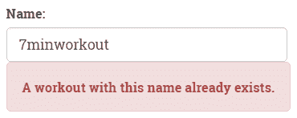
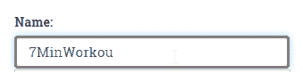
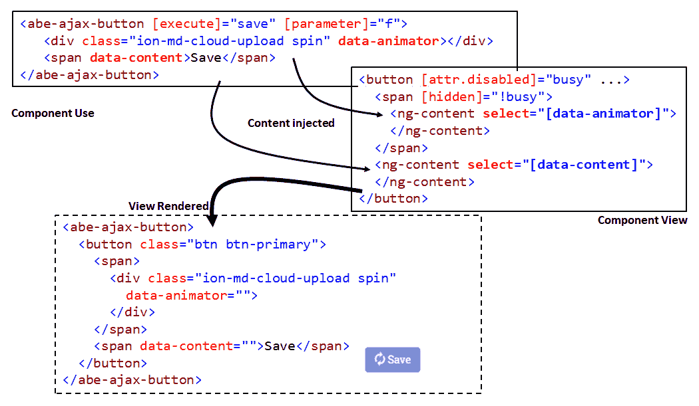
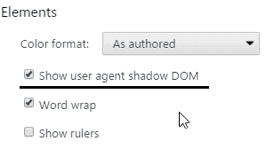
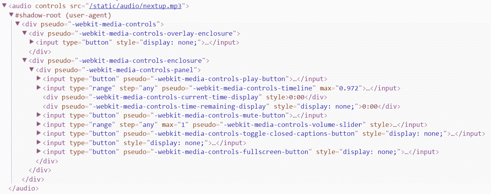
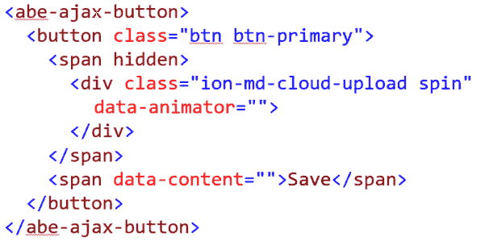
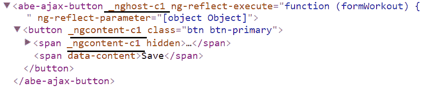
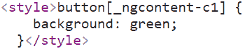
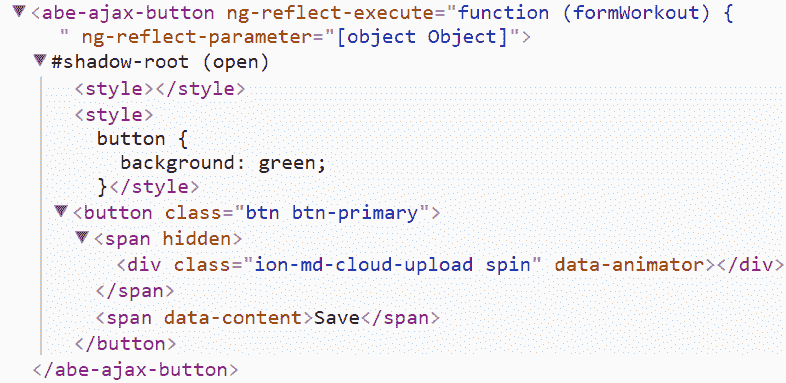

# 第四章：深入了解 Angular 指令

**指令** 始终随处可见。它们是 Angular 的基本构建块。每个应用程序的扩展都导致我们创建新的 **组件指令**。这些组件指令进一步使用了 **属性指令**（如`NgClass`和 `NgStyle`）和 **结构指令**（如`NgIf`和 `NgFor`）来扩展其行为。

虽然我们已经构建了许多组件指令和一个单独的属性指令，但仍有一些值得探索的指令构建概念。特别是对于属性和结构指令，我们尚未详细介绍。

本章将涵盖以下主题：

+   **构建指令**：我们构建多个指令，并学习指令的有用之处，它们与组件的区别，以及指令如何相互通信和/或与它们的宿主组件通信。我们探讨包括*组件指令*、*属性指令*和*结构指令*在内的所有指令类型。

+   **异步验证**：Angular 可以轻松验证需要服务器交互和因此是异步的规则。在本章中，我们将构建我们的第一个异步验证器。

+   **使用渲染器进行视图操作**：渲染器允许以与平台无关的方式进行视图操作。我们将利用渲染器来实现繁忙指示器指令，并学习其 API。

+   **宿主绑定**：宿主绑定允许指令与其*宿主元素*进行通信。本章将涵盖如何利用这样的绑定来进行指令。

+   **指令注入**：Angular DI 框架允许基于指令在 HTML 层次结构中的声明位置进行指令注入。我们将介绍与此类注入相关的多种情景。

+   **使用视图子和内容子**：组件具有将外部视图模板包含到其自身视图中的能力。我们将介绍如何处理注入的内容。

+   **理解 NgIf 平台指令**：我们将深入了解`NgIf`平台指令的内部工作，并尝试理解*结构指令*（如`NgIf`）的工作方式。

+   **Angular 组件的视图封装**：我们将学习 Angular 如何使用来自*Web 组件*的概念来支持视图和样式的封装。

# 构建远程验证器指令

我们以*支持服务器数据持久性*的第三章 结束了 *Workout Runner* 能够在 MongoDB 存储中管理锻炼。由于每个锻炼都应具有唯一名称，我们需要执行唯一性约束。因此，在创建/编辑锻炼时，每当用户更改锻炼名称时，我们可以查询 MongoDB 来验证该名称是否已存在。

与任何远程调用一样，这个检查是异步进行的，因此需要一个 *远程验证器*。我们将使用 Angular 的 *异步验证器支持* 来构建这个远程验证器。

**异步验证器**与标准自定义验证器类似，只是返回的不是键-值对象映射或 null，而是一个**promise**。这个 promise 最终将根据验证状态进行解析（如果有错误，则设置为相应状态），如果验证成功，则返回 null。

我们将创建一个验证指令，用于进行工作名称检查。针对这样的指令，有两种可能的实现方法：

+   我们可以专门为唯一名称验证创建一个指令

+   我们可以创建一个通用指令，可以执行任何远程验证。

验证指令

尽管我们正在构建一个验证指令，但我们也可以构建一个标准的自定义验证器类。创建指令的优势在于它可以让我们将指令嵌入到模板驱动的表单中，在视图 HTML 中使用指令。或者，如果表单是使用模型（响应式方法）生成的，我们可以在创建`Control`对象时直接使用验证器类。

起初，针对数据源（*mLab*数据库）检查重复名称的要求似乎是一个过于具体的要求，无法通过通用验证器来处理。但通过一些明智的假设和设计选择，我们仍然可以实现一个能够处理所有类型远程验证的验证器，包括工作名称验证。

计划是创建一个外部化实际验证逻辑的验证器。该指令将以验证函数作为输入。这意味着实际验证逻辑不是验证器的一部分，而是实际需要验证输入数据的组件的一部分。指令的工作仅是调用函数并根据函数的返回值返回相应的错误键。

让我们把这个理论付诸实践，构建我们的远程验证指令，恰如其名的`RemoteValidatorDirective`。

以下部分的伴随代码基于 Git 分支`checkpoint6.1`。您可以与我们一起工作，或者查看上述文件夹中提供的实现。或者，如果您不使用 Git，可以从 GitHub 位置[`bit.ly/ng2be-checkpoint6-1`](http://bit.ly/ng2be-checkpoint6-1)下载`checkpoint6.1`的快照（ZIP 文件）。在首次设置快照时，请参考`trainer`文件夹中的`README.md`文件。

# 使用异步验证器验证工作名称

与自定义验证器类似，异步验证器也继承自相同的`Validator`类；但这次，异步验证器返回一个`Promise`而不是对象映射。

让我们来看看验证器的定义。从 GitHub（[`bit.ly/ng6be-6-1-remote-validator-directive-ts`](http://bit.ly/ng6be-6-1-remote-validator-directive-ts)）文件夹中复制验证器的定义，并将其添加到`shared`模块文件夹。验证器的定义如下：

```ts
import { Directive, Input } from '@angular/core';
import { NG_ASYNC_VALIDATORS, FormControl } from '@angular/forms';

@Directive({
  selector: '[abeRemoteValidator][ngModel]',
  providers: [{ provide: NG_ASYNC_VALIDATORS, useExisting: RemoteValidatorDirective, multi: true }]
})
export class RemoteValidatorDirective {

  @Input() abeRemoteValidator: string;
  @Input() validateFunction: (value: string) => Promise<boolean>;

  validate(control: FormControl): { [key: string]: any } {
    const value: string = control.value;
    return this.validateFunction(value).then((result: boolean) => {
      if (result) {
        return null;
      }
      else {
        const error: any = {};
        error[this.abeRemoteValidator] = true;
        return error;
      }
    });
  }
} 
```

切记要从共享模块导出这个指令，以便我们可以在锻炼构建器模块中使用它。

由于我们将验证器注册为指令，而不是使用 `FormControl` 实例进行注册（通常用于以*响应式方式*构建表单时），我们需要额外的提供者配置设置（在前述`@Directive`元数据中添加）,通过以下语法：

```ts
 providers:[{ provide: NG_ASYNC_VALIDATORS, useExisting: RemoteValidatorDirective,  multi: true }] 
```

此语句将验证器注册到现有的异步验证器中。

在接下来的部分中，我们将构建一个繁忙指示器指令，解释在前述代码中使用的奇怪的指令选择器`selector: `[abeRemoteValidator][ngModel]`。

在我们深入研究验证器实现之前，让我们将其添加到锻炼名称输入中。这将帮助我们将验证器的行为与其使用联系起来。

用验证器声明更新锻炼名称输入（`workout.component.html`）：

```ts
<input type="text" name="workoutName" ... 
 abeRemoteValidator="workoutname"[validateFunction]="validateWorkoutName"> 
```

为指令选择器添加前缀

始终使用一个标识符（正如你刚刚看到的`abe`）作为你的指令前缀，以将其与框架指令和其他第三方指令区分开来。

**注意**：如果 `ngModelOptions`，`updateOn` 设置为 `submit,`，则更改为 `blur`。

指令实现通过指令属性`abeRemoveValidator`接受两个输入：*validation key*，用于设置*error key*，和*validation function*（`validateFunction`），用于验证控件的值。这两个输入都用`@Input`装饰器进行了注解。

输入参数`@Input("validateFunction") validateFunction: (value: string) => Promise<boolean>;`，绑定到一个函数，而不是标准的组件属性。由于底层语言 TypeScript 的性质（以及 JavaScript），我们可以把这个函数当作属性对待。

当异步验证触发（输入更改时），Angular 调用该函数，并传入基础的`control`。作为第一步，我们提取当前的输入值，然后使用该输入调用 `validateFunction` 函数。`validateFunction` 返回一个 promise，最终应该解析为 `true` 或 `false`：

+   如果 promise 解析为`true`，则验证成功，promise 回调函数返回`null`。

+   如果是 `false`，则验证失败，返回一个错误键值映射。这里的*key*是我们在使用验证器时设置的字符串字面量（`a2beRemoteValidator="workoutname"`）。

这个*key*在输入上有多个验证器声明时非常有用，可以帮助我们识别失败的验证。

接下来在锻炼组件中为这个失败添加一个验证消息。在现有的*workout name*的验证`label`后添加此标签声明：

```ts
<label *ngIf="name.control.hasError('workoutname')" class="alert alert-danger validation-message">A workout with this name already exists.</label> 
```

然后将这两个标签包裹在 `div` 中，就像我们为*workout title*错误标签做的那样。

`hasError` 函数检查`'workoutname'`验证键是否存在。

这个实现缺少的最后一部分是我们在应用指令时分配的实际验证函数（`[validateFunction]="**validateWorkoutName**""`），但尚未实现。

将 `validateWorkoutName` 函数添加到 `workout.component.ts` 中。

```ts
validateWorkoutName = (name: string): Promise<boolean> => {
    if (this.workoutName === name) { return Promise.resolve(true); }
    return this.workoutService.getWorkout(name).toPromise()
      .then((workout: WorkoutPlan) => {
        return !workout;
      }, error => {
        return true;
      });
  }  
```

在探索前面的函数功能之前，我们需要对 `WorkoutComponent` 类进行一些其他修复。`validateWorkoutName` 函数依赖于 `WorkoutService` 来获取具有特定名称的训练计划。让我们在构造函数中注入该服务，并在导入部分添加必要的导入。

```ts
import { WorkoutService }  from "../../core/workout.service"; 
... 
constructor(... , private workoutService: WorkoutService) { 
```

然后声明 `workoutName` 和 `queryParamsSub` 变量。

```ts
private workoutName: string;
queryParamsSub: Subscription
```

并在 `ngOnInit` 中添加这个语句。

```ts
this.queryParamsSub = this.route.params.subscribe(params => this.workoutName = params['id']); 
```

前述语句通过观察（订阅）`route.params` 服务的 observable 来设置当前的训练计划名称。`workoutName` 用于在使用原始训练计划名称时跳过训练计划名称验证。

之前创建的订阅需要清除以避免内存泄漏，因此将此行添加到 `ngDestroy` 函数中。

```ts
this.queryParamsSub.unsubscribe();
```

将 `validateWorkoutName` 函数定义为*实例函数*（使用*箭头运算符*）而不是标准函数（在*原型*上声明函数）的原因是 `'this'` 作用域问题。

查看 `RemoteValidatorDirective` 中 `validateFunction` 指令的验证器函数调用（使用 `@Input("validateFunction") validateFunction;` 进行声明）。

```ts
return this.validationFunction(value).then((result: boolean) => { ... }); 
```

当函数（名为 `validateFunction`）被调用时，`this` 引用被绑定到 `RemoteValidatorDirective`，而不是 `WorkoutComponent`。由于 `execute` 在前述设置中引用了 `validateWorkoutName` 函数，所以内部对 `this` 的任何访问都会有问题。

这会导致 `validateWorkoutName` 内部的 `if (this.workoutName === name)` 语句失败，因为 `RemoteValiatorDirective` 没有 `workoutName` 实例成员。通过将 `validateWorkoutName` 定义为实例函数，TypeScript 编译器在函数定义时*创建了一个闭包*，捕获了 `this` 的值。

通过新的声明，`validateWorkoutName` 内部的 `this` 始终指向 `WorkoutComponent`，不管函数是如何被调用的。

我们还可以查看 `WorkoutComponent` 的编译后的 JavaScript 代码，了解闭包是如何与 `validateWorkoutName` 一起工作的。我们关注的生成代码部分如下：

```ts
function WorkoutComponent(...) { 
 var _this = this; 
  ... 
  this.validateWorkoutName = function (name) { 
 if (_this.workoutName === name) 
      return Promise.resolve(true); 
```

如果我们查看验证函数的实现，我们会发现它涉及查询 *mLab* 以获取特定的训练计划名称。`validateWorkoutName` 函数在未找到同名训练计划时返回 `true`，在找到同名训练计划时返回 `false`（实际上返回的是一个*promise*）。

`WorkoutService` 上的 `getWorkout` 函数返回一个*observable*，但我们通过调用 observable 上的 `toPromise` 函数将其转换为一个*promise*。

现在可以测试验证指令了。创建一个新的训练，并输入一个已有的训练名称，如`7minworkout`。看看验证错误消息是如何最终显示出来的：



很棒！看起来很不错，但仍然缺少一些东西。用户并不知道我们正在验证训练名称。我们可以改善这个体验。

# 创建一个忙碌指示器指令

当远程验证训练名称时，我们希望用户意识到后台的活动。在远程验证发生时围绕输入框提供视觉线索应该能达到目的。

仔细思考一下；有一个带有异步验证器（执行远程验证）的输入框，我们想要在验证期间用一个视觉线索装饰输入框。看起来像一个常见的解决模式？的确如此，所以让我们创建另一个指令！

但在我们开始实施之前，必须明确理解我们并不孤军奋战。忙碌指示器指令需要另一个指令`NgModel`的帮助。我们已经在第二章*个人教练*中的`input`元素上使用了`NgModel`指令。`NgModel`帮助我们跟踪输入元素的状态。以下示例取自第二章《个人教练》，突出了`NgModel`如何帮助我们验证输入：

```ts
<input type="text" name="workoutName" #name="ngModel"  class="form-control" id="workout-name" ... [(ngModel)]="workout.name" required> 
... 
<label *ngIf="name.control.hasError('required') && (name.touched || submitted)" class="alert alert-danger">Name is required</label>  
```

即使在上一部分中完成了唯一的训练名称验证，也是使用了相同的`NgModel`技术来检查验证状态。

让我们从定义指令的概要开始。在`src/app/shared`文件夹中使用 CLI 生成器创建一个`busy-indicator.directive.ts`文件：

```ts
ng generate directive busy-indicator
```

同样，通过将指令添加到共享模块文件`shared.module.ts`中的`exports`数组中导出它。

接下来，使用`NgModel`注入来更新指令的构造函数，并从`@angular/forms`中导入`NgModel`引用：

```ts
constructor(private model: NgModel) { }
```

这告诉 Angular 要对声明指令的元素注入`NgModel`实例。记住，`NgModel`指令已经存在于`input`（`workoutname`）上了：

```ts
<input... name="workoutName" #name="ngModel" [(ngModel)]="workout.name" ...>
```

这已经足够将我们的新指令集成到训练视图中了，让我们快速做吧。

打开`workout-builder`中的`workout.component.html`，并在训练名称`input`中添加忙碌指示器指令：

```ts
<input type="text" name="workoutName" ... abeBusyIndicator> 
```

创建一个新的训练或打开一个现有的训练，查看`BusyIndicatorDirective`是否已加载并且`NgModel`注入是否正常工作。这可以通过在`BusyIndicatorDirective`构造函数内设置断点来轻松验证。

Angular 将相同的`NgModel`实例注入到`BusyIndicatorDirective`中，就像在输入 HTML 中遇到`ngModel`时创建的那样。

也许你会想知道，如果我们将这个指令应用于没有`ngModel`属性的输入元素，或者实际上任何 HTML 元素/组件，会发生什么，例如这样：

```ts
<div abeBusyIndicator></div> 
<input type="text" abeBusyIndicator> 
```

注射会起作用吗？

当然不是！我们可以在创建锻炼视图中试一下。打开`workout.component.html`，并在锻炼名称`input`上面添加以下`input`。刷新应用：

```ts
<input type="text" name="workoutName1" a2beBusyIndicator> 
```

Angular 抛出一个异常，如下所示：

```ts
 EXCEPTION: No provider for NgModel! (BusyIndicatorDirective -> NgModel)
```

如何避免这个问题？嗯，Angular 的 DI 可以在这里拯救我们，因为它允许我们声明一个可选的依赖关系。

在继续之前删除刚刚添加的`input`控件。

# 用`@Optional`装饰器注入可选依赖项

Angular 有一个`@Optional`装饰器，当应用于构造函数参数时，指示 Angular *注入器*在找不到依赖项时注入`null`。

因此，繁忙指示符构造函数可以写成如下所示：

```ts
constructor(@Optional() private model: NgModel) { } 
```

问题解决了吗？并没有；正如先前所述，我们需要`NgModel`指令使`BusyIndicatorDirective`起作用。因此，虽然我们学到了一些新知识，但在当前情况下并不是很有用。

在继续之前，请记得将`workoutname``input`还原为初始状态，应用`abeBusyIndicator`。

只有在元素上已经存在`NgModel`指令时，才能应用`BusyIndicatorDirective`。

这次，`selector`指令将会拯救我们。将`BusyIndicatorDirective`选择器更新为如下所示：

```ts
selector: `[abeBusyIndicator][ngModel]` 
```

如果元素上同时存在`a2beBusyIndicator`和`ngModel`属性的组合，那么这个选择器将创建`BusyIndicatorDirective`。问题解决了！

是时候添加实际的实现了。

# 实现一 - 使用渲染器

要使`BusyIndicatorDirective`起作用，它需要知道`input`上的异步验证何时触发以及何时结束。这些信息只能由`NgModel`指令提供。`NgModel`有一个`control`属性，它是`Control`类的一个实例。正是这个`Control`类跟踪输入的当前状态，包括以下内容：

+   当前分配的验证器（同步和异步）

+   当前值

+   输入元素的状态，比如`pristine`、`dirty`和`touched`

+   输入验证状态可能是`valid`、`invalid`或者在异步执行验证时是`pending`之一

+   跟踪数值变化或验证状态变化的事件

`Control`看起来是一个很有用的类，它的`pending`状态引起了我们的兴趣！

让我们为`BusyIndicatorDirective`类添加第一个实现。用以下代码更新类：

```ts
private subscriptions: Array<any> = []; 
ngAfterViewInit(): void {
    this.subscriptions.push(
      this.model.control.statusChanges.subscribe((status: any) => {
        if (this.model.control.pending) {
          this.renderer.setElementStyle(this.element.nativeElement, 'border-width', '3px');
          this.renderer.setElementStyle(this.element.nativeElement, 'border-color', 'gray');
        }
        else {
          this.renderer.setElementStyle(this.element.nativeElement, 'border-width', null);
          this.renderer.setElementStyle(this.element.nativeElement, 'border-color', null);
        }
      }));
  }  
```

需要向构造函数添加两个新的依赖项，因为我们在`ngAfterViewInit`函数中使用它们。将`BusyIndicatorDirective`构造函数更新如下：

```ts
constructor(private model: NgModel,  
 private element: ElementRef, private renderer: Renderer) { }
```

还需要在`'@angular/core'`中导入`ElementRef`和`Renderer`。

`ElementRef`是对底层 HTML 元素（在本例中是`input`）的包装对象。`MyAudioDirective`指令使用`ElementRef`来获取底层的`Audio`元素。

`Renderer` 注入值值得一提。调用 `setElementStyle` 很明显是 `Renderer` 负责管理 DOM 的标志。 但在更深入地了解 `Renderer` 的角色之前，让我们尝试理解前面的代码在做什么。

在前面的代码中，模型（`NgModel` 实例）上的 `control` 属性定义了一个事件（一个 `Observable`），`statusChanges`，我们可以订阅以了解控件验证状态何时更改。 可用的验证状态是`valid`、`invalid` 和 `pending`。

订阅检查控件状态是否为`pending`，并相应地使用 `Renderer` API 函数 `setElementStyle` 装饰底层元素。 我们设置 `input` 的 `border-width` 和 `border-color`。

前述的实现添加到 `ngAfterViewInit` 指令生命周期钩子中，该生命周期钩子在视图初始化后调用。

让我们试一试。打开创建锻炼页面或现有的 *7 分钟锻炼*。 一旦我们离开锻炼名称输入，`input` 样式会更改，并在锻炼名称的远程验证完成后恢复。 好！



在继续之前，还要将取消订阅代码添加到 `BusyIndicatorDirective` 中以避免内存泄漏。 将此函数（生命周期钩子）添加到 `BusyIndicatorDirective` 中：

```ts
ngOnDestroy() { 
    this.subscriptions.forEach((s) => s.unsubscribe()); 
} 
```

始终取消订阅 observables

要始终记住取消对代码中已完成的任何 `Observable`/`EventEmitter` 订阅，以避免内存泄漏。

实现看起来不错。`Renderer`正在发挥作用。但还有一些未解答的问题。

为什么不直接获取底层 DOM 对象并使用标准 DOM API 来操作输入样式？ 为什么我们需要 *renderer*？

# Angular 渲染器，翻译层

Angular 2 的主要设计目标之一是使其在各种环境、框架和设备上运行。 Angular 通过将核心框架实现分为**应用层**和**呈现层**来实现了这一目标。 应用层具有我们交互的 API，而呈现层提供了一个抽象，应用层可以使用它而不必担心视图的实际渲染位置。

通过分离渲染层，Angular 理论上可以在各种设置中运行。其中包括（但不限于）：

+   浏览器

+   浏览器主线程和网络工作线程，出于明显的性能原因

+   服务器端渲染

+   原生应用程序框架；正在努力将 Angular 与 `NativeScript` 和 `ReactNative` 集成。

+   测试，允许我们在网络浏览器之外测试应用程序 UI

Angular 在浏览器中使用的 `Renderer` 实现是 `DOMRenderer`。 它负责将我们的 API 调用转换为浏览器 DOM 更新。 实际上，我们可以通过在 `BusyIndicatorDirective` 的构造函数中添加断点并查看 `renderer` 的值来验证渲染器类型。

准确因此，我们避免在`BusyIndicatorDirective`内部直接操纵 DOM 元素。您永远不知道代码最终将在哪里运行。我们本来很容易就可以这样做：

```ts
this.element.nativeElement.style.borderWidth="3px"; 
```

相反，我们使用了`Renderer`以平台无关的方式来做同样的事情。

查看`Renderer`API 函数，`setElementStyle`：

```ts
this.renderer.setElementStyle( 
             this.element.nativeElement, "border-width", "3px"); 
```

它接受要设置样式的元素，要更新的样式属性和要设置的值。`element`引用了注入到`BusyIndicatorDirective`中的`input`元素。

重置样式

通过调用`setElementStyle`设置的样式可以通过在第三个参数中传递`null`值来重置。请查看前面代码中的`else`条件。

`Renderer`API 还有许多其他方法可用于设置属性、设置属性、监听事件，甚至创建新视图。每当您构建新指令时，请记得评估`Renderer`API 以进行 DOM 操作。

有关`Renderer`及其应用的更详细解释，请参阅 Angular 的设计文档的这里：[`bit.ly/ng2-render`](http://bit.ly/ng2-render)

我们还没有完成！借助 Angular 的强大功能，我们可以改进此实现。Angular 允许我们在指令实现中进行*主机绑定*，帮助我们避免大量样板代码。

# 指令中的主机绑定

在 Angular 领域，指令附加到的组件/元素被称为**宿主元素**：一个承载我们的指令/组件的容器。对于`BusyIndicatorDirective`，`input`元素就是*宿主*。

虽然我们可以使用`Renderer`来操纵宿主（我们也是这样做的），但是 Angular 数据绑定基础设施可以进一步减少代码。它提供了一种声明性的方式来管理指令-宿主交互。使用主机绑定概念，我们可以操纵元素的*属性*和*属性*，并订阅其*事件*。

让我们了解每种主机绑定的能力，最后，我们将修复我们的`BusyIndicatorDirective`实现。

# 使用@HostBinding 进行属性绑定

使用**主机属性绑定**将*指令属性*绑定到*宿主元素属性*。在变更检测阶段，对指令属性的任何更改都将与链接的主机属性同步。

我们只需要在想要同步的指令属性上使用`@HostBinding`装饰器。例如，考虑这样的绑定：

```ts
@HostBinding("readOnly") get busy() {return this.isbusy}; 
```

当应用于`input`时，当`isbusy`指令属性为`true`时，它将将`input``readOnly`属性设置为`true`。

注意，`readonly`也是`input`上的*属性*。这里指的是我们所说的输入*属性*`readOnly`。

# 属性绑定

**属性绑定**将指令属性绑定到宿主组件属性。例如，考虑具有以下绑定的指令：

```ts
@HostBinding("attr.disabled") get canEdit(): string  
  { return !this.isAdmin ? "disabled" : null }; 
```

如果应用于输入，当`isAdmin`标志为`false`时，它将在`input`上添加`disabled`属性，并在`isAdmin`为真时清除它。我们在这里也遵循 HTML 模板中使用的相同属性绑定符号。属性名称前缀为字符串字面量`attr`。

我们也可以使用*class*和*style 绑定*来做类似的事情。考虑以下行：

```ts
@HostBinding('class.valid')  
   get valid { return this.control.valid; } 
```

这一行设置了一个类绑定，下一行创建了一个样式绑定：

```ts
@HostBinding("style.borderWidth")  
   get focus(): string { return this.focus?"3px": "1px"}; 
```

# 事件绑定

最后，**事件绑定**用于订阅宿主组件/元素引发的事件。考虑这个例子：

```ts
@Directive({ selector: 'button, div, span, input' }) 
class ClickTracker { 
  @HostListener('click', ['$event.target']) 
  onClick(element: any) { 
    console.log("button", element, "was clicked"); 
  } 
} 
```

这在宿主事件`click`上建立了一个监听器。Angular 将为视图上的每个*button*、*div*、*span*和*input*实例化前述指令，并为`onClick`函数设置宿主绑定。`$event`变量包含引发的事件数据，`target`指的是所点击的元素/组件。

事件绑定也适用于组件。考虑以下例子：

```ts
@Directive({ selector: 'workout-runner' }) 
class WorkoutTracker { 
  @HostListener('workoutStarted', ['$event']) 
  onWorkoutStarted(workout: any) { 
    console.log("Workout has started!"); 
  } 
} 
```

通过这个指令，我们跟踪了在`WorkoutRunner`组件上定义的`workoutStarted`事件。当锻炼开始时，将调用`onWorkoutStarted`函数，并带上已开始的锻炼的详情。

现在我们了解了这些绑定是如何工作的，我们可以改进我们的`BusyIndicatorDirective`实现。

# 实施二 - 具有宿主绑定的 BusyIndicatorDirective

你可能已经猜到了！我们将使用*宿主属性绑定*而不是`Renderer`来设置样式。想要试试吗？试一试吧！清除现有的实现，尝试在不查看以下实现的情况下为`borderWidth`和`borderColor`样式属性设置宿主绑定。

在宿主绑定实现之后，指令将如下所示：

```ts
import {Directive, HostBinding} from '@angular/core'; 
import {NgModel} from '@angular/forms'; 

@Directive({ selector: `[abeBusyIndicator][ngModel]`}) 
export class BusyIndicatorDirective {
  private get validating(): boolean {
    return this.model.control != null && this.model.control.pending;
  }
  @HostBinding('style.borderWidth') get controlBorderWidth():
        string { return this.validating ? '3px' : null; }
  @HostBinding('style.borderColor') get controlBorderColor():
        string { return this.validating ? 'gray' : null; }

  constructor(private model: NgModel) { }
}

```

我们已经将`pending`状态检查移到了名为`validating`的指令属性中，然后使用了`controlBorderWidth`和`controlBorderColor`属性进行样式绑定。这绝对比我们之前的方法更简洁！去测试一下吧。

如果我们告诉你，这可以不需要自定义指令来完成，你不要感到惊讶！这就是我们做的，只需在锻炼名称`input`上使用样式绑定即可：

```ts
<input type="text" name="workoutName" ... 
[style.borderColor]="name.control.pending ? 'gray' : null" [style.borderWidth]="name.control.pending ? '3px' : null">
```

我们得到了相同的效果！

不，我们的努力并不是白费的。我们学到了**renderer**和**host binding**。这些概念在构建提供复杂行为扩展而不仅仅是设置元素样式的指令时会派上用场。

如果你在运行代码时遇到问题，请查看 Git 分支`checkpoint6.1`，查看我们迄今为止所做的工作的可运行版本。或者，如果你没有使用 Git，请从[`bit.ly/ng6be-checkpoint-6-1`](http://bit.ly/ng6be-checkpoint-6-1)下载`checkpoint6.1`的快照（ZIP 文件）。在第一次设置快照时，请查看`trainer`文件夹中的`README.md`文件。

我们接下来要讨论的主题是*指令注入*。

# 指令注入

回到几页前，看一下使用*renderer*的`BusyIndicatorDirective`实现，特别是构造函数：

```ts
constructor(private model: NgModel ...) { } 
```

Angular 会自动定位为指令元素创建的`NgModel`指令，并将其注入到`BusyIndicatorDirective`中。这是可能的，因为这两个指令都声明在同一个*宿主元素*上。

好消息是我们可以影响这种行为。在父 HTML 树或子树上创建的指令也可以被注入。接下来的几节将讨论如何在组件树中跨指令进行注入，这是一个非常实用的功能，允许具有*共同血统*（在视图中）的指令进行跨指令通信。

我们将使用 StackBlitz（[`stackblitz.com/edit/angular-pzljm3`](https://stackblitz.com/edit/angular-pzljm3)）来演示这些概念。StackBlitz 是一个在线 IDE，用于运行 Angular 应用程序！

首先，查看文件`app.component.ts`。它有三个指令：`Relation`，`Acquaintance`和`Consumer`，并定义了这个视图层次结构：

```ts
<div relation="grand-parent" acquaintance="jack"> 
    <div relation="parent"> 
 <div relation="me" consumer> 
        <div relation="child-1"> 
          <div relation="grandchild-1"></div> 
        </div> 
        <div relation="child-2"></div> 
      </div> 
    </div> 
</div> 
```

在接下来的几节中，我们将描述不同方式将不同的`Relation`和`Acquaintance`指令注入到`consumer`指令中。在`ngAfterViewInit`生命周期钩子期间，查看浏览器控制台中我们记录的注入依赖项。

# 注入在同一元素上定义的指令

默认情况下，构造函数注入支持在同一元素上定义的指令。构造函数只需要声明我们要注入的指令类型变量即可：

```ts
variable:DirectiveType 
```

我们在`BusyIndicatorDirective`中进行的`NgModel`注入就属于这一类。如果在当前元素上找不到指令，那么 Angular DI 将抛出错误，除非我们将依赖标记为`@Optional`。

可选依赖

`@Optional` 装饰器不仅限于指令注入。它用于标记任何类型的可选依赖。

从 plunk 示例中，第一个注入（在`Consumer`指令实现中）将带有`me`属性（`relation="me"`）的`Relation`指令注入到消费者指令中：

```ts
constructor(private me:Relation ... 
```

# 从父级注入指令依赖

使用`@Host`装饰符对构造函数参数进行前缀，指示 Angular 在*当前元素*、*其父级*或其*父级*中搜索依赖项，直到它达到组件边界（在其视图层次结构中的某个地方有指令的组件）。查看第二个`consumer`注入：

```ts
constructor(..., @Host() private myAcquaintance:Acquaintance  
```

此语句将注入两层上层声明的`Acquaintance`指令实例。

像前面描述的`@Optional`装饰器一样，`@Host()`的使用也不仅限于指令。Angular 服务注入也遵循相同的模式。如果服务标记为`@Host`，那么搜索将停在宿主组件处。它不会继续向上查找组件树。

`@Skipself` 装饰器可用于跳过当前元素以进行指令搜索。

从 StackBlitz 示例中，这个注入将带有`relation="parent"`（`relation`属性值为`parent`）的`Relation`指令注入`consumer`中：

```ts
@SkipSelf() private myParent:Relation 
```

# 注入子指令（或多个指令）

如果需要将嵌套 HTML 中定义的指令注入到父指令/组件中，有四个装饰器可以帮助我们：

+   `@ViewChild`/`@ViewChildren`

+   `@ContentChild`/`@ContentChildren`

正如这些命名约定所暗示的，有用于注入单个子指令或多个子指令的装饰器：

要理解`@ViewChild/@ViewChildren`与`@ContentChild/@ContentChildren`的重要性，我们需要看一下什么是视图和内容子项，这是我们很快要讨论的一个主题。但现在，了解视图子项是组件自己视图的一部分，而内容子项是注入到组件视图中的外部 HTML 就足够了。

看看在 StackBlitz 的示例中，`ContentChildren`装饰器是如何用于将子`Relation`指令注入到`Consumer`中的：

```ts
@ContentChildren(Relation) private children:QueryList<Relation>; 
```

可笑的是，变量`children`的数据类型不是数组，而是一个自定义类-`QueryList`。`QueryList`类并不是典型的数组，而是一个由 Angular 在添加或移除依赖项时保持更新的集合。这可能发生在使用`NgIf`或`NgFor`等结构指令创建/销毁 DOM 树时。我们在接下来的章节中也会更多地讨论`QueryList`。

您可能已经注意到，前面的注入不是构造函数注入，就像前面的两个例子一样。这是有原因的。注入的指令将在底层的组件/元素内容初始化之前不可用。出于这个特定的原因，我们在`ngAfterViewInit`生命周期钩子内有`console.log`语句。我们应该只在此生命周期钩子执行后访问内容子项。

前面的示例代码将所有三个子`relation`对象注入到`consumer`指令中。

# 注入后代指令

标准的`@ContentChildren`装饰器（或事实上也是`@ViewChildren`）只会注入指令/组件的直接子项，而不是其后代。要包含所有后代，我们需要向`Query`提供参数：

```ts
@ContentChildren(Relation, {descendants: true}) private 
allDescendents:QueryList<Relation>; 
```

传递`descendants: true`参数将指示 Angular 搜索所有后代。

如果您查看控制台日志，前面的语句会注入所有四个后代。

尽管 Angular DI 看起来很容易使用，但它拥有很多功能。它管理我们的服务、组件和指令，并在正确的时间将正确的东西提供给我们的正确位置。在组件和其他指令中注入指令提供了一种指令相互通信的机制。这样的注入允许一个指令访问另一个指令的公共 API（公共函数/属性）。

现在是探索新事物的时候了。我们将构建一个 Ajax 按钮组件，允许我们将外部视图注入组件中，这个过程也被称为**内容转译**。

# 构建一个 Ajax 按钮组件

当我们保存/更新练习或锻炼时，总是存在重复提交的可能性（或重复的`POST`请求）。当前的实现不提供任何关于保存/更新操作何时开始以及何时完成的反馈。由于缺乏视觉线索，应用程序的用户可能会有意或无意地多次点击保存按钮。

让我们尝试通过创建一个专用按钮来解决这个问题——一个*Ajax 按钮*，当点击时提供一些视觉线索，并阻止重复的 Ajax 提交。

按钮组件将按照这些行工作。它接受一个函数作为输入。此输入函数（输入参数）应返回与远程请求相关的 promise。单击按钮时，按钮内部调用远程调用（使用输入函数），跟踪底层 promise，并在此过程中显示一些忙碌的线索。此外，为了避免重复提交，按钮在远程调用完成之前保持禁用状态。

以下部分的伴随代码基于 Git 分支`checkpoint6.2`。您可以与我们一起工作，或者查看分支中提供的实现。或者如果您不使用 Git，请从 GitHub 位置 [`bit.ly/ng6be-checkpoint-6-2`](http://bit.ly/ng6be-checkpoint-6-2) 下载`checkpoint6.2`的快照（ZIP 文件）。在第一次设置快照时，请参考`trainer`文件夹中的`README.md`文件。

让我们创建组件大纲以使事情更清晰。使用以下命令在应用程序的共享模块 (`src/app/shared`) 下创建一个`ajax-button`组件，**然后从`SharedModule`导出该组件**：

```ts
ng generate component ajax-button -is
```

也需要更新组件定义并从`@angular/core`导入它们：

```ts
export class AjaxButtonComponent implements OnInit { 
  busy: boolean = null; 
  @Input() execute: any; 
  @Input() parameter: any; 
} 
```

需要将以下 HTML 模板添加到`ajax-button.component.html`中：

```ts
<button [attr.disabled]="busy" class="btn btn-primary"> 
    <span [hidden]="!busy">
        <div class="ion-md-cloud-upload spin"></div>
    </span>
    <span>Save</span> 
</button> 
```

该组件（`AjaxButtonComponent`）具有两个属性绑定，`execute`和`parameter`。`execute`属性指向在单击 Ajax 按钮时调用的函数。`parameter`是可以传递给此函数的数据。

查看视图中`busy`标志的使用方式。当`busy`标志被设置时，我们禁用按钮并显示旋转图标。让我们添加使一切正常工作的实现。将此代码添加到`AjaxButtonComponent`类中：

```ts
@HostListener('click', ['$event'])
onClick(event: any) {
    const result: any = this.execute(this.parameter);
    if (result instanceof Promise) {
      this.busy = true;
      result.then(
        () => { this.busy = null; },
        (error: any) => { this.busy = null; });
    }
}
```

我们设置了一个*主机事件绑定*，将点击事件绑定到`AjaxButtonComponent`组件。每当单击`AjaxButtonComponent`组件时，都会调用`onClick`函数。

需要将`HostListener`导入添加到`'@angular/core'`模块中。

`onClick` 实现使用`parameter`作为唯一参数调用输入函数。调用的结果存储在`result`变量中。

`if` 条件检查 `result` 是否为 `Promise` 对象。如果是，`busy`指示器就会被设置为 `true`。然后按钮等待 promise 被解决，使用 `then` 函数。无论 promise 是否解决为*成功*还是*错误*，忙标志都被设置为`null`。

忙标志被设置为`null`而不是`false`的原因是由于这个属性绑定`[attr.disabled]="busy"`。除非`busy`是`null`，否则`disabled`属性不会被移除。请记住，在 HTML 中，`disabled="false"`不会使按钮处于可点击状态。在按钮再次可点击之前，需要删除属性。

如果我们对这一行感到困惑：

```ts
    const result: any = this.execute(this.parameter); 
```

然后你需要看一下组件的使用方式。打开`workout.component.html`，将`保存`按钮的 HTML 替换为以下内容：

```ts
<abe-ajax-button [execute]="save" [parameter]="f"></abe-ajax-button> 
```

`Workout.save` 函数绑定到 `execute`，而 `parameter` 获取 `FormControl` 对象 `f`。

我们需要更改 `Workout` 类中的 `save` 函数以返回 `AjaxButtonComponent` 的 promise 才能工作。将 `save` 函数的实现更改为以下内容：

```ts
save = (formWorkout: any): Promise<Object | WorkoutPlan> => {
    this.submitted = true;
    if (!formWorkout.valid) { return; }
    const savePromise = this.workoutBuilderService.save().toPromise();

    savePromise.then(
      result => this.router.navigate(['/builder/workouts']),
      err => console.error(err)
    );
    return savePromise;
  } 
```

`save` 函数现在返回一个*promise*，我们通过调用从`workoutBuilderService.save()`调用返回的*observable*上的 `toPromise` 函数来构建它。

注意我们如何将 `save` 函数定义为*实例函数*（使用箭头操作符）以使其在*this*上创建闭包。这是我们之前在构建*远程验证器指令*时做的事情。

是时候测试我们的实现了！刷新应用程序，打开创建/编辑锻炼视图。点击保存按钮，看到 Ajax 按钮的效果：


前面的动画可能只是短暂的，因为我们在保存后返回到锻炼列表页面。我们可以临时禁用导航以查看新更改。

我们从这一部分开始，旨在突显外部元素/组件如何被传递到组件中。让我们来做吧！

# 将外部组件/元素传递到一个组件中

从一开始，我们就需要了解**传递**意味着什么。了解这个概念的最佳方式是看一个例子。

到目前为止，我们建立的任何组件都没有从外部借用内容。不确定这意味着什么？

考虑在`workout.component.html`中的前面的 `AjaxButtonComponent` 示例：

```ts
<ajax-button [execute]="save" [parameter]="f"></ajax-button> 
```

如果我们将`ajax-button`的使用更改为以下内容会怎样？

```ts
<ajax-button [execute]="save" [parameter]="f">Save Me!</ajax-button> 
```

“保存我！”的文本会显示在按钮上吗？不会，试一下！

`AjaxButtonComponent` 组件已经有一个模板，并拒绝了我们在前面的声明中提供的内容。如果我们能够以某种方式将内容（在前面的例子中的“保存我！”）注入`AjaxButtonComponent`内部呢？这种将外部视图片段注入组件视图的行为就是我们所说的**传递**，框架提供了必要的构造来启用传递。

现在是时候介绍两个新概念，*内容子级*和*视图子级*。

# 内容子级和视图子级

简洁地定义，组件内部定义的 HTML 结构（使用`template 或 templateUrl`）是组件的**视图子级**。然而，作为组件使用的一部分提供的 HTML 视图添加到宿主元素（例如`<ajax-button>**Save Me!**</ajax-button>`）中，定义了组件的**内容子级**。

默认情况下，Angular 不允许将*内容子级*嵌入，就像我们之前看到的那样。`Save Me!`文本从未被发送。我们需要明确告诉 Angular 在*组件视图模板*内的哪里发出*内容子级*。为了理解这个概念，让我们来修复`AjaxButtonComponent`的视图。打开`ajax-button.component.ts`并更新视图模板定义如下：

```ts
<button [attr.disabled]="busy" class="btn btn-primary"> 
    <span [hidden]="!busy"> 
        <ng-content select="[data-animator]"></ng-content> 
   </span> 
 <ng-content select="[data-content]"></ng-content> 
</button>
```

前述视图中的两个`ng-content`元素定义了*内容注入位置*，内容子级可以被注入/跨越。`selector`属性定义了注入到主机中时应使用的*CSS 选择器*。

一旦我们在`workout.component.html`中修复了`AjaxButtonComponent`的使用情况，它就会变得更有意义。将其更改为如下：

```ts
<ajax-button [execute]="save" [parameter]="f">
    <div class="ion-md-cloud-upload spin" data-animator></div>
 <span data-content>Save</span>
</ajax-button> 
```

带有`data-animator`的`span`被注入到具有`select=[data-animator]`属性的`ng-content`中，而另一个带有`data-content`属性的`span`被注入到第二个`ng-content`声明中。

再次刷新应用程序，尝试保存锻炼。虽然最终结果是相同的，但最终视图是多个视图片段的组合：一个用于组件定义的部分（*视图子级*），另一个用于组件使用的部分（*内容子级*）。

下图突出显示了渲染的`AjaxButtonComponent`的不同之处：



`ng-content`可以在不带有`selector`属性的情况下声明。在这种情况下，将注入组件标记内定义的全部内容。

*内容注入*进入现有组件视图是一个非常强大的概念。它允许组件开发人员提供扩展点，组件消费者可以轻松消费并自定义组件的行为，而且是在受控的方式。

我们为`AjaxButtonComponent`定义的内容注入允许消费者更改忙碌指示动画和按钮内容，同时保持按钮的行为不变。

Angular 的优势并不止于此。它具有将*内容子级*和*视图子级*注入到*组件代码/实现*中的能力。这使得组件可以与其内容/视图子级交互并控制它们的行为。

# 使用@ViewChild 和@ViewChildren 注入视图子级

让我们看一下`WorkoutAudioComponent`实现的相关部分。视图定义如下：

```ts
<audio #ticks="MyAudio" loop src="img/tick10s.mp3"></audio>
<audio #nextUp="MyAudio" src="img/nextup.mp3"></audio>
<audio #nextUpExercise="MyAudio" [src]="'/assets/audio/' + nextupSound"></audio>
// Some other audio elements 
```

注入的样式如下：

```ts
@ViewChild('ticks') private _ticks: MyAudioDirective; 
@ViewChild('nextUp') private _nextUp: MyAudioDirective; 
@ViewChild('nextUpExercise') private _nextUpExercise: MyAudioDirective; 
```

与`audio`标签相关联的指令(`MyAudioDirective`)被注入到`WorkoutAudio`的实现中，使用`@ViewChild`装饰器。传递给`@ViewChild`的参数是用于在视图定义中定位元素的*模板变量*名称（例如`tick`）。然后`WorkoutAudio`组件使用这些音频指令来控制*7 分钟锻炼*的音频播放。

尽管前面的实现注入了`MyAudioDirective`，但甚至子组件也可以被注入。例如，我们构建了一个`MyAudioComponent`，与`MyAudioDirective`相似，如下所示:

```ts
@Component({ 
  selector: 'my-audio', 
  template: '<audio ...></audio>', 
}) 
export class MyAudioComponent { 
  ... 
} 
```

然后我们可以使用`audio`标签的方式代替它:

```ts
<my-audio #ticks loop  
  src="img/tick10s.mp3"></my-audio> 
```

注入仍然可以工作。

如果组件视图中定义了多个相同类型的指令/组件会发生什么？使用`@ViewChildren`装饰器。它允许您查询一个类型的注入。使用`@ViewChildren`的语法如下:

```ts
@ViewChildren(directiveType) children: QueryList<directiveType>; 
```

这会注入所有类型为`directiveType`的视图子元素。对于前面所述的`WorkoutAudio`组件示例，我们可以使用以下语句来获取所有的`MyAudioDirective`:

```ts
@ViewChildren(MyAudioDirectives) private all: QueryList<MyAudioDirectives>; 
```

`ViewChildren`装饰器也可以接受用逗号分隔的选择器列表（*模板变量名*）而不是类型。例如，要在`WorkoutAudio`组件中选择多个`MyAudioDirective`实例，我们可以使用以下内容：

```ts
 @ViewChildren('ticks, nextUp, nextUpExercise, halfway, aboutToComplete') private all: QueryList<MyAudioDirective>; 
```

`QueryList`类是 Angular 提供的特殊类。我们在本章前面的*注入后代指令*部分介绍了`QueryList`。让我们进一步探讨`QueryList`。

# 使用`QueryList`跟踪注入的依赖

对于需要注入多个组件/指令的组件（使用`@ViewChildren`或`@ContentChildren`），注入的依赖是一个`QueryList`对象。

`QueryList`类是一个*只读*的**集合*，包含注入的组件/指令。Angular 根据用户界面当前的状态来保持此集合同步。

举个例子，`WorkoutAudio`指令视图有五个`MyAudioDirective`实例。因此，对于以下集合，我们将有五个元素:

```ts
@ViewChildren(MyAudioDirective) private all: QueryList<MyAudioDirective>; 
```

虽然前面的例子没有突出显示同步部分，Angular 可以跟踪从视图中添加或删除的组件/指令。这是在使用`ngFor`等内容生成指令时发生的。

以这个假设的模板为例:

```ts
<div *ngFor="let audioData of allAudios"> 
  <audio [src]="audioData.url"></audio> 
</div> 
```

这里注入的`MyAudioDirective`指令的数量等于`allAudios`数组的大小。程序执行过程中，如果向`allAudios`数组添加或删除元素，则框架也会同步更新指令集合。

虽然`QueryList`类不是数组，但它可以通过 `for (var item in queryListObject)` 语法进行迭代（因为它实现了**ES6 iterable 接口**）。它还有一些其他有用的属性，如 `length`、`first` 和 `last`，可以派上用场。查看框架文档（[`bit.ly/ng2-querylist-class`](http://bit.ly/ng2-querylist-class)）以获取更多详细信息。

从上面的讨论中，我们可以得出结论，`QueryList` 可以为组件开发人员节省大量样板代码，在需要手动追踪时会很麻烦。

视图子代访问时机

当组件/指令初始化时，视图子代注入是不可用的。Angular 确保视图子代注入在`ngAfterViewInit`生命周期事件之前可用于组件。确保只在（或之后）`ngAfterViewInit`事件触发后访问被注入的组件/指令。

现在让我们看看内容子代注入，这几乎相同，只不过有一些细微差别。

# 使用 @ContentChild 和 @ContentChildren 注入内容子代

Angular 也允许我们*注入内容子代*，使用一组并行属性：`@ContentChild`用于注入特定内容子代，`@ContentChildren`用于注入特定类型的内容子代。

如果我们回顾一下 `AjaxButtonComponent` 的用法，其内容子代 span 可以通过以下方式注入到 `AjaxButtonComponent` 实现中：

```ts
@ContentChild('spinner') spinner:ElementRef; 
@ContentChild('text') text:ElementRef; 
```

并在`workout.component.html`中对应的 span 上添加模板变量：

```ts
<div class="ion-md-cloud-upload spin" data-animator #spinner></div>
<span data-content #text>Save</span>
```

在前面的注入中，它是`ElementRef`，但也可以是一个组件。如果我们为旋转器定义了一个组件，比如：

```ts
<ajax-button> 
    <busy-spinner></busy-spinner> 
    ... 
</ajax-button> 
```

我们也可以使用以下方式进行注入：

```ts
@ContentChild(BusySpinner) spinner: BusySpinner; 
```

对于指令也是一样的。在`AjaxButtonComponent`上声明的任何指令都可以注入到`AjaxButtonComponent`实现中。对于上述情况，由于被传递的元素是标准 HTML 元素，我们注入了`ElementRef`，这是 Angular 为任何 HTML 元素创建的包装器。

与*视图子代*类似，Angular 确保在`ngAfterContentInit`生命周期事件之前，内容子代引用绑定到被注入的变量。

当我们谈论注入依赖项时，让我们谈谈一些关于*将服务注入到组件中**的变体。

# 使用`viewProvider`进行依赖注入

我们已经熟悉 Angular 中的 DI 注册机制，在那里我们通过将其添加到任何模块声明中将依赖项注册到全局级别。

或者我们可以在组件级别使用`@Component`装饰器上的`providers`属性进行：

```ts
providers:[WorkoutHistoryTracker, LocalStorage] 
```

为了避免混淆，我们现在讨论的是注入除指令/组件对象之外的依赖项。在能够使用装饰器提示（如 `@Query`、`@ViewChild`、`@ViewChildren` 等）注入之前，指令/组件需要在模块的`declarations`数组中进行注册。

在组件级别注册的依赖项可供其*视图子组件*和*内容子组件*及其后代使用。

在我们继续之前，我们希望*视图*和*内容子组件*之间的区别对每个人都非常清晰。如有疑问，请再次参考*内容子组件和视图子组件*部分。

让我们以第二章中的一个例子，*个人教练*为例。`WorkoutBuilderService` 服务在锻炼构建模块（`WorkoutBuilderModule`）中以应用程序级别注册：

```ts
providers: [ExerciseBuilderService, ...  
 WorkoutBuilderService]);
```

这样可以让我们在整个应用程序中注入 `WorkoutBuilderService` 以构建锻炼，同时运行锻炼。相反，我们也可以在 `WorkoutBuilderComponent` 级别注册服务，因为它是所有锻炼/练习创建组件的父组件，类似以下示例：

```ts
@Component({ 
    template: `...` 
 providers:[ WorkoutBuilderService ] 
}) 
export class WorkoutBuilderComponent { 
```

这个改变将禁止在 `WorkoutRunner` 或与锻炼相关的任何组件中注入 `WorkoutBuilderService`。

如果 `WorkoutBuilderService` 服务在应用程序级别和组件级别（如上例所示）都注册了，会发生什么？注入会如何进行？根据我们的经验，我们知道 Angular 会将 `WorkoutBuilderService` 服务的不同实例注入到 `WorkoutBuilderComponent`（及其后代）中，而应用程序的其他部分（*Workout runner*）会获得全局依赖。记住**层次注入器**！

Angular 还不止于此。它使用 `viewProviders` 属性提供了一些进一步的依赖项作用域限定。`@Component` 装饰器上的 `viewProviders` 属性允许注册只能在视图子组件中注入的依赖项。

让我们再次考虑 `AjaxButtonComponent` 的例子，并且考虑一个简单的指令实现，名为 `MyDirective`，以阐明我们的讨论：

```ts
@Directive({ 
  selector: '[myDirective]', 
}) 
export class MyDirective { 
  constructor(service:MyService) { } 
  ... 
} 
```

`MyDirective` 类依赖于一个名为 `MyService` 的服务。

要将此指令应用于 `AjaxButtonComponent` 模板中的*按钮元素*，我们也需要注册 `MyService` 的依赖（假设 `MyService` 尚未全局注册）：

```ts
@Component({ 
  selector: 'ajax-button', 
  template:` <button [attr.disabled]="busy" ... 
 myDirective> 
                ... 
             <button>` 
 providers:[MyService], 
... 
```

由于 `MyService` 已与 `AjaxButtonComponent` 注册，因此 `MyDirective` 也可以添加到其内容子组件中。因此，在 *spinner HTML* 上应用 `myDirective` 也将起作用（`workout.component.html` 中的代码）：

```ts
<div class="ion-md-cloud-upload spin" data-animator myDirective></div>
```

但将 `providers` 属性更改为 `viewProviders`：

```ts
viewProviders:[MyService]
```

会导致 `AjaxButtonComponent` 的内容子组件（上述代码中的 `div`）中的 `MyService` 注入失败，控制台会显示 DI 错误。

使用 `viewProviders` 注册的依赖对其内容子组件不可见。

视图和内容子级别的依赖作用域乍看起来可能并不有用，但它确实有其好处。 想象一下，我们正在构建一个可重用的组件，我们希望将其打包并交付给开发人员使用。 如果组件有一个预打包的服务依赖项，我们需要特别小心。 如果这样的组件允许*内容注入*（内容子级别），则在组件上使用基于*提供者*的注册时，依赖服务将被广泛暴露。 任何内容子级别都可以获取服务依赖并使用它，这会导致不良后果。 通过使用`viewProvider`注册依赖项，只有组件实现和其子视图才能访问到依赖项，提供了必要的封装层。

我们再次对 DI 框架提供的灵活性和定制级别感到惊讶。 尽管对于初学者来说可能有些令人生畏，但一旦我们开始使用 Angular 构建越来越多的组件/指令，我们总会发现这些概念使我们的实现变得更简单的地方。

让我们把焦点转向指令的第三个分类：*结构指令*。

# 理解结构指令

虽然我们经常使用结构指令，比如`NgIf`和`NgFor`，但很少需要创建一个结构指令。仔细考虑。如果我们需要一个新的视图，我们会创建一个*组件*。如果我们需要扩展现有的元素/组件，我们使用*指令*。 而结构指令最常见的用途是克隆视图的一部分（也称为*模板视图*），然后根据一些条件：

+   要么注入/销毁这些模板（`NgIf`和`NgSwitch`）

+   或者复制这些模板（`NgFor`）

使用结构指令实现的任何行为都会无意中落入这两个类别之一。

有了这个事实，与其构建我们自己的结构指令，不如看看`NgIf`实现的源代码。

以下是引起我们兴趣的`NgIf`指令的摘录。 我们特意忽略了摘录中的`ngIfElse`部分：

```ts
@Directive({selector: '[ngIf]'})
export class NgIf {
 constructor(private _viewContainer: ViewContainerRef, templateRef: TemplateRef<NgIfContext>) {
    this._thenTemplateRef = templateRef;
 }

 @Input()
  set ngIf(condition: any) {
    this._context.$implicit = this._context.ngIf = condition;
    this._updateView();
 }
 private _updateView() {
    if (this._context.$implicit) {
      if (!this._thenViewRef) {
        this._viewContainer.clear();
        this._elseViewRef = null;
        if (this._thenTemplateRef) {
          this._thenViewRef =
              this._viewContainer.createEmbeddedView(this._thenTemplateRef, this._context);
        }
      }
    }
    ...
}
```

这里没有什么神奇的，只是一个简单的结构指令，检查一个布尔条件（`this._context.$implicit`）来创建/销毁视图！

上面的第一个 if 条件检查条件`this._context.$implicit`是否为`true`。 接下来的条件确保视图已经不是通过检查变量`_thenViewRef`渲染的。 如果`this._context.$implicit`从`false`转换为`true`，我们只希望翻转视图。 如果两个 if 条件都为 true，则清除现有视图（`this._viewContainer.clear()`）并清除 else 视图的引用。 最内层的 if 条件确保 if 的模板引用可用。 最后，代码调用`_viewContainer.createEmbeddedView`来渲染（或重新渲染）视图。

理解指令的工作原理并不困难。需要详细说明的是两个新的注入，`ViewContainerRef(_viewContainer)` 和 `TemplateRef(_templateRef)`。

# TemplateRef

`TemplateRef` 类（`_templateRef`）存储了结构指令所引用的模板的引用。还记得来自第一章，*构建我们的第一个应用程序 - 7 分钟锻炼*的结构指令的讨论吗？所有结构指令都会使用模板 HTML。当我们使用`NgIf`这样的指令时：

```ts
<h3 *ngIf="currentExercise.exercise.name=='rest'"> 
  ... 
</h3> 
```

Angular 在内部将该声明转换为以下内容：

```ts
<ng-template [ngIf]="currentExercise.exercise.name=='rest'"> 
  <h3> ... </h3> 
</ng-template> 
```

这是结构指令使用的模板，`_templateRef`指向这个模板。

另一个注入是`ViewContainerRef`。

# ViewContainerRef

`ViewContainerRef` 类指向模板渲染的容器。这个类有许多便利的方法来管理视图。`NgIf` 实现使用的两个函数`createEmbeddedView`和`clear`，用于添加和移除模板 HTML。

`createEmbeddedView` 函数接受模板引用（再次注入到指令中）并渲染视图。

`clear`函数销毁已经注入的元素/组件并清除视图容器。因为模板（`TemplateRef`）中引用的每个组件及其子元素都被销毁，所有相关的绑定也随之消失。

结构指令有一个非常具体的应用领域。不过，我们可以使用`TemplateRef`和`ViewContainerRef`类做很多巧妙的技巧。

我们可以实现一个结构指令，根据用户角色显示/隐藏视图模板。

考虑一个假设的结构指令`forRoles`的例子：

```ts
<button *forRoles="admin">Admin Save</button> 
```

如果用户不属于*admin*角色，`forRoles`指令将不会渲染按钮。核心逻辑可能看起来像下面这样：

```ts
if(this.loggedInUser.roles.indexOf(this.forRole) >=0){ 
      this.viewContainer.createEmbeddedView(this.templateRef); 
} 
else { 
      this.viewContainer.clear(); 
}  
```

指令的实现将需要某种返回已登录用户详情的服务。我们将把这样的指令的实现留给读者。

`forRoles`指令所做的事情也可以使用`NgIf`来实现：

```ts
<button *ngIf="loggedInUser.roles.indexOf('admin')>=0">Admin Save</button> 
```

但是`forRoles`指令只是为模板的可读性增加了明确的意图。

结构指令的一个有趣的应用可能涉及创建一个只是复制传递给它的模板的指令。构建一个将会非常简单；我们只需调用`createEmbeddedView`两次：

```ts
ngOnInit() {       
 this.viewContainer.createEmbeddedView(this._templateRef);        
 this.viewContainer.createEmbeddedView(this._templateRef); 
}  
```

另一个有趣的练习！

`ViewContainerRef` 类还有一些其他函数，允许我们注入*组件*，获取嵌入视图的数量，重新排序视图等等。查看`ViewContainerRef`的框架文档（[`bit.ly/view-container-ref`](http://bit.ly/view-container-ref)）获取更多详细信息。

我们对结构指令的讨论就到这里，是时候开始一些新的东西了！

我们迄今为止构建的组件从通用*bootstrap 样式表*和`app.css`中定义的一些自定义样式中获取它们的样式（CSS）。Angular 在这方面提供了更多。一个真正可重复使用的组件应该是完全自包含的，无论是行为还是用户界面。

# 组件样式和视图封装

在 Web 应用程序开发中长期存在的一个问题是，当涉及 DOM 元素的行为和样式时缺乏封装性。我们无法通过任何机制将应用程序的一个部分与另一个部分隔离开来。

事实上，我们拥有太多的强大功能。通过诸如 jQuery 和强大的*CSS 选择器*等库，我们可以获得任何 DOM 元素并更改其行为。在访问方面，我们的代码与任何外部库的代码之间没有区别。每一段代码都可以操作任何渲染的 DOM 部分。因此，封装层被破坏了。一个编写不良的库可能会引发一些难以调试的严重问题。

CSS 样式也同样适用。如果库实现希望这样做，任何 UI 库实现都可以覆盖全局样式。

这些都是任何库开发者在构建可重复使用库时所面临的真正挑战。一些新兴的 Web 标准试图通过提出**web 组件**等概念来解决这个问题。

**Web 组件**简单来说，是可重复使用的用户界面部件，它们封装了*状态*，*样式*，*用户界面*和*行为*。功能通过明确定义的 API 暴露，用户界面部分也被封装。

*web 组件*的概念的实现依赖于四个标准：

+   HTML 模板

+   Shadow DOM

+   自定义元素

+   HTML 导入

在这个讨论中，我们感兴趣的技术标准是**Shadow DOM**。

# Shadow DOM 概述

**Shadow DOM**就像一个并行的 DOM 树，嵌套在一个组件内部（*一个 HTML 元素，*与 Angular 组件不要混淆*）中，隐藏在主 DOM 树之外。除了组件本身，应用程序的任何部分都无法访问这个 Shadow DOM。

实现 Shadow DOM 标准允许视图，样式和行为封装。了解 Shadow DOM 的最佳方式是查看 HTML5 的`video`和`audio`标签。

你曾经想过这个`audio`声明是如何实现的吗：

```ts
<audio src="img/nextup.mp3" controls></audio> 
```

产生以下结果？


是浏览器生成潜在的 Shadow DOM 来渲染音频播放器。令人惊讶的是，我们甚至可以查看生成的 DOM！以下是我们如何实现它的步骤：

+   拿前面的 HTML，创建一个虚拟的 HTML 页面，并在 Chrome 中打开它。

+   然后打开开发者工具窗口（*F12*）。单击左上角的设置图标。

+   在常规设置中，单击如下屏幕截图中突出显示的复选框，以启用查看 Shadow DOM 的检查功能：



刷新页面，现在如果检查生成的`audio` HTML，影子 DOM 就会显示出来：



在`shadow-root`下，有一个其他部分的页面和脚本无法访问的全新世界。

在影子 DOM 领域中，**shadow-root**（在上述代码中的`#shadow-root`）是生成的 DOM 的根节点，托管在**shadow host**（在这种情况下是`audio`标签）内。当浏览器渲染这个元素/组件时，渲染的是*shadow root*的内容，而不是*shadow host*的内容。

从这次讨论中，我们可以得出结论，影子 DOM 是浏览器创建的一个并行 DOM，它封装了 HTML 元素的*标记*、*样式*和*行为*（DOM 操纵）。

这是对影子 DOM 的一个初步介绍。要了解更多关于影子 DOM 如何工作的信息，我们建议参阅 Rob Dodson 的系列文章：[`bit.ly/shadow-dom-intro`](http://bit.ly/shadow-dom-intro)

但这一切与 Angular 有什么关系呢？事实证明，Angular 组件也支持某种视图封装！这也允许我们为 Angular 组件隔离样式。

# 影子 DOM 和 Angular 组件

要理解 Angular 如何应用影子 DOM 的概念，我们首先必须学习如何为 Angular 组件设置样式。

当涉及到对本书构建的应用进行样式设置时，我们采取了一种保守的方法。无论是*工作构建器*还是*工作程序*（*7 分钟锻炼*）应用，我们构建的所有组件都派生其样式于*bootstrap CSS*和在`app.css`中定义的自定义样式。没有一个组件定义了自己的样式。

虽然这符合 Web 应用开发的标准实践，但有时我们确实需要偏离。特别是当我们构建自包含、打包和可重用的组件时。

Angular 通过在`@Component`装饰器上使用`style`（用于内联样式）和`styleUrl`（外部样式表）属性，允许我们为组件定义特定样式。让我们尝试一下`style`属性，看看 Angular 会做什么。

在下一个练习中，我们将使用`AjaxButtonComponent`实现来作为我们的实验场所。但在这之前，让我们先看看`AjaxButtonComponent`的 HTML。`AjaxButtonComponent`的 HTML 树如下：



让我们使用`styles`属性覆盖一些样式：

```ts
@Component({ 
  ... 
  styles:[` 
    button { 
      background: green; 
    }`] 
}) 
```

前面的*CSS 选择器*将`background`属性设置为`green`，应用于所有 HTML 按钮。保存前面的样式并刷新工作构建器页面。按钮样式已更新。没有惊喜吗？不对，实际上有！看一下生成的 HTML：



一些新属性被添加到许多 HTML 元素上。而最近定义的样式又落在了哪里呢？正如图片显示的，位于`head`标签的顶部：



在`head`部分定义的样式具有额外的作用域，带有`_ngcontent-c1`属性（在您的情况下可能属性名不同）。这种作用域允许我们独立地为`AjaxButtonComponent`设置样式，它不能覆盖任何全局样式。

即使我们使用了`styleUrls`属性，Angular 也会这样做。假设我们已经将相同的 CSS 嵌入到外部 CSS 文件中并使用了这个：`styleUrls:['static/css/ajax-button.css']`，Angular 仍然会将样式嵌入到`head`部分，通过获取 CSS，解析它，然后注入它。

根据定义，本应影响应用程序中所有按钮外观的样式没有产生任何效果。Angular 对这些样式进行了作用域限定。

这种作用域确保组件样式不会干扰已定义的样式，但反之则不成立。全局样式仍会影响组件，除非在组件本身中进行覆盖。

这种作用域样式是 Angular 试图模拟影子 DOM 范式的结果。组件上定义的样式永远不会泄漏到全局样式中。所有这些都是无需任何努力的美妙之处！

如果您正在构建定义自己样式并希望具有一定隔离性的组件，请使用组件的`style`/`styleUrl`属性，而不是使用有一个公共 CSS 文件的老式方法。

我们可以通过使用名为**encapsulation**的`@Component`装饰器属性进一步控制这种行为。该属性的 API 文档提到：

**encapsulation:** `ViewEncapsulation`指定模板和样式应如何封装。如果视图具有样式，则默认为`ViewEncapsulation.Emulated`，否则为`ViewEncapsulation.None`。

正如我们所看到的，一旦我们在组件上设置了样式，封装效果就是`Emulated`。否则，它是`None`。

如果我们将`encapsulation`明确设置为`ViewEncapsulation.None`，则作用域属性将被移除，样式将嵌入到头部部分，就像普通样式一样。

还有第三种选项，`ViewEncapsulation.Native`，在其中 Angular 实际上为组件视图创建了影子 DOM。将`AjaxButtonComponent`实现中的`encapsulation`属性设置为`ViewEncapsulation.Native`，现在查看渲染的 DOM：



`AjaxButtonComponent`现在有了影子 DOM！这也意味着按钮的完整样式丢失（来自 bootstrap CSS 的样式），现在按钮需要定义自己的样式。

Angular 竭尽全力确保我们开发的组件可以独立工作并且是可重用的。每个组件已经有了自己的模板和行为。除此之外，我们还可以封装组件样式，使我们能够创建健壮的独立组件。

这让我们来到了本章的结尾，是时候总结一下我们所学到的内容了。

# 总结

随着我们结束本章，我们现在对指令的工作原理和如何有效使用它们有了更好的理解。

我们从构建`RemoteValidatorDirective`开始本章，了解了很多关于 Angular 对*异步验证*的支持。

接下来是`BusyIndicatorDirective`，再次是一个很好的学习机会。我们探索了**renderer**服务，它允许以跨平台的方式操纵组件视图。我们还了解了**host bindings**，它让我们绑定到主机元素的*事件*，*属性*和*属性*。

Angular 允许将指令声明在视图血统中，以便将其注入到血统中。我们专门花了一些时间来理解这种行为。

我们创建的第三个指令（组件）是`AjaxButtonComponent`。它帮助我们理解了*内容子级*和*视图子级*对于组件的关键区别。

我们还涉及了结构指令，其中我们探索了`NgIf`平台指令。

最后，我们从 Angular 在视图封装方面的能力来看。我们探索了 Shadow DOM 的基础知识，并了解了框架如何采用 Shadow DOM 范式来提供视图加样式封装。

从教育的角度来看，所有这些都很有趣。它没有描述房间里的大象，当事情变得复杂时，我们如何管理我们的数据？我们需要处理的问题有:

+   双向数据流

+   预测性不足（一个变化可能导致级联变化）

+   分散状态（没有真正的事实来源，我们的组件可以处于部分更新的状态）

让我们牢记这些问题，当我们开始进入第五章，“1.21 Gigawatt - Flux Pattern Explained”时。
