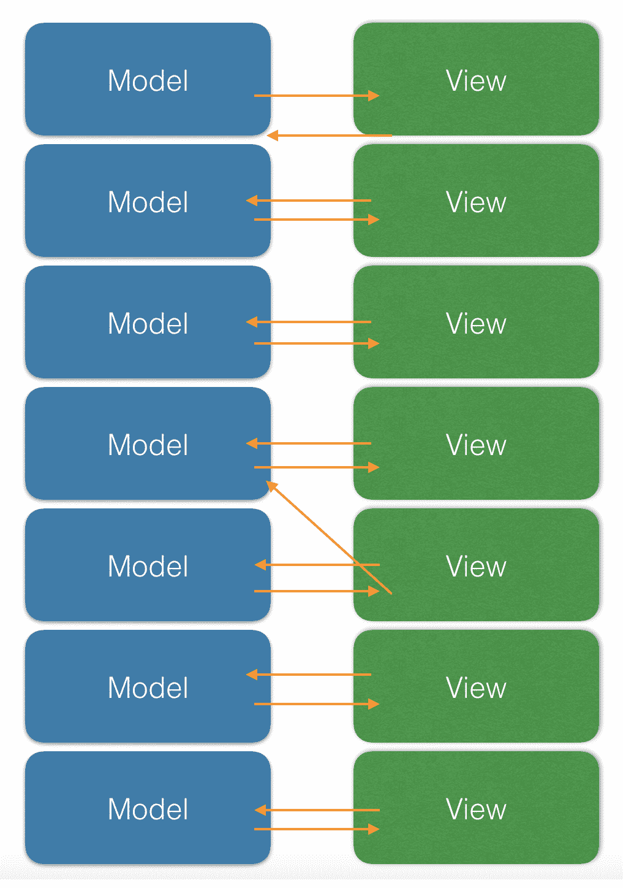
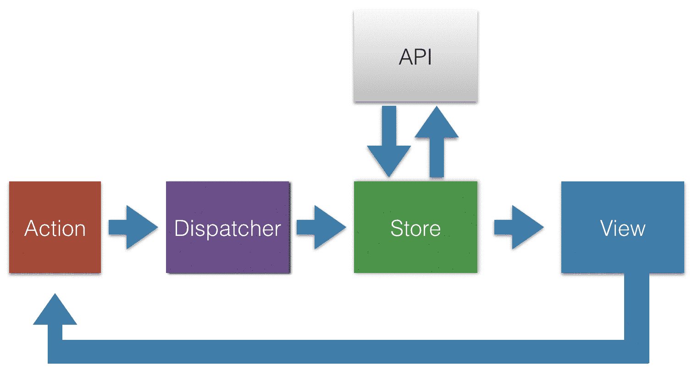
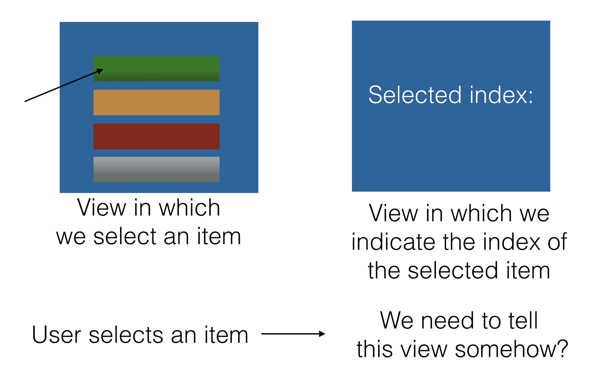
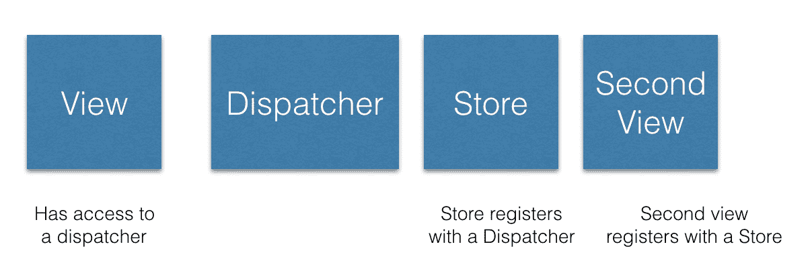
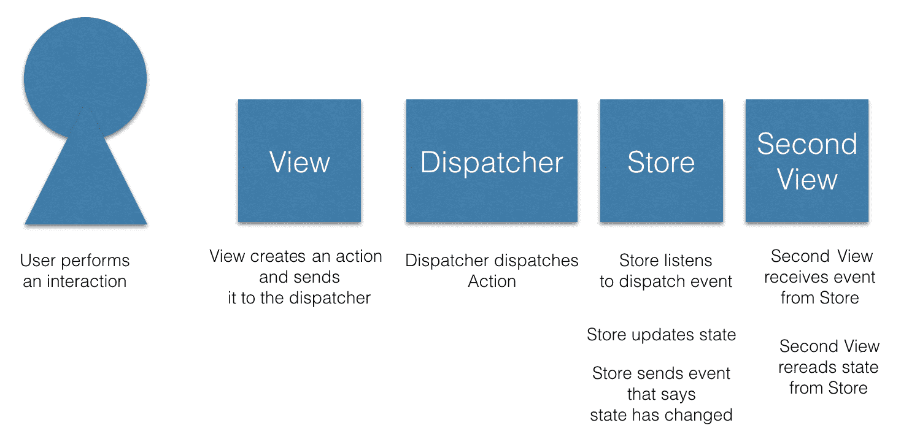
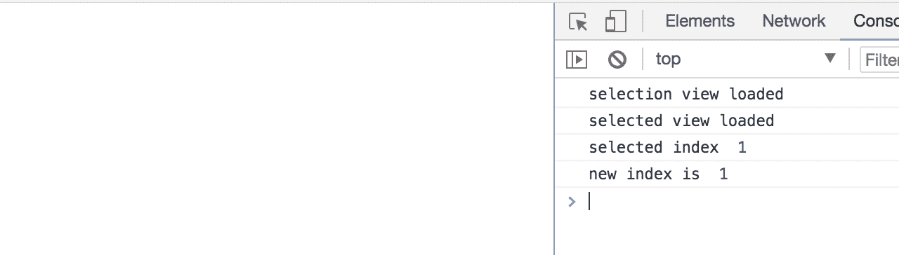
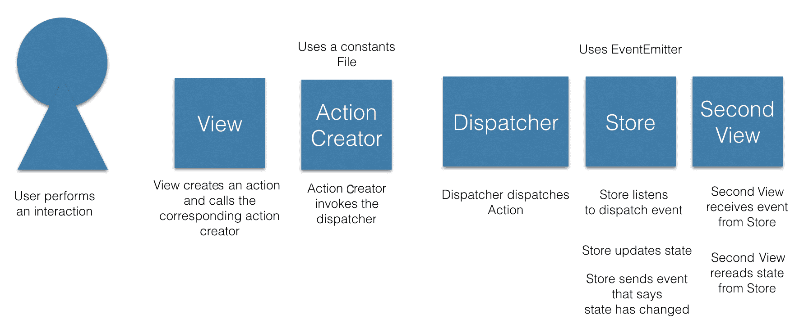
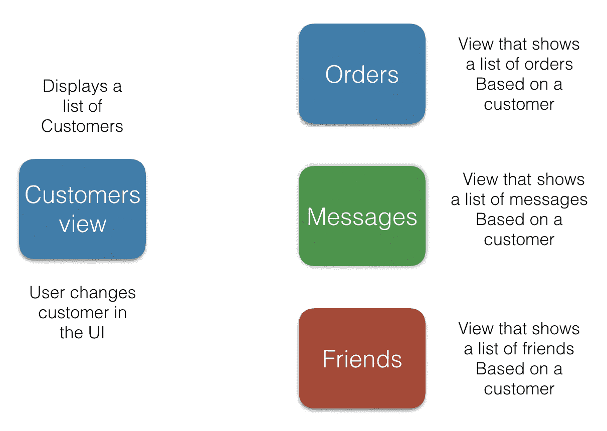

# 第五章：1.21 吉瓦特 - Flux 模式解释

你的应用程序已经发展壮大，在这个过程中，你慢慢地感到你正在失去应用程序在某个时间点的知识，我们称之为应用程序的状态。可能还会出现其他问题，比如你的应用程序的某些部分与它们所知道的不一致。在一个部分发生的更新可能没有应用到其他部分，你想着这真的应该这么难吗，有没有更好的答案？

你可能只是因为听说 NgRx 是构建应用程序结构的方式而拿起这本书，你很好奇想要了解更多。

让我们先解释一下我们的标题。我们说的 1.21 吉瓦特是什么意思？我要引用电影《回到未来》中的 Doc Brown 角色（[`www.imdb.com/name/nm0000502/?ref_=tt_trv_qu`](http://www.imdb.com/name/nm0000502/?ref_=tt_trv_qu)）：

"Marty, 对不起，但是产生 1.21 吉瓦特电力的唯一能源就是一道闪电。"

为什么我们要谈论电影《回到未来》？这就是 Flux 这个名字的来源。现在是时候再引用同一部电影的台词了：

"是的！当然！1955 年 11 月 5 日！那天我发明了时间旅行。我还记得清楚。我站在马桶的边缘挂钟，瓷器是湿的，我滑倒了，撞到了水池，当我醒来时，我有了一个启示！一个幻觉！我脑海中有了一个画面！这个画面使时间旅行成为可能：**flux**电容器！"

所以你可以看到，对于名为 Flux 的名字有一个解释。很明显，它允许我们时间旅行。至少对于 Redux 来说，我们稍后会在这本书中写到，通过一种称为时间旅行调试的东西，时间旅行是可能的。是否需要一道闪电，那就由你这位亲爱的读者来掐腕验证。

Flux 是 Facebook 创建的一种架构模式。它的产生是因为人们认为 MVC 模式根本无法扩展。随着越来越多的功能被添加，大型的代码库变得脆弱、复杂，最重要的是，不可预测。现在让我们停顿一下，想一想这个词，不可预测。

当模型和视图的数量真正增长时，大型系统被认为会变得不可预测，因为它们之间存在双向数据流，如下图所示：



在这里，我们可以看到模型和视图的数量开始增长。只要一个模型与一个视图进行交流并且反之亦然，一切都还算控制在一定范围内。然而，这种情况很少发生。在上述图表中，我们看到突然之间一个视图可以与多个模型交流，反之亦然，这意味着系统产生了级联效应，我们突然失去了控制。当然，只有一个偏离的箭头看起来并不那么糟糕，但想象一下，如果这个箭头突然变成了十个箭头，我们就真的遇到了严重的问题。

正是因为我们允许双向数据流发生，事情才变得复杂，我们失去了可预测性。对此的解药或治疗被认为是一种更简单类型的数据流，即单向流。现在，有一些关键角色参与了启用单向数据流，这就是这一章节要教我们的内容。

在本章中，我们将学到：

+   动作和动作创建者是什么

+   分发者在你的应用程序中扮演了一个中心角色，作为消息的中心

+   使用存储库进行状态管理

+   如何通过编码一个 Flux 应用程序流将我们对 Flux 的知识付诸实践

# 核心概念概述

Flux 模式的核心是单向数据流。它使用一些核心概念来实现这种流。主要思想是当 UI 上创建了一个事件，通过用户的交互，会产生一个动作。这个动作包括一个意图和一个载荷。意图是你想要实现的目标。把意图想象成一个动词。添加一个项目，删除一个项目，等等。载荷是需要发生的数据变化，以实现我们的意图。如果我们试图添加一个项目，那么载荷就是新添加的项目。然后，动作通过分发者在流中传播。动作及其数据最终会进入存储库。

组成 Flux 模式的概念包括：

+   动作和动作创建者，其中我们设定了一个意图和数据的载荷

+   分发者，我们的网页蜘蛛，能够左右发送消息

+   存储库，我们的状态和状态管理的中心位置

所有这些构成了 Flux 模式，并促进了单向数据流。考虑下面的图表：



这里描绘的是一个单向数据流。数据从**视图**到**动作**，从**动作**到**分发者**，从**分发者**到**存储库**。触发流的有两种可能的方式：

+   应用程序第一次加载时，会从**存储库**中提取数据，以填充视图。

+   用户在视图中发生交互，导致了改变的意图。意图被封装在一个**动作**中，并随后通过**分发者**发送到**存储库**。在**存储库**中，它可以被持久化到数据库中，通过**API**或保存为应用程序状态，或两者兼而有之。

让我们在接下来的章节中深入探讨每个概念，并强调一些代码示例。

# 一个统一的数据流

让我们从最顶部开始介绍参与我们统一数据流中的所有方，概念概念地一步一步向下展开。我们将构建一个应用程序，由两个视图组成。在第一个视图中，用户将从列表中选择一个项目。这应该导致创建一个动作。然后，该动作将由调度器分派。该动作及其载荷最终将进入存储。与此同时，另一个视图将从存储中监听变化。当选定项目时，第二个视图将知道并因此可以在其 UI 中指示特定项目已被选定。在高层次上，我们的应用程序及其流程将如下所示：



# 动作 - 捕捉意图

一个动作就是一个简单的意图，伴随着数据，也就是一条消息。但是一个动作是如何产生的呢？一个动作是由用户与 UI 交互时产生的。用户可能会在列表中选择特定的项目，或者按下按钮意图提交表单。提交表单应该导致产品被创建。

让我们看看两种不同的动作：

+   在列表中选择项目，这里我们感兴趣的是保存所选项目的索引

+   将待办事项保存到待办事项列表中

一个动作由一个对象表示。该对象具有两个感兴趣的属性：

+   类型：这是一个唯一的字符串，告诉我们动作的意图，例如，`选择项目`

+   数据：这是我们打算持久保存的数据，例如所选项目的数值索引

考虑到我们的第一个示例动作，该动作的代码表示看起来像下面这样：

```ts
{
  type: 'SELECT_ITEM',
  data: 3 // selected index
}
```

好的，我们已经准备好我们的动作，我们也可以将其视为一条消息。我们希望发送消息以便在 UI 中突出显示所选项。由于这是一个单向流动，我们需要遵循一条既定的航线，并将消息传递给下一个方，也就是调度器。

# 调度器 - 网络中的蛛网

将调度器视为处理传递给它的消息的网络中的蜘蛛。你也可以将调度器视为一名邮差，承诺您的消息将到达目的地。调度器存在的一个作用就是将消息分派给任何愿意倾听的人。在 Flux 架构中通常只有一个`调度器`，典型的用法看起来像这样：

```ts
dispatcher.dispatch(message);
```

# 听取调度器的消息

我们已经确定调度器会将消息分派给任何愿意倾听的人。现在是时候成为那个倾听者了。调度器需要一个`注册`或`订阅`方法，以便你这个倾听者有能力倾听传入的消息。通常的设置看起来像这样：

```ts
dispatcher.register(function(message){});
```

现在，当你这样设置监听器时，它将有能力监听到发送的任何消息类型。你需要缩小范围；通常，监听器被指定为只处理围绕某一主题的几种消息类型。您的监听器大多看起来像这样：

```ts
dispatcher.register((message) => {
  switch(message.type) {
    case 'SELECT_ITEM':
      // do something
  }
});
```

好的，我们可以筛选出我们关心的消息类型，但在填写实际代码之前，我们需要考虑一下这个监听器是谁。答案很简单：就是 store。

# store - 管理状态，数据检索和回调方法

容易认为 store 是数据存储的地方。然而，这并不是它的全部功能。下面的列表可以表达 store 的责任是什么：

+   状态的持有者

+   管理状态，可以根据需要进行更新

+   能够处理通过 HTTP 获取/持久化数据等副作用

+   处理回调方法

如你所见，这不只是存储状态。现在让我们重新连接到设置与`dispatcher`监听器相关的工作。让我们将该代码移动到我们的 store 文件`store.js`中，并将我们的消息内容保存在 store 中：

```ts
// store.js

let store = {};

function selectIndex(index) {
  store["selectedIndex"] = index;
}

dispatcher.register(message => {
  switch (message.type) {
    case "SELECT_INDEX":
      selectIndex(message.data);
      break;
  }
});
```

好的，现在 store 已经知道了新索引的情况，但重要的一点被遗漏了，我们该如何告诉 UI？我们需要一种方法告诉 UI 发生了变化。变化意味着 UI 应该重新读取它的数据。

# 视图

要告诉视图发生了什么并对其进行操作，需要发生三件事：

+   视图需要注册为 store 的监听器

+   store 需要发送一个传达变化已发生的事件

+   视图需要重新加载其数据

从 store 开始，我们需要构建它，以便您可以注册为其事件的监听器。因此，我们添加`addListener()`方法：

```ts
// store-with-pubsub.js

function selectIndex(index) {
  store["selectedIndex"] = index;
}

// registering with the dispatcher
dispatcher.register(message => {
  switch (message.type) {
    case "SELECT_INDEX":
      selectIndex(message.data);

      // signals to the listener that a change has happened
      store.emitChange();
 break;
 }
});

class Store {
  constructor() {
    this.listeners = [];
  }

  addListener(listener) {
 if (!this.listeners["change"]) {
      this.listeners["change"] = [];
    }
 this.listeners["change"].push(listener);
  }

  emitChange() {
    if (this.listeners["change"]) {
      this.listeners["change"].forEach(cb => cb());
    }
  }

  getSelectedItem() {
    return store["selectedIndex"];
  }
}

const store = new Store();
export default store;
```

在前述代码中，我们还添加了使用`emitChange()`方法发出事件的能力。您可以很容易地切换该实现以使用`EventEmitter`或类似的东西。现在是将我们的视图与 store 连接的时候了。我们通过以下方式调用`addListener()`方法来实现：

```ts
// view.js

import store from "./store-with-pubsub";

class View {
  constructor(store) {
    this.index = 0;
    store.addListener(this.notifyChanged);
  }

  // invoked from the store
  notifyChanged() {
    // rereads data from the store
 this.index = store.getSelectedItem();

    // reloading the data
    render();
  }
  render() {
    const elem = document.getElementById('view');
    elem.innerHTML = `Your selected index is: ${this.index}`;
  }
}

let view = new View();

// view.html
<html>
  <body>
    <div id="view"></div>
  </body>
</html>
```

在前述代码中，我们实现了`notifyChanged()`方法，当调用时会从 store 中调用`getSelectedItem()`方法，从而接收到新的值。

在这一点上，我们已经描述了整个链条：一个视图如何接收用户交互，将其转换为操作，然后发送到 store，然后更新 store 的状态。然后 store 发出一个其他视图正在监听的事件。当事件被接收时，在视图中从 store 中重新读取状态，然后视图可以自由地渲染这个刚刚读取的状态，以它认为合适的方式。

我们在这里描述了两件事情：

+   如何设置流程

+   Flux 中的信息流

设置流程可以通过以下图示来描述：



至于第二种情况，信息流如何通过系统流动，可以用下面的方式来描述：



# 演示统一数据流

好的，我们已经描述了我们的应用程序包括的部分：

+   用户可以选择索引的视图

+   一个允许我们发送消息的分发器

+   包含我们选择的索引的存储器

+   从存储器中读取所选索引的第二个视图

让我们从所有这些中构建一个真正的应用程序。以下代码可以在`Chapter2/demo`目录下的代码库中找到。

# 创建选择视图

首先我们需要我们的视图，在其中我们将执行选择:

```ts
// demo/selectionView.js

import dispatcher from "./dispatcher";

console.log('selection view loaded');

class SelectionView {
  selectIndex(index) {
 console.log('selected index ', index);
    dispatcher.dispatch({
 type: "SELECT_INDEX",
      data: index
 });
 }
}

const view = new SelectionView();
export default view;
```

我们已经用粗体标出了上面我们打算使用的`selectIndex()`方法。

# 添加分发器

接下来，我们需要一个分发器，能够接受我们的消息，如下所示:

```ts
// demo/dispatcher.js

class Dispatcher {
  constructor() {
    this.listeners = [];
  }

  dispatch(message) {
    this.listeners.forEach(listener => listener(message));
  }

  register(listener) {
    this.listeners.push(listener);
  }
}

const dispatcher = new Dispatcher();
export default dispatcher;
```

# 添加存储器

存储器将作为我们状态的数据源，但也能够在存储器发生更改时告诉任何监听器:

```ts
// demo/store.js

import dispatcher from './dispatcher';

function selectIndex(index) {
  store["selectedIndex"] = index;
}

// 1) store registers with dispatcher
dispatcher.register(message => {
  switch (message.type) {
    // 3) message is sent by dispatcher ( that originated from the first view)
    case "SELECT_INDEX":
      selectIndex(message.data);
      // 4) listener, a view, is being notified of the change
      store.emitChange();
      break;
    }
});

class Store {
  constructor() {
    this.listeners = [];
  }

  // 2) listener is added by a view
  addListener(listener) {
    if (!this.listeners["change"]) {
      this.listeners["change"] = [];
    }

    this.listeners["change"].push(listener);
  }

  emitChange() {
    if (this.listeners["change"]) {
      this.listeners["change"].forEach(cb => cb());
    }
  }

  getSelectedItem() {
    return store["selectedIndex"];
  }
}

const store = new Store();
export default store;
```

# 添加一个选择视图

此视图将向存储器注册自身，并要求更新其内容。如果有任何更新，它将收到通知，并且将从存储器中读取数据，此视图将传达存储器值的现在是什么:

```ts
// demo/selectedView.js

import store from "./store";

console.log('selected view loaded');

class SelectedView {
  constructor() {
    this.index = 0;
    store.addListener(this.notifyChanged.bind(this));
  }

  notifyChanged() {
    this.index = store.getSelectedItem();
    console.log('new index is ', this.index);
  }
}

const view = new SelectedView();
export default SelectedView;
```

# 运行演示

在我们运行演示之前，我们需要一个应用文件`app.js`。`app.js`文件应该要求我们的视图，并且执行选择:

```ts
// demo/app.js

import selectionView from './selectionView';
import selectedView from './selectedView';

// carry out the selection
selectionView.selectIndex(1);

```

要运行我们的演示，我们需要编译它。上面我们使用了 ES2015 模块。为了编译这些模块，我们将使用`webpack`。我们需要在我们的终端中键入以下内容来安装`webpack`：

```ts
npm install webpack webpack-cli --save-dev
```

一旦我们这样做了，我们需要创建`webpack.config.js`文件，告诉 Webpack 如何编译我们的文件以及将生成的捆绑包放在哪里。该文件如下所示:

```ts
// webpack.config.js

module.exports = {
  entry: "./app.js",
  output: { 
    filename: "bundle.js"
  },
  watch: false
};
```

这告诉 Webpack`app.js`是我们应用程序的入口点，并且在创建输出文件`bundle.js`时应该爬取所有的依赖项。Webpack 默认会将`bundle.js`放在`dist`目录中。

还有一件事，我们需要一个名为`index.html`的 HTML 文件。我们将放在`dist`文件夹下。它应该是这样的:

```ts
// demo/dist/index.html

<html>
  <body>
    <script src="img/bundle.js"></script>
  </body>
</html>

```

最后，为了运行我们的应用程序，我们需要使用 Webpack 编译它，并启动一个 HTTP 服务器并打开浏览器。我们将在`demo`目录中使用以下命令完成所有操作：

```ts
webpack && cd dist && http-server -p 5000
```

现在，打开浏览器并导航到`http://localhost:5000`。您应该会看到以下内容：



所有这些演示了如何使用分发器和存储器进行视图通信。

# 在我们的流程中添加更多操作

让我们来做一个现实检查。我们还没有将 Flux 流组织得像我们可以使它美观。总体概览是正确的，但如果我们能稍微整理一下，为更多操作留出空间，那将��很好，这样我们就可以更好地了解应用程序应该如何从这里发展。

# 清理视图

首要任务是查看我们的第一个视图以及它如何对用户交互的反应。目前它看起来像这样：

```ts
// first.view.js

import dispatcher from "./dispatcher";

class FirstView {
  selectIndex(index) {
    dispatcher.dispatch({
      type: "SELECT_INDEX",
      data: index
    });
  }
}

let view = new FirstView();
```

在我们的流程中添加更多操作意味着我们将向视图中添加一些方法，如下所示:

```ts
// first.viewII.js

import dispatcher from "./dispatcher";

class View {
  selectIndex(data) {
    dispatcher.dispatch({
      type: "SELECT_INDEX",
      data
    });
  }

  createProduct(data) {
    dispatcher.dispatch({
      type: "CREATE_PRODUCT",
      data
    });
  }

  removeProduct(data) {
    dispatcher.dispatch({
      type: "REMOVE_PRODUCT",
      data
    });
  }
}

let view = new View(); 
```

好的，现在我们知道如何添加动作了。但是看起来有点丑陋，因为有这么多调用`dispatcher`和魔术字符串，所以我们通过创建一个包含常量的文件`product.constants.js`稍微清理一下，其中包含以下代码：

```ts
// product.constants.js

export const SELECT_INDEX = "SELECT_INDEX",
export const CREATE_PRODUCT = "CREATE_PRODUCT",
export const REMOVE_PRODUCT = "REMOVE_PRODUCT"
```

让我们再做一件事。让我们把`dispatcher`移到`product.actions.js`中；这通常被称为动作创建者。它将包含`dispatcher`并引用我们的`product.constants.js`文件。所以让我们创建该文件：

```ts
// product.actions.js

import {
  SELECT_INDEX,
  CREATE_PRODUCT,
  REMOVE_PRODUCT
} from "./product-constants";
import dispatcher from "./dispatcher";
import ProductConstants from "./product.constants";

export const selectIndex = data =>
  dispatcher.dispatch({
    type: SELECT_INDEX,
    data
  });

export const createProduct = data =>
  dispatcher.dispatch({
    type: CREATE_PRODUCT,
    data
  });

export const removeProduct = data =>
  dispatcher.dispatch({
    type: REMOVE_PRODUCT,
    data
  });
```

使用这些结构，我们可以大大简化视图，看起来像这样：

```ts
// first.viewIII.js

import { 
  selectIndex, 
  createProduct, 
  removeProduct 
} from 'product.actions';

function View() {
  this.selectIndex = index => {
    selectIndex(index);
  };

  this.createProduct = product => {
    createProduct(product);
  };

  this.removeProduct = product => {
    removeProduct(product)
  };
}

var view = new View();
```

# 清理商店

我们可以对商店做出改进。没有必要编写我们目前所做的所有代码。实际上，市面上有一些库能更好地处理某些功能。

在我们计划应用所有这些变化之前，让我们回顾一下我们的商店到底能做些什么，以及清理工作完成后仍需要具备哪些功能。

让我们想一想，到目前为止我们的商店能做什么：

+   处理状态变化：它处理状态变化；无论是创建、更新、列出还是删除状态，商店都能改变状态。

+   可订阅的：它可以让您订阅它；商店具有订阅功能对于视图来说很重要，例如，当状态发生变化时，视图可以监听商店的状态。视图可能会根据新数据重新渲染。

+   可以传达状态变化：它可以发送状态已更改的事件；这与能够订阅商店相搭配使用，但这实际上是通知监听器状态已更改的行为。

# 添加 EventEmitter

最后两点实际上可以归结为一个主题，即事件处理，或者能够注册并触发事件的功能。

那么清理商店是什么样子的，为什么我们需要清理呢？清理的原因是使代码更简单。通常在构建商店时会使用一个标准库，称为`EventEmitter`。该库处理了我们之前提到的内容，即能够注册和触发事件。这是发布-订阅模式的简单实现。基本上，`EventEmitter`允许您订阅特定事件，并且也允许您触发事件。有关模式本身的更多信息，请参阅以下链接：[`en.wikipedia.org/wiki/Publish%E2%80%93subscribe_pattern`](https://en.wikipedia.org/wiki/Publish%E2%80%93subscribe_pattern)。

你肯定能为此编写自己的代码，但能够使用专用库让您可以专注于其他重要事项，比如解决业务问题，这真的很好。

我们决定使用`EventEmitter`库，并且我们这样做：

```ts
// store-event-emitter.js

export const Store = (() => {
  const eventEmitter = new EventEmitter();
  return {
    addListener: listener => {
      eventEmitter.on("changed", listener);
    },
    emitChange: () => {
      eventEmitter.emit("changed");
    },
    getSelectedItem: () => store["selectedItem"]
  };
})();
```

这使我们的代码变得更清晰，因为我们不再需要保存内部订阅者列表。虽然我们可以做更多的改变，但让我们在下一节中讨论一下。

# 添加和清理注册方法

存储的工作之一是处理事件，特别是当存储想要向视图传达其状态发生了变化时。在`store.js`文件中，还发生着其他一些事情，比如注册我们自己与`dispatcher`并能够接收分发的操作。我们使用这些操作来改变存储的状态。让我们提醒自己那是什么样子：

```ts
// store.js

let store = {};

function selectIndex(index) {
  store["selectedIndex"] = index;
}

dispatcher.register(message => {
  switch (message.type) {
    case "SELECT_INDEX":
      selectIndex(message.data);
      break;
  }
});
```

这里，我们只支持一个操作，即`SELECT_INDEX`。我们在这里需要做两件事：

+   添加另外两个操作，`CREATE_PRODUCT`和`REMOVE_PRODUCT`，以及相应的函数`createProduct()`和`removeProduct()`

+   停止使用神秘字符串，开始使用我们的常量文件

+   使用我们在`store-event-emitter.js`文件中创建的存储

让我们实现前面列表中建议的更改：

```ts
// store-actions.js

import dispatcher from "./dispatcher";
import {
  SELECT_INDEX,
  CREATE_PRODUCT,
  REMOVE_PRODUCT
} from "./product.constants";

let store = {};

function selectIndex(index) {
  store["selectedIndex"] = index;
}

export const Store = (() => {
  var eventEmitter = new EventEmitter();
  return {
    addListener: listener => {
      eventEmitter.on("changed", listener);
    },
    emitChange: () => {
      eventEmitter.emit("changed");
    },
    getSelectedItem: () => store["selectedItem"]
  };
})();

dispatcher.register(message => {
  switch (message.type) {
    case "SELECT_INDEX":
      selectIndex(message.data);
      break;
  }
});

const createProduct = product => {
  if (!store["products"]) {
    store["products"] = [];
  }
 store["products"].push(product);
};

const removeProduct = product => {
  var index = store["products"].indexOf(product);
  if (index !== -1) {
    store["products"].splice(index, 1);
  }
};

dispatcher.register(({ type, data }) => {
  switch (type) {
    case SELECT_INDEX:
      selectIndex(data);
      break;
    case CREATE_PRODUCT:
      createProduct(data);
 break;
    case REMOVE_PRODUCT:
      removeProduct(data);
 }
});
```

# 更多的改进

我们的代码肯定还有更多的改进空间。我们使用了 ES2015 的导入来导入其他文件，但我们大部分的代码都是用 ES5 编写的，所以为什么不充分利用 ES2015 给我们的大多数功能呢？我们可以做的另一个改进是引入不可变性，并确保我们的存储不是被突变的，而是从一个状态过渡到另一个状态。

让我们看一下存储文件，因为那是我们可以添加最多 ES2015 语法的地方。我们目前的模块模式看起来是这样的：

```ts
// store-event-emitter.js

var Store = (function(){
  const eventEmitter = new EventEmitter();

  return {
    addListener: listener => {
      eventEmitter.on("changed", listener);
    },
    emitChange: () => {
      eventEmitter.emit("changed");
    },
    getSelectedItem: () => store["selectedItem"]
  };
})();
```

它可以用一个简单的类来替换，而不是实例化一个`EventEmitter`，我们可以继承它。公平地说，我们可以使用 ES2015 继承或合并库来避免创建一个单独的`EventEmitter`实例，但这展示了 ES2015 可以使事情多么简洁：

```ts
// store-es2015.js

import { EventEmitter } from "events";
import {
SELECT_INDEX,
CREATE_PRODUCT,
REMOVE_PRODUCT
} from "./product.constants";

let store = {};

class Store extends EventEmitter {
  constructor() {}
    addListener(listener) {
 this.on("changed", listener);
  }

 emitChange() {
 this.emit("changed");
  }

 getSelectedItem() {
 return store["selectedItem"];
  }
}

const storeInstance = new Store();

function createProduct(product) {
  if (!store["products"]) {
    store["products"] = [];
  }
  store["products"].push(product);
}

function removeProduct(product) {
  var index = store["products"].indexOf(product);
  if (index !== -1) {
    store["products"].splice(index, 1);
  }
}

dispatcher.register(({ type, data }) => {
  switch (type) {
    case SELECT_INDEX:
      selectIndex(data);
      storeInstance.emitChange();
      break;
    case CREATE_PRODUCT:
      createProduct(data);
      storeInstance.emitChange();
      break;
    case REMOVE_PRODUCT:
      removeProduct(data);
      storeInstance.emitChange();
  }
});
```

# 增加不可变性

我们可以做的另一件事是增加不可变性。首先使用不可变性的理由是使您的代码更可预测，一些框架可以使用这一点进行更简单的变化检测，并且可以依靠引用检查而不是脏检查。当 AngularJS 的整个变化检测机制在编写 Angular 时改变时，情况就是如此。从实际的角度来看，这意味着有一些函数我们可以在我们的存储中进行操作，并应用不可变性原则。第一个原则是不要改变，而是创建一个全新的状态，而不是新状态是*旧状态+状态变化*。一个简单的例子是：

```ts
var oldState = 3;
var newState = oldState + 2
```

在这里，我们创建了一个新变量`newState`，而不是突变我们的`oldState`变量。有一些函数可以帮助我们做到这一点，叫做`Object.assign`和函数 filter。我们可以用它们来更新情况，以及从列表中添加或删除东西。让我们使用它们并重新编写我们的存储代码的一部分。让我们突出显示我们打算更改的代码：

```ts
// excerpt from store-actions.js

const createProduct = product => {
  if (!store["products"]){ 
    store["products"] = [];
  }
  store["products"].push(product);
};

const removeProduct = product => {
  var index = store["products"].indexOf(product);
  if (index !== -1) {
    store["products"].splice(index, 1);
  }
};
```

让我们应用`Object.assign`和 `filter()`，并记得不要改变东西。 最终结果应该是这样的：

```ts
// excerpt from our new store-actions-immutable.js

const createProduct = product => {
  if (!store["products"]) {
    store["products"] = [];
  }
  store.products = [...store.products, Object.assign(product)];
};

const removeProduct = product => {
  if (!store["products"]) return;

  store["products"] = products.filter(p => p.id !== product.id);
};
```

我们可以看到`createProduct()`方法使用了一个 ES2015 构造，即 spread 参数，`...`，它接受一个列表并将其成员转换为逗号分隔的项目列表。`Object.assign()`用于复制对象的所有值，因此我们存储的是对象的值而不是它的引用。 使用 filter 方法时，`removeProduct()`方法变得非常简单。 我们只需创建一个投影，不包括应该删除的产品；删除从未如此简单或优雅。 我们没有改变任何东西。

# 总结

我们的清理从视图开始；我们想要删除对 dispatcher 的直接连接，也不再需要使用魔术字符串，因为这非常容易出错，并且很容易拼错。 相反，我们可以依赖于常量。 为了解决这个问题，我们创建了一个与 dispatcher 通信的 action creator 类。

我们还创建了一个常量模块来删除魔术字符串。

此外，我们通过开始使用`EventEmitter`来改进存储。 最后，我们通过给它添加更多动作并开始引用常量来进一步改进存储。

在这一点上，我们的解决方案已经准备好接受更多的动作，并且我们应该非常清楚需要添加到哪些文件中，因为我们支持越来越多的用户交互。

最后，我们围绕 ES2015 和不可变性进行了改进，使得我们的代码看起来更加整洁。 有了这个基础，我们现在可以从静态数据转为涉及副作用和 Ajax 的工作。

让我们在图表中总结我们所有的改进，显示添加到我们流程中的构造：



很明显，使用 action creator 并不是必须的，但它确实清理了代码，并且对存储使用 `EventEmitter`也是如此；很好但不是必需的。

# 添加 AJAX 调用

到目前为止，我们在 Flux 流中只处理静态数据。 现在是时候向流程添加真实数据连接，因此添加真实数据。 是时候开始通过 AJAX 和 HTTP 与 API 进行通信了。 获取数据现在相当容易，多亏了 fetch API 和 RxJS 等库。 在将其纳入流程时，你需要考虑以下事项：

+   在哪里进行 HTTP 调用

+   如何确保存储得到更新并通知感兴趣的视图

我们注册存储到`dispatcher`的代码如下：

```ts
// excerpt from store-actions-immutable.js

const createProduct = (product) => {
  if (!store["products"]) {
    store["products"] = [];
  }

  store.products = [...store.products, Object.assign(product)];
}

dispatcher.register(({ type, data }) => {
  switch (type) {
    case CREATE_PRODUCT:
      createProduct(data);
      store.emitChange();
      break;
      /* other cases below */
  }
})
```

如果我们真的这么做，即调用 API 来保存这个产品，`createProduct()`将是我们调用 API 的地方，如下所示：

```ts
// example use of fetch()

fetch(
  '/products' ,
  { method : 'POST', body: product })
  .then(response => {
   // send a message to the dispatcher that the list of products should be reread
}, err => {  
  // report error
});
```

调用 `fetch()` 返回一个 `Promise`。 然而，让我们使用 async/await，因为它使调用变得更加可读。 代码上的差异可见以下示例：

```ts
// contrasting example of 'fetch() with promise' vs 'fetch with async/await'

fetch('url')
 .then(data => console.log(data))
 .catch(error => console.error(error));

 // using async/await
 try {
   const data = await fetch('url');
   console.log(data);
 } catch (error) {
   console.error(error);
 }
```

用这种方法替换`createProduct()`中发生的事情会添加大量噪音的代码，因此将您的 HTTP 交互封装在 API 结构中是一个好主意，如下所示：

```ts
// api.js 

export class Api {
  createProduct(product) {
    return fetch("/products", { method: "POST", body: product });
  }
}
```

现在让我们用调用我们的 API 结构来替换`createProduct()`方法的内容，如下所示：

```ts
// excerpt from store-actions-api.js

import { Api } from "./api";

const api = new Api();

createProduct() {
  api.createProduct();
}
```

不过，这还不够。因为我们通过 API 调用创建了一个产品，所以我们应该发出一个强制产品列表重新读取的动作。我们没有这样的动作或支持方法在存储中处理它，所以让我们添加一个：

```ts
// product.constants.js

export const SELECT_INDEX = "SELECT_INDEX";
export const CREATE_PRODUCT = "CREATE_PRODUCT";
export const REMOVE_PRODUCT = "REMOVE_PRODUCT";
export const GET_PRODUCTS = "GET_PRODUCTS";
```

现在让我们在存储中添加所需的方法，并处理它的情况：

```ts
// excerpt from store-actions-api.js

import { Api } from "./api";
import {
  // other actions per usual
  GET_PRODUCTS,
} from "./product.constants";

const setProducts = (products) => {
 store["products"] = products;
}

const setError = (error) => {
  store["error"] = error;
}

dispatcher.register( async ({ type, data }) => {
  switch (type) {
    case CREATE_PRODUCT:
      try {
        await api.createProduct(data);
        dispatcher.dispatch(getProducts());
      } catch (error) {
        setError(error);
        storeInstance.emitError();
      }
      break;
    case GET_PRODUCTS:
 try {
 const products = await api.getProducts();
 setProducts(products);
 storeInstance.emitChange();
 }
 catch (error) {
 setError(error);
 storeInstance.emitError();
 }
 break;
  }
});
```

我们可以看到`CREATE_PRODUCT`情况将调用相应的 API 方法`createProduct()`，在完成时将分发`GET_PRODUCTS`动作。这样做的原因是，当我们成功创建产品时，我们需要从端点读取以获取产品列表的更新版本。我们不能详细看到这一点，但它是通过我们调用`getProducts()`来调用的。同样，封装每个被分发的东西是很好的，这个封装就是一个动作创建者。

整个文件看起来像这样：

```ts
// store-actions-api.js

import dispatcher from "./dispatcher";
import { Action } from "./api";
import { Api } from "./api";
import {
  CREATE_PRODUCT,
  GET_PRODUCTS,
  REMOVE_PRODUCT,
  SELECT_INDEX
} from "./product.constants";

let store = {};

class Store extends EventEmitter {
  constructor() {}
  addListener(listener) {
    this.on("changed", listener);
  }

  emitChange() {
    this.emit("changed");
  }

  emitError() {
    this.emit("error");
  }

  getSelectedItem() {
    return store["selectedItem"];
  }
}

const api = new Api();
const storeInstance = new Store();

const selectIndex = index => {
  store["selectedIndex"] = index;
};

const createProduct = product => {
  if (!store["products"]) {
    store["products"] = [];
  }
  store.products = [...store.products, Object.assign(product)];
};

const removeProduct = product => {
  if (!store["products"]) return;
  store["products"] = products.filter(p => p.id !== product.id);
};

const setProducts = products => {
  store["products"] = products;
};

const setError = error => {
  store["error"] = error;
};

dispatcher.register(async ({ type, data }) => {
  switch (type) {
    case "SELECT_INDEX":
      selectIndex(message.data);
      storeInstance.emitChange();
      break;
    case CREATE_PRODUCT:
      try {
        await api.createProduct(data);
        storeInstance.emitChange();
      } catch (error) {
        setError(error);
        storeInstance.emitError();
      }
      break;
    case GET_PRODUCTS:
      try {
        const products = await api.getProducts();
        setProducts(products);
        storeInstance.emitChange();
      } catch (error) {
        setError(error);
        storeInstance.emitError();
      }
      break;
   }
});
```

# 更大的解决方案

到目前为止，我们一直在描述一个只包含产品主题的解决方案，通信只发生在一个视图到另一个视图。在一个更现实的应用程序中，我们将有许多主题，如用户管理、订单等；它们的确切名称取决于您应用程序的领域。至于视图，很可能你会有大量的视图监听另一个视图，就像这个例子中一样：



这描述了一个包含四个不同视图组件的应用程序，围绕它们自己的主题。**客户视图**包含客户列表，并且允许我们更改我们当前想要关注的客户。另外三个支持视图显示**订单**，**消息**和**朋友**，它们的内容取决于当前突出显示的客户。从 Flux 的角度来看，**订单**，**消息**和**朋友**视图可以轻松地向存储注册，以知道何时更新了，因此它们可以获取/重新获取它们需要的数据。然而，想象一下，支持视图自身想要支持 CRUD 操作；然后它们将需要自己的一组常量、动作创建者、API 和存储。因此，现在您的应用程序需要看起来像这样：

```ts
/customers 
  constants.js
  customer-actions.js
  customer-store.js
  customer-api.js
/orders
  constants.js
  orders-actions.js
  orders-store.js
  orders-api.js
/messages
  constants.js
  messages-actions.js
  messages-store.js
  messages-api.js
/friends
  constants.js
  friends-actions.js
  friends-store.js
  friends-api.js
/common
  dispatcher.js
```

这里存在两种有趣的情况：

+   您有一个独立的视图；所有 CRUD 操作都在它内部发生

+   您有一个需要监听其他视图的视图

对于第一种情况，一个很好的经验法则是创建自己的一组常量、动作创建者、API 和存储。

对于第二种情况，请确保您的视图向该主题的存储注册自己。例如，如果朋友视图需要监听客户视图，那么它需要向客户存储注册自己。

# 摘要

我们开始只是想解释 Flux 架构模式。很容易就开始提及它如何与 React 配合，以及有哪些支持 Flux 和 React 的好用库和工具。然而，这样做会使我们的焦点偏离了从更加框架无关的角度解释这一模式的初衷。因此，本章的其他部分致力于解释核心概念，如动作、动作创建者、分发器、仓库和统一数据流。我们逐渐改进了代码，开始使用常量、动作创建者和一个很好的支持库，比如`EventEmitter`。我们解释了 HTTP 如何嵌入其中，最后，我们讨论了如何构建我们的应用程序。关于 Flux 还有很多可以说的，但我们选择限制范围，以便了解基本原理，这样我们就可以在后续章节中深入研究 Redux 和 NgRx 的方式进行比较。

下一章将在此基础上介绍**函数响应式编程**（**FRP**）的概念。它更多地处理的是如何理解数据似乎随时到来的事实。尽管听起来很混乱，但甚至这也可以被建模为创建一种结构和秩序的感觉，只要我们把我们的数据看作是一种流。关于这一点，下一章会详细介绍。
