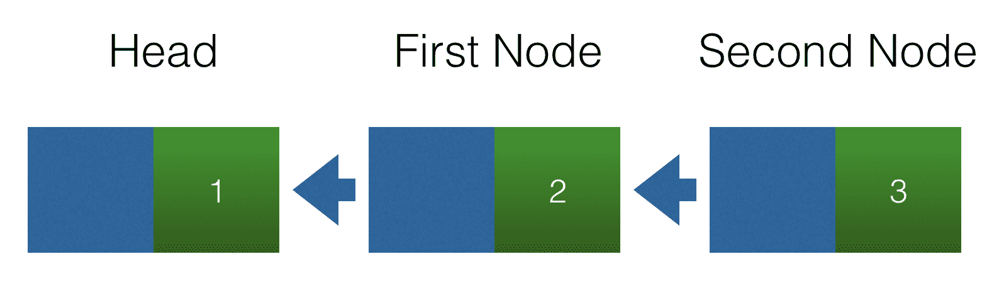
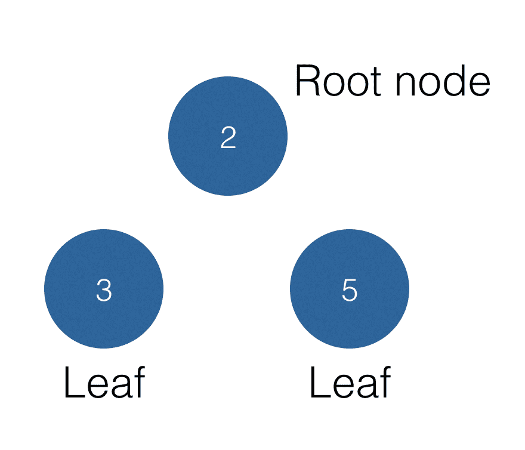
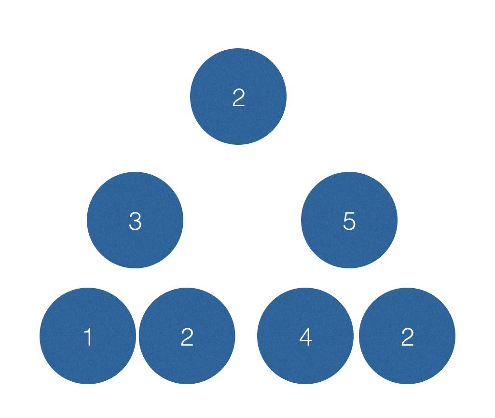
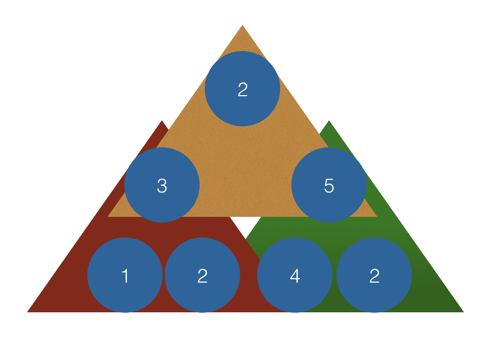
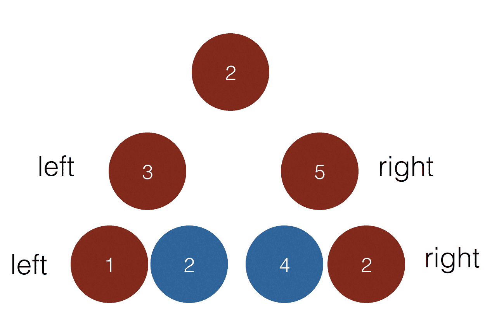
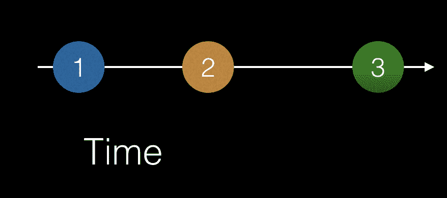
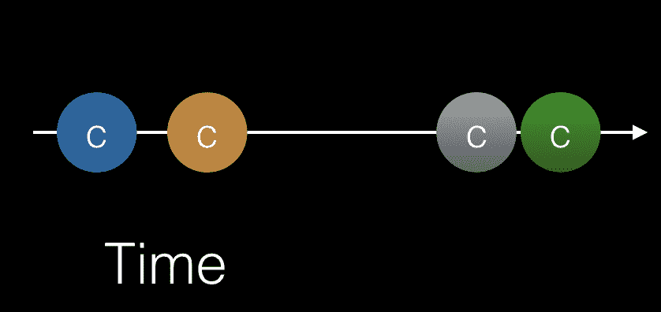
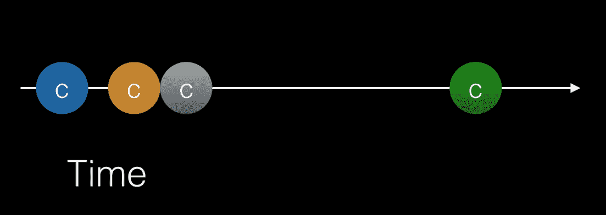
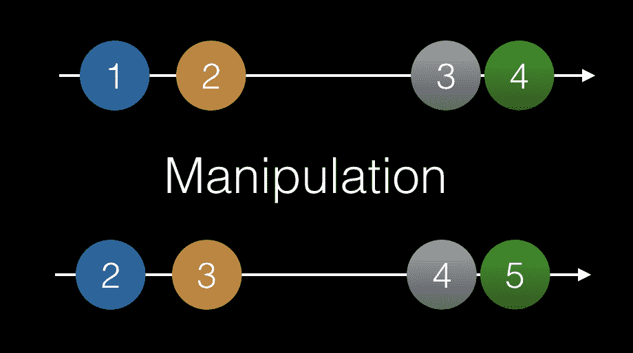
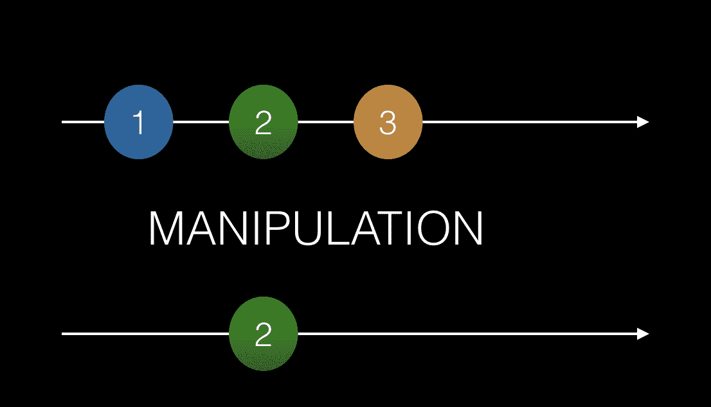

# 第六章：函数式响应式编程

根据维基百科，**函数式响应式编程** (**FRP**) 是用于响应式编程的一种编程范式，它使用函数式编程的构建模块。好的，这听起来挺高大尚的，但是它是什么意思呢？要理解整个句子，我们需要把它拆开来。让我们试着定义以下内容：

+   **编程范式** 是围绕程序应该如何组织和结构化的总体理论或工作方式。面向对象编程和函数式编程就是编程范式的例子。

+   **响应式编程** 简单来说是利用异步数据流进行编程。异步数据流是值可以在任何时间到达的数据流。

+   **函数式编程** 是一种采用更数学化方法的编程范式，它将函数调用视为数学计算，从而避免更改状态或处理可变数据。

总的来说，我们的维基百科定义意味着我们对可能在任何时间到达的值采取了一种函数式编程方法。这并不意味着太多，但希望在本章结束时事情会有所明朗。

在本章中，我们将学习以下内容：

+   异步数据流

+   如何操作这些流

# 递归

“要理解递归这个词，请参见递归这个词。”

这在大多数工程学校都是一个笑话，并且以一种非常简短的方式解释了这是什么。递归是一个数学概念。让我们稍微解释一下。官方定义如下：

当过程的一个步骤涉及到调用过程本身时，递归是过程通过的过程。进行递归的过程被称为“递归的”。

好的，那用人话怎么说？这意味着在运行我们的函数的某个时刻，我们会调用自己。这意味着我们有一个看起来像这样的函数：

```ts
function something() {
  statement;
  statement;
  if(condition) {
    something();
  }
  return someValue;
}
```

我们可以看到函数`something()` 在其体内的某个时刻调用了自身。递归函数应该遵守以下规则：

+   应该调用自身

+   最终应该满足退出条件

如果递归函数没有退出条件，我们将耗尽内存，因为函数将永远调用自身。有某些类型的问题比其他更适合应用递归编程。这些类型的问题的例子有：

+   遍历树结构

+   编译代码

+   为压缩编写算法

+   对列表进行排序

还有许多其他例子，但重要的是要记住，尽管递归是一个很好的工具，但不应该随处使用。让我们看一个递归真正闪耀的例子。我们的例子是一个链接列表。链接列表由了解他们连接到的节点的节点组成。`Node`结构的代码如下：

```ts
class Node {
  constructor(
    public left, 
    public value
  ) {}
}
```

使用`Node`这样的结构，我们可以构建一个由几个链接节点组成的链表。我们可以以以下方式连接一组节点实例：

```ts
const head = new Node(null, 1);
const firstNode = new Node(head, 2);
const secondNode = new Node(firstNode, 3);
```

上述代码的图形表示将如下图所示。在这里，我们可以清楚地看到我们的节点由什么组成以及它们如何连接：



这里，我们有一个链表，其中有三个相连的节点实例。头节点与左侧节点不相连。然而第二个节点连接到第一个节点，而第一个节点连接到头节点。对列表进行以下类型的操作可能会很有趣：

+   给定列表中的任意节点，找到头节点

+   在列表中的特定位置插入一个节点

+   从列表中的给定位置移除一个节点

让我们看看如何解决第一个要点。首先，我们将使用命令式方法，然后我们将使用递归方法来看看它们如何不同。更重要的是，让我们讨论为什么递归方法可能更受欢迎：

```ts
// demo of how to find the head node, imperative style

const head = new Node(null, 1);
const firstNode = new Node(head, 2);
const secondNode = new Node(firstNode, 3); 

function findHeadImperative (startNode)  {
  while (startNode.left !== null) {
    startNode = startNode.left;
  }
  return startNode;
}

const foundImp = findHeadImperative(secondNode);
console.log('found', foundImp);
console.log(foundImp === head);

```

正如我们在这里所见，我们使用`while`循环来遍历列表，直到找到其`left`属性为 null 的节点实例。现在，让我们展示递归方法：

```ts
// demo of how to find head node, declarative style using recursion

const head = new Node(null, 1);
const firstNode = new Node(head, 2);
const secondNode = new Node(firstNode, 3); 

function findHeadRecursive(startNode) {
  if(startNode.left !== null) {
    return findHeadRecursive(startNode.left);
  } else {
    return startNode;
  }
}

const found = findHeadRecursive(secondNode);
console.log('found', found);
console.log(found === head);

```

在上面的代码中，我们检查`startNode.left`是否为 null。如果是这种情况，我们已经到达了我们的退出条件。如果我们尚未达到退出条件，我们继续调用自己。

好的，我们有一个命令式方法和一个递归方法。为什么后者更好？嗯，使用递归方法，我们从一个长列表开始，每次调用自己的时候都使列表变短：有点*分而治之*的方法。递归方法显著突出的一点是，我们通过说不，我们的退出条件还没有满足，继续处理。继续处理意味着我们像在我们的`if`子句中那样调用自己。递归编程的要点是我们能减少代码行数吗？嗯，这可能是结果，但更重要的是：它改变了我们解决问题的思维方式。在命令式编程中，我们有一种*从上到下解决问题*的思维方式，而在递归编程中，我们的思维方式更多地是定义我们何时完成并将问题分解为更容易处理的部分。在上述情况下，我们舍弃了不再感兴趣的部分链表。

# 不再使用循环

当开始以更功能化的方式编码时，其中一个更显著的变化是我们摆脱了`for`循环。现在我们已经了解了递归，我们可以使用它代替。让我们看一个简单的命令式代码片段，用于打印一个数组：

```ts
// demo of printing an array, imperative style

let array = [1, 2, 3, 4, 5];

function print(arr) {
  for(var i = 0, i < arr.length; i++) {
    console.log(arr[i]); 
  }
}

print(arr);
```

使用递归的相应代码如下：

```ts
// print.js, printing an array using recursion

let array = [1, 2, 3, 4, 5];

function print(arr, pos, len) {
  if (pos < len) {
    console.log(arr[pos]);
    print(arr, pos + 1, len);
  }
  return;
}

print(array, 0, array.length);
```

如我们所见，我们的命令式代码仍在那里。我们依然从`0`开始。此外，我们一直持续到我们到达数组的最后位置。一旦我们达到我们的中断条件，我们就退出方法。

# 重复模式

到目前为止，我们还没有完全说明递归的概念。我们可能有点理解，但可能还不确定为什么不能使用老式的`while`或`for`循环来代替。递归在解决看起来像重复模式的问题时才会显现。一个例子是树。树有一些类似的概念，例如由节点组成。一个没有子节点连接的节点称为叶子。具有子节点但与上游节点没有连接的节点称为根节点。让我们用图示说明这一点：



有一些我们想要在树上进行的有趣操作：

+   总结节点值

+   计算节点数

+   计算宽度

+   计算深度

为了尝试解决这个问题，我们需要考虑如何将树以数据结构的形式存储。最常见的建模方式是创建一个表示节点具有值、`left`属性和`right`属性的表示方法，然后这两个属性分别指向节点。因此，上述 Node 类的代码可能如下：

```ts
class NodeClass {
  constructor(left, right, value) {
    this.left = left;
    this.right = right;
    this.value = value;
  }
}
```

下一步是考虑如何创建树本身。此代码展示了我们如何创建一个具有根节点和两个子节点的树，以及如何将它们绑定在一起：

```ts
// tree.js

class NodeClass {
  constructor(left, right, value) {
    this.left = left;
    this.right = right;
    this.value = value;
  }
}

const leftLeftLeftChild = new NodeClass(null, null, 7);
const leftLeftChild = new NodeClass(leftLeftLeftChild, null, 1);
const leftRightChild = new NodeClass(null, null, 2);
const rightLeftChild = new NodeClass(null, null, 4);
const rightRightChild = new NodeClass(null, null, 2);
const left = new NodeClass(leftLeftChild, leftRightChild, 3);
const right = new NodeClass(rightLeftChild, rightRightChild, 5);
const root = new NodeClass(left, right, 2);

module.exports = root;

```

值得强调的是实例`left`和`right`没有子节点。这是因为我们在创建时将它们的值设置为`null`。另一方面，我们的根节点有`left`和`right`对象实例作为子节点。

# 总结

之后，我们需要考虑如何总结节点。看着它，似乎我们应该总结顶部节点及其两个子节点。因此，代码实现将开始如下：

```ts
// tree-sum.js

const root = require('./tree');

function summarise(node) {
  return node.value + node.left.value + node.right.value;
}

console.log(summarise(root)) // 10
```

如果我们的树增长并突然变成这样时会发生什么：



让我们添加到前面的代码，使其看起来像这样：

```ts
// example of a non recursive code

function summarise(node) {
  return node.value + 
    node.left.value + 
    node.right.value +
    node.right.left.value +
    node.right.right.value + 
    node.left.left.value + 
    node.left.right.value;
}

console.log(summarise(root)) // 19
```

这在技术上是可工作的代码，但还可以改善。在这一点上，从树的角度看，我们应该看到树中的重复模式。我们有以下三角形：



一个三角形由**2**，**3**，**5**组成，另一个由**3**，**1**，**2**组成，最后一个由**5**，**4**，**2**组成。每个三角形通过取节点本身及其左子节点和右子节点来计算其总和。递归就是这样的：发现重复模式并对其进行编码。现在我们可以使用递归来实现我们的`summarise()`函数，如下所示：

```ts
function summarise(node) {
  if(node === null) {
    return 0;
  }
  return node.value + summarise(node.left) + summarise(left.right);
}
```

我们在这里做的是将我们的重复模式表示为*节点 + 左节点 + 右节点*。当我们调用`summarise(node.left)`时，我们简单地再次运行`summarise()`以获得该节点。前面的实现简短而优雅，并能遍历整个树。一旦你发现问题可以看作是一个重复模式时，递归真是优雅。完整的代码看起来像这样：

```ts
// tree.js

class NodeClass {
  constructor(left, right, value) {
    this.left = left;
    this.right = right;
    this.value = value;
  }
}

const leftLeftLeftChild = new NodeClass(null, null, 7);
const leftLeftChild = new NodeClass(leftLeftLeftChild, null, 1);
const leftRightChild = new NodeClass(null, null, 2);
const rightLeftChild = new NodeClass(null, null, 4);
const rightRightChild = new NodeClass(null, null, 2);
const left = new NodeClass(leftLeftChild, leftRightChild, 3);
const right = new NodeClass(rightLeftChild, rightRightChild, 5);
const root = new NodeClass(left, right, 2);

module.exports = root;

// tree-sum.js

const root = require("./tree");

function sum(node) {
  if (node === null) {
    return 0;
  }
  return node.value + sum(node.left) + sum(node.right);
}

console.log("sum", sum(root));
```

# 计数

现在，实现一个用于计算树中所有节点的函数变得非常简单，因为我们开始理解递归的本质。我们可以重新使用以前的总结函数，并将每个非空节点简单地计为`1`，空节点计为`0`。因此，我们可以简单地修改现有的总结函数如下：

```ts
//tree-count.js

const root = require("./tree");

function count(node) {
  if (node === null) {
    return 0;
  } else {
    return 1 + count(node.left) + count(node.right);
  }
}

console.log("count", count(root));
```

上述代码确保我们成功遍历每个节点。我们的退出条件是当我们达到 null。也就是说，我们正在从一个节点尝试去到其不存在的子节点之一。

# 宽度

要创建一个宽度函数，我们首先需要定义宽度是什么意思。让我们再次看看我们的树：


这棵树的宽度是**4**。为什么呢？对于树中每走一步，我们的节点向左和向右各扩展一步。这意味着为了正确计算宽度，我们需要遍历树的边缘。每当我们需要遍历一个节点向左或向右时，我们就增加宽度。从计算的角度来看，我们感兴趣的是这样遍历这棵树：



因此，代码应反映这一事实。我们可以这样实现：

```ts
// tree-width.js

const root = require("./tree");

function calc(node, direction) {
  if (node === null) {
    return 0;
  } else {
    return (
      1 + (direction === "left" ? 
      calc(node.left, direction) : 
      calc(node.right, direction))
    );
  }
}

function calcWidth(node) {
  return calc(node.left, "left") + calc(node.right, "right");
}

console.log("width", calcWidth(root));
```

特别注意，在`calcWidth()`函数中，我们分别用`node.left`和`node.right`作为参数调用`calc()`。我们还添加了`left`和`right`参数，这在`calc()`方法中意味着我们将沿着那个方向继续前进。我们的退出条件是最终碰到 null。

# 异步数据流

异步数据流是一种数据流，在延迟后一个接着一个地发出值。异步一词意味着发出的数据可能在任何时候出现，可能在一秒后或甚至在两分钟后出现。对于模拟异步流的一种方法是在时间轴上放置发出的值，就像这样：



有很多事情可能被视为异步。其中一个是通过 AJAX 获取数据。数据到达的时间取决于许多因素，比如：

+   您的连接速度

+   后端 API 的响应速度

+   数据的大小，以及更多的因素。

这一点是数据并非在这一刻就到达。

其他可能被视为异步的事物包括用户发起的事件，比如滚动或鼠标点击。这些是可以在任何时间发生的事件，取决于用户的交互。因此，我们可以将这些用户界面事件视为时间轴上的连续数据流。以下图表描述了代表用户多次点击的数据流。每次点击会触发一个点击事件**c**，其在时间轴上的位置如下所示：



乍一看，我们的图表显示了四次点击事件。仔细观察，我们可以看到这些点击事件似乎被分组了。上面的图表包含了两条信息：

+   已发生多次点击事件

+   点击事件之间存在一定的延迟

在这里，我们可以看到前两次点击事件发生的时间非常接近；当两个事件发生的时间非常接近时，这将被解释为双击。因此，上面的图告诉我们发生的事件；它还告诉我们发生的时间和频率。通过查看前面的图表，很容易区分单击和双击。

我们可以为每种点击行为分配不同的动作。双击可能意味着我们想要放大，而单击可能意味着我们想要选择某些内容；确切的行为取决于您正在编写的应用程序。

第三个例子是输入。如果我们遇到一种情况，用户正在输入并在一段时间后停止了输入呢？在一定时间过去后，用户期望 UI 有所反应。这就是搜索字段的情况。在这种情况下，用户可能会在搜索字段中输入内容，并且在完成后按下搜索按钮。在 UI 中模拟这种情况的另一种方法是仅提供一个搜索字段，并等待用户停止输入，作为何时开始搜索用户想要的内容的信号。最后的例子被称为**自动完成**行为。可以以以下方式对其进行模拟：



输入的前三个字符似乎属于同一个搜索查询，而输入的第四个字符则出现得晚得多，可能属于另一个查询。

本节的重点在于突出不同事物适合被建模为流，并且时间轴以及发出值的放置在时间轴上的意义。

# 将列表与异步流进行比较 - 为使用 RxJS 做准备

到目前为止，我们已经讨论了如何将异步事件建模为时间轴上的连续数据流，或者说是流建模。事件可以是 AJAX 数据，鼠标点击，或其他类型的事件。通过这种方式对事物进行建模，会产生一种有趣的视角，但是，例如，仅仅看双击的情况，并不能让我们深入了解这个数据。还有另一种情况，我们需要过滤掉一些数据。我们在这里讨论的是如何操作数据流。如果没有这个能力，流建模本身就没有实际价值。

有不同的方法来操作数据：有时我们想要将发出的数据更改为其他数据，有时我们可能想更改将数据发送给监听器的频率。有时，我们希望我们的数据流变成完全不同的流。我们将尝试模拟以下情况：

+   **投影**：改变正在发出的值的数据

+   **过滤**：改变发出的内容

# 将函数式编程范式与流相结合

本章涵盖了函数式编程和异步数据流。使用 RxJS 并不需要对函数式编程有深入的理解，但是你需要理解声明式的意思，以期聚焦在正确的事情上。你的重点应该是要做什么，而不是如何做。作为一个库，RxJS 会负责如何实现需要的功能。

这两个可能看起来像是两个不同的主题。但是，将它们结合起来，我们就能够操纵流了。流可以被看作是一系列数据的列表，其中数据在某个时间点可用。如果我们开始将我们的流视为列表，特别是不可变的列表，那么就会有一些随列表一起的操作来通过对其应用操作符来操纵列表。操纵的结果是一个新的列表，而不是一个变异的列表。因此，让我们开始将我们的列表哲学及其操作符应用到以下情况中。

# 投影



在这里，我们可以看到我们的流正在发出值 **1**、**2**、**3** 和 **4**，然后进行了一次变换，将每个值增加了一。这是一个相当简单的情况。如果我们将其视为一个列表，我们可以看到这里所做的只是一个简单的投影，我们会将其编码为：

```ts
let newList = list.map(value => value + 1)
```

# 过滤

列表中可能存在一些项，以及流中可能存在一些你不想要的项。为了解决这个问题，你需要创建一个过滤器来过滤掉不想要的数据。模拟我们初始的数组，经过处理和得到的数组，我们得到以下结果：



在 JavaScript 中，我们可以通过编写以下代码来实现这一点：

```ts
let array = [1,2,3];
let filtered = array.filter(data => data % 2 === 0);
```

# 结合心态

那么，我们在这一节想要表达什么呢。显然，我们已经展示了如何操纵列表的例子。好吧，我们所做的是展示我们如何在轴上显示项。从这个意义上说，我们可以看到，以图形方式将异步事件和值列表想成一样的方式，这样思考起来是很容易的。问题是，为什么我们要这样做呢？原因是这是 RxJS 库希望你在开始操纵和构建流时拥有的心态。

# 摘要

本章已经建立了我们可以将异步事件建模为时间轴上的值。我们介绍了将这些流与列表进行比较的想法，并因此对它们应用不会改变列表本身而只会创建一个新列表的函数方法。应用函数范式的好处是，我们可以专注于想要*实现*的内容，而不是如何实现它，从而采用了一种声明式方法。我们意识到要将异步和列表组合，从中创建可读的代码并不容易。幸运的是，这正是 RxJS 库为我们做的事情。

这一认识让我们为第八章做准备，*RxJS 高级*，将涵盖更多的操作符和一些更高级的概念。
