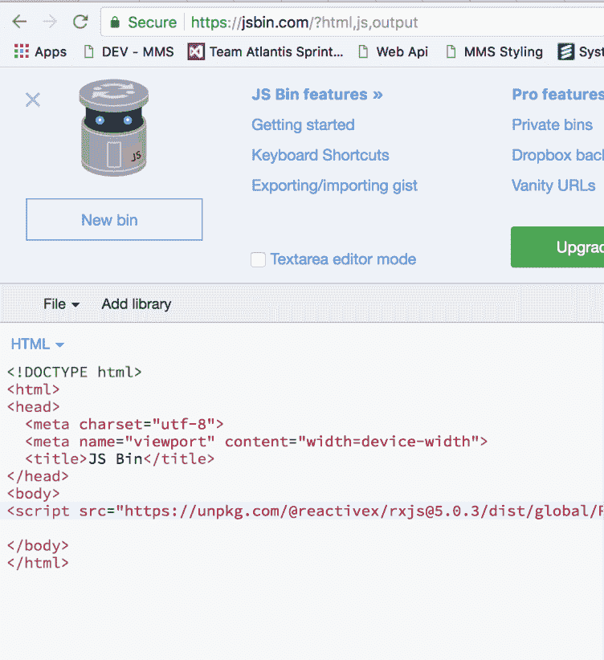
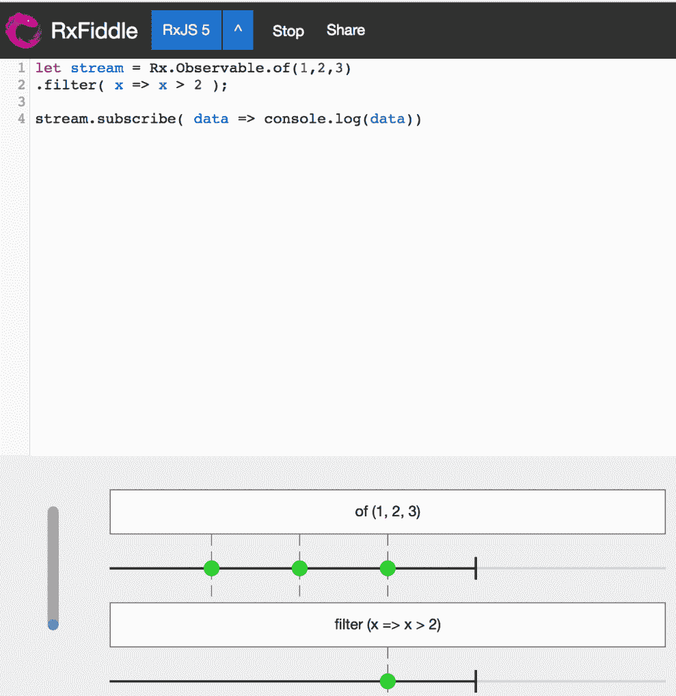
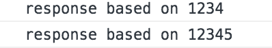

# 第七章：操纵流及其值

操作符是我们可以在流上调用的函数，以多种不同的方式执行操作。操作符是不可变的，这使得流易于推理，并且也很容易测试。正如你将在本章中看到的，我们很少处理一个流，而是处理许多流，理解如何塑造和控制这些流，让你能够从认为这是*黑魔法*转变为在需要时真正应用 RxJS。

在本章中，我们将涵盖：

+   如何使用基本操作符

+   使用操作符以及现有工具调试流

+   深入了解不同的操作符类别

+   以 Rx 的方式培养解决问题的思维方式

# 初始阶段

你几乎总是从创建一组静态值的 RxJS 开始编码。为什么要使用静态值？嗯，没有必要使它过于复杂，你真正需要开始推理的只是一个`Observable`。

然后你开始考虑你想达到什么目标。这让你考虑到你可能需要哪些操作符，以及你需要以哪种顺序应用它们。你可能还会思考如何划分你的问题；这通常意味着创建多个流，每个流解决一个与你尝试解决的更大问题相关的特定问题。

让我们从流创建开始，看看我们如何开始使用流的第一步。

以下代码创建一组静态值的流：

```ts
const staticValuesStream$ = Rx.Observable.of(1, 2, 3, 4);

staticValuesStream$.subscribe(data => console.log(data)); 
// emits 1, 2, 3, 4
```

这是一个非常基本的示例，展示了我们如何创建一个流。我们使用了 `of()` 创建操作符，它接受任意数量的参数。只要有订阅者，所有参数都会一个接一个地被发射出来。在上述代码中，我们还通过调用`subscribe()`方法并传递一个以发射的值作为参数的函数来订阅`staticValuesStream$`。

让我们介绍一个操作符，`map()`，它像一个投影，允许你改变正在发射的值。在发射之前，`map()`操作符针对流中的每个值都会被调用。

你可以通过提供一个函数并进行投影来使用`map()`操作符：

```ts
const staticValuesStream$ = 
Rx.Observable
  .of(1, 2, 3, 4)
  .map(data => data + 1); 

staticValuesStream$.subscribe(data => console.log(data))
// emits 2, 3, 4, 5
```

在上述代码中，我们已将`map()`操作符追加到`staticValuesStream$`上，并在发射每个值之前应用它，并将其递增一个。因此，生成的数据已经发生改变。这就是如何将操作符追加到流中的：简单地创建流，或者获取现有的流，并逐个追加操作符。

让我们再添加另一个运算符 `filter()`，以确保我们真正理解如何使用运算符。`filter()` 做什么？嗯，就像 `map()` 运算符一样，它被应用于每个值，但不是创建一个投影，而是决定哪些值将被发出。 `filter()` 接受一个布尔值。任何评估为 `true` 的表达式意味着该值将被发出；如果为 `false`，该表达式将不会被发出。

您可以如下使用 `filter()` 运算符：

```ts
const staticValuesStream$ = 
Rx.Observable
  .of(1, 2, 3, 4)
  .map(data => data + 1)
  .filter(data => data % 2 === 0 ); 

staticValuesStream$.subscribe(data => console.log(data));
// emits 2, 4
```

我们将 `filter()` 运算符添加到现有的 `map()` 运算符中。我们给 `filter()` 运算符的条件是只返回能被 `2` 整除的 `true` 值，这就是模运算符的功能。我们知道，仅有 `map()` 运算符本身可以确保值 `2`、`3`、`4` 和 `5` 被发出。这些值现在正在被 `filter()` 运算符评估。在这四个值中，只有 `2` 和 `4` 符合 `filter()` 运算符设定的条件。

当在流上工作并应用运算符时，事情可能并不总是像前面的代码那样简单。也许无法准确预测哪些内容被发出。针对这些场合，我们有一些可以使用的技巧。其中之一是使用 `do()` 运算符，它将允许我们检查每个值而不更改它。这为我们提供了充分的机会将其用于调试目的。根据我们在流中所处的位置，`do()` 运算符将输出不同的值。让我们看看应用 `do()` 运算符的地方很重要的不同情况：

```ts
const staticValuesStream$ = 
Rx.Observable.of(1, 2, 3, 4)
  .do(data => console.log(data)) // 1, 2, 3, 4 
  .map(data => data + 1)
  .do(data => console.log(data)) // 2, 3, 4, 5
  .filter(data => data % 2 === 0 )
  .do(data => console.log(data)); // 2, 4 

// emits 2, 4
staticValuesStream$.subscribe(data => console.log(data))
```

通过使用 `do()` 运算符，您可以看到，当我们的流变得越来越复杂时，我们有一种很好的方式来调试我们的流。

# 理解运算符

到目前为止，我们展示了如何创建一个流并在其上使用一些非常基本的运算符来更改发出的值。我们还介绍了如何使用 `do()` 运算符来检查您的流而不更改它。并不是所有运算符都像 `map()`、`filter()` 和 `do()` 运算符那样容易理解。有不同的策略可以尝试理解每个运算符的功能，以便知道何时使用它们。使用 `do()` 运算符是一种方法，但您还可以采取图形方法。这种方法被称为大理石图。它由表示时间从左向右流逝的箭头组成。在这个箭头上有圆圈或大理石，代表已发出的值。大理石上有一个值，但大理石之间的距离也可以描述随时间发生的情况。大理石图通常由至少两个带有大理石的箭头组成，以及一个运算符。其目的是表示在应用运算符时流发生了什么。第二个箭头通常代表产生的流。

这是一个示例的大理石图：


RxJS 中的大多数操作符都在 RxMarbles 网站上通过弹图表进行描述：[`rxmarbles.com/`](http://rxmarbles.com/)。这是一个快速理解操作符作用的绝妙资源。然而，要真正理解 RxJS，你需要编写代码；这个绕不过去。当然可以用不同的方法。你可以轻松地搭建自己的项目，并从 NPM 安装 RxJS，通过 CDN 链接引用它，或者使用类似 JS Bin（[www.jsbin.com](http://www.jsbin.com)）这样的页面，可以方便地将 RxJS 作为库添加，并立即开始编写代码。效果看起来有点像这样：



JS Bin 让启动变得容易，但如果我们可以将拱形图表和 JS Bin 结合起来，当你编写代码时得到代码的图形表示这岂不是很棒？通过 RxFiddle，你可以做到这一点：[`rxfiddle.net/`](http://rxfiddle.net/)。你可以输入代码，点击运行，就会显示你刚刚编写的拱形图表，看起来是这样的：



# 流中的流

我们一直在研究改变被发出的值的不同操作符。流的另一个不同方面是：如果你需要从现有流中创建新流怎么办？这种情况通常会发生在什么时候？有很多情况，比如：

+   基于一个键盘按键弹起事件的流，进行 AJAX 调用。

+   统计点击次数，并确定用户是否单击、双击或三击。

你明白了吧；我们开始于一种类型的流，需要转换成另一种类型的流。

让我们先来看看创建一个流，并观察使用操作符创建流的结果时会发生什么：

```ts
let stream$ = Rx.Observable.of(1,2,3)
  .map(data => Rx.Observable.of(data));

// Observable, Observable, Observable
stream$.subscribe(data => console.log(data));
```

此时，通过`map()`操作符传递的每个值都会产生一个新的`Observable`。当你订阅`stream$`时，每个发出的值都将是一个流。你的第一反应可能是对每个值附加一个`subscribe()`，像这样：

```ts
let stream$ = Rx.Observable
  .of(1,2,3)
  .map(data => Rx.Observable.of(data))

stream$.subscribe(data => {
  data.subscribe(val => console.log(val))
});

// 1, 2, 3
```

抵制这种冲动。这样只会创建难以维护的代码。你想要的是将所有这些流合并成一个，这样你只需要一个`subscribe()`。这里有一个专门用于此目的的操作符，叫做`flatMap()`。`flatMap()`的作用是将你的一系列流转换成一个流，一个元流。

它的使用方式如下：

```ts
let stream$ = Rx.Observable.of(1,2,3)
  .flatMap(data => Rx.Observable.of(data))

stream$.subscribe(data => {
  console.log(val);
});

// 1, 2, 3
```

好吧，我们明白了，我们不想要一系列的 Observables，而是要一系列的值。这个操作符看起来确实很棒。但我们仍不太确定何时使用。让我们使这更具体一点。想象一下，你有一个界面由一个输入字段组成。用户在那个输入字段中输入字符。假设你想要对输入一个或多个字符做出反应，并且，例如，根据输入的字符执行一个 AJAX 请求的结果。我们在这里关注两件事：如何收集输入的字符，以及如何执行 AJAX 请求。

让我们从第一件事开始，捕捉输入字段中输入的字符。为此，我们需要一个 HTML 页面和一个 JavaScript 页面。让我们从 HTML 页面开始：

```ts
<html>
  <body>
    <input id="input" type="text">
    <script src="img/Rx.min.js"></script>
    <script src="img/app.js"></script>
  </body>
</html>

```

这描述了我们的输入元素和对 RxJS 的脚本引用，以及对`app.js`文件的引用。然后我们有`app.js`文件，在这里我们获取输入元素的引用，并开始监听一旦它们输入的按键：

```ts
let elem = document.getElementById('input');
let keyStream$ = Rx.Observable
  .fromEvent(elem, 'keyup')
  .map( ev => ev.key);

keyStream$.subscribe( key => console.log(key));

// emits entered key chars
```

值得强调的是，我们开始监听通过调用`fromEvent()`创建操作符发出的`keyup`事件。然后，我们应用`map()`操作符来提取存储在`ev.key`上的字符值。最后，我们订阅这个流。预期地，运行这段代码将导致字符在 HTML 页面输入值后立即在控制台中键入。

让我们通过所输入的内容来做一个基于 AJAX 请求更具体些。为此，我们将使用`fetch()`API 和名为 swapi（swapi.com）的在线 API，其中包含了有关星球大战电影信息的一系列 API。首先定义我们的 AJAX 调用，然后看看它如何适应我们现有的按键流。

我们说我们将使用`fetch()`。它让我们可以简单地构建一个 GET 请求如下所示：

```ts
fetch('https://swapi.co/api/people/1')
  .then(data => data.json())
  .then(data => console.log('data', data));
```

当然，我们希望将这个请求转换成一个`Observable`，这样它就可以很好地与我们的`keyStream$`配合使用。幸运的是，通过使用`from()`操作符，我们很容易就可以做到这一点。然而，首先让我们将我们的`fetch()`调用重写成一个更容易使用的方法。重写的结果如下：

```ts
function getStarwarsCharacterStream(id) {
  return fetch('https://swapi.co/api/people/' + id)
    .then(data => data.json());
}

```

这段代码允许我们提供一个用于构建 URL 的参数，然后我们可以使用它来进行 AJAX 请求获取一些数据。在这一点上，我们准备将我们的函数连接到我们现有的流。我们通过输入以下内容来做到这一点：

```ts
let keyStream$ = Rx.Observable.fromEvent(elem, 'keyup')
  .map(ev => ev.key)
  .filter(key => key !== 'Backspace')
 .flatMap( key =>
    Rx.Observable
      .from(getStarwarsCharacterStream(key))
  );

```

我们用粗体突出了`flatmap()`操作符的使用，使用了我们的`from()`转换操作符。最后提到的操作符将我们的`getStarwarsCharacterStream()`函数作为参数。`from()`操作符将该函数转换为一个流。

在这里，我们学会了如何连接两个不同的流，同时也学会了如何将`Promise`转换成一个流。尽管这种方法在纸上看起来很不错，但使用`flatMap()`是有局限性的，重要的是要理解它们是什么。因此，让我们讨论下一个`switchMap()`操作符。当我们执行长时间运行的任务时，使用`switchMap()`操作符的好处将变得更加明显。为了论证起见，让我们定义这样一个任务，如下所示：

```ts
function longRunningTask(input) {
  return new Promise(resolve => {
    setTimeout(() => {
      resolve('response based on ' + input);
    }, 5000);
  });
}
```

在这段代码中，我们有一个需要 5 秒才能执行完的函数；足够长的时间来展示我们想要说明的问题。接下来，让我们看看在以下代码中继续使用`flatMap()`操作符会有什么影响：

```ts
let longRunningStream$ = keyStream$
  .map(ev => ev.key)
  .filter(key => elem.value.length >3)
  .filter( key => key !== 'Backspace')
  .flatMap( key =>
    Rx.Observable
      .from(longRunningTask(elem.value))
  );

longRunningStream$.subscribe(data => console.log(data));
```

前面的代码工作方式是：每次敲击键盘都会生成一个事件。然而，我们放置了一个`.filter()`操作符来确保只有在输入至少四个键后才会生成一个事件，`filter(key => elem.value.length >3)`。现在让我们来谈谈用户此时的期望。如果用户在输入控件中输入字符，他们很可能希望在输入完成时进行请求。用户将“完成”定义为输入一些字符，并且应该能够在输入错误时删除字符。因此，我们可以假设以下输入序列：

```ts
// enters abcde
abcde
// removes 'e'
```

此时，他们已经输入了字符，并且，在一个合理的时间内，编辑了他们的答案。用户期望基于`abcd`接收到一个答案。然而使用`flatMap()`操作符意味着用户将会收到两个答案，因为实际上他们输入了`abcde`和`abcd`。想象一下根据这两个输入得到一个结果列表；很可能会是两个看起来有些不同的列表。根据我们的代码得到的响应如下：



我们的代码很可能能够处理描述的情况，即在新响应到达时立即重新渲染结果列表。但是这样做有两个问题：首先，我们对`abcde`进行了不必要的网络请求；其次，如果后端响应速度足够快，我们将在 UI 中看到闪烁，因为结果列表首先被渲染一次，然后不久之后基于第二个响应再次被渲染。这并不好，我们希望出现这样的情况：一直输入时第一个请求将被放弃。这就是`switchMap()`操作符的用处，它确实可以做到这一点。因此，让我们修改前面的代码如下：

```ts
let longRunningStream$ = keyStream$
  .map(ev => ev.key)
  .filter(key => elem.value.length >3)
  .filter( key => key !== 'Backspace')
  .switchMap( key =>
    Rx.Observable
    .from(longRunningTask(elem.value))
  );
```

在这段代码中，我们简单地将我们的`flatMap()`切换到了`switchMap()`。当我们以完全相同的方式执行代码，也就是，用户首先输入`12345`，然后很快将其改为`1234`时，最终结果是：


正如我们所看到的，我们只收到了一个请求。原因是当新事件发生时，前一个事件被中止了——`switchMap()`发挥了它的魔力。用户很高兴，我们也很满意。

# AJAX

我们已经提及了如何进行 AJAX 请求的话题。有许多方式可以进行 AJAX 请求；最常见的两种方法是：

+   使用 fetch API；fetch API 是 Web 标准，因此内置在大多数浏览器中

+   使用`ajax()`方法，现在内置到 RxJS 库中；它曾经存在于一个名为 Rx.Dom 的库中

# fetch()

`fetch()`API 是一种 Web 标准。你可以在以下链接找到官方文档：[`developer.mozilla.org/en-US/docs/Web/API/Fetch_API`](https://developer.mozilla.org/en-US/docs/Web/API/Fetch_API)。`fetch()`API 是基于`Promise`的，这意味着我们需要在使用之前将其转换为`Observable`。该 API 公开了一个`fetch()`方法，该方法将 URL 作为第一个参数传入，第二个参数是一个可选对象，允许您控制要发送什么主体，如果有的话，要使用哪个 HTTP 动词等等。

我们已经提到了如何在 RxJS 的上下文中最好地处理它。但值得再次重申一下。然而，把我们的 fetch 放入`from()`操作符并不像简单。让我们写一些代码看看为什么：

```ts
let convertedStream$ = 
Rx.Observable.from(fetch('some url'));

convertedStream$.subscribe(data => 'my data?', data);
```

我们得到了我们的数据对吧？抱歉，不对，我们得到了一个`Response`对象。但这很简单，只需在`map()`操作符中调用`json()`方法，那么我们就有了我们的数据？再次抱歉，不对，当你键入以下内容时，`json()`方法会返回一个`Promise`：

```ts
let convertedStream$ = Rx.Observable.from(fetch('some url'))
  .map( r=> r.json());

// returns PromiseObservable
convertedStream$.subscribe(data => 'my data?', data);
```

在前一节中，我们已经展示了一种可能的解决方案，即以下结构：

```ts
getData() {
  return fetch('some url')
    .then(r => r.json());
}

let convertedStream$ = Rx.Observable.from(getData());
convertedStream$.subscribe(data => console.log('data', data));
```

在这段代码中，我们只是简单地处理了将数据从`from()`操作符传递出来之前挖掘出来的工作。用 Promise 玩耍并不太像 RxJS。你可以采取更多基于流的方法；我们几乎就快到达目的地了，我们只需要做一个小调整：

```ts
let convertedStream$ = Rx.Observable.from(fetch('some url'))
  .flatMap( r => Rx.Observable.from(r.json()));

// returns data
convertedStream$.subscribe(data => console.log('data'), data);
```

就是这样：我们的`fetch()`调用现在提供了像流一样的数据。那我们做了什么呢？我们将我们的`map()`调用更改为`flatMap()`调用。原因是当我们调用`r.json()`时，我们得到了一个`Promise`。我们通过将其包装在`from()`调用中`Rx.Observable.from(r.json())`解决了这个问题。这将使流发出一个`PromiseObservable`，除非我们从`map()`改为`flatMap()`。正如我们在前一节中学到的，如果我们冒着在流内部创建一个流的风险，我们需要`flatMap()`来拯救我们，而它也确实做到了。

# ajax()操作符

与基于`Promise`的`fetch()`API 不同，`ajax()`方法实际上是基于`Observable`的，这让我们的工作变得有点更容易。使用它非常简单，就像这样：

```ts
Rx.Observable
  .ajax('https://swapi.co/api/people/1')
  .map(r => r.response)
  .subscribe(data => console.log('from ajax()', data));
```

如我们所见，前面的代码调用`ajax()`操作符，并将 URL 作为参数。值得一提的是调用`map()`操作符，它从`response`属性中挖出我们的数据。因为它是一个`Observable`，我们只需像往常一样调用`subscribe()`方法并提供监听函数作为参数来订阅它。

这涵盖的是在你想要使用 HTTP 动词`GET`获取数据的简单情况。幸运的是，我们可以很容易地通过使用`ajax()`的重载版本来创建、更新或删除数据，这个版本接受一个`AjaxRequest`对象实例，其中包括以下字段：

```ts
url?: string;
body?: any;
user?: string;
async?: boolean;
method?: string;
headers?: Object;
timeout?: number;
password?: string;
hasContent?: boolean;
crossDomain?: boolean;
withCredentials?: boolean;
createXHR?: () => XMLHttpRequest;
progressSubscriber?: Subscriber<any>;
responseType?: string;
```

这个对象规范中所列的所有字段都是可选的，并且我们可以通过请求配置相当多的内容，比如`headers`、`timeout`、`user`、`crossDomain`，等等；基本上，这就是我们对一个很好的 AJAX 包装功能所期望的。 除了重载的`ajax()`操作符外，还存在一些简化选项：

+   `get()`: 使用`GET`动词获取数据

+   `put()`: 使用`PUT`动词更新数据

+   `post()`: 使用`POST`动词创建数据

+   `patch()`: 使用`PATCH`动词的想法是更新一个部分资源

+   `delete()`: 使用`DELETE`动词删除数据

+   `getJSON()`: 使用`GET`动词获取数据，并将响应类型设置为`application/json`

# 级联调用

到目前为止，我们已经覆盖了你将使用 AJAX 发送或接收数据的两种主要方法。当涉及到接收数据时，通常是不能简单地获取数据并渲染它的。事实上，你很可能需要在何时获取哪些数据上有依赖。 典型的例子是需要在获取剩余数据之前执行登录调用。在某些情况下，可能需要首先登录，然后获取已登录用户的数据，一旦你获得了这些数据，你就可以获取消息、订单或任何特定于某个用户的数据。这种以这种方式获取数据的整个现象被称为级联调用。

让我们看看我们如何使用 promise 进行级联调用，并逐渐学习如何在 RxJS 中做同样的事情。我们会做这个小的跳跃，因为我们假设大部分正在读这本书的人都对 promise 很熟悉。

让我们首先看一下我们之前提到的依赖情况，我们需要按照这个顺序执行以下步骤：

1.  用户首先登录到系统

1.  然后我们获取用户的信息

1.  然后我们获取用户订单的信息

使用 promise，代码看起来应该像这样：

```ts
// cascading/cascading-promises.js

login()
  .then(getUser)
  .then(getOrders);

// we collect username and password from a form
const login = (username, password) => {
  return fetch("/login", {
    method: "POST",
    body: { username, password }
  })
  .then(r => r.json())
  .then(token => {
    localStorage.setItem("auth", token);
  });
};

const getUser = () => {
  return fetch("/users", {
    headers: {
      Authorization: "Bearer " + localStorage.getToken("auth")
    }
  }).then(r => r.json());
};

const getOrders = user => {
  return fetch(`/orders/user/${user.id}`, {
    headers: {
      Authorization: "Bearer " + localStorage.getToken("auth")
    }
  }).then(r => r.json());
};
```

这段代码描述了我们如何首先调用`login()`方法登录系统，并获得一个 token。我们在未来的任何调用中都使用这个 token 来确保我们进行了经过身份验证的调用。然后我们看到我们如何执行`getUser()`调用并获得一个用户实例。我们使用相同的用户实例来执行我们的最后一个调用，`getOrders()`，其中用户 ID 被用作路由参数：``/orders/user/${user.id}``。

我们已经展示了如何使用 promises 执行级联调用；我们这样做是为了建立我们正在尝试解决的问题的一个共同基础。RxJS 的方法非常相似：我们已经展示了`ajax()`操作符的存在，并且在处理 AJAX 调用时让我们的生活更轻松。要使用 RxJS 实现级联调用效果，我们只需要使用`switchMap()`操作符。这将使我们的代码看起来像这样：

```ts
// cascading/cascading-rxjs.js

let user = "user";
let password = "password";

login(user, password)
  .switchMap(getUser)
  .switchMap(getOrders);

// we collect username and password from a form
const login = (username, password) => {
  return Rx.Observable.ajax("/login", {
    method: "POST",
    body: { username, password }
  })
  .map(r => r.response)
  .do(token => {
    localStorage.setItem("auth", token);
  });
};

const getUser = () => {
  return Rx.Observable.ajax("/users", {
    headers: {
      Authorization: "Bearer " + localStorage.getToken("auth")
    }
  }).map(r => r.response);
};

const getOrders = user => {
  return Rx.Observable.json(`/orders/user/${user.id}`, {
    headers: {
      Authorization: "Bearer " + localStorage.getToken("auth")
    }
  }).map(r => r.response);
};
```

我们在上述代码中需要更改的部分已用高亮标出。简而言之，更改如下：

+   `fetch()`被`ajax()`操作符替换

+   我们调用`.map(r => r.response)`而不是`.then(r => r.json())`

+   对于每个级联调用，我们使用`.switchMap()`而不是`.then(getOrders)`

还有一个有趣的方面需要我们来讨论，即并行调用。当我们获取用户和订单时，我们在启动下一个调用之前等待前一个调用完全完成。在许多情况下，这可能并不是严格必需的。想象一下，我们有一个与前一个类似的情况，但是围绕用户有很多有趣的信息我们想要获取。除了仅仅获取订单之外，用户可能有一系列朋友或消息。获取这些数据的前提条件只是我们获取了用户，因此我们知道应该查询哪些朋友和我们需要哪些消息。在 Promise 世界中，我们会使用`Promise.all()`构造来实现并行化。有了这个想法，我们更新我们的`Promise`代码如下：

```ts
// parallell/parallell-promise.js

// we collect username and password from a form
login(username, password) {
  return new Promise(resolve => {
    resolve('logged in');
  });
}

getUsersData(user) {
  return Promise.all([
    getOrders(user),
    getMessages(user),
    getFriends(user) 
    // not implemented but you get the idea, another call in parallell
  ])
}

getUser() {
  // same as before
}

getOrders(user) {
  // same as before
}

login()
  .then(getUser)
  .then(getUsersData);
```

如我们从上面代码中看到的，我们引入了新的`getUsersData()`方法，它并行获取订单、消息和朋友集合，这样可以使我们的应用程序更早地响应，因为数据将会比我们依次获取它们时更早到达。

通过引入`forkJoin()`操作符，我们可以很容易地在 RxJS 中实现相同的效果。它接受一个流的列表，并并行获取所有内容。因此，我们更新我们的 RxJS 代码如下：

```ts
// parallell/parallell-rxjs.js

import Rx from 'rxjs/Rx';
// imagine we collected these from a form
let user = 'user';
let password = 'password';

login(user, password)
  .switchMap(getUser)
  .switchMap(getUsersData)

// we collect username and password from a form
login(username, password) {
  // same as before
}

getUsersData(user) {
  return Rx.Observable.forkJoin([
    getOrders(),
    getMessages(),
    getFriends()
  ])
}

getUser() {
  // same as before
}

getOrders(user) {
  // same as before
}

login()
  .then(getUser)
  .then(getUsersData);
```

# 深入了解

到目前为止，我们已经看过了一些操作符，让你可以创建流或者用`map()`和`filter()`操作符改变流，我们已经学会了如何管理不同的 AJAX 场景等等。基础知识都在这里，但我们还没有以一种结构化的方式来接触操作符这个主题。我们的意思是什么？嗯，操作符可以被认为属于不同的类别。我们可以使用的操作符数量令人震惊地超过 60 个。如果我们有幸可以学会所有这些操作符，这将需要时间。不过这里有个问题：我们只需要知道存在哪些不同类型的操作符，以便我们可以在适当的地方应用它们。这样可以减少我们的认知负担和我们的记忆负担。一旦我们知道我们有哪些类别，我们只需要深入研究，很可能我们最终只会知道总共 10-15 个操作符，其余的我们需要它们时再查阅即可。

目前，我们有以下几种类别：

+   **创建操作符**：这些操作符帮助我们首先创建流。几乎任何东西都可以通过这些操作符转换为一个流。

+   **组合操作符**：这些操作符帮助我们结合值和流。

+   **数学操作符**：这些操作符对发出的值进行数学计算。

+   **基于时间的操作符**：这些操作符改变值发出的速度。

+   **分组操作符**：这些操作符的概念是对一组值进行操作，而不是单个值。

# 创建操作符

我们使用创建操作符来创建流本身，因为让我们面对现实：我们需要转换为流的东西并不总是流，但通过将其转换为流，它将不得不与其他流友好相处，并且最重要的是，将能够充分利用使用操作符的全部功能来发挥其全部潜力。

那么，这些其他非流由什么组成呢？嗯，它们可以是任何异步或同步的东西。重要的是它是需要在某个时刻发出的数据。因此，存在一系列的创建操作符。在接下来的子章节中，我们将介绍其中的一部分，足够让您意识到将任何东西转换为流的强大功能。

# of() 操作符

我们已经有几次使用了这个操作符。它接受未知数量的逗号分隔参数，可以是整数、字符串或对象。如果您只想发出一组有限的值，那么这是一个您想要使用的操作符。要使用它，只需键入：

```ts
// creation-operators/of.js

const numberStream$ = Rx.Observable.of(1,2, 3);
const objectStream$ = Rx.Observable.of({ age: 37 }, { name: "chris" });

// emits 1 2 3
numberStream$.subscribe(data => console.log(data));

// emits { age: 37 }, { name: 'chris' }
objectStream$.subscribe(data => console.log(data));
```

从代码中可以看出，我们在`of()`操作符中放置了什么并不重要，它总是能够发出它。

# from() 操作符

该操作符可以接受数组或`Promise`作为输入，并将它们转换为流。要使用它，只需像这样调用它：

```ts
// creation-operators/from.js

const promiseStream$ = Rx.Observable.from(
  new Promise(resolve => setTimeout(() => resolve("data"),3000))
);

const arrayStream$ = Rx.Observable.from([1, 2, 3, 4]);

promiseStream$.subscribe(data => console.log("data", data));
// emits data after 3 seconds

arrayStream$.subscribe(data => console.log(data));
// emits 1, 2, 3, 4
```

这样一来，我们就不必处理不同类型的异步调用，从而省去了很多麻烦。

# range() 操作符

该操作符允许您指定一个范围，一个起始数和一个结束数。这是一个快捷方式，可以快速让您创建一个具有一定范围的数值流。要使用它，只需键入：

```ts
// creation-operators/range.js

const stream$ = Rx.Observable.range(1,99);

stream$.subscribe(data => console.log(data));
// emits 1... 99 
```

# fromEvent() 操作符

现在变得非常有趣了。`fromEvent()`操作符允许我们混合 UI 事件，比如`click`或`scroll`事件，并将其转换为一个流。到目前为止，我们认为异步调用只与 AJAX 调用有关。这个想法完全不正确。我们可以将 UI 事件与任何类型的异步调用混合，这创造了一个非常有趣的情况，使我们能够编写非常强大、表现力强的代码。我们将在接下来的章节中进一步讨论这个话题，*以流思考*。

要使用此操作符，您需要为它提供两个参数：一个 DOM 元素和事件的名称，如下所示：

```ts
// creation-operators/fromEvent.js

// we imagine we have an element in our DOM looking like this <input id="id" />
const elem = document.getElementById("input");
const eventStream$ = Rx.Observable
  .fromEvent(elem, "click")
  .map(ev => ev.key);

// outputs the typed key
eventStream$.subscribe(data => console.log(data));
```

# 组合

组合操作符是用于组合来自不同流的值。我们有几个可供使用的操作符可以帮助我们。当我们因某种原因没有所有数据在一个地方，但需要从多个地方获取时，这种类型的操作符是有意义的。如果不是因为即将描述的强大操作符，从不同来源组合数据结构可能是费时且容易出错的工作。

# merge()操作符

`merge()`操作符从不同的流中获取数据并将其组合。然而，这些流可以是任何类型的，只要它们是`Observable`类型。这意味着我们可以从定时操作、Promise、`of()`操作符中获取的静态数据等结合数据。合并的作用是交替发出数据。这意味着它将在以下示例中同时从两个流中发出。该操作符有两种用法，作为静态方法，也可以作为实例方法：

```ts
// combination/merge.js

let promiseStream = Rx.Observable
.from(new Promise(resolve => resolve("data")))

let stream = Rx.Observable.interval(500).take(3);
let stream2 = Rx.Observable.interval(500).take(5);

// instance method version of merge(), emits 0,0, 1,1 2,2 3, 4
stream.merge(stream2)
  .subscribe(data => console.log("merged", data));

// static version of merge(), emits 0,0, 1,1, 2, 2, 3, 4 and 'data'
Rx.Observable.merge(
  stream,
  stream2,
  promiseStream
)
.subscribe(data => console.log("merged static", data));
```

这里的要点是，如果你只需要将一个流与另一个流结合，那么使用此操作符的实例方法版本，但如果你有多个流，则使用静态版本。此外，指定流的顺序是重要的。

# combineLatest()

想象一下你面临的情况是，你已经与几个端点建立了连接，并且这些端点为你提供了数据。你关心的是每个端点最新发出的数据。也许有一个或多个端点在一段时间后停止发送数据，而你想知道最后发生的事情是什么。在这种情况下，我们希望能够结合所有相关端点的最新值的能力。这就是`combineLatest()`操作符发挥作用的地方。你可以在以下方式使用它：

```ts
// combination/combineLatest.js

let firstStream$ = Rx.Observable
  .interval(500)
  .take(3);

let secondStream$ = Rx.Observable
  .interval(500)
  .take(5);

let combinedStream$ = Rx.Observable.combineLatest(
  firstStream$,
  secondStream$
)

// emits [0, 0] [1,1] [2,2] [2,3] [2,4] [2,5]
combinedStream$.subscribe(data => console.log(data));
```

我们在这里看到的是`firstStream$`在一段时间后因为`take()`操作符的限制发出的值停止了。然而，`combineLatest()`操作符确保我们仍然获得了`firstStream$`发出的最后一个值。

# zip()

这个操作符的作用是尽可能多地将值拼接在一起。我们可能会处理连续的流，但也可能会处理具有发射值限制的流。你可以在以下方式使用该操作符：

```ts
// combination/zip.js

let stream$ = Rx.Observable.of(1, 2, 3, 4);
let secondStream$ = Rx.Observable.of(5, 6, 7, 8);
let thirdStream$ = Rx.Observable.of(9, 10); 

let zippedStream$ = Rx.Observable.zip(
  stream$,
  secondStream$,
  thirdStream$
)

// [1, 5, 9] [2, 6, 10]
zippedStream$.subscribe(data => console.log(data))
```

如我们所看到的，这里我们在垂直方向上将值拼接在一起，并且取最少发射值的`thirdStream$`是最短的，计算发出的值的数量。这意味着我们将从左到右取值并将它们合并在一起。由于`thirdStream$`只有两个值，我们最终只得到了两个发射。

# concat()

乍一看，`concat()`操作符看起来像是另一个`merge()`操作符，但这并不完全正确。区别在于`concat()`会等待其他流完成后才从顺序中的下一个流中发出流。你如何安排你的流在调用`concat()`中很重要。该操作符的使用方式如下：

```ts
// combination/concat.js

let firstStream$ = Rx.Observable.of(1,2,3,4);
let secondStream$ = Rx.Observable.of(5,6,7,8);

let concatStream$ = Rx.Observable.concat(
  firstStream$,
  secondStream$
);

concatStream$.subscribe(data => console.log(data));
```

# 数学

数学操作符只是在值上执行数学操作的操作符，比如找到最大或最小值，汇总所有值等。

# 最大值

`max()` 操作符用于找到最大值。它有两种用法：一种是直接调用`max()` 操作符，不带参数；另一种是给它传递一个`compare`函数。`compare`函数决定某个值是大于、小于还是等于被发出的值。让我们看看这两种不同的版本：

```ts
// mathematical/max.js

let streamWithNumbers$ = Rx.Observable
  .of(1,2,3,4)
  .max();

// 4
streamWithNumbers$.subscribe(data => console.log(data)); 

function comparePeople(firstPerson, secondPerson) {
  if (firstPerson.age > secondPerson.age) {
    return 1; 
  } else if (firstPerson.age < secondPerson.age) {
    return -1;
  } 
  return 0;
}

let streamOfObjects$ = Rx.Observable
  .of({
    name : "Yoda",
    age: 999
  }, {
    name : "Chris",
    age: 38 
  })
  .max(comparePeople);

// { name: 'Yoda', age : 999 }
streamOfObjects$.subscribe(data => console.log(data));
```

如我们在上面的代码中所见，我们得到了一个结果，它是最大的一个。

# 最小值

`min()` 操作符与 `max()` 操作符基本相反；也有两种用法：带参数和不带参数。它的任务是找到最小值。使用方法如下：

```ts
// mathematical/min.js

let streamOfValues$ = Rx.Observable
  .of(1, 2, 3, 4)
  .min();

// emits 1
streamOfValues$.subscribe(data => console.log(data));

```

# 总和

以前有一个叫做 `sum()` 的操作符，但已经在多个版本中删除了。现在用的是 `.reduce()` 。使用 `reduce()` 操作符，我们可以很容易地实现相同的功能。下面是使用 `reduce()` 编写 `sum()` 操作符的方式：

```ts
// mathematical/sum.js

let stream = Rx.Observable.of(1, 2, 3, 4)
  .reduce((acc, curr) => acc + curr);

// emits 10
stream.subscribe(data => console.log(data));
```

这个操作是遍历所有的发出值并将结果相加。所以，本质上，它将所有值相加。当然，这种操作符不仅可以应用于数字，还可以应用于对象。不同之处在于如何执行 `reduce()` 操作。下面的例子涵盖了这样的场景：

```ts
let stream = Rx.Observable.of({ name : "chris" }, { age: 38 })
  .reduce((acc, curr) => Object.assign({},acc, curr));

// { name: 'chris', age: 38 }
stream.subscribe(data => console.log(data)); 
```

如你从前面的代码中所见，`reduce()` 操作符确保所有对象的属性都被合并到一个对象中。

# 时间

时间在讨论流时是一个非常重要的概念。想象一下，你有多个有不同带宽的流，或者一个流比另一个流快，或者你有想在特定时间间隔内重试一个 AJAX 调用的场景。在所有这些情况下，我们需要控制数据发出的速度，时间在所有这些情况下都起着重要的作用。我们有一大堆的操作符，像魔术师一样，让我们能够随心所欲地制定和控制我们的值。

# 时间间隔（interval()）操作符

在 JavaScript 中，有一个 `setInterval()` 函数，它可以让你以固定的时间间隔执行代码，直到你选择停止它。RxJS 有一个行为类似的操作符，就是 `interval()` 操作符。它需要一个参数：通常是发出值之间的毫秒数。使用方法如下：

```ts
// time/interval.js

let stream$ = Rx.Observable.interval(1000);

// emits 0, 1, 2, 3 ... n with 1 second in between emits, till the end of time
stream$.subscribe(data => console.log(data));
```

需要注意的是，该操作符将一直发出值，直到你停止它。最好的方法是将其与 `take()` 操作符组合使用。 `take()` 操作符需要一个参数，指定在停止之前它要发出多少个值。更新后的代码如下：

```ts
// time/interval-take.js

let stream$ = Rx.Observable.interval(1000)
  .take(2);

// emits 0, 1, stops emitting thanks to take() operator
stream$.subscribe(data => console.log(data));
```

# 计时器（timer()）操作符

`timer()` 操作符的工作是在一定时间后发出值。它有两种形式：一种是在一定毫秒数后发出一个值，另一种是在它们之间有一定延迟的情况下继续发出值。让我们看看有哪两种不同的形式可用：

```ts
// time/timer.js

let stream$ = Rx.Observable.timer(1000);

// delay with 500 milliseconds
let streamWithDelay$ = Rx.Observable.timer(1000, 500) 

// emits 0 after 1000 milliseconds, then no more
stream$.subscribe(data => console.log(data));

streamWithDelay$.subscribe(data => console.log(data));
```

# delay() 操作符

`delay()` 操作符延迟所有被发出的值，并且使用以下方式：

```ts
// time/delay.js

let stream$ = Rx.Observable
.interval(100)
.take(3)
.delay(500);

// 0 after 600 ms, 1 after 1200 ms, 2 after 1800 ms
stream.subscribe(data => console.log(data));
```

# sampleTime() 操作符

`sampleTime()` 操作符用于在样本期过去后只发出值。这样做的一个很好的用例是当你想要有冷却功能时。想象一下，你有用户太频繁地按下保存按钮。保存可能需要几秒钟的时间才能完成。一种方法是在保存时禁用保存按钮。另一种有效的方法是简单地忽略按钮的任何按下，直到操作有机会完成。以下代码就是这样做的：

```ts
// time/sampleTime.js

let elem = document.getElementById("btn");
let stream$ = Rx.Observable
  .fromEvent(elem, "click")
  .sampleTime(8000);

// emits values every 8th second
stream$.subscribe(data => console.log("mouse clicks",data));

```

# debounceTime() 操作符

`sampleTime()` 操作符能够在一定时间内忽略用户，但 `debounceTime()` 操作符采取了不同的方式。数据防抖是一个概念，意味着我们在发出值之前等待事情平静下来。想象一下，用户输入的输入元素。用户最终会停止输入。我们想要确保用户实际上已经停止了，所以我们在实际执行操作前等待一段时间。这就是 `debounceTime()` 操作符为我们所做的。以下示例显示了我们如何监听用户在输入元素中输入，等待用户停止输入，最后执行 AJAX 调用：

```ts
// time/debounceTime.js
const elem = document.getElementById("input");

let stream$ = Rx.Observable.fromEvent(elem, "keyup")
  .map( ev => ev.key)
  .filter(key => key !== "Backspace")
  .debounceTime(2000)
  .switchMap( x => {
    return new Rx.Observable.ajax(`https://swapi.co/api/people/${elem.value}`);
  })
  .map(r => r.response);

stream$.subscribe(data => console.log(data));
```

用户输入数字后，在文本框中输入不活动 2 秒后，将进行一个 AJAX 呼叫，使用我们的文本框输入。

# 分组

分组操作符允许我们对收集到的一组事件进行操作，而不是一次发出一个事件。

# buffer() 操作符

`buffer()` 操作符的想法是我们可以收集一堆事件，而不会立即发出。操作符本身接受一个参数，一个定义何时停止收集事件的 `Observable`。在那个时刻，我们可以选择如何处理这些事件。以下是你可以使用这个操作符的方法：

```ts
// grouping/buffer.js

const elem = document.getElementById("input");

let keyStream$ = Rx.Observable.fromEvent(elem,"keyup");
let breakStream$ = keyStream$.debounceTime(2000);
let chatStream$ = keyStream$
  .map(ev => ev.key)
  .filter(key => key !== "Backspace")
  .buffer(breakStream$)
  .switchMap(newContent => Rx.Observable.of("send text as I type", newContent));

chatStream$.subscribe(data=> console.log(data));

```

这样做的作用是收集事件，直到出现了 2 秒的非活动时间。在那时，我们释放了所有缓冲的按键事件。当我们释放所有这些事件时，我们可以，例如，通过 AJAX 发送它们到某个地方。这在聊天应用程序中是一个典型的场景。使用上述代码，我们可以始终发送最新输入的字符。

# bufferTime() 操作符

与 `buffer()` 非常相似的一个操作符是 `bufferTime()`。这个操作符让我们指定要缓冲事件的时间长度。它比 `buffer()` 稍微不那么灵活，但仍然非常有用。

# 思考流

到目前为止，我们已经经历了一堆场景，向我们展示了我们可以支配哪些操作符，以及它们如何可以被连接。我们也看到了像 `flatMap()` 和 `switchMap()` 这样的操作符，在从一个类型的 Observable 到另一个类型时是如何改变事情的。那么，当使用 Observables 时，应该采取哪种方法？显然，我们需要使用操作符来表达算法，但我们应该从哪里开始呢？我们需要做的第一件事就是思考起点和终点。我们想要捕获哪些类型的事件，最终结果应该是什么样的？这已经给了我们一个提示，要进行多少次转换才能达到那个目标。如果我们只想要转换数据，那么我们可能只需要一个 `map()` 操作符和一个 `filter()` 操作符。如果我们想要从一个 `Observable` 转换到另一个 `Observable`，那么我们就需要一个 `flatMap()` 或 `switchMap()`。我们是否有特定的行为，比如等待用户停止输入？如果有的话，那么我们需要查看 `debounceTime()` 或类似的操作符。这和所有问题其实是一样的：把它分解，看看你有哪些部分，然后征服。不过，让我们尝试将这件事分解成一系列步骤：

+   输入是什么？UI 事件还是其他东西？

+   输出是什么？最终结果是什么？

+   鉴于第二条，我需要哪些转换才能达到目标？

+   我是否需要处理多个流？

+   我需要处理错误吗，如果需要，如何处理？

希望这让您了解如何思考流。记住，从小处开始，朝着目标努力。

# 总结

我们开始学习更多关于基本操作符的知识。在这样做的过程中，我们遇到了 `map()` 和 `filter()` 操作符，它们让我们能够控制发出的内容。了解 `do()` 操作符让我们有办法调试我们的流。此外，我们还了解了像 JS Bin 和 RxFiddle 这样的沙盒环境的存在，以及它们如何帮助我们快速开始使用 RxJS。AJAX 是我们之后深入了解的一个主题，并且我们建立了对可能发生的不同场景的理解。深入了解 RxJS，我们看了不同的操作符类别。虽然我们对其中的内容只是浅尚的涉猎，但这给了我们一个方法去学习库中有哪些类型的操作符。最后，我们通过思考流的方式来改变和发展我们的思维方式，来结束这一章。

这些所获得的知识使我们现在已经准备好进入下一章中更高级的 Rx 主题。我们知道了基础知识，现在是时候将它们掌握了。
