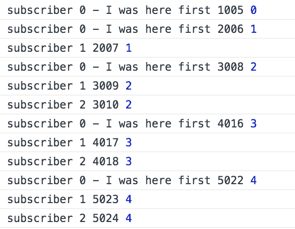
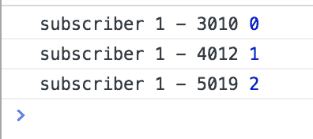
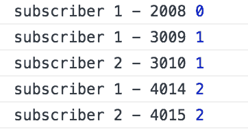
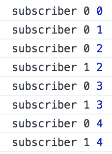
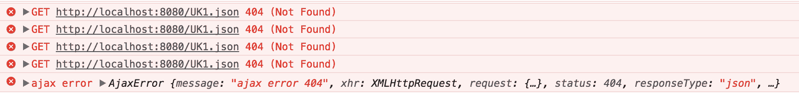

# 第八章：RxJS 高级

我们完成了上一章，更多地教会了我们存在哪些操作符以及如何有效利用它们。拥有了这些知识，我们现在将更深入地涉足这个主题。我们将从了解存在哪些各个部分，到真正理解 RxJS 的本质。了解 RxJS 的本质就意味着更多地了解其运作机制。为了揭示这一点，我们需要涵盖诸如热、温和和冷 Observables 之间的区别是什么；了解 Subjects 以及它们适用的场景；以及有时被忽视的调度器等主题。

我们还有其他与处理 Observables 相关的方面要讨论，即，如何处理错误以及如何测试你的 Observables。

在这一章中，你将学到：

+   热、冷和温和的 Observables

+   Subject：它们与 Observables 的区别以及何时使用它们

+   可管道的操作符，RxJS 库的最新添加，以及它们对组合 Observables 的影响

+   弹珠测试，有助于测试你的 Observables 的测试机制

# 热、冷和温和的 Observables

有热、冷和温和的 Observables。我们到底是什么意思呢？首先，让我们说你将处理的大多数事情都是冷 Observables。还是不明白？如果我们说冷 Observables 是懒惰的，这样有帮助吗？不？好吧，让我们先来谈谈 Promise。Promise 是热的。当我们执行它们的代码时，它们立刻就会执行。让我们来看一个例子：

```ts
// hot-cold-warm/promise.js

function getData() {
  return new Promise(resolve => {
    console.log("this will be printed straight away");
    setTimeout(() => resolve("some data"), 3000); 
  });
}

// emits 'some data' after 3 seconds
getData().then(data => console.log("3 seconds later", data));
```

如果你来自非 RxJS 背景，你可能在这一点上会想：好吧，是的，这是我预期的。尽管如此，我们要说明的是：调用 `getData()` 会使你的代码立即运行。这与 RxJS 不同，因为类似的 RxJS 代码实际上不会运行，直到有一个关心结果的监听器/订阅者。RxJS 回答了一个古老的哲学问题：如果有人不在那里听，树在森林中倒下时会不会发出声音？在 Promise 的情况下，会。在 Observable 的情况下，不会。让我们用一个类似的 RxJS 和 Observables 的代码例子来澄清我们刚才说的话：

```ts
// hot-cold-warm/observer.js

const Rx = require("rxjs/Rx");

function getData() {
  return Rx.Observable(observer => {
    console.log("this won't be printed until a subscriber exists");
    setTimeout(() => {
      observer.next("some data");
      observer.complete();
    }, 3000);
  });
}

// nothing happens
getData();
```

在 RxJS 中，像这样的代码被认为是冷，或者懒的。我们需要一个订阅者才能真正发生一些事情。我们可以像这样添加一个订阅者：

```ts
// hot-cold-warm/observer-with-subscriber

const Rx = require("rxjs/Rx");

function getData() {
  return Rx.Observable.create(observer => {
    console.log("this won't be printed until a subscriber exists");

    setTimeout(() => {
      observer.next("some data");
      observer.complete();
    }, 3000);
  });
}

const stream$ = getData();
stream$.subscribe(data => console.log("data from observer", data));
```

这是 Observable 与 Promises 的行为差异的一个重大区别，这一点非常重要。这是一个冷 Observable；那么，什么是热 Observable 呢？此时很容易认为，热 Observable 是立即执行的东西；然而，实际情况并非如此。关于热 Observable 的一个官方解释是，任何订阅它的东西都将与其他订阅者分享生产者。生产者就是在 Observable 内部内部喷出值的东西。这意味着数据被共享。让我们来看看冷 Observable 订阅方案，并将其与热 Observable 订阅方案进行对比。我们将从冷情况开始：

```ts
// hot-cold-warm/cold-observable.js
const Rx = require("rxjs/Rx");

const stream$ = Rx.Observable.interval(1000).take(3);

// subscriber 1 emits 0, 1, 2
stream$.subscribe(data => console.log(data));

// subscriber 2, emits 0, 1, 2
stream$.subscribe(data => console.log(data));

// subscriber 3, emits 0, 1, 2, after 2 seconds
setTimeout(() => {
  stream$.subscribe(data => console.log(data)); 
}, 3000);
```

在上述代码中，我们有三个不同的订阅者，它们各自接收到发出的值的副本。每次添加新的订阅者时，值都从头开始。当我们看前两个订阅者时可能会预料到这一点。至于第三个订阅者，它是在两秒后添加的。是的，即使该订阅者也会收到自己的一组值。解释是每个订阅者在订阅时都会收到自己的生产者。

对于热 Observable，只有一个生产者，这意味着上述情况会有所不同。让我们写一个热 Observable 场景的代码：

```ts
// hot observable scenario

// subscriber 1 emits 0, 1, 2
hotStream$.subscribe(data => console.log(data));

// subscriber 2, emits 0, 1, 2
hotStream$.subscribe(data => console.log(data));

// subscriber 3, emits 2, after 2 seconds
setTimeout(() => {
  hotStream$.subscribe(data => console.log(data)); 
}, 3000);
```

第三个订阅者仅输出值`2`的原因是其他值已经被发出。第三个订阅者并没有看到这一情况发生。在第三个值发出时，它出现了，这就是它收到值`2`的原因。

# 使一个流变热

这个`hotStream$`，它是如何创建的呢？你曾经说过大多数流都是冷的？实际上，我们有一个操作符来做到这一点，或者说实际上有两个操作符。我们可以使用操作符`publish()`和`connect()`使流从冷变热。让我们从冷 Observable 开始，然后添加上述操作符，就像这样：

```ts
// hot-cold-warm/hot-observable.js

const Rx = require("rxjs/Rx");

let start = new Date();
let stream = Rx.Observable
  .interval(1000)
  .take(5)
  .publish();

setTimeout(() => {
  stream.subscribe(data => {
    console.log(`subscriber 1 ${new Date() - start}`, data);
  });
}, 2000);

setTimeout(() => {
  stream.subscribe(data => {
    console.log(`subscriber 2 ${new Date() - start}`, data)
  });
}, 3000);

stream.connect();
stream.subscribe(
  data => console.log(
    `subscriber 0 - I was here first ${new Date() - start}`, 
    data
  )
);
```

从上述代码中我们可以看到，我们创建了 Observable，并指示其发出值，每秒一个值。此外，应该在发出五个值后停止。然后我们调用操作符`publish()`。这将使我们处于就绪模式。然后我们设置了几个订阅分别在两秒后和三秒后发生。接着我们在流上调用`connect()`。这将使流从热到冷。因此，我们的流开始发出值，每当它开始订阅时，任何订阅者将与任何未来的订阅者共享一个生产者。最后，我们在调用`connect()`后立即添加了一个订阅者。让我们看看以下屏幕截图的输出：



我们的第一个订阅者在一秒后开始发出数值。第二个订阅者又在另一秒后开始发出数值。这时它的值是`1`；它错过了第一个值。又过了一秒，第三个订阅者被添加了进来。这个订阅者发出的第一个值是`2`；它错过了前两个值。我们清楚地看到了`publish()`和`connect()`操作符是如何帮助我们创建热 Observable 的，以及订阅热 Observable 的时间是多么重要。

到底为什么我想要一个热 Observable？应用领域是什么？嗯，想象一下你有一个直播流，一个足球比赛，你把它流到很多订阅者/观众那里。他们不想看到比赛的第一分钟发生了什么，因为他们来晚了，而是想要看到比赛现在的情况，也就是订阅时的情况（当他们坐在电视机前）。所以，肯定存在热 Observable 适用的情况。

# 温和的流

迄今为止，我们一直在描述和讨论冷 Observable 和热 Observable，但还有第三种：温和的 Observable。温 Observable 可以被认为是作为冷 Observable 创建的，但在某些条件下变成了热 Observable。让我们通过介绍`refCount()`操作符来看一个这样的案例：

```ts
// hot-cold-warm/warm-observer.js

const Rx = require("rxjs/Rx");

let warmStream = Rx.Observable.interval(1000).take(3).publish().refCount();
let start = new Date();

setTimeout(() => {
  warmStream.subscribe(data => {
    console.log(`subscriber 1 - ${new Date() - start}`,data);
  });
}, 2000);
```

好，所以我们开始使用操作符`publish()`，看起来我们即将使用`connect()`操作符并且我们有了热 Observable，对吗？是的，但是我们没有调用`connect()`，而是调用了`refCount()`。这个操作符会让我们的 Observable 变得温和，这样当第一个订阅者到来时，它将表现得像一个冷 Observable。明白吗？那听起来就像一个冷 Observable，对吗？让我们先看一下输出：



回答前面的问题，是的，它确实就像一个冷 Observable；我们不会错过任何已发出的数值。有趣的是当我们加入第二个订阅者时会发生什么。我们来添加第二个订阅者，并看看效果如何：

```ts
// hot-cold-warm/warm-observable-subscribers.js

const Rx = require("rxjs/Rx");

let warmStream = Rx.Observable.interval(1000).take(3).publish().refCount();
let start = new Date();

setTimeout(() => {
  warmStream.subscribe(data => {
    console.log(`subscriber 1 - ${new Date() - start}`,data);
  });
}, 1000);

setTimeout(() => {
  warmStream.subscribe(data => {
    console.log(`subscriber 2 - ${new Date() - start}`,data);
  });
}, 3000);
```

我们添加了第二个订阅者；现在，我们来看一下结果：



从上面的结果中，我们可以看到第一个订阅者独自接收了数值`0`。当第二个订阅者到来时，它的第一个值是`1`，证明了这个流已经从表现得像冷 Observable 变成了热 Observable。

还有另一种方式可以创建温和的 Observable，那就是使用`share()`操作符。`share()`操作符可以被看作是一个更加智能的操作符，根据情况允许我们的 Observable 从冷到热转变。在某些情况下，这可能是一个非常好的主意。所以，观察到以下关于 Observable 的情况：

+   作为热 Observable 创建；流没有完成，且没有订阅者超过一个

+   回退为冷 Observable；在新的订阅到来之前，任何先前的订阅都已经结束

+   作为一个冷 Observable 创建；Observable 本身在订阅发生之前已经完成

让我们尝试用代码展示第一个要点是如何发生的：

```ts
// hot-cold-warm/warm-observable-share.js

const Rx = require("rxjs/Rx");

let stream$ = Rx.Observable.create((observer) => {
  let i = 0;
  let id = setInterval(() => {
    observer.next(i++);
  }, 400);

  return () => {
    clearInterval(id);
  };
}).share();

let sub0, sub;

// first subscription happens immediately
sub0 = stream$.subscribe(
  (data) => console.log("subscriber 0", data),
  err => console.error(err),
  () => console.log("completed"));

// second subscription happens after 1 second
setTimeout(() => {
  sub = stream$.subscribe(
  (data) => console.log("subscriber 1", data),
  err => console.error(err),
  () => console.log("completed"));
}, 1000);

// everything is unscubscribed after 2 seconds
setTimeout(() => {
  sub0.unsubscribe();
  sub.unsubscribe();
}, 2000);
```

上述代码描述了这样一种情况：我们定义了一个立即发生订阅的流。第二个订阅将在一秒之后发生。现在，根据 `share()` 操作符的定义，这意味着该流将被创建为冷 Observable，但在第二个订阅者出现时，将成为热 Observable，因为存在先前的订阅者，且流尚未完成。让我们检查我们的输出，验证是否是这种情况：



第一个订阅者似乎显然独自获取值。当第二个订阅者到来时，它似乎与生产者共享，因为它不是从零开始，而是从第一个订阅者开始监听。

# 主题

我们习惯以某种方式使用 Observable。我们从某处构造它们并开始监听它们发出的值。通常我们几乎无法在创建之后影响正在发出的数据。当然，我们可以更改和过滤它，但除非与另一个流合并，否则在 Observable 中几乎不可能添加更多内容。让我们看看当我们真正控制正在发出的内容时，使用 `create()` 操作符何时适用于 Observable：

```ts
let stream$ = Rx.Observable.create(observer => {
  observer.next(1);
  observer.next(2);
});

stream$.subscribe(data => console.log(data));
```

我们看到 Observable 充当着一个包装器，围绕着真正发出值的对象 Observer。在我们的 Observer 实例中，Observer 调用 `next()`，带着一个参数来发出值，这些值我们在 `subscribe()` 方法中监听到。

本节是关于 Subject 的。Subject 与 Observable 的不同之处在于它可以在创建后影响流的内容。让我们用下面这段代码具体看一下：

```ts
// subjects/subject.js

const Rx = require("rxjs/Rx");

let subject = new Rx.Subject();

// emits 1
subject.subscribe(data => console.log(data));

subject.next(1);
```

我们注意到的第一件事是，我们只需调用构造函数，而不是像在 Observable 中那样使用工厂方法如 `create()` 或 `from()` 或类似的方法。我们注意到的第二件事是我们在第二行订阅它，并且只有在最后一行调用 `next()` 才会发出值。为什么代码要按照这个顺序编写呢？嗯，如果我们不按照这种方式编写代码，并且在第二个调用 `next()` 的时候发生，我们的订阅变量将不存在，值会立即被发出。尽管我们确定了两件事：我们调用了 `next()`，我们调用了 `subscribe()`，这使 `Subject` 具有双重性质。我们确实提到了 `Subject` 能够完成另一件事情：在创建后改变流。我们的调用 `next()` 就是在做这件事。让我们再增加一些调用，以确保我们真正理解这个概念：

```ts
// subjects/subjectII.js

const Rx = require("rxjs/Rx");

let subject = new Rx.Subject();

// emits 10 and 100 2 seconds after
subject.subscribe(data => console.log(data));
subject.next(10);

setTimeout(() => {
  subject.next(100);
}, 2000);
```

正如我们之前所述，我们对`next()`方法的所有调用都使我们能够影响流；在我们的`subscribe()`方法中，我们看到对`next()`的每次调用都会导致`subscribe()`被调用，或者说，技术上来说，我们传递给它的第一个函数被调用。

# 使用主题（Subject）来进行级联列表操作

那么，问题是什么？为什么我们应该使用主题而不是可观察对象？这实际上是一个相当深奥的问题。对于大多数与流相关的问题，有许多解决方法；那些诱人使用主题的问题通常可以通过其他方式解决。不过，让我们看看你可以使用它来做什么。让我们谈谈级联下拉列表。我们所说的是，我们想知道一个城市中存在哪些餐馆。因此，想象一下，我们有一个下拉列表，允许我们选择我们感兴趣的国家。一旦我们选择了一个国家，我们应该从城市下拉列表中选择我们感兴趣的城市。此后，我们可以从餐馆列表中选择，并最终选择我们感兴趣的餐馆。在标记中，它很可能看起来像这样：

```ts
// subjects/cascading.html

<html>
<body>
  <select id="countries"></select>
  <select id="cities"></select>
  <select id="restaurants"></select>

  <script src="img/Rx.min.js"></script>
  <script src="img/cascadingIV.js"></script>
</body>
</html>

```

应用程序开始时，我们还没有选择任何内容，唯一被选择的下拉列表是第一个，其中填充了国家。假设我们因此在 JavaScript 中设置了以下代码：

```ts
// subjects/cascadingI.js

let countriesElem = document.getElementById("countries");
let citiesElem = document.getElementBtyId("cities");
let restaurantsElem = document.getElementById("restaurants");

// talk to /cities/country/:country, get us cities by selected country
let countriesStream = Rx.Observable.fromEvent(countriesElem, "select");

// talk to /restaurants/city/:city, get us restaurants by selected restaurant
let citiesStream = Rx.Observable.fromEvent(citiesElem, "select");

// talk to /book/restaurant/:restaurant, book selected restaurant
let restaurantsElem = Rx.Observable.fromEvent(restaurantsElem, "select");

```

到此为止，我们已经确定我们想要监听每个下拉列表的选定事件，并且在国家或城市下拉列表的情况下，我们想要筛选即将出现的下拉列表。假设我们选择了一个特定的国家，那么我们想要重新填充/筛选城市下拉列表，以便它只显示选定国家的城市。对于餐厅下拉列表，我们想要根据我们选择的餐厅进行预订。听起来相当简单，对吧？我们需要一些订阅者。城市下拉列表需要监听国家下拉列表的变化。因此，我们将其添加到我们的代码中：

```ts
// subjects/cascadingII.js

let countriesElem = document.getElementById("countries");
let citiesElem = document.getElementBtyId("cities");
let restaurantsElem = document.getElementById("restaurants");

fetchCountries();

function buildList(list, items) {
  list.innerHTML ="";
  items.forEach(item => {
    let elem = document.createElement("option");
    elem.innerHTML = item;
    list.appendChild(elem);
  });
}

function fetchCountries() {
  return Rx.Observable.ajax("countries.json")
    .map(r => r.response)
    .subscribe(countries => buildList(countriesElem, countries.data));
}

function populateCountries() {
  fetchCountries()
    .map(r => r.response)
    .subscribe(countries => buildDropList(countriesElem, countries));
}

let cities$ = new Subject();
cities$.subscribe(cities => buildList(citiesElem, cities));

Rx.Observable.fromEvent(countriesElem, "change")
  .map(ev => ev.target.value)
  .do(val => clearSelections())
  .switchMap(selectedCountry => fetchBy(selectedCountry))
  .subscribe( cities => cities$.next(cities.data));

Rx.Observable.from(citiesElem, "select");

Rx.Observable.from(restaurantsElem, "select");
```

因此，在这里，我们有一个在选择国家时执行 AJAX 请求的行为；我们获得一个经过筛选的城市列表，并引入新的主题实例`cities$`。我们对其调用`next()`方法，并将我们筛选后的城市作为参数传递。最后，通过在流上调用`subscribe()`方法来监听对`cities$`流的更改。正如你所见，当数据到达时，我们在那里重建我们的城市下拉列表。

我们意识到我们的下一步是要对我们在城市下拉列表中进行选择的变化做出反应。所以，让我们设置好：

```ts
// subjects/cascadingIII.js

let countriesElem = document.getElementById("countries");
let citiesElem = document.getElementBtyId("cities");
let restaurantsElem = document.getElementById("restaurants");

fetchCountries();

function buildList(list, items) {
  list.innerHTML = "";
  items.forEach(item => {
    let elem = document.createElement("option");
    elem.innerHTML = item;
    list.appendChild(elem);
  });
}

function fetchCountries() {
  return Rx.Observable.ajax("countries.json")
    .map(r => r.response)
    .subscribe(countries => buildList(countriesElem, countries.data));
}

function populateCountries() {
  fetchCountries()
    .map(r => r.response)
    .subscribe(countries => buildDropList(countriesElem, countries));
}

let cities$ = new Subject();
cities$.subscribe(cities => buildList(citiesElem, cities));

let restaurants$ = new Rx.Subject();
restaurants$.subscribe(restaurants => buildList(restaurantsElem, restaurants));

Rx.Observable.fromEvent(countriesElem, "change")
  .map(ev => ev.target.value)
  .do( val => clearSelections())
  .switchMap(selectedCountry => fetchBy(selectedCountry))
  .subscribe( cities => cities$.next(cities.data));

Rx.Observable.from(citiesElem, "select")
 .map(ev => ev.target.value)
  .switchMap(selectedCity => fetchBy(selectedCity))
  .subscribe( restaurants => restaurants$.next(restaurants.data)); // talk to /book/restaurant/:restaurant, book selected restaurant
Rx.Observable.from(restaurantsElem, "select");
```

在上述代码中，我们添加了一些代码来反应我们在城市下拉列表中做出选择。我们还添加了一些代码来监听`restaurants$`流的变化，最终导致我们的餐馆下拉列表重新填充。最后一步是监听我们在餐馆下拉列表中选择餐馆时的变化。在这里应该发生的事情由你来决定，亲爱的读者。建议是我们为所选餐厅的营业时间或菜单查询一些 API。发挥你的创造力。不过，我们将留给你一些最终的订阅代码：

```ts
// subjects/cascadingIV.js

let cities$ = new Rx.Subject();
cities$.subscribe(cities => buildList(citiesElem, cities));

let restaurants$ = new Rx.Subject();
restaurants$.subscribe(restaurants => buildList(restaurantsElem, restaurants));

function buildList(list, items) {
  list.innerHTML = "";
  items.forEach(item => {
    let elem = document.createElement("option");
    elem.innerHTML = item;
    list.appendChild(elem);
  });
}

function fetchCountries() {
  return Rx.Observable.ajax("countries.json")
    .map(r => r.response)
    .subscribe(countries => buildList(countriesElem, countries.data));
}

function fetchBy(by) {
  return Rx.Observable.ajax(`${by}.json`)
  .map(r=> r.response);
}

function clearSelections() {
  citiesElem.innerHTML = "";
  restaurantsElem.innerHTML = "";
}

let countriesElem = document.getElementById("countries");
let citiesElem = document.getElementById("cities");
let restaurantsElem = document.getElementById("restaurants");

fetchCountries();

Rx.Observable.fromEvent(countriesElem, "change")
  .map(ev => ev.target.value)
  .do(val => clearSelections())
  .switchMap(selectedCountry => fetchBy(selectedCountry))
  .subscribe(cities => cities$.next(cities.data));

Rx.Observable.fromEvent(citiesElem, "change")
  .map(ev => ev.target.value)
  .switchMap(selectedCity => fetchBy(selectedCity))
  .subscribe(restaurants => restaurants$.next(restaurants.data));

Rx.Observable.fromEvent(restaurantsElem, "change")
  .map(ev => ev.target.value)
  .subscribe(selectedRestaurant => console.log("selected restaurant", selectedRestaurant));
```

这变成了一个相当长的代码示例，应该说这不是解决这个问题的最佳方式，但它确实演示了 Subject 的工作原理：它可以在需要时向流中添加值，并且可以被订阅。

# BehaviorSubject

到目前为止，我们一直在研究默认类型的 Subject，并揭示了一点它的秘密。然而，还有许多种类型的 Subject。其中一种有趣的类型是`BehaviorSubject`。所以，我们为什么需要`BehaviorSubject`，以及用来做什么呢？嗯，当处理默认的 Subject 时，我们能够向流中添加值，并且订阅该流。`BehaviorSubject`在形式上给了我们一些额外的能力，例如：

+   一个初始值，如果我们能够在等待 AJAX 调用完成时向 UI 展示一些内容，那就太棒了

+   我们可以查询最新的数值；在某些情况下，了解上次发出的值是很有意思的。

要解决第一点，让我们写一些代码来展示这种能力：

```ts
// subjects/behavior-subject.js

let behaviorSubject = new Rx.BehaviorSubject("default value");

// will emit 'default value'
behaviorSubject.subscribe(data => console.log(data));

// long running AJAX scenario
setTimeout(() => {
  return Rx.Observable.ajax("data.json")
    .map(r => r.response)
    .subscribe(data => behaviorSubject.next(data));
}, 12000);
```

# ReplaySubject

对于普通的 Subject，我们订阅开始的时机很重要。如果我们在设置订阅之前开始发出值，那些值就会被简单地丢失。如果我们有`BehaviorSubject`，情况会稍微好一些。即使我们在订阅之后才开始发出值，最后发出的值仍然可以获取。然后，接下来的问题是：如果在订阅之前发出了两个或更多个值，并且我们关心这些值 - 那么怎么办呢？

让我们来说明这种情况，并分别看看 Subject 和`BehaviorSubject`会发生什么：

```ts
// example of emitting values before subscription

const Rx = require("rxjs/Rx");

let subject = new Rx.Subject();
subject.next("subject first value");

// emits 'subject second value'
subject.subscribe(data => console.log("subscribe - subject", data));
subject.next("subject second value");

let behaviourSubject = new Rx.BehaviorSubject("behaviorsubject initial value");
behaviourSubject.next("behaviorsubject first value");
behaviourSubject.next("behaviorsubject second value");

// emits 'behaviorsubject second value', 'behaviorsubject third value' 
behaviourSubject.subscribe(data =>
  console.log("subscribe - behaviorsubject", data)
);

behaviourSubject.next("behaviorsubject third value");
```

从上述代码中可以看到，如果我们关心订阅之前的值，Subject 并不是一个好的选择。`BehaviorSubject`构造函数在这种情况下略微好一些，但如果我们真的关心之前的值，并且有很多值，那么我们应该看看`ReplaySubject`。`ReplaySubject`有能力指定两件事：缓冲区大小和窗口大小。缓冲区大小简单地表示它应该记住过去的值的数量，窗口大小指定它应该记住它们多久。让我们在代码中演示一下：

```ts
// subjects/replay-subject.js

const Rx = require("rxjs/Rx");

let replaySubject = new Rx.ReplaySubject(2);

replaySubject.next(1);
replaySubject.next(2);
replaySubject.next(3);

// emitting 2 and 3
replaySubject.subscribe(data => console.log(data));
```

在前面的代码中，我们可以看到我们发出了`2`和`3`，也就是最近发出的两个值。这是因为我们在`ReplaySubject`构造函数中指定了缓冲区大小为 2。我们唯一丢失的值是`1`。反之，如果我们在构造函数中指定了一个 3，所有三个值都将到达订阅者。这就是缓冲区大小及其工作方式；那么窗口大小属性又是如何工作的呢？让我们用以下代码来说明它的工作方式：

```ts
// subjects/replay-subject-window-size.js

const Rx = require("rxjs/Rx");

let replaySubjectWithWindow = new Rx.ReplaySubject(2, 2000);
replaySubjectWithWindow.next(1);
replaySubjectWithWindow.next(2);
replaySubjectWithWindow.next(3);

setTimeout(() => {
  replaySubjectWithWindow.subscribe(data =>
    console.log("replay with buffer and window size", data));
  }, 
2010);
```

在这里，我们将窗口大小指定为 2,000 毫秒；这就是值应该保留在缓冲区中的时间。我们可以看到在 2,010 毫秒后我们延迟了订阅的创建。这样做的最终结果是在订阅发生之前不会发出任何值，因为缓冲区在订阅发生之前就已经被清空了。增加窗口大小的值会解决这个问题。

# AsyncSubject

`AsyncSubject` 的容量为 1，这意味着我们可以发出大量的值，但只有最新的值是被存储的。它并不是真的丢失了，但除非您完成流，否则您看不到它。让我们看一个说明这种情况的代码片段：

```ts
// subjects/async-subject.js

let asyncSubject = new Rx.AsyncSubject();
asyncSubject.next(1);
asyncSubject.next(2);
asyncSubject.next(3);
asyncSubject.next(4);

asyncSubject.subscribe(data => console.log(data), err => console.error(err));

```

早些时候，我们发出了四个值，但似乎没有到达订阅者。在这一点上，我们不知道这是因为它只是像一个主题一样丢弃在订阅之前发出的所有值，还是因为其他原因。因此，让我们调用`complete()`方法并看看它的表现是如何的：

```ts
// subjects/async-subject-complete.js

let asyncSubject = new Rx.AsyncSubject();
asyncSubject.next(1);
asyncSubject.next(2);
asyncSubject.next(3);
asyncSubject.next(4);

// emits 4
asyncSubject.subscribe(data => console.log(data), err => console.error(err));
asyncSubject.complete();

```

这将会发出一个`4`，因为`AsyncSubject`只会记住最后一个值，并且我们调用了`complete()`方法，从而表示流的结束。

# 错误处理

错误处理是一个非常重要的话题。这是一个容易被忽视的领域。通常在编码时，我们可能会认为我们只需要做一些事情，比如确保我们没有语法错误或运行时错误。对于流，我们大多数时候会考虑运行时错误。问题是，当出现错误时我们应该如何处理呢？我们是应该假装像下雨一样把错误抛开吗？还是我们应该希望在未来的某个时候尝试相同的代码会得到不同的结果，或者当某种类型的错误存在时我们应该放弃？让我们试着集中我们的思想，并看看在 RxJS 中存在的不同错误处理方法。

# 捕获并继续

迟早会有一个流会抛出一个错误。让我们看看可能是什么样子：

```ts
// example of a stream with an error

let stream$ = Rx.Observable.create(observer => {
  observer.next(1);
  observer.error('an error is thrown');  
  observer.next(2);
});

stream$.subscribe(
  data => console.log(data), // 1 
  error => console.error(error) // 'error is thrown'
);
```

在前面的代码中，我们设置了一个场景，我们首先发出一个值，然后发出一个错误。第一个值被我们的订阅方法的第一个回调捕获了。第二个发出的东西，也就是错误，被我们的错误回调捕获了。第三个发出的值没有传递给我们的订阅者，因为我们的流已经被错误中断。在这里我们可以做一些事情，那就是使用`catch()`运算符。让我们将它应用到我们的流上并看看会发生什么：

```ts
// error-handling/error-catch.js
const Rx = require("rxjs/Rx");

let stream$ = Rx.Observable.create(observer => {
  observer.next(1);
  observer.error("an error is thrown");
  observer.next(2);
}).catch(err => Rx.Observable.of(err));

stream$.subscribe(
  data => console.log(data), // emits 1 and 'error is thrown'
  error => console.error(error)
);

```

在这里，我们用 `catch()` 运算符捕获了我们的错误。在 `catch()` 运算符中，我们获取我们的错误并使用 `of()` 运算符将其作为普通 Observable 发出。然而我们发出的 `2` 发生了什么？对于这个，还是没有运气。`catch()` 运算符能够获取我们的错误并将其转换为正常发出的值；而不是一个错误，我们从流中并未获取到所有的值。

让我们看一个处理多个流的场景：

```ts
// example of merging several streams

let merged$ = Rx.Observable.merge(
  Rx.Observable.of(1),
  Rx.Observable.throw("err"),
  Rx.Observable.of(2)
);

merged$.subscribe(data => console.log("merged", data));
```

在上面的场景中，我们合并了三个流。第一个流发出数字`1`，没有其他内容被发出。这是因为我们的第二个流将所有内容破坏，因为它发出了一个错误。让我们尝试应用我们新发现的 `catch()` 运算符并看看会发生什么：

```ts
// error-handling/error-merge-catch.js

const Rx = require("rxjs/Rx");

let merged$ = Rx.Observable.merge(
  Rx.Observable.of(1),
  Rx.Observable.throw("err").catch(err => Rx.Observable.of(err)),
  Rx.Observable.of(2)
);

merged$.subscribe(data => console.log("merged", data));
```

我们运行上面的代码，注意到 `1` 被发出，错误被作为正常值发出，最后，甚至 `2` 也被发出了。我们的结论是在将我们的流与其他流合并之前，应用 `catch()` 运算符是一个好主意。

与之前一样，我们也可以得出结论，`catch()` 运算符能够阻止流仅仅出错，但是在错误之后会发出的其他值实际上是丢失的。

# 忽略错误

正如我们在前面的部分看到的，`catch()` 运算符很好地确保了出错的流在与另一个流合并时不会造成任何问题。`catch()` 运算符使我们能够获取错误，调查它，并创建一个新的 Observable ，它将发出一个值，就好像什么都没发生一样。然而，有时候，您甚至不想使用出错的流。对于这种情况，有一个名为 `onErrorResumeNext()` 的不同运算符：

```ts
// error-handling/error-ignore.js
const Rx = require("rxjs/Rx");

let mergedIgnore$ = Rx.Observable.onErrorResumeNext(
  Rx.Observable.of(1),
  Rx.Observable.throw("err"),
  Rx.Observable.of(2)
);

mergedIgnore$.subscribe(data => console.log("merge ignore", data));
```

使用`onErrorResumeNext()` 运算符的含义是第二个流，即发出错误的流，完全被忽略，发出值`1`和`2`。如果您的场景仅涉及不出错的流，这是一个非常好的运算符。

# 重试

有不同的原因，你会想要重试一个流。如果您的流处理 AJAX 调用，你就更容易想象为什么要这样做。有时候，局域网上的网络连接可能不可靠，或者您尝试访问的服务可能因某些原因暂时不可用。无论原因如何，您都会遇到这样一种情况，即 hitting 那个端点有时候会回答一个答案，有时候会返回一个 401 错误。我们在这里描述的是向您的流添加重试逻辑的业务场景。让我们看一个设计为失败的流：

```ts
// error-handling/error-retry.js
const Rx = require("rxjs/Rx");

let stream$ = Rx.Observable.create(observer => {
  observer.next(1);
  observer.error("err");
})
.retry(3);

// emits 1 1 1 1 err
stream$
  .subscribe(data => console.log(data));
```

以上代码的输出是值`1`被发出了四次，然后是我们的错误。发生的情况是我们的流值在订阅中错误回调被命中之前重试了三次。使用`retry()`操作符延迟了什么时候错误实际被视为错误。然而，上面的例子不合理的地方在于重试是没有意义的，因为错误总是会发生。因此，让我们举个更好的例子 – 一个网络连接可能出现忽然消失的 AJAX 调用：

```ts
// example of using a retry with AJAX

let ajaxStream$ = Rx.Observable.ajax("UK1.json")
  .map(r => r.response)
  .retry(3);

ajaxStream$.subscribe(
  data => console.log("ajax result", data),
  err => console.error("ajax error", err)
);
```

在这里，我们正在尝试向一个似乎不存在的文件发送一个 AJAX 请求。看看控制台，我们面临以下结果：



在上述日志中我们看到了四次失败的 AJAX 请求，导致了一个错误。我们基本上仅仅是将我们的简单流切换为了一个更可信的 AJAX 请求流，具有相同的行为。如果文件突然开始存在，可能会出现两次失败尝试和一次成功尝试的情况。然而，我们的方法有一个缺陷：我们进行 AJAX 尝试的次数太多了。如果我们实际上正在处理间歇性的网络连接，我们需要在尝试之间设置一定的延迟。合理的做法是在尝试之间设置至少 30 秒或更长的延迟。我们可以通过使用一种稍微不同的重试操作符来实现这一点，它以毫秒而不是尝试次数作为参数。它看起来像下面这样：

```ts
// retry with a delay

let ajaxStream$ = Rx.Observable.ajax("UK1.json")
  .do(r => console.log("emitted"))
  .map(r => r.response)
  .retryWhen(err => {
    return err.delay(3000);
  });
```

这里我们使用了操作符`retryWhen()`。`retryWhen()`操作符的使命是返回一个流。在这一点上，你可以通过添加一个`.delay()`操作符来延迟它返回的流，以便能够操纵它。这样做的结果是，它将永远重试 AJAX 调用，这可能不是你想要的。

# 高级重试

我们最有可能想要的是将重试尝试之间的延迟与能够指定我们想要重试流的次数结合起来。让我们看看如何实现这一点：

```ts
// error-handling/error-retry-advanced.js

const Rx = require("rxjs/Rx");

let ajaxStream$ = Rx.Observable.ajax("UK1.json")
  .do(r => console.log("emitted"))
  .map(r => r.response)
  .retryWhen(err => {
    return err
    .delay(3000)
    .take(3);
});

```

这里有趣的部分是我们使用了操作符`.take()`。我们指定了我们想要从这个内部 Observable 中发出的值的数量。我们现在实现了一种不错的方法，可以控制重试次数和重试之间的延迟。还有一个方面我们还没有尝试到，即当最终放弃时我们想要重试全部重试的方式。在之前的代码中，当流在尝试了*x*次后没有成功结果时，流就会直接完成。然而，我们可能希望流出现错误。我们只需在代码中添加一个操作符，就可以实现这一点，像这样：

```ts
// error-handling/error-retry-advanced-fail.js

let ajaxStream$ = Rx.Observable.ajax("UK1.json")
  .do(r => console.log("emitted"))
  .map(r => r.response)
  .retryWhen(err => {
    return err
    .delay(3000)
    .take(3)
    .concat(Rx.Observable.throw("giving up"));
});
```

在这里，我们添加了一个`concat()`操作符，它将一个仅仅会失败的流添加进来。因此，在三次失败尝试之后一定会发生一个错误。这通常比在*x*次失败尝试之后默默地完成流更好。

不过这并不是一个完美的方法；想象一下你想调查你得到了什么类型的错误。对于进行的 AJAX 请求的情况来说，获得一个以 400 开头的错误和以 500 开头的错误作为 HTTP 状态码是有关系的。它们有不同的含义。500 错误意味着后端出了非常严重的问题，我们可能要立即放弃。然而，404 错误意味着资源不存在，但在与断断续续的网络连接的情况下，这意味着由于我们的连接离线而无法到达资源。因此，重新尝试 404 错误可能是值得的。为了在代码中解决这个问题，我们需要检查发出的值以确定要做什么。我们可以使用`do()`操作符来检查值。

在下面的代码中，我们调查响应的 HTTP 状态类型并确定如何处理它：

```ts
// error-handling/error-retry-errorcodes.js

const Rx = require("rxjs/Rx");

function isOkError(errorCode) {
  return errorCode >= 400 && errorCode < 500;
}

let ajaxStream$ = Rx.Observable.ajax("UK1.json")
  .do(r => console.log("emitted"))
  .map(r => r.response)
  .retryWhen(err => {
    return err
      .do(val => {
        if (!isOkError(val.status) || timesToRetry === 0) {
          throw "give up";
        }
      })
      .delay(3000);
  });
```

# 大理石测试

测试异步代码可能是具有挑战性的。首先，我们有时间因素。我们指定用于我们精心设计的算法的操作符的方式导致算法执行的时间从 2 秒到 30 分钟不等。因此，一开始会感觉没有必要进行测试，因为在合理的时间内无法完成。不过，我们有一种测试 RxJS 的方法；它被称为大理石测试，它允许我们控制时间的流逝速度，这样我们就可以在毫秒内执行测试。

大理石的概念为我们所知。我们可以表示一个或多个流以及操作符对两个或多个流产生的影响。我们通过在线上画出流并将值表示为线上的圆圈来做到这一点。操作符显示为输入流下面的动词。操作符后面是第三个流，这是取得输入流并应用操作符得到的结果，即所谓的大理石图。线表示一个连续的时间线。我们将这个概念带到测试中。这意味着我们可以将我们的传入值表示为一个图形表达，并对其应用我们的算法，然后对结果进行断言。

# 设置

让我们正确设置环境，以便我们可以编写大理石测试。我们需要以下内容：

+   NPM 库 jasmine-marbles

+   一个已经脚手架化的 Angular 应用

有了这些，我们脚手架化我们的 Angular 项目，就像这样：

```ts
ng new MarbleTesting
```

项目脚手架完成后，现在是时候添加我们的 NPM 库了，就像这样：

```ts
cd MarbleTesting
npm install jasmine-marbles --save
```

现在我们已经完成了设置，所以是时候编写测试了。

# 编写你的第一个大理石测试

让我们创建一个新的文件`marble-testing.spec.ts`。它应该看起来像这样：

```ts
// marble-testing\MarbleTesting\src\app\marble-testing.spec.ts

import { cold } from "jasmine-marbles";
import "rxjs/add/operator/map";

describe("marble tests", () => {
  it("map - should increase by 1", () => {
    const one$ = cold("x-x|", { x: 1 });
    expect(one$.map(x => x + 1)).toBeObservable(cold("x-x|", { x: 2 }));
  });
});
```

这里发生了很多有趣的事情。我们从 NPM 库 marble-testing 中导入`cold()`函数。然后我们通过调用`describe()`来设置一个测试套件，接着通过调用`it()`来设置一个测试规范。然后我们调用我们的`cold()`函数并提供一个字符串。让我们仔细看看那个函数调用：

```ts
const stream$ = cold("x-x|", { x: 1 });
```

上面的代码设置了一个流，期望在流结束前发出两个值。我们怎么知道呢？现在该解释`x-x|`的含义了。`x`只是任意值，短横线`-`表示时间过去了。竖线`|`表示我们的流已结束。冷函数中的第二个参数是一个映射对象，告诉我们 x 代表什么。在这种情况下，它意味着值是 1。

接下来，让我们看一下下一行：

```ts
expect(stream$.map(x => x + 1)).toBeObservable(cold("x-x|", { x: 2 }));
```

上述代码应用了`.map()`运算符，并且对流中发出的每个值加了一。然后，我们调用了`.toBeObservable()`辅助方法并根据预期条件进行验证，

```ts
cold("x-x|", { x: 2 })
```

前面的条件说明我们期望流应该发出两个值，但这些值应该有数字 2。这是有道理的，因为我们的`map()`函数就是做这个。

# 补充更多测试

让我们再写一个测试。这次我们将测试`filter()`运算符。这个很有意思，因为它过滤掉不满足特定条件的值。我们的测试文件现在应该看起来像这样：

```ts
import { cold } from "jasmine-marbles";
import "rxjs/add/operator/map";
import "rxjs/add/operator/filter";

describe("marble testing", () => {
  it("map - should increase by 1", () => {
    const one$ = cold("x-x|", { x: 1 });
    expect(one$.map(x => x + 1)).toBeObservable(cold("x-x|", { x: 2 }));
  });

  it("filter - should remove values", () => {
    const stream$ = cold("x-y|", { x: 1, y: 2 });
    expect(stream$.filter(x => x > 1)).toBeObservable(cold("--y|", { y: 2 }));
  });
});
```

这个测试设置方式几乎和我们的第一个测试一样。这次我们使用`filter()`运算符，但值得注意的是我们的预期流：

```ts
cold("--y|", { y: 2 })
```

`--y`，表示我们的第一个值被移除了。根据过滤条件的定义，我们不感到意外。然而，双短横线`-`的原因是时间仍在流逝，但是一个短横线取代了一个发出的值。

要了解更多关于 Marble 测试的信息，请查看官方文档中的以下链接，[`github.com/ReactiveX/rxjs/blob/master/doc/writing-marble-tests.md`](https://github.com/ReactiveX/rxjs/blob/master/doc/writing-marble-tests.md)

# 可管道的运算符

到目前为止，我们没有提及太多，但是当在应用中使用 RxJS 库时，它会占据相当大的空间。在如今的移动优先世界中，每个库在你的应用中包含的千字节都很重要。这很重要，因为用户可能在 3G 连接上，如果加载时间过长，用户可能离开，或者可能不喜欢你的应用，因为它感觉加载很慢，这可能导致你得到不好的评论或失去用户。到目前为止，我们已经使用了两种不同的导入 RxJS 的方式：

+   导入整个库；这在体积上是相当昂贵的

+   只导入我们需要的运算符；这可以显著减少捆绑包的大小

不同的选项看起来像这样，导入整个库和所有它的运算符：

```ts
import Rx from "rxjs/Rx";
```

或者这样，只导入我们需要的内容：

```ts
import { Observable } from 'rxjs/Observable';
import "rxjs/add/operator/map";
import "rxjs/add/operator/take";

let stream = Observable.interval(1000)
  .map(x => x +1)
  .take(2)
```

这看起来不错，是吗？是的，但这是一个有缺陷的方法。让我们解释一下当你输入时会发生什么：

```ts
import "rxjs/add/operator/map";
```

通过输入上述内容，我们会添加到`Observable`的原型中。查看 RxJS 的源代码，它是这样的：

```ts
var Observable_1 = require('../../Observable');
var map_1 = require('../../operator/map');

Observable_1.Observable.prototype.map = map_1.map;
```

从上面的代码中可以看出，我们导入了`Observable`以及相关的操作符，并且通过将它们分配到原型的`map`属性上，将操作符添加到了原型上。你可能会想这有什么毛病？问题在于摇树优化，这是我们用来摆脱未使用代码的过程。摇树优化在确定你使用和不使用的代码时会出现问题。事实上，你可能导入了一个`map()`操作符并将其添加到 Observable 上。随着代码随着时间的推移而改变，你可能最终不再使用它。你可能会争辩说此刻应该移除导入，但你可能的代码量很大，很容易忽略。最好的方式应该是只有使用的操作符包含在最终的包中。正如我们之前提到的，摇树优化的过程很难知道当前方法中使用了什么，没有使用什么。因此，在 RxJS 中进行了一次大规模的重写，添加了一种称为可管道化操作符的东西，它帮助我们解决了上述问题。对原型进行补丁还有另一个不足之处，那就是它创建了一个依赖。如果库发生改变并且我们在进行补丁时不再添加操作符（调用导入），那么我们就有了一个问题。我们只有在运行时才会发现这个问题。我们宁愿得到一个消息，告诉我们操作符已经过我们导入和明确使用，就像这样：

```ts
import { operator } from 'some/path';

operator();
```

# 使用 `let()` 创建可重用的操作符

`let()`操作符允许你拥有整个操作符并对其进行操作，而不仅仅像`map()`操作符那样操作值。使用`let()`操作符可能像这样：

```ts
import Rx from "rxjs/Rx";

let stream = Rx.Observable.of(0,1,2);
let addAndFilter = obs => obs.map( x => x * 10).filter(x => x % 10 === 0);
let sub3 = obs => obs.map(x => x - 3);

stream
  .let(addAndFilter)
  .let(sub3)
  .subscribe(x => console.log('let', x));

```

在上面的例子中，我们能够定义一组操作符，比如`addAndFilter`和`sub3`，并且使用`let()`操作符在流上使用它们。这使我们能够创建可组合和可重用的操作符。正是基于这种知识，我们现在转向可管道化操作符的概念。

# 转向可管道化操作符

正如我们之前提到的，可管道化操作符已经出现了，通过从`rxjs/operators`目录中导入相应的操作符，你就能找到它们，就像这样：

```ts
import { map } from "rxjs/operators/map";
import { filter } from "rxjs/operators/filter";
```

要使用它，我们现在依赖于`pipe()`操作符，它就像父操作符一样。因此，使用上述操作符将如下所示：

```ts
import { map } from "rxjs/operators/map";
import { filter } from "rxjs/operators";
import { of } from "rxjs/observable/of";
import { Observable } from "rxjs/Observable";

let stream = of(1,2);
stream.pipe(
  map(x => x + 1),
  filter(x => x > 1)
)
.subscribe(x => console.log("piped", x)); // emits 2 and 3
```

# 总结

本章内容深入介绍了 RxJS，涉及了诸如热、冷、温暖的 Observables 等主题，并且解释了在何时订阅流以及在特定条件下它们如何共享生产者的含义。接下来，我们介绍了 Subject，并且 Observable 并不是你唯一可以订阅的东西。Subject 也允许我们随时向流中添加值，并且我们也了解到根据具体情况存在不同类型的 Subject。

我们深入探讨了一个重要的主题，测试，并试图解释测试异步代码的困难。我们谈到了测试情况的当前状态，以及在这里和现在用什么库进行测试场景。最后，我们介绍了管道操作符，以及我们新的首选导入和组合操作符的方式，以确保我们最终得到尽可能小的捆绑包大小。

在下一章中，您将利用 Waffle 使用看板，按照全栈架构构建一个简单的 Web 应用，并了解使用 RxJS 进行响应式编程。
