# 第九章：创建本地天气 web 应用程序

我们将设计并构建一个简单的使用 Angular 和第三方 web API 的本地天气应用程序，使用迭代式开发方法。您将专注于首先提供价值，同时学习如何使用 Angular、TypeScript、Visual Studio Code、响应式编程和 RxJS 的微妙之处和最佳方式。

在本章中，您将学习以下内容：

+   使用 Waffle 作为连接到 GitHub 的看板进行路线规划

+   制作新的 UI 元素来显示当前天气信息，使用组件和接口。

+   使用 Angular 服务和 HttpClient 从 OpenWeatherMap API 检索数据

+   利用可观察流使用 RxJS 转换数据

本书提供的代码示例需要 Angular 5 和 6\. Angular 5 代码与 Angular 6 兼容。 Angular 6 将在 2019 年 10 月之前得到长期支持。最新版本的代码存储库可以在以下找到：

+   LocalCast 天气，位置：[Github.com/duluca/local-weather-app](https://github.com/duluca/local-weather-app)

+   LemonMart，位置：[Github.com/duluca/lemon-mart](https://github.com/duluca/lemon-mart)

# 使用 Waffle 规划功能路线图

在开始编码之前，制定一个粗略的行动计划非常重要，这样您和您的同事或客户就知道您计划执行的路线图。无论您是为自己还是为别人构建应用程序，功能的实时备用库将始终作为在休息之后重返项目时的良好提醒，或作为信息辐射器，防止不断请求状态更新。

在敏捷开发中，您可能已经使用过各种票务系统或工具，例如看板或看板。我的最爱工具是 Waffle.io，[`waffle.io/`](https://waffle.io/)，因为它直接集成了您的 GitHub 存储库的问题，并通过标签跟踪问题的状态。这样，您可以继续使用您选择的工具与您的存储库进行交互，并且轻松地发布信息。在接下来的部分中，您将设置一个 Waffle 项目以实现这个目标。

# 设置一个 Waffle 项目

现在我们将设置我们的 Waffle 项目：

1.  转到 Waffle.io [`waffle.io/`](https://waffle.io/)。

1.  点击登录或免费开始。

1.  选择公共和私有存储库，以允许访问您的所有存储库。

1.  点击创建项目。

1.  搜索本地天气应用程序存储库并选择它。

1.  点击继续。

你将获得两个初始布局模板，如下图所示：

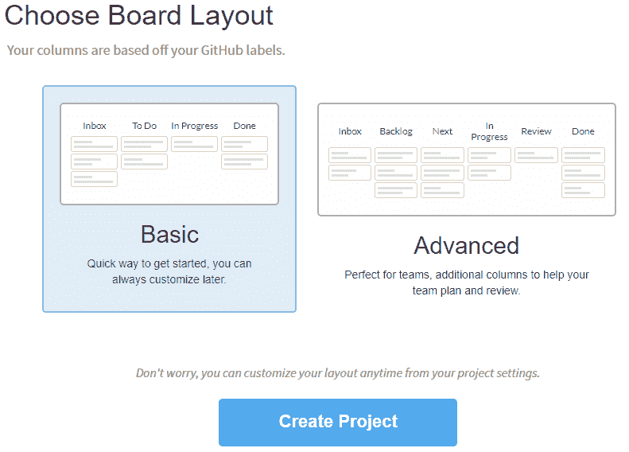

Waffle.io 默认的看板布局

对于这个简单的项目，您将选择基本。但是，高级布局演示了如何修改 Waffle 的默认设置，通过添加额外的列，如审查，以便测试人员或产品所有者参与过程。您可以进一步定制任何看板以适应您现有的流程。

1.  选择基本布局并点击创建项目。

1.  您将看到为您创建的新看板。

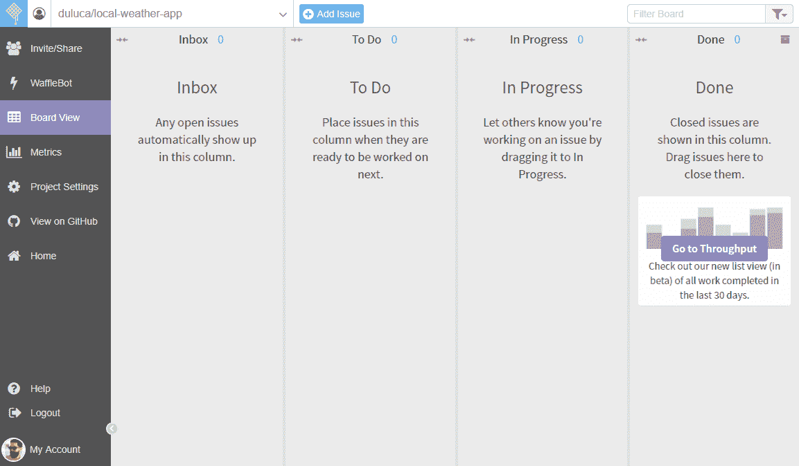

空的 Waffle 看板

默认情况下，Waffle 将作为看板服务。它允许你将一个任务从一个状态移动到另一个状态。然而，默认视图将显示存储库中存在的所有问题。要将 Waffle 用作 Scrum 板，您需要为 GitHub 里程碑分配问题，这些里程碑将代表迭代。然后，您可以使用过滤功能仅显示来自该里程碑的问题，或者说来自当前迭代。

在 Waffle 上，您可以通过点击  比例图标给问题附上故事点。列将自动显示总数和卡片顺序，表示优先级，并且将从一个会话保留到另一个会话。此外，您可以切换到度量视图以获取里程碑燃尽图和吞吐量图表和统计信息。

# 为您的 Local Weather 应用程序创建问题

现在，我们将创建问题的积压，您将使用这些问题来跟踪在实现应用程序设计时的进度。在创建问题时，您应该专注于提供一些价值给用户的功能迭代。您必须克服的技术障碍对您的用户或客户来说没有任何意义。

以下是我们计划在我们的第一个发布版本中构建的功能：

+   显示当前位置的当天天气信息

+   显示当前位置的天气预报信息

+   添加城市搜索功能，使用户可以查看其他城市的天气信息

+   添加一个首选项窗格，用于存储用户的默认城市

+   使用 Angular Material 改善应用程序的用户体验

随意在 Waffle 或 GitHub 上创建问题；无论你喜欢哪种方式都可以。在创建第一个迭代的范围时，我对功能有一些其他想法，所以我只是添加了这些问题，但没有指定给某个人或一个里程碑。我还继续为我打算处理的问题添加了故事点。以下是看起来像的看板，因为我将开始处理第一个故事：

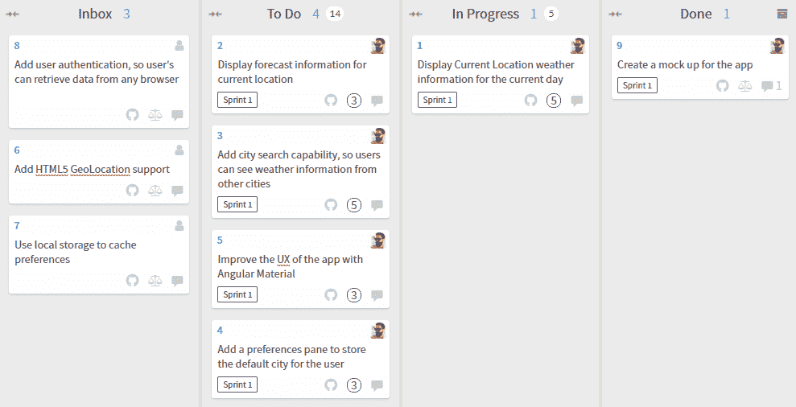

板的初始状态快照位于 [`waffle.io/duluca/local-weather-app`](https://waffle.io/duluca/local-weather-app)

最终，Waffle 提供了一个易于使用的 GUI，以便非技术人员可以轻松地与 GitHub 问题进行交互。通过允许非技术人员参与 GitHub 上的开发过程，你可以让 GitHub 成为整个项目的单一信息来源的好处得以发挥。关于功能和问题的问题、答案和讨论都将作为 GitHub 问题的一部分进行跟踪，而不会在电子邮件中丢失。你还可以在 GitHub 上存储维基类型的文档，因此通过在 GitHub 上集中所有与项目相关的信息、数据、对话和工件，你正在极大地简化可能涉及多个需要持续维护、成本高昂的系统的交互。对于私有知识库和本地企业安装，GitHub 的费用非常合理。如果你坚持使用开源，就像我们在本章中所做的那样，所有这些工具都是免费的。

作为一个额外的福利，我在我的知识库 [`github.com/duluca/local-weather-app/wiki`](https://github.com/duluca/local-weather-app/wiki) 上创建了一个初级的维基页面。请注意，你不能在 `README.md` 或维基页面上上传图片。为了解决这个限制，你可以创建一个新的问题，上传图片作为评论，然后复制并粘贴它的 URL 来在 `README.md` 或维基页面上嵌入图片。在示例维基中，我使用了这种技术将线框设计嵌入到页面中。

有了一个明确的路线图，你现在准备开始实施你的应用程序。

# 使用组件和接口来构建 UI 元素

你将利用 Angular 组件、接口和服务以一种解耦、内聚和封装的方式来构建当前天气功能。

Angular 应用的默认起始页位于`app.component.html`。因此，首先要编辑`AppComponent`的模板，使用基本的 HTML 布局应用程序的初始起始体验。

我们现在开始开发 Feature 1：显示当前位置的当天天气信息，所以你可以将 Waffle 中的卡片移动到“进行中”列。

我们将添加一个标题作为`h1`标签，接着是我们应用的标语作为`div`，以及为显示当前天气的地方设置的占位符，如下面的代码块演示的那样：

```ts
src/app/app.component.html
<div style="text-align:center">
  <h1>
  LocalCast Weather
  </h1>
  <div>Your city, your forecast, right now!</div>
  <h2>Current Weather</h2>
  <div>current weather</div>
</div>
```

在这一点上，你应该运行`npm start`，然后在浏览器中导航到`http://localhost:5000`，这样你就可以实时观察到你所做的更改。

# 添加一个 Angular 组件

我们需要显示当前的天气信息，它位于`<div>current weather</div>`的位置。为了实现这一点，你需要构建一个负责显示天气数据的组件。

创建单独组件的原因是一个在**模型-视图-ViewModel**（**MVVM**）设计模式中被规范化的架构最佳实践。你可能之前听说了**模型-视图-控制器**（**MVC**）模式。大部分于 2005 年至 2015 年之间编写的基于 web 的代码都是按照 MVC 模式编写的。MVVM 与 MVC 模式在重要方面有所不同。正如我在 2013 年的 DevPro 文章中所解释的：

[MVVM 的高效实现](https://wiki.example.org/mvvm_implementation) 自然强制实现了良好的关注点分离。业务逻辑与呈现逻辑清晰地分开。因此，当一个视图被开发时，它就会保持开发完成，因为修复一个视图功能中的错误不会影响其他视图。另一方面，如果您有效地使用可视化继承并创建可重用的用户控件，修复一个地方的错误可以解决整个应用程序中的问题。

Angular 提供了 MVVM 的有效实现。

ViewModels 精巧地封装了任何呈现逻辑，并充当模型的专门版本，通过分隔逻辑，使视图代码更简单。视图和 ViewModel 之间的关系很直接，允许将 UI 行为以更自然的方式封装在可重用的用户控件中。

您可以在[`bit.ly/MVVMvsMVC`](http://bit.ly/MVVMvsMVC)上阅读更多关于架构细微差别的内容，包含插图。

接下来，您将使用 Angular CLI 的 `ng generate` 命令创建您的第一个 Angular 组件，其中将包括视图和 ViewModel：

1.  在终端中，执行 `npx ng generate component current-weather`

确保您在`local-weather-app`文件夹下执行 `ng` 命令，而不是在`根`项目文件夹下。另外，注意 `npx ng generate component current-weather` 可以重写为 `ng g c current-weather`。今后，本书将使用简写格式，并期望您必要时在前面加上 `npx`。

1.  观察您的 `app` 文件夹中创建的新文件：

```ts
src/app
├── app.component.css
├── app.component.html
├── app.component.spec.ts
├── app.component.ts
├── app.module.ts
├── current-weather
  ├── current-weather.component.css
  ├── current-weather.component.html
  ├── current-weather.component.spec.ts
  └── current-weather.component.ts
```

一个生成的组件由四个部分组成：

+   `current-weather.component.css` 包含任何特定于组件的 CSS，是一个可选的文件

+   `current-weather.component.html` 包含了定义组件外观和绑定渲染的 HTML 模板，可以被视为与任何使用的 CSS 样式结合起来的视图

+   `current-weather.component.spec.ts` 包含了基于 Jasmine 的单元测试，您可以扩展以测试组件的功能

+   `current-weather.component.ts` 中包含了 `@Component` 装饰器，位于类定义的顶部，它是将 CSS、HTML 和 JavaScript 代码绑定在一起的粘合剂。这个类本身可以被视为 ViewModel，从服务中获取数据并执行必要的转换，以公开视图的合理绑定，如下所示：

```ts
src/app/current-weather/current-weather.component.ts
import { Component, OnInit } from '@angular/core'
@Component({
  selector: 'app-current-weather',
  templateUrl: './current-weather.component.html',
  styleUrls: ['./current-weather.component.css'],
})
export class CurrentWeatherComponent implements OnInit {
  constructor() {}

  ngOnInit() {}
}
```

如果你计划编写的组件很简单，可以使用内联样式和内联模板重写它，以简化代码的结构。

1.  用内联模板和样式更新`CurrentWeatherComponent`：

```ts
src/app/current-weather/current-weather.component.ts import { Component, OnInit } from '@angular/core'

@Component({
  selector: 'app-current-weather',
  template: `
  <p>
    current-weather works!
  </p>
  `,
  styles: ['']
})
export class CurrentWeatherComponent implements OnInit {
constructor() {}

ngOnInit() {}
}
```

当你执行生成命令时，除了创建组件外，命令还将新创建的模块添加到`app.module.ts`，避免了繁琐的组件连接任务：

```ts
src/app/app.module.ts ...
import { CurrentWeatherComponent } from './current-weather/current-weather.component'
...
@NgModule({
declarations: [AppComponent, CurrentWeatherComponent],
...
```

Angular 的引导过程，不可否认，有点复杂。这也是 Angular CLI 存在的主要原因。`index.html`包含一个名为`<app-root>`的元素。当 Angular 开始执行时，首先加载`main.ts`，它配置了用于浏览器的框架并加载应用程序模块。然后应用程序模块加载所有依赖项并在上述的`<app-root>`元素内呈现。在第十二章，*创建一个路由优先的业务应用程序*，当我们构建一个业务应用程序时，我们将创建自己的特性模块以利用 Angular 的可扩展性功能。

现在，我们需要在初始`AppComponent`模板上显示我们的新组件，以便最终用户看到：

1.  将`CurrentWeatherComponent`添加到`AppComponent`中，用`<app-current-weather></app-current-weather>`替换`<div>current weather</div>`：

```ts
src/app/app.component.html
<div style="text-align:center">
<h1>
 LocalCast Weather
 </h1>
 <div>Your city, your forecast, right now!</div>
 <h2>Current Weather</h2>
 <app-current-weather></app-current-weather>
</div>
```

1.  如果一切正常工作，你应该看到这个：

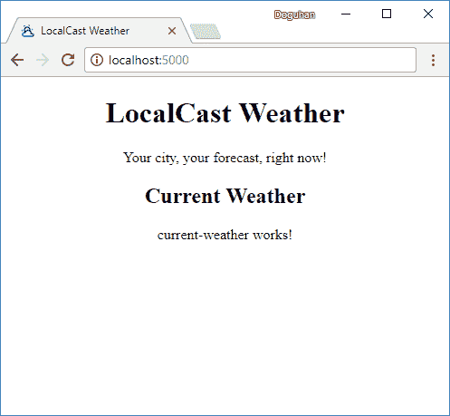

本地天气应用程序的初始渲染

注意浏览器窗口标签中的图标和名称。作为 Web 开发的惯例，在`index.html`文件中，使用应用程序的名称和图标更新`<title>`标签和`favicon.ico`文件，以自定义浏览器标签信息。如果您的网站图标没有更新，请向`href`属性附加一个唯一版本号，例如`href="favicon.ico?v=2"`。因此，您的应用程序将开始看起来像一个真正的 Web 应用程序，而不是一个由 CLI 生成的初学者项目。

# 使用接口定义您的模型

现在，您的`View`和`ViewModel`就位了，您需要定义您的`Model`。如果回顾设计，您将看到组件需要显示：

+   城市

+   国家

+   当前日期

+   当前图片

+   当前温度

+   当前天气描述

首先创建一个表示这个数据结构的接口：

1.  在终端执行`npx ng generate interface ICurrentWeather`

1.  观察一个新生成的名为`icurrent-weather.ts`的文件，其中包含一个空接口定义，看起来像这样：

```ts
src/app/icurrent-weather.ts
export interface ICurrentWeather {
}
```

这不是一个理想的设置，因为我们可能会向我们的应用程序添加许多接口，跟踪各种接口可能会变得繁琐。随着时间的推移，当你将这些接口的具体实现作为类添加时，将有意义地将类和它们的接口放在自己的文件中。

为什么不直接将接口命名为`CurrentWeather`？因为稍后我们可能会创建一个类来实现`CurrentWeather`的一些有趣的行为。接口建立了一个契约，确定了任何实现或扩展接口的类或接口上可用属性的列表。始终意识到您正在使用类还是接口是非常重要的。如果您遵循始终以大写字母 `I` 开头命名接口的最佳实践，您将始终意识到您正在传递的对象的类型。因此，接口被命名为`ICurrentWeather`。

1.  将`icurrent-weather.ts`重命名为`interfaces.ts`

1.  将接口名称的大写进行更正为`ICurrentWeather`

1.  同样，按照以下方式实现接口：

```ts
src/app/interfaces.ts
export interface ICurrentWeather {
  city: string
  country: string
  date: Date
  image: string
  temperature: number
  description: string
}
```

这个接口及其最终的具体表示形式作为一个类是 MVVM 中的模型。到目前为止，我已经强调了 Angular 的各个部分如何符合 MVVM 模式；在接下来，我将用它们的实际名称来指代这些部分。

现在，我们可以将接口导入到组件中，并开始在`CurrentWeatherComponent`模板中连接绑定。

1.  导入`ICurrentWeather`

1.  切换回`templateUrl`和``styleUrls``

1.  定义一个名为 `current` 的本地变量，类型为 `ICurrentWeather`

```ts
src/app/current-weather/current-weather.component.ts import { Component, OnInit } from '@angular/core'
import { ICurrentWeather } from '../interfaces'

@Component({
  selector: 'app-current-weather',
  templateUrl: './current-weather.component.html',
  styleUrls: ['./current-weather.component.css'],
})
export class CurrentWeatherComponent implements OnInit {
  current: ICurrentWeather

  constructor() {}

  ngOnInit() {}
}
```

如果您只键入`current: ICurrentWeather`，您可以使用自动修复程序自动插入导入语句。

在构造函数中，您将用虚拟数据临时填充当前属性以测试绑定。

1.  以 JSON 对象的形式实现虚拟数据，并使用`as`运算符声明它遵循`ICurrentWeather`：

```ts
src/app/current-weather/current-weather.component.ts
...
constructor() {
  this.current = {
    city: 'Bethesda',
    country: 'US',
    date: new Date(),
    image: 'assets/img/sunny.svg',
    temperature: 72,
    description: 'sunny',
  } as ICurrentWeather
}
...
```

在`src/assets`文件夹中，创建一个名为`img`的子文件夹，并放置您选择的图像以在虚拟数据中引用。

您可能会忘记您创建的接口中的确切属性。通过*Ctrl* + 鼠标悬停在接口名称上，您可以快速查看它们，如下所示：

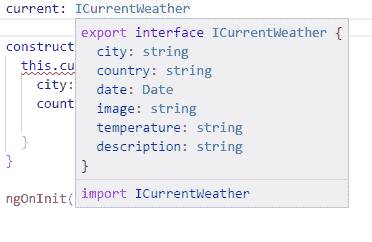*Ctrl* + 鼠标悬停在接口

现在，您可以更新模板，将您的绑定与基本的基于 HTML 的布局进行连接。

1.  实现模板：

```ts
src/app/current-weather/current-weather.component.html <div>
  <div>
    <span>{{current.city}}, {{current.country}}</span>
    <span>{{current.date | date:'fullDate'}}</span>
  </div>
  <div>
    
    <span>{{current.temperature | number:'1.0-0'}}℉</span>
  </div>
  <div>
    {{current.description}}
  </div>
</div>
```

要更改 `current.date` 的显示格式，我们使用了上面的 `DatePipe` ，将`'fullDate'`作为格式选项传入。在 Angular 中，可以使用各种内置和自定义`|`操作符来更改数据的外观，而不改变实际的数据。这是一个非常强大、方便和灵活的系统，可以在不编写重复代码的情况下共享用户界面逻辑。在上面的示例中，如果我们想要以更紧凑的形式表示当前日期，我们可以传入`'shortDate'`。有关各种`DatePipe`选项的更多信息，请参阅[`angular.io/api/common/DatePipe`](https://angular.io/api/common/DatePipe)的文档。要格式化`current.temperature`，以便不显示小数值，您可以使用`DecimalPipe`。文档在[`angular.io/api/common/DecimalPipe`](https://angular.io/api/common/DecimalPipe)中。

请注意，您可以使用其各自的 HTML 代码来呈现℃和℉： 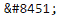 代表℃， 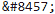 代表 ℉。

1.  如果一切正常，您的应用应该看起来类似于该截图：

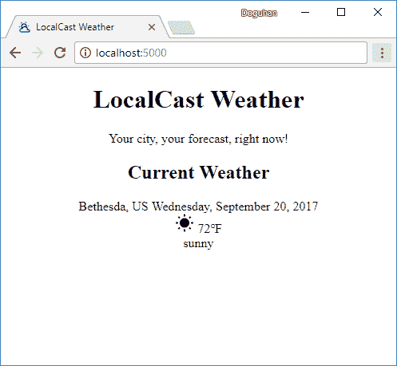

绑定到虚拟数据的 App

恭喜，您已成功连接了第一个组件。

# 使用 Angular 服务和 HttpClient 获取数据

现在您需要将您的`CurrentWeather`组件连接到`OpenWeatherMap` APIs。在接下来的章节中，我们将重点介绍以下步骤以实现这个目标：

1.  创建一个新的 Angular 服务

1.  导入 `HttpClientModule` 并将其注入服务中

1.  发现`OpenWeatherMap` API

1.  创建符合 API 结构的新接口

1.  编写一个`get`请求

1.  将新服务注入到`CurrentWeather`组件中

1.  在 `CurrentWeather` 组件的`init`函数中调用该服务

1.  最后，使用 RxJS 函数将 API 数据映射到本地的`ICurrentWeather`类型，以便组件可以使用

# 创建一个新的 Angular 服务

任何超出组件边界的代码应存在于服务中；这包括组件间通信，除非存在父子关系，并且任何类型的 API 调用，以及缓存或从 cookie 或浏览器的 localStorage 中检索数据的任何代码。这是一个在长期内保持您的应用可维护性的重要架构模式。我在我的 DevPro MVVM 文章中详细介绍了这个想法，链接在[`bit.ly/MVVMvsMVC`](http://bit.ly/MVVMvsMVC)。

要创建 Angular 服务，请执行以下操作：

1.  在终端中，执行`npx ng g s weather --flat false`

1.  观察新创建的`weather`文件夹：

```ts
src/app
...
└── weather
   ├── weather.service.spec.ts
   └── weather.service.ts
```

生成的服务有两个部分：

+   `weather.service.spec.ts`包含基于 Jasmine 的单元测试，您可以扩展以测试服务功能。

+   `weather.service.ts`中包含了类定义之前的`@Injectable`装饰器，这使得可以将该服务注入到其他组件中，利用 Angular 的提供者系统。这将确保我们的服务将是单例的，意味着无论它在其他地方被实例化多少次，它都只会被实例化一次。

服务已生成，但并未自动提供。要执行此操作，请按照以下步骤进行：

1.  打开`app.module.ts`

1.  在 providers 数组中输入`WeatherService`

1.  使用自动修复程序为您导入类：

```ts
src/app/app.module.ts
...
import { WeatherService } from './weather/weather.service'
...
@NgModule({
  ...
  providers: [WeatherService],
  ...
```

如果您已安装了推荐的扩展 TypeScript Hero，则导入语句将自动为您添加。您无需使用自动修复程序来执行此操作。接下来，我将不再强调需要导入模块的需要。

# 注入依赖项

为了进行 API 调用，您将使用 Angular 中的`HttpClient`模块。官方文件([`angular.io/guide/http`](https://angular.io/guide/http))简洁地解释了这个模块的好处：

“通过 HttpClient，@angular/common/http 为 Angular 应用程序提供了一个简化的用于 HTTP 功能的 API，构建在浏览器暴露的 XMLHttpRequest 接口之上。HttpClient 的额外好处包括支持可测试性，强类型化的请求和响应对象，请求和响应拦截器支持以及基于可观察对象的更好的错误处理。”

让我们开始导入`HttpClientModule`到我们的应用程序中，以便我们可以在`WeatherService`中注入模块中的`HttpClient`：

1.  在`app.module.ts`中添加`HttpClientModule`，如下所示：

```ts
src/app/app.module.ts
...
import { HttpClientModule } from '@angular/common/http'
...
@NgModule({
  ...
  imports: [
    ...
    HttpClientModule,
    ...
```

1.  注入由`HttpClientModule`提供的`HttpClient`到`WeatherService`，如下所示：

```ts
src/app/weather/weather.service.ts
import { HttpClient } from '@angular/common/http'
import { Injectable } from '@angular/core'

@Injectable()
export class WeatherService {
  constructor(private httpClient: HttpClient) {}
}
```

现在，`httpClient`已经准备好在您的服务中使用。

# 探索 OpenWeatherMap API

由于`httpClient`是强类型的，因此我们需要创建一个符合我们将要调用的 API 形状的新接口。为了能够做到这一点，您需要熟悉当前天气数据 API。

1.  通过导航到[`openweathermap.org/current`](http://openweathermap.org/current)阅读文档：

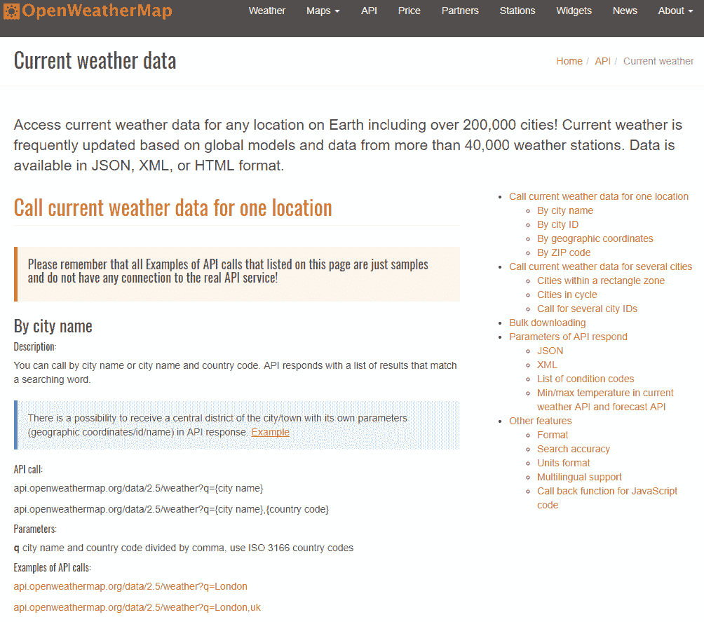

OpenWeatherMap 当前天气数据 API 文档

您将使用名为“按城市名称”的 API，它允许您通过提供城市名称作为参数来获取当前的天气数据。因此，您的网络请求将如下所示：

```ts
api.openweathermap.org/data/2.5/weather?q={city name},{country code}
```

1.  在文档页面上，点击“API 调用示例”的链接，您将看到以下示例响应：

```ts
http://samples.openweathermap.org/data/2.5/weather?q=London,uk&appid=b1b15e88fa797225412429c1c50c122a1
{
  "coord": {
    "lon": -0.13,
    "lat": 51.51
  },
  "weather": [
    {
      "id": 300,
      "main": "Drizzle",
      "description": "light intensity drizzle",
      "icon": "09d"
    }
  ],
  "base": "stations",
  "main": {
    "temp": 280.32,
    "pressure": 1012,
    "humidity": 81,
    "temp_min": 279.15,
    "temp_max": 281.15
  },
  "visibility": 10000,
  "wind": {
    "speed": 4.1,
    "deg": 80
  },
  "clouds": {
    "all": 90
  },
  "dt": 1485789600,
  "sys": {
    "type": 1,
    "id": 5091,
    "message": 0.0103,
    "country": "GB",
    "sunrise": 1485762037,
    "sunset": 1485794875
  },
  "id": 2643743,
  "name": "London",
  "cod": 200
}
```

鉴于您已经创建的现有`ICurrentWeather`接口，此响应包含的信息比您所需的要多。因此，您将编写一个新的接口，符合此响应的形状，但只指定您将要使用的数据片段。这个接口将只存在于`WeatherService`中，我们不会导出它，因为应用程序的其他部分不需要知道这种类型。

1.  在`weather.service.ts`中的`import`语句和`@Injectable`语句之间创建一个名为`ICurrentWeatherData`的新接口

1.  新接口应该像这样：

```ts
src/app/weather/weather.service.ts
interface ICurrentWeatherData {
  weather: [{
    description: string,
    icon: string
  }],
  main: {
    temp: number
  },
  sys: {
    country: string
  },
  dt: number,
  name: string
}
```

通过`ICurrentWeatherData`接口，我们通过向接口添加具有不同结构的子对象来定义新的匿名类型。这些对象中的每一个都可以被单独提取出来并定义为它们自己的命名接口。特别要注意的是，`weather`将是一个具有`description`和`icon`属性的匿名类型数组。

# 存储环境变量

很容易被忽视的是，之前章节示例的 URL 包含一个必需的`appid`参数。你必须在你的 Angular 应用中存储这个键。你可以将它存储在天气服务中，但实际上，应用程序需要能够在从开发到测试、分段和生产环境的移动过程中针对不同的资源集。Angular 提供了两个环境：一个为`prod`，另一个为默认。

在继续之前，你需要注册一个免费的`OpenWeatherMap`账户并获取自己的`appid`。你可以阅读[`openweathermap.org/appid `](http://openweathermap.org/appid)上`appid`的文档以获取更详细的信息。

1.  复制你的`appid`，它将有一长串字符和数字

1.  将你的`appid`存储在`environment.ts`中

1.  为后续使用配置`baseUrl`：

```ts
src/environments/environment.ts
export const environment = {
  production: false,
  appId: 'xxxxxxxxxxxxxxxxxxxxxxxxxxxxxxxx',
  baseUrl: 'http://',
}
```

在代码中，我们使用驼峰写法`appId`以保持我们的编码风格一致。由于 URL 参数是大小写不敏感的，`appId`和`appid`都可以使用。

# 实现一个 HTTP GET 操作

现在，我们可以在天气服务中实现 GET 调用：

1.  在`WeatherService`类中添加一个名为`getCurrentWeather`的新函数

1.  导入`environment`对象

1.  实现`httpClient.get`函数

1.  返回 HTTP 调用的结果：

```ts
src/app/weather/weather.service.ts
import { environment } from '../../environments/environment'
...
export class WeatherService {
  constructor(private httpClient: HttpClient) { }

  getCurrentWeather(city: string, country: string) {
    return this.httpClient.get<ICurrentWeatherData>(
        `${environment.baseUrl}api.openweathermap.org/data/2.5/weather?` +
          `q=${city},${country}&appid=${environment.appId}`
    )
  }
}
```

请注意使用 ES2015 的字符串插值功能。不必像`environment.baseUrl + 'api.openweathermap.org/data/2.5/weather?q=' + city + ',' + country + '&appid=' + environment.appId`那样将变量追加到一起来构建字符串，你可以使用反引号语法包裹``你的字符串``。在反引号内，你可以有换行，还可以直接使用`${dollarbracket}`语法将变量嵌入到字符串的流中。但是，在代码中引入换行时，它将被解释为字面换行—`\n`。为了在代码中分割字符串，你可以添加一个反斜杠`\`，但接下来的代码行不能有缩进。如前面的代码示例所示，将多个模板连接起来会更容易些。

当`CurrentWeather`组件加载时，`ngOnInit`将在第一次触发时，这将调用`getCurrentWeather`函数，该函数返回一个包含`ICurrentWeatherData`类型对象的 Observable。Observable 是一种 RxJS 中最基本的事件监听器构建块，代表事件发射器，它将随着时间的推移接收任何数据类型为`ICurrentWeatherData`的数据。Observable 本身是无害的，除非它被监听。您可以在[reactivex.io/rxjs/class/es6/Observable.js~Observable.html](http://reactivex.io/rxjs/class/es6/Observable.js~Observable.html)中阅读更多关于 Observables 的信息。

# 当`CurrentWeather`组件加载时，`ngOnInit`将在第一次触发时，这将调用`getCurrentWeather`函数，该函数返回一个包含`ICurrentWeatherData`类型对象的 Observable。Observable 是一种 RxJS 中最基本的事件监听器构建块，代表事件发射器，它将随着时间的推移接收任何数据类型为`ICurrentWeatherData`的数据。Observable 本身是无害的，除非它被监听。您可以在[reactivex.io/rxjs/class/es6/Observable.js~Observable.html](http://reactivex.io/rxjs/class/es6/Observable.js~Observable.html)中阅读更多关于 Observables 的信息。

当`CurrentWeather`组件加载时，`ngOnInit`将在第一次触发时，这将调用`getCurrentWeather`函数，该函数返回一个包含`ICurrentWeatherData`类型对象的 Observable。Observable 是一种 RxJS 中最基本的事件监听器构建块，代表事件发射器，它将随着时间的推移接收任何数据类型为`ICurrentWeatherData`的数据。Observable 本身是无害的，除非它被监听。您可以在[reactivex.io/rxjs/class/es6/Observable.js~Observable.html](http://reactivex.io/rxjs/class/es6/Observable.js~Observable.html)中阅读更多关于 Observables 的信息。

1.  当`CurrentWeather`组件加载时，`ngOnInit`将在第一次触发时，这将调用`getCurrentWeather`函数，该函数返回一个包含`ICurrentWeatherData`类型对象的 Observable。Observable 是一种 RxJS 中最基本的事件监听器构建块，代表事件发射器，它将随着时间的推移接收任何数据类型为`ICurrentWeatherData`的数据。Observable 本身是无害的，除非它被监听。您可以在[reactivex.io/rxjs/class/es6/Observable.js~Observable.html](http://reactivex.io/rxjs/class/es6/Observable.js~Observable.html)中阅读更多关于 Observables 的信息。

1.  当`CurrentWeather`组件加载时，`ngOnInit`将在第一次触发时，这将调用`getCurrentWeather`函数，该函数返回一个包含`ICurrentWeatherData`类型对象的 Observable。Observable 是一种 RxJS 中最基本的事件监听器构建块，代表事件发射器，它将随着时间的推移接收任何数据类型为`ICurrentWeatherData`的数据。Observable 本身是无害的，除非它被监听。您可以在[reactivex.io/rxjs/class/es6/Observable.js~Observable.html](http://reactivex.io/rxjs/class/es6/Observable.js~Observable.html)中阅读更多关于 Observables 的信息。

```ts
src/app/current-weather/current-weather.component.ts
constructor(private weatherService: WeatherService) { }
```

1.  当`CurrentWeather`组件加载时，`ngOnInit`将在第一次触发时，这将调用`getCurrentWeather`函数，该函数返回一个包含`ICurrentWeatherData`类型对象的 Observable。Observable 是一种 RxJS 中最基本的事件监听器构建块，代表事件发射器，它将随着时间的推移接收任何数据类型为`ICurrentWeatherData`的数据。Observable 本身是无害的，除非它被监听。您可以在[reactivex.io/rxjs/class/es6/Observable.js~Observable.html](http://reactivex.io/rxjs/class/es6/Observable.js~Observable.html)中阅读更多关于 Observables 的信息。

```ts
src/app/current-weather/current-weather.component.ts
ngOnInit() {
  this.weatherService.getCurrentWeather('Bethesda', 'US')
    .subscribe((data) => this.current = data)
}
```

当`CurrentWeather`组件加载时，`ngOnInit`将在第一次触发时，这将调用`getCurrentWeather`函数，该函数返回一个包含`ICurrentWeatherData`类型对象的 Observable。Observable 是一种 RxJS 中最基本的事件监听器构建块，代表事件发射器，它将随着时间的推移接收任何数据类型为`ICurrentWeatherData`的数据。Observable 本身是无害的，除非它被监听。您可以在[reactivex.io/rxjs/class/es6/Observable.js~Observable.html](http://reactivex.io/rxjs/class/es6/Observable.js~Observable.html)中阅读更多关于 Observables 的信息。

当`CurrentWeather`组件加载时，`ngOnInit`将在第一次触发时，这将调用`getCurrentWeather`函数，该函数返回一个包含`ICurrentWeatherData`类型对象的 Observable。Observable 是一种 RxJS 中最基本的事件监听器构建块，代表事件发射器，它将随着时间的推移接收任何数据类型为`ICurrentWeatherData`的数据。Observable 本身是无害的，除非它被监听。您可以在[reactivex.io/rxjs/class/es6/Observable.js~Observable.html](http://reactivex.io/rxjs/class/es6/Observable.js~Observable.html)中阅读更多关于 Observables 的信息。

当`CurrentWeather`组件加载时，`ngOnInit`将在第一次触发时，这将调用`getCurrentWeather`函数，该函数返回一个包含`ICurrentWeatherData`类型对象的 Observable。Observable 是一种 RxJS 中最基本的事件监听器构建块，代表事件发射器，它将随着时间的推移接收任何数据类型为`ICurrentWeatherData`的数据。Observable 本身是无害的，除非它被监听。您可以在[reactivex.io/rxjs/class/es6/Observable.js~Observable.html](http://reactivex.io/rxjs/class/es6/Observable.js~Observable.html)中阅读更多关于 Observables 的信息。

当`CurrentWeather`组件加载时，`ngOnInit`将在第一次触发时，这将调用`getCurrentWeather`函数，该函数返回一个包含`ICurrentWeatherData`类型对象的 Observable。Observable 是一种 RxJS 中最基本的事件监听器构建块，代表事件发射器，它将随着时间的推移接收任何数据类型为`ICurrentWeatherData`的数据。Observable 本身是无害的，除非它被监听。您可以在[reactivex.io/rxjs/class/es6/Observable.js~Observable.html](http://reactivex.io/rxjs/class/es6/Observable.js~Observable.html)中阅读更多关于 Observables 的信息。

当`CurrentWeather`组件加载时，`ngOnInit`将在第一次触发时，这将调用`getCurrentWeather`函数，该函数返回一个包含`ICurrentWeatherData`类型对象的 Observable。Observable 是一种 RxJS 中最基本的事件监听器构建块，代表事件发射器，它将随着时间的推移接收任何数据类型为`ICurrentWeatherData`的数据。Observable 本身是无害的，除非它被监听。您可以在[reactivex.io/rxjs/class/es6/Observable.js~Observable.html](http://reactivex.io/rxjs/class/es6/Observable.js~Observable.html)中阅读更多关于 Observables 的信息。

当`CurrentWeather`组件加载时，`ngOnInit`将在第一次触发时，这将调用`getCurrentWeather`函数，该函数返回一个包含`ICurrentWeatherData`类型对象的 Observable。Observable 是一种 RxJS 中最基本的事件监听器构建块，代表事件发射器，它将随着时间的推移接收任何数据类型为`ICurrentWeatherData`的数据。Observable 本身是无害的，除非它被监听。您可以在[reactivex.io/rxjs/class/es6/Observable.js~Observable.html](http://reactivex.io/rxjs/class/es6/Observable.js~Observable.html)中阅读更多关于 Observables 的信息。

当`CurrentWeather`组件加载时，`ngOnInit`将在第一次触发时，这将调用`getCurrentWeather`函数，该函数返回一个包含`ICurrentWeatherData`类型对象的 Observable。Observable 是一种 RxJS 中最基本的事件监听器构建块，代表事件发射器，它将随着时间的推移接收任何数据类型为`ICurrentWeatherData`的数据。Observable 本身是无害的，除非它被监听。您可以在[reactivex.io/rxjs/class/es6/Observable.js~Observable.html](http://reactivex.io/rxjs/class/es6/Observable.js~Observable.html)中阅读更多关于 Observables 的信息。

当`CurrentWeather`组件加载时，`ngOnInit`将在第一次触发时，这将调用`getCurrentWeather`函数，该函数返回一个包含`ICurrentWeatherData`类型对象的 Observable。Observable 是一种 RxJS 中最基本的事件监听器构建块，代表事件发射器，它将随着时间的推移接收任何数据类型为`ICurrentWeatherData`的数据。Observable 本身是无害的，除非它被监听。您可以在[reactivex.io/rxjs/class/es6/Observable.js~Observable.html](http://reactivex.io/rxjs/class/es6/Observable.js~Observable.html)中阅读更多关于 Observables 的信息。

当`CurrentWeather`组件加载时，`ngOnInit`将在第一次触发时，这将调用`getCurrentWeather`函数，该函数返回一个包含`ICurrentWeatherData`类型对象的 Observable。Observable 是一种 RxJS 中最基本的事件监听器构建块，代表事件发射器，它将随着时间的推移接收任何数据类型为`ICurrentWeatherData`的数据。Observable 本身是无害的，除非它被监听。您可以在[reactivex.io/rxjs/class/es6/Observable.js~Observable.html](http://reactivex.io/rxjs/class/es6/Observable.js~Observable.html)中阅读更多关于 Observables 的信息。

当`CurrentWeather`组件加载时，`ngOnInit`将在第一次触发时，这将调用`getCurrentWeather`函数，该函数返回一个包含`ICurrentWeatherData`类型对象的 Observable。Observable 是一种 RxJS 中最基本的事件监听器构建块，代表事件发射器，它将随着时间的推移接收任何数据类型为`ICurrentWeatherData`的数据。Observable 本身是无害的，除非它被监听。您可以在[reactivex.io/rxjs/class/es6/Observable.js~Observable.html](http://reactivex.io/rxjs/class/es6/Observable.js~Observable.html)中阅读更多关于 Observables 的信息。

当`CurrentWeather`组件加载时，`ngOnInit`将在第一次触发时，这将调用`getCurrentWeather`函数，该函数返回一个包含`ICurrentWeatherData`类型对象的 Observable。Observable 是一种 RxJS 中最基本的事件监听器构建块，代表事件发射器，它将随着时间的推移接收任何数据类型为`ICurrentWeatherData`的数据。Observable 本身是无害的，除非它被监听。您可以在[reactivex.io/rxjs/class/es6/Observable.js~Observable.html](http://reactivex.io/rxjs/class/es6/Observable.js~Observable.html)中阅读更多关于 Observables 的信息。

当`CurrentWeather`组件加载时，`ngOnInit`将在第一次触发时，这将调用`getCurrentWeather`函数，该函数返回一个包含`ICurrentWeatherData`类型对象的 Observable。Observable 是一种 RxJS 中最基本的事件监听器构建块，代表事件发射器，它将随着时间的推移接收任何数据类型为`ICurrentWeatherData`的数据。Observable 本身是无害的，除非它被监听。您可以在[reactivex.io/rxjs/class/es6/Observable.js~Observable.html](http://reactivex.io/rxjs/class/es6/Observable.js~Observable.html)中阅读更多关于 Observables 的信息。

通过在 Observable 上调用 `.subscribe`，从本质上说，你将侦听器附加到发射器上。在 `subscribe` 方法中实现了一个匿名函数，每当接收到新的数据并发出事件时，该函数都将被执行。匿名函数以数据对象作为参数，并且在本例中的具体实现中，将数据块分配给了名为 current 的本地变量。每当 current 被更新时，你之前实现的模板绑定将拉取新数据并在视图上渲染。即使 `ngOnInit` 只执行一次，对 Observable 的订阅仍然持续。因此，每当有新数据时，当前变量将被更新，并且视图将重新渲染以显示最新数据。

目前错误的根本原因是正在传送的数据属于 `ICurrentWeatherData` 类型，但是，我们的组件只能理解由 `ICurrentWeather` 接口描述的形式的数据。在下一部分，你需要更深入地了解 RxJS，以便最好地完成这项任务。

注意，VS Code 和 CLI 有时会停止工作。如前所述，在编写代码时，`npm start` 命令正在 VS Code 的集成终端中运行。Angular CLI 与 Angular 语言服务插件一起，不断地监视代码更改，将你的 TypeScript 代码转译成 JavaScript，这样你就能在浏览器中实时查看你的更改。最棒的是，当你出现编码错误时，除了在 VS Code 中的红色下划线外，在终端或者浏览器中也会看到一些红色文字，因为转译失败了。在大多数情况下，在纠正错误后，红色下划线会消失，Angular CLI 会自动重新转译你的代码，一切都会正常工作。然而，在某些情况下，你会发现 VS Code 未能在 IDE 中捕捉到输入更改，所以你将得不到自动补全帮助或者 CLI 工具会卡在消息“webpack：编译失败”上。

你有两种主要策略来从这种情况中恢复：

1.  点击终端，然后按下 *Ctrl* + *C* 停止运行 CLI 任务，并通过执行 `npm start` 重新启动

1.  如果 **#1** 不起作用，用 *Alt* + *F4*（Windows）或 ⌘ + *Q*（macOS）退出 VS Code，然后重新启动它

鉴于 Angular 和 VS Code 每月的发布周期，我相信工具只会不断改进。

# 使用 RxJS 转换数据

RxJS 代表着响应式扩展，这是一个模块化的库，能够实现响应式编程，它本身是一种异步编程范式，并允许通过转换、过滤和控制函数来操纵数据流。你可以将响应式编程看作是事件驱动编程的一种进化。

# 理解响应式编程

在事件驱动编程中，您将定义一个事件处理程序并将其附加到事件源。更具体地说，如果您有一个保存按钮，该按钮公开`onClick`事件，您将实现一个`confirmSave`函数，当触发时，会显示一个弹出窗口询问用户“您确定吗？”。查看以下图示可可视化此过程。

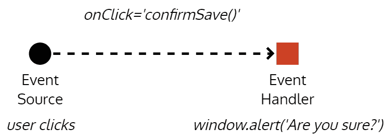

事件驱动实现

简而言之，您将有一个事件在每次用户操作时触发。如果用户多次点击保存按钮，此模式将乐意呈现与点击次数相同的弹出窗口，这并没有太多意义。

发布-订阅（pub/sub）模式是一种不同类型的事件驱动编程。在这种情况下，我们可以编写多个处理程序来同时对给定事件的结果进行操作。假设您的应用刚刚收到了一些更新的数据。发布者将遍历其订阅者列表，并将更新的数据传递给每个订阅者。参考以下图表，更新的数据事件如何触发`updateCache`函数，该函数可以使用新数据更新您的本地缓存，`fetchDetails`函数可以从服务器检索有关数据的更多详细信息，并且`showToastMessage`函数可以通知用户应用程序刚刚收到了新数据。所有这些事件都可以异步发生;但是，`fetchDetails`和`showToastMessage`函数将收到比他们实际需要的更多数据，尝试以不同方式组合这些事件以修改应用程序行为可能会变得非常复杂。

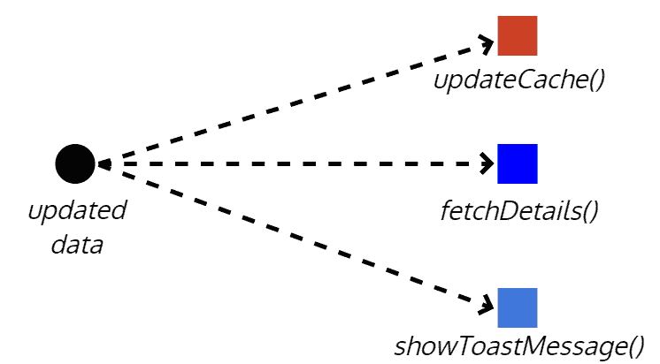

发布-订阅模式实现

在响应式编程中，一切都被视为流。一个流将包含随时间发生的事件，这些事件可以包含一些数据或没有数据。下图可视化了一个场景，您的应用正在监听用户的鼠标点击。不受控的用户点击流是毫无意义的。通过将`throttle`函数应用于它，您可以对此流施加一些控制，以便每 250 **毫秒**（**ms**）仅获得更新。如果订阅此新事件，则每 250 毫秒，您将收到一系列点击事件。您可以尝试从每次点击事件中提取一些数据，但在这种情况下，您只对发生的点击事件数量感兴趣。我们可以使用`map`函数将原始事件数据转化为点击次数。

在下游,我们可能只对带有两个或多个点击的事件感兴趣,所以我们可以使用 `filter` 函数只对本质上是双击事件的事件采取行动。每当我们的过滤器事件触发时,这意味着用户打算双击,你可以根据这个信息弹出一个警告。流的真正力量在于,你可以选择在它通过各种控制、转换和过滤函数时的任何时候采取行动。你可以选择使用 `*ngFor` 和 Angular 的 `async` 管道在 HTML 列表上显示点击数据,这样用户就可以监视每 250 毫秒捕获的点击数据类型。

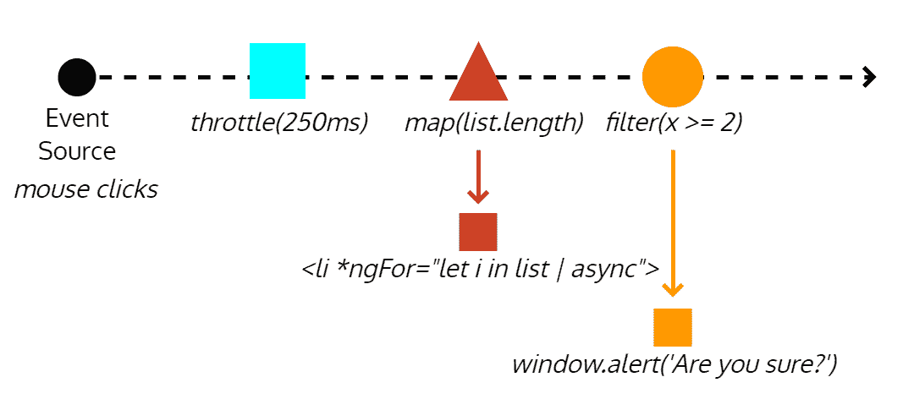

一个响应式数据流实现

# 实现响应式转换

为了避免将来从服务中返回意外类型的数据的错误,你需要更新 `getCurrentWeather` 函数,将返回类型定义为 `Observable<ICurrentWeather>`,并导入 `Observable` 类型,如下所示:

```ts
src/app/weather/weather.service.ts
import { Observable } from 'rxjs'
import { ICurrentWeather } from '../interfaces'
...

export class WeatherService {
  ...
  getCurrentWeather(city: string, country: string): Observable<ICurrentWeather> {
  }
  ...
}
```

现在,VS Code 会告诉你,类型 `Observable<ICurrentWeatherData>` 不可分配给类型 `Observable<ICurrentWeather>`:

1.  编写一个名为 `transformToICurrentWeather` 的转换函数,可以将 `ICurrentWeatherData` 转换为 `ICurrentWeather`

1.  此外,编写一个名为 `convertKelvinToFahrenheit` 的助手函数,将 API 提供的开尔文温度转换为华氏度:

```ts
src/app/weather/weather.service.ts export class WeatherService {...
  private transformToICurrentWeather(data: ICurrentWeatherData): ICurrentWeather {
    return {
      city: data.name,
      country: data.sys.country,
      date: data.dt * 1000,
      image: `http://openweathermap.org/img/w/${data.weather[0].icon}.png`,
      temperature: this.convertKelvinToFahrenheit(data.main.temp),
      description: data.weather[0].description
    }
  }

  private convertKelvinToFahrenheit(kelvin: number): number {
    return kelvin * 9 / 5 - 459.67
  }
}
```

请注意,你需要在此阶段将图标属性转换为图像 URL。在服务中执行此操作有助于保持封装,在视图模板中绑定图标值到 URL 会违反**关注点分离** (**SoC**) 原则。如果你希望创建真正模块化、可重用和可维护的组件,你必须保持警惕并严格执行 SoC。有关天气图标的文档以及如何形成 URL 的详细信息,包括所有可用的图标,可以在 [`openweathermap.org/weather-conditions`](http://openweathermap.org/weather-conditions) 找到。

另一方面,可以论证说,开尔文到华氏温度的转换实际上是一个视图关注点,但我们在服务中实现了它。这个论点是有道理的,特别是考虑到我们计划有一个功能可以在摄氏度和华氏度之间切换。反对的论点是,目前我们只需要以华氏度显示,这是天气服务的一部分,能够转换单位。这个论点也很有道理。最终的实现将是编写一个自定义的 Angular Pipe,并在模板中应用它。一个管道也可以很容易地与计划的切换按钮绑定。但是,现在我们只需要以华氏度显示,我会倾向于*不*过度设计一个解决方案。

1.  将 `ICurrentWeather.date` 更新为 `number` 类型

在编写转换函数时，你会注意到 API 返回的日期是一个数字。这个数字代表自 UNIX 纪元（时间戳）以来的秒数，即 1970 年 1 月 1 日 00:00:00 UTC。然而，`ICurrentWeather`期望一个`Date`对象。通过将时间戳传递给`Date`对象的构造函数`new Date(data.dt)`来转换时间戳非常简单。这没有问题，但也是没必要的，因为 Angular 的`DatePipe`可以直接使用时间戳。在追求简单和最大程度利用我们使用的框架功能的名义上，我们将更新`ICurrentWeather`以使用`number`。如果你正在转换大量数据，这种方法还有性能和内存方面的好处，但这个问题在这里并不适用。这里有一个注意事项—JavaScript 的时间戳是以毫秒为单位的，但服务器的值是以秒为单位的，因此在转换过程中仍然需要简单的乘法运算。

1.  在其他导入语句的下面导入 RxJS 的`map`操作符：

```ts
src/app/weather/weather.service.ts
import { map } from 'rxjs/operators'
```

手动导入 `map` 操作符可能看起来很奇怪。RxJS 是一个功能强大的框架，具有广泛的 API 表面。单独的 Observable 就有超过 200 个附加方法。默认包含所有这些方法会在开发时创建太多的功能选择问题，同时也会对最终交付的大小、应用程序性能和内存使用产生负面影响。因此，你必须单独添加要使用的每个操作符。

1.  在`httpClient.get`方法返回的数据流上应用`map`函数通过一个`pipe`

1.  将`data`对象传递给`transformToICurrentWeather`函数：

```ts
src/app/weather/weather.service.ts
...
return this.httpClient
  .get<ICurrentWeatherData>(
    `http://api.openweathermap.org/data/2.5/weather?q=${city},${country}&appid=${environment.appId}`
  ).pipe(
    map(data => 
      this.transformToICurrentWeather(data)
    )
  )
...
```

现在，当数据进入时，可以在数据流中对其进行转换，确保`OpenWeatherMap`的当前天气 API 数据具有正确的格式，这样可以被`CurrentWeather`组件消费。

1.  确保你的应用程序成功编译

1.  在浏览器中检查结果：

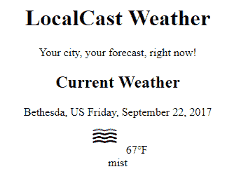

显示来自 OpenWeatherMap 的实时数据

最后，你应该看到你的应用程序能够从`OpenWeatherMap`中获取实时数据，并正确地将服务器数据转换为你期望的格式。

你已经完成了 Feature 1 的开发：显示当前位置的当天天气信息。提交你的代码并将卡片移到 Waffle 的“已完成”列。

1.  最后，我们可以将这个任务移到完成列：

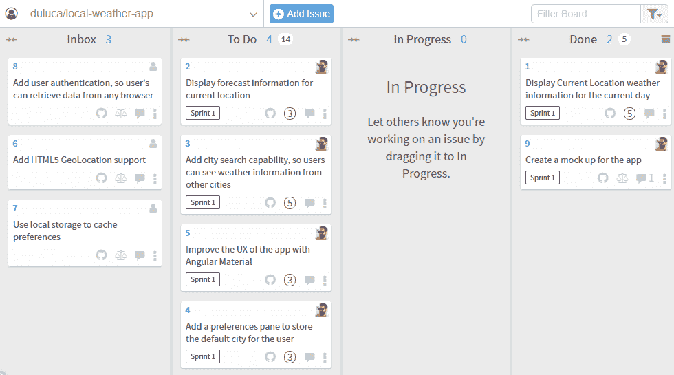

Waffle.io 看板状态

# 总结

恭喜，在这一章中，你创建了你的第一个具有灵活架构的 Angular 应用程序，同时避免了过度设计。这是可能的，因为我们首先建立了一个路线图，并将其编码在一个可见于你的同行和同事的看板中。我们专注于实施我们放在进行中的第一个功能，没有偏离计划。

您现在可以使用 Angular CLI 和优化的 VS Code 开发环境来帮助您减少编码量。您可以利用 TypeScript 匿名类型和可观察流来准确地将复杂的 API 数据重塑为简单的格式，而无需创建一次性接口。

通过主动声明函数的输入和返回类型，并使用通用函数来避免编码错误。您使用了日期和十进制管道来确保数据按预期格式化，同时将与格式相关的问题大部分留在模板中，因为这种逻辑属于模板的范围。

最后，您使用接口在组件和服务之间进行通信，而不会将外部数据结构泄露给内部组件。通过结合应用 Angular、RxJS 和 TypeScript 允许我们执行的所有这些技术，您已确保了关注点的正确分离和封装。因此，`CurrentWeather`组件现在是一个真正可重用和可组合的组件；这不是一件容易的事情。

如果你不发布它，它就永远不会发生。在下一章中，我们将通过解决应用程序错误和使用 Docker 对 Angular 应用程序进行容器化，为其生产发布做准备，以便可以在 web 上发布。
