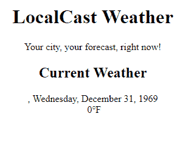
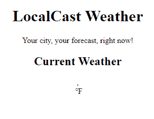
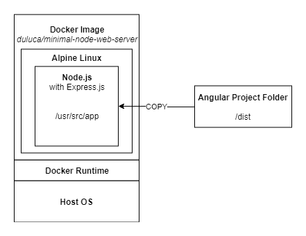
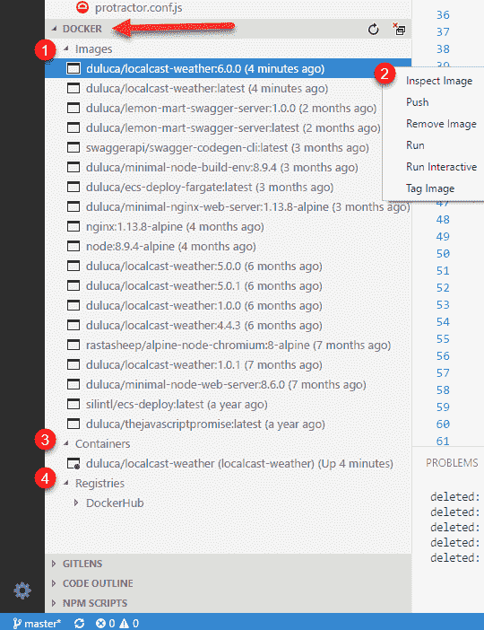
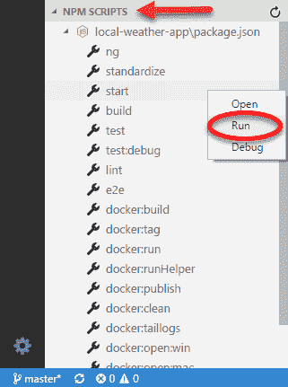

# 第十章：准备 Angular 应用程序进行生产发布

如果你没有上线它，那就好像它从来没有发生过。在前一章中，你创建了一个可以检索当前天气数据的本地天气应用程序。你已经创造了一定的价值；然而，如果你不将你的应用程序上线，最终你将得不到任何价值。交付某物很困难，将其投入生产甚至更加困难。你希望遵循一个能够产生可靠、高质量和灵活发布的策略。

我们在第九章中创建的应用程序，*创建本地天气 Web 应用程序*，比较脆弱。我们需要能够单独交付前端应用程序，而不必与后端应用程序一起处理，这是保持灵活性的重要解耦，以便能够推送独立的应用程序和服务器更新。此外，解耦将确保当应用程序堆栈中的各种工具和技术不可避免地不受支持或不受欢迎时，您将能够替换前端或后端，而无需全面重写系统。

在这一章中，你将学习以下内容：

+   防范空数据

+   使用 Docker 容器化应用程序

+   使用 Zeit Now 将应用程序上线到 Web 上

所需软件列举如下：

+   Docker 社区版版本 17.12

+   Zeit Now 账户

# 在 Angular 中进行空值保护

在 JavaScript 中，`undefined` 和 `null` 值是必须主动处理的持久问题。在 Angular 中，有多种方法可以防范 `null` 值：

1.  属性初始化

1.  安全导航操作符 `?.`

1.  使用 `*ngIf` 进行空值保护

# 属性初始化

在诸如 Java 等静态类型语言中，正确的变量初始化/实例化是无误操作的关键。因此，让我们在 `CurrentWeatherComponent` 中尝试通过使用默认值来初始化当前值：

```ts
src/app/current-weather/current-weather.component.ts
constructor(private weatherService: WeatherService) {
  this.current = {
    city: '',
    country: '',
    date: 0,
    image: '',
    temperature: 0,
    description: '',
  }
}
```

这些更改的结果将将控制台错误从 12 个减少到 3 个，此时您将只看到 API 调用相关的错误。但是，应用程序本身不会处于可展示状态，如下所示：



属性初始化的结果

要使此视图对用户呈现，我们必须对模板上的每个属性编写默认值的代码。因此，通过初始化解决了空保护问题，我们创建了一个默认值处理问题。对于开发人员来说，初始化和默认值处理都是 *O(n)* 规模的任务。在最好的情况下，这种策略将令人厌烦，而在最坏的情况下，效果极差且容易出错，最低要求每个属性的工作量达到 *O(2n)*。

# 安全导航操作符

Angular 实现了安全导航操作 `?.` 以防止意外遍历未定义的对象。因此，我们不需要撰写初始化代码并处理模板数值，而是只需更新模板：

```ts
src/app/current-weather/current-weather.component.html
<div>
  <div>
    <span>{{current?.city}}, {{current?.country}}</span>
    <span>{{current?.date | date:'fullDate'}}</span>
  </div>
  <div>
    
    <span>{{current?.temperature}}℉</span>
  </div>
  <div>
    {{current?.description}}
  </div>
</div>
```

这一次，我们不必设置默认值，让 Angular 处理显示未定义的绑定。你会注意到，就像初始化修复一样，错误从 12 个减少到 3 个。应用本身的状态也稍微好了一些。不再显示混乱的数据；但现在还不是一个可以展示的状态，如下所示：



安全导航操作符的结果

你可能能想象出在更复杂的情况下安全导航操作符可以派上用场。然而，当规模化部署时，这种类型的编码仍然需要至少*O(n)*级别的工作量来实现。

# 使用*ngIf 进行 null 值保护。

理想策略是使用`*ngIf`，这是一个结构性指令，意味着 Angular 会在假语句之后停止遍历 DOM 树元素。

在`CurrentWeather`组件中，我们可以在尝试渲染模板之前轻松地检查`current`变量是否为 null 或 undefined：

1.  更新顶层的`div`元素，用`*ngIf`来检查`current`是否为对象，如下所示：

```ts
src/app/current-weather/current-weather.component.html <div *ngIf="current">
  ...
</div>
```

现在观察控制台日志，没有错误报告。你必须确保你的 Angular 应用程序不会报告任何控制台错误。如果您仍然在控制台日志中看到错误，请确保已经正确恢复了`OpenWeather`网址到其正确的状态，或者关闭并重新启动`npm start`进程。我强烈建议你在继续之前解决任何控制台错误。一旦您解决了所有错误，请确保再次提交您的代码。

1.  提交你的代码。

# 使用 Docker 容器化应用程序

Docker [docker.io](http://docker.io) 是一个用于开发、部署和运行应用程序的*开放平台*。Docker 结合了*轻量级*的容器虚拟化平台和用于管理和部署应用程序的工作流程和工具。**虚拟机**（**VMs**）和 Docker 容器之间最明显的区别在于，VMs 通常占用数十 GB 的空间并且需要 GB 级别的内存，而容器仅需要 MB 级别的磁盘和内存空间。此外，Docker 平台将主机**操作系统**（**OS**）级别的配置设置抽象掉，所以成功运行应用程序所需的每个配置设置都被编码在易读的 Dockerfile 格式中，如下所示：

```ts
Dockerfile
FROM duluca/minimal-node-web-server:8.11.1
WORKDIR /usr/src/app
COPY dist public
```

前面的文件描述了一个继承自名为`duluca/minimal-node-web-server`的容器的新容器，将工作目录更改为`/usr/src/app`，然后将开发环境中`dist`文件夹的内容复制到容器的`public`文件夹中。在这种情况下，父镜像配置了一个 Express.js 服务器，充当 Web 服务器以提供`public`文件夹中的内容。

参考下图，以可视化表示正在发生的事情：



Docker 镜像的上下文

在基础层是我们的宿主操作系统，比如 Windows 或 macOS，运行 Docker 运行时，这将在下一节中安装。Docker 运行时能够运行自包含的 Docker 镜像，这是由上述的`Dockerfile`定义的。`duluca/minimal-node-web-server`基于轻量级的 Linux 操作系统 Alpine。Alpine 是 Linux 的一个完全简化版本，没有任何图形界面、驱动程序，甚至大部分你可能期望从 Linux 系统中获得的 CLI 工具。因此，这个操作系统的大小只有约 5MB。基础包然后安装了 Node.js，这本身的大小约为 10MB，以及我的自定义基于 Node.js 的 Express.js Web 服务器，最终会产生一个小巧的约 15MB 的镜像。Express 服务器被配置为提供`/usr/src/app`文件夹的内容。在前面的`Dockerfile`中，我们只需将我们开发环境中`/dist`文件夹的内容复制并放入`/usr/src/app`文件夹中。我们将稍后构建和执行这个镜像，这将运行我们的 Express Web 服务器，其中包含了我们`dist`文件夹的输出。

Docker 的美妙之处在于，你可以访问[`hub.docker.com`](https://hub.docker.com)，搜索`duluca/minimal-node-web-server`，阅读它的`Dockerfile`，并追溯其起源一直到构成 web 服务器基础的原始基础镜像。我鼓励你以这种方式审核你使用的每个 Docker 镜像，以了解它究竟为你的需求带来了什么。你可能会发现它要么过度复杂，要么具有你之前不知道的功能，可以让你的生活变得更加容易。请注意，父镜像需要特定版本的`duluca/minimal-node-web-server`，在`8.11.1`处。这是完全有意的，作为读者，你应该选择你发现的 Docker 镜像的最新可用版本。然而，如果你不指定版本号，你将总是得到镜像的最新版本。随着镜像的发布更多版本，你可能拉取将来会破坏你的应用程序的某个版本。因此，始终为你依赖的镜像指定版本号。

其中一个例子就是内置了 HTTPS 重定向支持的`duluca/minimal-node-web-server`。你可能会花费无数小时尝试设置一个 Nginx 代理来完成同样的事情，而你只需要在你的 Dockerfile 中添加以下行即可：

```ts
ENV ENFORCE_HTTPS=xProto
```

就像 npm 包一样，Docker 可以带来极大的便利和价值，但你必须小心，了解你正在使用的工具。

在第十六章中，*AWS 上的高可用云基础设施*，我们提到了基于 Nginx 的低占用资源的 docker 镜像的使用。如果你熟悉配置`nginx`，你可以以`duluca/minimal-nginx-web-server`作为你的基础镜像。

# 安装 Docker

为了能够构建和运行容器，你必须首先在你的计算机上安装 Docker 执行环境。

Docker 在 Windows 上的支持可能会有挑战。您必须拥有支持虚拟化扩展的 CPU 的 PC，这在笔记本电脑上并非一定能保证。您还必须拥有启用了 Hyper-V 的 Pro 版 Windows。另一方面，Windows Server 2016 对 Docker 有原生支持，这是微软对业界采用 Docker 和容器化所展现的空前支持。

1.  通过执行以下命令安装 Docker：

对于 Windows：

```ts
PS> choco install docker docker-for-windows -y

```

对于 macOS：

```ts
$ brew install docker
```

1.  执行 `docker -v` 来验证安装。

# 设置 Docker 脚本

现在，让我们配置一些 Docker 脚本，您可以用来自动构建、测试和发布您的容器。我开发了一套名为**npm Scripts for Docker** 的脚本，适用于 Windows 10 和 macOS。您可以在 [bit.ly/npmScriptsForDocker](http://bit.ly/npmScriptsForDocker) 获取这些脚本的最新版本：

1.  在 [`hub.docker.com/`](https://hub.docker.com/) 上注册一个 Docker Hub 帐户

1.  为您的应用程序创建一个公共（免费）仓库

不幸的是，在出版时，Zeit 不支持私有 Docker Hub 仓库，因此您的唯一选择是公开发布您的容器。如果您的图像必须保持私有，我建议您按照《第十六章》《AWS 上的高可用云基础设施》中描述的方式设置 AWS ECS 环境。您可以通过访问 Zeit Now 的文档 [zeit.co/docs/deployment-types/docker](https://zeit.co/docs/deployment-types/docker) 了解问题的情况。

1.  更新 `package.json` 以添加一个新的配置属性，具有以下配置属性：

```ts
package.json
  ...
  "config": {
    "imageRepo": "[namespace]/[repository]",
    "imageName": "custom_app_name",
    "imagePort": "0000"
  },
 ...
```

命名空间将是您的 DockerHub 用户名。您在创建过程中将定义您的仓库名称。例如，一个示例图像仓库变量应如下所示 `duluca/localcast-weather`。图像名称用于轻松识别您的容器，同时使用类似于 `docker ps` 的 Docker 命令。我将自己的命名为 `localcast-weather`。端口将定义从容器内部公开您的应用程序应使用的端口。因为我们在开发中使用 `5000`，请选择一个不同的端口，比如 `8080`。

1.  通过复制粘贴从 [bit.ly/npmScriptsForDocker](http://bit.ly/npmScriptsForDocker) 中获取的脚本，向 `package.json` 中添加 Docker 脚本。以下是脚本的注释版本，解释了每个函数：

注意，使用 npm 脚本时，`pre` 和 `post` 关键词用于在给定脚本的执行之前或之后，分别执行辅助脚本。脚本故意被分解为更小的部分，以使其更易于阅读和维护：

```ts
package.json
...
  "scripts": {
    ...
    "predocker:build": "npm run build",
    "docker:build": "cross-conf-env docker image build . -t $npm_package_config_imageRepo:$npm_package_version",
    "postdocker:build": "npm run docker:tag",
    ...
```

运行 `npm run docker:build` 将在 `pre` 中构建您的 Angular 应用程序，然后使用 `docker image build` 命令构建 Docker 镜像，并在 `post` 中为镜像打上版本号：

```ts
package.json
    ...
    "docker:tag": " cross-conf-env docker image tag $npm_package_config_imageRepo:$npm_package_version $npm_package_config_imageRepo:latest",
    ...
```

`npm run docker:tag`将使用`package.json`中的`version`属性的版本号和`latest`标签对已构建的 Docker 镜像进行标记：

```ts
package.json
    ...
    "docker:run": "run-s -c docker:clean docker:runHelper",
    "docker:runHelper": "cross-conf-env docker run -e NODE_ENV=local --name $npm_package_config_imageName -d -p $npm_package_config_imagePort:3000 $npm_package_config_imageRepo",
    ...
```

`npm run docker:run`将删除先前版本的镜像，并使用`docker run`命令运行已构建的镜像。请注意，`imagePort`属性将作为 Docker 镜像的外部端口，映射到 Node.js 服务器监听的镜像的内部端口`3000`：

```ts
package.json
    ...
    "predocker:publish": "echo Attention! Ensure `docker login` is correct.",
    "docker:publish": "cross-conf-env docker image push $npm_package_config_imageRepo:$npm_package_version",
    "postdocker:publish": "cross-conf-env docker image push $npm_package_config_imageRepo:latest",
    ...
```

`npm run docker:publish`将发布构建的镜像到配置的存储库，这种情况下是 Docker Hub，使用`docker image push`命令。首先发布带版本号的镜像，然后发布标记为`latest`的镜像。

```ts
package.json
    ...
    "docker:clean": "cross-conf-env docker rm -f $npm_package_config_imageName",
    ...
```

`npm run docker:clean`将从您的系统中删除先前构建的镜像版本，使用`docker rm -f`命令：

```ts
package.json
    ...
    "docker:taillogs": "cross-conf-env docker logs -f $npm_package_config_imageName",
    ...
```

`npm run docker:taillogs`会使用`docker log -f`命令显示运行中 Docker 实例的内部控制台日志，这是调试 Docker 实例时非常有用的工具：

```ts
package.json
    ...
    "docker:open:win": "echo Trying to launch on Windows && timeout 2 && start http://localhost:%npm_package_config_imagePort%",
    "docker:open:mac": "echo Trying to launch on MacOS && sleep 2 && URL=http://localhost:$npm_package_config_imagePort && open $URL",
    ...
```

`npm run docker:open:win`或`npm run docker:open:mac`将等待 2 秒，然后使用`imagePort`属性以正确的 URL 启动浏览器访问您的应用程序：

```ts
package.json
    ...
    "predocker:debug": "run-s docker:build docker:run",
    "docker:debug": "run-s -cs docker:open:win docker:open:mac docker:taillogs"
  },
...
```

`npm run docker:debug`将构建您的镜像，并在`pre`中运行它的一个实例，打开浏览器，然后开始显示容器的内部日志。

1.  安装两个开发依赖项，以确保脚本的跨平台功能：

```ts
$ npm i -D cross-conf-env npm-run-all
```

1.  在构建镜像之前，自定义预构建脚本以执行单元测试和 e2e 测试：

```ts
package.json
"predocker:build": "npm run build -- --prod --output-path dist && npm test -- --watch=false && npm run e2e",
```

请注意，`npm run build --prod`提供了`--prod`参数，实现了两件事情：

1. 开发时间的 2.5 MB 负载被优化到~73kb 或更少

2. 在运行时使用`src/environments/environment.prod.ts`中定义的配置项

1.  更新`src/environments/environment.prod.ts`以使用来自`OpenWeather`的自己的`appId`：

```ts
export const environment = {
  production: true,
  appId: '01ffxxxxxxxxxxxxxxxxxxxxxxxxxxxx',
  baseUrl: 'https://',
}
```

我们正在修改`npm test`的执行方式，以便测试只运行一次，工具停止执行。提供`--watch=false`选项以实现这种行为，与默认的开发友好的持续执行行为相反。此外，提供了`npm run build --output-path dist`，以确保`index.html`发布在文件夹的根目录。

1.  创建一个名为`Dockerfile`的新文件，没有任何文件扩展名

1.  实现如下`Dockerfile`：

```ts
Dockerfile
FROM duluca/minimal-node-web-server:8.11.1
WORKDIR /usr/src/app
COPY dist public
```

确保检查`dist`文件夹的内容。确保`index.html`位于`dist`的根目录。否则，请确保您的`Dockerfile`将包含具有`index.html`的文件夹复制到其根目录。

1.  执行`npm run predocker:build`以确保您的应用程序更改已成功

1.  执行`npm run docker:build`以确保您的镜像成功构建

虽然您可以单独运行提供的任何脚本，但实际上只需要记住其中两个：

+   **npm run docker:debug**会测试，构建，标记，运行，在新的浏览器窗口中为测试启动你的容器化应用程序

+   **npm run docker:publish**将会把你刚才构建并测试的镜像发布到在线 Docker 仓库

1.  在你的终端中执行`docker:debug`:

```ts
$ npm run docker:debug
```

你会注意到脚本在终端窗口显示错误。这些不一定是失败的指标。脚本还不够完善，因此它们同时尝试 Windows 和 macOS 兼容的脚本，并且在第一次构建时，清理命令会失败，因为没有需要清理的东西。等你看到这段话的时候，我可能已经发布了更好的脚本；如果没有，你可以随时提交合并请求。

成功的`docker:debug`运行会在焦点浏览器窗口中显示你的应用程序，并在终端中显示服务器日志，如下所示：

```ts
Current Environment: local.
Server listening on port 3000 inside the container
Attenion: To access server, use http://localhost:EXTERNAL_PORT
EXTERNAL_PORT is specified with 'docker run -p EXTERNAL_PORT:3000'. See 'package.json->imagePort' for th
e default port.
GET / 304 12.402 ms - -
GET /styles.d41d8cd98f00b204e980.bundle.css 304 1.280 ms - -
GET /inline.202587da3544bd761c81.bundle.js 304 11.117 ms - -
GET /polyfills.67d068662b88f84493d2.bundle.js 304 9.269 ms - -
GET /vendor.c0dc0caeb147ad273979.bundle.js 304 2.588 ms - -
GET /main.9e7f6c5fdb72bb69bb94.bundle.js 304 3.712 ms - -
```

你应该经常运行`docker ps`来检查你的镜像是否在运行，上次更新时间，或者它是否与现有镜像发生端口冲突。

1.  在你的终端中执行 `docker:publish` :

```ts
$ npm run docker:publish
```

你应该在终端窗口中看到类似这样的成功运行信息：

```ts
The push refers to a repository [docker.io/duluca/localcast-weather]
60f66aaaaa50: Pushed
...
latest: digest: sha256:b680970d76769cf12cc48f37391d8a542fe226b66d9a6f8a7ac81ad77be4f58b size: 2827
```

随着时间的推移，你本地的 Docker 缓存可能会增长到相当大的规模，在我笔记本上大约是两年时间内增长了大约 40 GB。你可以使用 `docker image prune` 和 `docker container prune` 命令来减小缓存的大小。更详细的信息，请参考[`docs.docker.com/config/pruning`](https://docs.docker.com/config/pruning)的文档。

接下来让我们看一种更简单的与 Docker 进行交互的方式。

# VS Code 中的 Docker 扩展

与 Docker 镜像和容器进行交互的另一种方式是通过 VS Code。如果你按照第九章*，创建本地天气 Web 应用程序*中建议的安装了`PeterJausovec.vscode-docker` Docker 扩展，你会在 VS Code 的资源管理器窗格中看到一个名为 DOCKER 的可展开标题，如下截图所示所指出的部分:



VS Code 中的 Docker 扩展

让我们来看看该扩展提供的一些功能:

1.  **Images**包含系统上存在的所有容器快照的列表

1.  在 Docker 镜像上右键单击会弹出上下文菜单，以运行各种操作，比如 run，push 和 tag

1.  **Containers**列出了系统上所有存在的可执行 Docker 容器，你可以启动、停止或连接到它们

1.  **Registries**显示你配置的连接到的注册表，比如 DockerHub 或 AWS Elastic Container Registry

虽然该扩展使与 Docker 进行交互更容易，但**用于 Docker 的 npm 脚本**可以自动化许多与构建、标记和测试镜像相关的琐事。它们是跨平台的，而且在持续集成环境中同样有效。

通过 CLI 与 npm 脚本进行交互可能会让你感到困惑。接下来让我们看一下 VS Code 的 npm 脚本支持。

# VS Code 中的 NPM 脚本

VS Code 提供了对 npm 脚本的支持。 为了启用 npm 脚本资源管理器，打开 VS Code 设置，并确保存在 `"npm.enableScriptExplorer": true` 属性。 一旦你这样做，你将在资源管理器窗格中看到一个可扩展的名称为 NPM SCRIPTS 的标题，如下箭头所示：



VS Code 中的 NPM 脚本

您可以单击任何脚本来启动包含脚本的 `package.json` 文件中的行，或者右键单击并选择运行以执行脚本。

# 部署容器化应用

如果从编码角度交付产品很困难，那么从基础设施角度来看，做到正确更是极其困难。 在后面的章节中，我将讨论如何为您的应用程序提供世界一流的 AWS **弹性容器服务**（**ECS**）基础设施，但如果您需要快速展示一个想法，这是没有帮助的。 这就是 Zeit Now 的作用。

# Zeit Now

Zeit Now，[`zeit.co/now`](https://zeit.co/now)，是一个多云服务，可以直接从 CLI 实现应用程序的实时全球部署。 Now 适用于正确实现 `package.json` 或 `Dockerfile` 的应用程序。 即使我们两者都做了，我们仍然更喜欢部署我们的 Docker image，因为在幕后会应用更多的魔法来使 `package.json` 的部署工作，而您的 Docker image 可以部署到任何地方，包括 AWS ECS。

# 配置 Now CLI 工具

现在，让我们配置 Zeit Now 在您的存储库上运行：

1.  通过执行`npm i -g now`安装 Zeit Now

1.  通过执行 `now -v` 确保正确安装

1.  在 `local-weather-app` 下创建一个名为 `now` 的新文件夹

1.  在新的 `now` 文件夹下创建一个新的 `Dockerfile`

1.  实现从您刚刚发布的镜像中提取文件：

```ts
now/Dockerfile
FROM duluca/localcast-weather:6.0.1
```

1.  最后，在您的终端中执行 `now` 命令并按照说明完成配置：

```ts
$ now
> No existing credentials found. Please log in:
> We sent an email to xxxxxxxx@gmail.com. Please follow the steps provided
 inside it and make sure the security code matches XXX XXXXX.
√ Email confirmed
√ Fetched your personal details
> Ready! Authentication token and personal details saved in "~\.now"
```

# 部署

在 Zeit Now 上部署非常容易：

1.  将工作目录更改为 `now` 并执行命令： 

```ts
$ now --docker --public
```

1.  在终端窗口中，该工具将报告其进度和您可以访问您现在发布的应用程序的 URL：

```ts
> Deploying C:\dev\local-weather-app\web-app\now under duluca
> Ready! https://xxxxxxxxxxxxx.now.sh [3s]
> Initializing...
> Building
> ▲ docker build
Sending build context to Docker daemon 2.048 kBkB
> Step 1 : FROM duluca/localcast-weather
> latest: Pulling from duluca/localcast-weather
...
> Deployment complete!
```

1.  导航到第二行列出的 URL 并验证您的应用程序的发布。

请注意，如果您在配置过程中出现错误，您的浏览器可能会显示一个错误，指示此页面正在尝试加载不安全的脚本，请允许并重新加载以查看您的应用程序。

您可以探索 Zeit Now 的付费功能，这些功能允许为您的应用程序提供高级功能，例如自动缩放。

恭喜，您的应用程序已经在互联网上启动了！

# 总结

在本章中，你学会了如何通过防范空数据来最好地避免 Angular 控制台错误。你已经配置好系统以便与 Docker 协同工作，并成功地将你的 Web 应用程序与专用的 Web 服务器容器化。你还为 Docker 配置了项目并利用了 npm 脚本，这些脚本可以被任何团队成员利用。最后，你成功地将 Web 应用程序交付到了云端。

现在你知道如何构建一个可靠、弹性、并且容器化的生产就绪 Angular 应用程序，以允许灵活的部署策略。在下一章中，我们将改善应用程序的功能集，并使用 Angular Material 使其看起来更加出色。
