# 第十一章：使用 Angular Material 增强 Angular 应用

在第十章*，为生产发布准备 Angular 应用*中，我们提到需要提供高质量的应用程序。目前，这个应用程序看起来和感觉都很糟糕，仿佛只适用于上个世纪 90 年代末创建的网站。用户或客户对你的产品或工作的第一印象非常重要，所以我们必须创建一个外观出色、并且在移动和桌面浏览器中提供出色用户体验的应用程序。

作为全栈开发人员，很难专注于你的应用程序的完善。当应用程序的功能集迅速增长时，情况会变得更糟。在匆忙中使用 CSS hack 和内联样式，从而改善你的应用程序，这样做将会使你不再写出优质模块化的代码支持视图，而是沦为一名伟大的代码写手。

Angular Material 是与 Angular 紧密协作开发的惊人库。如果你学会如何有效地利用 Angular Material，你创建的功能将会从一开始就看起来和操作起来非常棒，无论你是在开发小型还是大型应用程序。Angular Material 会使你成为一名更加高效的网页开发人员，因为它附带了各种用户控件，你可以利用它们，而且你不必担心浏览器兼容性。作为额外的奖励，编写自定义 CSS 将变得十分罕见。

在本章中，你将学到以下内容：

+   如何配置 Angular Material

+   使用 Angular Material 升级 UX

# 将 Material 组件添加到你的应用中

现在我们已经安装了各种依赖项，我们可以开始修改我们的 Angular 应用，以添加 Material 组件。我们将添加一个工具栏、Material 设计卡片元素，并涵盖基本布局技术，以及辅助功能和排版方面的问题。

# Angular Material 的生成器原理图

随着 Angular 6 和引入原理图的推出，像 Material 这样的库可以提供自己的代码生成器。目前，Angular Material 随附三个基本生成器，用于创建带有侧边导航、仪表板布局或数据表的 Angular 组件。你可以在[`material.angular.io/guide/schematics`](https://material.angular.io/guide/schematics)了解更多关于生成器原理图的信息。

比如，你可以通过执行以下操作创建一个侧边导航布局：

```ts
$ ng generate @angular/material:material-nav --name=side-nav 

CREATE src/app/side-nav/side-nav.component.css (110 bytes)
CREATE src/app/side-nav/side-nav.component.html (945 bytes)
CREATE src/app/side-nav/side-nav.component.spec.ts (619 bytes)
CREATE src/app/side-nav/side-nav.component.ts (489 bytes)
UPDATE src/app/app.module.ts (882 bytes)
```

此命令会更新`app.module.ts`，直接在该文件中导入 Material 模块，打破了我之前提出的`material.module.ts`的模式。此外，一个新的`SideNavComponent`被添加到应用程序作为一个单独的组件，但如同在第十四章中的*侧边导航*部分中所提到的，*设计验证和授权*，这样的导航体验需要在你的应用程序的非常根本部分实现。

简而言之，Angular Material Schematics 承诺使向 Angular 应用程序添加各种 Material 模块和组件变得更加轻松；然而，就提供的功能而言，这些模式并不适合创建本书追求的灵活、可扩展和良好架构的代码库。

目前，我建议将这些模式用于快速原型设计或实验目的。

现在，让我们开始手动向 LocalCast Weather 添加一些组件。

# 使用 Material 工具栏修改着陆页

在我们开始对`app.component.ts`进行进一步更改之前，让我们将组件切换为使用内联模板和内联样式，这样我们就不必在相对简单的组件上来回切换文件了。

1.  更新 `app.component.ts` 以使用内联模板

1.  删除 `app.component.html` 和 `app.component.css`

```ts
src/app/app.component.ts import { Component } from '@angular/core'

@Component({
  selector: 'app-root',
  template: `
    <div style="text-align:center">
      <h1>
      LocalCast Weather
      </h1>
      <div>Your city, your forecast, right now!</div>
      <h2>Current Weather</h2>
      <app-current-weather></app-current-weather>
    </div>
  `
})
export class AppComponent {}
```

让我们通过实现全局工具栏来改进我们的应用程序：

1.  观察`app.component.ts`中的`h1`标签：

```ts
src/app/app.component.ts
<h1>
  LocalCast Weather
</h1>
```

1.  使用 `mat-toolbar` 更新`h1`标签：

```ts
src/app/app.component.ts    
<mat-toolbar>
  <span>LocalCast Weather</span>
</mat-toolbar>
```

1.  观察结果；您应该会看到一个工具栏，如图所示：

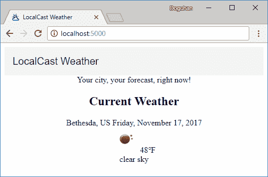

LocalCast 天气工具栏

1.  用更引人注目的颜色更新`mat-toolbar`：

```ts
src/app/app.component.ts    
<mat-toolbar color="primary">
```

为了更加原生的感觉，工具栏紧贴浏览器边缘非常重要。无论是在大屏幕还是小屏幕格式上都能很好地发挥作用。此外，当您将可点击的元素（例如汉堡菜单或帮助按钮）放在工具栏的最左侧或最右侧时，您将避免用户点击空白处的潜在可能性。这就是为什么 Material 按钮的点击区域实际上比视觉上表示的要大。这在打造无需挫折的用户体验方面有很大的不同：

```ts
src/styles.css
body {
  margin: 0;
}
```

这对这个应用程序不适用，然而，如果您正在构建一个密集的应用程序，您会注意到您的内容将延伸到应用程序的边缘，这不是一个理想的结果。考虑将内容区域包装在一个 div 中，并使用 css 应用适当的边距，如图所示：

```ts
src/styles.css
.content-margin {
  margin-left: 8px;
  margin-right: 8px;
}
```

在下一个截图中，您可以看到应用了主要颜色的边到边工具栏：

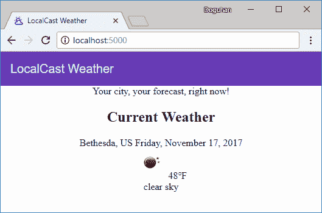

用改进后的工具栏的 LocalCast 天气

# 用 Material Card 表示天气

Material card 是一个很好的容器，用于表示当前的天气信息。卡片元素周围有一个投影，将内容与周围的环境区分开来：

1.  在 `material.module` 中导入`MatCardModule`：

```ts
src/app/material.module.ts
import { ..., MatCardModule} from '@angular/material'
...
@NgModule({
  imports: [..., MatCardModule],
  exports: [..., MatCardModule],
})
```

1.  在 `app.component` 中，用 `<mat-card>` 包围`<app-current-weather>`:

```ts
src/app/app.component.ts
  <div style="text-align:center">
    <mat-toolbar color="primary">
      <span>LocalCast Weather</span>
    </mat-toolbar>
    <div>Your city, your forecast, right now!</div>
    <mat-card>
      <h2>Current Weather</h2>
      <app-current-weather></app-current-weather>
    </mat-card>
  </div>
```

1.  观察几乎无法区分的卡片元素，如图所示：

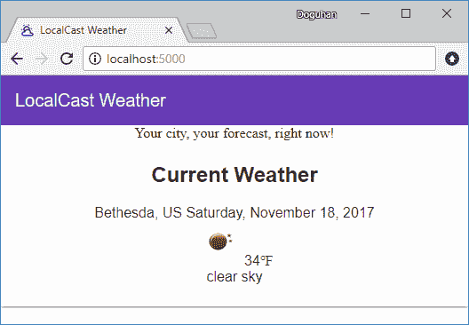

LocalCast 天气的难以区分的卡片

为了更好地布局屏幕，我们需要切换到 Flex 布局引擎。从组件模板中删除这些 "训练轮"：

1.  从周围的 `<div>` 中删除`style="text-align:center"`：

要在页面中心放置一个元素，我们需要创建一行，对中心元素分配宽度，并在两侧创建两个额外的列，可以弹性伸展以占用空白部分，如下所示：

```ts
src/app/app.component.ts
<div fxLayout="row">
  <div fxFlex></div>
  <div fxFlex="300px">  
    ...
  </div>
  <div fxFlex></div>
</div>
```

1.  用前面的 HTML 包围`<mat-card>`

1.  请注意，卡片元素已正确居中，如下所示：

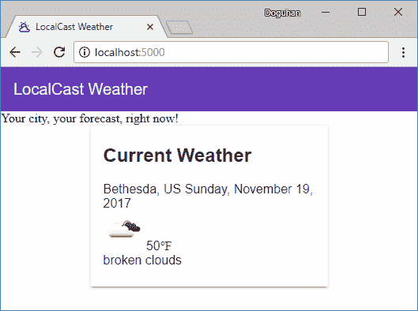

LocalCast Weather 与居中的卡片

通过阅读卡片文档并查看 Material 文档站点上的示例，您将注意到`mat-card`提供了容纳标题和内容的元素。我们将在接下来的部分实现这个。

在[material.angular.io](https://material.angular.io)上，您可以通过点击括号图标查看任何示例的源代码，或者点击箭头图标在 Plunker 上启动一个工作示例。

# 辅助功能

利用这样的 Material 功能可能会感到多余；然而，设计应用程序时，您必须考虑响应性、样式、间距和可访问性问题。Material 团队已经付出了很多努力，以便您的代码在大多数情况下可以正确工作，并为尽可能多的用户群提供高质量的用户体验。这可能包括视障人士或以键盘为主的用户，他们必须依赖专门的软件或键盘功能（如标签）来浏览您的应用。利用 Material 元素为这些用户提供了关键的元数据，以便他们能够浏览您的应用。

Material 声明支持以下屏幕阅读器软件：

+   在 IE / FF / Chrome（Windows）上使用 NVDA 和 JAWS

+   使用 iOS 上的 Safari 和 OSX 上的 Safari / Chrome 的 VoiceOver

+   使用 Chrome 上的 TalkBack

# 卡片标题和内容

现在，让我们实现`mat-card`的标题和内容元素，如下所示：

```ts
src/app/app.component.ts    
<mat-toolbar color="primary">
  <span>LocalCast Weather</span>
</mat-toolbar>
<div>Your city, your forecast, right now!</div>
<div fxLayout="row">
  <div fxFlex></div>
  <mat-card fxFlex="300px">
    <mat-card-header>
      <mat-card-title>Current Weather</mat-card-title>
    </mat-card-header>
    <mat-card-content>
      <app-current-weather></app-current-weather>
    </mat-card-content>
  </mat-card>
  <div fxFlex></div>
</div>
```

使用 Material，少就是更多。您将注意到我们能够移除中心的`div`，并直接在居中卡片上应用`fxFlex`。所有材料元素都原生支持 Flex 布局引擎，这在复杂的 UI 中具有巨大的正面可维护性影响。

当我们应用`mat-card-header`后，您可以看到以下结果：

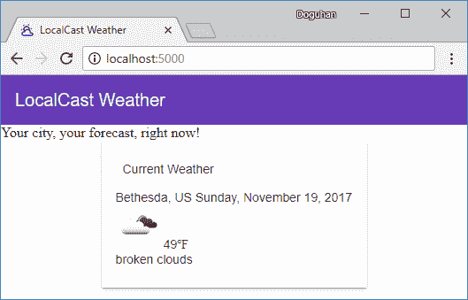

带标题和内容的 LocalCast Weather 卡片

请注意，卡片内的字体现在与 Material 的 Roboto 字体匹配。然而，"Current Weather"现在不再那么引人注目。如果您在`mat-card-title`内重新添加`h2`标签，"Current Weather"在视觉上看起来会更大；但是，字体不会与您应用程序的其他部分匹配。要解决此问题，您必须了解 Material 的排版功能。

# Material 排版

Material 的文档恰如其分地表述如下：

排版是一种排列类型以在显示时使文本易读、可读和吸引人的方法。

Material 提供了一种不同水平的排版，具有不同的字体大小、行高和字重特性，您可以将其应用到任何 HTML 元素，而不仅仅是默认提供的组件。

在下表中是您可以使用的 CSS 类，用于应用 Material 的排版，比如`<div class="mat-display-4">Hello, Material world!</div>`：

| **类名** | **用法** |
| --- | --- |
| `display-4`、`display-3`、`display-2` 和 `display-1` | 大而独特的标题，通常位于页面顶部（例如，主标题） |
| `headline ` | 对应`<h1>`标签的部分标题 |
| `title ` | 对应`<h2>`标签的部分标题 |
| `subheading-2` | 对应`<h3>`标签的部分标题 |
| `subheading-1` | 对应`<h4>`标签的部分标题 |
| `body-1` | 基本正文文本 |
| `body-2` | 更加粗体的正文文本 |
| `caption ` | 较小的正文和提示文本 |
| `button` | 按钮和链接 |

您可以在[`material.angular.io/guide/typography`](https://material.angular.io/guide/typography)了解更多关于 Material 排版的信息。

# 应用排版

有多种应用排版的方式。一种方式是利用`mat-typography`类，并使用相应的 HTML 标签如`<h2>`：

```ts
src/app/app.component.ts 
<mat-card-header class="mat-typography">
  <mat-card-title><h2>Current Weather</h2></mat-card-title>
</mat-card-header>
```

另一种方式是直接在元素上应用特定的排版，比如`class="mat-title"`：

```ts
src/app/app.component.ts 
<mat-card-title><div class="mat-title">Current Weather</div></mat-card-title>
```

注意，`class="mat-title"`可以应用于`div`、`span`或带有相同结果的`h2`。

通常来说，实现更具体和本地化的选项通常是更好的选择，也就是第二种实现方式。

# 将标语更新为居中对齐的标题排版

我们可以使用`fxLayoutAlign`将应用程序的标语居中，并赋予其一个柔和的`mat-caption`排版，如下所示：

1.  实现布局更改和标题排版：

```ts
src/app/app.component.ts 
<div fxLayoutAlign="center">
  <div class="mat-caption">Your city, your forecast, right now!</div>
</div>
```

1.  观察结果，如下所示：

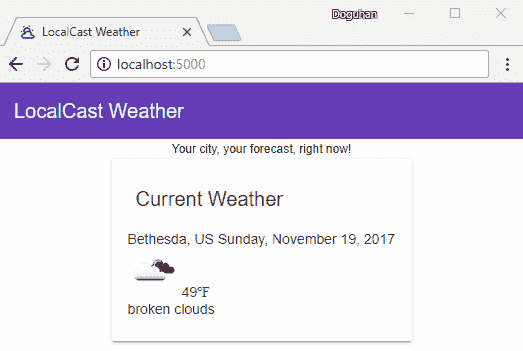

本地天气中心标语

# 更新当前天气卡片布局

还有更多工作要做，使 UI 看起来像设计一样，特别是当前天气卡片的内容，如下所示：


为了设计布局，我们将利用 Angular Flex。

您将编辑`current-weather.component.html`，它使用`<div>`和`<span>`标签来建立各个元素，这些元素可以分别存在于不同行或同一行。随着切换到 Angular Flex，我们需要将所有元素转换为`<div>`，并使用`fxLayout`指定行和列。

# 实现布局脚手架

我们需要首先实现粗略的脚手架。

考虑模板的当前状态：

```ts
 src/app/current-weather/current-weather.component.html
 1 <div *ngIf="current">
 2  <div>
 3    <span>{{current.city}}, {{current.country}}</span>
 4    <span>{{current.date | date:'fullDate'}}</span>
 5  </div>
 6  <div>
 7    
 8    <span>{{current.temperature | number:'1.0-0'}}℉</span>
 9  </div>
10  <div>
11    {{current.description}}
12  </div>
13 </div>
```

让我们一步步浏览文件并更新：

1.  在第 3、4 和 8 行更新`<span>`元素为`<div>`

1.  用`<div>`包裹``元素

1.  在第 2 和 6 行的有多个子元素的`<div>`元素中添加`fxLayout="row"`属性

1.  城市和国家列大约占据了屏幕的 2/3，所以在第 3 行的`<div>`元素中添加`fxFlex="66%"`

1.  在第 4 行的下一个`<div>`元素上添加`fxFlex`以确保它占据其余的水平空间

1.  在新的`<div>`元素（包围``元素）中添加`fxFlex="66%"`

1.  在第 4 行的下一个`<div>`元素中添加`fxFlex`

模板的最终状态应该如下所示：

```ts
 src/app/current-weather/current-weather.component.html
 1 <div *ngIf="current">
 2   <div fxLayout="row">
 3     <div fxFlex="66%">{{current.city}}, {{current.country}}</div>
 4     <div fxFlex>{{current.date | date:'fullDate'}}</div>
 5   </div>
 6   <div fxLayout="row">
 7     <div fxFlex="66%">
 8       
 9     </div>
10     <div fxFlex>{{current.temperature | number:'1.0-0'}}℉</div>
11   </div>
12   <div>
13    {{current.description}}
14  </div>
15 </div>
```

在添加 Angular Flex 属性时，你可以更详细一些；但是，你写的代码越多，未来的改动就会变得更加困难。例如，在第 12 行的`<div>`元素不需要`fxLayout="row"`，因为`<div>`会隐式换行。同样，在第 4 行和第 7 行，右侧的列不需要显式的`fxFlex`属性，因为它将自动被左侧元素压缩。

从网格布局的角度来看，你的元素现在都在正确的*单元格*中，如图所示：

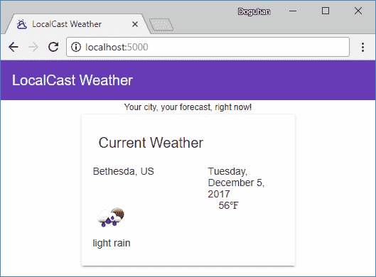

使用布局脚手架的本地天气

# 对齐元素

现在，我们需要对齐和设计每个单独的单元格以匹配设计。日期和温度需要右对齐，描述需要居中：

1.  要右对齐日期和温度，在`current-weather.component.css`中创建一个名为`.right`的新 CSS 类：

```ts
src/app/current-weather/current-weather.component.css
.right {
  text-align: right
}
```

1.  在第 4 行和第 10 行的`<div>`元素中添加`class="right"`

1.  以与本章前面居中应用标语相同的方式居中描述的`<div>`元素

1.  观察元素的正确对齐方式如下：

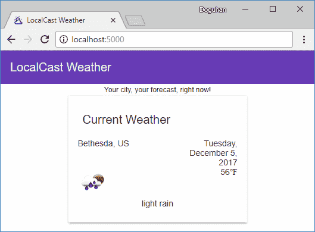

本地天气与正确的对齐方式

# 设计元素

最终设计元素的调整通常是前端开发中最费时的部分。我建议首先进行多次尝试，以便用最少的工作量获得足够接近设计的版本，然后让你的客户或团队决定是否值得投入额外的资源来花费更多时间来完善设计：

1.  添加新的 CSS 属性：

```ts
src/app/current-weather/current-weather.component.css
.no-margin {
  margin-bottom: 0
}
```

1.  对于城市名称，在第 3 行，添加`class="mat-title no-margin"`

1.  对于日期，在第 4 行，将`"mat-subheading-2 no-margin"`添加到`class="right"`中

1.  将日期的格式从`'fullDate'`改为`'EEEE MMM d'`以匹配设计

1.  修改``，在第 8 行添加`style="zoom: 175%"`

1.  对于温度，在第 10 行，附加`"mat-display-3 no-margin"`

1.  对于描述，在第 12 行，添加`class="mat-caption"`

这是模板的最终状态：

```ts
src/app/current-weather/current-weather.component.html
<div *ngIf="current">
  <div fxLayout="row">
    <div fxFlex="66%" class="mat-title no-margin">{{current.city}}, {{current.country}}</div>
    <div fxFlex class="right mat-subheading-2 no-margin">{{current.date | date:'EEEE MMM d'}}</div>
  </div>
  <div fxLayout="row">
    <div fxFlex="66%">
      
    </div>
    <div fxFlex class="right mat-display-3 no-margin">{{current.temperature | number:'1.0-0'}}℉</div>
  </div>
  <div fxLayoutAlign="center" class="mat-caption">
    {{current.description}}
  </div>
</div>
```

1.  观察你的代码输出的样式变化，如图所示：

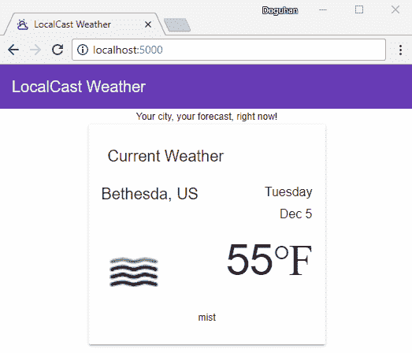

带有样式的本地天气

# 微调样式

标语可以受益于一些上下边距。这是我们可能会在整个应用程序中使用的常见 CSS，因此让我们将它放在`styles.css`中：

1.  实现`vertical-margin`：

```ts
src/styles.css
.vertical-margin {
  margin-top: 16px;
  margin-bottom: 16px;
}
```

1.  应用`vertical-margin`：

```ts
src/app/app.component.ts
<div class="mat-caption vertical-margin">Your city, your forecast, right now!</div>
```

当前天气具有与城市名称相同的样式；我们需要区分这两者。

1.  在`app.component.ts`中，使用`mat-headline`排版更新当前天气：

```ts
src/app/app.component.ts
<mat-card-title><div class="mat-headline">Current Weather</div></mat-card-title>
```

1.  图像和温度没有居中，因此在围绕第 6 行上下文中包含这些元素的行中添加`fxLayoutAlign="center center"`：

```ts
src/app/current-weather/current-weather.component.html
<div fxLayout="row" fxLayoutAlign="center center">
```

1.  观察您的应用程序的最终设计，应该如下所示：

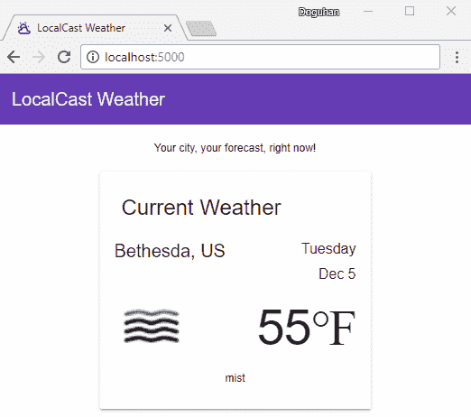

LocalCast 天气的最终设计

# 调整以匹配设计

这是一个您可能会花费大量时间的领域。如果我们遵循 80-20 法则，像素完美的微调通常成为最后的 20%，却需要花费 80%的时间来完成。让我们来研究我们的实现和设计之间的差异，以及弥合这一差距需要什么：

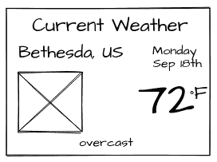

日期需要进一步定制。数字序数*th*丢失了；为了实现这一点，我们需要引入第三方库，比如 moment，或者实现我们自己的解决方案并将其绑定到模板上的日期旁边：

1.  更新`current.date`以附加序数：

```ts
src/app/current-weather/current-weather.component.html
{{current.date | date:'EEEE MMM d'}}{{getOrdinal(current.date)}}
```

1.  实现一个`getOrdinal`函数：

```ts
src/app/current-weather/current-weather.component.ts export class CurrentWeatherComponent implements OnInit {
...
  getOrdinal(date: number) {
    const n = new Date(date).getDate()
    return n > 0
      ? ['th', 'st', 'nd', 'rd'][(n > 3 &amp;&amp; n < 21) || n % 10 > 3 ? 0 : n % 10]
      : ''
  }
  ...
}
```

请注意，`getOrdinal`的实现归结为一个复杂的单行代码，不太可读，而且很难维护。这样的函数，如果对您的业务逻辑至关重要，应该进行严格的单元测试。

截至目前为止，Angular 6 不支持在日期模板中插入新的换行；理想情况下，我们应该能够将日期格式指定为`'EEEE\nMMM d'`，以确保换行始终一致。

温度的实现需要使用`<span>`元素将数字与单位分隔开，并用`<span class="unit">℉</span>`将其包围起来，其中 unit 是一个 CSS 类，可以使其看起来像上标元素。

1.  实现一个`unit`CSS 类：

```ts
src/app/current-weather/current-weather.component.css
.unit {
  vertical-align: super;
}
```

1.  应用`unit`：

```ts
src/app/current-weather/current-weather.component.html
...   
 7 <div fxFlex="55%">
...
10 <div fxFlex class="right no-margin">
11   <p class="mat-display-3">{{current.temperature | number:'1.0-0'}}
12     <span class="mat-display-1 unit">℉</span>
13   </p>
```

我们需要尝试调整第 7 行上的`fxFlex`值来确定预报图像应该占用多少空间。否则，温度将溢出到下一行，并且您的设置还会受到浏览器窗口大小的影响。例如，`60%`在小浏览器窗口下效果很好，但最大化时会造成溢出。然而，`55%`似乎满足了这两个条件：

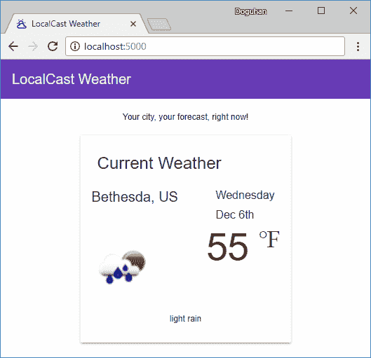

修正后的 LocalCast 天气

一如既往，进一步调整边距和填充以进一步定制设计是可能的。然而，每一次与库的偏离都会对维护性造成影响。除非您确实在建立一个以显示天气数据为中心的业务，否则您应该将进一步的优化推迟到项目的最后，如果时间允许的话。如果经验能够作为指导，您将不会进行这样的优化。

通过两个负的 margin-bottom hack，您可以获得一个与原始设计相当接近的设计，但是我不会在这里包含这些 hack，并留给读者在 GitHub 仓库中发现。这些 hack 有时是必要的恶，但一般来说，它们指向设计和实现现实之间的脱节。在调整部分之前的解决方案是甜蜜点，Angular Material 在那里繁荣：

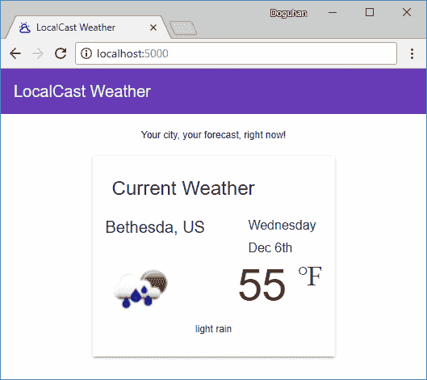

经过调整和 hack 的 LocalCast Weather

# 更新单元测试

为了保持您的单元测试运行，您需要将`MaterialModule`导入到任何使用 Angular Material 的组件的`spec`文件中：

```ts
*.component.spec.ts
...
  beforeEach(
    async(() => {
      TestBed.configureTestingModule({
        ...
        imports: [..., MaterialModule, NoopAnimationsModule],
      }).compileComponents()
    })
  )
```

您还需要更新任何测试，包括 e2e 测试，以查找特定的 HTML 元素。

例如，由于应用程序的标题 LocalCast Weather 不再在一个`h1`标签中，您必须更新`spec`文件以在`span`元素中查找它：

```ts
src/app/app.component.spec.ts
expect(compiled.querySelector('span').textContent).toContain('LocalCast Weather')
```

类似地，在 e2e 测试中，您需要更新您的页面对象函数以从正确的位置检索文本：

```ts
e2e/app.po.ts
getParagraphText() {
  return element(by.css('app-root mat-toolbar span')).getText()
}
```

# 更新 Angular Material

您可以使用`ng update`来快速无痛升级体验，应该如下所示：

```ts
$ npx ng update @angular/material
 Updating package.json with dependency @angular/cdk @ "6.0.0" (was "5.2.2")...
 Updating package.json with dependency @angular/material @ "6.0.0" (was "5.2.2")...
UPDATE package.json (5563 bytes)
```

此外，我发现了由 Angular 团队在[`github.com/angular/material-update-tool`](https://github.com/angular/material-update-tool)发布的`material-update-tool`。在当前形式下，该工具被宣传为一个特定的 Angular Material 5.x 到 6.0 的更新工具，因此它可能会成为未来`ng update`的一部分，就像`rxjs-tslint`工具一样。您可以按照下面的命令来运行该工具：

```ts
$ npx angular-material-updater -p .\src\tsconfig.app.json

√ Successfully migrated the project source files. Please check above output for issues that couldn't be automatically fixed.
```

如果幸运的话，一切顺利，可以随意跳过本节剩下的内容。本节的其余部分我将介绍我在开发本示例过程中遇到的一个涉及发布候选版本和 beta 版本的特定情景，这突显了手动更新的需求。首先，我们将意识到当前版本，然后发现最新可用版本，并最后升级和测试升级，就像我们手动更新 Angular 时那样。

# 更新 Angular Material

现在我们知道要升级到哪个版本，让我们继续进行升级：

1.  执行以下命令，将 Material 及其相关组件更新到目标版本：

```ts
$ npm install @angular/material@⁵.0.0 @angular/cdk@⁵.0.0 @angular/animations@⁵.0.0 @angular/flex-layout@².0.0-rc.1
```

1.  验证您的`package.json`，确保版本与预期版本匹配

1.  处理任何 NPM 警告

在这种特定情况下，我们从`@angular/flex-layout`包收到了无法满足的对等依赖警告。在 GitHub 上的进一步调查([`github.com/angular/flex-layout/issues/508`](https://github.com/angular/flex-layout/issues/508))显示，这是一个已知问题，通常可以预期从 Beta 或 RC 包中出现。这意味着可以忽略这些警告是安全的。

# 总结

在本章中，你学会了将特定的 Angular Material 组件应用到你的应用程序中。你意识到了过度优化 UI 设计的陷阱。我们还讨论了如何保持 Angular Material 的最新状态。

在下一章中，我们将更新天气应用程序，以响应用户输入并使用响应式表单来保持我们的组件解耦，同时还可以使用`BehaviorSubject`在它们之间进行数据交换。在下一章之后，我们将完成天气应用程序，并把重点转向构建更大型的业务线应用。
