# 第十二章：创建一个以路由为首选的 LOB 应用

Line-of-Business（**LOB**）应用程序是软件开发世界的支柱。根据维基百科的定义，LOB 是一个通用术语，指的是服务于特定客户交易或业务需求的产品或一组相关产品。LOB 应用程序提供了展示各种功能和功能的良好机会，而无需涉及大型企业应用程序通常需要的扭曲或专业化场景。在某种意义上，它们是 80-20 的学习经验。但是，我必须指出关于 LOB 应用程序的一个奇怪之处——如果您最终创建了一个半有用的 LOB 应用程序，其需求将不受控制地增长，您将很快成为自己成功的受害者。这就是为什么您应该把每个新项目的开始视为一个机会，一个编码的开拓，以更好地创建更灵活的架构。

在本章和其余章节中，我们将使用可扩展的架构和工程最佳实践建立一个功能丰富的新应用程序，以满足具有可扩展架构的 LOB 应用程序的需求。我们将遵循以路由为首选的设计模式，依靠可重用组件创建一个名为 LemonMart 的杂货店 LOB。

在本章中，您将学会以下内容：

+   有效地使用 CLI 来创建重要的 Angular 组件和 CLI 脚手架

+   学习如何构建以路由为首选的应用程序

+   品牌、定制和素材图标

+   使用 Augury 调试复杂应用程序

+   启用延迟加载

+   创建一个步行骨架

本书提供的代码示例需要 Angular 版本 5 和 6。Angular 5 代码与 Angular 6 运行时兼容。Angular 6 将在 2019 年 10 月之前得到长期支持。代码存储库的最新版本可在以下网址找到：

+   在 [Github.com/duluca/local-weather-app](https://github.com/duluca/local-weather-app) 上的 LocalCast 天气

+   在 [Github.com/duluca/lemon-mart](https://github.com/duluca/lemon-mart) 上的 LemonMart

# Angular 速查表

在我们开始创建 LOB 应用程序之前，我为您提供了一个速查表，让您熟悉常见的 Angular 语法和 CLI 命令，因为在今后，这些语法和命令将被使用，而不需要明确解释它们的目的。花些时间审查和熟悉新的 Angular 语法、主要组件、CLI 脚手架和常见管道。如果您的背景是 AngularJS，您可能特别需要这个列表，因为您需要放弃一些旧的语法。

# 绑定

绑定，或数据绑定，指的是代码中的变量和 HTML 模板或其他组件中显示或输入的值之间的自动单向或双向连接：

| **类型** | **语法 ** | **数据方向** |
| --- | --- | --- |

| 插值属性

属性

类

样式 | `{{expression}}``[target]="expression"``bind-target="expression"` | 从数据源单向传输

用于查看目标 |

| 事件 | `(target)="statement"` `on-target="statement"` | 从视图目标到单向

用于数据源 |

| 双向绑定 | `[(target)]="expression"` `bindon-target="expression"` | 双向绑定 |
| --- | --- | --- |

来源：[`angular.io/guide/template-syntax#binding-syntax-an-overview`](https://angular.io/guide/template-syntax#binding-syntax-an-overview)

# 内置指令

指令封装编码行为，可应用为 HTML 元素或其他组件的属性：

| **名称** | **语法** | **目的** |
| --- | --- | --- |
| 结构指令 | `*ngIf``*ngFor``*ngSwitch` | 控制 HTML 的结构布局，以及根据需要在 DOM 中添加或移除元素 |
| 属性指令 | `[class]``[style]``[(model)]` | 监听并修改其他 HTML 元素、属性、属性和组件的行为，如 CSS 类、HTML 样式和 HTML 表单元素 |

结构指令来源：[`angular.io/guide/structural-directives`](https://angular.io/guide/structural-directives)

属性指令来源：[`angular.io/guide/template-syntax#built-in-attribute-directives`](https://angular.io/guide/template-syntax#built-in-attribute-directives)

# 常见的管道

管道修改了在 HTML 模板中显示数据绑定值的方式。  

| **名称** | **目的** | **用法** |
| --- | --- | --- |
| 日期 | 根据语言环境规则，格式化日期 | `{{date_value &#124; date[:format]}}` |
| 文本转换 | 将文本转换为大写、小写或标题格式 | `{{value &#124; uppercase}}``{{value &#124; lowercase}}``{{value &#124; titlecase }}` |
| 十进制 | 根据语言环境规则，格式化数字 | `{{number &#124; number[:digitInfo]}}` |
| 百分比 | 根据语言环境规则，将数字格式化为百分比形式 | `{{number &#124; percent[:digitInfo]}}` |
| 货币 | 根据语言环境规则，格式化数字为带有货币代码和符号的货币形式 | `{{number &#124; currency[:currencyCode [:symbolDisplay[:digitInfo]]]}}` |

管道来源：[`angular.io/guide/pipes`](https://angular.io/guide/pipes)

# 起始命令、主要组件和 CLI 脚手架

起始命令帮助生成新项目或添加依赖项。Angular CLI 命令可通过自动生成易用的样板脚手架代码来快速创建主要组件。有关完整命令列表，请访问[`github.com/angular/angular-cli/wiki`](https://github.com/angular/angular-cli/wiki)：

| **名称** | **目的** | **CLI 命令** |
| --- | --- | --- |
| 新建 | 创建一个新的 Angular 应用，并已配置好初始化的 git 仓库、package.json，并已配置好路由。从父级文件夹运行。 | `npx @angular/cli new project-name --routing` |
| 更新 | 更新 Angular、RxJS 和 Angular Material 依赖项。根据需要重写代码以保持兼容性。 | `npx ng update` |
| 添加材料 | 安装和配置 Angular Material 依赖项。 | `npx ng add @angular/material` |
| 模块 | 创建一个新的`@NgModule`类。使用`--routing`为子模块添加路由。可选择使用`--module`将新模块导入到父模块中。 | `ng g module new-module` |
| 组件 | 创建一个新的`@Component`类。使用`--module`指定父模块。可选择使用`--flat`跳过目录创建，`-t`用于内联模板，`-s`用于内联样式。 | `ng g component new-component` |
| 指令 | 创建一个新的`@Directive`类。可选择使用`--module`为给定子模块定义指令的作用域。 | `ng g directive new-directive` |
| 管道 | 创建一个新的`@Pipe`类。可选择使用`--module`为给定子模块定义管道的作用域。 | `ng g pipe new-pipe` |
| 服务 | 创建一个新的`@Injectable`类。使用`--module`为给定子模块提供服务。服务不会自动导入到模块中。可选择使用`--flat` false 将服务创建在一个目录下。 | `ng g service new-service` |
| 守卫 | 创建一个新的`@Injectable`类，实现了路由生命周期钩子`CanActivate`。使用`--module`为给定的子模块提供守卫。守卫不会自动导入到一个模块中。 | `ng g guard new-guard` |
| 类 | 创建一个基础的类。 | `ng g class new-class` |
| 接口 | 创建一个基本的接口。 | `ng g interface new-interface` |
| 枚举 | 创建一个基础的枚举。 | `ng g enum new-enum` |

为了正确地在自定义模块下生成之前列出的一些组件，比如`my-module`，你可以在你想要生成的名字之前加上模块名，比如`ng g c my-module/my-new-component`。Angular CLI 将正确配置并将新组件放置在`my-module`文件夹下。

# 配置 Angular CLI 自动补全

在使用 Angular CLI 时，可以获得自动补全的体验。在你的`*nix`环境中执行相应的命令：

+   对于 bash shell：

```ts
$ ng completion --bash >> ~/.bashrc
$ source ~/.bashrc
```

+   对于 zsh shell：

```ts
$ ng completion --zsh >> ~/.zshrc
$ source ~/.zshrc
```

+   对于使用 git bash shell 的 Windows 用户：

```ts
$ ng completion --bash >> ~/.bash_profile
$ source ~/.bash_profile
```

# 以路由为中心的架构

Angular 路由器，包含在`@angular/router`包中，是构建**单页面应用程序**（**SPAs**）的核心且关键的部分，它的行为表现就像是可以使用浏览器控件或缩放控件轻松导航的普通网站。

Angular Router 具有高级功能，例如延迟加载，路由出口，辅助路由，智能活动链接跟踪，以及可以被表示为一个`href`的能力，这使得可以利用无状态数据驱动组件使用 RxJS `SubjectBehavior`来实现高度灵活的以路由为中心的应用架构。

大型团队可以针对单一代码库进行工作，每个团队负责一个模块的开发，而不会互相影响，同时可以实现简单的持续集成。Google 有着数十亿行代码，选择针对单一代码库工作是有着非常好的理由的。事后的集成是非常昂贵的。

小团队可以动态重新排列其 UI 布局，以快速对变化做出响应，而无需重新构建其代码。很容易低估由于布局或导航的后期变更而浪费的时间量。对于大团队来说，这些变化更容易吸收，但对于小团队来说是一次代价高昂的努力。

通过延迟加载，所有开发人员都可以受益于亚秒级的第一意义性绘制，因为在构建时，向浏览器传递的核心用户体验的文件大小被保持在最低限度。模块的大小影响下载和加载速度，因为浏览器需要执行的操作越多，用户看到应用程序的第一个屏幕就需要的时间就越长。通过定义延迟加载的模块，每个模块可以作为单独的文件打包，可以单独下载和加载，并根据需要使用。智能活动链接跟踪会产生卓越的开发人员和用户体验，使得实现突出显示功能来指示用户当前活动的选项卡或应用程序部分非常容易。辅助路由最大化了组件的重用，并帮助轻松实现复杂的状态转换。通过辅助路由，您可以仅使用单个外部模板呈现多个主视图和详细视图。您还可以控制路由如何在浏览器的 URL 栏中显示，并使用`routerLink`在模板中和`Router.navigate`在代码中组成路由，从而驱动复杂的场景。

为了实现路由器优先的实现，您需要这样做：

1.  早期定义用户角色

1.  设计时考虑延迟加载

1.  实施一个步行骨架导航体验

1.  围绕主要数据组件进行设计

1.  强制执行解耦的组件架构

1.  区分用户控件和组件

1.  最大化代码复用

用户角色通常表示用户的工作职能，比如经理或数据输入专员。在技术术语中，它们可以被视为特定用户类别被允许执行的一组操作。定义用户角色有助于识别可以配置为延迟加载的子模块。毕竟，数据输入专员永远不会看到大多数经理可以看到的屏幕，那么为什么要向这些用户提供这些资源并减慢他们的体验呢？延迟加载对于创建可扩展的应用程序架构至关重要，不仅从应用程序的角度来看，还从高质量和高效的开发角度来看。配置延迟加载可能会有些棘手，这就是为什么早期确定一个步行骨架导航体验非常重要的原因。

确定用户将使用的主要数据组件，例如发票或人员对象，将帮助您避免过度设计您的应用程序。围绕主要数据组件进行设计将及早通知 API 设计，并帮助定义您将使用的`BehaviorSubject`数据锚定来实现无状态、数据驱动的设计，以确保解耦的组件架构。

最后，识别自包含的用户控件，它们封装了您希望为您的应用程序创建的独特行为。用户控件可能会作为具有数据绑定属性和紧密耦合的控制器逻辑和模板的指令或组件进行创建。另一方面，组件将利用路由生命周期事件来解析参数并对数据执行 CRUD 操作。早期识别这些组件的重用将导致创建更灵活的组件，可以在路由器协调下在多个上下文中重用，最大程度地提高代码重用率。

# 创建 LemonMart

LemonMart 将是一个具有超过 90 个代码文件的中型业务应用程序。我们将通过从一开始就创建一个配置了路由和 Angular Material 的新 Angular 应用程序来开始我们的旅程。

# 创建一个以路由为主的应用

采用路由优先的方法时，我们希望在应用程序早期就启用路由：

1.  你可以通过执行此命令创建已经配置了路由的新应用：

确保没有全局安装 `@angular/cli`，否则可能会遇到错误：

```ts
$ npx @angular/cli new lemon-mart --routing
```

1.  为我们创建了一个新的 `AppRoutingModule` 文件：

```ts
src/app/app-routing.modules.ts
import { NgModule } from '@angular/core';
import { Routes, RouterModule } from '@angular/router';

const routes: Routes = [];

@NgModule({
  imports: [RouterModule.forRoot(routes)],
  exports: [RouterModule]
})
export class AppRoutingModule { }
```

我们将在路由数组中定义路由。请注意，路由数组被传递以配置为应用程序的根路由，默认的根路由是 `/`。

在配置你的 `RouterModule` 时，可以传入额外的选项来自定义路由的默认行为，例如当你尝试加载已经显示的路由时，而不是不采取任何行动，你可以强制重新加载组件。要启用这种行为，请这样创建你的路由 `RouterModule.forRoot(routes, { onSameUrlNavigation: 'reload' })`。 

1.  最后，注册 `AppRoutingModule` 到 `AppModule`，如下所示：

```ts
src/app/app.module.ts ...
import { AppRoutingModule } from './app-routing.module';

@NgModule({
  ...
  imports: [
    AppRoutingModule 
    ...
  ],
  ...
```

# 配置 Angular.json 和 Package.json

在继续之前，你应该完成以下步骤：

1.  修改 `angular.json` 和 `tslint.json` 以强制执行你的设置和编码规范

1.  安装 `npm i -D prettier`

1.  在 `package.json` 中添加 `prettier` 设置

1.  将开发服务器端口配置为非`4200`，例如`5000`

1.  添加 `standardize` 脚本并更新 `start` 和 `build` 脚本

1.  在 `package.json` 中为 Docker 添加 npm 脚本

1.  建立开发规范并在项目中记录，使用 `npm i -D dev-norms` 然后执行 `npx dev-norms create`

1.  如果你使用 VS Code，需要设置 `extensions.json` 和 `settings.json` 文件

你可以配置 TypeScript Hero 扩展来自动整理和修剪导入语句，只需在 `settings.json` 中添加 `"typescriptHero.imports.organizeOnSave": true`。如果与设置 `"files.autoSave": "onFocusChange"` 结合使用，你可能会发现该工具在你努力输入时会积极地清理未使用的导入项。确保该设置适合你并且不会与任何其他工具或 VS Code 自己的导入组织功能发生冲突。

1.  执行 `npm run standardize`

参考[第十章]()，*准备 Angular 应用进行生产发布*，获取更多配置详细信息。

你可以在[bit.ly/npmScriptsForDocker](http://bit.ly/npmScriptsForDocker)获取适用于 Docker 的 npm 脚本，以及在[bit.ly/npmScriptsForAWS](http://bit.ly/npmScriptsForAWS)获取适用于 AWS 的 npm 脚本。

# 配置 Material 和样式

我们还需要设置 Angular Material 并配置要使用的主题，如第十一章*使用 Angular Material 增强 Angular 应用*：

1.  安装 Angular Material：

```ts
$ npx ng add @angular/material
$ npm i @angular/flex-layout hammerjs 
$ npx ng g m material --flat -m app
```

1.  导入和导出`MatButtonModule`，`MatToolbarModule`，和`MatIconModule`

1.  配置默认主题并注册其他 Angular 依赖项

1.  将通用 css 添加到`styles.css`中，如下所示，

```ts
src/styles.css

body {
  margin: 0;
}

.margin-top {
  margin-top: 16px;
}

.horizontal-padding {
  margin-left: 16px;
  margin-right: 16px;
}

.flex-spacer {
  flex: 1 1 auto;
}
```

参考[第十一章]()，*使用 Angular Material 增强 Angular 应用*，获取更多配置详细信息。

# 设计 LemonMart

构建一个从数据库到前端的基本路线图非常重要，同时要避免过度工程化。这个初始设计阶段对项目的长期健康和成功至关重要，在这个阶段任何现有的团队隔离必须被打破，并且整个团队必须对整体技术愿景有很好的理解。这比说起来要容易得多，关于这个话题已经有大量的书籍写成。

在工程中，没有一个问题有唯一正确答案，所以重要的是要记住没有人能拥有所有答案，也没有一个清晰的愿景。技术和非技术领导者们创造一个安全的空间，鼓励开放讨论和实验，作为文化的一部分是非常重要的。对于整个团队来说，对这种不确定性的谦卑和同理心和任何单独团队成员的技术能力一样重要。每个团队成员都必须习惯于把自己的自负留在门外，因为我们共同的目标将是在开发周期期间根据不断变化的要求发展和演变应用。如果你成功了，你会发现你创建的软件中的每个部分都可以轻松被任何人替代。

# 识别用户角色

我们设计的第一步是考虑你为什么要使用这个应用。

我们构想了 LemonMart 的四种用户状态或角色：

+   经过身份验证的用户，任何经过身份验证的用户都可以访问他们的个人资料

+   出纳，他们的唯一角色是为客户结账

+   职员，他们的唯一角色是执行与库存相关的功能

+   经理，可以执行出纳和职员所能执行的所有操作，但也可以访问管理功能

有了这个想法，我们可以开始设计我们应用的高层结构。

# 用站点地图识别高级模块

开发你的应用的高级站点地图，如下所示：

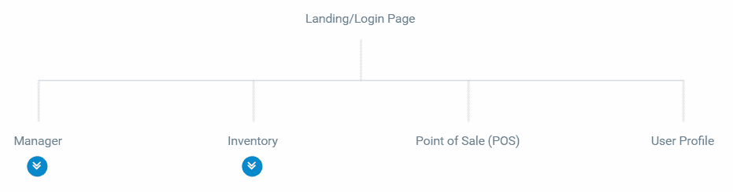

用户的登陆页面

我使用 MockFlow.com 的 SiteMap 工具创建了站点地图

显示在[`sitemap.mockflow.com`](https://sitemap.mockflow.com)上。

第一次检查时，三个高级模块显现出延迟加载的候选项：

1.  销售点（POS）

1.  库存

1.  管理员

收银员只能访问 POS 模块和组件。店员只能访问库存模块，该模块将包括额外的屏幕，用于库存录入，产品和类别管理组件。

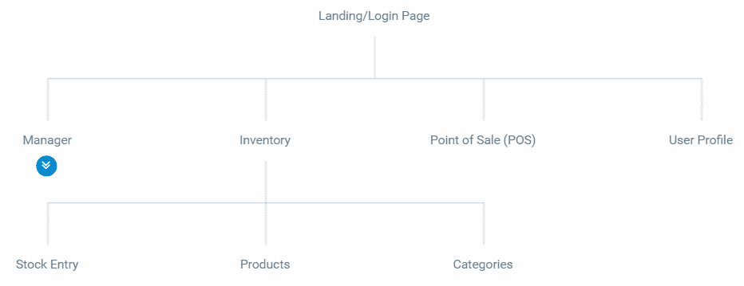

库存页面

最后，管理员将能够使用管理员模块访问所有三个模块，包括用户管理和收据查找组件。

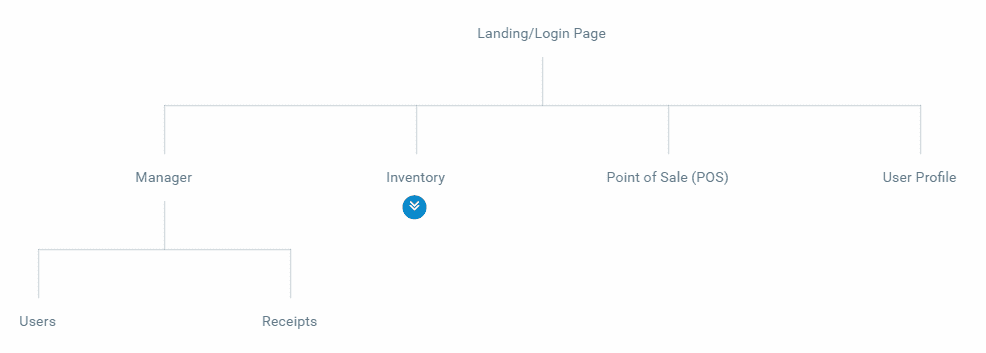

管理员页面

启用所有三个模块的延迟加载有很大的好处，因为收银员和店员永远不会使用属于其他用户角色的组件，所以没有理由将这些字节发送到他们的设备上。这意味着当管理员模块获得更先进的报告功能或应用程序添加新角色时，POS 模块将不受应用程序带宽和内存增长的影响。这意味着减少了支持电话，并保持了长时间使用相同硬件的一致性性能。

# 生成经过路由启用的模块

现在我们已经定义了我们的高级组件——管理员，库存和 POS，我们可以将它们定义为模块。这些模块将与您迄今创建的模块不同，因为它们涉及路由和 Angular Material。我们可以将用户配置文件创建为应用程序模块上的一个组件；不过请注意，用户配置文件只能供已经经过身份验证的用户使用，因此定义一个仅供一般经过身份验证的用户使用的第四个模块是有意义的。这样，您将确保您的应用程序的第一个有效载荷尽可能保持最小。此外，我们将创建一个主页组件，以包含应用程序的着陆体验，这样我们就可以将实现细节保持在`app.component`之外：

1.  生成`manager`，`inventory`，`pos`和`user` 模块，指定它们的目标模块和路由功能：

```ts
$ npx ng g m manager -m app --routing
$ npx ng g m inventory -m app --routing
$ npx ng g m pos -m app --routing
$ npx ng g m user -m app --routing
```

如果您已经配置`npx`来自动识别`ng`作为命令，您可以节省更多按键，这样您将不必在每次命令后附加`npx`。不要全局安装`@angular/cli`。请注意缩写命令结构，其中`ng generate module manager`变成了`ng g m manager`，同样，`--module`变成了`-m`。

1.  验证您的 CLI 是否没有错误。

请注意，在 Windows 上使用`npx`可能会遇到错误，如路径必须是字符串。接收到未定义的错误。这个错误似乎对命令的成功操作没有任何影响，这就是为什么始终检查 CLI 工具生成的内容是至关重要的。

1.  验证已创建的文件夹和文件：

```ts
/src/app
│   app-routing.module.ts
│   app.component.css
│   app.component.html
│   app.component.spec.ts
│   app.component.ts
│   app.module.ts
│   material.module.ts
├───inventory
│        inventory-routing.module.ts
│        inventory.module.ts
├───manager
│        manager-routing.module.ts
│        manager.module.ts
├───pos
│        pos-routing.module.ts
│        pos.module.ts
└───user
        user-routing.module.ts
        user.module.ts
```

1.  检查`ManagerModule`如何连接。

子模块实现了类似于 `app.module` 的 `@NgModule`。最大的区别在于，子模块不实现 `bootstrap` 属性，而这个属性对于根模块是必需的，以初始化你的 Angular 应用程序：

```ts
src/app/manager/manager.module.ts
import { NgModule } from '@angular/core'
import { CommonModule } from '@angular/common'

import { ManagerRoutingModule } from './manager-routing.module'

@NgModule({
  imports: [CommonModule, ManagerRoutingModule],
  declarations: [],
```

```ts
})
export class ManagerModule {}
```

由于我们指定了 `-m` 选项，该模块已经被导入到 `app.module` 中：

```ts
src/app/app.module.ts
...
import { ManagerModule } from './manager/manager.module'
...
@NgModule({
  ...
  imports: [
    ...
    ManagerModule 
  ],
...
```

另外，因为我们还指定了 `--routing` 选项，一个路由模块已经被创建并导入到 `ManagerModule` 中：

```ts
src/app/manager/manager-routing.module.ts
import { NgModule } from '@angular/core'
import { Routes, RouterModule } from '@angular/router'

const routes: Routes = []

@NgModule({
  imports: [RouterModule.forChild(routes)],
  exports: [RouterModule],
})
export class ManagerRoutingModule {}
```

请注意，`RouterModule` 正在使用 `forChild` 进行配置，而不是像 `AppRouting` 模块的情况下使用 `forRoot`。这样，路由器就能理解不同模块上下文中定义的路由之间的正确关系，并且能够在这个示例中正确地在所有子路由之前添加 `/manager`。

CLI 不遵循你的 `tslint.json` 设置。如果你已经正确配置了你的 VS Code 环境，并使用 prettier，那么当你在每个文件上工作时，或者在全局运行 prettier 命令时，你的代码样式偏好将被应用。

# 设计主页路由

请将以下模拟作为 LemonMart 的着陆体验考虑：

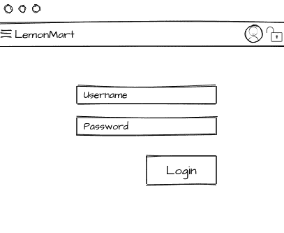

LemonMart 着陆体验

与 `LocalCastWeather` 应用程序不同，我们不希望所有这些标记都出现在 `App` 组件中。`App` 组件是整个应用程序的根元素；因此，它应该只包含在整个应用程序中始终出现的元素。在以下带注释的实例中，标记为 1 的工具栏将在整个应用程序中持续存在。

标记为 2 的区域将容纳主页组件，它本身将包含一个登陆用户控件，标记为 3：

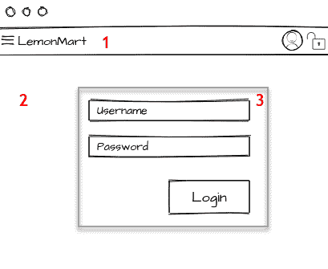

LemonMart 布局结构

将默认或着陆组件作为 Angular 中的单独元素是最佳实践。这有助于减少必须在每个页面加载和执行的代码量，同时在利用路由器时也会产生更灵活的体系结构：

使用内联模板和样式生成 `home` 组件：

```ts
$ npx ng g c home -m app --inline-template --inline-style
```

现在，你已经准备好配置路由器。

# 设置默认路由

让我们开始为 LemonMart 设置一个简单的路由：

1.  配置你的 `home` 路由：

```ts
src/app/app-routing.module.ts 
...
const routes: Routes = [
  { path: '', redirectTo: '/home', pathMatch: 'full' },
  { path: 'home', component: HomeComponent },
]
...
```

我们首先为 `'home'` 定义一个路径，并通过设置组件属性告知路由器渲染 `HomeComponent`。然后，我们将应用程序的默认路径 `''` 重定向到 `'/home'`。通过设置 `pathMatch` 属性，我们始终确保这个非常特定的主页路由实例将作为着陆体验呈现。

1.  创建一个带有内联模板的 `pageNotFound` 组件

1.  配置 `PageNotFoundComponent` 的通配符路由：

```ts
src/app/app-routing.module.ts 
...
const routes: Routes = [
  ...
  { path: '**', component: PageNotFoundComponent }
]
...
```

这样，任何没有匹配的路由都将被重定向到 `PageNotFoundComponent`。

# RouterLink

当用户登陆到 `PageNotFoundComponent` 时，我们希望他们通过 `RouterLink` 方向重定向到 `HomeComponent`：

1.  实施内联模板以使用`routerLink`链接回主页：

```ts
src/app/page-not-found/page-not-found.component.ts
...
template: `
    <p>
      This page doesn't exist. Go back to <a routerLink="/home">home</a>.
    </p>
  `,
...
```

也可以通过`<a href>`标签实现此导航；但是，在更动态和复杂的导航场景中，您将失去诸如自动活动链接跟踪或动态链接生成等功能。

Angular 引导流程将确保`AppComponent`在您的`index.html`中的`<app-root>`元素内。但是，我们必须手动定义我们希望`HomeComponent`渲染的位置，以完成路由器配置。

# 路由器出口

`AppComponent`被视为`app-routing.module`中定义的根路由的根元素，这使我们能够在这个根元素中定义出口，以使用`<router-outlet>`元素动态加载我们希望的任何内容：

1.  配置`AppComponent`以使用内联模板和样式

1.  为您的应用程序添加工具栏

1.  将您的应用程序名称添加为按钮链接，以便在点击时将用户带到主页

1.  添加 `<router-outlet>` 以渲染内容：

```ts
src/app/app.component.ts
...
template: `
    <mat-toolbar color="primary">
      <a mat-button routerLink="/home"><h1>LemonMart</h1></a>
    </mat-toolbar>
    <router-outlet></router-outlet>
  `,
```

现在，主页的内容将在`<router-outlet>`内渲染。

# 品牌、自定义和 Material 图标

为构建一个吸引人且直观的工具栏，我们必须向应用程序引入一些图标和品牌，以便用户可以轻松地通过熟悉的图标在应用程序中进行导航。

# 品牌

在品牌方面，您应确保您的 Web 应用程序应具有自定义调色板，并与桌面和移动浏览器功能集成，以展示您的应用程序名称和图标。

# 调色板

使用 Material Color 工具选择一个调色板，如第十一章，*使用 Angular Material 增强 Angular 应用程序* 中所述。这是我为 LemonMart 选择的调色板：

```ts
https://material.io/color/#!/?view.left=0&view.right=0&primary.color=2E7D32&secondary.color=C6FF00
```

# 实现浏览器清单和图标

您需要确保浏览器在浏览器标签中显示正确的标题文本和图标。此外，应创建一个清单文件，为各种移动操作系统实现特定图标，这样，如果用户将您的网站置为书签，就会显示一个理想的图标，类似于手机上的其他应用图标。这将确保用户在手机设备的主屏幕上收藏或将您的 Web 应用程序置为书签时可以获得一个原生外观的应用程序图标：

1.  创建或从设计师或网站（如[`www.flaticon.com`](https://www.flaticon.com)）获取您网站的标志的 SVG 版本

1.  在这种情况下，我将使用特定的柠檬图片：


LemonMart 的标志性标识

在使用互联网上找到的图像时，请注意适用的版权。在这种情况下，我已经购买了许可证以发布这个柠檬标志，但是您可以在以下 URL 获得您自己的副本，前提是您向图像的作者提供所需的归属声明：[`www.flaticon.com/free-icon/lemon_605070`](https://www.flaticon.com/free-icon/lemon_605070)。

1.  使用[`realfavicongenerator.net`](https://realfavicongenerator.net)等工具生成`favicon.ico`和清单文件

1.  根据你的喜好调整 iOS、Android、Windows Phone、macOS 和 Safari 的设置

1.  确保你设置版本号，网站图标在缓存方面可能让人头疼；一个随机的版本号将确保用户总是得到最新的版本

1.  下载并解压生成的`favicons.zip`文件到你的`src`文件夹中

1.  编辑`angular.json`文件以在你的应用程序中包括新资源：

```ts
angular.json   
"apps": [
  {
    ...
      "assets": [
        "src/assets",
        "src/favicon.ico",
        "src/android-chrome-192x192.png",
        "src/favicon-16x16.png",
        "src/mstile-310x150.png",
        "src/android-chrome-512x512.png",
        "src/favicon-32x32.png",
        "src/mstile-310x310.png",
        "src/apple-touch-icon.png",
        "src/manifest.json",
        "src/mstile-70x70.png",
        "src/browserconfig.xml",
        "src/mstile-144x144.png",
        "src/safari-pinned-tab.svg",
        "src/mstile-150x150.png"
      ]
```

1.  将生成的代码插入到你的`index.html`的`<head>`部分中：

```ts
src/index.html
<link rel="apple-touch-icon" sizes="180x180" href="/apple-touch-icon.png?v=rMlKOnvxlK">
<link rel="icon" type="image/png" sizes="32x32" href="/favicon-32x32.png?v=rMlKOnvxlK">
<link rel="icon" type="image/png" sizes="16x16" href="/favicon-16x16.png?v=rMlKOnvxlK">
<link rel="manifest" href="/manifest.json?v=rMlKOnvxlK">
<link rel="mask-icon" href="/safari-pinned-tab.svg?v=rMlKOnvxlK" color="#b3ad2d">
<link rel="shortcut icon" href="/favicon.ico?v=rMlKOnvxlK">
<meta name="theme-color" content="#ffffff">
```

1.  确保你的新网站图标正确显示

为了进一步发展你的品牌，考虑配置一个自定义的 Material 主题并利用[`material.io/color`](https://material.io/color/)

# 自定义图标

现在，让我们在你的 Angular 应用程序中添加自定义的品牌。你需要用来创建网站图标的 svg 图标：

1.  将图片放在`src/app/assets/img/icons`下，命名为`lemon.svg`

1.  将`HttpClientModule`导入`AppComponent`，以便通过 HTTP 请求`.svg`文件

1.  更新`AppComponent`以注册新的 svg 文件为图标：

```ts
src/app/app.component.ts import { DomSanitizer } from '@angular/platform-browser'
...
export class AppComponent {
  constructor(iconRegistry: MatIconRegistry, sanitizer: DomSanitizer) {
    iconRegistry.addSvgIcon(
      'lemon',
      sanitizer.bypassSecurityTrustResourceUrl('assets/img/icons/lemon.svg')
    )
  }
}
```

1.  将图标添加到工具栏：

```ts
src/app/app.component.ts  
template: `
    <mat-toolbar color="primary">
      <mat-icon svgIcon="lemon"></mat-icon>
      <a mat-button routerLink="/home"><h1>LemonMart</h1></a>
    </mat-toolbar>
    <router-outlet></router-outlet>
  `,
```

现在让我们添加菜单、用户资料和退出的其余图标。

# Material 图标

Angular Material 可以与 Material Design 图标直接使用，可以在你的`index.html`中作为 Web 字体引入你的应用程序。你可以自行托管这个字体；不过，如果选择这条路线，你也无法享受用户在访问其他网站时已经缓存了字体的好处，这就会导致浏览器在下载 42-56 KB 文件时节省速度和延迟。完整的图标列表可以在[`material.io/icons/`](https://material.io/icons/)找到。

现在让我们在工具栏上添加一些图标，并为主页设置一个最小的假登录按钮的模板：

1.  确保 Material 图标的`<link>`标签已经添加到`index.html`中：

```ts
src/index.html
<head>
  ...
  <link href="https://fonts.googleapis.com/icon?family=Material+Icons" rel="stylesheet">
</head>
```

如何自行托管的说明可以在[`google.github.io/material-design-icons/#getting-icons`](http://google.github.io/material-design-icons/#getting-icons)的自行托管部分找到。

配置完成后，使用 Material 图标很容易。

1.  更新工具栏，使菜单按钮位于标题左侧。

1.  添加一个`fxFlex`，使其余图标右对齐。

1.  添加用户资料和退出图标：

```ts
src/app/app.component.ts    
template: `
    <mat-toolbar color="primary">
      <button mat-icon-button><mat-icon>menu</mat-icon></button>
      <mat-icon svgIcon="lemon"></mat-icon>
      <a mat-button routerLink="/home"><h1>LemonMart</h1></a>
      <span class="flex-spacer"></span>
      <button mat-icon-button><mat-icon>account_circle</mat-icon></button>
      <button mat-icon-button><mat-icon>lock_open</mat-icon></button>
    </mat-toolbar>
    <router-outlet></router-outlet>
  `,
```

1.  为登录添加一个最小的模板：

```ts
src/app/home/home.component.ts 
  styles: [`
    div[fxLayout] {margin-top: 32px;}
  `],
  template: `
    <div fxLayout="column" fxLayoutAlign="center center">
      <span class="mat-display-2">Hello, Lemonite!</span>
      <button mat-raised-button color="primary">Login</button>
    </div>
  `
```

你的应用程序应该看起来与这个截图类似：

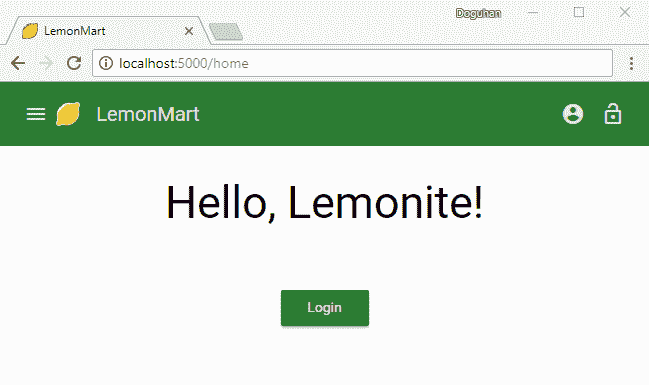

最小登录的 LemonMart

还有一些工作要做，就是在用户的认证状态下实现和显示/隐藏菜单、资料和退出图标。我们将在 Chapter 14 *设计认证和授权* 中介绍这个功能。现在你已经为你的应用程序设置了基本路由，需要学会如何调试你的 Angular 应用程序，然后再进行设置懒加载模块和子组件。

# Angular Augury

Augury 是用于调试和分析 Angular 应用的 Chrome Dev Tools 扩展。这是一个专门为帮助开发人员直观地浏览组件树、检查路由器状态，并通过对开发人员编写的 TypeScript 代码和生成的 JavaScript 代码进行源映射来启用断点调试的工具。您可以从[augury.angular.io](http://augury.angular.io)下载 Augury。安装完成后，当您打开 Chrome Dev Tools 查看您的 Angular 应用时，您会注意到一个新的 Augury 选项卡，如下图所示：

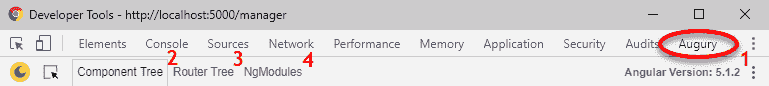

Chrome Dev Tools Augury

Augury 在理解您的 Angular 应用在运行时的行为方面提供了有用且关键的信息：

1.  当前的 Angular 版本列在此处，例如，版本为 5.1.2

1.  组件树

1.  路由器树显示了应用程序中已配置的所有路由

1.  NgModules 显示了应用程序的`AppModule`和子模块

# 组件树

“组件树”选项卡显示了所有应用程序组件的关系以及它们如何相互交互：

1.  选择特定的组件，例如`HomeComponent`，如下所示：

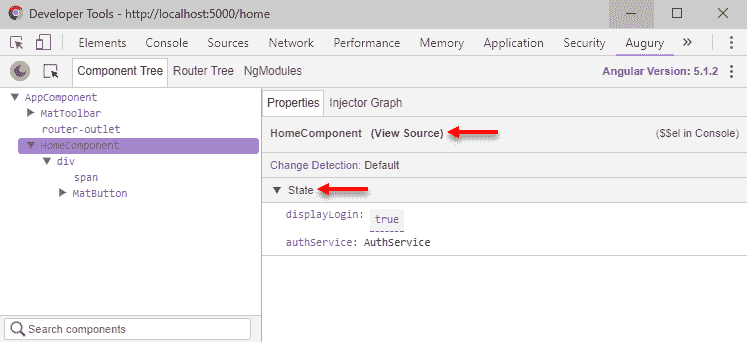

Augury 组件树

右侧的“属性”标签页将显示一个名为“查看源代码”的链接，您可以使用它来调试您的组件。在下面更深的位置，您将能够观察到组件的属性状态，例如显示的登录布尔值，以及您注入到组件中的服务及其状态。

您可以通过双击值来更改任何属性的值。例如，如果您想将`displayLogin`的值更改为`false`，只需双击包含真值的蓝色框，并键入 false 即可。您将能够观察到您的更改对您的 Angular 应用的影响。

为了观察`HomeComponent`的运行时组件层次结构，您可以观察注入器图。

1.  点击“注入器图”选项卡，如下所示：

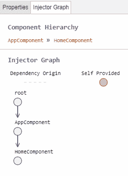

Augury 注入器图

此视图展示了您选择的组件是如何渲染出来的。在这种情况下，我们可以观察到`HomeComponent`是在`AppComponent`内部渲染的。这种可视化对于追踪陌生代码库中特定组件的实现或存在深层组件树的情况非常有帮助。

# 断点调试

让我再次重申一下，`console.log`语句绝对不应该提交到你的代码库。一般来说，它们只会浪费你的时间，因为这需要编辑代码，之后还得清理你的代码。此外，Augury 已经提供了组件的状态，所以在简单的情况下，你应该能够利用它来观察或转换状态。

有些特定用例，`console.log`语句可能会很有用。这些大多是操作在并行运行且依赖及时用户交互的异步工作流。在这些情况下，控制台日志可以帮助您更好地理解事件流和各个组件之间的交互。

Augury 还不够复杂，无法解析异步数据或通过函数返回的数据。还有其他常见情况，您可能想观察属性状态在设置时的变化，甚至能够在运行时改变它们的值，以强制代码执行`if`-`else`或`switch`语句的分支逻辑。对于这些情况，您应该使用断点调试。

假设`HomeComponent`上存在一些基本逻辑，根据从`AuthService`获取的`isAuthenticated`值设置`displayLogin`布尔值，如下所示：

```ts
src/app/home/home.component.ts
...
import { AuthService } from '../auth.service'
...
export class HomeComponent implements OnInit {
  displayLogin = true
  constructor(private authService: AuthService) {}

  ngOnInit() {
    this.displayLogin = !this.authService.isAuthenticated()
  }
}
```

现在观察`displayLogin`的值和`isAuthenticated`函数在设置时的状态，然后观察`displayLogin`值的变化：

1.  点击`HomeComponent`上的查看源链接

1.  在`ngOnInit`函数内的第一行上放一个断点

1.  刷新页面

1.  Chrome Dev 工具将切换到源选项卡，您将看到断点命中并在此处以蓝色突出显示：

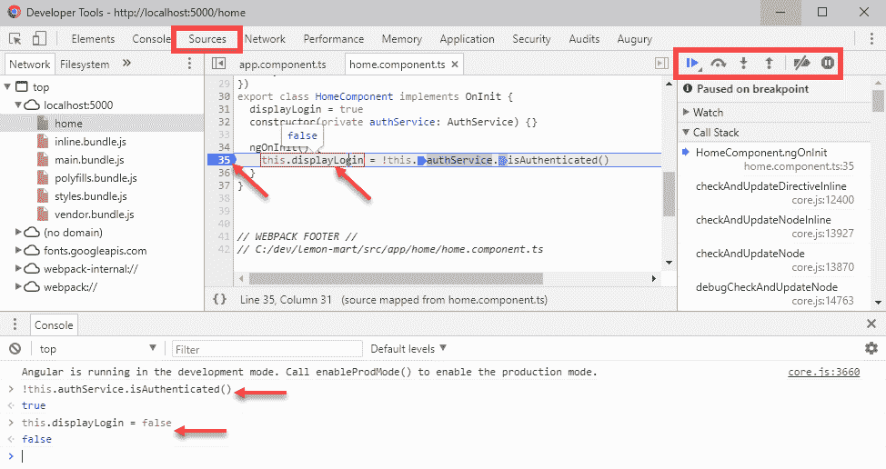

Chrome Dev 工具断点调试

1.  悬停在`this.displayLogin`上，观察其值已设置为`true`

1.  如果悬停在`this.authService.isAuthenticated()`上，您将无法观察其值

在断点命中时，您可以在控制台中访问当前范围的状态，这意味着您可以执行函数并观察其值。

1.  在控制台中执行`isAuthenticated()`

```ts
> !this.authService.isAuthenticated()
true
```

您会观察到它返回`true`，这就是`this.displayLogin`的值。您仍然可以在控制台中强制`displayLogin`的值。

1.  将`displayLogin`设置为`false`

```ts
> this.displayLogin = false
false
```

如果观察`displayLogin`的值，无论是悬停在上面还是从控制台检索，您会看到值被设置为`false`。

利用断点调试基础知识，您可以在一点也不改变源代码的情况下调试复杂的场景。

# 路由树

路由树选项卡将显示路由器的当前状态。这可以是一个非常有用的工具，可以直观地展示路由和组件之间的关系，如下所示：

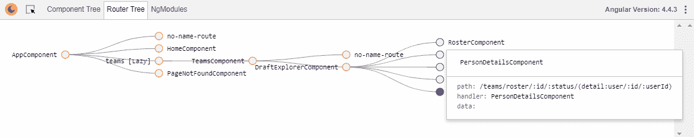

Augury 路由树

上述路由树展示了一个深套的路由结构，带有主细节视图。您可以通过点击圆形节点来看到呈现给定组件所需的绝对路径和参数。

正如您所看到的，对于`PersonDetailsComponent`，确定渲染这个主细节视图的一系列参数可能会变得复杂。

# NgModules

NgModules 选项卡显示`AppModule`和当前加载到内存中的任何其他子模块：

1.  启动应用的`/home`路由

1.  观察 NgModules 标签，如下所示：

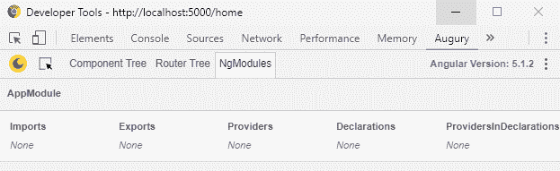

Augury NgModules

您会注意到仅加载了`AppModule`。然而，由于我们的应用程序采用了延迟加载的架构，我们的其他模块尚未被加载。

1.  导航到`ManagerModule`中的一个页面

1.  然后，导航到`UserModule`中的一个页面

1.  最后，导航回`/home`路由

1.  观察 NgModules 标签，如下所示：

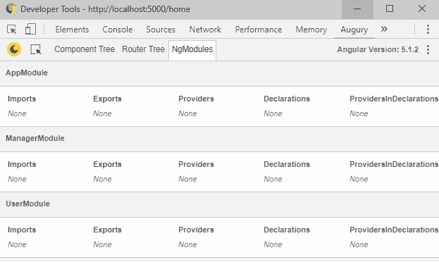

带有三个模块的 Augury NgModules

1.  现在，您会观察到已加载进内存的三个模块。

NgModules 是一个重要的工具，可以可视化设计和架构的影响。

# 具有延迟加载的子模块

懒加载允许由 webpack 提供支持的 Angular 构建流程将我们的 Web 应用程序分隔成不同的 JavaScript 文件，称为块。通过将应用程序的各部分分开为单独的子模块，我们允许这些模块及其依赖项捆绑到单独的块中，从而将初始 JavaScript 捆绑大小保持在最小限度。随着应用程序的增长，首次有意义的呈现时间保持不变，而不是随时间持续增加。懒加载对实现可扩展的应用程序架构至关重要。

现在我们将介绍如何设置带有组件和路由的子模块。我们还将使用 Augury 来观察我们不同路由配置的效果。

# 配置子模块的组件和路由

管理员模块需要一个着陆页面，如此示意图所示：

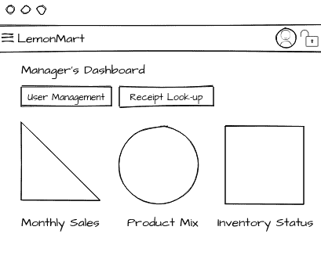

管理员仪表板

让我们先创建`ManagerModule`的主屏幕：

1.  创建`ManagerHome`组件：

```ts
$ npx ng g c manager/managerHome -m manager -s -t
```

为了在`manager`文件夹下创建新组件，我们必须在组件名称前加上`manager/`前缀。另外，我们指定该组件应该被`ManagerModule`导入和声明。由于这是另一个着陆页，可能不够复杂需要额外的 HTML 和 CSS 文件。您可以使用`--inline-style`（别名`-s`）和/或`--inline-template`（别名`-t`）来避免创建额外的文件。

1.  确认您的文件夹结构如下所示：

```ts
 /src
 ├───app
 │ │
 │ ├───manager
 │ │ │ manager-routing.module.ts
 │ │ │ manager.module.ts
 │ │ │
 │ │ └───manager-home
 │ │ manager-home.component.spec.ts
 │ │ manager-home.component.ts
```

1.  使用`manager-routing.module`配置`ManagerHome`组件的路由，类似于我们如何使用`app-route.module`配置`Home`组件：

```ts
src/app/manager/manager-routing.module.ts
import { ManagerHomeComponent } from './manager-home/manager-home.component'
import { ManagerComponent } from './manager.component'

const routes: Routes = [
  {
    path: '',
    component: ManagerComponent,
    children: [
      { path: '', redirectTo: '/manager/home', pathMatch: 'full' },
      { path: 'home', component: ManagerHomeComponent },
    ],
  },
]
```

您会注意到`http://localhost:5000/manager`实际上并不解析为一个组件，因为我们的 Angular 应用程序不知道`ManagerModule`的存在。让我们首先尝试蛮力、饥饿加载的方法，导入`manager.module`并在我们的应用程序中注册管理器路由。

# 预加载

此部分纯粹是为了演示我们迄今学到的导入和注册路由的概念，并不会产生可扩展的解决方案，无论是急切加载还是懒加载组件：

1.  将`manager.module`导入到`app.module`中：

```ts
 src/app/app.module.ts
 import { ManagerModule } from './manager/manager.module'
   ...
   imports: [
   ...
     ManagerModule,
   ]
```

你会发现`http://localhost:5000/manager`仍然不能渲染其主页组件。

1.  使用 Augury 调试路由器状态，如图所示：

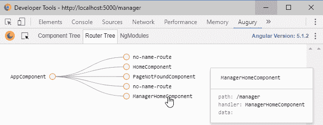

带有预加载的路由器树

1.  看起来`/manager`路径在正确地注册并指向正确的组件`ManagerHomeComponent`。这里的问题是，在`app-routing.module`中配置的`rootRouter`没有意识到`/manager`路径，所以`**`路径占据优先地位，导致呈现`PageNotFoundComponent`。

1.  作为最后的练习，在`app-routing.module`中实现`'manager'`路径，并像平常一样将`ManagerHomeComponent`指定给它：

```ts
src/app/app-routing.module.ts
import { ManagerHomeComponent } from './manager/manager-home/manager-home.component'  
...
const routes: Routes = [
  ...
  { path: 'manager', component: ManagerHomeComponent },
  { path: '**', component: PageNotFoundComponent },
]
```

现在你会注意到`http://localhost:5000/manager`正确地渲染，显示`manager-home works!`；然而，如果通过 Augury 调试路由器状态，你会注意到`/manager`被注册了两次。

这个解决方案不太可扩展，因为它要求所有开发者维护一个单一的主文件来导入和配置每个模块。这会导致合并冲突和沮丧，希望团队成员不会多次注册相同的路由。

可以设计一种解决方案将模块分成多个文件。你可以在`manager.module`中实现 Route 数组并将其导出，而不是使用标准的`*-routing.module`。考虑以下示例：

```ts
example/manager/manager.module
export const managerModuleRoutes: Routes = [
  { path: '', component: ManagerHomeComponent }
]
```

然后这些文件需要逐个被导入到`app-routing.module`中，并且使用`children`属性进行配置：

```ts
example/app-routing.module
import { managerModuleRoutes } from './manager/manager.module'
...
{ path: 'manager', children: managerModuleRoutes },
```

这个解决方案能够运行，是一个正确的解决方案，就像 Augury Router 树所展示的那样：

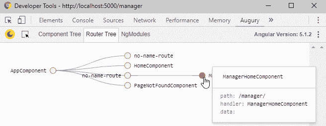

带有子路由的路由器树

没有重复注册，因为我们删除了`manager-routing.module`。此外，我们不必在`manager.module`之外导入`ManagerHomeComponent`，从而得到一个更好的可扩展解决方案。然而，随着应用的增长，我们仍然必须在`app.module`中注册模块，并且子模块仍然与父`app.module`以可能不可预测的方式耦合。此外，这段代码无法被分块，因为使用 import 导入的任何代码都被视为硬依赖。

# 懒加载

现在你理解了模块的预加载是如何工作的，你将能更好地理解我们即将编写的代码，否则这些代码可能会看起来像黑魔法一样，并且神秘（也就是被误解的）代码总是导致混乱的架构。

我们现在将前面的预加载解决方案演变为懒加载的方式。为了从不同的模块加载路由，我们知道不能简单地导入它们，否则它们将被急切加载。答案就在于在`app-routing.module.ts`中配置路由时使用`loadChildren`属性，并提供字符串告知路由器如何加载子模块：

1.  确保你打算懒加载的任何模块都*不*被导入到``app.module``中

1.  移除`ManagerModule`中添加的任何路由

1.  确保将`ManagerRoutingModule`导入到`ManagerModule`中

1.  实现或更新带有`loadChildren`属性的管理路径：

```ts
src/app/app-routing.module.ts
import {
  ...
  const routes: Routes = [
    ...
    { path: 'manager', loadChildren: './manager/manager.module#ManagerModule' },
    { path: '**', component: PageNotFoundComponent },
  ]
  ...
```

通过一个巧妙的技巧实现了惰性加载，避免使用`import`语句。定义了一个由两部分组成的字符串文字，其中第一部分定义了模块文件的位置，如`app/manager/manager.module`，第二部分定义了模块的类名。这样的字符串可以在构建过程和运行时进行解释，以动态创建块，加载正确的模块并实例化正确的类。`ManagerModule`然后就像它自己的 Angular 应用程序一样，管理着它的所有子依赖项和路由。

1.  更新`manager-routing.module`路由，考虑到 manager 现在是它们的根路由：

```ts
src/app/manager/manager-routing.module.ts
const routes: Routes = [
  { path: '', redirectTo: '/manager/home', pathMatch: 'full' },
  { path: 'home', component: ManagerHomeComponent },
]
```

现在我们可以将`ManagerHomeComponent`的路由更新为更有意义的`'home'`路径。这个路径不会与`app-routing.module`中的路径冲突，因为在这个上下文中，`'home'`解析为`'manager/home'`，同样地，当路径为空时，URL 将看起来像`http://localhost:5000/manager`。

1.  通过观察 Augury 确认惰性加载是否正常运行，如下所示：

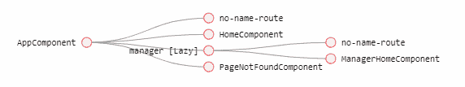

通过惰性加载的路由树

`ManagerHomeComponent`的根节点现在被命名为`manager [Lazy]`。

# 完成步行骨架

使用我们在本章早些时候为 LemonMart 创建的站点地图，我们需要完成应用的步行骨架导航体验。为了创建这种体验，我们需要创建一些按钮来链接所有模块和组件。我们将逐个模块进行：

+   在开始之前，更新`home.component`上的登录按钮，将其链接到`Manager`模块：

```ts
src/app/home/home.component.ts
 ...
 <button mat-raised-button color="primary" routerLink="/manager">Login as Manager</button>
 ...
```

# 管理员模块

由于我们已经为`ManagerModule`启用了惰性加载，让我们继续完成它的其余导航元素。

在当前设置中，`ManagerHomeComponent`在`app.component`中定义的`<router-outlet>`中呈现，因此当用户从`HomeComponent`导航到`ManagerHomeComponent`时，`app.component`中实现的工具栏保持不变。如果我们实现一个类似的工具栏，使其在`ManagerModule`中保持不变，我们可以为跨模块导航子页面创建一个一致的用户体验。

为实现这一点，我们需要在`app.component`和`home/home.component`之间复制父子关系，其中父级实现了工具栏和一个`<router-outlet>`，以便子元素可以在那里呈现。

1.  首先创建基本的`manager`组件：

```ts
$ npx ng g c manager/manager -m manager --flat -s -t
```

`--flat`选项跳过目录创建，直接将组件放在`manager`文件夹下，就像`app.component`直接放在`app`文件夹下一样。

1.  创建一个带有`activeLink`跟踪的导航工具栏：

```ts
src/app/manager/manager.component.ts
styles: [`
   div[fxLayout] {margin-top: 32px;}
   `, `
  .active-link {
    font-weight: bold;
    border-bottom: 2px solid #005005;
  }`
],
template: `
  <mat-toolbar color="accent">
    <a mat-button routerLink="/manager/home" routerLinkActive="active-link">Manager's Dashboard</a>
    <a mat-button routerLink="/manager/users" routerLinkActive="active-link">User Management</a>
    <a mat-button routerLink="/manager/receipts" routerLinkActive="active-link">Receipt Lookup</a>
  </mat-toolbar>
  <router-outlet></router-outlet>
`
```

必须注意，子模块不会自动访问父模块创建的服务或组件。这是为了保持解耦的架构的重要默认行为。然而，也有一些情况下希望分享一些代码。在这种情况下，`mat-toolbar` 需要重新导入。由于 `MatToolbarModule` 已经在 `src/app/material.module.ts` 中加载，我们只需要在 `manager.module.ts` 中导入这个模块，这样做不会带来性能或内存的损耗。

1.  `ManagerComponent` 应该被引入到 `ManagerModule` 中：

```ts
src/app/manager/manager.module.ts
import { MaterialModule } from '../material.module'
import { ManagerComponent } from './manager.component'
...
imports: [... MaterialModule, ManagerComponent],
```

1.  为子页面创建组件：

```ts
$ npx ng g c manager/userManagement -m manager
$ npx ng g c manager/receiptLookup -m manager
```

1.  创建父/子路由。我们知道我们需要以下路由才能导航到我们的子页面，如下：

```ts
example
{ path: '', redirectTo: '/manager/home', pathMatch: 'full' },
{ path: 'home', component: ManagerHomeComponent },
{ path: 'users', component: UserManagementComponent },
{ path: 'receipts', component: ReceiptLookupComponent },
```

为了定位到在 `manager.component` 中定义的 `<router-outlet>`，我们需要先创建父路由，然后为子页面指定路由：

```ts
src/app/manager/manager-routing.module.ts
...
const routes: Routes = [
  {
    path: '', component: ManagerComponent, children: [
      { path: '', redirectTo: '/manager/home', pathMatch: 'full' },
      { path: 'home', component: ManagerHomeComponent },
```

```ts
      { path: 'users', component: UserManagementComponent },
      { path: 'receipts', component: ReceiptLookupComponent },
    ]
  },
]
```

现在你应该能够浏览整个应用了。当你点击登录为管理者的按钮时，你将被带到这里显示的页面。可点击的目标被高亮显示，如下所示：

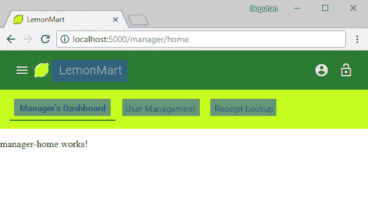

带有可点击目标高亮显示的 Manager's Dashboard

如果你点击 LemonMart，你将被带到主页。如果你点击 Manager's Dashboard，User Management 或 Receipt Lookup，你将被导航到相应的子页面，同时工具栏上的活动链接将是粗体和下划线。

# 用户模块

登录后，用户将能够通过侧边导航菜单访问他们的个人资料，并查看他们可以在 LemonMart 应用程序中访问的操作列表。在第十四章，*设计认证和授权*，当我们实现认证和授权时，我们将从服务器接收到用户的角色。根据用户的角色，我们将能够自动导航或限制用户可以看到的选项。我们将在这个模块中实现这些组件，以便它们只有在用户登录后才被加载。为了完成骨架层，我们将忽略与认证相关的问题：

1.  创建必要的组件：

```ts
$ npx ng g c user/profile -m user
$ npx ng g c user/logout -m user -t -s
$ npx ng g c user/navigationMenu -m user -t -s
```

1.  实现路由：

从在 `app-routing` 中实现延迟加载开始：

```ts
src/app/app-routing.module.ts
... 
 { path: 'user', loadChildren: 'app/user/user.module#UserModule' },
```

确保 `PageNotFoundComponent` 路由总是在 `app-routing.module` 中的最后一个路由。

现在在 `user-routing` 中实现子路由：

```ts
src/app/user/user-routing.module.ts
...
const routes: Routes = [
  { path: 'profile', component: ProfileComponent },
  { path: 'logout', component: LogoutComponent },
]
```

我们正在为 `NavigationMenuComponent` 实现路由，因为它将直接被用作 HTML 元素。另外，由于 `userModule` 没有一个登陆页面，没有默认路径定义。

1.  连接用户和注销图标：

```ts
src/app/app.component.ts ...
<mat-toolbar>
  ...
  <button mat-mini-fab routerLink="/user/profile" matTooltip="Profile" aria-label="User Profile"><mat-icon>account_circle</mat-icon></button>
  <button mat-mini-fab routerLink="/user/logout" matTooltip="Logout" aria-label="Logout"><mat-icon>lock_open</mat-icon></button>
</mat-toolbar>
```

图标按钮可能难以理解，因此添加工具提示对它们是个好主意。为了使工具提示正常工作，切换到`mat-mini-fab`指令并确保在`material.module`中导入`MatTooltipModule`，此外，确保为只有图标的按钮添加`aria-label`，这样依赖于屏幕阅读器的残障用户仍然能够浏览您的 Web 应用。

1.  确保应用程序正常工作。

您会注意到两个按钮离得太近，如下所示：


带图标的工具栏

1.  您可以通过在`<mat-toolbar>`中添加`fxLayoutGap="8px"`来解决图标布局问题；但是现在柠檬标识离应用名称太远了，如下所示：


带填充图标的工具栏

1.  通过合并图标和按钮来解决标识布局问题：

```ts
src/app/app.component.ts ...<mat-toolbar>  ...
  <a mat-icon-button routerLink="/home"><mat-icon svgIcon="lemon"></mat-icon><span class="mat-h2">LemonMart</span></a>
  ...
</mat-toolbar>
```

如下截图所示，分组修复了布局问题：


带有分组和填充元素的工具栏

从用户体验的角度来看这更加理想；现在用户可以通过点击柠檬回到主页。

# POS 和库存模块

我们的基本架构假定经理的角色。为了能够访问我们即将创建的所有组件，我们需要使经理能够访问 POS 和库存模块。

使用两个新按钮更新`ManagerComponent`：

```ts
src/app/manager/manager.component.ts
<mat-toolbar color="accent" fxLayoutGap="8px">
  ...
  <span class="flex-spacer"></span>
  <button mat-mini-fab routerLink="/inventory" matTooltip="Inventory" aria-label="Inventory"><mat-icon>list</mat-icon></button>
  <button mat-mini-fab routerLink="/pos" matTooltip="POS" aria-label="POS"><mat-icon>shopping_cart</mat-icon></button>
</mat-toolbar>
```

请注意，这些路由链接将导航我们离开`ManagerModule`，因此工具栏消失是正常的。

现在，由您来实现最后的两个模块。

# POS 模块

POS 模块与用户模块非常相似，除了`PosComponent`将成为默认路由。这将是一个复杂的组件，带有一些子组件，因此确保它是通过目录创建的：

1.  创建`PosComponent`

1.  注册`PosComponent`作为默认路由

1.  配置`PosModule`的懒加载

1.  确保应用程序正常工作

# 库存模块

库存模块与`ManagerModule`非常相似，如下所示：

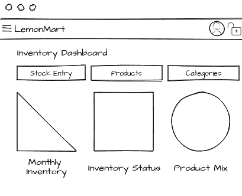

库存仪表板模拟

1.  创建基本的`Inventory`组件

1.  注册`MaterialModule`

1.  创建库存仪表板、库存录入、产品和类别组件

1.  在`inventory-routing.module`中配置父子路由

1.  配置`InventoryModule`的懒加载

1.  确保应用程序正常工作，如下所示：

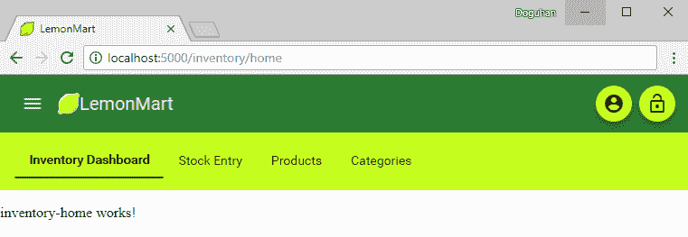

LemonMart 库存仪表板

现在应用程序的基本架构已经完成，检查路由树以确保懒加载已正确配置，并且模块不会被意外急加载是非常重要的。

# 检查路由树

转到应用程序的基本路由，并使用 Augury 检查路由树，如图所示：

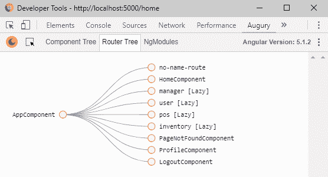

路由树与急加载错误

一切，除了最初需要的组件，应该带有[Lazy]属性。 如果由于某种原因，路由未带有[Lazy]标记，那么它们可能被错误地导入到`app.module`或其他某个组件中。

在上述截图中，您可能会注意到`ProfileComponent`和`LogoutComponent`是急加载的，而`user`模块正确地标记为[Lazy]。 即使通过工具和代码基础进行多次视觉检查，也可能让您一直寻找问题所在。 但是，如果全局搜索`UserModule`，您将很快发现它正在被导入到`app.module`中。

为了保险起见，请确保删除`app.module`中的任何模块导入语句，您的文件应该像下面这样：

```ts
src/app/app.module.ts
import { FlexLayoutModule } from '@angular/flex-layout'
import { BrowserModule } from '@angular/platform-browser'
import { NgModule } from '@angular/core'

import { AppRoutingModule } from './app-routing.module'
import { AppComponent } from './app.component'
import { BrowserAnimationsModule } from '@angular/platform-browser/animations'
import { MaterialModule } from './material.module'
import { HomeComponent } from './home/home.component'
import { PageNotFoundComponent } from './page-not-found/page-not-found.component'
import { HttpClientModule } from '@angular/common/http'

@NgModule({
  declarations: [AppComponent, HomeComponent, PageNotFoundComponent],
  imports: [
    BrowserModule,
    AppRoutingModule,
    BrowserAnimationsModule,
    MaterialModule,
    HttpClientModule,
    FlexLayoutModule,
  ],
  providers: [],
  bootstrap: [AppComponent],
})
export class AppModule {}

```

下一张截图展示了更正后的路由树：

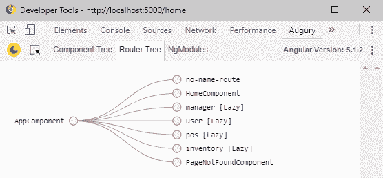

带有延迟加载的路由树

在继续前进之前，请确保`npm test`和`npm run e2e`执行时没有错误。

# 通用测试模块

现在我们有大量的模块要处理，为每个规范文件单独配置导入和提供者变得乏味。 为此，我建议创建一个通用的测试模块，其中包含可以在整个项目中重用的通用配置。

首先创建一个新的`.ts`文件。

1.  创建`common/common.testing.ts`

1.  使用常见的测试提供程序、伪造品和模块填充，如下所示：

我提供了`ObservableMedia`、`MatIconRegistry`、`DomSanitizer`的伪造实现，以及`commonTestingProviders`和`commonTestingModules`的数组。

```ts
src/app/common/common.testing.ts
import { HttpClientTestingModule } from '@angular/common/http/testing'
import { MediaChange } from '@angular/flex-layout'
import { FormsModule, ReactiveFormsModule } from '@angular/forms'
import { SafeResourceUrl, SafeValue } from '@angular/platform-browser'
import { NoopAnimationsModule } from '@angular/platform-browser/animations'
// tslint:disable-next-line:max-line-length
import { SecurityContext } from '@angular/platform-browser/src/security/dom_sanitization_service'
import { RouterTestingModule } from '@angular/router/testing'
import { Observable, Subscription, of } from 'rxjs'
import { MaterialModule } from '../material.module'

const FAKE_SVGS = {
  lemon: '<svg><path id="lemon" name="lemon"></path></svg>',
}

export class ObservableMediaFake {
  isActive(query: string): boolean {
    return false
  }

  asObservable(): Observable<MediaChange> {
    return of({} as MediaChange)
  }

  subscribe(
    next?: (value: MediaChange) => void,
    error?: (error: any) => void,
    complete?: () => void
  ): Subscription {
    return new Subscription()
  }
}

export class MatIconRegistryFake {
  _document = document
  addSvgIcon(iconName: string, url: SafeResourceUrl): this {
    // this.addSvgIcon('lemon', 'lemon.svg')
    return this
  }

  getNamedSvgIcon(name: string, namespace: string = ''): Observable<SVGElement> {
    return of(this._svgElementFromString(FAKE_SVGS.lemon))
  }

  private _svgElementFromString(str: string): SVGElement {
    if (this._document || typeof document !== 'undefined') {
      const div = (this._document || document).createElement('DIV')
      div.innerHTML = str
      const svg = div.querySelector('svg') as SVGElement
      if (!svg) {
        throw Error('<svg> tag not found')
      }
      return svg
    }
  }
}

export class DomSanitizerFake {
  bypassSecurityTrustResourceUrl(url: string): SafeResourceUrl {
    return {} as SafeResourceUrl
  }
  sanitize(context: SecurityContext, value: SafeValue | string | null): string | null {
    return value ? value.toString() : null
  }
}

export const commonTestingProviders: any[] = [
  // intentionally left blank
]

export const commonTestingModules: any[] = [
  FormsModule,
  ReactiveFormsModule,
  MaterialModule,
  NoopAnimationsModule,
  HttpClientTestingModule,
  RouterTestingModule,
]

```

现在让我们看看如何使用共享配置文件的示例：

```ts
src/app/app.component.spec.ts import { commonTestingModules,
 commonTestingProviders,
 MatIconRegistryFake,
 DomSanitizerFake,
 ObservableMediaFake,
} from './common/common.testing'
import { ObservableMedia } from '@angular/flex-layout'
import { MatIconRegistry } from '@angular/material'
import { DomSanitizer } from '@angular/platform-browser'

...
TestBed.configureTestingModule({
      imports: commonTestingModules,
      providers: commonTestingProviders.concat([
        { provide: ObservableMedia, useClass: ObservableMediaFake },
        { provide: MatIconRegistry, useClass: MatIconRegistryFake },
        { provide: DomSanitizer, useClass: DomSanitizerFake },
      ]),
      declarations: [AppComponent],
...
```

大多数其他模块只需导入`commonTestingModules`即可。

在所有测试通过之前，请不要继续前进！

# 总结

在本章中，您学会了如何有效地使用 Angular CLI 创建主要的 Angular 组件和脚手架。 您创建了应用程序的品牌，利用自定义和内置 Material 图标。 您学会了如何使用 Augury 调试复杂的 Angular 应用程序。 最后，您开始构建基于路由的应用程序，及早定义用户角色，设计时考虑懒加载，并及早确定行为骨架导航体验。

总结一下，为了完成基于路由的实现，您需要执行以下操作：

1.  早期定义用户角色

1.  设计时考虑懒加载

1.  实现行为骨架导航体验

1.  围绕主要数据组件进行设计

1.  强制执行解耦的组件架构

1.  区分用户控件和组件

1.  最大化代码重用

在本章中，您执行了步骤 1-3；在接下来的三章中，您将执行步骤 4-7。在第十三章中，*持续集成和 API 设计*，我们将讨论围绕主要数据组件进行设计，并实现持续集成以确保高质量的交付。在第十四章中，*设计身份验证和授权*，我们将深入探讨安全考虑因素，并设计有条件的导航体验。在第十五章中，*Angular 应用设计和配方*，我们将通过坚持解耦组件架构，巧妙选择创建用户控件与组件，并利用各种 TypeScript、RxJS 和 Angular 编码技术来最大程度地重用代码，将所有内容紧密结合在一起。
