# 第十三章：持续集成和 API 设计

在我们开始为我们的 LOB 应用 LemonMart 构建更复杂的功能之前，我们需要确保我们每次代码推送都有通过的测试，并遵守编码标准，并且是团队成员可以运行测试的可执行构件，因为我们将继续进一步开发我们的应用。同时，我们还需要开始思考我们的应用将如何与后端服务器通信。无论是你、你的团队还是另一个团队将要创建新的 API，都很重要的是，API 设计要满足前端和后端架构的需求。为了确保一个顺畅的开发过程，需要一个强大的机制来创建一个可访问的、实时的 API 文档。**持续集成**（**CI**）可以解决第一个问题，而 Swagger 完美地解决了 API 设计、文档和测试的需求。

持续集成（Continuous Integration）对确保每次代码推送都能交付高质量的成果至关重要，它通过在每次代码推送时构建和执行测试来实现。建立一个 CI 环境可能会耗费很多时间，并需要对所使用的工具有专门的了解。CircleCI 是一个成熟的云端持续集成服务，提供免费的服务套餐和相关文章，帮助你以尽可能少的配置开始使用。我们将介绍一种基于 Docker 的方法，它可以在大多数 CI 服务上运行，让你的特定配置知识保持有效，并将 CI 服务知识降到最低限度。

全栈开发的另一个方面是你可能会同时开发应用的前端和后端。无论你是自己工作，还是和一个团队或多个团队一起工作，建立一个数据契约很关键，以确保你不会在最后关头遇到集成问题。我们将使用 Swagger 来定义 REST API 的数据契约，然后创建一个模拟服务器，你的 Angular 应用可以向它发起 HTTP 请求。对于后端开发来说，Swagger 可以作为生成样板代码的绝佳起点，并且可以继续作为 API 的实时文档和测试 UI。

在本章中，你将学习以下内容：

+   与 CircleCI 一起使用持续集成

+   使用 Swagger 进行 API 设计

本章需要以下内容：

+   免费的 CircleCI 账户

+   Docker

# 持续集成

持续集成的目的是为了能够在每次代码推送时创建一个一致且可重复的环境，以构建、测试并生成可部署的应用构件。在推送代码之前，开发者应该合理地期望他们的构建会通过；因此，创建一个可靠的 CI 环境，自动化开发者也可以在本地机器上运行的命令，是至关重要的。

# 容器化构建环境

为了确保在各种 OS 平台、开发者机器和持续集成环境中保持一致的构建环境，你可以对你的构建环境进行容器化。请注意，目前至少有六种常用的 CI 工具。学习每个工具的细节几乎是不可能完成的任务。你的构建环境的容器化是一个超出当前 CI 工具预期的先进概念。然而，容器化是标准化你的 90% 以上的构建基础设施的绝佳方式，几乎可以在任何 CI 环境中执行。通过这种方法，你学到的技能和你创建的构建配置变得更有价值，因为你的知识和你创建的工具都变得可传递和可重用。

有许多策略可以使你的构建环境容器化，具有不同的粒度和性能预期。为了本书的目的，我们将专注于可重用性和易用性。与其创建一组复杂的相互依赖的 Docker 镜像，可能会允许更有效的失败优先和恢复路径，我们将专注于单一和简单的工作流程。较新版本的 Docker 具有一个很棒的功能，称为多阶段构建，它允许你以易于阅读的方式定义一个多镜像过程，并维护一个单一的`Dockerfile`。

在整个过程结束时，你可以提取一个优化的容器镜像作为我们的交付产品，摆脱了先前过程中使用的镜像的复杂性。

作为提醒，你的单一`Dockerfile`看起来像下面的样例：

```ts
Dockerfile
FROM duluca/minimal-node-web-server:8.11.1
WORKDIR /usr/src/app
COPY dist public
```

多阶段构建通过在单个`Dockerfile`中使用多个`FROM`语句来实现，每个阶段可以执行任务并使其实例内的任何资源可用于其他阶段。在构建环境中，我们可以将各种与构建相关的任务实现为它们自己的阶段，然后将最终结果，如 Angular 构建的`dist`文件夹，复制到包含 Web 服务器的最终镜像中。在这种情况下，我们将实现三个镜像阶段：

+   **构建器**：用于构建你的 Angular 应用的生产版本。

+   **测试程序**：用于对一个无界面 Chrome 实例执行单元测试和 e2e 测试

+   **Web 服务器**：最终结果只包含了优化过的生产要素

多阶段构建需要 Docker 版本 17.05 或更高版本。要了解更多关于多阶段构建的信息，请阅读文档：[`docs.docker.com/develop/develop-images/multistage-build/`](https://docs.docker.com/develop/develop-images/multistage-build/)。

首先，创建一个新的文件来实现多阶段配置，命名为`Dockerfile.integration`，放在项目的根目录。

# 构建器

第一个阶段是`builder`。我们需要一个轻量级的构建环境，可以确保统一的构建结果。为此，我创建了一个示例的 Alpine-based Node 构建环境，完整包含了 npm、bash 和 git 工具。关于为何我们使用 Alpine 和 Node 的更多信息，请参考第十章，*准备 Angular 应用程序进行生产发布*，*使用 Docker 容器化应用程序*部分：

1.  实现一个新的 npm 脚本来构建你的 Angular 应用程序：

```ts
"scripts": {
  "build:prod": "ng build --prod",
}
```

1.  继承自基于 Node.js 的构建环境，比如`node:10.1`或`duluca/minimal-node-build-env:8.11.2`。

1.  实现你特定环境的构建脚本，如下所示：

请注意，在出版时，低级 npm 工具中的一个 bug 阻止了基于`node`镜像成功安装 Angular 依赖项。这意味着下面的示例`Dockerfile`基于较旧版本的 Node 和 npm，使用了`duluca/minimal-node-build-env:8.9.4`。在将来，当 bug 得到解决后，更新的构建环境将能够利用`npm ci`来安装依赖项，相比`npm install`命令将带来显著的速度提升。

```ts
Dockerfile.integration
FROM duluca/minimal-node-build-env:8.9.4 as builder

# project variables
ENV SRC_DIR /usr/src
ENV GIT_REPO https://github.com/duluca/lemon-mart.git
ENV SRC_CODE_LOCATION .
ENV BUILD_SCRIPT build:prod

# get source code
RUN mkdir -p $SRC_DIR
WORKDIR $SRC_DIR
# if necessary, do SSH setup here or copy source code from local or CI environment
RUN git clone $GIT_REPO .
# COPY $SRC_CODE_LOCATION .

RUN npm install
RUN npm run $BUILD_SCRIPT
```

在上面的示例中，容器正在从 GitHub 拉取源代码。我选择这样做是为了保持示例的简单性，因为它在本地和远程持续集成环境中都起作用。然而，你的 CI 服务器已经有了源代码的副本，你需要从你的 CI 环境中复制然后在容器中使用。

用`COPY $SRC_CODE_LOCATION .`命令替换`RUN git clone $GIT_REPO .`命令，从你的 CI 服务器或本地机器复制源代码。如果这么做，你需要实现一个`.dockerignore`文件，与你的`.gitignore`文件相似，以确保不泄露秘密，不复制`node_modules`，并且配置在其他环境中是可重复的。在 CI 环境中，你需要重写环境变量 `$SRC_CODE_LOCATION`，使得`COPY`命令的源目录是正确的。随意创建适合各种需求的多个版本的`Dockerfile`。

另外，我建立了一个基于`node-alpine`的最小 Node 构建环境`duluca/minimal-node-build-env`，你可以在 Docker Hub 上查看 [`hub.docker.com/r/duluca/minimal-node-build-env`](https://hub.docker.com/r/duluca/minimal-node-build-env)。这个镜像比`node`小约十倍。Docker 镜像的大小对构建时间有实质影响，因为 CI 服务器或团队成员需要额外时间拉取较大的镜像。选择最适合你需求的环境。

# 调试构建环境

根据你的特定需求，构建`Dockerfile`的初始设置可能会让人沮丧。为了测试新命令或调试错误，你可能需要直接与构建环境交互。

要在构建环境中进行交互实验和/或调试，执行以下操作：

```ts
$ docker run -it duluca/minimal-node-build-env:8.9.4 /bin/bash
```

您可以在这个临时环境中测试或调试命令，然后将它们加入到您的`Dockerfile`中。

# 测试员

第二阶段是`tester`。默认情况下，Angular CLI 生成的测试要求是针对开发环境的。这在持续集成环境中不起作用；我们必须配置 Angular 以针对一个无需 GPU 辅助执行的无头浏览器以及进一步的容器化环境来执行测试。

# 为 Angular 配置一个无头浏览器

protractor 测试工具正式支持在无头模式下运行 Chrome。为了在持续集成环境中执行 Angular 测试，您需要配置您的测试运行器 Karma 使用一个无头 Chrome 实例来运行：

1.  更新`karma.conf.js`以包含新的无头浏览器选项：

```ts
src/karma.conf.js
...
browsers: ['Chrome', 'ChromiumHeadless', 'ChromiumNoSandbox'],
customLaunchers: {
  ChromiumHeadless: {
        base: 'Chrome',
        flags: [
          '--headless',
          '--disable-gpu',
          // Without a remote debugging port, Google Chrome exits immediately.
          '--remote-debugging-port=9222',
        ],
        debug: true,
      },
      ChromiumNoSandbox: {
        base: 'ChromiumHeadless',
        flags: ['--no-sandbox', '--disable-translate', '--disable-extensions']
      }
    },
```

`ChromiumNoSandbox`自定义启动器封装了所有需要的配置元素，以获得一个良好的默认设置。

1.  更新`protractor`配置以在无头模式下运行：

```ts
e2e/protractor.conf.js
...
  capabilities: {
    browserName: 'chrome',
    chromeOptions: {
      args: [
        '--headless',
        '--disable-gpu',
        '--no-sandbox',
        '--disable-translate',
        '--disable-extensions',
        '--window-size=800,600',
      ],
    },
  },
...
```

为了测试应用程序的响应场景，您可以使用`--window-size`选项，如前所示，来更改浏览器设置。

1.  更新`package.json`脚本以在生产构建场景中选择新的浏览器选项：

```ts
package.json
"scripts": {
  ...
  "test:prod": "npm test -- --watch=false"
  ...
}
```

请注意，`test:prod`不包括`npm run e2e`。e2e 测试是需要更长时间来执行的集成测试，所以在包含它们作为关键构建流水线的一部分时三思而后行。e2e 测试不会在下一节提到的轻量级测试环境中运行，因此它们需要更多的资源和时间来执行。

# 配置测试环境

对于轻量级的测试环境，我们将利用基于 Alpine 的 Chromium 浏览器安装：

1.  继承自`slapers/alpine-node-chromium`

1.  在`Docker.integration`后追加以下配置：

```ts
Docker.integration
...
FROM slapers/alpine-node-chromium as tester
ENV BUILDER_SRC_DIR /usr/src
ENV SRC_DIR /usr/src
ENV TEST_SCRIPT test:prod

RUN mkdir -p $SRC_DIR
WORKDIR $SRC_DIR

COPY --from=builder $BUILDER_SRC_DIR $SRC_DIR

CMD 'npm run $TEST_SCRIPT'
```

上述脚本将从`builder`阶段复制生产构建，并以可预测的方式执行您的测试脚本。

# Web 服务器

第三和最后阶段生成将成为您 web 服务器的容器。一旦此阶段完成，之前的阶段将被丢弃，最终结果将是一个优化的小于 10MB 的容器：

1.  使用 Docker 将您的应用程序容器化

1.  在文件末尾附加`FROM`语句

1.  从`builder`中复制生产就绪的代码，如下所示：

```ts
Docker.integration
...
FROM duluca/minimal-nginx-web-server:1.13.8-alpine
ENV BUILDER_SRC_DIR /usr/src
COPY --from=builder $BUILDER_SRC_DIR/dist /var/www
CMD 'nginx'
```

1.  构建并测试您的多阶段`Dockerfile`：

```ts
$ docker build -f Dockerfile.integration .
```

如果您从 GitHub 拉取代码，请确保在构建容器之前提交并推送代码，因为容器将直接从存储库中拉取源代码。使用`--no-cache`选项确保拉取新的源代码。如果您从本地或 CI 环境复制代码，则*不要*使用`--no-cache`，因为您不能从能够重复使用先前构建的容器层中获得速度提升。

1.  将您的脚本另存为名为`build:ci`的新 npm 脚本,如下所示:

```ts
package.json
"scripts": {
  ...
  "build:ci": "docker build -f Dockerfile.integration . -t $npm_package_config_imageRepo:latest",
  ...
}
```

# CircleCI

CircleCI 易于上手,free tier 很棒,对初学者和专业人士都有很好的文档。如果您有独特的企业需求,CircleCI 可以就地部署在企业防火墙后或云端的私有部署中。

CircleCI 为免费设置提供了预制的构建环境,但它也可以使用 Docker 容器运行构建,使其成为一个可以根据用户技能和需求进行扩展的解决方案,如"容器化构建环境"部分所述:

1.  在 [`circleci.com/`](https://circleci.com/) 创建一个 CircleCI 账户

1.  使用 GitHub 注册:

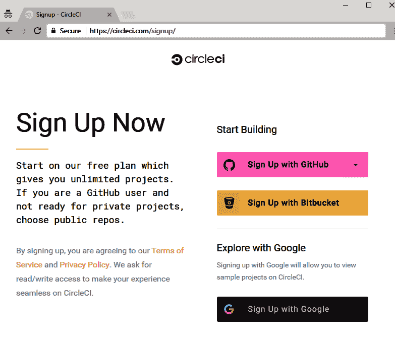

CircleCI 注册页面

1.  添加一个新项目:

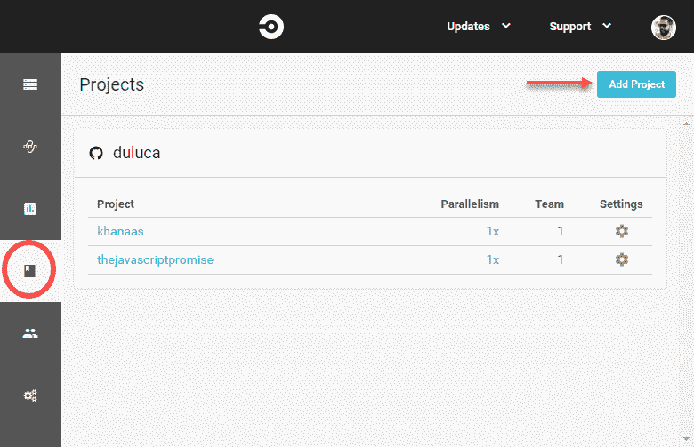

CircleCI 项目页面

在下一个屏幕上,你有选择 Linux 或 macOS 构建环境的选项。macOS 构建环境非常适合构建 iOS 或 macOS 应用程序。但是,这些环境没有免费层;只有 1x 并行的 Linux 实例是免费的。

1.  搜索 lemon-mart 并单击"设置项目"。

1.  选择 Linux

1.  选择平台 2.0

1.  由于我们将使用自定义容器化构建环境,因此将语言选为"其他"

1.  在您的源代码中,创建一个名为`.circleci`的文件夹,并添加一个名为`config.yml`的文件:

```ts
.circleci/config.yml
version: 2
jobs:
  build:
    docker:
      - image: docker:17.12.0-ce-git
    working_directory: /usr/src
    steps:
      - checkout
      - setup_remote_docker:
          docker_layer_caching: false
      - run:
          name: Build Docker Image
          command: |
            npm run build:ci
```

在前面的文件中,定义了一个基于 CircleCI 预构建的`docker:17.12.0-ce-git`镜像的`build`作业,该镜像包含 Docker 和 git CLI 工具。然后我们定义构建`步骤`,它使用`checkout`从 GitHub 检出源代码,使用`setup_remote_docker`命令通知 CircleCI 设置一个 Docker-within-Docker 环境,然后执行`docker build -f Dockerfile.integration .`命令启动我们的自定义构建过程。

为了优化构建,您应该尝试使用层缓存并从 CircleCI 中已经检出的源代码复制源代码。

1.  将更改同步到 GitHub

1.  在 CircleCI 上,单击创建您的项目

如果一切顺利,您将会有一个通过*绿色*构建。如下图所示,构建#4 成功了:

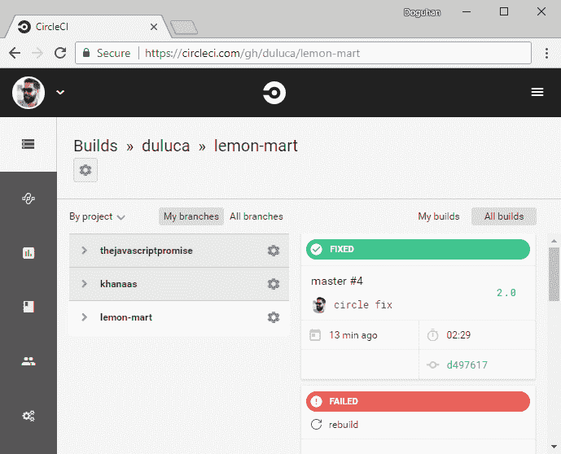

CircleCI 上的绿色构建

目前,CI 服务器正在运行,在第 1 阶段构建应用程序,然后在第 2 阶段运行测试,最后在第 3 阶段构建 Web 服务器。请注意,我们并没有对这个 Web 服务器容器镜像做任何事情,比如将其部署到服务器。

为了部署您的镜像,您需要实现一个部署步骤。在这一步中,您可以将其部署到多个目标,如 Docker Hub、Zeit Now、Heroku 或 AWS ECS。与这些目标的集成将涉及多个步骤。从整体上看,这些步骤如下:

1.  使用单独的运行步骤安装面向目标的 CLI 工具

1.  使用针对目标环境的登录凭据配置 Docker,并将这些凭据存储为 CircleCI 环境变量

1.  使用`docker push`将生成的 Web 服务器镜像提交到目标的 Docker 注册表

1.  执行平台特定的`deploy`命令，指示目标运行刚刚推送的 Docker 镜像。

如何从本地开发环境在 AWS ECS 上配置此类部署的示例在第十六章中有涵盖，*AWS 上高可用的云基础设施*。

# 代码覆盖率报告

了解你的 Angular 项目的单元测试覆盖量和趋势的一个好方法是通过代码覆盖率报告。为了为你的应用程序生成报告，从项目文件夹执行以下命令：

```ts
$ npx ng test --browsers ChromiumNoSandbox --watch=false --code-coverage
```

结果报告将以 HTML 形式创建在名为覆盖率的文件夹下；执行以下命令在浏览器中查看：

```ts
$ npx http-server -c-1 -o -p 9875 ./coverage
```

这是`istanbul.js`为 LemonMart 生成的文件夹级样本覆盖报告：

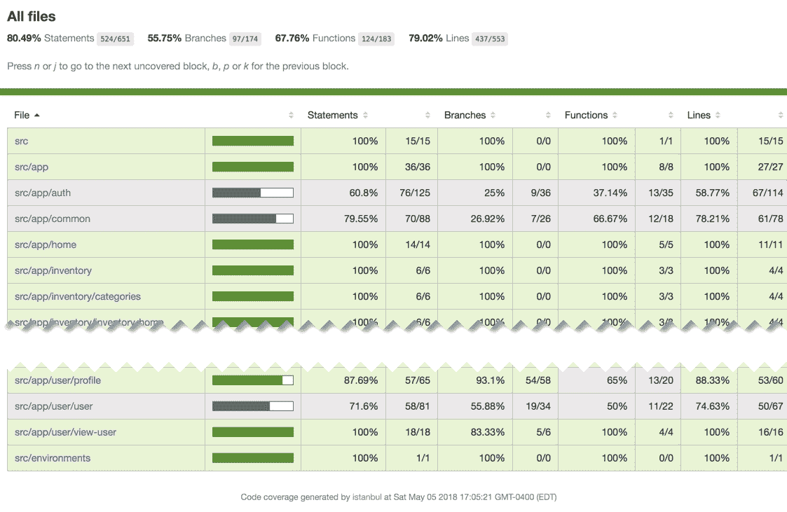

LemonMart 的伊斯坦布尔代码覆盖率报告

你可以进一步深入了解特定文件夹，比如`src/app/auth`，并获得一个文件级报告，就像这样：

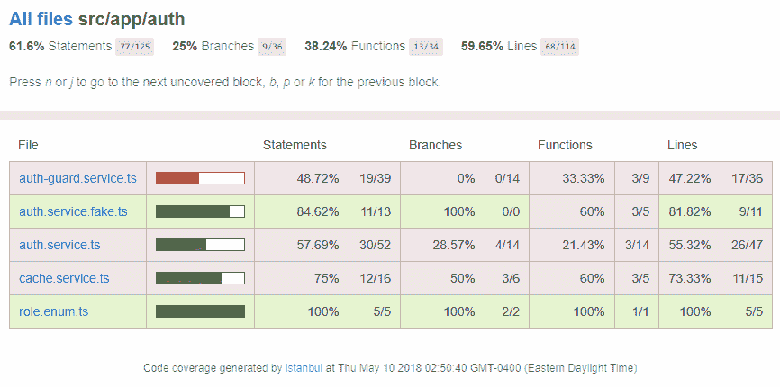

LemonMart 的 src/app/auth 的伊斯坦布尔代码覆盖率报告

你还可以进一步深入了解给定文件，比如`cache.service.ts`的行级覆盖率，就像这样：

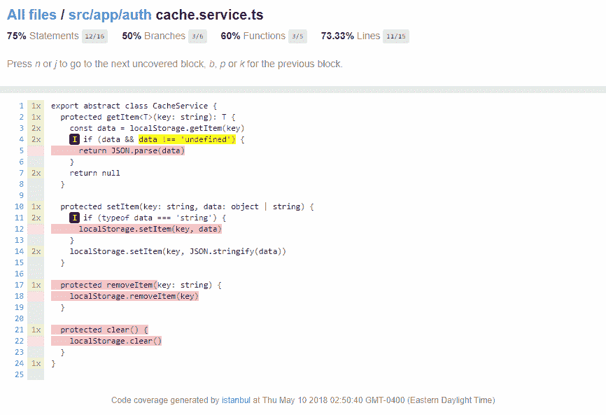

Istanbul 缓存服务代码覆盖率报告

在上面的图像中，您可以看到第 5,12,17-18 和 21-22 行没有被任何测试覆盖。图标表示 if 路径未被采用。我们可以通过实现练习中包含在`CacheService`中的函数的单元测试来增加我们的代码覆盖率。作为练习，读者应尝试至少用一个新的单元测试覆盖这些功能之一，并观察代码覆盖率报告的变化。

理想情况下，您的 CI 服务器配置应该在每次测试运行时以一种容易访问的方式生成和托管代码覆盖率报告。在`package.json`中将这些命令作为脚本实现，并在 CI 流程中执行。这个配置留作读者的练习。

将`http-server`作为项目的开发依赖项安装到您的项目中。

# API 设计

在全栈开发中，早期确定 API 设计是很重要的。API 设计本身与数据契约的外观密切相关。您可以创建 RESTful 端点或使用下一代 GraphQL 技术。在设计 API 时，前端和后端开发人员应密切合作，以实现共享的设计目标。一些高层目标如下：

+   最小化客户端与服务器之间传输的数据

+   坚持成熟的设计模式（即分页）

+   设计以减少客户端中存在的业务逻辑

+   展平数据结构

+   不要暴露数据库键或关系

+   从一开始就提供版本端点

+   围绕主要数据组件进行设计

很重要的是不要重复造轮子，并且要严格、甚至严格地设计你的 API。API 设计的错误后果在应用程序上线后可能会产生深远的影响，并且不可能再进行修正。

我将详细介绍如何围绕主要数据组件进行设计，并实现一个示例的 Swagger 端点。

# 围绕主要数据组件进行设计

它有助于围绕主要数据组件组织你的 API。这将粗略地匹配你在 Angular 应用程序中不同组件中消耗数据的方式。我们将首先通过创建一个粗略的数据实体图来定义我们的主要数据组件，然后使用 Swagger 实现用户数据实体的示例 API。

# 定义实体

让我们首先试着确定你想要储存的实体是什么，并思考这些实体如何相互关联。

这是一个使用[draw.io](http://draw.io)创建的 LemonMart 的示例设计：

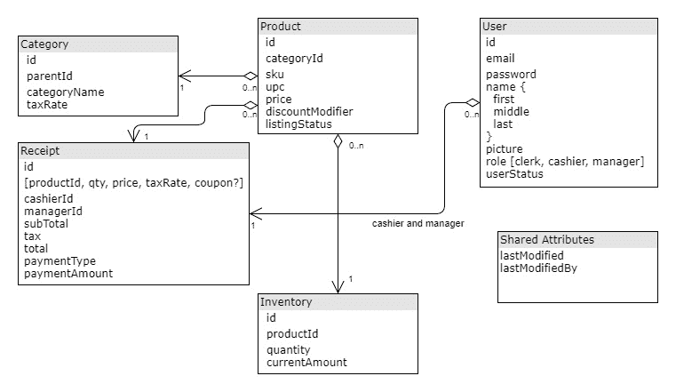

LemonMart 的数据实体图

此时，你的实体是存储在 SQL 还是 NoSQL 数据库中无关紧要。我的建议是坚持你所知道的，但如果你从头开始，像 MongoDB 这样的 NoSQL 数据库将在你的实现和需求演变时提供最大灵活性。

大致来说，你需要为每个实体进行 CRUD API。你可以使用 Swagger 来设计你的 API。

# Swagger

Swagger 将允许你设计你的 web API。对于团队来说，它可以充当前端和后端团队之间的接口。此外，通过 API mocking，你可以在实现 API 之前开发和完成 API 功能。

随着我们的进行，我们将实现一个示例用户 API，以演示 Swagger 的工作方式。

该示例项目带有用于 VS Code 的推荐扩展程序。Swagger Viewer 允许我们在不运行任何额外工具的情况下预览 YAML 文件。

# 定义一个 Swagger YAML 文件

Swagger 规范的最广泛使用和支持版本是`swagger: '2.0'`。以下示例使用了新的、基于标准的`openapi: 3.0.0`。示例代码仓库包含了这两个示例。然而，在发布时，Swagger 生态系统中的大多数工具依赖于版本 2.0。

示例代码仓库可以在[github.com/duluca/lemon-mart-swagger-server](http://github.com/duluca/lemon-mart-swagger-server)找到。

对于你的模拟 API 服务器，你应该创建一个单独的 git 仓库，这样前端和后端之间的这个约定可以被分开维护。

1.  创建一个名为`lemon-mart-swagger-server`的新 GitHub 仓库。

1.  开始定义一个带有通用信息和目标服务器的 YAML 文件：

```ts
swagger.oas3.yaml
openapi: 3.0.0
info:
  title: LemonMart
  description: LemonMart API
  version: "1.0.0"

servers:
  - url: http://localhost:3000
    description: Local environment
  - url: https://mystagingserver.com/v1
    description: Staging environment
  - url: https://myprodserver.com/v1
    description: Production environment
```

1.  在`components`下，定义共享的数据`schemas`：

```ts
swagger.oas3.yaml
...
components:
  schemas: 
    Role:
      type: string
      enum: [clerk, cashier, manager]
    Name:
      type: object
      properties:
        first:
          type: string
        middle:
          type: string
        last:
          type: string
    User:
      type: object
      properties:
        id:
          type: string
        email:
          type: string
        name:
          $ref: '#/components/schemas/Name'
        picture:
          type: string
        role:
          $ref: '#/components/schemas/Role'
        userStatus:
          type: boolean
        lastModified:
          type: string
          format: date
        lastModifiedBy:
          type: string
    Users:
      type: object
      properties:
        total:
          type: number
          format: int32
      items:
        $ref: '#/components/schemas/ArrayOfUser'
    ArrayOfUser:
      type: array
      items:
            $ref: '#/components/schemas/User'
```

1.  在`components`下，添加共享的`parameters`，使得重用常见模式像分页端点变得容易：

```ts
swagger.oas3.yaml
...
  parameters:
    offsetParam: # <-- Arbitrary name for the definition that will be used to refer to it.
                  # Not necessarily the same as the parameter name.
      in: query
      name: offset
      required: false
      schema:
        type: integer
        minimum: 0
      description: The number of items to skip before starting to collect the result set.
    limitParam:
      in: query
      name: limit
      required: false
      schema:
        type: integer
        minimum: 1
        maximum: 50
        default: 20
      description: The numbers of items to return.
```

1.  在`paths`下，为`/users`路径定义一个`get`端点：

```ts
...
paths:
  /users:
    get:
      description: |
        Searches and returns `User` objects.
        Optional query params determines values of returned array
      parameters:
        - in: query
          name: search
          required: false
          schema:
            type: string
          description: Search text
        - $ref: '#/components/parameters/offsetParam'
        - $ref: '#/components/parameters/limitParam'
      responses:
        '200': # Response
          description: OK
          content: # Response body
            application/json: # Media type
              schema:
                $ref: '#/components/schemas/Users'
```

1.  在`paths`下，添加通过 ID`get`用户和通过 ID`update`用户的端点：

```ts
swagger.oas3.yaml
...
  /user/{id}:
    get:
      description: Gets a `User` object by id
      parameters:
        - in: path
          name: id
          required: true
          schema:
            type: string
          description: User's unique id
      responses:
         '200': # Response
            description: OK
            content: # Response body
              application/json: # Media type
                schema:
                  $ref: '#/components/schemas/User'
    put:
      description: Updates a `User` object given id
      parameters:
        - in: query
          name: id
          required: true
          schema:
            type: string
          description: User's unique id
        - in: body
          name: userData
          schema:
            $ref: '#/components/schemas/User'
          style: form
          explode: false
          description: Updated user object
      responses:
        '200':
          description: OK
          content: # Response body
              application/json: # Media type
                schema:
                  $ref: '#/components/schemas/User'
```

要验证您的 Swagger 文件，您可以使用[editor.swagger.io](https://editor.swagger.io)上的在线编辑器。

注意使用了 `style: form` 和 `explode: false`，这是配置预期接收基本表单数据的端点的最简单方式。要获取更多参数序列化选项或模拟认证端点和一系列其他可能的配置，请参考[swagger.io/docs/specification/](https://swagger.io/docs/specification/)上的文档。

# 创建 Swagger 服务器

使用您的 YAML 文件，您可以使用 Swagger Code Gen 工具生成一个模拟的 Node.js 服务器。

# 使用非官方工具的 OpenAPI 3.0

如前一部分所述，此部分将使用 YAML 文件的版本 2，该版本可以使用官方工具生成服务器。然而，还有其他工具可以生成一些代码，但不够完整以便易于使用：

1.  如果在项目文件夹上使用 OpenAPI 3.0，请执行以下命令：

```ts
$ npx swagger-node-codegen swagger.oas3.yaml -o ./server
...
Done! 
Check out your shiny new API at C:\dev\lemon-mart-swagger-server\server.
```

在一个名为 `server` 的新文件夹下，现在应该有一个生成的 Node Express 服务器。

1.  为服务器安装依赖项：

```ts
$ cd server
$ npm install
```

然后必须手动实现缺失的存根以完成服务器的实现。

# 使用官方工具的 Swagger 2.0

使用官方工具和版本 2.0，您可以自动创建 API 并生成响应。一旦官方工具完全支持它们，OpenAPI 3.0，相同的说明应该适用：

1.  在一个可以被您的机器访问到的 URI 上发布您的 YAML 文件：

```ts
https://raw.githubusercontent.com/duluca/lemon-mart-swagger-server/master/swagger.2.yaml
```

1.  在项目文件夹中，执行以下命令，将 `<uri>` 替换为指向您的 YAML 文件的 uri：

```ts
$ docker run --rm -v ${PWD}:/local swaggerapi/swagger-codegen-cli 
$ generate -i <uri> -l nodejs-server -o /local/server
```

与前一节类似，这将在 server 目录下创建一个 Node Express 服务器。要执行此服务器，请按照以下步骤操作。

1.  使用 `npm install` 安装服务器的依赖项

1.  运行 `npm start`。您的模拟服务器现在应该运行起来了。

1.  转到 `http://localhost:3000/docs`

1.  尝试 `get /users` 的 API；您将注意到 items 属性为空：

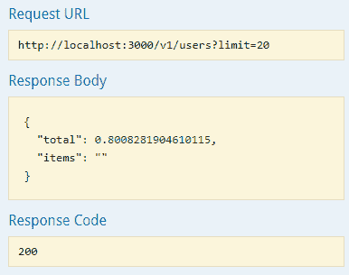

Swagger UI - 用户端点

但是，您应该收到虚拟数据。我们将修正这种行为。

1.  尝试 `get /user/{id}`；您将看到收到一些虚拟数据：

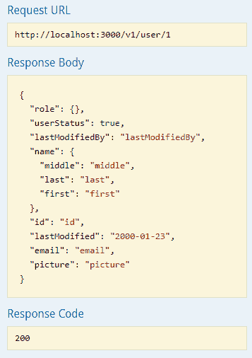

Swagger UI - 按 ID 查找用户端点

行为上的差异是因为，默认情况下，Node Express 服务器使用在 `server/controllers/Default.js` 下生成的控制器从 `server/service/DefaultService.js` 读取在服务器创建期间生成的随机数据。然而，您可以禁用默认控制器并强制 Swagger 切换到更好的默认存根模式。

1.  更新 `index.js` 以强制使用存根并注释掉控制器：

```ts
index.js
var options = {
  swaggerUi: path.join(__dirname, '/swagger.json'),
  // controllers: path.join(__dirname, './controllers'),
  useStubs: true,
}
```

1.  再次尝试 `/users` 端点

正如您在这里看到的，响应默认情况下质量更高：

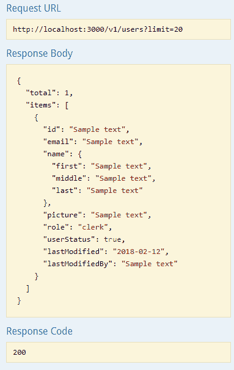

Swagger UI - 附带虚拟数据的用户端点

在前面的内容中，`total`是一个整数，`role`已正确定义，`items`是一个有效的数组结构。

为了实现更好和更定制的数据模拟，你可以编辑`DefaultService.js`。在这种情况下，你需要更新`usersGET`函数，以返回一组定制的用户。

# 启用跨源资源共享（CORS）

在你能够从应用程序中使用你的服务器之前，你需要对其进行配置，以允许**跨源资源共享**（**CORS**），以便你在`http://localhost:5000`上托管的 Angular 应用程序可以与在`http://localhost:3000`上托管的模拟服务器进行通信：

1.  安装`cors`包：

```ts
$ npm i cors
```

1.  更新`index.js`来使用`cors`：

```ts
server/index.js
...
var cors = require('cors')
...
app.use(cors())

// Initialize the Swagger middleware
swaggerTools.initializeMiddleware(swaggerDoc, function(middleware) {
...
```

确保在`initializeMiddleware`之前调用`app.use(cors())`；否则，其他 Express 中间件可能会干扰`cors()`的功能。

# 验证和发布 Swagger 服务器

你可以通过 SwaggerUI 验证你的 Swagger 服务器设置，它位于`http://localhost:3000/docs`，或者你可以在 VS Code 中通过 Preview Swagger 扩展实现更加集成的环境。

我将演示如何使用该扩展从 VS Code 内部测试你的 API：

1.  在资源管理器中选择 YAML 文件

1.  按下*Shift* + *Alt* + *P*并执行 Preview Swagger 命令

1.  你会看到一个交互式窗口来测试你的配置，如下图所示：

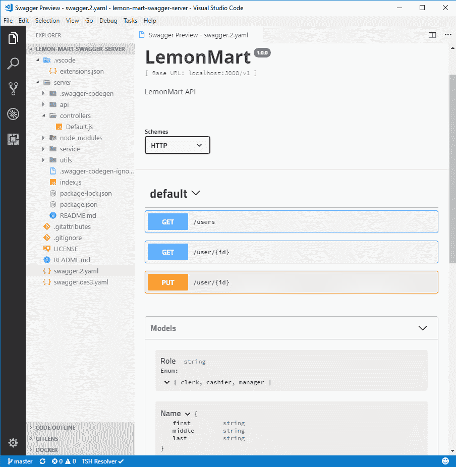

在 Visual Studio Code 中预览 Swagger 扩展

1.  点击/users 下的 Get 按钮

1.  点击 Try it out 查看结果

在 OpenAPI 3.0.0 中，你会看到一系列服务器，包括本地和远程资源，而不是方案。这是一个非常方便的工具，可以在编写前端应用程序时探索各种数据源。

现在你已经验证了你的 Swagger 服务器，你可以发布你的服务器，以使团队成员或者需要可预测数据集以成功执行的**自动验收测试**（**AAT**）环境可以访问。

执行以下步骤：*

1.  将 Docker 的 npm 脚本添加到根级`package.json`文件中

1.  添加`Dockerfile`：

```ts
Dockerfile
FROM duluca/minimal-node-build-env:8.11.2

RUN mkdir -p /usr/src
WORKDIR /usr/src

COPY server .

RUN npm ci

CMD ["node", "index"]
```

一旦你构建了容器，你就可以部署它了。

我在 Docker Hub 上发布了一个样例服务器，网址是[`hub.docker.com/r/duluca/lemon-mart-swagger-server`](https://hub.docker.com/r/duluca/lemon-mart-swagger-server)。

# 总结

在本章中，你学会了如何创建基于容器的持续集成环境。我们利用了 CircleCI 作为基于云的 CI 服务，并强调了你可以将构建结果部署到所有主要的云托管提供商。如果你启用这样的自动化部署，你将实现**持续部署**（**CD**）。通过 CI/CD 管道，你可以与客户和团队成员分享应用程序的每一次迭代，并快速向最终用户交付错误修复或新功能。

我们还讨论了良好 API 设计的重要性，并确定 Swagger 是一个有益于前端和后端开发人员的工具，用于定义和根据实时数据合同进行开发。如果你创建一个 Swagger 模拟服务器，你可以让团队成员拉取模拟服务器镜像，并在后端实现完成之前用它来开发他们的前端应用。

CircleCI 和 Swagger 在各自的方式上都是非常复杂的工具。本章提到的技术故意简单，但旨在实现复杂的工作流程，让你感受到这些工具真正的力量。你可以大大提高这种技术的效率和能力，但这些技术将取决于你的具体需求。

凭借我们可以发送真实 HTTP 请求的 CI 和模拟 API，我们已经准备好迅速迭代，同时确保高质量的交付成果。在下一章中，我们将深入探讨使用基于令牌的身份验证和条件导航技术为你的业务线应用设计授权和认证体验，以实现平滑的用户体验，延续首先路由的方法。
