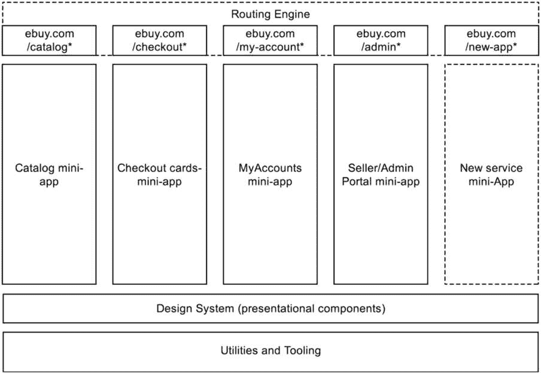
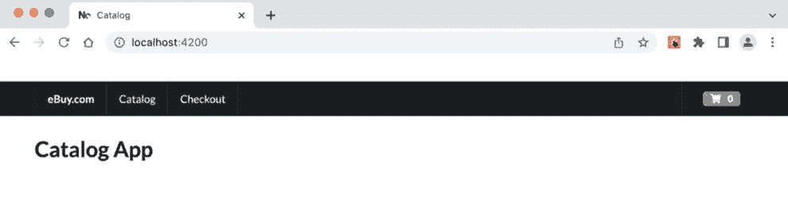
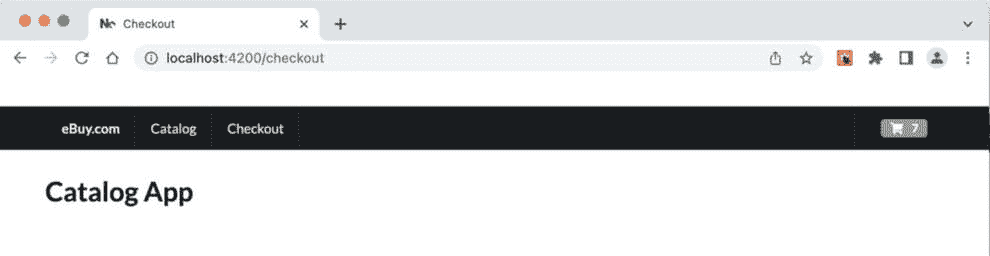
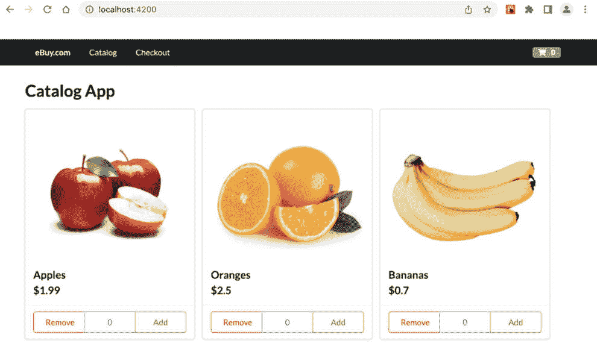
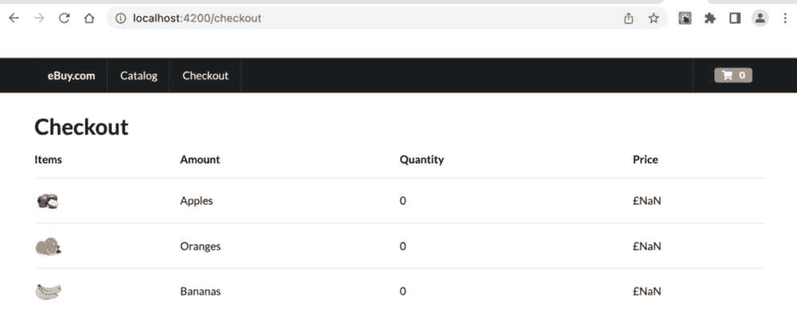
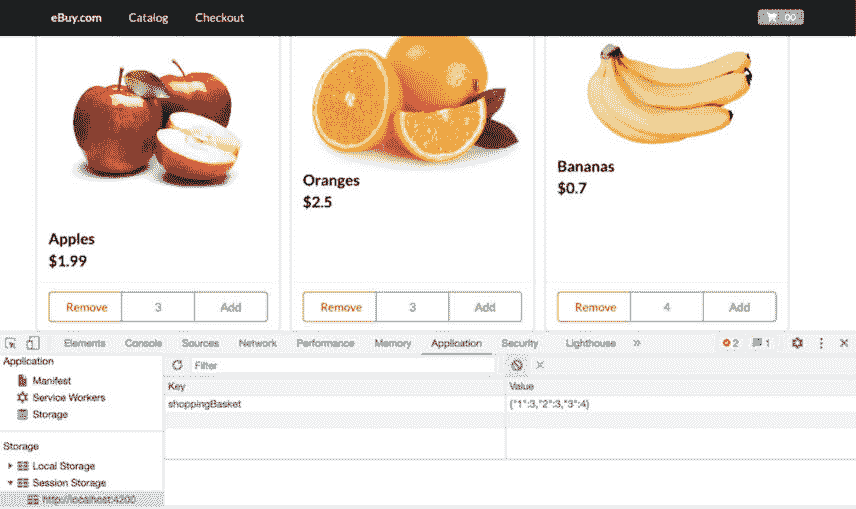

# 第四章：为微前端实现多 SPA 模式

假设你是一名建筑师，负责构建一个大型政府电子门户的前端，该门户为个人和企业提供众多在线服务。这些服务包括注册健康福利、提交所得税申报、注册小型企业以及支付车辆道路税，此外还有大量信息内容的发布。

或者，情景二，假设你被分配去构建一个提供多种在线服务的银行门户，从管理储蓄账户到购买保险，再到投资机会、贷款、抵押贷款、信用卡等等。

你会如何规划不仅你的架构，还包括将负责构建该架构的团队？自然，首先的思考层次是将大型门户分解成多个较小的模块或微应用，并让每个团队专注于其中一个微应用。

这将是正确的做法，这也是我们所说的构建微前端的多 SPA 模式。

在本章中，我们将构建我们的多 SPA 模式微前端，我们将探讨以下内容：

+   多 SPA 微前端的高级架构

+   在多 SPA 之间建立路由

+   使用共享组件库

+   设置持久状态以在微应用之间共享状态

# 技术要求

在我们浏览本章中的代码示例时，我们需要以下内容：

+   至少 8 GB RAM 的 PC、Mac 或 Linux 桌面或笔记本电脑（16 GB 更佳）

+   英特尔芯片组 i5+或 Mac M1+芯片组

+   至少 256 GB 的空闲硬盘存储空间

你还需要在你的计算机上安装以下软件：

+   Node.js 版本 16+（如果你需要管理不同版本的 Node.js，请使用**nvm**）

+   终端：iTerm2 配合 OhMyZsh（你以后会感谢我的）

+   IDE：我们强烈推荐 VS Code，因为我们将会使用一些 VS Code 内置的插件来提升开发者体验

+   npm、yarn 或 pnpm – 我们推荐 pnpm，因为它速度快且存储效率高

+   浏览器：Chrome、Microsoft Edge 或 Firefox（我使用 Firefox）

+   对 Nx.dev 单一代码库的基本理解，以及对在 VS Code 中使用 NX 控制台插件的基本理解

+   熟练掌握 React

本章的代码文件可以在以下位置找到：[`github.com/PacktPublishing/Building-Micro-Frontends-with-React`](https://github.com/PacktPublishing/Building-Micro-Frontends-with-React)

我们还假设你对 Git 有基本的操作知识，例如分支、提交代码和发起拉取请求。

# 理解多 SPA 架构

多 SPA 架构模式是构建大型应用程序中最常见的模式之一。正如其名所示，在这个模式中，我们有一组 SPA，它们共同构成一个大型应用程序。在这个模式中，每个 SPA 都作为其自己的独立功能或模块运行，可以通过命名空间并映射到应用程序的 URL 直接访问。这些 SPA 还共享一个非常薄的共享组件和全局状态层，以确保应用程序之间的连贯性和一致性。



图 4.1 – 多 SPA 架构

如您在 *图 4**.1* 中所见，我们有四个 SPA：一个目录，将包含产品列表、产品详情、搜索等页面；一个包含购物车、支付等页面的结账 SPA；我的账户 SPA；以及卖家/管理员 SPA。您还会注意到这种模式允许我们轻松地随着应用程序的增长添加额外的 SPA。

每个这些 SPA 都映射到一个唯一的初级 URL，这样用户点击 `/catalog` URL 将会被重定向到目录应用程序，而用户点击 `/checkout` URL 将会进入结账应用程序。

# 构建我们的多 SPA 微前端

构建一个多 SPA 微前端基本上包括三个广泛领域：将应用程序分解成逻辑上的小程序，然后我们需要在这些小程序之间设置路由，最后，我们设置一个全局状态，不同的小程序可以从中读取和写入数据。让我们在接下来的章节中逐一查看。

## 设置我们的小程序

我们将从上一章结束的地方开始。

如果您跳过了上一章并直接跳到这里，您可以从克隆 [`github.com/PacktPublishing/Building-Micro-Frontends-with-React/tree/main/ch3/my-mfe`](https://github.com/PacktPublishing/Building-Micro-Frontends-with-React/tree/main/ch3/my-mfe) 的存储库开始。

让我们快速运行 `pnpm install`（如果您还没有这样做的话）并服务相应的应用程序，以确保它们运行正常。

由于我们打算构建一个电子商务应用程序，让我们把我们的应用程序命名为 *eBuy*。请随意重命名您的应用程序文件夹为 `ebuy`。

在积极开发期间，我们理想上是在自己的小程序上工作，您可以使用 NX 控制台轻松地服务您的小程序。

然而，您可能需要定期测试跨越不同小程序的整个端到端应用程序流程，为此，您能够在本地上运行所有小程序非常重要。这正是我们接下来要做的。

我们首先需要确保每个小程序运行在其自己的唯一端口上。为此，我们需要首先找到位于 `apps/catalog` 文件夹中的 `project.json` 文件。您会注意到它基本上包含运行您应用程序上各种任务所需的所有命令和配置。

我们导航到 `"serve"` 部分，并在 `"options"` 下添加行 `"``port": 4200`：

```js
    "serve": {
      "executor": "@nrwl/web:dev-server",
      "defaultConfiguration": "development",
      "options": {
        "buildTarget": "catalog:build",
        "hmr": true,
        "port": 4200
      },
      "configurations": {
        "development": {
          "buildTarget": "catalog:build:development",
        },
        "production": {
          "buildTarget": "catalog:build:production",
          "hmr": false
        }
      }
    },
```

我们在 `apps/checkout` 文件夹中的 `project.json` 文件中也做同样的事情，但这次我们将确保它在 `"port": 4201` 上运行，如下所示：

```js
      "options": {
        "buildTarget": "checkout:build",
        "hmr": true,
        "port": 4201
      },
```

这样可以确保，默认情况下，目录将在端口 `4200` 上运行，而结账应用将在端口 `4201` 上运行。

多亏了继承，我们可以在相同的端口上以开发和生产模式运行应用。

接下来，我们将创建一个脚本命令，允许我们在各自的端口上并行运行所有应用。

为了做到这一点，我们进入项目根目录下的 `package.json` 文件，并添加一个名为 `"serve:all": "nx run-many --target=serve"` 的脚本：

```js
  "scripts": {
    "start": "nx serve",
    "build": "nx build",
    "test": "nx test",
    "serve:all": "nx run-many --target=serve"
  },
```

现在，在你的终端中运行以下命令：

```js
pnpm serve:all
```

你将看到 `nx` 正在启动 webpack 开发服务器并启动两个应用。

通过访问这些两个 URL 在浏览器中验证它：

+   目录应用：**http://localhost:4200**

+   结账应用：**http://localhost:4201**

在微前端中，每个 SPA 遵循相同的品牌指南和外观感觉非常重要。我们通过构建一个共享的 UI 组件集来实现这一点，这两个应用都会使用这些组件。在下一节中，我们将看到如何创建共享组件库。

## 使用共享组件库

由于你正在构建一系列作为你整体更大应用一部分的迷你应用，我们希望确保所有这些迷你应用都有一致的设计——例如，拥有一致的头尾和组件行为的一致方式。同样重要的是，当我们对一些核心元素进行更改时，我们需要确保它可以在所有不同的应用中轻松更新。这正是 `libs` 文件夹发挥作用的地方。

这也是一个定义 NPM 范围的好时机，以便所有这些共享组件都可以通过它们的范围名称导入。

要定义 NPM 范围，我们打开位于单仓库根目录下的 `nx.json` 文件。我们将命名我们的范围为 `ebuy`，但实际上，它可以是任何名称——你团队的名称，你为组件库取的名称，等等。

在 `nx.json` 文件中定位 `npmScope` 属性，并按以下方式更新：

```js
  "npmScope": "ebuy",
```

让我们使用我们可信赖的 Nx 控制台来创建一个库。从 Nx 控制台，选择 `generate`，然后选择 `@nrwl/react – library` `React Library`。

选择 **显示所有选项**，提供/修改以下详细信息，其余的保持默认：

```js
Library name   : ui
Generate a default component    : No
importPath : @ebuy/ui
```

我们可以将其余的保持默认，并点击运行按钮以在 `libs` 中生成 `ui` 文件夹。

除了在 `libs` 中创建 `ui` 文件夹外，你还会注意到 Nx 还在 `tsconfig.base.json` 的 `paths` 对象中添加了一个条目，如下所示：

```js
    "paths": {
      "@ebuy/ui": ["libs/ui/src/index.ts"]
    }
```

正是这个设置将允许我们通过范围名称而不是长文件夹路径导入我们的 UI 组件。

接下来，让我们创建一些 UI 组件。

我们将使用令人惊叹的 Semantic-UI React 组件库来构建我们的 UI 组件。您也可以使用任何其他组件库，例如 Chakra UI、MUI React-Bootstrap 等：

1.  让我们使用以下命令在单一代码仓库的根目录下安装它：

    ```js
    pnpm install semantic-ui-react semantic-ui-css
    ```

1.  记住您始终可以使用 **npm** 或 **yarn** 安装 npm 包，如下所示：

    ```js
    yarn add semantic-ui-react semantic-ui-css
    npm install semantic-ui-react semantic-ui-css
    ```

    现在让我们在 `libs/ui` 文件夹中创建一些我们的常用组件。

1.  让我们使用 Nx 控制台创建一个新的组件：

    **Nx** | **生成** | **创建一个** **react 组件**

1.  使用以下信息创建组件：

    +   **名称**：**header**

    +   **项目**：**ui**

    +   **扁平化**：选择复选框以确保我们在内部拥有更扁平的文件夹结构。

1.  点击运行按钮并验证 **header.tsx** 文件是否在 **libs/ui/src/lib** 文件夹中创建。

1.  打开 **header.tsx** 文件，并用我们头部组件的简单标记替换其内容：

    ```js
    import { Menu, Container, Icon, Label } from 'semantic-ui-react';
    export function Header() {
      return (
        <Menu fixed="top" inverted>
          <Container>
            <Menu.Item as="a" header>
              eBuy.com
            </Menu.Item>
            <MenuItems />
            <Menu.Item position="right">
              <Label>
                <Icon name="shopping cart" />
                00
              </Label>
            </Menu.Item>
          </Container>
        </Menu>
      );
    }
    const MenuItems = () => {
      return (
        <>
          {NAV_ITEMS.map((navItem, index) => (
            <Menu.Item key={index}>
              <a href={navItem.href ?? '#'}>{navItem.label}</a>
            </Menu.Item>
          ))}
        </>
      );
    };
    interface NavItem {
      label: string;
      href?: string;
    }
    const NAV_ITEMS: Array<NavItem> = [
      {
        label: 'Catalog',
        href: '/',
      },
      {
        label: 'Checkout',
        href: '/checkout',
      },
    ];
    export default Header;
    ```

    这是一段简单的 React 组件代码，它将显示目录和检查的导航头部。

1.  下一步是将它从 **ui** 中导出。定位到 **/libs/ui/src/index.ts** 文件，并添加以下条目：

    ```js
    export * from './lib/header';
    ```

    这将允许我们的头部组件可以通过较短的导入路径进行导入。现在让我们将其导入到我们的目录和检查应用中。

1.  打开 **apps/catalog/src/spp/app.tsx** 文件，并按如下方式导入头部组件：

    ```js
    import { Header } from '@ebuy/ui';
    ```

1.  让我们清理一些样板代码。移除对 **styles** 和 **NxWelcome** 的导入，并在 JSX 中添加 **Header** 组件。您还可以删除 **catalog** 文件夹中的 **nx-welcome.tsx** 文件。您的最终代码应如下所示：

    ```js
    import { Header } from '@ebuy/ui';
    import { Container, Header as Text } from 'semantic-ui-react';
    import 'semantic-ui-css/semantic.min.css';
    export function App() {
      return (
        <Container style={{ marginTop: '5rem' }}>
          <Header />
          <Text size="huge">Catalog App</Text>
        </Container>
      );
    }
    export default App;
    ```

    在前面的代码中，我们导入了 semantic-ui 的 CSS 文件，并包含了显示应用名称的 `Header` 组件和文本。

    在浏览器中运行时，目录应用看起来可能如下所示：



图 4.2 – 带有通用头部菜单栏的目录应用

1.  我们将在检查应用中的 **apps/checkout/src/app/app.tsx** 文件内进行相同的更改。

1.  让我们测试一下我们的代码。运行 **pnpm serve:all** 并在 **http://localhost:4200** 上刷新浏览器以查看我们的最新更改。

尝试点击目录或检查的导航链接，注意它没有任何反应。这是因为我们还没有在我们的应用之间设置路由，这正是我们接下来将要做的。

## 设置路由

正如我们之前讨论的，我们时不时地想要测试我们的端到端应用功能，尽管我们能够在不同的端口上并行运行应用，但在测试端到端功能方面存在一些挑战：

+   我们需要确保我们的应用在本地和在生产环境中都拥有一致的导航结构。

+   在不同端口上运行的应用被视为不同域上的应用，因此无法共享 cookies、会话状态等。

为了克服这些问题，我们需要让浏览器认为应用正在同一端口上运行。我们通过设置反向代理来实现这一点。我们将设置路由的方式是每个迷你应用都将有自己的命名空间主路由，例如：

+   **eBuy.com**: 首页应用

+   **eBuy.com/catalog**: 目录应用

+   **eBuy.com/checkout**: 结账应用

二级路由通常在迷你应用内部设置。例如，苹果的产品详情页面将是 `eBuy.com/catalog/apples`。

Webpack 开发服务器和 Nx 提供了易于使用的代理支持，我们可以利用这些支持。

在目录应用的根目录 `/apps/catalog` 中，让我们创建一个名为 `proxy.conf.json` 的新文件，并包含以下条目：

```js
{
  "/catalog": {
    "target": "http://localhost:4200"
  },
  "/checkout": {
    "target": "http://localhost:4201"
  }
}
```

接下来，我们需要告诉目录应用使用此文件进行其代理配置。

我们通过在 `apps/catalog/project.json` 文件中的 serve 对象下开发配置中添加 `proxyConfig` 属性来完成此操作，如下所示：

```js
    "options": {
        "buildTarget": "catalog:build",
        "hmr": true,
        "port": 4200,
        "proxyConfig": "apps/catalog/proxy.conf.json"
      },
```

让我们快速测试一下。我们需要重新启动我们的开发服务器以获取最新的代理配置。

运行 `serve:all` 命令并尝试点击 **结账** 和 **目录** 导航链接… 哎呀… 它没有工作，当你点击 **结账** 链接时，显示的是相同的目录应用… 但是等等 – 浏览器标签页上的标题标签确实显示 **结账**：



图 4.3 – 标题中为结账应用但正在加载目录包

那么，这里发生了什么？如果你查看开发工具，问题就变得非常明显。这里发生的情况是代理已正确地将我们重定向到结账应用，这就是为什么我们看到通过结账应用提供的正确 `index.html` 文件，然而，脚本中的 `src` 标签加载的 `js` 包指向根目录，因此它们实际上是从目录应用加载的 `js` 包。

由于 Nx 的帮助，解决这个问题相对容易。

我们只需要为结账应用定义 `baseRef`。我们通过在 `/apps/checkout/project.json` 文件中添加 `"baseHref": "/checkout/"` 来完成此操作。

这就是你的父 serve 对象下的开发对象应该看起来像这样：

```js
     "options": {
          "buildTarget": "checkout:build:development",
          "port": 4201,
          "baseHref": "/checkout/"
        },
```

重新启动开发服务器，现在你将能够在两个应用之间导航，并正确加载 JS 包。在下一节中，我们将努力添加产品列表响应以模拟产品列表 API 调用的模拟响应。

## 设置模拟产品列表

在所有网络开发活动中，一个常见的做法是设置一个模拟服务器或一组模拟的 API 响应，直到实际的 API 准备好。由于我们的电子商务应用需要在所有其他迷你应用中使用的商品列表，我们创建了一个共享库来保存我们的模拟。

所以，再次使用我们最喜欢的 Nx Console，让我们创建另一个 React 库，让我们称它为 `mocks`，我们将使用作用域名称 `@ebuy/mocks`。

在 `mocks` 库的 `libs/mocks/src/lib` 中，让我们创建一个名为 `product-list-mocks.tsx` 的文件，并包含以下代码：

```js
interface productListItem {
  id: string;
  title: string;
  image: string;
  price: number;
}
export const PRODUCT_LIST_MOCKS: Array<productListItem> = [
  {
    id: '1',
    title: 'Apples',
    image: '/assets/apple.jpg',
    price: 1.99,
  },
  {
    id: '2',
    title: 'Oranges',
    image: '/assets/orange.jpg',
    price: 2.5,
  },
  {
    id: '3',
    title: 'Bananas',
    image: '/assets/banana.jpg',
    price: 0.7,
  },
];
export default PRODUCT_LIST_MOCKS;
```

让我们不要忘记从 `/libs/mocks/src/index.ts` 文件中导出它，以下是一行代码：

```js
export * from './lib/product-list-mocks';
```

此外，别忘了将产品图片放在 `catalog` 应用程序的 `src/assets` 文件夹中。你可以在这里找到图片 [`github.com/PacktPublishing/Building-Micro-Frontends-with-React-18/tree/main/ch4/ebuy/apps/catalog/src/assets`](https://github.com/PacktPublishing/Building-Micro-Frontends-with-React-18/tree/main/ch4/ebuy/apps/catalog/src/assets)。

我们现在将尝试在应用程序中使用它，无论何时我们需要从产品列表中获取数据。

## 添加产品网格和结账组件

现在我们有一个看起来不错的标题和一个应用程序，我们可以从一个迷你应用程序导航到另一个。然而，应用程序的其余部分并没有做什么，所以让我们向目录应用程序添加一个产品列表组件，并向结账应用程序添加一个购物篮组件。

我们将首先在 `/apps/catalog/src/app` 文件夹中创建 `ProductList` 组件。我们将文件命名为 `product-list.tsx`。我们将首先创建一个空壳组件：

```js
import { Card } from 'semantic-ui-react';
import ProductCard from './product-card';
import { PRODUCT_LIST_MOCKS } from '@ebuy/mocks';
export function ProductList() {
  return (
    <Card.Group>
      {PRODUCT_LIST_MOCKS.map((product) => (
        <ProductCard key={product.id} product={product} />
      ))}
    </Card.Group>
  );
}
export default ProductList;
```

我们将因为缺少 `ProductCard` 组件而得到一个错误。别担心 – 我们将在下一步创建该组件。接下来，我们需要创建我们的 `ProductCard` 组件。我们将文件命名为 `product-card.tsx`。

我们首先定义我们的 `ProductCard` 组件的框架：

```js
import { Button, Card, Image } from 'semantic-ui-react';
export function ProductCard(productData: any) {
  const { product } = productData;
  return (
    <Card>
      <Card.Content>
        <Image alt={product.title} src={product.image} />
        <Card.Header>{product.title}</Card.Header>
        <Card.Description>{product.description}</Card.Description>
        <Card.Header>${product.price}</Card.Header>
      </Card.Content>
      <Card.Content extra>
        <div className="ui three buttons">
          <Button basic color="red">
            Remove
          </Button>
          <Button basic color="blue">
            {0}
          </Button>
          <Button basic color="green">
            Add
          </Button>
        </div>
      </Card.Content>
    </Card>
  );
}
export default ProductCard;
```

接下来，让我们导入位于 `/apps/catalog/src/app/app.tsx` 的目录应用程序的 `ProductList app.tsx` 文件。

你的 `app.tsx` 代码现在应该看起来像这样：

```js
import { Header } from '@ebuy/ui';
import { Container, Header as Text } from 'semantic-ui-react';
import 'semantic-ui-css/semantic.min.css';
import ProductList from './product-list';
export function App() {
  return (
    <Container style={{ marginTop: '5rem' }}>
      <Header />
      <Text size="huge">Catalog App</Text>
      <ProductList />
    </Container>
  );
}
export default App;
```

如果你的目录应用程序看起来像下面的截图，那么这意味着你正在正确的道路上：



图 4.4 – 带有标题和产品列表组件的目录应用程序

接下来，我们将创建我们的购物篮组件。因此，在我们的 `/apps/checkout/src/app` 文件夹中的 `app.tsx` 结账文件中，让我们创建以下代码的基本框架：

```js
import { Header } from '@ebuy/ui';
import { Container, Header as Text } from 'semantic-ui-react';
import 'semantic-ui-css/semantic.min.css';
import ShoppingBasket from './basket';
import { PRODUCT_LIST_MOCKS } from '@ebuy/mocks';
export function App() {
  return (
    <Container style={{ marginTop: '5rem' }}>
      <Header />
      <Text size="huge">Checkout</Text>
      <ShoppingBasket basketList={PRODUCT_LIST_MOCKS} />
    </Container>
  );
}
export default App;
```

这段代码现在应该看起来很熟悉了。正如你所见，我们有一个 `ShoppingBasket` 组件，并且目前我们正在将其传递给 `PRODUCT_LIST_MOCKS` 以进行模拟。

接下来，我们要创建那个正在抛出错误的 `ShoppingBasket` 组件。

因此，让我们在 `/apps/checkout/src/` 应用程序文件夹中创建一个名为 `basket.tsx` 的文件：

```js
import { Table, Image, Container } from 'semantic-ui-react';
export function ShoppingBasket(basketListData: any) {
  const { basketList } = basketListData;
  return (
    <Container textAlign="center">
      <Table basic="very" rowed>
        <Table.Header>
          <Table.Row>
            <Table.HeaderCell>Items</Table.HeaderCell>
            <Table.HeaderCell>Amount</Table.HeaderCell>
            <Table.HeaderCell>Quantity</Table.HeaderCell>
            <Table.HeaderCell>Price</Table.HeaderCell>
          </Table.Row>
        </Table.Header>
        <Table.Body>
          {basketList.map((basketItem: any) => (
            <Table.Row key={basketItem.id}
>
              <Table.Cell>
                <Image src={basketItem.image} rounded size="mini" />
              </Table.Cell>
              <Table.Cell> {basketItem.title}</Table.Cell>
              <Table.Cell>{basketItem.quantity || 0}</Table.Cell>
              <Table.Cell>${basketItem.price * basketItem.quantity}</Table.Cell>
            </Table.Row>
          ))}
        </Table.Body>
      </Table>
    </Container>
  );
}
export default ShoppingBasket;
```

这一切都是自解释的占位符标记内容，目前并没有做什么。在接下来的章节中，我们将使所有这些内容协同工作。

你正在运行的结账应用程序现在应该看起来像这样：




这样，我们的两个应用就能良好地工作并显示正确的数据，然而，它们还没有“交谈”。结账应用不知道用户在目录应用中添加了哪些商品。在下一节中，我们将设置一个全局共享状态，这两个迷你应用都可以与之交谈并读取。

在我们进入下一节之前，让我们快速回顾一下到目前为止我们已经完成的事项清单：

+   确保目录应用和结账应用在不同的端口上运行

+   确保我们在`proxy.conf.json`文件中设置了 URL 路由

+   我们两个应用都在从模拟的产品列表中读取数据

## 设置全局共享状态

现在我们能够在两个迷你应用之间导航，接下来要解决的是在这两个不同的应用之间设置共享状态。因为这些是两个独立的应用，通常的状态管理解决方案，如 Context API、Redux、MobX 等，将不起作用。这是因为这些库将状态作为应用内的一个对象存储，当你刷新页面或导航到另一个应用时，这个状态就会丢失。因此，为了克服这个问题，我们求助于使用浏览器的一些原生功能，如本地存储、会话存储或 Index-db。

对于这个例子，我们将使用会话存储。我们将设置一个简单的自定义钩子来在`sessionStorage`中持久化状态，并让我们的迷你应用都能读取和写入这个状态。

在任何大型应用中，都会有大量的类似自定义钩子，团队可以重用。这也是我们为这些自定义钩子设置另一个库的好机会。

重要的是要记住，这个全局状态应该仅在我们需要在不同的迷你应用之间共享信息时才少量使用。为了管理每个微应用内的状态，我们应该使用常规的状态管理工具，例如 Context API 或 Redux 等。

让我们使用 Nx 控制台创建另一个名为`custom-hooks`的库：

```js
Nx Console > generate > Create a React Library
```

然后，我们将在表单中填写以下信息：

+   **名称**：**custom-hooks**

+   **组件**：**off**（生成默认组件）

+   **导入路径**：**@ebuy/custom-hooks**

验证`custom-hooks`文件夹是否在`libs`下创建，并确保它已经被添加到 monorepo 根目录下的`tsconfig.base.json`文件中，现在它看起来应该像这样：

```js
    "paths": {
      "@ebuy/custom-hooks": ["libs/custom-hooks/src/index.ts"],
      "@ebuy/mocks": ["libs/mocks/src/index.ts"],
      "@ebuy/ui": ["libs/ui/src/index.ts"],
      "@ebuy/utils": ["libs/utils/src/index.ts"]
    }
```

让我们现在创建我们的自定义钩子。使用`generate`命令创建一个具有以下信息的 React 组件：

+   **组件名称**：**useSessionStorage**

+   **项目**：**custom-hooks**

+   **文件名**：**use-session-storage**

+   **flat**：**Selected**（生成扁平文件结构）

在新创建的`use-session-storage.tsx`组件文件中，让我们用以下代码替换样板代码：

```js
import {
  Dispatch,
  SetStateAction,
  useCallback,
  useEffect,
  useState,
} from 'react';
import { useEventCallback, useEventListener } from 'usehooks-ts';
declare global {
  interface WindowEventMap {
    'session-storage': CustomEvent;
  }
}
type SetValue<T> = Dispatch<SetStateAction<T>>;
export function useSessionStorage<T>(key: string, initialValue: T): [T, SetValue<T>] {
  // Get from session storage then
  // parse stored json or return initialValue
  const readValue = useCallback((): T => {
    // Prevent build error "window is undefined" but keep working
    if (typeof window === 'undefined') {
      return initialValue;
    }
    try {
      const item = window.sessionStorage.getItem(key);
      return item ? (parseJSON(item) as T) : initialValue;
    } catch (error) {
      console.warn(`Error reading sessionStorage key "${key}":`, error);
      return initialValue;
    }
  }, [initialValue, key]);
  // State to store our value
  // Pass initial state function to useState so logic is only executed once
  const [storedValue, setStoredValue] = useState<T>(readValue);
  // Return a wrapped version of useState's setter function that ...
  // ... persists the new value to sessionStorage.
  const setValue: SetValue<T> = useEventCallback((value) => {
    // Prevent build error "window is undefined" but keeps working
    if (typeof window === 'undefined') {
      console.warn(
        `Tried setting sessionStorage key "${key}" even though environment is not a client`
      );
    }
    try {
      // Allow value to be a function so we have the same API as useState
      const newValue = value instanceof Function ? value(storedValue) : value;
      // Save to session storage
      window.sessionStorage.setItem(key, JSON.stringify(newValue));
      // Save state
      setStoredValue(newValue);
      // We dispatch a custom event so every useSessionStorage hook are notified
      window.dispatchEvent(new Event('session-storage'));
    } catch (error) {
      console.warn(`Error setting sessionStorage key "${key}":`, error);
    }
  });
  useEffect(() => {
    setStoredValue(readValue());
    // eslint-disable-next-line react-hooks/exhaustive-deps
  }, []);
  const handleStorageChange = useCallback(
    (event: StorageEvent | CustomEvent) => {
      if ((event as StorageEvent)?.key && (event as StorageEvent).key !== key) {
        return;
      }
      setStoredValue(readValue());
    },
    [key, readValue]
  );
  // this only works for other documents, not the current one
  useEventListener('storage', handleStorageChange);
  // this is a custom event, triggered in writeValueTosessionStorage
  // See: useSessionStorage()
  useEventListener('session-storage', handleStorageChange);
  return [storedValue, setValue];
}
export default useSessionStorage;
// A wrapper for "JSON.parse() to support "undefined" value
function parseJSON<T>(value: string | null): T | undefined {
  try {
    return value === 'undefined' ? undefined : JSON.parse(value ?? '');
  } catch {
    console.log('parsing error on', { value });
    return undefined;
  }
}
```

这个自定义钩子代码是`usehooks-ts`库的一部分，并在此处提供：[`usehooks-ts.com/react-hook/use-session-storage`](https://usehooks-ts.com/react-hook/use-session-storage)

由于这个自定义钩子使用了 `usehook-ts` 库，我们将安装该 npm 模块：

```js
pnpn i usehook-ts
```

接下来，我们需要将其导出，以便可以通过作用域路径导入。我们在 `/libs/custom-hooks/src/index.ts` 文件中添加以下行来执行此操作：

```js
export * from './lib/use-session-storage'
```

接下来，我们将在 `product-card` 组件中使用我们新创建的自定义钩子，这样每次用户向购物车添加或从购物车中删除产品时，它都会将其作为数组存储在 `sessionStorage` 中。

在 `/apps/catalog/src/app/productcard.tsx` 文件中，我们将首先导入 `useSessionStorage` 钩子：

```js
import { useSessionStorage } from '@ebuy/custom-hooks;
```

然后，在产品卡片组件中，我们使用 `useSessionStorage` 钩子并添加以下代码来添加和从购物车中删除项目的函数：

```js
const [basket, setBasket]: any = useSessionStorage('shoppingBasket', {});
  const addItem = (id: string) => {
    basket[id] = basket[id] ? basket[id] + 1 : 1;
    setBasket(basket);
  };
 const removeItem = (id: string) => {
    basket[id] = basket[id] <= 1 ? 0 : basket[id] - 1;
    setBasket(basket);
```

接下来，我们更新 **添加** 和 **删除** 按钮的点击事件，如下所示：

```js
<div className="ui three buttons">
          <Button basic color="red" onClick={() => removeItem(product.id)}>
            Remove
          </Button>
          <Button basic color="blue">
            {basket[product.id] || 0}
          </Button>
          <Button basic color="green" onClick={() => addItem(product.id)}>
            Add
          </Button>
        </div>
```

让我们通过运行以下命令来测试它：

```js
pnpm serve:all
```

点击 **添加** 和 **删除** 按钮来查看一些产品的产品计数。

让我们打开开发工具并查看 **应用程序** 选项卡下的 `sessionStorage`。



图 4.6 – 存储在会话存储中的购物车

一旦状态存在于 **会话存储** 中，我们将在不同组件的多个地方读取它。最好创建一个可按需重用的实用函数。

我们将使用 Nx Console 创建另一个库，但这次不是创建一个 React 库，而是使用 `@nrwl/workspace – library` 模板来生成我们的通用 `utils` 库，并使用名为 `@ebuy/utils` 的导入作用域。

在 `Nx Console > generate` 步骤中我们填写的信息如下：

+   **@****nwrl/workspace**: **library**

+   **名称**：**utils**

+   **importScope**: **@ebuy/utils**

运行此命令将生成 `utils` 文件夹并创建 `utils.ts` 文件。让我们将其重命名为 `get-session-storage.ts`。

添加以下代码以读取给定键的值：

```js
export function getSessionStorage(key: any) {
  const sessionStorageValue = JSON.parse(
    window.sessionStorage.getItem(key) || '{}'
  );
  return sessionStoragevalue;
}
export default getSessionStorage;
```

如您所见，这是一个非常简单的函数，它接受一个键并返回给定键的会话存储中的值。

接下来，我们将获取页眉中的迷你购物车并将其连接起来以显示购物车中的总项目数。在 `header.tsx` 文件中，让我们添加必要的代码来读取和总计购物车中的项目。

让我们导入必要的函数：

```js
import { useEffect, useState } from 'react';
import { useEventListener } from 'usehooks-ts';
import { getSessionStorage } from '@ebuy/utils';
```

我们将创建一个函数来计算总计数，如下所示：

```js
const getTotalBasketCount = (basket: any): any => {
  return Object.values(basket).reduce((a: any, b: any) => a + b, 0);
};
```

接下来，在 `Header` 组件中，我们将使用 `useEffects` 和 `eventListeners` 的组合来确保每次向购物车添加或从购物车中删除项目时，迷你购物车都会更新。

```js
const [miniBasketCount, setMiniBasketCount] = useState(null);
  useEffect(() => {
    const basket: any = getSessionStorage('shoppingBasket');
    const totalCount: any = getTotalBasketCount(basket);
    setMiniBasketCount(totalCount);
  }, []);
  useEventListener('session-storage', () => {
    const basket: any = getSessionStorage('shoppingBasket');
    const totalCount: any = getTotalBasketCount(basket);
    setMiniBasketCount(totalCount);
  });
```

最后，我们将更新购物车图标以显示 `{miniBasketCount}`，如下所示：

```js
<Menu.Item position="right">
          <Label>
            <Icon name="shopping cart" />
            {miniBasketCount}
          </Label>
        </Menu.Item>
```

运行应用并尝试使用 **添加** 和 **删除** 按钮添加和删除项目，并查看计数如何更新。

本章的最后部分，我们将完成结账应用中的购物车组件。

我们需要做的是从`sessionStorage`中获取`shoppingBasket`键的数据，并显示添加到购物车中的产品和数量。

我们打开位于`apps/checkout/src/app/app.tsx`的`app.tsx`结账文件，按照以下步骤从`sessionStorage`获取数据：

首先，我们像这样导入`getSessionStorage`：

```js
import { getSessionStorage } from '@ebuy/utils';
```

然后，在`App`函数中，我们添加以下内容：

```js
const basketFromStorage: any = getSessionStorage('shoppingBasket');
    console.log('Basket: ', basketFromStorage);
```

当我们运行应用并查看控制台时，我们将能够看到`shoppingBasket`中的商品数组。

由于`shoppingBasket`只存储产品 ID 及其数量，我们需要将产品 ID 映射到产品名称，以便在购物车中显示名称。

让我们创建另一个函数来完成这个任务。我们将称之为`createCompleteBasket`：

```js
const createCompleteBasket = (allItems: any, quantities: any) => {
  return allItems
    .filter((item: any) => quantities[item.id])
    .map((item: any) => {
      return {
        ...item,
        quantity: quantities[item.id],
      };
    });
};
```

最后，在我们的应用组件函数中，我们通过过滤和映射产品列表中的值到`shoppingbasket`来创建`completeBasket`，如下所示：

```js
  const completeBasket = createCompleteBasket(
    PRODUCT_LIST_MOCKS,
    basketFromStorage
  );
```

现在，我们将更新`ShoppingBasket`组件，传入这个新的属性，如下所示：

```js
 <ShoppingBasket basketList={completeBasket} />
```

在浏览器中测试您的应用，并尝试操作。在目录应用中添加和移除商品，然后导航到结账应用，查看所有同步并显示正确商品列表的购物车。

关于代码示例的说明

正如您所看到的，我们在多个地方使用了“**any**”类型定义，并跳过了一些细节（包括单元测试）。这是故意的，为了避免过度复杂化示例，以便我们专注于本章的核心方面，例如应用之间的路由和状态共享。当构建用于生产的应用时，我们鼓励您定义正确的类型和接口，以充分利用 TypeScript 的全部功能，并编写相关的测试。

有了这些，我们就来到了这个相当紧张的部分的结尾...休息一下。做得好！

我们在这里做了很多工作。我们从上一章结束的地方继续，为我们的应用添加了一个共享的头部组件。然后，我们通过代理设置路由，以便在两个不同的应用之间导航，但就像它们是同一域名和端口的组成部分一样。我们还看到了如何使用会话存储在两个小程序之间共享状态。然后，我们创建了一个公共的自定义钩子来存储和检索会话存储中的数据，在这个过程中，我们构建了一个电子商务应用的骨架，包括向购物车添加商品和在结账应用以及头部的小购物车中更新购物车信息。

# 概述

这是一章很长的内容，所以恭喜你坚持看到最后。我们一开始是查看多-SPA 模式的外观。我们看到了这种模式对于非常大的应用程序，如银行门户、政府门户或电子商务网站来说最为合适。我们还看到了这种架构模式，其中所有这些不同的微应用程序都可以利用共享的通用组件和实用程序库，以确保不同应用程序的一致性。

我们随后深入研究了代码，并在 Nx 单一代码库中设置了我们的两个小型应用程序，之后我们着手创建共享的 UI 标题组件，并使用 Semantic UI 构建了我们的目录和结账应用程序。这也是我们了解如何使用作用域名称的好机会，这使得我们的导入路径看起来整洁简单。

然后，我们着手设置路由，以便在两个不同的应用程序之间进行导航，最后，我们设置了一个自定义钩子来在会话存储中存储我们的应用程序状态，并了解了如何使其在两个小型应用程序之间同步。

在下一章中，我们将探讨微应用程序模式，其中我们将在同一页面上加载多个微应用程序。
