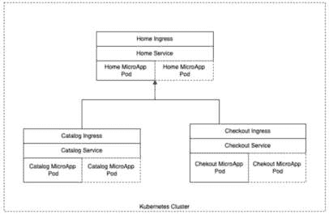
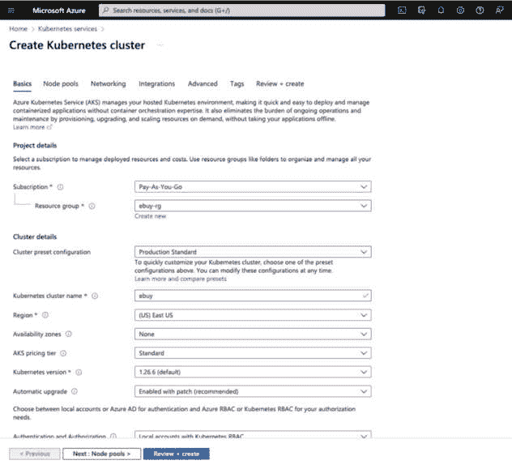
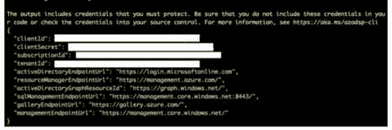

# 第八章：将微前端部署到 Kubernetes

在上一章中，我们学习了如何手动将我们的微前端部署到静态存储提供商，如 Firebase。

在本章中，我们将通过学习如何将我们的应用程序部署到托管 Kubernetes 集群来深入了解云和 DevOps 领域。Kubernetes 已成为将企业级 Web 应用程序（包括后端和前端）部署到云中的事实标准。

当涉及到部署单页应用程序（SPAs）时，我们通常运行 webpack 的`build`命令来生成我们的 JavaScript 包和资产在`/build`或`/dist`文件夹中，然后我们只需将其复制到静态网站托管提供商，以便我们的应用程序可供用户使用。然而，部署微前端要复杂得多。

在本章中，我们将看到如何将我们的模块联邦微前端部署到托管 Kubernetes 集群。

我们将涵盖以下主题：

+   如何使用 Docker 容器化我们的应用程序

+   Kubernetes 及其各种组件的基本知识

+   一些基本命令来管理我们的 Kubernetes 集群

+   DevOps 以及如何自动化部署我们的微应用程序到 Kubernetes

到本章结束时，我们将使我们的微前端应用程序在 Azure 上的 Kubernetes 集群中运行。我们将通过自动化的**持续集成**（**CI**）和**持续交付**（**CD**）管道来部署它们，该管道将在代码合并时自动构建和部署必要的应用程序。

# 技术要求

除了我们在前几章中提到的所有标准技术要求之外，你还需要以下内容：

+   Azure 云订阅

+   访问 GitHub 和 GitHub Actions

+   对 CI 和 CD 概念的高级理解

+   了解 Docker 和应用程序容器化将有所帮助

本章的代码文件可以在以下 URL 找到，我们基本上从*第六章*中构建的微前端开始：[`github.com/PacktPublishing/Building-Micro-Frontends-with-React`](https://github.com/PacktPublishing/Building-Micro-Frontends-with-React)。

我们还假设你具备 Git 的基本操作知识，例如分支、提交代码和发起拉取请求。

# Kubernetes 简介

**Kubernetes**，也称为**K8s**，已经席卷了云和 DevOps 世界。最初由谷歌开发，现在成为云原生计算基金会的一部分，Kubernetes 提供所有必要的工具，通过单一界面在云上部署和管理大规模、关键任务应用程序。

传统上，在云上管理大规模、生产级应用程序意味着必须处理诸如 Web 服务器、负载均衡器、自动扩展以及内部和外部流量路由等问题。现在，Kubernetes 将所有这些整合到一个统一的框架下，并提供了一种一致的方式来管理云环境中的所有组件。

Kubernetes 的前提是您通过规范文件告诉它您想要的最终状态，然后 Kubernetes 会着手为您完成。例如，如果您告诉 Kubernetes 您想要三个具有服务负载均衡器的应用程序副本，Kubernetes 将会计算出如何启动三个副本，并确保流量在三个副本之间均匀分布。如果由于某种原因，其中一个 Pod 重新启动或关闭，Kubernetes 将自动启动一个新的 Pod，以确保在任何给定时间都有三个 Pod 副本的服务流量。同样，当您部署应用程序的新版本时，Kubernetes 将负责逐步启动具有最新应用程序版本的新的 Pod，同时优雅地关闭具有旧版本应用程序的 Pod。

在本节的剩余部分，我们将探讨 Kubernetes 的关键组件，以及如何在 Kubernetes 上部署我们的微前端架构。

## 什么是 Kubernetes？

Kubernetes 是一个平台无关的容器编排平台，它能够在机器集群中部署、扩展和管理容器化应用程序。

它抽象了底层基础设施，允许您在各种环境中运行应用程序，包括本地数据中心、公共云提供商（如微软 Azure、谷歌云平台和亚马逊网络服务），甚至在自己的笔记本电脑上。

Kubernetes 被设计成高度模块化和可扩展的，并且它集成了各种工具和服务，以支持应用程序的完整生命周期，包括部署、扩展、监控和维护。它在业界得到了广泛的应用，并已成为容器编排的事实标准。

## Kubernetes 的关键概念

Kubernetes 可以是一个非常广泛的话题，需要专门的领域来深入探讨。您可以在以下链接中查看 Kubernetes 各个组件的详细信息：[`kubernetes.io/docs/concepts/overview/components`](https://kubernetes.io/docs/concepts/overview/components)。然而，作为一个前端工程师，以及本书的范围，您需要了解以下六个基本概念和术语：

+   **Nodes**：节点是 Kubernetes 集群中的工作机器。它可以是物理机或虚拟机，负责运行部署到其上的容器化应用程序。

+   **Pods**：Pod 是 Kubernetes 应用程序的基本执行单元。它是一个或多个容器的逻辑宿主，Pod 中的所有容器都在同一节点上运行。Pod 为容器提供了一个共享的上下文，例如共享存储和网络。

+   **Services**：服务是一组 Pod 上的逻辑抽象。它定义了访问 Pod 的策略，通常是通过一个稳定的 IP 地址或 DNS 名称。服务允许您解耦应用程序之间的依赖关系，使您能够在不影响服务消费者的情况下扩展或更新一组 Pod。

+   **Deployments**：部署是一种声明式管理 ReplicaSet 的方式，ReplicaSet 是一组部署到集群中的相同 Pod。部署允许您指定应用程序的期望状态，Kubernetes 将确保实际状态与期望状态相匹配。这包括滚动更新、回滚和自我修复。

+   **Ingress**：Ingress 是将您的服务暴露给外部世界的一种方式。它提供了一种将外部流量映射到集群中特定服务的方法，通常是通过一个稳定的 IP 地址或 DNS 名称。Ingress 还可以提供额外的功能，例如 SSL 终止和负载均衡。将其想象成一个将 URL 映射到服务的路由器。

+   **Namespaces**：命名空间是 Kubernetes 集群中的一个逻辑分区。它允许您在不同的上下文中使用相同的资源（例如名称），并且可以用于在集群内隔离资源。

## Kubernetes 微前端架构

当我们在 Kubernetes 上部署微前端时，为每个微应用创建一个 Pod，并且这个微应用通过 Ingress 服务内部暴露。

主应用模块将所有这些微应用联邦起来。以下图表有助于更好地解释架构：



图 8.1 – 部署微前端使用的 Kubernetes 拓扑架构

如您在 *图 8**.1* 中所见，我们的每个微应用都部署在其自己的 Pod 中。这些 Pod 可以根据流量增加进行复制或设置为自动扩展。这由围绕 Pod 的虚线框表示。这些 Pod 通过服务暴露，该服务充当一种负载均衡器。因此，主页应用服务是所有主页微应用 Pod 复制的单一端点。

每个服务都通过 Ingress 路由暴露。这是我们定义微应用 URL 的地方，这最终将用于我们的模块联邦配置。这就是整体 Kubernetes 架构将看起来像什么。

通过这一点，我们来到了本节的结尾，在这里我们了解了一些 Kubernetes 的关键概念，例如节点、Pod、服务、Ingress 以及我们 Kubernetes 集群内微应用的架构。在下一节中，我们将看到如何将我们的应用容器化，以便它可以部署到 Kubernetes 集群中。

# 使用 Docker 容器化我们的微应用

容器是一种以标准化和可移植的方式打包软件应用程序的方法，允许它们在不同的环境中一致地运行。它们提供了一种轻量级且高效的运行应用程序的方式，特别适合于由多个独立可部署服务组成的微服务架构。

在本节中，我们将探讨如何通过创建 Dockerfile 来安装 Docker 并创建 Docker 镜像。

## 安装 Docker

Docker Engine 可以通过 Docker Desktop 在多个 Linux、Mac 和 Windows 系统上供个人使用。您可以按照以下说明安装 Docker 引擎：[`docs.docker.com/engine/install/`](https://docs.docker.com/engine/install/)。

注意

如果你不想在 Windows 或 Mac 上使用 Docker Desktop，有一些替代方案，例如 Rancher Desktop、Podman 和 Colima。

一旦安装了 Docker，请在终端中运行以下命令以验证它：

```js
docker -v
```

如果它返回 Docker 的版本，那么你就设置好了，这意味着 Docker 已经在你的系统上成功安装。

## 创建独立应用构建

在我们开始创建 Docker 镜像之前，我们首先需要确保我们的微应用的构建输出是自包含的，并且可以以独立模式运行。我们通过在每个`next.config.js`文件中添加以下行来实现这一点，如下所示：

```js
const path = require("path");
module.exports = {
  output: "standalone",
  experimental: {
    outputFileTracingRoot: path.join(__dirname, "../../"),
  },
…
}
```

`outputFileTracingRoot`是 Next.js 12+版本中引入的一个实验性功能；这有助于减少构建输出的体积，尤其是在我们想要尝试减少 Docker 镜像大小时。

确保将这些行添加到每个微应用的`next.config.js`文件中。

## 创建 Dockerfile

下一步是创建我们的 Dockerfile，其中包含 Docker 创建我们的 Docker 镜像的指令。

由于我们需要为每个微应用创建一个 Docker 镜像，我们将在`apps/home`中创建一个 Dockerfile。我们通常给这个文件取的名字是`Dockerfile`。

让我们在 Dockerfile 中添加以下命令。我们将使用 Turborepo 和 Next.js 提供的默认 Dockerfile。

我们将构建一个多阶段 Dockerfile，这允许我们利用层的缓存，同时也确保 Docker 镜像的大小尽可能小。

我们将分三个阶段来构建它，首先是构建阶段：

```js
FROM node:18-alpine AS base
FROM base AS builder
# Check https://github.com/nodejs/docker-node/tree/b4117f9333da4138b03a546ec926ef50a31506c3#nodealpine to understand why libc6-compat might be needed.
RUN apk add --no-cache libc6-compat
RUN apk update
# Set working directory
WORKDIR /app
RUN yarn global add turbo
COPY . .
RUN turbo prune --scope=home --docker
```

如您所见，我们使用 Node Alpine 18.14 作为基础镜像，并将其称为构建阶段。Alpine 是 Node.js 最简约的版本。

现在，我们安装`libc6-compact`库并运行`update`命令。然后，我们设置应用程序的工作目录并安装 turbo。

然后，我们将从我们的 repo 复制所有内容（注意`COPY`命令中两个点之间的空格）。

最后，我们运行`turbo prune`命令以提取所有必要的文件，用于主微应用。

现在，我们将进入安装阶段，并在上一段代码之后立即编写以下代码：

```js
FROM base AS installer
RUN apk add --no-cache libc6-compat
RUN apk update
WORKDIR /app
# First install the dependencies (as they change less often)
COPY .gitignore .gitignore
COPY --from=builder /app/out/json/ .
COPY --from=builder /app/out/pnpm-lock.yaml ./pnpm-lock.yaml
RUN yarn global add pnpm
RUN pnpm install --no-frozen-lockfile
# Build the project
COPY --from=builder /app/out/full/ ./
COPY turbo.json turbo.json
RUN ENV=PROD yarn turbo run build --filter=home...
```

再次，我们首先定义基础镜像为安装程序，运行常规的`apk add`和`update`命令，并设置工作目录。

然后，我们将`.gitignore`文件以及从`/app/out`文件夹中的相关文件从构建阶段复制过来。

我们接着安装`pnpm`并运行`pnpm` install 命令。

然后，我们将从我们的构建阶段的`app/out/full`文件夹中复制所有文件并运行`turbo` `build`命令。

然后，我们继续到最后一个运行阶段，在那里我们编写以下代码：

```js
FROM base AS runner
WORKDIR /app
# Don't run production as root
RUN addgroup --system --gid 1001 nodejs
RUN adduser --system --uid 1001 nextjs
USER nextjs
COPY --from=installer /app/apps/home/next.config.js .
COPY --from=installer /app/apps/home/package.json .
# Automatically leverage output traces to reduce image size
# https://nextjs.org/docs/advanced-features/output-file-tracing
COPY --from=installer --chown=nextjs:nodejs /app/apps/home/.next/standalone ./
COPY --from=installer --chown=nextjs:nodejs /app/apps/home/.next/static ./apps/home/.next/static
COPY --from=installer --chown=nextjs:nodejs /app/apps/home/public ./apps/home/public
CMD node apps/home/server.js
```

在前面的代码中，我们基本上创建了一个用户组来避免以 root 身份运行代码的安全风险，然后我们复制了从我们的安装阶段的相关文件并运行了`node`命令。

现在，我们需要在仓库的根目录中创建一个`.dockerignore`文件，其中我们列出我们不希望 Docker 复制到镜像中的文件和文件夹：

```js
node_modules
npm-debug.log
**/node_modules
.next
**/.next
```

让我们测试 Dockerfile，看看它是否能够构建。从应用程序的根目录，在终端中运行以下命令：

```js
docker build -t home -f apps/home/Dockerfile .
```

`-t`代表标签名称，它将创建一个名为`home`的 Docker 镜像。`-f`部分是 Dockerfile 的路径。

注意命令末尾的空格和句号，这是很重要的。命令末尾的句号表示构建上下文——即 Docker 构建镜像时应使用的文件和文件夹集合。句号还表示我们想要打包当前目录中的所有文件和文件夹。

这个命令在第一次运行时可能需要几分钟，因为 Docker 将下载基础节点镜像和其他依赖项。后续的构建将会快得多，因为 Docker 将缓存层并重用它们，如果层没有变化的话。

您可以通过运行以下命令在本地运行 Docker 镜像：

```js
docker run -p 3000:3000 home
```

一旦我们验证了它运行正常，我们还需要为我们的每个应用程序创建类似的 Dockerfile。

因此，在`apps/catalog`和`apps/checkout`中，复制并粘贴 Dockerfile，并将所有`home`实例替换为相关的微应用名称。

注意，这些微应用都在相同的端口`3000`上运行，因此为了在本地测试它们，我们一次只能测试一个镜像，除非您将`hostPort`值更改为不同的值或使用 docker-compose 文件。

现在我们已经学会了如何将我们的微应用 docker 化并在本地运行，我们将继续到下一节，即设置 Docker Hub。

## 设置 Docker Hub 以存储 Docker 镜像

在上一节中，我们创建了应用程序的 Docker 镜像并能够在本地运行它们。为了能够在 Kubernetes 上部署它们，我们需要将它们存储在一个容器库中，以便我们的 DevOps 管道可以从中拉取镜像。我们将使用像 Docker Hub 这样的免费工件注册解决方案来完成这项工作。或者，您可以使用各种托管提供商提供的其他容器注册解决方案，例如 Azure Container Registry、Google Container Registry 和 Amazon Elastic Container Registry：

1.  在[`hub.docker.com`](https://hub.docker.com)登录/注册，然后为每个微应用创建三个公共仓库。我们将它们命名为以下：

    +   **ebuy-home**

    +   **ebuy-catalog**

    +   **ebuy-checkout**

1.  记下 Docker 注册表的路径，通常为**<你的用户名>/ebuy-home**格式，**<你的用户名>/ebuy-catalog**格式，等等。

1.  然后，让我们创建一个访问令牌，它将用于我们的 CI 和 CD 管道。转到**账户设置**，在**安全**页面创建一个新的访问令牌，并为其提供描述。在**访问权限**下，选择**读取和写入**，因为我们的管道需要推送和拉取 Docker 镜像。

1.  一旦生成令牌，请复制并妥善保管，因为它将不会再显示。（如果您丢失了旧令牌，您始终可以生成新令牌。）

我们在 Docker Hub 上的工作完成了！

在下一节中，我们将创建用于启动我们的 Kubernetes 集群的 Kubernetes 配置文件。

# 创建 Kubernetes 配置文件

在本章的早期部分，在*Kubernetes 简介*部分，我们学习了我们将使用来部署我们的微前端的各种 Kubernetes 服务。

在 Kubernetes 上部署这些服务通常是通过在`.yaml`文件中定义各种配置设置，然后将配置应用到 Kubernetes 集群来完成的。

在本节中，我们将了解这些 Kubernetes 规范文件的结构以及如何为我们的部署、服务和 Ingress 创建它们。

## Kubernetes 规范文件的结构

Kubernetes 规范文件是一个 YAML 文档，它描述了 Kubernetes 对象（如 Deployment、Pod、Service 或 ConfigMap）的期望状态。Kubernetes 规范文件的结构通常由两个主要部分组成——元数据部分和规范部分。每个文件始终从定义`apiVersion`和规范文件的`kind`开始。

元数据部分包括有关对象的信息，例如其名称、标签和注解。该部分由 Kubernetes 用于管理对象并允许其他对象引用它。

规范部分包括对象期望的状态，例如容器镜像、资源请求和限制、网络配置以及任何其他相关设置。该部分由 Kubernetes 用于根据其期望状态创建和管理对象。

## 创建部署我们的微前端的规范文件

如我们之前所见，Kubernetes 规范文件的结构遵循分层格式，每个部分及其相应的属性都嵌套在适当的标题下。此外，许多 Kubernetes 对象具有特定于其类型的属性，因此规范文件的结构可能因描述的对象而异。

让我们从在每个微应用文件夹中的`k8s`文件夹内创建这些文件开始。

让我们从创建一个名为`/apps/home/k8s/deployment.yml`的文件开始，并包含以下代码。`deployment.yml`文件包含了设置和配置 Kubernetes pods 的配置，我们的微应用将在其中运行：

```js
apiVersion: apps/v1
kind: Deployment
metadata:
  name: home
  namespace: default
  labels:
    app: home
spec:
  replicas: 1
  selector:
    matchLabels:
      app: home
  template:
    metadata:
      labels:
        app: home
    spec:
      containers:
        - name: home
          image: <dockerUserID>/ebuy-home:latest
          imagePullPolicy: Always
          ports:
            - name: http
              containerPort: 3000
              protocol: TCP
```

当你阅读`deployment.yml`配置文件时，你会看到我们将应用程序标记为`home`，并使用相同的名称来定义我们的容器名称。我们定义副本数量为 1，这意味着它将启动一个 pod；如果你想有多个 pod 副本，请将此数字增加到 2 或更多。然后，在文件的容器部分，我们定义它应使用的 Docker 镜像路径名称以及它应使用的端口和协议。用你的 Docker 仓库的值替换这些值。注意 Docker 镜像值末尾的`:latest`；这是我们添加的，以确保 Kubernetes 总是获取 Docker 镜像的最新版本。

现在，我们定义服务，它作为负载均衡器，在 pod 的一个或多个副本上工作。

创建一个新文件，名为`/apps/home/k8s/service.yml`，并包含以下代码：

```js
kind: Service
apiVersion: v1
metadata:
  name: home
  namespace: default
  labels:
    app: home
spec:
  type: LoadBalancer
  selector:
    app: home
  ports:
    - protocol: TCP
      port: 80
      targetPort: 3000
      name: home
```

`service.yml`文件相当简单，其中我们提供了必要的元数据，例如 Kubernetes 集群的`name`、`label`和`namespace`。

然后，在规格中，我们定义了这种服务的类型；我们将将其设置为`LoadBalancer`。这将帮助我们暴露一个公共 IP 地址，我们稍后会用到，最后，在`ports`部分，我们定义了我们将在此上暴露服务的协议和端口号。

最后，我们需要定义一个`ingress.yml`文件，我们将在这里为服务分配一个 URL。创建一个名为`/apps/home/k8s/ingress.yml`的文件，并包含以下代码。

Kubernetes 中的 Ingress 本质上在底层运行 nginx，所以如果你熟悉 nginx，配置这个应该很容易：

```js
apiVersion: networking.k8s.io/v1
kind: Ingress
metadata:
  name: home
  namespace: default
  labels:
    app: home
  annotations:
    # nginx.ingress.kubernetes.io/enable-cors: 'true'
    # nginx.ingress.kubernetes.io/cors-allow-origin: '*'
    nginx.ingress.kubernetes.io/rewrite-target: /$2
spec:
  ingressClassName: nginx
  rules:
  - http:
      paths:
      - path: /home(/|$)(.*)
        pathType: Prefix
        backend:
          service:
            name: home
            port:
              number: 80
```

这个文件配置起来通常有点棘手，因为这是你定义 URL 结构和重写规则以及其他 nginx 配置的地方，就像为 Web 服务器做的那样。正如你所看到的，我们在注释下定义了常规元数据信息，并定义了各种重写规则和 nginx 配置，例如 CORS。然后，我们设置`regex`路径，它告诉 Kubernetes 通过哪些 URL 将流量导向此服务和 pod。最后，我们需要将 K8s 文件夹复制粘贴到我们的每个微应用中，并更新相关路径和应用程序名称以匹配微应用的名称。

当我们进入本节的结尾时，我们已经看到了如何创建 Kubernetes 规范文件来部署 pod，如何设置位于这些 pod 之上的服务，以及最后提供这些 pod 路由的 ingress。在下一节中，我们将创建一个 Azure Kubernetes 集群，我们将针对这些规范执行。

# 在 Azure 上设置托管 Kubernetes 集群

在本节中，我们将学习如何在 Azure 上设置一个托管 Kubernetes 集群。之所以称之为*托管*，是因为 Kubernetes 的大脑，即主节点，由 Azure 管理，我们只需要启动工作节点。我们将了解如何登录 Azure 并创建订阅密钥，以及我们将安装 Azure CLI 并收集我们 DevOps 管道所需的各项凭证。

对于本章，我们将使用**Azure Kubernetes 服务**（**AKS**）来设置我们的基于云的托管 Kubernetes 集群。您也可以在 Google Cloud 上使用**Google Kubernetes Engine**（**GKE**）设置托管 Kubernetes 集群，或者您可以在 AWS 上使用 Amazon **Elastic Kubernetes Service**（**EKS**）。

无论您使用哪个托管提供商来设置您的 Kubernetes 集群，Dockerfile 和 Kubernetes 配置`.yaml`文件都保持不变。

## 登录 Azure 门户并设置订阅密钥

要在 Azure 平台上执行任何活动，您需要该平台的登录凭据和订阅密钥。我们在 Azure 中创建的所有资源都需要映射到一个订阅密钥，该密钥最终由 Azure 用来计算托管费用。为此，请按照以下步骤操作：

1.  转到[`portal.azure.com`](https://portal.azure.com)并使用 Microsoft 登录；如果您没有，您始终可以注册一个。

1.  登录到门户后，搜索**订阅**并添加一个**按量付费**订阅。如果您列表中有**Azure for Student**或免费试用订阅，也可以随意选择其中一个。此订阅将用于您在 Azure 中运行的各项服务所产生的所有托管费用。

1.  然后，在搜索框中搜索**资源组**并创建一个资源组。让我们称它为**ebuy-rg**；**rg**后缀代表**资源组**。它将选择您在早期步骤中创建的默认订阅。对于区域，您可以选择**美国东部**或您选择的区域；为了保持本章的一致性，我们将坚持使用**美国东部**。

    在 Azure 中，为项目创建一个资源组，然后在该资源组中拥有与该项目相关的所有各种服务，始终是一个好习惯。这使我们能够轻松管理资源组内的资源，尤其是在我们想要关闭项目中的所有服务时。

1.  接下来，我们将创建我们的 AKS 集群；搜索**Azure Kubernetes Service (AKS**)，点击左上角的**创建**按钮，然后选择**创建 Kubernetes 集群**菜单项。您将看到一个屏幕，如下面的截图所示：



图 8.2 – 创建 Kubernetes 集群屏幕

1.  选择我们在早期步骤中创建的订阅和资源组，然后在集群预设配置中，选择**生产标准**作为预设配置。您也可以选择其他更高的配置；然而，请注意，AKS 集群是您 Azure 每月账单中最昂贵的组件。

1.  将 Kubernetes 集群名称指定为**ebuy**，并选择您创建资源组的相同区域；在我们的案例中，它是**(US) East US**。对于 Kubernetes 版本，您可以选择将其保留为默认值或选择**1.26.6**以确保设置与章节中定义的代码和配置保持一致。对于缩放方法，将其设置为**自动缩放**，对于最大节点数，保留为**1**或**2**。最后，点击**审查 + 创建**，然后在进行验证检查后，点击**创建**。

我们现在已经在 AKS 中运行了我们的 Kubernetes 集群。

## 通过 Azure CLI 访问您的 Kubernetes 集群

与 Azure 上的 Kubernetes 集群交互的事实上方法是使用 Azure CLI，您可以在[`learn.microsoft.com/en-us/cli/azure/`](https://learn.microsoft.com/en-us/cli/azure/)找到它。如果您正在使用 Kubernetes，最好也安装 kubectl，安装说明请在此处查看[`kubernetes.io/docs/tasks/tools/install-kubectl-macos/`](https://kubernetes.io/docs/tasks/tools/install-kubectl-macos/)

按照前述 URL 的文档在您的系统上设置 Azure CLI。

一旦 Azure CLI 启动并运行，下一步就是使用以下命令登录：

```js
az login
```

成功登录后，它将显示您的订阅和租户详情。

运行以下命令中的几个，以了解 Azure CLI 和基本 Kubernetes 命令：

+   **az aks list** //: 获取所有 aks 集群的列表

+   **az aks get-credentials --resource-group ebuy-rg --name ebuy** //: 连接到您的 aks 集群

+   **kubectl get nodes** //: 获取所有节点的列表

+   **kubectl get pods** //: 获取所有正在运行的 Pods 的列表（我们还没有运行任何 Pods，所以如果您收到错误消息请不要担心）

这些只是一些帮助您开始的命令；如果您想了解 kubectl 命令的其余部分，请前往官方*kubectl Cheatsheet*：[`kubernetes.io/docs/reference/kubectl/cheatsheet/`](https://kubernetes.io/docs/reference/kubectl/cheatsheet/).

一旦您对不同的 kubectl 命令感到满意，并且与您的 Kubernetes 集群交互感到舒适，我们将继续下一步，收集自动化部署所需的必要凭证。

## 为您的 DevOps 管道生成凭证

对于任何 DevOps 管道要访问 Azure 上的各种资源以启动 Kubernetes 集群，它将需要访问权限。

我们现在将收集必要的访问权限。请确保您已登录到[`portal.azure.com`](https://portal.azure.com)，或者通过`az login` CLI 命令登录。

以下是我们从 Azure 获取的 ID 和密钥列表以及如何在 Azure 门户中找到它们的过程：

+   **订阅 ID**：搜索**订阅**并选择您的订阅以显示订阅 ID。

+   **租户 ID**：搜索**Azure Active Directory**并记录显示的 Tenant_ID

+   然后，我们需要创建一个服务主体，以便在我们的资源组内创建和管理资源；我们使用 az CLI 来完成这项工作。在终端中，执行以下命令，将**{subscriptionid}**替换为上一步骤中记录的值，将**{resource-group}**替换为资源组的名称；在这种情况下，它是**ebuy-rg**：

    ```js
    az ad sp create-for-rbac --name “MyApp” --role Contributor --scopes /subscriptions/{subscriptionid}/resourceGroups/ebuy-rg --sdk-auth
    ```

    执行命令，如果一切顺利，它将发布一个配置变量的列表，如图*图 8.3*所示，您可以轻松保存以供进一步使用。



图 8.3 – 创建服务主体命令的输出

记录前一步输出的配置，因为我们将在后续步骤中使用它。

现在我们已经拥有了所有必要的凭证，让我们继续下一节，设置 CI 和 CD 管道，我们将使用这些凭证。

# 使用 GitHub Actions 设置 CI/CD

在本节中，我们将学习如何使用 GitHub Actions 设置 DevOps 管道。DevOps 管道是我们定义的一系列步骤，用于自动化我们应用程序的构建和部署。在本节中，我们将学习如何设置 GitHub 密钥和`.yml`工作流程文件。

GitHub Actions 是 GitHub 提供的一个自动化和工作流程工具，允许开发者自动化软件开发工作流程并简化软件开发过程。使用 GitHub Actions，您可以直接从 GitHub 仓库创建自定义工作流程来自动化构建、测试、部署和发布代码。我们还可以使用 Jenkins、Azure DevOps、Google Cloud Build 等工具进行持续集成和持续部署。在本章中，我们将使用 GitHub Actions。

## 设置 GitHub 密钥

作为 CI 和 CD 步骤的一部分，GitHub Actions 需要将 Docker 镜像推送到 Docker Hub 并启动新的 Kubernetes pod 等。对于所有这些活动，它需要能够使用正确的凭证登录到系统。作为规则和安全起见，我们绝不应该直接将用户名或密码硬编码到 DevOps 管道中。正确的方式是创建 GitHub 密钥并在您的管道中使用它们。

首先，确保您已将我们迄今为止所做的最新更改提交并推送到 GitHub。

让我们首先转到 GitHub 仓库的 **设置** 选项卡，然后转到 **秘密和变量** 部分，来创建我们的 GitHub secrets。然后，在 **动作** 下，我们将创建以下秘密，以及之前从 Docker 和 Azure 订阅中记录的相应值：

```js
AZ_CLIENT_ID
AZ_CLIENT_SECRET
AZ_SUBSCRIPTION_ID
AZ_TENANT_ID
DOCKERHUB_USERNAME
DOCKERHUB_TOKEN
```

我们将在 DevOps 管道中创建这些作为秘密。这些秘密可以在管道中通过 `${{` `secrets.<variable-name> }}` 访问。

## 开始使用 GitHub Actions

GitHub Actions 是 GitHub 提供的一个相对较新的功能，允许您创建工作流程来自动化任务。它也可以用来设置自动化的 CI/CD 管道，这正是我们在本章中将要使用的。

注意

您可以在此处详细了解 GitHub Actions：[`docs.github.com/en/actions`](https://docs.github.com/en/actions)。

创建 GitHub action 非常简单。我们只需要在我们的项目文件夹根目录下创建一个名为 `.github/workflows` 的文件夹，然后创建一个 `.yaml` 文件。一旦推送到 GitHub，它将自动检测到您有一个工作流程文件，并按照触发器执行它：

1.  让我们在 `.github/workflows/home-build-deploy.yml` 中创建我们的 **.yaml** 文件，并在其中编写以下代码：

    ```js
    name: home-build-deploy
    on:
      workflow_dispatch:
      push:
        branches:
          - main
        paths:
          - apps/home/**
    ```

    我们将为我们的 GitHub action 提供一个名称；这是在 GitHub Actions 中显示的名称。然后，我们定义触发器，`on push:` 和 `on:workflow_dispatch`。`workflow_dispatch` 触发器允许您在需要时手动触发管道（尤其是在测试您的管道时），如您所见，`on push` 有进一步的选项 `branches: main` 和 `paths: apps/catalog/**`。这意味着对推送到 `main` 分支的 `home micro-app` 中的任何文件的更改将触发此管道。`paths` 部分对于确保管道只构建和部署更改的微应用至关重要。

1.  现在，我们需要定义 GitHub actions 应该运行的作业列表；我们将如下进行：

    ```js
    jobs:
      build-and-deploy:
        runs-on: ubuntu-latest
        strategy:
        permissions:
        steps:
    ```

    对于我们在管道中定义的每个作业，我们需要定义 DevOps 管道需要运行的操作系统、任何策略、提供的权限，以及最后需要运行的步骤。

    现在，我们将扩展到这些部分的每一个。

1.  由于构建和部署微应用的命令保持不变，我们将使用一种矩阵策略，允许我们定义可以在这些步骤中使用的变量。在策略部分，编写以下代码：

    ```js
    strategy:
          fail-fast: false
          matrix:
            include:
              - dockerfile: './apps/home/Dockerfile'
                image: areai51/ebuy-home
                k8sManifestPath: './apps/home/k8s/'
    ```

    我们将 `fail-fast` 选项设置为 `false`，这样即使其中一个微应用失败，GitHub action 也会继续运行其他微应用的管道。然后，我们定义我们的变量矩阵，如下所示：

    +   **Dockerfile**: 微应用的 Dockerfile 在您的代码库中的路径

    +   **图像**: Docker Hub 中 Docker 图像的路径

    +   **k8sManifestPath**: 启动微应用 pod、服务和 ingress 所需的 Kubernetes 清单文件的存储位置

对于权限，我们设置以下内容：

```js
    permissions:
      contents: read
      packages: write
```

我们将`contents`范围设置为读取，将`packages`范围设置为写入。

接下来的步骤系列是实际工作发生的地方。

正如我们将看到的，每个步骤都有两个到三个属性——第一个是`name`；然后是`uses`，这是执行步骤所使用的组件；最后是`with`，它是可选的，定义了执行步骤所需的附加属性。

以下步骤中的所有代码都将位于`.yml`文件的`steps:`部分：

1.  我们首先检出仓库：

    ```js
        - name: Checkout Repository
          uses: actions/checkout@v3.3.0
    ```

1.  然后，我们登录到 Docker Hub，使用用户名和访问令牌作为密码。注意，我们将它们作为秘密传递，这是我们之前定义的：

    ```js
          - name: Login to Docker Hub
            uses: docker/login-action@v2
            with:
              username: ${{ secrets.DOCKERHUB_USERNAME }}
              password: ${{ secrets.DOCKERHUB_TOKEN }}
    ```

1.  在下一步中，我们提取**git SHA**值，我们将使用它来标记我们的 Docker 镜像：

    ```js
          - name: Extract git SHA
            id: meta
            uses: docker/metadata-action@v4
            with:
              images: ${{ matrix.image }}
              tags: |
                type=sha
    ```

1.  下一个步骤是构建和推送命令，通过传递矩阵变量中的微应用名称来构建 Docker 镜像，然后使用**git** SHA 值作为镜像标签将其构建的 Docker 镜像推送到 Docker Hub：

    ```js
          - name: Build and push micro app docker image
            uses: docker/build-push-action@v4.0.0
            with:
              context: "."
              file: ${{ matrix.dockerfile }}
              push: true
              tags: ${{ steps.meta.outputs.tags }}
    ```

1.  一旦 Docker 镜像推送到 Docker Hub，我们就需要设置我们的 Kubernetes pods 和 services，为此我们首先需要设置**Kubectl**：

    ```js
          - name: Setup Kubectl
            uses: azure/setup-kubectl@v3
    ```

1.  首先，我们使用客户端 ID 和客户端密钥登录 Azure：

    ```js
          - name: Azure Login
            uses: Azure/login@v1
            with:
              creds: '{"clientId":"${{ secrets.AZ_CLIENT_ID }}","clientSecret":"${{ secrets.AZ_CLIENT_SECRET }}","subscriptionId":"${{ secrets.AZ_SUBSCRIPTION_ID }}","tenantId":"${{ secrets.AZ_TENANT_ID }}"}'
    ```

1.  接下来，我们设置 Kubernetes 上下文：

    ```js
          - name: Set K8s Context
            uses: Azure/aks-set-context@v3
            with:
              cluster-name: ebuy
              resource-group: ebuy-rg
    ```

1.  最后，我们运行 Kubernetes 部署命令：

    ```js
          - name: Deploy to K8s
            uses: Azure/k8s-deploy@v4
            with:
              namespace: "default"
              action: deploy
              manifests: |
                ${{ matrix.k8sManifestPath }}
              images: |
                ${{ steps.meta.outputs.tags }}
    ```

    一旦你验证了文件中的所有缩进都是正确的，就提交文件到主分支。

    然后，对 home 应用中的任何一个代码文件进行微小修改，提交更改，并将其推送到 GitHub。提交更改后，转到[github.com](https://github.com)上的操作标签页，你应该能看到 GitHub 管道开始运行。

按照 GitHub Actions 的步骤逐步通过作业。如果有任何错误，作业将失败，因此请检查错误并进行必要的修复。在导航这个关键步骤时，随时向朋友和社区寻求帮助，并不断测试直到管道成功运行。

一旦管道成功构建，复制`.github/workflows`文件夹内的工作流程文件以构建和部署其他微应用。我们将这些文件命名为`.github/workflows/catalog-build-deploy.yml`和`.github/workflows/checkout-build-deploy.yml`。

在相应的文件中，将所有出现`home`一词的地方更改为`catalog`和`checkout`。例如，在你的`catalog-build-deploy.yml`文件中，你将看到以下内容：

```js
name: catalog-build-deploy
on:
  workflow_dispatch:
  push:
    branches:
      - main
    paths:
      - apps/catalog/**
```

策略下的`matrix`部分将如下所示：

```js
      matrix:
        include:
          - dockerfile: "./apps/catalog/Dockerfile"
            image: areai51/ebuy-ssr-catalog
            k8sManifestPath: "./apps/catalog/k8s/"
```

类似地，`checkout-build-deploy.yml`文件将进行以下更改：

```js
name: checkout-build-deploy
on:
   workflow_dispatch:
  push:
    branches:
      - main
    paths:
      - apps/checkout/**
```

此外，`strategies`下的`matrix`部分将如下所示：

```js
      matrix:
        include:
          - dockerfile: "./apps/checkout/Dockerfile"
            image: areai51/ebuy-ssr-checkout
            k8sManifestPath: "./apps/checkout/k8s/"
```

然后，进行微小修改，提交 checkout 和 catalog 应用的文件，并验证是否只触发了相关的管道。

我们还可以通过在终端中运行以下`kubectl get pods`命令来验证在`ebuy-ssr` Kubernetes 集群内微应用 Pod 是否已成功创建。

如果任何 Pod 没有显示就绪状态或重启次数过高，您可以使用终端中的`kubectl logs <pod-name>`命令查看 Pod 日志。

通过这种方式，我们已成功使用 GitHub Actions 创建了我们的 DevOps 管道，我们学习了如何安全地将凭据保存为 GitHub 操作密钥，为每个微应用创建了单独的工作流程`.yml`文件，并配置了它们仅在相应的微应用发生变化时触发。

当这些微应用单独运行时，它们将无法与模块联邦一起工作，因为 Kubernetes 上的远程与我们本地运行的不同。在下一节中，我们将更新远程以确保它也能在云上工作。

# 更新远程

一旦您的管道成功部署，请登录到[portal.azure.com](https://portal.azure.com)，转到 Kubernetes 服务，选择您的 Kubernetes 集群，转到服务和入口链接，并记录微应用服务的公网 IP 地址。

您可以通过在终端中运行`kubectl get services`命令来实现相同的功能。

一旦我们有了 IP 地址，我们需要更新我们的模块联邦远程以包含更新的 URL。

现在，如您所想，我们的微应用的 URL 在本地和 Kubernetes 上是不同的。由于我们希望能够在本地以及 Kubernetes 上运行我们的应用，我们需要根据应用是在`dev`或`production`模式下运行来有条件地加载远程。我们这样做如下：

在`apps/home/next.config.js`文件中的`remotes`对象内，我们按照以下方式更新代码：

```js
const remotes = (isServer) => {
  const location = isServer ? "ssr" : "chunks";
  const ENV = process.env.ENV;
  const CATALOG_URL_LOCAL = 'http://localhost:3001';
const CHECKOUT_URL_LOCAL = 'http://localhost:3002’;
  const CATALOG_URL_PROD = 'http://<your-k8s-ip-address>’
  const CHECKOUT_URL_PROD = 'http://<your-k8s-ip-address>’
  const CATALOG_REMOTE_HOST = ENV === 'PROD' ? CATALOG_URL_PROD : CATALOG_URL_LOCAL;
  const CHECKOUT_REMOTE_HOST = ENV === 'PROD' ? CHECKOUT_URL_PROD : CHECKOUT_URL_LOCAL;
  return {
    catalog: `catalog@${CATALOG_REMOTE_HOST}/_next/static/${location}/remoteEntry.js`,
    checkout: `checkout@${CHECKOUT_REMOTE_HOST}/_next/static/${location}/remoteEntry.js`,
  };
};
```

我们在这里定义了一个名为`ENV`的新变量，用于捕获应用是在开发模式还是生产模式下运行，然后我们为微应用创建了`LOCAL URL`和`PROD URLS`常量，并根据`ENV`值有条件地设置`CATALOG_REMOTE_HOST`和`CHECKOUT_REMOTE_HOST`的值。

将相同的更改应用到检查和目录应用的`next.config.js`文件中，然后保存更改。

现在，我们可以本地构建应用以验证一切是否正常。

从项目的根目录运行`pnpm dev`命令。

一旦本地运行成功，让我们将更改提交到 Git，并让 GitHub Actions 自动触发并部署新应用到我们的 Kubernetes 集群。

一切完成后，前往主微应用的 URL（`http://<your-k8s-ip-address>/`）并验证应用是否正常工作。

重要提示

确保在主应用管道开始之前先部署目录和检查应用。这是因为，在生产模式下，主应用现在期望**remoteEntry.js**文件存在于我们在**CATALOG_URL_PROD**和**CHECKOUT_URL_PROD**常量中定义的 URL 上。

# 摘要

就这样，我们来到了这一章的结尾。希望您能够跟上进度，并享受作为一名 DevOps 工程师帽子的喜悦与痛苦。

如您所见，我们在这一章中涵盖了大量的内容。我们学习了 Kubernetes 及其各种关键组件。我们看到了如何在 Azure 上启动一个空的 Kubernetes 集群，并了解了部署我们的微应用到 Kubernetes 集群中的 Kubernetes 规范文件。我们学习了如何使用 Docker 容器化我们的微应用，以及如何设置 Docker Hub 作为远程镜像仓库。然后，我们详细介绍了使用 GitHub Actions 设置 CI/CD 管道的步骤，最后，我们对代码库进行了必要的调整，以便我们可以在 Kubernetes 上运行我们的模块联邦微前端。现在，您已经成功完成了这一章，给自己鼓掌吧，在开始下一章之前，好好休息一下，下一章我们将探讨如何在生产中管理我们的微前端。
