# 第二章：创建待办事项应用

现在我们已经设置了开发环境，我们将开始编写一个小型的第一个应用。在本章中，我们将创建一个待办事项应用，这将教会我们 Vue.js 的响应性和虚拟 DOM 是如何工作的。您可以将待办事项应用作为本书记录进度的指南！

让我们将其变成一个具有一些实际要求的作业：

+   我们将确保您能看到一个项目列表

+   每个项目都将有一个复选框

+   列表将首先按未勾选的项目排序，然后是勾选的项目

+   项目状态应该在未来的访问中由浏览器保留

有多种方式可以编写有效的 Vue.js 组件。目前，Composition API 比 Options API 更受欢迎。Options API 使用面向对象的方法，而 Composition API 允许以更可重用的方式编写和组织代码。

在本书中，除非另有说明，我们将使用带有简写的 Composition API 来表示 setup 函数。这种方式编写代码从组件中移除了许多噪音和重复的操作，是一种非常高效的工作方式。我们还将使用 TypeScript 变体，因为它默认支持，并通过支持严格的类型提供更好的**开发者体验**（**DX**）。

注意

您可以在此处了解更多关于语法的详细信息：[`vuejs.org/api/sfc-script-setup.html#script-setup`](https://vuejs.org/api/sfc-script-setup.html#script-setup)。更多关于使用 TypeScript 定义组件的信息请在此处查看：[`vuejs.org/guide/typescript/composition-api.html#using-script-setup`](https://vuejs.org/guide/typescript/composition-api.html#using-script-setup)。

本章我们将涵盖以下主题：

+   使用 CLI 工具为应用创建自定义环境

+   Vue.js 响应式概念

+   使用 CSS 进行样式化

+   初探 Vue.js DevTools

我们没有比上一章中提到的更多的技术要求，因此我们可以立即开始！

# 一个新项目

让我们首先通过使用上一章中的 CLI 命令来搭建一个新的项目。在您的`projects`文件夹中打开一个终端窗口，并使用以下说明：

```js
npm init vue@latest
```

按*y*继续，使用`vue-todo-list`作为项目名称，并选择以下截图所示的选项：

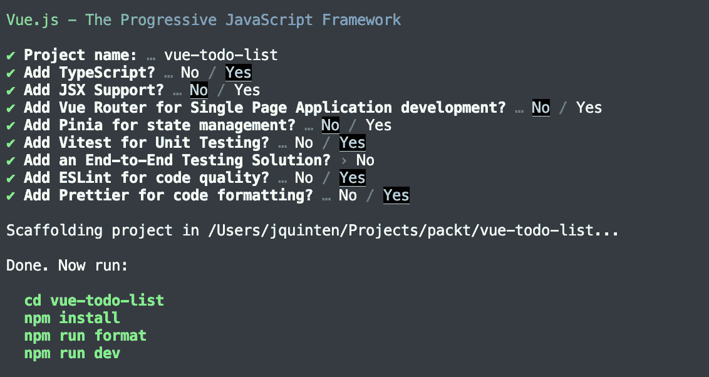

图 2.1 – 待办事项应用的设置配置

按照给定的说明安装依赖项，并打开您最喜欢的 IDE 开始。

小贴士

`npm`提供了简写来安装，只需输入`npm i`而不是`npm install`。更多关于`npm`命令的信息请在此处查看：[`docs.npmjs.com/cli/v6/commands`](https://docs.npmjs.com/cli/v6/commands)。

## 清理默认安装

让我们首先清理`components`文件夹，移除`HelloWorld.vue`、`TheWelcome.vue`、`WelcomeItem.vue`和`icons`文件夹。然后我们从`App.vue`中移除引用并清理模板。

你将在`components`文件夹中看到一个`__tests__`文件夹，这是通过安装 Vitest 添加的。现在你可以忽略它。否则，`components`文件夹应该是空的。

`App.vue`文件应该看起来像这样：

```js
<script setup lang="ts"></script>
<template>
</template>
<style scoped>
… (truncated, unchanged)
</style>
```

由于我们移除了所有默认元素，这将导致出现空白页面！现在我们可以从头开始构建自己的应用。

# 构建应用

在本章中，我们将添加一些组件并将 Todo 应用组合起来以满足本章开头列出的要求（参见*技术要求*）。我们将逐步添加功能。

让我们从简单开始，创建一个`AppHeader`组件。在`components`文件夹中创建一个`AppHeader.vue`文件（记住：Vue.js 建议文件名由至少两个驼峰式单词组成）。这只是一个静态组件，包含一个`template`和一个`css`块：

```js
<template>  <header>
    <h1><span class="icon" aria-hidden="true">✅</span> To do</h1>
    <p>Building Real-world Web Applications with Vue.js 3</p>
  </header>
</template>
<style scoped>
header {
  border-bottom: #333 1px solid;
  background-color: #fff;
}
header::after {
  content: "";
  display: block;
  height: 1px;
  box-shadow: 0px 0px 10px 0px rgba(0, 0, 0, 0.75);
}
h1 {
  font-size: 2rem;
}
h1 .icon {
  font-size: 1rem;
  vertical-align: middle;
}
</style>
```

Vue 组件通常由模板、脚本和样式块组成。并非所有都是必需的（我们不会向这个组件添加任何脚本），但在这三个块之间，我们可以定义组件的各个方面。在这本书中，我们将看到许多这种模式在实际中的应用示例。

模板只是标题的表示，我们将使用`scoped`样式块来应用 CSS 规则到标记。注意`scoped`属性，它确保我们的 CSS 不会影响应用中的其他组件。

使用`scoped` CSS，我们可以编写干净、可读的规则。对于单文件组件，这种方法应该是默认的。

让我们继续构建我们的应用，通过创建一个列表组件。

## 创建`ListItem`组件

我们将在同一个文件夹中创建`ListItem.vue`组件。它将是列表中单个项目的表示，看起来像这样：

```js
<script lang="ts" setup>defineProps<{
  isChecked?: boolean | false
}>()
</script>
<template>
  <label :class="{ 'checked': isChecked }">
    <input type="checkbox" :checked="isChecked" />
    <slot></slot>
  </label>
</template>
<style scoped>
label {
  cursor: pointer;
}
.checked {
  text-decoration: line-through;
}
</style>
```

我们定义将传递给组件的属性。属性是可以从组件外部控制的属性。这些通常是组件正在处理的值，并决定了该状态下组件的独特特征。在罕见的情况下，你也可以传递一个函数。

通过使用`defineProps`方法，我们正在使用 Vue.js API 正确地声明我们的属性。

第二部分是组件应该如何将 HTML 渲染到虚拟 DOM 中的方式。Vue.js 使用基于 HTML 的语法。你可以在这里了解更多信息：[`vuejs.org/guide/essentials/template-syntax.html#template-syntax`](https://vuejs.org/guide/essentials/template-syntax.html#template-syntax)。

我们使用动态类名标记一个 HTML `<label>` 标签：当 `isChecked` 属性评估为 `true` 时，它将渲染为 `class="checked"`。在标签中，我们将添加一个具有动态 `checked` 属性的复选框：它也连接到 `isChecked` 属性。`<slot></slot>` 标签是 Vue.js 特有的，它允许我们在该位置放置任何内容，从父组件中。

最后，我们为这个组件定义 CSS 规则，类似于我们在 `AppHeader.vue` 中所做的那样。

## 创建列表

由于我们有 `ListItem` 组件可用，我们可以开始生成列表。我们将为此创建一个新的组件，它将包含列表信息，并使用它来渲染列表上的所有单个项目以及提供交互功能：

1.  让我们创建一个简单的名为 `TodoList.vue` 的文件，其内容如下：

    ```js
    <script lang="ts" setup>import ListItem from './ListItem.vue'</script><template><ul>  <ListItem :is-checked="false">This is the slotted content</ListItem></ul></template>
    ```

1.  在我们继续之前，我们希望在开发过程中能够显示我们的应用程序。因此，在 `App.vue` 文件中，遵循类似的导入 `AppHeader.vue` 和 `TodoList.vue` 文件并将组件添加到模板中的方法：

    ```js
    <script setup lang="ts">import AppHeader from './components/AppHeader.vue';import TodoList from './components/TodoList.vue';</script><template>  <AppHeader />  <TodoList /></template><style scoped>… (truncated)</style>
    ```

现在我们已经可以看到我们在做什么了，这是一个开始启动开发服务器的良好时机。如果你使用 **Visual Studio Code**（**VSCode**），实际上 IDE 中有一个内置的终端：

+   **macOS 用户**：*⌃* + *`*

+   **Windows 用户**：*Ctrl* + *`*

+   **Linux 用户**：*Ctrl* + *Shift* + *`*

如果你运行 `npm run dev` 命令，它将启动开发服务器并提供你一个本地预览 URL。

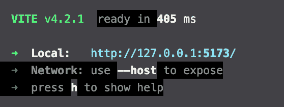

图 2.2 – npm run dev 命令的输出

由于我们目前还没有一个功能性的应用程序，我们需要专注于其核心功能：列表。你可以让开发服务器继续运行，因为它将自动更新（这被称为热重载）新编写的代码。

## 制作列表

实际的功能位于 `TodoList.vue` 组件中，我们现在将创建它。我们将从小处着手，逐步添加更复杂的功能。让我们从一个具有多个列表状态的静态列表开始。

让我们首先看看 `script` 块。除了导入 `ListItem` 组件外，我们还在 `Item` 上定义了 `type`，它由一个字符串类型的 `title` 属性和一个可选的 `checked` 属性（布尔类型）组成。TypeScript 允许我们定义 `Type` 别名，我们的 IDE 可以在交互 `Type` 时将其插入。 

在本例中，当在 `ListItem` 模板中访问 `item` 的属性时，IDE 已经识别出 `title` 和可选的 `checked` 属性：

```js
<script lang='ts' setup>import ListItem from './ListItem.vue'
type Item = {
  title: string,
  checked?: boolean
}
const listItems: Item[] = [
  { title: 'Make a todo list app', checked: true },
  { title: 'Predict the weather', checked: false },
  { title: 'Play some tunes', checked: false },
  { title: 'Let\'s get cooking', checked: false },
  { title: 'Pump some iron', checked: false },
  { title: 'Track my expenses', checked: false },
  { title: 'Organize a game night', checked: false },
  { title: 'Learn a new language', checked: false },
  { title: 'Publish my work' }
]
</script>
```

当构造 `ListItems` 数组时，我们使用 `[]` 符号将 `Type` 作为该类型的数组赋值。我们立即用项目列表填充 `ListItems` 数组。这意味着 TypeScript 也可以推断类型，但最好在可能的情况下显式设置类型。

在模板中，我们创建一个无序列表元素，并使用 `v-for` 指令遍历数组中的项目：

```js
<template>  <ul>
    <li
      :key='key'
      v-for='(item, key) in listItems'
    >
      <ListItem :is-checked='item.checked'>{{ item.title }}</ListItem>
    </li>
  </ul>
</template>
```

`v-for`指令用于遍历集合并重复标记集合的模板。对于每个项目，当前值被分配给第一个参数（`item`），并且可选地提供集合的索引作为第二个参数（`key`）。

`v-for`指令重复使用`<li>`项，并用包含`<ListItem />`组件的`<li>`项。对于每个项目，我们用该项目的`is-checked`和`title`属性填充`<ListItem />`组件。

`key`属性帮助 Vue.js 跟踪正在进行的更改，以便它可以更有效地更新虚拟 DOM。

最后，我们添加了一个`scoped`样式块来美化浏览器中的元素。这里并没有太多的事情发生：

```js
<style scoped>ul {
  list-style: none;
}
li {
  margin: 0.4rem 0;
}
</style>
```

现在我们有一个非交互式的待办事项列表应用，并且已经满足了前两个要求。让我们看看我们如何添加一些交互性。

# 反应性解释

如果你已经打开了应用并点击了一个项目，你可以切换复选框，但在刷新页面时，什么都没有发生。此外，如果你仔细查看`<ListItem />`组件的 CSS，你可能已经注意到应该对已勾选的项目应用删除线样式。这只适用于第一个项目。

复选框的切换实际上是浏览器的原生行为，在待办事项列表的状态上下文中并不表示任何内容！

我们需要将 UI 中的更改连接到应用程序的状态。为了开始，我们需要从 Vue.js 包中导入一些实用工具。将这两行代码添加到`<script>`块的顶部：

```js
import { ref } from 'vue'import type { Ref } from 'vue'
```

`ref`函数用于添加反应性并跟踪代码中某些部分的变化。`ref`的值由 TypeScript 自动推断，但对于复杂类型，我们可以指定类型。

注意

Vue.js 还提供了一个`reactive`实用工具来标记反应性。这两个工具之间有一些细微的差别，其中`ref`可以用来跟踪原始值和对象，而`reactive`只能用对象初始化。一般来说，你可以通过选择`ref`而不是`reactive`来保持代码的一致性。唯一的*缺点*是，你必须通过脚本块中的`.value`属性来访问反应性项的值。当在`template`块中使用变量时，Vue.js 会自动展开它。因此，为了能够一致地使用`ref`，这是一个小的妥协。

现在我们已经导入了实用工具，我们可以通过将内容包装在`ref`函数中来标记`listItems`以进行跟踪：

```js
const listItems: Ref<Item[]> = ref([  { title: 'Make a todo list app', checked: true },
  { title: 'Predict the weather', checked: false },
  { title: 'Play some tunes', checked: false },
  { title: 'Let\'s get cooking', checked: false },
  { title: 'Pump some iron', checked: false },
  { title: 'Track my expenses', checked: false },
  { title: 'Organise a game night', checked: false },
  { title: 'Learn a new language', checked: false },
  { title: 'Publish my work' }
])
```

注意，大写的`Ref`用于类型化值，而小写的`ref`用作项目数组的外包装。如果我们现在想在脚本块中访问这些值，我们需要通过`listItems.value`来访问它们。

现在由于`listItems`是反应性的，虚拟 DOM 将自动对变量的变化做出响应。我们可以添加一个更改项的方法，以便它在用户界面中得到反映。

让我们在`script`块中添加以下函数：

```js
const updateItem = (item: Item): void => {  const updatedItem = findItemInList(item)
  toggleItemChecked(updatedItem)
}
const findItemInList = (item: Item): Item | undefined => {
  return listItems.value.find(
    (itemInList: Item) => itemInList.title === item.title
  )
}
const toggleItemChecked = (item: Item): void => {
  item.checked = !item.checked
}
```

采用罗伯特·C·马丁的《代码整洁之道》哲学，我将指令拆分为具有自己明确意图的单独函数。当用`item`作为参数调用`updateItem`时，它会尝试在`itemList`中找到它，并切换对象的`checked`属性。

我们可以看到 TypeScript 引导我们到一个稍微更好的解决方案：因为`findItemInList`可能返回一个`undefined`值，而`toggleItemChecked`期望一个参数，所以调用`toggleItemChecked`函数的参数得到了一条波浪线。

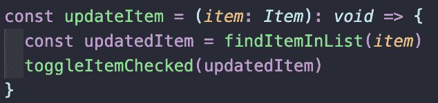

图 2.3 – TypeScript 提示我们代码中可能存在的问题

我们可以通过添加一个围绕`toggleItemChecked`函数调用的语句来修复这个问题：

```js
const updateItem = (item: Item): void => {  const updatedItem = findItemInList(item)
  if (updatedItem) {
    toggleItemChecked(updatedItem)
  }
}
```

完成脚本块的变化后，我们可以在模板块中附加用户界面的交互。我们希望访客能够点击`ListItem`来标记它为完成。Vue.js 有一个内置指令可以做到这一点：`v-on`。这充当事件处理器，并支持一些修饰符。更多信息，请参阅[`vuejs.org/api/built-in-directives.html#v-on`](https://vuejs.org/api/built-in-directives.html#v-on)。

我们可以这样将其添加到模板中：

```js
<ListItem :is-checked='item.checked' v-on:click.prevent="updateItem(item)">{{ item.title }}</ListItem>
```

我们还添加了`.prevent`修饰符来防止复选框机制的默认行为。这就是调用方法所需的全部代码！

对于`v-on:click`，甚至有一个简写，即使用`@click`。你将在资源中看到这两个指令的示例，所以了解它们是相同的很好。

在底层，Vue.js 使用`ref`函数在值上注册一系列观察者。模板引擎用于生成虚拟 DOM（组件组成元素的节点树表示）。一旦响应式值发生变化，使用该值的虚拟 DOM 节点也会发生变化。

Vue.js 比较 DOM 的变化，并只更新实际 DOM 中必要的元素以反映状态。能够非常精确地逐个更新 DOM 是 Vue.js 3 成为一个高性能框架的原因，因为它不需要遍历整个虚拟 DOM 节点！

让我们使用我们已有的列表作为下一步的输入，我们将查看排序。

## 排序列表

我们现在完全能够展示模板中的变量。然而，在某些情况下，你可能需要更高级的表达式，例如，在我们的例子中，需要排序列表。对于没有副作用且包含响应式数据的变量，你可以使用 Vue.js 的`computed`函数。

通常，你会使用`computed`进行数据过滤、格式表达式、显示计算或布尔条件。让我们将其应用于将完成项排序到底部的列表。

首先，我们将`computed`导入到`TodoList`组件中。我们可以在导入`ref`函数的地方添加它：

```js
import { ref, computed function is very similar to ref, in the sense that it follows the same reactivity in updating the DOM when the value changes and you can even access the value using the .value property in the script block! The main difference is that a computed value is cached and only updates when one of the inputs changes.
For sorting the list, we can use the `listItems` as input and apply a simple JavaScript sorting function on the array. We can just add this line to define the `computed` value:

```

const sortedList = computed(() =>    [...listItems.value].sort((a, b) => (a.checked ? 1 : 0) - (b.checked ? 1 : 0))

)

```js

As you can see, `computed` is a function that gets called on a change of the reactive value. In this case, `listItems.value`. We’ll simply apply a `sort` function to the collection.
In the template, we can now swap out `listItems` for the `sortedList` variable and you will see that checked items will be placed below the unchecked items.
Preserving changes to the list
We have a final requirement to achieve now, and that is to preserve the state of the list on reloading and revisiting the app. We’ll keep it as simple as we can for now and use the `localStorage` API of the web browser to store and retrieve the state of the list.
We’ll first add the functions that we can use to write to `localStorage` and retrieve from `localStorage`:

```

const setToStorage = (items: Item[]): void => {  localStorage.setItem('list-items', JSON.stringify(items))

}

const getFromStorage = (): Item[] | [] => {

const stored = localStorage.getItem('list-items')

if (stored) {

return JSON.parse(stored)

}

return []

}

```js

These two functions interface with browsers’ abilities to store a string of data, so we need to stringify and parse that object. We’re storing the data on the `list-items` key.
Now we need to make sure we try and retrieve the data when the component gets loaded. There’s a function for it, called `onMounted` and it is part of the Vue.js core, so we can import it in a similar fashion to the `ref` and `computed` functions.
The `onMounted` function is what we call a life cycle hook. They are functions that get called at certain points in the *life cycle* of a component. The main life cycle events are triggered when a component gets mounted (or before), gets updated (or before), gets unmounted (or before), and gives an error. More information can be found here: [`vuejs.org/api/composition-api-lifecycle.html#composition-api-lifecycle-hooks`](https://vuejs.org/api/composition-api-lifecycle.html#composition-api-lifecycle-hooks).
In our case, we want the list to be retrieved in the browser when the component gets rendered (it would otherwise have no access to `localStorage`). So, we’ll import the function:

```

import { ref, onMounted, computed } from 'vue'

```js

 And we need to create a reactive variable to hold the items:

```

const storageItems: Ref<Item[]> = ref([])

```js

 We’ll also create a function (`initListItems`) that will run once when mounted, and move the initialization of the `listItems` there. We’ll also make a change to the declaration of the `listItems` by wrapping it with a check on the existence of `storageItems`. If they do not exist, we will use the `listItems` as default and write the contents to `localStorage`:

```

const initListItems = (): void => {  if (storageItems.value?.length === 0) {

const listItems = [

{ title: '制作待办事项应用', checked: true },

{ title: '预测天气', checked: false },

{ title: '阅读一些漫画', checked: false },

{ title: '让我们开始烹饪', checked: false },

{ title: '举铁锻炼', checked: false },

{ title: '跟踪我的开支', checked: false },

{ title: '组织游戏之夜', checked: false },

{ title: '学习一门新语言', checked: false },

{ title: '发布我的作品' }

]

setToStorage(listItems)

storageItems.value = listItems

}

}

```js

Now, we add the following functions to retrieve any locally stored list items:

```

onMounted(() => {  initListItems()

storageItems.value = getFromStorage()

})

```js

In order to keep the changes in sync, we can now modify the `findItemInList` function to look in the `storageItems` collection rather than `listItems` and also write the change to the storage after the item has been updated. We’ll modify the `updateItem` and `findItemInList` functions as follows:

```

const updateItem = (item: Item): void => {  const updatedItem = findItemInList(item)

if (updatedItem) {

toggleItemChecked(updatedItem)

setToStorage(storageItems.value)

}

}

const findItemInList = (item: Item): Item | undefined => {

return storageItems.value.find(

(itemInList: Item) => itemInList.title === item.title

)

}

```js

Now, in the template, we’re using a computed value, so we should update the computed function too in order to see `localStorage` as the input for our data:

```

const sortedList = computed(() =>    [...storageItems.value].sort((a, b) => (a.checked ? 1 : 0) - (b.checked ? 1 : 0))

)

```js

We’ve seen how we can use different components with specific uses to build a simple reactive app and how we can organize our code with readability and maintainability in mind. Vue.js encourages using Single File Components to structure your code.
Single File Components
The way that we have organized the app, with individual components having a single feature to fulfill is referred to as the **Single File Components** (**SFC**) philosophy.
This approach is designed to enhance code readability, maintenance, and reusability. With SFC, you can create reusable and modular components that can be easily shared and reused across different projects.
To be fair, we did cut some corners with the `TodoList.vue` component, since we could have abstracted the getting and setting of the `listItems` to a different component. For the sake of this example, however, it illustrates the capabilities in an acceptable way. There are no strict rules or guidelines for how you structure your components.
Note that you can structure or restructure the contents of the script block in a way that makes sense to you. You have the freedom to group related sets together, which makes for very readable code that’s easy to refactor.
The Vue.js DevTools
If you’ve not yet installed the Vue.js DevTools, please refer back to the *Vue.js DevTools* section in *Chapter 1*, *Introduction to Vue.js*, to follow the instructions. We will take a close look at the DevTools using our Todo list application for reference.
If you have the browser plugin installed and you visit a website where Vue.js is detected, the icon in the toolbar will indicate that Vue.js is detected on that particular URL:
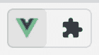

Figure 2.4 – Screenshot of Vue DevTools in the browser’s toolbar
If you click it, it will refer you to opening the browser’s DevTools, where a tab dedicated to Vue is added.
The **Vue.js** tab offers a lot of ways of drilling down into a certain aspect of the rendered code and some time travel inspection methods. It offers an accessible representation of the inputs and outputs of a component, which can help you visualize how a component is rendered.
So, let’s zoom in on a particular element, by using the inspect mode.
Inspecting a component
Let’s see if we can inspect a `ListItem` component. We have several ways of doing this: we can drill down into the DOM tree in the Vue.js panel, we can filter for the component name, and we can use the crosshair button to point out the component on the page.
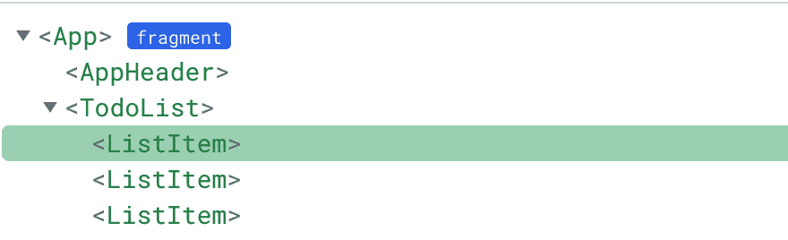

Figure 2.5 – Drilling down into the DOM tree in the Vue.js panel
In *Figure 2**.6*, we’ll use the filtering option to type the name of the component we want filtered. This works well when you’re not exactly sure what the structure of the application looks like.
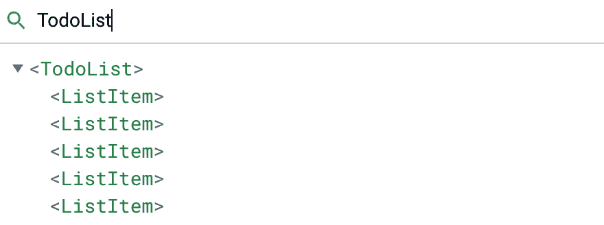

Figure 2.6 – Filtering for the component name
In *Figure 2**.7*, we use the crosshair icon to select the element from the browser’s viewport. This works very well when you have a strong visual reference to a component!
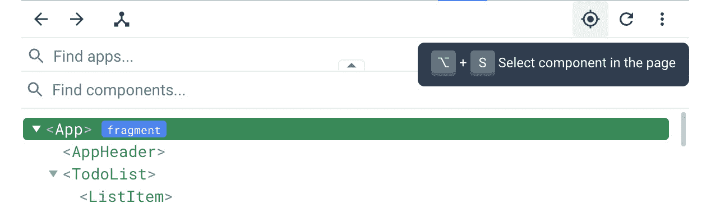

Figure 2.7 – Using the crosshair to point out a component on the page
Depending on your use case, you may prefer one method over the other. For this example, feel free to try all of them out to see their effect.
When you click in the component, you will see additional details, such as the props, extract of the setup function, event listeners, and the `onClick` event we registered with the `v-on` (or `@`) directive.
Apart from inspecting the props that the component was given, we can use the control buttons to scroll to and highlight the component on the page, inspect the render function for that component, highlight the generated DOM code, and even open the source file in the code editor!
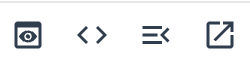

Figure 2.8 – The various controls of Vue DevTools in the browser extension
Those several ways of inspecting components are useful tools when debugging the state of a component. What makes them especially powerful is that you’re looking at the component from within the browser’s environment, which is also how users of your app experience and interact with your application!
Manipulating a component
Apart from inspecting, we can also manipulate the state of a component. We can’t modify the properties of a `ListItem`, since it’s read-only. Let’s take a look at the `TodoList` component.
If you inspect it, you’ll see two collections that power the list: the `sortedList` and `storageList` variables.
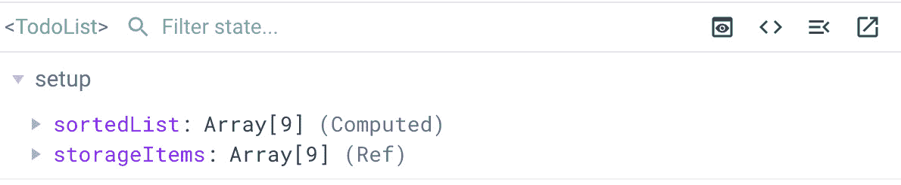

Figure 2.9 – The collections that power the contents of the list
Again, `sortedList` is a computed property and cannot be manipulated.
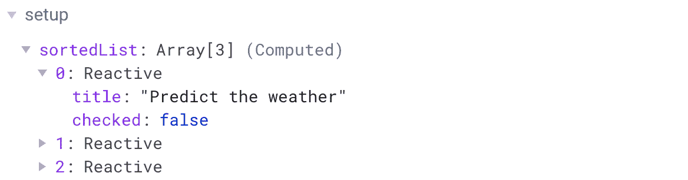

Figure 2.10 – The values of the computed sortedList items cannot be modified
When we look at `storageList` and expand the collection, we see some modifiers. We can toggle the `checked` property and update the `title` property. Those changes even propagate to the values of the corresponding `sortedList`!
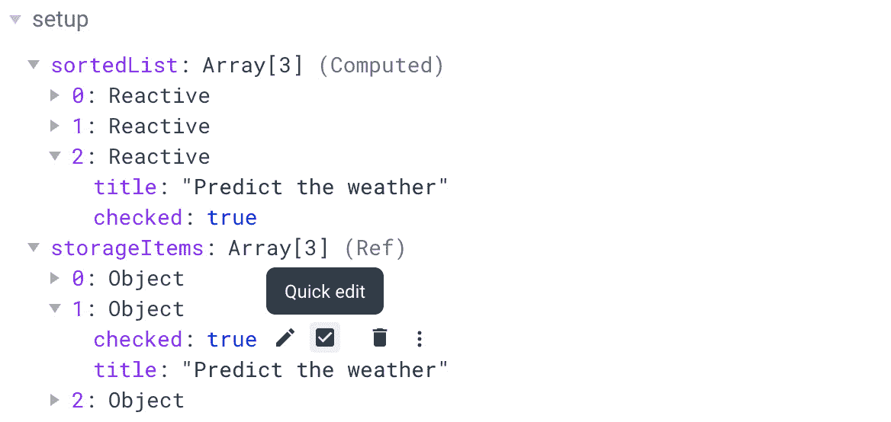

Figure 2.11 – The values of the storageItems items can be modified and propagate to the corresponding sortedList values
With the browser being dependent on the computed value, it means you see the effect in the browser as well. This is very useful for debugging different variants of the state of the user interface. You can also see the methods that are used in the component, available for inspection.
In other scenarios, we will touch upon different uses of Vue DevTools so you will slowly get more familiar with using them to more accurately debug or inspect the applications you build. When debugging any application state that affects the browser, Vue DevTools offers a very good set of features to help you analyze what is happening with the rendering of the application.
Taking a look at the application, you’ll notice that the first item on our Todo list is checked, which now accurately represents the progress we’ve made. Let’s work on checking off the next items on the list!
Summary
At this point, we’ve used the Vue CLI tool to create and customize our app boilerplate settings. We’ve been using two-way data binding, which translates to the reactivity in our applications. Using and applying the Single File Components philosophy, we can now apply this to build applications that are maintainable at any scale.
With Vue DevTools, we have learned a means of inspecting components and can apply this to debug our applications.
In the next chapter, we’ll connect our application with external APIs, giving it real-time data to work with.

```
