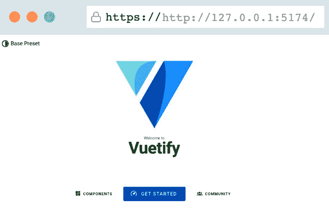

# 第五章：使用 Vuetify 构建食谱应用

在本章中，我们将利用第三方组件库的强大功能，快速构建用户界面，并探讨在应用上下文中存储的权力和使用方法。我们将构建一个餐单规划器，用户可以浏览食谱并将其添加到每周日历中。周规划器的状态将存储在用户的机器上，以确保在返回访问时可用。

本章将涵盖以下主题：

+   应用和自定义 Vuetify 以构建视图

+   使用组件库加速开发

+   重构策略

+   理解状态

+   使用 Pinia 结构化存储的有用性

# 技术要求

在本章中，我们将使用**Vuetify** ([`vuetifyjs.com/en/`](https://vuetifyjs.com/en/))，这是一个 Vue.js 3 应用的流行组件库。我们还需要在[`spoonacular.com/`](https://spoonacular.com/)注册一个 API 密钥以检索食谱数据。

为了管理我们应用程序的状态，我们将在我们的应用中使用`localStorage`。

本章的代码可以在本书的 GitHub 存储库中找到：[`github.com/PacktPublishing/Building-Real-world-Web-Applications-with-Vue.js-3/tree/main/05.mealplanner`](https://github.com/PacktPublishing/Building-Real-world-Web-Applications-with-Vue.js-3/tree/main/05.mealplanner)。

# 一个新的 Vue 项目

我们准备好初始化一个新的项目，但这次我们将使用 Vuetify 安装程序。Vuetify 是 Vue 安装程序的包装器，为常见的 Vuetify 项目配置提供了预设。在 CLI 中，输入以下命令以进入安装向导的下一步：

```js
npm create vuetify
```

现在，执行以下操作：

1.  将项目名称选择为`vue-meal-planner`。

1.  使用**基础**（Vuetify，VueRouter）安装。

1.  使用箭头键选择**TypeScript**。

1.  选择**npm**选项来安装依赖项。

如果你导航到新的项目文件夹，你可以使用 `npm run dev` 来运行本地开发服务器。结果应该看起来非常类似于*图 5.1*1 所示：



图 5.1 – 初始化的 Vuetify 应用

在我们继续之前，我们还需要一个 API 密钥，以便使示例更接近现实。这将使我们能够搜索实际的食谱。要在 Spoonacular 注册，请按照以下步骤操作：

1.  访问[`spoonacular.com/`](https://spoonacular.com/)。

1.  导航到**食品**API。

1.  通过**电子邮件**注册并选择一个密码。

1.  确认你的电子邮件地址以完成注册过程。

1.  登录后，前往**个人资料**以显示 API 密钥。

在你的项目根目录中创建一个`.env`文件，并添加以下行：

```js
VITE_APP_SPOONACULAR_API=Replace this with the key
```

我们现在准备好创建一个餐单规划应用。

# 让我们开始烹饪

首先，我们要确保我们有一个不错的样板项目开始，并开始用以下内容替换`App.vue`的内容：

```js
<script setup lang="ts"></script>
<template>
  <v-layout>
    <v-container class="main">
      <main>
        <router-view />
      </main>
    </v-container>
    <v-footer app><span class="text-light-green">My Meal Planner</span>&nbsp;- &copy; {{ new Date().getFullYear() }}</v-footer>
  </v-layout>
</template>
```

我们稍后会在此基础上进行扩展。请注意，在生成的 Vue 组件中，`<template>` 和 `<script>` 标签的顺序与我们的示例不同。我更喜欢从 `<script>` 标签开始，因为它包含与 `<template>` 标签相关的逻辑，但两者都是有效的：


图 5.2 – 模板和 `script` 标签的顺序与我们的示例不同

在主页视图中，我们将构建我们的餐计划器作为未来 7 天的表示。首先，我们将从一个可以基于给定日期渲染多个天数的组件开始。

我们将在 `components` 文件夹中创建一个名为 `CalendarDays.vue` 的组件：[`github.com/PacktPublishing/Building-Real-world-Web-Applications-with-Vue.js-3/blob/main/05.mealplanner/.notes/5.1-CalendarDays.vue`](https://github.com/PacktPublishing/Building-Real-world-Web-Applications-with-Vue.js-3/blob/main/05.mealplanner/.notes/5.1-CalendarDays.vue)。

首先，让我们看看 `script` 标签。它接受属性，以便执行 `generateCards` 函数，该函数为每个卡片生成一个带有 `date` 属性的 *cards* 数组。我们添加以下内容只是为了在模板中显示一些内容：

```js
<template>  <v-table>
    <thead>
      <tr>
        <th class="text-left">Upcoming days</th>
      </tr>
    </thead>
    <tbody>
      <tr v-for="card in cards" :key="card.date.toString()">
        <td class="py-4">
          {{ card.content }}
        </td>
      </tr>
    </tbody>
  </v-table>
</template>
```

在模板中，我们使用 Vuetify 的 `table` 组件来渲染表格。Vuetify 组件以 `v-` 标识符为前缀。

我们使用从卡片数组生成的条目来渲染表格行。我们将通过创建一个 `MealPlanner.vue` 组件并将我们的组件导入其中来将组件暴露给视图：

```js
<script setup  lang="ts">import CalendarDays from './CalendarDays.vue';
</script>
<template>
    <calendar-days :date="new Date()" :days="7" />
</template>
```

我们在这里没有做任何特别的事情，只是用我们想要的计划天数实例化了 `CalendarDays` 组件。当我们在这个文件夹中时，我们可以删除 `HelloWorld.vue`，并在 `views\Home.vue` 组件中替换引用，以便我们的应用程序在主页上显示 `MealPlanner`。

让我们通过显示格式化的日期来改进它。我们将为此在即将创建的 `composables` 文件夹中创建一个小型可组合组件。让我们称这个文件为 `formatters.ts`：

```js
const getOrdinalSuffix = (day: number): string => {    const suffixes = ["th", "st", "nd", "rd"];
    const remainder = day % 100;
    return suffixes[(remainder - 20) % 10] || suffixes[remainder] || suffixes[0];
};
export const useFormatDate = (date: Date): string => {
    const day = date.getDate();
    const month = date.toLocaleString("default", { month: "long" });
    const ordinal = getOrdinalSuffix(day);
    return ${day}${ordinal} of ${month};
};
```

在这里，我们只是添加了一些聪明的代码，根据给定的日期来拼写第一、第二或第三后缀。我们利用了浏览器内置的 API 的一部分，但增加了一些额外的格式化。现在我们可以以可读的格式打印出生成的卡片上的日期，但我们会稍后再讨论这一点。

让我们再创建一个可组合组件来帮助我们与 Spoonacular API 交互。我们将在 `composables` 文件夹中创建一个名为 `recipeApi.ts` 的文件。内容应该熟悉，类似于我们在上一章中使用的函数：[`github.com/PacktPublishing/Building-Real-world-Web-Applications-with-Vue.js-3/blob/main/05.mealplanner/.notes/5.2-recipeApi.ts`](https://github.com/PacktPublishing/Building-Real-world-Web-Applications-with-Vue.js-3/blob/main/05.mealplanner/.notes/5.2-recipeApi.ts)。

使用 Vuetify 的默认安装，我们在 `src/layouts/default` 文件夹中得到了一个默认的 `AppBar.vue` 组件。让我们修改它，使其符合应用程序的目的：

```js
<template>  <v-app-bar flat>
    <v-app-bar-title>
      <v-icon icon="mdi-silverware-fork-knife" />
      Meal planner
    </v-app-bar-title>
  </v-app-bar>
</template>
```

Vuetify 组件使得构建具有合理默认值的 app 相对容易。在下一节中，我们将学习如何快速扩展我们的应用程序，使用可用的组件。

# 使用 Vuetify 快速开发

我们到目前为止构建的应用程序对我们来说还没有什么用处。让我们将其变成一个工作餐计划器！由于我们希望进行抽象和模块化，我们将从拆分 `CalendarDays.vue` 组件的一些代码开始。

首先，我们将创建一个新的组件，命名为 `CalendarCard.vue`。我们将用它来表示日历项，并使用我们创建的日期格式化器：

```js
<script setup lang="ts">import { useFormatDate } from "@/composables/formatters";
interface Card {
  date: Date;
}
const props = defineProps<{
  card: Card;
}>();
</script>
<template>
  <v-sheet class="d-flex justify-space-between">
    <v-sheet class="ma-2 pa-2">
      <h2 class="text-h2">{{ useFormatDate(card.date) }}</h2>
    </v-sheet>
  </v-sheet>
</template>
```

在 `CalendarDays.vue` 中，我们可以通过导入我们新创建的 `CalendarCard` 组件来替换内联表示：

```js
<script setup lang="ts">import { ref } from "vue";
import CalendarCard from "@/components/CalendarCard.vue";
// …abbreviated
```

然后，我们将组件添加到模板中：

```js
<template>  <v-table>
    // … abbreviated
    <tbody>
      <tr v-for="card in cards" :key="card.date.toString()">
        <td class="py-4">
          <calendar-card :card="card" />
        </td>
      </tr>
    </tbody>
  </v-table>
</template>
```

我们还需要添加一个新的路由，以便能够显示所有计划中的食谱。我们将在稍后添加食谱。首先，我们将创建一个表格来显示食谱。我们将通过另一个组件的 prop 来提供食谱。

让我们创建 `RecipeTable.vue`：[`github.com/PacktPublishing/Building-Real-world-Web-Applications-with-Vue.js-3/blob/main/05.mealplanner/.notes/5.3-RecipeTable.vue`](https://github.com/PacktPublishing/Building-Real-world-Web-Applications-with-Vue.js-3/blob/main/05.mealplanner/.notes/5.3-RecipeTable.vue).

我们使用 Vuetify 组件来创建一个表格表示将要提供的食谱列表。`openPreview` 函数（*第 2、14-16 和 34 行*）是表格未来将支持的功能之一。当我们实现这一点时，我们将确保发出的事件将被父组件捕获。让我们快速构建父组件。

让我们创建一个 `RecipesList.vue` 组件。它将使用 Vuetify 组件来展示过去和未来的食谱表格：[`github.com/PacktPublishing/Building-Real-world-Web-Applications-with-Vue.js-3/blob/main/05.mealplanner/.notes/5.4-RecipesList.vue`](https://github.com/PacktPublishing/Building-Real-world-Web-Applications-with-Vue.js-3/blob/main/05.mealplanner/.notes/5.4-RecipesList.vue).

我添加了一些代码来生成一些模拟数据（*第 12-24 行*）。有时专注于模板可能会有所帮助，在这些情况下，能够对数据进行细粒度控制并支持多种场景会很有帮助。在编写匹配此文件的单元测试时，甚至可以重用此代码！

另一方面是如何监听从 `RecipeTable` 组件发出的事件（*第 69 和 76 行*）。我们在点击事件上触发 `openPreview` 函数（*第 26-28 行*）。我们还需要一个视图和一个路由来能够导航到这些组件。

让我们在 `src/views` 文件夹中创建一个名为 `RecipeView.vue` 的组件，它简单地加载我们的组件：

```js
<script setup lang="ts">import RecipesList from "@/components/RecipesList.vue";
</script>
<template>
  <RecipesList />
</template>
```

接下来，我们将扩展 Vuetify 为我们生成的路由配置，位于 `src/router/index.ts`：

```js
import { createRouter, createWebHistory } from 'vue-router'const routes = [
  {
    path: '/',
    component: () => import('@/layouts/default/Default.vue'),
    children: [
      {
        path: '',
        name: 'Home',
        component: () => import(/* webpackChunkName: "home" */ '@/views/Home.vue'),
      },
      {
        path: 'recipes',
        name: 'Recipes',
        component: () => import('@/views/RecipesView.vue')
      },
    ],
  },
]
// …abbreviated
```

最后，我们可以更新 `src/layouts/default/AppBar.vue`：

```js
<template>  <v-app-bar flat>
    <v-btn id="hamburger-activator" icon="mdi-menu"> </v-btn>
    <v-menu activator="#hamburger-activator">
      <v-list>
        <v-list-item>
          <v-btn flat block><router-link to="/">Home</router-link></v-btn>
          <v-btn flat block
            ><router-link to="/recipes">Recipes</router-link></v-btn
          >
        </v-list-item>
      </v-list>
    </v-menu>
    <v-app-bar-title>
      <v-icon icon="mdi-silverware-fork-knife" />
      Meal planner
    </v-app-bar-title>
  </v-app-bar>
</template>
```

通过这些代码行，我们添加了一个带有切换功能的汉堡菜单。它只需按一下即可工作！这是使用组件库的一个非常强大的功能：它不仅提供了样式化的组件，还提供了常用的交互模式。

我强烈建议查看 Vuetify 文档，因为它提供了可用的组件的详尽列表以及如何使用它们的示例。在我们正在构建的应用中，我们只是轻触组件库的使用，但你也有优化组件以适应更具体目标或目的的选项。

我们现在可以导航到两个不同的视图并构建最终应用的有限版本。在下一节中，我们将连接 Spoonacular 食谱到我们的应用！

# 将食谱连接到我们的应用

在本节中，我们将 API 连接到我们的应用，这使用户能够开始为即将到来的日子规划餐点。我们将探讨使用 Vuetify 组件与应用交互的模式。

## 一些额外的设置

由于我们将处理异步数据，我们将添加一些辅助组件。首先，我们在 `src/components` 文件夹中创建一个名为 `AppLoader.vue` 的组件，它充当加载指示器：

```js
<template>  <v-container class="fill-height" fluid>
    <v-row align="center" justify="center">
      <v-col cols="12" sm="8" md="4">
        <div class="text-center my-8">
          <v-progress-circular
            indeterminate
            color="light-blue"
            :size="80"
            :width="10"
          ></v-progress-circular>
        </div>
      </v-col>
    </v-row>
  </v-container>
</template>
```

在我们继续进行的同时，我们还可以添加一个专门处理链接的组件。我们将命名为 `AppLink.vue`：

```js
<script setup lang="ts">const props = defineProps({
  to: {
    type: String,
    required: true,
  },
});
</script>
<template>
    <router-link :to="to" class="text-light-blue">
        <slot></slot>
    </router-link>
</template>
```

我们现在可以直接将 `AppLink` 插入到 `AppBar.vue` 中，通过将 `router-link` 替换为我们的新组件。此组件为我们的应用程序中的链接添加样式。请注意，我们故意将标记保持接近原始的 `router-link`：

```js
<script setup lang="ts">import AppLink from '@/components/AppLink.vue';
</script>
<template>
  <v-app-bar flat>
    <v-btn id="hamburger-activator" icon="mdi-menu"> </v-btn>
    <v-menu activator="#hamburger-activator">
      <v-list>
        <v-list-item>
          <v-btn flat block><app-link to="/">Home</app-link></v-btn>
          <v-btn flat block
            ><app-link to="/recipes">Recipes</app-link></v-btn
          >
        </v-list-item>
      </v-list>
    </v-menu>
<!-- ... abbreviated -–>
</template>
```

现在我们能够导航了，让我们继续通过在应用中公开 API 数据来继续。

## 我们的 API 连接

我们现在将专注于 `CalendarCard.vue` 和 `CalendarDays.vue` 组件。我们将添加搜索食谱并将其添加到一天、查看它以及删除它的功能。

我们将从 `CalendarCard.vue` 开始，添加一个事件来表示用户选择了一个特定的日期：

```js
<script setup lang="ts">import { useFormatDate } from "@/composables/formatters";
const emits = defineEmits(["daySelected"]);
const addRecipeToDay = (card: Card): void => {
  emits("daySelected", card);
}
interface Card {
  date: Date;
}
const props = defineProps<{
  card: Card;
}>();
</script>
<template>
  <v-sheet class="d-flex justify-space-between">
    <v-sheet class="ma-2 pa-2">
      <h2 class="text-h2">{{ useFormatDate(card.date) }}</h2>
    </v-sheet>
    <v-sheet class="ma-2 pa-2">
      <v-btn text @click="addRecipeToDay(card)" icon="mdi-plus"></v-btn>
    </v-sheet>
  </v-sheet>
</template>
```

在用户界面中，我们添加了一个按钮，当点击时它会发出当前卡片。现在，让我们修改 `CalendarDays.vue` 以使其能够捕捉这个事件并显示一个对话框来搜索食谱：

```js
<script setup lang="ts">import { ref } from "vue";
import type { Ref } from "vue";
import CalendarCard from "@/components/CalendarCard.vue";
const props = defineProps({
  date: {
    type: Date,
    required: true,
  },
  days: {
    type: Number,
    required: false,
    default: 7,
  },
});
interface Card {
  date: Date;
  content: string;
}
const generateCards = (startDate: Date, numberOfDays: number): Card[] => {
  const cards: Card[] = [];
  const currentDate = new Date(startDate);
  for (let i = 0; i < numberOfDays; i++) {
    const date = new Date(currentDate.getTime());
    const content = Card ${i + 1};
    cards.push({ date, content });
    currentDate.setDate(currentDate.getDate() + 1);
  }
  return cards;
};
const cards = ref<Card[]>(generateCards(props.date, props.days));
const dialogVisible: Ref<boolean> = ref(false);
const dateSelected: Ref<Date | null> = ref(null);
const recipeDialogOpen = (card: Card): void => {
  dateSelected.value = card.date;
  dialogVisible.value = true;
};
const recipeDialogClose = (): void => {
  dateSelected.value = null;
  dialogVisible.value = false;
};
</script>
<template>
  <v-table>
    <thead>
      <tr>
        <th class="text-left">Upcoming days</th>
      </tr>
    </thead>
    <tbody>
      <tr v-for="card in cards" :key="card.date.toString()">
        <td class="py-4">
          <calendar-card :card="card" @daySelected="recipeDialogOpen" />
        </td>
      </tr>
    </tbody>
  </v-table>
  <v-dialog v-model="dialogVisible" scrollable>
    <v-card>
      <v-card-title> Search for a recipe to add to this day </v-card-title>
      <v-card-actions>
        <v-btn color="primary" block @click="recipeDialogClose"
          >Close Dialog</v-btn
        >
      </v-card-actions>
    </v-card>
  </v-dialog>
</template>
```

在更新的代码中，我们将对话框的状态存储在一个新创建的变量中，并使用 Vuetify 提供的组件打开一个对话框，我们还可以关闭并恢复变量到它们的初始值。

## 选择食谱

接下来，我们将构建一个小型搜索组件以在对话框中显示。这将允许用户搜索食谱。当选择后，我们将食谱的详细信息传递给 `CalendarDays.vue` 组件。

创建一个名为 `RecipeSearch.vue` 的文件：

```js
<script setup lang="ts">import { ref, watch } from "vue";
import type { Ref } from "vue";
import { useRecipeSearch } from "@/composables/recipeApi";
import type { RecipeResults } from "@/types/spoonacular";
const emits = defineEmits(["recipeSelected"]);
const searchQuery: Ref<string> = ref("");
const searchResults: Ref<RecipeResults[] | []> = ref([]);
const getSearchResults = async () => {
  const result = await useRecipeSearch(searchQuery.value);
  searchResults.value = result.results;
};
let timeout: ReturnType<typeof setTimeout>;
const debouncedSearch = (): void => {
  clearTimeout(timeout);
  timeout = setTimeout(async () => {
    getSearchResults();
  }, 500);
};
watch(searchQuery, (): void => {
  debouncedSearch();
});
const recipeSelected = (result: RecipeResults): void => {
  emits("recipeSelected", result);
};
</script>
<template>
  <v-car flat>
    <v-card-text>
      <v-text-field v-model="searchQuery" label="Search"></v-text-field>
    </v-card-text>
    <v-divider></v-divider>
    <v-list v-if="searchResults">
      <v-list-item v-for="(result, index) in searchResults" :key="index">
        <v-list-item-title @click="recipeSelected(result)" class="list-item">{{
          result.title
        }}</v-list-item-title>
      </v-list-item>
    </v-list>
  </v-car>
</template>
<style scoped>
.list-item {
  cursor: pointer;
}
.list-item:hover,
.list-item:active {
  text-decoration: underline;
}
</style>
```

我们正在使用一个防抖观察者，与 Marvel 搜索组件相同。我们可以使用组合式函数根据简单的基于文本的搜索查询检索结果，并在列表中显示结果。

当用户点击列表项时，我们将发出事件并将相应的食谱作为上下文发送给父组件。

让我们实现一天中食谱的添加和删除功能！

## 添加和删除餐点

实现搜索功能现在非常简单！我们可以在 setup 标签中导入组件，然后在模板中放置组件的标签。我们确实需要添加一个监听器，因为我们正在在搜索组件上发出事件。

让我们看看：

```js
<script setup lang="ts">import { ref } from "vue";
import type { Ref } from "vue";
import type { RecipeResults } from "@/types/spoonacular";
import CalendarCard from "@/components/CalendarCard.vue";
import RecipeSearch from "@/components/RecipeSearch.vue";
interface Today {
  id: number;
  title: string;
  readyInMinutes: number;
}
interface Card {
  date: Date;
  content: string;
  today: Today[];
}
// …abbreviated
const insertRecipeOnDay = (recipe: RecipeResults): void => {
  if (dateSelected.value) {
    cards.value = cards.value.map((card) => {
      if (card.date.getTime() === dateSelected.value?.getTime()) {
        return { ...card, today: [...card.today, recipe] };
      }
      return card;
    });
    recipeDialogClose();
  }
};
</script>
<template>
  <v-table>
    <!-- abbreviated -->
  </v-table>
  <v-dialog v-model="dialogVisible" scrollable>
    <v-card>
      <v-card-title> Search for a recipe to add to this day </v-card-title>
      <recipe-search @recipeSelected="insertRecipeOnDay" />
      <v-card-actions>
        <v-btn color="primary" block @click="recipeDialogClose"
          >Close Dialog</v-btn
        >
      </v-card-actions>
    </v-card>
  </v-dialog>
</template>
```

通过这样，我们已经将 `recipe-search` 组件添加到页面中。通过 `insertRecipeOnDay` 函数，我们可以通过添加通过搜索组件发出的所选食谱并将其添加到卡片的新属性 `today` 上来修改我们的卡片集合。

在我们显示一天的食谱之前，让我们也添加一个基于食谱 ID 和日期删除一天中食谱的方法（这样我们就可以支持一天中的多个食谱以及跨多天的相似食谱）。我们可以在 script 标签中添加以下函数：

```js
const removeRecipeFromDay = (recipe: { id: number }, date: Date): void => {  cards.value = cards.value.map((card) => {
    if (card.date.getTime() === date.getTime()) {
      return {
        ...card,
        today: card.today.filter((today) => today.id !== recipe.id),
      };
    }
    return card;
  });
};
```

此函数简单地通过过滤掉与给定 ID 和日期匹配的任何食谱来修改 `today` 集合。在模板中，我们将添加对 `CalenderCard.vue` 组件事件的监听器，如下所示：

```js
<calendar-card :card="card" @daySelected="recipeDialogOpen" CalendarCard.vue component so that it shows the recipes for a day and then add the option to remove them:

```

<script setup lang="ts">从 "@/composables/formatters" 导入 { useFormatDate } from "@/composables/formatters";

从 "./AppLink.vue" 导入 AppLink;

const emits = defineEmits(["daySelected", "recipeRemoved"]);

const addRecipeToDay = (card: Card): void => {

emits("daySelected", card);

}

const recipeRemoved = (recipe: Today, date: Date): void => {

emits("recipeRemoved", recipe, date);

}

interface Today {

id: number;

标题: string;

readyInMinutes: number;

}

interface Card {

日期: Date;

today: Today[];

}

const props = defineProps<{

card: Card;

}>();

</script>

<template>

<v-sheet class="d-flex justify-space-between">

<v-sheet class="ma-2 pa-2">

<h2 class="text-h2">{{ useFormatDate(card.date) }}</h2>

</v-sheet>

<v-sheet class="ma-2 pa-2">

<v-btn text @click="addRecipeToDay(card)" 图标="mdi-plus"></v-btn>

</v-sheet>

</v-sheet>

<v-col>

<v-card v-for="today in card.today" :key="today.id" class="my-4">

<v-card-title>

<app-link :to="/recipe/${today.id}">{{ today.title }}</app-link>

</v-card-title>

<v-card-text>{{ today.readyInMinutes }} 分钟</v-card-text>

<v-card-actions>

<v-spacer></v-spacer>

<v-btn

文本

图标="mdi-trash-can-outline"

@click="recipeRemoved(today, card.date)"

></v-btn>

</v-card-actions>

</v-card>

</v-col>

</template>

```js

In the template, we’ve just added an emitter to emit the `recipeRemoved` event that provides the recipe and date as context. Here, we use Vuetify components to create a repeating card layout to show any recipes that are added for that day.
As you can see, we also provide a link to the details page of the recipe, so we need to build one! But before we do that, let’s take a look at our app at this point. You should be able to use the app interface to show several upcoming days. When selecting a date, we can search for a recipe using the Spoonacular API and add one or more recipes to our meal planner. We can also remove recipes from our meal planner.
We are not saving anything yet, which means that refreshing the browser or navigating to a different page empties the meal planner! That’s something we will work on in the next chapter, but before we do that, we must add the cooking instructions to a separate route.
Let’s create a `CookingInstructions.vue` component in the `components` folder with the following contents:

```

<script setup lang="ts">从 "vue" 导入 { ref, onMounted } from "vue";

从 "vue" 导入 type { Ref };

从 "@/types/spoonacular" 导入 type { Recipe };

从 "@/composables/recipeApi" 导入 { useRecipeInformation } from "@/composables/recipeApi";

从 "./AppLoader.vue" 导入 AppLoader;

const props = defineProps({

id: {

类型: Number,

必需: true,

},

activePanel: {

type: Number,

default: 0,

},

});

const recipe: Ref<Recipe | null> = ref(null);

const getRecipeDetails = async (id: number): Promise<void> => {

const data = (await useRecipeInformation(id.toString())) as Recipe;

recipe.value = data;

};

const panel = ref<number | null>(1);

onMounted(() => {

getRecipeDetails(props.activePanel);

});

</script>

<template>

<AppLoader v-if="!recipe" />

<v-container v-else fluid>

<v-col>

<v-img height="200" :src="img/recipe.image" cover v-if="recipe.image" />

<h1 class="text-h3 ma-4">{{ recipe.title }}</h1>

<v-chip

class="ma-2 my-4"

color="primary"

:key="cuisine"

v-for="cuisine in recipe.cuisines"

{{ cuisine }}

</v-chip>

<v-expansion-panels variant="accordion" v-model="panel">

<v-expansion-panel>

<v-expansion-panel-title class="text-h5"

>摘要</v-expansion-panel-title

<v-expansion-panel-text>

<div v-html="recipe.summary" class="text-body-1"></div>

</v-expansion-panel-text>

</v-expansion-panel>

<v-expansion-panel>

<v-expansion-panel-title class="text-h5"

>说明</v-expansion-panel-title

<v-expansion-panel-text>

<div v-html="recipe.instructions" class="text-body-1"></div>

</v-expansion-panel-text>

</v-expansion-panel>

</v-expansion-panels>

</v-col>

</v-container>

</template>

```js

Note that we are using our `AppLoader` component because the contents will come directly from the API. Other than that, most of the layout uses Vuetify components to display the details coming from the endpoint.
Next, we’ll create the view to load this component. In the `views` folder, we’ll create a `RecipeView.vue` file:

```

<script setup lang="ts">import { useRouter } from "vue-router";

import CookingInstructions from "@/components/CookingInstructions.vue";

const router = useRouter();

const recipeId = Number(router.currentRoute.value.params.id);

</script>

<template>

<cooking-instructions :id="recipeId" :active-panel="1" />

</template>

```js

Let’s add it to the router (`src/router/index.ts`) with a new entry, using `id` as a parameter:

```

import { createRouter, createWebHistory } from 'vue-router'const routes = [

{

path: '/',

component: () => import('@/layouts/default/Default.vue'),

children: [

{

path: '',

name: 'Home',

// 路由级别的代码拆分

// 这为该路由生成一个单独的块（about.[hash].js）

// 当访问路由时按需加载。

component: () => import(/* webpackChunkName: "home" */ '@/views/Home.vue'),

},

{

path: 'recipes',

name: 'recipes',

component: () => import('@/views/RecipesView.vue')

},

{

path: '/recipe/:id',

name: 'recipe',

component: () => import('../views/RecipeView.vue')

}

],

},

]

const router = createRouter({

history: createWebHistory(process.env.BASE_URL),

routes,

})

export default router

```js

That’s it for this section. While we have some functionality, it isn’t usable because our data is not persistent. We need to build a stateful application. And since managing state can be tedious to do by hand, we’ll make use of Pinia to help us with that!
You may have noticed that, by using Vuetify components, we have less logic in our application to deal with the state of the user interface. Our `script` tags now contain mostly functions that are tied to the features of the application.
This is one of the benefits of using a component library in your application: you can focus on the specific features rather than on building interactive user interface elements.
Using Pinia for state management
In this section, we’ll focus on making our application stateful using Pinia. This means we will have to refactor existing code, optimize certain flows, and add new features to our application.
Stateful applications
We use the term *stateful applications* to describe applications that can use, save, and persist data for a certain amount of time. A state can be temporary (while a session lasts) or of a more permanent nature when stored in a database.
The state is contextual to the current user and is typically not shared between users. In short, it is representative of the current user's state of interacting with an application.
Adding Pinia
**Pinia** is a framework for managing states of applications built using Vue.js 3\. It aims to facilitate sharing and interacting with a state or store by leveraging composables and simple syntax.
Let’s add Pinia to our project by installing it using the command line:

```

npm install pinia

```js

 Next, we need to create our Pinia instance and pass it to the app as a plugin. Open the `main.ts` file to make the following changes:

```

/** * main.ts

*

* 引入 Vuetify 和其他插件，然后挂载 App

*/

// 组件

import App from './App.vue'

// Pinia

import { createPinia } from 'pinia'

// 可组合函数

import { createApp } from 'vue'

// 插件

import { registerPlugins } from '@/plugins'

const pinia = createPinia()

const app = createApp(App)

registerPlugins(app)

app.use(pinia)

app.mount('#app')

```js

That’s it! We can now create our stores and make our app even better.
The first store
We’ll start with something small. If you’ve opened the cooking instructions for a recipe, you may have noticed the loading indicator. That’s because the data is coming from an external API. If you refresh the page, you will notice that you have to wait for data to load again. You can see it in the **Network** tab of your developer tools as well. We can use a store to at least cache requests once they’ve been resolved, to prevent additional requests to the same resource and improve the performance of the app.
For stores, we’ll create a folder called `stores` in the `src` folder. Let’s add a `cache` folder and create an `index.ts` file. In this file, we’ll use the `defineStore` method to create a store called `cache` (the names need to be unique):

```

import { defineStore } from "pinia";export const useCacheStore = defineStore('cache', () => {

return { }

});

```js

This is how you define any store – we use composable use notation. The composable consists of a (now empty) object that we will complement with the functions we want to expose. We need a function to cache data and one to return cached data, which will look like this:

```

import { defineStore } from "pinia";export const useCacheStore = defineStore('cache', () => {

const cachedData = (): void => {}

const cacheData = (): void => {}

return { cachedData, cacheData }

});

```js

We can define functions and choose which functions we want to return. In this case, we’ll return both of the functions.
In our store, we can use native functions from Vue, such as `reactivity`! We’ll define a constant named `cache` and, using both of our functions, read from the cache or add data to the cache:

```

import { ref } from "vue";import { defineStore } from "pinia";

export const useCacheStore = defineStore('cache', () => {

const cache = ref<any>([]);

const cachedData = (key: string): any => {

try {

return cache.value[key]

} catch (e) {

return undefined;

}

}

const cacheData = (key: string, data: any): void => {

cache.value[key] = data

}

return { cachedData, cacheData }

});

```js

Now, this is a very simplistic design, but for our purposes, it works. Let’s see how we can implement this in our `CookingInstructions.vue` component.
In our `script` tag, we need to import the cache store and initialize the store on a `store` constant:

```

import { useCacheStore } from "@/stores/cache";const store = useCacheStore();

```js

That’s all we need to do to use the methods in our store. Now, we’ll modify the `getRecipeDetails` function so that it only uses the external API if no data is found on the cache by the unique key per response:

```

<script setup lang="ts">import { ref, onMounted } from "vue";

import type { Ref } from "vue";

import type { Recipe } from "@/types/spoonacular";

import { useRecipeInformation } from "@/composables/recipeApi";

import AppLoader from "./AppLoader.vue";

import { useCacheStore } from "@/stores/cache";

const store = useCacheStore();

const props = defineProps({

id: {

type: Number,

required: true,

},

});

const recipe: Ref<Recipe | null> = ref(null);

const getRecipeDetails = async (id: number): Promise<void> => {

const cacheKey = recipe-details-${props.id};

if (store.cachedData(cacheKey)) {

recipe.value = store.cachedData(cacheKey) as Recipe;

} else {

const data = (await useRecipeInformation(id.toString())) as Recipe;

store.cacheData(cacheKey, data);

recipe.value = data;

}

};

const panel = ref<number | null>(1);

onMounted(() => {

getRecipeDetails(props.id);

});

</script>

```js

The cache is not stored on the user’s machine but stored in the session of the Vue application. On refresh, the data will be lost, but when navigating backward or forward in the app, the cache will be available. When the data is stored on a unique identifier, and using the store, we can reach the contents of the store from anywhere within the Vue.js application.
Do you remember the incomplete features of the meal planner? Let’s build a store to centralize the way we manage those recipes.
The meal planner store
In this section, we’ll create a dedicated store for our meal planner capabilities. So, create a folder called `planner` in the `stores` folder and create an `index.ts` file where we’ll define our store:

```

import { defineStore } from "pinia";export const usePlannerStore = defineStore('planner', () => {

})

```js

We’re going to add some functions to interact with recipes. In this case, we would like persistence so that the information is stored for longer periods. We’ll use the `useLocalStorage` composable from `VueUse` by installing the dependency in our project:

```

npm install @vueuse/core

```js

 We want our planner to be persistent (and reactive), so let’s add that functionality first:

```

import { ref } from "vue";import { defineStore } from "pinia";

import { useLocalStorage } from "@vueuse/core"

interface Recipe {

id: number;

date: Date;

}

export const usePlannerStore = defineStore('planner', () => {

const recipes = ref<Recipe[] | any>(useLocalStorage('planner', []));

return { recipes }

})

```js

When using the store, we can access the recipes from anywhere by accessing the store and requesting the recipes. We’ll add two more methods, for adding and removing recipes:

```

import { ref } from "vue";import { defineStore } from "pinia";

import { useLocalStorage } from "@vueuse/core"

interface Recipe {

id: number;

date: Date;

}

export const usePlannerStore = defineStore('planner', () => {

const recipes = ref<Recipe[] | any>(useLocalStorage('planner', []));

const addRecipe = (recipe: Recipe) => {

recipes.value.push(recipe)

}

const removeRecipeByIdDate = (options: { id: number, date: Date }) => {

const { id, date } = options;

const recipeIndex: number = recipes.value.findIndex((recipe: Recipe) => recipe.id === id && new Date(recipe.date).setHours(0, 0, 0, 0) === new Date(date).setHours(0, 0, 0, 0))

recipes.value.splice(recipeIndex, 1)

}

return { recipes, addRecipe, removeRecipeByIdDate }

})

```js

With this in place, we can retrieve the recipes in the `MealPlanner.vue` file:

```

<script setup lang="ts">import { storeToRefs } from "pinia";

import CalendarDays from "./CalendarDays.vue";

import { usePlannerStore } from "@/stores/planner";

const store = usePlannerStore();

const { recipes } = storeToRefs(store);

</script>

<template>

<calendar-days

:date="new Date()"

:days="7"

:recipes="recipes"

:key="recipes-${recipes.length}"

/>

</template>

```js

Using `storeToRefs` from Pinia ensures that the values from our store are automatically converted into reactive properties! We’re passing the recipes down to `CalendarDays.vue`, so let’s continue with the implementation.
Now, in the `CalendarDays.vue` component, we’re receiving the recipes as a property, but we’ll also make sure we can add and remove recipes from the planner. First, we’ll focus on processing the recipes by adding the property definition and updating the `generateCards` function, where we’ll map the recipes to each generated day:

```

const props = defineProps({  date: {

type: Date,

required: true,

},

days: {

type: Number,

required: false,

default: 7,

},

recipes: {

type: Array,

required: false,

value: [],

},

});

const generateCards = (startDate: Date, numberOfDays: number): Card[] => {

const cards: Card[] = [];

const currentDate = new Date(startDate);

for (let i = 0; i < numberOfDays; i++) {

const date = new Date(currentDate.getTime());

const content = Card ${i + 1};

const recipesThisDay = props.recipes?.filter((recipe: any) => {

const recipeDate = new Date(recipe.date).setHours(0, 0, 0, 0);

return recipeDate === date.setHours(0, 0, 0, 0);

}) as Today[];

cards.push({ date, content, today: recipesThisDay });

currentDate.setDate(currentDate.getDate() + 1);

}

return cards;

};

```js

We can’t see it in action yet because we have no means of adding recipes to our store. Let’s add the store to the component and modify the `insertRecipeOnDay` function so that we can save the recipes in our planner store:

```

const insertRecipeOnDay = (recipe: RecipeResults): void => {  if (dateSelected.value) {

store.addRecipe({ ...recipe, date: dateSelected.value });

recipeDialogClose();

}

};

```js

If you open the app and add a recipe to a date, it gets added just as before, with the difference that on refresh, the item is preserved!
Now, we can do something nifty using our cache store: we can preload the data to the cache to speed up the user experience when opening the cooking instructions after adding them. With our stores combined, it’s just a couple of lines.
We’ll import the cache store and, using the predetermined key, load the information and write it to the cache store. I tend to move the store references to the top of the file so that I can quickly glance over the capabilities that a component has at its disposal:

```

<script setup lang="ts">import { ref } from "vue";

import type { Ref } from "vue";

import type { Recipe, RecipeResults } from "@/types/spoonacular";

import { useRecipeInformation } from "@/composables/recipeApi";

import { usePlannerStore } from "@/stores/planner";

const store = usePlannerStore();

import { useCacheStore } from "@/stores/cache";

const cacheStore = useCacheStore();

// …abbreviated

const preloadRecipe = async (id: number): Promise<void> => {

const cacheKey = recipe-details-${id};

if (!cacheStore.cachedData(cacheKey)) {

const data = (await useRecipeInformation(id.toString())) as Recipe;

cacheStore.cacheData(cacheKey, data);

}

};

const insertRecipeOnDay = (recipe: RecipeResults): void => {

if (dateSelected.value) {

preloadRecipe(recipe.id);

store.addRecipe({ ...recipe, date: dateSelected.value });

recipeDialogClose();

}

};

// …abbreviated

</script>

```js

Now, if you’ve selected a recipe, if you visit the cooking instructions, you’ll notice that the content is there instantly! The added value of this approach depends on a couple of factors. If we expect that, on average, users want to navigate to a detailed view after adding a recipe, it makes perfect sense.
In other cases, it only adds an additional API call. So, use this pattern only when needed. In our case, it serves as a demonstration of using the cache store from multiple entry points in our application.
We have to make sure that we can remove the recipe as well. We’re going to apply that logic to the card that holds the recipe. We don’t have to centralize these functions since we have the store to take care of this for us! Therefore, we can remove the `removeRecipeFromDay` method (highlighted in the following code) from the `CalendarDays` component, as well as the event listener in the template:

```

<calendar-card  :card="card"

@daySelected="recipeDialogOpen"

@recipeRemoved="removeRecipeFromDay"

/>

```js

Now, we can zoom in on the `CalendarCard.vue` component to add the ability to remove recipes to/from this component. We’ll start by removing the `recipeRemoved` event (highlighted in the following code) and function:

```

const emits = defineEmits(["daySelected", "recipeRemoved"]);// …abbreviated

const recipeRemoved = (recipe: Today, date: Date): void => {

emits("recipeRemoved", recipe, date);

};

```js

We’ll create a new function after importing the planner store in this component. In the function, we’ll call `removeRecipeByIdDate` from the store and pass the current context:

```

<script setup lang="ts">import { useFormatDate } from "@/composables/formatters";

const emits = defineEmits(["daySelected"]);

import { usePlannerStore } from "@/stores/planner";

const store = usePlannerStore();

import AppLink from "./AppLink.vue";

interface Today {

id: number;

title: string;

readyInMinutes: number;

}

interface Card {

date: Date;

today: Today[];

}

const props = defineProps<{

card: Card;

}>();

const addRecipeToDay = (card: Card): void => {

emits("daySelected", card);

};

const removeFromDay = (recipes: { id: number; date: Date }): void => {

const { id, date } = recipes;

store.removeRecipeByIdDate({ id, date });

};

</script>

```js

In the template, we’ll modify the removal button by calling the new function with the correct parameters:

```

<v-card-actions>  <v-spacer></v-spacer>

<v-btn

text

icon="mdi-trash-can-outline"

@click="removeFromDay({ id: today.id, date: card.date })"

></v-btn>

</v-card-actions>

```js

With this, we can document and use actions in places that make sense within the context of the app. With the store, we’ve created a central state where we can access and manipulate different components without needing to pass properties from one component to the next. Having a library such as Pinia integrated with the Vue environment makes it a straightforward choice since it can fully leverage the reactive capabilities of Vue out of the box!
Computed store values
To stress the reusability aspect, we will finally take a look at `RecipesList.vue`, which we’ve filled with static content. Since the meal planner only shows the upcoming few days, we may want to show the full extent of past and future planned recipes.
We have two tabs in `RecipesList` – one for showing upcoming recipes and one for past recipes. While we could ingest all the recipes from the store and apply some sorting with a centralized store, it makes more sense to handle it close to the source.
We can use computed values in stores, just like Vue components! To display them, we’ll internally sort the recipes and provide two values:

```

import { ref, computed } from "vue";import { defineStore } from "pinia";

import { useLocalStorage } from "@vueuse/core"

import type { Recipe } from "@/types/spoonacular";

interface RecipeList extends Recipe {

date: Date;

}

export const usePlannerStore = defineStore('planner', () => {

const recipes = ref<Recipe[] | any>(useLocalStorage('planner', []));

const recipesSortedByDate = () =>

recipes.value.sort((a: { date : Date }, b: { date: Date }) => new Date(a.date).getTime() < new Date(b.date).getTime() ? -1 : 1)

const pastRecipes = computed(() => {

const sorted = recipesSortedByDate();

return sorted.filter((recipe: RecipeList) => {

const date = new Date(recipe.date);

return date < new Date();

}) as RecipeList[]

})

const futureRecipes = computed(() => {

const sorted = recipesSortedByDate();

return sorted.filter((recipe: RecipeList) => {

const date = new Date(recipe.date);

return date >= new Date();

}) as RecipeList[];

})

const addRecipe = (recipe: Recipe) => {

console.log('addRecipe', recipe)

recipes.value.push(recipe)

}

const removeRecipeByIdDate = (options: { id: number, date: Date }) => {

const { id, date } = options;

const recipeIndex: number = recipes.value.findIndex((recipe: Recipe) => recipe.id === id && new Date(recipe.date).setHours(0, 0, 0, 0) === new Date(date).setHours(0, 0, 0, 0))

recipes.value.splice(recipeIndex, 1)

}

return { recipes, pastRecipes, futureRecipes, addRecipe, removeRecipeByIdDate }

});

```js

As I mentioned earlier, it is perfectly fine to have non-exposed methods in our store. With the final `return` statement, we can decide what methods to expose on the module. The functions are nothing extraordinary. After sorting by date, they filter and return dates from the past or future.
Let’s connect the dates to the `RecipesList.vue` component. We will focus on the `script` tag since we built the interface previously. We’ll remove the highlighted parts from the following code:

```

<script setup lang="ts">import { ref, computed, onMounted } from "vue";

import type { Ref } from "vue";

import { storeToRefs } from "pinia";

import type { Recipe } from "@/types/spoonacular";

interface RecipeList extends Recipe {

date: Date;

}

import RecipeTable from "./RecipeTable.vue";

const { pastRecipes, futureRecipes } = storeToRefs(store);

// return a date in the future:

const addDays = (days: number): Date => {

const date = new Date();

date.setDate(date.getDate() + days);

return date;

};

// generate some mock data for now:

const recipes = [

{ id: 1, title: "test", date: addDays(1) },

{ id: 2, title: "test2", date: addDays(1) },

{ id: 2, title: "test3", date: addDays(-1) },

];

const openPreview = (recipe: { title: string }): void => {

console.log(`opening recipe ${recipe.title}`);

};

const pastRecipes = computed(() =>

recipes.filter((recipe: RecipeList) => {

const date = new Date(recipe.date);

return date < new Date();

})

);

const futureRecipes = computed(

() =>

recipes.filter((recipe: RecipeList) => {

const date = new Date(recipe.date);

return date >= new Date();

}) as RecipeList[]

);

const tab: Ref<string> = ref("upcoming");

onMounted(() => {

if (futureRecipes.value.length === 0) {

tab.value = "past";

}

});

</script>

```js

Without the mockup code, it looks a lot more readable already! We’ll also connect the `openPreview` event to another dialog. We’ll just reuse the existing `CookingInstructions.vue` component, but you could also consider creating a specific preview of your own.
Let’s change the `script` tag so that it matches the following:

```

<script setup lang="ts">import { ref, onMounted } from "vue";

import type { Ref } from "vue";

import { storeToRefs } from "pinia";

import type { Recipe } from "@/types/spoonacular";

import { usePlannerStore } from "@/stores/planner";

const store = usePlannerStore();

import RecipeTable from "./RecipeTable.vue";

import CookingInstructions from "./CookingInstructions.vue";

import AppLink from "./AppLink.vue";

const { pastRecipes, futureRecipes } = storeToRefs(store);

const dialogVisible: Ref<boolean> = ref(false);

const selectedRecipe: Ref<Recipe | null> = ref(null);

const openPreview = (recipe: Recipe): void => {

selectedRecipe.value = recipe;

dialogVisible.value = true;

};

const tab: Ref<string> = ref("upcoming");

onMounted(() => {

if (futureRecipes.length === 0) {

tab.value = "past";

}

});

</script>

```js

Then, we’ll add a dialog from Vuetify to the template code to show `CookingInstructions`:

```

<template>  <div v-if="pastRecipes.length === 0 && futureRecipes.length === 0">

尚无食谱。请添加一些到您的计划中！

</div>

<div v-else>

<!-- 省略 -->

</v-window>

<v-dialog v-model="dialogVisible" class="dialog" scrollable>

<v-card v-if="selectedRecipe">

<cooking-instructions :id="selectedRecipe.id" />

<v-card-actions>

<v-btn text>

<app-link :to="/recipe/${selectedRecipe.id}"

>烹饪说明</app-link

></v-btn

<v-spacer />

<v-btn @click="dialogVisible = false" icon="mdi-close"></v-btn>

</v-card-actions>

</v-card>

</v-dialog>

</div>

</template>

```js

With this in place, navigating from the preview to the Cooking instructions page is almost instant again since we’re caching the contents and only have to load them on the first request. Using the store, we can interact with the date in a centralized and reusable way. Let’s try and solidify this by adding a final component to our app.
Rating the recipes
As a final addition, we’ll demonstrate the reusability of composables by adding a rating feature to every recipe. It will store the recipe ID and a rating of 1 through 5 stars. We should be able to read and update the rating from anywhere in the application.
First, we’ll create the store. For that, we’ll add a folder called `rating` with the following contents in the `index.ts` file:

```

import { ref } from "vue";import { defineStore } from "pinia";

import { useLocalStorage } from "@vueuse/core"

interface Rating {

id: number;

rating: number;

}

export const useRatingStore = defineStore('rating', () => {

const ratings = ref<Rating[] | any>(useLocalStorage('rating', []));

const getRatingById = (id: number) => {

const rating = ratings.value.find((rating: Rating) => rating.id === id)

return rating?.rating;

}

const saveRating = (rating: Rating) => {

const ratingIndex = ratings.value.findIndex((r: Rating) => r.id === rating.id)

if (ratingIndex === -1) {

ratings.value.push(rating)

} else {

ratings.value[ratingIndex] = rating

}

}

return { getRatingById, saveRating }

})

```js

Now, we’ll create a component called `RecipeRating.vue`. It will use the rating store and, based on a provided ID, retrieve any ratings for that ID. It will also allow you to add a new rating for that particular ID, overwriting the old value.
Vuetify has a premade component for this, so when we’re combining stores and a component library, we can quickly build interactive components:

```

<script setup lang="ts">import { ref } from "vue";

import type { Ref } from "vue";

import { useRatingStore } from "@/stores/modules/rating";

const store = useRatingStore();

const props = defineProps<{

id: number;

readonly?: boolean;

}>();

const rating: Ref<number> = ref(store.getRatingById(props.id));

const saveRating = () => {

store.saveRating({id: props.id, rating: rating.value});

};

</script>

<template>

<div class="flex items-center">

<v-rating

v-model="rating"

color="light-green"

:readonly="readonly"

half-increments

item-aria-label="This item is rated {0} of {1}"

hover

@click="saveRating"

></v-rating>

</div>

</template>

```js

The important parts are highlighted, although you should be familiar with them by now. We can add this component anywhere in our application where we have access to a recipe ID.
Let’s start with `CookingInstructions.vue`. We need to import the component and then add it to our template:

```

<script setup lang="ts">// …省略

import AppLoader from "./AppLoader.vue";

import RecipeRating from "./RecipeRating.vue";

// …省略

</script>

<template>

<app-loader v-if="!recipe" />

<v-container v-else fluid>

<v-col>

<v-img height="200" :src="img/recipe.image" cover v-if="recipe.image" />

<h1 class="text-h3 ma-4">{{ recipe.title }}</h1>

<recipe-rating :id="recipe.id" />

<!-- 省略 -->

</v-col>

</v-container>

</template>

```js

Feel free to add the `rating` component on other mentions as well. It’s just two lines of code!
With that, we’ve iterated over our Marvel app by utilizing a component library to speed up development time. It allows us to build interfaces with relative ease. We’ve also refactored and updated our code since our needs have changed. This situation reflects how real-world code bases evolve.
Summary
In this chapter, we combined two concepts to build an application that scales well in development. As we’ve seen, by adopting more and more of the principles of both the component library as well as a centralized store, the more readable and simplified our code becomes.
Using a component library such as Vuetify provides us with a quick way of adding interactive elements to a user interface that are well tested and easy to use out of the box. Coming with means of customization and theming, we can make sure that our implementation follows any style guide.
This would be a good time to try your hand at customizing the user interface, either by setting up themes and styles or just by using the classes and properties on existing components.
By adding state to our app, we’ve made it usable and reusable for our users. In our example, we’ve stored our data in the browser, which isn’t as portable. However, it does give us a practical look at dealing with data and caching resources. With the methods in a central place, it becomes easier to refactor the way we would store data.
We’ve deliberately not built a perfect app from the beginning and instead demonstrated how a refactoring process evolves with the needs and features of app development. Admittedly, it’s still not perfect at this point. As an extra exercise, you could try and see whether you can apply some of the lessons we’ve learned so far.
In the next chapter, we’ll solidify our Vuetify knowledge by building another application using the component library. We’ll make things more interesting by building a data resource. We’ll learn about not just reading from an endpoint but also writing and storing data by building a simple fitness tracker!

```
