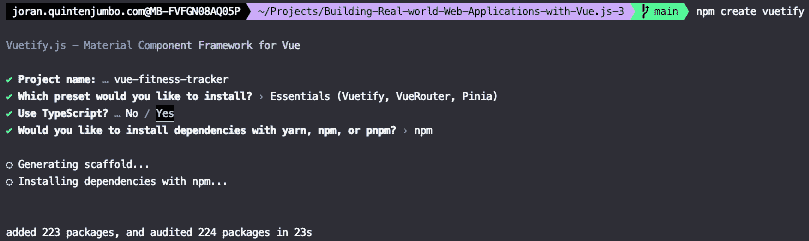
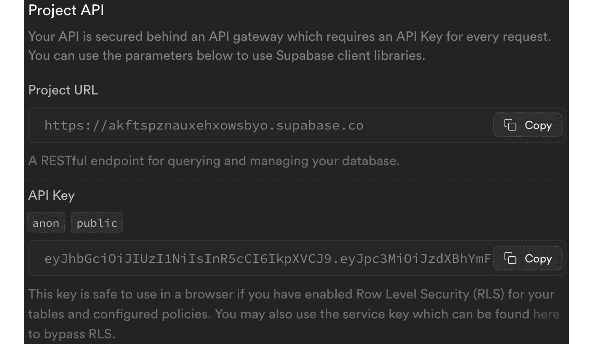
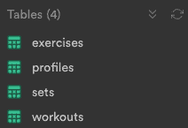
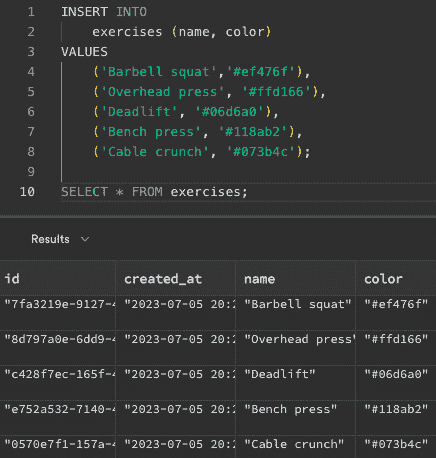
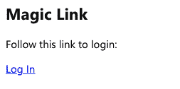
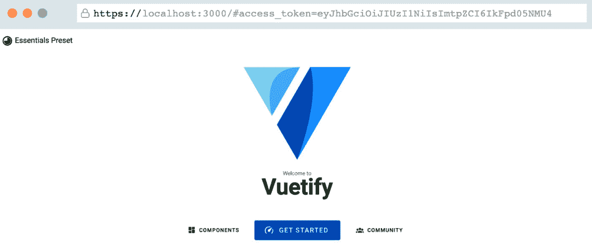
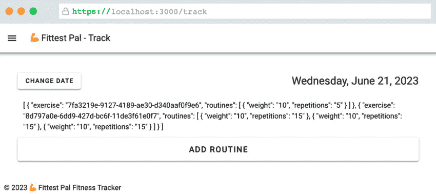
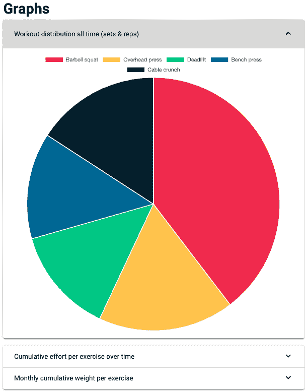
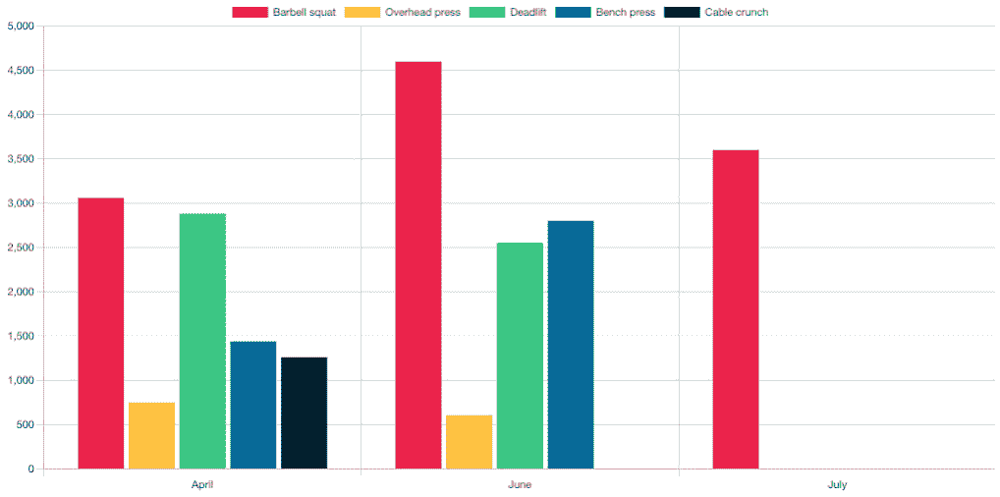
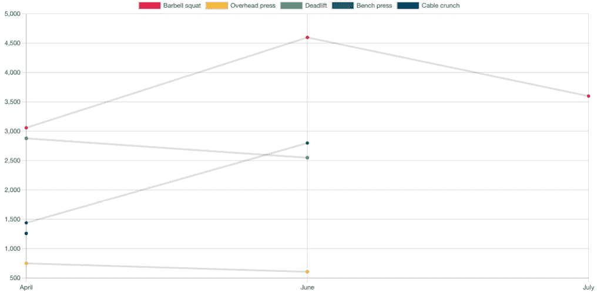

# 第六章：使用数据可视化创建健身追踪器

到目前为止，我们一直依赖于无状态应用程序或将状态存储在用户的浏览器上。在本章中，我们将介绍使用数据库在集中位置存储数据，并学习如何修改和从数据源读取数据。我们将利用这个机会，使用第三方库来引入一些数据可视化。

当我们使用数据库并需要设置表时，这绝对不是一份面向生产环境的数据库配置和管理指南。我建议以不同的方式提高这些技能。它确实是一个有价值的原型，可以帮助您熟悉数据库处理的相关模式。

再次，我们将基于我们迄今为止所获得的知识，并引入可组合组件、存储库和组件库来构建我们的产品。

在本章中，我们将介绍以下主题：

+   创建仪表板和报告

+   使用 Supabase 检索数据

+   使用 Supabase 存储数据

+   使用`vue-chartjs`添加各种可视化

# 技术要求

从上一章的要求中有些重叠。我们将使用**Vuetify**([`vuetifyjs.com/en/`](https://vuetifyjs.com/en/))和**Pinia**([`pinia.vuejs.org/`](https://pinia.vuejs.org/))。对于数据存储，我们将使用**Supabase**([`supabase.com/`](https://supabase.com/))，这是一个具有内置身份验证的开源数据库提供商。对于数据库，我准备了一个创建数据库的脚本，另一个是添加示例数据的脚本。

这是 GitHub 链接：[`github.com/PacktPublishing/Building-Real-world-Web-Applications-with-Vue.js-3/tree/main/06.fitness`](https://github.com/PacktPublishing/Building-Real-world-Web-Applications-with-Vue.js-3/tree/main/06.fitness)。

我们将在本章中介绍这些步骤。最后，对于数据可视化，我们将安装并使用`vue-chartjs`([`vue-chartjs.org/`](https://vue-chartjs.org/))，这是一个针对`chart.js`([`www.chartjs.org/`](https://www.chartjs.org/))库的 Vue 兼容包装器。

# 创建客户端

为了开始我们的项目，我们将使用 Vuetify 安装程序，就像我们在上一章中所做的那样。这是相应的命令：

```js
npm create vuetify
```

选择`vue-fitness-tracker`作为项目名称，并选择以下选项，如图所示：



图 6.1 – 设置 Vuetify 项目

在我们的项目初始化后，我们将创建和配置一个数据库来存储我们的数据。

# 设置数据库

在`fitness-tracker`上注册免费账户作为名称，并选择一个强大的数据库密码。对于区域，选择一个地理位置靠近您的选项以获得更好的延迟。我们将坚持使用免费计划！

在下一页（*图 6.2*）中，您将看到项目的 API 密钥：



图 6.2 – 项目 API 密钥概览

我们将把它们存储在我们的项目根目录下的 `.env` 文件中：

```js
VITE_SUPABASE_URL=YOUR_SUPABASE_URLVITE_SUPABASE_ANON_KEY=YOUR_SUPABASE_ANON_KEY
```

注意，通过客户端应用以这种方式共享密钥总是会将它们暴露给公众。幸运的是，Supabase 有自己的方法来确保在交互数据库时进行身份验证。

我创建了一个脚本，用于设置数据库并包含我们应用的表结构。通过仪表板和 SQL 编辑器，你可以从示例仓库中的 `example-structure.sql` 文件添加和执行查询，如图 *图 6.3* 所示：



图 6.3 – 查询成功执行后，你应该在表编辑器概览中看到四个表格

执行完毕后，你可以使用 `example-exercises.sql` 脚本设置一些数据，如图 *图 6.4* 所示：



图 6.4 – 将示例练习插入到练习表中

为了简化与数据库的交互，我们将使用 Supabase JavaScript 客户端，通过安装依赖项：

```js
npm install @supabase/supabase-js
```

让我们将这个包转换成一个可组合的组件，在应用中处理数据库连接。在 `src/composables` 中，我们将创建一个 `supabase.ts` 文件并添加以下内容：

```js
import { createClient } from '@supabase/supabase-js'const supabaseUrl = import.meta.env.VITE_SUPABASE_URL
const supabaseAnonKey = import.meta.env.VITE_SUPABASE_ANON_KEY
export const useSupabaseClient = createClient(supabaseUrl, supabaseAnonKey);
```

我做的最后一个改动是清理 `layouts` 文件夹中的样板组件。我删除了所有文件，除了 `Default.vue`，并更新了其内容以匹配以下内容：

```js
<template>  <v-app>
    <v-main>
      <router-view />
    </v-main>
  </v-app>
</template>
```

这就是我们的起点，开始构建我们的应用。接下来，我们将确保应用显示个人结果，使用 Supabase 提供的内置工具。

# 处理用户

应用程序的目标是允许跟踪和查看个人指标，因此为此目的，我们需要确保我们可以识别我们的用户。Supabase 默认支持身份验证，我们将使用一个非常基本的方法：一个**魔法链接**。

魔法链接允许你仅使用有效的电子邮件地址进行注册和登录。登录时，服务会发送包含唯一标识符的电子邮件，点击后，用户将被验证到该电子邮件地址。在我们的情况下，后端处理验证它是一个新用户还是一个现有用户，这对于我们的用例来说非常完美。

由于我们可以识别用户，我们需要将我们的应用连接到 Supabase 以获取它提供的信息。我们还可以引入身份验证，以确保用户可以访问他们想要使用或访问的部分。

## 用户存储

我们将希望始终能够访问和更新用户的状态，因此我们将在 Pinia 中设置一个用户存储，以跟踪当前状态并提供更新状态、登录和登出的操作。

在`src/store`文件夹中创建一个包含以下内容的`user.ts`文件后，我们将查看存储的内容：[`github.com/PacktPublishing/Building-Real-world-Web-Applications-with-Vue.js-3/blob/main/06.fitness/.notes/6.1-user.ts`](https://github.com/PacktPublishing/Building-Real-world-Web-Applications-with-Vue.js-3/blob/main/06.fitness/.notes/6.1-user.ts)。

在会话（*第 11 行*）中，我们将存储用户的认证状态。它可以是`null`表示未登录，或者状态可以包含一个对象（如`UserSession`接口中定义的），该对象由 Supabase 授权服务填充。

使用`login`（*第 13-20 行*）和`logout`（*第 22-30 行*）方法，我们调用 Supabase 认证服务并执行提供的回调函数。我们很快就会看到这些功能在实际中的应用！

为了存储用户，我们有`insertProfile`函数（*第 32-44 行*），它将任何认证用户插入到我们的数据库中供将来参考。

注意

存储个人数据可能受当地法律和治理的约束。在存储、存储原因以及如何删除个人数据方面，请务必谨慎和透明。

`setUserSession`（*第 47-49 行*）简单地将数据传递到状态中供进一步参考。最后，`userIsLoggedIn`（*第 51-58 行*）检查当前会话数据是否仍然有效，如果不是，则返回`false`。我们可以使用这个来快速评估显示用户界面元素。

在存储就绪后，我们可以在应用中包含配置文件，并采取一些合理的安全措施。

## 用户认证

让我们创建一个表单，用户可以提供电子邮件地址，这将导致在`components`文件夹中生成`FormLogin.vue`：[`github.com/PacktPublishing/Building-Real-world-Web-Applications-with-Vue.js-3/blob/main/06.fitness/.notes/6.2-FormLogin.vue`](https://github.com/PacktPublishing/Building-Real-world-Web-Applications-with-Vue.js-3/blob/main/06.fitness/.notes/6.2-FormLogin.vue)。

如您所见，我们正在使用我们的用户存储来分发一个带有用户提供的电子邮件地址的`login`动作（*第 11-14 行*，*第 25 行*），模板是用 Vuetify 组件构建的。它包含一个`form`和一个`dialog`组件，在提交时触发，以通知用户查看他们的电子邮件。

OTP 登录会将登录链接发送到提供的电子邮件地址，这意味着用户将从外部链接进入应用。我们需要确保在应用加载时尝试验证用户的会话。为此，我们将更新根目录下的`App.vue`文件：

```js
<script setup lang="ts">import { onMounted } from "vue";
import { useUserStore } from "@/store/user";
import { useSupabaseClient } from "@/composables/supabase";
const userStore = useUserStore();
onMounted(async () => {
  const { data } = await useSupabaseClient.auth.getSession();
  if (data && data.session && data.session.user) {
    await userStore.insertProfile(data.session);
    userStore.setUserSession(data.session);
  }
  useSupabaseClient.auth.onAuthStateChange((_, _session) => {
    userStore.setUserSession(_session);
  });
});
</script>
<template>
  <router-view />
</template>
```

在这个脚本中，我们将通过 Supabase 验证用户会话。在接收到数据后，我们将其存储在用户存储中，并使用存储来在我们的数据库中更新一个配置文件。我们还跟踪状态变化，以便处理更新的令牌或失效。

## 受保护的路由

在获取到用户状态后，我们可以使用`beforeEnter`生命周期钩子来验证用户是否有权访问某个路由。`beforeEnter`方法充当中间件，并执行一个函数，您可以通过该函数决定如何处理路由更改。

我们首先在`views`文件夹中创建一个用于登录状态的视图，命名为`Login.vue`：

```js
<script lang="ts" setup>import FormLogin from '@/components/FormLogin.vue';
</script>
<template>
  <form-login />
</template>
```

在路由文件中，我们将添加一个名为`loginGuard`（*第 7-14 行*）的函数来检查用户是否已登录，并且我们将在受保护路由的`beforeEnter`方法中调用该函数（*第 37 行*）。如果用户会话存在，您将被允许跟随该路由。否则，您将被重定向到新添加的`loginRoute`函数（*第 12 行，第 39-44 行*）：[`github.com/PacktPublishing/Building-Real-world-Web-Applications-with-Vue.js-3/blob/main/06.fitness/.notes/6.3-router-index.ts`](https://github.com/PacktPublishing/Building-Real-world-Web-Applications-with-Vue.js-3/blob/main/06.fitness/.notes/6.3-router-index.ts)。

如果您运行开发应用程序，在第一次访问时，由于您尚未认证，您将看到一个登录表单，如图*图 6**.5*所示：


图 6.5 – 用户未登录，被重定向到/login 路由

在提供您的电子邮件地址后，会出现一个全屏弹出窗口，引导用户进行下一步操作。如果您打开电子邮件客户端，您应该会很快收到一封包含魔法链接的电子邮件：



图 6.6 – 包含魔法链接的默认电子邮件

点击魔法链接将打开一个新的浏览器窗口，并应将您重定向到主页，该主页仅对已登录用户可访问：



图 6.7 – 只有登录用户才能看到主页

这意味着如果您看到的是 Vuetify 默认的主页，那么您是一个已登录的用户！目前您没有登出的方式，所以让我们来完成这个认证流程。

## 登出

为了完成用户流程，我们将添加一个用户登出的功能。为此，我们将在商店中添加一个与用户登出方法关联的菜单按钮。

让我们在`src`文件夹中创建一个`AppMenu.vue`文件，并添加**注销**和**登录**按钮。我们稍后会进一步扩展菜单：[`github.com/PacktPublishing/Building-Real-world-Web-Applications-with-Vue.js-3/blob/main/06.fitness/.notes/6.4-AppMenu.vue`](https://github.com/PacktPublishing/Building-Real-world-Web-Applications-with-Vue.js-3/blob/main/06.fitness/.notes/6.4-AppMenu.vue)。

在菜单中，根据用户状态（*第 5-6 行*，*第 10 行*，*第 18 行*），我们将显示一个按钮用于登录或登出。通过对我们`App.vue`文件的一些小修改，我们可以快速包含`AppMenu.vue`文件到我们的应用中（*第 6 行*，*第 21-26 行*）: [`github.com/PacktPublishing/Building-Real-world-Web-Applications-with-Vue.js-3/blob/main/06.fitness/.notes/6.5-AppMenu.vue`](https://github.com/PacktPublishing/Building-Real-world-Web-Applications-with-Vue.js-3/blob/main/06.fitness/.notes/6.5-AppMenu.vue)。

我们现在已经完成了应用中的用户流程。我们可以让新用户登录和现有用户登录，并且登录用户可以退出应用。如您所见，我们将让 Supabase 处理逻辑，而我们只是从 Supabase 获取数据。

这是在前端开发中的一种常见模式，将认证留给服务器而不是客户端。对于我们的即将推出的功能，我们不必担心谁可以访问什么数据，因为我们已经配置了 Supabase（带有**行级安全**（**RLS**）策略 ([`supabase.com/docs/guides/auth#row-level-security`](https://supabase.com/docs/guides/auth#row-level-security))) 和认证方法来为我们处理数据）。

现在我们为用户提供了注册和登录的方式，我们可以开始为应用添加添加个人数据的特性。

# 应用状态

为了让我们更容易控制应用的状态，我们将添加一个新的存储来跟踪用户界面的当前状态。

Vuetify 在`store/app.ts`文件中为我们创建了一个占位符应用存储，因此我们将添加一些特性来处理页面转换（*第 28 行*，*第 30-35 行*），切换菜单（*第 18 行*，*第 20-26 行*）和控制对话框（*第 37-55 行*）以进行应用级通知：[`github.com/PacktPublishing/Building-Real-world-Web-Applications-with-Vue.js-3/blob/main/06.fitness/.notes/6.6-app.ts`](https://github.com/PacktPublishing/Building-Real-world-Web-Applications-with-Vue.js-3/blob/main/06.fitness/.notes/6.6-app.ts)。

在一个集中的位置提供这些类型的用户界面工具，消除了在我们应用中重复某些模式的需要，例如显示或隐藏对话框。这意味着这些工具是应用的一部分，因此在整个应用中都是可用的。

## 集中式对话框

让我们更新`FormLogin.vue`文件，以便利用应用级别的存储选项。我们可以清理现有的对话框选项，并用调用存储方法来替换它们：[`github.com/PacktPublishing/Building-Real-world-Web-Applications-with-Vue.js-3/blob/main/06.fitness/.notes/6.7-FormLogin.vue`](https://github.com/PacktPublishing/Building-Real-world-Web-Applications-with-Vue.js-3/blob/main/06.fitness/.notes/6.7-FormLogin.vue)。

正如你所见，通过使用通用的应用存储（*第 5 行*，*第 8 行*），我们现在也可以轻松地添加额外的对话框；例如，当缺少电子邮件地址（*第 13-17 行*）或 OTP 已发送（*第 18-24 行*）时。我们唯一需要做的是添加一个中央位置来显示对话框，我们将为此打开并修改`App.vue`：[`github.com/PacktPublishing/Building-Real-world-Web-Applications-with-Vue.js-3/blob/main/06.fitness/.notes/6.8-App.vue`](https://github.com/PacktPublishing/Building-Real-world-Web-Applications-with-Vue.js-3/blob/main/06.fitness/.notes/6.8-App.vue)。

这样，我们有一个对话框（*第 13 行*，*第 31-39 行*），它是应用的一部分，我们可以通过我们的存储（*第 4 行*，*第 11 行*）从任何地方控制它！对于应用菜单也是如此，所以让我们修改我们的应用以实现对应用菜单的集中控制。

## 集中化应用菜单

我们可以将类似的模式应用到菜单上。我们将将其转换为滑动进出视图的抽屉链接功能。让我们从通过添加必要的应用存储引用来修改`AppMenu.vue`开始：

```js
<script setup lang="ts">import { storeToRefs } from "pinia";
import { useUserStore } from "@/store/user";
import { useAppStore } from "@/store/app";
const userStore = useUserStore();
const appStore = useAppStore();
const { userIsLoggedIn } = storeToRefs(userStore);
const { drawer } = storeToRefs(appStore);
const goToPage = (page: string): void => {
  appStore.navigateToPage(page);
};
</script>
<template>
  <v-navigation-drawer v-model="drawer" app>
    <v-list dense v-if="userIsLoggedIn">
      <v-list-item @click="userStore.logout()">
        <template v-slot:prepend>
          <v-icon icon="mdi-account-arrow-right"></v-icon>
        </template>
        <v-list-item-title>Log out</v-list-item-title>
      </v-list-item>
    </v-list>
    <v-list dense v-else>
      <v-list-item @click="goToPage('/login')">
        <template v-slot:prepend>
          <v-icon icon="mdi-account"></v-icon>
        </template>
        <v-list-item-title>Login</v-list-item-title>
      </v-list-item>
    </v-list>
  </v-navigation-drawer>
</template>
```

在模板中，我们用 Vuetify 的`navigation-drawer`组件包裹了菜单，该组件使用`drawer`状态变量来显示为打开或关闭。我们还用导航到新页面的方法替换了`router-link`组件。

为了完成设置，我们需要修改`App.vue`文件以适应新的界面并最终确定应用布局：

```js
<script setup lang="ts">// ...abbreviated
const userStore = useUserStore();
const appStore = useAppStore();
const { pageTitle, dialog } = storeToRefs(appStore);
const currentYear = new Date().getFullYear();
onMounted(async () => {
  // ...abbreviated
});
</script>
<template>
  <v-app>
    <app-menu />
    <v-app-bar app style="position: relative">
      <v-app-bar-nav-icon @click="appStore.toggleDrawer()"></v-app-bar-nav-icon>
      <v-toolbar-title>💪 Fittest Pal - {{ pageTitle }}</v-toolbar-title>
    </v-app-bar>
    <v-main>
      <!-- abbreviated -->
    </v-main>
    <v-footer app>
<span>&copy; {{ currentYear }} 💪 Fittest Pal Fitness Tracker</span>
    </v-footer>
  </v-app>
</template>
```

到目前为止，我们有一个支持个性化体验的应用基础，这取决于第三方认证，并且能够拥有公共和受保护的路由。我们有一些集中化的功能来控制应用用户界面的状态。下一步将是添加用户可以插入他们自己的数据的功能！

我们已经准备并设置了我们的数据库，包括表和一些预填充的练习。请随意查看表和`exercises`表的内容，因为它将帮助您理解我们的下一步。

我们有一个表格练习，其中存储了不同类型的健身房练习。用户数据（仅限于电子邮件地址）存储在表中。如果你通过登录表单注册，你应该已经看到了你的电子邮件地址！我们还有记录每个用户的训练的锻炼，以及将执行练习与锻炼组合的集合表。最后，我们添加了一个仪表板视图，我们将在稍后构建它。

现在，让我们确保用户可以通过构建一个锻炼跟踪器来向数据库添加数据。

# 锻炼跟踪

让我们添加一个新的路由，让我们的用户将常规添加到数据库中。让我们首先在路由上添加一个新的路由条目：

```js
      {        path: 'track',
        name: 'Track',
        component: () => import(/* webpackChunkName: "track" */ '@/views/Track.vue'),
        beforeEnter: loginGuard
      },
```

正如你所见，这是一个只有经过认证的用户才能访问的页面。我们的入口也意味着我们需要创建一个名为`Track.vue`的视图，让我们继续：

```js
<script lang="ts" setup>import TrackExercise from "@/components/TrackExercise.vue";
</script>
<template>
  <track-exercise />
</template>
```

我们将通过在 `components` 文件夹中创建一个空的 `TrackExercise.vue` 文件来完成初始化，并且我们将专注于创建一个符合我们跟踪活动的界面。

要导航到我们的路由，我们可以修改我们的 `AppMenu.vue` 文件。由于我们可以预期有更多的菜单项，我们可以在 `script` 块中定义一个模式，并让模板遍历这些项。我们将从集合中的一个单独项开始，如下所示：

```js
<script setup lang="ts">// ...abbreviated
const menuItems = [
  {
    icon: "mdi-dumbbell",
    title: "Track",
    page: "/track",
  }
];
</script>
```

在我们的模板中，我们将扩展 `v-list` 以遍历登录用户的 `menuItems` 集合：

```js
<v-list dense v-if="userIsLoggedIn">  <v-list-item
    v-for="item in menuItems"
    :key="item.title"
    @click="goToPage(item.page)"
  >
    <template v-slot:prepend>
      <v-icon :icon="item.icon"></v-icon>
    </template>
    <v-list-item-title>{{ item.title }}</v-list-item-title>
  </v-list-item>
  <v-list-item @click="userStore.logout()">
    <template v-slot:prepend>
      <v-icon icon="mdi-account-arrow-right"></v-icon>
    </template>
    <v-list-item-title>Log out</v-list-item-title>
  </v-list-item>
</v-list>
```

现在，我们可以从菜单中导航到应用中的新页面。

接下来，我们可以定义输入字段。我们将从为我们的用户创建一个日期选择器开始。

## 选择日期

我们想在锻炼中添加一个日期。目前 Vuetify 支持作为实验性功能的 `datepicker`。我们需要显式地将它导入到我们新创建的 `TrackExercise.vue` 文件中，并且此外，我们还将配置一些变量来跟踪用户界面状态以及所选日期：

```js
<script setup lang="ts">import { ref } from "vue";
import type { Ref } from "vue";
import { VDatePicker } from "vuetify/labs/VDatePicker";
const showDialogDate: Ref<boolean> = ref(false);
const selectedDate: Ref<any[] | undefined> = ref(undefined);
</script>
```

在我们的模板中，我们将构建添加锻炼的控制，从日期选择开始：

```js
<template>  <v-container>
    <v-row class="align-center justify-space-between mb-6">
      <v-btn @click="showDialogDate = true">
        <span v-if="selectedDate">Change date</span>
        <span v-else>Select date</span>
      </v-btn>
      {{ selectedDate }}
      <v-dialog v-model="showDialogDate" center>
        <v-date-picker
          v-model="selectedDate"
          show-adjacent-months
          @click:cancel="showDialogDate = false"
          @click:save="showDialogDate = false"
          style="margin: 0 auto"
        ></v-date-picker>
      </v-dialog>
    </v-row>
  </v-container>
</template>
```

这应该看起来很熟悉。我们添加了一个按钮来控制对话框，并对对话框进行了一些配置。我们不使用我们的全局对话框的原因是它包含更高级的内容和钩子。应用对话框旨在向我们的用户显示简短的消息。

如果你尝试一下，你会注意到选择日期会导致在界面中显示一个未格式化的日期。在我们继续之前，我们将使用 `computed` 方法以及浏览器的内置 `Intl` API 来修复这个问题：

```js
<script setup lang="ts">import { ref, computed } from "vue";
// ... abbreviated
const formattedDate: Ref<string> = computed(() => {
  if (selectedDate?.value?.length) {
    return new Intl.DateTimeFormat("en-US", {
      weekday: "long",
      year: "numeric",
      month: "long",
      day: "numeric",
    }).format(selectedDate.value[0]);
  }
  return "";
});
</script>
```

在我们的模板中，我们将用格式良好的日期表示替换 `{{ selectedDate }}`：

```js
<h4 class="text-h5">{{ formattedDate }}</h4>
```

## 添加常规锻炼

对于添加一个常规锻炼，我们希望用户能够从我们的数据库中选择一个常规锻炼。我们希望提供一个常规选择器，所以让我们构建一个！组件应该从数据库中读取锻炼，并让用户选择一个以添加一套（重量和重复次数）的属性。

由于需要集中式数据，我们可以为所有与健身相关的数据和函数创建一个存储库。让我们在存储库中创建一个 `fitness.ts` 文件，并且我们将从从数据库中检索锻炼开始：[`github.com/PacktPublishing/Building-Real-world-Web-Applications-with-Vue.js-3/blob/main/06.fitness/.notes/6.9-fitness.ts`](https://github.com/PacktPublishing/Building-Real-world-Web-Applications-with-Vue.js-3/blob/main/06.fitness/.notes/6.9-fitness.ts)。

存储库公开了锻炼和检索它们的方法。由于我们希望立即填充 `exercises` 列表，我们可以在初始化存储库时调用 `getExercises` 方法（*第 13-28 行*，*第 29 行*）！

我们将在未来添加更多存储库，但到目前为止，我们可以开始在一个新组件中使用数据：一个名为 `SelectExercise.vue` 的 `components` 文件夹，我们将导入存储库并使用它来填充一个 Vuetify `select` 组件：

```js
<script setup lang="ts">import { storeToRefs } from "pinia";
import { useFitnessStore } from '@/store/fitness'
const fitnessStore = useFitnessStore()
const { exercises } = storeToRefs(fitnessStore)
</script>
<template>
  <v-select
    v-if="exercises"
    label="Select exercise"
    :items="exercises"
    item-title="name"
    item-value="id"
  ></v-select>
</template>
```

非常简单！我们访问存储并映射值到`v-select`组件。除了`exercise`，我们希望用户能够将`weight`和`repetitions`作为常规的一部分添加。因此，让我们将创建的组件包裹在一个名为`AddRoutine.vue`的父组件中：[`github.com/PacktPublishing/Building-Real-world-Web-Applications-with-Vue.js-3/blob/main/06.fitness/.notes/6.10-AddRoutine.vue`](https://github.com/PacktPublishing/Building-Real-world-Web-Applications-with-Vue.js-3/blob/main/06.fitness/.notes/6.10-AddRoutine.vue)。

在我们转向模板之前，让我们先分解一下。我们有`exercise`（*第 10 行*）和`routine`（*第 9 行*）变量，其中一项常规包括一项练习以及一组重量和重复次数的组合。

`routines`的一个例子可能如下所示：

```js
{ "exercise": "7fa3219e-9127-4189-ae30-d340aaf0f9e6",  "routines": [
    { "weight": "10", "repetitions": "10" },
    { "weight": "10", "repetitions": "10" }
  ]
}
```

流程从选择一项锻炼开始，然后监视器（*第 38-40 行*）准备填充新值的常规（清除`routines`数组）。模板中的界面被建模为重量和重复次数，您将在下面看到。

如往常一样，可以使用`addRow`函数（*第 16-21 行*）向`routines`属性添加多行。如果用户出错，可以从属性中移除一行（*第 23-25 行*）。

`add`函数（*第 33-36 行*）将`routine`对象发送到父组件并重置表单上的任何值。

在模板部分，我们首先使用`select-exercise`组件（*第 48 行*）来触发流程，并使用 Vuetify 扩展面板显示添加一套的表单（*第 52-86 行*）以及显示您已添加的套数摘要（*第 87-131 行*）。

第二个扩展面板也使用 Vuetify 徽章来指示未保存更改的数量（*第 92-100 行*）。底部有一个按钮（*第 135-144 行*），它调用`emit`函数以将`routine`对象发送到父组件。

我们现在可以回到`TrackExercise.vue`文件，以获取发出的事件，并将选定的日期与建模的常规结合起来，最终将其存储在数据库中。

在`script`块中，我们将添加以下代码以跟踪常规和子组件：

```js
<script setup lang="ts">// ...abbreviated
import type { Routine } from "@/types/fitness";
import AddRoutine from "./AddRoutine.vue";
const routines: Ref<Routine[]> = ref([]);
const showDialogRoutine: Ref<boolean> = ref(false);
const addRoutineToExercise = (newRoutine: any) => {
  showDialogRoutine.value = false;
  routines.value.push(newRoutine);
};
</script>
```

在我们的模板中，在日期选择器的表示下方，我们可以添加一个用于创建常规的对话框：

```js
<template>  <v-container>
    <v-row class="align-center justify-space-between mb-6">
      // …abbreviated
    </v-row>
    {{ routines }}
    <v-row class="mb-6">
      <v-btn
        block
        size="x-large"
        @click="showDialogRoutine = true"
        v-if="selectedDate"
      >
        Add routine
      </v-btn>
      <v-dialog v-model="showDialogRoutine" fullscreen>
        <v-card>
          <v-card-text>
            <add-routine @add="addRoutineToExercise" />
          </v-card-text>
          <v-card-actions>
            <v-btn color="primary" @click="showDialogRoutine = false"
              >Close</v-btn
            >
          </v-card-actions>
        </v-card>
      </v-dialog>
    </v-row>
  </v-container>
</template>
```

在此代码更改之后，一旦选择了日期，我们将显示一个按钮以开始添加常规。常规选择组件在一个专用对话框中打开，并在`add`事件上调用`addRoutineToExercise`函数，该函数向此组件中的对象添加换行符。您现在可以亲自尝试，因为我们目前正在内联显示`{{ routines }}`。它应该看起来类似于*图 6**.8*：



图 6.8 – 我们用于编译锻炼的界面

我们下一步将是对我们想要添加到数据库中的锻炼格式化显示，当然，也将锻炼本身存储在数据库中。

## 将数据保存到数据库

我们为用户创建了一个功能，以便他们可以模拟锻炼，这样我们就可以开始保存辛勤的工作。我们将使用我们的健身存储文件来完成这项工作，所以让我们添加一些新方法并将它们导出以供使用：[`github.com/PacktPublishing/Building-Real-world-Web-Applications-with-Vue.js-3/blob/main/06.fitness/.notes/6.11-fitness.ts`](https://github.com/PacktPublishing/Building-Real-world-Web-Applications-with-Vue.js-3/blob/main/06.fitness/.notes/6.11-fitness.ts).

我们需要访问用户 ID，所以我们将导入`userStore`函数（*第 2 行*），并且我们将导入我们将使用的一些数据类型。

我们添加了主要的`saveWorkout`函数（*第 40-70 行*），它执行两个辅助函数：首先，它使用`insertWorkout`函数（*第 11-25 行*）将锻炼保存到锻炼表中。在从锻炼中检索`id`属性后，我们可以开始保存集合。为此，我们遍历常规以编译集合列表，然后我们可以使用`insertSets`方法（*第 27-38 行*）一次性保存它们。

在添加了这些功能后，让我们回到我们的`TrackExercise.vue`文件，添加一个`saveWorkout`动作。我们将导入健身和应用存储：

```js
import { useFitnessStore } from "@/store/fitness";const fitnessStore = useFitnessStore();
import { useAppStore } from "@/store/app";
const appStore = useAppStore();
```

我们还将添加函数来验证锻炼是否可以实际保存——一个用于重置表单状态，另一个将信息传递到我们的存储动作：

```js
const canSaveWorkout = computed(() => {  return routines.value.length > 0;
});
const reset = () => {
  routines.value = [];
  selectedDate.value = undefined;
};
const saveWorkout = () => {
  if (selectedDate.value && routines.value?.length > 0) {
    fitnessStore.saveWorkout({
      date: selectedDate.value,
      routines: routines.value,
    });
    appStore.showDialog({
      title: "Success",
      contents: "Workout saved successfully",
    });
    reset();
  } else {
    appStore.showDialog({
      title: "Error",
      contents: "Please select a date and add at least one routine",
    });
  }
};
```

再次，我们使用应用对话框来显示我们系统的消息；既方便又可重用。我们将在模板底部添加一个条件性的**保存**按钮来结束我们的表单：

```js
<template>// …abbreviated
    <v-row class="mb-6">
      <v-btn
        block
        size="x-large"
        :disabled="!canSaveWorkout"
        @click="saveWorkout"
        v-if="selectedDate"
        >Save workout</v-btn
      >
    </v-row>
  </v-container>
</template>
```

你可以试一试。数据应该会显示在你的 Supabase 实例的表格中。在*第七章**中，我们将开始以各种方式检索这些数据。正如你所看到的，在开发过程中，有时在构成链的各个组件之间来回切换是有意义的。

我试图演示这个过程，因为它接近实际开发。一次性提出理想的解决方案（或规范！）是很少见的。

# 我们辛勤工作的可视化

存储数据是一回事。对于用户来说，如果我们可以将其呈现于一定的上下文中，数据才有价值。我们在保存之前的常规编译显示中做了一些小练习。在这一部分，我们将看到几个不同的数据展示示例。

我们将确保容纳空状态（所以请随意删除任何项目或尝试新的登录），在我们添加了一些锻炼之后，我们将找到显示数据的方法。

让我们先从替换主页开始。在这种情况下，我们已经有了一个路由和`Home.vue`视图，但我们将删除对`HelloWorld.vue`组件的引用，并创建一个空的`History.vue <template>`组件。然后，在`Home.vue`中，我们将引用`History.vue`文件而不是`HelloWorld.vue`。

## 基于视图的仪表板

我们可以从一个快速组件开始，展示用户的最新统计数据。当在数据库上执行脚本时，它包含了一个视图，称为`workout_dashboard_view`。这就像是一个只读查询的聚合，我们可以将其作为单独的表来查询。

我们将通过添加和暴露`dashboard`变量（*第 15 行*，*第 42 行*）来为健身商店添加获取数据的方法，这与我们对锻炼所做的方法类似，这个变量反过来从`getDashboard`方法（*第 17-40 行*，*第 42 行*）获取数据：[`github.com/PacktPublishing/Building-Real-world-Web-Applications-with-Vue.js-3/blob/main/06.fitness/.notes/6.12-fitness.ts`](https://github.com/PacktPublishing/Building-Real-world-Web-Applications-with-Vue.js-3/blob/main/06.fitness/.notes/6.12-fitness.ts)。

在有了这些之后，我们可以创建一个组件来从商店访问仪表板并显示内容。让我们称它为`WorkoutStats.vue`，并将对健身商店的引用和加载仪表板：

```js
<script setup lang="ts">import { computed, onMounted } from "vue";
import { storeToRefs } from "pinia";
import { useFitnessStore } from "@/store/fitness";
const fitnessStore = useFitnessStore();
const { dashboard } = storeToRefs(fitnessStore);
const daysSinceLastWorkout = computed(() => {
  if (!dashboard.value) return 0;
  const lastWorkout = new Date(dashboard.value.last_workout_date);
  const today = new Date();
  const diffTime = Math.abs(today.getTime() - lastWorkout.getTime());
  const diffDays = Math.floor(diffTime / (1000 * 60 * 60 * 24));
  return diffDays;
});
onMounted(() => {
  fitnessStore.getDashboard();
});
</script>
```

我们增加了一个函数来计算今天和上次锻炼日期之间的差异，但这是一个简洁的设置。在模板中，我们可以期待四个用于仪表板的价值，每个我们都会单独展示在卡片上：

```js
<template>  <v-row>
    <v-col cols="12" sm="3" m="2" class="d-flex justify-space-between">
      <v-card class="align-self-stretch flex-grow-1">
        <v-card-title>{{ daysSinceLastWorkout }}</v-card-title>
        <v-card-text>Days since last workout</v-card-text>
      </v-card>
    </v-col>
    <v-col cols="12" sm="3" m="2" class="d-flex justify-space-between">
      <v-card class="align-self-stretch flex-grow-1">
        <v-card-title>{{ dashboard?.total_workouts || 0 }}</v-card-title>
        <v-card-text>Total workouts</v-card-text>
      </v-card>
    </v-col>
    <v-col cols="12" sm="3" m="2" class="d-flex justify-space-between">
      <v-card class="align-self-stretch flex-grow-1">
        <v-card-title>{{ dashboard?.cumulative_weight || 0 }}</v-card-title>
        <v-card-text>Cumulative weight moved</v-card-text>
      </v-card>
    </v-col>
    <v-col cols="12" sm="3" m="2" class="d-flex justify-space-between">
      <v-card class="align-self-stretch flex-grow-1">
        <v-card-title>{{
          dashboard?.most_weight_single_workout || 0
        }}</v-card-title>
        <v-card-text>Most weight in a single workout</v-card-text>
      </v-card>
    </v-col>
  </v-row>
</template>
```

我们使用一个表达式来默认为`0`值，如果我们从仪表板没有结果。然而，一旦它被填充了值，我们就用这些值填充模板。由于模板中存在一些重复，所以有一些优化的空间。这将是一个很好的练习，可以自己改进！

现在，我们有一些方法来激励我们的用户开始填写更多的锻炼！现在让我们看看我们是否也能显示个人的锻炼。

## 历史和概述

为了检索我们的锻炼，我们将在健身商店中添加一个新的方法。为此目的，我们还有一个视图准备就绪！让我们看看更新的健身商店文件：[`github.com/PacktPublishing/Building-Real-world-Web-Applications-with-Vue.js-3/blob/main/06.fitness/.notes/6.13-fitness.ts`](https://github.com/PacktPublishing/Building-Real-world-Web-Applications-with-Vue.js-3/blob/main/06.fitness/.notes/6.13-fitness.ts)。

如您所见，通过锻炼（*第 15 行*）和检索锻炼的方法（*第 20-46 行*），我们向应用中暴露了一个新的数据集。

通过这些更改，我们可以在我们的`History.vue`文件中添加一些额外的内容。我们将首先从商店导入数据，并在模板中简单地输出它：[`github.com/PacktPublishing/Building-Real-world-Web-Applications-with-Vue.js-3/blob/main/06.fitness/.notes/6.14-History.vue`](https://github.com/PacktPublishing/Building-Real-world-Web-Applications-with-Vue.js-3/blob/main/06.fitness/.notes/6.14-History.vue)。

这个添加为我们提供了从数据库视图的概述（*第 6-7 行，第 9 行，第 28 行*），这些数据以 Vuetify 的展开面板形式呈现（*第 36-45 行*）。但正如你所看到的，我们需要对数据进行一些调整，因为它现在显示的是每个锻炼和练习组合的单独一行。我们希望按锻炼分组数据，因此我们将创建一个函数来转换我们的数据并添加更多的结构。请查看 `History.vue` 文件的下一个迭代版本：[`github.com/PacktPublishing/Building-Real-world-Web-Applications-with-Vue.js-3/blob/main/06.fitness/.notes/6.15-History.vue`](https://github.com/PacktPublishing/Building-Real-world-Web-Applications-with-Vue.js-3/blob/main/06.fitness/.notes/6.15-History.vue)。

这样我们就能得到唯一的 ID，以便我们能够识别每一个锻炼，并且我们已经重新设计了数据，使得每个唯一的锻炼都有一个对应的练习集合作为子项（*第 23-33 行*）。我们在练习上也做了类似的事情：根据 `exercise_name` 属性对它们进行分组。

在这种情况下，我们选择这种特定的方法，因为我们只需要查询数据库一次。有多种优化数据库查询的方法，我们现在选择直接从数据库中获取数据，并在我们的应用程序中对其进行建模以满足我们的需求。

我们还更新了面板，使其遍历 `workoutIds` 并根据 `id` 属性显示重构的（部分）锻炼（*第 53-63 行*）。

作为最后一步，我们可以创建一个小的组件来显示锻炼。我们将创建一个 `GroupedExerciseView.vue` 组件并添加以下内容：[`github.com/PacktPublishing/Building-Real-world-Web-Applications-with-Vue.js-3/blob/main/06.fitness/.notes/6.16-GroupedExerciseView.vue`](https://github.com/PacktPublishing/Building-Real-world-Web-Applications-with-Vue.js-3/blob/main/06.fitness/.notes/6.16-GroupedExerciseView.vue)。

我们可以通过将练习集作为属性传递来导入并使用我们的面板中的 Vue 组件：

```js
<script setup lang="ts">// ...abbreviated
import GroupedExerciseView from "./GroupedExerciseView.vue";
// ...abbreviated
</script>
```

然后，我们可以将其传递到模板中：

```js
<template>  <v-container>
    <workout-stats class="mb-4" />
    <h1>Past workouts</h1>
    <v-expansion-panels v-model="panel" multiple v-if="workouts">
      <v-expansion-panel v-for="id in workoutIds" :key="id">
        <v-expansion-panel-title
          >{{
            formattedDate(new Date(workoutsGroupedById[id].workout_created_at))
          }}
        </v-expansion-panel-title>
        <v-expansion-panel-text>
          <grouped-exercise-view
            :exercise="set"
            v-for="(set, index) in setsByExerciseName(workoutsGroupedById[id].sets)"
            :key="index"
          />
        </v-expansion-panel-text>
      </v-expansion-panel>
    </v-expansion-panels>
  </v-container>
</template>
```

我们还可以使用这个最后修改过的组件，在我们的添加锻炼的概述中，以优雅的格式显示用户将要保存的内容。

数据将略有不同，因此我们将创建一个 `wrapper` 组件来修改数据，然后再将其作为练习发送到 `GroupedExerciseView.vue` 组件。我们将新文件命名为 `ExerciseGrouping.vue`：[`github.com/PacktPublishing/Building-Real-world-Web-Applications-with-Vue.js-3/blob/main/06.fitness/.notes/6.17-ExerciseGrouping.vue`](https://github.com/PacktPublishing/Building-Real-world-Web-Applications-with-Vue.js-3/blob/main/06.fitness/.notes/6.17-ExerciseGrouping.vue)。

在这里，我们也在使用这个组件，但我们确保以不同的格式修改数据以适应组件。为了使其可见，我们将在 `TrackExercise.vue` 文件中导入 `ExerciseGrouping.vue` 组件并显示其值：

```js
<script setup lang="ts">// ...abbreviated
import ExerciseGrouping from "./ExerciseGrouping.vue";
// ...abbreviated
</script>
<template>
  <v-container>
    // ...abbreviated
    <exercise-grouping
        :key="index"
        v-for="(row, index) in routines"
        :exercise-id="row.exercise || 'Unknown'"
        :routines="row?.routines"
        class="mb-6"
      />
    // ...abbreviated
  </v-container>
</template>
```

这有助于我们的用户更好地跟踪未来的锻炼。这些是相对简单的数据表示。让我们看看我们是否可以添加更复杂的数据可视化，如图表。

## 图表

当处理大量数据时，在某个时候进行可视化是非常常见的。我们将通过采用第三方库（`chart.js`）来实现不同的图表，并使其渲染我们的跟踪数据！在这个时候，跟踪一定时间范围内的多个锻炼将有助于创建更直观的数据可视化体验。

面对具体和复杂的挑战，通常比自行构建解决方案更有效的是求助于第三方库。在这种情况下，我们将查看一个将`chart.js`连接到 Vue.js 的库，并将其应用于我们的应用程序。

### 根据`vue-chartjs`

我们使用一个库来显示图表。在这种情况下，`vue-chartjs`包帮助我们集成框架无关的`chart.js`与我们的 Vue.js 应用程序。使用第三方包装器更好地将底层库嵌入到框架中是非常常见的。

这通常有助于从我们的框架中抽象出已知的概念和行为，并将其翻译到库中，而库对此生态系统一无所知。这样，我们就不必处理集成层，可以专注于添加对我们最终用户有意义的特性。

让我们构建一些图表！我们将安装`vue-chartjs`和核心的`chart.js`库：

```js
npm i vue-chartjs chart.js
```

我们将创建一个新的路由`graph`，其中包含一个加载空组件和菜单添加的视图。

在路由文件中，我们添加以下条目：

```js
      {        path: 'graph',
        name: 'Graph',
        component: () => import(/* webpackChunkName: "graph" */ '@/views/Graph.vue'),
        beforeEnter: loginGuard
      },
```

这表明我们需要在`views`文件夹中创建一个`Graph.vue`文件，所以让我们这么做：

```js
<script lang="ts" setup>import Graph from "@/components/Graph.vue";
</script>
<template>
  <graph/>
</template>
```

我们将创建一个`Graph.vue`组件，在路由上开始构建不同类型的图表。让我们从一个`panel`扩展模板开始：[`github.com/PacktPublishing/Building-Real-world-Web-Applications-with-Vue.js-3/blob/main/06.fitness/.notes/6.18-Graph.vue`](https://github.com/PacktPublishing/Building-Real-world-Web-Applications-with-Vue.js-3/blob/main/06.fitness/.notes/6.18-Graph.vue)。

一旦我们在`AppMenu.ts`文件中的`menuItems`集合中添加条目，我们就可以导航到这个项目的最终页面：

```js
const menuItems = [  // ...abbreviated
  {
    icon: "mdi-chart-line",
    title: "Graph",
    page: "/graph",
  },
];
```

如页面所示，我们将实现三种类型的图表，展示我们跟踪锻炼的各种内容。

### 一块饼图（图表）

正如我们将看到的，使用库生成图表非常简单！我们必须记住，`chart`组件期望数据以固定格式，就像这个例子一样：

```js
chartData: {  labels: [ 'January', 'February', 'March' ],
  datasets: [ { data: [40, 20, 12] } ]
},
```

这不可避免地意味着我们需要进行一些数据重构，所以让我们先做这件事。实际上，我们需要从数据中获得更多详细的信息，因此我们将在我们的健身存储中添加以下功能：

```js
    const workoutsWithSets: Ref<WorkoutFromDatasource | []> = ref([]);    const getWorkoutsWithSets = async (options: GetWorkoutsOptions = { order: 'ascending' }): Promise<void> => {
        try {
            // ...abbreviated
            const { data, error, status }: any = await useSupabaseClient
                .from('workouts')
                .select(
                  id, created_at,
                  sets (
                    workout_id, weight, repetitions,
                    exercises ( name, color )
                  )
                )
    // ...abbreviated
return { exercises, getExercises, saveWorkout, workouts, getWorkouts, dashboard, getDashboard, workoutsWithSets, getWorkoutsWithSets }
```

关键区别在于`select`查询，我们在这里还请求了带有其属性的集合。当然，我们还需要从存储库返回这些新方法。然而，数据库中的数据尚未准备好用于图表，因为它期望不同的格式。在现实生活中的场景中，这种情况经常发生，所以让我们构建一个解决方案。

我们创建了一个名为`graph.ts`的新存储库，并从返回饼图数据的函数开始：[`github.com/PacktPublishing/Building-Real-world-Web-Applications-with-Vue.js-3/blob/main/06.fitness/.notes/6.19-graph.ts`](https://github.com/PacktPublishing/Building-Real-world-Web-Applications-with-Vue.js-3/blob/main/06.fitness/.notes/6.19-graph.ts).

在这里，我们正在获取锻炼数据，并以与饼图兼容的对象形式返回它。

现在，我们将在`components`文件夹中创建一个名为`GraphPie.vue`的组件，其中我们将使用存储库，并针对图表类型进行一些配置，以根据锻炼数据渲染饼图：[`github.com/PacktPublishing/Building-Real-world-Web-Applications-with-Vue.js-3/blob/main/06.fitness/.notes/6.20-GraphPie.vue`](https://github.com/PacktPublishing/Building-Real-world-Web-Applications-with-Vue.js-3/blob/main/06.fitness/.notes/6.20-GraphPie.vue).

在我们的`PieChart`组件完成之后，我们将将其导入到`Graph.vue`组件中，然后我们可以替换可折叠中的行：

```js
<script setup lang="ts">import { ref } from "vue";
import type { Ref } from "vue";
import GraphPie from '@/components/GraphPie.vue'
const panel: Ref<Number[]> = ref([0]);
</script>
<template>
  <v-container>
    <h1>Graphs</h1>
    <v-expansion-panels v-model="panel" accordion>
      <v-expansion-panel>
        <v-expansion-panel-title
          >Workout distribution all time (sets & reps)</v-expansion-panel-title
        >
        <v-expansion-panel-text>
          <graph-pie />
        </v-expansion-panel-text>
      </v-expansion-panel>
      // ...abbreviated
    </v-expansion-panels>
  </v-container>
</template>
```

根据数据的可用性和内容，你最终将得到一个类似于以下用户界面的界面：



图 6.9 – 以饼图形式表示的示例锻炼数据

使用`vue-chartjs`，我们相对容易地可视化了数据集。我们已经努力确保我们的数据格式与库期望的方式一致。考虑到这一点，我们可以继续扩展到不同类型的可视化。

### 更多图表！

看看我们的可折叠示例，我们将再构建两个图表，只是为了感受多种实现方式。我们将更新我们的图形存储库以添加更多功能。我们将创建一个可以在我们的图表中重复使用的内部方法，然后在存储库上创建一个公共方法来检索数据：[`github.com/PacktPublishing/Building-Real-world-Web-Applications-with-Vue.js-3/blob/main/06.fitness/.notes/6.21-graph.ts`](https://github.com/PacktPublishing/Building-Real-world-Web-Applications-with-Vue.js-3/blob/main/06.fitness/.notes/6.21-graph.ts).

我们创建了一个辅助函数（`createGraphData`，第 11-46 行）来收集和格式化基于月平均的数据。对于我们的两种不同类型的图表，我们将创建一个名为`getGraphMonthlyAverage`（第 48-58 行）的函数。由于库期望数据以预定义的格式，我们可以以不同的方式呈现相同的数据。

为了展示这一点，我们将从相同的数据创建一个条形图以及一个折线图。首先，条形图；代码与饼图非常相似，我们的抽象已经到位。我们将把这个组件称为`GraphBar.vue`：[`github.com/PacktPublishing/Building-Real-world-Web-Applications-with-Vue.js-3/blob/main/06.fitness/.notes/6.22-GraphBar.vue`](https://github.com/PacktPublishing/Building-Real-world-Web-Applications-with-Vue.js-3/blob/main/06.fitness/.notes/6.22-GraphBar.vue)。

这就是条形图在浏览器中的渲染方式：



图 6.10 – 以条形图表示的示例锻炼数据

与我们之前的图形组件没有太大区别！我们将为折线图做同样的事情，称为`GraphLine.vue`，正如你可能猜到的：[`github.com/PacktPublishing/Building-Real-world-Web-Applications-with-Vue.js-3/blob/main/06.fitness/.notes/6.23-GraphLine.vue`](https://github.com/PacktPublishing/Building-Real-world-Web-Applications-with-Vue.js-3/blob/main/06.fitness/.notes/6.23-GraphLine.vue)。

这就是折线图在浏览器中的渲染方式：



图 6.11 – 以折线图表示的示例锻炼数据

我们甚至可以在一个能够以不同类型图形渲染数据的 Vue 组件中抽象重复的代码。这将是一个很好的额外作业练习。尝试用`getGraphPie`数据替换`getGraphMonthlyAverage`数据，你会发现图表只是接受这些新值，因为它们遵循正确的形状。

为了完成这一章，我们将在`Graph.vue`文件中添加组件：

```js
<script setup lang="ts">import { ref } from "vue";
import type { Ref } from "vue";
import GraphPie from '@/components/GraphPie.vue'
import GraphLine from '@/components/GraphLine.vue'
import GraphBar from '@/components/GraphBar.vue'
const panel: Ref<Number[]> = ref([0]);
</script>
<template>
  <v-container>
    <h1>Graphs</h1>
    <v-expansion-panels v-model="panel" accordion>
      <!-- abbreviated -->
      <v-expansion-panel>
        <v-expansion-panel-title
          >Monthly cumulative weight per exercise</v-expansion-panel-title
        >
        <v-expansion-panel-text>
          <graph-bar />
        </v-expansion-panel-text>
      </v-expansion-panel>
      <v-expansion-panel>
        <v-expansion-panel-title
          >Cumulative effort per exercise over time</v-expansion-panel-title
        >
        <v-expansion-panel-text>
          <graph-line />
        </v-expansion-panel-text>
      </v-expansion-panel>
    </v-expansion-panels>
  </v-container>
</template>
```

通过这样，我们构建了一个应用程序，用户可以登录并跟踪和检索他们的个人结果。

# 摘要

我们已经看到如何使用存储、组合组件和嵌套组件的概念来构建一个相对复杂的使用流程。为了安全起见，我们依赖于 Supabase 的授权模型，这有助于我们以高效的方式实现我们的目标。

查看 Supabase 结构和数据有助于理解某些端点如何存储和提供他们的数据。到目前为止，我们只是消费数据。在底层，每个 Supabase 实例都是一个专用的 PostgreSQL 数据库。如果你想了解更多关于 PostgreSQL 的信息，我强烈推荐查看 Dr. Quan Ha Le 和 Marcelo Diaz 合著的《使用 PostgreSQL 开发现代数据库应用程序》一书，可在[`www.packtpub.com/product/developing-modern-database-applications-with-postgresql/9781838648145`](https://www.packtpub.com/product/developing-modern-database-applications-with-postgresql/9781838648145)找到。

面对更复杂的任务，采取逐步构建功能的方法是有意义的，这也是我展示过的做法。这有时意味着在了解更多关于功能的同时，需要重新访问某些文件进行小的添加。即使一开始需求非常明确，将功能分解成更小的部分并在构建过程中跟踪它们在应用程序文件结构中的路径，也是非常有益的。

我们在部分地方应用了一定程度的抽象，同时也采取了一种实用主义的方法。找到这种平衡可能很困难，但我确实倾向于通过一些重复来防止过度设计：这通常会导致更易于阅读的代码，并且更容易进行小的修改。

我确实倾向于将组件分解成具有特定角色的部分。存储组件的构成就是一个很好的例子，就像我们的 Supabase 客户端文件一样。通过**关注点分离**（**SoC**），我们可以限制每个单独部分的复杂性，使其在未来更具可扩展性和可管理性。

我们专门为网络构建了应用程序。在下一章中，我们将看到如何创建针对不同环境的项目。
