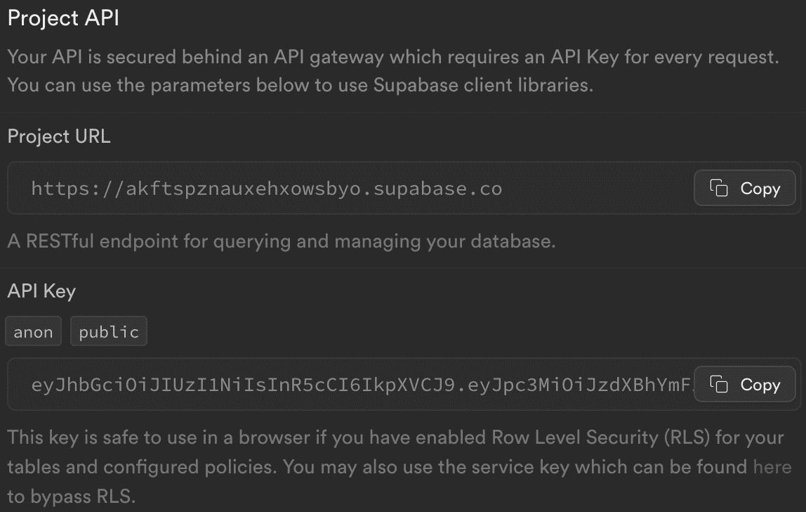
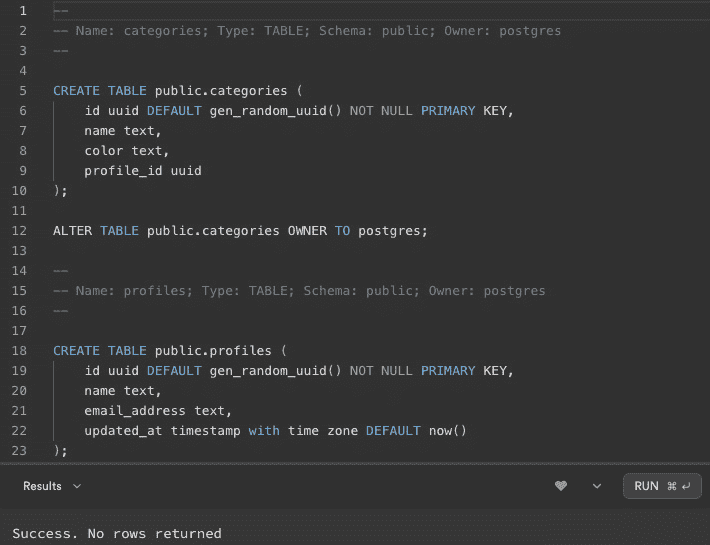
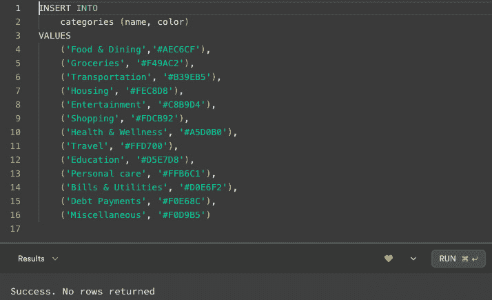
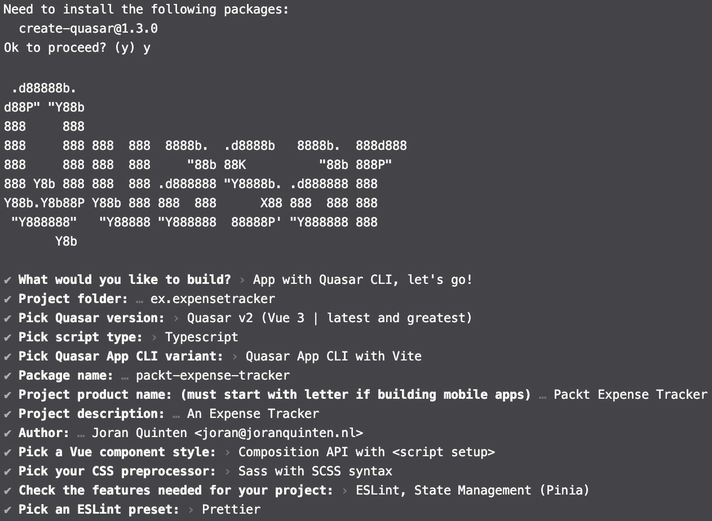
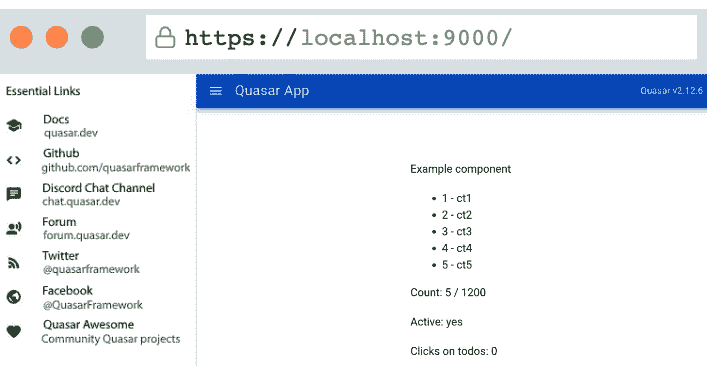
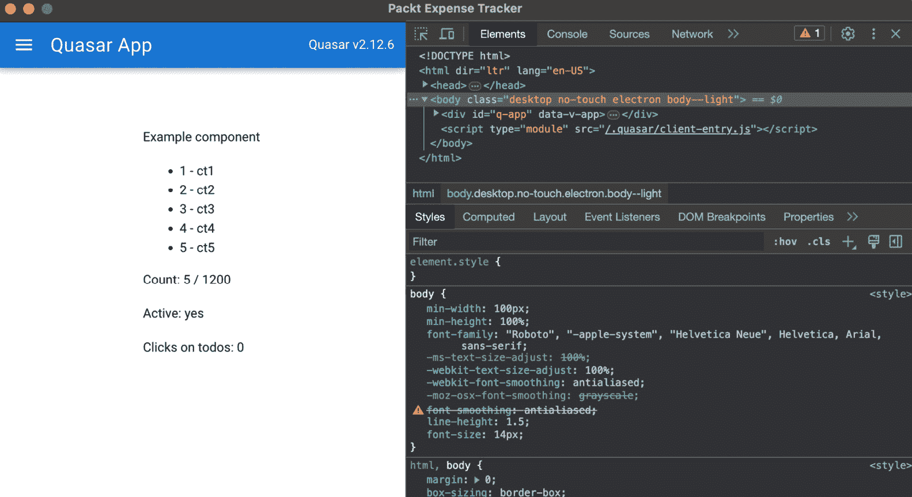
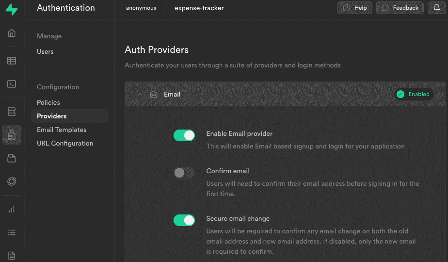
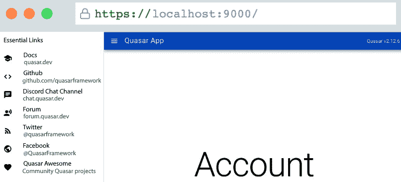
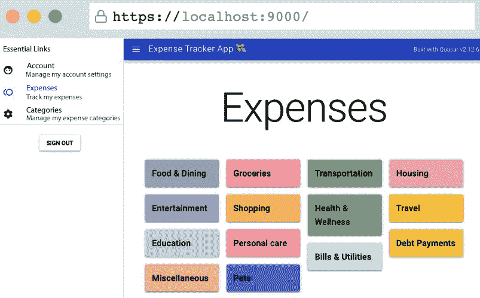

# 第七章：使用 Quasar 构建多平台支出跟踪器

在本章中，我们将迭代我们在*第六章*中涵盖的主题和技术。我们将使用 Vue 构建一个类似的应用程序，并依赖 Supabase 来存储我们的数据。然而，在本章中，我们将专注于构建一个可以部署在除 Web 以外的多个平台上的应用程序。

我们将选择 Quasar ([`quasar.dev/`](https://quasar.dev/))作为我们的首选框架，因为它允许我们选择多种不同的平台。为了简化，我们将专注于创建基于 Electron ([`www.electronjs.org/`](https://www.electronjs.org/))的桌面应用程序。Quasar 和 Electron 都是维护良好的开源项目，拥有优秀的文档和活跃的社区。

在本章中，我们将涵盖以下主题：

+   巩固我们之前学到的知识

+   熟悉不同的框架

+   理解平台无关开发的价值

+   使用 Web 技术构建原生应用

+   学习 Web 和原生之间的关键差异

# 技术要求

在本章中，我们将重用*第六章*中的大部分需求，因为我们将会构建一个具有相似功能的应用程序。这将帮助您了解框架如何影响应用程序的架构。

我们将严重依赖 Quasar ([`quasar.dev/`](https://quasar.dev/))作为我们的基础框架。由于该框架还提供 UI 模式([`quasar.dev/components`](https://quasar.dev/components))，我们在这个项目中不需要 Vuetify。我们将使用 Pinia ([`pinia.vuejs.org/`](https://pinia.vuejs.org/))来处理我们的应用程序状态。为了存储数据，我们将在 Supabase ([`supabase.com/`](https://supabase.com/))中创建一个新的项目，Supabase 是一个具有内置身份验证的开源数据库提供商。对于数据库，我已经准备了一个创建数据库的脚本和另一个添加示例数据的脚本。我们将在*设置数据库*部分中介绍这些步骤。

最终产品位于本书的 GitHub 仓库中，位置为[`github.com/PacktPublishing/Building-Real-world-Web-Applications-with-Vue.js-3/tree/main/07.expenses`](https://github.com/PacktPublishing/Building-Real-world-Web-Applications-with-Vue.js-3/tree/main/07.expenses)。

# 设置数据库

我们将首先满足我们的数据库需求。我们已经有了一个免费账户（见*第六章*）。我们将创建一个名为`expense-tracker`的新项目，设置一个强大的数据库密码，并分配一个地理位置接近的区域。

您将被重定向到一个视图，该视图为您提供**项目 URL**和**API 密钥**详情，如图*图 7.1*所示：



图 7.1 – 我们支出跟踪项目的 API 设置

由于我们的应用程序尚未准备就绪，我们需要将 URL 和 API 密钥记在一个安全的地方，或者一旦我们到达应用程序，简单重访这个页面。

对于这个项目，我准备了一个脚本，用于创建数据库所需的表和设置，称为 `example-structure.sql`。在 Supabase 中打开 SQL 编辑器，然后粘贴并运行脚本的内容：



图 7.2 – 运行 example-structure.sql 脚本后的成功消息

我们的支出跟踪器将能够将支出组织到不同的类别中，因此我还创建了一个脚本，将一组示例类别插入到 `example-categories.sql` 文件中。您可以将内容粘贴到 SQL 编辑器中并运行此文件：



图 7.3 – 运行 example-categories.sql 脚本后的成功消息

现在我们已经设置了数据库，我们可以开始创建一个新的项目。

# 使用 Quasar 构建项目

我们将遵循默认的设置和安装指南，[`quasar.dev/start/quick-start`](https://quasar.dev/start/quick-start)。在 CLI 中，我们将运行 `npm init quasar` 并选择配置，如图 *图 7.4* 所示：



图 7.4 – 使用 Quasar CLI 创建新项目

这将安装项目和其依赖项。一旦初始化完成，我们可以导航到项目文件夹，并通过 CLI 安装 Supabase JavaScript 客户端：

```js
npm install @supabase/supabase-js
```

为了完成初始化，我们将创建一个包含 Supabase API 密钥的 `.env` 文件：

```js
VITE_SUPABASE_URL=YOUR_SUPABASE_URLVITE_SUPABASE_ANON_KEY=YOUR_SUPABASE_ANON_KEY
```

我们可以通过在命令行中运行以下命令来验证我们的安装：

```js
npx quasar dev
```

示例项目将被安装，如图 *图 7.5* 所示：



图 7.5 – 使用 Quasar 的默认项目

由于我们的目标是开发桌面应用程序，我们可以轻松运行该环境的开发命令：

```js
npx quasar dev -m electron
```

第一次运行此命令时，需要安装一些依赖项以运行环境。这将产生类似于以下输出的结果：



图 7.6 – 在 Electron 开发模式下运行 Quasar

看看如何轻松地针对不同的环境？当然，Electron 非常接近我们的浏览器环境，因此它的行为将非常相似。我们将使用浏览器开发和调试我们的应用程序。在几乎所有情况下，我们可以依赖这个框架将我们的代码交付和编译到特定的平台。

针对 Android 或 iOS 的开发稍微复杂一些。它将使用 Capacitor 来构建一个类似原生的壳，作为操作系统和应用程序之间的代理。如果你对移动部署感兴趣，我强烈建议参考 Quasar 指南：[`quasar.dev/quasar-cli-vite/developing-capacitor-apps/introduction`](https://quasar.dev/quasar-cli-vite/developing-capacitor-apps/introduction)。

当我们的应用程序在网页和 Electron 上运行时，我们就有了构建支出跟踪器的起点！

注意

我们使用 Quasar 作为框架是因为它具有捆绑和构建功能，但 Quasar 还提供了一组丰富的可重用 Vue 组件（[`quasar.dev/components`](https://quasar.dev/components)）。在我们的示例代码中，你将能够通过组件名称中的 *q-* 前缀来识别它们。我们不会深入探讨组件的工作原理，所以我将向您推荐官方（且非常好）的文档，您可以在 [`quasar.dev/docs`](https://quasar.dev/docs) 和 [`quasar.dev/components`](https://quasar.dev/components) 找到。

让我们看看如何将我们的 Supabase 实例与前端应用程序连接，怎么样？

# 使用 Supabase 和 Quasar 进行身份验证

拥有一个应用程序而不是一个网站意味着外部超链接，例如通过 Supabase 的 OTP 登录方法，将无法直接使用。处理这些问题对于本章来说有点过于高级，所以我们选择通过电子邮件和密码进行登录。为了使 Supabase 和我们的 Quasar 应用程序很好地集成，我将我们的实现大致基于以下在线资源：[`dev.to/tvogel/getting-started-with-supabase-and-quasar-v2-kdo`](https://dev.to/tvogel/getting-started-with-supabase-and-quasar-v2-kdo)。

`src/boot` 文件夹用于在初始化 Vue.js 应用程序之前需要执行的脚本（[`quasar.dev/quasar-cli-vite/boot-files/`](https://quasar.dev/quasar-cli-vite/boot-files/)）。在我们的情况下，我们需要利用启动文件，因为我们希望在更改路由之前执行逻辑，以查看用户是否有权限。这意味着我们需要在执行应用程序主脚本之前，在脚本中处理我们的身份验证和 Supabase 客户端。

首先，我们将创建一个 `src/boot/supabase.ts` 文件，其中包含以下文件的內容：[`github.com/PacktPublishing/Building-Real-world-Web-Applications-with-Vue.js-3/blob/main/07.expenses/.notes/7.1-supabase.ts`](https://github.com/PacktPublishing/Building-Real-world-Web-Applications-with-Vue.js-3/blob/main/07.expenses/.notes/7.1-supabase.ts)。

我们还将使用 `router-auth.ts` 文件，并将其放置在同一个文件夹中：[`github.com/PacktPublishing/Building-Real-world-Web-Applications-with-Vue.js-3/blob/main/07.expenses/.notes/7.2-router-auth.ts`](https://github.com/PacktPublishing/Building-Real-world-Web-Applications-with-Vue.js-3/blob/main/07.expenses/.notes/7.2-router-auth.ts)。

我们可以通过在`boot`属性中引用文件来将这些脚本添加到我们的`quasar.config.js`文件中，这样它看起来就会像这样：

```js
// ...abbreviatedboot: ['supabase', 'router-auth'],
// …abbreviated
```

上述配置告诉我们的应用程序在初始化（或启动）应用程序之前运行给定的脚本。

在我们的基本启动脚本就绪后，我们可以查看我们的路由。

## 路由和应用程序结构

现在，我们将添加一些路由，以便我们可以构建我们的应用程序并将`router-auth`脚本应用于正确的路由。让我们从`src/pages`文件夹中删除所有文件，除了`ErrorNotFound.vue`页面。我们将添加以下具有相同结构的页面：

+   `AccountPage.vue`

+   `Expenses Page.vue`

+   `CategoriesPage.vue`

使用以下模板，将每个页面的`<h1 class="text-h1">Home</h1>`内容替换为相关标题：

```js
<script setup lang="ts"></script><template>
  <q-page class="column items-center justify-center">
    <h1 class="text-h1">Home</h1>
  </q-page>
</template>
```

我们将在*管理类别*和*显示支出和概览*部分构建每个功能的实现。但在开始之前，我们需要将身份验证集成到我们的路由中。

首先，让我们看看`src/router/index.ts`文件：[`github.com/PacktPublishing/Building-Real-world-Web-Applications-with-Vue.js-3/blob/main/07.expenses/.notes/7.3-router-index.ts`](https://github.com/PacktPublishing/Building-Real-world-Web-Applications-with-Vue.js-3/blob/main/07.expenses/.notes/7.3-router-index.ts)。

我们将进行两项更改：我们将导入 Supabase 启动脚本中的`init`函数（*第 11 行*）并在路由函数中执行该函数（*第 23 行*）。我们现在可以定义通向我们已创建的页面的路由。

让我们看看`routes.ts`文件：[`github.com/PacktPublishing/Building-Real-world-Web-Applications-with-Vue.js-3/blob/main/07.expenses/.notes/7.4-routes.ts`](https://github.com/PacktPublishing/Building-Real-world-Web-Applications-with-Vue.js-3/blob/main/07.expenses/.notes/7.4-routes.ts)。

文件包含熟悉的代码，但略有不同——对于需要用户登录的每个路由，我们都添加了一个`meta`字段：

```js
    meta: {      requiresAuth: true,
    },
```

此外，`/auth`路由（*第 29-31 行*）是不同的：它不依赖于布局，而是直接导入组件。这是因为该路由将是未认证用户的程序入口点。

现在，如果我们查看我们的`src/boot/router-auth.ts`文件，我们将看到在每次路由更改之前，我们都会检查该元字段是否存在，然后验证用户`session`是否存在。如果不存在，我们将用户重定向到`fullPath`属性，这相当于主页。

是时候通过构建应用程序的注册和登录功能来将这些功能付诸实践了。

### 注册和登录

让我们努力为用户提供一种注册和登录我们应用的方法。在我们的组件文件夹中，我们将创建一个名为`FormLogin.vue`的登录表单：[`github.com/PacktPublishing/Building-Real-world-Web-Applications-with-Vue.js-3/blob/main/07.expenses/.notes/7.5-FormLogin.vue`](https://github.com/PacktPublishing/Building-Real-world-Web-Applications-with-Vue.js-3/blob/main/07.expenses/.notes/7.5-FormLogin.vue).

我们还将创建一个（非常相似）的用于注册的文件，名为`FormSignUp.vue`：[`github.com/PacktPublishing/Building-Real-world-Web-Applications-with-Vue.js-3/blob/main/07.expenses/.notes/7.6-FormSignUp.vue`](https://github.com/PacktPublishing/Building-Real-world-Web-Applications-with-Vue.js-3/blob/main/07.expenses/.notes/7.6-FormSignUp.vue).

两种形式之间的关键区别是我们所使用的提交方法，即`supabase.auth.signInWithPassword`或`supabase.auth.signUp`方法。我们在这里并不感兴趣于抽象化任何东西。试图过度优化可能重复的每一件事并不总是最佳方案。在这种情况下，我们更倾向于可读性和简洁性，而不是两个文件之间相似的代码。

让我们在一个新创建的`AuthPage.vue`页面上整合这两个表单：

```js
<script setup lang="ts">import { ref } from 'vue';
import type { Ref } from 'vue';
import FormLogin from 'src/components/FormLogin.vue';
import FormSignUp from 'src/components/FormSignUp.vue';
const tab: Ref<'login' | 'sign-up'> = ref('login');
</script>
<template>
  <div class="column items-center justify-center">
    <h1 class="text-h2">Home</h1>
    <q-card class="column">
      <q-tabs
        v-model="tab"
        active-color="primary"
        indicator-color="primary"
        align="justify"
        narrow-indicator
      >
        <q-tab name="login" label="Log in" />
        <q-tab name="sign-up" label="Sign up" />
      </q-tabs>
      <q-separator />
      <q-tab-panels v-model="tab" animated>
        <q-tab-panel name="login">
          <FormLogin />
        </q-tab-panel>
        <q-tab-panel name="sign-up">
          <FormSignUp />
        </q-tab-panel>
      </q-tab-panels>
    </q-card>
  </div>
</template>
```

在前面的代码中，我们使用了 Quasar 的`tab`组件在页面上提供两个表单。现在我们应该能够注册新账户。然而，有一个小问题。

Supabase 的默认设置要求我们在注册时确认电子邮件地址。为了简化起见，我们需要禁用此功能。登录您的 Supabase 仪表板，导航到**身份验证** | **提供者**，然后展开**电子邮件**面板。在那里，我们需要禁用**确认电子邮件**选项，如图*图 7.7*所示：



图 7.7 – 在 Supabase 中禁用确认电子邮件选项

保存此设置后，我们可以注册为新用户。您可以保持 Supabase 仪表板打开，并导航到**个人资料**以验证您新创建的账户！



图 7.8 – 网页视图中的初始登录状态

在网络应用中，我们将被重定向到（大部分为空的）**账户**页面，如图*图 7.8*所示。现在我们正在取得进展。

首先，我们将稍微修改现有的`src/components/EssentialLink.vue`组件：[`github.com/PacktPublishing/Building-Real-world-Web-Applications-with-Vue.js-3/blob/main/07.expenses/.notes/7.7-EssentialLink.vue`](https://github.com/PacktPublishing/Building-Real-world-Web-Applications-with-Vue.js-3/blob/main/07.expenses/.notes/7.7-EssentialLink.vue).

我们正在用路由链接集成替换链接。`<q-item />` 组件提供了支持，因此我们可以直接将其用作路由链接实体！让我们打开 `layouts/MainLayout.vue`，以便我们可以更改适用于我们用例的默认布局。你可以按任何你喜欢的样子修改标题，但让我们专注于 `essentialLinks` 常量，以反映我们创建并希望在 **菜单** 中显示的页面。我们将用以下内容替换它：

```js
const essentialLinks: EssentialLinkProps[] = [  {
    title: 'Account',
    caption: 'Manage my account settings',
    icon: 'face',
    link: '/',
  },
  {
    title: 'Expenses',
    caption: 'Track my expenses',
    icon: 'toll',
    link: '/expenses',
  },
  {
    title: 'Categories',
    caption: 'Manage my expense categories',
    icon: 'settings',
    link: '/categories',
  },
];
```

当然，你可以在保存更改后立即在应用中看到这些变化！

我们还没有允许用户在应用中注销会话。在下一节中，我们将确保用户也可以注销。

### 注销

让我们添加一个注销按钮。我们将在 `components` 文件夹中创建一个名为 `ButtonSignOut.vue` 的独立组件：

```js
<script setup lang="ts">import { supabase } from 'src/boot/supabase';
import { useRouter } from 'vue-router';
const router = useRouter();
const signOut = async (): Promise<void> => {
  try {
    const { error } = await supabase.auth.signOut();
    if (error) {
      throw new Error('Logout failed');
    }
  } catch (error) {
    console.error(error.message);
  } finally {
    router.go(0);
  }
};
</script>
<template>
  <q-btn @click="signOut()">Sign out</q-btn>
</template>
```

我们再次调用 Supabase 的注销方法，并指示路由器转到其历史表中的第一个条目。

现在，我们可以切换回 `MainLayout.vue`：[`github.com/PacktPublishing/Building-Real-world-Web-Applications-with-Vue.js-3/blob/main/07.expenses/.notes/7.8-MainLayout.vue`](https://github.com/PacktPublishing/Building-Real-world-Web-Applications-with-Vue.js-3/blob/main/07.expenses/.notes/7.8-MainLayout.vue)。

如果我们查看 `<q-drawer>` 组件的内容 (*第 20-39 行*)，我们将看到添加了一个注销按钮 (*第 29-32 行，第 48 行*)。你可以自由地将注销按钮添加到，比如说，**账户**页面。

注意

由于我们正在创建新文件以及修改现有的启动文件，我们的应用中存在混合的编码风格。有时代码块在模板之前，有时则相反。对于我们的当前实现，这并不成问题，尽管在协作或处理大型项目时，强烈建议使用一致的编码风格并严格遵守。

到目前为止，我们已经为以用户为中心的应用创建了基本功能：注册、登录和注销。我们还使用路由将授权应用于我们应用的各个部分。现在，我们将专注于向应用添加特定功能，例如费用跟踪。

## 费用跟踪功能

跟踪我们未来费用的一个重要部分是能够将它们组织到不同的类别中。我们将首先在我们的应用中添加一个 Pinia 存储来处理类别数据。这与我们在 *第六章* 中完成的练习非常相似。让我们创建一个 `src/store/categories.ts` 文件：[`github.com/PacktPublishing/Building-Real-world-Web-Applications-with-Vue.js-3/blob/main/07.expenses/.notes/7.9-categories.ts`](https://github.com/PacktPublishing/Building-Real-world-Web-Applications-with-Vue.js-3/blob/main/07.expenses/.notes/7.9-categories.ts)。

如你所见，我们正在使用 `boot` 脚本中的 `session` 和 `supabase` 脚本来与已登录用户会话和数据库连接交互。

为了显示类别，我们将在组件文件夹中创建一个名为 `CategoryList.vue` 的组件：[`github.com/PacktPublishing/Building-Real-world-Web-Applications-with-Vue.js-3/blob/main/07.expenses/.notes/7.10-CategoryList.vue`](https://github.com/PacktPublishing/Building-Real-world-Web-Applications-with-Vue.js-3/blob/main/07.expenses/.notes/7.10-CategoryList.vue).

除了显示类别外，`removeOwnCategory` 函数（*第 29-39 行*）允许用户删除他们自己添加的类别。所有操作都是通过我们创建的存储进行分发的。

在下一节中，我们将创建一些功能，让我们的用户能够为自己管理类别，从而使应用更加个性化。

## 管理类别

拥有删除类别的功能意味着我们必须构建一个组件来添加自定义类别。因此，我们将创建一个新的组件，名为 `CategoryAdd.vue`：[`github.com/PacktPublishing/Building-Real-world-Web-Applications-with-Vue.js-3/blob/main/07.expenses/.notes/7.11-CategoryAdd.vue`](https://github.com/PacktPublishing/Building-Real-world-Web-Applications-with-Vue.js-3/blob/main/07.expenses/.notes/7.11-CategoryAdd.vue).

这暴露了一个与切换对话框中小表单的切换相关联的粘性**浮动操作按钮**（**FAB**），该表单接受名称和颜色输入，并使用用户的配置文件 ID 在数据库中更新条目。这是另一个组件的例子，它具有明确的目的，并且包含在一个文件中。这就是我们构建复杂应用的方式！

具备添加个人类别的功能意味着我们可以将个人类别与默认类别一起显示。

为了完成类别功能，我们将导入我们刚刚创建的两个组件，并在 `CategoriesPage.vue` 上列出它们：

```js
<script setup lang="ts">import CategoryList from 'src/components/CategoryList.vue';
import CategoryAdd from 'src/components/CategoryAdd.vue';
</script>
<template>
  <q-page class="column items-center justify-center">
    <h1 class="text-h1">Categories</h1>
    <category-list />
    <category-add />
  </q-page>
</template>
```

在我们的类别就绪后，我们可以通过公开添加费用的功能来最终确定应用！

## 添加费用

为了添加费用，我们将首先创建一个 Pinia 存储。该存储将包含我们用户的费用概览，并有一些用于检索和添加费用的方法。让我们创建一个 `src/store/expenses.ts` 文件：[`github.com/PacktPublishing/Building-Real-world-Web-Applications-with-Vue.js-3/blob/main/07.expenses/.notes/7.12-expenses.ts`](https://github.com/PacktPublishing/Building-Real-world-Web-Applications-with-Vue.js-3/blob/main/07.expenses/.notes/7.12-expenses.ts).

我们应用最重要的功能是其跟踪费用的能力！有了我们的存储，我们可以创建一个专门用于此的组件，名为 `src/components/ExpenseAdd.vue`：[`github.com/PacktPublishing/Building-Real-world-Web-Applications-with-Vue.js-3/blob/main/07.expenses/.notes/7.13-ExpenseAdd.vue`](https://github.com/PacktPublishing/Building-Real-world-Web-Applications-with-Vue.js-3/blob/main/07.expenses/.notes/7.13-ExpenseAdd.vue).

如你所见，这个组件与添加类别有很多相似之处，尽管这个表单依赖于 Vuetify Select 组件中存在类别。两者都是 FAB 组件，用于切换对话框以方便此功能。

我们可以将新的`ExpenseAdd`组件添加到`ExpensesPage.vue`中，如下所示：

```js
<script setup lang="ts">import ExpenseAdd from 'src/components/ExpenseAdd.vue';
</script>
<template>
  <q-page class="column items-center justify-center">
    <h1 class="text-h1">Expenses</h1>
<expense-add />
  </q-page>
</template>
```

现在，你应该能够添加支出。你可以通过查看 Supabase 仪表板中的表格来验证这一点。对于我们的用户，我们将在应用中开始创建视图，所以那将是我们的下一步！

## 展示支出和概览

在`src/components`文件夹中，我们将创建一个`CategoryOverview.vue`组件，该组件将把数据库中的类别和支出聚合到一个组合视图中：[`github.com/PacktPublishing/Building-Real-world-Web-Applications-with-Vue.js-3/blob/main/07.expenses/.notes/7.14-CategoryOverview.vue`](https://github.com/PacktPublishing/Building-Real-world-Web-Applications-with-Vue.js-3/blob/main/07.expenses/.notes/7.14-CategoryOverview.vue)。

与类别概览类似，我们还有一个类别的概览，但这个概览的布局略有不同。这将作为我们的新起点。让我们通过添加`CategoryOverview`组件来最终确定`ExpensesPage.vue`：

```js
<script setup lang="ts">import ExpenseAdd from 'src/components/ExpenseAdd.vue';
import CategoryOverview from 'src/components/CategoryOverview.vue';
</script>
<template>
  <q-page class="column items-center justify-center">
    <h1 class="text-h1">Expenses</h1>
    <expense-add />
    <category-overview />
  </q-page>
</template>
```

如果你运行你的应用并导航到**支出**页面，你应该能看到以下类似的内容：



图 7.9 – 支出页面的第一个概览

为了给这个页面增加价值，我们需要开始在这里展示我们的支出。我们可以在组件文件夹中创建一个特定的组件来完成这个任务，我们可以将其命名为`ExpensesCategoryTotal.vue`：

```js
<script setup lang="ts">import { computed } from 'vue';
import { useExpensesStore } from 'src/stores/expenses';
import { storeToRefs } from 'pinia';
import { Expense } from 'src/types/expenses';
const expensesStore = useExpensesStore();
const { expenses } = storeToRefs(expensesStore);
interface Props {
  categoryId: string;
}
const props = defineProps<Props>();
const totalPerCategory = computed(() => {
  return expenses.value.reduce((total: number, expense: Expense): number => {
    if (expense.category_id === props.categoryId) {
      return total + expense.amount;
    }
    return total;
  }, 0);
});
</script>
<template>
  <q-card-section  align="right"> Total: {{ totalPerCategory }} </q-card-section>
</template>
```

这是一个我们可以提供类别 ID 的组件，它将抓取并汇总该类别的所有`amount`值作为该类别的总金额。一旦我们完成这个任务，我们就可以轻松地将`ExpensesCategoryTotal`组件添加到我们的类别概览中：

```js
<script setup lang="ts">// …abbreviated
import ExpensesCategoryTotal from './ExpensesCategoryTotal.vue';
// …abbreviated
</script>
  <div class="masonry">
    <!-- abbreviated -->
        <q-card
          clickable
          class="q-ma-sm"
          :style="{ backgroundColor: category.color }"
        >
          <q-card-section>
            <div class="text-h6">{{ category.name }}</div>
          </q-card-section>
          <expenses-category-total :category-id="category.id" />
        </q-card>
    <!-- abbreviated -->
</template>
```

根据你插入的支出，你现在将看到我们创建的拼贴概览中每个类别的总支出概览。我们几乎完成了！

如果用户能够对他们的支出有更多的了解，那就太好了？所以，让我们在某个特定类别中添加一个更详细的支出概览。幸运的是，在我们的商店中，已经暴露了按类别查询数据库的功能。这是一个额外的对 Supabase 的调用，所以我们想要对额外的请求保持一定的谨慎，这意味着我们只有在请求时才会加载数据。

让我们从添加处理请求并将数据存储在`CategoryOverview.vue`文件中的脚本开始：

```js
<script setup lang="ts">// ...abbreviated
import type { ExpenseWithCategory } from 'src/types/expenses';
// ...abbreviated
const loading: Ref<boolean> = ref(true);
const showDialog: Ref<boolean> = ref(false);
const selectedCategoryName: Ref<string | undefined> = ref(undefined);
const expensesByCategoryId: Ref<ExpenseWithCategory[] | undefined> = ref([]);
onMounted(async () => {
  // ...abbreviated
});
const getExpensesByCategoryId = async (
  categoryName: string,
  categoryId: string
) => {
  selectedCategoryName.value = categoryName;
  const expenses = await expensesStore.getExpensesByCategory(categoryId);
  if (expenses && expenses.length > 0) {
    expensesByCategoryId.value = expenses;
    showDialog.value = true;
  }
};
const getCategories = async () => {
// ...abbreviated
};
</script>
```

现在，在模板中，当点击一个拼贴时，我们将调用`getExpensesByCategoryId`。所以，让我们修改`<q-card>`并添加一个`onClick`事件：

```js
        <q-card          class="q-ma-sm"
          :style="{ backgroundColor: category.color }"
@click="getExpensesByCategoryId(category.name, category.id)"
        >
          <q-card-section>
            <div class="text-h6">{{ category.name }}</div>
          </q-card-section>
          <expenses-category-total :category-id="category.id" />
        </q-card>
```

接下来，作为马赛克风格元素的兄弟元素，我们将添加对话框标记来显示所选类别的支出：

```js
<template>  <div class="masonry">
    <!-- ...abbreviated –->
  </div>
  <q-dialog v-model=»showDialog»>
    <q-card v-if="expensesByCategoryId && expensesByCategoryId.length > 0">
      <q-card-section>
        <div class="text-h6">
          {{ `${selectedCategoryName} expenses overview` }}
        </div>
      </q-card-section>
      <q-separator />
      <q-card-section style="max-height: 50vh" class="scroll">
        {{ expensesByCategoryId }}
      </q-card-section>
    </q-card>
  </q-dialog>
</template>
```

我们需要将给定的费用集合输入到一个新的组件中。这将是我们完成应用程序前的最后一个组件！

在`components`文件夹中，我们将创建一个`ExpensesList.vue`组件，并让它接收`expenses`作为属性：

```js
<script setup lang="ts">interface Props {
  expenses: {
    id: string;
    description: string;
    amount: number;
    created_at: Date;
  }[];
}
const props = defineProps<Props>();
const formatDate = (date: Date) => {
  const dateObj = new Date(date);
  return dateObj.toLocaleDateString();
};
</script>
<template>
  <q-list dense class="expenses" v-if="expenses">
    <q-item v-for="expense in expenses" :key="expense.id">
      <q-item-section>
        <q-card-section class="flex row justify-between">
          <div>{{ expense.description }}</div>
          <div>{{ expense.amount }}</div>
          <div>{{ formatDate(expense.created_at) }}</div>
        </q-card-section>
      </q-item-section>
    </q-item>
  </q-list>
</template>
<style scoped>
.expenses {
  min-width: 400px;
  max-width: 80vw;
}
</style>
```

现在，我们可以通过导入`ExpensesList`组件并使用该列表组件而不是渲染原始数据，将费用的详细信息与`CategoryOverview.vue`一起包装起来：

```js
<script setup lang="ts">// ...abbreviated
import ExpensesCategoryTotal from './ExpensesCategoryTotal.vue';
import ExpensesList from './ExpensesList.vue';
// ...abbreviated
</script>
<template>
  <div class="masonry">
    <!-- ...abbreviated -->
  </div>
  <q-dialog v-model="showDialog">
    <q-card v-if="expensesByCategoryId && expensesByCategoryId.length > 0">
      <q-card-section>
        <div class="text-h6">
          {{ `${selectedCategoryName} expenses overview` }}
        </div>
      </q-card-section>
      <q-separator />
      <q-card-section style="max-height: 50vh" class="scroll">
        <expenses-list :expenses="expensesByCategoryId" />
      </q-card-section>
    </q-card>
  </q-dialog>
</template>
<style lang="scss" scoped>
// ...abbreviated
</style>
```

到目前为止，我们有一个应用程序，用户可以管理类别并添加费用，这些费用在概览中显示。

以此为基础，如果你喜欢，尝试自己扩展应用程序的不同功能将是一个很好的练习。你将如何添加日期过滤器到费用中？你将在哪个级别引入它们，它们将影响什么？或者，关于删除费用呢？

在下一节中，我们将把我们的 Web 应用程序转换为桌面应用程序。代码中的每次改进都可以进行转换，所以请随意继续并稍后添加一些新功能！

# 使用 Quasar CLI 构建应用程序

Quasar CLI 提供了一些命令，可以快速构建和发布 Electron 应用程序。重要的是要意识到，在这个阶段，默认构建脚本的输出默认只支持你的当前操作系统和架构！这是一个测试应用程序的好方法，让我们看看会发生什么。我们可以在终端中运行以下命令来生成我们的应用程序代码：

```js
quasar build -m electron
```

这将比启动开发服务器需要更长的时间来处理：首先，Quasar 为 Web 构建文件，然后使用这些生产就绪的代码与 Electron 编译一个原生应用程序。一旦处理完成，你可以在项目的`/dist/electron`文件夹中找到构建输出文件。现在你也应该能够执行你的应用程序了！

接下来，我们将通过创建和提供我们自定义的应用程序图标来改进应用程序的视觉识别。

## 自定义图标

在任何应用程序中，图标的重要性不亚于其名称。对于我们的 Web 应用程序，我们已经省略了这一部分，因为有很多资源可以帮助添加网站上的收藏图标。然而，对于我们的桌面应用程序，我们将重新创建添加图标的步骤。

我从`src/assets`文件夹下载了一个合适的图标。Quasar 提供了一个名为`npx`的小工具。我们可以使用以下命令生成图标集：

```js
npx icongenie generate -m electron -i ./src/assets/icon.png
```

如果`npx`命令不起作用，你可以尝试使用以下终端命令全局安装 node 包：

```js
npm i -g @quasar/icongenie
```

一旦全局安装完成，你可以在项目的文件夹中运行包，如下所示：

```js
icongenie generate -m electron -i ./src/assets/icon.png
```

一旦脚本完成，你将在`src-electron/icons`文件夹中找到输出。这就是全部内容！

我们默认的输出仅适用于我们正在开发的平台。我们感兴趣的是为不同的平台构建。我们将在下一节中了解那些选项。

## 为不同目标打包

默认情况下，Quasar 在幕后使用 **Electron Packager** ([`electron.github.io/electron-packager/main/`](https://electron.github.io/electron-packager/main/)) 为你创建包。你也可以将其更改为 **Electron Builder** ([`www.electron.build/index.html`](https://www.electron.build/index.html))，但在这个例子中，我们将使用默认设置。

如果你打开 `quasar.config.js` 文件，你可以滚动到 `electron` 属性：

```js
// ...abbreviated  electron: {
      // extendElectronMainConf (esbuildConf)
      // extendElectronPreloadConf (esbuildConf)
      inspectPort: 5858,
      bundler: 'packager', // 'packager' or 'builder'
      packager: {
        // https://github.com/electron-userland/electron-packager/blob/master/docs/api.md#options
        // OS X / Mac App Store
        // appBundleId: '',
        // appCategoryType: '',
        // osxSign: '',
        // protocol: 'myapp://path',
        // Windows only
        // win32metadata: { ... }
      builder: {
        // https://www.electron.build/configuration/configuration
        appId: 'packt-expense-tracker',
      },
    },
// ...abbreviated
```

这是默认设置。由于我们处理的是 Electron 打包器，我们的配置放在 `packager` 属性中。为了构建额外的平台，我们可以添加我们想要构建的目标平台作为属性（如指南中所述，见[`electron.github.io/electron-packager/main/modules/electronpackager.html#officialplatform`](https://electron.github.io/electron-packager/main/modules/electronpackager.html#officialplatform))，并且对于每个属性，我们可以添加额外的配置。我们将使用配置属性和默认预设来针对每个平台的目标架构。以下配置将尝试为 macOS (Darwin)、Linux 和 Windows (Win32) 构建应用程序，并作为示例指定特定的架构：

```js
electron: {  inspectPort: 5858,
  bundler: 'packager', // 'packager' or 'builder'
  packager: {
    platform: ['darwin', 'linux', 'win32'],
    darwin: {
      arch: ['x64'],
    },
    linux: {
      arch: ['x64', 'arm64'],
    },
    win32: {
       arch: ['x64'],
    },
  },
  // ...abbreviated
},
```

现在，有一些注意事项。如果我在 Mac 或 Linux 机器上运行前面的代码，我需要安装一个 Windows 模拟器来为该平台构建。好消息是，如果你运行 **HomeBrew** ([`brew.sh/`](https://brew.sh/))，你可以使用以下命令轻松安装 **Wine**：

```js
brew install --cask wine-stable
```

Quasar CLI 为你提供这些指令。对于非 macOS 用户，你构建的应用程序将是未签名的。这意味着用户需要手动接受门卫安全警告。它也将无法发布到应用商店。

在原生应用程序开发方面，Quasar 和 Electron 提供的灵活性仍然是一种非常可行的交付需要在多个平台上运行的应用程序的方式。此外，请注意，这些应用程序可能不如专门为特定平台开发的应用程序性能出色。开发往往涉及权衡。然而，能够开发和将网络应用程序交付到原生平台是非常有用的。

记住，我们应用的基础是一个带有 `-m spa` 的 `-m electron` 标志。它将打包并构建我们的应用程序，使其准备好在网络上运行。

# 摘要

在这一章中，我们解锁了一个强大的功能：我们从一个在 *第六章* 中学到的内容开始，构建了一个网络应用程序。使用 Quasar 的可用功能，我们处理了我们的代码，并将我们的网络应用程序作为适合多个平台的独立桌面应用程序部署。

我们还采用了另一个框架来构建应用。我们不是使用 Vuetify，而是依赖 Quasar 提供的默认组件。这样，我们在构建应用时看到了并体验到了代码风格上的细微差异，使用框架和构建工具。我们也体验到了相似之处，例如，在 Pinia 作为集中式存储的使用上。

这种应用构建方式并不总是最合适的。存在一些限制和权衡。优点在于，你只需构建一个应用，就可以部署到多个目标。这种开发方法的成本效益使其成为多平台策略的严肃候选人。

在下一章中，我们将做一些有趣的事情。我们将连接多个设备到单个服务器，并构建一个实时问答游戏！

# 第三部分：高级应用

这一部分的书籍涵盖了复杂的使用案例，你将学习如何将复杂性分解为单个部分并相应地分配责任。此外，你还将了解使用 Vue.Js 作为前端框架与采用如 Nuxt 这样的元框架来构建服务器端应用之间的区别及其用例。

此外，你还将通过原型设计、构建和迭代实验性框架和解决方案来体验调查的过程。

这一部分包含以下章节：

+   *第八章*，*构建交互式问答应用*

+   *第九章*，*使用 TensorFlow 进行实验性物体识别*
