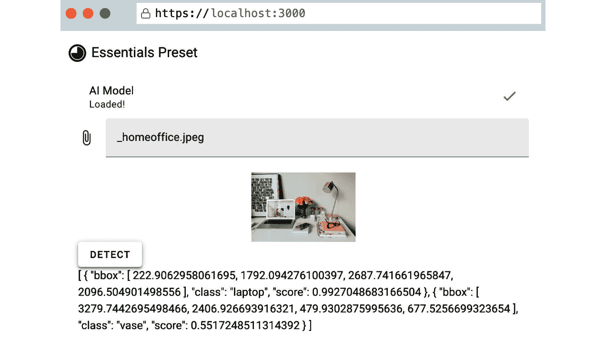
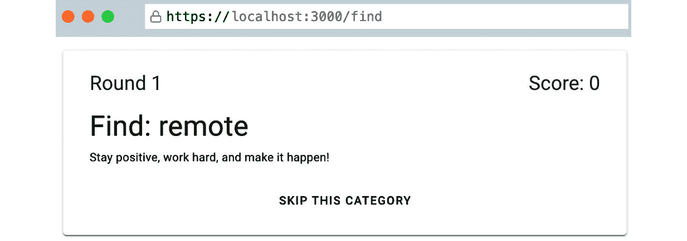
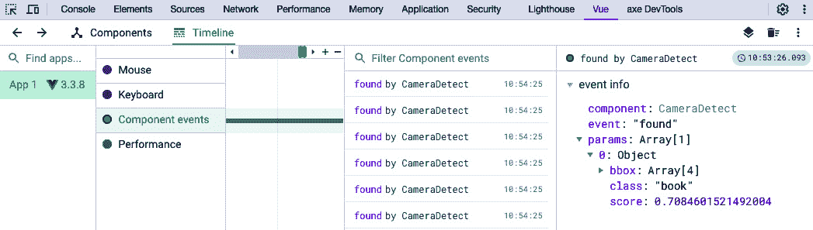

# 第九章：使用 TensorFlow 进行实验性物体识别

是时候做一些更实验性的东西了。正如我们所见，**人工智能**（**AI**）在编写由 AI 辅助的代码以及构建由 AI 驱动的解决方案时提供了许多新的探索机会。在本章中，我们将探讨**TensorFlow**。Google 在开源许可下开发和发布了 TensorFlow。它使开发者能够使用和训练适用于不同应用的机器学习模型。你可以在 TensorFlow 网站上找到精选的演示列表：[`www.tensorflow.org/js/demos`](https://www.tensorflow.org/js/demos)。

我们将利用 Google 发布的默认物体识别模型，应用库中的一个小部分。

首先，我们将构建一个小型的示例原型来发现一些功能。然后，我们将应用我们新获得的知识来构建一些实验性和有趣的东西。这是一个游戏，你需要使用浏览器中的摄像头追踪现实生活中的物体！

在本章中，我们将涵盖以下主题：

+   通过原型设计来识别功能和限制

+   利用多个外部 API 构建多媒体应用

+   使用浏览器的原生**摄像头**、**语音合成**和**媒体流**API

我们将要构建的示例与前面的章节有交集，为你提供了定制应用程序以适应个人用例的潜在机会。我挑战你在这里创建一些独特的东西，基于最终的代码解决方案——也许甚至是一个使用你在*第七章*中学到的 Quasar 知识构建的原生应用！

# 技术要求

我们将在**Vuetify**框架（[`vuetifyjs.com/en/`](https://vuetifyjs.com/en/)）和**Pinia**（[`pinia.vuejs.org/`](https://pinia.vuejs.org/)）上构建主要应用来管理状态。如前所述，我们将利用各种**TensorFlow**库（[`www.tensorflow.org/js/`](https://www.tensorflow.org/js/)）将一些智能融入我们的应用。

你可以在这里找到本章的完整代码：[`github.com/PacktPublishing/Building-Real-world-Web-Applications-with-Vue.js-3/tree/main/09.tensorflow.`](https://github.com/PacktPublishing/Building-Real-world-Web-Applications-with-Vue.js-3/tree/main/09.tensorflow )

让我们从原型应用开始吧！

# TensorFlow 简介

当我需要研究一个新的框架或技术时，我发现创建一个小型应用来测试它非常有帮助，这样我就可以在完全隔离的环境中测试它。我们将以 TensorFlow 应用同样的方法。原始的想法是，我们使用物体识别库（[`github.com/tensorflow/tfjs-models/tree/master/coco-ssd`](https://github.com/tensorflow/tfjs-models/tree/master/coco-ssd)）并应用模型到我们设备上的摄像头图像。

## 设置项目

让我们使用一个熟悉的框架来快速构建我们新项目的样板代码。我们将使用 Vuetify CLI 为我们创建一个新项目：

1.  在命令行界面中运行 `npm create vuetify@3.0.0`。

1.  选择 `vue-tensorflow` 作为项目的名称。

1.  使用 `Essentials (Vuetify, VueRouter, Pinia)` 安装。

1.  使用箭头键选择 `TypeScript`。

1.  选择 `npm` 来安装依赖项。

如果你导航到新的项目文件夹，你可以使用 `npm run dev` 运行本地开发服务器。结果应该对我们来说非常熟悉，因为我们已经做过几次了（见 *第五章*，*图 5**.1*）。

接下来，我们将安装使用 TensorFlow 的依赖项。我们将安装的前两个依赖项将帮助我们获取 CPU 和 WebGL 以帮助算法中的计算。从终端运行以下命令：

```js
npm install @tensorflow/tfjs-backend-cpu @tensorflow/tfjs-backend-webgl
```

我们将使用预训练的模型来帮助我们进行对象识别。**Coco SSD** ([`github.com/tensorflow/tfjs-models/tree/master/coco-ssd`](https://github.com/tensorflow/tfjs-models/tree/master/coco-ssd)) 可以用于识别单张图像中的多个对象。我们可以通过运行以下命令将模型作为我们项目的依赖项安装：

```js
npm install @tensorflow-models/coco-ssd
```

目前我们需要的就这些了！

注意

我们将遇到的一个限制是，预训练的模型是训练来识别有限类别的（类别指的是一个类别中对象的分类）。我们只能访问大约 80 个不同的类别。我们将不得不在这个限制下工作。

为了为未来的发展准备对象识别，我们将创建一个存储库来封装特征。由于我们在安装过程中选择了 Pinia，项目上已经初始化了一个空的存储库。我们将在 `./store` 文件夹中创建一个名为 `objects.ts` 的新文件：[`github.com/PacktPublishing/Building-Real-world-Web-Applications-with-Vue.js-3/blob/main/09.tensorflow/.notes/9.1-object.ts`](https://github.com/PacktPublishing/Building-Real-world-Web-Applications-with-Vue.js-3/blob/main/09.tensorflow/.notes/9.1-object.ts).

我们设置了一些属性来跟踪模型的状态。请注意，模型加载可能需要一些时间，因此我们必须确保通知用户，以便他们有一个良好的用户体验。在存储初始化时，我们必须立即调用 `loadModel()` 函数，该函数在存储中加载模型（*第 14 行，32-39 行*），以便在整个应用程序中方便访问。

我们还添加并公开了一个 `detect` 函数（*第 22-30 行*）。该函数接收一个图像并通过模型运行该图像。结果是包含每个项目确定性的检测到的项目数组。

目前，这已经足够我们开始实施工作了。现在，让我们为我们的原型构建一个界面。

## 执行和显示状态检查

看到应用正在做什么是非常有价值的，尤其是第一次加载模型可能需要一些时间。我们将在`./components`文件夹中创建一个名为`StatusCheck.vue`的组件：

```js
<template>  <v-list>
    <v-list-subheader>Status</v-list-subheader>
    <v-list-item>
      <v-list-item-title
        >AI Model
        <span v-if="isModelLoading">Loading...
          <v-progress-circular indeterminate :size="16" color="primary" />
        </span>
      </v-list-item-title>
      <v-list-item-subtitle v-if="isModelLoaded">Loaded!</v-list-item-subtitle>
      <template v-slot:append v-if="isModelLoaded">
        <v-icon icon="mdi-check" color="success"></v-icon>
      </template>
    </v-list-item>
  </v-list>
</template>
<script setup lang="ts">
import { watch } from "vue";
import { useObjectStore } from "@/store/object";
import { storeToRefs } from "pinia";
const objectStore = useObjectStore();
const { isModelLoading, isModelLoaded } = storeToRefs(objectStore);
const emit = defineEmits(["model-loaded"]);
watch(isModelLoaded, () => {
  if (isModelLoaded.value) emit("model-loaded");
});
</script>
```

此组件只是以良好的格式列出存储中的状态。当模型加载时，它还会发出`model-loaded`事件，这样我们就可以捕捉到该事件。让我们让模型加载状态显示在我们的应用中。我们可以从`./components`文件夹中删除`HelloWorld.vue`文件，并用以下内容替换`./view/Home.vue`的内容：

```js
<template>  <v-container>
    <StatusCheck />
  </v-container>
</template>
<script lang="ts" setup>
import StatusCheck from "@/components/StatusCheck.vue";
</script>
```

现在，我们可以第一次运行我们的应用。你将注意到它最初加载需要一段时间，但过了一段时间后，你应该看到以下类似的内容：


图 9.1 – 可视化模型的状态

现在我们已经加载了模型，我们可以使用它了！我们将构建一个图像上传字段，让模型分析图像的内容。

## 选择图像

我们将首先在`components`文件夹中创建一个新的组件。我们将称之为`ImageDetect.vue`，并从以下内容开始：

```js
<template>  <v-container>
    <StatusCheckSimple @model-loaded="modelLoaded = true" />
    <v-file-input @change="inputFromFile" v-model="image" accept="image/png, image/jpeg" :disabled="!modelLoaded" />
    <v-img :src="img/url" height="100"></v-img>
  </v-container>
</template>
<script setup lang="ts">
import { ref } from "vue";
import type { Ref } from "vue";
import StatusCheckSimple from "./StatusCheck.vue";
const image: Ref<File | any | undefined> = ref(undefined);
const imageToDetect: Ref<HTMLImageElement | undefined> = ref(undefined);
const url: Ref<string | undefined> = ref(undefined);
import { useObjectStore } from "@/store/object";
import { storeToRefs } from "pinia";
const objectStore = useObjectStore();
const { detected } = storeToRefs(objectStore);
const modelLoaded: Ref<boolean> = ref(false);
const inputFromFile = (event: any): void => {
  const file = event.target.files[0];
  image.value = [file];
  imageToDetect.value = dataToImageData(file);
};
const dataToImageData = (dataBlob: Blob | MediaSource): HTMLImageElement => {
  const objUrl = URL.createObjectURL(dataBlob);
  const img = new Image();
  img.onload = () => {
    URL.revokeObjectURL(img.src);
  };
  img.src = objUrl;
  url.value = objUrl;
  return img;
};
</script>
```

如模板所示，我们将一些模板逻辑移动到这个文件中。我们使用`<StatusCheck />`组件和`@model-loaded`事件来确定图像检测控件是否可见或激活。

在脚本中，我们首先设置一些变量，以便跟踪在浏览器中选择的图像。一旦用户更改文件内容，我们就可以在浏览器内存中加载图像，以便在占位符中显示它。

我们将前往`./views/Home.vue`并替换其内容以加载这个新组件：

```js
<template>  <v-container>
    <ImageDetect />
  </v-container>
</template>
<script lang="ts" setup>
import ImageDetect from "@/components/ImageDetect.vue";
</script>
```

现在，我们有一个提供图像的功能，并且我们有一个能够检测图像中对象的存储。让我们通过将存储引用添加到`script`标签并添加一个按钮来触发检测来开始连接它们：[`github.com/PacktPublishing/Building-Real-world-Web-Applications-with-Vue.js-3/blob/main/09.tensorflow/.notes/9.2-ImageDetect.vue`](https://github.com/PacktPublishing/Building-Real-world-Web-Applications-with-Vue.js-3/blob/main/09.tensorflow/.notes/9.2-ImageDetect.vue)。

如第 7 行所示，我们已准备好显示检测到的对象。

注意

在局限性方面，我提到该模型能够识别多个对象。列表可以在以下位置找到：[`github.com/tensorflow/tfjs-models/blob/master/coco-ssd/src/classes.ts`](https://github.com/tensorflow/tfjs-models/blob/master/coco-ssd/src/classes.ts)。

我建议尝试使用人物图像或列出的类别之一来测试这个功能。

应用检测后，你应该得到类似以下内容：



图 9.2 – 基于上传图像的对象识别

这已经很有趣了，但让我们看看我们是否可以应用更多功能。首先，我们将查看如何优雅地格式化结果：[`github.com/PacktPublishing/Building-Real-world-Web-Applications-with-Vue.js-3/blob/main/09.tensorflow/.notes/9.3-ImageDetect.vue`](https://github.com/PacktPublishing/Building-Real-world-Web-Applications-with-Vue.js-3/blob/main/09.tensorflow/.notes/9.3-ImageDetect.vue)。

如*第 12-22 行*所示，我们添加了一个格式良好的检测项目列表。我们使用`roundNumber`函数（*第 18 行，第 65-67 行*）来四舍五入百分比。

让我们探索添加一个附加功能，看看我们是否可以通过探索语音合成 API 来给我们的应用添加语音。

## 为应用添加语音

由于我们正在查看我们应用的非传统输入（使用图像而不是鼠标和键盘），探索不同的信息呈现方式也很有趣。现代浏览器内置了一个将**文本转换为语音**（**TTS**）的功能，称为**SpeechSynthesisUtterance** ([`developer.mozilla.org/en-US/docs/Web/API/SpeechSynthesisUtterance`](https://developer.mozilla.org/en-US/docs/Web/API/SpeechSynthesisUtterance))。让我们为我们的原型添加一个功能，以便我们可以探索这一点。

这个 API 设置起来相当简单。我们将首先在`./components`文件夹中创建一个新的组件，名为`TextToSpeech.vue`，它将接受文本作为属性：

```js
<template>  <v-btn @click="tts" prepend-icon="mdi-microphone" :disabled="isSpeaking">Speak</v-btn>
</template>
<script setup lang="ts">
import { ref } from "vue";
import type { Ref } from "vue";
const props = defineProps<{
  message: string;
}>();
const isSpeaking: Ref<boolean> = ref(false);
const tts = async () => {
  const { message } = props;
  const msg = new SpeechSynthesisUtterance();
  msg.text = message;
  msg.rate = 0.8;
  msg.pitch = 0.2;
  await window.speechSynthesis.speak(msg);
  msg.onstart = () => isSpeaking.value = true;
  msg.onend = () => isSpeaking.value = false;
};
</script>
```

在`tts`函数中，我们可以看到如何访问 API 并发送语音消息。由于我们希望在语音活动时禁用按钮，我们正在跟踪`onstart`和`onend`回调函数，并相应地更新`isSpeaking`变量。我们还在`rate`和`pitch`设置上做了一些实验。

在配置`SpeechSynthesisUtterance`时，我们有更多选项，正如我们可以在文档中看到的那样。然而，不幸的是，我发现了一些限制。浏览器之间有一些不匹配，某些语言的支持并不稳定或可用。然而，`TextToSpeech.vue`组件在我们的应用中应该可以工作，所以让我们给我们的应用添加语音功能！

将组件存储后，我们将将其添加到`ImageDetect.vue`的模板中（别忘了导入组件！）：

```js
<template>  <v-container>
    <!-- abbreviated –->
    <div v-if="detected">
      <v-list>
        <v-list-item v-for="(item, index) in detected" :key="index">
          <!-- abbreviated –->
        </v-list-item>
      </v-list>
      <TextToSpeech :message="speech" v-if="speech"></TextToSpeech>
    </div>
  </v-container>
</template>
<script setup lang="ts">
import { ref } from "vue";
import type { Ref } from "vue";
import StatusCheckSimple from "./StatusCheckSimple.vue";
import TextToSpeech from "./TextToSpeech.vue";
// ...abbreviated
</script>
```

如您从模板中看到的那样，我们需要向组件提供`speech`。让我们看看代码：[`github.com/PacktPublishing/Building-Real-world-Web-Applications-with-Vue.js-3/blob/main/09.tensorflow/.notes/9.4-ImageDetect.vue`](https://github.com/PacktPublishing/Building-Real-world-Web-Applications-with-Vue.js-3/blob/main/09.tensorflow/.notes/9.4-ImageDetect.vue)。

我们在这里添加了一些辅助工具。我们希望语音只命名唯一的类别，因此我们添加了一个名为`uniqueObjects`的计算变量，它过滤所有重复条目（*第 71-75 行*）。计算出的`speech`值（*第 77-85 行*）接受该列表并使用 Intl API 将其连接起来，我们也在*第四章*中使用过这个 API！输出是我们可以安全发送到`<TextToSpeech />`组件的内容。

如果你想的话，试试看！我们的原型是功能性的，这正是我们能够从中学习到的东西。

## 从原型学习

因此，有了这个微应用程序，我们可以进行一些实验。我遇到了两个主要问题：

+   对象识别是可行的，但它非常有限，仅限于预训练模型中的类别。提供自训练模型应该是可能的，但在本主题的范围内处理它有点过于复杂。

+   浏览器之间的 TTS 功能并不非常稳定或可靠，尤其是在不同语言之间。

我的最初想法是创建一个应用程序，它会使用摄像头流来指出我们可以学习翻译的对象。有了这两个限制，构建它将不可行。幸运的是，我们仍然可以借助可靠的功能来玩得开心，而不需要修改模型。

让我们构建一个小游戏，我们需要收集物品。我们可以使用现有的类列表，并对其进行一些修剪，使其适合我们的用例。让我们进行一次寻宝活动！

# 寻宝猎人

在本节中，我们将构建一个可以在网络浏览器上运行的小应用程序，最好是在手机上。使用*Scavenge Hunter*的目标是从列表中收集某些物品。我们可以使用类列表的一部分来控制用户需要收集的物品，在这种情况下，我们肯定能够检测到那些对象！

一旦检测到对象，我们将根据模型的发现和确定性为其添加分数。由于我们无法保证对象被正确识别，我们还应该能够跳过分配。我们不是上传图片，而是使用摄像头流！

## 设置项目

我们可以继续使用我们构建的原型，或者如果我们想的话，创建一个新的项目。在后一种情况下，需要依赖项和存储，因此我们需要重复提供在*设置项目*和*执行和显示状态*检查部分的相关步骤。

让我们看看如何将我们原型的基石转变为一个小游戏，好吗？

### 通用更改

我们将从配置文件开始。我们需要在项目的根目录中创建此文件，命名为`config.ts`：

```js
export default Object.freeze({    MOTIVATIONAL_QUOTES: [
        "Believe in yourself and keep coding!",
        "Every Vue project you complete gets you closer to victory!",
        "You're on the right track, keep it up!",
        "Stay focused and never give up!"
    ],
    DETECTION_ACCURACY_THRESHOLD: 0.70,
    SCORE_ACCURACY_MULTIPLIER: 1.10, // input scores are between DETECTION_ACCURACY_THRESHOLD and 1
    MAX_ROUNDS: 10,
    SCORE_FOUND: 100,
    SCORE_SKIP: -150,
})
```

在一个中心位置拥有这类配置文件非常有帮助，这样我们就不必花费时间在单个文件中寻找设置。请随意修改`config.ts`文件中的游戏配置值！

让我们打开`./index.html`模板，这样我们就可以更新标题标签为新项目的名称——即*Scavenge Hunter*。

我们还将在`./views`文件夹中创建两个新的视图文件。在这里粘贴一些占位符内容是可以的，如下所示：

```js
<template>  <div>NAME OF THE VIEW</div>
</template>
```

我们需要一个用于查找状态的视图，称为`Find.vue`，以及一个用于游戏结束的视图，称为`End.vue`。我们将在*构建完成屏幕*和*跳到结束*部分中稍后添加内容。有了视图，我们可以更新`./router/index.ts`文件，内容如下：[`github.com/PacktPublishing/Building-Real-world-Web-Applications-with-Vue.js-3/blob/main/09.tensorflow/.notes/9.5-index.ts`](https://github.com/PacktPublishing/Building-Real-world-Web-Applications-with-Vue.js-3/blob/main/09.tensorflow/.notes/9.5-index.ts)。

我们还将进一步简化界面。在`./layouts/default`文件夹中，删除`AppBar.vue`和`View.vue`文件。在`Default.vue`文件中，将其内容替换为以下内容：

```js
<template>  <v-app>
    <v-main>
      <router-view />
    </v-main>
  </v-app>
</template>
```

现在，我们应该能够运行应用程序，但此刻没有太多新的事情要做。让我们通过 Pinia 存储添加一些核心功能。

### 额外的存储

我通常先设计和设置存储，因为它们通常充当信息和方法的核心来源。首先，我们将用与*第六章*中非常相似的内容替换`./store/app.ts`文件的内容：[`github.com/PacktPublishing/Building-Real-world-Web-Applications-with-Vue.js-3/blob/main/09.tensorflow/.notes/9.6-app.ts`](https://github.com/PacktPublishing/Building-Real-world-Web-Applications-with-Vue.js-3/blob/main/09.tensorflow/.notes/9.6-app.ts)。

这是构建我们的健身追踪器时使用的应用存储的精简版，但我们已经移除了所有不必要的功能。

由于我们处理的是一个预定义的类别列表，我们将把这些类别添加到`object.ts`存储中作为额外的值：

```js
// ...abbreviatedexport const useObjectStore = defineStore('object', () => {
    // ...abbreviated
    const loadModel = async () => {
        // ...abbreviated
    }
    loadModel();
    // Full list of available classes listed as displayName on the following link:
    // https://raw.githubusercontent.com/tensorflow/tfjs-models/master/coco-ssd/src/classes.ts
    const objects: string[] = ["person", "backpack", "umbrella", "handbag", "tie", "suitcase", "sports ball", "bottle", "wine glass", "cup", "fork", "knife", "spoon", "bowl", "banana", "apple", "orange", "broccoli", "carrot", "chair", "couch", "potted plant", "bed", "dining table", "toilet", "tv", "laptop", "remote", "cell phone", "microwave", "oven", "sink", "refrigerator", "book", "clock", "vase", "scissors", "teddy bear", "hair drier", "toothbrush"];
    return { loadModel, isModelLoading, isModelLoaded, detected, detect, objects }
})
```

我并没有添加所有的类别，而是选择了我们能在某人家里找到的类别。你可以将其更改为你认为合理的库存（特别是为了测试目的）。

让我们通过添加一个`./store/game.ts`存储文件来引入一些游戏机制：[`github.com/PacktPublishing/Building-Real-world-Web-Applications-with-Vue.js-3/blob/main/09.tensorflow/.notes/9.7-game.ts`](https://github.com/PacktPublishing/Building-Real-world-Web-Applications-with-Vue.js-3/blob/main/09.tensorflow/.notes/9.7-game.ts)。

此存储包含对正在进行的回合和跳过的回合的引用（*第 19-23 行*），跟踪得分（*第 23 行*），并帮助我们从一个定义在`object`存储中的对象列表中选择一个类别。特别是`getNewCategory`（*第 28-45 行*）很有趣，因为它从`objects`集合中抽取一个随机类别，同时确保它始终是一个独特的新类别。

在本节的最后一步，我们将替换`./App.vue`文件的内容：[`github.com/PacktPublishing/Building-Real-world-Web-Applications-with-Vue.js-3/blob/main/09.tensorflow/.notes/9.8-App.vue`](https://github.com/PacktPublishing/Building-Real-world-Web-Applications-with-Vue.js-3/blob/main/09.tensorflow/.notes/9.8-App.vue)。

这将应用商店的功能与界面连接起来。现在，我们可以继续构建我们的小游戏了！

## 开始新游戏

我们将首先创建一个按钮，该按钮会触发新游戏的条件。在`components`文件夹中，我们将创建一个`StartGame.vue`组件，它不过是一个带有一些动作的按钮：

```js
<template>  <v-btn
    :disabled="!canStart"
    @click="newGame"
    prepend-icon="mdi-trophy"
    append-icon="mdi-trophy"
    size="x-large"
    color="primary"
    ><slot>Start game!</slot></v-btn
  >
</template>
<script lang="ts" setup>
import { useAppStore } from "@/store/app";
import { useGameStore } from "@/store/game";
import { storeToRefs } from "pinia";
const gameStore = useGameStore();
const appStore = useAppStore();
const { canStart } = storeToRefs(gameStore);
const { reset } = gameStore;
const newGame = () => {
  reset();
  appStore.navigateToPage("/find");
};
</script>
```

如您所见，我们依赖于存储来告诉按钮是否应该禁用。我们通过调用`gameStore`的`reset()`函数和在`appStore`上调用`navigateToPage`函数来触发新游戏。现在，我们应该能够在`Home.vue`视图中放置这个按钮组件。让我们用以下内容完全更新该视图：

```js
<template>  <v-card class="pa-4">
    <v-card-title>
      <h1 class="text-h3 text-md-h2 text-wrap">z Scavenge Hunter</h1>
    </v-card-title>
    <v-card-text>
      <p>Welcome to "Scavenge Hunter"! The game where you find things!</p>
    </v-card-text>
    <StatusCheck />
    <v-card-actions class="justify-center">
      <StartGame />
    </v-card-actions>
  </v-card>
</template>
<script lang="ts" setup>
import StartGame from "@/components/StartGame.vue";
import StatusCheck from "@/components/StatusCheck.vue";
</script>
```

如果你现在运行应用程序，你会注意到无法开始游戏。由于我们想使用用户的摄像头视频流，我们需要请求访问权限。我们将扩展`StatusCheck.vue`文件，以确保我们有权访问摄像头。我们可以使用`VueUse`库中的组合式来完成这项工作。因此，从终端，让我们使用以下命令安装`VueUse`包：

```js
npm i @vueuse/core
```

使用这个依赖项，我们可以更新`StatusCheck.vue`文件。该组件的更改相当广泛，因此请使用以下来源：[`github.com/PacktPublishing/Building-Real-world-Web-Applications-with-Vue.js-3/blob/main/09.tensorflow/.notes/9.9-StatusCheck.vue`](https://github.com/PacktPublishing/Building-Real-world-Web-Applications-with-Vue.js-3/blob/main/09.tensorflow/.notes/9.9-StatusCheck.vue)。

除了对模型加载状态的一些额外格式化和显示实际状态的模板更改外，大多数更改都在脚本中。`usePermission`组合式返回一个响应式属性，告诉我们用户是否已授予使用摄像头的访问权限。如果模型已加载且用户已授予摄像头访问权限，则游戏可以开始（*第 61-65 行*）。如您所见，我们通过将它们作为数组（第 61 行）提供给`watch`函数，在多个值上使用`watch`函数。

在`onMounted`钩子（*第 67-81 行*）中，我们手动尝试请求视频流。一旦流开始，我们就立即关闭它，因为我们不需要流，只需要权限。权限在我们访问期间是持久的。

## 构建完成屏幕

在我们深入到图像流和对象搜索方面之前，我们将构建最终的屏幕。我们将在`./components`文件夹中创建一个组件来显示一个名为`ScoreCard.vue`的游戏的结果：[`github.com/PacktPublishing/Building-Real-world-Web-Applications-with-Vue.js-3/blob/main/09.tensorflow/.notes/9.10-ScoreCard.vue`](https://github.com/PacktPublishing/Building-Real-world-Web-Applications-with-Vue.js-3/blob/main/09.tensorflow/.notes/9.10-ScoreCard.vue).

在组件中，我们只是显示了一些在游戏过程中收集的指标。它们都是`gameStore`的一部分，因此我们可以轻松访问它们。

在`End.vue`中，我们将导入`ScoreCard.vue`文件并对模板进行一些修改：

```js
<template>  <v-card class="pa-4">
    <v-card-title>
      <h1 class="text-h3 text-md-h2 text-wrap">It's over!</h1>
    </v-card-title>
    <v-card-text>
      <p>Let's see how you did!</p>
    </v-card-text>
    <ScoreCard />
    <v-card-actions class="justify-center">
      <StartGame>Play Again?</StartGame>
    </v-card-actions>
  </v-card>
</template>
<script lang="ts" setup>
import ScoreCard from "@/components/ScoreCard.vue";
import StartGame from "@/components/StartGame.vue";
</script>
```

这里除了`<StartGame />`组件之外没有太多的事情，我们重用了这个组件来简单地触发一个新游戏。这就是使用插槽的方式！现在，我们可以开始处理中间部分了！

## 跳到结尾

首先，让我们确保我们可以通过跳过所有任务来完成一个（非常有限）的流程。我们将在`./views/Find.vue`文件中实现基本的游戏流程。让我们看看这个文件中的`script`标签，因为我们在这个文件中有很多事情要做：[`github.com/PacktPublishing/Building-Real-world-Web-Applications-with-Vue.js-3/blob/main/09.tensorflow/.notes/9.11-Find(script).vue`](https://github.com/PacktPublishing/Building-Real-world-Web-Applications-with-Vue.js-3/blob/main/09.tensorflow/.notes/9.11-Find(script).vue).

在`script`标签的顶部，我们正在加载存储库中的属性和方法（*第 3-15 行*）。我们使用`appStore`导航到不同的页面，使用`gameStore`因为它包含有关当前游戏进度的信息。

我们有一些计算值有助于以良好的方式呈现和格式化数据。`currentRound`（*第 17-19 行*）显示游戏的进度。我们使用`isPlaying`（*第 21-23 行*）来确定回合与设定的最大回合数的界限。最后，我们还有一些有趣的随机励志名言（*第 25-29 行*），这些名言是从我们的配置文件中加载的。

这个组件中有两个方法。一个是`skip`（*第 31-39 行*）一个回合。`skip`函数跟踪跳过的回合数（*第 32 行*）并修改玩家的`score`（*第 33-37 行*）。我们必须确保分数不低于`0`。跳过后，我们调用`newRound`方法。

`newRound`函数（*第 41-47 行*）跟踪应该发生的事情：要么回合数已达到最大值，我们应该导航到`End`状态，要么我们应该使用存储库中的`getCategory`函数加载一个新的类别。为了确保我们进入这个`Find`状态时开始，我们将在`onMounted`钩子中调用那个`newRound`函数。

接下来，让我们看看`Find.vue`文件的模板，在那里我们将计算值和方法连接到基本界面：[`github.com/PacktPublishing/Building-Real-world-Web-Applications-with-Vue.js-3/blob/main/09.tensorflow/.notes/9.12-Find(template).vue`](https://github.com/PacktPublishing/Building-Real-world-Web-Applications-with-Vue.js-3/blob/main/09.tensorflow/.notes/9.12-Find(template).vue).

再次强调，这里并没有什么特别之处。我们使用`<SkipRound />`组件和`@skipped`事件来确保无论我们是否能够使用对象识别，我们都可以在回合中前进。

在这个阶段运行应用程序应该会给出以下类似的结果：



图 9.3 – 基本游戏流程

你应该能够通过跳过所有回合来完成整个流程。这种游戏在移动设备上比在笔记本电脑或个人电脑上更有意义，所以现在是确保我们可以正确测试应用程序的好时机。

## 在移动设备上进行测试

如果你正在为特定的用例构建应用程序，尽早测试这些用例是非常有意义的！虽然我们可以在浏览器中的移动视图中打开应用程序，但将其在移动设备上运行同样有意义。我们可以做的第一件事是自动通过更新`package.json`文件中的`dev`脚本来暴露开发服务器的主机：

```js
{    "scripts": {
    "dev": "vite --host",
    "build": "vue-tsc --noEmit && vite build",
    "preview": "vite preview",
    "lint": "eslint . --fix --ignore-path .gitignore"
  },
  "dependencies": {
    // ...abbreviated
  },
  "devDependencies": {
    // ...abbreviated
  }
}
```

此更改会自动通过你的本地网络提供服务，只要你的移动设备和开发服务器在同一网络中，你就可以通过网络地址访问应用程序：


图 9.4 – 将开发服务器暴露给网络

尽管如此，我们还没有完成。媒体流仅可通过安全连接访问。根据官方文档中**Vite**的建议([`vitejs.dev/config/server-options.html#server-https`](https://vitejs.dev/config/server-options.html#server-https))，我们将使用终端安装一个插件：

```js
npm install --save-dev @vitejs/plugin-basic-ssl
```

安装完成后，我们将更新`vite.confis.ts`文件，使其能够使用插件：

```js
// Pluginsimport vue from '@vitejs/plugin-vue'
import vuetify, { transformAssetUrls } from 'vite-plugin-vuetify'
import basicSsl from '@vitejs/plugin-basic-ssl'
// Utilities
import { defineConfig } from 'vite'
import { fileURLToPath, URL } from 'node:url'
// https://vitejs.dev/config/
export default defineConfig({
  plugins: [
    basicSsl(),
    vue({
      template: { transformAssetUrls }
    }),
    // ...abbreviated
  ],
  // ...abbreviated
})
```

保存后，我们可以重启开发服务器。现在内容是通过 HTTPS 协议提供的。它没有使用已签名的证书，因此你可能会在首次进入时收到浏览器的警告。现在你也可以使用你的移动设备验证每个步骤！

这样，我们就从开始到结束构建了一个基本流程，我们可以在移动设备上对其进行测试。然而，游戏本身目前并不那么有趣，对吧？是时候给游戏添加一些对象识别了！

# 从摄像头进行对象识别

这将是一个涉及几个步骤的变化。首先，我们将引入一个可以捕获浏览器视频的组件。我们将在`./components`文件夹中创建一个`CameraDetect.vue`组件：[`github.com/PacktPublishing/Building-Real-world-Web-Applications-with-Vue.js-3/blob/main/09.tensorflow/.notes/9.13-CameraDetect.vue`](https://github.com/PacktPublishing/Building-Real-world-Web-Applications-with-Vue.js-3/blob/main/09.tensorflow/.notes/9.13-CameraDetect.vue)。

`CameraDetect.vue`组件中的代码使用`@vueuse`包中的 composables 与浏览器的`Devices`和`userMedia`API 交互。我们使用`useDevicesList`列出可用的摄像头（*第 33-40 行*）并填充一个`<v-select />`组件（*第 4-14 行*）。这允许用户在可用的摄像头之间切换。

由于安全原因，用户需要手动激活摄像头（在切换摄像头时也是如此）。组件中的按钮切换摄像头流（*第 44-46 行*）。为了显示流，我们使用`watchEffect`将流导入`video`引用（*第 48-50 行*）。通过在`<video />`HTML 组件中引用流，我们可以将摄像头视频显示给用户（*第 20 行*）。

我们的流是我们原型文件上传的替代品。我们已经准备好存储以检测对象，因此现在我们将流连接到`detect`函数。

## 在流上检测和识别对象

我们原型的一个变化是我们向对象识别方法提供图像的方式。使用流意味着我们需要连续处理输入，就像浏览器能够做到的那样快。

### 识别对象

我们从`objectStore`中的`detect`方法需要能够确定识别出的对象是我们寻找的对象。我们将在`object.ts`文件中的函数中添加一些功能：

```js
    // ...abbreviated    const detect = async (img: any, className?: string) => {
        try {
            detected.value = []
            const result = await cocoSsdModel.detect(img)
            const filter = className ? (item: DetectedObject) => (item.score >= config.DETECTION_ACCURACY_THRESHOLD && item.class === className) : () => true
            detected.value = result.map((item: DetectedObject) => item).filter(filter).sort((a: DetectedObject, b: DetectedObject) => b.score - a.score)
        } catch (e) {
            // handle error if model is not loaded
        }
    };
    // ...abbreviated
```

在这里，我们添加了一个名为`className`的可选参数。如果提供了它，我们定义一个`filter`函数。该过滤器应用于识别出的对象集合。如果没有提供`className`，该过滤器函数默认返回`true`，这意味着它不会过滤掉任何对象。我们只这样做是为了为`<ImageDetect />`组件提供向后兼容。

注意

当处理现有的代码库时，在开发过程中必须考虑到这些兼容性问题。在我们的案例中，原型函数需要向后兼容，因此对我们应用来说不是至关重要。我强调这一点是因为，在测试覆盖率低的大型应用中，你可能会遇到这些解决方案。

通过我们对`object.ts`文件的修改，我们可以将流传递给`objectStore`。

### 从流中检测对象

我们首先将视频流的内 容传递给从 `objectStore` 更新的 `detect` 函数。我们还将包括 `gameStore`，以便我们可以将当前类别作为 `className` 属性传递。让我们将这些行添加到 `CameraDetect.vue` 文件中，以便我们设置好：

```js
import { ref, watchEffect, watch } from "vue";// ...abbreviated
import { storeToRefs } from "pinia";
import { useObjectStore } from "@/store/object";
const objectStore = useObjectStore();
const { detected } = storeToRefs(objectStore);
const { detect } = objectStore;
import { useGameStore } from "@/store/game";
const gameStore = useGameStore();
const { currentCategory } = storeToRefs(gameStore);
// ...abbreviated
```

不要忘记我们从 Vue 导入的 `watch` 钩子；我们需要它来监控摄像头活动！接下来，我们将在脚本中添加一个名为 `detectObject` 的函数：

```js
const detectObject = async (): Promise<void> => {  if (!props.disabled) {
    await detect(video.value, currentCategory.value);
  }
  window.requestAnimationFrame(detectObject);
};
```

这里发生了什么？我们创建了一个递归函数，它通过传递 `video` 和 `currentCategory` 值不断调用 `detect` 方法。为了节流调用，我们使用了 `window.requestAnimationFrame` ([`developer.mozilla.org/en-US/docs/Web/API/window/requestAnimationFrame`](https://developer.mozilla.org/en-US/docs/Web/API/window/requestAnimationFrame))。通常，这个 API 是在动画时查询浏览器：浏览器将在准备好处理它时接受回调函数。这对于我们的用例来说也非常合适！

我们可以在视频启用时立即触发初始调用。我们导入的 `watch` 钩子可以监控 `enabled` 变量，并在视频启用后调用 `detectObject` 函数：

```js
watch(enabled, () => {  if (enabled.value && video.value) {
    video.value.addEventListener("loadeddata", detectObject);
  }
});
```

最后，一旦我们找到匹配项，我们需要向我们的应用程序发出信号。我们将添加一个名为 `found` 的 `emit` 事件，一旦 `detected` 属性被填充了项，就会触发：

```js
const emit = defineEmits(["found"]);watch(detected, () => {
  if (detected.value?.length > 0) {
    emit("found", detected.value[0]);
  }
});
```

我们正在将 `detected` 项集合中的顶级匹配返回给父组件。

注意

你可以通过临时修改 `objectsStore` 中的 `objects` 属性来简化测试，使其包含你手头的一些对象的值，例如 `person`。稍后，你可以将列表恢复到其之前的状态。

使用 Vue 的 DevTools，你可以再次测试应用程序。如果你打开 DevTools 并导航到 **时间轴** 和 **组件事件** 面板，一旦摄像头做出正匹配，你将看到连续的事件被发出（嗯，每个动画帧一次）：



图 9.5 – 由 <CameraDetect /> 组件发出的正匹配

现在，我们可以将发出的事件连接到 `Find` 状态。所以，让我们转到 `./views/Find.vue` 文件，这样我们就可以捕捉到 `found` 事件并将其拉入我们的小游戏！

## 连接检测

如果我们打开 `Find.vue` 文件，我们现在可以在组件的模板上添加事件处理程序。我们还将提供一个 `disable` 属性来通过更改组件行来控制摄像头，如下所示：

```js
<CameraDetect @found="found" :disabled="detectionDisabled" />
```

在脚本块中，我们必须对`found`事件进行一些更改，并为`detectionDisabled`属性提供值。让我们看看新的组件代码：[`github.com/PacktPublishing/Building-Real-world-Web-Applications-with-Vue.js-3/blob/main/09.tensorflow/.notes/9.14-Find.vue`](https://github.com/PacktPublishing/Building-Real-world-Web-Applications-with-Vue.js-3/blob/main/09.tensorflow/.notes/9.14-Find.vue)。

我们添加了`detectionDisabled`响应式变量（*第 51 行*）并将其传递给`<CameraDetect />`组件。在现有的`skip`函数中，我们将`detectionDisabled`的值设置为`false`（*第 68 行*）。我们还添加了`found`函数（*第 78-86 行*），其中更新`detectionDisabled`的值并处理新的分数，通过计算识别对象的确定性（*第 81-83 行*）并更新`gameStore`（*第 84 行*）。与`skip`函数类似，我们调用`newRound`函数来推进游戏。

一旦调用`newRound`函数，我们更新`detectionDisabled`变量并将其设置为`true`以继续检测。

这将是测试应用的一个很好的时机。在这种情况下，一旦检测到，你将迅速通过轮次，向终点前进。如果识别似乎不可靠，你可以在`./config.ts`文件中将`DETECTION_ACCURACY_THRESHOLD`降低。

# 总结游戏流程

虽然游戏现在功能正常，但由于我们没有给用户提供足够的反馈，所以游戏不可玩。有了`appStore`在手，最简单的解决方案之一就是使用对话框！一旦我们整合了它，我们的迷你游戏就完成了！

首先，我们将通过添加对`dialogVisible`响应式值的引用来更新`CameraDetect.vue`文件。为此，请将以下内容添加到`script`标签中：

```js
// ...abbreviatedimport { useAppStore } from "@/store/app";
const appStore = useAppStore();
const { dialogVisible } = storeToRefs(appStore);
// ...abbreviated
```

接下来，我们将在`detectObject`函数中使用`dialogVisible`来评估是否应该从`objectStore`调用`detect`函数：

```js
// ...abbreviatedconst detectObject = async (): Promise<void> => {
  if (!props.disabled && !dialogVisible.value) {
    await detect(video.value, currentCategory.value);
  }
  window.requestAnimationFrame(detectObject);
};
// ...abbreviated
```

由于对话框之前从未可见，这不会影响我们的代码。我们将通过修改`Find.vue`文件来解决这个问题。为了定义对话框的内容，我们将在`script`标签中添加以下计算值：

```js
// ...abbreviatedconst dialogEndLine = computed(() =>
  objectsFound.value + skips.value >= objectsLimit.value
    ? "You're done!"
    : "Get ready for the next round!"
);
// ...abbreviated
```

这将返回一条激励用户的话语。请随意修改！我们将更改的两个函数是`found`和`skipped`。让我们首先看看更新的`found`函数：

```js
const found = (e: { class: string; score: number }) => {  detectionDisabled.value = true;
  objectsFound.value++;
  const newScore = Math.round(
    config.SCORE_FOUND * (e.score + 1) * config.SCORE_ACCURACY_MULTIPLIER
  );
  score.value += newScore;
  newRound();
  appStore.showDialog(
"Congratulations! 🥳",
    `<p>You've scored ${newScore} points by finding <strong>${e.class}</strong>!</p><p>${dialogEndLine.value}</p>`
  );
};
```

如你所见，我们只是在使用`appStore`的`showDialog`方法向用户展示一个对话框。《CameraDetect />》组件现在能够检测到对话框的可见性，并将停止在后台检测。对于`skipped`函数，我们将添加以下内容：

```js
const skipped = () => {  detectionDisabled.value = true;
  skips.value++;
  if ((score.value + config.SCORE_SKIP) <= 0) {
    score.value = 0;
  } else {
    score.value += config.SCORE_SKIP;
  }
  newRound();
  appStore.showDialog(
"Oh no! 🙀",
    `<p>Skipping cost you ${-config.SCORE_SKIP} points!</p><p>${
      dialogEndLine.value
    }</p>`
  );
};
```

如你所见，这些更改非常相似！再次提醒，你可以根据自己的喜好修改这些内容。

我们的游戏现在完成了！太棒了！我们现在几乎完成了我们的应用程序收集。我认为这个游戏非常适合增加更多功能和定制，以便你可以将其变成你自己的迷你游戏。从前几章中，我们讨论了许多你可以应用或只是发挥创造力的额外技术和概念。

# 摘要

我们以一个小型原型开始本章，以实验一种新技术。在一个隔离的环境中构建东西可以帮助你快速了解某种技术如何在现有环境中被采用。正如你所经历的，我们遇到了无法解决的限制。在这种情况下，这并不重要，因为我们处理的企业需求很少。

我们还学会了如何利用浏览器本身现有的和可用的 API 来构建一些非常规的东西。当组合一个作品集时，通过独特项目脱颖而出可以使你作为一个开发者脱颖而出。在结合多种技术的同时构建小型项目可以帮助你了解如何将它们组合成应用程序。这是一个更密集的方法，但结果是对技术的理解更好。

随意花些时间自定义前几章的项目。在最后一章，我们将创建一个在线托管的作品集。这将是你迄今为止所取得成就的完美展示！

# 第四部分：总结

最后一部分将所有前面的主题结合起来。你将学习如何优化 Nuxt 以用于静态站点目的，以及如何部署到网络主机。然后，我们将探讨自动化工作流程，如部署过程。本节为你提供了自定义输出的自由，并将所有前面的章节连接成一个可展示的资料库。

本部分包含以下章节：

+   *第十章*，*使用 Nuxt.js 和 Storyblok 构建作品集*
