# 第十章：使用 Nuxt.js 和 Storyblok 创建作品集

如果你已经从 *第一章* 的待办事项列表中检查了应用程序的主题，你可能已经注意到我们已经到达了最后一章。为了庆祝我们的成就，我们将创建一个作品集，在这里我们可以展示我们过去完成的项目，同时也有灵活性添加未来的项目。我们还将探讨通过自动化流程将作品集部署到在线空间。

我们将使用 Nuxt ([`nuxt.com/`](https://nuxt.com/)) 来构建作品集，这将大大加快我们的开发过程。内容将存储在 Storyblok ([`www.storyblok.com/`](https://www.storyblok.com/)) 空间中。对于发布，我们将利用 Netlify ([`www.netlify.com/`](https://www.netlify.com/))，这是一个非常友好的开发者平台，用于托管现代网络应用。

在本章中，我们将涵盖以下主题：

+   Nuxt 的使用复习以及将 Nuxt 作为静态网站渲染器使用

+   学习将无头 CMS 应用于组织和内容管理

+   使用现有集成连接 Nuxt 和 Storyblok

+   应用经过验证的模式来优化网站

+   自动化部署到公共主机

虽然我们将专注于构建作品集网站的基本要素，但你应该能够进行修改以进一步个性化最终产品，使其能够继续作为你的个人作品集网站来展示你的才能。

注意

本章项目的一部分基于 Storyblok 发布的指南：[`www.storyblok.com/tp/add-a-headless-CMS-to-nuxt-3-in-5-minutes`](https://www.storyblok.com/tp/add-a-headless-CMS-to-nuxt-3-in-5-minutes)。

# 技术要求

像在 *第八章* 中一样，我们将使用 Nuxt ([`nuxt.com/`](https://nuxt.com/)) 作为构建作品集网站的框架。对于我们的样式和交互，我们将使用 Nuxt 生态系统的一部分 UI 库：Nuxt UI ([`ui.nuxt.com/`](https://ui.nuxt.com/))。我们需要在 SSL 模式下运行本地开发，为此我们将使用 `mkcert` ([`github.com/FiloSottile/mkcert`](https://github.com/FiloSottile/mkcert)) 生成一个本地可信的开发证书。

我们的内容将通过 Storyblok ([`www.storyblok.com/`](https://www.storyblok.com/)) 进行管理和存储，它提供了一个优秀的无头 **内容管理系统** (**CMS**) 解决方案，我们可以使用其免费层。无头 CMS 是一个主要关注内容的系统，旨在将内容与展示分离。在我们的案例中，我们的展示由 Nuxt 处理，但它可以是任何我们授予访问内容的任何应用程序。这种关注点的分离有助于构建可扩展的应用程序。一旦我们构建了我们的作品集，我们将使用 Netlify ([`www.netlify.com/`](https://www.netlify.com/)) 在公共 URL 上发布我们的作品集。

在开发这个项目时，如果你事先准备了一些数据，这将有助于防止在开发过程中切换上下文。让我们回顾一下之前完成的项目。对于每个我们想要展示的项目，我们更喜欢准备一些截图（*Screenshot.rocks*是一个从你的窗口创建样式截图的出色浏览器插件：[`screenshot.rocks/`](https://screenshot.rocks/))，并准备描述。

你可以在这里找到本章的完整代码：[`github.com/PacktPublishing/Building-Real-world-Web-Applications-with-Vue.js-3/tree/main/10.portfolio`](https://github.com/PacktPublishing/Building-Real-world-Web-Applications-with-Vue.js-3/tree/main/10.portfolio)。

准备好几个项目后，我们可以开始初始内容设置！

# 设置 Storyblok

在 Storyblok 网站上注册相当直观。在初始注册后，你将进入一个演示空间。我们将跳过演示（你总是可以将其作为**空间**的一部分重新访问）并选择**创建一个新的空间**，在那里我们将选择适当的名字和服务器位置：

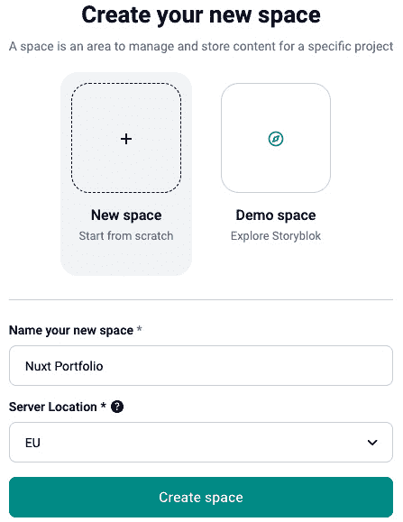

图 10.1 – 为我们的作品集创建一个新的 Storyblok 空间

创建后，你可能会遇到一个关于试用期的模态窗口。你可以直接选择免费社区计划，或者在 14 天试用期后选择。

欢迎屏幕看起来像这样：

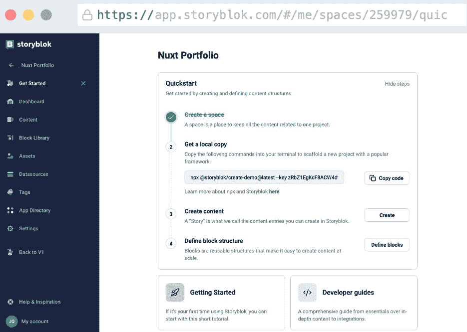

图 10.2 – Storyblok 仪表板

为了我们的作品集，我们可以关闭并忽略**入门**部分。我们将主要关注**设置**、**内容**、**块库**和**资产**部分。

如果我们打开**内容**部分，我们会看到一个标题为**主页**的条目。让我们打开它看看：


图 10.3 – 主页条目上的初始向导

这个屏幕告诉我们，我们可以在 Storyblok 所说的**上下文预览**中预览我们的内容。这意味着我们可以在 Storyblok 环境中加载我们的作品集，以提供非常逼真的作品集预览！

让我们设置一下，看看这实际上意味着什么。我们需要（你可能已经猜到了）**访问令牌**值来连接 CMS 到我们的应用程序。

## 初始化 Nuxt 作品集

我们将使用`nuxi` Nuxt CLI 工具创建一个新的项目，类似于我们在*第八章*中做的：

```js
npx nuxi@3.8.0 init portfolio
```

再次，我们将选择`npm`作为我们的包管理器。如果你还没有安装用于生成 SSL 证书的`mkcert`工具([`github.com/FiloSottile/mkcert`](https://github.com/FiloSottile/mkcert))，你需要遵循适当的安装说明来继续：[`github.com/FiloSottile/mkcert#installation`](https://github.com/FiloSottile/mkcert#installation)。

安装完成后，我们可以在命令行界面使用以下命令生成 localhost 证书：

```js
mkcert localhost
```

命令应该产生类似于以下输出的结果：

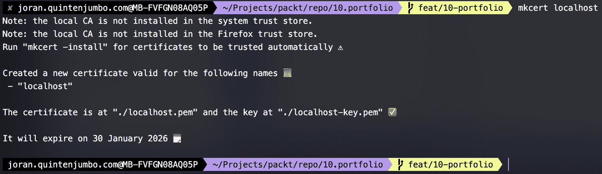

图 10.4 – 成功生成 SSL 证书

下一步，我们需要更新 `package.json` 文件中的开发脚本，以便我们可以以 SSL 模式运行 Nuxt 开发服务器。找到以下命令：

```js
"dev": "nuxt dev",
```

用以下行替换它，该行添加了证书并将进程指向一个 `.env` 文件：

```js
"dev": "NODE_TLS_REJECT_UNAUTHORIZED=0 nuxt dev --dotenv .env --https --ssl-cert localhost.pem --ssl-key localhost-key.pem",
```

我们还将创建一个包含以下信息的 `.env` 文件（**访问令牌**值可以在 Storyblok 的 **欢迎** 页面上找到）：

```js
NUXT_STORYBLOK_ACCESS_TOKEN=replace_with_your_access_token
```

如果您跳过了 Storyblok **欢迎** 页面，您可以通过 Storyblok 菜单查看令牌。导航到 **设置**，然后 **访问令牌** – 它应该列在那里。

现在，我们必须从终端运行 `npm run dev` 命令以启动开发服务器。请注意，您现在可以通过 HTTPS 协议访问服务器！

在 Storyblok **欢迎** 页面上，我们现在可以填写 **设置预览 URL** 字段，使其包含本地 URL（这应该与预先填充的占位符相似）。不要忘记结尾的斜杠！

如果在 Storyblok 中遇到错误，您可能需要首先在浏览器中打开该 URL，因为浏览器可能会将本地证书标记为不安全。如果您在浏览器中接受证书，您可以重新加载 Storyblok 界面；它应该显示 Nuxt 欢迎页面：

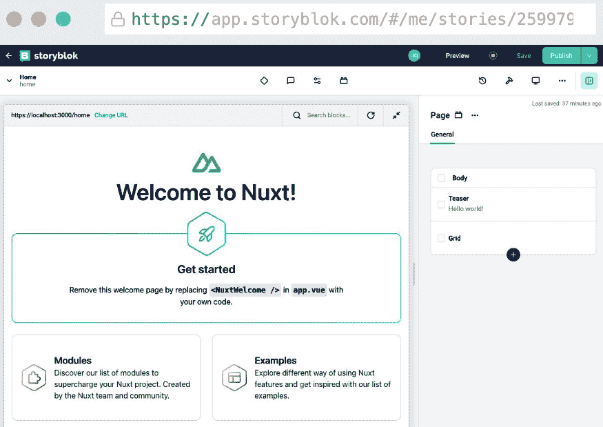

图 10.5 – 在 Storyblok 界面中加载的 Nuxt 欢迎屏幕！

这非常方便！您现在可以从在线 CMS 界面看到本地运行的预览！目前还没有可编辑的内容，但我们将在下一阶段进行改进。

## 安装 Nuxt 模块

目前，我们可以停止 Nuxt 服务器以安装我们将要使用的 Nuxt 模块。在终端中，使用以下命令安装 Storyblok 模块 ([`github.com/storyblok/storyblok-nuxt`](https://github.com/storyblok/storyblok-nuxt)):

```js
npm i @storyblok/nuxt@5.7.4
```

*Storyblok Nuxt* 模块是一个具有意见化且因此低代码集成的 SDK，与 Nuxt 集成。它支持自动导入，并且可以非常容易地将 Vue 组件直接映射到 Storyblok 实体。

在 *Storyblok Nuxt* 模块能够正常工作之前，我们需要添加一些配置，因此让我们打开 `nuxt.config.ts` 文件并修改它，使其包含以下内容：

```js
// https://nuxt.com/docs/api/configuration/nuxt-configexport default defineNuxtConfig({
  devtools: { enabled: true },
  modules: [
    ['@storyblok/nuxt', {
      accessToken: process.env.NUXT_STORYBLOK_ACCESS_TOKEN,
      apiOptions: {
          region: "eu"
        }
      }
    ]
  ],
})
```

如果您在另一个区域操作，请确保选择相应的区域。

当我们在设置模块时，我们也可以在这个时候添加 UI 库 ([`ui.nuxt.com/`](https://ui.nuxt.com/))。我们将使用以下命令从终端安装库：

```js
npm i @nuxt/ui@2.9.0
```

安装完成后，我们需要通过在 `nuxt.config.ts` 文件中的 `modules` 属性中添加模块的名称来注册该模块：

```js
// https://nuxt.com/docs/api/configuration/nuxt-configexport default defineNuxtConfig({
  devtools: { enabled: true },
  modules: [
    ['@storyblok/nuxt', {
      accessToken: process.env.NUXT_STORYBLOK_ACCESS_TOKEN,
      apiOptions: {
        region: "eu"
      }
    }
    ],
    '@nuxt/ui'],
})
```

在我们开始向 CMS 添加自己的内容之前，让我们测试一下我们是否可以在我们的应用程序中显示 Storyblok 的内容。

首先，我们将在 **内容** 部分的 **Home** 条目中打开。使用 **条目配置**，我们将告诉 Storyblok，这个页面是通过 **实路径** 属性在域根处发布的：

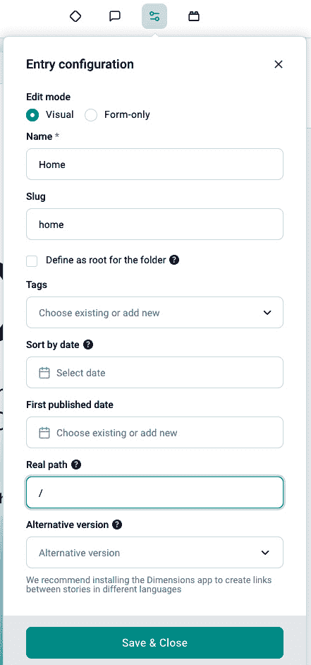

图 10.6 – 更新主页的实路径值

这个更改使得 **主页** 的内容可以在我们应用程序的主 URL 上可用。如前所述，Storyblok 提供了一个低代码 SDK，用于将 CMS 与我们的应用程序集成。“低代码”通常意味着我们需要采用某些模式。

SDK 为我们做的事情之一，例如，是将块库的内容映射到 Vue 组件。

为了实现这一点，我们需要将这些组件放置在我们项目的根目录下的 `./storyblok` 文件夹中。为了我们的测试，我们需要创建两个文件。首先，我们将在 `./storyblok` 文件夹中开始创建 `Page.vue` 文件：

```js
<template>    <div v-editable="blok">
      <StoryblokComponent v-for="blok in blok.body" :key="blok._uid" :blok="blok" />
    </div>
  </template>
  <script setup lang="ts">
  defineProps({ blok: Object })
  </script>
```

接下来，我们将在同一文件夹中创建一个 `Teaser.vue` 文件：

```js
<template>  <div v-editable="blok" v-if="blok">
    {{ blok.headline }}
  </div>
</template>
<script setup lang="ts">
defineProps({ blok: Object });
</script>
```

在这些文件中需要注意 `v-editable` 指令，因为它们向 Storyblok 信号，这些块的内容确实是可编辑的。我们现在可以在我们的应用程序中创建一个 `./pages` 文件夹，并临时创建一个包含以下内容的 `index.vue` 文件：

```js
<script setup>const story = await useAsyncStoryblok('home')
</script>
<template>
  <StoryblokComponent v-if="story" :blok="story.content" />
</template>
```

让我们为我们的网站创建一个简单的布局。首先，我们将在 `./components` 文件夹中放置一个 `Header.vue` 文件：[`github.com/PacktPublishing/Building-Real-world-Web-Applications-with-Vue.js-3/blob/main/10.portfolio/.notes/10.1-Header.vue`](https://github.com/PacktPublishing/Building-Real-world-Web-Applications-with-Vue.js-3/blob/main/10.portfolio/.notes/10.1-Header.vue)。

我们还必须在同一文件夹中创建另一个名为 `Footer.vue` 的文件：[`github.com/PacktPublishing/Building-Real-world-Web-Applications-with-Vue.js-3/blob/main/10.portfolio/.notes/10.2-Footer.vue`](https://github.com/PacktPublishing/Building-Real-world-Web-Applications-with-Vue.js-3/blob/main/10.portfolio/.notes/10.2-Footer.vue)。

在这两个模板中，我们都在使用一些 Nuxt UI 组件，但除此之外，没有其他特别之处。我们将通过在 `./layouts` 文件夹中创建一个 `default.vue` 文件来完成基本布局：

```js
<template>  <div class="flex flex-col min-h-screen">
    <Header />
    <div class="flex-grow">
      <main class="container mx-auto">
        <slot />
      </main>
    </div>
    <Footer />
  </div>
</template>
```

在页面结构（尽管有限）就绪后，我们可以从项目的根目录中移除 `app.vue` 文件。在 Storyblok 界面中，你会看到一个 **Hello world!** 消息，取代了 Nuxt 欢迎视图。在浏览器窗口中打开开发服务器将得到相同的结果。现在，如果你在 Storyblok 中更改文本并保存更改，你将看到它在 Storyblok 界面以及直接在浏览器中都有所反映！


图 10.7 – 更新并保存主页内容

在这里，你可以看到我们手动配置和设置以建立连接所需是多么少！如果我们为我们的 Storyblok 组件使用正确的命名约定，SDK 可以自动使用 slug 将 Storyblok 中的内容填充到组件中。除此之外，这些组件在 Storyblok 编辑器视图中也是可编辑的。

除了自动将内容映射到组件之外，SDK 还有助于识别 URL 并提供相应的内容。在下一节中，我们将向 CMS 添加更多内容，以便我们可以更好地探索这种连接！

我们到目前为止所做的是设置页面。使用 Storyblok，你可以轻松地创建和修改页面，使用预定义的组件。这些是**bloks**。拥有可重复使用的 bloks 集合允许编辑者通过添加 bloks 并配置它们来创建页面和组合内容。预览选项的可用性允许编辑者在部署前看到更改，这是 Storyblok 的一个宝贵功能。

# 与多种内容类型协同工作

要定义我们页面上要使用的类型和内容，我们可以导航到 Storyblok 中的**Block library**。默认情况下，你会看到四个现有的 bloks：**feature**、**grid**、**page**和**teaser**。在 bloks 之间，有两种不同的类型。**page**是**Content**类型，而其余的是**Nestable**类型。关键区别在于**Content type**是内容的一个顶级类型。你可以把它看作是一种具有独特 URL 的页面。你使用它来保存不同层次的内容类型的组合——即**Nestable**。这些是页面的构建块：你可以将它们添加到页面中，以构建你喜欢的页面内容。

此外，还有**Universal type**，它可以充当上述任何一种类型。尽管如此，我们不会在我们的示例中使用它。

让我们通过点击`portfolio`（在这种情况下，小写是首选）来创建一个新的 bloks 以用于我们的投资组合。这将是一个**Content type** bloks，我们将通过点击**Add Block**按钮来配置类型。接下来，我们将添加我们展示项目所需的最小字段。让我们使用以下设置：

1.  添加一个**Text**类型的**title**字段名称。

1.  添加一个**Asset**类型的**image**字段名称：

    1.  创建后，配置字段以仅允许**Images**。

1.  添加一个`150`字符的**description**字段名称。

+   添加一个**Richtext**类型的**body**字段名称。

现在，我们将通过导航到 Storyblok 界面的**Content**部分，开始向我们的投资组合添加一些条目。

## 配置投资组合

我们希望我们的投资组合在`/portfolio`路径上发布，其中 slug 会添加到 URL 中。在`/portfolio`路径上，最终我们希望展示项目的概览。在`Portfolio`中。slug 将自动填充。注意**内容类型**字段，我们可以限制可以显示为文件夹一部分的内容类型。我们现在将保持默认设置，但稍后我们会回到这个选项。点击**创建**将文件夹添加到我们的内容中。

因为我们要在投资组合的根部分展示项目概览，我们将导航到文件夹并创建一个新的条目，但这次我们将选择`Home`，并在创建时必须勾选**将文件夹定义为根**复选框。对于内容类型，我们将使用默认设置，即**页面**。Storyblok 将尝试打开页面，这可能会导致服务器不可用（如果你还没有启动它）或出现**404 未找到**错误，因为我们还没有为这个路由定义目标。没关系 – 我们将在*将内容映射到代码*部分解决这个问题。我们需要使用**条目配置**来配置这个页面，并勾选**将文件夹定义为根**复选框。这个选项会移除 slug 值，这正是我们所需要的。

虽然我们在这里添加了一个类型页面，但我们希望限制其余内容，使其仅包含`Portfolio`条目。为此，我们将移动到`Portfolio`文件夹条目的根目录，这样我们就可以再次编辑文件夹属性：

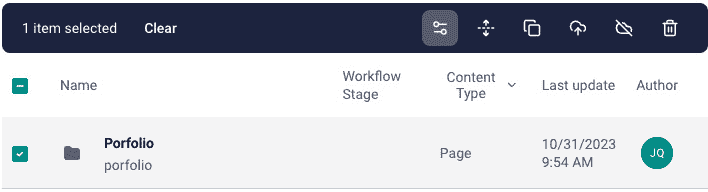

图 10.8 – 更新投资组合文件夹的设置

这将打开与创建文件夹时相同的模态框。我们将使用这个来通过勾选**限制内容类型**选项并选择**投资组合**类型来进一步限制对`Portfolio`文件夹内容的添加：

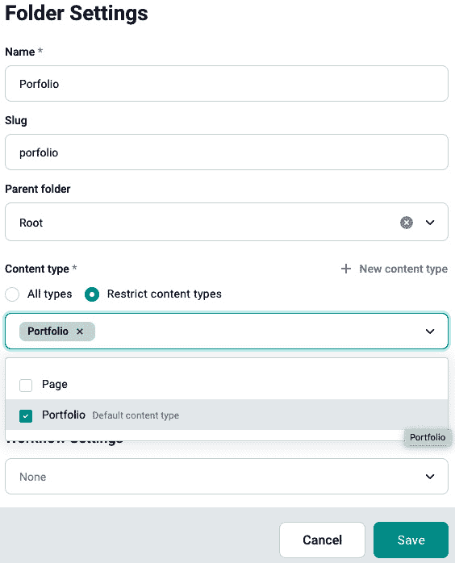

图 10.9 – 限制投资组合文件夹的内容类型

这不会影响我们之前创建的主页，但它将影响未来的条目。所以，让我们创建一些投资组合条目。你可以选择你想要展示的内容 – 我建议为了这个部分至少添加*两项*。我们稍后会添加更多来展示预览的功能！

## 将内容映射到代码

首先，我们将关注常规页面，因为我们现在要处理的不止一个。我们可以完全删除`./pages/index.vue`文件，并用一个名为`./pages/[...slug].vue`的文件来替换它：

```js
<script setup lang="ts">const { slug } = useRoute().params as { slug: string[] };
const story = await useAsyncStoryblok(
  slug && slug.length > 0 ? slug.join("/") : "home", { version: "draft" }
);
</script>
<template>
  <div>
    <StoryblokComponent v-if="story" :blok="story.content" />
  </div>
</template>
```

在这里放置了这段代码后，我们应该能够渲染一个简单的页面。让我们看看**投资组合**部分的首页。如果我们打开它，在 Storyblok 中，我们会看到一个空白页面。在右侧的**内容**面板中，我们可以添加一个新的块 – 例如，**预告**块。

让我们拖入 **预告** 块并为其提供一个适合投资组合概览页的标题：

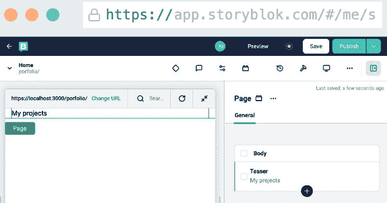

图 10.10 – 在预览模式下在页面上渲染预告块

再次，我们在浏览器中访问开发 URL 时，我们看到的预览立即可见！

那么，这里发生了什么？我们使用了基于文件的 Nuxt 路由功能，使我们的应用程序落在 `[...slug].vue` 页面上。在这个页面上，我们通过 `useAsyncStoryblok` 可组合函数读取 `slug` 路由参数来查询 Storyblok 内容。在模板中，我们依赖于 Storyblok SDK 提供的 `<StoryBlokComponent />` 组件，从 `./storyblok` 文件夹动态加载相应的组件，以反映 CMS 中的区块库中的项目。由于 Nuxt 框架的自动导入，我们为页面提供了一个非常干净的设置！

您可能已经注意到，`./storyblok` 文件夹的内容与库中的区块数量不匹配。让我们快速修复这个问题：您需要确保这些始终对齐以支持不同的场景。

我们将使用组件的最小设置来修复这个问题。首先，我们在 `./storyblok` 文件夹中创建一个 `Feature.vue` 组件，内容如下：

```js
<script setup lang="ts">defineProps({ blok: Object });
</script>
<template>
  <div v-editable="blok" v-if="blok">
    <h3>
      {{ blok.name }}
    </h3>
  </div>
</template>
```

然后，在同一个文件夹中，我们将创建一个 `Grid.vue` 文件：

```js
<script setup lang="ts">defineProps({
  blok: {
    type: Object as () => { columns: any },
    required: true,
  },
});
</script>
<template>
  <div v-editable="blok" v-if="blok" class="flex mx-auto">
    <StoryblokComponent
      v-for="blok in blok.columns"
      :key="blok._uid"
      :blok="blok"
/>
  </div>
</template>
```

如您所见，这个文件与 `Feature.vue` 文件略有不同，因为它可以包含嵌套的 Storyblok 组件。我们可以简单地将这些组件传递给 `<StoryblokComponent />` 以渲染每个可能递归级别的正确组件。

## 展示投资组合部分

我们的 **投资组合** 部分大致由两种情况组成：我们希望在主页上展示所有投资组合项目的概览，并且我们希望在单独的页面上展示单个案例。

首先，让我们通过在 `portfolio-all` 中创建一个新的区块来创建概览，并将其设置为可嵌套的区块。在字段编辑器中，添加以下字段：

1.  添加一个 **文本** 类型的 `title` 字段。

1.  添加一个名为 `description` 的 `150` 字符字段。

+   添加一个 **富文本** 类型的 `body` 字段。

保存后，我们可以更新 **投资组合** 主页。我们可以移除不再需要的 **标题** 块。拖入新的 **投资组合所有** 组件并添加一些合理的文本：

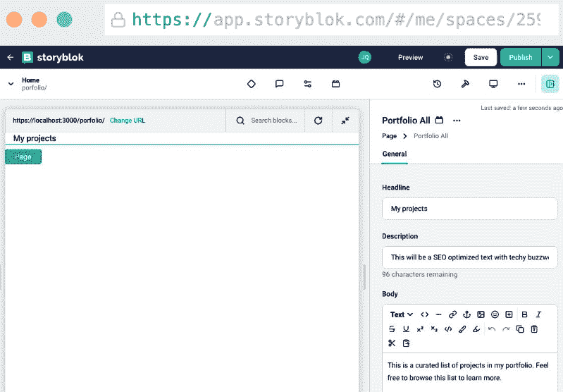

图 10.11 – 配置投资组合所有区块

正如我们所学的，我们需要确保在我们的 `./storyblok` 文件夹中有一个对应的组件。命名约定遵循驼峰式，因此我们需要在文件夹中创建一个 `PortfolioAll.vue` 组件（[`github.com/PacktPublishing/Building-Real-world-Web-Applications-with-Vue.js-3/blob/main/10.portfolio/.notes/10.3-PortfolioAll.vue`](https://github.com/PacktPublishing/Building-Real-world-Web-Applications-with-Vue.js-3/blob/main/10.portfolio/.notes/10.3-PortfolioAll.vue)）：

```js
<script setup lang="ts">import type { Ref } from "vue";
import type { StoryblokProject, StoryBlok } from "@/types/storyblok";
const props = defineProps({
  blok: { type: Object as () => StoryBlok, required: true, },
});
const projects: Ref<StoryblokProject[] | null> = ref(null);
const storyblokApi = useStoryblokApi();
const { data } = await storyblokApi.get("cdn/stories", {
  version: "draft",
  starts_with: "portfolio",
  is_startpage: false,
});
const richTextBody = computed(() => renderRichText(props.blok. body));

projects.value = data.stories; 
</script>
<template> 
  <div>
    <h1 class="text-2xl mb-4 text-primary">
      {{ blok.headline }}
    </h1>
    <div v-html="richTextBody" class="py-4" />
    <div class="grid grid-cols-2 gap-4">
      <UCard
        v-for="project in projects"
```

`<PortfolioAll />` 组件稍微复杂一些。虽然它在获取 props 的意义上与 `Page` 组件有很多共同之处，但我们还手动使用 `useStoryblokApi` 可组合函数（第 11-16 行）请求额外的数据。我们获取了所有在投资组合路径上的故事。`is_startpage` 信号表示我们想要排除投资组合部分的首页。在接收到数据后，我们将其存储在 `projects` 引用（第 9 和 20 行）中，以便我们可以在模板中遍历它，并使用 Nuxt UI 的 `<ULink />` 组件来渲染指向项目页面的链接。

另外还有一个新增功能：由于我们为首页的 *body* 定义了一个富文本字段，我们需要确保它被正确渲染。我们可以使用 Storyblok 的 `renderRichText` 函数（*第 18 行*）作为一个计算值。

让我们再构建一个投资组合详情页面，以暂时结束这一部分。同样，我们需要在 `./storyblok` 文件夹中创建相应的组件，以便它自动映射到 URL。由于我们正在显示 `Portfolio.vue` 组件：[`github.com/PacktPublishing/Building-Real-world-Web-Applications-with-Vue.js-3/blob/main/10.portfolio/.notes/10.4-Portfolio.vue`](https://github.com/PacktPublishing/Building-Real-world-Web-Applications-with-Vue.js-3/blob/main/10.portfolio/.notes/10.4-Portfolio.vue)。

`Portfolio.vue /` 是一个相当简单的组件。因为我们已经预定义了 `./pages/[…slug.vue]` 组件或更具体地说，是 `useAsyncStoryblok` 可组合函数中的一部分字段，它为 `<StoryblokComponent />` 提供数据。

为了更直观地展示，以下模型有助于解释组件是如何渲染的：

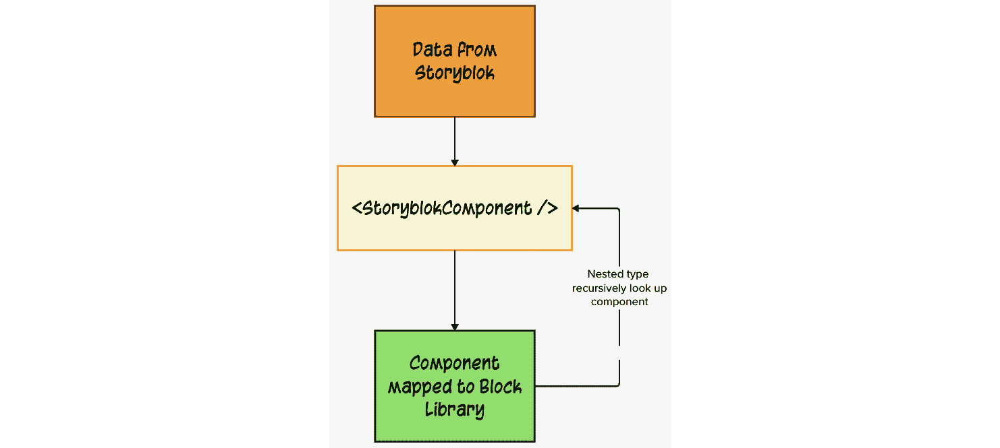

图 10.12 – 从 Storyblok 中的数据到浏览器中的组件

当数据来自 Storyblok 时，它带有组件类型的描述。使用 slug 页面，我们总是到达一个 Storyblok 组件，然后尝试将类型匹配到 `./storyblok` 文件夹中相应的 Vue 组件。该组件反过来可能是一个嵌套类型，这意味着它包含 Storyblok 组件的另一个实例，依此类推。一旦你掌握了这种思维模型，它就相当直接。Nuxt 和 Storyblok 模块处理的自动化程度和假设可能会使机制变得有些模糊。

在我们的产品组合就绪后，让我们更仔细地看看内容模型以及我们如何更好地调整它以满足我们的需求。

# 修改内容模型

我们的无头 CMS 现在能够向我们的产品组合展示基本的布局和内容。这种方式仍然非常有限，所以让我们找出如何与内容模型合作，以便它支持新功能。

## 更新现有类型

假设我们的**预告**区块是一个**标题**区块。我建议尽可能保持区块的静态性，但让我们看看我们需要做什么来更改名称。如果我们导航到 CMS 中的**区块库**并悬停在**预告**区块上，我们可以通过上下文菜单进入编辑模式。在**配置**选项卡中，我们有更新名称的选项：

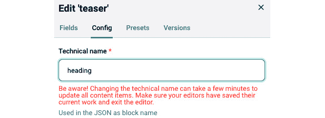

图 10.13 – 更新现有区块的名称

下一步仅仅是将`./storyblok`文件夹中的`Teaser.vue`组件重命名为`Heading.vue`。为了保持稳定性，我强烈建议在内容建模方面提前规划，而不是依赖于现有内容类型的重写。

一个经验法则

随着应用的不断增长，引入需要现有组件重命名或删除的模型更新变得越来越有风险。这些被认为是破坏性变更，可能会暂时导致您的应用程序中断。Storyblok 会警告您，更改可能需要时间才能在整个内容中传播，这可能会影响或阻止应用程序生成所有页面。这类警告或错误应谨慎处理。

改变或删除功能总会在代码中引入一些风险。添加新功能要安全得多，正如我们接下来将要看到的。

## 扩展区块属性

添加功能的更改更容易实现，让我们看看我们如何扩展**功能**区块。同样，我们将打开编辑视图。我们将添加几个字段：

1.  添加一个**资产**类型的`image`字段名称：

    1.  创建后，配置该字段仅允许**图片**。

1.  添加一个**链接**类型的`link`字段名称。

保存这些更改后，我们将更新组件，以便在预览编辑器中体验这些更改。让我们打开`./storyblok/Feature.vue`文件并替换其内容：

```js
<script setup lang="ts">defineProps({ blok: {
  type: Object as () => { name: string, image: any, link: any },
} });
</script>
<template>
  <div v-editable="blok" v-if="blok" class="text-center">
    <ULink :to="blok.link.cached_url">
      
    </ULink>
    <header class="text-xl">
      {{ blok.name }}
    </header>
  </div>
</template>
```

我们可以将网站主页上的默认功能区块更新为，例如，链接到一些产品组合项。如果您不想使用它们，也可以删除现有的功能。更新组件后，Storyblok 会为您提供良好的可视化，展示结果将如何呈现。

页面现在仍然有点空，这是因为我们没有添加文本的手段。让我们这次先创建组件，然后再在 CMS 中实现它。我们将在`./storyblok`文件夹中创建一个`RichText.vue`组件，其内容如下：

```js
<script setup lang="ts">const props = defineProps({
  blok: { type: Object as () => { body: any }, required: true },
});
const richTextBody = computed(() => renderRichText(props.blok.body));
</script>
<template>
  <div v-editable="blok" class="prose">
    <div v-html="richTextBody" />
  </div>
</template>
<style scoped>
.prose {
  line-height: 1.8em;
}
</style>
```

然后，在 Storyblok 中，我们将添加一个名为`rich-text`的新块，作为一个可嵌套的块。作为字段的一部分，我们只添加一个名为`body`的**富文本**类型的字段。现在，你可以立即添加内容块并开始向网站添加更多内容！

我们将对我们的块进行一些重构，因为单个元素不允许我们创建一个看起来好的视觉表示，尤其是在处理文本页面时。首先，我们将在`./storyblok`文件夹中创建一个名为`Article.vue`的 Vue 组件：

```js
<script setup lang="ts">defineProps({
  blok: { type: Object as () => { title: string, content: any}, required: true },
});
</script>
<template>
  <div v-editable="blok" class="article">
    <h2 v-if="blok.title" class="text-2xl mb-4">{{ blok.title }}</h2>
    <StoryblokComponent
      v-for="blok in blok.content"
      :key="blok._uid"
      :blok="blok"
    />
  </div>
</template>
<style scoped>
.article {
  max-width: 720px;
  margin: 2em auto;
}
</style>
```

接下来，我们将转到 CMS 创建一个名为`article`的新块，作为一个具有以下字段的嵌套块：

1.  添加一个**文本**类型的`title`字段名。

1.  添加一个**块**类型的`content`字段名。

第二个字段允许我们使用许多不同的可用块来组合文章类型。尝试为自己设置一个像联系卡块这样的东西将是一个好的实践！

从我们设置的布局中汲取灵感，我们仍然缺少一个页面。使用 Storyblok，你应该能够在项目的根目录下创建一个**Me**故事。你可以使用这个空间来介绍自己并分享你的旅程。

## 映射元字段

你还记得我们在*展示投资组合*部分添加到**投资组合所有**和**投资组合**块的**描述**字段吗？我们还没有映射这些字段！这些字段旨在为页面提供一些用于**搜索引擎优化**（**SEO**）的元数据。使用语义 HTML 标签，我们可以专门描述页面内容以便搜索引擎索引。Nuxt 提供了一个现成的解决方案来控制这些标签，并提供了一个可组合的([`nuxt.com/docs/getting-started/seo-meta#usehead`](https://nuxt.com/docs/getting-started/seo-meta#usehead))。

在这两种情况下，由于字段名相同，我们可以通过在脚本标签中插入以下代码来添加`meta`字段：

```js
useHead({  meta: [
    { name: 'description', content: props.blok.description }
  ]
});
```

现在，如果你查看网站的源代码，你会看到标签和内容被渲染：

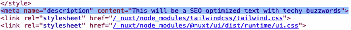

图 10.14 – 元字段已在 HTML 源代码中渲染

记住这一点是很好的，我们可以使用 CMS 中的内容不仅限于网站的可见部分 – 我们可以将任何内容作为我们应用程序中的变量进行处理。我们可以提供开关或主题 – 真的什么都可以 – 这样我们就可以在不部署新代码的情况下更改网站。这就是无头 CMS 在开发应用程序时成为一个强大工具的原因。

## 添加新功能

完成这些步骤后，你可以尝试向你的投资组合添加更多功能。比如一个格式良好的联系表？或者一个可管理的简历部分？凭借我们所构建的，你应该能够自己解决这个问题！

# 生成一个独立的网站

我们现在有一个功能齐全的资料库。这种类型的网站内容非常静态：它不会根据访客而改变，而且代码方面可能不会每天更新！这意味着我们可以优化我们将部署到公共领域的输出。

我们创建的资料库是静态网站生成的完美用例。通常，Nuxt 会在服务器上作为一个活跃的进程运行，它可以直接响应请求并实时获取数据。一个很好的例子是我们*第八章*中构建的*问答服务器*。但由于发布时我们不需要实时数据，我们可以利用 Nuxt 的另一个功能。在生成静态网站时，Nuxt 最初作为一个应用程序运行，并索引所有内部链接。对于每个内部链接，它将从服务器获取一次数据，然后将输出写入静态文件集合。

让我们看看这个动作！该命令已经是我们`package.json`脚本的一部分，但我们需要稍作修改，以便我们可以传递访问数据的 API 密钥：

```js
…  "scripts": {
    "build": "nuxt build",
    "dev": "NODE_TLS_REJECT_UNAUTHORIZED=0 nuxt dev --dotenv .env --https --ssl-cert localhost.pem --ssl-key localhost-key.pem",
    "generate": "nuxt generate  --dotenv .env",
    "preview": "nuxt preview",
    "postinstall": "nuxt prepare"
  },
…
```

我们可以在终端中运行以下命令：

```js
npm run generate
```

你将看到正在生成静态网站所需的文件。完成后，*Nuxt*生成过程将返回一个你可以用来测试网站作为静态网站的命令：

```js
npx serve .output/public
```

运行此命令将启动一个简单的 HTTP 网络服务器。没有 Nuxt 进程在运行！这仅仅是浏览器在运行 HTML、CSS 和 JavaScript 文件。所有来自 CMS 的内容现在都作为网站的一部分捆绑在一起。好吧，除了图片——它们由 Storyblok CDN 提供，该 CDN 专门为此类操作进行了优化。

我们将在下一节中看到如何使我们的静态网站公开。

# 发布静态网站

任何网络托管商现在都能提供这些静态文件。这就是静态生成网站的一个好处：在托管它们时拥有很大的自由度。然而，我们还有一些后续要求，因此我们选择了 Netlify ([`app.netlify.com/`](https://app.netlify.com/))来满足我们的使用案例。如果你注册，你应该能够免费进入免费层。在注册时，选择最适合你的类别，并为你的团队选择一个名称。

在下一屏，我们将采用 Netlify Drop 的方式进行部署：

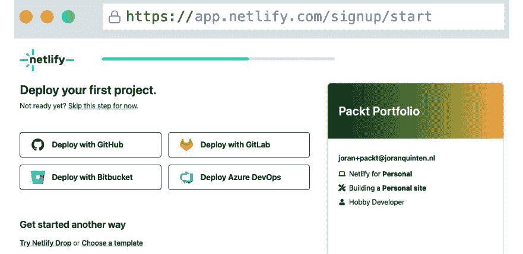

图 10.15 – 选择你的第一个部署方法

选择`./output/public`文件夹。确保你放下`public`文件夹，而不是单独的内容！

一旦你完成上传，你将第一次进入仪表板。点击**打开生产部署**按钮将带你到你的已发布资料库！子域名由 Netlify 生成，包含随机词汇。你可以选择通过**域名****管理**部分来更改它：

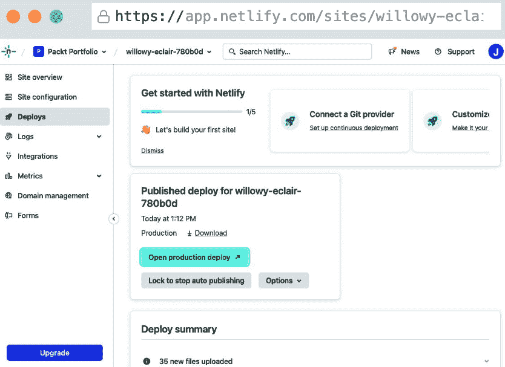

图 10.16 – 首次部署后的 Netlify 仪表板

Netlify 的免费层提供了处理域名的能力，可以将您自己的域名指向这个空间。

静态生成网站的缺点是，我们部署的网站完全脱离了内容和我们的 Nuxt 服务器。这意味着如果我们更新内容或更改代码中的功能，我们需要重新生成网站并手动将输出上传到 Netlify。这可行但不是最佳方案！

幸运的是，通过一些额外的努力和配置，我们可以在内容更改或代码更改时自动化部署！

## 自动化代码更改时的构建和部署

我们的 Netlify 环境不了解我们的应用程序。Netlify 是一个用于部署 Web 应用的工具。我们无法将 Netlify 连接到我们的本地开发环境。我们需要将源代码也托管在网上。

GitHub ([`github.com/`](https://github.com/)) 与 Netlify 具有出色的集成，非常适合托管和版本控制代码。不深入细节，GitHub 可以检测到仓库中的代码何时被更新，并在这种情况下触发某些操作。

首先，我们将设置一个仓库，我们可以在这里发布代码。让我们创建一个新的空仓库：

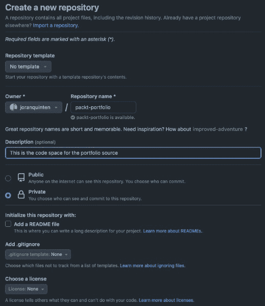

图 10.17 – 在 GitHub 中创建新的仓库

仓库创建后，您可以使用终端按照以下步骤将我们的代码附加到仓库：

```js
git initgit branch -m master main
git remote add origin https://github.com/{YOUR_USERNAME}/{REPOSITORY_NAME}.git
git add .
git commit -am "published source to git"
git push -u origin main
```

这会将我们的代码推送到 GitHub，这意味着我们可以将其连接到 Netlify！在仪表板上，导航到 **网站配置** | **构建和部署**，然后点击 **链接仓库** 按钮。然后，您需要在您的 GitHub 账户上授权 Netlify。完成此操作后，您将看到您仓库的概览。选择您刚刚创建的资料库以继续。

它可能会自动检测这是一个 Nuxt 仓库，Netlify 将尝试提出一些建议。我们需要更改三个设置：

1.  修改 `npm run generate`。

1.  修改 `./output/public`。

1.  我们需要添加环境变量来添加 `.env` 文件的内容，其中 `NUXT_STORYBLOK_ACCESS_TOKEN` 和 **值** 应与您的访问令牌匹配。请确保已保存！

您所做的更改应与以下设置匹配：

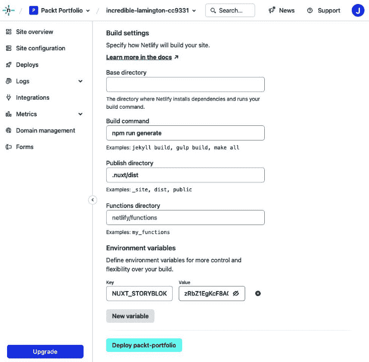

图 10.18 – 我们新的 Netlify 部署设置

部署此操作将允许 Netlify 从仓库中读取并拉取更改时的最新版本。它将自动执行此操作。然后，它将在虚拟环境中运行 `npm run generate` 脚本来进行静态站点渲染。最后一步是将输出文件夹的内容部署到 Web 域名。

就这么简单！如果您在本地代码上工作并提交代码到仓库，更改将自动部署！值得注意的是，我们没有验证我们的代码是否功能正常，因为我们没有在我们的应用程序上运行测试。确保您的代码的关键功能正常工作是一个最佳实践。

## 自动化内容变更时的构建

如果我们能在内容变更而不是代码变更时做类似的事情，那就太完美了，对吧？幸运的是，有一个非常方便的方法来做这件事：我们可以使用 webhook 来触发操作。Storyblok 会跟踪内容何时准备好发布，并且可以在 Netlify 平台上触发一个操作，执行构建，就像代码变更一样。然而，这次，Nuxt 将在生成过程中获取内容的最新版本。

让我们看看我们如何设置它。首先，我们需要在 Netlify 中创建一个 webhook。这个 webhook 仅仅是一个在调用时触发内部操作的唯一 URL。

导航到 **内容变更时部署**。设置默认为构建 **main** 分支，这是完美的。保存片刻后，您将收到一个具有类似 [`api.netlify.com/build_hooks/UNIQUE_IDENTIFIER`](https://api.netlify.com/build_hooks/UNIQUE_IDENTIFIER) 模式的唯一 URL。

现在，我们可以转到 Storyblok 来配置调用此 webhook。如果我们导航到 **设置** 和 **Webhook** 部分，我们可以管理 webhook！我们将创建一个新的，再次使用一个有意义的名称。在 **端点 URL** 区域，我们可以粘贴 Netlify 的端点。

**触发器** 决定了我们希望在哪些事件上调用 webhook。您可以尝试调整一下设置，但我建议从以下这个集合开始：

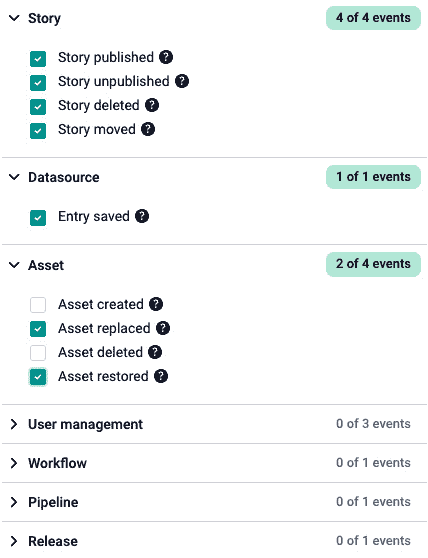

图 10.19 – 选择事件触发器以调用 webhook

理想情况下，您希望选择尽可能少的触发器，因为每次构建过程都需要时间。连续调用 webhook 只是将请求放入队列，这可能导致您的更改可见的等待时间更长。

让我们保存这些设置并更改我们作品集中的某些内容。

小贴士

如果您没有运行 Nuxt 开发服务器，您仍然可以使用右侧的面板编辑内容。您甚至可以使用 **显示表单视图** 按钮将其扩展以填充屏幕：

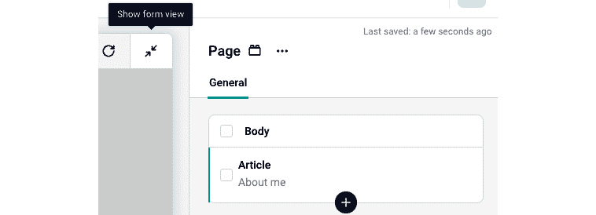

图 10.20 – 使用表单视图扩展编辑功能

没有开发服务器仅仅意味着您没有实时预览。访问内容不是强制性的。

保存后，您可以转到 Netlify 控制面板上的 **部署** 部分，查看它触发了新的构建。

# 您做到了！

在本章中，我们一直在使用不同的平台和系统，将它们连接成一个可以渲染静态网站的单个应用程序。一个关键收获是我们可以将许多专业解决方案的优势结合起来，构建一个我们可以部署的稳健产品。我强烈推荐您查看更多关于 Storyblok 和 Netlify 的资源，因为它们与这种类型的 Web 堆栈配合得很好。

Storyblok 的实时预览功能与使用 Nuxt 作为框架的开发体验相结合，使得这类项目非常容易上手并构建出我们可以使用的成果！我们注意到，Nuxt 不一定要作为服务器运行——它可以用来自动从服务器生成数据并存储输出。这种方法比实时数据获取更可持续，并且性能更优。

通过我们设置的 Storyblok 与 Nuxt 的集成方式，任何人都可以非常容易地构建一个网站。我们构建了一个相对简单的示例，但随着块的增加，您可以创建的可能性会大幅增加，同时对于非技术用户来说仍然非常易于理解。

在本章中，我们设定的每一个配置都是为了尽可能容易地管理网站。甚至发布机制也通过自动化代码部署以及在内容更改时自动生成新版本来助力这一目标。

在所有这些之上，我们还创建了一个平台，您可以在阅读本书章节的过程中记录您的学习历程。我建议您用您自豪的项目或成就来完善您的作品集。

本书的一个目标就是展示现实世界的代码。现实世界的代码通常是实用的，可能并不总是优化到完美。同样，本书中的示例也不是完美的。然而，它们有效地实现了预期的目标。拥抱实用主义使您能够与用户验证功能，并缩短反馈循环，这是一个非常有价值的方面。我说明了重构和优化是持续过程中的重要部分。我想强调，随着您对项目的深入了解，您自然会优先考虑哪些方面需要优化。

回顾过去，我希望您为在这本书中涉及的不同主题、技术和应用程序所付出的努力感到自豪。我试图描绘出可能的现实世界场景，同时不断增进您的 Vue.js 知识和经验。我想感谢您对这些主题的兴趣，以及在我们旅程中的陪伴。调查、构建和记录的过程对我来说也非常宝贵，我感激有机会在编写代码时教授和分享我的知识和方法。
