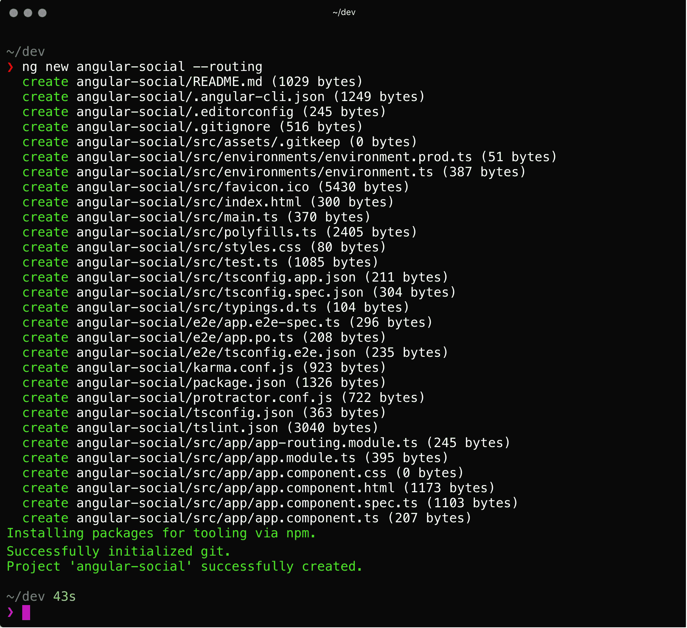

# 第一章 创建基础应用程序

我们将构建的 Angular 应用程序是一个列表，你通常在像 Twitter 这样的社交应用程序中看到这些帖子。每个帖子都是由用户发布的，我们可以点击到用户的个人资料以显示该个人资料发布的所有帖子。

由于本书旨在关注技术而非应用程序的功能，我们将故意保持应用程序简单。尽管应用程序很简单，但我们将使用 Angular 开发的所有最佳实践来开发它。

使用 Angular 构建的 Web 应用程序可以针对搜索引擎优化（SEO）。在应用程序中构建 SEO 支持意味着搜索引擎可以读取和理解页面，并且页面具有针对搜索引擎的动态数据（元标签）。这增加了应用程序的可见性，提高了搜索排名和链接数量，从而为您或您的客户带来更多收入。Angular 提供了可以利用的内置功能，以确保应用程序在网络上享有最大的可见性。

# 课程目标

在本课中，你将：

+   安装 Angular CLI

+   创建 Angular 应用程序

+   创建应用程序的基本 UI

+   创建应用程序的页眉和页脚

# 服务器端和客户端渲染

当我们谈论网站的客户端渲染时，我们通常指的是使用在服务器上运行的编程语言的应用程序或网站。在这个服务器上，网页被创建（渲染），渲染的输出（HTML）被发送到浏览器，在那里可以直接显示。

### 注意

本书代码包托管在 GitHub 上，网址为 [`github.com/TrainingByPackt/Beginning-Server-Side-Application-Development-with-Angular`](https://github.com/TrainingByPackt/Beginning-Server-Side-Application-Development-with-Angular)

当我们谈论客户端渲染时，我们通常指的是使用在浏览器中运行的 JavaScript 来显示（渲染）网页的应用程序或网站。通常有一个页面被下载，包含一个 JavaScript 文件，该文件构建实际的页面（因此称为 *单页应用程序*）。

# 安装 Angular CLI

Angular CLI 是创建和开发 Angular 应用程序的官方支持工具。它是一个由 Angular 团队维护的开源项目，并且是开发 Angular 应用程序的推荐方式。

Angular CLI 提供以下功能：

+   创建新的应用程序

+   以开发模式运行应用程序

+   使用 Angular 团队的最佳实践生成代码

+   运行单元测试和端到端测试

+   创建生产就绪的构建

使用 Angular CLI 的主要好处之一是您不需要配置任何构建工具。所有这些都被抽象化并通过一个便捷的命令 `ng` 提供使用。

在整本书中，我们将使用 `ng` 命令来创建应用程序、生成代码、以开发模式运行应用程序以及创建构建。

### 注意

有关 Angular CLI 的更多信息，请参阅 GitHub 上的项目页面 ([`github.com/angular/angular-cli`](https://github.com/angular/angular-cli))

要在您的机器上安装 Angular CLI，请执行以下步骤：

1.  打开您的终端。

1.  运行以下命令：

    ```js
    npm install –g @angular/cli@latest
    ```

1.  一旦安装完成且没有错误，请确保 `ng` 命令按预期工作，运行以下命令：

    ```js
    ng --version
    ```

1.  验证输出是否与这里显示的输出相似：

在本节中，我们已经安装了 Angular CLI。我们可以开始构建我们的应用程序！

# 生成新的应用程序

现在我们已经安装并配置了 Angular CLI，我们可以开始生成我们的新应用程序。

运行 `ng new` 命令将执行以下操作：

+   创建一个名为 `angular-social` 的文件夹

+   在此文件夹内创建一个新的基本应用程序

+   添加一个路由模块（因为传递了 `--routing` 标志）

+   在此文件夹内运行 `npm install` 以安装依赖项

+   运行 `git init` 以初始化一个新的 Git 仓库

## 创建新的应用程序

要创建新的应用程序，请执行以下步骤：

1.  打开您的终端并导航到您想要工作于应用程序的目录：

    ```js
    cd dev
    ```

1.  一旦进入工作区目录，按照以下方式调用 `ng` 命令：

    ```js
    ng new angular-social --routing
    ```

1.  此命令的输出将类似于以下内容：

让我们看看运行此命令后创建的文件夹：

+   `src`：此文件夹包含我们应用程序的源文件

+   `src/app/`：此文件夹包含应用程序文件

+   `src/assets/`：此文件夹包含我们可以在应用程序中使用的静态资源（例如图片）

+   `src/environments/`：此文件夹包含我们应用程序默认环境的定义

+   `e2e`：此文件夹包含我们应用程序的端到端测试

## 运行应用程序

要运行应用程序，请执行以下步骤：

1.  安装完成后，我们可以打开终端并进入工作目录：

    ```js
    cd angular-social
    ```

1.  运行 `ng serve` 命令以启动开发服务器：

    ```js
    ng serve
    ```

    命令的输出将如下所示：

    

## 查看您的应用程序

要查看您的应用程序，请执行以下步骤：

1.  打开您的浏览器并导航到 `http://localhost:4200/`。

1.  您应该会看到一个默认页面，上面写着 **欢迎使用 app**！

在本节中，我们使用 Angular CLI 创建了一个基本应用程序，并在浏览器中查看了它。

# 设置 Angular CLI 的默认值

Angular CLI 默认情况下工作得很好，默认设置提供了一个很好的配置来工作。但除了有一些合理的默认设置外，它也非常可配置。

在本书中，我们将利用这个机会来配置 Angular CLI 的默认设置，使其表现得略有不同。

我们将要更改的所有内容都与我们的代码生成（或脚手架）方式有关。

在构建组件时，默认的 Angular CLI 设置将在单独的文件中创建 HTML 模板和样式表。

为了将所有组件内容保持在单个文件中，我们将配置 Angular CLI 以生成内联模板和样式。

将所有组件内容保持在单个文件中的优点是，你可以在一个地方工作于模板、样式和实际的组件代码，而无需切换文件。

## 配置全局默认值

在你的终端中，运行以下命令以全局配置默认值：

```js
ng set defaults.component.inlineStyle true
ng set defaults.component.inlineTemplate true
```

当我们运行 `git diff` 命令时，我们会看到这些设置存储在我们的应用程序的 `.angular-cli.json` 文件中：


在本节中，我们已经配置了 Angular CLI 以生成内联样式和模板。

# 配置全局样式

默认生成的 Angular 应用程序没有任何样式。

Angular 在样式方面没有规定任何内容，所以在你自己的项目中，你可以使用任何其他的样式框架，例如 Angular Material、Foundation、Semantic UI 或许多其他之一。或者，你可以从头开始创建自己的样式，以获得独特的视觉和感觉。

然而，对于这本书，我们将坚持使用 Bootstrap 4 和 Font Awesome，因为它们被广泛使用，并且它们以最少的代码提供了很好的样式。

## 在全局样式.css 中链接到样式表

如前所述，我们的应用程序附带一个全局样式表，`src/styles.css`。

在这个样式表中，我们将使用 `@import` 命令来链接到 Bootstrap 和 Font Awesome。这将指示 Angular 下载文件并将样式应用于应用程序的全局范围。

## 添加 Bootstrap 和 Font Awesome

1.  在你的编辑器中打开 `src/styles.css` 文件。

1.  在文件的末尾添加以下两行：

    ```js
    @import url('https://maxcdn.bootstrapcdn.com/bootstrap/4.0.0-beta.2/css/bootstrap.min.css');
    @import url('https://maxcdn.bootstrapcdn.com/font-awesome/4.7.0/css/font-awesome.min.css');
    ```

1.  在浏览器中刷新应用程序。

如你所见，应用程序的字体已更新为无衬线字体，因为这是 Bootstrap 的默认设置：


## 在页面上显示图标

1.  打开 `src/app.component.html` 文件，并将其内容替换为以下内容：

    ```js
    <h1 class="text-center mt-5">
      <i class="fa fa-thumbs-up"></i>
    </h1>
    ```

当应用程序在浏览器中刷新时，你应该在页面中心看到点赞图标：


### 注意

对于所有可用图标列表，你可以参考 *Font Awesome 快速参考* ([`fontawesome.io/cheatsheet/`](http://fontawesome.io/cheatsheet/))。

对于所有可用的 Bootstrap 样式的概述，你可以参考 Bootstrap 4 文档 ([`getbootstrap.com/docs/4.0/getting-started/introduction/`](https://getbootstrap.com/docs/4.0/getting-started/introduction/))。

在本节中，我们已经将 Bootstrap 和 Font Awesome 设置为我们的应用程序的样式框架。这将使我们能够拥有与 Angular CLI 提供的不同的字体样式。现在我们可以开始创建我们的 UI 组件了。

# 创建 UI 模块和组件

与 Angular 一起工作的一个优点是它促进了以模块化和组件化的方式构建应用程序。

在 Angular 中，`NgModule`（或简称 `Module`）是将您的应用程序分组为功能逻辑块的一种方式。

`Module` 是一个带有 `@NgModule` 装饰器的 TypeScript 类。在装饰器中，我们定义 Angular 如何编译和运行模块内的代码。

在本课中，我们将构建一个模块，将我们想要在用户界面中使用的所有组件组合在一起。

我们将添加一个由 `HeaderComponent` 和 `FooterComponent` 组成的 `LayoutComponent`，并在它们之间定义一个空间，用于显示我们的应用程序代码，使用 `RouterOutlet` 组件：


## 创建 UiModule

在本节中，我们将使用 `ng` 命令生成 `UiModule` 并在 `AppModule` 中导入 `UiModule`。

使用 `ng generate` 命令，我们可以生成或构建出所有可用于 Angular 应用程序的代码。

我们将使用 `ng generate module` 命令来生成我们的 `UiModule`。

此命令有一个必需的参数，即名称。在我们的应用程序中，我们将此模块称为 `ui`：

1.  打开您的终端并导航到项目目录。

1.  从项目目录中运行以下命令：

    ```js
    $ ng generate module ui
       create src/app/ui/ui.module.ts (186 bytes)
    ```

如您从命令输出中看到的那样，我们的 `UiModule` 在新的文件夹 `src/app/ui` 中生成：


当我们查看此文件时，我们可以看到空 Angular 模块的模样：

```js
   import { NgModule } from '@angular/core';
    import { CommonModule } from '@angular/common';

    @NgModule({
      imports: [
        CommonModule
      ],
      declarations: []
    })
    export class UiModule { }
```

### 导入我们的 UiModule

现在，我们的 `UiModule` 已创建，我们需要从 `AppModule` 中导入它。这样，我们就可以从 `AppModule` 内部的其他代码中使用 `UiModule` 内的代码：

1.  在您的编辑器中打开项目。

1.  打开 `src/app/app.module.ts` 文件。

1.  在文件顶部添加 `import` 语句：

    ```js
    import { UiModule } from './ui/ui.module'
    ```

1.  在 `NgModule` 装饰器内的 `imports` 数组中添加对 `UiModule` 的引用：

    ```js
    @NgModule({
       ...
       imports: [
         // other imports
         UiModule
       ],
      ...
     })
    ```

    

我们的 `UiModule` 现已创建并导入到 `AppModule` 中，这使得它准备好使用。

让我们继续在 `UiModule` 中创建我们的第一个组件，并使其在我们的应用中显示！

### 显示当前路由

在构建我们的应用时，我们将大量依赖 Angular 的路由器来将所有模块和组件连接起来。

由于我们将所有功能构建在模块中，因此我们只使用主要的 `AppComponent` 来显示当前路由。为了使这生效，我们需要更新 `AppComponent` 模板并确保定义了 `router-outlet`：

1.  在您的编辑器中打开项目。

1.  打开 `src/app/app.component.html` 文件。

1.  删除所有内容并添加以下 HTML：

    ```js
    <router-outlet></router-outlet>
    ```

在浏览器中刷新应用程序后，我们应该看到一个空白页。这是因为我们没有设置任何路由，因此 Angular 应用程序不知道要显示什么。让我们进入下一节创建我们的基本布局！

## 创建 LayoutComponent

在本节中，我们将使用`ng generate`在`UiModule`内部创建`LayoutComponent`，并将其添加到`AppRoutingModule`中以便显示。

`LayoutComponent`是应用程序的主要模板。其功能是将`HeaderComponent`和`FooterComponent`粘合在一起，并在两者之间显示实际的应用程序页面。

现在，我们将使用`ng generate`命令创建我们的`LayoutComponent`。

1.  打开您的终端并导航到项目目录。

1.  在项目目录中运行以下命令：

    ```js
    ng generate component ui/components/layout
    ```

当我们查看输出时，我们看到我们的组件已在新`src/app/ui/components`目录中创建：


我们输出的最后一行显示我们的`UiModule`已被更新。

当我们在编辑器中打开我们的`UiModule`时，我们看到它为我们的`LayoutComponent`添加了一个`import`，并将其添加到`NgModule`装饰器中的`declarations`数组中。

`declarations`数组*声明*了一个模块中组件的存在，这样 Angular 就知道它们存在并且可以被使用：

```js
import { NgModule } from '@angular/core';
import { CommonModule } from '@angular/common';

@NgModule({
  imports: [
    CommonModule
  ],
  declarations: []
})
export class UiModule { }
```

### 添加新路由

如本节前面所述，我们将使用我们的`LayoutComponent`作为整个应用程序的基础。它将显示我们的页眉、页脚，并在两者之间显示实际的应用程序屏幕。

我们将利用 Angular 的内置路由机制来完成这个任务。我们将通过向`routing`数组中添加一个新的路由，并在该路由的组件中引用`LayoutComponent`来实现：

1.  打开`src/app/app-routing.module.ts`文件。

1.  在文件顶部添加一个`import`：

    ```js
    import { LayoutComponent } from './ui/components/layout/layout.component'
    ```

1.  在分配给`routes`属性的空数组中，我们添加一个新的对象字面量。

1.  添加`path`属性并将其值设置为空字符串`''`。

1.  添加`component`属性并将其值设置为刚刚导入的引用`LayoutComponent`。我们添加到`routes`数组中的代码行如下：

    ```js
    { path: '', component: LayoutComponent, children: [] },
    ```

为了参考，完整的文件应该看起来像这样：

```js
import { NgModule } from '@angular/core';
import { Routes, RouterModule } from '@angular/router';
import { LayoutComponent } from './ui/components/layout/layout.component'

const routes: Routes = [
  { path: '', component: LayoutComponent, children: [] },
];

@NgModule({
  imports: [RouterModule.forRoot(routes)],
  exports: [RouterModule]
})
export class AppRoutingModule { }
```

当我们的应用程序刷新时，我们应该看到文本**布局工作！**：


### 构建我们的布局

让我们去掉这个默认文本，开始构建我们的实际布局：

1.  打开`src/app/ui/layout/layout.component.ts`文件。

1.  去掉`template`属性的內容。

1.  将以下内容添加到空的`template`字符串中：

    ```js
    app-header placeholder
    <div class="container my-5">
       <router-outlet></router-outlet>
    </div>
    app-footer placeholder
    ```

当我们保存文件时，我们看到浏览器输出一个空白页。

从 Chrome 开发者工具的**控制台**标签页查看，我们看到有一个错误指出**模板解析错误：'router-outlet' 不是一个已知元素**：


为了让 Angular 知道如何渲染`router-outlet`，我们需要导入`RouterModule`：

1.  打开`src/app/ui/ui.module.ts`文件。

1.  在文件的顶部导入列表中添加一个`import`语句：

    ```js
    import { RouterModule } from '@angular/router';
    ```

1.  在`NgModule`装饰器的`imports`数组中添加对`RouterModule`的引用。

当我们现在保存文件时，我们应该看到页眉和页脚的占位符，中间有一些空白，并且控制台中的路由错误现在已消失：


现在已经完成，让我们向占位符添加一些内容！

## 创建 HeaderComponent

在本节中，我们将使用`ng generate`在`UiModule`中创建`HeaderComponent`，从我们的`LayoutComponent`引用`HeaderComponent`以便显示，并实现具有动态标题和项目的导航栏。

我们将使用`ng generate`命令来创建我们的`HeaderComponent`：

1.  打开终端并导航到项目目录。

1.  在项目目录内运行以下命令：

    ```js
    ng g c ui/components/header
    ```

当我们查看输出时，我们看到我们的组件已在新`src/app/ui/header`目录中创建，并且我们的`UiModule`已更新，正如我们预期的那样，在我们为`LayoutComponent`执行了相同的操作之后：


### 更新 LayoutComponent 以引用我们的新 HeaderComponent

现在，我们将更新`LayoutComponent`，使其引用我们新的`HeaderComponent`而不是`app-header`占位符：

1.  打开`src/app/ui/components/layout/layout.component.ts`文件。

1.  找到`app-header`占位符并将其替换为以下标签：

    ```js
    <app-header></app-header>
    ```

当我们在浏览器中看到我们的应用程序刷新时，我们看到现在我们有了字符串**header works!**而不是占位符：


现在我们可以开始实现实际的页眉，这样我们的页面最终开始看起来像是一个应用了！

### 创建实际的页眉

现在我们将创建实际的页眉。我们将定义三个类属性，一个字符串属性用于应用程序的标志和标题，以及一个表示我们想要在页眉中显示的链接的对象数组。

在模板中，我们将创建一个 Bootstrap 导航栏，包括一个带有一些样式的`nav`元素，一个带有我们的标志和标题的链接，以及实际的导航链接。

### 注意

关于如何使用导航栏的更多信息，请参阅此处：[`getbootstrap.com/docs/4.0/components/navbar/`](https://getbootstrap.com/docs/4.0/components/navbar/)

1.  从[`angular.io/assets/images/logos/angular/angular.svg`](https://angular.io/assets/images/logos/angular/angular.svg)下载文件并将其存储为`src/assets/logo.svg`。

1.  打开`src/app/ui/components/header/header.component.ts`文件。

1.  在`component`类内部，我们添加三个新属性：

    ```js
    public logo = 'assets/logo.svg';
    public title = 'Angular Social';
    public items = [{ label: 'Posts', url: '/posts'}];
    ```

1.  将`template`属性的内容替换为以下标记：

    ```js
    <nav class="navbar navbar-expand navbar-dark bg-dark">
       <a class="navbar-brand" routerLink="/">
         

       </a>
       <div class="collapse navbar-collapse">
         <ul class="navbar-nav">
           <li class="nav-item" *ngFor="let item of items" routerLinkActive="active">
             <a class="nav-link" [routerLink]="item.url">{{item.label}}</a>
           </li>
         </ul>
       </div>
    </nav>
    ```

当我们保存此文件并在浏览器中检查时，我们终于看到了应用程序的第一个真实部分被显示出来。从现在开始，事情将会迅速发展：


让我们将本节中获得的知识应用到构建 `FooterComponent` 上。

## 创建 FooterComponent

在本节中，我们将使用 `ng generate` 命令在 `UiModule` 中创建 `FooterComponent`，从我们的 `LayoutComponent` 中引用 `FooterComponent` 以显示它，并实现页脚并添加一条简短的版权信息。

我们将使用 `ng generate` 命令创建我们的 `FooterComponent`：

1.  打开终端并导航到项目目录。

1.  从项目目录中运行以下命令：

    ```js
    $ ng g c ui/components/footer
    ```

当我们查看输出时，我们看到我们的组件在新的 `src/app/ui/footer` 目录中创建，并且 `UiModule` 被更新，类似于前几节中发生的情况：


### 更新 LayoutComponent 以引用新的 FooterComponent

我们将更新 `LayoutComponent` 以引用我们新的 `FooterComponent` 而不是 `app-footer` 占位符：

1.  打开 `src/app/ui/components/layout/layout.component.ts` 文件。

1.  找到 `app-footer` 占位符并将其替换为以下标签：

    ```js
    <app-footer></app-footer>
    ```

就像我们的页眉一样，刷新我们的应用程序后，我们现在看到的是字符串 **页脚工作！** 而不是占位符：


最后一步是实现页脚，我们的基本布局就完成了！

### 创建实际的页脚

现在，我们将创建实际的页脚。我们将定义两个类属性，一个字符串属性用于开发者的名字，以及年份。

在模板中，我们将创建另一个 Bootstrap 导航栏，它包含一个带有一些样式和版权信息的 `nav` 元素，该信息使用了我们在组件类中定义的字符串属性：

1.  打开 `src/app/ui/components/footer/footer.component.ts` 文件。

1.  在 `component` 类中，添加以下属性。别忘了用正确的数据更新两个占位符：

    ```js
      public developer = 'YOUR_NAME_PLACEHOLDER';
      public year = 'YEAR_PLACEHOLDER';
    ```

1.  删除 `template` 属性的内容。

1.  将 `template` 属性的内容替换为以下标记：

    ```js
    <nav class="navbar fixed-bottom navbar-expand navbar-dark bg-dark">
       <div class="navbar-text m-auto">
          {{developer}} <i class="fa fa-copyright"></i> {{year}}
       </div>
    </nav>
    ```

当我们保存此文件并在浏览器中检查时，我们终于看到页脚正在被渲染：


我们已经完成了我们的布局！在本节中，我们构建了页眉和页脚组件。我们还构建了布局组件并创建了一个 `UiModule`。让我们开始构建实际的应用程序逻辑。

# 摘要

在本课中，我们安装了 Angular CLI 并创建了 Angular 应用程序。我们设置了一些默认设置，并使用 Bootstrap 和 Font Awesome 配置了我们的全局样式。然后我们创建了应用程序的基本 UI 和布局。最后，我们在应用程序中实现了页眉和页脚。

在下一课中，我们将创建应用程序模块和组件。
