# 第一章：jQuery Mobile 的原型设计

2011 年 11 月 22 日，我在[RoughlyBrilliant.com](http://RoughlyBrilliant.com)上开始了我的博客，以分享我对 jQuery Mobile 和移动用户体验（UX）的一切了解。我完全不知道它会变成什么样子，会引起怎样的共鸣。由于这是一个面向开发者的博客，我对我提到的首先远离键盘，先草绘设计的评论能够引起最积极的回应感到有些惊讶。我坚信，开始你的 jQuery Mobile 项目的最佳方式是在一叠便利贴上。

这一章可能会感觉是最费力的，也感觉最陌生的。但最终，我相信这可能是让你成长最多的章节。开发者坐下来开始编码是很正常的，但是现在是时候超越这一点了。是时候远离键盘了！

在本章中，我们涵盖：

+   移动领域的变化

+   移动设备的使用模式

+   纸上原型

+   小型企业移动网站的关键组件

+   绘制 jQuery Mobile UI

+   其他原型设计方法

# 游戏已经改变了

不久之前，开发者可以制作出产品，无论它有多糟糕，人们都会使用。它通常会因其存在而取得一定程度的成功。现在，我们生活在一个竞争更加激烈的时代。现在，借助像 jQuery Mobile 这样的工具，任何人都可以在几小时内迅速制作出看起来令人印象深刻的移动网站。

那么，我们如何与竞争对手区分开来呢？我们当然可以竞争价格。人们喜欢物有所值。但有一件事似乎一直超越价格，那就是用户的体验。**用户体验**（**UX**）是世界上大多数成功品牌的区别所在。

哪家电脑公司不仅保持盈利，而且绝对是成功的？苹果公司。这可能部分是因为他们的产品价格是应有之义的三倍。最终，我相信这是因为他们一直站在以用户为中心设计的前沿。

亚马逊通过帮助您快速找到所需的东西提供了很好的体验。他们为您的购买决策提供了很好的评价和建议。他们的一键购买功能非常方便，以至于他们实际上曾因此在法庭上进行了争斗，以保护它作为竞争的点（[`en.wikipedia.org/wiki/1-Click`](http://en.wikipedia.org/wiki/1-Click)）。

谷歌本可以走雅虎、AOL、MSN 等许多其他公司的路线。他们本可以在首页上推广任何他们想要的内容。相反，他们几乎保持了他们开始时的干净。他们的名字、一个搜索框和出色的结果。最多，有些可爱的徽标渲染。他们给用户他们想要的，并且基本上保持低调。

这很难！我们喜欢认为我们如何制作程序或网页至关重要。我们喜欢认为，通过减少 10%的代码，我们正在做出重大改变。但你有试过向朋友解释你当前项目的细节，只看着他们的眼睛开始发直吗？除了我们之外没有人关心。他们只听到更快、更小、更容易、更简单等等。他们只关心那些直接影响他们生活和用户体验的事情。

作为开发人员，我们可以写出最优雅的代码，创建最高效的系统，在不到 1K 的 JavaScript 中完成小奇迹，但如果我们在可用性方面失败……我们将彻底失败。

# 移动使用模式

jQuery Mobile 并非一种灵丹妙药。它不会立即创造对我们产品的吸引力。如果我们未能意识到用户的环境和使用模式，技术和库也无法拯救我们。

想一下：你上次在手机上花超过三分钟连续的时间在一个不是游戏的网站或应用上是什么时候？我们都知道《愤怒的小鸟》可以有多吸引人，但除此之外，我们往往匆匆忙忙就离开了。移动使用的特点是短暂的高效活动。这是因为我们的智能手机是完美的时间回收设备。我们随时随地都可以拿出来利用可以节省的任何时间，包括：

+   在家里（菜谱，发短信，无聊）

+   在排队或候诊时（无聊）

+   购物（女性：寻找优惠，男性：无聊）

+   工作期间（会议，厕所－我们都做过）

+   观看电视（每个广告间歇）

+   通勤（乘坐公共交通或困在交通拥堵中）

我们可以很容易地从自己的日常生活中看到这种微爆发活动。这就是我们希望成功的产品所必须适应的环境。最重要的是，这将要求我们专注。当用户在排队等候时，他们来找我们做什么？他们在一个广告间歇内能完成什么任务？在他们的第二优先事项中，他们会认为什么任务是最重要的？

# HTML 原型与绘制

不要从代码开始。作为一名开发人员，这真的很难说。jQuery Mobile 非常快速且易用。重构也很快速。然而，当你直接进行 HTML 原型设计时会发生一些事情。

不懂代码的人会认为我们距离完整的产品要比实际情况更接近。这在 jQuery Mobile 中尤其如此，因为即使是对项目最原始的尝试也会看起来经过精心打磨和完成。

人们会开始专注于像间距、边距、颜色、标志大小等细枝末节。

由于我们在当前设计中投入的时间成本，我们不太可能对最初编码的内容进行重大更改，因为重构比重做更容易。

相反，拿起笔和纸。*等等，什么？*这不是一本网页开发者的书吗？放松，你不必是一位艺术家。相信这个过程。后面会有很多机会来编码。现在，我们要画出我们的第一个 jQuery Mobile 站点。

用纸质的构思开始的伟大之处在于：

+   我们更愿意简单地放弃一个不到 30 秒就可以创建的图纸。

+   实际上，通过手工素描使用了大脑的不同部分，并且解锁了我们的创造中心。

+   我们可以在创建一个 HTML 页面的时间内提出三种完全不同的设计

+   即使不擅长平面设计或编码，每个人都可以贡献他们最好的想法

+   我们自然会从首要的事情开始画起

+   我们更多地关注能够使我们的网站正常运行的想法和流程，而不是无数的细节，很少有人会注意到

+   我们最终可能会得到一个更加以用户为中心的设计，因为我们正在绘制我们实际想要的东西

理想情况下，3x5 英寸的便笺是完美的，因为我们可以轻松地将它们摆放在墙上或桌子上，以模拟网站结构或流程。我们甚至可以用它们进行可用性测试。稍后，我们将布置我们的绘图供业主参考，看整个流程如何工作。

# 让我们的手弄脏一些小生意

根据凯瑟琳·科比在 [`archive.sba.gov/advo/research/rs299tot.pdf`](http://archive.sba.gov/advo/research/rs299tot.pdf) 上所述：

> “小企业继续在美国经济中发挥着重要作用。在 1998 年至 2004 年期间，小企业产生了一半的私人非农 GDP。”

[`www.msnbc.msn.com/id/16872553/`](http://www.msnbc.msn.com/id/16872553/)上的一篇文章称：

> “尽管大约有三分之二的小企业能够度过两年的时间，但根据劳工统计局的最新数据，只有 44%的企业能够度过四年的时间。”

即使在大企业的土地上，这对我们的手艺也是有利的；小企业的数量和变动如此之大。这意味着几乎无穷无尽的小商店在竞争。这就是我们介入的地方。

Nicky's Pizza 最近开业了。和许多其他企业一样，业主意识到他在开业之前应该有一个网站。他的朋友做了网站，而且实际上相当不错。只是还不是移动版。

披萨很棒，当我们坐在那里享受时，我们拿出笔，拿起一张餐巾纸。我们就要在这里，现在制作一个移动网站，赢得一些生意。让我们开始吧。

对于任何小型本地企业来说，都应该首先放在他们的移动网站上的是某些基本内容：

+   位置

+   联系信息

+   提供的服务/商品

由于这是一家餐厅，服务将是菜单。他们还足够聪明地创建了一个 Facebook 页面。因此，我们将链接到那里并带来一些推荐。

由于我们正在绘制而不是使用工具，您可以选择尽可能详细。以下两个图示是绘制相同页面的两个示例。任何一个都能传达核心思想。

当与我们自己的团队合作时，第一个可能已经足够了，因为我们都知道 jQuery Mobile 能做什么。我们知道框架会填充哪些细节，可以绘制足够的细节来告诉彼此我们在想什么。然而，当为客户（或者你知道更注重视觉和细节的人）绘制时，最好多花几秒钟添加更精细的细节，如阴影、渐变色彩和特别是标志。企业所有者对他们的“宝贝”非常自豪，而你为其添加的努力将立即赋予你的绘图一点额外的重量感。

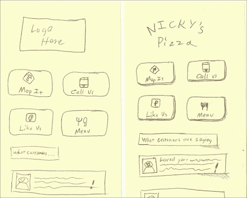

第一张图肯定足够好，可以拿起来，放在手里，假装它是一个智能手机屏幕。在第二张图中，我们可以看到实际绘制标志会产生多大的不同，以及添加较硬的边缘和阴影会给人一种深度感。稍微擦亮一下，效果就大不同。

有几种方法可以为您的绘画添加投影阴影。最艺术的方式是使用铅笔，但使用铅笔绘图的问题在于会导致污渍，并且会过分关注细节。这些图纸应该是粗略的。如果你稍微搞砸了，没关系。毕竟，你可能每张图只花了不到一分钟，这就是重点。目标是快速实现共享的视觉理解。

这里有四种不同的方式来绘制相同的按钮：铅笔、钢笔、Sharpie 和标记笔。我个人偏爱使用细尖的 Sharpie。

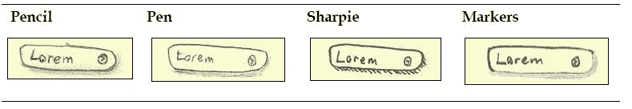

这里还有一些其他 jQuery Mobile 元素和绘制方法：

| **列表视图**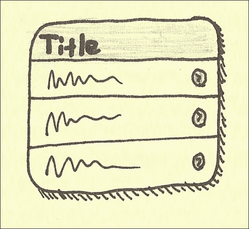 | **对话框**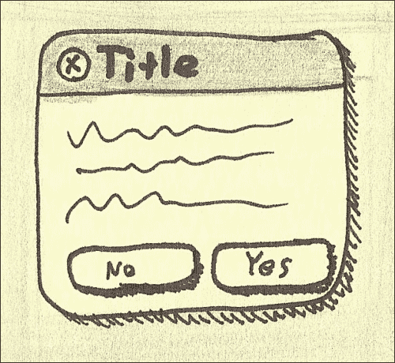 |
| --- | --- |
| **导航栏**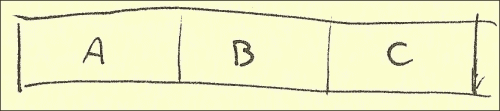 | **按钮**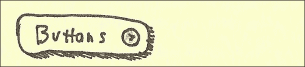 |
| **可折叠** | **分组按钮** |
| **输入**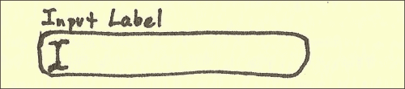 | **搜索** |
| **翻转开关**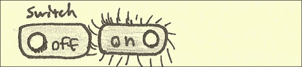 | **滑块**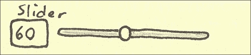 |
| **复选框集** | **单选按钮集**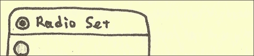 |
| **选择菜单** | **多选** |
| **分割列表视图**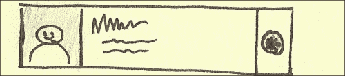 | **气泡计数列表视图**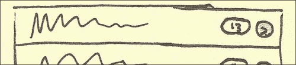 |

## 网站的其余部分

`地图定位`按钮将引导用户到这个页面，在这里我们将列出地址并显示静态谷歌地图。点击地址或地图上的任何一个都将链接到完整的谷歌地图位置。

在 Android 和 iOS 5 系统上，链接到谷歌地图会导致本机系统在本机界面上打开指定位置，从而实现逐步导航。iOS 6 中发生了变化，但我们以后会讨论这个问题。

作为额外的奖励，以防用户不想去实际位置，让我们在标有`电话订餐`按钮上添加一个电话链接。

注意线条的不同粗细。还有一点颜色和我们典型的投影效果。添加这些小细节并不特别困难，但可以产生很大的影响。

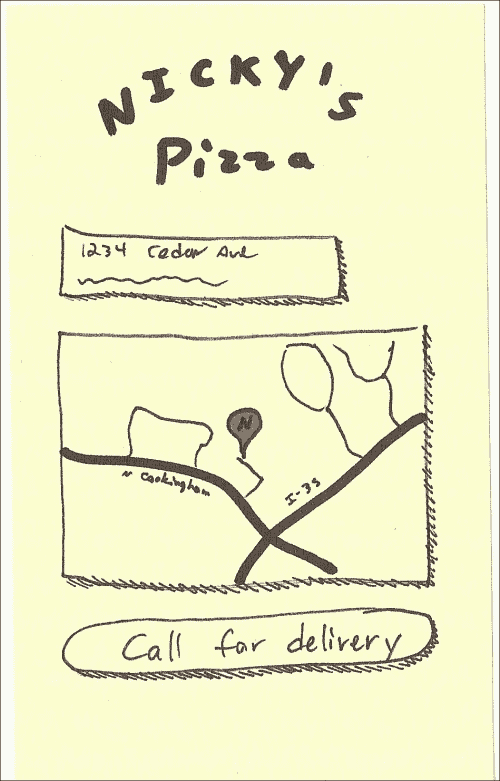

整个网站上的所有`呼叫`按钮都将启动本机呼叫界面。下一张图是 iOS 版本的呼叫对话框。Android 版本基本相似。

注意背景按钮上闪亮的线条，表明它被点击了。还要注意，我们如何将背景（铅笔作品）遮蔽，以表明它的模态状态。

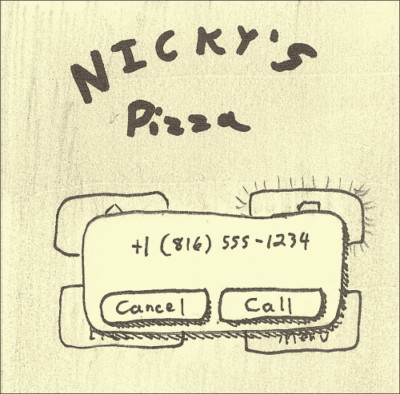

现在，让我们考虑菜单以及将作为全局标头的内容。您放入全局标头的前两个链接将转换为按钮。有一个设置可以在当前主页按钮位置自动插入返回按钮。只需将`data-add-back-btn="true"`添加到 jQuery Mobile 页面中即可。不过，我通常不会使用这个功能。我协助进行的可用性测试表明，大多数人只是按下他们设备的原生返回按钮。因此，让我们将第一个链接设为`主页`，第二个链接设为`呼叫`。

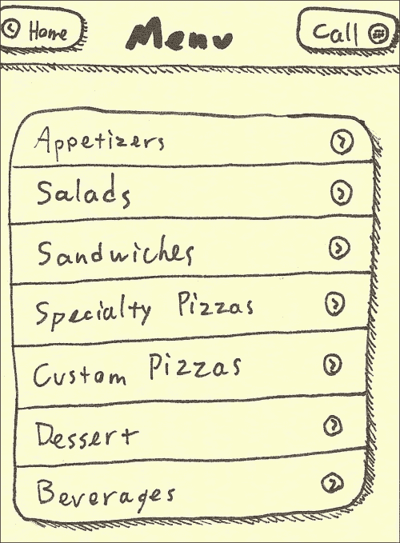

这里我们看到沙拉的详细视图。它基本上和以前一样，但我们在列表视图中进行了一些格式化。我们将在下一章中看到实际的代码。

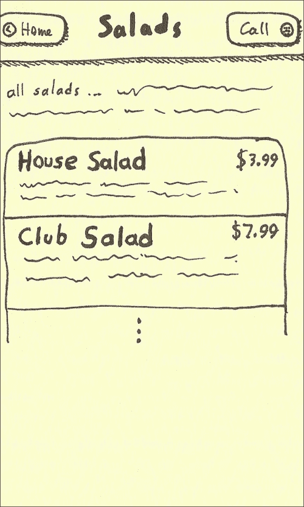

当然，我们可以使用白板和标记笔来完成所有这些工作。我们可以协作地在白板上画出我们的想法，并使用我们打算针对的智能手机拍摄快照。我的建议是使用我们忠实的便利贴，简单地贴在白板上，使用标记笔来指示屏幕流程。下图显示了我在规划项目后的白板情况：

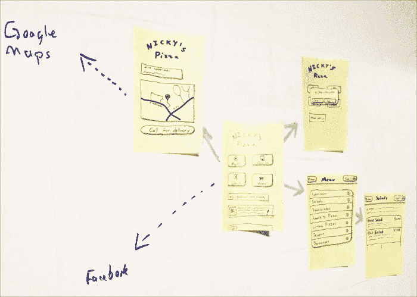

如果我们需要重新映射我们的应用流程，我们所要做的就是重新排列笔记并重新绘制我们的线条。这比在白板上再将一切都重新绘制一遍要少得多。

# 需求

考虑到我们到目前为止所做的事情。考虑到我们绘制的屏幕以及业主能够查看并签字确认这就是他想要的东西，还有多少问题需要问？我们真的需要一个列出需求或一个 30 页的**功能设计规格（FDS）**文档来准确告诉你一切应该是什么样子并且应该做什么吗？这样就够了吗？真的需要用 Photoshop 做吗，然后做成幻灯片展示吗？

还要考虑到到目前为止我们所做的事情总共花了五张便签纸、一个马克笔、一支铅笔和 20 分钟。我相信在大多数情况下，这就是你所需要的，你自己就可以做到。

## 替代纸上原型

如果纸上原型的速度和简洁还不足以说服你远离键盘，那么考虑另外两种快速原型设计的选项：

+   **Balsamiq Mockups** ([`www.balsamiq.com/`](http://www.balsamiq.com/))

+   **Axure RP** ([`www.axure.com/`](http://www.axure.com/))

我个人推荐 Balsamiq Mockups。它产生的原型具有统一但手绘的外观。这将达到与纸上原型相同的效果，但输出更一致，更容易在分布式团队之间进行协作。这两种工具都可以产生完全交互式的模型，用户实际上可以通过原型点击。最终，纸上原型仍然更快，任何人都可以贡献。

# 摘要

对于我们中的一些人来说，从未将纸上原型视为一门严肃的学科，这一开始可能会感到非常奇怪。有幸的是，这里学到的经验扩展了你的思维，并给了你对打造良好用户体验的新热情。如果你想深入探讨构思技术，我最推荐的一本书是 *Gamestorming*，作者是 Dave Gary ([`www.goodreads.com/book/show/9364936-gamestorming`](http://www.goodreads.com/book/show/9364936-gamestorming))。

现在，你应该能够有效地为你的同事和客户勾勒出一个 jQuery Mobile 接口。在下一章中，我们将把这里绘制的内容翻译成一个真正的 jQuery Mobile 实现，超越了普通的 jQuery Mobile 外观和感觉。只要记住，用户体验和可用性是首要的。追求快速、集中的直觉式生产力。
