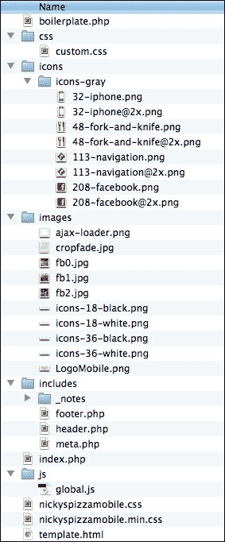
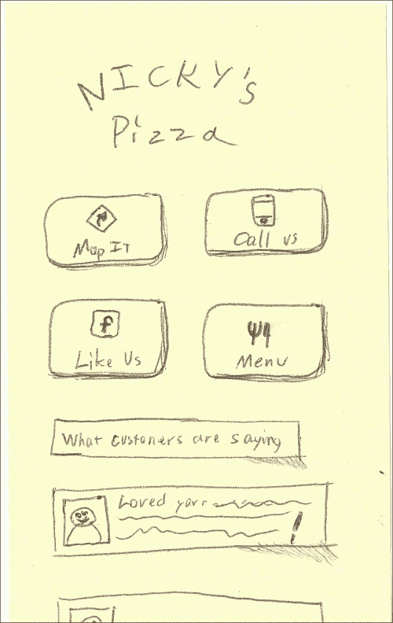
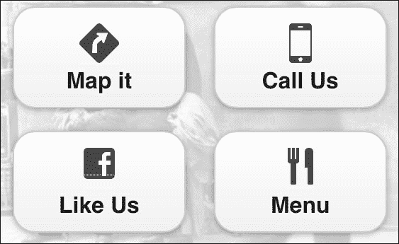
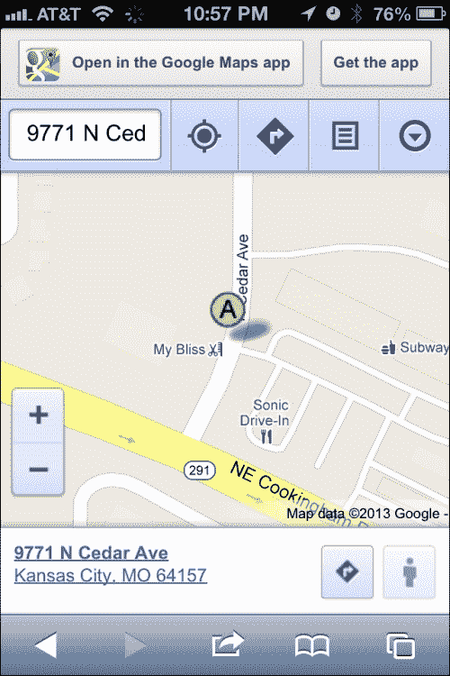
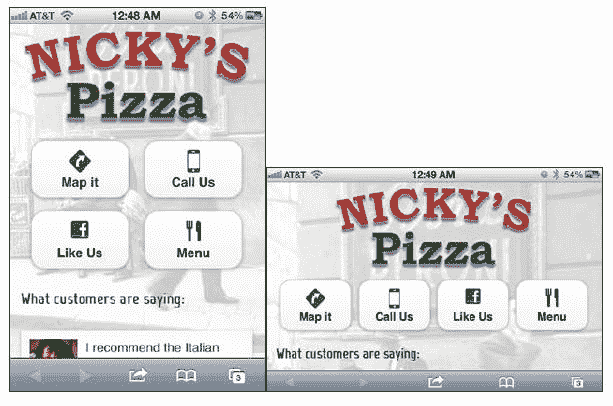
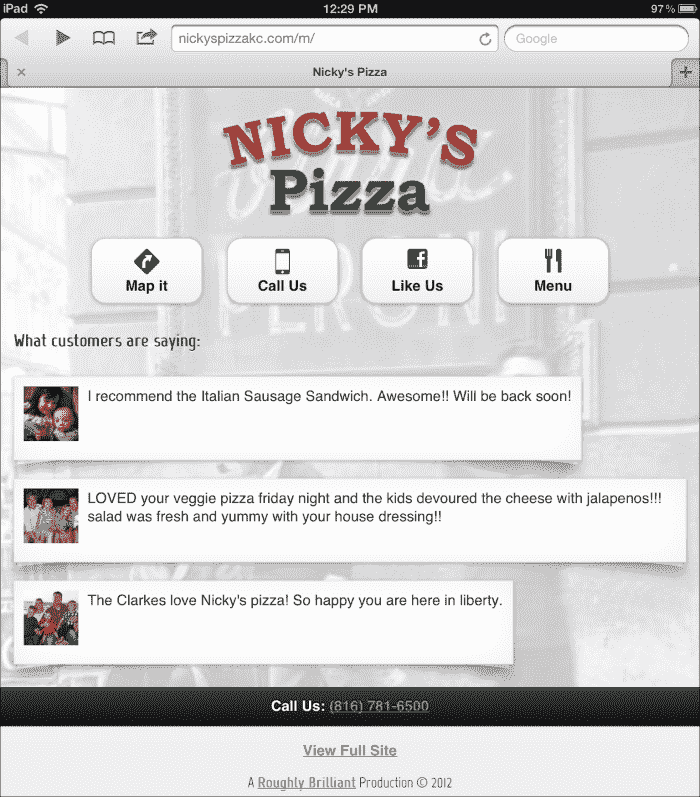

# 第二章：一家小型移动网站

前一章教会了我们一些有关纸质原型的宝贵经验，并为我们开始开发奠定了坚实的基础。现在，我们将把这些图纸变成一个真正的 jQuery Mobile (jQM) 网站，它具有响应式的功能并且看起来独特。

在本章中，我们涵盖：

+   一个新的 jQuery Mobile 样板

+   对完整网站链接的一种新思考

+   将样板分解为可配置的服务器端 PHP 模板

+   使用备用图标集

+   自定义字体

+   仅使用 CSS 实现页面翻页效果

+   性能优化技巧

+   移动设备检测和重定向技术

# 一个新的 jQuery Mobile 样板

jQuery Mobile 文档中有很多隐藏的宝藏。它们是一个很好的起点，但实际上有几种方法可以创建你的基础模板。有单页面模板、多页面模板、带有全局配置的模板以及动态生成的页面。

因此，让我们从基于原始单页面模板的新 jQM 单页面样板开始 ([`view.jquerymobile.com/1.3.0/docs/widgets/pages/`](http:// http://view.jquerymobile.com/1.3.0/docs/widgets/pages/))。随着我们进入其他章节，我们将逐步完善它，使其成为一个全面的模板。以下是我们将为本章创建的基本目录结构和我们将使用的文件：



现在，这是基础 HTML。让我们把它存储在 `template.html` 中：

### 提示

**下载示例代码**

你可以从你在[Packt](http://www.packtpub.com)帐户中下载你购买的所有 Packt 图书的示例代码文件。如果你在其他地方购买了这本书，你可以访问[`www.packtpub.com/support`](http://www.packtpub.com/support)并注册，直接将文件发送到你的邮箱。

```js
<!DOCTYPE html> 
<html>

<head>
    <meta charset="utf-8">
    <meta name="viewport" content="width=device-width, initial-scale=1, maximum-scale=1.0, user-scalable=no">
    <link rel="stylesheet" href="http://code.jquery.com/mobile/1.1.0/jquery.mobile-1.1.0.min.css" />
    <link rel="stylesheet" href="css/custom.css" />
    <script src="img/jquery-1.7.1.min.js"></script>
    <script src="img/custom-scripting.js"></script>
    <script src="img/jquery.mobile-1.1.0.min.js"></script>
    <title>Boilerplate</title> 
</head> 
<body>
    <div data-role="page">
        <div data-role="header">
            <h1>Boilerplate</h1>
        </div>
        <div data-role="content"> 
            <p>Page Body content</p>
        </div>
        <div data-role="footer">
            <h4>Footer content</h4>
        </div>
        <a href="{dynamic location}" class="fullSiteLink">View Full Site</a>
    </div>
</body>
</html>
```

## meta viewport 的不同之处

`meta viewport` 标签是真正使移动设备成为移动设备的关键！没有它，移动浏览器会假设它是一个桌面站点，一切都会变得很小，需要捏合缩放：

```js
<meta name="viewport" content="width=device-width, initial-scale=1, maximum-scale=1.0, user-scalable=no">
```

这个 `meta viewport` 标签与众不同，因为它实际上阻止了所有的捏合缩放操作。为什么？因为现在智能手机不仅仅掌握在了了解这些事情的技术精英手中。我个人见过人们在试图点击链接时不小心放大了页面。他们不知道他们做了什么或如何退出。无论如何，如果你使用 jQuery Mobile，你的用户不需要缩放：

```js
<linkrel="stylesheet" href="css/custom.css" />
```

我们将需要自定义样式。没有别的办法。即使我们使用了 jQuery Mobile ThemeRoller ([`jquerymobile.com/themeroller/`](http://jquerymobile.com/themeroller/))，总会有一些需要覆盖的内容。这就是你放置的地方：

```js
<script src="img/custom-scripting.js"></script>
```

最初在有关全局配置的部分提到（[`jquerymobile.com/demos/1.1.0/docs/api/globalconfig.html`](http://jquerymobile.com/demos/1.1.0/docs/api/globalconfig.html)），这是您放置全局覆盖的地方，以及您可能想要运行或普遍可用的任何脚本：

```js
<a href="{dynamic location}" class="fullSiteLinmk">View Full Site</a>
```

大多数移动网站遵循“最佳实践”，包括一个指向完整网站的链接。它通常位于页脚，并且通常链接到完整网站的主页。好的，很好。工作完成了对吗？错！最佳实践更应该被标记为“行业标准”，因为有更好的方法。

## 超越行业标准的完整网站链接

简单包括一个完整网站链接的行业标准未能支持用户的心理状态。当用户在移动网站上导航时，他们清楚地表明了他们想要查看的内容。支持用户从移动到完整网站的心理模型转换是更多工作，但打造良好的用户体验始终是如此。

想象一下。萨莉正在我们的移动网站上四处浏览，因为她想要从我们这里购买商品。她实际上花了时间向下浏览或搜索她想要查看的产品。然而，由于移动设备的限制，我们做出了一些有意识的选择，不在那里放置所有信息。我们只包括市场研究显示人们真正关心的重点。此时，她可能有点沮丧，因为她点按完整网站链接以获取更多信息。完整网站链接是以传统（懒惰）方式编码的，将她带到完整网站的根目录，现在她必须再次找到产品。现在她必须使用捏和缩放来做到这一点，这只会增加她的烦恼。除非萨莉非常感兴趣，否则她在经历了如此糟糕的体验后，继续在移动设备上查找的机会有多大，她会在桌面浏览器上回来的机会有多大？

现在，相反地，想象一下同样的移动产品页面经过深思熟虑地制作，将完整网站链接指向产品页面的桌面视图。这正是我们在我的工作地方所做的。每个可能的移动页面都明确映射到其桌面等效页面。这种无缝的过渡已经通过实际客户的用户测试，并获得了 50%的冷漠和 50%的喜悦的混合反应。用户方面肯定会有惊喜，因为它违反了他们的期望，但没有一个负面的反应。如果这不成功地论证了重新考虑传统方式处理完整网站链接的情况，我不知道还有什么。

当然，你可能会有用户体验专业人员，他们会使用像“一致性”、“最佳实践”、“行业标准”和“违背用户期望”这样的流行词汇。如果用户测试的证据无法说服他们，给他们一些以下哲学的剂量：

+   **一致性**：这种方法在自身内部是一致的。每个完整站点链接都映射到完整站点的那个页面。

+   **最佳实践**：实践只有在新的、更好的实践出现之前才是最佳的。如果他们宁愿坚持*旧*的最佳实践，那么也许他们应该卖掉他们的汽车，换一匹马和马车。

+   **行业标准**：行业标准是全世界试图跟随创新者的支撑物。好往往是伟大的敌人。不要满足于它。

+   **违背用户期望**：如果我们告诉用户我们将发送给他们一个免费的 MP3 播放器，然后我们发送给他们一台 128 GB 的 iPad 4，我们违背了他们的期望吗？是的！他们会介意吗？有些期望值是值得违背的。

让我们考虑另一面。如果用户确实想要转到完整站点的起始页面呢？嗯，他们只需一步之遥，因为现在他们只需点击主页按钮。因此，很有可能，我们已经为用户节省了几个导航步骤，而且最坏的情况下，只增加了一个步骤回到起点。

从好到伟大，细节决定成败。这确实是一个小细节，但我向你挑战，每页额外花 30 秒去做好这部分工作。

# 全局 JavaScript

由于 jQuery Mobile 中的 Ajax 导航和渐进增强，有很多不同和额外的事件。让我们考虑我发现最有用的三个独特的 jQuery Mobile 事件。我们不会立即使用它们，只是了解它们，并确保阅读注释。最终，我们将创建 `/js/global.js` 来存放我们需要的脚本。目前，只需阅读以下脚本：

```js
// JavaScript Document  

$('div[data-role="page"]').live( 'pageinit', 
function(event){          
    /* Triggered on the page being initialized, after
     initialization occurs. We recommend binding to this 
     event instead of DOM ready() because this will work
     regardless of whether the page is loaded directly or 
     if the content is pulled into another page as part of 
     the Ajax navigation system. */ 
});  

$('div[data-role="page"]').live('pagebeforeshow', function(event){   
    /* Triggered on the "toPage" we are transitioning to, 
     before the actual transition animation is kicked off. 
     Callbacks for this event will receive a data object as 
     their 2nd arg. This data object has the following  
     properties on it: */ 
});  

$('div[data-role="page"]').live( 'pageshow', 
function(event){    
    /* Triggered on the "toPage" after the transitionanimation has completed. Callbacks for this event will 
    receive a data object as their 2nd arg. This data 
    object has the following properties on it: */ 
});
```

## `.live` 与 `.on`

你可能已经注意到，我们在这里使用了 `.live` 方法来捕获事件。该方法自 jQuery 1.7 版本起已被弃用。截至撰写本文时，我们使用的是 jQuery 1.9 版本。然而，即使你查看文档中事件处理程序的示例，它们仍然在多个地方使用 `.live`。

`.live` 函数的作用是检查到达文档级别的每个事件，并查看它是否与选择器匹配。如果匹配，则执行该函数。`.live` 如此有用的原因在于，它非常适用于处理变动和动态注入的元素。毕竟，绑定尚不存在的东西很困难。但你总是可以依靠 `.live` 来捕获事件。由于它被过度使用且效率一般，它已被弃用，改用 `.on`。因此，下面是我们如何使用以下新方法完成相同任务的方式：

```js
$('div[data-role="page"]').live( 'pageinit', function(event){
  var $page = $(this);
});
```

将变为

```js
$(document).on('pageinit', function(event){
  var $page = $(event.target);
});
```

如果你想要针对每个页面进行处理，这样做非常合适。现在让我们考虑一个代码片段，可以单独针对单个页面的初始化：

```js
$('#someRandomPage').live( 'pageinit', function(event){
  var $page = $(this);
});
```

将变成

```js
$(document).on('pageinit', '#someRandomPage', function(event){
  var $page = $(event.target);
});
```

差异微妙，最终对于我们来说，从性能的角度来看并不会产生任何差异，因为我们处理的是一个围绕让页面事件冒泡到文档级别的框架。在 jQuery Mobile 实现中，使用`.on`与`.live`不会带来性能提升。但是，当你不得不更新时，可能会遇到升级头疼，因为它们最终摒弃了`.live`。

# 全局 CSS

如果这是你第一次接触响应式网页设计，大多数情况下，你的自定义样式将在默认部分。其他部分是用来覆盖默认样式，以适应其他设备的宽度和分辨率。`Horizontal Tweaks`部分是用来覆盖横向方向的样式。`iPad`部分适用于 768px 和 1024px 之间的平板分辨率。在`HD and Retina Tweaks`部分，你很可能只需要覆盖背景图样式以替换更高分辨率的图形。我们很快将看到这些实例，并将我们使用的内容放入`/css/custom.css`。与此同时，只需要看看这些结构。

```js
/* CSS Document */  
/* Default Styles   -------------*/  

/* Horizontal Tweaks   ----------*/ 
@media all and (min-width: 480px){   

}  

/* HD and Retina Tweaks ---------*/ 
@media only screen and (-webkit-min-device-pixel-ratio: 1.2),        
only screen and (min--moz-device-pixel-ratio: 1.2),       
only screen and (min-resolution: 240dpi) {   

}   

/* iPad ----------------*/ 
@media only screen and (min-device-width: 768px)
and (max-device-width: 1024px) {      

}

```

# 将 HTML 分解为服务器端模板

通常情况下，我是一个 Java 程序员，但由于 **LAMP** (**Linux, Apache, MySql, PHP**) 平台的普及，我选择了 PHP。其实我们在这里真正做的就是使用变量和服务器端包含来使我们的模板具有一致性和灵活性。

这并不是真正的生产代码。这只是将初始 HTML 拆分成漂亮的 PHP 样板。如果你现在想将其保存到文件中，我建议使用`/boilerplate.php`：

```js
<?php   
    /* the document title in the <head> */  
    $documentTitle = "jQuery Mobile PHP Boilerplate";       

    /* Left link of the header bar       
     *   
     * NOTE: If you set the $headerLeftLinkText = 'Back'     
     * then it will become a back button, in which case,     
     * no other field for $headerLeft need to be defined.    
     */     
    $headerLeftHref = "/";  
    $headerLeftLinkText = "Home";   
    $headerLeftIcon = "home";       

    /* The text to show up in the header bar */ 
    $headerTitle = "Boilerplate";   

    /* Right link of the heaer bar */   
    $headerRightHref = "tel:8165557438";    
    $headerRightLinkText = "Call";  
    $headerRightIcon = "grid";      

    /* The href to the full-site link */    
    $fullSiteLinkHref = "/";     
?>  
<!DOCTYPE html>  
<html> 
  <head>    
    <?php include "includes/meta.php" ?> 
  </head>  
  <body>
    <div data-role="page">

      <?php include "includes/header.php" ?>

      <div data-role="content">              
        <p>Page Body content</p>         
      </div>      

      <?php include "includes/footer.php" ?>                    
    </div> 
  </body> 
</html> 
```

现在我们将提取大部分的头部内容，并将其放入`/includes/meta.php`中：

```js
<meta charset="utf-8">
<meta name="viewport" content="width=device-width, initial-scale=1, maximum-scale=1.0, user-scalable=no">
<linkrel="stylesheet" href="http://code.jquery.com/mobile/1.2.0/jquery.mobile-1.2.0.min.css" />
<linkrel="stylesheet" href="css/custom.css" />
<scriptsrc="img/jquery-1.8.2.min.js"></script>
<!-- from https://raw.github.com/carhartl/jquery-cookie/master/jquery.cookie.js-->
<scriptsrc="img/jquery.cookie.js"></script>
<scriptsrc="img/global.js"></script>
<scriptsrc="img/jquery.mobile-1.2.0.min.js"></script>src="img/jquery.mobile-1.1.0.min.js"></script>

<title><?=$documentTitle?></title>
```

### 注意

注意`js/jquery.cookie.js`中的 cookies 插件。你需要从[`github.com/carhartl/jquery-cookie`](https://github.com/carhartl/jquery-cookie)下载它。我们稍后将在移动设备检测中使用它。

现在，让我们将页面头部变为动态内容，并将其放入`/includes/header.php`中：

```js
<div data-role="header">	
<?PHP if(strtoupper ($headerLeftLinkText) == "BACK"){?>	<a data-icon="arrow-l" href="javascript://"                 
data-rel="back"><?=$headerLeftLinkText?></a>		
<?PHP } else if($headerLeftHref != ""){ ?>
<a<?PHP if($headerLeftIcon != ""){ ?>	
data-icon="<?=$headerLeftIcon ?>" 			
<?PHP } ?>href="<?=$headerLeftHref?>"><?=$headerLeftLinkText?></a>
<?PHP } ?>

<h1><?=$headerTitle ?></h1>

<?PHP if($headerRightHref != ""){ ?>
<a<?PHP if($headerRightIcon != ""){ ?>	
data-icon="<?=$headerRightIcon ?>" 
data-iconpos="right" 			
<? } ?>
href="<?=$headerRightHref?>"><?=$headerRightLinkText?></a>
<?PHP } ?>	
</div><!-- /header -->
```

接下来，让我们将页脚内容提取到`/includes/footer.php`中：

```js
<div data-role="footer">		
<insert 2 spaces>
<h4>Footer content</h4>	
</div><!-- /footer -->
<p class="fullSite">
<a class="fullSiteLink" href="<?=$fullSiteLinkHref?>">View Full Site</a>
</p>
<p class="copyright">&copy; 2012</p>
```

头部和底部的 PHP 文件是设置并忘记的文件。我们只需要在主页和`meta.php`、`header.php`和`footer.php`上填写一些变量，剩下的就交给它们来处理。`headers.php`被编码成当您的`$headerLeftLinkText`设置为单词`Back`（不区分大小写），它就会将头部的左侧按钮变成返回按钮。

# 我们需要创建我们的网站的内容

我们已经有了一个可行的样板文件。我们有了一个客户。让我们开始工作，并编写我们在第一章中绘制的内容，*jQuery Mobile 原型*。在本章中，我们将只专注于第一个屏幕，因为这是我们教授技能所需的全部内容。



这是我们需要考虑的内容：

+   标志：我们将简单地包含桌面视图中的标志。

+   按钮：我们可以通过几种方式来完成这些按钮。乍一看，我们可能会考虑使用标准的`data-role="button"`链接。我们可以利用`ui-grid` ([`jquerymobile.com/demos/1.2.0/docs/content/content-grids.html`](http://jquerymobile.com/demos/1.2.0/docs/content/content-grids.html)) 来添加格式。如果我们只打算针对垂直持有的手机进行优化，那将是一个很好的方法。然而，我们要在这里跳出框架，创建一个在不同分辨率下反应良好的响应式菜单。

+   图标：这些不是标准的 jQuery Mobile 图标。在线有无数的图标集可供我们使用，但我们选择**Glyp****hish** ([`glyphish.com/`](http://glyphish.com/))。它们制作了包含多个尺寸、视网膜显示优化和原始 Adobe Illustrator 文件的高质量图标，以防您想要调整它们。这是一个非常优秀的选择。

+   客户见证：这看起来非常适合使用带有图像的列表视图。我们将从他们的 Facebook 页面上提取这些内容。

## 获取 Glyphish 并定义自定义图标

Glyphish 有一个许可证，允许在署名下免费使用。免费套装 ([`www.glyphish.com/download/`](http://www.glyphish.com/download/)) 只有一个尺寸和 200 个图标，"专业"套装有多个尺寸、400 个图标和无限许可证。仅需 25 美元，这是一个不费吹灰之力的选择。

创建一个带有图标的按钮非常简单。你所需要做的就是使用`data-icon`属性。像下面的代码一样，将产生一个按钮，如下图所示：

```js
<a href="index.html" data-role="button" 
data-icon="delete">Delete</a>
```


你可能还没有意识到 jQuery Mobile 实际上是这样做的。无论你将`data-icon`的值写成什么样，它都将成为按钮上的一个类名。如果你有一个`data-icon="directions"`的属性，那么 jQM 应用的类就是`ui-icon-directions`。当然，你需要像这样在你自己的自定义 CSS 文件中制作这个。我们将把这个以及其他类似的内容放入`css/custom.css`中。

```js
.ui-icon-directions{   
    background-image: 
    url(../icons/icons-gray/113-navigation.png);   
    height:28px;    
    width:28px;   
    background-size:28px 28px;   
    margin-left: -14px !important;  
}
```

另一件你需要做的事情是去掉典型图标周围的彩色圆盘。我们还需要删除边框半径，否则我们的图标将被裁剪以适应`ui-icon`样式中定义的圆形半径的形状。为此，我们将为每个要以这种方式自定义的链接添加`glyphishIcon`类。我们还需要将此定义添加到我们的`custom.css` **：**

```js
.glyphishIcon .ui-icon{   
    -moz-border-radius: 0px;   
    -webkit-border-radius: 0px;   
border-radius: 0px;    
background-color:transparent; 
}
```

最后，我们在首页上的四个按钮的代码将如下所示：

```js
<div class="homeMenu">
<a class="glyphishIcon" href=" https://maps.google.com/maps?q=9771+N+Cedar+Ave,+Kansas+City,+MO+64157&hl=en&sll=39.20525,-94.526954&sspn=0.014499,0.033002&hnear=9771+N+Cedar+Ave,+Kansas+City,+Missouri+64157&t=m&z=17&iwloc=A" data-role="button" data-icon="directions" data-inline="true" data-iconpos="top">Map it</a>
<a class="glyphishIcon" href="tel:+18167816500" data-role="button" data-inline="true" data-icon="iphone" data-iconpos="top">Call Us</a>
<a class="glyphishIcon" href="https://touch.facebook.com/nickyspizzanickyspizza" data-role="button" data-icon="facebook" data-iconpos="top" data-inline="true">Like Us</a>
<a class="glyphishIcon" href="menu.php" data-role="button" data-inline="true" rel="external" data-icon="utensils" data-iconpos="top">Menu</a>
</div>
```

它会在屏幕上呈现如下的截图所示：



# 链接到电话、电子邮件和地图

移动浏览器具有独特的可用性优势。如果我们想要链接到一个电子邮件地址，本机电子邮件客户端将立即弹出。以下代码是一个示例：

```js
<a href="mailto:shane@roughlybrilliant.com" >email me</a>
```

我们也可以对电话号码采取相同的方式，每个设备都会立即弹出一个选项，让用户拨打那个号码。这是桌面无法匹敌的功能，因为大多数桌面设备都没有电话功能。这是来自前述代码的`href`元素：

```js
href="tel:+18167816500"
```

地图是移动设备的另一个特色，因为几乎所有智能手机都内置了 GPS 软件。以下是地图链接的`href`元素。它只是一个到谷歌地图的标准链接：

```js
href="https://maps.google.com/maps?q=9771+N+Cedar+Ave,+Kansas+City,+MO+64157"
```

对于 iOS 5 和 Android，操作系统将拦截该点击，并在本机地图应用程序中显示位置。iOS 6 更改了这种模式，但我们仍然可以链接到谷歌地图链接，用户将会看到网页视图，并提示他们在 iOS 中打开谷歌地图，如下图所示：



对于除了 iOS 和 Android 之外的平台，用户将直接转到谷歌地图网站。这很好，因为谷歌在使该网站可用于任何设备，包括非智能手机方面做得非常出色。

当然，我们可以就此结束，并且说它已经足够好了，但我们可以做更多的工作，通过发送用户到内置的苹果地图应用程序，为苹果用户提供更好的体验。这段代码将创建一个具有可配置属性的对象，用于配置和未来的适应。它通过版本嗅探来查看操作系统的主要版本是否大于 5。如果是，它将吸收谷歌地图链接。

这些链接可以通过两种方式进行转换。首先，它会查找超链接上的`data-appleMapsUrl`属性并使用它。如果链接上没有这个属性，它将检查`forceAppleMapsConversionIfNoAlt`配置选项，看看您是否已经配置了转换器对象来直接转换谷歌地图链接。

一旦系统意识到这部手机需要切换，它就会将这个事实存储到`localStorage`中，这样它就不必再次进行版本检查的工作。它只会检查`localStorage`中的值是否为`true`。

以下是位于`/js/global.js`的代码：

```js
var conditionalAppleMapsSwitcher = {
  appleMapsAltAttribute:"data-appleMapsUrl",
  forceAppleMapsConversionIfNoAlt:true,
  iPhoneAgent:"iPhone OS ",
  iPadAgent:"iPad; CPU OS ",
  process: function(){
    try{
      var agent = navigator.userAgent;
      if(window.localStorage && localStorage.getItem("replaceWithAppleMaps")){
        if(localStorage.getItem("replaceWithAppleMaps") == "true"){
          this.assimilateMapLinks();
        }
      }else{
        var iOSAgent = null;
        if(agent.indexOf(this.iPhoneAgent) > 0){
          iOSAgent = this.iPhoneAgent
        }
        else if(agent.indexOf(this.iPadAgent) > 0){  
          iOSAgent = this.iPadAgent
        }
        if(iOSAgent){
          var endOfAgentStringIndex = (agent.indexOf(iOSAgent)+iOSAgent.length);
          var version = agent.substr(endOfAgentStringIndex, agent.indexOf(" " , endOfAgentStringIndex));
          var majorVersion = Number(version.substr(0, version.indexOf("_")));
          if(majorVersion > 5){
            localStorage.setItem("replaceWithAppleMaps", "true");
            this.assimilateMapLinks();
          }
        }
      }
    }catch(e){}
  },
  assimilateMapLinks:function(){
    try{
      var switcher = this;
      $("a[href^='http://maps.google.com']").each(function(index, element) {
        var $link = $(element);
        if($link.attr(switcher.appleMapsAltAttribute)){
          $link.attr("href", $link.attr(switcher.appleMapsAltAttribute));
        }else if(switcher.forceAppleMapsConversionIfNoAlt){
          $link.attr("href", $link.attr("href").replace(/maps\.google\.com\/maps/,"maps.apple.com/"));
        }
      });
    }catch(e){}
  }
```

使用这段代码，现在很容易在我们的`/js/global.js`中的`pageinit`上调用它：

```js
$(document).on("pageinit", function(){        conditionalAppleMapsSwitcher.process();        
});
```

这种方法对用户来说是完全无缝的。无论他们使用的是什么系统，他们都会在尝试访问您客户的业务时获得最无摩擦的体验。

## 自定义字体

自定义字体出现在他们的完整网站上（因此也是他们品牌的一部分）。这些字体在移动端同样适用。像 iOS、Android 和最新的 BlackBerry 完全支持 `@font-face` CSS。旧版 BlackBerry 和 Windows Phone 可能会根据用户的型号支持或不支持 `@font-face`。对于任何不支持 `@font-face` 的人，他们将只看到您在 `font-family` 规则中指定的标准网络字体。有许多不同的网络字体提供商：

+   **Google Web** **Fonts** ([`www.google.com/webfonts/`](http://www.google.com/webfonts/))

+   **TypeKit** ([`typekit.com/`](https://typekit.com/))

+   **Font** **Squirrel** ([`www.fontsquirrel.com/`](http://www.fontsquirrel.com/))

+   **Fonts.com** **Web Fonts** ([`www.fonts.com/web-fonts`](http://www.fonts.com/web-fonts))

对于我们的项目，我们将使用 Google Web Fonts。我们需要在每个我们想要使用它们的页面的`<head>`中包含这些行。因为我们可能会在任何地方使用它们，所以让我们把这些行直接包含在我们的文件`/includes/meta.php`中。

```js
<link href='http://fonts.googleapis.com/css?family=Marvel' rel='stylesheet' type='text/css'>
```

一旦我们在`<head>`中链接了我们的字体，我们将需要在`/css/custom.css`文件中使用`font-family`规则来指定它们的使用方式，如下所示：

```js
h1,h2,h3,.cardo{font-family: Marvel, sans-serif;}
```

现在，对于任何（大多数情况下）支持它的浏览器，他们将看到如下内容：


### 注意

**注意**：网络字体并不轻量级。Marvel 的体积为 20 KB。不算大，但也不小。你不会想包含太多这样的字体的。

## 列表项的页面翻页阴影效果

我们将使用无序列表来布置客户的推荐。我们可以使用图像列表视图，但我们也想要在每个项目之间有一些间距以及一个页面翻页效果。所以，让我们只是给一个普通的无序列表加样式。尽可能避免覆盖标准的 jQuery Mobile 代码。那只是在找麻烦。每当你覆盖一个被设计成一个框架的东西（比如 jQuery Mobile）时，你都会面临下一个版本完全破坏你所做的覆盖和自定义适应的风险。

此定制的代码稍后将在本章显示并标记为最终的 CSS。重点是，我们将使用 CSS3 来完成这个。大多数移动浏览器完全支持 CSS3，包括转换、过渡、动画、阴影、渐变和圆角。古老的平台，如 Windows Phone 7 和 BlackBerry 5，是基于 Internet Explorer 7 或更早版本的，并且不完全支持 CSS3。在这些情况下，他们不会看到花哨的页面翻页效果，而只会看到一个包含图像和文本的白色框。虽然不是理想的情况，但这是一个完全合理的后备方案。

## 优化：为什么你应该首先考虑它

我相信优化是如此重要，以至于你需要在一开始就知道并且意识到它。你将做一些了不起的工作，我不希望你或你的利益相关者认为它不够了不起，或者慢，或者其他任何东西，因为你不知道如何挤压系统性能的技巧。从你的创作中获得最佳性能的窍门永远不嫌早。移动环境是一个非常苛刻的环境，本节中的一些技巧将产生比任何“最佳编码实践”更大的影响。

从性能的角度来看，绝对没有比 HTTP 请求更糟糕的事情了。这就是为什么 CSS 精灵是个好主意。我们发出的每一个请求都会减慢我们的速度，因为 TCP/IP 协议假定每个请求的可用带宽从几乎零开始。因此，我们不仅需要通信的延迟时间来开始从服务器拉取资产，而且还需要一段时间才能将该资产以最大可能的速度传输。4G 也无法拯救我们脱离这些事实。当然，它们一旦开始传输，传输速率是很快的，但是实际开始传输的延迟时间才是我们的致命问题。我们还必须考虑到用户在多久或没有接收到信号的情况下发现自己。这在建筑物中尤其如此。因此，以下是一些优化移动站点的技巧：

+   **通过尽可能合并尽可能多的资产来减少 HTTP 请求。** 当 **SPDY 协议** ([`www.chromium.org/spdy/spdy-whitepaper/`](http://www.chromium.org/spdy/spdy-whitepaper/)) 最终获得进展时，它将解决我们的问题，但是，目前和可预见的未来，这是最让我们变慢的原因。这也是为什么我不会建议用户使用像 **Require.js** ([`requirejs.org/`](http://requirejs.org/)) 这样的工具来动态加载页面中所需的内容。不要偷懒。了解你的页面需要什么，并尽可能合并。

+   **在服务器上启用 gzip 压缩。** 任何给定服务器都很有可能启用了 gzip 压缩，但是你应该检查一下。这将使你的基于文本的资产（HTML、CSS、JS）在传输时缩小多达 70%。这实际上比缩小代码更有影响。想要了解更多，请查看[`developers.google.com/speed/articles/gzip`](https://developers.google.com/speed/articles/gzip)。

+   **缩小文件。** 缩小是这样一个过程，一个完全可读的代码被剥夺了所有有用的空格、格式和注释。推送到浏览器的只是代码。有些人甚至会将变量和函数名称改为一个或两个字母的替换。这对于长期稳定的代码确实是一个好主意。具有倾向于在一开始就比较大的库，如 jQuery，肯定会受益。然而，对于你自己的代码，最好保持其可读性，这样如果必要的话，你就可以进行调试。就尽量让你的 HTML 页面保持在 25 KB（未压缩）以下，你的 JS 和 CSS 文件在 1 MB（同样未压缩）以下。雅虎进行的一项研究表明，在所有平台上，这似乎是设备在访问之间允许被缓存的最低公共分母（[`www.yuiblog.com/blog/2010/07/12/mobile-browser-cache-limits-revisited/`](http://www.yuiblog.com/blog/2010/07/12/mobile-browser-cache-limits-revisited/)）。

+   **缓存和微缓存**。如果你使用的是大多数其他网站上的 Apache（[`news.netcraft.com/archives/2012/01/03/january-2012-web-server-survey.html`](http://news.netcraft.com/archives/2012/01/03/january-2012-web-server-survey.html)），你可以很容易地使用`htaccess`文件设置缓存。如果你为某种类型的资源指定了一个月的缓存时间，那么浏览器将尝试在一个月内将这些资源保存在缓存中，甚至都不会检查服务器上是否有新的内容。在这里要小心。你不希望对任何可能需要迅速更改的东西设置长时间的缓存时间。然而，那些不会改变的 JavaScript 库和图像等内容肯定可以被缓存而不会产生任何不良影响。

    为了保护自己免受流量洪泛的影响，你可以使用`htaccess`缓存规则，使页面保持时间尽可能短，例如一分钟，使用以下代码：

    ```js
    # 1 MIN 
    <filesMatch "\.(html|htm|php)$">
      Header set Cache-Control "max-age=60, private, proxy-revalidate" 
    </filesMatch>
    ```

    你可以在[`www.askapache.com/htaccess/speed-up-sites-with-htaccess-caching.html`](http://www.askapache.com/htaccess/speed-up-sites-with-htaccess-caching.html)上了解更多关于 htaccess 缓存的内容。

+   **不要使用图片，如果可以用 CSS3 实现**。CSS3 标准始于 1999 年。W3C 在 2009 年开始起草 CSS4 推荐的第一稿。现在是让网络向前发展，让旧版本的浏览器归于历史的时候了。如果有人使用不支持 CSS 渐变的浏览器，让他们退回到他们丰富应得的纯色背景。如果他们的浏览器不支持 CSS 中的圆角，那么他们只能用方角了。

    如果潜在客户希望您超越网络标准来支持古老的技术，或者坚持像素完美的设计，那么辞退客户，或者收取足够多的额外费用以使其值得您的时间。像素完美的设计在桌面上已经很困难了。移动设备是一个无序之地，每个人都在实现自己的解决方案，只是稍有不同，以至于您永远不可能实现像素完美的解决方案。 ([`dowebsitesneedtolookexactlythesameineverybrowser.com/`](http://dowebsitesneedtolookexactlythesameineverybrowser.com/))

    在可能的情况下，使用 CSS3 代替图像以节省重量和 HTTP 请求。现在大多数现代智能手机都支持它（iOS、Android、BlackBerry 6+、Windows Phone 8+）。到 2013 年和 2014 年，几乎所有早期的智能手机都将被替换。

## 最终产品

现在我们已经具备了制作第一页所需的所有要求、知识和资产。我们将把这段代码作为第一页，并将其命名为 `index.php`。所有示例的图像都提供在源文件夹中。

以下是 `index.php` 的最终代码：

```js
<?php 
 $documentTitle = "Nicky's Pizza";

 $headerLeftHref = "/";
 $headerLeftLinkText = "Home";
 $headerLeftIcon = "home";

 $headerTitle = "Boilerplate";

 $headerRightHref = "tel:8165077438";
 $headerRightLinkText = "Call";
 $headerRightIcon = "grid";

 $fullSiteLinkHref = "/";

?>
<!DOCTYPE html>
<html>
<head>
 <?php include("includes/meta.php"); ?> 
</head>

<body>
<div data-role="page">
    <div data-role="content">

     <div class="logoContainer"></div>

        <div class="homeMenu">
            <a class="glyphishIcon" href="http://maps.google.com/maps?q=9771+N+Cedar+Ave,+Kansas+City,+MO+64157&hl=en&sll=39.20525,-94.526954&sspn=0.014499,0.033002&hnear=9771+N+Cedar+Ave,+Kansas+City,+Missouri+64157&t=m&z=17&iwloc=A" data-role="button" data-icon="directions" data-inline="true" data-iconpos="top">Map it</a>
            <a class="glyphishIcon" href="tel:+18167816500" data-role="button" data-inline="true" data-icon="iphone" data-iconpos="top">Call Us</a>
            <a class="glyphishIcon" href="https://touch.facebook.com/nickyspizzanickyspizza" data-role="button" data-icon="facebook" data-iconpos="top" data-inline="true">Like Us</a>
            <a class="glyphishIcon" href="menu.php" data-role="button" data-inline="true" rel="external" data-icon="utensils" data-iconpos="top">Menu</a>
        </div>

        <h3>What customers are saying:</h3>
        <div class="testimonials">
            <ul class="curl">
                <li>I recommend the Italian Sausage Sandwich. Awesome!! Will be back soon!</li>
                <li>LOVED your veggie pizza friday night and the kids devoured the cheese with jalapenos!!! salad was fresh and yummy with your house dressing!!</li>
                <li>The Clarkes love Nicky's pizza! So happy you are here in liberty.</li>
            </ul>
        </div>

    </div>

    <?php include("includes/footer.php"); ?>
</div>

</body>
</html>
```

## 自定义 CSS

这段代码位于 `/css/custom.css` 中，包含了我们所做的所有自定义外观。其中包括自定义图标、页面翻页效果和自定义字体的定义。任何引用的图像都是客户提供的，并且在最终源文件中提供。

特别注意这里的评论，因为我已经详细说明了每个部分的目的以及它如何融入*响应式网页设计*：

```js
@charset "UTF-8";   

/*************************************************/
/* define the places we'll use custom fonts */
/*************************************************/

h1,h2,h3,.cardo{font-family: Marvel, sans-serif;} 
.logoContainer{
    font-family: Marvel, sans-serif; 
    text-align:center;margin:auto;
} 
.makersMark{
    margin:1.5em auto;
    font-family: Marvel, sans-serif; 
    text-align:center;
} 
.testimonials{margin:0 auto;} 

/*************************************************/
/*  define the background for the site */
/*************************************************/

.ui-content{ 
    background-image:url(../images/cropfade.jpg);
    background-repeat:no-repeat; 
    background-size: 100%;
}

/*************************************************/
/*  override the listview descriptions to allow them */
/*  to wrap instead of simply cutting off with an */
/*  ellipsis */
/*************************************************/

.ui-li-desc{white-space:normal;} 

/*************************************************/
/*  define our custom menu on the front page  */
/*************************************************/

.homeMenu{ text-align:center;} 
.homeMenu .ui-btn{ min-width:120px;  margin:.5em;}  
.glyphishIcon .ui-icon{
    -moz-border-radius: 0px;
    -webkit-border-radius: 0px;
    border-radius: 0px;
    background-color:transparent; 
}
/*************************************************/
/* define custom icons for our four menu buttons  */
/*************************************************/

.ui-icon-directions{
    background-image: url(../icons/icons-gray/113-navigation.png);  
    height:28px;
    width:28px;
    background-size:28px 28px;
    margin-left: -14px !important;
  }
.ui-icon-iphone{
    background-image: url(../icons/icons-gray/32-iphone.png);
    height:28px;
    width:16px;
    background-size:16px 28px;
    margin-left: -8px !important;
  }
.ui-icon-facebook{
    background-image: url(../icons/icons-gray/208-facebook.png);
    height:28px;
    width:22px;
    background-size:22px 22px;
    margin-left: -11px !important;
}
.ui-icon-utensils{
    background-image: url(../icons/icons-gray/48-fork-and-knife.png);
    height:28px;
    width:18px;
    background-size:18px 26px;
    margin-left: -9px !important;  
}  

/*************************************************/
/* define how to show people's Facebook images
/*************************************************/

li img.facebook{padding:0 10px 10px 0;} 

/*************************************************/
/* define the look of the footer content */
/*************************************************/
.fullSite{text-align:center;} 
.copyright{
    text-align:center;font-family: Marvel, sans-serif; 
    marign-top:2em;
} 		

/*************************************************/
/* define how the layout and images will change for */
/* phones in landscape mode.  RESPONSIVE WEB DESGIN */
/*************************************************/

/* Horizontal ----------*/ 
@media all and (min-width: 480px){

  /*************************************************/
  /* reflow the main menu buttons to display as */
  /* four in a row and give some appropriate margin */
  /*************************************************/
.homeMenu .ui-btn{ min-width:100px;  margin:.2em;} 
}  

/*************************************************/
/* define how we'll override the image URLs for */
/* devices with high resolutions. */
/* RESPONSIVE WEB DESIGN */
/*************************************************/
@media only screen and (-webkit-min-device-pixel-ratio: 1.5),    
only screen and (min--moz-device-pixel-ratio: 1.5),    
only screen and (min-resolution: 240dpi) { 	
.ui-icon-directions{ 
   background-image: url(../icons/icons-gray/113-navigation@2x.png);
  }
.ui-icon-iphone{
   background-image: url(../icons/icons-gray/32-iphone@2x.png);
  }
.ui-icon-facebook{
   background-image: url(../icons/icons-gray/208-facebook@2x.png);
  }
.ui-icon-utensils{
   background-image: url(../icons/icons-gray/48-fork-and-knife@2x.png);
  } 
}  

/*************************************************/
/* define the reflow, sizes, spacing for the menu */
/* buttons for iPad.  RESPONSIVE WEB DESIGN
/*************************************************/
/* iPad size -----------*/ 
@media only screen and (min-device-width: 768px) 
and (max-device-width: 1024px) {     
    .homeMenu .ui-btn{ min-width:120px;  margin:.7em; } 
}

/*************************************************/
/* begin page curl CSS */   
/*************************************************/
ul.curl {
    position: relative;
    z-index: 1;  
    list-style: none;   
    margin: 0;
    padding: 0;
  }
ul.curl li {   
    position: relative;
    float: left;
    padding: 10px;
    border: 1px solid #efefef;
    margin: 10px 0;
    background: #fff;   
    -webkit-box-shadow: 0 1px 4px rgba(0, 0, 0, 0.27), 0 0 40px rgba(0, 0, 0, 0.06) inset;   
    -moz-box-shadow: 0 1px 4px rgba(0, 0, 0, 0.27), 0 0 40px rgba(0, 0, 0, 0.06) inset;    
    box-shadow: 0 1px 4px rgba(0, 0, 0, 0.27), 0 0 40px rgba(0, 0, 0, 0.06) inset;    text-align:left;   
}
ul.curlli:before,
ul.curlli:after {   
    content: '';   
    z-index: -1;   
    position: absolute;   
    left: 10px; 	
    bottom: 10px;   
    width: 70%; 	
    max-width: 300px;  
    max-height: 100px;   
    height: 55%;   
    -webkit-box-shadow: 0 8px 16px rgba(0, 0, 0, 0.3);   
    -moz-box-shadow: 0 8px 16px rgba(0, 0, 0, 0.3);   
    box-shadow: 0 8px 16px rgba(0, 0, 0, 0.3);   
    -webkit-transform: skew(-15deg) rotate(-6deg); 	
    -moz-transform: skew(-15deg) rotate(-6deg); 	
    -ms-transform: skew(-15deg) rotate(-6deg);   
    -o-transform: skew(-15deg) rotate(-6deg);   
    transform: skew(-15deg) rotate(-6deg); 
}  
ul.curlli:after {   
    left: auto;
    right: 10px;
    -webkit-transform: skew(15deg) rotate(6deg);
    -moz-transform: skew(15deg) rotate(6deg);
    -ms-transform: skew(15deg) rotate(6deg);
    -o-transform: skew(15deg) rotate(6deg);   
    transform: skew(15deg) rotate(6deg); } 
/*************************************************/
/* end page curl CSS */ 
/*************************************************/
```

# 第一页的结果

让我们来看看我们工作的最终产品。在左侧，我们有纵向视图中的呈现页面，右侧是横向视图：



在两个方向上测试设计非常重要。当有人稍后过来，只是简单地转动手机就破坏了您的工作，这可能会让人感到相当尴尬。



这是在 iPad 上的效果。行业内存在一些关于 iPad 是否算作移动设备的辩论，因为它具有足够的分辨率和足够大的屏幕来查看正常的桌面站点，特别是在横向模式下查看。主张桌面视图的人忽略了一个非常重要的事实。iPad 和所有其他平板电脑，如 Kindle Fire、Nook Color 和 Google Nexus 设备，仍然是触摸界面。虽然全站点仍然可以完美阅读，但交互点可能仍然是小目标。如果是触摸界面，您的客户将更好地通过 jQuery Mobile 服务。

# 引导用户访问我们的移动站点

现在我们已经有了一个很好的移动站点，用户如何到达那里呢？`yourdomain.mobi`？`m.yourdomain.com`？事实上，用户不会直接访问移动站点。他们通常会执行以下两种操作之一：在 Google 中搜索该站点，或者在地址栏中输入主域名，这与他们在桌面站点上的行为相同。因此，我们有责任正确检测移动用户并为他们提供适当的界面。

行业内对此如何完成存在很多争议。大多数专家似乎都同意，你不希望涉足检测特定平台的业务，这被称为用户代理嗅探。起初，这似乎不是一个坏主意。毕竟，实际上只有四个主要平台：iOS、Android、Windows Phone 和 BlackBerry。即使如此，随着未来新平台的开发或主导地位的出现，这种方法很快就会变成一场噩梦。这里真正的问题是，我们为什么要关心他们使用的平台？我们真正关心的是设备的功能。

## 使用 JavaScript 进行检测和重定向

自然地，这不会涵盖移动市场的所有人。即使在美国，智能手机的普及率也仅为 50%。([`blog.nielsen.com/nielsenwire/online_mobile/smartphones-account-for-half-of-all-mobile-phones-dominate-new-phone-purchases-in-the-us/`](http://blog.nielsen.com/nielsenwire/online_mobile/smartphones-account-for-half-of-all-mobile-phones-dominate-new-phone-purchases-in-the-us/)) 但这有关系吗？ 。

如果这种方法最多只能覆盖市场的 50%，那么它真的是一个合适的解决方案吗？是的，但是怎么可能呢？以下两个原因最能解释这个问题：

+   没有智能手机的人通常没有数据计划。在网上冲浪变得经济上不可行。大多数没有智能手机和数据计划的人不会接触到你。

+   拥有旧款智能手机（如 BlackBerry 5 或更早版本）的人可能有数据计划。然而，这些设备的浏览器几乎不值得一提，他们的用户也知道这一点。他们*可能*会访问你的网站，但可能性不大，并且它们的存在正在迅速减少。

在大多数情况下，有可能会使用智能手机访问你的站点的人会有很好的响应。例外情况不值一提。

如果设备支持媒体查询并具有触摸界面，那么它非常适合我们的移动站点。当然，唯一的例外是 Windows Phone 7 上的 Internet Explorer。因此，我们将对他们稍作让步。首先，我们需要为 jQuery 下载 cookie 插件。如果你还没有，请从 [`github.com/carhartl/jquery-cookie`](https://github.com/carhartl/jquery-cookie) 获取，并将其放入 `/js/` 文件夹中。此代码将放置在你想要进行移动重定向的任何文件夹中。

```js
<script type="text/javascript">	
  //First, we check the cookies to see if the user has
  //clicked on the full site link.  If so, we don't want
//to send them to mobile again.  After that, we check for     
  //capabilities or if it's IE Mobile
if("true" != $.cookie("fullSiteClicked") &&
      ('querySelector' in document &&
       'localStorage' in window&&
'addEventListener' in window &&
('ontouchstart' in window || 
window.DocumentTouch && document instanceOf DocumentTouch
)
)     
|| navigator.userAgent.indexOf('IEMobile') > 0
)
{                
location.replace(YOUR MOBILE URL);   
}  
</script>
```

我们还可以根据每个页面的需求定制移动端目标页面。将这种技术与之前创建的动态完整站点链接配对，可以在用户想要切换时实现无缝的移动端和桌面端视图转换。我们现在只有一个问题。我们需要设置一个 Cookie，这样，如果他们点击完整站点链接，就不会被立即重定向回移动端。让我们把这个放到 `/js/global.js` 中：

```js
$("[data-role='page']").live('pageinit', function (event, ui) { 
    $("a.fullSiteLink").click(function(){     
    $.cookie("fullSiteClicked","true", {path: "/", expires: 3600});   
    }); 
}); 
```

对于为移动设备编写的任何 cookie，设置过期时间是个好主意。在台式电脑上，人们倾向于关闭他们的浏览器。在移动设备上，人们点击主页按钮，这可能实际上并未关闭该浏览器的会话。在 Android 上，除非用户明确关闭，否则浏览器永远不会被关闭。

## 在服务器端进行检测

如果你必须将所有移动用户都引导到你的移动站点，你需要在服务器端进行检测，使用类似 **WURFL**（[`wurfl.sourceforge.net/`](http://wurfl.sourceforge.net/)）这样的工具。这是一个由社区维护的无线设备描述符的终极数据库。本质上，这是用户代理嗅探，但是数据库由社区良好维护。该工具将能够告诉你访问你的每个设备的各种有用信息。链接 [`www.scientiamobile.com/wurflCapability/tree`](http://www.scientiamobile.com/wurflCapability/tree) 将为您提供 WURFL 的所有功能的完整列表。我们将在后面的章节中深入了解这个工具的具体原理。

# 总结

在本章中，我们涵盖了很多内容，现在我们具备了所有技能和工具，可以将原本看起来相当普通的移动站点变成独特的东西。我们知道如何使其看起来独特，如何托管它，如何引导用户到达那里，以及如何给他们一个更加功能强大的“降落伞”，以防他们不满意。已经，我们领先于那些刚刚入门的普通开发者数步，而这仅仅是第二章。在下一章中，我们将开始探讨更深入的话题，这些话题通常是大型企业关心的，比如验证、分析等等。
