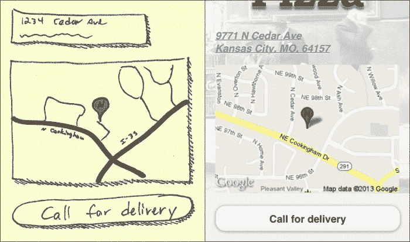
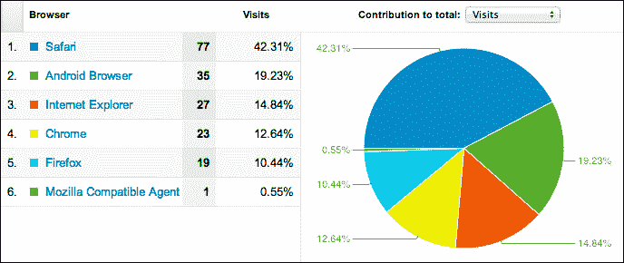
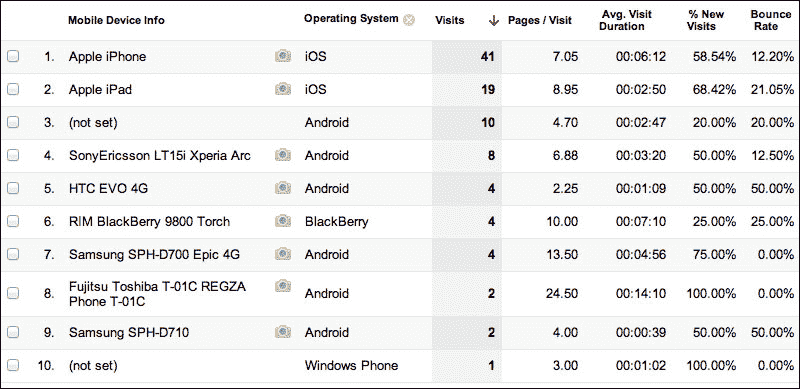
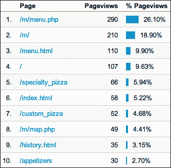
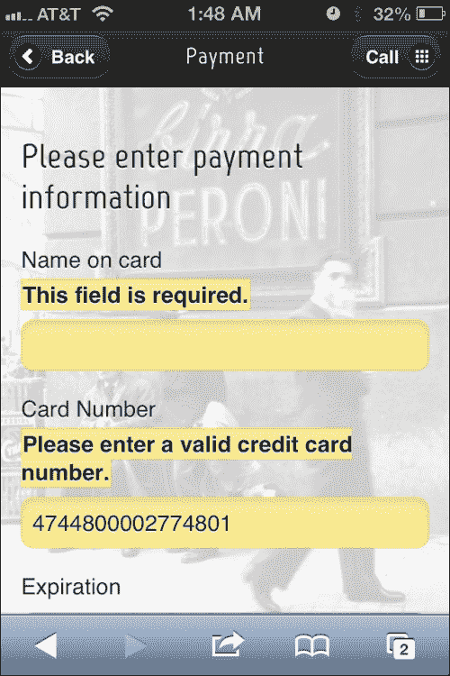

# 第三章：分析、长表单和前端验证

是时候发展了。业务正在增长，没有什么比大型表单、指标和定制体验更能体现出大企业的风范了。

在本章中，我们将涵盖：

+   谷歌静态地图

+   谷歌分析

+   长型和多页表单

+   集成 jQuery 验证

# 谷歌静态地图

在上一章中，我们完全沉浸在如何动态地直接链接到 iOS 和 Android 的本机 GPS 系统中。现在，让我们考虑另一种方法。客户希望有机会向用户显示街道地址、地图，并给他们另一次打电话的机会。在这种情况下，简单地链接到本机 GPS 系统是不够的。如果用户点击地址或地图，我们仍然可以触发它，但作为中间步骤，我们可以从谷歌注入一个静态地图（[`developers.google.com/maps/documentation/staticmaps/`](https://developers.google.com/maps/documentation/staticmaps/)）。

它是否像直接启动应用程序开始逐步转向方向一样惊艳？没有，但它要快得多，也许这就是用户所需要的。他们可能会立即识别出位置，并决定，是的，实际上，他们更愿意打电话。记住，始终从用户的角度来看待事物。并不总是要做我们能做到的最酷的事情。

让我们来看一下客户批准的绘图：



让我们来看一下将放在`/map.php`中的此页面的代码：

```js
<?php 
  $documentTitle = "Map | Nicky's Pizza";

  $fullSiteLinkHref = "/";

  $mapsAddress = "https://maps.google.com/maps?q=9771+N+Cedar+Ave,+Kansas+City,+MO+64157&hl=en&sll=39.20525,-94.526954&sspn=0.014499,0.033002&hnear=9771+N+Cedar+Ave,+Kansas+City,+Missouri+64157&t=m&z=17&iwloc=A";
  $staticMapUrl = "https://maps.googleapis.com/maps/api/staticmap?center=39.269109,-94.45281&amp;zoom=15&amp;size=288x200&amp;markers=color:0xd64044%7Clabel:N%7C39.269109,-94.45281&amp;sensor=true;"
?>
<!DOCTYPE html>
<html>
<head>
  <?php include("includes/meta.php"); ?>
</head>

<body>
<div data-role="page">
  <div data-role="content">
    <div class="logoContainer"></div>
    <p>
      <a href="<?=$mapsAddress ?>">
        <address class="vcard">
          <div class="adr">
            <div class="street-address">9771 N Cedar Ave</div>
            <span class="locality">Kansas City</span>, 
            <span class="region">MO</span>, 
            <span class="postal-code">64157</span> 
            <div class="country-name">U.S.A.</div>
          </div>
        </address>
      </a>
    </p>
    <p><a href="<?= $mapsAddress ?>">" width="288" height="200" /></a></p>
    <p><a href="tel:+18167816500" data-role="button">Call for delivery</a></p>
  </div>
  <?php include("includes/footer.php"); ?>
</div>
</body>
</html>
```

注意使用微格式 ([`microformats.org/`](http://microformats.org/)) 来标记地址。虽然这不是必需的，但自 2007 年以来已经成为相当标准的做法，这是赋予您的信息更多语义价值的好方法。这意味着不仅人们可以读懂它，甚至计算机也可以读懂并理解它。如果您想了解更多关于微格式的信息，可以阅读 Smashing Magazine 的这篇文章：[`coding.smashingmagazine.com/2007/05/04/microformats-what-they-are-and-how-to-use-them/`](http://coding.smashingmagazine.com/2007/05/04/microformats-what-they-are-and-how-to-use-them/)

## 添加 Google Analytics

每个网站都应该有分析功能。如果没有，很难说有多少人访问了您的网站，我们是否通过转化漏斗吸引了人们，或者是哪些页面导致了人们离开我们的网站。

让我们增强全局 JavaScript (`/js/global.js`) 文件，以自动记录每个显示的页面。这是一个非常重要的区别。在桌面世界中，每个分析命中都基于文档就绪事件。这对于**jQuery Mobile**（**jQM**）不起作用，因为基于 Ajax 导航系统的第一个页面是唯一触发页面加载事件的页面。在 jQM 中，我们需要使用以下代码在`pageshow`事件上触发这个动作：

```js
/**********************************************/
/* Declare the analytics variables as global */
/**********************************************/
var _gaq = _gaq || [];

/**********************************************/
/* Initialize tracking when the page is loaded*/
/**********************************************/
$(document).ready(function(e) { 
(function() { 
var ga = document.createElement('script'); 
ga.type = 'text/javascript'; 

//Call in the Google Analytics scripts asynchronously.
ga.async = true;
ga.src = ('https:' == document.location.protocol ? 
'https://ssl' :
'http://www') 
+'.google-analytics.com/ga.js'; 
var s = document.getElementsByTagName('script')[0]; 
s.parentNode.insertBefore(ga, s); })(); 
});

/**********************************************/
/* On every pageshow, register each page view in GA */
/**********************************************/
$("[data-role='page']").live('pageshow', function (event, ui)
{

//wrap 3rd party code you don't control in try/catch
try {
_gaq.push(['_setAccount', 'YOUR ANALYTICS ID']);
if ($.mobile.activePage.attr("data-url")) { 
_gaq.push(['_trackPageview', 
//Pull the page to track from the data-url attribute 
//of the active page.
$.mobile.activePage.attr("data-url")]);
} else { 
_gaq.push(['_trackPageview']); 
} 
} 
 //if there is an error, let's dump it to the console
catch(err) {console.log(err);}
}); 

```

通过使用异步调用来拉取 Google Analytics，我们允许用户继续操作，即使跟踪功能不起作用或加载需要一些时间。通常，对 JavaScript 文件的调用会暂停所有进一步的资产加载和 JavaScript 执行，直到所请求的脚本完全加载和执行为止。我们真的不希望因为一些广告网络或分析跟踪需要一段时间才能响应而导致我们精心设计的、速度快且功能完善的页面受阻。

我们从当前页面的`data-url`属性中提取要跟踪的位置，因为你不能可靠地使用`document.location`函数来进行页面跟踪。jQM 的基于 Ajax 的导航会导致跟踪中出现一些非常奇怪的 URL。jQM 团队正在解决这个问题，但需要一段时间才能在所有设备上提供所需的技术。相反，只需从 jQM 页面的`data-url`属性中提取要跟踪的 URL。如果你动态创建页面，这也是你会为跟踪目的放置自定义页面名称的地方。如果你使用多页面模板，每个页面的 ID 将被跟踪为页面视图。

我们确实还没有做太多的分析工作，但让我们看一些我们已经开始收集的见解。这里只是一小部分技术细分的样本：



以下图片显示了同一视图的完整报告，稍微细分以显示哪些设备最受欢迎：



在前一张图片中，特别关注每个平台整体的**跳出率**列。如果其中一个显着高于另一个，这可能表明我们需要更仔细地查看该设备上的网站。



制作移动网站远不止于在移动浏览器上美化外观。一个量度良好的移动网站的最佳指标是人们能够快速进入并找到他们需要的内容。这使得“热门内容”报告成为我们的新朋友。

毫不奇怪，大多数访问网站的人都在点击菜单，如前一张报告中所示。然而，菜单只是一个起点而已。他们在菜单中最感兴趣的是什么？特色披萨。正是这种洞察力可以引导你成功地进行首次重新设计。也许，我们应该考虑在首页上展示特色产品，为用户节省时间。

底线是，没有良好的分析，你就不知道自己是否在构建正确的东西。当前设计的网站，让他们要点击两次才能看到最关心的内容，对吗？

到目前为止，我们只跟踪了页面浏览。但在移动世界中，这还不是全部的图片。那些拨打电话号码但不触发页面浏览的链接呢？那些转移到 Facebook 或到地图软件（如 Google 地图）的链接呢？这些当然也算是进一步的互动，但希望也能对所有这些点击行为进行统计。我们已经以不同的方式跟踪页面浏览，让我们继续下去。

自然地，我们希望跟踪自定义事件而不必为每个要跟踪的事件编写 JavaScript。让我们把我们的链接做成这样：

```js
<a href="tel:+18167816500" data-pageview="call">Call Us</a>
```

然后，让我们在 `pageinit` 处理程序中添加一些代码：

```js
$(document).on('pageinit', function (event, ui) { 
$page = $(event.target);

$page.find("[data-pageview]").click(function(){ 
var $eventTarget = $(this); 
if($eventTarget.attr("data-pageview") == "href"){ 
_gaq.push(['_trackPageview', 
$eventTarget.attr("href")]); 
}else{
_gaq.push(['_trackPageview', 
$eventTarget.attr("data-pageview")]); 
} 
});
```

还有很多可以进行的分析跟踪，比如自定义事件跟踪，电子商务活动跟踪，目标跟踪等等。既然你已经知道如何将 Google Analytics 与 jQuery Mobile 结合起来的基本知识，你可以继续探索更多的跟踪方式，可以查看这里：[`developers.google.com/analytics/devguides/collection/gajs/`](https://developers.google.com/analytics/devguides/collection/gajs/)。

# 长表单和多页面表单

在桌面上，长表单是很正常的。我们都见过注册页面和电子商务订单流程。表单越长，就越倾向于将它们分成更小、更合乎逻辑的片段。这通常是通过以下几种方式来实现的：

+   保持它作为一个完整的页面，但注入足够的空白和分组，使其看起来不那么令人生畏

+   要么物理上将表单分成多个页面，要么使用显示/隐藏技术来完成同样的事情

这两种方法在任务完成方面并没有太大的区别。无论哪种方式，都不是移动限制条件下特别不利的策略。增加成功的最佳方法是：

+   完全去除所有可选字段

+   尽量减少必填字段的数量（对此要尽快着手）

+   预先填写合理默认值的元素

+   立即验证字段，而不是等到最后

+   提前告知用户任务可能需要多长时间

即使这样做了，有时表单还是会很长。如果你遇到这种情况，下面是使用 jQuery Mobile 将一个长表单分成多个页面的一个有用方法。以下是来自 `ordercheckout.php` 的代码：

```js
<body>
 <form action="/m/processOrder.php" method="post">
  <div data-role="page" id="delivery">
    <?php $headerTitle = "Deliver To"; ?>
    <?php include("includes/header.php"); ?>
    <div data-role="content">
    <h2>Where will we be delivering?</h2>

      <!—-form elements go here -->   

      <p>
        <div class="ui-grid-a">
          <div class="ui-block-a"><a data-role="button" href="index.php">Cancel</a></div>
          <div class="ui-block-b"><a data-role="button" href="#payment">Continue</a></div>
        </div>
      </p>

    </div>
    <?php include("includes/footer.php"); ?>
  </div>

  <div data-role="page" id="payment">
    <?php $headerTitle = "Payment"; ?>
    <?php include("includes/header.php"); ?>
    <div data-role="content">
      <h2>Please enter payment information</h2>

        <!-—form elements go here -->              

      <p>
        <div class="ui-grid-a">
          <div class="ui-block-a"><a data-role="button" data-theme="d" href="index.php">Cancel</a></div>
          <div class="ui-block-b"><input type="submit"data-theme="b" value="Submit"/></div>
        </div>
      </p>

    </div>
      <?php include("includes/footer.php"); ?>
  </div>

 </form>
<body>
```

这里要注意的第一件事是 body 和 form 标签都在所有 jQuery Mobile 页面之外。记住，所有这些只是一个大的文档对象模型（DOM）。所有疯狂的渐进增强和 UI 中的页面切换都没有改变这一点。这个页面，在根本上，是一个我们将用来提交整个订单流程的巨大表单。

# 集成 jQuery 验证

在客户端尽可能多地验证始终对用户体验很重要。HTML5 通过提供更多的输入类型控制大大推动了这一目标。尽管 HTML5 输入类型很好，但我们需要更多。进入 Query Validate。 ([`bassistance.de/jquery-plugins/jquery-plugin-validation/`](http://bassistance.de/jquery-plugins/jquery-plugin-validation/))

Validate 插件是 jQuery 社区的一个基石，但有一些东西可以帮助我们的移动实现。让我们从自动将验证添加到任何具有 `validateMe` 类表单的页面开始。

```js
$("form.validateMe").each(function(index, element) { 
var $form = $(this); 
var v = $form.validate({
errorPlacement: function(error, element) {
vardataErrorAt = element.attr("data-error-at");
    if (dataErrorAt) 
        $(dataErrorAt).html(error); 
    else
      error.insertBefore(element); 
    } 
  }); 
});
```

由于页面可能包含多个表单，让我们现在就处理它，通过将其挂钩到每个请求验证的表单中，使用以下命令：

```js
$("form.validateMe").each
```

默认情况下，`ValidateMe` 在无效字段后放置错误信息。但在移动设备上，这样做不太好，因为错误信息会显示在表单元素的下方。在 BlackBerry 和某些 Android 系统上，表单元素不一定会垂直居中于键盘和字段本身之间的空间内。如果用户输入有误，反馈不会是即时和明显的。这就是为什么我们要对错误放置进行两个更改，使用以下代码行：

```js
errorPlacement:
```

在任何给定的元素上，我们都可以使用标准的 jQuery 选择器指定我们想要放置错误的位置，就像以下代码行所示的那样。也许我们永远不会使用它，但拥有它是方便的。

```js
element.attr("data-error-at");
```

如果在元素级别未指定错误放置位置，我们将在元素本身之前插入错误，就像以下代码行所示的那样。错误语言将显示在标签文本和表单元素之间。这样，键盘永远不会遮挡反馈。

```js
error.insertBefore(element);
```

在单表单、多页面的环境中，我们希望能够在继续到下一页之前逐个验证一个 jQM 页面。我们需要做的第一件事情是给出一个替代方式来处理 `required` 函数，因为我们显然不是一次性验证整个表单。

这可以在我们的全局脚本中在任何函数外部声明：

```js
$.validator.addMethod("pageRequired", function(value, element) {  	
var $element = $(element);
  if ($element.closest("."+$.mobile.subPageUrlKey).hasClass($.mobile.activePageClass)){  
    return !this.optional(element);
}
  return "dependency-mismatch";
}, $.validator.messages.required);
```

像这样添加额外的 `validator` 方法非常方便。我们可以为几乎任何事情声明自己的验证方法。

供您快速参考，以下是其他验证选项：

+   `required`

+   `remote`

+   `email`

+   `url`

+   `date`

+   `dateISO`

+   `number`

+   `digits`

+   `creditcard`

+   `equalTo`

+   `accept`

+   `maxlength`

+   `minlength`

+   `rangelength`

+   `range`

+   `max`

+   `min`

要查看更多启发人心的演示，请访问 [`bassistance.de/jquery-plugins/jquery-plugin-validation/`](http://bassistance.de/jquery-plugins/jquery-plugin-validation/) 并考虑向该项目捐赠。它让我们所有人的生活变得更美好。



现在我们已经将 jQuery Validate 正确集成到我们的多页表单中，我们需要使我们的错误看起来像是真正的错误。我们可以选择一些非常简单的东西，比如文本上的红色，但我更喜欢保持与 jQuery Mobile 的样式一致。他们的默认主题集有一个 `data-theme="e"`，非常适合用于错误状态。将我们的错误类添加到他们的 `ui-bar-e` 的定义上似乎是个好主意，但不要这样做。在写这本书的过程中，jQuery Mobile 被修补了三次，如果我们采取这种方法，将会导致每次升级都有摩擦。相反，让我们将 `ui-bar-e` 的定义直接复制到我们的自定义样式表中，如下所示：

```js
label.error,input.error{
border:1px solid #f7c942;
background:#fadb4e;
color:#333;
text-shadow:0 1px 0 #fff;
background-image:-webkit-gradient(linear,lefttop,leftbottom,from(#fceda7),to(#fbef7e));
background-image:-webkit-linear-gradient(#fceda7,#fbef7e);
background-image:-moz-linear-gradient(#fceda7,#fbef7e);
background-image:-ms-linear-gradient(#fceda7,#fbef7e);
background-image:-o-linear-gradient(#fceda7,#fbef7e);
background-image:linear-gradient(#fceda7,#fbef7e)} 
```

我们几乎已经准备好使用我们的精美表单了。现在我们只需要能够在转移到下一页之前对其进行验证即可。我们不必担心提交链接，因为自然会触发验证，但让我们使用以下代码为继续链接添加一个类：

```js
<a data-role="button" data-theme="b" href="#payment"class="validateContinue">Continue</a>
```

然后，在我们的全局脚本中，让我们使用以下代码将这个函数添加到我们的 `pageinit` 处理程序中：

```js
$page.find(".validateContinue").click(function(){ 
  if($(this).closest("form").data("validator").form()){ 
    return true; 
  }else{
    event.stopPropagation();
    event.preventDefault();
    return false; 
  } 
}); 
```

如果用户在此过程中刷新会发生什么？字段将为空，但我们已经进入到下一页了。页面底部的一个小脚本，如下面的代码所示，应该可以处理这个问题：

```js
//page refresh mitigation 
$(document).on("pagebeforeshow", function(){ 
  if(document.location.hash != ""){
    var $firstRequiredInput = 
$("input.pageRequired").first(); 
    if($firstRequiredInput.val() == ""){
      var redirectPage = 
$firstRequiredInput.closest("[data-role='page']"); 
      $.mobile.changePage(redirectPage);
    }
  }
});
```

现在我们已经掌握了基本概念，并克服了一些小问题，让我们看看`ordercheckout.php` 文件的最终代码：

```js
<!DOCTYPE html>
<html>
<?php 
  $documentTitle = "Check Out | Nicky's Pizza";

  $headerLeftHref = "";
  $headerLeftLinkText = "Back";
  $headerLeftIcon = "";

  $headerRightHref = "tel:8165077438";
  $headerRightLinkText = "Call";
  $headerRightIcon = "grid";

  $fullSiteLinkHref = "/";

?>
<head>
  <?php include("includes/meta.php"); ?>
  <style type="text/css">
    #ordernameContainer{display:none;}
  </style>
</head>

<body>
  <form action="thankyou.php" method="post" class="validateMe">
```

这是我们多页表单的第一页。请记住，这些页面将一次性全部提交。在用户转移到下一页之前，我们将使用以下代码验证每一页：

```js
div data-role="page" id="delivery">
  <?php $headerTitle = "Deliver To"; ?>
  <?php include("includes/header.php"); ?>
  <div data-role="content">
    <h2>Where will we be delivering?</h2>

    <p>
      <label for="streetAddress">Street Address</label>
      <input type="text" name="streetAddress" id="streetAddress" class="pageRequired" />
    </p>

    <p>
      <label for="streetAddress2">Address Line 2 | Apt#</label>
      <input type="text" name="streetAddress2" id="streetAddress2" />
    </p>

    <p>
      <label for="zip">Zip Code</label>
      <input type="number" name="zip" id="zip" maxlength="5" class="pageRequired zip" />
    </p>

    <p>
      <label for="phone">Phone Number</label>
      <input type="tel" name="phone" id="phone" maxlength="10" class="number pageRequired" />
    </p>

    <p>
      <div class="ui-grid-a">
        <div class="ui-block-a"><a data-role="button" data-icon="delete" data-iconpos="left" data-theme="d" href="javascript://">Cancel</a></div>
        <div class="ui-block-b"><a data-role="button" data-icon="arrow-r" data-iconpos="right" data-theme="b" href="#payment" class="validateContinue">Continue</a></div>
      </div>
    </p>

  </div>
  <?php include("includes/footer.php"); ?>
</div>
```

这是用于收集付款信息的表单的第二页。请注意信用卡的验证。我们只需添加类 `"creditcard"` 即可使框架检查卡号是否符合 Luhn 算法（[`en.wikipedia.org/wiki/Luhn_algorithm`](http://en.wikipedia.org/wiki/Luhn_algorithm)）。

```js
<div data-role="page" id="payment">
  <?php $headerTitle = "Payment"; ?>
  <?php include("includes/header.php"); ?>
  <div data-role="content">
    <h2>Please enter payment information</h2>

    <p>
      <label for="nameOnCard">Name on card</label>
      <input type="text" name="nameOnCard" id="nameOnCard" class="pageRequired" />
    </p>

    <p>
      <label for="cardNumber">Card Number</label>
      <input type="tel" name="cardNumber" id="cardNumber" class="pageRequired creditcard" />
    </p>

    <p>
      <label for="expiration">Expiration</label>
      <input class="pageRequired number" type="tel" name="expiration" id="expiration" maxlength="4" size="4" placeholder="MMYY" />
    </p>

    <p>
      <label for="cvv">CVV2 (on the back of your card)</label>
      <input class="pageRequired number" type="number" name="cvv" id="cvv" minlength="3" maxlength="4" />
    </p>

    <p>
      <input type="checkbox" value="true" name="savePayment" id="savePayment" /><label for="savePayment">Save payment info for easier ordering?</label>
      <input type="checkbox" value="true" name="saveOrder" id="saveOrder" onchange="showHideOrderNameContainer()" /><label for="saveOrder">Save this order to your favorites?</label>
    </p>

    <p id="ordernameContainer">
      <label for="ordername">Give your order a name</label>
      <input type="text" name="ordername" id="ordername" placeholder="example: the usual" />
    </p>

    <p>
      <div class="ui-grid-a">
        <div class="ui-block-a"><a data-role="button" data-icon="delete" data-iconpos="left" data-theme="d" href="javascript://">Cancel</a></div>
        <div class="ui-block-b"><input type="submit" data-icon="arrow-r" data-iconpos="right" data-theme="b" value="Submit" /></div>
      </div>
    </p>

  </div>
  <?php include("includes/footer.php"); ?>
</div>

</form>
```

这些是我们在本章早些时候提到的脚本：

```js
 <script type="text/javascript">
  function showHideOrderNameContainer(){
   if($("#saveOrder").attr("checked")){
    $("#ordernameContainer").show();
   }else{
    $("#ordernameContainer").hide();
   }
  }

  //page refresh mitigation
  $("[data-role='page']").live("pagebeforeshow", function(){
   if(document.location.hash != ""){
    var $firstRequiredInput = $("input.pageRequired").first();
    if($firstRequiredInput.val() == ""){
     var redirectPage = $firstRequiredInput.closest("[data-role='page']");
     $.mobile.changePage(redirectPage);
    }
   }

  });
 </script>
</body>
</html>
```

这是自从集成 jQuery Validate 以来的 `meta.php` 文件：

```js
<meta charset="utf-8">
<meta name="viewport" content="width=device-width, initial-scale=1, maximum-scale=1.0, user-scalable=no">
<link href='http://fonts.googleapis.com/css?family=Marvel'rel='stylesheet' type='text/css'>
<linkrel="stylesheet" href="http://code.jquery.com/mobile/1.2.0/jquery.mobile-1.2.0.min.css"/>
<link rel="stylesheet" href="css/custom.css" />
<script src="img/jquery-1.8.2.min.js"></script>
<script src="img/jquery.cookie.js"></script>
<script src="img/jquery.validate.min.js"></script>
<script src="img/global.js"></script>
<script src="img/jquery.mobile-1.2.0.min.js"></script>
<title><?=$documentTitle?></title>
```

经过三章，以下可能可以称为主 JavaScript 文件（`global.js`）。基本上是我在每个项目中使用的文件，只有轻微的变化：

```js
var _gaq = _gaq || []; 
var GAID = 'UA-XXXXXXXX-X'; 

/*******************************************************/
/* Load Google Analytics only once the page is fully loaded.
/*******************************************************/
$(document).ready(function(e) { 
(function() { 
var ga = document.createElement('script'); 
ga.type = 'text/javascript'; 
ga.async = true; 
ga.src = ('https:' == document.location.protocol ? 
'https://ssl' : 'http://www') +'.google-analytics.com/ga.js'; 
var s = document.getElementsByTagName('script')[0]; 
s.parentNode.insertBefore(ga, s); 
})();
});

/*******************************************************/
/* Upon jQM page initialization, place hooks on links with 
/* data-pageview attributes to track more with GA.
/* Also, hook onto the full-site links to make them cookie
/* the user upon click. 
/*******************************************************/
$(document).on('pageinit', function (event, ui) { 
$page = $(event.target); 

$page.find("[data-pageview]").click(function(){ 
var $eventTarget = $(this); 
if($eventTarget.attr("data-pageview") == "href"){ 
_gaq.push(['_trackPageview', 
$eventTarget.attr("href")]); 
}else{ 
_gaq.push(['_trackPageview', 
$eventTarget.attr("data-pageview")]); 
} 
}); 

$page.find("a.fullSiteLink").click(function(){ 
$.cookie("fullSiteClicked","true", {
path: "/", 
expires:3600
}); 
}); 

/*******************************************************/
/* Find any form with the class of validateMe and hook in
/* jQuery Validate.  Also, override the error placement.
/*******************************************************/
//Any form that might need validation 
$("form.validateMe").each(function(index, element) { 
var $form = $(this);
var v = $form.validate({
errorPlacement: function(error, element) { 
var dataErrorAt = element.attr("data-error-at"); if (dataErrorAt) 
$(dataErrorAt).html(error); 
else
error.insertBefore(element);
      }
});     
});  

/*******************************************************/
/* Hook in the validateContinue buttons.
/*******************************************************/
$page.find(".validateContinue").click(function(){ 
if($(this).closest("form").data("validator").form()){ return true;
}else{
event.stopPropagation(); 
event.preventDefault();
return false;
}
}); 
});   

/*******************************************************/
/* Every time a page shows, register it in GA.
/*******************************************************/

$(document).on('pageshow', function (event, ui) { 
try {
_gaq.push(['_setAccount', GAID]);
if ($.mobile.activePage.attr("data-url")) { 
_gaq.push(['_trackPageview', 
$.mobile.activePage.attr("data-url")]);
} else {
_gaq.push(['_trackPageview']);
    }
} catch(err) {}  
});  

/*******************************************************/
/*  Add the custom validator class to allow for validation 
/*  on multi-page forms.
/*******************************************************/
$.validator.addMethod("pageRequired", function(value, element) {
var $element = $(element);
if( $element.closest("."+$.mobile.subPageUrlKey)
.hasClass($.mobile.activePageClass)) 
{  
return !this.optional(element);  
} 
return "dependency-mismatch";  
}, $.validator.messages.required); 
```

# 使用 Google Analytics 进行电子商务跟踪

到目前为止，我们所跟踪的只是页面浏览量。确保非常有用，但大多数经理和业主都喜欢他们的报告。在感谢页面上，我们应该包含一些简单的电子商务跟踪。同样，由于 jQuery Mobile 的基于 Ajax 的导航系统，我们需要微调默认示例，以使其完全符合 jQM 的工作原理。

这是感谢页面（`thankyou.php`）的完整代码，其中的电子商务跟踪设置为只有在页面显示后才运行：

```js
<!DOCTYPE html>
<html>
<?php 
  $documentTitle = "Menu | Nicky's Pizza";

  $headerLeftHref = "index.php";
  $headerLeftLinkText = "Home";
  $headerLeftIcon = "home";

  $headerRightHref = "tel:8165077438";
  $headerRightLinkText = "Call";
  $headerRightIcon = "grid";

  $fullSiteLinkHref = "/index.php";
?>
<head>
  <?php include("includes/meta.php"); ?>
</head>

<body>
<div data-role="page" id="orderthankyou">
  <?php 
    $headerTitle = "Thank you"; 
    include("includes/header.php"); 
  ?>
  <div data-role="content" >
    <h2>Thank you for your order. </h2>
    <p>In a few minutes, you should receive an email confirming your order with an estimated delivery time.</p>

    <script type="text/javascript">
      $("#orderthankyou").live('pageshow', function(){
        _gaq.push(['_addTrans',
          '1234',                      // order ID - required
          'Mobile Checkout',  // affiliation or store name
          '21.99',                    // total - required
          '1.29',                     // tax
          ' ',                          // shipping
          'Kansas City',       // city
          'MO',              // state or province
          'USA'              // country
          ]);
        _gaq.push(['_trackTrans']); //submits transaction to the Analytics servers
      });
    </script>
  </div>
  <?php include("includes/footer.php"); ?>
</div>

</body>
</html>

```

# 摘要

表单并不是什么新鲜事物。自从互联网问世以来，我们就一直在使用它们。它们并不起眼，但可以是优雅、有效和响应灵敏的。jQuery Mobile 让您在基于触摸的界面中更有效地创建表单。现在，您可以通过多页面表单和客户端验证进一步完善它。不要低估这两种技术配合使用时的威力。当客户几乎可以在不必返回服务器的情况下完成所需的一切时，体验会自动得到提升。混合使用观察用户在您的网站上是如何浏览、他们喜爱的内容以及他们的流失点的能力，将帮助您打造更具吸引力的体验。只需记住，在思考分析数据时，重要的不是绝对数字，而是趋势；在完成这些基础工作之后，让我们着手研究一些更有趣的技术吧。在下一章中，我们将开始研究地理定位等内容。
