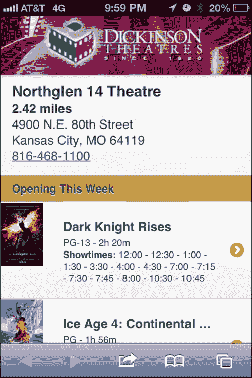
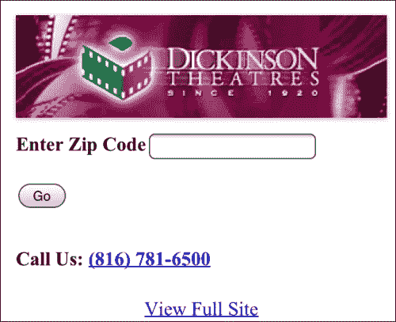
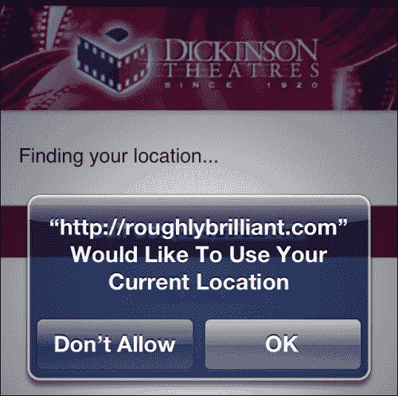
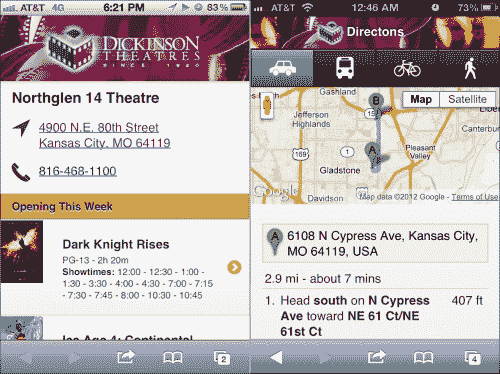
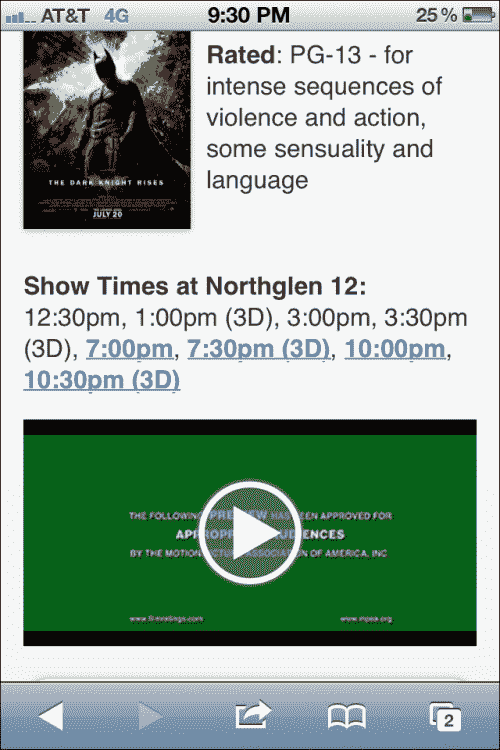

# 第四章：QR 码、地理定位、Google 地图 API 和 HTML5 视频

我们已经讨论了许多小型和大型企业的核心关注点。现在让我们把目光转向其他可能会让媒体公司感兴趣的概念。在本章中，我们将看一下一个电影院连锁，但实际上，这些概念可以应用于任何具有多个实体位置的企业。

在本章中，我们将涵盖：

+   QR 码

+   基本地理定位

+   整合 Google 地图 API

+   链接和嵌入视频

# QR 码

我们热爱我们的智能手机。我们喜欢展示我们的智能手机可以做什么。所以，当那些充满神秘感的方块开始在各个地方出现并迷惑着大众时，智能手机用户迅速行动起来，并以同样过度热情的方式向人们展示这是怎么一回事，就像我们掏出它们来回答甚至是路过听到的最琐碎的问题一样。而且，由于看起来 NFC 不会很快普及，我们最好熟悉 QR 码以及如何利用它们。


数据显示，根据调查，QR 码的知识和使用率非常高：([`researchaccess.com/2012/01/new-data-on-qr-code-adoption/`](http://researchaccess.com/2012/01/new-data-on-qr-
code-adoption/))

+   超过三分之二的智能手机用户扫描过码

+   超过 70%的用户表示他们会再次这样做（尤其是为了折扣）

等等，这和 jQuery Mobile 有什么关系？流量。大量成功的流量。如果只有百分之二的人点击横幅广告，那么这被认为是成功的 ([`en.wikipedia.org/wiki/Clickthrough_rate`](http://en.wikipedia.org/wiki/Clickthrough_rate))。QR 码的点击率超过 66%！我会说这是吸引人们注意我们创造物的一个相当好的方式，因此应该引起关注。但 QR 码不仅仅用于 URL。在下面的 QR 码中，我们有一个 URL、一个文本块、一个电话号码和一个短信：


### 提示

有许多生成 QR 码的方法 ([`www.the-qrcode-generator.com/`](http://www.the-qrcode-generator.com/)，[`www.qrstuff.com/`](http://www.qrstuff.com/))。实际上，只需在 Google 上搜索`QR Code Generator`，你就会有很多选择。

让我们考虑一个当地的电影院连锁。Dickinson Theatres ([dtmovies.com](http://dtmovies.com)) 自 1920 年代起就存在，并考虑加入移动领域。也许他们会投资于移动网站，并在公交车站和其他户外场所放置海报和广告。自然地，人们会开始扫描，这对我们很有价值，因为他们会告诉我们哪些位置是有效的。这真的是广告业的首创。我们有一个媒介似乎激励人们在扫描时与设备互动，这将告诉我们他们扫描时在哪里。地理位置很重要，这可以帮助我们找到合适的位置。

# 地理定位

当 GPS 首次出现在手机上时，除了紧急情况下的警察跟踪之外，它几乎没有什么用处。今天，它使我们手中的设备比我们的个人电脑更加个性化。目前，我们可以非常可靠地获得纬度、经度和时间戳。W3C 的地理位置 API 规范可以在[`dev.w3.org/geo/api/spec-source.html`](http://dev.w3.org/geo/api/spec-source.html)找到。目前，我们假装有一张海报，提示用户扫描 QR 码以找到最近的影院和放映时间。它会带用户到这样的页面：



由于没有比共进晚餐和看电影更好的初次约会，看电影的人群倾向于偏年轻一些。不幸的是，这群人通常没有很多钱。他们可能比较倾向于使用功能手机而不是智能手机。有些人可能只有非常基本的浏览器。也许他们有 JavaScript，但我们不能指望它。如果有的话，他们可能会有地理位置信息。无论如何，考虑到受众，渐进增强将是关键。

我们要做的第一件事是创建一个基本级别的页面，其中包含一个简单的表单，该表单将向服务器提交一个邮政编码。由于我们使用了之前的模板，我们将为表单添加验证，供那些使用`validateMe`类的 JavaScript 的人使用。如果他们有 JavaScript 和地理位置，我们将用一条消息替换表单，说我们正在尝试找到他们的位置。目前，不要担心创建这个文件。此时源代码不完整。此页面将不断发展，最终版本将在文件`qrresponse.php`中的本章源包中，如以下代码所示：

```js
<?php  
  $documentTitle = "Dickinson Theatres";  
  $headerLeftHref = "/"; 
  $headerLeftLinkText = "Home"; 
  $headerLeftIcon = "home";  

  $headerTitle = "";  	
  $headerRightHref = "tel:8165555555"; 
  $headerRightLinkText = "Call"; 
  $headerRightIcon = "grid";  

  $fullSiteLinkHref = "/";  
?> 
<!DOCTYPE html>
<html>
<head> 
  <?php include("includes/meta.php"); ?>
</head>
<body>
<div id="qrfindclosest" data-role="page">
  <div class="logoContainer ui-shadow"></div>
  <div data-role="content">
    <div id="latLong>
      <form id="findTheaterForm" action="fullshowtimes.php"method="get" class="validateMe">             
        <p>
          <label for="zip">Enter Zip Code</label>
          <input type="tel" name="zip" id="zip"class="required number"/>
        </p>
        <p><input type="submit" value="Go"></p>             
      </form>
    </div>         
    <p>         
      <ul id="showing" data-role="listview" class="movieListings"data-dividertheme="g">              
      </ul>         
    </p>
  </div>
  <?php include("includes/footer.php"); ?>
</div>
<script type="text/javascript">
 //We'll put our page specific code here soon
</script>
</body>
</html>
```

对于没有 JavaScript 的任何人来说，这就是他们会看到的，没有什么特别的。我们可以用一点 CSS 来装饰它，但有什么意义呢？如果他们使用的是没有 JavaScript 的浏览器，那么他们的浏览器很可能也不擅长呈现 CSS。这其实没关系。毕竟，渐进增强并不一定意味着让它对每个人都很美好，它只意味着确保它对每个人都有效。大多数人永远不会看到这个，但如果他们看到了，它会正常工作。



对于其他人，我们需要开始用 JavaScript 来以可以编程消化的格式获取我们的剧院数据。JSON 对于这个任务非常合适。如果你已经熟悉 JSON 的概念，现在就跳到下一段。如果你对它不熟悉，基本上，它是一种在互联网上传输数据的另一种方法。它就像 XML 但更有用。它不那么冗长，并且可以直接使用 JavaScript 进行交互和操作，因为它实际上是用 JavaScript 写的。JSON 是 JavaScript 对象表示法的首字母缩略词。特别感谢道格拉斯·克罗克福德（JSON 之父）。XML 在服务器上还有它的位置。如果你可以得到 JSON，它在浏览器中作为一种数据格式是没有理由存在的。这是一个如此普遍的观点，以至于在我参加的最后一次开发者大会上，有一个演讲者在问道时发出笑声，“还有谁在真正使用 XML 吗？”

本章的示例代码列有完整的剧院清单，但这应该足够让我们开始了。对于这个示例，我们将把 JSON 数据存储在`/js/theaters.js`中。

```js
{ 
  "theaters":[ 
    {
      "id":161,
      "name":"Chenal 9 IMAX Theatre", 
      "address":"17825 Chenal Parkway",
      "city":"Little Rock",
      "state":"AR",
      "zip":"72223",
      "distance":9999,
      "geo":{"lat":34.7684775,"long":-92.4599322}, 
      "phone":"501-821-2616"
    },
    {
      "id":158,
      "name":"Gateway 12 IMAX Theatre", 
      "address":"1935 S. Signal Butte", 
      "city":"Mesa",
      "state":"AZ",
      "zip":"85209",
      "distance":9999,
      "geo":{"lat":33.3788674,"long":-111.6016081}, 
      "phone":"480-354-8030"
    },
    {
      "id":135,
      "name":"Northglen 14 Theatre",
      "address":"4900 N.E. 80th Street",
      "city":"Kansas City",
      "state":"MO",
      "zip":"64119",
      "distance":9999,
      "geo":{"lat":39.240027,"long":-94.5226432}, 
      "phone":"816-468-1100"
    }   
  ]
}
```

现在我们有了要处理的数据，我们可以准备在页面中准备好脚本。让我们把以下的 JavaScript 代码片段放在 HTML 底部的脚本标签中，就在我们的注释处：`我们很快就会把我们的页面特定代码放在这里`。

```js
//declare our global variables
var theaterData = null; 
var timestamp = null; 	
var latitude = null; 
var longitude = null; 	
var closestTheater = null; 

//Once the page is initialized, hide the manual zip code form
//and place a message saying that we're attempting to find 
//their location.
$(document).on("pageinit", "#qrfindclosest", function(){
  if(navigator.geolocation){   
     $("#findTheaterForm").hide(); 
     $("#latLong").append("<p id='finding'>Finding your location...</p>"); 
  } 
});

//Once the page is showing, go grab the theater data and find out which one is closest.  
$(document).on("pageshow", "#qrfindclosest", function(){ 
 theaterData = $.getJSON("js/theaters.js", 
 function(data){ 
      theaterData = data;
      selectClosestTheater();
    });
}); 

function selectClosestTheater(){ 
 navigator.geolocation.getCurrentPosition(
   function(position) { //success 
  latitude = position.coords.latitude; 
  longitude = position.coords.longitude; 
  timestamp = position.timestamp; 
  for(var x = 0; x < theaterData.theaters.length; x++){  var theater = theaterData.theaters[x]; 
    var distance = getDistance(latitude, longitude,theater.geo.lat, theater.geo.long); 
    theaterData.theaters[x].distance = distance; 
  }} 
  theaterData.theaters.sort(compareDistances); 
  closestTheater = theaterData.theaters[0]; 	
 _gaq.push(['_trackEvent', "qr", "ad_scan",(""+latitude+","+longitude) ]); 
  var dt = new Date(); 
  dt.setTime(timestamp); 
  $("#latLong").html("<div class='theaterName'>"
    +closestTheater.name+"</div><strong>"
    +closestTheater.distance.toFixed(2)
    +"miles</strong><br/>"
    +closestTheater.address+"<br/>"
    +closestTheater.city+", "+closestTheater.state+" "
    +closestTheater.zip+"<br/><a href='tel:"
    +closestTheater.phone+"'>"
    +closestTheater.phone+"</a>"); 
  $("#showing").load("showtimes.php", function(){ 
    $("#showing").listview('refresh'); 
  });
}, 
function(error){ //error  
  switch(error.code)  	
  { 
    case error.TIMEOUT: 
      $("#latLong").prepend("<div class='ui-bar-e'>Unable to get your position: Timeout</div>"); 
      break; 
    case error.POSITION_UNAVAILABLE: 
      $("#latLong").prepend("<div class='ui-bar-e'>Unable to get your position: Position unavailable</div>"); 
      break; 
    case error.PERMISSION_DENIED: 
      $("#latLong").prepend("<div class='ui-bar-e'>Unable to get your position: Permission denied.You may want to check your settings.</div>"); 
      break; 
    case error.UNKNOWN_ERROR:  
      $("#latLong").prepend("<div class='ui-bar-e'>Unknown error while trying to access your position.</div>"); 
      break; 
   }
   $("#finding").hide();   
   $("#findTheaterForm").show(); 
},
{maximumAge:600000}); //nothing too stale
}
```

这里的关键是`geolocation.getCurrentPosition`函数，它将提示用户允许我们访问他们的位置数据，就像在 iPhone 上所示的那样。



如果有人是隐私倡导者，他们可能已经关闭了所有的位置服务。在这种情况下，我们需要告知用户他们的选择已经影响了我们帮助他们的能力。这就是错误函数的作用。在这种情况下，我们将显示一个错误消息，并再次显示标准表单。

一旦我们有了用户的位置和剧院列表，就该按距离对剧院进行排序并显示最近的一个。以下是一个相当通用的代码，我们可能希望在多个页面上使用。因此，我们会把它放到我们的`global.js`文件中：

```js
function getDistance(lat1, lon1, lat2, lon2){ 
  //great-circle distances between the two points
  //because the earth isn't flat 
  var R = 6371; // km 	
  var dLat = (lat2-lat1).toRad(); 
  var dLon = (lon2-lon1).toRad(); 
  var lat1 = lat1.toRad(); 
  var lat2 = lat2.toRad();  
  var a = Math.sin(dLat/2) * Math.sin(dLat/2) +  
    Math.sin(dLon/2) * Math.cos(lat1) * 
    Math.cos(lat2);  
  var c = 2 * Math.atan2(Math.sqrt(a), Math.sqrt(1-a));  
  var d = R * c; //distance in km 
  var m = d * 0.621371;  //distance in miles 
  return m; 
} 
if (typeof(Number.prototype.toRad) === "undefined") {   
  Number.prototype.toRad = function() { 
    return this * Math.PI / 180;   
  } 
}  

function compareDistances(a,b) {   
  if (a.distance<b.distance) return -1;   
  if (a.distance>b.distance) return 1;   
  return 0; 
} 
```

有了所有这些组件，现在就足够简单获取用户的位置并找到最近的剧院。它将成为数组中的第一个，并且直接存储在全局变量`closestTheater`中。如果他们关闭了 JavaScript，我们将不得不使用一些服务器端的算法或 API 来找出最近的剧院（这超出了本书的范围）。无论如何，我们都会将每个剧院的放映时间作为一个平面文件的列表项集合起来（`showtimes.php`）。在现实世界情况下，这将是由数据库驱动的，并且我们将调用带有正确剧院 ID 的 URL 的页面。现在，以下的代码就够了：

```js
<li data-role="list-divider">Opening This Week</li>     
<li>         
  <a href="movie.php?id=193818">             
                 
    <h3>Dark Knight Rises</h3>             
    <p>PG-13 - 2h 20m<br/>
      <strong>Showtimes:</strong> 
      12:00 - 12:30 - 1:00 - 1:30 - 3:30 - 4:00 - 4:30 – 
      7:00 - 7:15 - 7:30 - 7:45 - 8:00 - 10:30 - 10:45
    </p>         
  </a>     
</li>     
<li>         
  <a href="moviedetails.php?id=193812">
                 
    <h3>Ice Age 4: Continental Drift</h3>
    <p>PG - 1h 56m<br/>
      <strong>Showtimes:</strong> 10:20 AM - 10:50 AM – 
      12:40 - 1:15 - 3:00 - 7:00 - 7:30 - 9:30
    </p>         
  </a>     
</li>     
<li data-role="list-divider">Also in Theaters</li>
<li>
  <a href="moviedetails.php?id=194103">
                 
    <h3>Savages</h3>
    <p>R - 7/6/2012<br/><strong>Showtimes:</strong> 
      10:05 AM - 1:05 - 4:05 - 7:05 - 10:15
    </p>         
  </a>     
</li>     
<li>
  <a href="moviedetails.php?id=194226">
                 
    <h3>Katy Perry: Part of Me</h3>
    <p>PG - 7/5/2012<br/>
      <strong>Showtimes:</strong> 10:05 AM - 1:05 – 
      4:05 - 7:05 - 10:15
    </p>         
  </a>     
</li>     
<li>         
  <a href="moviedetails.php?id=193807">
                 
    <h3>Amazing Spider-Man</h3>
    <p>PG-13 - 7/5/2012<br/>
      <strong>Showtimes:</strong> 10:00 AM - 1:00 – 
      4:00 - 7:00 - 10:00
    </p>         
  </a>     
</li> 
```

我们使用以下的页面片段来引入这个页面片段的：

```js
$("#showing").load("showtimes.php", function(){ 
    $("#showing").listview('refresh'); 
});
```

在这种情况下，我们有包含仅列出视图项的 `showtimes.php` 文件，并且我们直接将它们注入到视图列表中，然后刷新。实现同样效果的另一种方法是拥有另一个文件，比如 `fullshowtimes.php`，它是一个完全渲染的页面，带有标题、页脚和其他一切。这在 JavaScript 或地理位置信息不可用且我们必须返回标准页面提交的情况下是完美的。

```js
<?php  
  $documentTitle = "Showtimes | Northglen 16 Theatre";  
  $headerLeftHref = "/"; 
  $headerLeftLinkText = "Home"; 
  $headerLeftIcon = "home";  
  $headerTitle = "";  	
  $headerRightHref = "tel:8165555555"; 
  $headerRightLinkText = "Call"; 
  $headerRightIcon = "grid";  
  $fullSiteLinkHref = "/";  
?> 
<!DOCTYPE html> 
<html> 
<head> 
  <?php include("includes/meta.php"); ?>  
</head>  
<body> 
  <div id="qrfindclosest" data-role="page">     
    <div class="logoContainer ui-shadow"></div>     
    <div data-role="content">
      <h3>Northglen 14 Theatre</h3>

      <p><a href="https://maps.google.com/maps?q=Northglen+14+Theatre,+Northeast+80th+Street,+Kansas+City,+MO&hl=en&sll=38.304661,-92.437099&sspn=7.971484,8.470459&oq=northglen+&t=h&hq=Northglen+14+Theatre,&hnear=NE+80th+St,+Kansas+City,+Clay,+Missouri&z=15">4900 N.E. 80th Street<br>         
        Kansas City, MO 64119</a>
      </p>

      <p><a href="tel:8164681100">816-468-1100</a></p>                  
      <p>
        <ul id="showing" data-role="listview"class="movieListings" data-dividertheme="g">             
          <?php include("includes/showtimes.php"); ?>             
        </ul>
      </p>
    </div>     
    <?php include("includes/footer.php");?> 
  </div> 
</body> 
</html>
```

然后，我们不再仅仅使用页面调用加载函数，而是加载整个页面，然后使用以下代码选择我们要注入的页面元素：

```js
$("#showing").load("fullshowtimes.php #showing li", function(){ 
  $("#showing").listview('refresh'); 
});
```

当然，这种做法效率较低，但值得注意的是，这样的事情是可以做到的。在未来，这几乎肯定会派上用场。

# 集成谷歌地图 API

到目前为止，我们已经很好地完成了自己的工作。我们可以告诉哪个影院最近，以及直线距离。不幸的是，尽管它有很多优点，但 21 世纪并没有让我们所有人都拥有私人喷气式背包。因此，最好不要显示那个距离。最有可能的是，他们会开车、乘坐公交车、骑自行车或步行。

让我们利用谷歌地图 API ([`developers.google.com/maps/documentation/javascript/`](https://developers.google.com/maps/documentation/javascript/))。如果您的网站要使用大量 API，请准备付费购买商业定价。对于我们来说，当我们处于开发阶段时，没有必要付费。

这是我们即将构建的样子：



首先，我们需要另一页来显示地图和方向，以及将实际从谷歌地图 API 加载地图的脚本，使用以下代码：

```js
<div id="directions" data-role="page"> 
  <div data-role="header">         
    <h3>Directions</h3>     
  </div>     
  <div data-role="footer">         
    <div data-role="navbar" class="directionsBar">             
      <ul>                 
        <li>
          <a href="#" id="drivingButton"onClick="showDirections('DRIVING')">
            <div class="icon driving"></div>
          </a>
        </li>                 
        <li>
          <a href="#" id="transitButton"onClick="showDirections('TRANSIT')">
            <div class="icon transit"></div>
          </a>
        </li>
        <li>
          <a href="#" id="bicycleButton"onClick="showDirections('BICYCLING')">
            <div class="icon bicycle"></div>
          </a>
        </li>                 
        <li>
          <a href="#" id="walkingButton"onClick="showDirections('WALKING')">
            <div class="icon walking"></div>
          </a>
        </li>
      </ul>
    </div> 
  </div>     
  <div id="map_canvas"></div>     
  <div data-role="content" id="directions-panel">
  </div> 
</div> 
<scriptsrc="img/js?sensor=true"></script>
```

我们页面有几个重要部分。首先是 `footer` 属性中的 `navbar` 属性，用于指向剧院的方向。您可能没有意识到的是，页脚实际上不一定要位于页面底部。当您在 `footer` 属性中使用 `navbar` 属性时，您单击的链接将保持其活动状态。如果没有周围的页脚，链接将仅闪烁一次活动状态，然后恢复正常。`map_canvas` 和 `directions-panel` 属性将由谷歌地图 API 填充。

现在，我们需要更新额外图标和地图约束的 CSS 代码。和以前一样，我们将它们保存在 `/css/custom.css` 的位置。

```js
.directionsBar .icon{ 	  
  height:28px;   
  width:34px;   
  margin:auto;   
  background-repeat:no-repeat;   
  background-position:center center; 
} 

.directionsBar .driving{ 
  background-image:url(../icons/xtras-white/16-car.png); 
  background-size:34px 19px; 
} 
.directionsBar .transit{ 
  background-image:url(../icons/xtras-white/15-bus.png); 
  background-size:22px 28px; 
} 
.directionsBar .bicycle{ 	
  background-image:url(../icons/xtras-white/13-bicycle.png); 
  background-size:34px 21px; 
} 
.directionsBar .walking{ 
  background-image:url(../icons/icons-white/102-walk.png); 
  background-size:14px 27px; 
} 
.theaterAddress{ 
  padding-left:35px; 
  background-image:url(../icons/icons-gray/193-location-arrow.png); 
  background-size:24px 24px; 
  background-repeat:no-repeat;  
} 
.theaterPhone{ 
  padding-left:35px; 
  background-image:url(../icons/icons-gray/75-phone.png); 
  background-size:24px 24px; 
  background-repeat:no-repeat; 
  height: 24px;  
} 

#map_canvas { height: 150px; }  

@media only screen and (-webkit-min-device-pixel-ratio: 1.5),    
  only screen and (min--moz-device-pixel-ratio: 1.5),    
  only screen and (min-resolution: 240dpi) { 
    .directionsBar .driving{ 
      background-image:url(../icons/xtras-white/16-car@2x.png); 
    }
    .directionsBar .transit{ 
      background-image:url(../icons/xtras-white/15-bus@2x.png); 
    } 
    .directionsBar .bicycle{ 
      background-image:url(../icons/xtras-white/13bicycle@2x.png); 
    } 
    .directionsBar .walking{ 
      background-image:url(../icons/icons-white/102-walk@2x.png); 
    } 
    .theaterAddress{ 
      background-image:url(../icons/icons-gray/193-location-arrow@2x.png); 
    } 
    .theaterPhone{ 
      background-image:url(../icons/icons-gray/75-phone@2x.png); 
    } 
  }  
```

接下来，我们将在当前页面脚本中添加一些全局变量和函数。

```js
var directionData = null; 
var directionDisplay; 	
var directionsService = new google.maps.DirectionsService(); 
var map; 

function showDirections(travelMode){ 
  var request = { 
    origin:latitude+","+longitude, 
    destination:closestTheater.geo.lat+","
      +closestTheater.geo.long, 
    travelMode: travelMode 
}; 

  directionsService.route(request, 
    function(response, status){ 
      if (status == google.maps.DirectionsStatus.OK){
        directionsDisplay.setDirections(response); 
      } 
    }); 

  $("#directions").live("pageshow", 
    function(){ 
      directionsDisplay = new google.maps.DirectionsRenderer(); 
      var userLocation = new google.maps.LatLng(latitude, longitude); 
      var mapOptions = {
        zoom:14, 
        mapTypeId: google.maps.MapTypeId.ROADMAP, 
        center: userLocation 
      } 
      map = new google.maps.Map(   
        document.getElementById('map_canvas'), mapOptions);
        directionsDisplay.setMap(map);   
        directionsDisplay.setPanel(
        document.getElementById('directions-panel')
      ); 
      showDirections(
      google.maps.DirectionsTravelMode.DRIVING
  ); 
  $("#drivingButton").click(); 
});
```

在这里，我们看到了用于保存谷歌对象的全局变量。`showDirections` 方法被设计为接受一个表示四种不同出行方式的字符串：`'DRIVING'`、`'TRANSIT'`、`'BICYCLING'` 和 `'WALKING'`。

我们可以在弄清最近的影院的同时填充地图和方向。这实际上会为用户带来很好的体验。然而，没有分析数据显示大多数人确实需要方向，那么产生这些成本就没有意义了。最终，这是一个商业决策，但是任何规模的客户群体都可能受到 API 成本的打击。目前来看，最好在用户转到`directions`页面时触发地图和方向的加载。

# 极客时刻—GPS 监控

那么，让我们来极客一分钟。我们所做的对于大多数情况可能已经足够了。我们展示了一张地图和逐步转向指南。让我们再进一步。地理位置 API 不仅仅确定您当前的位置。它包括一个时间戳（没什么大不了的）并且可以允许您使用方法`navigator.geolocation.watchPosition`（[`dev.w3.org/geo/api/spec-source.html#watch-position`](http://dev.w3.org/geo/api/spec-source.html#watch-position)）连续监视用户的位置。这意味着，只需要一点点努力，我们就可以将我们之前的方向页面变成一个持续更新的方向页面。在示例代码中，所有这些都包含在文件`qrresponse2.php`中。

再次更新太频繁可能会变得很昂贵。因此，我们应该真正限制地图和方向的重新绘制频率。对于每种交通模式，更新之间需要的有意义时间量是不同的。趁热打铁，让我们重新设计按钮以包含这些选项。这是整个页面的代码：

```js
<?php  
  $documentTitle = "Dickinson Theatres";  

  $headerLeftHref = "/"; 
  $headerLeftLinkText = "Home"; 
  $headerLeftIcon = "home";  

  $headerTitle = "";  	

  $headerRightHref = "tel:8165555555"; 
  $headerRightLinkText = "Call"; 
  $headerRightIcon = "grid";  

  $fullSiteLinkHref = "/";  
?> 
<!DOCTYPE html> 
<html> 
<head> 
  <?php include("includes/meta.php"); ?> 
  <style type="text/css"> 
    .logoContainer{ 
      display:block; 
      height:84px; 
      background-image:url(images/header.png);  
      background-position:top center;   
      background-size:885px 84px;
      background-repeat:no-repeat;
    }  
  </style>     
  <script type="text/javascript"src="img/js?key=asdfafefaewfacaevaeaceebvaewaewbk&sensor=true"></script> 
</head>  
<body> 
  <div id="qrfindclosest" data-role="page">
    <div class="logoContainer ui-shadow"></div>
    <div data-role="content">
      <div id="latLong">
        <form id="findTheaterForm" action="fullshowtimes.php"method="get" class="validateMe">
          <p>
            <label for="zip">Enter Zip Code</label>
            <input type="tel" name="zip" id="zip"class="required number"/>
          </p>
          <p><input type="submit" value="Go"></p>              
        </form>
      </div>
      <p>         
        <ul id="showing" data-role="listview"class="movieListings" data-dividertheme="g">
        </ul>         
      </p>     
    </div>          
    <?php include("includes/footer.php"); ?> 
  </div>  

  <div id="directions" data-role="page">
    <div data-role="header">
      <h3>Directions</h3>
    </div>
    <div data-role="footer">
      <div data-role="navbar" class="directionsBar">             
        <ul>
          <li>
            <a href="#" id="drivingButton"data-transMode="DRIVING" data-interval="10000"
>
              <div class="icon driving"></div>
            </a>
          </li>
          <li>
            <a href="#" id="transitButton"data-transMode="TRANSIT" data-interval="10000">
              <div class="icon transit"></div>
            </a>
          </li>
          <li>
            <a href="#
" id="bicycleButton"data-transMode="BICYCLING" data-interval="30000">
              <div class="icon bicycle"></div>
            </a>
          </li>
          <li>
            <a href="#" id="walkingButton
"data-transMode="WALKING" data-interval="60000">
              <div class="icon walking"></div>
            </a>
          </li>
        </ul>
      </div>
    </div>
    <div id="map_canvas"></div>
    <div data-role="content" id="directions-panel"></div> 
  </div> 
```

那么，现在让我们看一下此 GPS 监控版本的页面脚本：

```js
  <script type="text/javascript"> 
    //declare our global variables 
    var theaterData = null; 
    var timestamp = null; 
    var latitude = null; 
    var longitude = null; 
    var closestTheater = null; 
    var directionData = null; 
    var directionDisplay; 
    var directionsService = new 
      google.maps.DirectionsService(); 
    var map; 
    var positionUpdateInterval = null; 
    var transporationMethod = null;   

    //Once the page is initialized, hide the manual zip form 
    //and place a message saying that we're attempting to find their location. 
    $(document).on("pageinit", "#qrfindclosest", function(){ 
      if(navigator.geolocation){ 
        $("#findTheaterForm").hide(); 
        $("#latLong").append("<p id='finding'>Finding your 
           location...</p>");
      } 
    }); 

    $(document).on("pageshow", "#qrfindclosest", function(){ 
      theaterData = $.getJSON("js/theaters.js", 
        function(data){ 
          theaterData = data; 
          selectClosestTheater(); 
    }); 

 $("div.directionsBar a").click(function(){
 if(positionUpdateInterval != null){ 
 clearInterval(positionUpdateInterval);
 } 
 var $link = $(this);
      transporationMethod = $link.attr("data-transMode"); 
 showDirections(); 
 setInterval(function(){
 showDirections(); 
        },Number($link.attr("data-interval"))); 
 }); 

    function showDirections(){
      var request = {
        origin:latitude+","+longitude,   
          destination:closestTheater.geo.lat+","
          +closestTheater.geo.long,
        travelMode: transportationMethod
      }

      directionsService.route(request, 
        function(response, status) { 
          if (status == google.maps.DirectionsStatus.OK){       directionsDisplay.setDirections(response);
          }
      }); 
    }  

    $(document).on("pageshow", "#directions", function(){  
      directionsDisplay = new google.maps.DirectionsRenderer();
      var userLocation = new google.maps.LatLng(latitude, longitude);
      var mapOptions = {
        zoom:14,
        mapTypeId: google.maps.MapTypeId.ROADMAP, 
        center: userLocation
      }
      map = new google.maps.Map(document.getElementById('map_canvas'), mapOptions); 
      directionsDisplay.setMap(map);   
      directionsDisplay.setPanel(
        document.getElementById('directions-panel')); 
 if(positionUpdateInterval == null) { 
        transportationMethod = "DRIVING"; 
 positionUpdateInterval = setInterval(function(){
 showDirections(); 
 },(10000)); 
      } 
      $("#drivingButton").click();
  });

  function selectClosestTheater(){ 
 var watchId=navigator.geolocation.watchPosition(
        function(position){ //success 
        latitude = position.coords.latitude;
        longitude = position.coords.longitude; 
        timestamp = position.timestamp;
        var dt = new Date();
        dt.setTime(timestamp);

        for(var x = 0; x < theaterData.theaters.length; x++){ 
          var theater = theaterData.theaters[x]; 
          var distance = getDistance(latitude, longitude, 
            theater.geo.lat, theater.geo.long); 
          theaterData.theaters[x].distance = distance;      } 

        theaterData.theaters.sort(compareDistances);  
        closestTheater = theaterData.theaters[0]; 

        $("#latLong").html("<div class='theaterName'>"
          +closestTheater.name
          +"</div><p class='theaterAddress'><a href='#directions'>"         
          +closestTheater.address+"<br/>"
          +closestTheater.city+", "
          +closestTheater.state
          +" "+closestTheater.zip
          +"</a></p><p class='theaterPhone'><a href='tel:"
          +closestTheater.phone+"'>"
          +closestTheater.phone+"</a></p>"
        );

        $("#showing").load("fullshowtimes.php #showing li", 
          function(){ 	
            $("#showing").listview('refresh'); 
        });
      }
    }, 
    function(error){ //error    
     $("#findTheaterForm").show();   
     $("#finding").hide();
     switch(error.code) { 
       case error.TIMEOUT: 
         $("#latLong").prepend("<div class='ui-bar-e'>Unable to get your position: Timeout</div>"); 
         break;
       case error.POSITION_UNAVAILABLE: 
         $("#latLong").prepend("<div class='ui-bar-e'>Unable to get your position: Position unavailable</div>");
         break;
     case error.PERMISSION_DENIED: 
       $("#latLong").prepend("<div class='ui-bar-e'>Unable to get your position: Permission denied.You may want to check your settings.</div>"); 
         break;
       case error.UNKNOWN_ERROR: 
         $("#latLong").prepend("<div class='ui-bar-e'>Unknown error while trying to access your position.</div>"); 
         break; 
     }
  }); 
}  
</script>   
</body> 
</html> 
```

# 链接和嵌入视频

预览是电影行业的一个主打。我们可以像许多人一样直接链接到 YouTube 上的预览。这里是一个简单的做法：

```js
<p><a data-role="button"href="http://www.youtube.com/watch?v=J9DlV9qwtF0">Watch Preview</a></p> 
```



那样会起作用，但问题是它会把用户带离您的网站。尽管从用户的角度来看这可能并不是世界末日，但这是一个大忌。

为了改善用户体验并将用户留在我们自己的网站上，让我们直接嵌入 HTML5 视频，并像我们在这里描述的那样使用通用图像作为电影预览。

尽管看起来它将在页面的一个极小的部分中播放，但在智能手机上，视频将以全屏横向模式播放。在 iPad 上的情况有些不同，它将在内嵌侧边以内联方式播放。

最终，我们希望使用以下代码将适合用户设备的合适尺寸的视频返回给用户。没有高分辨率显示屏的智能手机不会真的受益于 720p 视频。

```js
<video id="preview" width="100%" controlsposter="images/preview.gif"> 

  <source src="img/batmanTrailer-2_720.mp4" type="video/mp4"  media="only screen and (-webkit-min-device-pixel-ratio: 1.5),only screen and (min--moz-device-pixel-ratio: 1.5),only screen and (min-resolution: 240dpi)"/>                 

  <source src="img/batmanTrailer-1_480.mov"type="video/mov" />                 

  <a data-role="button"href="http://www.youtube.com/watch?v=J9DlV9qwtF0">Watch Preview</a> 

</video>  
```

如果浏览器识别 HTML5 视频标签，播放器将从顶部开始查找每个源标签，直到找到一个它知道如何播放并符合正确的媒体查询（如果已指定媒体查询）。如果浏览器不支持 HTML5 视频，它将不知道如何处理视频和源标签，并且简单地将它们视为有效的 XML 元素。它们将被当作多余的 `div` 标签，并显示链接按钮。

正如你所见，我们在这里添加了媒体查询到不同的资源。如果是高分辨率屏幕，我们将加载更漂亮的视频。你可以真正地通过添加许多不同的来源来深入研究：为普通智能手机添加一个 480p 的视频，为 iPhone 和早期的 iPad 添加一个 720p 的视频，为第三代 iPad 添加一个 1080p 的视频。这里唯一需要注意的是，即使苹果视网膜显示屏能够显示更美丽的视频，但它仍然必须通过同样的管道传输。加载一个较小的视频可能仍然更好，因为它会更快播放，并为客户节省带宽成本。

让我们为这张图片添加一点 CSS。我们将图片宽度保留在容器的 100%。在智能手机上，随着宽度的增加，图片比例将正确缩放。iPad 则不太一样。因此，让我们使用媒体查询来检测其屏幕分辨率，并为其指定一个显式高度，以更好地利用屏幕空间。

```js
 /* iPad ----------------*/ @media only screen and (min-device-width: 768px) and (max-device-width: 1024px) { 
  #preview{ height:380px;} 
}
```

# 总结

我们已经在智能手机上探索了现代媒体的边界。现在你可以思考一下 QR 码的用途，并利用它，找出用户所在位置，监视用户的位置，从谷歌获取方向和地图，并向用户提供响应式视频。

想想你刚刚学到的所有内容。创建一个社交连接的网站，允许用户获取彼此位置的地图，并随着彼此的接近或远离而持续更新，这有多难？如果包装和营销得当，那是很有价值的。

在下一章中，我们将利用 GPS 来提取你地理区域内的 Twitter 动态。我们还将研究从其他几个来源提取动态的方法，比如 reddit、RSS 动态等等。这将非常有趣。这是我最喜欢写的章节之一。
