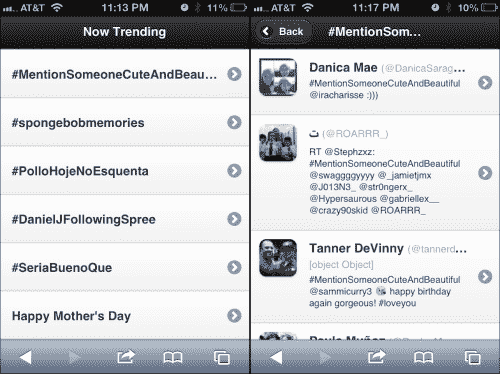
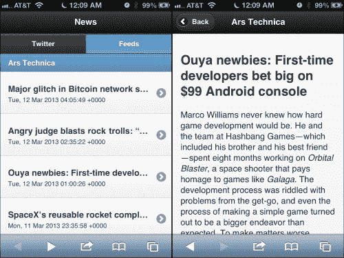

# 第五章：客户端模板化、JSON API 和 HTML5 Web 存储

我们已经走了很长一段路，为业务准备了一些相当庞大的默认模板和样板。在这一章中，我们将简化并专注于其他事项。我们将创建一个基于社交媒体的新闻聚合网站。到目前为止，我们一直非常重视渐进式增强。在本章中，我们将放弃这一点。这将需要 JavaScript。

在这一章中，您将学到以下内容：

+   客户端模板化选项

+   JsRender

+   联接到 JSON API（Twitter）

+   以编程方式更改页面

+   生成的页面和 DOM 权重管理

+   利用 RSS 订阅（本地化）

+   HTML5 Web 存储

+   利用 Google Feeds API

# 客户端模板化

（以一个脾气暴躁的老人的声音）在我那个年代，我们在服务器上渲染所有页面，我们喜欢这样！哈哈！时代正在变化，我们看到客户端模板化框架的巨大潮流。它们的核心都差不多，即它们接收 JSON 数据并应用在一个包含在 script 标签中的基于 HTML 的模板上。

如果你知道**JSON**是什么，跳过这一段。上一章我花了一点时间讨论了这个问题，但是万一你跳过了并且不知道，JSON 是用 JavaScript 编写的，以便可以用作数据交换格式。它比 XML 更高效，并且以面向对象的方式立即被浏览器解释。JSON 甚至可以使用 JSONP 跨域请求数据。有关 JSON 的更多信息，请阅读[`en.wikipedia.org/wiki/JSON`](http://en.wikipedia.org/wiki/JSON)。有关 JSONP 的更多信息，请阅读[`en.wikipedia.org/wiki/JSONP`](http://en.wikipedia.org/wiki/JSONP)。

所有这些客户端库都有一些标记，显示数据的去向，并提供实现循环和条件语句的方法。有些是“无逻辑”的，并且根据尽可能少的逻辑的理念运行。如果你赞同这种美妙的学术方法，那太棒了。

老实说，从纯粹实用的角度来看，我认为模板是代码的完美容器。越灵活越好。JSON 保存数据，而模板用于转换数据。打个比方，XML 是数据格式，XSL 模板用于转换数据。没有人在 XSL 中抱怨逻辑；所以，我不明白为什么在 JS 模板中会成为问题。但是，所有这些讨论都是纯学术性的。最终，它们几乎都能做你想做的事情。如果你更多的是设计师而不是编码者，你可能会更多地关注无逻辑的模板。

以下是一个相当详尽的客户端模板化框架列表。我可能会漏掉一些，而且到这本书出版时可能会有更多，但这是一个开始。

+   doT

+   dust.js

+   Eco

+   EJS

+   Google Closure Templates

+   handlebars

+   haml-js

+   kite

+   Jade

+   jQote2

+   jQuery 模板（已停止）

+   jsRender / jsView

+   Parrot

+   node-asyncEJS

+   Nun

+   Mu

+   mustache

+   montage

+   Stencil

+   underscore.js

现在，虽然我是一个粉丝，但是，如果它是官方的 jQuery，我喜欢它。因此，我尝试的第一件事是 **jQuery Templates**。遗憾的是，在我刚学会喜欢它不久之后，jQuery 团队放弃了这个项目，并指向 **JsRender** 作为项目的延续。未来是否会持续沿着这个方向是另一个问题，但是，目前，JsRender 的功能和强大性使其成为一个引人注目的选择，并且是本章其余部分模板工作的基础。更不用说，它只有经过精简的 14k 并且速度快如闪电。您可以从 [`github.com/BorisMoore/jsrender`](https://github.com/BorisMoore/jsrender) 下载最新版本。

如果您正在寻找帮助以决定适合您的正确模板框架，那么在本章节审阅过程中，Andy Matthews 很友好地提供了以下链接：[`garann.github.com/template-chooser/`](http://garann.github.com/template-chooser/)。它讨论了几个框架的优点，帮助您做出明智的选择。谢谢，Andy！

# 连接至 JSON API（Twitter）

观看 Twitter 上的热门话题总是很有趣。就像许多其他受欢迎的在线目的地一样，它具有 JSON API。让我们来玩一下。这是我们要构建的内容。您可以在左侧看到列表视图，在右侧看到搜索视图。



在这一点上，我将放弃从 HTML 中分离出 CSS 和 JS 的学术正确做法。除了库之外，所有特定于页面的代码（HTML、CSS 和 JS）将位于单个页面内。以下代码是我们起始的基本页面。在本章的代码包中，它是`twitter.html`：

```js
<!DOCTYPE html>  
<html>  
  <head>   
    <meta charset="utf-8">   
    <meta name="viewport" content="width=device-width, initial-scale=1, maximum-scale=1.0, user-scalable=no">   
    <title>Chapter 5 - News</title>       
    <link rel="stylesheet" href="http://code.jquery.com/mobile/1.3.0/jquery.mobile-1.3.0.min.css" />   
    <script src="img/jquery-1.8.2.min.js"></script>  
    <script src="img/jsrender.min.js" type="text/javascript"></script>
  <script src="img/jquery.mobile-1.3.0.min.js"></script>
```

下面的样式将帮助我们的 Twitter 结果看起来更像 Twitter：

```js
    <style type="text/css">     
      .twitterItem .ui-li-has-thumb .ui-btn-inner a.ui-link-inherit, #results .ui-li-static.ui-li-has-thumb{       
         min-height: 50px;       
         padding-left: 70px;     
      } 
      .twitterItem .ui-li-thumb, #results .ui-listview .ui-li-icon, #results .ui-li-content{       
         margin-top: 10px;
         margin-left: 10px;     
      }     
      .twitterItem .ui-li-desc{       
         white-space:normal;       
         margin-left:-25px;       
      }     
      .twitterItem .handle{       
        font-size:80%;       
        font-weight:normal;         
        color:#aaa;     
      }     
      .twitterItem .ui-li-heading{       
        margin: 0 0 .6em -25px;     
      }   
    </style> 
  </head>   
  <body>  
```

这个页面基本上只是一个占位符，一旦从 Twitter API 获取到结果，它将被填充：

```js
  <div id="home_page" data-role="page"> 	
    <div data-role="header"><h1>Now Trending</h1></div>   
    <div data-role="content">
      <ul id="results" data-role="listview" data-dividertheme="b">
      </ul>
    </div>
  </div>  
```

下面的脚本是页面的处理核心。

```js
  <script type="text/javascript"> 
    $(document).on("pagebeforeshow", "#home_page",  function(){ 	

     //before we show the page, go get the trending topics
     //from twitter
    $.ajax({       
      url:"https://api.twitter.com/1/trends/daily.json",
        dataType:"jsonp",       
        success: function(data) {       
          var keys = Object.keys(data.trends);       

          //Invoke jsRender on the template and pass in
          //the data to be used in the rendering.
          var content = $("#twitterTendingTemplate")
           .render(data.trends[keys[0]]);

          //Inject the rendered content into the results area 
          //and refresh the listview
          $("#results").html( content ).listview("refresh"); 
        }	
      })
      .error(function(jqXHR, textStatus, errorThrown){                  
        alert(textStatus+" - "+errorThrown);     
      });
    });    

    $(document).on('click', 'a.twitterSearch', function(){     
      var searchTerm = $(this).attr("data-search");     

      //take the search term from the clicked element and 
      //do a search with the Twitter API
      $.ajax({        
        url:"http://search.twitter.com/search.json?q="+escape(searchTerm),        
        dataType:"jsonp",       
        success: function(data){

          //create a unique page ID based on the search term
          data.pageId = searchTerm.replace(/[# ]*/g,"");             
          //add the search term to the data object
          data.searchTerm = searchTerm; 

          //render the template with JsRender and the data    
          var content = $("#twitterSearchPageTemplate").render(data);  

          //The rendered content is a full jQuery Mobile 
          //page with a unique ID.  Append it directly to the 
          //body element
          $(document.body).append(content); 	

          //switch to the newly injected page
          $.mobile.changePage("#"+data.pageId);       
        }     
      })
      .error(function(jqXHR, textStatus, errorThrown){                  
        alert(textStatus+" - "+errorThrown);     
      });   
    });     
  </script>  
```

以下是两个 JsRender 模板：

```js
  <script id="twitterTendingTemplate" type="text/x-jsrender"> 
    <li class="trendingItem">     
      <a href="javascript://" class="twitterSearch" data-search="{{>name}}">       
        <h3>{{>name}}</h3>     
      </a>   
    </li> 
  </script>  

  <script id="twitterSearchPageTemplate" type="text/x-jsrender">   
    <div id="{{>pageId}}" data-role="page" data-add-back-btn="true">     
      <div data-role="header">
        <h1>{{>searchTerm}}</h1>
      </div>     
      <div data-role="content">
        <ul id="results" data-role="listview" data-dividertheme="b">
          {{for results}}           
            <li class="twitterItem">             
            <a href="http://twitter.com/{{>from_user}}">   
              profile_image_url}}" alt="{{>from_user_name}}" class="ui-shadow ui-corner-all" /> 
              <h3>{{>from_user_name}} 
                <span class="handle">
                  (@{{>from_user}})<br/>
                  {{>location}} 
                  {{if geo}}
                    {{>geo}}
                  {{/if}}
                </span>
              </h3>               
              <p>{{>text}}</p>             
            </a>           
          </li>         
        {{/for}} 	      
      </ul>     
    </div>   
  </div> 
</script>  
</body> 
</html>
```

好吧，一次把那么多代码给你可能有点多，但大部分代码在这一点上看起来应该相当熟悉。让我们开始解释一些最新的东西。

通常，要将数据加载到网页中，即使您正在获取 JSON 格式的数据，也会受到同源策略的限制。然而，如果数据来自另一个域，您将需要绕过同源策略。为了绕过同源策略，您可以使用某种服务器端代理，例如 PHP 的 **cURL**（[`php.net/manual/en/book.curl.php`](http://php.net/manual/en/book.curl.php)）或 Java 世界中的 Apache **HTTP Core** **Components**（[`hc.apache.org/`](http://hc.apache.org/)）。

让我们保持简单，使用**JSONP**（也称为**JSON with Padding**）。JSONP 不使用常规的 Ajax 请求来获取信息。尽管配置选项是为`$.ajax`命令，但在幕后，它将以独立的脚本标签执行数据调用，如下所示：

```js
 <script type="text/javascript" src="img/daily.json?callback=jQuery172003156238095834851_1345608708562&_=1345608708657"></script>
```

值得注意的是，通过 JSONP 使用 GET 请求。这意味着你不能用它传递敏感数据，因为它会通过网络流量扫描或简单查看浏览器的请求历史立即可见。所以，请不要通过 JSONP 登录或传递任何敏感信息。明白了吗？

在实际请求发出之前，jQuery 会创建一个半随机的函数名称，一旦从服务器收到响应，该函数将被执行。通过在 URL 中附加该函数名称作为回调，我们告诉 Twitter 用这个函数调用包裹他们发给我们的响应。因此，我们不会收到类似 `{"trends": …},` 这样的 JSON 脚本，而是在我们页面上编写的脚本如下所示：

```js
jQuery172003156238095834851_1345608708562({"trends": …}). 
```

这能够运行的原因是同域策略对于脚本并不存在。方便，对吧？在脚本加载完并且回调处理完成之后，我们将以 JSON 格式获得数据。最终，在底层执行上有着截然不同，但结果与你通过自己域上的常规`getJSON`请求获得的结果是一样的。

以下是从 Twitter 返回的响应片段：

```js
jQuery1720026425381423905492_1345774796764({
  "as_of": 1345774741,
  "trends": {
    "2012-08-23 05:20": [
       {
         "events": null,
         "name": "#ThingsISayTooMuch",
         "query": "#ThingsISayTooMuch",
         "promoted_content": null
       },
       {
         "events": null,
         "name": "#QuieroUnBesoDe",
         "query": "#QuieroUnBesoDe",
         "promoted_content": null
       },
       {
          "events": null,
          "name": "#ASongIKnowAllTheLyricsTo",
          "query": "#ASongIKnowAllTheLyricsTo",
          "promoted_content": null
       },
```

接下来，我们将响应精简到我们想要的部分（最新一组热门话题），并将该数组传递给 JsRender 进行渲染。也许直接循环遍历 JSON 并使用字符串连接来构建输出可能更简单，但看看下面的模板，告诉我这不会更清晰易维护：

```js
<script id="twitterTendingTemplate" type="text/x-jsrender"> 
  <li class="trendingItem">     
    <a href="javascript://" class="twitterSearch" data-search="{{>name}}">       
      <h3>{{>name}}</h3>     
    </a>   
  </li> 
</script>  
```

脚本上的`text/x-jsrender`类型将确保页面不会尝试解析内部内容为 JavaScript。由于我们向 JsRender 传入了一个数组，模板将为数组中的每个对象编写。这样就简单了！尽管我们只从数据对象中提取了名称，但你明白这是如何工作的。

让我们来看看下一个重要的 JavaScript 代码块：

```js
$(document).on('click', "a.twitterSearch", function(){     
  //grab the search term off the link     
  var searchTerm = $(this).attr("data-search");          

  //do a Twitter search based on that term     
  $.ajax({       url:"http://search.twitter.com/search.json?q="+escape(searchTerm),        
   dataType:"jsonp",       
   success: function(data){         
     //create the pageID by stripping 
     //all non-alphanumeric data         
     var pageId = searchTerm.replace(/[^a-zA-Z0-9]+/g,"");                  
     //throw the pageId and original search term 
     //into the data that we'll be sending to JSRenderdata.pageId = pageId;
     data.searchTerm = searchTerm;          	      

     //render the page and append it to the document body         $(document.body).append($("#twitterSearchPageTemplate")
       .render(data));                  

     //set the page to remove itself once left          
     $("#"+pageId).attr( "data-" + $.mobile.ns 
       + "external-page", true )
       .one( 'pagecreate', $.mobile._bindPageRemove );                  
     //switch to the new page          
     $.mobile.changePage("#"+data.pageId);   
    }
  })
  .error(function(jqXHR, textStatus, errorThrown){
    //If anything goes wrong, at least we'll know.           
    alert(textStatus+" - "+errorThrown);     
  });    
});
```

首先，我们从链接本身的属性中提取搜索词。搜索词本身作为用于动态渲染页面的`id`属性有些不合适，因此，我们将去除任何空格和非字母数字内容。然后，我们将`pageId`和`searchTerm`属性附加到我们从 Twitter 那里收到的 JSON 对象上。以下是从这个调用返回的数据样本：

```js
jQuery1720026425381423905492_1345774796765({
    "completed_in": 0.02,
    "max_id": 238829616129777665,
    "max_id_str": "238829616129777665",
    "next_page": "?page=2&max_id=238829616129777665&q=%23ThingsISayTooMuch",
    "page": 1,
    "query": "%23ThingsISayToMuch",
    "refresh_url": "?since_id=238829616129777665&q=%23ThingsISay
TooMuch",
    "results": [
        {
            "created_at": "Fri, 24 Aug 2012 02:46:24 +0000",
            "from_user": "MichelleEspra",
            "from_user_id": 183194730,
            "from_user_id_str": "183194730",
            "from_user_name": "Michelle Espranita",
            "geo": null,
            "id": 238829583808483328,
            "id_str": "238829583808483328",
            "iso_language_code": "en",
            "metadata": {
                "result_type": "recent"
            },
            "profile_image_url": "http:\/\/a0.twimg.com\/profile_images\/2315127236\/Photo_20on_202012-03-03_20at_2001.39_20_232_normal.jpg",
            "profile_image_url_https": "https:\/\/si0.twimg.com\/profile_images\/2315127236\/Photo_20on_202012-03-03_20at_2001.39_20_232_normal.jpg",
            "source": "&lt;a href=&quot;http:\/\/twitter.com\/&quot;&gt;web&lt;\/a&gt;",
            "text": "RT @MuchOfficial: @MichelleEspra I'd be the aforementioned Much! #ThingsISayTooMuch",
            "to_user": null,
            "to_user_id": 0,
            "to_user_id_str": "0",
            "to_user_name": null,
            "in_reply_to_status_id": 238518389595840512,
            "in_reply_to_status_id_str": "238518389595840512"
        }

}
```

因此，我们将获取到的响应传递给渲染器，以便根据`twitterSearchPageTemplate`进行转换：

```js
<script id="twitterSearchPageTemplate" type="text/x-jsrender"> 
    <div id="{{>pageId}}" data-role="page" data-add-back-btn="true">     
      <div data-role="header">
        <h1>{{>searchTerm}}</h1>
      </div>     
      <div data-role="content">
        <ul id="results" data-role="listview" data-dividertheme="b">
          {{for results}}           
            <li class="twitterItem">             
            <a href="http://twitter.com/{{>from_user}}">   
              profile_image_url}}" alt="{{>from_user_name}}" class="ui-shadow ui-corner-all" /> 
              <h3>{{>from_user_name}} 
                <span class="handle">
                  (@{{>from_user}})<br/>
                  {{>location}} 
                    {{if geo}}
                      {{>geo}}
                    {{/if}}
                </span>
              </h3>               
              <p>{{>text}}</p>             
            </a>           
          </li>         
        {{/for}}       
      </ul>     
    </div>   
  </div> 
</script> 
```

这些是简单的实现。 GitHub 上的示例展示了许多值得探索的选项。查看[`borismoore.github.com/jsrender/demos/`](http://borismoore.github.com/jsrender/demos/)以获取有关创建更复杂模板的详细信息。这是一个变化迅速的库（大多数客户端模板库都是如此）。因此，如果你在阅读本文时，发现有更多选项和略有变化的语法，不要感到惊讶。

一旦我们获得了转换的结果，我们就可以将新页面的源附加到文档的主体，然后以编程方式切换到这个新页面。

# 以编程方式更改页面

有两种方法可以在 jQuery Mobile 中以编程方式更改页面，它们之间的区别很微妙：

+   调用`$.mobile.changePage`并传递一个选择器到你想要跳转到的页面的 ID。这与 URL 的工作方式相同。无论哪种方式都会产生与用户点击链接相同的结果。该页面将被插入浏览器的历史记录中，正如人们所期望的那样。以下是示例代码：

    ```js
    $.mobile.changePage("#"+data.pageId);
    ```

+   首先通过选择要更改的页面来创建一个 jQuery 对象。然后，将该 jQuery 对象传递到`$.mobile.changePage`函数中。结果是页面被显示，但 URL 永远不会更新，因此它不会存在于浏览器的历史记录中。这在用户刷新页面时重新开始第一个屏幕的过程时可能会有用。它防止了通过书签进行深度链接到多页布局中的其他页面。以下是一个示例：

    ```js
    var $newPage = $("#"+data.pageId);     
    $.mobile.changePage($newPage);
    ```

# 生成的页面和 DOM 负载管理

在正常情况下，当在传统移动站点上浏览时，jQuery Mobile 将每个页面标记为`external-page`，这将导致用户导航离开该页面后从 DOM 中移除该页面。这样做的理念是，它将管理 DOM 的负载，因为“预算”（糟糕的）设备可能没有足够的内存来专用于其浏览器。外部页面很可能仍然在设备缓存中以便快速召回。因此，重新加载它们应该是极快的。如果你想了解 jQuery Mobile 如何处理此行为，请查看[`jquerymobile.com/demos/1.3.0/docs/pages/page-cache.html`](http://jquerymobile.com/demos/1.3.0/docs/pages/page-cache.html)。

jQuery Mobile 通过正常手段很好地管理 DOM 的负载。然而，当我们动态创建页面时，它们不会在退出时自动从 DOM 中删除。如果有很多这样的页面，这可能会变得非常压倒性。我们很容易就会压垮愚蠢手机上的可怜浏览器，甚至一些早期型号或预算智能手机也是如此。如果动态创建的页面可能在会话中再次查看，则将其留在 DOM 中可能是值得的。然而，由于我们开始时是在浏览器中生成它，所以将页面重新呈现可能更安全更快速。

在页面呈现完成但在页面初始化之前，你可以使用这行代码标记一页删除：

```js
$("#"+pageId).attr( "data-" + $.mobile.ns + "external-page", true ).one( 'pagecreate', $.mobile._bindPageRemove );
```

### 注意

**警告**：这行代码基本上是直接从库代码中来的。这就是它们在幕后是如何做的。请注意，`$.mobile._bindPageRemove`以一个下划线开头。这里我们没有处理一个公共方法。

这段代码是 API 的一个未记录和非官方部分，这意味着它可能在任何发布的版本中被更改。这对于框架的核心部分来说，我怀疑它们会更改；但是，任何时候当你开始引入依赖于非公开 API 的代码时，你都面临着升级可能在发布说明中没有任何警告的情况下破坏你的代码的风险。可以自由使用，但是务必对每个库的升级进行彻底测试。

# 利用 RSS 源

我能说什么呢？正是我的编辑让我这么做的。最初我并没有计划围绕 RSS 构建任何东西。我很高兴他们这样做，因为经过调查，发现被 RSS 提供的信息要比 JSON 信息源要多得多。我觉得数字世界比它实际上发展得更多。所以，Usha，谢谢你让我包括这个。

首先，如果我们不使用服务器端代理，我们将立即遇到同一源策略的严苛限制。示例包括 PHP 系统中的 cURL，Java 中的 Apache HTTP Core 组件，或者是.NET 平台上的 HttpWebRequest 等。

以下是我在 PHP 中创建的页面，利用 cURL 抓取 Ars Technica 的信息流。这个文件的源代码在本章的代码包中的`ars.php`中。

```js
<?PHP 

//based on original example from…
//http://www.jonasjohn.de/snippets/php/curl-example.htm

//is cURL installed yet? 
if (!function_exists('curl_init')){     
  die('Sorry cURL is not installed!'); 
}  

// OK cool. Then, let's create a new cURL resource handle 
$ch = curl_init();  

// Now set some options (most are optional)  
// Set URL to download 
curl_setopt($ch, CURLOPT_URL, "http://feeds.arstechnica.com/arstechnica/index?format=xml");  

// Set a referer 
curl_setopt($ch, CURLOPT_REFERER, "http://bookexample/chapter5");  

// User agent 
curl_setopt($ch, CURLOPT_USERAGENT, "BookExampleCurl/1.0");  

// Include header in result? (0 = yes, 1 = no) 
curl_setopt($ch, CURLOPT_HEADER, 0);  

// Should cURL return or print out the data? 
// (true = return, false = print) 
curl_setopt($ch, CURLOPT_RETURNTRANSFER, true);  

// Timeout in seconds 
curl_setopt($ch, CURLOPT_TIMEOUT, 10);  

// Download the given URL, and return output 
$output = curl_exec($ch);  

// Close the cURL resource, and free system resources curl_close($ch);  

echo $output; 
?>
```

### 注意

**警告**：cURL 和其他服务器端代理库非常强大，因此也非常危险。*不要*把你想要访问本页的 URL 参数化。硬编码 URL。如果你必须从调用 URL 获取参数来构建你的目标地址，那么*你必须转义所有的参数*。如果不这样做，可以肯定的是总有一天，黑客会利用你的网站进行跨站脚本(XSS)攻击([`www.owasp.org/index.php/Cross-site_Scripting_(XSS)`](https://www.owasp.org/index.php/Cross-site_Scripting_(XSS)))。

接下来，让我们在顶部添加一些按钮。一个是我们的 Twitter 源，一个是 Ars Technica 的。下一部分的最终来源将在本章的代码包中的`index.html`文件中：

```js
<div data-role="header">
  <h1>News</h1>
</div>     
<div data-role="footer"> 
 <div data-role="navbar"> 
 <ul> 
 <li><a id="twitter" href="#" class="ui-btn-active">Twitter</a></li> 
 <li><a id="ars" href="#">Feed</a></li> 
 </ul> 
 </div> 
</div>
<div data-role="content">	         
  <ul id="results" data-role="listview" data-dividertheme="b"></ul>   
</div> 
```

接下来，让我们添加脚本来加载信息流：

```js
function loadArs(){
  //scroll back up to the top     
  $.mobile.silentScroll(0);          

  //Go get the Ars Technica feed content     
  $.ajax({       
    url:"ars.php",        
    dataType:"xml",       
    success: function(data, textStatus, jqXHR) {         

      //Store the response for later use           
      localStorage.setItem("ars", jqXHR.responseText);            
      //prepare the content for use         
      var $feed = $(data);                  

      //prepare a list divider with the title of the feed.	var listView = "<li data-role='list-divider'>"+$feed.find("channel>title").text()+"</li>";                  
     //loop through every feed item and 
     //create a listview element.          
      $feed.find("channel>item").each(function(index){             var $item = $(this);           
        listView += "<li><a href='javascript://' "
          +"data-storyIndex='"+index
          +"' class='arsFeed'><h3>"
          +$item.find("title").text()
          +"</h3><p>"+$item.find("pubDate").text()
          +"</p></a></li>";         
      });                  

      //put the new listview in the main display          
      $("#results").html(listView); 

      //refresh the listview so it looks right         
      $("#results").listview("refresh");   

     //place hooks on the newly created links         
      //so they trigger the display of the         
      //story when clicked         
      $("#results a.arsFeed").click(function(){         

        //get the feed content back out of storage                var arsData = localStorage.getItem("ars");                 
        //figure out which story was clicked and       
        //pull that story's content from the item             var storyIndex = $(this).attr("data-storyIndex");
        var $item =   
          $(arsData).find("channel>item:eq("+storyIndex+")");                     
        //create a new page with the story content                var storyPage = "<div id='ars"+storyIndex+"' "
          +"data-role='page' data-add-back-btn='true'>"
          +"<div data-role='header'><h1>Ars Technica</h1>"
          +"</div><div data-role='content'><h2>"
          +$item.find('title').text()+"</h2>"
          +$item.find('content\\:encoded').html()
          +"</div></div>";                      

        //append the story page to the body 	        
        $("body").append(storyPage);                   
        //find all the images in the newly  	        
        //created page.          
        $("#ars"+storyIndex+" img").each(function(index, element) {                         
          var $img = $(element);                         
          //figure out its currentWidth             
          var currentWidth = Number($img.attr("width"));                          
          //if it has a width and it's large             
          if(!isNaN(currentWidth) && currentWidth > 300){              
            //remove the explicit width and height                  $img.removeAttr("width").removeAttr("height");               
            //make the image scale to the width                     //of it's container but never to be                      //larger than its original size                          
            $img.css({"max-width":currentWidth
              +"px","width":"100%"});             
          }
        });

        //switch to the new page             
        $.mobile.changePage("#ars"+storyIndex);        
      });
    }
  });   
}

$("#ars").click(loadArs); 
```

这是我们的新的 RSS 阅读器的样子！



## 强制响应式图片

当你从一个页面导入内容，而你无法控制内容中嵌入的图片时，你可能需要调整它们以在移动设备上显示正确。就像上一个例子一样，我发现最好是移除图片本身的显式宽度和高度，并使用 CSS 使其填充当前容器的 100%。然后，使用 CSS 的`max-width`属性来确保图像不会被放大超出其原始意图的尺寸。

虽然在加载适合分辨率的不同尺寸的图像方面并没有真正性能响应，但我们已经使用我们有限的资源达到了相同的可见效果，对于这样的情况。

# HTML5 Web 存储

如果你还没有尝试过 HTML5 Web 存储，它其实可以相当简单。如果已经尝试过了，可以跳到下一段。实际上只有两种 web 存储形式：`localStorage`，和 `sessionStorage`。`localStorage` 将永久地保存信息。`sessionStorage` 只在单个会话的周期内保存。这是一个简单的键值配对系统。所有东西都是基于字符串的。因此，一旦你从存储中提取出来，你需要根据需要将这些值转换为其他格式。查看 [`www.w3schools.com/html5/html5_webstorage.asp`](http://www.w3schools.com/html5/html5_webstorage.asp) 获取更多详细信息。

现在，关于会话的定义就变得有趣了。*不要混淆*你服务器上的会话和浏览器会话。你服务器上的用户会话可能在大概 20 分钟内就会过期。然而，只是因为你服务器上的会话已经过期，并不意味着你的浏览器知道这一点。*HTML5 会话存储会一直持续到浏览器实际关闭。* 

这在移动浏览器上就特别棘手了。在安卓和 iOS 系统中，当你切换任务或按下主屏幕按钮时，浏览器并不会真正关闭。在这两种情况下，你必须使用任务关闭功能来完全关闭浏览器。这是最终用户可能并不会自己去做的事情。

但是，关于 web 存储有何不同之处呢？为什么不只是用 cookie 在客户端上存储信息呢？毕竟，这会适用于每个人，对吧？是的，cookie 会适用于每个人。然而，它们从来就不是用来存储大量数据的，就像我们在这个例子中使用的那样，并且每个域名可以存储的 cookie 数量也有软上限（根据浏览器的不同，从 20 到 50 不等）。试图使用 cookie 在客户端存储的最糟糕的一面是，它们随着每个资源的请求一起发送回服务器。这意味着每个 CSS、JS、图像以及页面/Ajax 请求都会携带着所有 cookie 以其有效荷载。你可以看到这样会很快降低你的性能。添加一个 cookie 可能导致数据被传输多次，仅用来渲染一个页面。

## 基于浏览器的数据库（进展中）

基于浏览器的数据库目前处于极端波动状态。实际上，目前有两种不同的标准。第一种是 **Web SQL Database** ([`www.w3.org/TR/webdatabase/`](http://www.w3.org/TR/webdatabase/))。你可以使用它，但根据 W3C 的说法，这个规范已经不再活跃。许多浏览器已经实现了 Web SQL Database，但它能够存活多久呢？

W3C 已经声明，浏览器上数据库的方向将是**Indexed Database**（[`www.w3.org/TR/IndexedDB/`](http://www.w3.org/TR/IndexedDB/)）。工作草案的编辑来自微软、谷歌和 Mozilla；因此，我们可以期待未来有广泛的支持。问题是，工作草案于 2012 年 5 月 24 日发布。截至我写这一章时，只有 Firefox、Chrome 和 Internet Explorer 10 支持 IndexedDB（[`en.wikipedia.org/wiki/Indexed_Database_API`](http://en.wikipedia.org/wiki/Indexed_Database_API)）。

## JSON 拯救了我们

目前，我们发现自己处于一个极其糟糕的境地，要么使用一个丑恶的数据库，要么等待所有人都跟上新规范。在不久的将来，Web 存储看起来是唯一的安全选择。那么，我们如何最好地利用它呢？当然是用 JSON！所有主要浏览器都原生支持 JSON。

想想我们过去一直处理关系数据库的方式。作为面向对象的程序员，我们总是进行查询，然后将结果数据转换成内存中的对象。我们几乎可以通过使用`JSON.stringify`方法将 JSON 直接存储到 Web 存储中，以几乎相同的方式来做完全相同的事情。

这里有一个例子，用来测试你的系统是否原生支持 JSON。源文件在本章的代码包中的`jsonTest.html`。

```js
<!DOCTYPE html>  
<html>  
<head>   
  <title>JSON Test</title>  
</head>    
<body>    
<script type="text/javascript">   

  var myFeedList = {     
    "lastUpdated":"whenever",     
    "feeds":[        
    {         
       "name":"ars",         
    "url":"http://feeds.arstechnica.com/arstechnica/index?format=xml" 	    
    },       
    {       
      "name":"rbds",            
      "url":"http://roughlybrilliant.com/rss.xml"       
    }     
    ]   
  }     

myFeedList.lastUpdated = new Date(); 

localStorage.feedList = JSON.stringify(myFeedList);      

var myFeedListRetrieved = JSON.parse(localStorage.feedList);      
alert(myFeedListRetrieved.lastUpdated); 
</script>  
</body> 
</html>
```

如果一切正常，你将看到一个包含时间戳的警报。

如果出于某种原因，你发现自己不幸地必须支持一些过时的系统（Windows Phone 7 和 BlackBerry 5 或 6，我正在看着你），请从[`github.com/douglascrockford/JSON-js`](https://github.com/douglascrockford/JSON-js)获取`json2.js`并将其包含在其他脚本中。然后，你将能够 stringify 和 parse JSON。

# 利用 Google Feeds API

所以，我们已经看到了如何原生地拉取一个普通的 RSS 订阅，解析，并使用正常而乏味的字符串拼接构建页面。现在，让我们考虑一种替代方案，我在开始写这一章时甚至不知道它的存在。感谢雷蒙德·卡姆登和安迪·马修斯在他们的书《jQuery 移动 Web 开发要点》中指出这一点。你需要在 Twitter 上关注他们两个，`@cfjedimaster`和`@commadelimited`。

Google Feeds API 可以提供多种选择，但它的核心是指定 RSS 或 ATOM 订阅并返回 JSON 表示。当然，这在这一章节中开启了更多有趣的可能性。如果我们现在可以获取不同类型的多个订阅，而无需任何服务器端代理，我们可以极大地简化我们的生活。客户端模板再次出现！不再需要字符串拼接！因为它们都是统一格式（包括发布日期），我们可以把它们全部整合到一个主视图中，所有订阅故事按日期排序。

按其属性对对象进行排序实际上相当简单。你只需要传递一个比较函数。以下代码是我们将用于日期的：

```js
function compareDates(a,b) {     
  var aPubDate = Date.parse(a.publishedDate);     
  var bPubDate = Date.parse(b.publishedDate);     
  if ( aPubDate < bPubDate) return 1;     
  if (aPubDate > bPubDate)  return -1;     
  return 0;   
}
```

现在，让我们指定一个 JSON 对象来存储我们想要使用的 feeds：

```js
var allFeeds = {   

  //all the feeds we want to pull in 	
  "sources":[       
"http://feeds.arstechnica.com/arstechnica/index?format=xml", 
"http://rss.slashdot.org/Slashdot/slashdot",       
"http://www.theregister.co.uk/headlines.atom"     
],   

  //How many of the feeds have responded?  Once all have 
  //responded, we'll finish our processing.  
  "sourcesReporting":0,   

  //This is where we will store the returned stories.	
  "entries":[]   
}; 
```

接下来，我们将使用我们的处理函数来处理传入的故事：

```js
function assimilateFeed(data){   

  //Mark another feed as having reported back  
  allFeeds.sourcesReporting++; 

  //Grab the title of this feed    
  var feedTitle = data.responseData.feed.title; 

  //Loop through every entry returned and add the feed title
  //as the source for the story		
  for(x = 0; x < data.responseData.feed.entries.length; 
    data.responseData.feed.entries[x++].source=feedTitle); 

  //Join this field's entries with whatever entries might have 
  //already been loaded
  allFeeds.entries = allFeeds.entries.concat(data.responseData.feed.entries); 

  //If all the feeds have reported back, it's time to process
  if(allFeeds.sourcesReporting == allFeeds.sources.length){ 

    //Sort all the stories by date
    allFeeds.entries.sort(compareDates);   

   //Take the results that have now all been combined and
    //sorted by date and use jsRender 
    $("#results").html($("#googleFeedTemplate")
      .render(allFeeds)).listview("refresh");         
  }   
} 
```

这是我们的 JsRender 模板：

```js
<script type="text/x-jsrender" id="googleFeedTemplate">   
  {{for entries}}     
    <li>       
      <a href="{{:link}}" target="_blank">         
        <h3>{{:title}}</h3>          
        <p><strong>{{:source}}</strong> - {{:publishedDate}}
          <br/>{{:contentSnippet}}
        </p>
      </a>
    </li>   
  {{/for}} 
</script>
```

最后，这是将启动整个过程的函数：

```js
$("#feeds").click( function() {  

  //Reset the number of received feeds
  allFeeds.sourcesReporting = 0;     

  //Get back to the top of the page
  $.mobile.silentScroll(0);     

  //Loop through all the feeds
  for(var x = 0; x < allFeeds.sources.length; x++){       
    $.ajax({   

//Call to Google's Feed API with the URL encoded      
url:"https://ajax.googleapis.com/ajax/services/feed/load?v=1.0&output=json&q="+escape(allFeeds.sources[x]),          
      dataType:"jsonp",         
      success:assimilateFeed       
    });
  }   
});
```

我已将此包含在我的 `challenge.html` 文件的功能示例中，但源代码要比这深得多。`challenge.html` 的源代码还有几个隐藏的宝藏供你发现。我还添加了 Reddit、Flickr 和本地搜索 Twitter。

# 总结

你已经被呈现了一个非常广泛的客户端模板选择。在这一点上，你现在知道如何利用 JSON 和 JSONP 并有效地将它们结合起来动态创建页面。RSS 对你来说也不会是真正的挑战，因为你可以本地或使用 Google Feeds 来处理。

在下一章中，我们将结合一些这些技术，继续构建我们的技术工具箱，并将目光转向 HTML5 音频。
