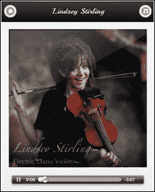
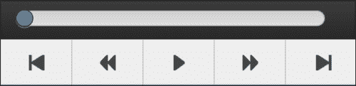
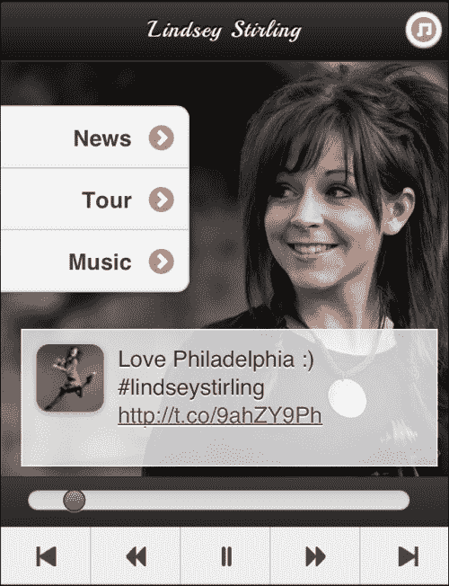
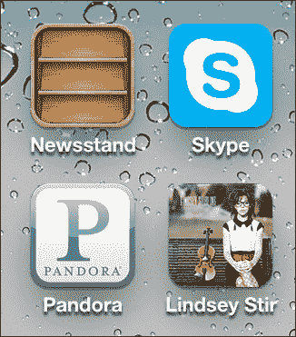

# 第六章：HTML5 音频

让我们把迄今为止学到的东西转向音乐领域。我们将把 jQuery Mobile 界面转化为一个媒体播放器、艺术家展示和信息中心，并可以保存到人们的主屏幕上。

在这一章中，我们将涵盖：

+   HTML5 音频（渐进增强方式）

+   固定位置，持久工具栏（真的！？）

+   HTML5 音频的自定义 JavaScript 控件

+   iOS 中的 HTML5 音频及其区别

+   全能解决方案（多页面实用）

+   使用 HTML5 清单将内容保存到主屏幕

# HTML5 音频

与琳赛·施特林问好。琳赛在美国达人秀第五季上首次登场。你看过小提琴手*摇滚表演*吗？自她在全国舞台上的表现以来，她在 YouTube 上的视频每个都有数百万次观看。2012 年 9 月 18 日，她发布了她的首张同名专辑。这一章将是对她的音乐和数字存在的粉丝致敬。如果你想要完整的体验，就去她的 YouTube 频道[`youtube.com/lindseystomp`](http://youtube.com/lindseystomp)。她的 200 万订阅者不会错！



现在，回到正题。正如我们迄今所见，jQuery Mobile 使一切变得容易。你几乎必须要尝试才能把事情搞复杂。HTML5 音频可以像你希望它那样复杂，我们会到那一步的。现在，让我们看看把音频带入你的 jQuery Mobile 页面有多么简单。考虑下面的代码片段：

```js
<audio id="audio" controls>                     
  <source src="img/electricdaisy.mp3" type="audio/mpeg" />
  <source src="img/electricdaisy.ogg" type="audio/ogg" />
   Your browser is so old that you can't hear the music.
</audio>
```

就是这样。这就是在上一张图片中得到音乐控制条所需的全部内容。我们来稍微分解一下。

就像在第四章的视频中一样，*二维码，地理定位，谷歌地图 API 和 HTML5 视频*，`音频`标签可以支持多个来源，浏览器将简单地选择它知道如何处理的第一个。老旧的浏览器将毫无头绪，只会简单地解析这个像 XML，这意味着唯一显示的是文本，“你的浏览器太老了，无法播放音乐。”

每个浏览器都提供自己的本机界面来控制音频。有些像 iOS 版本那样又小又亮，而有些则完全丑陋但更可用，比如 Android。无论如何，它们都有所不足，所以让我们把 jQuery Mobile 变成一个媒体播放器。

这是我们的基本起始页面。你可以在代码文件中的`electricdaisy_basic.html`中找到其源代码：

```js
<!DOCTYPE html>  
<html>  
  <head> 
    <meta charset="utf-8">
    <meta name="viewport" content="width=device-width, initial-scale=1, maximum-scale=1.0, user-scalable=no">     
    <link href='chapter6.css' rel='stylesheet' type='text/css'> 
    <title>Lindsey Sterling</title>
    <link rel="stylesheet" href="http://code.jquery.com/mobile/1.3.0/jquery.mobile-1.3.0.min.css" />
    <script src="img/jquery-1.8.2.min.js"></script>
    <script type="text/javascript" src="img/global.js"></script> 
    <script src="img/jquery.mobile-1.3.0.min.js"></script> 
    <link rel="stylesheet" href="chapter6.css" /> 
  </head>    
<body>      
<div id="electricdaisy" class="songPage" data-role="page" >
  <div data-role="header">
    <a href="basic.html" data-transition="slidedown" data-theme="c" data-icon="home" data-iconpos="notext">Home</a> 
    <h2>Lindsey Sterling</h2>             
    <a class="ui-btn-right" data-transition="slidedown" data-theme="c" href="tracklist.html" data-icon="note" data-iconpos="notext" >Music</a>         
  </div>         
  <div data-role="content">
                 
    <p>                 
      <audio id="audio" controls>
        <source src="img/electricdaisy.mp3" type="audio/mpeg" />
        <source src="img/electricdaisy.ogg" type="audio/ogg" />
        Your browser is very old so that you can't hear the music.
      </audio>             
    </p>         
  </div>     
</div> 
</body> 
</html>
```

这个构建良好的 jQuery Mobile 页面除了美化之外无需任何 JavaScript。你可以关闭 JS，整个页面仍能正常工作，还能播放音乐。对于所有的渐进增强粉丝来说，我们正从正确的角度开始。毕竟，每个人都是音乐的粉丝，不仅仅是智能手机用户。

现在让我们看看如何使用 JavaScript 和固定位置工具栏来创建更好的控制界面。

# 固定位置的持续工具栏（真的！？）

我要诚实地说；我对移动空间中的固定位置工具栏的看法普遍很低。从可用性的角度来看，它们是一场灾难。移动屏幕本来可用空间就很少。在没有为用户提供*强大*的好处的情况下浪费更多的屏幕空间是不可想象的。此外，由于涉及到的 CSS，古老版本的 Android（低于版本 2.3）将不支持固定位置工具栏。

<rant>然而，我们经常看到这种情况，不是吗？公司把他们的标志贴在永远不会消失的顶部工具栏上。他们加上一点全局导航，并称之为对用户的一个好处，而实际上这完全是为了加强他们的品牌形象。你可以从工具栏上唯一的可交互部分——一个菜单按钮和可能的一个搜索按钮上看出来（好像我们不能再次在顶部找到它们一样）。有许多更好的技术来提供全局导航。</rant>



今天，我们有一个合理的用途来使用这些工具栏。我们将在其中放置音乐控制，这些音乐控制将随着我们切换曲目而持续存在。如果我们做得对，这个音乐网站将更像一个应用程序，并让用户始终控制设备发出的声音。

如果你已经玩过 jQM UI 的这一部分，请立即跳到下一段。

使工具栏固定（滚动时不移动）和持续（在更改页面时不移动）其实很简单。你所要做的就是添加 `data-position="fixed"` 来使其固定，然后在你想要页脚在页面转换时保持不动的页面上添加 `data-id="whatever"` 给页脚。这个功能也适用于头部。

这是我们持续页脚的基础：

```js
<div class="jsShow playcontrols" data-role="footer" data-id="playcontrols" data-position="fixed">         
  <div class="progressContainer">
    <input  data-theme="b" data-track-theme="c" class="progressBar" type="range" name="slider-1"  value="0" min="0" max="227" data-mini="true"/></div>         
  <div data-role="navbar" class="playcontrols">             
    <ul>                 
      <li><a data-theme="c" title="skip back" class="skipback" href="#crystallize" data-direction="reverse"></a></li>                     
      <li><a data-theme="c" title="seek back" class="seekback" href="javascript://"></a></li>                     
      <li><a data-theme="c" title="play/pause" class="play" href="javascript://"></a></li>                     
      <li><a data-theme="c" title="seek forward" class="seek" href="javascript://"></a></li>                     
      <li><a data-theme="c" title="skip forward" class="skip" href="#shadows"></a></li>
      </li>             
    </ul>         
  </div>     
</div> 
```

见到页脚顶部的那个类（`jsShow`）了吗？让我们在围绕`audio`标签的段落中添加另一个类（`jsHide`）：

```js
<p class="jsHide">                 
  <audio id="audio" controls>                     
…            
</p>
```

在 CSS 中，让我们添加以下规则：

```js
.js .jsHide{display:none} 
.no-js .jsShow{display:none;}
```

然后我们将在我们的 `global.js` 文件中添加一行代码来将整个内容组合在一起：

```js
$("html").removeClass("no-js").addClass("js");
```

这是 HTML5 模板 ([`html5boilerplate.com/`](http://html5boilerplate.com/)) 和 Modernizer ([`modernizr.com/`](http://modernizr.com/)) 使用的一种技术。如果你还没有看过这两个奇迹，那值得你的时间。简单来说，我们现在有了一种方便、轻量级的处理渐进增强的方法。对于那些需要帮助的人，语音辅助也非常完美。

现在，我们离一个好用的通用媒体播放器 UI 很近了，但是如果你一直在输入代码，你可能已经注意到输入`type="range"`正在显示一个文本框。单独看这可能不算太糟糕，但 HTML5 音频以秒为单位跟踪其当前位置，这使得它作为显示元素相当无用。所以，让我们隐藏它，并通过一些简单的 CSS 扩展一下进度条：

```js
input.progressBar{display:none} 
div.ui-slider{width:90%;}  
```

现在，我们看起来不错了，让我们将它们连接起来使其工作。

# 用 JavaScript 控制 HTML5 音频

好了，现在我们开始用 JavaScript 变得有点复杂了。

首先，让我们设置一个间隔来更新进度条。它将有两个功能，显示当前时间和更改时间。我们将首先添加对这些对象的引用，并为我们可能想要附加到的每一个音频事件放置事件挂钩。注释描述了何时触发哪些事件：

```js
//for every song page 
$(document).on("pagecreate", ".songPage", function(){ 
  var $page = $(this);	
  var $currentAudio = $page.find("audio");

  //set references to the playing status, progress bar, and 
  //progress interval on the audio object itself 
  $currentAudio.data("playing",false) 
    .data("progressBar", $page.find("input.progressBar")).data("progressThread",null); 

  //loadstart and progress occur with autoload
  $currentAudio[0].addEventListener('loadstart', function(){ 
    //Fires when the browser starts looking 
    //for the audio/video
  }, false);

  $currentAudio[0].addEventListener('progress', function(){ 
    //Fires when the browser is downloading the audio/video
    //This will fire multiple times until the source 
    //is fully loaded.
  }, false); 

  //durationchange, loadedmetadata, loadeddata, canplay, 
  //canplaythrough are kicked off upon pressing play 
  $currentAudio[0].addEventListener('durationchange', 
  function(){ 
    //Fires when the duration of the audio/video is changed 

  }, false); 

  $currentAudio[0].addEventListener('loadedmetadata', 
  function(){
    //Fires when the browser has loaded meta data 
    //for the audio/video 

  }, false); 

  $currentAudio[0].addEventListener('loadeddata', function(){ 
    //Fires when the browser has loaded the current 
    //frame of the audio/video 

  }, false);

  $currentAudio[0].addEventListener('canplay', function(){  
    //Fires when the browser can start playing 
    //the audio/video 	

  }, false); 

  $currentAudio[0].addEventListener('canplaythrough', 
  function(){ 
    //Fires when the browser can play through the audio/video 
    //without stopping for buffering 

  }, false); 

  $currentAudio[0].addEventListener('ended', function(){ 
    //Fires when the current playlist is ended 

  }, false); 

  $currentAudio[0].addEventListener('error', function(){ 
    //Fires when an error occurred during the loading 
    //of an audio/video 

  }, true);  

}); 
```

现在，让我们创建运行间隔的函数：

```js
function scrubberUpdateInterval(){ 

  //Grab the current page 
  var $page = $.mobile.activePage; 

  //Grab the audio element 
  var $audio = $page.find("audio"); 
  var currentAudio = $audio[0]; 

  //Grab the progress monitor and the handle 
  currentAudioProgress = $page.find("input.progressBar"); 
  scrubberHandle = currentAudioProgress
    .closest(".progressContainer")
    .find("a.ui-slider-handle"); 

  //Is the user currently touching the bar? 	
  if(scrubberHandle.hasClass("ui-focus")){ 
    //Pause it if it's not paused already 
    if(!currentAudio.paused){  
      currentAudio.pause(); 
    } 

    //Find the last scrubber's last position 
    var lastScrubPosition = currentAudioProgress
      .data("lastScrubPosition"); 
    if(lastScrubPosition == null) lastScrubPosition = 0; 
    //Are we in the same place as we were last? 
    if(Math.floor(lastScrubPosition) == 
    Math.floor(currentAudio.currentTime)){ 
      var lastScrubUnchangedCount = currentAudioProgress
       .data("lastScrubUnchangedCount");
      //If the user held still for 3 or more cycles of the 
      //interval, resume playing  
      if(++lastScrubUnchangedCount >= 2){ 
        scrubberHandle.removeClass("ui-focus"); 
        currentAudioProgress 
          .data("lastScrubUnchangedCount", 0); 
        currentAudio.play(); 
      }else{ 
        //increment the unchanged counter 
        currentAudioProgress.data("lastScrubUnchangedCount", 
        lastScrubUnchangedCount); 
      } 
    }else{ 
      //set the unchanged counter to 0 since we're not in the 
      //same place 
      currentAudioProgress
        .data("lastScrubUnchangedCount", 0); 
    } 

    //set the last scrubbed position on the scrubber 
    currentAudioProgress.data("lastScrubPosition", 
      Number(currentAudioProgress.val())); 
    //set the current time of the audio 
    currentAudio.currentTime = currentAudioProgress.val(); 
  }else{ 
    //The user is not touching the scrubber, just update the 
    //position of the handle 
    currentAudioProgress
      .val(currentAudio.currentTime)
      .slider('refresh');  
  } 
}  
```

当点击播放按钮时，我们将启动间隔并执行其他必要的操作。和往常一样，所有内容都有很好的注释：

```js
$(document).on('vclick', "a.play", function(){ 
  try{ 
    var $page = $.mobile.activePage; 
    var $audio = $page.find("audio"); 

    //toggle playing 
    $audio.data("playing",!$audio.data("playing")); 
    //if we should now be playing 
    if($audio.data("playing")) { 

      //play the audio 
      $audio[0].play(); 

      //switch the playing image for pause 
      $page.find("img.playPauseImage")
        .attr("src","images/xtras-gray/48-pause@2x.png"); 
      //kick off the progress interval 
      $audio.data("progressThread",  
        setInterval(scrubberUpdateInterval, 750)); 
    }else{
      //pause the audio 
      $audio[0].pause(); 

      //switch the pause image for the playing audio 
$page.find("img.playPauseImage")
        .attr("src","images/xtras-gray/49-play@2x.png");
      //stop the progress interval
      clearInterval($audio.data("progressThread")); 				
    } 
  }catch(e){alert(e)}; 
});
```

设置搜索控件：

```js
$(document).on('click', "a.seekback", function(){
  $.mobile.activePage.find("audio")[0].currentTime -= 5.0; 
}); 

$(document).on('vclick', "a.seek", function(){
  $.mobile.activePage.find("audio")[0].currentTime += 5.0; 
}); 
```

现在，让我们创建一个 JSON 对象来跟踪我们的当前状态和跟踪列表：

```js
var media = { 
  "currentTrack":0, 
  "random":false, 
  "tracklist":[ 
    "electricdaisy.html", 
    "comewithus.html", 
    "crystallize.html",
    "shadows.html", 
    "skyrim.html" 
  ] 
}
```

接下来，是跳过后退和前进按钮。我们可以设置随机按钮，但现在我们会跳过：

```js
$(document).on('vclick', "a.skipback", function(event){ 
  //grab the current audio 
  var currentAudio = $.mobile.activePage.find("audio")[0]; 
  //if we're more than 5 seconds into the song, skip back to 
  //the beginning 
  if(currentAudio.currentTime > 5){ 
    currentAudio.currentTime = 0; 
  }else{ 
    //otherwise, change to the previous track 
    media.currentTrack--; 
    if(media.currentTrack < 0) media.currentTrack = 
      (media.tracklist.length - 1); 
    $.mobile.changePage("#"+media.tracklist[currentTrack]);
  } 
}); 

$(document).on("vclick", "a.skip", function(event){ 
  //grab the current audio and switch to the next track 
  var currentAudio = $.mobile.activePage.find("audio")[0]; 
  media.currentTrack++; 
  if(media.currentTrack >= media.tracklist.length) 
  media.currentTrack = 0; 
  $.mobile.changePage("#"+media.tracklist[currentTrack]); 
}); 
```

### 提示

**性能注解**

注意我已经不再使用`click`事件，而是现在使用`vclick`事件。`vclick`事件是 jQuery Mobile 中的自定义事件，旨在弥合 click（桌面事件）和 tap/touchstart（触摸事件）之间的性能差距。两者之间通常存在约 300 毫秒的差距，而支持什么样的浏览器是一件难以确定的事情。通过使用`vclick`，您仍然可以支持桌面和触摸设备，但您可以希望获得轻微的性能提升。有关更多信息，请参阅 jQuery Mobile 贡献者之一 John Bender 在 [`coderwall.com/p/bdxjzg`](https://coderwall.com/p/bdxjzg) 的博客文章。

# iOS 中的 HTML5 音频不同

理解 HTML5 音频的事件循环对于使其正常工作至关重要。当您开始混合 jQuery Mobile 的奇怪事件循环时，情况可能会变得特别混乱。再加上一系列因设备而异的资源限制，您就真的会变得很困惑。

作为测试移动站点的快速简便方法，你通常只需打开 Google Chrome（因为它是 WebKit）或 IE9（用于 Windows Phone）并将其缩小到移动尺寸。当然，这不能替代真正的测试。始终要在真实设备上检查你的作品。话虽如此，缩小的浏览器方法通常可以让你达到 97.5% 的目标。好吧... HTML5 音频彻底改变了这种操作模式。

在 iOS 上，即使你已经标记了`audio`标签以预加载和自动播放，它也不会。不会抛出错误；也没有任何迹象表明你的编码请求被完全忽视了。如果你查看本章中包含的代码，你会看到在`basicPlayer.js`脚本中我放了多少 try/catch 和 debug 语句来尝试让它起作用，并找出出了什么问题。

从技术上讲，`pageinit`是文档中说等同于`document.ready`的事件，但这并不意味着页面实际上已经可见。导致页面显示的事件链的最后是`pageshow`事件。所以，不管怎样，那应该是结束，并且应该为你可能想做的任何事情做好准备。在这个时候，你应该（理论上）能够使用 JavaScript 告诉歌曲播放（`.play()`）。然而，事实并非如此。你可以使用完全相同的函数来触发音频播放，甚至延迟一段时间再启动它，但仍然没有任何效果。这不是一个时间问题。iOS 需要直接用户交互才能首次启动音频。*直接将其绑定到点击事件，否则不起作用。*

# 全能解决方案（多页面实用化）

现在我们有了一个完整的播放器，具有统一的界面，可以用来管理播放列表。我们目前唯一真正的问题是网络延迟。即使在这个新的 4G 和 LTE 时代，蜂窝网络的延迟也可能变得荒谬。如果你像我一样在一个像斯巴达的方阵一样阻挡信号的建筑物工作，这一点尤为真实。所以，为了给用户带来更好的体验，我们将放弃这种逐页的方式。

顺便说一句，让我们把我们在之前章节中所做的一些工作也整合进来，比如引入林赛最新的推文和她博客的内容。我们将使用之前的 CSS，但其他方面会有所改变。



对于那些对服务器端和面向对象类型的人来说，最令人烦恼的事情之一就是你经常不得不重复一段代码。如果有一个全局头部或页脚，这就成为了一个真正的问题。所以，让我们创建一个`div`标签来容纳通用页脚内容，并创建一个脚本在适当的时候将其引入：

```js
<div id="universalPlayerControls" style="display:none">     
  <div class="progressContainer">
    <input  data-theme="b" data-track-theme="c" class="progressBar" type="range" name="slider-1"  value="0" min="0" max="227" data-mini="true"/>
  </div>     
  <div data-role="navbar" class="playcontrols">         
    <ul>             
      <li><a data-theme="c" title="skip back" class="skipback" href="javascript://" data-direction="reverse"></a></li>             
      <li><a data-theme="c" title="seek back" class="seekback" href="javascript://"></a></li>             
      <li><a data-theme="c" title="play/pause" class="play" href="javascript://"></a></li>             
      <li><a data-theme="c" title="seek forward" class="seek" href="javascript://"></a></li>             
      <li><a data-theme="c" title="skip forward" class="skip" href="javascript://"></a></li>         
    </ul>     
  </div> 
</div>
```

现在，对于任何想要在页脚中具有这些控件的页面加载，我们将在 jQM 标记页面之前将这些内容直接复制到页脚中：

```js
$(document).on("pagebeforecreate", function(){ 
  $(this).find("div[data-id='playcontrols']")
    .html($("#universalPlayerControls").html());
});
```

最后，是时候使每个歌曲页面都变得动态了。我们移除了单独的音频元素，简单地在“页面”的数据属性中链接到它们。页脚消失了，取而代之的是一个空的页脚，准备好注入控件：

```js
<div id="electricdaisy" class="songPage" data-role="page" data-mp3="audio/electricdaisy.mp3" data-ogg="audio/electricdaisy.ogg"> 
  <div data-role="header">
    <a href="#home" data-theme="c" data-icon="home" data-iconpos="notext">Home</a>
    <h2>Electric Daisy</h2>
    <a class="ui-btn-right" data-theme="c" href="#tracklist" data-icon="note" data-iconpos="notext" >Music</a>
  </div>         
  <div data-role="content">         
    
  </div>          
  <div data-role="footer" data-id="playcontrols" data-position="fixed"></div> 
</div>
```

所有这些都将要求我们重新调整我们的 JavaScript。一些部分将保持不变，但由于我们只剩下一个音频元素，代码可以简化。以下是在 Packt Publishing 网站提供的代码捆绑包的 `index.html` 文件中的所有合并版本的最终源代码：

```js
<!DOCTYPE html>  
<html>  
<head> 
  <meta charset="utf-8"> 
  <meta name="viewport" content="width=device-width, initial-scale=1, maximum-scale=1.0, user-scalable=no">     
  <link href='http://fonts.googleapis.com/css?family=Playball' rel='stylesheet' type='text/css'> 
  <title>Lindsey Stirling</title>  
  <link rel="stylesheet" href="jquery.mobile-1.2.0-rc.1.min.css" /> 	
  <script src="img/jquery-1.7.2.min.js"></script>     
  <script type="text/javascript"> 
    $(document).bind("mobileinit", function(){ 
      $.mobile.defaultPageTransition = "slide"; 
    }); 
  </script> 
  <script src="img/jquery.mobile-1.2.0-rc.1.min.js"></script>     
  <script type="text/javascript"
src="img/jsrender.min.js"></script>     
  <link rel="stylesheet" href="chapter6.css" /> 
</head>    
<body id="body">
```

在完成所有常规工作之后，这是体验的第一个“页面”：

```js
  <div id="home" data-role="page" 
    data-mp3="audio/electricdaisy.mp3" 
    data-ogg="audio/electricdaisy.ogg"> 	

    <div data-role="header">
      <h1>Lindsey Stirling</h1>
      <a class="ui-btn-right" data-theme="c" href="#tracklist" data-icon="note" data-iconpos="notext" >Music</a>
    </div>     

    <div data-role="content"> 
      <ul id="homemenu" data-role="listview" data-inset="true"> 
        <li><a href="#news">News</a></li>
        <li><a href="#tour">Tour</a></li>
        <li><a href="#comewithus">Music</a></li>  
      </ul>
      <div id="twitterFeed">
        <ul class="curl"></ul>
      </div>     
    </div>     

    <div data-role="footer" data-id="playcontrols" data-position="fixed">
    </div> 

  </div>  

  <div data-role="page" id="news"> 
    <div data-role="header">
      <a href="#home" data-theme="c" data-icon="home" data-iconpos="notext">Home</a>
      <h2>News/Blog</h2>
    </div>      

    <div data-role="content"></div> 
  </div>  
```

以下页面列出了所有可预览的曲目：

```js
  <div id="tracklist" data-role="page">  
    <div data-role="header">
      <a href="#home" data-theme="c" data-icon="home" data-iconpos="notext">Home</a>
      <h2>Track List</h2>
    </div>        

     

    <div data-role="content"> 
       <ul data-role="listview"> 
         <li><a class="trackListLink" href="#electricdaisy">Electric Daisy</a></li> 
         <li><a class="trackListLink" href="#shadows">Shadows</a></li>
         <li><a class="trackListLink" href="#comewithus">Come With Us feat. CSWS</a></li>
         <li><a class="trackListLink" href="#skyrim">Skyrim</a></li>
         <li><a class="trackListLink" href="#crystallize">Crystallize</a></li>
      </ul>     
    </div> 
  </div>  
```

以下是各个歌曲页面。我没有包含每个歌曲页面，因为那只是页面的浪费。你会明白这是如何工作的。请注意，每个页面都有相同的 `data-id` 属性的页脚。以下允许在歌曲之间转换时保持页脚不变：

```js
  <div id="shadows" class="songPage" data-role="page" 
    data-mp3="audio/shadows.mp3" 
    data-ogg="audio/shadows.ogg" >  
    <div data-role="header">
      <a href="#home" data-theme="c" data-icon="home" data-iconpos="notext">Home</a>
      <h2>Shadows</h2>
      <a class="ui-btn-right" data-theme="c" href="#tracklist" data-icon="note" data-iconpos="notext" >Music</a>
    </div>         

    <div data-role="content">         
           
    </div>          

    <div data-role="footer" data-id="playcontrols" data-position="fixed"></div> 
  </div>  

  <div id="crystallize" class="songPage" data-role="page" 
    data-mp3="audio/crystallize.mp3" 
    data-ogg="audio/crystallize.ogg">  
    <div data-role="header">
      <a href="#home" data-theme="c" data-icon="home" data-iconpos="notext">Home</a>
      <h2>Crystallize</h2>
      <a class="ui-btn-right" data-theme="c" href="#tracklist" data-icon="note" data-iconpos="notext" >Music</a>
    </div>         

    <div data-role="content">         
       
    </div>          

    <div data-role="footer" data-id="playcontrols" data-position="fixed"></div> 
  </div>  

  <div id="electricdaisy" class="songPage" data-role="page" 
    data-mp3="audio/electricdaisy.mp3" 
    data-ogg="audio/electricdaisy.ogg">  
    <div data-role="header">
      <a href="#home" data-theme="c" data-icon="home" data-iconpos="notext">Home</a>
      <h2>Electric Daisy</h2>
      <a class="ui-btn-right" data-theme="c" href="#tracklist" data-icon="note" data-iconpos="notext" >Music</a>
    </div>

    <div data-role="content">
       
    </div>          

    <div data-role="footer" data-id="playcontrols" data-position="fixed"></div> 
  </div>  
```

这部分不是页面。这是将被导入到播放歌曲的每个页面中的隐藏式主控制器：

```js
  <div id="universalPlayerControls" style="display:none">     
    <div class="progressContainer">
      <input  data-theme="b" data-track-theme="c" class="progressBar" type="range" name="slider-1"  value="0" min="0" max="227" data-mini="true"/>
    </div>     
    <div data-role="navbar" class="playcontrols">         
      <ul>             
        <li><a data-theme="c" title="skip back" class="skipback" href="javascript://" data-direction="reverse"></a></li>             
        <li><a data-theme="c" title="seek back" class="seekback" href="javascript://"></a></li>
        <li><a data-theme="c" title="play/pause" class="play" href="javascript://"></a></li>
        <li><a data-theme="c" title="seek forward" class="seek" href="javascript://"></a></li>
        <li><a data-theme="c" title="skip forward" class="skip" href="javascript://"></a></li>
      </ul>     
    </div> 
  </div>  

  <div style="display:none;">     
    <audio id="audio" controls></audio>     
  </div>  
```

以下代码是呈现导入的博客内容的模板：

```js
  <script type="text/x-jsrender" id="googleFeedTemplate"> 
    <ul class="curl"> 
      {{for entries}} 	
        <li> 
          <h3 class="ul-li-heading">{{:title}}</h3> 
          <p>{{:publishedDate}}<br>{{:content}}</p> 
        </li> 
      {{/for}} 
    </ul> 
  </script> 
```

以下代码是呈现 Twitter 动态的模板：

```js
  <script type="text/x-jsrender" id="twitterTemplate"> 
    <li class="twitterItem"> 
      
      <p>{{:text}}</p> 
    </li> 
  </script> 

  <script type="text/javascript"> 
    var media = { 
      "playing":false, 
      "debug":true,
      "currentTrack":0, 
      "random":false,
      "tracklist":[
        "#electricdaisy",
        "#comewithus",
        "#crystallize",
        "#shadows",
        "#skyrim"
      ] 
    } 

    //a handy little debug function
    var lastDebugTS = (new Date).getTime(); 	
    function debug(str){  
    try{ 
        if(media.debug){ 
          $.mobile.activePage.find("div[data-role='content']")
            .append(""+((new Date()).getTime()-lastDebugTS)+": "+str+"<br/>"); 
          lastDebugTS = (new Date).getTime();} 
      }catch(e){} 
    }   

    //grab the audio and control elements with global 
    //variables since everything is going to use them 
    var currentAudio = $("#audio")[0]; 
    var currentAudioProgress = null; 
    var scrubberHandle = null; 
    var scrubberUpdateSpeed = 750; 
    var progressThread = null; 

    //The ended and durationchange are the only events we 
    //really care about  
    currentAudio.addEventListener('ended', 
      function(){
        $.mobile.activePage.find(".skip").click()
      }, false); currentAudio.addEventListener('durationchange', 
     function(){   
       currentAudioProgress.attr('max',currentAudio.duration)
        .slider("refresh"); 
     }); 

   //On the home page 	
   $("#home").live('pagebeforeshow', function(){ 
     var $page = $(this); 

     //bring in the latest tweet 
$.ajax({url:"http://api.twitter.com/1/statuses/user_timeline.json?screen_name="+escape("LindseyStirling"),  
       dataType:"jsonp", 
       success: function(data) { 
         try{ 
           //parse out any hyperlinks and twitter IDs and turn 
           //them into links 
           var words = data[0].text.split(" "); 
           var newMessage = ""; 
           for(var x = 0; x < words.length; x++){
           var word = words[x]; 
             if(word.indexOf("http") == 0){ 	
               newMessage += "<a href='"+word+"' target='_blank'>"+word+"</a>"; 
             }else if(word.match(/@[a-zA-Z0-9_]*/)){ 
       newMessage += "<a href='http://twitter.com/"+word.substring(1)+"' target='_blank'>"+word+"</a> "; 
             }else{
               newMessage += word+" "; 
             } 
           } 
           data[0].text = newMessage;  
         }catch(e){} 

         //use jsRender to display the message 
        $("#twitterFeed ul")
          .html($("#twitterTemplate")
          .render(data[0])); 
      } 
    }); 

    //if we're not currently playing anything, preload audio 
    //as specified by the page's data- attributes 
    if(!media.playing) { 

      //load MP3 by default   
      if(currentAudio.canPlayType("audio/mpeg")){
         currentAudio.src = $page.attr("data-mp3");
      } 

      //load Ogg for all those purists out there 
      else{ currentAudio.src = $page.attr("data-ogg");} 
      //make it load 
      currentAudio.load();

      //set the progres bar
      currentAudioProgress = $page.find("input.progressBar"); 
      //set the scrubber handle 
      scrubberHandle = currentAudioProgress
        .closest(".progressContainer")
        .find("a.ui-slider-handle"); 
    } 
  });  

  //on the news page 
  $("#news").live('pageshow', function(){ 
    //This import can take a while, show the loading message 
  $.mobile.loading( 'show', {           
      text: "Loading Blog Content",           
      textVisible: true         
    });

    //load the actual content 
    $.ajax({ 
  url:"https://ajax.googleapis.com/ajax/services/feed/load?v=1.0&output=json&q="+escape("http://lindseystirlingviolin.com/feed"),  
      dataType:"jsonp", 
      success: function(data) { 
        //use a jsRender template to format the blog 
        $("#news .ui-content")
          .html($("#googleFeedTemplate")
          .render(data.responseData.feed)); 	   
        //for every image in the news feed, make its width 
        //dynamic with a max width or its original size
        $("#news img").each(function(index, element) { 
         var $img = $(element); 

          //figure out its currentWidth 
          var currentWidth = Number($img.attr("width")); 
          //if it has a width and it's large 
          if(!isNaN(currentWidth) && currentWidth > 300){ 
            //remove the explicit width and height 
     $img.removeAttr("width").removeAttr("height"); 
            //make the image scale to the width 
         //of its container but never to be  
         //larger than its original size 
            $img.css({"max-width":currentWidth+"px","width":"100%"}); 
          } 
        });

        //hide the loading   
        $.mobile.loading("hide");
      }
    });
  }); 

  function setCurrentMediaSources(){ 
    var $page = $.mobile.activePage; 

    //set the audio to whatever is playable 	
    var playableSource = $page.attr("data-mp3"); 
    if(!currentAudio.canPlayType("audio/mpeg")){
      playableSource = $page.attr("data-ogg");
    }
    //set the progress bar and scrubber handles 
    currentAudioProgress = $page.find("input.progressBar"); 
  scrubberHandle = currentAudioProgress
      .closest(".progressContainer")
      .find("a.ui-slider-handle"); 

    //change the source and load it.  
    currentAudio.src = playableSource; 
    currentAudio.load(); 

    //if we're currently play, continue playing 
    if(media.playing){ 
      currentAudio.play(); 
      progressThread = setInterval(scrubberUpdateThread, scrubberUpdateSpeed); 	
    } 
  } 

  $(".songPage").live("pageshow", setCurrentMediaSources); 

  $("[data-role='page']").live("pagebeforecreate", 
  function(){ 
    $(this).find("div[data-id='playcontrols']")
      .html($("#universalPlayerControls").html());
  }); 

  function scrubberUpdateThread(){ 
    //if the scrubber has focus, the scrubber becomes 
    //input instead of status display 
    if(scrubberHandle.hasClass("ui-focus")){ 

    //pause the music for now 
    if(!currentAudio.paused){  
      currentAudio.pause(); 
    } 

    //grab the last position to see if we've moved 
    var lastScrubPosition = 
      currentAudioProgress.data("lastScrubPosition"); 
    if(lastScrubPosition == null) lastScrubPosition = 0; 
    //if the user hasn't scrubbed  
    if(Math.floor(lastScrubPosition) == Math.floor(currentAudio.currentTime)){ 
      var lastScrubUnchangedCount = 
      currentAudioProgress.data("lastScrubUnchangedCount"); 
      if(++lastScrubUnchangedCount >= 2){ 
  //since it's been 3 cycles that we haven't moved, 
        //remove the focus and play
        scrubberHandle.removeClass("ui-focus"); 
        currentAudioProgress.data("lastScrubUnchangedCount", 0); 
        currentAudio.play(); 
      }else{ 

        //store the the current position counter 
        currentAudioProgress.data("lastScrubUnchangedCount", lastScrubUnchangedCount); 
      } 
    }else{ 
      //reset the current position counter 
      currentAudioProgress.data("lastScrubUnchangedCount", 0); 
    } 

    //set the position of the scrubber and the currentTime 
    //position of the song itself  
    currentAudioProgress.data("lastScrubPosition", 
      Number(currentAudioProgress.val())); 
    currentAudio.currentTime = currentAudioProgress.val(); 
  }else{ 
    //update the progress scrubber  
    currentAudioProgress.val(currentAudio.currentTime)
     .slider('refresh');  
  } 
} 

//play button controls
$("a.play").live('click',function(){ 
  try{ 
    //toggle the playing status 
    media.playing = !media.playing; 

    //if we're supposed to playing.. 
    if(media.playing) { 

      //do it and set the interval to watch 	
      currentAudio.play(); 
      progressThread = setInterval(scrubberUpdateThread, scrubberUpdateSpeed); 	

      //switch the playing image for pause 
      $("img.playPauseImage").attr("src","images/xtras-gray/48-pause@2x.png"); 
    }else{ 

      //pause the audio and clear the interval 
      currentAudio.pause(); 

      //switch the pause image for the playing audio 
     $("img.playPauseImage").attr("src","images/xtras-gray/49-play@2x.png"); 

      //kill the progress interval  
      clearInterval(progressThread); 
    } 
  }catch(e){alert(e)}; 
}); 

$("a.seekback").live('click',function(){ 
  //back 5 seconds 
  currentAudio.currentTime -= 5.0; 
}); 

$("a.seek").live('click',function(){ 
  //forward 5 seconds 	
  currentAudio.currentTime += 5.0; 
}); 

$("a.skipback").live('click',function(event){
  //if we're more than 5 seconds into the song, skip 
  //back to the beginning 
  if(currentAudio.currentTime > 5){ 
    currentAudio.currentTime = 0; 
  }else{ 
    //othewise, change to the previous track 
    media.currentTrack--; 
    if(media.currentTrack < 0) media.currentTrack = (media.tracklist.length - 1); 

    $.mobile.changePage(media.tracklist[media.currentTrack],
    {
       transition: "slide", 
       reverse: true 
    }); 
  } 
}); 

$("a.skip").live('click',function(event){ 
  //pause the audio and reset the time to 0 	
  currentAudio.currentTime = 0; 

  //change to the next track 
  media.currentTrack++; 
  if(media.currentTrack >= media.tracklist.length) media.currentTrack = 0; 

  $.mobile.changePage(media.tracklist[media.currentTrack]); 
}); 
</script> 
</body> 
</html>
```

将所有内容构建到一个像这样的巨大的多页应用程序中，你将感受到界面的丝般顺滑。我们在这个文件中使用的 CSS 与独立歌曲文件中使用的完全相同。

# 使用 HTML5 清单保存到主屏幕

伴随着巨大的力量而来的是巨大的责任。这是一个强大的功能。如果你充分利用 HTML5 清单和其他一些元标签，你的应用程序将成为一个全屏、无浏览器边框的应用程序。



要使你的应用程序在保存并启动时作为全屏应用程序，你需要为你的主屏幕准备图标。它们将是大小为 144、114、72 和 57 像素的正方形。像这样链接到它们：

```js
<link rel="apple-touch-icon-precomposed" sizes="144x144" href="images/album144.png">     
<link rel="apple-touch-icon-precomposed" sizes="114x114" href="images/album114.png">     
<link rel="apple-touch-icon-precomposed" sizes="72x72" href="images/album72.png">     
<link rel="apple-touch-icon-precomposed" href="images/album57.png">     
<link rel="shortcut icon" href="img/images/album144.png">  
```

用户的导航按钮可以在 iOS 上隐藏。请注意，如果你选择这样做，你需要在你的应用程序中提供完整的导航。这意味着你可能想要添加返回按钮。如果你想让应用程序全屏，使用以下标签：

```js
<meta name="apple-mobile-web-app-capable" content="yes">     
<meta name="apple-mobile-web-app-status-bar-style" content="black"> 
```

要使该内容在离线模式下可用，我们将使用清单。清单使用应用程序缓存来存储资产。你可以存储的内容有限。这因设备而异，但可能少于 25 MB。列出你想要按优先级保存的所有内容。要了解清单的所有功能，可以查看 [`www.html5rocks.com/en/tutorials/appcache/beginner/`](http://www.html5rocks.com/en/tutorials/appcache/beginner/)。

这是我们清单的内容。它保存在 `app.manifest` 下：

```js
CACHE MANIFEST
# 2012-09-21:v1
js/jquery-1.7.2.min.js
js/jquery.mobile-1.2.0-rc.1.min.js
js/global.js
js/jsrender.min.js

audio/shadows.mp3
audio/comewithus.mp3
audio/skyrim.mp3
audio/electricdaisy.mp3
audio/crystallize.mp3

jquery.mobile-1.2.0-rc.1.min.css
chapter6.css

images/xtras-gray/sg_skip.png
images/xtras-gray/sg_skip@2x.png
images/xtras-gray/sg_skipback.png
images/xtras-gray/sg_skipback@2x.png
images/xtras-gray/sg_ff.png
images/xtras-gray/sg_ff@2x.png
images/xtras-gray/sg_rw.png
images/xtras-gray/sg_rw@2x.png
images/xtras-gray/48-pause.png
images/xtras-gray/48-pause@2x.png
images/xtras-gray/49-play.png
images/xtras-gray/49-play@2x.png
images/ajax-loader.gif
images/comewithus.jpg
images/crystallize.jpg
images/electricdaisy.jpg
images/shadows.jpg
images/skyrim.jpg
images/wallpaper.jpg
images/cork.jpeg
images/icons-18-black.png
images/icons-18-white.png
images/icons-36-black.png
images/icons-36-white.png
images/note18.png
images/note36.png
```

要使用清单文件，你的网络服务器或 `.htaccess` 将需要配置为返回 `text/cache-manifest` 类型。在 HTML 文件中，你只需将它作为 `html` 标签本身的属性添加即可，像这样：

```js
<html manifest="app.manifest">
```

如果你想清除缓存，你可以随时通过浏览器设置来执行。你也可以通过 JavaScript 控制缓存。我之前提供的链接提供了丰富的细节，如果你真的想深入了解的话。

# 摘要

这是一个内容丰富的章节，尽管开始很简单。但是，你现在基本上已经了解了如何将 HTML5 音频与 jQuery Mobile 结合使用的所有知识。你可以创建出精彩的学术页面，并且甚至可以制作复杂的应用程序以保存到设备中。如果这一章没有吓到你，你确实可以开始为媒体机构和场馆制作一些强大的移动站点。这一章唯一真正缺少的是为艺术家和场馆提供的图片画廊。但是，别担心；在下一章中，我们将创建一个为摄影师展示作品的平台。
