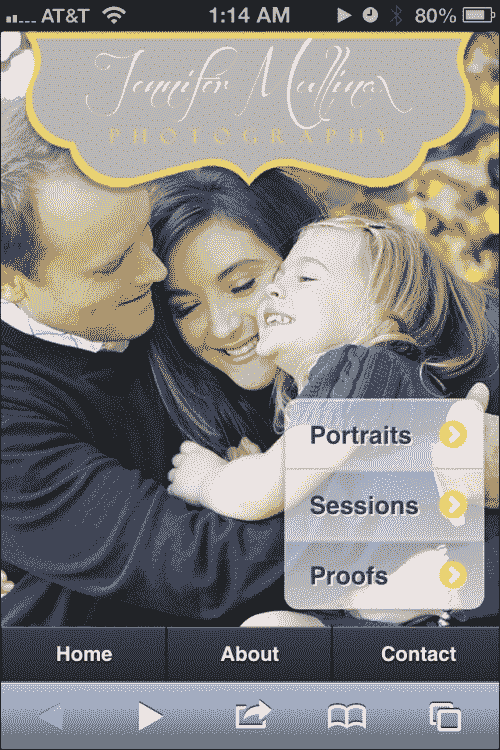
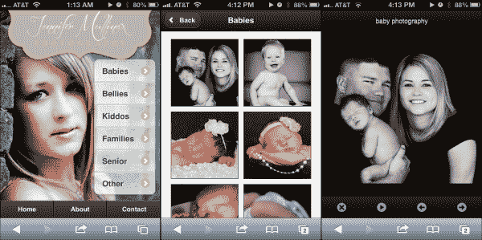
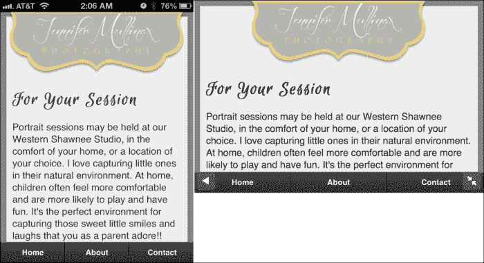
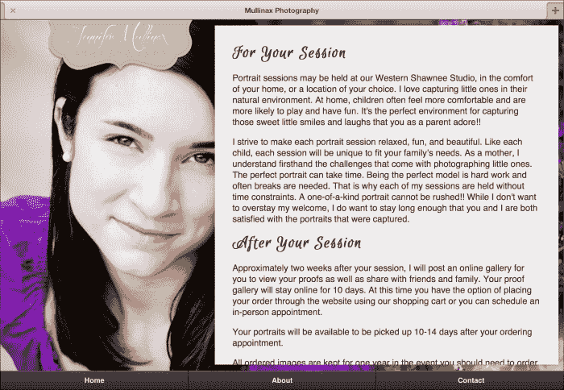
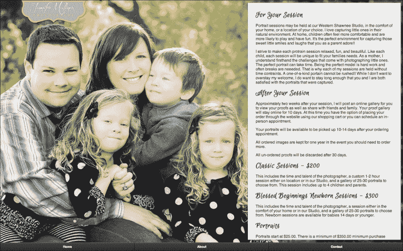

# 第七章：完全响应式摄影

我们的手机迅速成为我们的照片相册。摄影师代表着移动网页开发中一种尚未充分开发的市场。但如果你仔细想想，这个市场应该是第一个适应移动世界的。随着发达国家智能手机的普及，智能手机上的电子邮件打开率正在迅速接近 40%，当你阅读这篇文章时，可能已经达到了这个水平 ([`www.emailmonday.com/mobile-email-usage-statistics`](http://www.emailmonday.com/mobile-email-usage-statistics))。

当你收到摄影师的电子邮件，告诉你你的照片已经准备好查看时，你是不是很兴奋，立即尝试查看？然而，有很多精通自己行业的摄影师没有准备好满足新的移动需求的网站：



因此，这一章我们将涵盖以下内容：

+   使用 PhotoSwipe 创建基本画廊

+   支持完整的设备尺寸范围 - 响应式网页设计

+   响应式设计中的文本可读性

+   仅发送所需内容 - RESS

# 使用 PhotoSwipe 创建基本画廊

如果你正在寻找创建照片画廊的最快方法，那么你不会找到比 PhotoSwipe ([`www.photoswipe.com/`](http://www.photoswipe.com/)) 更快的解决方案。它的大小为 82 K，并不算轻，但它几乎可以在 jQuery Mobile 支持的任何 A 或 B 级别上使用。他们的网站称它可以在任何基于 WebKit 的浏览器上使用。这基本上意味着 iOS、Android 和 BlackBerry。这三个大平台都被覆盖了。但是 Windows Phone 呢？好消息！它在那里也表现得非常好。即使 JavaScript 被关闭，PhotoSwipe 也会优雅地退化为合理的按页浏览体验。我们可以从头开始制作一个纯粹的 jQuery Mobile 体验，但实际上... 为什么呢？

再次我将放弃严格地将 JavaScript 和 CSS 完全分离到它们自己的文件中的学术上正确的行为，而是简单地将所有定制的 JavaScript 构建到页面本身。对于本书的目的来说，这样做更容易。我假设如果你在阅读这本书，你已经知道如何正确地分离事物以及原因。

让我们从基础知识开始。大部分来自于他们网站的样板，但我们将从摄影师的角度开始：



让我们从 `<head>` 标签的关键部分开始：

```js
<link rel="stylesheet" href="http://code.jquery.com/mobile/1.3.0/jquery.mobile-1.3.0.min.css" />
<link rel="stylesheet" href="mullinax.min.css" />
<link rel="stylesheet" href="photoswipe.css" />
<link rel="stylesheet" href="jquery-mobile.css" />

<script src="img/klass.min.js"></script>
<script src="img/jquery-1.8.2.min.js"></script>	
<script src="img/jquery.mobile-1.3.0.min.js"></script>
<script src="img/code.photoswipe.jquery-3.0.5.min.js"></script>
<script src="img/code.photoswipe.galleryinit.js"></script>
```

### 注意

请注意，我们现在正在使用一个用 **ThemeRoller** 构建的自定义主题 ([`jquerymobile.com/themeroller/`](http://jquerymobile.com/themeroller/))。因此，我们只使用 `jquery.mobile.structure-1.2.0.min.css` 而不是完整的 jQM CSS。`mullinax.min.css` 文件是由 ThemeRoller 生成的，除了结构 CSS 外还包含其他所有必需的内容。

文件`photoswipe.css`、`jquery-mobile.css`、`klass.min.js`和`code.photoswipe.jquery-3.0.5.min.js`都是 PhotoSwipe 样板的一部分。文件名`jquery-mobile.css`有点误导。它实际上更像是一个适配器样式表，使 PhotoSwipe 在 jQuery Mobile 中工作和显示正确。没有它，您的画廊的无序列表看起来就不对了。最初，里面没有太多内容：

```js
.gallery { 
list-style: none; 
padding: 0; 
margin: 0; 
} 
.gallery:after { 
clear: both; 
content: "."; 
display: block; 
height: 0; 
visibility: hidden; 
} 
.gallery li { 
float: left; 
width: 33.33333333%;
} 
.gallery li a { 
display: block; 
margin: 5px; 
border: 1px solid #3c3c3c; 
} 
.gallery li img { 
display: block; 
width: 100%; 
height: auto; 
} 
#Gallery1 .ui-content, #Gallery2 .ui-content { 
overflow: hidden; 
}
```

这个设置在 iPhone 或 Android 手机上是可以的，但是如果您在任何类型的平板电脑或桌面大小的浏览器上查看它，画廊的缩略图可能会变得令人讨厌地太大。让我们看看我们能用媒体查询做些什么来使其具有更具响应性的设计。

# 支持全范围设备尺寸 - 响应式网页设计

**响应式网页设计**（**RWD**）是指使单个页面适应每个设备大小的概念。这意味着，我们不仅仅是在谈论具有 3.5 英寸屏幕的手机。那只是个开始。我们将支持各种尺寸的平板电脑，甚至是桌面分辨率。有关 RWD 概念的更多信息，请参阅[`zh.wikipedia.org/wiki/响应式网页设计`](https://zh.wikipedia.org/wiki/响应式网页设计)。

为了使 RWD 起作用，让我们根据常见设备和分辨率断点设置一些断点。我将从重新定义默认画廊项大小为 50％开始。为什么？在我使用智能手机以纵向模式浏览时，它只是让我感觉更舒适。所以，以下是断点。让我们将它们放入`chapter7.css`中：

```js
.gallery li { 
float: left; width: 50%; }

/* iPhone Horizontal -------------------*/ 
@media all and (min-width: 480px){ 
.gallery li { width: 33.33333333%; } 
} 

/* iPad Vertical -----------------------*/ 
@media only screen and (min-width: 768px) {
.gallery li { width: 20%; } 
}  

/* iPad Horizontal ---------------------*/ 
@media only screen and (min-width: 1024px) {     
.gallery li { width: 16.66666666%; } 
}  

/* Nexus 7 Horizontal ------------------*/ 
@media only screen and (min-width: 1280px) {     
.gallery li { width: 14.285714%; } 
}  

/* Laptop 1440 -------------------------*/ 
@media only screen and (min-width: 1440px) {     
.gallery li { width: 12.5%; } 
}  

/* Monitor 1600 ------------------------*/ 
@media only screen and (min-width: 1600px) {
.gallery li { width: 11.111111%; } 
}  

/* Monitor 1920 ------------------------*/ 
@media only screen and (min-width: 1920px) {     
.gallery li { width: 10%; } 
}  
```

在测试这个设置时，我仔细考虑了我与所观看屏幕之间的平均观看距离。这些分解导致了缩略图在视野中看起来理想的大致相同的百分比。显然，我的一个人的焦点小组在科学角度上毫无意义，所以可以随心所欲地进行调整。

可能会问，为什么不只是使每个图像具有固定大小？为什么不同的分辨率断点？真的很简单，它保持了事物的均匀间距，而不是因为某些显示器或浏览器的调整大小刚好有足够的空间强制换行，而不占用空白。它还有一个额外的好处，对于这本书来说，它展示了将通用样式表分解为使用媒体查询将 jQuery Mobile 站点转换为通用站点的好方法。我们想要进行的任何其他基于分辨率的调整都可以直接放入`chapter7.css`中的适当位置。

脚本`code.photoswipe.galleryinit.js`存在于可下载示例内部的 PhotoSwipe 画廊页面上。我认为它永远不需要根据每个页面进行编辑或自定义，所以我将该脚本块提取到了`code.photoswipe.galleryinit.js`中。以下是代码。不要再想它，因为它现在已经成为自己的小文件，再也不会被看到或听到了：

```js
(function(window, $, PhotoSwipe){ 
$(document).ready(function(){ 
  $(document) 
    .on('pageshow', 'div.gallery-page', function(e){ 
       var  currentPage = $(e.target), 
       options = {}, 
       photoSwipeInstance = $("ul.gallery a", e.target)
      .photoSwipe(options,  currentPage.attr('id')); 
       return true; 
    })  
   .on('pagehide', 'div.gallery-page', function(e){ 
      var currentPage = $(e.target), 
      photoSwipeInstance = 
      PhotoSwipe.getInstance(currentPage.attr('id'));
      if (typeof photoSwipeInstance != "undefined" 
      && photoSwipeInstance != null) { 
        PhotoSwipe.detatch(photoSwipeInstance); 
      } 
     return true; 
   }); 
}); 
}(window, window.jQuery, window.Code.PhotoSwipe));
```

现在，让我们考虑一下这些“页面”本身。我们将把这段代码放在`index.html`文件中，并随着进展逐步完善它：

```js
<div id="gallery" data-role="page">
  <div class="logoContainer">
    
  </div>
  <div data-role="content">
    <div class="artisticNav">
      <ul data-role="listview" data-inset="true">
        <li><a href="#babies">Babies</a></li>
        <li><a href="#babies">Bellies</a></li>
        <li><a href="#babies">Kiddos</a></li>
        <li><a href="#babies">Families</a></li>
        <li><a href="#babies">Senior</a></li>
        <li><a href="#babies">Other</a></li>
      </ul>
    </div>
  </div><!-- /content -->
</div><!-- /page -->
```

图库屏幕的设计概念如下：

+   全屏照片背景

+   在小屏幕上居中的标志，占屏幕宽度不超过 90%，并且不会超过其原始大小

+   导航仍然应该明显，但不会妨碍艺术本身

以下是我们还将放入`chapter7.css`中的相关 CSS：

```js
.logoContainer{text-align:center;} 
.logoContainer img{width:90%; max-width:438px;} 

#gallery{
background-image:url(backgroundSmall.jpg); 
background-repeat:no-repeat; 
background-position: top center;
} 

.portrait #gallery{ 
background-size:auto 100% !important;
}

.landscape #gallery{
background-size:100% auto !important;
} 

#gallery .ui-btn-up-c { 
background: rgba(255,255,255,.1); 
text-shadow: 1px 1px 0 white; 
background-image: -webkit-gradient(linear,left top,left bottom,from( rgba(255,255,255,.5) ),to( rgba(255,255,255,.7) )); 
background-image: -webkit-linear-gradient( rgba(255,255,255,.5),rgba(255,255,255,.7) ); 
background-image: -moz-linear-gradient( rgba(255,255,255,.5),rgba(255,255,255,.7) ); 
background-image: -ms-linear-gradient( rgba(255,255,255,.5),rgba(255,255,255,.7) ); 
background-image: -o-linear-gradient( rgba(255,255,255,.5),rgba(255,255,255,.7) ); 
background-image: linear-gradient( rgba(255,255,255,.5),rgba(255,255,255,.7) ); 
} 

#galleryNav{ position:absolute; bottom:10px; right:10px; }
```

现在我们只需要一点 JavaScript 来将所有这些联系在一起。当方向改变时，我们希望改变哪个方向占据 100%的背景宽度：

```js
/*Whenever the orientation changes*/
$(window).on("orientationchange", function(event){
  $("body").removeClass("portrait")
    .removeClass("landscape")
    .addClass(event.orientation); 
}); 

/*Prime the body with the orientation on document.ready*/
$(document).ready(function(e) { 
  if($(window).width() > $(window).height()) 
    $("body").addClass("landscape") 
  else 
    $("body").addClass("portrait") 
});
```

这对我们的图库入口页面已经足够了，现在让我们为婴儿照片准备一个示例图库。本章的代码中有许多图库条目。但为了简洁起见，我在这里缩短了代码。同样，这将在代码文件的最终版本`index.html`中。

```js
<div data-role="page" data-add-back-btn="true" id="babies" class="gallery-page">
  <div data-role="header">
    <h1>Babies</h1>
  </div>
  <div data-role="content">
    <ul class="gallery">
      <li><a href="images/full/babies1.jpg" rel="external"></a></li>
      <li><a href="images/full/babies2.jpg" rel="external"></a></li>
      <li><a href="images/full/babies3.jpg" rel="external"></a></li>
      <li><a href="images/full/babies26.jpg" rel="external"></a></li>
    </ul>
  </div>
</div>
```

### 注意

如果您没有在每个指向图像的链接上放置`rel="external"`，它将无法正常工作。PhotoSwipe 文档已经很清楚地说明了这一点。如果您还不熟悉`rel="external"`，它是告诉 jQuery Mobile *不要*使用其通常的基于 AJAX 的导航跟随链接的一种方法。因此，它将强制全页加载到您要链接到的任何内容。

现在，只是为了好玩，将其在桌面浏览器中以全宽打开，然后将其缩小到移动设备尺寸，并观察其自适应。尝试使用图库首页、婴儿缩略图库和 PhotoSwipe 提供的幻灯片功能。

PhotoSwipe 的一个很酷的部分是，即使您在移动站点上使用 meta-viewport 标签禁用了缩放，用户仍然可以在全尺寸照片周围捏放和缩放。在平板电脑上非常方便。他们只需双击图像即可返回导航，图像将缩放到原始大小并显示导航。虽然这不是最明显的功能，但返回按钮也可以使用。

自然地，正如名称所暗示的，您可以简单地从一张照片滑动到另一张，并在到达集合末尾时循环回到集合开头。还有一个幻灯片功能，可以无限循环播放。在这两种情况下，如果用户按下返回按钮，他们将被带回缩略图页面。

我们目前唯一真正的问题是我们有一个可以很好缩放的站点，但是背景图像和全尺寸照片可能比严格必要的要大。背景图片实际上不是问题，因为我们可以根据媒体查询来确定发送哪种尺寸的图像。我们只需要创建两到三个背景图像尺寸，并覆盖`jquery-` `le.css`文件中使用的图像。在本章的最终版本代码中，我已将`jquery-mobile.css`重命名为`chapter7.css`，以避免与实际的 jQuery Mobile 库 CSS 文件混淆。

# 文本可读性和响应式设计

研究表明，每行理想的字符限制是有的。理想情况下，您应该选择 35、55、75 或 95 CPL（每行字符数）。人们倾向于更短或更长的行。由于我们真的想在这里展示摄影作品，所以让我们选择较短的 CPL。如果您想阅读完整的报告，可以在 [`psychology.wichita.edu/surl/usabilitynews/72/LineLength.asp`](http://psychology.wichita.edu/surl/usabilitynews/72/LineLength.asp) 找到它。

在很大程度上，我们的文本列宽将受到设备本身的限制。在较小的设备上，我们确实别无选择，只能使用`100%`的宽度。一旦我们到了横向模式的平板电脑，我们就有了创造性地处理文本的空间。对于较大的宽度，我们可以将我们的每行字符数（CPL）增加到 55，效果会很好。我们也可以考虑使用更大的图片。无论我们做什么，都要确保设定了一组强有力的媒体查询断点是关键。

让我们使用这项研究作为指导，将一些有关会话的段落文字更具响应性：

```js
<div id="sessions" data-role="page">
  <div class="logoContainer">
    <a href="#home"></a>
  </div>
<div data-role="content">
  <div class="textContainer ui-shadow">
    <h3>For Your Session</h3>

    <p>Portrait sessions may be held at our Western Shawnee Studio, in the comfort of your home, or a location of your choice. I love capturing little ones in their natural environment. At home, children often feel more comfortable and are more likely to play and have fun. It's the perfect environment for capturing those sweet little smiles and laughs that you as a parent adore!!</p>

     <p>I strive to make each portrait session relaxed, fun, and beautiful. Like each child, each session will be unique to fit your family's needs. As a mother, I understand firsthand the challenges that come with photographing little ones. The perfect portrait can take time. Being the perfect model is hard work and often breaks are needed.  That is why each of my sessions is held without time constraints. A one-of-a-kind portrait cannot be rushed!! While I don't want to overstay my welcome, I do want to stay long enough that you and I are both satisfied with the portraits that were captured.</p>

    <h3>After Your Session</h3>

    <p>Approximately two weeks after your session, I will post an online gallery for you to view your proofs as well as share with friends and family. Your proof gallery will stay online for 10 days. At this time you have the option of placing your order through the website using our shopping cart or you can schedule an in-person appointment.</p>

  </div>
</div><!-- /content -->
<div data-role="footer">
  <div data-role="navbar" data-position="fixed">
    <ul>
      <li><a href="#home">Home</a></li>
      <li><a href="#about">About</a></li>
      <li><a href="#contact">Contact</a></li>
    </ul>
  </div><!-- /navbar -->
</div>
</div><!-- /page -->
```

接下来，让我们制定一些关于其在页面上放置的规则：

```js
#sessions{ 
  background-color:#888; 
  background-repeat:no-repeat; 
  background-position: 
  center center; 
}  

#sessions h3{
  font-family: 'Euphoria Script', Helvetica, sans-serif; 
  font-size:200%; 
  font-weight:bold; 
  margin:0;
}

.textContainer{ 
  background-color:#EEE;
  margin:-5px;
} 

/* iPhone Portrait --*/ 
@media all and (min-width: 320px){ 
  .textContainer{ 
    padding:120px 10px 10px 10px;
  } 
  #sessions{ 
    background-image:none; 
  }
} 

/* iPad Verticle --*/ 
@media only screen and (min-width: 768px) {     
.textContainer{ padding:160px 10px 10px 10px;} 
}

/* iPad Horizontal --*/ 
@media only screen and (min-width: 1024px) {     
  .textContainer{
    float:right; 
    width:35em; 
    padding:2em 2em 2em 2em; 
    height:550px; 
    overflow:scroll;
  } 
  #sessions{ 
    background-image:url(images/Colleen.jpeg)
  }
}

/* Laptop 1440 --*/ 
@media only screen and (min-width: 1440px) { 
  #sessions{ 
    background-image:url(images/Gliser.jpg) 
  }   
}
```

与以前一样，在较小的宽度上设置的规则将延伸到更宽的宽度，除非指定了一个值来覆盖。您可以看到我是如何在 iPad 横向视图和 1440 分辨率上切换用于会话的图像的。在那之前，每个分辨率都继承了 `background-image:none` 形式和 320px 的规则。

现在让我们来看看我们的结果。

## 智能手机尺寸设备

在这里，我们看到了小屏幕上的会话内容，无论是纵向还是横向，都非常易读，但是都不是真正适合显示除文本以外的任何内容的理想方式。如果我们试图塞入任何形式的艺术作品，它都不会显示得好。我们会违反刚刚谈到的良好文本可读性。你或者摄影师可能会认为，将其中一张图片淡入背景看起来不错，但不要这样做！将大部分阅读文本保持为黑底白字、标准字体大小和标准字体。



## 平板设备尺寸

这里我们看到相同的内容在平板上渲染。在纵向方向上，如果我们将文本保持在`100%`的宽度，仍然非常适合阅读。我们完全符合良好可读性的指南。然而，当用户切换到横向时，情况就不同了。在横向模式下，平板终于有足够的空间来展示一些摄影作品和文本：



## 桌面尺寸设备

这仍然是一个 jQuery Mobile 页面，但我们看起来更像是一个桌面站点。现在我们可以展示不止一个面孔，所以我们不妨换一些不同的照片来展示艺术家的能力：



是的，这是我和我的家人。是的，*我*为他们感到非常自豪。而且我对于每一个分辨率断点上的文本处理方式都非常满意，并且它是在一个页面上完成的。

# 循环背景图像

那么，当我们使用的图像依赖于我们当前的分辨率和方向时，我们如何循环背景图像呢？这几乎排除了循环一个单一图像的可能性。相反，我们将不得不交换整个样式表。下面是代码：

```js
<link rel="stylesheet" href="rotating0.css" id="rotatingBackgrounds" />
```

它开始时是一个非常简单的样式表，但你可以将它制作得像你想要的那样复杂。我们暂不考虑高清显示和标清显示。iPhone 4 具有视网膜显示屏（326 ppi）在 2010 年 6 月发布。自那以后，趋势已经转向高清屏幕，所以我只是假设大多数人在过去两年内已经更新了他们的智能手机，或者他们很快就会更新。同样要记住，我们正处于 LTE（第四代移动宽带）普及的边缘。这意味着很快，移动速度将比大多数家庭宽带速度更快。

现在，这真的是懒惰的借口，不去制作更小的版本以充分利用性能吗？不，很可能，一些讨厌者和学者甚至会对上一段提出异议。我会说，性能确实很重要。这是一个可计费的功能。但想想你想循环播放多少图像，然后乘以你想要花时间准备和测试多少分辨率和尺寸变体。再次强调，这都是可计费的，除非你是免费做的。

一直进行这样细微的优化，到底还需要多长时间才能让其真正没有明显的差别？如果你是在 2014 年或之后阅读此内容，你可能对必须在任何实际意义上担心带宽的想法感到嗤之以鼻（取决于你所在的市场）。这只是一些思考。

下面是用于旋转的一个 CSS 文件：

```js
@charset "UTF-8"; 
/* CSS Document */ 

#gallery{background-image:url(images/homebg.jpg);}   

/* iPhone Portrait --*/ 
@media all and (min-width: 320px){ 
#home{
background-image:url(images/backgroundSmartphone.jpg);
} 
#sessions{ background-image:none; }  
}  

/* iPhone Horizontal / Some Droids --*/ 
@media all and (min-width: 480px){  } 

/* iPad Verticle --*/ 
@media only screen and (min-width: 768px) { 	
#home{background-image:url(images/backgroundSmall.jpg);} 
}  

/* iPad Horizontal --*/ 
@media only screen and (min-width: 1024px) { 
#sessions{ background-image:url(images/Colleen.jpeg) }  
}  

/* Nexus 7 Horizontal --*/ 
@media only screen and (min-width: 1280px) {  }  

/* Laptop 1440 --*/ 
@media only screen and (min-width: 1440px) { 
#sessions{ background-image:url(images/Gliser.jpg) }   
}  

/* Monitor 1600 --*/ 
@media only screen and (min-width: 1600px) {  }  

/* Monitor 1920 --*/ 
@media only screen and (min-width: 1920px) {  } 
```

现在我们需要决定如何循环它们。我们可以使用`setInterval` JavaScript 来定时交换样式表。说实话，即使对于一个摄影网站，我认为这有点乐观。我们可能不希望每五秒钟就交换一次。想想：移动设备的使用模式涉及快速、短暂的工作或游戏。大多数人不会在任何给定的移动屏幕上停留超过 5 秒，除非它要么是文字密集的，比如一篇文章，要么制作得如此糟糕以至于用户无法导航。所以可以很肯定地说，`setInterval`选项不可行。

好吧，也许最好在`pagebeforeshow`事件上随机选择一个样式表？考虑以下代码：

```js
$(document).on("pagebeforeshow", "[data-role='page']", function(){ 
  $("#rotatingBackgrounds").attr("href", "rotating" + 
Math.floor(Math.random()*4) + ".css");
});
```

但是当我们尝试这样做时会发生什么？我们会得到奇怪、丑陋的图像闪烁。使用淡入淡出转换或幻灯片，真的无关紧要。使用`pageshow`事件也没有任何区别。看起来很糟糕。不要这样做。我知道很诱人，但这样做一点也不好看。*因此，经过这一切，我建议保留单一、每次会话随机分配的样式表*。考虑下面的代码片段：

```js
<link rel="stylesheet" href="" id="rotatingBackgrounds" />
<script type="text/javascript">
$("#rotatingBackgrounds")
  .attr("href","rotating"+Math.floor(Math.random()*4)+".css")
</script>
```

请注意，我并没有简单地使用`document.write()`。

### 注意

**专业提示**

永远不要在 jQuery Mobile 环境中使用`document.write()`。它会对你的 DOM 造成严重影响，你会摸不着头脑想知道出了什么问题。我以前看到过它折磨过人们。我的朋友的头发已经很少了，这个问题使他抓狂。相信我，要避免使用`document.write()`。

# 另一种响应式方法 - RESS

**响应式设计 + 服务器端组件**（**RESS**）是一个非常合理的想法。其概念是使用服务器端的移动设备检测方法，比如**WURFL**（[`wurfl.sourceforge.net/`](http://wurfl.sourceforge.net/)）。然后，你会发送不同版本的页面组件、不同大小的图片等等。然后我们可以像任何自制的标记一样轻松地改变页面内容和导航的包装以使用 jQuery Mobile。这种方法的美妙之处在于每个人都能得到适合他们的内容，而不会像典型的响应式设计那样臃肿，而且始终在相同的 URL 上。

我第一次看到这个想法被提出是在 2011 年 9 月的一篇文章中，作者是 Luke Wroblewski（[`twitter.com/lukew`](https://twitter.com/lukew)），文章链接为[`www.lukew.com/ff/entry.asp?1392`](http://www.lukew.com/ff/entry.asp?1392)。在文章中，他概述了我们现在面临的与图像相关的性能问题。Luke 认为这是一种在没有任何移动框架的情况下进行纯粹响应式网页设计的方法。

WURFL 可以告诉你所服务的设备的屏幕尺寸，你可以（实时）调整你的摄影师原始的 3 MB 图像大小，缩小到 150 KB、70 KB 等，具体取决于设备分辨率。你仍然希望确保它比你所服务的屏幕尺寸大约两倍，否则用户在 PhotoSwipe 视图中尝试放大照片时将只会看到模糊的混乱。

虽然在某些方面很方便，但 RESS 永远不会是一个完美的解决方案，因为它依赖于浏览器嗅探来完成其工作。那么，这是不好的吗？不，不是真的。没有一个解决方案是完美的，但设备数据库是由社区驱动的，并且快速更新，所以这有所帮助。这将是一个非常可行的解决方案，我们将在下一章更深入地讨论它。

# 最终代码

本次体验的完整代码有点冗长，不太适合放入一本书中，而且我们已经探讨过相关概念了。我强烈建议你查看代码。到此时，对你来说应该没有什么令人惊讶的了。与之互动。调整它。通过交换服务来建立你的作品集，免费获取一些摄影作品。

# 摘要

处理响应式设计时，采用移动优先的方法，就像我们这里所做的一样，可以将一个很棒的移动站点变成一个性能非常高的桌面站点，但通常反之则不行。其中的关键在于媒体查询和先从小尺寸开始。如果它在移动设备上运行得如此出色，那么想象一下在没有任何限制的机器上会有多么惊人。在下一章中，我们将探讨 WURFL 和其他移动检测方法，尝试调整现有的网站并使其适应移动设备。
