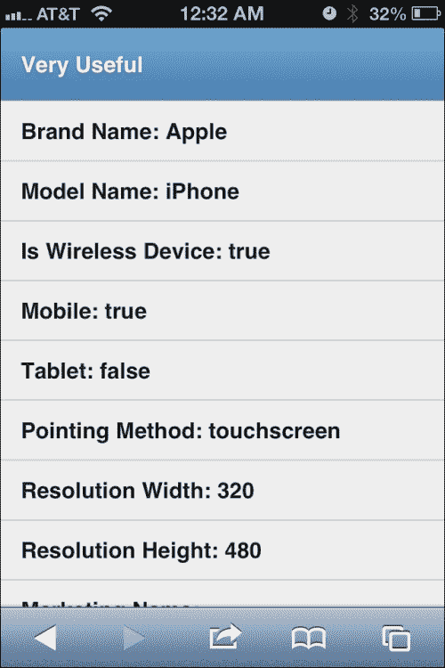
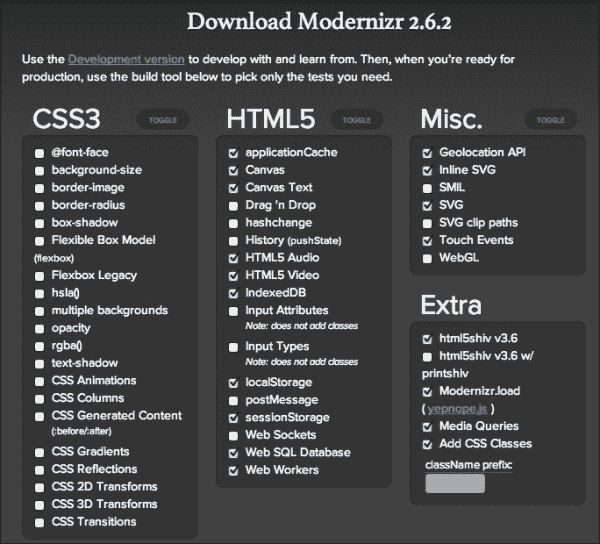
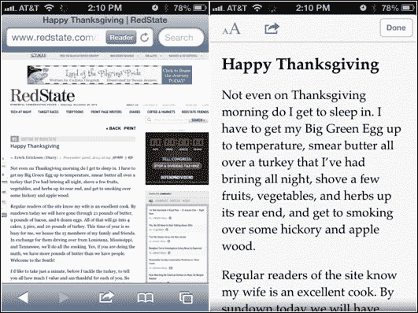
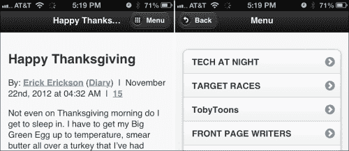
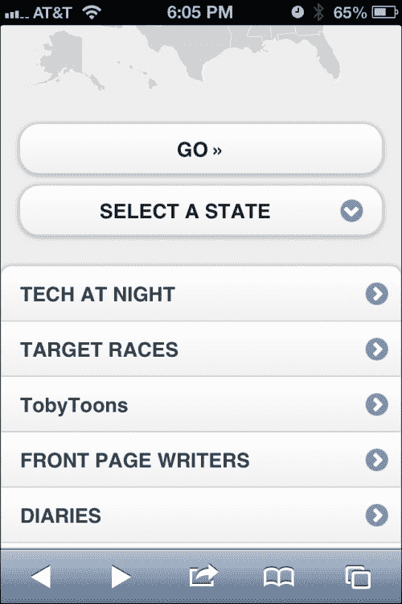
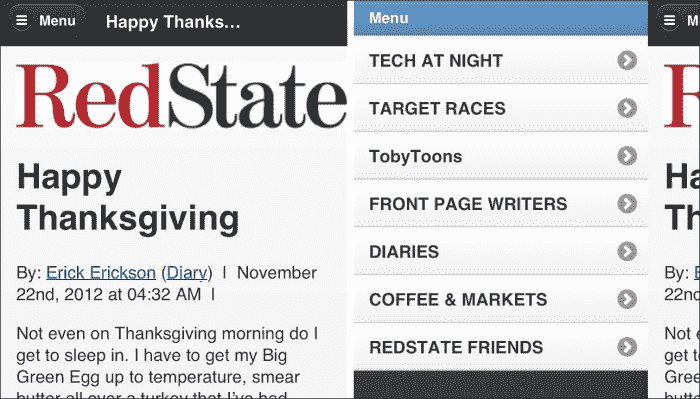
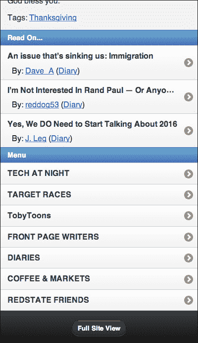

# 第八章：把 jQuery Mobile 整合到现有网站中

我们并非都有幸只为新网站工作。也许客户不愿意为移动优先的站点付费，或者他们喜欢他们的桌面站点，只想要一个移动站点。你的移动实施可能是未来与客户业务的入口。我们需要准备一些技术手段将 jQuery Mobile 嵌入到他们现有的站点。

我们将涵盖的内容如下：

+   服务器端、客户端的移动检测，以及两者的结合

+   移动化全站页面 - 比较困难的方式

+   移动化全站页面 - 比较简单的方式

# 服务器端、客户端的移动检测，以及两者的结合

并非每个人都在做响应式设计，所以你很有可能需要知道如何检测移动设备。我们之前只是轻描淡写地谈到过这个话题，现在让我们认真对待它。

## 浏览器嗅探与特性检测

这个话题有潜力引发一场极客之战。一方面，有人赞美由社区维护的数据库在服务器端执行移动设备检测的优点。WURFL 就是一个典型的例子。使用它，我们可以获取访问我们网站的设备的大量信息。在这里列出所有内容只是浪费空间。可以去查看[`www.tera-wurfl.com/explore/index.php`](http://www.tera-wurfl.com/explore/index.php)来看它的运行情况，或者查看所有功能的完整列表在[`www.scientiamobile.com/wurflCapability/`](http://www.scientiamobile.com/wurflCapability/)。

在辩论的另一面，有人指出服务器端的检测（即使是数据库驱动的）可能导致全新的设备在数据库中没有被识别，直到它们进入数据库，站点管理员更新他们的本地副本。这并非完全正确。所有的安卓都是这样。同样的情况也发生在 iPhone、iPad、BlackBerry 和 Microsoft 上。但是，一个更具有未来前景的([`futurefriend.ly/`](http://futurefriend.ly/))方法是使用特性检测。例如，设备是否支持画布或触摸事件？几乎可以肯定，如果你支持这些技术和事件，你就有了使用 jQuery Mobile 的移动体验的条件。

无论如何，在这一点上，我们要假设我们正在为一家已经拥有网站且现在也想要一个移动站点的公司工作。因此，我们需要能够检测移动设备并将它们路由到正确的站点。

## WURFL – 服务器端数据库驱动的浏览器嗅探

WURFL 拥有 Java、PHP 和.NET 的 API。在[`wurfl.sourceforge.net/apis.php`](http://wurfl.sourceforge.net/apis.php)可以下载适合你的版本。由于几乎每个主机提供商都默认支持 PHP，我们将以 PHP 示例为例：



我只是使用了 Mac OS X 自带的服务器，但你也可以使用 MAMP ([`www.mamp.info/en/index.html`](http://www.mamp.info/en/index.html))。你可以轻松地在任何托管平台上运行示例，比如 1&1、GoDaddy、Host Gator，你随便选。如果你想在自己的 Windows 计算机上尝试这些示例，你可以使用 XAMPP ([`www.apachefriends.org/en/xampp.html`](http://www.apachefriends.org/en/xampp.html)) 或 WAMP ([`www.wampserver.com/en/`](http://www.wampserver.com/en/)) 作为快捷方式。我不打算在这本书中详细介绍服务器设置和环境配置。这可能需要一本专门的书来解释。

因此，PHP… 这就是我们要做的。从 [`wurfl.sourceforge.net/php_index.php`](http://wurfl.sourceforge.net/php_index.php) 开始。从那里，你可以下载最新版本的 **WURFL API package** 并解压缩它。把整个解压后的文件夹放在你的网站的任何位置。如果一切正常，你应该能够访问演示页面并查看有关你的浏览器和设备的详细信息。在我的 Mac 上，是 [`127.0.0.1/~sgliser/wurfl-php/examples/demo/index.php`](http://127.0.0.1/~sgliser/wurfl-php/examples/demo/index.php)，但你的路径可能会有所不同。

当你运行默认示例时，你可以立即看到它有多有用，但让我们让它变得更好一些。我创建的这个版本将最有用的功能放在顶部，并在下面列出所有其他选项：

```js
<?php 
  // Move the configuration and initialization to 
  // the tip so you can use it in the head.  

  // Include the configuration file 
  include_once './inc/wurfl_config_standard.php';  

  $wurflInfo = $wurflManager->getWURFLInfo();  

  if (isset($_GET['ua']) && trim($_GET['ua'])) { 
    $ua = $_GET['ua']; 
    $requestingDevice = $wurflManager->getDeviceForUserAgent($_GET['ua']); 
  } else { 
    $ua = $_SERVER['HTTP_USER_AGENT']; 

    //This line detects the visiting device by looking 
    //at its HTTP Request ($_SERVER) 

    $requestingDevice = $wurflManager->getDeviceForHttpRequest($_SERVER); } ?> 

<html> 
  <head> 
    <title>WURFL PHP API Example</title>     
    <?php if($requestingDevice->getCapability('mobile_browser') !== ""){ ?>     
      <meta name="viewport" content="width=device-width, initial-scale=1, maximum-scale=1.0, user-scalable=no">         
      <link rel="stylesheet" href="http://code.jquery.com/mobile/1.2.0/jquery.mobile-1.2.0.min.css" />         
      <script src="img/jquery-1.8.2.min.js"></script>         
      <script src="img/jquery.mobile-1.2.0.min.js"></script> 
    <?php } ?> 
  </head> 
  <body> 
```

在这里，我们按照 jQuery Mobile 的方式创建了唯一的真实页面：

```js
  <div data-role="page">     
    <div data-role="header">     	
      <h1>WURFL XML INFO</h1>     
    </div> 
  <div data-role="content" id="content"> 

  <h4>VERSION: <?php echo $wurflInfo->version; ?> </h4> 
  <p>User Agent: <b> <?php echo htmlspecialchars($ua); ?> </b></p> 
  <ul data-role="listview">        
    <li data-role="list-divider">
      <h2>Very Useful</h2>
    </li> 
    <li>Brand Name: <?php echo $requestingDevice->getCapability('brand_name'); ?> </li> 
    <li>Model Name: <?php echo $requestingDevice->getCapability('model_name'); ?> </li> 
    <li>Is Wireless Device: <?php echo $requestingDevice->getCapability('is_wireless_device'); ?></li>             
    <li>Mobile: 
    <?php if($requestingDevice->getCapability('mobile_browser') !== ""){ 
       echo "true"; 
     }else{ 
       echo "false"; 
     }; ?>
    </li>             
    <li>Tablet: <?php echo $requestingDevice->getCapability('is_tablet'); ?> </li>             
    <li>Pointing Method: <?php echo $requestingDevice->getCapability('pointing_method'); ?> </li> 	
    <li>Resolution Width: <?php echo $requestingDevice->getCapability('resolution_width'); ?> </li> 
    <li>Resolution Height: <?php echo $requestingDevice->getCapability('resolution_height'); ?> </li> 
    <li>Marketing Name: <?php echo $requestingDevice->getCapability('marketing_name'); ?> </li> 
    <li>Preferred Markup: <?php echo $requestingDevice->getCapability('preferred_markup'); ?> </li> 
```

在这里，我们通过循环遍历属性数组来列出 WURFL 中已知数据的整个集合：

```js
    <li data-role="list-divider">
      <h2>All Capabilities</h2>
    </li>         

    <?php foreach(array_keys($requestingDevice->getAllCapabilities()) as $capabilityName){ ?> 
      <li><?php echo "<h3>" .$capabilityName."</h3><p>" .$requestingDevice->getCapability($capabilityName)."</p>"; ?>
      </li>         
    <?php } ?>         
    </ul> 

    <p><b>Query WURFL by providing the user agent:</b></p> 
    <form method="get" action="index.php"> 
      <div>User Agent: <input type="text" name="ua" size="100" value="<?php echo isset($_GET['ua'])? htmlspecialchars($_GET['ua']): ''; ?>" /> 
        <input type="submit" value="submit" />
      </div> 
    </form> 
  </div> 
</div> 
</body> 
</html>
```

### 注意

注意，我们通过使用服务器端检测来查看用户是否是移动用户，*有条件地*将其制作成了 jQuery Mobile 页面。只有在用户是移动用户时，我们才注入 jQM 库。

在 *非常有用* 部分下的属性可能是你在日常工作中真正需要的所有内容，但请务必至少浏览一下其他选项。最有用的功能如下：

+   `is_wireless_device`

+   `mobile_browser`

+   `is_tablet`

+   `pointing_method`

+   `resolution_width`

+   `resolution_height`

现在，需要说明的是，这并不能告诉我们有关浏览器/设备的所有信息。例如，iPhone 4S 或 5 将被识别为原始 iPhone。WURFL 也无法区分使用 WURFL 的 iPad mini。这是因为随着 Apple 设备的发展，用户代理从未更新。WURFL 无法知道设备具有高像素密度，因此应该发送更高分辨率的图像。因此，我们仍然需要使用媒体查询来确定像素比率，并相应地调整我们的图形。这里是一个简短的示例：

```js
.logo-large{
  background-image:url(../images/logo.png);
  background-repeat:no-repeat;
  background-position:0 0;
  position:relative;
  top:0;
  left:0;
  width:290px;
  height:65px; 
  margin:0 auto; 
  border:none;
}  

/* HD / Retina ---------------------------------------------*/ @media only screen and (-webkit-min-device-pixel-ratio: 1.5),
       only screen and (min--moz-device-pixel-ratio: 1.5),
       only screen and (min-resolution: 240dpi) 
{ 
  .logo-large{
    background-image:url(../images/logoHD.png);
    background-size:290px 65px;
  }  
}
```

### 注意

使用媒体查询几乎是检测 iPad mini 的唯一方法。它具有与 iPad 2 相同的分辨率，只是格式较小。但是，正如我们从前面的代码中可以看到的那样，我们可以使用 DPI 对媒体查询进行限定。iPad 2 的 DPI 为 132。iPad mini 的 DPI 为 163。更多信息，请访问 [`www.mobilexweb.com/blog/ipad-mini-detection-for-html5-user-agent`](http://www.mobilexweb.com/blog/ipad-mini-detection-for-html5-user-agent)。

到目前为止，我们几乎假定了智能手机，但请记住，jQuery Mobile 是一个同样适用于……不那么智能的手机的框架。您可能有客户在一个不那么发达并且几乎使用手机连接的市场。在那里可能没有那么多启用 JavaScript 的触摸屏手机。在这种情况下，您将无法使用基于 JavaScript 的功能检测。非常快地，WURFL 或其他服务器端检测将成为检测无线设备并为其提供有用内容的唯一合理选项。

## 基于 JavaScript 的浏览器嗅探

可以说，这可能是（学术上）检测移动设备的最糟糕的方法，但它确实有其优点。这个实用的例子非常有用，因为它给了您很多选择。也许我们的预算有限，因此我们只测试了某些设备。我们想确保我们只让我们知道会有良好体验的人进来。有一个例子：不会允许使用 BlackBerry 版本低于版本 6 的设备，因为我们选择使用了一些版本低于版本 5 的精美 JavaScript 模板。也许我们还没有花时间为平板电脑进行优化，但同时我们可以开始为任何智能手机提供更好的体验。无论如何，这可能会非常有用：

```js
<script type="text/javascript">     
  var agent = navigator.userAgent;      
  var isWebkit = (agent.indexOf("AppleWebKit") > 0);      
  var isIPad = (agent.indexOf("iPad") > 0);      
  var isIOS = (agent.indexOf("iPhone") > 0 || agent.indexOf("iPod") > 0);     
  var isAndroid = (agent.indexOf("Android")  > 0);     
  var isNewBlackBerry = (agent.indexOf("AppleWebKit") > 0 && agent.indexOf("BlackBerry") > 0);     
  var isWebOS = (agent.indexOf("webOS") > 0);      
  var isWindowsMobile = (agent.indexOf("IEMobile") > 0);     
  var isSmallScreen = (screen.width < 767 || (isAndroid && screen.width < 1000));     
  var isUnknownMobile = (isWebkit && isSmallScreen);     
  var isMobile = (isIOS || isAndroid || isNewBlackBerry || isWebOS || isWindowsMobile || isUnknownMobile);     
  var isTablet = (isIPad || (isMobile && !isSmallScreen));     
if ( isMobile && isSmallScreen && document.cookie.indexOf( "mobileFullSiteClicked=") < 0 ) mobileRedirect(); 
</script>
```

我们在这里做了一些工作，通过创建一个未知移动设备的分类，将其视为运行 WebKit 并具有小屏幕的任何设备，来未来证明检测的有效性。有可能，任何新推出的平台都将使用 WebKit 作为其浏览器。微软是唯一一个似乎仍然认为自己有更多东西可以提供的例外，他们的平台足够容易被嗅探到。尽管这种方法灵活，但如果没有一个 WebKit 浏览器启动一个新平台，就需要直接干预。但是，这种情况并不经常发生。即使发生了，该平台也需要一段时间才能获得值得考虑的关键性质量。如果您按照 80/20 法则（成功达到 80% 并在能够时达到剩下的 20%），那么这将使您的成功率远远超过 90%。

## 使用 Modernizr 进行基于 JavaScript 的功能检测

有几种方法可以进行功能检测。可能最简单的方法是使用像 Modernizr（[`modernizr.com/`](http://modernizr.com/)）这样的工具。您可以定制下载以仅检测您关心的功能。如果您想使用 HTML5 音频/视频，知道您是否可以可能很好：



这个平台并不是特别轻便。仅在前面的屏幕截图中显示的选项就导致了 12 K 压缩后的 JS。但是嘿，我们可以轻易地处理那样大小的图像。至少 JavaScript 库是有用的。这仍然不会告诉你访问你的用户是否是移动设备，但这是否是正确的问题？

或许，我们只需要知道我们正在查看的设备是否支持触摸事件。其他选项对于知道您可以和不能做什么是很好的，但是如果用户界面是触摸的，即使是平板电脑或全尺寸的触摸型显示器，也应该给用户他们应得的界面。给他们 jQuery Mobile。

## 基于 JavaScript 的精简特征检测

这个有用的小代码片段是为检测移动设备而凑合在一起的。它是特性检测和浏览器嗅探的混合体。大多数现代智能手机都将支持我们在这里寻找的所有事件和 API。微软，总是显得有些特殊，必须进行浏览器嗅探。根据他们的 Windows Phone 开发者博客，你可以简单地检查用户代理是否为 IEMobile。好吧，这是结果：

```js
if( 
  ('querySelector' in document 
  && 'localStorage' in window      
  && 'addEventListener' in window      
  && ('ontouchstart' in window || 
  window.DocumentTouch && document instanceof DocumentTouch)
  )      

  || navigator.userAgent.indexOf('IEMobile') > 0)
{                  
  location.replace('YOUR MOBILE SITE'); 
}
```

如果出于某种原因，我们决定不将平板发送到我们的 jQM 杰作，我们总是可以从上一节中加入一些其他测试。

## 服务器端加客户端检测

这是一个主意，当用户首次访问您的服务器时，发送一个页面，其唯一任务是运行 Modernizer，然后将结果能力返回给服务器，以便所有收集的知识都在一个地方。

这个文件在章节的代码文件包中名为 `test.html`：

```js
<!doctype html> 
<html> 
<head> 
  <style type="text/css"> 

    #sd{display:block;} /*standard def*/ 
    #hd{display:none;} /*high dev*/ 

    @media only screen and 
      (-webkit-min-device-pixel-ratio: 1.5),        
      only screen and (min--moz-device-pixel-ratio: 1.5),        
      only screen and (min-resolution: 240dpi) { 
        #sd{display:none;} /*standard def*/ 	
        #hd{display:block;} /*high dev*/    
      } 
  </style> 
  <script type="text/javascript" src="img/modernizr.custom.94279.js"></script> 
  <script type="text/javascript" src="img/jquery.min.js"></script> 
  <meta charset="UTF-8"> 
  <title>Loading</title> 
</head>  
<body> 
  <div id="hd"></div> 
  <div id="sd"></div> 
</body> 
<script type="text/javascript"> 
  if($("#hd").is(":visible")){ 
    $("html").addClass("hdpi"); 
  }else{ 
    $("html").addClass("sdpi"); 
  } 

  $.post("/~sgliser/wurfl-php/examples/demo/session_set.php", 
    { 
      modernizrData: $("html").attr("class") 
    } 
  ) 
  .success(function(data, textStatus, jqXHR) {  
    console.log(data); 
    location.replace("YOUR MOBILE SITE");  }) 
  .error(function(jqXHR, textStatus, errorThrown) {  
    console.log(errorThrown); 
    location.replace("SOMEWHERE ELSE");  
  }); 
</script> 
</html> 
```

为了使圆圈完整。这里是一些 WURFL 检测脚本的版本，它将返回 JSON 格式的值，以便我们可以将其存储到 HTML5 的 `sessionStorage` 中。此文件位于 `/wurfl-php/examples/demo/session_set.php`：

```js
<?php session_start();  

// Move the configuration and initialization 
// to the tip so you can use it in the head.  

// Include the configuration file 

include_once './inc/wurfl_config_standard.php';  

$wurflInfo = $wurflManager->getWURFLInfo();  

if (isset($_GET['ua']) && trim($_GET['ua'])) { 
  $ua = $_GET['ua']; 
  $requestingDevice = $wurflManager->getDeviceForUserAgent($_GET['ua']); 
} else { 
  $ua = $_SERVER['HTTP_USER_AGENT']; 

  // This line detects the visiting device by looking 
  // at its HTTP Request ($_SERVER) 

  $requestingDevice = $wurflManager->getDeviceForHttpRequest($_SERVER); 
}  

// store session data $_SESSION['wurflData']=$requestingDevice; 

$_SESSION['modernizrData']=$_POST['modernizrData'];  

$i = 0; 

$capabilities = $requestingDevice->getAllCapabilities(); 
$countCapabilities = count($capabilities); 
?> 
{ 
  "wurflData": <?php  

  //echo json_encode($capabilities); 
  foreach(array_keys($capabilities) as $capabilityName){  
    $capability = $requestingDevice->getCapability($capabilityName); 
    $isString = true; 	
    if($capability == "true" || 
       $capability == "false" || 
       is_numeric($capability))
    { 
      $isString = false; 
    } 

    echo "\"".$capabilityName
      ."\":".(($isString)?"\"":"")l
      .$requestingDevice->getCapability($capabilityName)
      .(($isString)?"\"":"");  

    if(($i + 1) < $countCapabilities){ 
      echo ",\n";  
    } 

    $i++; 
  }   
?> 
}
```

### 注

这个示例已经注释掉了 JSON 编码关联数组的简单方式。用一些 PHP 代码替换，将发送回使用真实布尔值和数值的 JSON 编码，而不是将所有内容都存储为字符串。

有了这些文件，你现在可以了解关于你的访问者在服务器端和客户端的一切都是可知的。

# 移动化全站页面 - 走弯路

为什么要走弯路？为什么？实际上只有一个很好的理由：为了将内容保持在同一页上，这样用户就不会有一个用于移动设备的页面和一个用于桌面的页面。当电子邮件和推特等信息飞来飞去时，用户通常不在乎他们是发送移动视图还是桌面视图，而且他们也不应该在乎。就他们而言，他们正在向某人发送内容。这是响应式设计的主要论点之一。但别担心，当我们也以简单的方式处理事情时，我们将在稍后考虑到这一点。

一般来说，很容易看出站点的哪些部分会转换为移动站点。几乎不管站点布局如何，您都会在现有标签上添加`data`属性来使其移动化。当页面上没有 jQuery Mobile 的库时，这些属性将保持原样，不会造成任何伤害。然后您可以使用我们的许多检测技术之一来决定何时添加 jQM 库。

## 了解您的角色

让我们考虑一些移动页面所需的关键`data-role`属性：

+   `data-role="page"`：这包含了移动视图中将显示的所有内容。

+   `data-role="header"`：这会将`h1`、`h2`、`h(x)`和多达两个链接包装成条形外观，并将链接转换为按钮。您可以将更多内容放入页眉中，但这是不建议的。如果您有很多内容尝试挤入页眉中，您可能最好只留一个“菜单”按钮。页眉可以固定其位置。页眉内的任何内容都将固定在顶部。

+   `data-role="content"`：这为你的内容提供了边距。

+   `data-role="button"`：这将链接转换为按钮。

+   `data-role="navbar"`：这在链接列表周围包装时创建一个导航栏。

+   `data-role="footer"`：这会在底部包装任何您想要的内容。这是次要链接、下一步导航、联系我们以及所有标志着所有有用性结束的法律内容的绝佳位置。这也可以设为固定位置。

+   `data-role="none"`：这将防止 jQuery Mobile 对内容进行样式处理。

从理想的用户体验角度来看，页面上的内容不应该超出用户完成他们访问该页面的任务所需的内容。*让我们为失去的梦想默哀一会…* 在此之前，请记住，任何`data-role="page"`中的内容都将显示在移动视图中。因此，在大多数全站页面上，您可以做的最好的事情就是确定用户实际上想要来到该页面的页面部分，然后使用`content`角色标记该部分，并立即用`page`角色包装起来。这样做，您将自动剔除大多数网页其余部分的琐事。

## 第 1 步中的第 1 步 – 关注内容，市场抗议！

此时，拥有市场营销背景的任何人可能会因为这种方法削减了他们的宣传和定向广告等而哭泣。然而，值得注意的是，人们已经有能力很长时间以来能够自己做这件事。诸如 Pocket（前身为 Read it Later）、Instapaper，甚至 iOS Safari 上的简单阅读工具等具有争议的服务都能向用户提供他们想要的内容。下面是一个普通桌面站点的例子，左边是 iOS Reader 如何去除除内容本身以外的一切。



我们有一个选择；提供用户想要的格式和内容，或者可能会失去与他们联系的机会，因为他们会转向这些工具。这将需要在移动端进行更有创意的市场营销活动。但不要误解，除了页面核心以外的所有内容都应该是你的第一步。

在清除了页面的除主要内容以外的所有内容之后，我们还需要清除当前位于头部的样式和脚本。如果我们可以修改页面本身，我们可以轻松地在服务器端使用 WURFL 来实现这一点。否则，我们可以始终使用 JavaScript 来删除我们不想要的样式表和脚本，然后注入我们自己的样式表和脚本。我们还可以简单地劫持第一个样式表，然后删除其余的样式表，并以同样的方式处理脚本，首先引入 jQuery，然后是 jQuery Mobile。有一千种方式可以解决这个情况，但如果您打算以这种方式移动现有页面，我真的建议使用 WURFL。否则，事情会变得一团糟。

## 第 2 步/2 - 选择全局导航样式并插入

所以，在这一点上，我们已经有了页面的开头，但可能仍然有一些需要移除的小东西。拥有一个移动端样式表来处理那些少数需要覆盖的样式会非常有帮助，而且比使用 JavaScript DOM 操作更快。这很简单，下一个重要的问题是，我们应该如何处理全局导航，因为我们刚刚明确地排除了它。

### 全局导航作为单独的页面

这可能是最简单的方法，并尽可能保持界面的清洁（在以下步骤中提到）：

1.  将全局导航包装在自己独立的`page`和`content`角色中，并确保它们易于选择。

1.  在页面底部（或者在全局导航和内容完成后的任何位置）放置一个脚本，将全局导航所在的页面移动到内容下方。这一点特别重要，因为我们现在处于多页面视图中，而 DOM 中的第一个“页面”将在 jQuery Mobile 启动时显示给用户。我们希望在 jQuery Mobile 甚至知道自己应该做些什么之前就完成这个操作。如果我们不这样做，那么来到网站上期望阅读某些内容的用户首先会被全局导航所迎接。以下是基于我们之前看到的页面的一个非常简单的示例：

    ```js
    $("#NavMainC").insertAfter("#ContentW");
    ```

1.  在这些内部页面中添加标题，以便它们可以相互链接：

    ```js
    $("#ContentW").prepend("<div data-role='header'><h3>"+$("title").text()+"</h3><a href='#NavMainC' data-icon='grid' class='ui-btn-right'>Menu</a></div>") 

    $("#NavMainC").prepend("<div data-role='header'><a data-rel='back' data-icon='back' href='javascript://'>Back</a><h3>Menu</h3></a>");
    ```

    

### 底部的全局导航

在诸如文章之类的页面中，用户可能会一直阅读到底部，将菜单放在页面底部并不罕见。这是一种促进持续参与的方法。他们已经在那里了，对吧？也许你可以加上一两篇相关文章的链接，然后将全局菜单附加到页面底部。这样，用户就有了更多内容可供阅读，而不必滚动回页面顶部：



就我个人而言，我认为采取这种两方面的方法是最好的。顶部菜单链接到底部，底部菜单包括返回顶部的链接。这是通过`$.mobile.silentScroll`函数实现的。

### 全局导航作为面板

从 jQuery 1.3 开始，现在有一个`Panel`组件，可以直接嵌入到页面中，然后通过按钮单击来显示。它就像 Facebook 应用程序一样：



这可能是全局导航的最简单方法。它还有一个好处，即不会更改页面或使界面混乱。有关新面板小部件的完整 API 和选项，请查看 [`view.jquerymobile.com/1.3.0/docs/widgets/panels/`](http://view.jquerymobile.com/1.3.0/docs/widgets/panels/)。

## 困难的方式 - 最终想法

总的来说，将属性注入到完整网站页面中并调用 jQuery Mobile 的方法可能效果不错。你将遇到的最大问题是大多数页面上堆积的垃圾太多了。需要大量的清理和/或 CSS 处理。这也有一个不幸的副作用，那就是它相当脆弱。如果有人稍微修改了页面，可能会破坏你的实现。我只能在页面使用模板或**内容管理系统（CMS）**创建，以便网站结构的更改不会经常发生，并且发生更改时是统一的情况下，才会推荐这种方法。

# 移动化完整网站页面 - 简单方式

没有比创建一个独立的 jQuery Mobile 页面更容易和更清晰的了。让我们就这样做，简单地使用 AJAX 导入我们想要的页面。然后我们可以取出我们想要的部分，其余的部分就留下来。

这种方法的最大缺点主要是学术上的。渐进增强被抛弃了。对于设备上没有 JavaScript 的任何人来说，网站完全崩溃。我的观点是这可能并不重要。我不能代表每个地方，但在美国，如果你没有智能手机，你就不能用你的设备上网。就这么简单。当然也有例外只能证明规则。但是，如果你的市场不同，你可能要考虑这个选项是否适合你。因此，让我们继续。

在任何给定的页面上，我们实际上只需要一个简单的重定向，以便使用我们列出的众多方法之一的移动设备上的任何人。然后，只需使用一个简单的`location.replace`。这个代码示例比这个更多。它检查用户是否在移动设备上并单击了完整网站链接。如果是这样，我们将插入一个`iframe`标签，以允许用户手动切换回移动视图。否则，我们将只是将他们弹回到移动视图。

```js
if (isMobile && isSmallScreen){  
  if(document.cookie.indexOf("mobileFullSiteClicked=")<0){ 
    location.replace("mobileadapter.php?p="
      +escape(location.pathname));
  }else{ 
    document.addEventListener("DOMContentLoaded", function(){ 
      try{ 
        var iframe = document.createElement("iframe");
        iframe.setAttribute("src","gomo.html"); 
        iframe.setAttribute("width","100%"); 
        iframe.setAttribute("height","80");  
        document.body.insertBefore(
          iframe,
          document.body.firstChild); 
      }catch(e){alert(e);} 
    }, false); 
  } 
}
```

这是一个允许完整网站链接到移动端的页面的代码。此文件是章节代码文件中的`gomo.html`：

```js
<!doctype html> 
<html> 
<head> 
  <meta charset="UTF-8"> 
  <style type="text/css"> 
    body{ background-color:#000;} 
    p{
      font-size:60px; 
      font-family:Arial, Helvetica, sans-serif; 
      text-align:center;
    } 	
    a{color:white;}  
  </style> 
</head>  
<body> 
<script type="text/javascript"> 
  document.write("<p><a href='mobileadapter.php?p="
    +escape(window.parent.location.pathname)
    +"' target='_top'>Switch to mobile view</a>"
    +"</p>");     
</script> 
</body> 
</html> 
```

这两个页面都使用了不需要 jQuery 的脚本。如果每个页面都有 jQuery 就好了，但是市场上有其他竞争平台，我们不能指望我们要移动的基本页面已经为我们准备好了。原生 JavaScript 更快。我们可以直接将其放在页面顶部，而无需先引入库。



这是包含移动内容的 jQuery Mobile 页面。它也链接回全站视图并设置一个 cookie，这样用户点击全站链接时就不会直接被弹回移动页面。

如前所述，我们正在拉取下一个前 3 篇文章，并将它们放在菜单底部之前，以保持用户的参与度。在这个视图中做起来要容易得多。

该示例还利用了`replaceState`。对于所有支持它的浏览器，当用户来到移动页面时，地址栏和历史记录中的 URL 都将被更新，以显示原始文章的 URL。

现在，不再拖延，我们将看到如何轻松地移动全站页面的最佳示例。它足够通用，你可能只需将其应用到你正在工作的任何项目中，并只需调整做拉取和注入的代码即可：

```js
<!DOCTYPE html>  
<html>  
<head> 
  <meta charset="utf-8"> 	
  <meta name="viewport" content="width=device-width, initial-scale=1">  
  <title class="pageTitle">Loading...</title>  
  <link rel="stylesheet" href="http://code.jquery.com/mobile/1.3.0/jquery.mobile-1.3.0.min.css" /> 
  <script src="img/jquery-1.8.2.min.js"></script> 
  <script src="img/jquery.mobile-1.3.0.min.js"></script>     
  <!-- cookie code from https://github.com/carhartl/jquery-cookie -->
  <script src="img/jquery.cookie.js"></script>
  <style type="text/css"> 
    #iscfz,.comment-bubble{display:none;} 
    #bottomMenu .byline
    {
      padding:0 0 8px 12px; 
      font-weight:normal;
    } 	
  </style> 
</head>   
<body>   
<div id="mainPage" data-role="page">
```

这一部分是 jQuery Mobile 1.3 中可用的新面板。它将接收全局菜单：

```js
      <div data-role="panel" id="globalmenu" data-position="left" data-display="reveal" data-theme="a">     
      <ul data-role="listview"></ul>         
      <!-- panel content goes here -->     
   </div><!-- /panel --> 

  <div data-role="header"> 		
    <a href="#globalmenu" data-icon="bars">Menu</a>
    <h1 class="pageTitle">Loading...</h1>         

  </div><!-- /header -->  
  <div id="mainContent" data-role="content">	          
  </div><!-- /content -->     
  <div>     
    <ul id="bottomMenu" data-role="listview"></ul>     
  </div> 	
  <div data-role="footer"> 
    <h4>
      <a class="fullSiteLink" data-role="button" data-inline="true" href="<?php echo htmlspecialchars(strip_tags($_REQUEST["p"])) ?>" target="fullsite">Full Site View</a>
    </h4> 
  </div><!-- /footer --> 	 
</div><!-- /page -->  

<script type="text/javascript"> 	

  $.cookie("mobileFullSiteClicked","true", {
    path:"/",expires:0}
  );  //0 minutes - erase cookie 
```

我们在这里为了替换用户历史记录中的状态而采取的措施，并不是所有移动浏览器都完全支持。为了安全起见，我已经将那行代码放在了 try/catch 块中。对于那些在你的客户群体中部分支持的东西，这是一个不错的技巧。

```js
  try{ 
    //make the URL the original URL so if the user shares 
    //it with others, they'll be sent to the appropriate URL 
    //and that will govern if they should be shown 
    //mobile view. 
    history.replaceState({},"","<?php echo htmlspecialchars(strip_tags($_REQUEST["p"])) ?>"); 
  }catch(e){ 
    //history state manipulation is not supported 
  }  

  //Global variable for the storage of the imported 
  //page content. Never know when we might need it 
  var $pageContent = null; 

  //Go get the content we're supposed to show here 
  function loadPageContent(){ 

    $.ajax({ 
       //strip_tags and htmlspecialchars are to to help 
       //prevent cross-site scripting attacks 
       url:"<?php echo htmlspecialchars(strip_tags($_REQUEST["p"])) ?>",
       beforeSend: function() { 
         //show the page loading spinner 
         $.mobile.loading( 'show' );
       }
     }) 
    .done(function(data, textStatus, jqXHR){ 

        //jQuery the returned page and thrown it into 
        //the global variable 
        $pageContent = $(data); 

        //take the pieces we want and construct the view  
        renderPage(); 	
     }) 
    .fail(function(jqXHR, textStatus, errorThrown){ 

        //let the user know that something went wrong 
        $("mainContent").html("<p class='ui-bar-e'>Aw snap! Something went wrong:<br/><pre>"+errorThrown+"</pre></p>"); 
      })
     .always(function(){ 
        //Set a timeout to hide the image, in production 
        //it was being told to hide before it had even been shown 	
        //resulting a loading gif never hiding   
        setTimeout(function(){$.mobile.loading( "hide" )}, 300); 
     });; 
  } 
```

这一部分负责拆分导入的页面并将其注入到正确的位置。请注意，我在开始处选择对象并在名称前加上美元符号。我们为了性能而预先选择它们。任何你要引用超过一次的东西都应该存储到一个变量中，以减少 DOM 遍历来重新选择它。美元符号的原因是它提示编码人员，他们看到的变量已经被 jQuery 处理过了：

```js
  function renderPage(){ 
    var $importedPageMainContent = $pageContent.find("#main"); 
    var $thisPageMainContent = $("#mainContent"); 

    //pull the title and inject it. 
    var title = $importedPageMainContent.find("h1.title").text(); 	

    $(".pageTitle").text(title); 

    //set the content for the main page starting 
    //with the logo then appending the headline, 
    //byline, and main content 
    var $logo = $pageContent.find("#logo-headerC img"); 

    $thisPageMainContent.html($logo);  
    $thisPageMainContent.append(
      $importedPageMainContent.find("h1.title")
    ); 
    $thisPageMainContent.append(
      $importedPageMainContent.find("div.byline")
    ); 
    $thisPageMainContent.append(
      $importedPageMainContent.find("div.the-content")
    ); 

    var $bottomMenu = $("#bottomMenu"); 

    //Take the next 3 top stories and place them in the 
    //bottom menu to give the user something to move on to.   
$bottomMenu.html("<li data-role='list-divider'>Read On...</li>"); 	
    $bottomMenu.append(
       $pageContent.find("#alldiaries li:lt(3)")
    );  

    //Inject the main menu items into the bottom menu 

    $bottomMenu.append("<li data-role='list-divider'>Menu</li>"); 	

    var $mainMenuContent = $pageContent.find("#NavMain");  
    $bottomMenu.append($mainMenuContent.html()); 

    //After doing all this injection, refresh the listview 
    $bottomMenu.listview("refresh"); 

    //inject the main menu content into main menu page 
    var $mainMenContent = $("#mainMenuContent"); 
    $mainMenContent.find("ul").append(
      $mainMenuContent.html()
    ); 
  } 

  //once the page is initialized, go get the content. 
  $("[data-role='page']").live("pageinit", loadPageContent); 
  //if the user clicks the full site link, coolie them 
  //so they don't just bounce back.
  $("a.fullSiteLink").live("click", function(){ 
    $.cookie("mobileFullSiteClicked","true", 
      {path:"/",expires:30});  //30 minutes 
  }); 

</script> 
</body> 
</html>
```

### 注意

此处使用的 cookie 管理来自于 jQuery cookie 插件，网址为[`github.com/carhartl/jquery-cookie`](https://github.com/carhartl/jquery-cookie)。

# 摘要

本书前面我们深入探讨了移动检测。现在你知道了所有需要知道的内容。之前，我们从零开始创建移动站点，很少关心它们的桌面体验。现在你知道如何统一它们了。困难的部分是要知道何时从零开始设计移动体验，何时简单地将整个站点体验移动化。可惜这并没有简单的答案。但是，无论是通过在页面上使用 JavaScript 将其转换为移动端（较为困难的方式），还是通过 AJAX 加载内容并选择所需的部分（较为简单的方式），或者是通过响应式设计 + 服务器端组件（RESS），正如我们在前一章中提到的那样，现在你已经准备好处理几乎每种可能的情况了。我们还没有真正解决的唯一问题是与 CMS 集成，这将在下一章中完成。
