# 第九章：内容管理系统和 jQM

> “我是一个网页开发者。每次客户想要更改时，将微软 Word 文档剪切粘贴到网页上是对我的时间和才能的浪费” —— 到处都能听到，无数次。

如果这个说法在你心中有共鸣，那么你需要熟悉内容管理系统（CMS）。它们是将发布权交到用户手中的一种简单而强大的方式，这样你就可以专注于不那么繁琐、报酬更高的工作。你需要做的就是帮助客户设置他们的 CMS，选择并定制他们的模板，然后把内容创建和维护交给他们。CMS 通常是小型企业网站和企业网站的核心。

对于流行的平台，有*许多*插件和主题可供选择。宣传册网站从未如此简单。事实上，像 WordPress 和 Squarespace 这样的平台正在使这个过程变得如此简单，以至于通常一个网页开发者只需要定制外观和感觉，其他什么都不需要做。

那么，为什么还要包括这一章？因为 CMS 的普及几乎总是意味着，如果你要制作移动 Web 应用，迟早会遇到一个已经在 CMS 中拥有网站的客户，你需要知道如何集成。

在本章中，我们将涵盖：

+   当前的 CMS 格局

+   WordPress 和 jQuery Mobile

+   Drupal 和 jQuery Mobile

+   更新你的 WordPress 和 Drupal 主题

+   Adobe Experience Manager (AEM)

# 当前的 CMS 格局

WordPress 是世界上最受欢迎的 CMS，按数量计算。对于前 10,000 个网站，有 8.3％是建立在 WordPress 上的。下一个最高的是 Drupal，占 2.95％。尽管听起来似乎不多，但看看这个图表：[`trends.builtwith.com/cms`](http://trends.builtwith.com/cms)。在所有使用 CMS 的网站中，WordPress 和 Drupal 占了近 75％。

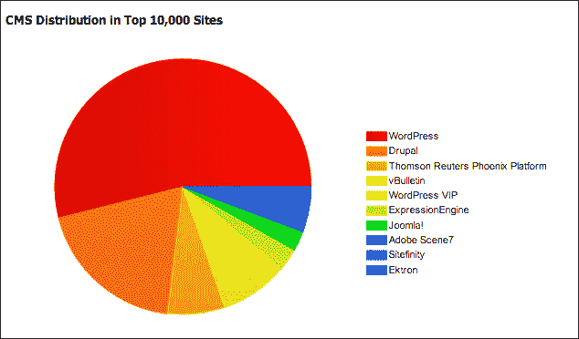

# WordPress 和 jQuery Mobile

WordPress 之所以受欢迎，是因为它简单易用。你可以通过在[WordPress.com](http://WordPress.com)上创建托管站点开始使用 WordPress，或者你可以通过访问[WordPress.org](http://WordPress.org)下载源代码，并在任何你喜欢的机器上安装。在你进行实验时，我强烈建议采用后一种方法。本章使用的版本是 3.5。

要快速上手任何 CMS 的关键是，认识到要使用哪些插件和主题。对于 WordPress，我不建议使用 jQuery Mobile 插件。当我为本章做实验时，它破坏了管理界面，并且总体上是一次痛苦的经历。然而，有几个 jQuery Mobile 主题可以很好地为你服务。有些是免费的，有些是付费的。无论哪种方式，尽量不要重复造轮子。选择一个最接近你想要的主题，然后进行微调。到目前为止，很可能你已经足够好，可以修改现有的主题文件。以下是我找到并喜欢的一些主题链接。选择一个，解压缩它，并将其放入你的 WordPress 安装目录下的 `wp-content/themes/` 中：

+   [`www.mobilizetoday.com/freebies/jqmobile`](http://www.mobilizetoday.com/freebies/jqmobile)

+   [`themeforest.net/item/mobilize-jquery-mobile-wordpress-theme/3303257`](http://themeforest.net/item/mobilize-jquery-mobile-wordpress-theme/3303257)

+   [`goldenapplesdesign.com/projects/jquery-mobile-boilerplate-for-wordpress-themes/`](http://goldenapplesdesign.com/projects/jquery-mobile-boilerplate-for-wordpress-themes/)(我的个人最爱)

    ### 注意

    **Mac 提示**

    打开控制台，导航到包含已解压目录的文件夹，并运行以下命令。如果不这样做，你的东西可能不会显示或按预期工作。

    ```js
    xattr -dr com.apple.quarantine *
    ```

    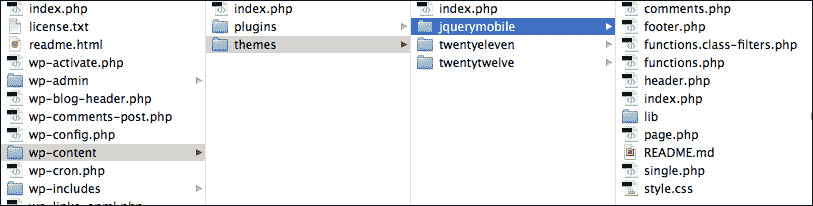

如果你成功安装了主题，你应该能在管理界面的 **外观** | **主题** 下看到它，如下一张图左侧所示。它应该在 **可用主题** 下列出：

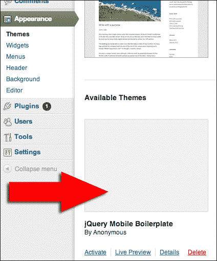

接下来，我们需要一种方式来在移动设备上访问主题。这就是移动主题切换器发挥作用的地方。我们将在这里使用的切换器简单而有效，适用于大多数可能访问你的站点的人。

## 手动安装移动主题切换器

要手动安装移动主题，请从 [`wordpress.org/extend/plugins/mobile-theme-switcher/`](http://wordpress.org/extend/plugins/mobile-theme-switcher/) 下载它。解压文件夹并将其放入你的 WordPress 安装目录下的 `wp-content/plugins/` 中：

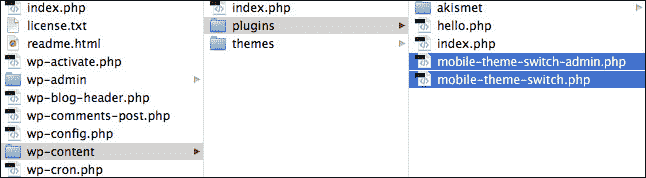

接下来，通过管理界面，激活名为 **Mobile theme switch** 的插件：

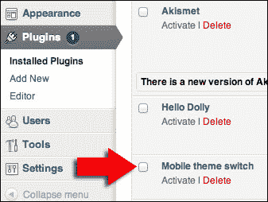

## 自动安装移动主题切换器

如果你喜欢的话，你可以让 WordPress 为你完成大部分工作。就我个人而言，我喜欢掌控一切。以下是通过管理界面安装的方法：

1.  转到 **插件** 页面，然后在标题旁边找到 **添加新** 按钮，如下一张截图所示：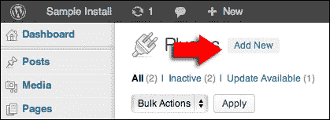

1.  在下一个屏幕上，搜索**移动主题切换器**：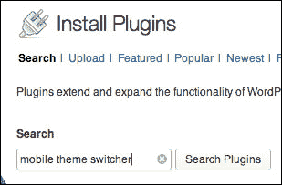

1.  有很多选择可供选择，我们使用的是第一个：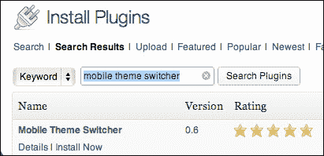

1.  在下一页上输入你的 FTP 凭据。

1.  激活你新安装的插件。

## 配置移动主题切换器

如果你已经成功安装并激活了插件，它现在将显示在**外观**菜单下，如下面的屏幕截图所示。然后，选择你安装的移动主题，点击**更新选项**按钮：

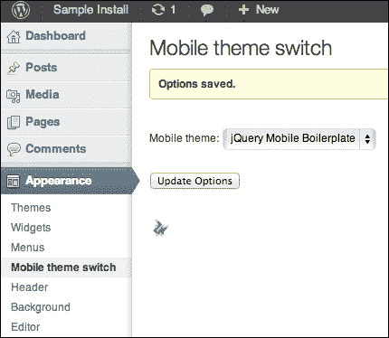

插件和主题的组合是强大、简单且有效的。以下是新主题运行的屏幕截图：

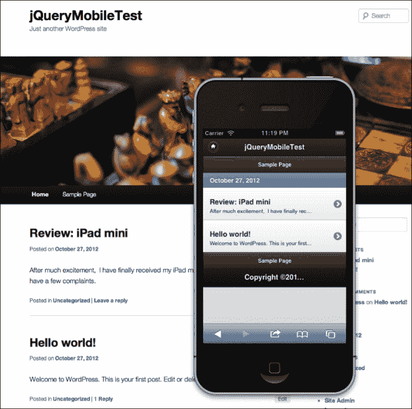

相当简单，对吧？现在，我们只需要调整它直到客户满意。让我们继续下一个 CMS 系统。

### Drupal 和 jQuery Mobile

Drupal 是一个功能更强大的 CMS。使用其中一些标准插件，你可以轻松创建完整的网络应用程序，而不仅仅是宣传册网站。想要在发布评论前让人们证明他们是人类吗？有一个插件可以做到。想要创建联系表单吗？它是内置的。想要创建一个自定义数据库表和表单来保存输入吗？从 Drupal 7 开始，这也是内置的。

Drupal 最大的缺点是，如果你想要发挥它真正的威力，它有点学习曲线。此外，在没有进行一些调整的情况下，它可能会有点慢，并且可能会让你的页面代码变得臃肿。像缓存这样的技术可以提高性能，但也可能会对动态创建的页面产生负面影响。

为 jQuery Mobile 配置 Drupal 的过程与 WordPress 的几乎相同。同样，我们将从已经存在的主题开始。制作这些主题的人知道他们正在编码的系统。不要试图重新发明轮子。我们所要做的就是使用这个主题并进行微调。我最喜欢的 Drupal jQM 主题可以在[`drupal.org/project/mobile_jquery`](http://drupal.org/project/mobile_jquery)找到。在该页面的底部，你将找到主题的可下载分发：

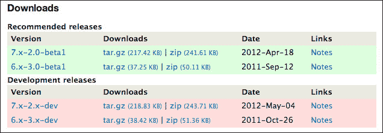

1.  复制适合你的分发的链接。

1.  登录到你的 Drupal 网站的管理控制台，并转到**外观**部分：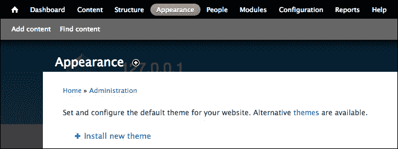

1.  点击**安装新主题**链接，并将你复制的链接粘贴到**从 URL 安装**字段中。点击**安装**按钮，让安装完成所有步骤。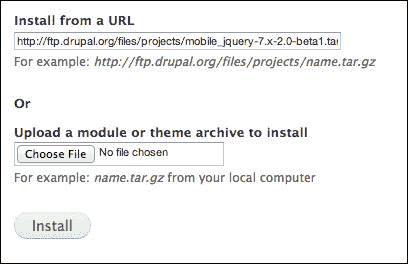

1.  在这一点上，您可能无法看到已安装的主题。制作者鼓励您创建子主题，而不是使用他们的基础安装主题。这是我们将要忽略的一个建议。所以，为了使主题显示出来，您需要编辑位于 Drupal 安装目录中`sites/all/themes/jquery_mobile/`中的文件`mobile_jquery.info`，并将`hidden`的值从`1`更改为`0`。一旦你这样做了，你应该会在**外观**菜单的禁用主题部分看到主题列表，如下一个屏幕截图所示。单击**启用**链接，您的主题将准备好配置和使用。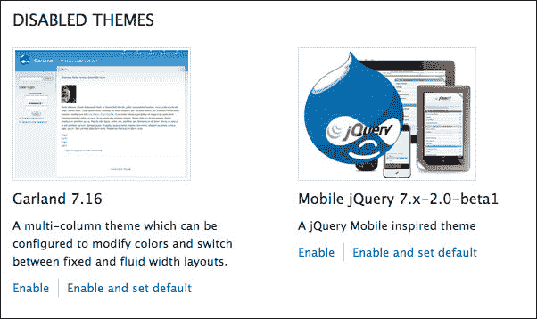

1.  接下来，我们需要安装主题切换插件。让我们使用位于[`drupal.org/project/mobile_theme`](http://drupal.org/project/mobile_theme)的插件。同样，选择正确的版本并复制其网址。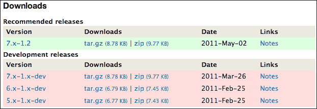

1.  打开管理员界面到**模块**部分，然后单击**安装新模块**链接：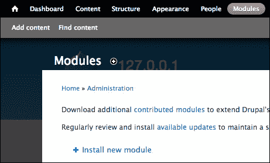

1.  将网址粘贴到标记为**从 URL 安装**的字段中，然后单击**安装**按钮。让安装过程自动进行。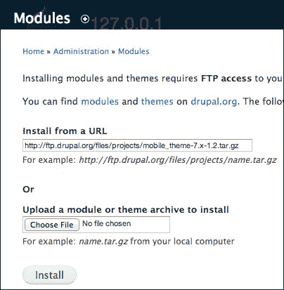

1.  在**模块**部分的底部，您将找到新安装的插件：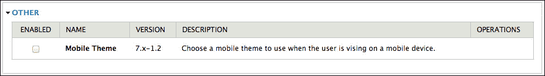

1.  单击复选框以启用模块，然后您将能够配置它：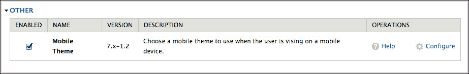

1.  点击**配置**链接将带您到一个用于配置**全局设置**的屏幕。在该屏幕的右侧，您会找到一个用于配置移动主题选项的部分。**移动主题**部分在下面的屏幕截图中已经用红色箭头标记出来了：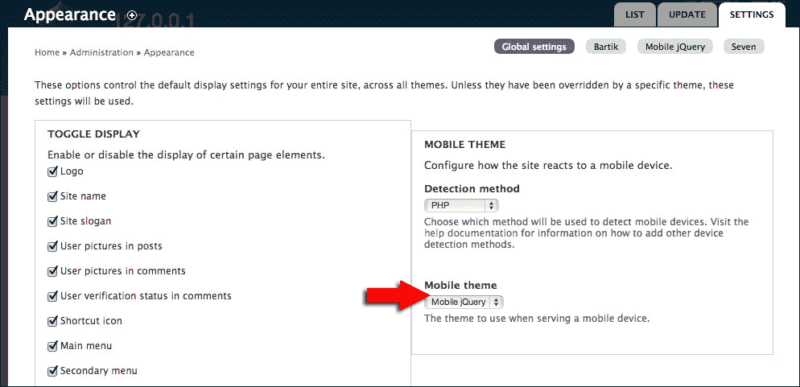

结果不言而喻。该主题肯定需要定制，但对于初学者来说，它完全可以使用。我们知道如何做其余的事情了。

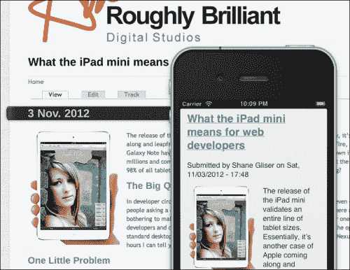

# 更新您的 WordPress 和 Drupal 模板

在某些时候（可能是安装后的右后），您会想要更新这些主题以使用最新版本的 jQuery Mobile 库。一些仍在使用 beta 版本。实际上，这个过程非常简单。你只需找到相关模板的头部部分，并更新对 jQuery Mobile CSS、JS 和可能的核心 jQuery 库的引用。

## WordPress – Golden Apples jQM 主题

对于 Golden Apples 的 WordPress 主题（参见 [`github.com/goldenapples/jqm-boilerplate`](https://github.com/goldenapples/jqm-boilerplate)），您需要更改多个文件。在`header.php`文件中，找到并更新以下行：

```js
<link rel="stylesheet" href="http://code.jquery.com/mobile/1.0b1/jquery.mobile-1.0b1.min.css" />
```

在`functions.php`文件中，你需要找到并更新以下行：

```js
wp_enqueue_script( 'jquery',"http://code.jquery.com/jquery-1.6.4.min.js" );

wp_enqueue_script( 'jquery-mobile',"http://code.jquery.com/mobile/1.0.1/jquery.mobile-1.0.1.min.js",array( 'jquery' ) );

wp_enqueue_script( 'mobile-scripts',get_stylesheet_directory_uri().'/lib/mobile-scripts.js', array( 'jquery', 'jquery-mobile' ) );

wp_localize_script( 'mobile-scripts', 'siteData', array( 'siteUrl', home_url() ) );

wp_enqueue_style( 'jquery-mobile', "http://code.jquery.com/mobile/1.0.1/jquery.mobile-1.0.1.min.css" );
```

## Drupal – jQuery Mobile 主题

对于[Drupal jQuery Mobile 主题](http://drupal.org/project/mobile_jquery)，你最快更新主题的方法是编辑`theme`文件夹根目录下的`template.php`文件。在文件中找到以下行并更新对 jQuery Mobile 的引用：

```js
drupal_add_css('http://code.jquery.com/mobile/1.0.1/jquery.mobile.structure-1.0.1.min.css', array_merge($css_options,array('weight' => 100)));
drupal_add_css('http://code.jquery.com/mobile/1.0.1/jquery.mobile-1.0.1.min.css', array_merge($css_options, array('weight' => 100)));

drupal_add_js('http://code.jquery.com/jquery-1.6.4.min.js', array_merge($js_options, array('weight' => 100)));

drupal_add_js(drupal_get_path('theme', 'mobile_jquery') . '/scripts/mobile_jquery.js', array_merge($js_options, array('weight' => 101)));

drupal_add_js('http://code.jquery.com/mobile/1.0.1/jquery.mobile-1.0.1.min.js', array_merge($js_options, array('weight' => 101)));
```

# Adobe Experience Manager

Adobe 一直是网络领域的领导者。他们的首席企业 CMS 名为 Adobe Experience Manager (AEM)（参见[`www.adobe.com/solutions/web-experience-management.html`](http://www.adobe.com/solutions/web-experience-management.html)）。我不会介绍如何安装、配置或为 AEM 编写代码。这是几本本书那么大的培训手册的主题。相信我。我只是提到这一点，以便你知道至少有一个主要的 CMS 玩家提供了完整的 jQuery Mobile 示例。

培训材料以名为 Geometrixx 的虚构站点为中心。


AEM 系统的美妙之处在于它使用 Java JCR 容器（参见[`en.wikipedia.org/wiki/Content_repository_API_for_Java`](http://en.wikipedia.org/wiki/Content_repository_API_for_Java)）来存储内容。这意味着你可以创建自动从桌面页面中提取内容的移动站点，只需引用桌面页面的 JCR 内容节点或允许用户直接在看起来像移动屏幕的界面中输入。

Geometrixx 的移动示例使用了 jQuery Mobile 编写；尽管 jQM 的版本有些过时，但更改模板很容易。移动内容作者界面带有模拟手机界面，以便对内容进行框架化，使其看起来大致像在真实手机或平板电脑上。你可以在作者界面中直接切换设备配置文件。虽然这并不是对这些设备的真正模拟，因为一切都发生在你正在使用的浏览器中，但它仍然非常非常方便。

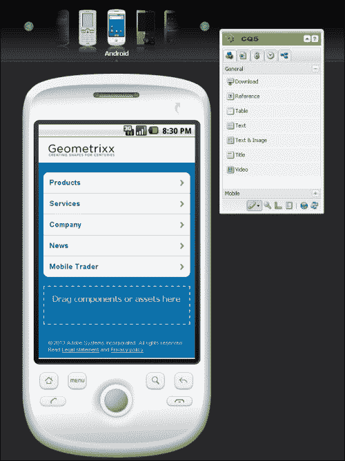

如果你为一家能负担得起 AEM 的公司工作，你已经非常熟悉移动实现。这个平台给内容作者带来的力量是惊人的。

# 概要

自从两年前我开始涉足移动开发以来，移动主题的世界已经爆炸式增长。今天，有很多 jQuery Mobile 的选择；还有一些其他响应式主题。我没费力去列出 Google 能给我们的所有东西。当这本书出版时，即使在一个月的时间里，这些也会发生变化。要记住的重要一点是，我们不必重新发明轮子，也不必让自己背负内容更新。让你的客户有能力自行进行小型更新，而你回到你的事务中去。CMS 虽然有用，但我们不会再次涉及它。下一章将回到定制开发，我们将结合到目前为止学到的一切。
