# 第十章：将一切汇聚在一起 - Flood.FM

Flood.FM 是一个独特的想法。这是一个网站，听众将受到来自几个流派和地理区域的本地独立乐队的音乐的欢迎。构建这个网站将需要我们迄今为止开发的许多技能，并且我们将在这项新服务中使用一些新的技术。我们已经在便签上绘制了界面，并使用了 GPS 和客户端模板。我们已经处理了常规的 HTML5 音频和视频。我们甚至已经开始处理多个移动尺寸，并使用媒体查询将我们的布局重新设计为响应式设计。

所有这些都是为了完成任务并尽可能优雅地失败而简化的实现。让我们看看我们可以在这个项目上使用什么技术和技巧。

在本章中，我们将涵盖：

+   一份 Balsamiq 的味道

+   组织你的代码

+   Web Audio API 简介

+   引导用户安装你的应用程序

+   新的设备级硬件访问

+   要做应用还是不要做应用，这是个问题

+   PhoneGap 与 Apache Cordova

# 一份 Balsamiq 的味道

我们通过学习一种称为纸质原型的技术来开始这本书。对于与客户一起工作，这是一个很好的工具。然而，如果你正在处理更大或分布式的团队，你可能需要更多。Balsamiq ([`www.balsamiq.com/`](http://www.balsamiq.com/)) 是一个非常流行的用于快速原型设计的 UX 工具。它非常适合创建和共享交互式的模型。

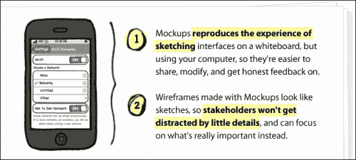

当我说非常流行时，我是指你习惯看到的许多大公司。超过 80,000 家公司都在使用 Balsamiq Mockups 来创建他们的软件。


所以，让我们看看 Flood.FM 的创建者们打算做什么。这是他们绘制的第一个屏幕；到目前为止，它看起来像是一个非常标准的实现。它在底部有一个图标工具栏，在内容中有一个列表视图。实际上，将其翻译成中文非常简单。我们以前使用 Glyphish 图标和标准工具栏做过这样的事情。

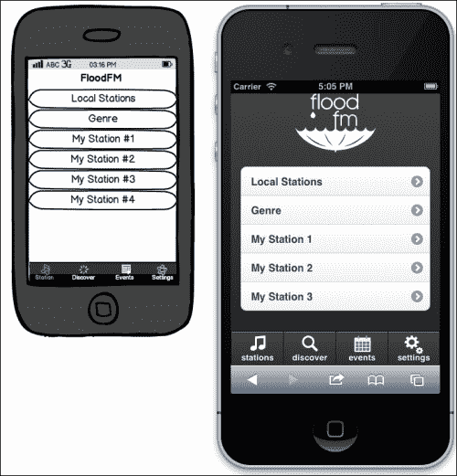

理想情况下，我们希望保持这个特定实现纯粹的 HTML/JS/CSS。这样，我们可以在某个时候使用 PhoneGap 将其编译为本机应用程序。但是，我们希望忠于 DRY（不要重复自己）原则。这意味着我们想要在每个页面上注入这个页脚，而不使用服务器端过程。为此，让我们设置一个应用程序的隐藏部分，其中包含我们可能想要的所有全局元素：

```js
<div id="globalComponents">
  <div data-role="navbar" class="bottomNavBar">
    <ul>
      <li><a class="glyphishIcon" data-icon="notes" href="#stations_by_region" data-transition="slideup">stations</a></li>
      <li><a class="glyphishIcon" data-icon="magnify" href="#search_by_artist" data-transition="slideup">discover</a></li>
      <li><a class="glyphishIcon" data-icon="calendar" href="#events_by_location" data-transition="slideup">events</a></li>
      <li><a class="glyphishIcon" data-icon="gears" href="#settings" data-transition="slideup">settings</a></li>
    </ul>
  </div>
</div>
```

我们将把这段代码放在页面底部，并在样式表中使用一个简单的 CSS 规则来隐藏它，`#globalComponents{display:none;}`。

现在让我们来设置我们的应用程序，在创建每个页面之前将全局页脚插入其中。使用`clone()`方法（下一行的代码段中显示）可以确保我们不仅复制了页脚，还带上了附加的任何数据。这样，每个页面都带有完全相同的页脚，就像它在服务器端一样。当页面经过正常的初始化过程时，页脚将接收与页面其余部分相同的标记处理。

```js
/************************
*  The App
************************/
var floodApp = {
  universalPageBeforeCreate:function(){
    var $page = $(this);
    if($page.find(".bottomNavBar").length == 0){
      $page.append($("#globalComponents .bottomNavBar").clone());
    }

  }
}

/************************
*  The Events
************************/
//Interface Events
$(document).on("pagebeforecreate", "[data-role="page"]",floodApp.universalPageBeforeCreate);
```

看看我们在这段 JavaScript 代码中所做的。这跟我们之前做的有点不同。我们实际上更有效地组织了我们的代码。

# 组织你的代码

在之前的章节中，我们的代码结构非常松散。事实上，我确信学术界的人一定会嘲笑我们敢称之为结构化的胆量。我相信编码非常务实的方法，这导致我使用更简单的结构和最少的库。不过，其中也有一些价值和经验可以借鉴。

## MVC、MVVM、MV*

过去几年里，一些认真对待 JavaScript 开发的人都将后端开发结构引入到网页开发中，因为项目的规模和范围需要更加有条理的方法。对于雄心勃勃、持续时间长、纯网页端的应用来说，这种结构化方法可以提供帮助。特别是如果你在一个较大的团队中。

**MVC**代表"Model-View-Controller"（参见[`en.wikipedia.org/wiki/Model%E2%80%93view%E2%80%93controller`](http://en.wikipedia.org/wiki/Model%E2%80%93view%E2%80%93controller)），**MVVM**代表"Model View ViewModel"（参见[`en.wikipedia.org/wiki/Model_View_ViewModel`](http://en.wikipedia.org/wiki/Model_View_ViewModel)），而**MV***是缩写，代表"Model View Whatever"，是总称，用来概括将这些结构带到前端的整个运动。

一些更流行的库包括：

+   Backbone.JS（[`backbonejs.org/`](http://backbonejs.org/)）

+   脊骨（[`spinejs.com/`](http://spinejs.com/)）

+   腰椎（[`walmartlabs.github.com/lumbar/`](http://walmartlabs.github.com/lumbar/)）

+   琥珀（[`emberjs.com/`](http://emberjs.com/)）

+   Knockout（[`knockoutjs.com/`](http://knockoutjs.com/)）

+   AngularJS（[`angularjs.org/`](http://angularjs.org/)）

+   Batman.js（[`batmanjs.org/`](http://batmanjs.org/)）

更全面的比较可以在[`codebrief.com/2012/01/the-top-10-javascript-mvc-frameworks-reviewed/`](http://codebrief.com/2012/01/the-top-10-javascript-mvc-frameworks-reviewed/)上找到，还有其他的。

如何使 Backbone 与 jQuery Mobile 良好协作的适配器和示例可以在[`view.jquerymobile.com/1.3.0/docs/examples/backbone-require/index.php`](http://view.jquerymobile.com/1.3.0/docs/examples/backbone-require/index.php)找到。

琥珀的示例可以在[`github.com/LuisSala/emberjs-jqm`](https://github.com/LuisSala/
emberjs-jqm)找到。

Angular 还在进行 jQM 的适配器。[`github.com/tigbro/jquery-mobile-angular-adapter`](https://github.com/tigbro/jquery-mobile-angular-adapter) 上有几个示例。

## MV* 和 jQuery Mobile

是的，你可以做到。你可以将任何一个 MV* 框架添加到 jQuery Mobile 中，并制作出你喜欢的复杂应用程序。在其中，我倾向于在桌面上使用 Ember 平台，在 jQuery Mobile 中使用 Angular。但是，我想提出另一种选择。

我不打算深入探讨 MVC 框架背后的概念。基本上，这一切都是关于将应用程序的关注点分离成更可管理的部分，每个部分都有特定的目的。我们不需要再添加另一个库/框架来做到这一点。以更有组织的方式编写代码就足够了。让我们创建一个类似我之前开始的结构：

```js
//JavaScript Document

/*******************
 * The Application
 *******************/

/*******************
 * The Events
 *******************/

/*******************
 * The Model
 *******************/
```

## 应用程序

在应用程序部分下，让我们填写一些我们的应用程序代码，并给它一个*命名空间*。本质上，命名空间是将你的应用程序特定代码放入自己命名的对象中，这样函数和变量就不会与其他潜在的全局变量和函数冲突。它可以防止你污染全局空间，并帮助保护你的代码免受那些对你的工作无知的人的破坏。当然，这是 JavaScript，人们可以重写任何他们想要的东西。但是，这也使得像`floodApp.getStarted`这样的重写比简单地创建自己的名为`getStarted`的函数要更有意义。没有人会意外地重写一个命名空间函数。

```js
/*******************
 * The application
 *******************/
var floodApp = {
  settings:{
    initialized:false,
    geolocation:{
      latitude:null,
      longitude:null,
    },
    regionalChoice:null,
    lastStation:null
  },
  getStarted:function(){
    location.replace("#initialize");
  },
  fireCustomEvent:function(){
    var $clicked = $(this);
    var eventValue = $clicked.attr("data-appEventValue");
    var event = new jQuery.Event($(this).attr("data-appEvent"));
    if(eventValue){ event.val = eventValue; }
    $(window).trigger(event);
  },
  otherMethodsBlahBlahBlah:function(){}
}
```

特别要注意`fireCustomEvent`函数。有了它，我们现在可以设置一个事件管理系统。其核心思想非常简单。我们希望能够简单地在可点击的对象上放置标签属性，并使其触发事件，就像所有的 MV* 系统一样。这完全符合要求。在链接或其他东西上设置一个点击事件处理程序是相当常见的。这更简单。只需在这里或那里添加一个属性，就可以连接上。HTML 代码也变得更加可读。很容易看出这使你的代码声明性的：

```js
<a href="javascript://" data-appEvent="playStation" data-appEventValue="country">Country</a>
```

## 事件

现在，我们不再监听点击，而是监听事件。你可以有尽可能多的应用程序部分注册自己来监听事件，然后适当地执行。

随着我们的应用程序越来越完善，我们会开始收集大量事件；而不是让它们散布在多个嵌套的回调函数中，我们会将它们全部放在一个方便的地方。在大多数 JavaScript MV* 框架中，代码的这部分被称为路由器。连接到每个事件的只会是命名空间应用程序调用：

```js
/*******************
 * The events
 *******************/

//Interface events
$(document).on("click", "[data-appEvent]",
  floodApp.fireCustomEvent);$(document).on("pagebeforeshow",
  "[data-role="page"]",floodApp.universalPageBeforeShow);
$(document).on("pagebeforecreate",
  "[data-role="page"]",floodApp.universalPageBeforeCreate);
$(document).on("pageshow", "#initialize",
  floodApp.getLocation);
$(document).on("pagebeforeshow", "#welcome",
  floodApp.initialize);

//Application events
$(window).on("getStarted",
  floodApp.getStarted);
$(window).on("setHomeLocation",
  floodApp.setHomeLocation);
$(window).on("setNotHomeLocation",
  floodApp.setNotHomeLocation);
$(window).on("playStation",
  floodApp.playStation);
```

注意将关注点分为界面事件和应用程序事件。我们将其用作对 jQuery Mobile 事件（界面事件）和我们抛出的事件（应用程序事件）之间的区别点。这可能是一个任意的区别，但对于后来维护你的代码的人来说，这可能会派上用场。

## 模型

模型部分包含了你的应用程序的数据。这通常是从后端 API 中拉取的数据类型。这里可能不是很重要，但给自己的东西加上命名空间从来都不会有坏处。在这里，我们将我们的数据标记为 `modelData`。我们从 API 中拉取的任何信息都可以直接放入这个对象中，就像我们在这里使用站点数据一样：

```js
/*******************
 * The Model
 *******************/
var modelData = {
  station:{
    genres:[
       {
        display:"Seattle Grunge",
        genreId:12,
        genreParentId:1
       }
    ],
    metroIds[14,33,22,31],
    audioIds[55,43,26,23,11]
  }
}
```

将这种编程风格与客户端模板配对，你将看到一些高度可维护、结构良好的代码。然而，仍然有一些功能是缺失的。通常，这些框架还会为你的模板提供绑定。这意味着你只需要渲染模板一次。之后，只需更新你的模型对象，就足以导致 UI 自动更新。

这些绑定模板的问题在于它们以一种对桌面应用程序非常完美的方式更新 HTML。但请记住，jQuery Mobile 通过大量的 DOM 操作来实现这些功能。

在 jQuery Mobile 中，一个列表视图是这样开始的：

```js
<ul data-role="listview" data-inset="true">
  <li><a href="#stations">Local Stations</a></li>
</ul>
```

在正常的 DOM 操作之后，你会得到这样的结果：

```js
<ul data-role="listview" data-inset="true" data-theme="c" style="margin-top:0" class="ui-listview ui-listview-inset ui-corner-all ui-shadow">
<li data-corners="false" data-shadow="false" data-iconshadow="true" 
data-wrapperels="div" data-icon="arrow-r" data-iconpos="right" data-theme="c" class="ui-btn ui-btn-icon-right ui-li-has-arrow ui-li ui-corner-top ui-btn-up-c">
<div class="ui-btn-inner ui-li ui-corner-top">
<div class="ui-btn-text">
<a href="#stations" class="ui-link-inherit">Local Stations
</a>
</div>
<span class="ui-icon ui-icon-arrow-r ui-icon-shadow">&nbsp;</span>
</div>
</li>
</ul>
```

这仅仅是一个列表项。你真的不想在你的模板中包含所有这些垃圾；所以你需要做的就是，只需将你通常的项目添加到列表视图中，然后调用 `.listview("refresh")`。即使你使用的是 MV* 系统之一，当添加或删除某些内容时，你仍然必须找到或编写一个适配器来刷新列表视图。希望这些问题很快就会在平台级别得到解决。在那之前，使用真正的 MV* 系统与 jQM 会很痛苦。

# 介绍 Web Audio API

当我们在第六章中谈到 HTML 音频时，*HTML5 音频*，我们是从渐进增强和最大设备支持的角度来看待它的。我们拿原生音频控件的常规页面，并使用 JavaScript 构建一个新的界面来控制音频。然后我们看了一些组合它们的方法，并追求更好的体验。现在我们将再进一步。

Web Audio API 是一个相当新的开发，截至本文写作时，它只存在于 iOS 6 的移动空间中。Web Audio API 在最新版本的桌面 Chrome 上可用，因此你仍然可以在那里进行初始测试编码。

目前，这意味着没有 Android、没有 Windows Phone，也没有 Blackberry。至少，还没有。然而，只是时间问题，这将被构建到其他主要平台中。

项目的大部分代码以及 API 的完整说明都可以在[`developer.apple.com/library/safari/#documentation/AudioVideo/Conceptual/Using_HTML5_Audio_Video/PlayingandSynthesizingSounds/PlayingandSynthesizingSounds.html`](http://developer.apple.com/library/safari/#documentation/AudioVideo/Conceptual/Using_HTML5_Audio_Video/PlayingandSynthesizingSounds/PlayingandSynthesizingSounds.html)找到。

让我们使用特性检测来分支我们的功能：

```js
function init() {
if("webkitAudioContext" in window) {
    myAudioContext = new webkitAudioContext();
    // ananalyser is used for the spectrum
    myAudioAnalyser = myAudioContext.createAnalyser();
    myAudioAnalyser.smoothingTimeConstant = 0.85;
    myAudioAnalyser.connect(myAudioContext.destination);

    fetchNextSong();
  } else {
    //do the old stuff
  }
}
```

这个页面的原始代码旨在同时下载队列中的每首歌曲。对于高速连接，这可能还可以。但在移动设备上则不太适用。由于连接性和带宽有限，最好只是链接下载以确保更好的体验和更加尊重带宽的使用：

```js
function fetchNextSong() {
var request = new XMLHttpRequest();
  var nextSong = songs.pop();
  if(nextSong){
    request = new XMLHttpRequest();
    // the underscore prefix is a common naming convention
    // to remind us that the variable is developer-supplied
    request._soundName = nextSong;
    request.open("GET", PATH + request._soundName + ".mp3", true);
    request.responseType = "arraybuffer";
    request.addEventListener("load", bufferSound, false);
    request.send();
  }
}
```

现在`bufferSound`函数只需在缓冲后调用`fetchNextSong`，如下面的代码片段所示：

```js
function bufferSound(event) {
  var request = event.target;
  var buffer = myAudioContext.createBuffer(
  request.response, false);
  myBuffers.push(buffer);
  fetchNextSong();
}
```

我们需要从原始版本中更改的最后一件事是，告诉缓冲器按插入顺序拉取歌曲：

```js
function playSound() {
  // create a new AudioBufferSourceNode
  var source = myAudioContext.createBufferSource();
  source.buffer = myBuffers.shift();
  source.loop = false;
  source = routeSound(source);
  // play right now (0 seconds from now)
  // can also pass myAudioContext.currentTime
  source.noteOn(0);
  mySpectrum = setInterval(drawSpectrum, 30);
  mySource = source;
}
```

对于 iOS 上的任何人来说，这个解决方案相当不错。对于那些想要深入了解的人来说，这个 API 还有更多内容。通过这个开箱即用的示例，你可以得到一个很好的基于画布的音频分析器，它使音频水平跟随音乐弹跳的外观非常专业。滑块控件用于更改音量、左右平衡和高通滤波器。如果你不知道什么是高通滤波器，不要担心，我认为那个滤波器的实用性已经过时了。不管怎样，玩起来很有趣。

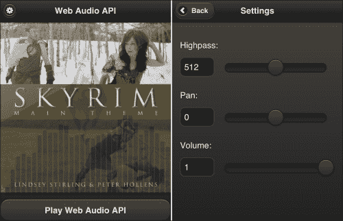

Web Audio API 是一项非常严肃的业务。这个例子是从苹果网站上的例子改编的。它只播放一个声音。然而，Web Audio API 的设计理念是使其能够播放多个声音，以多种方式改变它们，甚至使用 JavaScript 动态生成声音。深入研究可能值得一本书。它还需要比我可能会拥有的更深入的音频处理知识。同时，如果您想在 jQuery Mobile 中查看这个概念验证，您可以在`webaudioapi.html`的示例源代码中找到它。要更深入地了解即将到来的内容，您可以查看[`dvcs.w3.org/hg/audio/raw-file/tip/webaudio/specification.html`](https://dvcs.w3.org/hg/audio/raw-file/tip/webaudio/specification.html)的文档。

# 提示用户安装您的应用

记得在第六章中，*HTML5 音频*，我们添加了苹果触摸图标，使林赛·斯特林网站在添加到主屏幕书签时看起来像一个应用程序？ 我们甚至进一步使用清单文件来本地缓存资产，以实现更快的访问和离线使用。

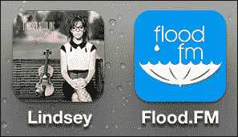

现在让我们看一下如何提示我们的用户将 Flood.FM app 下载到他们的主屏幕。很可能你以前见过它；它是那个小气泡，弹出来指导用户安装应用程序的步骤。

有许多不同的项目，但我见过的最好的一个是 Google 创始的一个分支。非常感谢和尊重 GitHub 上的 Mr. Okamototk（[`github.com/okamototk`](https://github.com/okamototk)）对它的采取和改进。Okamototk 将气泡发展成包括几个 Android 版本、传统 iOS 版本，甚至还支持 BlackBerry。你可以在[`github.com/okamototk/jqm-mobile-bookmark-bubble`](https://github.com/okamototk/jqm-mobile-bookmark-bubble)找到他的原作品。但是，除非你能读日文或乐于翻译，我建议你只是从本章的示例中获取代码。

不用太担心过于打扰你的客户。使用这个版本，如果他们三次关闭了书签气泡，他们就不会再看到它。 这个计数存储在 HTML5 本地存储中；所以如果他们清除了存储，他们会再次看到气泡。幸运的是，大多数人根本不知道这是可以做到的，所以这种情况不会发生很频繁。通常只有像我们这样的极客会清理类似 LocalStorage 和 cookies 的东西，而当我们这样做时，我们知道我们在做什么。

在我的代码版本中，我已将所有 JavaScript 合并为一个单个文件，放置在你的 jQuery 和 jQuery Mobile 导入之间。顶部的第一行非注释行是：

```js
page_popup_bubble="#welcome";
```

这是你将要改变成自己的第一页或你想要气泡弹出的地方。

在我的版本中，我已经将字体颜色和文本阴影属性硬编码到了气泡中。这是因为在 jQM 中，字体颜色和文本阴影颜色根据你使用的主题而变化。因此，在 jQuery Mobile 的默认“ A”主题（黑色背景上的白色文本），字体会显示为白色，阴影为黑色，出现在白色气泡上。现在，在我修改过的 jQM 版本中，它看起来总是对的。

我们只需要确保我们在头部设置了正确的链接，以及我们的图片放在了正确的位置：

```js
<link rel="apple-touch-icon-precomposed" sizes="144x144" href="images/album144.png">
<link rel="apple-touch-icon-precomposed" sizes="114x114" href="images/album114.png">
<link rel="apple-touch-icon-precomposed" sizes="72x72" href="images/album72.png">
<link rel="apple-touch-icon-precomposed" href="images/album57.png">
<link rel="shortcut icon" href="img/images/album144.png">
```

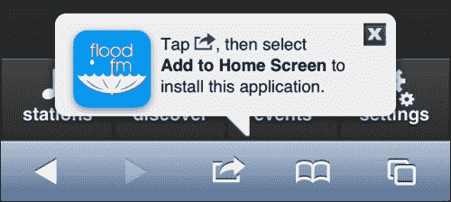

注意这里的 Flood.FM 标志。标志是从我们标记有 `rel="apple-touch-icon-precomposed"` 的链接标签中提取并注入到气泡中的。所以，实际上，你需要改变的 `jqm_bookmark_bubble.js` 中的唯一东西是 `page_popup_bubble`。

# 新的设备级硬件访问

每年我们的移动浏览器都会有新的硬件级访问方式。下面是一些你现在可以开始做的事情以及未来的展望。并不是所有这些都适用于每个项目，但如果你有创意，你可能会找到创新的方式来使用它们。

## 加速计

加速计是你手机里的小装置，用来测量手机在空间中的方向。想要深入了解，请阅读 [`en.wikipedia.org/wiki/Accelerometer`](http://en.wikipedia.org/wiki/Accelerometer)。

这超出了我们之前简单的定位。这是对加速计的真正访问，而且是详细的。想象一下用户能够摇动他们的设备或者倾斜它作为与你的应用交互的一种方法。也许 Flood.FM 正在播放一些他们不喜欢的东西，我们可以给他们一个有趣的方式来对抗这首歌。比如，“摇一首歌以永远不再听到它”。这里是某人制作的一个简单的弹珠滚动游戏，作为概念验证。参见 [`menscher.com/teaching/woaa/examples/html5_accelerometer.html`](http://menscher.com/teaching/woaa/examples/html5_accelerometer.html)。

## 相机

苹果的 iOS 6 和安卓的 JellyBean 都可以访问它们的文件系统中的照片以及相机。当然，这些是这两个平台的最新版本。如果你打算支持许多仍然在货架上销售的过时的 Android 设备（2.3 2.4），好像它们是全新的一样，那么你需要选择本地编译，比如 PhoneGap 或 Apache Cordova 来获取这个功能。

```js
<input type="file" accept="image/*">
<input type="file" accept="video/*">
```

以下截图显示 iOS 在左边，Android 在右边：

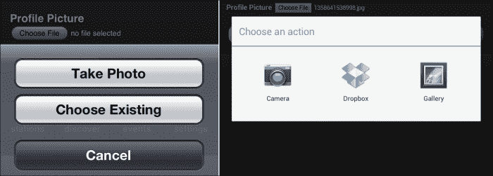

## 即将推出的 API

Mozilla 正在大力推动移动网络 API 的发展。以下是即将到来并且可能在不到两年内就可以使用的内容：

+   电池电量

+   充电状态

+   环境光传感器

+   接近传感器

+   振动

+   联系人

+   网络信息

+   移动连接（运营商、信号强度等）

+   Web 短信

+   Web 蓝牙

+   Web FM

+   存档 API（打开和读取来自压缩文件的内容）

如果你想阅读更多，请查看 [`wiki.mozilla.org/WebAPI`](https://wiki.mozilla.org/WebAPI)。

# 选择开发应用还是不开发应用，这是个问题

是否应该将你的项目编译成原生应用？以下是一些需要考虑的事项。

## 下雨了（认真对待这个问题）

当你把你的第一个项目编译成一个应用时，你会感到一种特殊的激动。你做到了！你做了一个真正的应用程序！在这一点上，我们需要记住《侏罗纪公园》电影中伊恩·马尔科博士的话（去重新看一遍吧。我等你）：

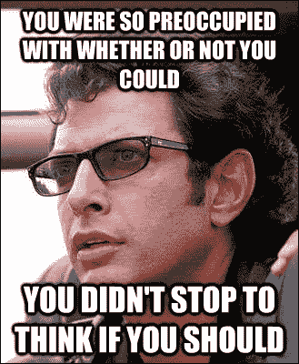

> “你站在巨人的肩膀上，尽可能地做了一些事情，甚至在你知道你拥有什么之前，你就已经对它进行了专利申请，打包了它，把它塞进了一个塑料午餐盒里，现在 [敲打桌子] 你在卖它，你想卖它。好吧……你的科学家们是如此专注于他们是否能够做到，以至于他们没有停下来思考他们是否应该。”

这些话对我们来说很接近预言性质。最后，他们自己的创造吞食了大部分客人。

根据 2012 年 8 月的这份报告[`www.webpronews.com/over-two-thirds-of-the-app-store-has-never-been-downloaded-2012-08`](http://www.webpronews.com/over-two-thirds-of-the-app-store-has-never-been-downloaded-2012-08)（以及我以前看过的几篇类似的报告），*超过三分之二的应用商店中的所有应用从未被下载过*。甚至没有一次！所以，现实情况是，大多数项目在应用商店中被抛弃。

即使你的应用被发现，任何人会长时间使用它的可能性令人惊讶地小。根据《福布斯》（[`tech.fortune.cnn.com/2009/02/20/the-half-life-of-an-iphone-app/`](http://tech.fortune.cnn.com/2009/02/20/the-half-life-of-an-iphone-app/)）中的一篇文章，大多数应用在几分钟内被放弃，再也不会被打开。付费应用的持续时间大约是之前的两倍，然后要么被遗忘，要么被删除。游戏有一些持久力，但坦率地说，jQuery Mobile 并不是一个引人入胜的游戏平台，对吧？

安卓世界的情况糟糕透顶。仍然可以购买到运行古老版本操作系统的设备，而运营商和硬件合作伙伴在提供更新方面甚至没有及时性可言。如果你想了解采用本地策略可能带来的沉重压力，可以看看这里：

[`developer.android.com/about/dashboards/index.html`](http://developer.android.com/about/dashboards/index.html)

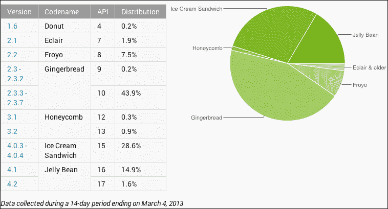

你可以看到安卓生态系统有多么分裂，以及你可能需要支持多少旧版本。在安卓及其商业伙伴摆脱束缚之前，安卓将继续成为本地移动世界的 IE 6。你*不*想支持那个。

另一方面，如果你严格发布到网络，那么每当用户访问你的网站时，他们都将使用最新版本和最新 API，你永远不必担心有人使用过时的版本。你需要应用安全补丁吗？你可以在几秒钟内完成。如果你在苹果应用商店，这个补丁可能需要数天甚至数周。

## 编译应用的三个好理由

是的，我知道我刚刚告诉过你成功的机会渺茫，以及你将面临支持应用的火海和硫磺。然而，以下是制作真正应用的几个好理由。实际上，在我看来，它们是唯一可接受的理由。

### 项目本身就是产品

这是你需要将项目打包成应用的第一个也是唯一确定的迹象。我不是在说通过你的项目销售东西。我说的是项目本身。它应该制作成一个应用。愿原力与你同在。

### 访问本地独有的硬件功能

GPS 和摄像头在它们的最新版本中，都可靠地为两个主要平台提供支持。iOS 甚至支持加速计。不过，如果你希望得到更多，你将需要编译成应用程序以获得这些 API 的访问权限。

### 推送通知

你喜欢它们吗？我不知道你，但我得到的推送通知太多了；任何一个过于张扬的应用要么被删除，要么完全关闭通知。我在这方面并不孤单。然而，如果你一定要有推送通知，而且不能等待基于网页的实现，你就必须编译一个应用程序。

### 支持当前客户

好吧，这有一定的牵强之处，但如果你在美国企业工作，你就会听到这个。这意味着你是一家成熟的企业，你希望为客户提供移动支持。你或者你的上级已经读过一些白皮书和/或案例研究，表明有将近`50%`的人首先在应用商店搜索。

即使这是真的（我对此仍然没有把握），你要对一个商人说这些。他们懂得金钱、开销和增加的维护成本。一旦向他们解释了在各种平台和它们的操作系统版本中进行建设和测试的成本、复杂性和潜在的持续头疼之后，对于公司向现有客户推广支持移动端，让他们只需要在其移动设备上访问你的网站，这成为一个非常吸引人的替代方案。营销人员总是在寻找可以向客户吹嘘的理由。营销部门可能仍然倾向于在客户设备上显示公司的图标，以增强品牌忠诚度，但这只是需要教育他们，这可以在没有应用程序的情况下完成。

即使你可能无法说服所有正确的人认为应用程序对于客户支持是错误的选择。如果你自己做不到，就用一点 Jakob Nielson 的见解敲打他们的头颅。如果他们不听你的，也许他们会听他的。我敢说任何人反驳尼尔森·诺曼集团不知道他们在说什么的说法。参见 [`www.nngroup.com/articles/mobile-sites-vs-apps-strategy-shift/`](http://www.nngroup.com/articles/mobile-sites-vs-apps-strategy-shift/)。

> "总结：当前移动应用程序的可用性比移动网站更好，但即将发生的变化最终会使移动网站成为更加优越的策略。"

因此，一个价值`64,000`美元的问题就是：我们是为现在还是为未来而生产的？如果我们是为现在而做，那么应该标志着本地策略退休的标准是什么？或者我们打算永远固守它吗？不要在没有退出战略的情况下参与那场战争。

# PhoneGap 与 Apache Cordova

好吧，在所有这些之后，如果你仍然想制作一个本地应用程序，我向你致敬。我钦佩你的精神，并祝你好运。

### 注意

如果你搜索 "jquery mobile phonegap performance"，你会找到 *很多* 负面文章。问题似乎是无穷无尽的。性能低下，屏幕在转换之间闪烁，等等。并不是说 Sencha Touch 或任何其他移动 Web 框架似乎做得更好。只是要意识到它可能不像在 Web 上运行时表现那样好。

PhoneGap 最初是一个将常规的 HTML、JS 和 CSS 打包成一个可在任何应用商店分发的应用程序的项目。最终，它成为了 Apache 软件基金会的一部分。在其核心，PhoneGap *是* Apache Cordova。事实上，如果你去 Cordova 的文档站点，它实际上仍然托管在 [`docs.phonegap.com/`](http://docs.phonegap.com/)。

除了简单地编译你的应用程序之外，你还可以访问以下设备级别的 API：

+   加速度计：利用设备的运动传感器。

+   相机：使用设备的相机拍摄照片。

+   捕获：使用设备的媒体捕获应用程序捕获媒体文件。

+   指南针：获取设备指向的方向。

+   连接：快速检查网络状态和蜂窝网络信息。

+   联系人：使用设备的联系人数据库。

+   设备：收集设备特定信息。

+   事件：通过 JavaScript 连接到本地事件。

+   文件：通过 JavaScript 连接到本地文件系统。

+   地理位置：使你的应用程序具有位置感知能力。

+   全球化：启用特定于区域设置的对象表示。

+   InAppBrowser：在另一个应用程序浏览器实例中启动 URL。

+   媒体：记录并回放音频文件。

+   通知：设备的视觉、听觉和触觉通知。

+   启动画面：显示和隐藏应用程序的启动画面。

+   存储：连接到设备的原生存储选项。

到目前为止，一切都很顺利。我们有更多的东西可以做，而且我们可以全部在 JavaScript 中完成。

接下来，我们需要真正构建我们的应用程序。你需要在你的计算机上下载 PhoneGap 或 Cordova。不要忘记下载你打算支持的每个平台的 SDK。不，等等，划掉！

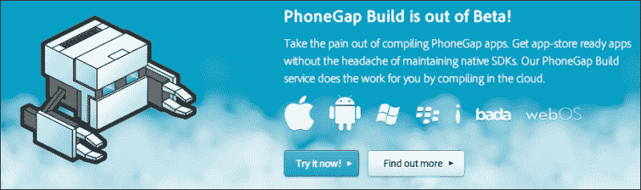

现在有了 PhoneGap Build。这是一个面向 PhoneGap 的基于云的构建服务。你根本不需要安装任何 SDK。PhoneGap Build 只是把所有工作都做了。如果你想要编译 iOS 应用程序，你仍然需要提供开发者证书，但除了这一点小问题，一切都很顺利。

要开始使用，你只需用你的 Adobe ID 或 GitHub ID 登录。然后，要么粘贴 GitHub 存储库的 URL，要么上传一个小于 9.5 MB 的 zip 文件：

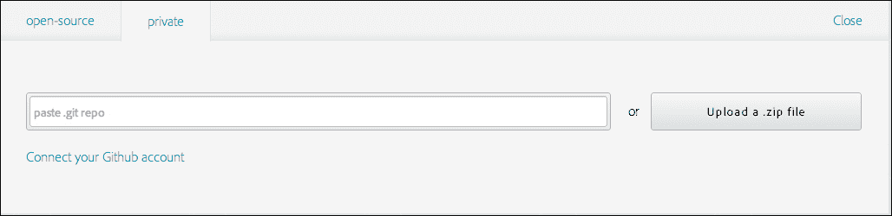

接下来，你需要填写关于应用程序本身的一些信息：

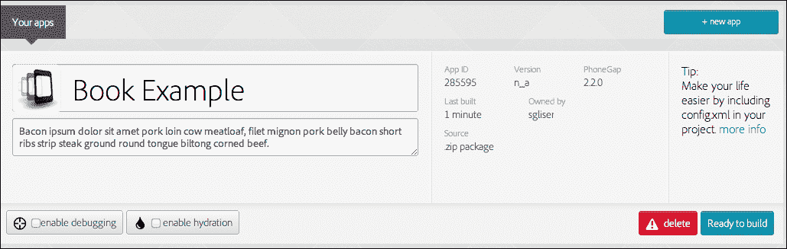

点击**准备构建**按钮。现在只需坐下来，看着漂亮的进度指示器做它们的工作。

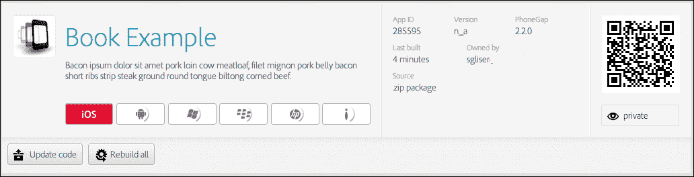

看，他们甚至给了你一个可爱的小二维码，用于下载这个应用。在 iOS 上显示红色标志的唯一原因是，这一点上，我还没有提供给他们我的开发者证书。

# 总结

我不知道你怎么想，但我真的筋疲力尽了。我真的觉得在这个时候关于 jQuery Mobile 或其支持技术已经没有更多可说的了。你已经有了如何为许多行业构建东西的例子，以及通过 Web 或 PhoneGap Build 部署它的方法。在这一点上，你应该引用建筑工人鲍勃的话。“我们能建造它吗？是的，我们能！”

我希望这本书对你有所帮助和/或启发，让你去做一些了不起的事情。我希望你改变世界，并且通过这样做获得巨额财富。在你前进的过程中，我很乐意听到你的成功故事。想要告诉我你的近况，或者指出任何勘误，甚至是有一些问题要问，欢迎直接给我发邮件到`<shane@roughlybrilliant.com>`。现在，去做一些精彩的事吧！
