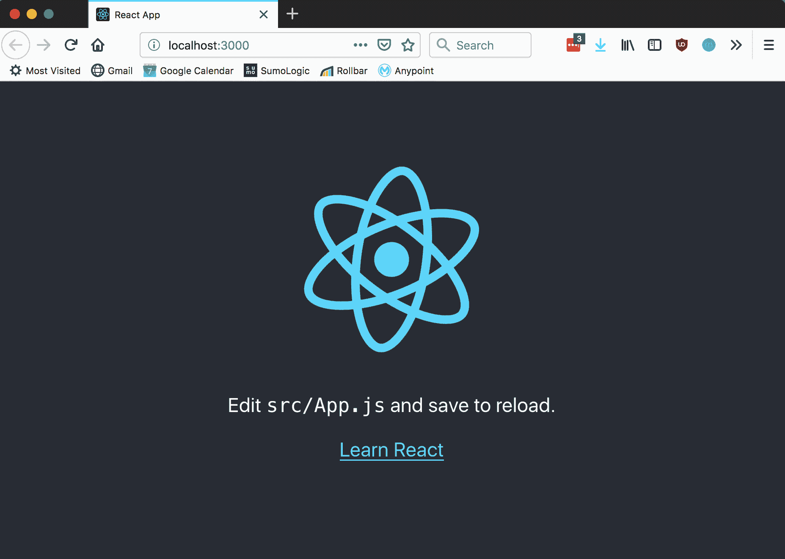
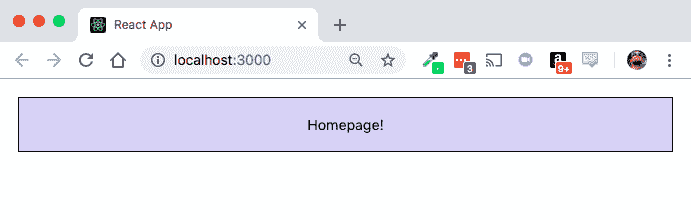

# 第一章：介绍 Create React App 2

本书将指导你如何有效地使用 **Create React App** 2 (**CRA**) 来创建一个新的 React 项目并构建你梦想中的网络项目！我们将涵盖许多主题，包括如何安装 Create React App、默认获得的项目结构，以及如何将代码和库添加到你的项目中。我们将探索你构建复杂、现代网络应用所需的一切，包括最新的最常见 React 项目配置和编译。

然而，要能够做到这一点，我们首先需要花一点时间来谈谈项目本身，它的谦逊起点，以及它最终试图解决的问题。通过了解历史和意图，我们可以更好地理解如何充分利用我们提供的工具集，并了解限制存在的位置和原因。

在本章中，我们将讨论 Create React App 是什么以及它带来了什么。当你完成本章时，你会理解为什么 Create React App 如此重要，以及它是如何帮助开发者以更短的时间完成更多工作的。我们还将讨论本书将涵盖哪些主题，其格式本身，以及如何最好地跟随。

在本章中，我们将探讨以下主题：

+   启动一个新的 Create React App 项目

+   启动和停止你的服务器的命令

+   运行测试的命令

+   创建生产就绪构建的命令

+   退出 Create React App 的命令仅限于进一步调整和配置你的项目

# 什么是 Create React App？

许多不同的编程语言、工具和框架都有许多不同的方式来启动它们特定工具集的开发。有时这需要下载大量的库，或者使用为正确架构、操作系统或其他配置预构建的二进制文件或压缩存档开始。有时它有一个很好的预构建路径来开始，这样可以最大限度地减少挫折，但可能限制了可用的选项。

然而，问题在于，对于许多 JavaScript 框架来说，并没有类似的选项。使用任何特定的框架或技术实际上是一个明显难以解决的问题，因为每个人的技能组合、操作系统和任务都有所不同。

Create React App 是 JavaScript 对那些不存在于任何特别易于接触方式中的**入门**工具集的回应。一般来说，要开始一个项目，你必须在真正开始之前学习大量的支持技术和技巧。你必须了解配置框架，如 Babel、Webpack、Brunch 或 Gulp。此外，你还必须知道如何在 JavaScript 中建立项目结构。在你弄清楚所有其他事情之后，你必须学习如何设置一个开发服务器，该服务器可以自动重新加载更改。在所有这些之后，你仍然需要弄清楚如何设置你的测试框架、React 以及你想要的任何附加库。

这最终会变成一大堆工作，而这只是入门。由于你正在开发的每一个框架和配置可能都不会转移到你的下一份工作中，所以这个问题会变得更加复杂！

相反，Create React App 旨在做些不同的事情：将配置和设置变成一个一步到位的过程。这让你可以更早地开始并构建你的应用程序，而不用担心更深入的工作部分。你可以把更多的时间花在编写代码上，而不是在配置一个出色的开发环境上。在你的 Create React App 应用程序中，环境本身就是一个出色的开发环境，这对新人和有经验的开发者来说都是一个巨大的障碍和障碍的消除！

**命令行界面**（**CLI**）工具提供了一个极佳的开发环境，鼓励快速迭代和测试驱动技术。我们有很多配置和特定库的问题已经为我们解决了，所以我们不必做这些基础工作。此外，你永远不会被你做出的任何选择所束缚。Create React App 团队包含了一个**eject**选项，它将你正在开发的应用程序的全部内容提取出来，并将其转换为标准的 webpack 或 babel 构建，例如，可以与**Node 包管理器**（**NPM**）兼容。你不必担心需要重复大量工作来将你的代码从 Create React App 转移到自己的项目或工作环境中的特定配置和设置；你只需创建一些可以安全、干净、顺利转移的东西。你甚至可以在这一步（eject 之后）调整配置，并进一步使这个应用程序成为你自己的！

# Create React App 的历史是什么？

为了更好地理解 Create React App 的成功之处，我们必须了解 JavaScript 开发世界的起点。我们需要看到系统的瑕疵，以了解为什么某些事情被修复以及如何被修复。让我们简单谈谈 JavaScript 开发的历史以及开发者经常遇到的一些主要问题！

# JavaScript 开发的早期

首先，你需要回顾一下在前端处理 JavaScript 代码的过去。长期以来，你可能会下载一些来自某个**内容分发网络**（**CDN**）的 JavaScript 文件，将它们扔到你的前端代码中，然后在前面写一大堆额外的 JavaScript 代码，然后就算完成了。

这种方式在某种程度上是不错的，因为你的依赖项被锁定到了你下载的版本，并固定在服务器上，所以你部署的内容开发起来相对容易，因为所有依赖项都已经存在并准备好使用。不幸的是，它以许多其他方式引入了大量问题。首先，你可能会不断遇到问题，其中一个你下载的库与另一个特定库的特定版本完全不兼容，而且这通常是一个复杂且困难的过程。大多数人解决这个问题的方法被分为几个阵营：

+   逐一检查并修复所有不兼容性

+   编写复杂的粘合代码，通过包装其中一个库并提供两个库协同工作的手段，使这些库能够一起工作

+   只为另一个库下载不同版本的库并将它们分别存储，当加载网页时导致巨大的 JavaScript 包，因为你可能正在下载两到三个不同版本的某个东西，比如 jQuery

是的，最后一个要点是一个真实存在的事情，真正的开发者确实这么做了！你可能明白为什么开发者们尽可能快地想要摆脱这种做法。

# 压缩包时代

为了解决这个问题，解决依赖性问题至关重要。转向基于 Node.js 的工具，如`npm`，对此有很大帮助，因为现在你的依赖项将从一个集中位置拉取，版本控制成为 JavaScript 开发的头等公民，这真是太棒了！

然而，当你需要将这个问题应用到浏览器代码和富 Web 应用中时，情况就不那么美妙了。通常，这意味着你需要理解哪些库适用于哪些项目。如果你想使用 React 与 JSX（我们稍后会详细讨论这个话题），以及最新的 JavaScript 语法，你需要确切知道要包含 React 和 Babel 的哪些版本。你还需要了解你需要哪些 Babel 插件来支持你使用的 JavaScript 语法的任何草案。

你想在你的 React 项目中使用一些 CSS 转换器或其他任何语言帮助，比如 TypeScript 或 Flow 吗？如果是这样，构建和配置你的项目就会变得明显更加困难，而且我们还没有涉及到如何将这段代码组合起来以便在浏览器上使用的问题！现在，你只需要开始一个项目，就需要有广泛的知识面，而对于如何设置和配置像 Webpack、Bundler、Grunt、Gulp 或 Brunch 这样的东西，则需要深入的知识！

这是我们之前在命令行工具和配置实用程序普及之前的发展阶段，所以让我们通过讨论 Create React App 解决的问题来深入了解这一点！

# CRA 解决了哪些问题？

Create React App 旨在解决在开始开发时需要理解大量不同的工具、脚本、配置实用程序、配置语言和文件类型的问题。所以现在，这并不是在你项目高级阶段和学习时需要解决的问题。这也不是在你成为专家并试图优化包以最小化最终用户在想要使用你的花哨 Web 应用时需要下载的内容时需要解决的问题！

记住，我们在这里讨论的问题不是专家独自解决的问题：这个问题存在于所有技能水平的发展中，对每个人来说都是如此。更糟糕的是，每次你开始一个新的项目时，这些问题都会重复出现。作为开发者，我们讨厌重复和浪费精力，所以 Create React App 团队着手消除这些障碍！

Create React App 允许你在任何技能水平、任何舒适度和熟悉 JavaScript 及其生态系统的水平上开始。你可以通过单个命令行工具启动一个项目，并获取你需要的所有东西，包括测试工具和框架。

这并不是懒惰。这是*效率*。

这并不是过度简化。这是*消除障碍*。

# 安装 Create React App 的先决条件

首先也是最重要的，你需要在你的工作电脑上安装`npm`。没有这个，就无法安装先决条件的库和项目。你可以在[`nodejs.org`](https://nodejs.org)下载 Node 和`npm`用于你的项目，然后执行以下步骤：

1.  在[`nodejs.org`](https://nodejs.org)找到适合你的电脑和操作系统的 Node 和 NPM 的适当安装程序包，并遵循安装程序提供的说明。

1.  安装一个合适的代码编辑器或**交互式开发环境**（**IDE**）。我在 Visual Studio Code 上有了最好的体验，所以这是我的个人推荐，但你可以使用任何你感到舒适的东西！

1.  一旦你安装了 Node 和`npm`（如果你还没有的话），你就可以开始了！

现在一切都已经设置好、运行正常，并且安装到了我们需要的版本，我们可以开始迭代了！学习一个项目的最快方式之一就是在我们学习的过程中开始构建它并对其进行迭代，所以我们将这样做。

# 创建我们的第一个 Create React App 项目

您应该首先选择一个主要的`开发`目录，您希望所有关于这本书的开发工作都发生在这个目录中。无论这个目录在哪里（我总是喜欢在我的`home`文件夹或`Documents`文件夹中的某个地方创建一个`开发`目录），然后您将创建一个新的项目。这将是一个一次性项目，因为我们将专注于尝试使用 Create React App 并熟悉从空白项目开始。让我们创建一个新的项目，我们将称之为`homepage`。

对于这个一次性项目，我们将假装我们正在编写一个花哨的`homepage`替代品。您实际上可以选择任何类型的项目，但我们将在这个章节之后丢弃这个初步项目。在您构建项目后，您应该看到以下输出：

```js
 $ npx create-react-app homepage

 Creating a new React app in [directory]/homepage.

 Installing packages. This might take a couple of minutes.
 Installing react, react-dom, and react-scripts...

 [... truncating extra text]

 Done in 13.65s.

 Success! Created hello-world at [directory]/homepage
 Inside that directory, you can run several commands:

 yarn start
 Starts the development server.

 yarn build
 Bundles the app into static files for production.

 yarn test
 Starts the test runner.

 yarn eject
 Removes this tool and copies build dependencies, configuration files
 and scripts into the app directory. If you do this, you can't go back!

 We suggest that you begin by typing:

 cd homepage
 yarn start

 Happy hacking!
```

在成功创建项目后，我们看到的那些说明对于我们在 Create React App 中的工作流程至关重要。默认情况下，Create React App 中捆绑了四个主要命令（以及大量选项）。如果您使用的是`npm`而不是 Yarn，请注意，Create React App CLI 帮助页面中的许多注释和输出主要指的是 Yarn。现在，这些命令（`start`、`build`、`test`和`eject`）相对容易理解，但仍然很重要，要进一步深入了解它们。

# 快速查看 CRA 的选项

在我们能够使用 Create React App 构建我们梦想中的应用程序之前，我们必须首先分析 Create React App 中的每个命令以及它们各自的功能，以及何时使用每个命令！

每个命令都与软件开发生命周期的特定部分相对应：构建应用程序、运行开发服务器、运行测试以及深度定制和配置。让我们更详细地探索每个命令。

# Yarn start 命令

这个命令的功能是*启动开发服务器*。

在您的 Create React App 项目上运行`start`会将您的项目从代码转换到您的网页浏览器。也就是说，它将编译项目的所有代码。从那里，它将加载一个带有默认起始模板的开发服务器。关于这一点，还有另一个好处是，它实际上会捕捉到您对任何代码所做的任何更改（假设您保存了这些代码），因此您不必不断地进行更改、保存文件、重新启动服务器、刷新浏览器；相反，您将对所做的任何更改立即获得反馈。

从一个完全全新的 Create React App 项目开始，并运行`start`将产生以下结果：



# yarn build 命令

这个命令的功能是将应用程序打包成用于生产的静态文件*。

运行 `build` 将应用程序转换成更适用于生产的版本。这意味着什么？好吧，如果你已经对 webpack 和 brunch 等工具如何将它们转换为生产网站相当熟悉，那么你基本上已经知道这能完成什么。另一方面，如果你觉得这一切都极其令人困惑，我将花一点时间，用稍微不那么模糊的术语来解释它。

从本质上讲，大多数浏览器默认情况下无法处理为 Create React App 项目编写的代码。需要对代码进行大量工作，将其转换为对浏览器更有意义的形式，确保它不需要依赖帮助来解释一切。然后，代码还会被压缩！通过重命名函数和变量、尽可能删除空白，以及在这里和那里进行一些小的优化，直到代码被缩减到一个非常干净且可用的版本。所有内容都被压缩，文件尽可能缩小，以减少下载时间（如果你针对的是可能没有良好互联网速度的移动受众，这一点很重要）。

压缩的意思就是听起来那样。它是将代码压缩成更小的值，使人类难以阅读，但对计算机来说却非常易于消化！

# yarn test 命令

这个函数*启动测试运行器*。

运行 `test` 正如你所期望的那样：运行你应用程序的所有测试。默认情况下，当你使用 Create React App 启动一个新项目时，你的项目将包括许多额外的工具，所有这些工具都应该准备好让你开始测试。如果你选择以更测试驱动的方式处理项目，这特别有用，在前端开发世界中这可能非常有用。

第一次运行 `test` 时，你应该在屏幕上看到一些输出，可能看起来有点像这样：

```js
 PASS  src/App.test.js
 renders without crashing (18ms)

 Test Suites: 1 passed, 1 total
 Tests:       1 passed, 1 total
 Snapshots:   0 total
 Time:        1.976s
 Ran all test suites related to changed files.

 Watch Usage
 › Press a to run all tests.
 › Press f to run only failed tests.
 › Press p to filter by a filename regex pattern.
 › Press t to filter by a test name regex pattern.
 › Press q to quit watch mode.
 › Press Enter to trigger a test run.
```

不仅如此，所有这些构建和提供给你的选项和附加工具都非常好！在应用程序中设置测试框架并使其持续运行可能会非常痛苦，所以这一切都为你解决，让你的生活变得容易一千倍。除此之外，Create React App 项目附带的测试监视器还会监视并实时重新加载对任何相关文件所做的更改，类似于 `start` 命令。

这些只是默认设置。值得看看一些与我们的测试监视器一起提供的额外命令：

+   `按 a 键运行所有测试`：正如命令所说，如果你在那个窗口按*A*键，它就会决定从零开始运行你项目中所有的单个测试，并输出结果。当你需要它并需要在任何时间验证一个完全绿色的测试套件时，请使用此功能。

+   `按 f 键只运行失败的测试`：当我提到过去设置这样的东西时，我是在个人经验的基础上说的，这是一项绝对令人讨厌的任务。当你采取*红色、绿色、重构*的项目方法，只想运行上次失败的测试，并试图让这些测试通过时，这真是太好了。你可以将此作为你的开发方法的一部分，逐渐清除应用程序失败测试的冗余，直到所有测试都通过！

**红色、绿色、重构**：这指的是一种常见的开发模式，你首先编写测试，目的是让它们失败，然后编写最少的代码让它们通过，然后重构代码直到它们再次失败，然后重复这个循环。虽然这通常在面试环境中而不是实际开发中使用，但这个过程本身是一个非常现实的过程。

+   `按 p 键通过文件名正则表达式模式过滤`：这是一个非常酷的功能。假设你修改了一些代码，影响了所有与用户相关的功能，但你有一个巨大的测试套件，不想测试整个套件。你可以通过按*P*键来针对所有用户代码，然后输入`user`并查看哪些测试运行。

+   `按 t 键通过测试名称正则表达式模式过滤`：类似于前面的选项，但它更进一步，通过查看你的测试是如何命名的（更多内容将在后面的章节中介绍），并根据这些描述而不是测试文件所在的文件名来运行测试。

+   `按 q 键退出监视模式`：这里没有太多要解释的；这将退出测试监视器。

+   `按 Enter 键触发测试运行`：按下*Enter*键将重新运行你最后的测试，这在使用正则表达式选项时非常有帮助，但你不想每次都重新输入模式。

# yarn eject 命令

移除 Create React App 脚本和预设配置，并将构建依赖项、配置文件和脚本复制到应用目录中。如果你这样做，你就不能回到在你的项目中使用 Create React App 了！

对于这个命令，值得看看文档中对此的说明。用通俗易懂的话来说，这个命令将你的项目从 Create React App 项目转换成 Webpack 配置，并移除了很多 Create React App 和 React Scripts 项目的细节，这些细节实际上隐藏了一些信息。一个类似的概念是购买预装好的电脑与自行组装（或重新组装）电脑。你可能一开始希望所有东西都为你准备好，但也许有一天你会想要添加更多的 RAM 或更换显卡，这时你将不得不打开之前是黑盒的部分，以便进一步配置！

如果你需要超出从基础项目获得的标准项目结构和配置的局限，你可能会这样做。这将允许你将其转换成标准的 Webpack 项目，添加新的库，更改默认和基线细节，或者更进一步，替换其他核心组件。

# 让我们探索创建的项目

最后，我们应该花一点时间看看究竟创建了什么，并将其放入你的项目中。

Create React App 将为你的项目生成一个名为`README.md`的 README 文件。这是一个 Markdown 格式的文件，告诉其他人如何有效地使用你的项目（或者，如果你像我一样，几个月后会提醒你如何使用项目中实施的所有工具和技巧）。

你还会得到一个**favicon**，这是显示在地址栏中你的网站路径旁边的小图标，并且用于后续对应用程序的任何书签。接下来，我们有公共的或`index.html`文件，这是主要的执行文件，包含了你所有的花哨的 React 代码，更重要的是，它告诉网络浏览器在哪里渲染你的 React 应用程序；在我们的例子中，我们有一个`div`元素，它作为 React 渲染的主要目标。文件的来源默认如下：

```js
  <!DOCTYPE html>
    <html lang="en">
      <head>
        <meta charset="utf-8">
        <link rel="shortcut icon" href="%PUBLIC_URL%/favicon.ico">
        <meta name="viewport" content="width=device-width, initial-scale=1, shrink-to-
         fit=no">
        <meta name="theme-color" content="#000000">
        <!--
          manifest.json provides metadata used when your web app is added to the
          homescreen on Android. See 
          https://developers.google.com/web/fundamentals/web-app-manifest/
        -->
        <link rel="manifest" href="%PUBLIC_URL%/manifest.json">
        <!--
          Notice the use of %PUBLIC_URL% in the tags above.
          It will be replaced with the URL of the `public` folder during the build.
          Only files inside the `public` folder can be referenced from the HTML.

          Unlike "/favicon.ico" or "favicon.ico", "%PUBLIC_URL%/favicon.ico" will
          work correctly both with client-side routing and a non-root public URL.
          Learn how to configure a non-root public URL by running `npm run build`.
        -->
        <title>React App</title>
      </head>
      <body>
        <noscript>
          You need to enable JavaScript to run this app.
        </noscript>
        <div id="root"></div>
        <!--
          This HTML file is a template.
          If you open it directly in the browser, you will see an empty page.

          You can add webfonts, meta tags, or analytics to this file.
          The build step will place the bundled scripts into the <body> tag.

          To begin the development, run `npm start` or `yarn start`.
          To create a production bundle, use `npm run build` or `yarn build`.
        -->
      </body>
    </html>
```

我提到了一个作为主要 React 渲染目标的`div`元素：具有`id`为`root`的`div`元素作为我们的主要渲染目标，是使你的应用程序正常工作的关键组件。移除它后，你的应用程序在浏览器中将无法正确渲染！接下来是`package.json`清单文件。它存储了你的项目使用的所有依赖项，以及一些用于描述项目的元数据（可能包括名称、版本、描述或其他元数据）。如果你使用 Yarn，我们还有一个`yarn.lock`文件，它以防止项目在某个库更新时随机崩溃的方式锁定项目使用的库和依赖项列表。

您项目的所有依赖项、库以及使项目在幕后运作的东西都位于`node_modules`目录中。这也带我们进入了`src`目录，这可以说是我们整个项目结构中最重要的目录！它将存放我们即将进行的所有工作——所有源代码。

在该目录内，我们有`index.js`文件，它处理 React 的主要渲染调用，由名为`ReactDOM`的包支持。这个包接收我们的`App.js`组件，这是我们主要的根级组件，并告诉 React 将其渲染到之前向您展示的`index.html`文件中。

我们还默认获得一些样式，通过`index.css`文件。这是我们的项目将使用的基级样式表，我们将在其基础上进行配置。

在我们的非测试代码方面，`App.js`是通过 Create React App 默认得到的最终组件。里面的内容对我们来说并不特别重要，因为我们只是会删除该文件中的所有代码，然后从头开始！`App.css`存储该组件的样式表，这使我们能够确保每个组件包含的任何样式都可以独立存储和配置。我们还以**可缩放矢量图形**（**SVG**）文件的形式提供了 React 标志，即 React 标志（`logo.svg`）。我们不需要它，所以请随意删除它！

`serverWorker.js`是一个文件，它告诉我们的应用如何作为一个**渐进式 Web 应用**的服务工作者存在/工作，但我们将在这个章节的后面深入探讨，届时我们将专注于渐进式 Web 应用！

最后，我们有一个为我们预构建的测试。`App.test.js`文件包含针对我们的`App.js`组件的测试套件（我想不是套件，因为它只有一个测试，但随着时间的推移，它将变成套件）。这就是全部！这就是我们的 Create React App 项目的默认项目结构！

# 向我们的项目中添加代码

理解默认项目结构的最简单方法之一就是实际进入其中并开始尝试修改，所以让我们这么做！我们将删除项目附带的一些默认代码，并自己构建一些内容，以获得项目应该如何结构化的良好感觉，并学习每个文件如何交互，以便我们在开始玩耍和更改文件结构时了解这些。

# 创建我们的第一个组件

要创建我们的第一个组件，请按照以下步骤操作：

1.  在您最喜欢的文本编辑器中打开新创建的项目，并在该项目中运行`start`命令，以便打开浏览器窗口查看我们沿途所做的任何更改的结果。

1.  让我们做所有开发者都爱做的事情：删除旧代码！

1.  一旦代码中有了，我们可以通过 Babel 中包含的最新 JavaScript 语法变化来了解与 React 交互的主要方法。鉴于这一点，让我们看看与 React 类交互的方法。我们可以使用函数，或者我们可以使用类将 React 代码引入我们的代码库。我们将从仅使用函数开始，随着时间的推移，也将引入类，并且我们将讨论如何、何时以及为什么选择每种方法。当然，无论实现方法如何，都需要 React，因此我们需要在代码的开始处实际导入它。

1.  在 `App.js` 文件的顶部，我们将添加我们的 `导入` 语句：

```js
import React from 'react';
```

这一行代码告诉 JavaScript 我们想要 `导入` React 库，并且我们可以从 `react npm` 库（Create React App 显然已经为我们包含了它）中找到 React 类。这为我们提供了所需的 React 支持，并且还增加了对 JSX 模板的支持，以及我们编写基础级 JavaScript 所需要的一切！

1.  在处理完导入之后，让我们编写我们的第一段代码：

```js
const App = () => {
 return <div className="App">Homepage!</div>;
};
```

在这里，我们将进一步探讨一些新的 JavaScript 语法，如果你来自较旧的 JavaScript 世界，你可能不太熟悉。上一行负责创建一个称为常量函数的东西，这限制了我们在事后重新定义或修改 `App` 函数的能力。我们正在编写的这个函数不接受任何参数，并且总是返回相同的内容。这是一个函数组件，因此我们需要编写 `return` 语句来返回一个 JSX 模板，告诉 React 如何将我们的 React 组件渲染到浏览器中。我们还确保告诉 React，我们的主要组件应该有一个名为 `App` 的 CSS 类名。

`className` 而不是 `class`！在 JavaScript 中，`class` 是一个保留关键字，这就是为什么 React 需要这个小陷阱！

1.  在这段代码的末尾，我们需要添加一个 `export` 语句，以便其他文件（例如我们的 `index.js` 文件，具体来说）能够将正确的模块导入到我们的代码库中：

```js
export default App;
```

我们最终的结果是，当我们的浏览器刷新时，我们应该在屏幕上看到 Homepage! 弹出！

# 等等，什么是 JSX？

你可能不知道 JSX 是什么，但如果你知道，请随意跳过。否则，我将为你提供一个非常快速的总结！

简单来说，JSX 就是 JavaScript 和 HTML 的混合，本质上是一个模板语言。这是一个简化的解释；JSX 实际上是围绕 `React.createElement` 调用的智能语法包装器，但以更接近 HTML 的方式组合在一起。这样，我们可以编写与 HTML 极其相似的界面代码，这使得开发人员、设计师和其他人可以与我们的代码一起工作（假设他们已经熟悉 HTML），但我们也可以访问一些额外的功能，因为它是基于 JavaScript 的模板语言。

我们获得的第一项功能是，我们实际上可以在任何 JSX 中嵌入任何 JavaScript 语句，只需将其包裹在花括号中！不过，需要注意的是，我们需要记住 JSX 是 JavaScript，因此这里有一些单词和语法是保留的（类是这个例子中的主要例子），所以在编写 JSX 时需要使用特定的变体（例如 `className`）。

# 在我们的组件中嵌入样式表

使用 React 和创建这些基于浏览器的界面很棒，但没有任何样式，整体看起来会很单调。好消息是 Create React App 也为你提供了一个很好的框架来清理你的界面！目前，由于我们删除了大量代码，我们目前应该有一个完全空的 `App.css` 文件。我们需要回到 `App.js` 文件，并在顶部添加以下行以确保它包含我们的新 `App` 组件样式表：

```js
import "./App.css";
```

这将告诉 React 确保将 `App` 样式表包含为组件样式表的一部分。如果 `App.css` 保持为空，那么这不会产生太大影响，所以让我们也将我们的默认样式表更改为更有趣的内容：

```js
 .App {
  border: 1px solid black;
  text-align: center;
  background: #d5d5f5;
  color: black;
  margin: 20px;
  padding: 20px;
}
```

保存文件，回到你的浏览器窗口，你应该会看到以下类似的内容：



好的，我们现在有一些可以工作的代码，这是我们在应用程序中开始的好地方，所以我们将跳转到 `index.js` 并快速弄清楚组件是如何进入浏览器的。打开 `src/index.js`：

```js
    import React from 'react';
    import ReactDOM from 'react-dom';
    import './index.css';
    import App from './App';
    import * as serviceWorker from './serviceWorker';

    ReactDOM.render(<App />, document.getElementById('root'));

    // If you want your app to work offline and load faster, you can change
    // unregister() to register() below. Note this comes with some pitfalls.
    // Learn more about service workers: http://bit.ly/CRA-PWA
    serviceWorker.unregister();
```

到目前为止，我们已经看到了 `import React`。上一行导入 `ReactDOM`（其中包含主要的 `render()` 函数），我们需要它来告诉 React 要渲染哪个组件，以及在哪里渲染它！这来自于独立的 `react-dom npm` 模块。

之后，我们还包括了另一个样式表，这次是 `index.css`。这将成为我们的全局、基线 CSS 文件。之后，我们使用 `import` 语句导入 `App` 组件（记得我们之前写的 `export` 语句？）使用 `import App from './App'`。注意，我们可以完全省略 `.js` 扩展名，并在文件名前包含一个点和斜杠；这告诉 Node 我们正在从本地文件系统导入，而不是从 NPM 模块导入！`App.js` 作为 `local` 文件位于我们的 `src` 目录中，所以本地包含就足够了。

我们以一个新的行结束，`import registerServiceWorker from './registerServiceWorker'`，这允许我们访问在 Create React App 中实现渐进式网络应用的 Service Workers。渐进式网络应用略超出了本教程系列的范畴。

`render()` 是一个函数调用，它接受两个简单的参数：

+   要渲染哪个组件

+   在哪里渲染该组件

由于我们的组件名称被导入为 `App`，并且因为我们使用 JSX，我们可以将 `App` 当作一个 HTML 标签来处理：

```js
<App />
```

记住，所有 JSX 中的标签都需要关闭，无论是通过简写语法，如前面的示例，还是通过较长的语法，如下所示：

```js
<App></App>
```

我们渲染难题的最后一部分是我们需要确定 React 组件需要渲染到的 DOM 中的位置，通过 `document.getElementById('root')` 这一行。这告诉 JavaScript 需要在页面上找到一个具有 `id` 为 `root` 的元素，这最终将成为我们的渲染目标！

就这样！我们承认这是一个基础但完整的 React 应用程序，我们几乎在没有任何时间的情况下就写出来了，而且在设置开发服务器、确定我们需要哪些库、使代码和浏览器窗口自动重新加载，或者，嗯，你懂的，我们都没有压力或头痛。

严肃地说，开发者还能要求什么更多呢？

# 展望未来——我们将做什么？

我们还能要求什么更多？实际上，还有很多！在接下来的章节中，我们将随着对 Create React App 提供的开发工作流程的熟悉，更深入地探讨。让我们探索我们将要构建的这个项目的计划（因为“hello-world”应用程序只是让我们有机会玩玩，而且不会成为我们未来的最终项目）。

# 项目计划

在本书的整个过程中，我们将使用 Create React App 完全构建一个应用程序，涵盖许多常见的现代 React 开发技术、方法和最佳实践。我们将花时间探索可用的不同库，以及如何在我们的 Create React App 项目中最佳地利用它们，而且还要尽可能少花力气！我们将构建一个项目，将充分利用现代 JavaScript 开发的最佳之处，利用 Babel 和 React 的最新功能。我们将利用 JavaScript 中最新的语法变化来发挥其全部作用！我们将确保我们的应用程序经过全面测试且坚不可摧，使用 CSS 模块和 **Syntactically Awesome Style Sheets**（**SASS**）保持其美观，甚至模拟后端服务器，这样我们甚至不需要一个单独的后端服务器来开发！

最后，我们将探索如何通过服务工作者使我们的应用程序能够在在线或离线状态下工作，然后通过使其生产就绪来完善我们的应用程序，使其最小化、整洁且可部署！

# 摘要

在本章中，我们探讨了在启动 Create React App 项目时我们所拥有的选项。我们还花了很多时间探索了 Create React App 之前的前端开发历史，甚至抽出一些时间坐下来，通过探索默认项目结构来构建一个漂亮的小型入门级应用程序。

你现在应该对 Create React App 的默认项目结构和将使我们能够在后续章节中完成更多工作的语言结构感到更加舒适，所以无需多言，让我们奋勇前进，开始构建一个更复杂的应用程序，这将成为我们项目剩余部分每个章节的基础。
