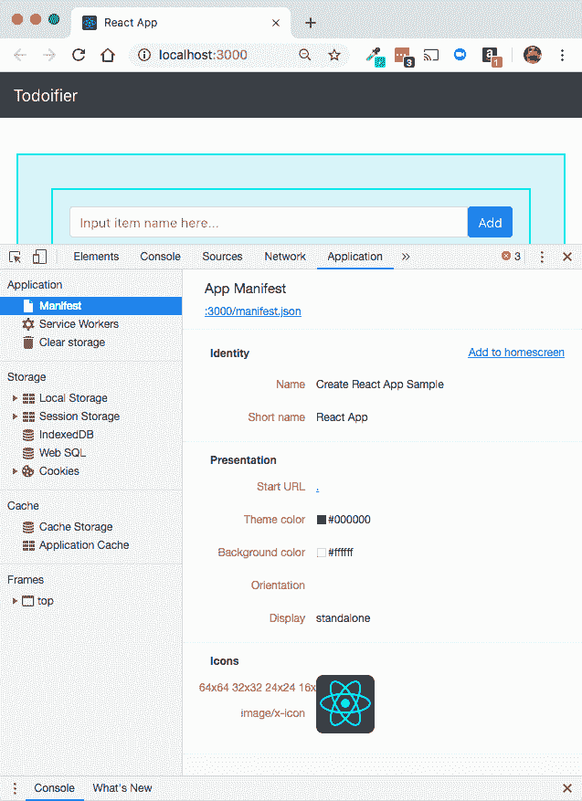
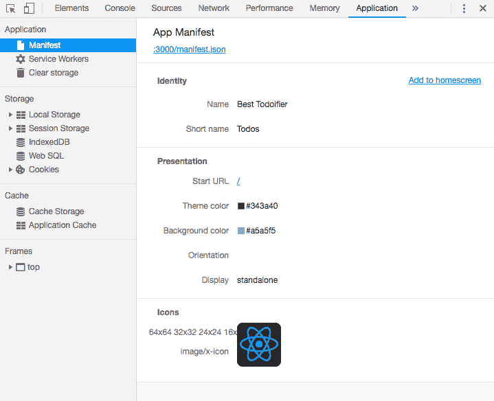
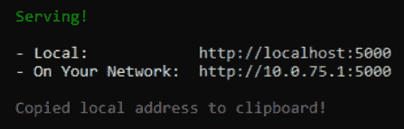
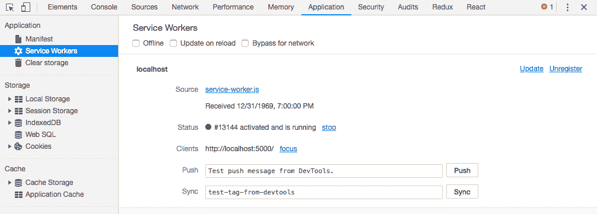

# 第七章：构建渐进式 Web 应用

构建现代 Web 应用的美丽之处在于能够利用诸如**渐进式 Web 应用**（**PWA**）之类的功能！但它们可能有点复杂。就像往常一样，Create React App 项目让这一切对我们来说变得容易得多，但这次也有一些重要的注意事项需要我们思考。

在本章中，我们将涵盖以下主题：

+   检查 PWA 及其添加的内容

+   学习如何将我们的 Create React App 项目配置为自定义 PWA

+   修改和调整`manifest`文件

+   探索 Service Worker、其生命周期以及如何与 Create React App 一起使用

+   探索使用 Create React App 构建 PWA 的注意事项

# 理解和构建 PWA

PWAs 是那些听起来非常酷但理解其何时、为什么以及如何构建它们却很复杂的功能之一。让我们花点时间揭开它们的神秘面纱，帮助你理解为什么它们是我们 Create React App 项目中如此强大（且受欢迎）的组成部分，以及我们如何开始使用它们！

# 什么是 PWA？

让我们简单谈谈什么是 PWA，因为关于 PWA 确切做什么的信息和误解很多！

下面是一个简短、可能不太有用的 PWA 功能版本；它仅仅是一个执行以下操作的网站：

+   只使用`HTTPS`

+   添加一个 JSON manifest（web 应用 manifest）文件

+   有 Service Worker

虽然是的，PWA 必须具备这些行为，但仍然很难理解 PWA 是什么，或者它最终能给你带来什么。例如，这告诉你关于它在不同浏览器中做什么的信息吗？在不同窗口大小下呢？关于它的可访问性或当网络慢或不存在时如何工作呢？

# 我们如何定义 PWA？

对于我们来说，PWA（Progressive Web Application，渐进式 Web 应用）是一个可以在移动设备或桌面电脑上安装/运行的 React 应用。本质上，它只是你的应用，但具有一些使其更先进、更有效、更能抵御网络不佳/无网络的能力。PWA 通过一些原则、技巧和需求来实现这些功能，这是我们希望遵循的：

+   应用必须可供移动和桌面用户使用

+   应用必须通过`HTTPS`运行

+   应用必须实现一个 web app JSON `manifest`文件

+   应用必须实现 Service Worker

现在，第一个问题是设计问题。你的设计是否是响应式的？如果是的话，恭喜你，你已经迈出了拥有 PWA 的第一步！下一个问题也是一个可能不太相关的实现问题：当你将应用部署到生产环境时，你是否只使用了`HTTPS`？我希望答案是肯定的，但仍然是一个值得问的问题！

然而，接下来的两个是我们可以在 Create React App 项目中实现的事情，我们将把这些作为本章的重点！

# 在 Create React App 中构建 PWA

如果我们想在 Create React App 中开始构建 PWA，如前所述，我们需要开始针对我们提出的两个要求进行实施。我们将从最简单的问题开始解决：为我们的 PWA 实现一个`manifest`文件！

# 从我们的清单文件开始

好吧，所以我确定了我们需要构建的两个项目来使这一切发生：JSON `manifest`文件和服务工作者！简单，对吧？实际上，比这还简单。你看，Create React App 默认会为我们创建一个 JSON `manifest`文件，作为项目创建的一部分！这意味着我们已经完成了这一步！让我们庆祝一下，回家，脱掉鞋子，因为我们现在已经完成了，对吧？

嗯，差不多吧。我们应该看看那个默认的`manifest`文件，因为我们不太可能希望我们的`TodoList`项目被称为`"Create React App Sample"`。让我们看看位于`public/manifest.json`的`manifest`文件：

```js
{
 "short_name": "React App",
 "name": "Create React App Sample",
 "icons": [
 {
 "src": "favicon.ico",
 "sizes": "64x64 32x32 24x24 16x16",
 "type": "image/x-icon"
 }
 ],
 "start_url": ".",
 "display": "standalone",
 "theme_color": "#000000",
 "background_color": "#ffffff"
}
```

其中一些键非常直观，或者至少你可以从中推断出它们的功能。然而，一些其他的键可能有点奇怪。例如，`"start_url"`是什么意思？我们可以选择哪些不同的显示选项？什么是`"theme_color"`或`"background_color"`？这些不都是由我们应用的 CSS 决定的吗？

还不止这些。实际上，让我们深入这个 JSON `manifest`文件的世界，并使其变得更有用！

# 使用 Chrome 查看我们的清单文件的实际效果

首先，为了能够测试这个，我们应该有一个可以验证我们更改结果的地方。我们将从 Chrome 开始，如果你进入开发者工具部分，你可以导航到应用标签，并直接进入服务工作者部分！让我们看看我们的应用看起来是什么样子：



# 探索清单文件选项

如果清单文件没有解释不同的键和选项的含义，那么它并不很有帮助，所以让我们深入地，键接键，查看我们可用的每个配置选项以及我们可以为每个选项使用的可能值。

# name 和 short_name

我们拥有的第一个键是`short_name`。这是当，例如，标题只能显示比完整的应用或站点名称更小的文本时可能显示的名称的简短版本。与之相对应的是`name`，这是你应用的完整名称。一个很好的例子可能是这样的：

```js
{
 "short_name": "Todos",
 "name": "Best Todoifier"
}
```

# 图标

下一个要查看的键是 `"icons"` 键，它是一个子对象的列表，每个子对象都有三个键。这包含 PWA 应该使用的图标列表，无论是用于桌面、手机主屏幕还是其他地方。每个 `"icon"` 对象都应该包含一个 `"src"`，这是一个指向图标图像文件的链接。接下来，你有 `"type"` 键，它应该告诉 PWA 你正在处理什么类型的图像文件。例如，如果你正在使用 `.png` 文件，你将在这里列出 `"image/png"` 作为类型。最后，我们有 `"sizes"` 键，它告诉 PWA 图标的尺寸。为了获得最佳效果，你应该至少有一个 `"512x512"` 和一个 `"192x192"` 的图标。PWA 将负责在必要时调整大小。

# start_url

`start_url` 键用于告诉应用程序相对于你的服务器，它应该在应用程序的哪个位置开始。虽然我们现在没有使用它，因为我们有一个单页、无路由的应用程序，但在一个更大的应用程序中可能会有所不同，所以你可能只想让 `start_url` 键表示你希望它们从哪里开始。另一个选项是在 `url` 的末尾添加查询字符串，例如跟踪链接。一个例子可能是这样的：

```js
{
 "start_url": "/?source=AB12C"
}
```

# background_color

这是应用程序首次启动时显示启动屏幕时使用的颜色。这类似于你第一次从手机上启动应用程序时；在应用程序加载期间临时弹出的那个小页面就是启动屏幕，这将是它的背景。这可以是颜色名称，就像你在 CSS 中使用的那样，也可以是颜色的十六进制值。

# display

`display` 影响应用程序启动时浏览器的 UI。有方法可以使应用程序全屏显示，隐藏一些 UI 元素等。以下是可能的选项及其说明：

| `值` | 描述。 |
| --- | --- |
| `browser` | 正常的网页浏览器体验。 |
| `fullscreen` | 没有浏览器 UI，并占据整个显示区域。 |
| `standalone` | 使网络应用程序看起来像原生应用程序。它将在自己的窗口中运行，并隐藏很多浏览器 UI，使其看起来和感觉更像原生应用程序。 |

在我们的例子中，我们将使用 `standalone` 作为显示设置！

# 方向

如果你想要在横向方向上制作你的应用程序，你将在这里指定它。否则，你将省略这个选项，不将其包含在 `manifest` 中：

```js
{
  "orientation": "landscape"
}
```

# scope

范围有助于确定你的 PWA 在网站中的位置以及它不在的位置。这可以防止你的 PWA 尝试加载运行范围之外的内容。"start_url" 必须位于你的范围内部才能正常工作！这是可选的，在我们的例子中我们将省略它。

# theme_color

这设置了工具栏的颜色，再次使其感觉和外观更接近原生。如果我们指定了元主题颜色，我们会将其设置为与该指定相同。就像背景颜色一样，这可以是 CSS 中使用的颜色名称，也可以是颜色的十六进制值。

# 自定义我们的清单文件

现在我们已经是`manifest`文件的专家了，让我们自定义我们的清单文件！我们在这里和那里做一些更改，但不会进行任何重大更改。为了这本书的目的，我们不会担心与图像一起工作，所以我们会暂时保留它们。让我们看看我们在`public/manifest.json`中是如何设置`manifest`文件的：

```js
{
 "short_name": "Todos",
 "name": "Best Todoifier",
 "icons": [
 {
 "src": "favicon.ico",
 "sizes": "64x64 32x32 24x24 16x16",
 "type": "image/x-icon"
 }
 ],
 "start_url": "/",
 "display": "standalone",
 "theme_color": "#343a40",
 "background_color": "#a5a5f5"
}
```

因此，我们将`short_name`和`name`键设置为与实际应用程序匹配。我们完全保留了`icons`键，因为我们实际上不需要对它做太多任何事情。

接下来，我们将`start_url`更改为仅`"/"`，因为我们假设这个应用程序是这个域上唯一运行的东西。我们将`display`设置为`standalone`，因为我们希望我们的应用程序能够被添加到某个人的主页上，并被识别为真正的 PWA。

最后，我们将主题颜色设置为`#343a40`，这与导航栏的颜色相匹配，并将为 PWA 提供更流畅的外观和感觉。我们还设置了`background_color`键，这是为我们启动屏幕设置的，颜色为`#a5a5f5`，这是我们的正常`Todo`项的颜色！

如果你回顾一下键的解释，你会记得我们还需要更改`public/index.html`文件中的元主题标签，所以我们将打开它并快速进行更改：

```js
<meta name="theme-color" content="#343a40" />
```

就这样！我们的`manifest`文件已经自定义了！如果我们一切都做得正确，我们应该能够在 Chrome 开发者工具中再次验证这些更改：



# 连接服务工作者

为我们的应用程序创建一个可工作的 PWA 的另一个必要组件是构建服务工作者。服务工作者是 PWA 中那些组件之一，其理解程度因人而异，而且它们的效用也不立即明显。尽管我们为我们的 PWA 实现服务工作者所需的工作量非常小（可能甚至比我们的`manifest`文件还要少），但我们将花一些时间探索和理解服务工作者。

# 服务工作者是什么？

Service Worker 被定义为浏览器在幕后运行的脚本，与主浏览器线程分开。它可以拦截网络请求，与缓存（存储或从缓存检索信息）交互，或监听并传递推送消息。这也带来了一些注意事项。它是完全异步的，这意味着需要同步操作的所有内容，例如 **XMLHttpRequest**（**XHR**）或与 **localStorage** 操作，都不能在 Service Worker 代码内部使用。它还可以执行一些其他巧妙的小技巧，例如即使在应用程序本身不活跃的情况下也能接收推送消息，允许你在应用程序未打开时向用户显示通知！

由于它可以拦截网络请求并从服务器存储/检索信息，因此它还可以在离线状态下运行，这使得你的应用程序可以立即启动并使用，并从服务器逐步获取更新或定期在后台更新！

# Service Worker 生命周期

Service Worker 的生命周期相当简单。主要有三个主要阶段：

+   注册

+   安装

+   激活

每个这些阶段都很直观易懂。

**注册** 是让浏览器知道 Service Worker 所在位置以及如何将其安装到后台的过程。注册的代码可能看起来像这样：

```js
if ('serviceWorker' in navigator) {
  navigator.serviceWorker.register('/service-worker.js')
  .then(registration => {
    console.log('Service Worker registered!');
   })
  .catch(error => {
    console.log('Error registering service worker! Error is:', error);
   });
}
```

**安装** 是在 Service Worker 已注册后发生的过程，并且仅在 Service Worker 还未安装或自上次以来已更改的情况下才会发生。

在 `service-worker.js` 文件中，你可以添加以下内容来监听这个 `event`：

```js
self.addEventListener('install', event => {
  // Do something after install
});
```

最后，**激活** 是在所有其他步骤完成后发生的步骤。Service Worker 已注册并安装，现在是 Service Worker 开始执行其任务的时候了：

```js
self.addEventListener('activate', event => {
  // Do something upon activation
});
```

# 我们如何在我们的应用程序中使用 Service Worker 呢？

那么，我们如何在我们的应用程序中使用 Service Worker 呢？嗯，使用 Create React App 来做这件事很简单，但有一个主要的注意事项：不幸的是，你无法在不推出项目的情况下配置 Create React App 默认生成的 `service-worker.js` 文件！然而，并非所有希望都破灭了；你仍然可以通过使用默认的 Create React App 生成的 Service Worker 来利用一些 PWA 和 Service Worker 的亮点。

要启用此功能，请跳转到 `src/index.js`，并在最后一行将 Service Worker 的 `unregister()` 调用更改为 `register()`：

```js
serviceWorker.register();
```

现在我们正在选择加入我们的 Service Worker！接下来，为了真正看到结果，你需要运行以下命令：

```js
$ yarn build
```

我们将创建一个 *生产* 版本（我们将在第八章 准备应用程序投入生产中更详细地介绍）。你会看到一些我们希望作为此过程一部分跟踪的输出：

```js
The build folder is ready to be deployed.
You may serve it with a static server:

 yarn global add serve
 serve -s build
```

根据指示，我们将全局安装 **serve**，并按照指示运行命令。当我们运行这个命令时，我们应该看到以下输出：

```js
$ serve -s build
```

我们将得到以下输出：



现在请在您的本地浏览器中打开 `http://localhost:5000`，您将能够在 Chrome 开发者工具中看到，您的应用程序的服务工作者正在运行：



注意，当您在 `localhost` 上运行时，要求服务工作者和 PWA 使用 `HTTPS` 的规则并不适用！

# 摘要

希望我们至少已经探索了足够多的渐进式网络应用程序，至少它们的部分神秘性已经被揭开！构建 PWA 时的许多困惑和麻烦往往源于没有好的起点来构建一个 PWA。要从 PWA 中获得价值，您必须拥有一个 PWA，但通常需要证明它们的价值！真是一场旋风！

Create React App 在我们如何实现服务工作者方面有限制，这确实限制了我们的 PWA 的功能和实用性。但这并不是说它束缚了我们，我们可以通过预缓存网络和 API 响应等有趣的小技巧来提高我们的应用程序的加载速度，即使加载的浏览器最初是离线的。话虽如此，这就像 Create React App 中的许多其他事情一样：一个惊人的垫脚石，也是未来开始使用 PWA 的绝佳方式！

在下一章和最后一章中，我们将整理我们项目的几个 loose ends，并简要讨论一下生产构建和从 Create React App 中退出！我们将探讨如何将我们的代码带入生产环境。我们还将讨论将一些其他主要库导入我们的 Create React App 项目中，例如 Redux！
