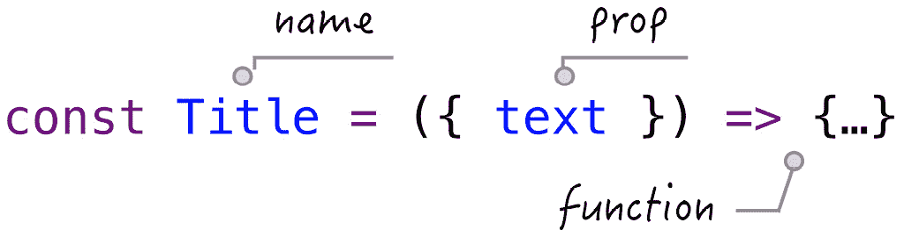

# 第一章：介绍函数组件

在本章中，我们将首先简要介绍过去二十年中开发的*UI*组件的历史，并了解*React*如何使用*UI*组件来构建应用。你将学习函数组件是什么，以及它的 props 和基本的父子关系。然后，你将获得一些关于如何编写函数组件的技巧。最后，你将看到一个实际的函数组件示例，`Nav`。本章还包括附录部分的一个额外主题：*React 支持多少种组件类型？*

本章我们将涵盖以下主题：

+   *UI*组件的历史

+   使用组件构建应用

+   介绍函数组件

+   编写函数组件

+   函数组件的示例

+   问答

+   附录

# UI 组件的历史

当我们对技术感到着迷时，观察它随着时间的推移缓慢演变也可能很有趣。在我们的案例中，是*HTML*。从表面上看，它似乎在过去 20 年里没有发生变化。你可以通过比较现在编写的典型网页代码与 20 年前编写的代码，并看到它们看起来非常相似，如果不是完全相同的话，来得到这个想法。

以下代码片段显示了典型的*HTML*页面代码的样子：

```js
<HTML>
  <head>
    <meta charset="utf-8">
  </head>
  <style>
    h1 { color: red; }
  </style>
  <script>
    console.log('start...')
  </script>
  <body>
    <h1>Hello World</h1>
  </body> 
</HTML>
```

我们这些在这个行业工作很长时间的人都知道，网络已经被重塑了几次。特别是，大量的努力被投入到如何生成前面的*HTML*。

网页工程师们试图将文件分成多个部分，包括*HTML*、*JavaScript*和*CSS*，然后在文件在屏幕上渲染时将其重新组合。他们还尝试在服务器上加载一个或两个部分，其余部分在客户端计算机上加载。他们还尝试了各种编译器或构建器，在源代码每次更改后自动生成文件。他们尝试了很多事情。实际上，关于*HTML*的几乎所有你能想到的事情在过去都尝试过几次，而且人们不会因为别人尝试过而停止尝试。从某种意义上说，网络技术时不时地被重新发明。

随着每天向网络添加大量新内容，工程师们发现*HTML*文件有点难以管理。一方面，需求是用户希望看到更多可操作的项目，并希望有更快的响应，另一方面，屏幕上的许多可操作项目给工程师管理工作量并维护代码库带来了挑战。

因此，工程师们一直在寻找更好的方法来组织*HTML*文件。如果这种组织方式得当，它可以帮助他们不被屏幕上众多元素所淹没。同时，良好的文件组织意味着可扩展的项目，因为团队可以将项目分解成更小的部分，并以分而治之的方式逐一工作。

让我们回顾一下使用 *JavaScript* 的技术是如何帮助这些主题的历史。我们将在这个对话中选择四种技术 – *jQuery*、*Angular*、*React* 和 *LitElement*。

## jQuery

*jQuery* 是一个用于操作屏幕上 **Document Object Model** (**DOM**) 元素的库。它认识到直接与 *DOM* 一起工作的挑战，因此提供了一个实用层来简化查找、选择和操作 *DOM* 元素的语法。它于 2006 年开发，自那时以来已被数百万个网站使用。

关于 *jQuery* 的好处是，它可以通过使用著名的 `$` 符号在它周围创建包装器来与现有的 *HTML* 一起工作，如下面的代码所示：

```js
$(document).ready(function(){
  $("button").click(function(){
    $(this).css("background-color", "yellow");
    $("#div3").fadeIn(3000);
    $("#p1").css("color", "red")
      .slideUp(2000)
      .slideDown(2000);
  });
});
function appendText() {
  var txt1 = "<p>Text.</p>";       
  var txt2 = $("<p></p>").text("Text.");
  var txt3 = document.createElement("p");
  txt3.innerHTML = "Text.";
  $("body").append(txt1, txt2, txt3);
}
```

*jQuery* 在改变元素的颜色、字体或任何运行时属性方面没有太多竞争。它使得将大量业务逻辑代码组织成存储在多个文件中的函数成为可能。它还通过当时的某个插件提供了一种模块化的方式来创建可重用的 UI 小部件。

在当时，强烈倾向于在 *HTML* 和 *JavaScript* 之间实现完全分离。当时，人们认为这种方式做事有助于提高生产力，因为处理网站样式和行为的人可以来自两个部门。主题化，这个词描述了将样式应用于网站的方式，正在变得流行，一些工作正在寻找能够使网站看起来像 Photoshop 设计的开发者。

## Angular

*Angular* 是一个用于开发 **Single-Page Application** (**SPA**) 的网络框架。它由 *Google* 于 2010 年发明。在当时，它相当革命性，因为你可以用它来构建前端应用程序。这意味着在 *Angular* 中编写的代码可以在运行时接管 *HTML* 的主体，并对其中所有元素应用逻辑。所有代码都在浏览器级别运行，导致“前端”这个词开始在简历上出现。从那时起，网络开发者大致分为“后端”、“前端”和“全栈”（这意味着前端和后端）。

*Angular* 使用的代码继续通过附加额外的标签来构建在现有的 *HTML* 上，如下所示：

```js
<body>
  <div ng-app="myApp" ng-controller="myCtrl">
    <p>Name: <input type="text" ng-model="name" /></p>
  </div>
  <script>
    var app = angular.module('myApp', []);
    app.controller('myCtrl', function($scope) {
      $scope.name= "John";
    });
  </script>
</body>
```

*Angular* 引入的控制器和模块可以为具有独特作用域的 *HTML* 部分注入业务逻辑。*Angular* 默认支持组件和指令，这使得我们可以在单个文件中引用所有相关的 *HTML* 和 *JavaScript*（尽管 *HTML* 文件仍然需要单独编写）：

```js
function HeroListController($scope, $element, $attrs) {
  var ctrl = this;
  ctrl.updateHero = function(hero, prop, value) {
    hero[prop] = value;
  };
  ctrl.deleteHero = function(hero) {
    var idx = ctrl.list.indexOf(hero);
    if (idx >= 0) {
      ctrl.list.splice(idx, 1);
    }
  };
}
angular.module('heroApp').component('heroList', {
  templateUrl: 'heroList.html',
  controller: HeroListController
});
```

通过 Angular 创建的组件可以在之后在 HTML 文件中重用。

## React

*React*，也称为 *React.js*，由 *Facebook* 开发并于 2013 年发布，是一个用于构建 *UI* 组件的 *JavaScript* 库。尽管它并没有被特别宣传为一个网络框架，但开发者们已经用它来构建单页或移动应用，特别是受到了初创公司的青睐。

当时的争议在于它如何处理 *HTML* 语句。它并没有将它们留在 *HTML* 文件中，而是实际上要求将它们移出，并放在组件的 `render` 函数下，如下所示：

```js
<div id="root"></div>
<script type="text/babel">
  class App extends React.Component {
    render() {
      return <h1>Hello World</h1>
    }
  }
  ReactDOM.render(App, document.getElementById('root'));
</script>
```

这种独特的方法比 *HTML* 文件的完整性更倾向于组件设计。这几乎是第一次你可以在同一个文件下将 *HTML* 和 *JavaScript* 一起使用。我们在这里称之为 *HTML*，因为它看起来像 *HTML*，但实际上 *React* 创建了一个包装器，将 *HTML* 转换为 *JavaScript* 语句。

当 *React* 被引入时，它附带了一个类组件，并在 2015 年增加了对函数组件的支持，因此你可以将逻辑写在函数而不是类中：

```js
<script type="text/babel">
  const App = function() {
    return <h1>Hello World</h1>
  }
</script>
```

使用 *React*，*HTML* 文件不像以前那样经常被修改；事实上，它们根本就没有改变，因为所有的 *HTML* 内容都被重新定位到了 *React* 组件中。这种做法今天仍然可能引起争议，因为那些不关心 *HTML* 位置的人会很容易地接受，而那些关心传统 *HTML* 编写方式的人则会保持距离。这里也有一个心态的转变；使用 *React*，*JavaScript* 成为了网络开发的焦点。

## LitElement

*Polymer* 由 *Google* 开发并于 2015 年发布，旨在使用网络组件构建网络应用。2018 年，*Polymer* 团队宣布任何未来的开发都将转移到 *LitElement* 以创建快速和轻量级的网络组件：

```js
@customElement('my-element')
export class MyElement extends LitElement {
  ...
  render() {
    return html`
      <h1>Hello, ${this.name}!</h1>
      <button @click=${this._onClick}>
        Click Count: ${this.count}
      </button>
      <slot></slot>
    `;
  }
}
```

*React* 和 *LitElement* 之间有很多相似之处，因为它允许你使用 `render` 函数定义一个类组件。*LitElement* 的独特之处在于，一旦元素被注册，它可以像 DOM 元素一样行为：

```js
<body>
  <h1>Hello World</h1>
  <my-element name="abc">
    <p>
      Let's get started.
    </p>
  </my-element>
</body>
```

将 *LitElement* 集成到 *HTML* 中没有明显的入口点，因为它在使用之前不需要控制 `body` 元素。我们可以在其他地方设计该元素，当它被使用时，它更像是一个 `h1` 元素。因此，它在保持 HTML 文件完整性的同时，将额外的功能外包给其他可以设计的自定义元素。

*LitElement* 的目标是让网络组件在任何框架中的任何网页上都能工作。

20 年前，我们不知道网络会变成什么样。从对 *jQuery*、*Angular*、*React* 和 *LitElement* 的简要历史回顾中可以看出，一个拥有 *UI* 组件的想法已经出现。一个组件，就像一块乐高积木，可以做到以下事情：

+   将功能封装在内

+   可在其他地方重用

+   不会损害现有网站

因此，当我们使用组件时，它采用以下语法：

```js
<component attr="Title">Hello World</component>
```

实际上，这与我们开始编写 *HTML* 的地方并没有太大的不同：

```js
<h1 title="Title">Hello World</h1>
```

这里对组件有一个隐藏的要求。虽然组件可以单独设计，但最终它们必须组合起来以实现更高的目的，即完成网站的构建。因此，尽管每个组件都是原子的，但仍需要一个通信层来允许块之间进行通信。

只要组件正常工作并且它们之间有通信，应用程序就可以作为一个整体运行。这实际上是组件设计和构建网站时的一个假设。

那么，我们的书属于哪个类别呢？我们的书是关于在 *React* 下构建组件，特别是构建可以作为可重用块使用的智能组件，并且能够适应应用程序。我们在这里选择的技术是函数组件内部的 hooks。

在我们深入组件和 hooks 的细节之前，让我们先简要地看看组件是如何组合起来构建一个应用程序的。

# 使用组件构建应用程序

要开始构建应用程序，以下是一个你可以开始的 *HTML* 块：

```js
<!doctype HTML>
<HTML lang="en">
  <body>
    <div id="root"></div>
  </body>  
</HTML>
```

现在，我们越来越多地使用 **SPAs** 来动态更新页面的一部分，这使得使用网站的感觉就像是一个原生应用程序。我们追求的是快速响应时间。JavaScript 是实现这个目标的语言，从显示用户界面到运行应用程序逻辑以及与网络服务器通信。

要添加逻辑，React 会接管 HTML 的一部分来启动一个组件：

```js
<script>
  const App = () => {
    return <h1>Hello World.</h1>
  }
  const rootEl = document.getElementById("root")
  ReactDOM.render(<App />, rootEl)
</script>
```

在前面的代码中，由 `ReactDOM` 提供的 `render` 函数接受两个输入参数，这两个参数是一个 *React* 元素和一个 *DOM* 元素 `rootEl`。`rootEl` 是你希望 *React* 渲染的地方，在我们的例子中，是一个带有 `root` ID 的 *DOM* 节点。*React* 在 `rootEl` 上渲染的内容可以在一个函数组件 `App` 中找到定义。

在 *React* 中区分 `App` 和 `<App />` 是很重要的。`App` 是一个组件，必须有一个定义来描述它能做什么：

```js
  const App = () => {
    return <h1>Hello World</h1>
  }
```

`<App />` 是 `App` 组件的一个实例。一个组件可以创建很多实例，这与大多数编程语言中类的实例非常相似。从组件中创建实例是可重用的第一步。

如果我们在浏览器中运行前面的代码，我们应该看到它显示以下 **Hello World** 标题：


图 1.1 – Hello World

Playground – Hello World

你可以自由地在这个例子上在线玩耍：[`codepen.io/windmaomao/pen/ExvYPEX`](https://codepen.io/windmaomao/pen/ExvYPEX)。

要有一个完全功能的应用程序，通常我们需要多个页面。让我们看看第二个页面。

## 多页面

构建一个 `"Hello World"` 组件是第一步。但这样一个单独的组件是如何支持多个页面，以便我们可以从一个页面导航到另一个页面的呢？

假设我们有两个页面，都在组件中定义，分别是 `Home` 和 `Product`：

```js
const Home = () => {
  return <h1>Home Page</h1>
}
const Product = () => {
  return <h1>Product Page</h1>
}
```

要显示 `Home` 或 `Product`，我们可以创建一个辅助组件：

```js
const Route = ({ home }) => {
  return home ? <Home /> : <Product />
}
```

前面的 `Route` 组件略有不同；它携带一个从函数定义中传入的输入参数 `home`。`home` 包含一个布尔值，根据它，`Route` 组件可以在显示 `<Home />` 或 `<Product />` 之间切换。

现在的问题是要确定 `App` 中的 `home` 的值：

```js
const App = () => {
  const home = true
  return <Route home={home} />
}
```

在前面的代码中，`App` 组件被修改以包含一个 `home` 变量，该变量被传递给 `Route` 组件。

你可能已经注意到，当前的代码只会显示首页，因为我们已经将 `home` 设置为 `true`。不用担心，整本书都是关于教你如何设置 `home` 值的。现在，只需想象根据用户的鼠标点击，`home` 的值会从 `true` 切换到 `false`，暂时你可以手动更改 `home` 的值。

随着 `App` 组件下添加越来越多的组件以及这种路由机制，`App` 组件可以变得更大。这也是为什么在 *React* 应用程序中第一个组件被命名为 `App` 的部分原因。虽然你可以随意命名，但请记住，第一个字母要大写。

操场 – 首页

欢迎在线尝试这个示例：[`codepen.io/windmaomao/pen/porzgOy`](https://codepen.io/windmaomao/pen/porzgOy)。

现在，我们可以看到 *React* 是如何组合一个应用的，所以无需多言，让我们直接进入 *React* 的组件。

*React* 主要支持两种组件类型——类组件和函数组件。本书将专注于函数组件。如果你对其他组件类型感兴趣，请查看本章末尾的 *附录 A – React 支持多少种组件类型？* 部分。

# 介绍函数组件

“这种模式旨在鼓励创建这些简单的组件，这些组件应该构成你应用程序的大部分。” – Sophie Alpert

在本节中，我们将向您介绍函数组件。当函数组件首次在 2015 年 8 月的 React 0.14 版本中引入时，它被命名为无状态纯函数：

```js
function StatelessComponent(props) {
  return <div>{props.name}</div>
}
```

主要目的是“无状态的纯函数组件给我们提供了更多的性能优化机会。”

默认情况下，没有状态的函数组件被设计成以下函数形式：



图 1.2 – 函数组件定义

我们将在下一小节中详细探讨函数组件的各个部分。

## 函数属性

这个函数的输入参数被称为道具。道具采用一个对象格式，我们可以定义任何属性。每个属性都被称为道具。例如，*图 1.2* 定义了一个带有 `text` 道具的 `Title` 组件。

因为道具是对象，所以没有限制可以定义多少个道具在该对象下：

```js
const Title = ({ name, onChange, on, url }) => {...}
```

道具（prop）的工作，类似于输入参数，是将一个值传递给函数。在道具的类型上也没有限制。由于每个道具都是对象的属性，它可以是一个字符串、一个数字、一个对象、一个函数、一个数组，或者任何可以用 *JavaScript* 表达式赋值的任何东西，如下面的例子所示：

```js
const Title = ({ obj }) => {
  return <h1>{obj.text}</h1>
}
const Title = ({ fn }) => {
  return <h1>{fn()}</h1>
}
```

在前面的代码中，第一种情况传递了一个带有 `text` 属性的 `obj` 道具，而第二种情况传递了一个在内部调用的 `fn` 道具。

一旦定义了一个函数组件，就可以通过其实例在其他地方多次使用：

```js
const App = () => {
  return <Title text="Hello World" />  
}
```

在前面的代码中，在 `App` 组件的定义中使用了 `Title` 组件实例。

当 `App` 组件更新时，一个字符串 `"Hello World"` 被分配给 `Title` 组件的 `text` 道具。`Title` 组件的使用让我们想起了 *HTML* 语句，而 `text` 道具让我们想起了 *DOM* 元素的属性。

我们实际上在开始时也看到了 `App` 组件实例的使用：

```js
  ReactDOM.render(<App />, rootEl)
```

简而言之，你可以定义一个组件，但要看到它在屏幕上显示的内容，需要使用其实例。

## 子道具

函数组件的所有道具都应该像输入参数一样明确定义。但是，有一个值得早期了解的道具，它并不遵循这个规则。这被称为 `children` 道具：

```js
const App = () => {
  return (
    <Title>
      Hello World
    </Title>
  )  
}
```

你可能在使用前面的代码时并不知道 `"Hello World"` 字符串是如何被连接到 `Title` 组件的。有趣的是，这个字符串是通过 `children` 道具连接到组件的。当我们到达 `Title` 组件的定义时，这会变得清楚：

```js
const Title = ({ children }) => {
  return <h1>{children}</h1>
}
```

实际上，`App` 组件在定义之前将 `"Hello World"` 分配给 `children` 道具，然后调用 `Title` 组件实例。你可能想知道如果我们忘记在定义 `Title` 组件时包含 `children` 道具会发生什么：

```js
const Title = () => {
  return <h1>Haha, you got me</h1>
}
```

在那种情况下，`"Hello World"` 被忽略，`App` 组件简化为以下情况：

```js
const App = () => {
  return <Title />
}
```

显然，这不是预期的，因为如果你在组件下放置子元素，那么在函数定义中必须明确定义 `children` 道具。这意味着 `children` 道具仍然需要在函数接口上明确写出。

事实上，`children` 道具是组件可以嵌套在其他组件下的原因。*React* 使用这个 `children` 机制来重现 *HTML* 通常是如何编写的。

## 父亲和子组件

在 *React* 中，props 是组件之间通信的机制。我们可以通过使用两个通常参与通信的组件——父组件和子组件——来概括这个想法，正如我们在 `App` 和 `Title` 中已经看到的那样：

```js
const Title = ({ text }) => {
  return <h1>{text}</h1>
}
const App = ({ flag }) => {
  const text = flag ? "Hello" : "World"
  return <Title text={text} />
}
```

在前面的例子中，`Title` 组件接受 `text` 作为其 props 之一。如果标志 `flag` 为 `true`，则 `App` 组件将 `"Hello"` 文本发送到 `Title` 组件，否则，它将 `"World"` 文本发送到 `Title`。

谁将 `flag` 信息发送到 `App` 组件？那将是 `App` 的父组件。这可以很容易地构建成一个树，其中我们有分支和子分支，并且它延伸到末端的叶子。请注意，这种结构完全是通过在每个节点（组件）上使用 props 来实现的。

一旦信息进入一个组件，prop 就将其值绑定到一个局部作用域变量上。从那时起，管理局部变量的任务就落在了子组件身上。它可以相当灵活地使用，但有一个限制。它不应该被改变！或者，如果你改变了它，这个变化就不会反映在父组件中。这种行为与我们在使用带有输入参数和其内部作用域的函数时的行为相同。信息传递是一张单程票。

现在出现了一个大问题。如果我们想反映子组件对父组件所做的更改，怎么办？如何让一张单程票带回来信息？

这也是通过一个 prop 来实现的。正如我提到的，prop 可以采用任何格式，因此我们可以使用一个函数 prop：

```js
const Child = ({ change }) => {
  const onChange = () => {
    change()
  }
  return <input onChange={onChange} />
}
const Parent = () => {
  const change = () => {
    console.log("child notify me")
  } 
  return <Child change={change} />
}
```

在前面的代码中，我们通过 `change` prop 发送了在 `Parent` 中定义的函数。在 `Child` 组件内部，当用户开始在 `input` 框中输入任何字符时，它会触发一个 `onChange` 事件，我们可以在其中调用 `change` 函数。每次发生这种情况时，你都会在 `Parent` 组件中看到`child notify me`的消息。

实质上，这种技术就是我们所说的 JavaScript 中的回调。父组件通过使用回调函数提供了一种通知更改的机制。一旦创建了回调函数，它就可以发送给任何子组件，以获得通知父组件的能力。

在 *React* 中的典型父/子关系中，建议子组件不应该更改 prop 的值。相反，应该通过函数 prop 来完成。当将 *React* 与其他库进行比较时，我们用“单程票”来指代这种行为。在 *React* 社区中，我们很少使用这个词，因为这是从其诞生起就设计好的行为。

既然我们已经知道了函数组件的定义以及 props 在构建组件中的作用，让我们看看通常我们是如何编写一个函数组件的。

# 编写函数组件

函数，代表一个组件，定义了屏幕上要更新的内容。它返回一个由一些类似 *HTML* 的代码组成的值。你应该非常熟悉 `<ul>` 和 `<li>` 等元素；*React* 还允许在这些元素下添加 *JavaScript* 表达式。当它们一起使用时，需要将 *JavaScript* 表达式包裹在一对括号 `{}` 中。这个表达式的任务是提供动态 *HTML* 内容。

例如，如果我们有一个 `text` 变量并希望显示它，我们可以这样做：

```js
const Title = () => {
  const text = "Hello World1"
  return <h1>{text}</h1>
}
```

或者，如果文本是从函数返回的，我们可以这样做：

```js
const Title = () => {
  const fn = () => "Hello World"
  return <h1>{fn()}</h1>
}
```

我们知道这个 *JavaScript* 表达式是填充在 `children` 属性的位置。

子元素不一定要是一个单独的元素；它也可以是一个元素数组：

```js
const Title = () => {
  const arr = ['Apple', 'Orange']
  return (
    <ul>
      {arr.map((v) => (
        <li>{v}</li>
      ))}
    </ul>
  )
}
```

在前面的代码中，这似乎有点复杂，所以让我们先看看代码试图通过查看结果来实现什么：

```js
  return (
    <ul>
      {[<li>Apple</li>, <li>Orange</li>]}
    </ul>
  )
```

基本上，它想要输出两个 `li` 元素。为了达到这个目的，我们使用一个 *JavaScript* 表达式创建一个包含两个元素的数组。一旦它变成了括号 `{}` 包裹的 *JavaScript* 表达式，任何 *JavaScript* 中的内容都可以被重构和编程，就像我们想要的那样。我们可以使用 `arr.map` 来形成这个数组：

```js
      {['Apple', 'Orange'].map(v => (
        <li>{v}</li>
      ))}
```

代码重构做得很好！

在前面的陈述中展示了如此多的不同括号，包括 `{}`, `[]` 和 `()`。因此，请随意花一点时间来理解每一对括号的作用。难以相信在 *React* 中写作的一个挑战就是括号。

这是一个很好的例子，展示了当你将事物包裹在 *JavaScript* 表达式中时，它们可以被重构，就像我们通常编程那样。在这种情况下，由于 `arr` 是一个常数，不需要在 `Title` 组件内部定义，我们可以将 `arr` 提取到函数外部：

```js
const arr = ['Apple', 'Orange']
const Title = () => {
  return (
    <ul>
      {arr.map((v) => (
        <li>{v}</li>
      ))}
    </ul>
  )
}
```

一旦你习惯了使用 JavaScript 表达式和类似 HTML 的代码，迟早你会发展出自己的编程风格，因为在这个练习背后是 JavaScript 语言。

现在你已经了解了这个过程，让我们一起来编写一个示例代码。

# 函数组件示例

一个网站由页面组成，其中每个页面包含一个侧边栏、一个页眉、一个内容区域和一个页脚。所有这些都可以用组件来建模。布局组件可以位于树的顶部。当你放大时，你会发现在其内部有子结构。就像蜘蛛网（参见 *图 1.3*）一样，树结构从外层级级联到内层级。


图 1.3 – 网络应用程序布局

作为*UI*工程师，我们专注于每个组件的设计。此外，我们非常关注组件之间的关系。我们想知道`Title`是否在主要内容或侧边栏内部构建。我们想知道是否需要多个页面共享标题。你将开始掌握在组件树之间导航的技能。

假设我们想在页面顶部显示一组导航链接。如果需要，每个链接都可以被禁用。对于启用的链接，我们可以点击它导航到相应的*URL*。参见*图 1.4*：

![Figure 1.4 – Nav component]

![Figure 1.04_B17963.jpg]

图 1.4 – Nav 组件

导航链接可以预先定义在一个链接对象的数组中：

```js
const menus = [
  { key: 'home', label: 'Home' },
  { key: 'product', label: 'Product' },
  { key: 'about', label: 'About' },
  { key: 'secure', label: 'Secure', disabled: true },
]
```

在前面的每个链接中，`key`属性提供了一个标识符，`label`属性指定了显示的标题，而`disabled`属性表示用户是否可以点击它。

我们还希望在当前选中的链接下方显示一条线。基于这些要求，我们提出了带有`selected`和`items`属性的实现：

```js
const Nav = ({ selected, items }) => {
  const isActive = item => item.key === selected
  const onClick = item => () => { 
    window.location.href = item.url
  }
  return ...
}
```

在前面的`Nav`组件中，`items`属性包含链接列表，而`selected`属性包含当前选中项的键。`Nav`组件的职责是显示列表：

```js
  return (
    <ul>
      {items.map(item => (
        <li
          key={item.key}
          className={isActive(item) ? 'active' : ''}
        >
          <button
            disabled={item.disabled}
            onClick={onClick}
          >
            {item.label}
          </button>
        </li>
      ))}
    </ul>
  )
```

在前面的`return`语句中，`items`通过循环逐个迭代，并使用`ul/li`结构显示链接。每个链接都显示为一个支持`disabled`属性的按钮。如果它是当前选中的链接，它还会标记链接的*CSS*类为`active`。

注意每个项目中的`key`属性。这个属性对于*React*来说，是必须的，因为它能知道列表中每个`li`元素的位置。有了提供的唯一标识符，*React*可以快速找到正确的元素来执行比较和更新屏幕。当返回一个元素数组时，`key`是一个必备的属性。

操场 – Nav 组件

欢迎在线尝试这个示例：[`codepen.io/windmaomao/pen/porzQjV`](https://codepen.io/windmaomao/pen/porzQjV)。

现在，我们可以使用以下行显示`Nav`。哇哦：

```js
<Nav items={menus} selected="home" /> 
```

为了使每个菜单项易于开发和维护，我们可以提取行以形成一个单独的组件：

```js
const NavItem = ({
  label, active, disabled, onClick
}) => (
  <li className={active ? 'active' : ''}>
    <button disabled={disabled} onClick={onClick}>
      {label}
    </button>
  </li>
)
```

在前面的代码中，创建了一个`NavItem`组件来接受`label`、`active`、`disabled`和`onClick`属性。我们不需要过度思考这些属性名，因为它们自然地来源于前面的`Nav`组件。我们可以将`NavItem`重新插入到`Nav`中：

```js
const Nav = ({ selected, items }) => {
  const isActive = item => item.key === selected
  const onClick = item => () => { 
    window.location.href = item.url
  }

  return (
    <ul>
      {items.map(item => (
        <NavItem 
          key={item.key}
          label={item.label}
          disabled={item.disabled}
          active={isActive(item)}
          onClick={onClick(item)}
        />
      ))}
    </ul>
  ) 
}
```

这种重构练习相当常见且有效。这样，`Nav`和`NavItem`组件在未来的维护中都会变得更加容易。

# 摘要

在本章中，我们首先通过查看四个库——*jQuery*、*Angular*、*React*和*LitElement*——来回顾 UI 组件的历史，以了解组件的概念以及组件是如何组合在一起来构建应用的。然后，我们学习了函数组件是什么，以及对其属性和父子关系的介绍。接着，我们学习了如何一般性地编写函数组件，最后我们逐步构建了一个`Nav`组件。

在下一章中，我们将从头开始构建函数组件的状态，并看看动作如何从中受益。

# 问题与答案

这里有一些问题和答案来刷新你的知识：

1.  什么是函数组件？

    函数组件是一个函数，它以属性作为输入参数，并返回元素。对于一个`App`组件，我们可以通过其实例形式`<App />`来显示它。构建一个应用，就是将一个组件作为子组件放在另一个组件下面，并不断优化这个过程，直到我们最终得到一个组件树。

1.  你该如何编写一个函数组件？

    要熟练编写函数组件的方法与编写函数的方法非常相似。问问自己组件的属性规范是什么，以及返回给显示的内容是什么。在一个典型的应用中，大约有一半的组件是为业务需求设计的，但另一半通常来自代码重构。对**函数式编程**（**FP**）的研究通常对你有益，并能将你的 UI 技能提升到下一个层次。

# 附录

## 附录 A – React 支持多少种组件类型？

在发布的*React*文档中，它支持两种组件类型。一种是一个函数组件，另一种是一个类组件。*React*从一开始就支持类组件：

```js
class ClassComponent extends React.Component {
  render() {
    const { name } = this.props;
    return <h1>Hello, { name }</h1>;
 }
}
```

尽管类组件的`render`函数看起来与函数组件返回的内容非常相似，而且大多数时候我们可以在它们之间进行转换，但在*React*的更新过程中，类组件和函数组件的处理方式是不同的。因此，这本书有意避免提及类组件，以免混淆任何新接触*React*的新手。

通常情况下，函数组件可以写得更短、更简单，在开发和测试方面也更加容易，因为它只有简单的输入和输出。此外，它没有`this`关键字，这可能会让新开发者甚至有时是资深开发者感到畏惧。然而，使用函数组件的缺点是它在编程世界中相对较新，而且从**面向对象编程**（**OOP**）到**函数式编程**（**FP**）的心态转变可能会让你感到压力，如果你没有做好准备的话。更不用说，作为新事物，可能存在不同的方法，我们需要在解决旧问题之前学习和吸收这些方法。

除了类和函数组件之外，内部实际上*React*支持更多组件类型，如下例所示：

```js
import { memo } from 'react'
const Title = memo(() => <h1>Hello</h1>)
const App = () => <Title />
```

当`memo`函数应用于`Title`组件时，它创建了一个具有组件类型`MemoComponent`的组件。我们不需要深入了解这些组件类型的细节，但只需知道，每个组件类型在更新到屏幕时都会获得自己的更新算法。
