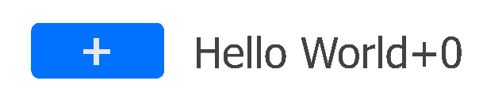
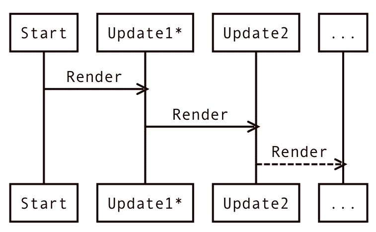
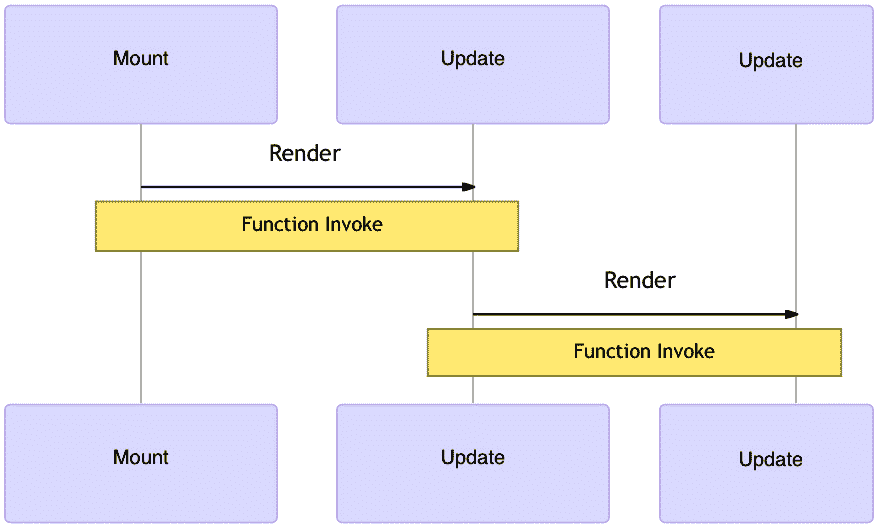
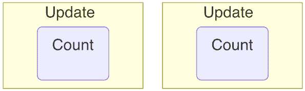
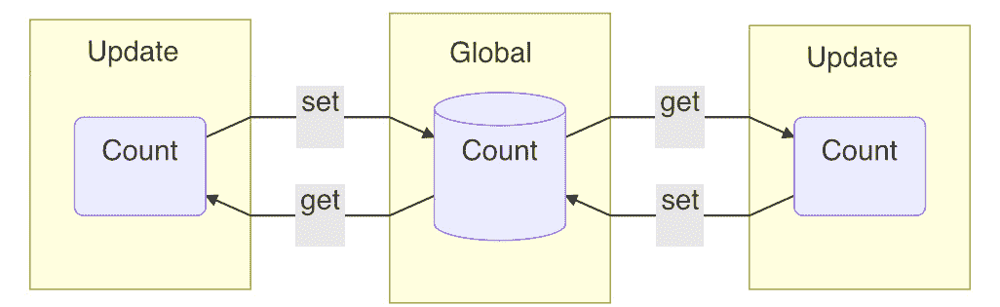
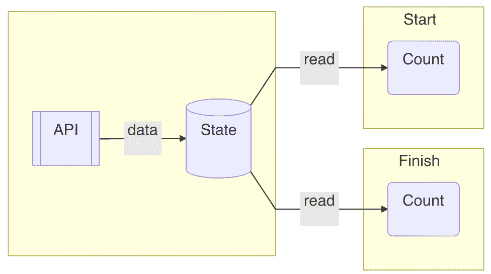
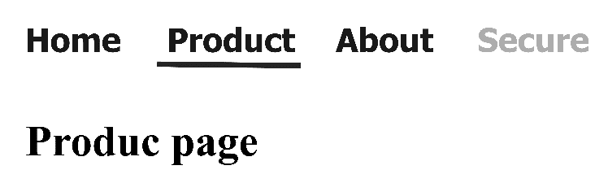
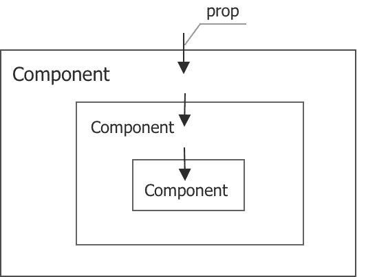
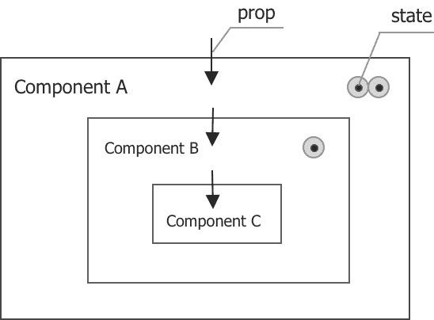

# 第二章：在函数中构建状态

在上一章中，我们学习了如何用 *React* 编写函数组件。在本章中，我们将在函数组件中构建一个特殊变量，称为状态。我们将看到状态能给我们带来什么好处，包括请求新的更新、使变量持久化、监听值的变化，以及在挂载时执行任务。我们还将看到一个将状态应用于单页应用程序的例子。最后，我们将仔细研究状态在 *UI* 中扮演的角色。

本章我们将涵盖以下主题：

+   在函数组件中构建状态

+   将状态应用于单页应用程序

+   状态如何与 UI 一起工作

+   问题和答案

# 技术要求

在开始之前，我想让你了解一下时间线草图：

```js
|--x---x---x-x--x--x------> user event
```

时间线草图是一种独特的图表类型，它显示了一个时间段内的一系列事件。左侧的条（`|`）代表时间起点，表示第一次更新。水平破折号（`-`）随时间从左向右移动，并在末尾有一个箭头 `>`。每个字母或数字，如 `x`，表示在这个时间线中发生的一个事件。在这本书中，我们将使用时间线草图来更好地理解在时间线上同时发生多个事件的情况。

# 在函数组件中构建状态

当你访问一个典型的网页时，它会要求你输入用户名和密码。登录后，它会按时间顺序显示网站提供的内容，如博客、推文或视频。你可以对它们进行投票并在那里发表评论——这是当今非常典型的网络体验。

当你作为一个用户浏览这样的网站时，你不会过多地思考任何动作是如何实现的，也不会关心每个动作被触发的顺序。然而，当你自己构建网站时，每个动作以及每个动作被触发的时机开始变得重要。

当用户点击按钮、悬停在图标上、向下滚动段落、在键盘上输入等动作时，会触发动作处理程序。用户事件和动作处理程序之间的一种典型关系如下所示：

```js
|--x---x---x-x--x--x------> user event
|--a---a---a-a--a--a------> action handler
```

在前面的草图中，基本上，`user event` 系列中的一个 `x` 后面跟着 `user event` 系列中的一个 `a`。基于此，我们可以开始处理用户动作。

让我们转向一个包含按钮的 "Hello World" `Title` 组件。每次我们点击按钮，计数器就会增加一，并附加在 **Hello World+** 之后，如图 *图 2.1* 所示：



图 2.1 – 无状态的 Hello World

为了实现这一点，我们从一个初始化为 `0` 的 `count` 变量开始：

```js
function Title() {
  let count = 0  
  const onClick = () => {
    count = count + 1
  }
  return (
    <>
      <button onClick={onClick}>+</button>
      <h1>Hello World+{count}</h1>
    </>
  )
}
```

在前面的 `Title` 组件中，用户点击的响应是通过一个 React 事件处理程序 `onClick` 实现的，该处理程序连接到一个 `button` 元素。

*React*事件处理器的编写方式略不同于*DOM*事件处理器。你可以从`onClick`驼峰命名法中看出，而不是`onclick`小写名称。*React*事件是一个跨浏览器的合成事件，它是对浏览器原生事件的包装。在这本书中，我们希望它们的行为完全相同。

多亏了*JavaScript*闭包，我们可以在事件处理程序中直接访问任何组件变量。`count`变量不需要作为函数输入参数传递给`onClick`以供访问。

如果我们运行代码，我们预计标题会显示`console.log`到两个位置。

一个放在`count = count + 1`之前，以确认增量后的`count`值。另一个放在`return`语句之前，以确认当`Title`组件更新时的更新后的`count`值。它们在以下代码中标记为➀和➁：

```js
function Title() {
  let count = 0
  const onClick = () => {
    console.log('clicked', count)      ➀
    count = count + 1
  }
  console.log('updated', count)        ➁
  return ...
}
```

放置这两个日志后，我们可以重新运行代码并生成一个新的时间线草图：

```js
|----0--1-2--3-4----5------> clicked   ➀
0--------------------------> updated   ➁
```

从前面的打印输出中，➀处的`clicked`系列显示了按钮点击时的`count`数字，并且它被点击了六次。让我们转向另一个日志，➁处的`updated`系列；`count`值更新了一次，值为`0`，这解释了为什么显示仍然是`Hello World+0`。

只有在最初打印一次的`updated`系列表明在第一个更新之后没有更多的更新。这是一个相当大的发现。如果没有更多的更新，我们怎么能期待在屏幕上看到变化呢？

操场 – 无状态

您可以免费在此在线尝试此示例：[`codepen.io/windmaomao/pen/jOLNXzO`](https://codepen.io/windmaomao/pen/jOLNXzO).

正如你可能已经意识到的，点击后我们需要请求一个新的更新。

## 请求新的更新

为了进行更新，目前，我们可以借用*React*提供的`render`函数，因为我们已经用它来更新了`rootEl`元素：

```js
ReactDOM.render(<Title />, rootEl)
```

让我们花一分钟时间看看*React*通常是如何更新屏幕的（见*图 2.2*）。涉及更新的细节可能相当复杂；现在，让我们将其视为一个黑盒。我们将在本书的后面部分深入了解：



图 2.2 – React 更新

当一个应用启动时，它会进入一个更新。这个第一个更新有点特殊。因为所有 DOM 元素都需要被创建，所以我们把这个更新称为挂载。

需要知道的重要一点是，除非请求，否则不会到来新的更新，就像我们调用`render`函数一样。当人们第一次来到 React 时，他们可能会认为它像游戏引擎一样工作。

例如，一个游戏引擎会在幕后每 1/60 秒请求一个新的更新。但*React*并不这样做！相反，开发者应该精确控制何时请求新的更新。而且，大多数时候，频率要低得多，这更多或更少地取决于用户在网站上如何快速行动。

所以，为了将新的`count`值带到屏幕上，我们需要手动请求另一个更新；如果我们借用`render`，我们可以在`count`递增后使用它：

```js
  const onClick = () => {
    console.log('clicked', count)      ➀
    count = count + 1
    ReactDOM.render(<Title />, rootEl)
  }
```

如果我们在前面的代码中添加`render`，时间线草图将变为以下内容：

```js
|----0--0-0--0-0----0------> clicked   ➀
0----0--0-0--0-0----0------> updated   ➁
```

让我们惊讶的是，显示的所有数字都是`0`。查看`updated`系列在`➁`处，注意我们得到了七次打印，这意味着我们在第一次更新之上又进行了六次更新。然而，`clicked`系列在`➀`处显示，`count`值变为了`0`并停止了进一步的递增。奇怪吗？！

“`count`值怎么会卡在`0`呢？新的更新肯定发生了某些事情，但`render`函数不可能就是那个将`count`值重置回`0`的函数，对吧？”

重要的是要知道，当调用`render`函数并更新函数组件时，定义组件的函数会被调用，如图*图 2.3*所示：



图 2.3 – 函数组件的 React 渲染

带着这个知识，让我们再次看看`Title`函数：

```js
const Title = () => {
  let count = 0
  // omitting the onClick statement
  console.log('updated', count)       ➁
  // omitting the return statement
}
```

在前面的代码中，我们故意省略了`onClick`和`return`语句，以使代码更简洁。剩下的就是一个`let count = 0`声明语句。在每次更新中，`Title`函数都会被调用，从而创建一个新的函数作用域。在这个作用域内，有一个局部创建的`count`变量值，用来保存`0`这个数字。所以这段代码看起来似乎没有做什么。

现在不难看出为什么`count`值保持在`0`，不是吗？无论我们是否添加了`onClick`或`return`语句的逻辑，每次更新后，整个函数作用域都会获得一个新的作用域，其中`count`值被声明并设置为`0`。这解释了为什么`console.log`语句后面跟着打印的`0`。

这实际上就是为什么函数组件在最初被引入到*React*时被命名为无状态函数的原因。这里的“无状态”指的是函数组件不能携带或共享值到另一个更新。简单来说，函数在每次更新中都会以相同的输出重新运行。

好的，现在我们理解了问题。所以，这让我们考虑将`count`值保存在某个地方，并使其在另一个更新中持久化。

## 使值持久化

*JavaScript*支持函数作用域：在函数内部定义的变量不能从函数外部访问，因此每个函数都有自己的作用域。如果你多次调用一个函数，会有多个作用域。但无论我们调用多少次，它都不会创建不同的输出，就像电影* Groundhog Day*中发生的那样。

注意

电影* Groundhog Day*是一部 1993 年的奇幻喜剧片，其中菲尔每天醒来发现自己经历了前一天的事件重复发生，并相信他在经历似曾相识的感觉。

对于我们的`count`值，我们可以在*图 2.4*中可视化两次更新在两个不同作用域中发生的情况：



图 2.4 – 两次更新中的两个函数作用域

幸运的是，*JavaScript*以一种方式支持函数作用域，它可以访问定义在其定义作用域内的所有变量。在我们的情况下，如果一个变量在`Title`函数外部定义，我们可以在`Title`函数内部访问这个变量，因为这个值现在在多个`Title`函数之间是共享的。

分享的最简单方式是创建一个全局变量，因为全局变量位于*JavaScript*代码的最外层作用域，因此可以在任何函数内部访问。

注意

不要被本章中使用的全局变量吓倒。在*第三章*“Hooking into React”中，我们将完善这种方法，并看看*React*如何在一个更好的位置定义变量。

这样，每个局部`count`值都可以设置/获取这个全局`count`值，如图 2.5 所示：



图 2.5 – 两次更新之间的共享值

好吧，有了这个新的全局变量想法，让我们看看我们是否可以摆脱我们的*土拨鼠日*情况：

```js
let m = undefined
function _getM(initialValue) {
  if (m === undefined) {
    m = initialValue
  }
  return m
}
function _setM(value) { 
  m = value
  ReactDOM.render(<Title />, rootEl)
}
```

在前面的代码中，分配了一个全局变量`m`，它附带`_getM`获取器和`_setM`设置器方法。`_getM`函数返回值但设置第一次的初始值。`_setM`函数设置值并请求新的更新。让我们将`_getM`和`_setM`应用于我们的`Title`组件：

```js
function Title() {
  let count = _getM(0) 
  const onClick = () => {
    console.log('clicked', count)      ➀
    count = count + 1
    _setM(count)
  }
  console.log('updated', count)         ➁
  return ...
}
```

在前面的修改后的`Title`组件中，所有更新中的`count`变量都通过`_getM`和`_setM`的帮助相互链接。如果我们重新运行代码，我们可以看到以下时间线草图：

```js
|----0--1-2--3-4----5------> clicked   ➀
0----1--2-3--4-5----6------> updated   ➁
```

哇！第一次点击后屏幕变为`Hello World+1`，并且随着更多点击进一步增加，如图 2.6 所示：


图 2.6 – 使用状态的 Hello World 计数器

恭喜！你刚刚在函数组件中创建了一个状态。

操场 – 计数状态

欢迎在线尝试这个例子：[`codepen.io/windmaomao/pen/KKvPJdg`](https://codepen.io/windmaomao/pen/KKvPJdg)。

“状态”一词指的是它对所有更新都是持久的。为了方便起见，我们还在更改状态并随后请求新的更新以反映屏幕上的更改。

因此，现在我们知道了如何使用状态来处理用户操作。让我们看看我们是否可以将这个想法进一步扩展以支持多个状态而不是一个状态。

## 支持多个状态

能够在函数组件内建立持久状态真是太好了。但我们想要更多这样的状态。一个应用通常包含很多按钮、开关和可操作项；每个都需要持久状态。因此，支持同一应用中的多种状态是必须的。

假设我们需要两个按钮，每个按钮都需要由一个状态驱动。让我们扩展我们从单一状态中学到的知识：

```js
const Title = () => {
  let countH = _getM(0)
  let countW = _getM(0)
  const onClickH = () => {
    countH = countH + 1
    _setM(countH)
  }
  const onClickW = () => {
    countW = countW + 1
    _setM(countW)
  }
  return (
    <>
      <button onClick={onClickH}>+</button>
      <h1>Hello+{countH}</h1>
      <button onClick={onClickW}>+</button>
      <h1>World+{countW}</h1>
    </>
  )
}
```

在前面的代码中，我们首先创建了两个按钮，一个具有`onC1ickH`和`onClickW`，分别。我们还对它们应用了`_getM`和`_setM`，并在以下时间轴草图上安装了一些日志来帮助调试：

```js
|----0--1-2----------------> clickedH   
|------------3-4----5------> clickedW   
0----1--2-3--4-5----6------> updatedH   
0----1--2-3--4-5----6------> updatedW   
```

从前面的草图来看，我们点击了`updatedH`和`updatedW`系列。然而，这两个系列似乎是不可分割且同步的，这意味着点击一个按钮会同时增加两个值！

游戏场 – 链接状态

欢迎在线尝试此示例：[`codepen.io/windmaomao/pen/qBXWgay`](https://codepen.io/windmaomao/pen/qBXWgay).

好吧，找出我们实际上将相同状态连接到两个按钮上的错误并不难；难怪它们会同时更新：

```js
  let countH = _getM(0)
  let countW = _getM(0)
```

虽然这不是我们想要达到的效果，但看到两个按钮共享一个状态是很有趣的。从视觉上看，我们链接了两个按钮；点击一个会触发另一个的点击。

那么，如果我们想要有两个独立的状态，每个控制一个按钮，我们能做什么呢？嗯，我们只需添加另一个状态。这次，我们希望使用列表来更通用地存储任意数量的状态。

在 *JavaScript* 中跟踪一系列值的方法有很多；其中一种方法是在对象中使用键/值对：

```js
let states = {}
function _getM2(initialValue, key) {
  if (states[key] === undefined) {
    states[key] = initialValue
  }
  return states[key]
}
function _setM2(v, key) {
  states[key] = v
  ReactDOM.render(<Title />, rootEl)
}
```

在前面的代码中，我们声明了一个`states`对象来存储所有状态值。`_getM2`和`_setM2`函数几乎与之前我们制作的单一值版本相似，但这次我们是在`states[key]`下存储每个状态而不是`m`，因此需要一个`key`来识别每个状态。有了这个变化，让我们修改`Title`组件：

```js
function Title() {
  let countH = _getM2(0, 'H')
  let countW = _getM2(0, 'W')
  const onClickH = () => {
    console.log('clickedH', countH)     
    countH = countH + 1
    _setM2(countH, 'H')
  }
  const onClickW = () => {
    console.log('clickedW', countW)     
    countW = countW + 1
    _setM2(countW, 'W')
  }
  console.log('updatedH', countH)         
  console.log('updatedW', countW)          
  return ...
}
```

在前面的修改版本中，我们给两个状态分别赋予`H`和`W`作为键。当涉及到状态时，我们需要这个键来进行`set`和`get`操作。重新运行代码并查看时间轴草图：

```js
|----0--1-2----------------> clickedH  
|------------0-1----2------> clickedW  
0----1--2-3--3-3----3------> updatedH  
0----0--0-0--1-2----3------> updatedW  
```

再次点击，`countH`和`countW`实际上是分别增加的，正如你在`updatedH`和`updatedW`系列中看到的那样。

当我们点击“World”按钮时，`countH`在第一次点击后保持在`3`。这正是我们想要的结果，两个独立的状态，如图 2.7 所示：


图 2.7 – 具有两种状态的 Hello 和 World 按钮

游戏场 – 多种状态

欢迎在线尝试此示例：[`codepen.io/windmaomao/pen/dyzbaVr`](https://codepen.io/windmaomao/pen/dyzbaVr).

我们迄今为止构建的状态请求新的更新。这是在函数组件中使用持久性的一个好例子；因为持久性实际上是一个非常通用的功能，它应该被用于许多不同的目的。那么，我们还能用它做什么呢？让我们看看状态的另一种用法。

## 监听值变化

你可能会想知道为什么我们需要监听值变化。难道不是开发者控制值的改变吗？就像前面的例子一样，我们使用事件处理器来改变计数器。在这种情况下，我们知道值何时被更改。

对于这个案例来说，这是真的，但还有其他情况。你可能会通过属性将值发送到子组件，或者可能有两个组件同时接触一个值。在这两种情况下，你可能会失去跟踪值变化的那一刻，但你仍然想在值变化时执行操作。这意味着你想要有监听值变化的能力。让我们设置一个例子来演示这一点。

假设在我们的 `count` 变化中，我们想知道这个值是否最近被更改过：

```js
function Changed({ count }) {
  let flag = 'N'
  return <span>{flag}</span>
}
```

在前面的 `Changed` 组件中，有一个 `count` 属性是从其父组件发送的，比如说任何 `Y` 或 `N`，这取决于 `count` 值是否已更改。我们可以在 `Title` 组件中使用这个 `Changed` 组件：

```js
function Title() {
  ...
  return (
    <>
      <button onClick={onClickH}>+</button>
      <h1>Hello+{countH}</h1>
      <Changed count={countH} />
      <button onClick={onClickW}>+</button>
      <h1>World+{countW}</h1>
    </>
  )
}
```

注意，在前面的代码中，我们在两个按钮之间添加了 `Changed` 组件，我们想要看到的是当我们点击 `Changed` 组件时显示 `Y`，当我们点击 **World** 按钮时显示 `N`。本质上，我们想知道变化是否来自 **Hello** 按钮。但当我们运行代码时，在时间轴草图上我们得到了以下结果：

```js
0----1--2-3--3-3----3------> updatedH   
0----0--0-0--1-2----3------> updatedW   
N----N--N-N--N-N----N------> Changed flag
```

从前面的草图可以看出，无论哪个按钮被点击，`Changed flag` 系列中显示的 `flag` 都是 `N`。这并不令人惊讶，因为你可能已经注意到 `Changed` 组件内部的 `flag` 被固定在 `N`，所以它不会按我们想要的方式工作。但我们之所以在那里写 `N` 是因为我们不知道该写什么来翻转 `flag`。

当 `countH` 值，如在 `updatedH` 系列中，增加到 `3`。同样，当 `countW` 值，如在 `updatedW` 系列中，增加到 `3`。然而，请注意，随着 `countW` 值的增加，`countH` 值也会被打印出来；参见 `updatedH` 系列中的 `3-3-3`。

这表明对于每次更新，`return` 语句下的每个元素都会被更新。`countW` 或 `countH` 发生变化；这导致 `Title` 组件的新更新，从而更新所有 `button` 和 `h1` 元素。同样适用于 `Changed` 组件；无论哪个按钮发生变化，都会调用 `Changed` 函数。因此，我们无法确定 `Changed` 组件的更新是由于 **Hello** 按钮还是 **World** 按钮。

如果我们在 `Changed` 组件下打印出 `count` 属性，它看起来将与 `updatedH` 系列中的相同：

```js
0----1--2-3--3-3----3------> count
```

观察前面的 `count` 值，为了生成是否从上一个值变化的变化 `flag`，我们需要再次使值持久化——在这种情况下，是为了获取上一个值。例如，`0` 到 `1` 是一个变化，但 `3` 到 `3` 并不是。

好的，为了将这个想法付诸实践，让我们借用状态方法，但这次将其应用于 `prev` 值：

```js
let prev
function _onM(callback, value) {
  if (value === prev) return 
  callback()
  prev = value
}
```

在前面的代码中，我们分配了一个 `prev` 全局变量和一个 `_onM` 工具函数。`onM` 函数旨在在 `value` 发生变化时运行 `callback` 函数。它首先检查 `value` 是否等于 `prev` 值。如果没有变化，则返回。但如果确实有变化，则调用 `callback` 函数，并将当前 `value` 替换为 `prev` 值。让我们将这个 `_onM` 函数应用到 `Changed` 组件上：

```js
function Changed({ count }) {
  let flag = 'N'
  _onM(() => { flag = 'Y' }, count)
  return <span>{flag}</span>
}
```

在进行上述更改后，我们重新运行代码并查看更新的时间线草图：

```js
0----1--2-3--3-3----3------> updatedH 
0----0--0-0--1-2----3------> updatedW 
Y----Y--Y-Y--N-N----N------> Changed flag
```

有趣的是，当我们点击 `Y` 时，当我们点击 `N` 时，如 *Figure 2.8* 所示：

![Figure 2.8 – 监听值变化

![Figure 2.08_B17963.jpg]

Figure 2.8 – 监听值变化

太棒了！请注意，在 `Changed flag` 系列中，安装时的第一个 `Y`，这是 `countH` 从 `undefined` 变为 `0` 的时候。请在此处做笔记；我们将在下一节讨论它。

Playground – 监听状态变化

欢迎在线尝试这个示例：[`codepen.io/windmaomao/pen/MWvgxLR`](https://codepen.io/windmaomao/pen/MWvgxLR)。

能够监听值的变化非常有用，因为它为我们提供了执行任务的另一途径。没有它，我们必须依赖于事件处理器，这通常是由用户操作驱动的。有了 `_onM`，我们可以在值变化时执行任务，这个变化可能来自任何其他过程。

在监听值变化时，存在一个挂载时刻。这意味着我们可以因为这个原因在挂载时执行任务。让我们更仔细地看看它。

## 挂载时执行任务

组件根据业务需求的出现和消失进行挂载和卸载。在挂载时，通常想要执行一些任务，比如初始化一些变量、计算一些公式，或者调用 *API* 从互联网上获取一些资源。让我们用一个 *API* 调用作为例子。

假设需要从名为 `/giveMeANumber` 的在线服务中获取 `count` 值。当这个获取操作成功返回时，我们希望将变化反映到屏幕上：

```js
fetch('/giveMeANumber').then(res => {
  ReactDOM.render(<Title />, rootEl)
})
```

前面的代码是我们想要做的；然而，我们立即遇到了一个技术问题。尽管可以请求新的更新，但我们如何将返回的数据发送到 `Title` 组件？

也许我们可以在`Title`组件上设置一个 prop 来发送它。然而，这样做将需要我们更改组件接口。由于我们已经有了用于发出新更新的状态，让我们尝试这种方法：

```js
fetch('./giveMeANumber').then(res => {
  _setM(res.data)
})
function Title() => {
  const count = _getM("")    
  return <h1>{count}</h1>
}
```

在前面的代码中，通过在获取返回后使用`_setM`，我们可以使用接收到的`res.data`更新状态，并在之后请求新的更新。新的更新调用`Title`并通过`_getM`从状态中读取最新的`count`。

目前，我们定义的`fetch`函数与`Title`组件平行，但这并不是正确的位置，因为我们只想在挂载时进行获取。为了解决这个问题，我们可以监听挂载，就像我们在上一节中学到的那样：

```js
 _onM(() => { ... }, 0)
```

使用前面的行，我们可以监听挂载时刻。请注意，我们监视的是一个常量`0`而不是任何变量。在挂载期间，`_onM`监听到的值从`undefined`变为`0`，但对于未来的其他更新，该值保持在`0`；因此，`...`回调只在挂载时被调用一次。让我们在这个回调中编写`fetch`：

```js
function Title() => {
  const count = _getM(0)
  _onM(() => {
     fetch('./giveMeANumber').then(res => {
       _setM(res.data)
     })
  }, 0) 
  console.log('u')
  return <h1>{count}</h1>
}
```

如果我们运行前面的代码，时间线草图应该生成以下内容：

```js
u-----u-------------------> log
```

在`Title`组件挂载时，`count`状态最初被设置为`0`。立即执行`fetch`函数，在先前的`updates`系列中表现为第一个`u`。只有当`fetch`成功返回时，`count`状态才会更新为新值并刷新到屏幕上。新的更新在`updates`系列中表现为第二个`u`。

操场 – 挂载时的任务

您可以自由地在这个示例中在线玩耍：[`codepen.io/windmaomao/pen/PoKobVZ`](https://codepen.io/windmaomao/pen/PoKobVZ)。

在第一次和第二次更新之间，这是 API 完成所需的时间。API、状态和两个更新之间的关系在*图 2.9*中说明。本质上，在 API 返回后，它将新更新将从中继续的位置通知给共享状态：



图 2.9 – 状态组件内的 Fetch API

现在我们已经创建了一个状态，并且也看到了状态如何灵活地用于创建新的更新或监听值的变化，让我们动手实践，将所学应用到应用程序中。

# 将状态应用于单页应用程序

我们希望继续在上一章中开始构建单页应用程序的工作。当时我们无法完成它，因为我们缺乏切换到除主页之外的其他页面的方法。我们已组装了一个`Nav`组件：

```js
const Nav = ({ items, selected }) => { ... }
```

给定一系列页面，`Nav`组件将它们显示为导航链接。同时还需要提供当前`selected`页面。现在我们知道了如何定义状态，让我们使用它来跟踪`selected`页面：

```js
const App = () => {
  const selected = _getM("home") 
  return ( 
    <div>
      <Nav
        items={menus}
        selected={selected}
        onSelect={_setM}
      />
      ...
    </div>
  )
}
```

在前面的`App`组件中，我们使用一个状态`selected`来保存初始的`home`键，然后将其传递到`Nav`组件。为了允许在用户点击后更新状态，我们需要通过添加对`onSelect`回调函数的支持来修改`Nav`：

```js
const Nav = ({ items, selected, onSelect }) => {
  const isActive = item => item.key === selected
  const onClick = item => () => { 
    onSelect(item.key)
  }
  ...
}
```

在前面修改过的`Nav`组件中，传递了一个`onSelect`属性，以便在`onClick`之后，父`App`组件可以通过`_setM`函数通知更新`selected`页面。

为了确认用户确实到达了不同的页面，基于当前选中的页面，我们可以使用一个`Route`组件在页面内容之间进行切换：

```js
const Route = ({ selected }) => {
     return (
       <div>
      {selected === 'home' && <Home />}
      {selected === 'product' && <Product />}
    </div>
     )
}
```

前面的`Route`组件所做的就是根据`selected`页面显示页面内容。注意，它使用了一个`&&`符号，这是*React*代码中常见的行。它等同于以下内容：

```js
      {selected === 'home' ? <Home /> : false}
```

如果左侧的条件匹配，它返回`<Home />`；否则，它返回`false`。根据*React*，任何`true`、`false`、`null`或`undefined`值都是有效的元素，但在更新时，它们都会被忽略而不显示。本质上，如果左侧部分的条件不满足，则不显示任何内容。

将`Nav`和`Route`组件组合起来，我们可以修改`App`组件：

```js
const Home = () => <h1>Home page</h1>
const Product = () => <h1>Product page</h1>
const App = () => {
  const selected = _getM("home")  
  return ( 
    <div>
      <Nav
        items={menus} 
        selected={selected} 
        onSelect={_setM} 
      />
      <Routes selected={selected} />
    </div>
  )
}
```

最后，我们得到了两个页面可以正常工作，如图 2.10 所示！如果您点击**产品**链接，它将跳转到产品页面：



图 2.10 – 使用状态的单一页面应用程序

总结一下，`App`组件定义了一个`selected`状态来保存当前选中的页面。`Nav`组件用于显示所有链接，并允许通过点击链接选择不同的页面。`Route`组件用于根据`selected`状态显示页面。本质上，基于这种设置，添加更多页面只是简单地在`Route`组件下添加新的组件。

操场 – 单一页面应用程序

欢迎在线尝试这个示例：[`codepen.io/windmaomao/pen/PoKoWPG`](https://codepen.io/windmaomao/pen/PoKoWPG)。

在结束本章之前，让我们花一分钟时间看看在*React*中状态是如何驱动 UI 的。

# 状态如何与 UI 协同工作

随着状态在函数组件中的引入，我们有时会因它所扮演的角色而感到困惑。我们将使用三个组件来阐述，如图 2.11 所示：



图 2.11 – 组件中的属性

我们有三个组件用实心框表示。外层组件包含中间组件作为子组件，中间组件又包含内层组件作为子组件。属性，用穿过实心框边界的箭头线表示，从父组件传递到子组件。

*React*是一个状态机。对于给定的一组固定变量，它会以相同的方式绘制屏幕。由于每个组件仅由其属性决定，所以使用属性非常直接。现在，让我们将状态添加到图中，如图*图 2.12*所示。状态，以带有圆圈和点的符号表示，是在每个组件内部定义的：



图 2.12 – 组件中的状态和属性

首先考虑**C**内部组件，它没有定义任何状态。因此，它仍然由其属性决定。

**B** 中间组件定义了一个状态。当其属性固定时，对应组件的屏幕仍然可以变化，因为这种状态可以在每次更新时取不同的值。

**A** 外部组件定义了两种状态。同样，当所有属性固定时，对应的屏幕仍然可以变化。这种变化可以来自其两种状态中的任何一种，也可以来自**B**组件的状态，因为父组件和子组件的状态可以在更新时独立工作。

因此，我们可以得出结论，要为**A**组件绘制屏幕，我们需要固定其内部及其所有子组件的所有属性和状态。这并不是一个数学理论，但考虑到多个组件的状态，这个观察结果是明显的。

简而言之，属性和状态现在都作为组件的输入。状态可以特别生动，因为它们的值可以是，但并不总是与外部系统连接。外部系统可以是浏览器事件或*API*获取，或任何其他东西。因为状态可以通过属性发送到子组件，所以状态的影响可以迅速地级联到应用树的深处。

# 摘要

在本章中，我们开始在函数组件内构建一个新事物，称为状态。状态在更新期间是持久的，可以用来请求新的更新、监听值的变化，以及在挂载时执行任务。后来，我们将开发的状态应用于单页应用程序，以创建一个具有路由系统的简化`Nav`。最后，我们简要研究了在*React*下状态如何影响*UI*。

在下一章中，我们将向您介绍 React 钩子的概念以及这种持久状态是如何在*React*引擎下设计的。

# 问题和答案

这里有一些问题和答案来更新您的知识：

1.  状态是什么？

    对于函数组件，状态是在组件生命周期内创建的用于持久化的值。从每次更新（包括挂载）中，这个值都可以在函数内部访问。

1.  状态有哪些用途？

    如果一个任务不能在一个更新周期内完成，那么这就是我们可以考虑使用状态来引用可以在多个更新周期中访问的内存的时候。我们通常使用状态来请求新的更新、监听值的变化，以及在挂载时执行任务。但状态可以非常灵活。

1.  状态对 UI 做了什么？

    为了确定与组件对应的屏幕，我们需要知道它的状态以及它的属性。虽然属性是在组件接口上被动定义的，但状态是在组件内部定义的，以积极调整其行为。使用状态构建的应用可以随时间变化，由用户交互或任何其他外部过程驱动。
