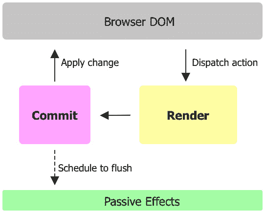
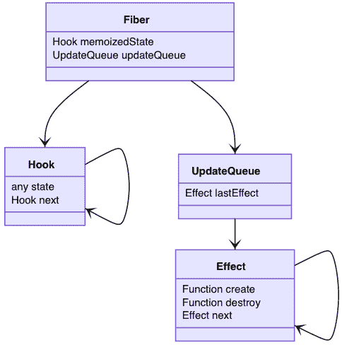
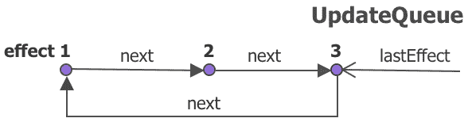
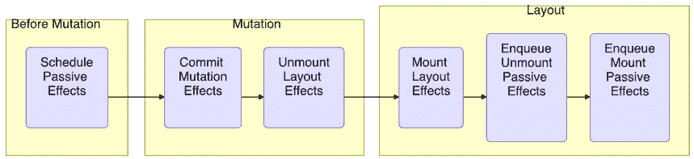
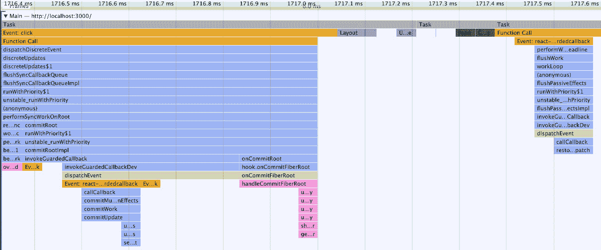

# 第五章：使用 Effect 处理副作用

在上一章中，我们学习了`useState`是如何设计的，以及如何使用它来管理`useEffect`中的状态变化以管理*副作用*。我们首先介绍什么是*副作用*，然后我们将遍历`useEffect`背后的数据结构和源代码，并提供各种调用效果的场景。我们还将演示使用`useEffect`的一些陷阱，并讨论一些避免它们的方法。在本章的结尾，我们将使用两个实际示例来使用`useEffect`：*查找窗口大小*和*获取 API 资源*。本章还包括附录部分中的三个附加主题：*React 副作用*、*刷新被动效果*和*是否是异步分发*。

在本章中，我们将涵盖以下主题：

+   什么是副作用？

+   `理解` `useEffect` 设计

+   创建效果

+   测试驱动`useEffect`

+   `useEffect` 示例

+   问答

+   附录

# 什么是副作用？

以下函数没有副作用：

```js
function add(a, b) {
  return a + b
}
```

这个函数相当纯净，从某种意义上说，如果以相同的输入参数集调用它，我们应该得到相同的结果——也就是说，`add(1, 1)`将返回`2`。这种*纯净*函数易于理解、测试和开发。原因是该函数只依赖于输入参数，没有其他隐藏的依赖。

你可能会想知道隐藏的依赖项可能是什么？信不信由你，这相当容易发生。在下面的代码中，我们将故意引入两行，每行都会添加一个隐藏的依赖：

```js
let c = 3
function add(a, b) {
  console.log(a, b)
  return a + b + c
}
```

第一行添加了来自`c`变量的外部依赖。因为`c`是一个全局变量，它绕过了输入参数列表。如果我们现在调用`add(1, 1)`函数，它可以返回任何数字（甚至非数字）。这是因为`c`在调用`add`时可以是任何东西。这适用于所有*全局*实例。

让我们来看看另一个隐藏的依赖项。在`add`函数内部，第一行添加了一个来自`console.log`函数的外部依赖。我们的意图是将`a`和`b`变量记录到屏幕上。然而，`console.log`函数在运行时可能是任何东西。例如，如果`console`不存在，调用`console.log`时可能会出错。

从这些先前的例子中，我们可以看到我们可以与一个*不纯净*的函数一起工作，而不知道这一点。关于不纯净函数，有一件重要的事情需要记住——那就是它们容易出错。例如，在先前的例子中，如果有人更改了任何隐藏的依赖项，开发者很难知道。当涉及到重构代码时，这可能会变成一场噩梦。

为了使我们的代码健壮，我们倾向于开发策略来*避免*隐藏的依赖项，无论是通过移除它们还是尽可能减少它们的影响，这样我们就可以在开发和维护代码时充满信心。

通常，有两种策略可以解决函数的杂质问题。一种方法是通过将依赖关系添加到输入参数中来移除它，这样它们就不再 *隐藏* 了：

```js
function add(a, b, c, log) {
  log(a, b)
  return a + b + c
}
```

这可以是一个非常有效的方法。在之前的代码更改中，`c` 变量和 `log` 函数被明确地写为输入参数。在 `add(1, 1, 0, console.log)` 的情况下测试这个方法应该会花费更少的精力。这个方法的唯一缺点是，要实现它，你需要知道依赖关系并明确声明它们。这意味着输入参数的列表可能会变得非常长，从而影响函数的有效性。

这带我们来到了第二种策略。我们不仅可以移除杂质，还可以将其打包并延迟到稍后执行。以下是一个如何 *延迟* 杂质的例子：

```js
function addFunc(c, log) {
  function add(a, b) {
    log(a, b)
    return a + b + c
  }  
  return add
}
```

`addFunc` 函数返回一个 `add` 函数。要使用 `add` 函数，我们需要调用 `addFunc` 来获取我们的 `add` 函数的句柄（也称为回调）：

```js
const add = addFunc(3, console.log)
```

那么，这有什么不同呢？`c` 和 `log` 的依赖关系出现在输入参数中，因此 `addFunc` 是一个 *纯* 函数。本质上，我们将任何杂质打包并声明到更高一级，因此在 `addFunc` 的上下文中，新的 `add` 函数看起来和运作得更加纯净。

在某种意义上，我们保留了原始代码，但将其包装起来以获取一个回调函数，这样我们就可以稍后执行它。这有助于保护主代码的完整性，同时将杂质重新定位。这种延迟策略通常被称为 *副作用*：

```js
let c = 1, d = 2
function add() {
  c = 2
  const a = d
}
```

在前面的代码中，`add` 函数内部 `c` 变量的赋值是一个副作用，因为它 *改变* 了全局值；`a` 变量的赋值是另一个副作用，因为它 *读取* 了全局值。从这里，你可以看到 `console` 是一个稳定的副作用，因为它是一个写入终端屏幕的外部服务。

在一个松散连接的开放系统中，例如网络，副作用是不可避免的。如果你要执行一系列操作，而其中一个操作恰好没有被内部系统定义，那么这个操作就涉及到访问外部系统。虽然我们无法避免副作用，但我们可以在正确的时间打包副作用，以便它访问外部系统。

## 介绍被动效果

在 React 中，*副作用* 指的是我们尝试从 *外部系统* 中 *读取* 或 *写入* 的情况。外部系统可以是 DOM 元素，例如 `document` 或 `window` 对象，或者是对 web 服务器的获取。



图 *5.1* – React 被动效果

当用户执行操作时，会安排一个 *dispatch* 来触发一个 *render*，随后是一个 *commit* 来形成更新（如图 *5.1* 所示）。在更新过程中，React 不允许立即调用自定义副作用。相反，React 会等待提交结束后再调用它们。

如果在更新过程中遇到了两个副作用，这两个副作用都会被延迟，然后在*提交*之后依次调用。这种类型的副作用在内部被称为被动副作用。被动副作用是 React 支持的效果类型之一。如果您对其他类型的效果感兴趣，请参阅本章末尾的*附录 A – React 副作用*部分。

它被称为*被动*，是因为它在更新期间被调用的方式。React 允许我们在每次更新中调用被动副作用，或者在响应值变化时有条件地调用它。因此，效果不像用户事件那样被积极绑定，而是在值变化时创建、排队，然后稍后调用。从某种意义上说，效果可以通过被动的“事件”来调用。

被动副作用被建模为一个回调函数。在这个例子中，让我们假设它被称为`create`。调用`create`函数执行副作用，并返回一个`destroy`函数来执行与副作用相关的清理工作。

既然我们已经知道了 React 副作用是什么，让我们深入探讨`useEffect`钩子是如何设计来促进这一过程的。

# 理解`useEffect`设计

React 提供了一个`useEffect`钩子来设置一个在更新后要调用的回调函数：

```js
const Title = () => {
  useEffect(() => {
    window.title = "Hello World"
    return () => {
      window.title = "Notitle"
    }
  }, [])
}
```

`useEffect`函数将其第一个输入参数称为`create`的回调函数定义为效果。在先前的例子中，该效果在组件挂载时将`window.title`设置为`Hello World`。

一个`create`函数可以返回一个名为`destroy`的函数来执行清理工作。这里有趣的是，`destroy`函数是由`create`函数作为返回值提供的。在先前的例子中，当组件卸载时，清理操作将`window.title`对象还原为`NoTitle`。

`useEffect`参数列表中的第二个参数是一个名为`deps`的依赖数组。如果`deps`没有提供，则效果在每次更新期间都会被调用，而如果提供了`deps`，则效果仅在`deps`数组发生变化时被调用。

## `useEffect`钩子的数据结构

在本节中，我们将通过以源代码的简化版本为例来解释`useEffect`是如何设计的。首先，让我们看看使其发生的数据结构。



图 5.2 – `useEffect`钩子的数据结构

为了跟踪副作用，React 在`UpdateQueue`类型的纤维下创建了一个`updateQueue`属性（如图 5.2 所示）。在这个队列中，一个效果列表存储在`lastEffect`属性下。效果通过循环链表链接在一起（见图 5.3），类似于我们在`useState`中看到的挂起队列：



图 5.3 – useEffect 的纤维更新队列

列表中的每个效果，它将效果函数存储在`create`属性中，并将清理函数存储在`destroy`属性中。

`useEffect`钩子遵循典型的钩子设置，它根据纤维是否在安装或更新中，通过`isFiberMounting`标志（如*第三章*，*Hooking into React*）采取`mountEffect`或`updateEffect`的路径。

```js
function useEffect(create, deps) {
  if (isFiberMounting) {
    mountEffect(create, deps)
  } 
  else {
    updateEffect(create, deps)
  }
}
```

`useEffect`钩子接受`create`函数以及`deps`数组，并且不返回任何值。

## 安装效果

当组件处于安装状态时，`mountEffect`函数首先创建一个钩子：

```js
function mountEffect(create, deps) {
  const hook = mountHook()
  hook.state = pushEffect(
    create,
    undefined,
    deps,
  )
}
```

一旦它获得钩子，它将效果存储在钩子的`state`下。效果是通过`pushEffect`函数创建的：

```js
function pushEffect(create, destroy, deps) {
  const effect = {
    create,
    destroy,
    deps,
    next: null,
  }
  let queue =  updatingFiber.updateQueue 
  if (queue === null) {
    queue = { lastEffect: null }
    updatingFiber.updateQueue = queue
    queue.lastEffect = effect.next = effect
  } 
  else { …
    queue.lastEffect = effect
  }
  return effect
}
```

`pushEffect`函数使用所有效果信息创建一个效果，例如`create`、`destroy`、`deps`和`next`。然后，它找到当前正在更新的纤维下的`updateQueue`函数。如果队列是空的，新的效果将被附加。否则，新的效果将被附加到队列中。无论如何，它都将新的效果作为队列中的`lastEffect`对象附加。由于它是一个循环链表，在所有先前的指针操作完成后，它确保`lastEffect.next`对象仍然指向列表中的第一个效果。

## 更新效果

组件安装后，下一次它更新并达到`useEffect`钩子时，它进入`updateEffect`并通过克隆一个来获取钩子：

```js
function updateEffect(create, deps) {
  const hook = updateHook()
  let destroy = undefined
  const prevEffect = hook.state
  destroy = prevEffect.destroy
  if (deps) {
    const prevDeps = prevEffect.deps
    if (areDepsEqual(deps, prevDeps)) {
      return
    }
  }
  hook.state = pushEffect(
    create,
    destroy,
    deps,
  )
}
```

一旦我们有了钩子，我们就可以检查在安装中设置的先前效果，并比较`deps`数组是否已更改。如果`deps`数组没有从存储在`prevEffect`中的`prevDeps`对象中更改，它将返回而不将效果推送到`updateQueue`。

一个名为`areDepsEqual`的实用函数用于比较当前和先前的依赖数组。我们将在本章后面的*创建效果*部分详细检查此函数。

## 安排效果

效果有一些非常特殊的地方：效果被推入每个纤维的`queue`中，但它们是在屏幕即将更改时安排的。

对于每个效果，都有两个需要安排的回调函数：一个是`create`，另一个是`destroy`。以`create`为例，每个`create`函数都是通过`enqueueEffect`函数收集到一个列表中：

```js
function enqueueEffect(fiber, effect) {
  effectCreateList.push(effect)
  if (!rootDoesHaveEffects) {
    rootDoesHaveEffects = true
    scheduleCallback(() => { flushEffects() })
  }
}
```

之前的`enqueueEffect`函数将纤维和效果推入`effectsCreateList`数组。然后，它安排`flushEffects`回调。数组之所以不立即处理（或刷新）是因为它必须等待更新结束。在这里，React 使用一个全局标志（`rootDoesHaveEffects`）来确保它只触发此安排一次。

同样的过程也发生在每个 `destroy` 函数上。对于每个更新，我们最终会得到两个效果列表：一个用于 `effectCreateList`，另一个用于 `effectDestroyList`。尽管相似，这两个列表不一定包含相同的效果列表，因为有些效果没有 `destroy` 回调。此外，当组件卸载时，需要将 `destroy` 回调添加到 `effectDestroyList`。

`scheduleCallback` 函数相当有趣。它不是立即刷新并执行效果，而是稍后执行，就像在新的 **JavaScript** 任务中的异步任务一样。如果您对此感兴趣，请参阅本章末尾的 *附录 B – 清除被动效果* 部分的相关细节。

## 清除效果

只有在屏幕更新了 DOM 更改之后，React 才能再次访问效果列表：

```js
function flushEffects() {
  effectDestroyList.forEach(effect => {
    const destroy = effect.destroy
    effect.destroy = undefined
    if (typeof destroy === 'function') {
      destroy()
    }
  })
  ...
}
```

上述代码遍历 `effectDestroyList`，并对找到的每个 `destroy` 函数进行调用。在所有 `destroy` 函数被调用之后，React 清除 `create` 的效果列表：

```js
function flushEffects() {
  ...
  effectCreateList.forEach(effect => {
    const create = effect.create
    effect.destroy = create()
  })  
}
```

在前面的代码中，`effectCreateList` 通过在每个 `effect` 对象下调用 `create` 函数而被清除。`create` 函数的结果随后被用作 `destroy` 函数。

注意 React 遍历两个列表的顺序 – 它从 `destroy` 开始，然后转到 `create`。由于这两个列表都是从所有纤维中收集的，因此 `create` 函数可能包含对即将被销毁或清理的组件变量的引用。为了给 `create` 函数一个完全了解这种情况的机会，必须在发生之前调用 `destroy` 函数。简而言之，所有之前的效果都需要清理，然后才能考虑新的效果。

## useEffect 钩子的使用方法

这是一项艰巨的工作，我们刚刚已经浏览了 `useEffect` 钩子源代码的简化版本。为了帮助我们从更高层次理解这一点，以下图表概述了 `useEffect` 钩子在 React 中的效果工作流程（参见 *Figure 5.4*）：

![Figure 5.4 – useEffect 钩子和 React 效果工作流程]

![Figure 5.04_B17963.jpg]

Figure 5.4 – useEffect 钩子和 React 效果工作流程

让我们快速浏览一下 *Figure 5.4*。在更新过程中，当 `useEffect` 钩子被调用时，如果组件处于挂载状态，它将创建效果。如果组件处于更新状态，它将根据是否有任何依赖项更改来创建效果。如果没有依赖项数组的更改，则跳过效果。在所有情况下，当效果被创建时，它会被附加到纤维的 `updateQueue` 并存储在钩子的 `state` 中。

在屏幕更新之前，React 从所有纤维中获取所有效果，并安排一个刷新（在*图 5.4*中以虚线表示）。在将所有纤维更改应用到 DOM 之后，React 通过逐个调用它们来刷新它们，从之前的`destroy`效果开始，然后是新的`create`效果。

# 创建效果

效果可以被跳过。事实上，为了产生效果，需要在更新中创建效果。这种行为由一个名为`deps`的依赖项数组捕获。React 使用一个名为`areDepsEqual`的实用函数来帮助决定这个数组是否发生变化。让我们更仔细地看看这个函数：

```js
function areDepsEqual(deps, prevDeps) {
  if (!prevDeps) {
    return false
  }
  for (let i = 0; 
       i < prevDeps.length && i < nextDeps.length; 
       i++)
  {
    if (Object.is(deps[i], prevDeps[i])) {
      continue
    }
    return false
  }
  return true
}
```

`areDepsEqual`函数用于比较前一个`prevDeps`数组和当前`deps`数组之间的两个依赖项数组，如果所有元素都匹配，则返回`true`。虽然这听起来很容易执行，但它会根据依赖项数组中的元素遇到各种情况。我们将在以下列表中解释所有这些情况：

+   未提供`prevDeps`，并且使用时省略了数组：

    ```js
      useEffect(fn) 
    ```

    当这种情况发生时，`areDepsEqual`函数总是返回`false`，因此效果在每次更新中都会被创建。

+   除了第一次更新之外，`areDepsEqual`返回`true`，因为对于挂载，`deps`数组仍然被认为是从`undefined`变化而来的。因此，效果只创建一次，之后不再创建。

+   `deps`不为空，前一个和当前依赖项之间的每个元素都会执行一个`Object.is`比较。我们已经在*第四章*中详细讨论了`Object.is`函数，*使用状态启动组件*。在这里，每个元素对都会进行这个比较，以确定数组是否发生变化：

    ```js
      useEffect(fn, [a, b])
    ```

    除了挂载之外，如果任何元素发生变化，例如`a`或`b`，效果也会被创建。

## 创建和销毁

如果从效果`create`函数中提供了一个`destroy`函数，这种情况也需要考虑。记住，我们有两个独立的数组，分别跟踪挂载和卸载的情况。一般来说，`destroy`函数在`create`函数之前被调用。

因此，这里有一个简短的列表来总结所有这些情况。

+   在挂载后运行一次`create`。

+   对于任何`deps`的变化，它都会运行一次`destroy`和`create`。

+   在卸载后运行一次`destroy`。

+   如果没有提供`destroy`函数，这个过程简化为以下单个情况。

+   它对任何`deps`的变化都运行，包括挂载。

既然我们已经了解了`useEffect`钩子的设计以及所有调用回调的场景，让我们来实际测试一下`useEffect`钩子。

# 测试驱动`useEffect`钩子

效果回调在`useEffect`钩子的第一个输入参数中定义：

```js
function Title() {
  useEffect(() => {
    window.title = "" 
  })  
}
```

使用`create`函数的最常见方式可以通过使用`() => {})`来定义。对于对学习更多关于 *JavaScript ES6* 感兴趣的读者，请参阅*第十章*中的*拥抱 *JavaScript ES6* 部分，*使用 React 构建网站*。

关于这个效果函数的有趣事实之一是，多亏了 JavaScript *闭包*，它可以访问在功能组件中定义的所有变量：

```js
function Title({ text }) {
  const a = 2
  useEffect(() => {
     console.log(a)
     console.log(text)
  })
}
```

之前代码中的`create`回调函数引用了`a`变量和`text`。如果没有 JavaScript 闭包，这两个变量必须通过输入参数显式地传递到内联函数中。

关于`useEffect`钩子的另一个有趣的事实是，效果是一个回调，其中通常可以看到涉及状态变化的回调。让我们看看一个例子：


图 5.5 – 可点击文本的按钮

假设我们有一个`Title`组件，它接收一个`text`属性。在其内部，有一个按钮。当这个按钮被点击时，它可以增加一个`count`状态。最初，`count`的值被设置为`0`，并且每当`text`属性发生变化时，它可以将`count`值重置回`0`。请注意，用户点击和`text`属性更改可能是完全无关的，并由不同的机制驱动。前者来自用户操作，而后者来自父组件的变化：

```js
const Title = ({ text }) => {
  const [count, setCount] = useState(0)
     useEffect(() => {
    setCount(0)
  }, [text])

  const onClick = () => {
    setCount(count + 1)
  }

    console.log('count', count)
    return (
    <button onClick={onClick}>
      {text}: {count}
    </button>
  )
}
```

为了实现所描述的行为，我们使用`useEffect`来分发`setCount`，并将`deps`数组设置为`text`属性。以下代码示例显示了两个点击和一个从`a`字母到`b`字母的文本更改的时间线草图：

```js
|-----x-----x------------> click
a-----------------b------> text
R-----R-----R-----RR-----> update 
0-----1-----2-----20-----> count
```

当挂载开始时，第一次更新以文本`a`和计数`0`开始。它还创建了一个效果，但由于`count`值已经是`0`，因此跳过了`setCount`分发。

当用户进行第一次点击时，`onClick`事件处理程序被调用，因此将`count`设置为`1`。同样适用于第二次点击，以便达到`count`值为`2`。当父组件将`text`属性从`a`更改为`b`时，它引发另一个更新。

在相同的更新中，未更改的`count`值再次被打印出来。但这次，`useEffect`的依赖数组检测到由于`[text]`引起的更改。因此，它创建了一个效果来调用`setCount(0)`。正如我们所知，`setCount`安排了另一个更新，之后它将`count`值恢复到`0`。

操场 – 带有父文本的按钮

您可以在此在线示例中自由玩耍[`codepen.io/windmaomao/pen/rNGOVor`](https://codepen.io/windmaomao/pen/rNGOVor)。

哇！这就是`useEffect`的工作方式。通过在回调函数中使用`setState`，可以请求额外的更新来更新屏幕。因此，效果在另一个更新中生效。此外，为了使效果生效，`deps`数组需要与正确的状态变化连接起来，因为如果我们遗漏了它，效果可能会停滞。让我们看看一个发生这种情况的例子。

## 缺少的依赖关系

让我们回到一个简单的设置：

```js
const Title = () => {
  const [count, setCount] = useState(0)

  useEffect(() => {
    console.log(count)
  }, [])
}
```

如果你打算每次`count`变化时都打印出来，前面的代码缺少了正确的依赖关系——正确的应该是`[count]`而不是`[]`。

如果这个例子太明显了，让我们尝试一个不那么明显的例子：

```js
const Title = ({ text }) => {
  const [count, setCount] = useState(0)

  useEffect(() => {
    console.log(text + count)
  }, [text])
}
```

在前面的代码中，我们引入了一个`text`属性并将其放入`deps`数组中。在这种情况下，我们得到的是当`text`变化时，它会打印出`text + count`。然而，如果`count`值因为用户的点击而变化，屏幕不会改变。为了解决这个问题，我们可以将`count`值添加到依赖数组中：

```js
  useEffect(() => {
    console.log(text + count)
  }, [count, text])
```

这里似乎出现了一个模式——如果一个效果回调使用了变量，那么这个变量需要包含在`deps`数组中。这个说法实际上有 99.9%的正确性。如果你故意不想在变量变化时更新屏幕，你可以跳过将其添加到依赖数组中。然而，React 并不推荐这样做。React 甚至添加了一个`eslint-plugin-react-hooks`插件来帮助我们找出我们遗漏了潜在依赖关系的案例。

你可能会想知道为什么 React 不希望我们遗漏任何依赖关系。这是因为，在 React 中，每个值（或状态）都应该与当前屏幕保持同步，并且默认情况下不能有违反这一规则的例外。在*第八章*，“使用 Ref 隐藏内容”，我们将展示如果你坚持要隐藏内容不被 React 看到的一个推荐方法。

现在我们已经看到了同时使用效果和状态的情况，让我们看看另一个我们可能会遇到问题的例子。

## 无限循环

将*状态*和*效果*结合起来可能会引起另一个有趣的问题，因为一个效果可以改变状态并因此安排一个新的更新，然后新的更新可以创建一个新的效果并改变状态，这可以无限期地继续下去。这可能会导致一个*无限循环*。

我们可以通过一个快速示例来演示这一点：

```js
function Title() {
  const [count, setCount] = useState(0)
  useEffect(() => {
    setCount(count+1)
  }, [count])
  return <h1>{count}</h1>
}
```

在前面的代码中，有一个效果会在任何`count`变化后增加`count`状态。在调用`setCount`之后，在下一次更新中，`useEffect`会检测到依赖数组中的变化，从而再次调用`setCount`。因为每次发生这种情况我们都会得到一个新的`count`数字，这个过程不会停止，就像你在下面的时间线草图中所看到的那样：

```js
RRRRRRRRRR> update 
0123456789> count
```

通常情况下，我们不会故意这样做，但我们在更复杂的设置中可能会意外地遇到这种情况，特别是当涉及许多不同的状态和效果时。我们的任务是尽可能避免无限循环，因为 React 没有考虑到这一点。

那么，我们如何处理代码中的无限循环呢？我们可以使用 `if` 语句跳出循环，这通常是成本效益最高的方法：

```js
  useEffect(() => {
    if (count >= 1) return
    setCount(count+1)
  }, [count])
```

在前面的代码中，我们在效果的第一行内部添加了 `if` 语句后，时间线确认我们没有无限循环了：

```js
RR--------> update 
01--------> count
```

如您所见，跳出循环并不太难。您可以将这视为您想要达到的平衡状态——效果确实需要被触发以进行状态改变，但一旦达到平衡状态，它就会停止而不会继续循环。

现在我们已经了解了如何使用 `useEffect`，让我们看看两个实际的应用案例。

# useEffect 示例

`useEffect` 钩子通常用于任何副作用——无论是从外部对象读取还是写入外部对象。在接下来的几节中，我们将看到两个更多示例：*查找窗口大小* 和 *获取 API 资源*。

## 查找窗口大小

假设我们想在运行时知道当前浏览器窗口的大小，以便问候标题可以完美地显示在屏幕上（见图 5.6）：


图 5.6 – 查找窗口大小

这可以通过正常的 **CSS** 媒体查询来完成，但这次，我们想通过 *JavaScript* 来实现，因为获得的运行时 *JavaScript* 变量可以用于除 CSS 之外的其他目的：

```js
const Greeting = () => {
  const [width, setWidth] = useState(0)

  useEffect(() => {
    function handleResize() {
      setWidth(window.innerWidth)
    }    
    window.addEventListener("resize", handleResize)
    handleResize()

    return () => { 
      window.removeEventListener("resize", handleResize)
    }
  }, [setWidth])  
  const on = width > 600
  return <h1>{on ? "Hello World" : "Hello"}</h1>
}
```

`useEffect` 钩子在这里非常适用。组件挂载后，我们可以监听由 `window` 对象提供的 `resize` 事件。一旦开始监听该事件，每当窗口大小改变时，就会触发一个 `handleResize` 函数，将 `width` 状态设置为新的窗口大小。我们还在挂载时调用 `handleResize` 以获取初始窗口大小。

在这个例子中，如果当前宽度大于 600 像素，我们知道它可以在屏幕上显示 `Hello World` 字符串。否则，将使用 `Hello` 字符串。这表明我们可以使用 JavaScript 在运行时根据窗口大小动态控制显示。

操场 – 查找窗口大小

您可以自由地在这个在线示例中尝试 [`codepen.io/windmaomao/pen/BadRoNN`](https://codepen.io/windmaomao/pen/BadRoNN)。

为了防止内存泄漏，我们从 `useEffect` 回调函数中返回一个 `destroy` 函数，在组件卸载时移除注册的事件监听器。

这里有一个需要注意的微妙细节——依赖数组中包含 `setWidth`，因为我们已经在 `useEffect` 函数中引用了 `setWidth`。如果您还记得从 *第四章* 的内容，即 *使用状态启动组件*，我们知道 `setWidth` 函数实例在挂载后不会改变，所以实际上，`[setWidth]` 在这里是可以省略的。但 React 强制要求我们添加它，因为当 `setWidth` 改变时，效果需要被重新创建。

## 获取 API 资源

`useEffect` 的一个流行用法是获取 API 资源并在屏幕上显示数据：

![图 5.7 – 获取 API 资源，加载状态]

![图片 5.07_B17963.jpg]

图 5.7 – 获取 API 资源，加载状态

这里的想法是使用 `fetch` JavaScript 函数来获取资源。在加载期间，屏幕应该显示 `loading...`（如图 *5.7*）。资源成功获取后，`loading...` 字符串应该被移除，并在屏幕上替换为获取的文本：

```js
const Title = () => {
  const [text, setText] = useState("")
  const [loading, setLoading] = useState(true)
  useEffect(() => {
    fetch("https://google.com").then(res => {
      setText(res.title)
      setLoading(false)
    })
  }, [setText, setLoading])
  if (loading) return "loading..."
  return (<h1>{text}</h1>)
}
```

在前面的代码中，我们使用一个 `text` 状态来存储获取的文本，并使用一个 `loading` 标志状态来存储加载状态。使用 `useEffect` 钩子来获取资源，当成功时，它会更新 `text` 和 `loading` 标志。

游戏场 – 获取 API 资源

欢迎您在此在线示例中尝试 [`codepen.io/windmaomao/pen/ZEJKbev`](https://codepen.io/windmaomao/pen/ZEJKbev)。

在这个例子中，效果没有返回任何内容。实际上，在这种情况下需要清理，但我们将在*第八章*，*使用 Ref 隐藏内容*中详细探讨这一点。

注意，在 `return` 语句之前使用了一个 `if` 语句。在*第三章*，*Hooking into React*中，我们提到 `if` 不能在钩子语句之间使用。因此，在这种情况下，我们将它移动到所有钩子语句之后，并放在最后一个返回语句之前。

在这种情况下，`if` 语句充当短路。如果 `loading` 状态为 `true`，它不会做任何进一步的操作，只是返回一个 `loading...` 字符串。这种 `if` 语句方法是最经济实惠的确保屏幕仅在内容可用时渲染材料的方法之一。

# 摘要

我们在本章中做了很多工作。首先，我们了解了什么是副作用，并深入研究了 `useEffect` 钩子的设计。我们发现了如何创建一个效果，然后在 UI 更新后稍后调用它。我们还学习了基于依赖数组的创建效果的多种场景。之后，我们探讨了使用 `useEffect` 时缺少依赖项、过时值和无穷循环的陷阱。最后但同样重要的是，我们学习了如何在实际组件中应用 `useEffect`，例如在浏览器中查找窗口大小和从在线服务器获取 API 资源的示例。

在下一章中，我们将发现 React 家族中的下一个钩子，并关注如何通过使用前一个更新的值来应用优化以提升性能。

# 问题和答案

这里有一些问题和答案来刷新您的知识：

1.  什么是副作用？

    副作用是指函数依赖于或修改其输入参数之外的内容。一个非常常见的副作用是在函数内部使用 `console.log`。

1.  什么是 `useEffect`？

    `useEffect`钩子是在 React 中定义一个在屏幕更新后调用的副作用回调的方式。效果可以每次调用或当其依赖项之一发生变化时调用。因此，`useEffect`钩子也可以用于监听值的变化。

1.  `useEffect`最常用的用途是什么？

    `useEffect`钩子是 React 家族中的常见钩子。如果与`useState`钩子一起使用，它可以轻松与外部资源通信并在屏幕上显示结果。外部资源可以是 Web 服务器、DOM 元素、`window`对象、`document`对象或任何第三方实体。

# 附录

## 附录 A – React 副作用

当谈到 React 时，最知名的效果是被动效果，正如本章所介绍和详细解释的那样。然而，React 支持不同类型的效果，并且在未来可能会添加更多。目前另外两种是*突变效果*和*布局效果*。

所有效果都与某些功能共享，例如在屏幕更新之前从纤维中收集。但它们在某些方面也有所不同。以*突变效果*为例。在引擎下，这类效果是最重要的效果，因为每个突变效果都跟踪 DOM 元素的添加、删除或更改。因此，所有纤维协调最终都会产生被提交到屏幕上的突变效果。DOM 元素的突变也是更新的一部分，或者更准确地说，是更新的*提交*阶段。而被动效果在更新之后运行，所有突变效果都在被动效果之前发生。

为了纠正被动效果在更新之后运行的事实（因为那时可能已经太晚执行某些操作），创建了*布局效果*以稍早调用。关于布局效果的各个方面都与被动效果相似，除了它在突变效果之后立即调用并在更新结束时刷新。所有三种效果之间的关系和时机可以总结如下，如*图 5.8*中概述的提交阶段：



图 5.8 – 提交阶段中的 React 效果

注意，在提交阶段，只有突变和布局效果会被刷新出来。被动效果最初被安排并随后入队，但不会在提交之后刷新。请继续阅读到*附录 B – 刷新被动效果*部分以获取更多详细信息。

## 附录 B - 刷新被动效果

为了理解被动效果是如何被安排和刷新的，我们首先需要提到*JavaScript* *任务*。



图 5.9 – JavaScript 任务

在*图 5.9*中，我们可以看到三个*JavaScript*任务。什么是任务？*任务*是任何由标准机制安排运行的*JavaScript*代码。在左边的第一个任务中，我们完成了一次更新。通常，我们只需要了解这么多关于运行*JavaScript*代码的情况。

然而，由于*JavaScript*是一个单线程引擎，在当前任务的执行过程中，可能会有更多的工作添加到待处理队列中。一个典型的例子是`setTimeout`调用，它将回调添加到队列中而不是立即在同一任务中调用它。API 调用（如 promises）通常也属于这一类。这是这些回调被称为*异步操作*的主要原因。

没有规定每个任务应该持续多长时间。当一个任务完成时，它会查找待处理队列中的所有工作，然后逐个调用它们，等所有事情都完成后，它再次查看待处理队列。这个过程会永远重复。这就是*JavaScript*引擎所做的事情。

在我们的情况下，我们有一个非常短暂的任务（*图 5.9*中的中间任务）后面跟着第三个任务。猜猜看——这就是被动效果开始刷新的时候。从这一点我们可以确定，`useEffect`回调中的回调是异步调用的。

我们提到多个状态分发也是以延迟方式打包和执行的——那么`setState`分发也是一个异步调用吗？为了回答这个问题，请继续阅读*附录 C - 分发是异步的吗*部分。

## 附录 C – 分发是异步的吗？

由于被动效果是在新任务中调用的，在这个时候，你可能想知道`setState`分发是在同一个任务中运行还是在新的任务中。这是一个非常好的问题。

为了回答这个问题，我们需要一个时间参考点。假设我们有一个事件处理程序，并在其中有一个`setState`分发调用：

```js
  onClick = () => { setState(1) }
```

`onClick`事件是一个通过用户操作请求作为回调的事件。假设调用`onClick`事件的任务是称为*Task 1*。

在 React 17（不是当前版本）中，`setState`代码是同步的，这意味着它在整个更新过程中都在同一个*Task 1*中运行。React 决定将它们都在同一个任务中完成更有效率。那么，我们为什么说`setState`对象通常是延迟的呢？

```js
  onClick = () => {
    setState(1)
    // state value isn't changed yet
  }
```

这是因为在`setState`之后，值还没有被改变。只有下一次更新才会将状态设置为新的版本。但是将`setState`称为异步操作并不完全准确（如果不是错误的话），因为所有这些过程都是在同一个*JavaScript*任务中执行的。

如果我们将`setState`放入`useEffect`钩子中呢？这会不会改变同步或异步的讨论？

```js
  useEffect = (() => {
    setState(1)
  }, [])
```

到现在为止，我们知道`useEffect`回调会在一个新的*JavaScript*任务中被调用——让我们称这个任务为*任务 1*。而`setState`也是在同一个*任务 1*中运行的。这使得它的行为与之前讨论的事件处理器（如`onClick`）非常相似。因此，我们也可以将被动效果视为一个比事件处理器更*被动*的*"事件"*。

这并不阻止我们真正想要进行异步分发。让我们看看一个例子：

```js
  const [state, dispatch] = useState(1)
  const onClick = () => {
    setTimeout(() => {
      dispatch(3)
    }, 0)
    dispatch(5)
  }
```

在前面的例子中，`setTimeout`被用来以异步方式触发一个回调。在鼠标点击后，首先调用`dispatch(5)`。更新后，即使超时时间设置为`0`，也会调用`dispatch(3)`。

请记住，如果你这样做，你不仅是以异步的方式运行回调，而且还打破了 React 的调度周期。你可能想要这样做的原因是在 DOM 变化期间可能会出现冲突，例如在拖放处理期间。为了在我们进行状态更改之前完成我们的代码，我们可以将分发推到下一个*JavaScript*任务队列。
