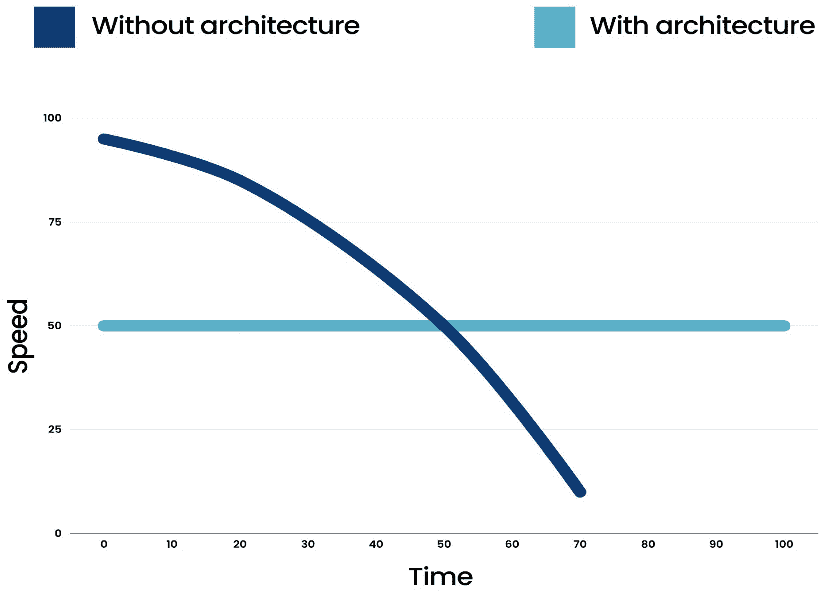
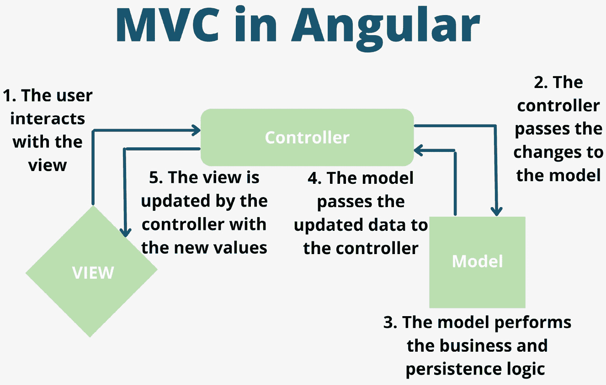
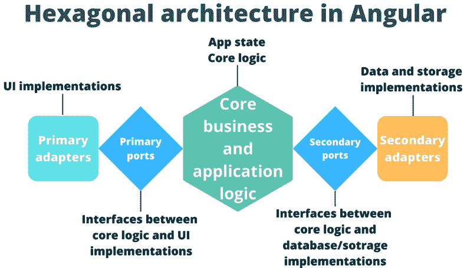
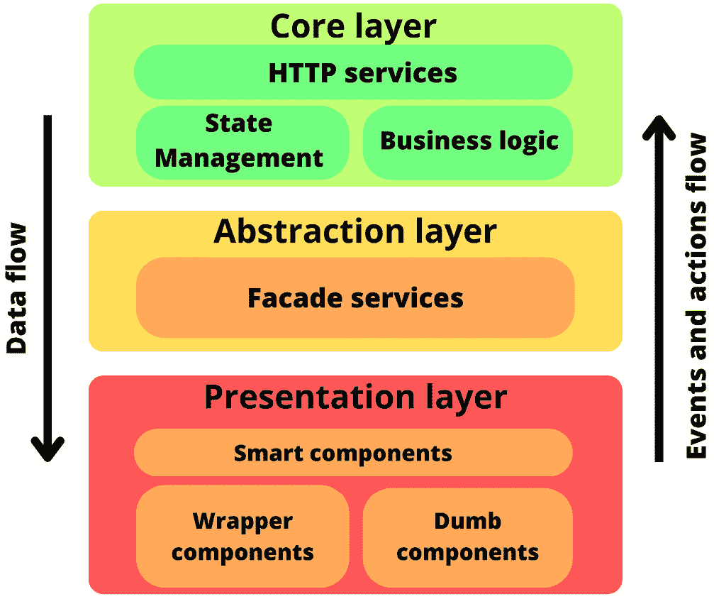
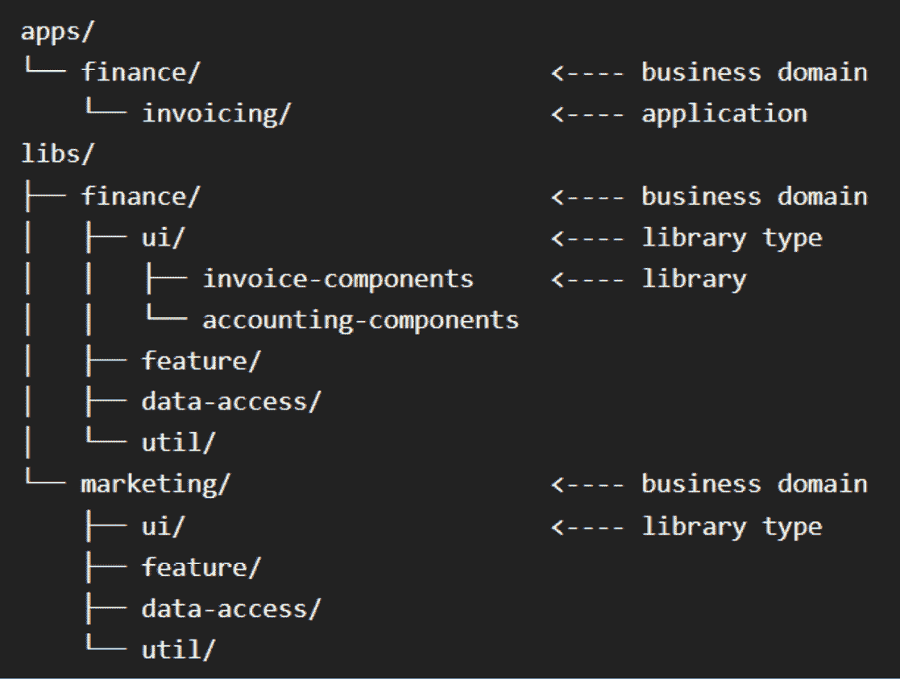

# 第一章：Angular 应用程序的可扩展前端架构

Angular 是一个强大且功能丰富的框架，用于构建 Web 应用程序。根据 2023 年 Stack Overflow 开发者调查，在专业开发者中，它排在 ReactJS、NodeJS 和 jQuery 之后，是第四大最受欢迎的 Web 技术。由于其提供的结构和工具，Angular 在构建大型 Web 应用程序或由多个应用程序和库组成的企业解决方案时经常被选中。

本书将指导你有效地使用 Angular 框架来开发和测试任何规模的应用程序。你将从了解前端架构和设置一个可扩展的工作空间开始，该工作空间使用 Nx 准备好处理数百个 Angular 应用程序。接下来，你将探索 Angular 框架中最强大和最新的功能。你将学习使用 RxJS、Signals 和 NgRx 进行响应式编程和状态管理，并能够使用 Jest 和 Cypress 测试 Angular 应用程序。完成本书后，你将能够有效地使用 Angular 框架，并开发可扩展的企业级 Angular 应用程序，利用 Angular 提供的所有工具，同时实施最佳实践和良好的设计模式。

在本章中，你将使用 Nx 创建你的 Angular 工作空间。你将从了解我们所说的可扩展前端架构及其在开始编写代码之前考虑架构的重要性开始。你还将了解前端架构的不同模式，以及从头开始构建企业级解决方案时应考虑的因素。

最后，你将探索并使用 Nx，这是一个构建工具，允许你创建可扩展的 Angular 单仓库。在本章结束时，你将了解前端架构的关键方面，并拥有自己的 Nx 单仓库用于 Angular，可以轻松处理数百个应用程序。

本章将涵盖以下主要主题：

+   理解可扩展的前端应用程序

+   可扩展前端架构的不同方法

+   Nx 是什么？为什么你应该使用它？

+   设置可扩展的 Angular 工作空间

# 技术要求

在本章结束时，我们将创建一个包含 Angular 应用程序和库的 Nx 单仓库。为了跟上进度，你需要安装一些工具。请注意，我们只会使用免费可用的工具。

你将需要以下工具：

+   **Visual Studio Code**（**VS Code**）作为你的**集成开发环境**（**IDE**）

+   Chrome 浏览器

+   Angular 17.1 或更高版本

+   NodeJS 版本 v20.11.0 或更高版本

+   TypeScript 版本 5.3.3 或更高版本

+   Nx 版本 v18.0.7 或更高版本

在本书的整个过程中，我们将使用 Angular 17.1、NodeJS 20.11.0、TypeScript 5.3.3 和 Nx 18.0.7。

本书对应的 GitHub 仓库可在 [`github.com/PacktPublishing/Effective-Angular`](https://github.com/PacktPublishing/Effective-Angular) 找到。

# 理解可扩展的前端应用程序

现代网络应用程序不断变得更大、更复杂。因此，开发可扩展的前端应用程序比以往任何时候都更加关键。为了创建可扩展的前端应用程序，我们需要了解在应用程序上下文中可扩展性的含义。

## 可扩展性是什么？

当你听到**可扩展性**这个词时，可能会首先想到处理更多的流量。然而，在前端应用程序的上下文中，当我们谈论可扩展性时，我们主要指的是代码库的可扩展性。或者，更简洁地说，代码易于扩展，模块或微前端可以轻松添加到软件中，而无需做太多工作。组件和库是可重用的；代码易于维护、测试和调试，即使应用程序规模扩大。你可以与不同的团队一起在应用程序的不同部分工作，并且加入编写类似代码的新团队既容易实现也容易执行。应用程序具有良好的性能和较小的包大小。编译和构建时间保持较低，如果需要，可以迅速部署到不同的预发布环境中。

要在您的前端应用程序中实现这些成就，您必须创建一个良好的架构、一套工具和规则，让每个人都能遵守。您的架构将包括诸如您的存储库类型、文件夹结构、架构模式、设计模式、编程语言、框架以及构建、测试、代码检查和部署应用程序的工具等元素。为架构的每个部分做出正确的决策有助于创建可扩展的应用程序，这些应用程序易于维护和扩展。

在做出架构决策时，你应该旨在创建一个快速、松散耦合、可测试的系统。你希望避免系统不同部分之间的直接依赖，这样当业务引入变化时，你就不需要重构整个应用程序。

在简要介绍了什么是可扩展的前端应用程序之后，让我们了解良好的前端架构的重要性。

## 为什么前端架构很重要？

良好的架构对于维护软件开发者的良好工作流程至关重要，并使得新团队和团队成员的加入变得容易。如果开发者花费大量时间重构或等待构建或测试完成，他们就会分心去做更不 productive 的事情。

在良好的架构支持下，即使应用规模扩大，代码库仍然可以管理。没有良好的架构，代码会变得杂乱无章，难以调试或扩展。随着时间的推移，这些问题会越积越多，开发者将花费更多的时间在调试和重构上，而不是创建新功能，尤其是在业务需求不断变化的大型企业解决方案中。不知不觉中，你将面临一个错综复杂的依赖关系网，添加简单的东西将变得非常耗时。

假设你正在开发一个包含日历组件的员工排班应用程序。你希望避免日历和排班应用程序之间的紧密耦合。当管理层告诉你公司正在添加另一个应用程序——比如说一个包含日历的项目管理工具——你不想因为两者紧密耦合而重新设计整个日历组件和排班应用程序。

下图显示了有和无架构的开发过程。没有架构时，你开始得快，但最终你会缓慢前行。有了架构，你将有一个一致且可预测的工作节奏：



图 1.1：开发速度

现在你已经理解了我们所说的可扩展前端应用程序的含义以及为什么良好的架构对于实现它们至关重要，我们将深入了解一些扩展前端应用程序的方法，并了解它们的优缺点。

# 前端应用程序的扩展方法

当涉及到软件架构时，考虑你正在构建的内容、它能够发展到什么程度、所处的环境以及谁将负责它，这是至关重要的。根据这些参数，你将希望创建一个足够灵活的架构，以便在不过度设计的情况下增长和适应，避免使事情比必要的更复杂和耗时。

例如，如果你正在为一家小型家族企业构建一个简单的网站，你不需要复杂的架构和设计模式；这会使事情比必要的更复杂和耗时。网站的需求可能保持大致相同，代码库将保持小而易于管理。但是，当你构建由多个应用程序组成的商业软件时，这些应用程序的需求和效用将发生很大变化，你需要确保软件为此做好准备。

在本节中，你将了解不同的架构选择，以确保你不会过度或不足设计你的前端应用程序。你将了解在 Angular 应用程序中常用的一些仓库结构和架构模式。无需多言，让我们了解单仓库和多仓库之间的差异。

## 单仓库或多仓库

**单仓库**和**多仓库**是两种在源代码管理应用程序（如 GitHub）中存储代码的选项。如果你为每个项目或应用程序创建一个新的仓库，它被称为多仓库或多仓库结构。同时，当所有应用程序都在一个大型仓库中时，它被称为单仓库结构。对于大型公司来说，单仓库可以轻松包含数百个应用程序。

在开发大型前端环境时，你应该选择哪个选项？让我们开始探讨这两种解决方案的优缺点。

### 单仓库的优势

单仓库的一些关键优势如下：

+   **易于代码共享**：单一代码库使得在不同项目和团队之间共享代码变得容易。你可以在一个目录中拥有所有项目的代码，因此检查或重用另一个项目的代码，以及在库中共享事物变得简单。这有助于防止代码重复，为你解决类似问题提供灵感和指导，并允许你快速检查错误是否起源于你的代码或库的实现。

+   **不同应用程序之间的统一性**：因为所有代码都存放在一个仓库中，所以在不同应用程序之间强制统一性更容易。你可以确保使用相同的工具，应用代码约定和最佳实践，并且所有应用程序都进行类似的测试。此外，使用单一代码库进行整个系统的测试也更容易。

+   **无版本冲突**：在单一代码库中，依赖项通常在所有应用程序中共享相同的版本。这确保了不会发生版本冲突，并且所有应用程序中的实现都是一致的。此外，这也确保了那些没有积极开发的应用程序仍然会定期更新其依赖项。

+   **跨项目重构**：如果你想要重构在许多应用程序中出现的某些内容，你可以一次性对所有应用程序进行重构，或者高效地运行脚本来执行这些操作。

+   **快速代码移动和调试**：代码可以快速从一个项目移动到另一个项目，当你遇到库中的错误时，你可以立即修复错误，而无需中断工作，继续你的工作。

+   **共享提交时间线**：最后，单一代码库有一个共享的提交时间线。这使得在多个应用程序中创建原子提交变得安全。这是因为如果出现问题，你总是可以通过提交时间线回滚到所有应用程序的共同状态。

无论这些优势如何，单一代码库也有一些缺点。我们将在下一节中详细探讨。

### 单一代码库的缺点

单一代码库的一些缺点如下：

+   **大型文件夹结构**：单一代码库可能会让人望而生畏，因为所有代码和库都生活在一个大解决方案中。如果你还没有使用过单一代码库，这可能需要一些时间来适应。因为很容易使用其他项目的代码，所以你需要格外小心，不要在应用程序之间创建不必要的依赖关系。

+   **复杂的包更新**：在单一代码库中更新包和依赖项可能很复杂，因为通常所有项目都需要同时更新。

+   **破坏性变更**：因为没有不同的版本，当你对库进行更改时，你可能会在不注意的情况下破坏其他应用程序。

+   **构建时间慢**：在单一代码库中，如果管理不当，构建和测试可能会变得耗时。

+   **部署挑战**：与所有内容都按性质分离和模块化的多代码库相比，模块化部署应用程序可能更具挑战性。

大多数缺点都可以通过合适的工具来缓解。对于由 Angular 应用程序组成的单仓库，你可以使用 Nx，这样你就可以处理单仓库而无需这些缺点。在这本书中，我们将使用单仓库和 Nx。

现在，让我们继续讨论多仓库的优点和缺点。

### 多仓库的优点

多仓库的关键优点如下：

+   **应用程序之间的高隔离度**：多仓库最明显的优点是应用程序之间的高隔离度。每个项目都有一个仓库，开发者可以在该仓库内做任何他们想做的事情，而不会过多地影响其他项目。

+   **依赖管理的灵活性**：当使用多仓库时，每个项目可以独立管理其依赖项的版本。这为项目团队在更新依赖项时提供了更多的自由度，并提供了更多的稳定性。

+   **单个工具**：在使用多仓库时，有更多的灵活性来使用不同的工具和编程语言。

+   **易于管理**：多仓库通常更容易管理，特别是对于小型团队来说。与单仓库相比，每个仓库中的代码较少，因此你的更改影响的东西更少。

+   **模块化部署简单**：模块化部署你的应用程序更加简单。

+   **与微前端架构一致**：最后，如果你正在使用微前端架构进行开发，使用多仓库可能会感觉与你的整体架构更加协调。然而，微前端可以通过单仓库和多仓库结构来实现。

在你选择单仓库或多仓库结构之前，你还必须考虑多仓库的缺点。这些缺点将在下一节中描述。

### 多仓库的缺点

多仓库的一些常见缺点如下：

+   **代码共享的困难**：首先，因为代码是独立存放的，所以应用程序之间共享代码变得更加困难。这可能导致对同一问题的不同实现或在不同项目中重复代码。团队通常会创建自己的解决方案，而不是为解决共享问题的库做出贡献。

+   **项目和库之间的边界**：当你依赖另一个仓库中存放的库，并且遇到一个错误时，修复问题将更加耗时。通常，你需要等待其他团队修复库中的错误并部署新版本，你才能继续。

+   **测试多个仓库时的挑战**：测试应用程序可能会变得更加具有挑战性。主要是在应用程序由位于不同仓库的不同模块组成时，测试整个系统可能会很困难。

+   **创建 CI/CD 管道和部署的困难**：随着你需要多个仓库来完成任务，创建整个系统的 CI/CD 管道和部署可能会变得更加具有挑战性。

+   **依赖冲突**：最后，你可能会遇到依赖冲突。不同的应用程序需要在生产环境中协同工作，并且可能依赖于相似的依赖项。当这些应用程序使用不同版本的依赖项时，可能会遇到兼容性问题。

在本节中，你了解了将代码存储在单仓库或聚合仓库中的优缺点。接下来，你将了解与 Angular 应用程序一起使用的不同架构模式。

## Angular 应用的架构模式

架构模式关注于如何结构化你的代码，并提供将业务逻辑从特定实现中抽象出来的规则。架构模式是一个广泛的话题，甚至有整本书专门讨论它；因此，在这个部分中不可能涵盖所有内容。尽管如此，我们仍将简要介绍一些与 Angular 和 Nx 一起使用的最常见架构模式。在*第五章*中，我们将深入探讨设计模式，同时关注代码实现而不是提供系统的概述。

现在，让我们深入探讨一些架构模式，了解它们试图实现什么，如何实现，以及它们的优缺点。

### Angular 应用中的常见架构模式

大多数架构模式在核心上试图实现相同的目标，只是有一些细微差别和不同的术语。关于 Angular 应用的架构模式，它们试图将领域和业务逻辑与实现和视图分离。这样做可以使系统松散耦合，易于测试、更改和扩展，而不会在错误的位置创建依赖项。在本节中，我们将介绍**模型-视图-控制器**（**MVC**）、六边形架构和分层架构。这三种模式是 Angular 应用中最常用的架构模式之一。其他值得注意的模式包括**模型-视图-视图模型**（**MVVM**）、联合架构和整洁架构。

不再拖延，让我们来了解 MVC 模式以及如何在 Angular 应用中使用它。

#### Angular 应用中的 MVC 模式

**MVC**是软件开发领域中应用最广泛的架构模式之一。该模式最初用于后端，但现在也用于前端应用程序，或者至少是类似于 MVC 模式的应用程序。MVC 模式常用于 Angular 应用程序，因为它与框架提供的工具很好地匹配。正如其名称所暗示的，MVC 由三个部分组成——**模型**、**视图**和**控制器**：

+   模型声明数据模型并处理业务和数据相关的逻辑。

+   视图向用户显示模型的当前状态。

+   控制器充当视图和模型之间的桥梁。控制器将用户输入传递给模型，以便模型可以执行操作并相应地更新，之后控制器将更新的值返回给视图。

如果我们将这种模式转换为 Angular 应用，模型将是一个处理数据和数据模型的服务。视图将是 HTML 模板。最后，控制器将是 HTML 文件背后的 TypeScript 文件，通常称为组件类。更好的实现是将组件类视为视图的一部分，并添加一个额外的外观服务（一个额外的抽象层，在视图和业务或状态相关的逻辑之间创建一个简单的接口和通信层；我们将在*第五章*中更详细地讨论外观模式），在模型服务和视图之间充当控制器。

如果你坚持 MVC 架构的原始实现，模型将直接将更新的值提供给视图。为了实现这一点，在*图 1.2*中，我们会消除*步骤 4*和*步骤 5*，然后直接跳转到视图而不是控制器。在 Angular 中，当使用组件类作为控制器时，这种情况有点类似，这会导致业务逻辑和组件类之间的紧密耦合。正因为如此，我更喜欢添加一个单独的外观服务，充当控制器，以完全将组件类与我的应用程序的业务和状态层分离。通过将组件从状态和业务逻辑中分离出来，你最终得到的是松散耦合，这使得在整个应用程序中更改实现变得更加容易：



图 1.2：MVC 模式

现在你已经了解了 MVC 模式的内容以及如何在你的 Angular 应用中实现它，让我们来学习下一个常见的架构模式：六边形架构。

#### Angular 应用中的六边形架构模式

与 MVC 和其他一些架构模式，如分层架构、MVVC 和 MVP 相比，六边形架构相对较新。六边形架构是在 2005 年提出的，而人们直到最近几年才开始在 Angular 应用中实施它。它之所以受到欢迎，是因为**领域驱动开发**（**DDD**）成为了一个热门话题，六边形架构非常适合与 DDD 结合使用。六边形架构的主要原则是通过端口和适配器将核心应用程序逻辑与 UI 和数据实现分离。正因为如此，这种架构也通常被称为*端口和适配器架构*。但是，我听到你在想，端口和适配器是什么？

简而言之，**端口**是接口（或抽象类），它们将您的核心逻辑与 UI 和代码实现分开。这些接口规定了 UI 和代码实现如何与您的应用程序核心通信。**适配器**是通过端口连接到您的应用程序核心的 UI 和代码实现。在六边形架构中，端口和适配器有两种类型，UI 和数据相关端口和适配器——换句话说，主要和次要适配器和端口。这一概念在 *图 1**.3* 中得到了说明：



图 1.3：六边形架构模式

在实现六边形架构时，您将为应用程序中的每个领域都有一组端口和适配器。我喜欢在端口接口和适配器之间使用外观服务，以在 UI、实现和应用程序核心之间提供更多抽象。当使用外观服务时，外观可以被视为端口本身。只需确保外观实现了一个接口，这样就可以为与核心和适配器的通信定义一组固定的规则。

因为端口定义了与您的应用程序核心通信的固定规则集，所以当业务需求发生变化时，您可以轻松地更改实现。您可以在不触及业务逻辑或数据实现的情况下交换 UI 组件，并且可以在不触及视图或应用程序核心的情况下更改数据持久化或检索方式。您需要做的唯一事情是确保您的新实现可以连接到端口使用的相同接口，以便连接一切。这种方法提供了出色的灵活性和松散耦合的系统。

为了澄清问题，我想回顾一下 *图 1**.3* 并将其翻译成 Angular 应用。我们将从左到右进行。在最左边，我们有主要适配器。用户面对的或触发的所有内容都被视为主要适配器：组件、指令、解析器、守卫和事件监听器。向右一步，我们将找到主要端口。这些常规 TypeScript 接口（或外观服务）规定了 UI 层如何与应用程序核心通信。我们的应用程序核心位于中间，在那里我们访问状态管理并在 Angular 服务中定义业务和应用程序逻辑。在应用程序核心的右侧，我们有我们的次要端口。这些端口规定了应用程序代码如何与 HTTP 服务、状态管理、内存持久化、事件调度器和其他数据或 API 相关逻辑通信。与主要端口一样，次要端口也是常规 TypeScript 接口（或外观服务）。在最右边，我们有我们的次要适配器。次要适配器实现了我们的 HTTP 服务、本地存储持久化、状态管理和事件调度器。

现在你已经了解了六边形架构是什么以及你如何在 Angular 应用中实现它，让我们来看看我们将讨论的第三种和最后一种架构模式：分层架构。

#### Angular 应用中的分层架构模式

如其名所示，分层架构模式使用不同的层来分离关注点。对于应用的每个部分，你应在架构中创建一个层，该层位于另一个层之上。当你将分层架构模式应用于你的 Angular 应用时，你应该至少有三个（主要）层：核心层、抽象层和表示层。在这些顶级层中，你可以有额外的子层或同级元素。如果你的应用架构需要更多层，你可以根据需要添加。

分层架构最重要的地方是每个层只能与自身上下层的层通信；链中的其余层都是禁止的。另一个基本特点是事件和动作向上流动，数据向下流动。用户在表示层触发事件或执行操作。该层通知抽象层操作和相应的变化。抽象层将这些动作和变化发送到核心层，在那里执行业务逻辑并持久化数据变化。当核心层执行了应用逻辑并持久化了变化后，数据将从核心层通过抽象层流向表示层，在那里更新用户视图：



图 1.4：分层架构模式

在本书中，我们将使用类似于*图 1**.4*所示的分层架构，其中表示层包含愚昧的、包装的和智能的组件。愚昧的组件只有组件输入来接收数据，以及输出以通知父组件有变化。包装组件也是愚昧的，但它们用于组合多个组件并提供可重用的布局或动画。尽管包装容器可以围绕愚昧的组件，但在数据流和依赖分离方面它们是相同的，这就是为什么它们在架构设计中并排放置。在愚昧的组件之上，我们有智能组件。这些组件通常是指特定的业务用例或页面，它们注入门面服务并实现组件逻辑和状态。

我们架构中的下一主要层是抽象层，其中包含门面服务。这些门面服务是常规的 Angular 服务，实现了门面设计模式。这些门面服务提供了额外的抽象，并作为我们智能组件和应用核心层之间的桥梁。

我们的最后一个大层是核心层，其中包含全局状态管理、业务和应用逻辑，以及 HTTP 服务。我们的 HTTP 服务层位于状态管理和业务逻辑层之上。我们有一些独立的服务，它们只做一件事，那就是获取数据并将其传递给我们的其他核心层；较低的核心层永远不会直接获取数据，因此我们有一个额外的抽象层，并且有更好的关注点分离。

现在你已经了解了分层、六边形和 MVC 架构模式，让我们继续，简要了解每种模式的优缺点。

### 比较架构模式

在我们讨论的*Angular 应用中的常见架构模式*部分中，所有三种模式都将业务逻辑与实现和展示代码分离。它们都提供了抽象层，但在创建这些层的方法上有所不同。首先，MVC 模式可能看起来最容易实现，但如果你不添加外观服务，你的组件类中可能会有太多的依赖和实现；特别是如果你让 MVC 的模型部分直接与视图通信。这不仅会紧密耦合你的视图与你的业务逻辑，还可能触发大量的 DOM 更新。更改实现可能会变得困难，单元测试也需要大量的模拟。

接下来，我们有六边形架构。我喜欢这种架构，但它引入了大量的样板代码，并且可能感觉实现起来很复杂，如果你团队中有许多初级开发者，这可能不是合适的选择。尽管如此，六边形架构的一个显著优点是，一旦一切设置完成，你可以轻松地更改实现。代码的单元测试也因为一切都被分离到端口和适配器而变得简单直接。

最后，我们有分层架构。这个架构结合了 MVC 和六边形架构的优点：我们为我们的核心、实现和视图提供了清晰的划分和良好的抽象。向你的架构中添加更多层很简单，规则也很容易理解，这使得它成为不同经验水平开发团队的优秀解决方案。由于良好的分离和抽象，你可以简单地更改实现，单元测试仍然很容易。

现在，你已经知道了 MVC、六边形和分层架构是什么，你也了解了每种实现的优缺点。在下一节中，你将简要了解什么是设计模式以及它们与架构模式的不同。

## 在 Angular 应用中使用的设计模式

虽然架构模式关注于我们对代码进行分割和抽象的高层次概述，但设计模式关注于我们在代码中如何实现事物。在开发 Angular 应用程序时，我们已经在使用一些内置的设计模式。这是因为 Angular 是一个具有强烈意见的框架，其核心具有强大的**面向对象编程**（**OOP**）原则。Angular 应用程序中默认使用的某些设计模式包括观察者模式、依赖注入、装饰器、组件和单例模式。这些以及其他设计模式，如工厂和继承模式，都嵌入到 Angular 框架的工作方式中，并且在使用框架时应该在整个应用程序中使用。因为这些模式在 Angular 框架的工具和工作方式中有所隐藏，你可能在使用它们时实际上并不真正理解它们的核心工作原理。除了嵌入在 Angular 框架中的这些设计模式之外，你还可以通过引入更多的设计模式来改进你的代码。其中一些与 Angular 结合得非常好，例如外观模式。

与架构模式一样，设计模式确保你在实现代码时遵循特定的规则，从而产生易于调整和扩展的代码。它们防止你在代码中建立错误的依赖关系，并提供了一种结构化和经过实战检验的方式来解决软件工程中的常见问题。目前，我想简要地解释设计模式，并列出 Angular 框架默认使用的一些设计模式。在*第五章*中，你将更详细地了解设计模式。你将了解不同的模式、何时使用它们以及如何正确实现它们。

你现在已经知道了设计模式是什么，以及它们与架构模式的不同之处。你已经了解了一些在 Angular 中通过设计使用的设计模式，并且你可以添加更多模式来改进你的代码实现。接下来我们将讨论的是 Nx，它使得结构化、创建、维护和测试大型 Angular 单一代码库变得容易。

# 什么是 Nx 以及为什么你应该使用它？

在本节中，你将了解 Nx 是什么以及为什么它是开发大规模 Angular 应用的绝佳工具。**Nx** 正在迅速成为开发大型单一代码库前端应用的首选工具。那么，Nx 究竟是什么，为什么你应该使用它？

Nx 是一个帮助你加速、简化和标准化你的开发、测试、构建和部署过程的工具。Nx 工具提供了一系列你可以在开发每个阶段利用的功能和集成。Nx 的创建是为了让你可以通过选择和添加你想要使用或添加到当前环境中的内容来逐步采用它。在其核心，Nx 帮助你完成以下任务：

+   加快您应用程序的构建和测试时间。

+   在单一代码库项目中管理依赖关系和运行任务。

+   快速搭建新的代码片段、应用程序和库，无需担心配置构建工具。

+   将新工具集成到单一代码库工作空间的项目中。

+   确保不同项目的代码内部的一致性和统一性。

+   通过自动代码迁移来更新应用程序和工具。

在前面的任务中，多个工具、功能和选项，如命令行界面（CLI）、生成器和插件，帮助您实现目标并简化流程。Nx 提供的工具和功能在其生态系统中分为不同的模块。

首先，您有 Nx 的**命令行界面**（**CLI**）。类似于 Angular CLI，它允许您运行创建工作空间、搭建项目、测试项目或提供和构建等任务的命令。接下来，**Nx 包**包含了 Nx 提供的所有基本技术：任务运行、工作空间分析、构建缓存、搭建和自动代码迁移。然后，还有插件，这些是扩展 Nx 基础的 NPM 包，可以由 Nx 社区为各种目的创建，例如生成项目、集成工具、添加或更新库。Nx 的另一个元素是其**Devkit**，它可以用来构建插件，以扩展 Nx 工具以满足您的特定需求。Nx 还有一种称为**Nx 云**的东西，它通过远程缓存和分布式任务执行加快 CI，但这超出了本书的范围。最后，我们有**Nx 控制台**，它是 VS Code、IntelliJ 和 VIM 的扩展，使得管理您的 Nx 工作空间和运行 Nx 命令变得更加容易。

既然您已经了解了 Nx 的核心功能，让我们更详细地考察它，看看它如何帮助您为 Angular 应用程序构建可扩展的单一代码库。

## Nx 如何帮助您构建可扩展的 Angular 单一代码库。

现在您已经了解了 Nx 的核心功能，让我们深入探讨它，看看它是如何帮助您构建、测试和标准化您的 Angular 应用程序的。我们将从 Nx 提供的主要功能之一开始：加快构建、服务和测试等任务的执行速度。

### 通过计算缓存和增量构建来提高构建时间。

通常，当我们使用 Angular CLI 运行任务，如 `ng build` 或 `ng serve` 时，我们的整个应用程序以及它所依赖的所有库都需要被编译以完成构建或提供服务。随着应用程序的增长，这可能会变得耗时。结果是 CI 构建缓慢，开发者在每次想要启动或测试应用程序时都需要等待应用程序编译。Nx 通过增量构建和计算缓存帮助解决这些问题。

使用计算缓存，Nx 将检查自上次您运行命令以来是否有任何更改。如果没有更改或构建计算等于之前的缓存运行，Nx 不会重新运行命令，而是从其缓存系统中获取结果。首先，它将查看本地缓存，如果您设置了 Nx 云的远程缓存，它也会检查是否可以在远程缓存中找到相同的计算哈希。如果 Nx 找不到相同的计算哈希，它将运行命令并将结果的哈希存储在 Nx 缓存中。

除了计算缓存外，Nx 通过增量构建帮助加快我们的构建和编译时间。在使用增量构建时，我们只构建自上次构建以来已更改的项目。在常规场景中，我们会构建应用程序及其所使用的所有库。随着应用程序的增长和依赖多个库，每次构建应用程序时重建所有内容都可能变得耗时且成本高昂。要使用增量构建，您的库必须是可构建的，这样 Nx 才能缓存库，并且只有在它们自上次构建以来已更改时才构建它们。当您构建较小的应用程序时，您可能不希望使用具有计算缓存的库，因为使库可构建也有一些开销。当您在 Nx 工作区中创建库时，您可以选择是否希望它为标准、可构建或可发布的。我们将在 *结构化 Angular 应用程序和库* 部分更深入地探讨这个话题。

### 使用 Nx 在 monorepo 中有效地运行任务

在单个 Angular 项目中使用 Angular CLI 运行任务，如 `ng build`、`ng test` 和 `ng lint`，是直接的。但是，当您有一个包含数十、数百甚至数千个应用程序和库的 monorepo 时，事情会变得更加复杂。在许多场景中，您可能希望同时运行多个（或所有）项目的任务。有时，当项目中的某些内容发生变化时，您想运行特定的任务，或者您需要知道库中的更改是否影响了其他项目并导致它们崩溃。如果您通过逐个运行命令来执行这些任务，这会很快变得难以管理，并且构建用于监视和检查受影响项目的工具也会变得复杂。幸运的是，Nx 拥有我们运行多个或受影响项目任务、监视更改并对其做出响应所需的一切。

当您使用 Nx CLI 时，建议不要在 monorepo 中使用 Angular CLI。我们希望 Nx 做所有它的魔法，如果我们开始使用 Angular CLI 生成东西，这是不可能的。幸运的是，Nx 已经为您准备好了！

让我们从基础知识开始——使用 Nx CLI 运行单个项目的命令。为单个项目运行任务与使用 Angular CLI 运行任务类似。例如，如果我们想为名为 **testApp** 的应用程序运行测试，我们可以运行以下命令：

```js
nx test testApp
```

如果我们想为多个项目运行任务，可以使用 `run-many` 关键字与 `-p` 标志结合来定义我们想要运行任务的那些项目。如果您省略 `-p` 标志并且仅使用 `run-many` 关键字，则任务将在所有项目中运行。我们还可以添加 `-t` 标志以同时运行多个任务。例如，如果我们想构建、检查和测试所有项目，我们可以运行以下命令：

```js
nx run-many -t build lint test
```

现在，假设我们只想构建、检查和测试 *testApp* 和 *testApp2*。为此，我们可以运行以下命令：

```js
run-many -t build lint test -p testApp testApp2
```

如您所见，使用 Nx CLI 运行命令很简单，即使您需要在单一仓库中的多个或所有项目中执行此操作。即使您想为子集或所有项目同时运行多个任务，也可以快速且只需一个命令即可完成。

另一个有用的选项是监视特定项目的更改，并在监视的项目发生更改时运行脚本。例如，您可以监视应用程序的更改并回显项目名称和更改的文件名。这可以针对单个项目、项目子集或所有项目进行，就像运行常规命令一样。以下是一个此命令将如何显示的示例：

```js
nx watch --projects=testApp,testApp2 --includeDependentProjects -- echo \$NX_PROJECT_NAME \$NX_FILE_CHANGES
```

最后，我们需要某种机制来检测受影响的项目并为它们运行命令。当单一仓库增长时，每次更改库时运行所有项目的测试变得耗时。考虑以下场景。我们有五个应用程序和三个库被这些应用程序使用。现在，如果我们更改库的代码，并且所有五个项目都使用这个库，我们的更改可能会影响并破坏我们未亲自工作的其他四个项目。如果我们没有注意到我们更改破坏了另一个应用程序就发布了应用程序或库，这可能会成为一个巨大的问题。当我们对库进行更改时，我们需要知道单一仓库中哪些项目会受到这些更改的影响，并运行适当的测试以查看一切是否仍然正常工作。为此场景，Nx 有 *affected commands*。通过运行这些命令，您可以运行受您更改影响的所有项目的任务，如检查和测试。以下是一个此类命令的示例：

```js
nx affected -t test
```

有了这些，您就掌握了在 Nx 单一仓库中运行任务的基本知识。接下来，让我们探索 Nx 如何帮助我们保持单一仓库项目中代码和设置的标准化和统一。

### 确保 Nx 单一仓库中的统一性和一致性

可扩展的 Angular 单仓库的另一个关键方面是单仓库内不同应用程序的代码一致性和一致性。当你有数百个项目在你的单仓库中时，你不想每个项目都有不同的代码约定和实现。这将使开发者更难开始在其他项目中工作，并且也使得查找相似代码或批量重构代码变得更加困难。当每个人都使用相同的约定和代码模式时，每个开发者都可以在单仓库内的每个项目中工作，并在需要时进行更改。

Nx 通过为单仓库内的所有项目应用全局代码检查规则来帮助我们保持一致性。你可以根据自己的需求设置这些代码检查规则，甚至可以创建自定义的代码检查规则。除了全局代码检查规则之外，你还可以为单个项目应用特定的代码检查规则。

Nx 生成器是强制 Nx 单仓库内一致性的另一种极好方式。生成器用于生成应用程序、库、组件和其他代码片段。你甚至可以使用 Nx 生成器修改单仓库中的代码或设置和更改配置文件。当你需要对你的单仓库中的多个文件应用重构时，这可以非常有用。

使用生成器确保所有在单仓库内工作的开发者以相同的方式创建事物。可以通过终端执行生成器，尽管当使用 Nx 控制台时，你可以获得一个用于执行它们的良好用户界面。你还可以覆盖内置的生成器，以便显示更少的选项，并设置默认值。这减少了差异，使得生成器对经验较少的开发者更容易使用。当我们在 *设置可扩展的 Angular 工作区* 部分创建 Nx 单仓库时，我们将更深入地探讨这个话题。现在，重要的是要知道，在可能的情况下，你必须使用生成器。

我还想提到关于一致性的最后一个方面是 **Prettier**。Nx 内置了对代码格式化工具 Prettier 的支持。与代码检查规则一样，格式化规则可以配置为整个单仓库以及单仓库内的单个项目。你还可以使用 Nx CLI 运行命令来检测未格式化的代码行。当你配置 VS Code 在 **保存** 时自动格式化，Prettier 将在保存文件时格式化你的代码。

现在你已经学会了如何使用 Nx 管理单仓库，我们将探讨如何在 Nx 单仓库中更新和管理依赖。

### Nx 依赖管理和代码迁移

在 Nx monorepo 中管理依赖项很容易，因为整个 monorepo 只有一个 `package.json` 文件（这只适用于集成 monorepo，但当我们创建 *设置可扩展的 Angular 工作空间* 部分中的 monorepo 时，我们将更详细地介绍这一点）并且大多数包可以自动更新，包括更新所需的配置和代码更改。可以通过使用 `nx migrate` 命令来运行自动化更新，如下所示：

```js
nx migrate [packageAndVersion]
```

通常情况下，您将更新到 Nx 包的最新版本及其依赖项；在这种情况下，您可以使用以下命令：

```js
nx migrate latest
```

运行前面的命令将更新您的 `package.json` 文件并生成一个 `migrations.json` 文件，其中包含 Nx 和其插件需要运行以成功更新所有包的所有迁移。要执行这些迁移，您需要运行带有额外标志的 `migrate` 命令，如下所示：

```js
nx migrate --run-migrations
```

运行此命令后，您的包、配置文件和代码将更新为使用 Nx 和工作空间内配置的插件的最新版本。对于没有插件的包，您需要像处理 NPM 包一样手动进行更新。具有插件的包将使用 Nx 迁移为您完成所有工作。Nx monorepo 中有 Angular、Jest、Cypress 以及您将使用的大多数其他插件的插件。

另一个用于管理依赖项的酷特性是 Nx 允许您在图上可视化依赖项。通过这种方式，您可以查看哪些项目相互依赖，并放大这些节点以更好地查看依赖项。这也适用于项目和任务。如果您有运行多个任务的链式任务，您还可以在漂亮的图上可视化此任务链。**Nx 图**是一个非常有价值的工具，因为可视化有助于您更好地理解您的 monorepo 结构。如果您无法理解图中的依赖项，那么它们在您的代码中可能也无法理解。您可以通过运行以下命令打开图：

```js
nx graph
```

如果您想查看受影响的项目图，可以运行以下命令：

```js
nx affected:graph
```

最后，您可以使用标签在您的 monorepo 中设置边界，以便项目只能导入它们应该导入的内容。如果您尝试导入不应使用的库，代码将无法编译，并将显示错误信息，告知您不允许在项目中使用该库。当我们创建 *设置可扩展的 Angular 工作空间* 部分中的 monorepo 时，我们也将设置这些边界。

如前所述，Nx 是一个庞大的主题，为我们提供了许多用于管理 monorepo 的工具。随着我们通过这本书的进展，我们将学习更多关于 Nx 的知识，但到目前为止，您已经对 Nx 是什么以及它如何帮助您管理任何大小的 Angular monorepo 有了一个很好的了解。现在，我们将继续创建一个 Nx monorepo，包括一些 Angular 项目和库。

# 设置可扩展的 Angular 工作空间

在本节最后，我们将创建一个 Nx monorepo，以及一些用于演示目的的占位符 Angular 应用程序和库。我们将首先在 VS Code 中添加一些扩展，以使我们的开发者体验更加愉快。

添加以下扩展：

+   Angular Essentials（版本 16）：Angular Essentials 包含八个不同的扩展，这些扩展对 Angular 开发很有用

+   Angular 支持

+   Nx 控制台

安装这些扩展后，你可能需要重新加载 VS Code 以应用它们，因此请重启您的 VS Code 应用程序。之后，您应该在 VS Code 左侧看到 Nx 图标；这是 Nx 控制台。当您成功安装了各种 VS Code 扩展后，您必须全局安装 `Nx` 和 `Cypress NPM` 包。为此，您可以在您选择的终端中运行以下命令。我喜欢使用集成的 VS Code 终端：

```js
npm i -g nx cypress
```

安装这些 NPM 包后，我们可以创建我们的 Nx 工作区。找到您想创建 Nx monorepo 的文件夹，并在该位置打开终端。要创建 Nx 工作区，请运行以下命令：

```js
npx create-nx-workspace
```

当您运行此命令时，您将收到几个问题：

1.  您想在何处创建工作区？（`business-tools-monorepo`。）

1.  您想使用哪个堆栈？（Angular：使用现代工具配置 Angular 应用程序。）

1.  独立项目或集成 monorepo？（集成 monorepo：Nx 创建一个包含多个项目的 monorepo。）

1.  应用程序名称（`Invoicing`）。

1.  您想使用哪个打包器？（`esbuild`。）

1.  默认样式表格式（`SASS(.scss)`）。

1.  您想启用 **服务器端渲染**（**SSR**）和 **静态站点生成**（**SSG**）吗？（否。）

1.  用于端到端测试的测试运行器（Cypress）。

1.  设置具有缓存、分发和测试去抖动的 CI（跳过）。

1.  您想使用远程缓存以加快构建速度吗？（是。）

回答这些问题后，Nx monorepo 将在名为 `business-tools-monorepo` 的文件夹中创建。我们将在 *Nx 在我们的新工作区中创建了什么？* 这一部分深入了解 Nx 为我们创建的内容，但首先，我想解释您可以使用 Nx 创建的不同类型的工作区。

Nx 工作区以独立项目、基于包的 monorepos 和集成 monorepos 的形式提供：

+   独立项目非常适合您想从一个单一项目开始但保持扩展到大型 monorepo 的可能性时。Nx 对单一项目也很有用，因为您可以使用它们的生成器和通过 Nx 迁移和执行程序自动更新。

+   接下来，我们有基于包的 monorepos。当您需要向 Nx 工作区添加大量令人兴奋的项目时，此解决方案很有益。基于包的仓库中，Nx 工作区中的每个项目都有自己的依赖项。您将从 Nx 获得改进的速度和任务运行，但 Nx 不会妨碍您。

+   最后，还有集成的 Nx 单一代码仓库。这是我们将会使用，并且是利用 Nx 提供的所有工具的设置。

现在，让我们看看 Nx 在生成单一代码仓库时创建了什么。

## Nx 在我们的新工作区中创建了什么？

当你在 V SCode 中打开 `business-tools-monorepo` 文件夹时，你将在单一代码仓库的根目录下看到五个文件夹和一些文件。我们将回顾必要的文件并解释文件夹，但首先，让我们简要概述 Nx 在生成单一代码仓库时为我们做了什么。

Nx 创建了我们的单一代码仓库，并为其构建 Angular 应用程序进行了配置。它安装了 Nx Angular 插件以及开发 Angular 应用程序所需的所有基本 NPM 包。除此之外，Nx 还为计算缓存、ESLint、Cypress e2e 测试、使用 Jest 的单元测试和 Prettier 代码格式化进行了配置。Nx 还创建了我们的第一个 Angular 应用程序，`apps` 文件夹。`apps` 文件夹将包含我们在 Nx 单一代码仓库中创建的所有应用程序。如果你打开 `apps` 文件夹，你会注意到 Nx 还创建了一个 `invoicing-e2e` 项目。这是一个用于端到端测试我们的 Angular 发票应用程序的 Cypress 项目。所有这些都将直接可用。Nx 为我们进行了所有配置。在文件夹结构中，我们将看到一个名为 `apps` 的文件夹。

现在，让我们看看 Nx 在我们的工作区中创建的一些重要文件：

+   `nx.json`: 这用于配置 Nx CLI 及其默认配置

+   `.eslintrc.json`: 这个文件可以在你的单一代码仓库的根目录下找到，以及在每个特定项目中。根目录下的文件包含应用于我们单一代码仓库中所有项目的全局 ESLint 规则。特定项目中的文件包含特定项目的 ESLint 规则。

+   `project.json`: 这个文件可以在我们的 Angular 应用程序的根目录下找到（`apps\invoicing\project.json`）。在一个常规的 Angular 应用程序中，这将是我们自己的 `angular.json` 文件。它们具有相同的内容和用法。`project.json` 文件将在我们的 Nx 单一代码仓库中的每个项目中创建。

+   `tsconfig.base.json`: 这用于全局 TypeScript 设置和为库导入设置别名。

我们将在本书中学习更多关于这些文件以及如何编辑它们的知识，当我们开始向我们的 Nx 单一代码仓库添加项目、库和插件时。

## 提升我们的 Nx 工作区以实现更好的 Angular 开发

我们已经有一个很好的 Nx 工作空间，它将很好地扩展。您可以在整个工作空间中统一创建 Angular 应用程序、库和其他类。对于您创建的每个应用程序或库，Jest 单元测试已配置，并且对于每个应用程序，您将获得一个 Cypress 项目，其中包含运行端到端测试所需的一切。ESLint 和 Prettier 已配置在整个 monorepo 中，以保持不同项目之间的代码一致性。monorepo 使用 Nx 迁移进行自动化更新；您可以使用 Nx 图形可视化您的依赖项和任务，并有效地使用 Nx 任务运行器对您的 monorepo 运行命令。我喜欢采取的第一步是在 `apps` 文件夹旁边创建一个 `libs` 文件夹。在这个 `libs` 文件夹内部，我们将存储所有我们的库。为了进一步提高，我们需要添加一些额外的 ESlint 规则，创建符合我们需求的自定义生成器，并使用标签设置项目边界。

### 添加 ESlint 规则以改进我们的 Angular 代码

我们可以使用 lint 规则来保持我们的代码一致性，并确保开发者不会以未预期的方式实现代码。Linting 可以提前捕获错误并强制执行最佳实践。Nx 已经为我们的 monorepo 添加了 Angular 特定的 lint 规则，使用了两个 `@angular-eslint` 包。为了使我们的 monorepo 更健壮，我们希望添加一些针对 Angular 和 RxJS 定制的额外 ESlint 规则。我们将添加的 lint 规则不是必需的，但建议在设置 monorepo 时使用它们或添加规则以符合您的偏好。这很重要，因为这样所有参与您代码的人都将遵循相同的实现和代码编写风格指南规则。每个公司和代码库都有自己的约定，所以请确保您有 lint 规则来强制执行它们。如果您找不到强制执行您代码约定的 lint 规则，Nx 也允许您添加自定义 lint 规则。

首先，我们将添加一些 NPM 包作为开发依赖项：

```js
npm i --save-dev eslint-plugin-deprecation eslint-plugin-rxjs eslint-plugin-rxjs-angular
```

当命令运行完成后，这些包将被添加到 Nx monorepo 根目录下的 `package.json` 文件中，并且属于这些包的 lint 规则可以添加到 `.eslintrc.json` 文件中。我们只会在 monorepo 根目录的 `.eslintrc.json` 文件中添加规则。这些 lint 规则将应用于 monorepo 中的所有项目。我们还需要将 `parserOptions` 添加到 `.eslintrc.json` 文件中，因为我们正在使用 TypeScript 和基于类型的 lint 规则。您可以在本书的 GitHub 仓库中找到更新后的 `.eslintrc.json` 文件（*技术要求*部分中的链接）。

一旦您添加了额外的 lint 规则和 `parserOptions`，我们就可以继续创建一些自定义 Nx 生成器。

### 为我们的 Angular monorepo 创建自定义 Nx 生成器

生成器是执行统一任务的优秀工具，因为使用生成器的每个人都会得到相同的结果。首先，我们将专注于覆盖内置的 Angular 生成器。在整个书中，我们将创建和使用生成器来重构我们的单仓库中的代码以及创建自定义代码片段。

在本节中，我们将覆盖创建 Angular 库的生成器。我们将显著减少使用生成器时可以输入的选项，添加自定义选项以强制目录结构，并添加项目边界标签。选项越少，就越符合你组织使用的约定，从而实现更多的一致性和减少经验较少的开发者的问题。

让我们从使用 Nx 生成器创建一个 Nx 插件开始：

1.  要使用插件生成器，通过运行以下命令安装 NPM 包：

    ```js
    npm i @nx/plugin
    ```

1.  现在，在 VS Code 的左侧，点击 Nx 图标以打开 Nx 控制台。

1.  进入**生成 & 运行目标**选项卡，点击**生成**。这将在 VS Code 顶部打开一个带有搜索栏的下拉菜单。

1.  在这个搜索栏中，输入`plugin`并选择**@nx/plugin - plugin Create a Nx plugin**选项。这将在 VS Code 中打开一个新窗口，你可以在这个窗口中生成你的插件。

1.  默认情况下，生成器会要求你填写两个字段，一个*名称*和一个*导入路径*，以及一个目录，其中名称是必需的。

1.  将你的插件命名为`workspace-generators-plugin`。对于导入路径，输入`@business-tools/workspace-generators-plugin`，对于目录，输入`libs`。

1.  点击**显示** **所有选项**。

1.  在**projectNameAndRootFormat**下，选择**派生**。

1.  然后，点击右上角的**生成**按钮。

这将在你的单仓库根目录下的`libs`文件夹中生成你的插件。

接下来，我们将创建我们的自定义生成器：

1.  首先，在 Nx 控制台中再次点击**生成**。

1.  在搜索栏中，输入`generator`并选择**@nx/plugin -** **generator**。

1.  现在，在新打开的窗口中，给生成器起一个名字，例如`generate-angular-library`。

1.  对于`libs\workspace-generators-plugin`。

1.  点击**显示** **所有选项**。

1.  在**projectNameAndRootFormat**下，选择**派生**。

1.  然后，再次点击右上角的**生成**按钮。

当此过程完成后，你将在`workspace-generators-plugin`的`src`文件夹中找到一个`generators`文件夹。在这个`generators`文件夹中，你会找到你的自定义生成器，其名称为`generate-angular-library`。在你的自定义生成器中有一系列文件，但在我们开始探索它们之前，让我们看看我们将用这个自定义生成器覆盖的内容：

1.  返回你的 Nx 控制台并再次点击**生成**。

1.  这次，搜索`library`并选择**选项 @nx/angular -** **library**。

1.  当你检查这个库的新生成器窗口时，你会找到七个选项来填写；如果你点击**显示所有选项**，你将有 30 个选项可以填写。并不是所有开发者都知道在这里选择什么，如果我们把它留给开发者，那么在我们创建 monorepo 内的库时，我们会得到太多的变化。现在，让我们关闭生成 Angular 库的窗口，并开始用我们的自定义生成器来覆盖它。

当我们覆盖一个现有的生成器时，我们对三个不同的文件感兴趣：`generator.ts`、`schema.json`和`schema.d.ts`。我们将在`generator.ts`文件中编写我们的逻辑；`schema.json`文件将包含 Nx 控制台窗口的信息，而`schema.d.ts`将包含`generator.ts`文件中我们选项的接口。让我们分别检查这三个文件，从`generator.ts`文件开始。

Nx 已经在这个`generator.ts`文件中为我们生成了一堆代码，但我们将不会担心所有这些，而是用以下一小段代码来替换它：

```js
import { Tree } from '@nx/devkit';
import { libraryGenerator } from '@nx/angular/generators';
import { GenerateAngularLibraryGeneratorSchema } from './schema';
export async function generateAngularLibraryGenerator(
  tree: Tree,
  options: GenerateAngularLibraryGeneratorSchema
) {
  await libraryGenerator(tree, options);
}
export default generateAngularLibraryGenerator;
```

我们清除了`generateAngularLibraryGenerator`函数中的所有内容，并用`@nx/angular/generators`中的`libraryGenerator`方法来替换它。这个`libraryGenerator`方法是我们刚才检查过的内置 Angular 库生成器。当你想要覆盖内置生成器时，你可以在你的`node_modules`文件夹或相应包的 GitHub 仓库中找到它们。现在，如果我们构建并运行我们的自定义生成器，我们只能输入一个名称，因为这是我们`schema.json`文件中唯一有的东西，所以我们的自定义生成器会使用默认设置为我们生成一个 Angular 库。因此，我们从填写 30 个选项减少到了只填写一个名称。然而，我们想要添加额外的选项，并为一些内置选项选择特定的值。我们可以通过编辑`libraryGenerator`方法来实现，如下所示：

```js
await libraryGenerator(tree, {
  name: options.name,
  simpleName: true,
  standalone: true,
  buildable: true,
  prefix: `bt-libs-${options.type}`,
  style: ‹scss›,
  changeDetection: ‹OnPush›,
  directory: `libs/${options.domain}/${options.type}`,
  tags: `domain:${options.domain}, type:${options.type}`,
  importPath: `@bt-libs/${options.domain}/${options.type}/${options.name}`,
});
```

我们生成的库现在将是可构建的，使用独立组件，具有 on-push 变更检测，使用 SCSS 样式，有标签，有导入路径，并且有配置好的目录结构。我们在`options`对象中使用名称、域和类型属性。名称默认配置，所以让我们在`schema.json`和`schema.d.ts`文件中添加我们想要公开的选项。

在`schema.d.ts`文件中，我们将找到用于`generator.ts`文件中使用的`options`对象的接口。这个接口默认声明了一个`name`属性。我们希望向接口添加一个域和类型，并且只允许预设的字符串值用于这些属性。我们可以通过如下编辑接口来实现：

```js
export interface GenerateAngularLibraryGeneratorSchema {
  name: string;
  domain: 'finance' | 'hr' | 'marketing' | 'inventory' | 'shared' ;
  type: 'ui' | 'data-access' | 'feature' | 'util' | 'all' ;
}
```

最后，我们想要更新我们的`schema.json`文件。这个`schema.json`文件定义了我们在使用生成器时可以在 Nx 控制台或终端中填写的值。当我们生成自定义生成器时，Nx 为我们添加了一个名称属性，因此我们必须添加域和类型。我们可以在`schema.json`文件内的`properties`对象中添加额外的对象来实现这一点。要包含域，你可以添加以下代码：

```js
"domain": {
  "type": "string",
  "description": "Domain of the library",
  "$default": {
    "$source": "argv",
    "index": 1
  },
  "x-prompt": {
    "message": "What domain would you like to use?",
    "type": "list",
    "items": ["finance", "hr", "marketing", "inventory", "shared"]
  }
}
```

对于`type`字段，你可以在`domain`对象下添加一个类似的对象。`index`属性需要比`type`对象高一个单位，因为这个索引表示当我们使用生成器时，该字段将在 Nx 控制台中显示的位置。

现在，如果我们构建并运行生成器，我们将有三个字段需要填写。当我们填写这些字段时，一个包含我们添加的所有配置的库将为我们生成。

但我们还可以进一步提高生成器的性能。我们可以通过在类型中添加一个`'all'`选项来实现这一点。当选择`'all'`时，我们将一次性为每个类型生成一个库，并且我们可以添加清理逻辑来移除生成器附带的基本组件——在大多数情况下，我们不希望组件的名称与库同名。为了实现这些改进，我们需要将`libraryGenerator`方法提取到`generateAngularLibraryGenerator`函数下方的独立函数中：

```js
async function generateLibrary(
  tree: Tree,
  options: GenerateAngularLibraryGeneratorSchema,
  type: string
) {
  await libraryGenerator(tree, {
    name: options.name,
    simpleName: true,
    standalone: true,
    buildable: true,
    prefix: `bt-libs-${type}`,
    style: ‹scss›,
    changeDetection: ‹OnPush›,
    directory: `${options.domain}/${type}`,
    tags: `domain:${options.domain}, type:${type}`,
    importPath: `@bt-libs/${options.domain}/${type}/${options.name}`,
  });
}
```

接下来，我们需要在`generateAngularLibraryGenerator`函数上方添加一个包含我们类型的数组，如下所示：

```js
const TYPES = ['ui', 'data-access', 'feature', 'util'];
export async function generateAngularLibraryGenerator(
  tree: Tree,
  options: GenerateAngularLibraryGeneratorSchema
) {
  ………
}
```

现在，在`generateAngularLibraryGenerator`函数内部，我们将用`for`循环替换`libraryGenerator`。这将当`options.type`等于`'all'`时，为每个可用类型添加一个库：

```js
  if (options.type === ‹all›) {
    for (const type of TYPES) {
      await generateLibrary(tree, options, type);
    }
  } else {
    await generateLibrary(tree, options, options.type);
  }
```

现在唯一需要做的事情就是添加一些逻辑来清理初始组件文件，并更新`index.ts`文件以移除该初始组件的导出。否则，如果我们创建一个名为`common-components`的库，例如，它将创建一个名为`common-components-component`的组件，而这并不是我们想要的。

为了清理我们的库，我们将使用由`generateAngularLibraryGenerator`函数暴露给我们的`tree`参数。这个`tree`对象包含我们的 monorepo 树，其中包含所有我们的文件夹和文件。为了在生成库时移除初始组件文件并更新`index.ts`文件，我们可以在`generateAngularLibraryGenerator`函数的底部添加以下代码：

```js
  const path = `libs/${options.domain}/${options.type}/${options.name}/src`;
  tree.delete(`${path}/lib/${options.name}`);
  tree.write(`${path}/index.ts`, ‹›);
```

一旦你更新并保存了所有内容，你就可以测试生成器。

1.  在 VS Code 中打开 Nx 控制台。在顶部，你会找到一个名为`projects`的部分。

1.  在这个部分下方，你会找到你的**workspace-generators-plugin**项目。如果你展开它，你会看到三个选项：**构建**、**lint**和**测试**。

1.  当你悬停在**构建**选项上时，你会看到一个**播放**按钮。请点击这个按钮来构建**workspace-generators-plugin**项目。

1.  当插件构建成功后，重启 VS Code，并在您的 Nx 控制台中点击**generate**。您应该看到**@business-tools/workspace-generators-plugin -** **generate-angular-library 生成器**。

您只需在添加新生成器或调整`schema.json`时重启 VS Code，因为 Nx 图示在您打开 VS Code 时加载。

当我们使用生成器时，有三个字段可以输入名称、域和类型。让我们创建一个名为`common-components`的库，然后选择`libs\shared\ui\common-components`路径。

我们还将覆盖组件生成器。您可以尝试自己进行此操作。如果您仍然觉得有挑战性，您可以访问本书的 GitHub 仓库并从中获取代码（*技术要求*部分中的链接）。如果您自己进行了覆盖，请检查您是否与我们一样实现了它，以便您可以在整本书中使用相同的生成器。

这样，您就知道了如何覆盖生成器，并已创建了您的第一个自定义生成器来构建 Angular 库。接下来，我们将为 Nx 单仓库创建项目边界。

### 设置 Angular 单仓库的项目边界

当您在一个大型的单仓库中工作，其中不同的团队在单独的项目上工作时，设置一些边界是至关重要的。如果您有一个仅针对单仓库一个域的库，您不希望有人通过将此库导入另一个域来创建意外的依赖关系。

例如，如果您有一个针对金融相关应用的库，您不希望它被导入到营销应用中并创建我们金融和营销域之间的依赖关系。更糟糕的是，如果有人在这两个应用之间建立了直接依赖关系。如果我们这样做，我们不得不构建和部署两个应用，而我们只想更新和部署其中一个。

使用 Nx，我们可以通过`project.json`文件设置边界。边界定义在`.eslintrc.json`文件中。我们将在根目录的`.eslintrc.json`文件中仅创建全局边界。在这个`.eslintrc.json`文件中，您将找到以下 lint 规则：

```js
        "@nx/enforce-module-boundaries"
          "error",
          {
            "enforceBuildableLibDependency": true,
            "depConstraints": [
              {
                "sourceTag": "*",
                "onlyDependOnLibsWithTags": ["*"]
              }
            ]
          }
```

您可以更新`depConstraints`数组来更新您的 Nx 单仓库的边界。默认情况下，该数组内的对象使用`*`作为通配符，允许任何项目导入其他所有项目。我建议移除该对象并设置严格的项目边界。例如，如果您只想让金融领域的项目导入具有相同领域的其他项目，您可以将此对象添加到`depConstraints`数组中：

```js
{
 "sourceTag": "domain:finance",
 "onlyDependOnLibsWithTags": ["domain:finance"]
}
```

`sourceTag`组件定义了我们正在针对的标签，而`onlyDependOnLibsWithTags`定义了允许导入的标签。如果您想查看我为单仓库配置的约束，您可以从本书的 GitHub 仓库中获取它们，但您可以自由地以您喜欢的任何方式设置约束。

在配置了边界之后，如果你尝试导入不允许导入的内容，你将在 VS Code 中遇到 lint 错误。在初始设置之后，你可能需要重启 VS Code，以便边界生效而不运行 linter。

现在我们已经改进了 Nx 单仓库，并且它准备好托管许多 Angular 应用和库，让我们通过讨论我们单仓库中 Angular 应用和库的良好结构来结束讨论。

## 结构化 Angular 应用和库

我们必须讨论的最后一件事是如何在 Nx 单仓库中结构化我们的 Angular 应用和库。将你的应用视为容器，它们使用库中的组件和逻辑构建页面，这是一种好的做法。这激励了模块化方法，并使你更容易作为一个专门的库项目来有一个良好的关注点分离，因为专门的库项目比在你的应用中使用文件夹来分离代码有更大的边界。一般来说，你可以使用 80/20 规则，其中 80%的代码生活在专门的库项目中，而 20%生活在你的应用项目中。

这些库不必与使用它们的工程分开构建。如果是这样，关于你的部署过程，一切都会保持不变，但你不会利用 Nx 增量构建和计算缓存。如果你想使用增量构建或将你的库发布到外部注册表，如 NPM，你可以在生成它们时将它们标记为可构建或可发布的。在我们的自定义生成器中，我们默认使库可构建。对于小型应用，你可以考虑使用常规库，除非你想发布它们。

将代码放入库中并不一定意味着代码必须是通用目的的，并且必须被多个实体使用；将代码放入 Nx 库中可能是纯粹为了组织目标。这促使你以更 API 驱动的方式思考你的代码，通常会导致更干净的实现和更少的依赖，反过来，这可能会导致可重用的代码，但这不是必须的。在组织库和应用时，你应该考虑不同的业务领域。一般来说，组织的团队与这些业务领域是一致的；因此，在你的单仓库项目中有一个类似的组织结构是有意义的。

## 你是创建一个新的库还是重用现有的一个？

创建新应用的决策相当直接。如果是一个可以独立使用或销售的 UI 产品，那么它可能应该是一个应用。对于库来说，有时很难定义何时创建一个新的库，何时向现有的库添加代码。与大多数编程决策一样，是否开始或重用库是关于权衡的。

创建新库并将代码拆分的主要好处是，构建和测试等任务将更快完成，您可以通过 Nx 图更好地可视化您的架构，并且通过使用标签，您对项目边界的控制也更多。重用库的优点是，您可以在没有任何约束的情况下更好地将相关代码分组在一起，因此更容易实验且更不容易出错。特别是当您的代码库快速演变时，暂时将所有内容保留在一个库中可能更容易。一个好的做法是在开发速度放缓时将事物拆分成多个库。

库通常分为 UI、功能、实用和数据处理库。您的 UI 库应仅包含无脑的展示组件。功能库包含可以访问您外观服务的智能组件，并且是为业务案例或应用程序内的页面而创建的。数据处理库包含状态管理逻辑，并提供与后端 API 通信所需的一切。最后，我们有实用库，它托管辅助函数和其他有用的低级实用工具。

所有库都应按其相应的应用程序或包含多个应用程序的业务域分组。对于大型公司，库可以根据每个业务域的范围定义来按特定业务域的各个部分分组。当您想要将应用程序或库移动到 Nx 单一代码库中的新文件夹时，您需要通过运行以下命令使用 Nx 的 `move` 生成器：

```js
nx g move --project some-library target/folder/path
```

如果您想删除应用程序或库，应使用 Nx 的 `remove` 生成器，如下所示：

```js
nx g remove some-project-name
```

对于移动和删除项目，您可以使用 Nx 控制台以更直观的方式进行。使用 Nx 控制台或在终端中运行相应的 Nx 命令执行这些操作非常重要，因为它们将自动更新 Nx 单一代码库中的所有配置文件。

*图 1**.5* 展示了一个建议的文件夹结构，尽管这完全取决于您以及您所构建的结构和需求：



图 1.5：文件夹结构

在进入下一章之前，让我们清理我们的单一代码库并添加一些占位符项目。首先，删除我们之前创建的发票应用程序及其相应的端到端项目。您可以通过右键单击项目并选择“`invoicing-e2e`项目”来完成此操作；然后，删除“`invoicing`项目”。一旦删除了这两个项目，我们就可以使用我们从本书 GitHub 仓库中获取的自定义应用程序生成器创建一些占位符应用程序。

创建以下项目：

+   `expenses-registration`（在 finance 域下）

+   `social-media-dashboard`（在 marketing 域下）

我们创建的 `placeholder` 库可以保留，因为它已经配备了标签和域名，并且是用自定义生成器创建的。随着我们的继续，我们将创建额外的库，并开始添加一些代码。

# 摘要

在本章中，您创建了一个包含一些占位符项目的 Nx 单一代码仓库，并且现在可以扩展到数百个应用程序。您学习了如何在单一代码仓库中结构化您的 Angular 应用程序和库，并且现在知道如何利用 Nx 的基本功能。

在下一章中，我们将探索 Angular 框架中一些最新和最强大的功能。
