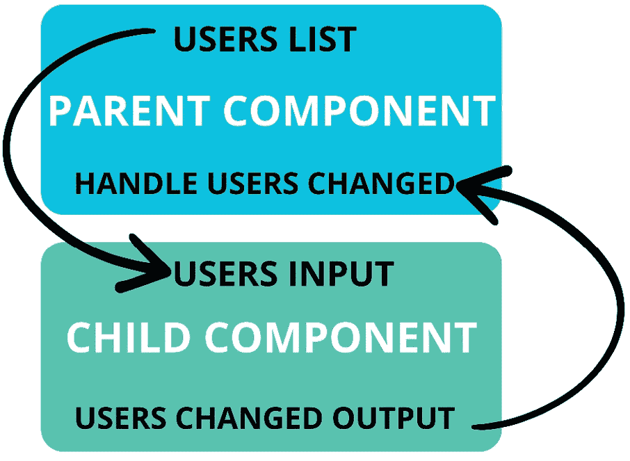
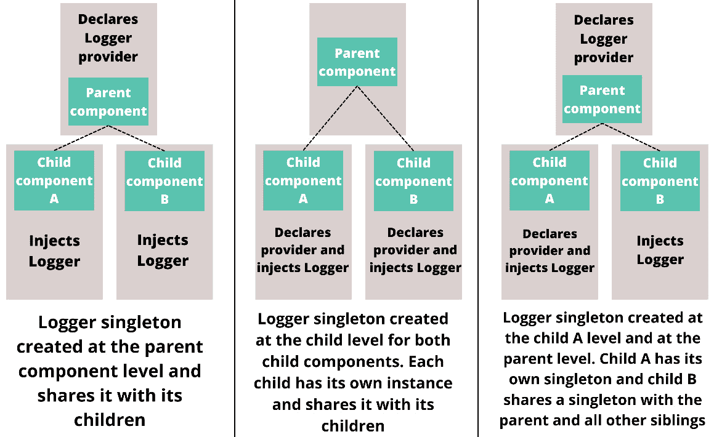

# 第二章：强大的 Angular 功能

Angular 为构建健壮的 Web 应用程序提供了所需的所有内置工具。在本章中，你将了解 Angular 框架中最新和最强大的功能。我们还将深入了解 Angular 组件通信、路由器，以及 Angular 框架中可能最重要和最强大的部分：依赖注入。到本章结束时，你将了解如何注入、消费、提供和调整依赖项的层次结构，如何组件间通信，以及如何有效地使用 Angular 路由器。

本章将涵盖以下主要主题：

+   Angular 为什么如此强大？

+   Angular 框架中的新功能

+   深入了解 Angular 路由器

+   组件通信

+   依赖注入

# Angular 为什么如此强大？

Angular 与其他流行的前端框架和库（如 ReactJS 和 VueJS）不同，因为它具有强烈的意见，并且框架本身包含了开发复杂 Web 应用程序所需的一切。

有效使用 Angular 确保了一定程度的一致性，并实施了最佳实践。这是因为 Angular 为你做了许多决定，例如使用 TypeScript，并依赖于 **面向对象编程**（**OOP**）原则和内置工具来处理诸如路由、HTTP 请求和测试等常见问题！由于 Angular 内置了所有功能，你不需要引入大量的外部包，从而减少了潜在漏洞或停止维护的包的表面。这些方面通常使得 Angular 成为构建复杂前端系统或由多个应用程序组成的企业的首选框架。

Angular 内置了构建 Web 应用程序所需的所有强大和有用的功能。如果你正在阅读这本书，你应该已经熟悉了主要功能，但我们仍将提及对框架最重要的那些：

+   **组件和服务**：组件和服务是 Angular 应用程序的基本构建块。组件用于开发可重用的 UI 元素和由这些 UI 元素组成的页面。Angular 服务通过依赖注入注入到你的应用程序中，并与后端 API 通信，处理状态管理，提供数据，并实现业务逻辑。

+   **依赖注入**：Angular 依赖注入是框架的基本概念之一，通常被认为是最强大的功能。依赖注入允许你在应用程序中注入值和逻辑。

+   **信号**：信号是 Angular 框架中的一个新概念，用于定义有状态的属性。Angular 跟踪信号值的使用位置和方法，以优化变更检测，从而提高性能。信号也是响应式的，允许你在信号值变化时自动做出反应。

+   **HTTP 客户端**: 内置的 HTTP 客户端提供了一个优雅直观的界面，用于与 API 通信和获取数据。凭借内置的功能，如请求和响应拦截器、错误处理和基于观察器的响应，Angular HTTP 客户端提供了处理 HTTP 逻辑所需的一切。

+   `component`类及其对应的模板，便于在不进行手动干预的情况下更新数据。在 Angular 框架中，数据绑定可以通过三种方式完成：使用方括号符号从组件类绑定到视图，使用事件和圆括号符号从视图绑定到组件类，以及使用方括号和圆括号符号进行双向数据绑定，也称为“盒子里的香蕉”。

+   **路由器**: Angular Router 简化了单页应用程序的创建，并具有动态路由功能。它允许开发者定义路由并将它们与特定的组件关联起来，从而实现应用程序内不同视图和页面之间的无缝导航。

+   **指令**: Angular 指令是框架的基石，允许您通过添加额外的功能和行为或添加和删除 DOM 元素来扩展 HTML 元素。

+   **管道**: 管道用于在 HTML 模板中转换和格式化数据。使用管道有助于保持模板的整洁和简洁，同时避免在组件代码中过度使用逻辑。

+   **表单**: 表单是每个 Web 应用的核心。Angular 表单有两种类型：**模板驱动表单**和**响应式表单**。凭借验证、错误处理和数据同步等功能，表单有助于您开发健壮的应用程序。

这些功能只是框架提供的最强大功能中的一部分。让我们继续前进，探索 Angular 团队在最新版本中做了哪些更改。框架正在迅速变化，新的概念和工具正在被引入，以使 Angular 更加强大和面向未来。

# Angular 框架的新功能

网络开发的世界正在迅速发展，因此，像 Angular 这样的框架必须不断成长以保持相关性。在本节中，我们将探讨 Angular 框架中的新功能以及为什么进行这些更改。

## 独立组件

在 Angular 14 版本中，**独立组件**作为开发者预览被引入；15 版本将其发布为生产使用。Angular 团队引入独立组件是为了简化我们构建 Angular 应用程序的方式。在独立组件之前，所有内容都必须在 ngModules 中声明。许多开发者不喜欢 ngModules，并且与 ngModules 相关的错误可能难以解决。

使用独立组件，您可以在不使用 ngModules 的情况下构建应用程序。组件、指令和管道可以被标记为独立，然后它们不需要在 ngModule 中声明。

在*第一章*中，我们为库和应用程序创建了 Nx 生成器，并为两者应用了独立标志。因此，当我们生成 Angular 应用程序时，它们是以独立组件创建的。让我们看看您`expenses-registration`应用程序中的`app.component.ts`文件中的装饰器：

```js
@Component({
  standalone: true,
  imports: [RouterModule], ………
})
```

如果您将此与非独立组件进行比较，您可能会注意到两个不同寻常的地方：`standalone`标志设置为`true`，组件变为独立。当某物是独立的，它必须直接在`imports`数组中导入所有依赖项，而不是从 ngModule 中获取依赖项。例如，在`app.component.html`中，我们在模板中使用路由出口，因此组件需要导入`RouterModule`；您也可以只导入`RouterOutlet`。

您也可以创建不包含任何 ngModules 的应用程序。为此，使用独立组件而不是 ngModule 来引导应用程序。我们需要查看`main.ts`文件以了解如何实现这一点。在使用 ngModules 的应用程序中，您将在`main.ts`文件中找到类似以下内容：

```js
platformBrowserDynamic().bootstrapModule(AppModule).catch()
```

在这种情况下，Angular 应用程序使用 AppModule（根 ngModule）引导。当您想要在没有 ngModules 的情况下工作，您可以更改这一点，并用您的根独立组件代替引导。如果您查看`expenses-registration 应用程序`的`main.ts`文件，您将找到以下内容：

```js
bootstrapApplication(AppComponent, appConfig).catch(……);
```

如您所见，我们使用`bootstrapApplication`函数而不是`bootstrapModule`。我们向`bootstrapApplication`函数提供了一个独立组件和一个配置对象。此配置对象配置了诸如路由、HTTP 客户端和第三方模块等内容。我们将在之后多次回到这个配置对象。现在，请记住，当使用独立组件引导时，您可以在此处配置应用程序设置。

您还可以将 ngModules 与独立组件混合使用。如果您有一个已经使用 ngModules 的应用程序，您可以在现有代码旁边开始使用独立组件，并保持您的模块不变。

现在您已经了解了独立组件的基础知识以及如何使用它们，让我们探索用于依赖注入的新`inject`函数。

## 使用`inject`函数进行依赖注入

在 Angular 14 中引入的另一个酷炫特性是`inject`函数，它是构造函数依赖注入的替代方案。到目前为止，构造函数依赖注入是向您的 Angular 应用程序注入依赖的唯一方式：

```js
constructor(private userService: UserService) {}
```

使用`inject`函数，我们有一个类似以下替代方法：

```js
private userService = inject(UserService);
```

当我们到达*依赖注入*部分时，我们将更深入地探讨这种新语法。现在，我们将继续探讨下一个新特性：指令组合。

## 指令组合

`component`装饰器。每次你在模板中使用组件时，配置的指令将自动应用，而无需将指令添加到 HTML 元素中。你还可以在其他指令内部使用指令组合，从而产生应用多个指令的指令。在*第三章*中，我们将更深入地探讨指令组合的主题。

目前，你只需要知道你可以在组件装饰器内部配置指令以共享常见行为并减少模板复杂性。现在你了解了指令组合，让我们稍微探索一下 Angular Signal。

## Angular Signal

**Angular Signal**是在 Angular 16 中引入的，这是 Angular 从 AngularJS 过渡到 Angular 以来框架最重要的变化之一。在 Angular 17 中，框架还引入了 Signal 组件输入和查询 Signal，用于使用 Signal 查询模板元素。有了 Signal，我们在 Angular 框架中有一个**响应式原语**，可以用来管理应用程序状态。

Signal 允许你声明、计算、修改和消费值以响应式的方式，这意味着当 Signal 的值发生变化时，Signal 将自动通知所有消费者。因为 Signal 是响应式的，所以当 Signal 的值发生变化时，你可以自动做出反应，当 Signal 被赋予新值时执行逻辑或更新其他值。Signal 围绕值并通过对 getter 的暴露来提供它们，这使得 Angular 框架能够跟踪谁在消费 Signal，并在值变化时通知消费者。Signal 可以围绕简单值或复杂数据结构，可以是可写的或只读的。以下是一个 Signal 和计算出的 Signal 值的简单示例：

```js
@Component({ ……… , template: `
    <div>Count: {{count()}}</div>
    <div>Double: {{double()}}</div>`
})
export class AppComponent {
  count = signal(10);
  double = computed(() => this.count() * 2);
}
```

在前面的例子中，我们有一个`count` `signal`值和一个计算出的信号，该信号将计数翻倍。当`count` `signal`值发生变化时，计算出的信号将自动计算新的值。为了更好地解释 Signal 的优势，让我们定义什么是响应式原语。在 JavaScript 中，你有原始值和非原始值。JavaScript 的原始值有`string`、`number`、`bigint`、`boolean`、`symbol`、`null`和`undefined`。非原始值是对象。

JavaScript 的非原始值是引用类型，这意味着如果你将它们分配给新变量，你不会创建一个新的对象，而是创建对现有对象的引用。原始值不是这样工作的；如果你将一个字符串分配给新变量，它不会持有原始变量的引用，而是创建一个新的字符串。原始值是不可变的，非原始值是可变的。这意味着你可以在创建非原始值之后修改它。如果你重新分配一个字符串，它是一个新的字符串，而不是具有不同值的相同字符串。当你调整对象时，它仍然是同一个对象，只是具有不同的值。

响应式原语是一个不可变值，当它被设置为新值时，会通知消费者。所有消费者都可以自动跟踪并对此响应式原语的变化做出反应。

重要提示

信号本身是一个响应式原语，且是不可变的。你只能通过在信号上使用`set()`或`update()`方法来更新信号并通知信号的消费者。

然而，信号持有的值并不是不可变的！所以，如果你使用非原始值（一个对象或数组）作为信号值，你仍然可以更新值而不更新信号本身。

由于信号是响应式原语，Angular 框架可以更好地检测变化并优化变化检测和渲染，从而提高性能。信号是迈向 Angular 版本的第一步，该版本具有完全细粒度变化检测，无需`Zone.js`根据浏览器事件检测变化。在撰写本文时，Angular 假设任何触发的浏览器事件处理器都可以更改绑定到模板的任何数据。正因为如此，每次浏览器事件被触发时，Angular 都会检查整个组件树以查找变化，因为它无法以细粒度方式检测它们。这会显著消耗资源并负面地影响性能。

在*第七章*中，我们将更深入地探讨信号，并查看不同的实现以及如何将它们与 RxJS 结合使用。现在，你只需要知道信号可以用来管理应用程序状态，并且它们引入了一个响应式原语，这可以显著提高你的 Angular 应用程序的反应性和性能。

现在你已经知道了信号是什么以及为什么它们很重要，让我们来学习新的 Angular 控制流系统。

## Angular 控制流

控制流系统是在 Angular 17 中引入的，它提供了一个新的机制来在 HTML 模板中显示、隐藏和重复元素。在 Angular 17 之前，你只能使用`*ngIf`、`*ngFor`和`*ngSwitch`指令在 HTML 模板中显示、隐藏或重复元素。

截至 Angular 17，你可以互换使用指令和新的控制流系统。让我们使用新的控制流语法查看每个选项的示例，从`@if`控制流开始：

```js
@if (a > b) {
  {{a}} is greater than {{b}}
} @else if (b > a) {
  {{a}} is less than {{b}}
} @else {
  {{a}} is equal to {{b}}
}
```

如你所见，新的控制流语法使用`@if`、`@else if`和`@else`来在 HTML 模板内定义`if`-`else`语句。新的控制流语法使得创建`if`-`else`语句变得容易得多。你可以使用控制流和指令语法，所以选择你和你团队更喜欢的。现在你已经看到了`@if`控制流的例子，让我们看看如何使用新的控制流语法在模板内重复元素：

```js
@for (item of items; track item.id) {
  <li> {{ item.name }}</li>
} @empty {
  <li> There are no items.</li>
}
```

`@for` 语法可以与 `*ngFor` 指令互换使用。新的控制流语法要求你定义一个 `track` 属性。你将 `track` 属性分配给一个唯一的标识符，例如 ID，这允许 Angular 只在渲染的列表发生变化时重新渲染更改的项目。你还可以提供一个 `@empty` 块，在提供给 `@for` 块的数组为空时显示内容。现在，你已经知道了如何使用新的控制流语法在模板中重复元素，让我们来了解 `*ngSwitch` 指令的替代方案：

```js
@switch (condition) {
  @case (caseA) { Case A. }
  @case (caseB) { Case B. }
  @default { Default case. }
}
```

就像其他控制流块一样，你可以使用 `@switch` 块与 `*ngSwitch` 指令互换。新的 Angular 控制流还引入了一个新概念：`@defer` 块。

`@defer` 块允许你在 HTML 模板中懒加载组件或原生 HTML 元素。`@defer` 块可以根据不同的触发条件懒加载和显示元素，例如当条件满足时、当元素进入视口时、当用户与占位符交互时，或者基于计时器。`@defer` 块可以提高性能，因为当用户访问页面时，不需要加载那么多的组件。此外，`@defer` 块减少了包的大小，因为懒加载的页面元素不需要包含在初始应用程序包中。以下是一个带有占位符的 `@defer` 块的示例：

```js
@defer (on viewport) {
  <calendar-cmp />
} @placeholder { <div>Calendar placeholder</div> }
```

现在你已经了解了新的控制流语法，让我们来探索 Angular 框架引入的其他功能。

## 其他值得注意的新 Angular 功能

在我们进入本章的下一节之前，我们将简要回顾对 Angular 框架所做的其他值得注意的改进：

+   **类型表单**：在 Angular 14 中，响应式表单被完全类型安全化。现在，表单控件、组和数组中的值在整个响应式表单 API 中都是类型安全的，从而使得表单更加安全。

+   将 `title` 属性添加到你的路由配置中。此 `title` 属性将设置页面标题，而无需其他实现。

+   `NgOptimizedImage` 是一个用于优化图像获取、渲染和大小的内置图像指令。自 Angular 15 以来，它已经稳定可用。

+   **函数式方法**：自 Angular 15 以来，你可以使用函数式方法进行 HTTP 拦截器、路由解析器和路由守卫。

+   **路由参数映射**：此功能允许你自动将路由数据、查询参数和路径参数映射到你的组件输入。因此，你不再需要订阅，从而减少了复杂性和样板代码。

+   `OnDestroy` 注入器，它允许你注入 `DestroyRef` 并更灵活地访问 `OnDestroy` 生命周期钩子。它允许你订阅 `OnDestroy` 生命周期，以及在你的组件外部注入它。

+   **自闭合标签**：在 Angular 16 中，你可以为你的组件选择器使用自闭合标签。这可以提高你的 HTML 模板的可读性。

+   **必需输入**：在 Angular 16 中，你可以使组件输入成为必需的。如果在模板中没有提供输入，编译器将指定一个错误。

还有更多新添加的功能，例如 Vite 支持，以及更好的页面激活，但本节中提到的功能对你的日常开发实践来说是最重要的。

现在你已经了解了添加到 Angular 框架中的新功能，我们将继续深入探讨特定主题，从 Angular 路由开始。

# 深入了解 Angular 路由

本节将介绍 **Angular 路由**，这是一个强大的工具，用于处理 Angular 应用程序中的导航。路由器负责实现无缝的页面转换，更新浏览器 URL，以及处理路由数据、重定向、查询参数、路径参数、路由解析器，以及保护路由免受未经授权的访问者。

让我们先创建两个新的组件，我们可以导航到它们。

## 创建新组件

我们将使用一个 Nx 生成器来完成这个任务。你可以编写一个自定义生成器，但我现在将使用内置的组件生成器。在你的 `expenses-registration` 文件夹内的 `app` 文件夹上右键点击，并选择 Nx 控制台。在下拉菜单中，搜索 `component` 并选择 **@nx/angular -** **component**。

按照以下步骤生成必要的组件：

1.  在 `pages/expenses-overview-page`。

1.  选择 **独立** 复选框。

1.  点击 **显示所有选项**。

1.  在 **变更检测** 选择框中，选择 **OnPush**。

在右上角，点击 **生成**。

完成这些步骤后，重复相同的步骤来创建第二个组件。你只需将名称更改为 `pages/expenses-approval-page`。

现在，让我们使用以下命令来运行 *finance-expenses-registration 应用程序*：

```js
nx serve finance-expenses-registration
```

你还可以使用 Nx 控制台来运行你的应用程序。只需在 **项目** 选项卡下选择应用程序，并在悬停在 **运行** 上后点击 **播放** 按钮。

当你在 `http://localhost:4200/` 打开应用程序时，你会看到一个空白屏幕。这是因为你只在 `app.component.html` 文件中有一个路由出口，它显示当前路由，而我们还没有为我们的应用程序配置任何路由。

你的应用程序正在运行，并且有两个组件可以路由，所以让我们为你的应用程序配置一些路由。

## 配置 Angular 应用程序中的路由

在`RouterModule`之前，我们通过在`forRoot`或`forChild`方法中提供路由来配置它。因为我们使用的是最新的 Angular 技术，所以我们将不会使用 ngModules。当你使用独立组件启动时，你的路由配置方式不同。当你打开`main.ts`文件时，你会看到一个`appConfig`对象被传递给`bootstrapApplication`函数。打开你的`app.config.ts`文件以定位这个`appConfig`对象。在里面，你会找到你的路由配置：

```js
provideRouter(appRoutes, withEnabledBlockingInitialNavigation())
```

路由是通过在`ApplicationConfig`对象的`providers`数组中添加`provideRouter`函数来配置的。当 Nx 创建应用程序时，它已经为我们设置了这一点。

在`provideRouter`函数内部，你会找到一个`Route`对象的数组和一个`with` **EnabledBlockingInitialNavigation**函数，后者是使用服务器端渲染进行路由所必需的。我们并没有使用服务器端渲染，所以你可以删除`with`**EnabledBlockingInitialNavigation**。

打开你的`app.routes.ts`文件来设置你应用程序的路由。首先，我们将在`appRoutes`数组中添加两个`Route`对象——一个用于费用审批页面，另一个用于费用概览页面：

```js
export const appRoutes: Route[] = [{ path: 'expenses-overview', component: ExpensesOverviewPageComponent },
{ path: 'expenses-approval', component: ExpensesApprovalPageComponent }];
```

如你所见，每个对象都有两个属性：一个用于定义 URL 路径的`path`属性，一个用于指定当我们到达路径时加载的组件的`component`属性。对于`ExpensesOverviewPageComponent`，我们配置了`expenses-overview`，这意味着它可以通过`http://localhost:4200/expenses-overview`访问。

当你导航到这个 URL 时，你会看到`Router`作为一个依赖项。然后，你可以使用以下语法：

```js
this.router.navigate(['expenses-overview']); //Option 1
this.router.navigateByUrl('/expenses-overview'); //Option 2
```

你可以使用`routerLink`来导航你的 HTML 模板，如下所示：

```js
<a [routerLink]="['path', { outlets: { sidebar: 'path'} }]">Click to navigate</a>
```

现在你已经配置了两个路由，让我们来看看你还可以在你的路由配置中配置什么。

## 路由配置选项

在本节中，你将使你的路由更加健壮，并探索你可以在你的路由对象上配置的属性。

### 添加页面标题

`title`属性是在 Angular 14 中添加的，用于动态设置 HTML 页面标题。在 Angular 14 之前，你需要订阅和大量的逻辑来设置页面标题。随着`title`属性的引入，Angular 在幕后处理所有这些，并为你设置页面标题。你可以使用简单的字符串或`ResolveFn<T>`来设置你的标题。当你使用字符串时，你可以使用以下语法：

```js
{ path: '', component: ExpensesApprovalPageComponent, title: 'Expenses Approval Page' }
```

我们将使用`ResolveFn<T>`来动态设置页面标题，如下所示：

```js
export const titleResolver: ResolveFn<string> =
  (route: ActivatedRouteSnapshot) =>
    route.routeConfig?.path?.replace('-', ' ') ?? '';
```

这是一个简单的例子，我们取路由路径并将连字符替换为空格，但你可以添加任何你想要的逻辑。一旦你定义了你的标题解析器，你就可以像这样将其分配给你的路由配置：

```js
{ path: '', component: SomeComponent, title: titleResolver}
```

你还可以通过覆盖 `TitleStrategy` 类来覆盖 Angular 用于向页面添加标题的默认行为。这仅在边缘情况下有用，但了解这是可能的总是好的。本书中不会涵盖示例，但你可以在本书的 GitHub 仓库中找到简单的 `TitleStrategy` 覆盖：[`github.com/PacktPublishing/Effective-Angular/blob/main/apps/finance/expenses-registration/src/app/app.routes.ts`](https://github.com/PacktPublishing/Effective-Angular/blob/main/apps/finance/expenses-registration/src/app/app.routes.ts)。

### 懒加载独立组件

`loadComponent` 属性在你的路由配置中。

自从 Angular 15 以来，路由也支持默认导入的自动展开。使用自动展开，你不需要将 `.then()` 方法链式调用以展开路由的导入。因此，我们可以使懒加载的语法更短、更简单。通过将你的组件类的导出改为 `default` 导出，将你的路由改为懒加载路由，如下所示：

```js
export default class ExpensesApprovalPageComponent {}
```

一次完成这些后，你可以这样配置懒加载路由：

```js
{ path: '……', loadComponent: () => import('@pages/expenses-approval-page/expenses-approval-page.component') }
```

为你的其他路由做同样的操作，以确保所有路由都是懒加载的。

接下来，我们将学习如何使用多个路由出口和辅助路由。

### 路由出口和辅助路由

如果你想在减少包大小的同时开发动态用户界面，**命名路由出口**是一个实现这一目标的好方法。我们不会实现命名路由出口，但我确实想解释它们是如何工作的。

使用命名路由出口，你可以懒加载页面特定部分，并根据应用状态懒加载这些页面部分的组件。例如，你可以根据应用状态在每一页或同一页上显示不同的侧边栏。因为你可以懒加载这些侧边栏组件，所以它们不会成为你的主应用包的一部分，只有在显示时才会加载。要使用命名路由出口，你需要配置一个具有 `outlet` 属性的路由，如下所示：

```js
{ path: 'list', component: SomeComponet, component property with the loadComponent property and import the component.
Routes with the `outlet` property defined can only be loaded by a router outlet with the same name specified on it. You can define named router outlets by adding a name attribute on the router outlet HTML tag like this:

```

`<router-outlet name="sidebar"><router-outlet/>`

```js

 With the named router outlet in your template and a route configuration with the `outlet` property defined, you have everything set up. Your main router outlet will work as expected and navigate to the expenses overview page when you add `/expenses-overview` after your root URL. The named router outlets work differently. The routes that are used by your named router outlets are called *auxiliary routes* and can be seen as sub-routes that operate independently from your main route. These auxiliary routes form a special kind of URL that looks like this: `http://localhost:4200/expenses-overview(sidebar:list)`.
As you can see, round brackets are added to your URL to represent your auxiliary routes. There is only one auxiliary route in our example, but there could be more, and they would all be inside the round brackets separated by a double forward slash. Your auxiliary routes are isolated inside these round brackets so that you can activate different auxiliary routes for the same main route.
Routing to auxiliary routes inside your TypeScript files can be done like this:

```

`this.router.navigate(['path', { outlets: { sidebar: 'path'} }]);`

```js

 When using `routerLink` in your HTML templates, you must add the following syntax to your HTML tag:

```

`[routerLink]="['path', { outlets: { sidebar: 'path'} }]"

```js

 Now that you know about named router outlets, let’s learn about route guards.
Route guards
The `canActivate`, `canMatch`, `canActivateChild`, and `canDeactivate` properties declare **route guards** in your route configurations. Route guards help you to secure routes and prevent users from accessing a route they are not intended to access. All four properties define a type of route guard that prevents the user from performing a specific routing task, such as activating or deactivating a route.
The implementations with the rules when these guards should allow or block a user are created by yourself and can contain any logic you need. Each route can configure multiple guard types, and you can add various implementations for each type. You can configure these guard types and the implementations for them in your route configurations, like this:

```

`{ path: '……', loadComponent: ……,`

`canActivate: [IsLoggedInGuard, IsAdminGuard],`

`canDeactivate: [hasDoneSomeTaskGuard] },`

```js

 In *Chapter 9*, we will create route guards and look at their implementations; for now, you just need to know that you can protect routes with route guards.
Now that you know about route guards, let’s move on and start learning about child routes.
Defining child routes
Route configurations can also define **child routes**, which helps organize your routes better and easily create an initiative URL structure. Child routes are defined like this:

```

`{ path: 'dashboard', component: DashboardComponent,`

`children: [{ path: 'summary', component: SummaryComponent }]}`

```js

 The preceding example would load `SummaryComponent` on the `/dashboard/summary` route. You can configure the same route without using child routes, but using child routes offers some advantages. The most apparent benefit is that you can better organize your routes. Another advantage of child routes is that you can share route resolvers and guards. When you use a route guard on a parent route, the guard will automatically be applied to all child routes. You can also use child routes to omit the round brackets in the URLs of your auxiliary routes from the named router outlets. However, there are some drawbacks to this compared to regular auxiliary routes. When using child routes to omit the round brackets, you can’t load different auxiliary routes on the same main URL; instead, you need to add a new configuration for each route and auxiliary route combination.
Fallback routes and redirecting
You can configure **fallback routes** by using a double asterisk for the path. Your fallback route will be triggered when no route to the current browser URL is found. Most of the time, the fallback route is used to display a **404 Page Not Found** error. You can configure fallback routes like this:

```

`{ path: '**', component: NotFoundComponent }`

```js

 When working with child routes and named router outlets, you can configure multiple fallback routes, but in most scenarios, one fallback that redirects to a `/expenses-overview` route when they load the root route. You can add this redirect to your `appRoutes` array like so:

```

`{ path: '', pathMatch: 'full', redirectTo: '/expenses-overview' }`

```js

 Now that you know about fallback routes, let’s dive into route resolvers.
Route resolvers
**Route resolvers** can resolve data before a route is activated and provide that data to your component. That might sound nice, but your route won’t be activated until the data is fetched and can be passed to the route. As a result, when you fetch asynchronous data and the API isn’t responding, the route will not be activated, and the user will be staring at a white screen. Resolvers should only be used if you have some edge case where a component cannot work without having specific data before the component renders. A simple implementation of a route resolver function looks like this:

```

`export const userDataResolver: ResolveFn<User> = (`

`route: ActivatedRouteSnapshot) => inject(UserService)`

`.getUserData(route.paramMap.get("userId")).catch(……);`

```js

 You can declare the route resolver on your route configurations like this:

```

`{ path: 'path', resolve: productResolver, component: ……},`

```js

 You can access the resolved data inside your components using the data property of the route snapshot:

```

`protected readonly route = inject(ActivatedRoute)`

`ngOnInit() { this.route.snapshot.data; }`

```js

 Don’t use route resolvers unless you don’t have any other option. Such scenarios don’t arise often, if at all; however, I wanted to mention resolvers and make you aware of them and their drawbacks. When working on Angular applications, you will find route resolvers quite often in the code base.
Now that you’ve created components, set up routes, and learned about the Angular router, we will learn about component communication.
Component communication
This section will dive deep into **component communication**, starting with input and output decorators. Before we begin, let’s create a new component with the Nx generator so that we have something to work with.
Name your new component `navbar` and add it to the `shared-ui-common-components` library. Don’t forget to check the `standalone` checkbox and select `OnPush` for `changeDetection`. When the component has been created, add it to the `index.ts` area of your library:

```

`export * from './lib/navbar/navbar.component';`

```js

 After that, add the `navbar` component to the `app.component.html` file of your `expenses-registration` application. It’s important to note that you need to add the `NavBarComponent` class to the `imports` array of your `app` component decorator. This is because we are using standalone components, and a standalone component needs to import everything it uses. Once you’ve added the `navbar` component to the template of your app component, you can get the code for the HTML and SCSS of the navbar from this book’s GitHub repository: [`github.com/PacktPublishing/Effective-Angular`](https://github.com/PacktPublishing/Effective-Angular).
Because `navbar` is also a standalone component, you need to add `RouterLink` and `CommonModule` to the `imports` array of the component decorator. These two imports are necessary because we use the `routerLink` and `*ngFor` directives in the template of the `navbar` component.
Now that you’ve created and added the `navbar` component to the `app` component template, we can look into parent-child component communication.
Receiving values with the @input() decorator
As we explained in *Chapter 1*, when we develop Angular applications, we divide our components into smart and dumb components. Dumb components are presentational components that are used in the templates of smart components. These dumb components should only receive data through `@Input()` decorators (alternatively, you can use the new `input()` Signal that was introduced in Angular 17; we will dive deeper into Signals in *Chapter 7*, so for now, we will use the decorator); dumb components do not inject services for data as that is the responsibility of smart components.
`@Input()` decorators are only defined on child components; the parent components pass data to the input. A component can be considered a child component when it’s declared inside another component’s HTML template. On the other hand, the component that declares a component in its HTML template is regarded as the parent component. Dumb components are always meant to be child components, whereas smart components can be both. Still, smart components are generally used as parent components and seldom declare input and output decorators.
Our newly created `navbar` component is a dumb component that’s used as a building block for our pages. Since it’s a dumb component, it must rely on input decorators to receive its data. A `navbar` component needs `navbar` items, so let’s define an interface and input. First, define the interface in a new file or underneath your `navbar` component’s class:

```

export interface NavbarItem {label: string; route: string;}

```js

 Here, we defined the interface. Now, let’s add the input to the `navbar` component, like this:

```

`@Input()` 是 `navbarItems` 字段的装饰器，它告诉 Angular 编译器该属性可以接收来自父组件的输入。我们给字段分配了 NavbarItem 数组类型和一个空数组的默认值。如果你不提供默认值，编译器将开始抱怨；你可以通过在属性名称后添加一个感叹号来防止这种情况，如下所示：

```js
@Input() navbarItemsnavbar component in the app component template from our *expenses-registration application*, making navbar a child component of the app component. To pass our new input property data, let’s declare a NavbarItem array inside the app component class, like this:

```

`navItems`: NavbarItem[] = 使用 `navbarItems` 输入属性将 `navItems` 数组传递给导航栏组件。我们可以在应用程序组件的 HTML 模板中这样做，在那里我们声明导航栏组件的 HTML 选择器标签。你可以使用此语法传递 `navItems` 数组作为输入：

```js
<bt-libs-navbar [navbarItems]="navItems" />
```

在左侧，方括号之间，你将使用在 `navbar` 组件内部声明的输入属性的属性名——在我们的例子中是 `navbarItems`。在右侧，你必须分配一个在父组件中声明的值作为输入——在我们的例子中是 `navItems` 数组。

重要的是要知道，当一个组件接收到输入值时，`ngOnChanges` 生命周期钩子会被触发——一旦这个组件被创建，在 `ngOnInit` 生命周期钩子运行之前，然后每次输入接收到新值时再次触发。你可以在 `ngOnChanges` 方法中这样访问先前和新的输入值：

```js
ngOnChanges(changes: SimpleChanges) {console.log(changes)};
```

`SimpleChanges` 对象中的当前值应该等于组件中声明的输入属性的值。因此，如果你需要当前值，你也可以访问组件属性。在我们的例子中，这将是指 `navbarItems`。

`ngOnChanges` 生命周期钩子是在接收到输入值时执行额外逻辑的好地方。然而，当你有很多输入属性并且想要为每个属性接收新值时执行逻辑，这可能会变得很混乱。如果这种情况发生，或者你想将值转换成其他形式，你可以使用 `@Input()` 装饰器作为获取器和设置器。

假设我们希望在每次接收到值时都为主页添加 `NavbarItem` 到我们的输入中，这样我们就不必在传递给 `navbar` 组件的输入对象中声明主页及其路由。我们可以通过将输入转换为具有获取器和设置器的输入来实现这一点。首先，向 `navbar` 组件添加一个私有属性，如下所示：

```js
private _navItems: NavbarItem[] = [];
```

现在，将 `navbarItems` 输入属性更改为获取器和设置器，并在获取器和设置器中使用私有属性，如下所示：

```js
@Input()
set navbarItems(value: NavbarItem[]) {
  this._navItems = [{label: 'home', route: '/'}, ...value];
}
navbarItems property inside the navbar component or template, it will use the getter, which returns the private property, including the extra home page item. After you change the input property, you can remove the object for the home navbar item from the navItems array declared in your app component.
Since Angular 16.1, you can achieve the same with the `@Input` decorator instead of creating a getter and setter. Using the `transform` property requires a lot less code and looks much cleaner. Let’s convert our getter and setter into the `transform` property. First, remove the private `_navItems` property and the getter and setter we just added and replace them with this:

```

使用转换逻辑添加 `@Input({addHome})`。你可以将此函数添加到单独的文件或位于导航栏组件类下面的同一文件中。函数看起来像这样：

```js
function addHome(items: NavbarItem[]) {
  return [{ label: 'home', route: '/' }, ...items];
}
```

这就是你所需要的；不需要更多的私有属性或 getter 和 setter 来转换输入值！如果你需要执行其他逻辑，例如设置组件属性或在 `component` 类内部运行函数，你仍然可以使用 getter 和 setter 方法。

最后，由于 Angular 16 的推出，你还可以使输入属性成为必需。当你使输入属性成为必需时，它需要在组件在组件模板中使用时在 HTML 标签上声明。在模板中使用组件的父组件必须将输入属性添加到 HTML 标签中，并传递一个有效的值；否则，编译器将抛出错误。为了使我们的 `navbarItem` 输入属性成为必需，我们可以像这样更改输入装饰器：

```js
@Input({ transform: addHome, @Output() decorator.
Emitting values with the @Output() decorator
Child components also need a way to send events and data to the parent component. For example, if you have a table component in which you can display and update data, the table component shouldn’t inject services to receive and update the data. This would result in a tight coupling of the table component and the data it displays. Each time you use the table with different data, it needs to add extra services and new logic to persist the data updates, and this is not a desirable situation.
Instead, the table component should be a dumb component that receives data as inputs and emits an event with the updated data as output. By doing so, your table component remains reusable and doesn’t create unnecessary dependencies. The parent components are smart components that are used for specific business use cases or pages, so each can implement whatever logic is needed to handle the data updates for its specific page or business use case without creating unwanted dependencies.
To emit an event to a parent component, we need to create something that can emit our events. We can do this with the following syntax:

```

`@output` 装饰器和我们的 EventEmitter 的属性名。在右侧，我们将属性分配给新的 EventEmitter，并在箭头符号之间添加我们希望发出的类型 - 在这个例子中，这是 tableData。

接下来，你需要在父组件的 HTML 模板中监听 `dataChanged` 事件，其中定义了数据表组件。监听 `@Output` 与监听常规 DOM 事件（如 *click* 和 *mouseleave*）的工作方式相同：

```js
<bt-lib-table (click; in our example, we named the event dataChanged. On the right-hand side, you call a function you’ve created in the component class of the parent component. So, $event will contain whatever values you emit from the child component.
Lastly, we must *emit* events from the child component using the `dataChanged` property. Inside the `table` component, whenever the data changes and you want to emit an event to the parent, you can use the following syntax:

```

在 this.dataChanged.dataChanged 属性上调用 .emit() 方法。你可以在括号内传递你想要向父组件发出的任何值。在这个例子中，这将是最新的表格数据。为了更好地说明输入和输出机制的工作原理，*图 2**.1* 展示了数据从父组件流向子组件以及相反的过程：



图 2.1：层次依赖创建

现在你已经知道如何使用 `@output` 装饰器向父组件发出事件，让我们探索如何结合输入和输出装饰器来创建自定义的双向数据绑定。

使用 @Input 和 @Output 的双向数据绑定

`select` 下拉组件具有两个输入属性，一个用于选择选项，另一个用于选中选项。除此之外，该组件还有一个 `selectionChanged` 输出，当进行新的选择时，会发出一个值。

在父组件中，我们有一个用于选择组件当前选中值的属性。这个属性被用作选中输入的输入，并且每当选择新的值并且发出 `selectionChanged` 输出时，需要更新这个属性。为了实现这一点，你必须在父组件的模板内部有类似以下的内容：

```js
<select [selected]= "selectedValue" (selectionChanged)="this.selectedValue = $event" />
```

我们可以通过双向数据绑定和香蕉盒语法来改进前面的代码片段。为了使双向数据绑定工作，子组件中的输入和输出属性必须具有相同的名称；只需要在名称后添加 `changed`。因此，在我们的例子中，输入被命名为 `selected`，这意味着输出需要被命名为 `selectedChanged`。当我们使用这种命名约定时，Angular 会知道将其处理为双向数据绑定。

要使用双向数据绑定，在父组件中，我们必须更新 HTML 如下所示：

```js
<select selectedValue property of the parent component as an input to the selected input property of the child component. When the child component emits the selectedChanged event, the selectedValue property will automatically be updated in the parent component. Take a look at the following syntax:

```

`<select [(selected)]= "selectedValue" />`

```js

 This is the same as using the following:

```

`<select [selected]= "selectedValue" (selectedChanged)="this.selectedValue = $event" />`

```js

 As you can see, the banana-in-a-box syntax combined with the square and round brackets is much cleaner and more compact. Alternatively, you can use the new `model()` Signal that was introduced as a developer preview in Angular 17.2, but we will cover this scenario in *Chapter 7*.
Now that you know how to input, output, and two-way bind properties with the input and output properties, let’s look for another way to communicate data between components and routes.
Other component communication methods
There are a few other means of communication for Angular components. You can access public properties and methods of child components with the `@ViewChild` decorator, communicate with child, parent, sibling, and unconnected components with *services*, and pass data in various manners to components with the *router*. Let’s start with the `@``ViewChild` decorator.
Using the @ViewChild decorator to access child components
The `@ViewChild` decorator is used to access template elements inside the component class. As in alternative to the decorator, you can also use the new `viewChild()` Signal that was introduced in Angular 17.2; we will cover this in more detail in *Chapter 7*. Using the `@ViewChild` decorator to access or update child properties and methods is straightforward but has some drawbacks. When using `@ViewChild` to communicate with your components, you can mutate values within your child component, which can lead to unexpected behavior and bugs that are hard to debug. Besides that, it makes your component hard to test. If you have a scenario where you need to update properties from the child in the parent, here’s the syntax:

```

@ViewChild(NavbarComponent) navBar!: NavbarComponent;

```js

 Here, you declare the decorator; inside the function brackets of the decorator, you enter the child component’s class name, then give it a variable name and type it with the component’s class name. After the view of the parent component has been initialized, you can access the child component and its public properties and methods like this:

```

this.navBar.navbarItems;

```js

 As mentioned previously, I’m not a fan of this decorator, and it’s recommended not to use it unless you need to achieve something that can’t be done in another way.
Now that you know how to use the `@ViewChild` decorator to access properties and methods in child components, let’s explore communication through the Angular router.
Component communication with the Angular router
The *router* is meant to navigate between routes but can also send data to a component that’s been loaded on a route. The most common examples are route parameters and additional query parameters in the route, but you can also add data to the route using the `data` property in the route configuration or with route resolvers.
Let’s say we have the following route configuration:

```

const routes = [{ path: 'dashboard/:id',

component: DashboardComponent,

data: `{caption: 'Dashboard caption'}`,

resolve: `{permissions: DashboardResolver}}]`

```js

 We also have this URL in our browser: [`some-url.com/dashboard/123?queryParam=paramValue`](https://some-url.com/dashboard/123?queryParam=paramValue).
When we reach this route, the `dashboard` component will be loaded. In that component, we can access the dashboard ID, the caption we added to the `data` property, the resolved permission data, and the value of the `query` parameter. To do so, you need to inject `ActivatedRoute` into the constructor or use the `inject` function:

```

private route = inject(ActivatedRoute);

```js

 After that, you can access the properties in the route snapshot like this:

```

this.route.snapshot.paramMap.get('id');

this.route.snapshot.queryParamMap.get('queryParam');

this.route.snapshot.data['caption'];

this.route.snapshot.data['permissions'];

```js

 You can also access the properties more reactively by subscribing – just remove the `snapshot` property and then add your subscription logic instead of accessing the properties through the `get` method:

```

this.route.queryParamMap.subscribe(……)

```js

 You can subscribe to the router’s `paramMap`, `queryParamMap`, and `data` objects. Since Angular 16, you can also directly bind the route values to your component’s `@Input()` decorators. To achieve this, you need to add `withComponentInputBinding` to your app config where you provide your routes:

```

提供路由器（appRoutes，组件类，如下所示：

```js
@Input() caption?: string;
@Input() id?: string;
@Input() queryParam?: string;
@Input() permissions?: string;
```

如果您想使用不同的属性名称，您可以像这样为输入创建别名：

```js
@Input('caption') captionFromRouteData?: string;
```

这可能会给您带来一个 linting 错误，因为不建议别名输入，但使用输入别名绑定路由数据时，这不是一个坏习惯。因此，在这种情况下，如果您遇到错误，可以禁用 linting 规则。

现在您已经了解了使用装饰器和路由数据进行组件通信的所有内容，我们将开始探讨依赖注入，它可以用于向应用程序的每个部分提供数据。

依赖注入

`@Injectable()` 装饰器)，但它们可以是字符串、函数或您希望在应用程序中提供的任何其他内容。

`Injector` 抽象是 Angular 依赖注入系统的核心元素，它促进了依赖项提供者和消费者之间的连接。确保您区分 `Injector` 和 `@Injectable()` 装饰器，后者将类标记为依赖注入的候选者。`Injector` 抽象检查依赖项的实例是否已经创建，如果依赖项已经注册，则提供它；如果没有注册，则提供依赖项并注册。当您的应用程序启动时，Angular 创建一个应用程序范围的 *root* `Injector`，并为所有应用程序中不可访问的依赖项创建所需的其他 `Injector`。

提供依赖项

您可以提供类和其他值，如字符串、日期、对象和函数作为依赖项。两者提供方式不同。我们将从最常见的情况开始，即提供类。

提供作为依赖项的类

当您在 Angular 中提供类时，它很可能是 Angular 服务，但您可以通过依赖注入提供任何类。准备类以进行依赖注入的最常见方法是使用`@Injectable()`装饰器，如下所示：

```js
@Injectable()
class SampleService {}
```

`@Injectable()`装饰器表明一个类用于依赖注入；您可以通过将其标记为根注入器或将其添加到特定组件或 ngModule 的`providers`数组中来实现这一点。`@Injectable()`装饰器还确保 Angular 可以执行如摇树优化等优化。您也可以在`providers`数组中提供没有`@Injectable()`装饰器的类，但除非您需要在特定位置提供这些类，否则这是一个好习惯。以下是如何在组件的`providers`数组中提供服务的示例：

```js
@Component({……… , providers: [SampleService] })
class ListComponent {}
```

当使用组件级别的`providers`数组时，提供的依赖项对于每个组件实例以及组件树中使用的所有子组件或指令都可用。如果您在 ngModule 的`providers`数组中添加依赖项，则该依赖项可以在该模块内的任何地方注入和访问。您可以在模块的`providers`数组中声明类，如下所示：

```js
@NgModule({ declarations: [ListComponent],
  providers: [SampleService]})
class AppModule {}
```

在我们的*支出注册应用程序*中，我们没有 ngModules。当在不使用 ngModule 开发 Angular 应用程序时，您可以在`ApplicationConfig`对象中提供依赖项；这类似于将依赖项标记为根注入器，因为它将在整个应用程序中可用。在`ApplicationConfig`对象内部将类添加到`providers`数组中的操作如下：

```js
export const appConfig: ApplicationConfig = {
  providers: [SampleService],
};
```

最后，将您的类作为依赖项提供的最常见方法是将其标记为*根*注入器。您可以在`@Injectable()`装饰器中使用`providedIn`属性来完成此操作，如下所示：

```js
@Injectable(@Injectable() decorator, let’s learn how to provide classes and other values such as strings, Booleans, and functions using provider objects.
Providing dependencies with provider objects
When you provide dependencies with a `providers` array. You can use two properties to declare a dependency with a provider object:

*   `provide` property holds the `Injector` instance.
*   `Injector` how to create the dependency, and it can be defined with four values:
    *   `useClass`: This tells Angular to provide the given class when the corresponding provider token is used
    *   `useExisting`: This aliases another provider token and accesses the same dependency with two different tokens
    *   `useFactory`: This defines a factory function to construct the dependencies based on some logic
    *   `useValue`: This provides a static value such as a string or date as a dependency

Now, let’s explore the four provider definitions in more detail.
Declaring provider objects with useClass
Here’s an example of a provider object using the `useClass` provider definition:

```

providers: [{ provide: Logger, useClass: Logger }]

```js

 The preceding syntax is the same as using the following syntax:

```

providers: [Logger]

```js

 In the scenario where you only supply a class name, the provider object is automatically created behind the scenes. The provider object uses the class for the provider token and definition, so when would you use the provider object instead of only using the class?
Commonly, `useClass` is used when you want to overwrite a dependency injection class with a new implementation. In the preceding example, we provided a `Logger` class; let’s say you create a new `BetterLogger` class extending the original `Logger` class. If you have a large application and the `Logger` service is used throughout your application, it’s a lot of work to change the service everywhere it’s declared. Instead of updating all dependency injection consumers, you can create a provider object and return the `BetterLogger` class for the `Logger` token:

```

providers: [{ provide: Logger, useClass: BetterLogger }]

```js

 If you provide the `Logger` service inside the `providers` array as well, you must make sure that you declare the new provider object with the `BetterLogger` class below your previous provider object, or simply remove the old object. If the `Logger` service is provided using the `providedIn` property inside the injectable decorator, the overwrite with `BetterLogger` will just work without any gotchas.
Now that you know how to create provider objects with the `useClass` provider definition, let’s examine the `useExisting` provider definition.
Declaring provider objects with useExisting
The `useExisting` property allows you to map one provider token to another provider token, making sure two tokens will return the same dependency:

```

providers: [BetterLogger,

{ provide: Logger, BetterLogger 和 Logger 标记。这两个都将提供相同的服务实例。请注意不要为此使用 useClass 定义：

```js
providers: [ BetterLogger,
  { provide: Logger, Logger and BetterLogger that each return an instance of the BetterLogger class instead of the same instance.
Now that you know about `useExisting`, let’s explore `useFactory`.
Declaring provider objects with useFactory
The `useFactory` provider definition allows you to define a function as a dependency. This can be just a regular function you want to inject into multiple places of your application or a factory function that constructs a service class. Let’s say you have `AdminDashboardService` and a regular `DashboardService` you want to inject using the `DashboardService` tokens, depending on the active user role. You can achieve this with `useFactory`. First, create your factory function:

```

const DashboardServiceFactory = (userService: UserService) => userService.user.isAdmin ? new AdminDashboardService() : new DashboardService();

```js

 Next, declare the provider object inside your `providers` array, like this:

```

{ provide: DashboardService,

UserService 用于检查当前用户是否为管理员用户。因此，您需要在提供者对象的 deps 数组中添加 UserService。

现在您已经了解了`useFactory`，让我们导出`useValue`。

使用 useValue 声明提供者对象

`useValue`提供者定义是最简单的一种。它返回一个常量值，如字符串、日期或布尔值。它对于提供诸如基本网站 URL、基本 API URL 或其他常量值等非常有用：

```js
{ provide: BASE_URL, InjectionToken object.
Using InjectionToken as a provider token
When you declare a provider object, you supply the `provide` property with a provider token. The provider token is used to inject the dependency into the consumers of the dependency. You can use three values for the provider token, but only two should be used. You can use a class name, `InjectionToken`, or a string. Only the class name and `InjectionToken` should be used. When providing a class-based dependency, you should use the class name as the provider token; when using a non-class-based dependency, you should use an `InjectionToken` object. You can create an `InjectionToken` object like this:

```

export const BASE_URL = BASE_URL – and assign it with new InjectionToken. The value between the arrow brackets is the type of your dependency – in this example, a string – and the value between the round brackets is a description for your InjectionToken. Now, you can use this InjectionToken in a provider object like this:

```js
{ provide: BASE_URL, useValue: 'www.someurl.com/'}
```

当分配提供者令牌时，您也可以使用一个简单的字符串，如下所示：

```js
{ provide: InjectionToken instead of a string:

*   `InjectionToken` objects are type-safe and allow TypeScript to perform type-checking on your injected value. When you use a simple string, the compiler will not know what type your dependency is.
*   When using a string, you can run into name collisions, meaning you can assign two dependencies with the same string, which can result in wrongly injected values, errors, and bugs. This doesn’t have to be because you define two dependencies with the same string; it can also happen when a dependency you use from a third-party library uses the same string as a provider token. The `InjectionToken` object ensures a unique value is used for your provider token.
*   When you minify your code during the production build, string values can be renamed. This can result in problems with your dependency injection system.

Now that you know how to provide dependencies and what `InjectionToken` objects are, let’s learn how to inject and consume dependencies.
Injecting dependencies
There are two ways to inject dependencies: `inject` function, you can improve some architectural patterns and inject values in places where you don’t have a constructor. You can inject services everywhere within your Angular applications – in component classes, services, other classes, and even in functions you export. Let’s examine how to inject class-based dependencies using constructor injection and the `inject` function, starting with constructor injection:

```

constructor(private logger: LoggerService) {}

```js

 Doing the same thing with the `inject` function looks like this:

```

private logger = InjectionToken as a provider token. The syntax to do this is slightly different in the case of constructor injection. You need to use the @Inject() decorator function inside your constructor like this:

```js
constructor(InjectionToken-based dependencies with the inject function can be done like this:

```

private logger = inject(LoggerService);

```js

 As you can see, you don’t need the `@Inject()` decorator for the `inject` function; you can simply use `InjectionToken` inside the function brackets of the `inject` function, and the rest is done for you. After injecting a dependency, you can use it like any other value:

```

inject function, why you should use it instead of constructor injection, and where to declare the inject function.

使用 `inject` 函数进行更好的依赖注入

`inject` 函数比构造函数注入更灵活，因为它可以在更多地方使用，并且在使用继承时表现更好。您可以在任何地方声明 `inject` 函数，但它需要在 *注入上下文* 内运行；否则，您将得到一个错误。注入上下文位于类的构造函数中，在 `useFactory` 的工厂函数、路由守卫、路由解析器和 HTTP 拦截器中初始化类内部的字段：

```js
export class AppComponent {
  private url = inject(BASE_URL); // Is injection context
  constructor() { // Is injection context }
  someMethod() { // No injection context }
}
```

`inject` 函数的主要优点之一是它允许您将逻辑抽象到函数中。假设您想获取仪表板；您可以使用 `inject` 函数将此逻辑抽象到单独的函数中。为此，您可以创建一个如下所示的函数：

```js
export const fetchDashboards = (): Observable<Dashboard[]> => inject(HttpClient).get<Dashboard[]>('api/dashboards');
```

在这里，我们使用箭头函数。因为我们没有使用括号，所以箭头函数直接返回箭头后面的内容。这与写这个相同：

```js
export const fetchDashboards = (): Observable<Dashboard[]> => inject function to inject the Angular HttpClient as a dependency to fetch the dashboards. You can use this fetchDashboards function inside the injection context of your components and services. For example, you can assign the function to a component property and subscribe to it in your template using the async pipe:

```

export default class DashboardsListComponent {

dashboards$ = fetchDashboards();

}

```js

 Now, inside the template of this component, you can do something like this:

```

<h1 *ngFor="let dashboard of (dashboards$ | async)">

{{dashboard.title}}

</h1>

```js

 When using the `fetchDashboards` function outside the injection context, such as in a method, you get an error telling you that the `inject` function can’t be used outside the injection context. But there is a solution to this: you can use JavaScript closure to use the `fetchDashboards` function anywhere, even outside the injection context. To use closure, adjust the `fetchDashboards` function so that it returns a function:

```

返回组件类时，必须将此闭包函数分配给一个属性，如下所示：

```js
protected _fetchDashboards = fetchDashboards();
```

`fetchDashboards` 函数返回另一个函数，因此 `_fetchDashboards` 属性也是一个函数。现在 `_fetchDashboards` 函数持有返回获取仪表板的可观察 HTTP 调用的函数，可以在您的类的任何地方使用，也可以在注入上下文之外使用：

```js
export default class AppComponent {
  private _fetchDashboards = fetchDashboards();
  loadDashboards() { this._fetchDashboards().subscribe(…) }
}
```

在将 `fetchDashboards` 函数转换为可以使用闭包之前，它不能在组件的 `loadDashboards` 函数内部使用，因为这是在注入上下文之外。通过使用闭包并将函数返回到我们的注入上下文中的一个属性，我们现在可以在注入上下文之外使用该函数来获取仪表板。使用这种模式可以实现逻辑和具有单一职责的函数的高度抽象，这些函数可以在整个应用程序中共享，同时保持组件类简单且干净。

除了将逻辑抽象到专用函数之外，`inject`函数在处理继承时提供了一些优势。当在基类及其继承自基类的类中同时使用依赖注入时，你需要调用`super()`并将依赖项传递给基类。以下是一个简单的示例：

```js
export class baseService {
  constructor(private router: Router) { }
}
export class DashboardService extends baseService {
  constructor(private logger: Logger, router: Router) {
    super(router);
  }}
```

调用`super()`并传递依赖项可能会成为一种阻碍，看起来很杂乱。使用`inject`函数，你可以防止这种情况发生。通过在两个类中都使用`inject`函数，你不再需要传递任何东西或调用`super()`方法：

```js
export class baseService {private router = inject(Router);}
export class DashboardService extends baseService {
  private logger = inject(Logger);
}
```

如你所见，你不需要将`router`传递给基服务，也不再需要调用`super()`；这看起来要干净得多！假设你只在基类内部使用`router`进行导航。在这种情况下，你甚至可以更进一步，将导航功能抽象成一个单独的闭包函数，就像我们之前在`fetchDashboards`函数中所做的那样：

```js
export const navigateFn = () => (url: string) => inject(Router).navigate([url]);
export class baseService {
  protected _navigateFn = navigateFn();
}
```

由于我们使用了一个返回另一个箭头函数的箭头函数，我们可以在注入上下文外部使用`_navigateFn`。在继承基类的服务内部，你可以使用以下代码进行导航：

```js
this._navigateFn('some/url');
```

现在你已经知道了为什么、何时以及如何使用`inject`函数而不是构造函数注入，让我们来探讨依赖注入是如何创建注入服务的实例以及什么是分层注入器。

依赖实例、注入层次结构和解析修饰符

你需要学习的最后一件事是 Angular 如何创建你注入的依赖项的实例，注入层次结构是如何工作的，以及如何使用解析修饰符来控制它。

每次你注入一个依赖项时，Angular 都会检查依赖项是如何提供的，从注入层次结构的最低级别开始检查——即你组件或指令内部的`providers`数组。如果 Angular 找不到提供者，它将开始在注入层次结构中向上移动，首先移动到父组件；如果它在任何父组件中找不到提供者，Angular 将检查组件的 ngModule 或如果你不使用 ngModules，则检查你的`ApplicationConfig`对象。如果 Angular 在 ngModules 中找不到提供者，它将在根注入器中查找带有`@Injectable`装饰器和`providedIn`根的服务。如果 Angular 仍然找不到注入依赖项的提供者，它将抛出一个错误。如果你在服务中注入一个依赖项，Angular 将跳过组件层次结构的步骤。

假设我们想将 `LoggerService` 注入为依赖项。当 Angular 找到 `LoggerService` 的提供者时，它会检查注入器是否已经在提供者所在的层次级别创建了 `LoggerService` 的实例。如果注入器已经为给定的层次级别创建了 `LoggerService`，则返回已创建的实例。否则，它将创建一个实例然后返回。对于每个层次级别，将创建一个单例实例，并由所有较低层次级别的消费者共享。如果有两个或更多兄弟组件声明了提供者，将为每个提供者创建一个单例，每个组件将使用自己的 `LoggerService` 单例，并将其与所有后续子组件和指令共享。

*图 2**.2* 展示了层次依赖的创建和共享方式：



图 2.2：层次依赖创建

了解 Angular 依赖注入如何创建和共享依赖项，使您能够为应用程序的所有部分提供正确的实例。如果您想使单例在应用程序的所有依赖项消费者之间共享，您只需在根注入器中提供依赖项即可。在某些更复杂和边缘情况下，您可能需要能够更多地控制 Angular 查找提供者的方式。在这种情况下，您可以使用解析修饰符来调整行为。

您可以对注入的依赖项应用四种解析修饰符。每种修饰符都有自己的功能，并且您应用这些修饰符的方式取决于您是否使用构造函数注入或 `inject` 函数。让我们来检查这四种解析修饰符及其功能：

+   `@Optional()`: `@Optional()` 修饰符确保依赖项是可选的。如果 Angular 找不到给定依赖项的提供者，它不会抛出错误。

+   `@SkipSelf()`: 使用 `@SkipSelf()` 修饰符，您告诉 Angular 应该从依赖项层次结构中的第一个父组件开始查找提供者。

+   `@Self()`: `@Self()` 修饰符告诉 Angular 只查看组件或指令本身以查找提供者。

+   `@Host()`: `@Host()` 属性将组件标记为在搜索提供者时的最后一步，即使树中还有更高层的组件。当找到 `@Host()` 属性时，Angular 会停止寻找依赖提供者。

现在您已经了解了可用的解析修饰符及其功能，让我们看看如何将它们应用到依赖项上。当您想将解析修饰符应用到使用构造函数注入注入的依赖项时，您可以使用以下语法：

```js
constructor(inject function, you can use the following syntax:

```

logger = inject(Logger, {optional: true, self: true});

```js

 Now that you know everything you need to know about Angular dependency injection, let’s create a simple service before we move on to the next chapter.
To create this service, we are going to use the Nx generator again. First, create a new library called `expenses` under the `finance` domain with its type set to `data-access`. Next, open your Nx console again and click `service` and select **@schematics/angular -** **service**.
Follow these steps to generate the service:

1.  In the `services/expenses`.
2.  In the `finance-data-access-expenses`.
3.  In the top-right corner, click **Generate**.
4.  Go to the `index.ts` file of your *expenses library* and add the following code:

    ```

    export * from './lib/services/expenses.service';

    ```js

That’s all for now! With that, you’ve created a service and know everything you need to know about Angular dependency injection.
Summary
In this chapter, we explored some of the most fundamental features in the Angular framework and learned what Angular added in their latest major releases. You learned about Signals, the new control flow syntax, and `@defer` blocks. We covered how to communicate between components using input and output decorators, as well as less conventional methods for component communication using router data and the `viewChild` decorator. You also learned about the Angular router and how to configure route objects for more advanced scenarios and auxiliary routes. Finally, you learned about dependency injection in great detail. You now know what the difference is between constructor injection and dependency injection when using the new `inject` function. We also created some `provides` arrays and demonstrated how to declare the injection value and token. Lastly, you learned about the injector hierarchy and how you can control the provider that should be used by applying resolution modifiers.
In the next chapter, we will learn about Angular directives, pipes, and animations.

```

```js

```

```js

```

```js

```

```js

```

```js

```

```js

```

```js

```

```js

```

```js

```

```js

```

```js

```

```js

```
