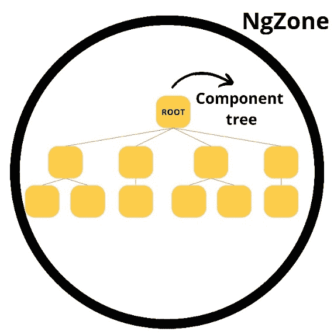
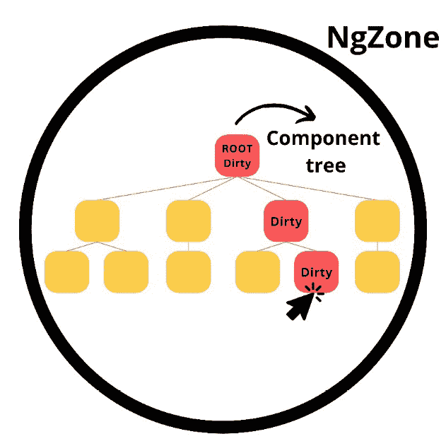
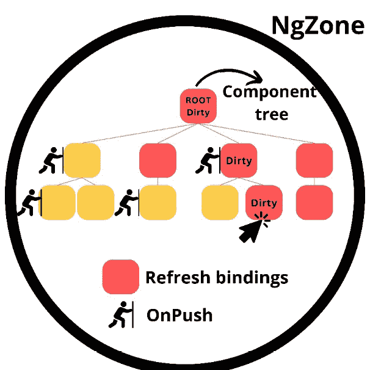

# 第九章：提升 Angular 应用程序的性能和安全

在本章中，你将学习如何提高你的 Angular 应用程序的性能和安全。你将深入研究 Angular 的变更检测机制，以便你知道如何减少 Angular 在浏览器中需要检查变更和重新渲染的组件数量。接下来，你将了解你可以采取哪些措施来优化 Angular 应用程序的页面加载时间和运行时性能。一旦你知道如何提升 Angular 应用程序的性能，你将学习有关安全性的知识。你将了解在构建 Angular 应用程序时可能遇到的风险，以及如何减轻这些风险，以便为你的最终用户提供安全的应用程序。

本章将涵盖以下主题：

+   理解 Angular 变更检测

+   提升 Angular 应用程序的性能

+   构建安全的 Angular 应用程序

# 理解 Angular 变更检测

对于小型应用程序，性能通常不是瓶颈。然而，当应用程序增长并且你开始添加和组合更多组件时，你的应用程序可能会变慢，损害用户体验并降低用户留存率。你的应用程序变慢的一个原因是，如果你在开发时没有采取措施帮助 Angular 执行更好的变更检测，Angular 将检查越来越多的组件以查找变更。因此，为了构建性能良好的 Angular 应用程序，你需要了解**变更检测机制**是如何工作的，这样你就可以减少框架需要检查变更和重新渲染的组件数量。

为了更好地理解问题，你必须首先了解 Angular 如何执行变更检测以及问题从何开始。

假设你有一个简单的组件，具有标题属性和`changeTitle()`函数，如下所示：

```js
title = 'Some title';
changeTitle(newTitle) { this.title = newTitle }
```

如果你调用`changeTitle()`函数，Angular 可以在更改标题后保持一切同步。在调用栈中，Angular 将首先调用`changeTitle()`函数，随后所有后续函数都将由于调用`changeTitle()`函数而被调用。然后，在幕后，Angular 将调用一个`tick()`函数来运行变更检测。变更检测将运行整个组件树，因为你可能在一个或多个组件内部更改了服务中使用的值。这种场景将按预期工作；尽管 Angular 必须检查整个组件树，但它将保持应用程序状态和视图的同步。

现在，假设你在更新标题属性之前运行一些异步代码；问题将始于这个场景。Angular 会检测到 `changeTitle()` 被调用并运行变更检测。由于调用栈的工作方式，Angular 不会在调用后台运行变更检测的函数之前等待异步操作完成。因此，Angular 将在更新标题属性之前运行变更检测，导致应用程序损坏，因为仍然显示旧值。

重要提示

实际上，异步更改不会破坏代码和视图之间的同步，因为 Angular 使用 Zone.js 来解决这个问题！

现在你已经知道异步更改可能导致未检测到的更改。接下来，让我们了解 Zone.js 以及 Angular 如何使用它来处理这个问题，以便它可以成功执行同步和异步更改的变更检测。

## Zone.js 和 Angular

`Zone.JS` 库通过猴子补丁（即动态更新运行时行为）浏览器 API，并允许你挂钩到浏览器事件的生存周期。这意味着你可以在浏览器事件发生前后运行代码。使用 Zone.js，你可以创建一个 **Zone**，在 Zone 内部代码执行之前和所有 Zone 内部代码完成之后（包括异步事件）运行代码。

为了演示这一点，这里有一个这样的 Zone 的简单示例：

```js
const zone = Zone.current.fork({
  onInvokeTask: (delegate, current, target, task, applyThis, applyArgs) => {
    console.log(‹Before zone.run code is executed');
    delegate.invokeTask(target, task, applyThis, applyArgs);
    console.log('After zone.run code is executed');
  }
});
zone.run(() => {
  setTimeout(() => {
    console.log(‹Hello from inside the zone!›);
  }, 1000);
});
```

在前面的代码中，创建了一个 Zone，并在 Zone 内部执行异步代码——在我们的例子中是一个 `setTimeout` 函数。前面的代码将首先记录在 `delegate.InvokeTask()` 方法之前声明的消息。接下来，它将运行在 `zone.run()` 回调函数内部声明的代码；这可以是同步和异步代码。最后，当回调函数内部的代码完成时，将记录在 `delegate.InvokeTask()` 方法之后声明的消息。

在幕后，Angular 使用与我们的 Zone 示例类似的方法创建了一个围绕整个应用程序的 Zone，称为 `onMicrotaskEmpty`，当队列中没有更多微任务时，它会发出一个值。Angular 使用这个 `onMicrotaskEmpty` 可观察对象来确定 NgZone 内部的所有同步和异步代码何时完成，Angular 可以安全地运行变更检测而不会错过已更改的值。

在 **图 9**.1 中，你可以看到 Angular 创建的 NgZone 如何围绕整个组件树，允许 Angular 安全地监控异步更改：



图 9.1：NgZone 内部的组件树

在运行变更检测时，Angular 将检查组件树中的所有组件，如果任何绑定发生变化（绑定是绑定到 HTML 模板的值），则更新和重新渲染组件。

现在您知道了 Angular 如何在所有同步和异步任务完成后使用 Zone.js 触发变化检测，以及 Angular 在变化检测运行时检查整个组件树。让我们学习为什么 Angular 检查整个组件树，以及您如何在变化检测运行时减少 Angular 必须检查和重新渲染的组件数量。

## 提高变化检测效率

Angular 将组件标记为 `OnPush` 变化检测策略，如下面的代码所示：

```js
@Component({
  changeDetection: ChangeDetectionStrategy.OnPush
})
```

当使用 `OnPush` 变化检测策略时，Angular 只会对标记为脏的组件执行变化检测，这显著减少了必须检查和重新渲染的组件数量。有几个因素会将组件标记为脏：

+   组件内部处理的浏览器事件（悬停、点击、键入等）

+   改变的组件输入值

+   组件输出发射

当组件被标记为脏时，Angular 也会将组件的所有祖先标记为脏。在 *图 9**.2* 中，您可以可视化地看到这一点，以更好地理解概念：



图 9.2：脏组件树

现在，使用 `OnPush` 变化检测策略且未标记为脏的组件在 Angular 运行变化检测时不会被检查更改，这减少了框架必须检查的组件数量。Angular 也会跳过使用 `OnPush` 且未标记为脏的组件的所有子组件。

*图 9**.3* 展示了使用 `OnPush` 策略的变化检测机制：



图 9.3：使用 OnPush 策略的变化检测

如您在 *图 9**.3* 中所见。Angular 不会检查是否需要使用 `OnPush` 变化检测策略刷新非脏组件的所有子组件的绑定。这也说明了为什么在使用 `OnPush` 时，所有祖先组件都必须标记为脏。Angular 从顶部向下检查是否需要刷新绑定，从根组件开始。因此，如果您在组件树底部的组件上点击，Angular 会从根组件开始，逐层向下遍历组件树。如果点击的组件的父组件使用 `OnPush` 变化检测策略，并且该组件未标记为脏，Angular 将跳过其子组件。结果，Angular 不会检查您点击的组件，导致代码和视图不匹配，因为与点击相关的更改将不会被处理。由于上述原因，当组件使用 `OnPush` 变化检测时，Angular 必须将所有父组件标记为脏。

对于`OnPush`变更检测，另一个有趣的案例是 Observables。Observables 是 Angular 框架中处理异步事件和数据流的主要工具，但接收新值的 Observables 不会将组件标记为脏。因此，当使用`OnPush`变更检测策略时，如果 Observables 接收新值，组件将不会更新。为了解决这个问题，你可以使用`async`管道，因为`async`管道会自动标记组件为检查，并像常规事件一样处理更新，标记组件为脏并在之后运行变更检测。或者，你可以使用`ChangeDetectorRef`并手动调用`markForCheck()`或`detectChanges()`方法，如下所示：

```js
cd = inject(ChangeDetectorRef)
this.cd.markForCheck();
this.cd.detectChanges();
```

`markForCheck()`方法将在下一个变更检测周期中将组件标记为检查，而`detectChanges()`方法将立即将组件标记为脏并触发该特定组件的变更检测。

然而，在使用`detectChanges()`方法时你必须小心，因为它也可能导致性能问题。`detectChanges()`方法将在单个浏览器任务中运行整个变更检测，直到该任务完成才会释放主线程。例如，当你需要在屏幕上显示一个大型数组并且必须频繁检测该数组的变更时，这会给浏览器带来大量工作，从而减慢你的 Angular 应用程序。

现在你已经更好地理解了`OnPush`变更检测的工作原理以及如何标记组件为脏或手动运行变更检测，让我们学习一下 Angular 变更检测机制是如何处理信号的。

## Angular 变更检测和信号

在 Angular 17 中，**信号**作为开发者预览版发布，随之变更检测机制也得到了升级。当在模板中使用信号时，Angular 会注册一个效果，该效果监听模板中使用的信号。当信号值发生变化时，效果会运行并将组件标记为 Angular 变更检测需要检查的组件。

当组件被标记为检查，因为信号值发生变化时，变更检测周期的工作方式将有所不同。首先，信号值发生变化的组件将收到一个`RefreshView`标志。接下来，它将遍历组件树并标记所有祖先组件为`HAS_CHILD_VIEWS_TO_REFRESH`。它不会将祖先组件标记为脏。现在，当变更检测运行时，Angular 将执行所谓的**全局+局部**（**glo-cal**）变更检测。

当运行全局变更检测时，组件树将自顶向下进行检查，就像通常一样。但是，当 Angular 遇到带有 `HAS_CHILD_VIEWS_TO_REFRESH` 标志的非脏 `OnPush` 组件时，它将跳过 `OnPush` 组件，但会继续向下遍历组件树以查找带有 `RefreshView` 标志的组件。因此，只有带有 `RefreshView` 标志的组件将被更新和重新渲染；所有使用 `OnPush` 变更检测策略的父组件将不会被检查或重新渲染，这进一步提高了 Angular 变更检测机制的效率。

你现在知道了 Angular 变更检测的工作原理以及如何使用 `OnPush` 变更检测策略来使变更检测过程更高效。然后，你学习了在使用 `OnPush` 变更检测为组件处理可观察对象的方法。你还知道如何使用 `markForCheck()` 和 `detectChanges()` 函数手动标记组件以进行检查或运行变更检测。最后，你看到了如何通过结合使用信号和 `OnPush` 变更检测策略以及触发全局变更检测来进一步提高变更检测的效率。所有这些更改都将显著提高应用程序的性能，尤其是在应用程序增长并且你有大型且复杂的组件树时。

在下一节中，我们将探讨其他方法来提高您的 Angular 应用程序的性能。

# 提高 Angular 应用程序的性能

使用尽可能多的组件在 `OnPush` 变更检测策略上理解 Angular 的变更检测工作，并使用信号来进一步改进变更检测，这是构建高性能应用程序的良好第一步。然而，当开发高性能应用程序时，框架还有更多可以提供的内容。

在本节中，我们将探讨可用于提高 Angular 应用程序性能的内置工具和技巧，以确保快速页面加载和良好的运行时性能。我们将首先探索用于提高性能的第一个内置工具 `runOutsideAngular()` 方法。

## 理解和使用 runOutsideAngular() 方法

在 Angular 应用程序中，优化性能有时需要执行特定任务在 Angular 区域之外。在前一节中，你学习了关于 Zone.js 的内容，Angular 如何使用它来创建 NgZone，以及它与变更检测和应用程序的更新行为之间的关系。`runOutsideAngular()` 方法提供了一种在 Angular 的变更检测机制之外运行特定代码的方式，这可以提高应用程序的响应性和效率。

通过使用`runOutsideAngular()`在 Angular 的 Zone 外执行任务，您可以防止不必要的变更检测周期被触发。这可以导致更平滑的用户交互，并减少与 Angular 的变更检测机制相关的开销。在 Angular Zone 外执行的任务不会被 Angular 的变更检测周期自动检测，从而提高应用程序的整体性能。

`runOutsideAngular()`方法由 Angular 的 NgZone 服务提供。`runOutsideAngular()`方法可以在 NgZone 外运行重计算函数。一些重计算函数的例子包括复杂的数学计算、排序大型数组以及处理大型数据集。您可能希望在 NgZone 外运行的其他场景如下：

+   **运行第三方库中的代码**：在 Angular Zone 外运行与初始化、配置或与第三方库交互相关的代码，可以防止 Angular 执行不必要的变更检测，从而提高性能并避免潜在的副作用。

+   **处理 WebSocket 通信或长轮询请求**：这涉及到频繁更新应用程序状态，而不触发用户发起的操作。

+   **涉及低级 DOM 操作或 canvas 绘图操作的动画或渲染优化**：在 Angular Zone 外运行相关代码可以通过绕过 Angular 的变更检测并允许对渲染更新有更直接的控制来提高性能。

通过战略性地使用`runOutsideAngular()`，您可以提高 Angular 应用程序的性能和响应速度，尤其是在处理计算密集型任务或与外部库交互时。然而，平衡性能优化与保持应用程序的完整性和功能至关重要。当在`runOutsideAngular()`内运行任务时，变更检测将不会检测到这些任务，因此您可能会向用户显示错误的数据。对此的一个良好对策是在`runOutsideAngular()`方法内运行重计算，然后通过使用`run()`方法再次在 NgZone 内将值分配给组件属性，如下面的代码所示：

```js
@Component({……})
export class ExampleComponent {
  protected readonly ngZone = inject(NgZone);
  performTask(): void {
    this.ngZone.runOutsideAngular(() => {
      console.log(‹Task performed outside Angular Zone›);
      // Run inside the runOutsideAngular method again
      this.ngZone.run(() => {
        console.log(‹Running inside NgZone again›);
      });
    });
  }
}
```

在前面的代码中，您可以看到如何使用`runOutsideAngular()`和`run()`方法。您注入 NgZone 并调用 Angular 提供的服务上的方法。在每个方法的回调中，您可以在 NgZone 内或外执行任何逻辑。

现在您已经了解了如何使用`runOutsideAngular()`在 NgZone 外运行代码以提高应用程序的性能，让我们继续了解 Angular 提供的下一个工具，以开发更高效的应用程序：`NgOptimizedImage`指令。

## 理解和使用 NgOptimizedImage 指令

在构建高性能应用程序时，优化图像是另一个关键方面。您的图像加载时间对网站的最大内容渲染时间（**Largest Contentful Paint**，**LCP**）有很大影响，这是三个核心 Web Vital 指标之一[其他两个核心 Web Vital 指标是**首次输入延迟**（**FID**）和**累积布局偏移**（**CLS**）]。LCP 表示网页主要内容的加载速度，具体测量从用户触发页面加载到浏览器窗口可见区域内显示最大图像或文本块之间的持续时间。由于图像的加载时间通常比文本内容长，因此图像的加载和显示方式在应用程序的 LCP 中起着至关重要的作用。

在 Angular 框架中，您可以通过使用 `NgOptimizedImage` 指令来改进图像的加载方式。`NgOptimizedImage` 指令专注于优先加载 LCP 图像。

默认情况下，此指令为非优先图像启用懒加载，节省带宽并提高初始页面加载时间。此外，`NgOptimizedImage` 在文档头部生成一个 `preconnect` 链接标签，优化资源获取策略。`NgOptimizedImage` 自动在 `img` 标签上设置 `fetchpriority` 属性，强调 LCP 图像的加载优先级。此外，该指令简化了生成 `srcset` 属性的过程。通过使用 `srcset` 属性，浏览器请求适合用户视口的图像大小，因此不会浪费时间和资源下载过大的图像。

除了优先加载 LCP 图像外，`NgOptimizedImage` 还确保应用一系列图像最佳实践：

+   **图像 CDN 利用**：该指令鼓励使用图像内容分发网络（CDN）的 URL，以促进图像优化并在全球网络中高效传输。

+   如果 `NgOptimizedImage` 设置错误或未设置尺寸，将导致警告。通过设置宽度和高度属性，您可以减轻布局偏移，提高您的 CLS，并确保正确的渲染。

+   `NgOptimizedImage` 会提醒开发者注意渲染图像中可能出现的视觉扭曲。

既然您已经知道了为什么需要 `NgOptimizedImage` 指令，让我们看看如何使用它。`NgOptimizedImage` 指令是独立的，因此您首先需要将 `NgOptimizedImage` 指令直接导入必要的 `NgModule` 或独立组件。接下来，您可以通过将 `img` 标签上的 `src` 属性替换为 `ngSrc` 来使用 `NgOptimizedImage`：

```js

```

如前所述，您还需要设置宽度和高度属性：

```js


```js

 All LCP images should be marked as priority. If you don’t mark an LCP image as priority during development, Angular will log an error.
Besides the `priority` attribute, another useful attribute used with the `NgOptimizedImage` directive is the `fill` attribute, like so:

```

当你想要图像填充包含元素时，使用`ngSrc="dog.jpg"`和`fill`属性。当你想将图像用作背景图像，或者当你不知道图像的确切大小，但想将其适应一个你知道其相对于屏幕大小的大小时，可以使用填充属性。当使用填充属性时，你不需要设置宽度和高度属性，因为 Angular 会在大小解决后为你设置它们。

要控制图像如何填充容器，你可以使用`object-fit` CSS 属性。

更多信息

除了`priority`和`fill`属性之外，当使用第三方服务处理你的图片时，`NgOptimizedImage`指令还有更多酷炫的功能，例如低分辨率占位符和自定义图片加载器。这些功能超出了本书的范围，但如果你有兴趣，可以在官方 Angular 文档中阅读有关它们的内容：[`angular.io/guide/image-directive`](https://angular.io/guide/image-directive)。

现在你已经了解了`NgOptimizedImage`以及如何使用它来优化你的图像并提高应用程序的 LCP，让我们深入了解下一个性能优化步骤：在 HTML 模板中使用`trackBy`或`track`函数进行循环。

理解和使用 trackBy 和 track 函数

在 Angular 应用程序中，渲染大量列表或数据集合有时会导致性能问题，因为频繁的 DOM 操作。为了优化你的 Angular 应用程序的性能，了解并利用像`trackBy`或`track`函数这样的工具至关重要。

`trackBy`函数是 Angular 提供的一个功能，它通过在`*ngFor`指令渲染列表时提高性能。`track`函数是 Angular 控制流语法的对应物。`trackBy`函数是可选的，而`track`函数在使用控制流语法时是必需的。

默认情况下，Angular 使用对象标识符来跟踪`*ngFor`指令提供的数据的变化。然而，这种方法可能导致 DOM 元素的不必要重渲染，尤其是在处理动态数据时。`track`和`trackBy`函数允许 Angular 通过为每个项目提供一个唯一标识符来高效地跟踪集合中的变化。这导致 DOM 操作更少，显著提高了渲染性能，尤其是在处理大量数据集时。

当你使用`*ngFor`指令时，你需要将`trackBy`属性分配给一个函数，并在你的组件类内部声明相应的函数。该函数应该返回你想要用来跟踪你正在渲染的列表中项目的唯一标识符：

```js
<div *ngFor="let item of items; *ngFor directive and defining the trackBy property. The trackBy property is assigned with a function named trackById. This trackById function has to be declared inside the component class, like this:

```

trackById(index: number, item: Item) { return item.id }

```js

 In the preceding example, you use the `id` property from the objects you are rendering with the `*ngFor` directive as the unique identifier (this assumes the objects have an `id` property, otherwise you return another unique property). It’s important to note that the `trackBy` function should only be used when the items in the collection have a unique identifier. Using a non-unique identifier or omitting the `trackBy` function altogether can lead to unexpected behavior and performance issues.
When using the control flow syntax to output a list inside your HTML template, the syntax is a bit simplified. Instead of a `trackBy` function, you now use the `track` function and directly provide it with the unique property to check instead of creating a function that returns the unique property, like so:

```

@for (item of items; track item.id) { … }

```js

 Now that you know why you need to use `trackBy` and `track` functions when rendering lists in your HTML templates, let’s explore web workers, the next performance optimization that Angular has at its disposal.
Understanding and using web workers in Angular
**Web workers** allow you to execute CPU-intensive tasks within a separate thread running in the background, thereby making the primary thread free to update the user interface and run the main threat without any hiccups. Whether it involves intricate tasks such as producing **computer-aided design** (**CAD**) drawings or conducting complex geometric computations, applications can leverage web workers to enhance overall performance significantly.
You add a web worker to your application with an Nx generator. Open the **NX console**, click on **generate**, search for web worker, and select the **@nx/angular – web worker** generator. Next, you need to give your web worker a name and select a project to add the web worker to. If you work without Nx, you can run the following CLI command:

```

ng generate web-worker <location>

```js

 Running the Nx generator or Angular CLI command will configure your project to use web workers if it isn’t configured already. It will also generate a file with your web workers. If you named your web worker `heavy-duty`, the generated file will be named `heavy-duty.worker.ts`; when using the Angular CLI, the name of the file will equal the location you provided in the CLI command.
Inside the generated worker file, you will find the initial scaffolded code you need for your web worker. When using Nx, you’ll find the following code in the generated file:

```

addEventListener('message', ({ data }) => {

const response = `worker response to ${data}`；

postMessage(response);

});

if (typeof Worker !== 'undefined') {

const worker = new Worker(new URL('./heavy-duty.worker', import.meta.url));

worker.onmessage = ({ data }) => {

console.log(`页面收到消息 ${data}`);

};

worker.postMessage('hello');

} else { // 环境回退 }

```js

 The `addEventListener` function will stay in the worker file, and the rest of the code must be located in the component or service where you want to use the web worker. By moving everything but the `addEventListner` function, you can send messages from the component or service to the web worker. As you can see, in the code that must be moved, there is a fallback for environments where the web worker doesn’t work. This is because when using server-side rendering, web workers do not work and you need to have a fallback.
To work with the web worker, you need to send messages to and from the web worker to perform the logic you need to perform. For example, let’s say you want to use the web worker when a component is initialized. To achieve this, you add the following code inside the component where you want to use the web worker:

```

@Component({……})

export class FooComponent {

heavyDutyResult;

heavyDutyInput = {……};

constructor() { this.runWebWorker() }

runWebWorker () {

if (typeof Worker !== 'undefined') {

const worker = new Worker(new URL('./heavy-duty.worker', import.meta.url));

worker.onmessage = ({ data }) => {

this.heavyDutyResult = data;

};

worker.postMessage(this.heavyDutyInput);

} else { // 回退 }

}

}

```js

 As you can see in the preceding code, you use `worker.postMessage` to send a message to the web worker. This is received inside the event listener of the web worker. When the `postMessage()` function is called in the web worker, it will be received in the `worker.onmessage()` callback function inside the component. Now, you only need to update the web worker file to perform the heavy-duty logic:

```

addEventListener('message', ({ data }) => {

const response = heavyDutyFunction(data);

postMessage(response);

});

```js

 As you can see in the preceding code, we perform some logic – in this example, an imaginary `heavyDutyFunction()` – and send the response back to the component using the `postMessage()` function. Now the circle is complete. You can send some data from the component to the web worker and the web worker will receive this data, perform the heavy-duty logic with the data, and returns the `response` constant to the component class.
Now you know how to use a web worker to create multithreading and run resource-intensive code without blocking your main threat. To wrap up the section, I will mention some other methods you can use to improve the performance of your Angular applications:

*   **Lazy loading**: Lazy loading routes help to only load sections of your app that the user actually reaches. We already showcased this in *Chapter 2*, but it’s worth mentioning as a performance optimalization.
*   `preloadingStrategy` on your routes, you can also pre-load routes you anticipate the user will navigate.
*   `Record` classes, for example. For API requests, I can recommend using `ts-cachable`.
*   **Using pure pipes**: We already explained the usage of pipes and what pure pipes are in *Chapter 3*, but they are worth mentioning as a performance optimalization.
*   `canMatch` route guard combined with lazy-loaded routes prevents you from loading modules and components the user is not allowed to access.
*   **Using RxJS effectively**: Running code asynchronously doesn’t block your threat and can help to improve the performance of your application.
*   `ng add @angular/ssr` command, you can enable server-side rendering, greatly improving the performance of your application. We will not cover server-side rendering in further detail, but as of Angular 17, you can also include page hydration when using server-side rendering, further enhancing the performance.
*   **Virtual scrolling**: Virtual scrolling is a feature in the Angular Material CDK that enables you to effectively render large lists. The virtual scroll will ensure that only items within the viewport are rendered.

You now know how to improve the performance of your Angular applications using `OnPush` and Signals, run code outside the NgZone or create multithreading using web workers, optimize images using the `NgOptimizedImage` directive, and render lists in a performant way by utilizing the `trackBy` and `track` functions. You also learned about other tools and tips to further enhance the performance of your Angular applications. Next, we will learn how you can improve the security of your Angular applications.
Building secure Angular applications
In a world where hacks and exploits are more frequent than ever, you are also responsible for developing secure applications. In this section, we’ll delve into the various security risks that Angular applications may face and explore strategies to mitigate them effectively.
When it comes to securing frontend applications, you want to ensure that the users can’t reach parts of your application they are not intended to go to and that they can’t perform malicious actions that will compromise your application. We will first look at the first scenario and ensure that users can’t reach sections of your applications they are not intended to reach.
Setting up route guards
**Route guards** are used to guard specific routes within your Angular application. They prevent unauthorized users from accessing certain parts of your application. For example, most parts of your application should only be accessible to users who are logged in; other routes might be restricted based on user roles or other factors. Within Angular, there are four different types of route guards:

*   **canActivate**: Determines whether the user can activate a specific route.
*   **canActivateChild**: Determines whether the user can activate the child routes of a specific route.
*   **canDeactivate**: Determines whether a user can deactivate a specific route.
*   `canActivate` is that if the `canMatch` guard fails, the module or standalone component related to the route is not loaded at all. Using `canMatch` offers some performance benefits when combined with lazy-loaded routes.

Since Angular 15, route guards have been implemented using a functional approach; in earlier versions, a class-based approach was used. The class-based approach is currently deprecated, so we will only cover the functional approach. You can declare each guard type you want to use in your route configuration, like this:

```

{

path: '…',

loadComponent: () => import('……'),

canMatch: [],

canActivate: [],

}

```js

 As you can see, you define the guards in the route configuration object. Each guard type is assigned an array containing the guard function that it should resolve before the user can access the route. Each guard function returns a Boolean: `true` if the guard passes and the user can access the route, or `false` if the guard fails and the user can’t access the route.
In its simplest form, you can define the guard function directly inside the array assigned to the guard type property:

```

canMatch: [() => inject(UserService).loggedIn],

```js

 In the preceding example, we `inject` a service and check whether the user is logged in (we did not create the service in this book; this is just an example). If the `loggedIn` property is `true`, the user can access the route. If the `loggedIn` property is `false`, the user can’t access the route.
In some scenarios, you might need access to route properties or the current component. If this is the case, you create a function that implements the `CanActivateFn`, `CanActivateChildFn`, `CanDeactivateFn`, and `CanMatchFn` type aliases. When using these type aliases, Angular provides the function with some function parameters you can use inside the guard logic:

*   `ActivatedRouteSnapshot` and state of type `RouterStateSnapshot`.
*   `CanActivateFn` type alias.
*   `currentRoute` of type `ActivatedRouteSnapshot`, `currentState` of type `RouterStateSnapshot`, and `nextState` of type `RouterStateSnapshot`.
*   `route` of type `Route` and `segments` of type `UrlSegment[]`.

You use the type aliases by defining a function that resolves in a `Boolean`. You type the function with the type alias and include the function parameters inside the function brackets. Here is an example implementing the `CanMatchFn` type alias:

```

export const hasRouteSegments: CanMatchFn = (route: Route, segments: UrlSegment[]) => {

return inject(UserService).loggedIn && segments.length > 1;

};

```js

 In the preceding example, we check whether the user is logged in and whether there is more than one route segment. To use this guard, you add it to the array of the `canMatch` property inside the route configuration:

```

canMatch: [hasRouteSegments]

```js

 You can also directly implement the type alias inside the array without defining the function elsewhere:

```

canDeactivate: [(component: UserComponent) => !component.hasUnsavedChanges]

```js

 Now you know how to define functional route guards and prevent unauthorized users from accessing routes they aren’t allowed to access.
Although this already makes your application more secure, there are other risks when building Angular applications whereby users can perform malicious activities. So, let’s outline some attack surfaces and learn how you can mitigate them.
Angular attack surfaces and how to mitigate them
Before delving into +Angular-specific security measures, it’s essential to understand the common threats that web applications face. These threats include **cross-site scripting** (**XSS**), **cross-site request forgery** (**CSRF** or **XSRF**), injection attacks, and HTTP-level vulnerabilities such as **cross-site script** **inclusion** (**XSSI**).
Angular has some built-in tools to reduce the security risks of these attacks for you and there are some preventive measures you can take yourself when developing your Angular application. Let’s start with the most prevalent risk when developing frontend applications: XSS attacks.
Mitigating XSS attacks
In simple terms, you block XSS attacks by preventing malicious code from entering the `<script>` tag into the DOM. Other HTML elements that allow code exaction and can be used by attackers include the `` and `<a>` tags. An attacker can use an XSS attack to hijack user sessions, steal sensitive data, or deface websites.
Angular takes a proactive approach to security, treating all values as untrusted by default. This means that when values are inserted into the DOM via template binding or interpolation, Angular automatically sanitizes and escapes untrusted values. This approach significantly reduces the risk of XSS attacks, a prevalent security vulnerability. Even though Angular proactively sanitizes and escapes untrusted values, there are still some actions you can take to make your applications even safer and protect them from security vulnerabilities.
Values inserted into the DOM via template binding or interpolation are automatically sanitized and escaped if the values are not trusted. On the other hand, Angular trusts HTML templates by default, because of which you should treat HTML templates as executable code. Never directly concatenate user input and template syntax because this would enable an attacker to inject harmful code into your application. Here is an example of what you should avoid:

```

<div>{{ data }}</div> + userInput

```js

 One way to reduce the template risks is by using the default **ahead-of-time** (**AOT**) template compiler when creating production builds. Because the AOT compiler is the default, you don’t have to do anything unless you change the default compile settings.
Other possible attack surfaces for an XSS attack are `style`, `innerHTML`, `href`, and `src` bindings where the bound value is provided by the user:

```

<div [innerHTML]="htmlSnippet"></div>

<div [style]="userProvidedStyles">...</div>

```js

 Attackers can use unsafe binding to inject harmful code or URLs into your application. Besides unsafe bindings, you also should avoid direct interaction with the DOM. If you bind an unsafe value, Angular will recognize it in most cases and sanitize it by removing the unsafe value. It’s good to be aware of this because it can lead to broken functionality in your application. Also, some attackers might be able to circumvent the sanitation, so be careful when using unsafe binding options. If you want to bind a URL, script, or other value that Angular will sanitize and you know the value is safe, you can bypass the sanitation using the `DomSanitizer` service provided by Angular.
If you want to bypass sanitation, you start by injecting the `DomSanitizer` service:

```

protected readonly sanitizer = inject(DomSanitizer);

```js

 Next, you can use the bypass methods exposed by the service to bypass sanitation:

```

this.trustedUrl = this.sanitizer.bypassSecurityTrustUrl(this.dangerousUrl);

```js

 The `DomSanitizer` service exposes five different options to bypass sanitation:

*   `bypassSecurityTrustHtml`
*   `bypassSecurityTrustScript`
*   `bypassSecurityTrustStyle`
*   `bypassSecurityTrustUrl`
*   `bypassSecurityTrustResourceUrl`

Depending on what value you are bypassing, you use the corresponding `bypassSecurity` method, so to bypass the sanitation of a piece of HTML, you would use the `bypassSecurityTrustHtml` method.
Besides binding unsafe values, another possible attack surface is direct manipulation of the DOM. The built-in browser DOM APIs don’t protect you from security vulnerabilities unless `Trusted Types` are configured. For example, elements accessed through `ElementRef` instances, the browser document, and many third-party APIs contain unsafe methods. You should avoid interacting with the DOM directly and instead use the `Renderer2` service when you need to manipulate DOM nodes.
Lastly, you can configure a **Content Security Policy** (**CSP**) to prevent XSS attacks. A CSP can be enabled on the web server and falls out of scope for this book.
You now know what XSS attacks are, what Angular does to prevent them, and what measures you can take to prevent them. Next, you will learn what vulnerabilities there are when making HTTP requests and what you can do in your Angular applications to prevent them.
Mitigating HTTP-related security risks
Ensuring robust security measures against HTTP-related risks is paramount to safeguarding your application and its users. Two significant threats to consider are CSRF (or XSRF) and XSSI. In this section, we will dive deeper into CSRF and XSSI and explain what they are, how they can affect your applications and users, and what measures you can take to prevent CSRF and XSSI exploits.
While CSRF and XSSI predominantly have to be mitigated on the server side, Angular does provide some tools to make the integration with the client side a bit easier. We will start by explaining what CSRF is and what you need to do on the client side to prevent it.
What CSRF/XSRF attacks are and how to prevent them
Imagine you’re logged into your online banking account in one tab of your browser. Now, if you visit a malicious website in another tab, that site can secretly make requests to your banking website without your knowledge. These requests could transfer money, change your password, or perform any action that your banking website allows – all without your consent.
CSRF/XSRF attacks can have serious consequences. They can lead to unauthorized transactions, data manipulation, and even account takeovers. Since the attacker doesn’t need to know your login credentials, these attacks can bypass traditional authentication mechanisms.
To protect against CSRF/XSRF attacks, websites typically use techniques such as CSRF tokens. These tokens are unique identifiers generated by the server and sent to the frontend. The frontend includes these random tokens with each request so the server can verify the token, ensuring that the request originated from a legitimate source and not from a malicious website. Commonly, the token is sent to the frontend using a cookie flagged with `SameSite`. If the cookie also includes the `httpOnly` flag, you don’t have to do anything on the frontend and everything will be handled on the backend, but this isn’t always the case; often, you must include the token in the request headers.
Using a CSRF token is an effective measure because all browsers have the same-origin policy. The same-origin policy ensures that only the code of the website where a cookie is set can read the cookie. The same-origin policy also ensures that a custom request header can be set by the code of the application making the request. That means that malicious code from the website the attacker tricked you into using cannot read the cookie or set the headers for your request. Only the code of your own application can do this.
If the cookie with the CSFR token is not an `httpOnly` cookie and the client is required to add the cookie in the request header, you can create an HTTP interceptor for this purpose. Here is an example of how the interceptor could be implemented:

```

export const MockInterceptor: HttpInterceptorFn = (

req: HttpRequest<unknown>,

next: HttpHandlerFn,

) => {

const csrfToken = inject(AuthService).getCsrfToken();

const csrfReq = req.clone({

setHeaders: {

'X-XSRF-TOKEN': csrfToken,

},

});

return next(csrfReq);

};

```js

 Besides adding a CSRF token, there isn’t anything you can do on the frontend to protect your application from CSRF attacks. If you need to add the token, it depends on how the server side implements the cookie, so consult with the backend team about this topic.
Now that you know what CSRF/XSRF attacks are, let’s learn about XSSI attacks.
What XSSI attacks are and how to prevent them
XSSI attacks occur when an attacker injects malicious scripts into a web page from an external domain. These scripts are executed in the context of the victim’s session, potentially compromising sensitive information and performing unauthorized actions. XSSI attacks can lead to data theft, session hijacking, and unauthorized manipulation of user interactions.
XSSI attacks are also known as the `<script>` tag, malicious actors can execute unauthorized requests and retrieve sensitive information from the targeted JSON API.
The success of this exploit hinges on the JSON data being executable as JavaScript. To prevent XSSI attacks, servers can adopt a preventive measure by prefixing all JSON responses, rendering them non-executable. Conventionally, this is achieved by appending the widely recognized `)]}',\``n` string.
The `HttpClient` of the Angular framework is equipped to handle this security measure seamlessly. It detects and removes the `)]}',\n` string from incoming responses automatically before proceeding with further parsing, thus fortifying the application against potential exploits. Because Angular automatically detects the `)]}',\n` string and removes it for you, you don’t have to do anything for XSSI prevention in the frontend, but it’s always good to be aware of the attack and how it actually can be prevented. If your backend team uses a different prevention measure, align with it to see whether you need to do anything in the frontend.
Summary
In this chapter, you learned about performance and security. You took a deep dive into Angular change detection, giving you a better understanding of how Angular detects changes and how you can reduce the number of components and bindings that Angular has to check when performing change detection.
You also learned about other measures you can take to ensure your Angular applications remain performant. You learned how to run code outside of the Angular zone, you learned about the `NgOptimizedImage` directive, you learned about the `trackBy` and `track` functions, and you’ve created your own web worker to run code in a separate threat. Furthermore, you learned that you can use lazy loading, `canMatch`, server-side rendering, and other tools provided by the Angular framework to enhance application performance even more.
After taking a deep dive into Angular application performance, you learned how you can develop secure frontend applications using the Angular framework. You learned how to prevent users from accessing pages they aren’t intended to reach. You also learned about common exploits, what measures Angular takes to prevent these attacks, and what steps you can take to make your application even more secure.
In the next chapter, you will learn how to make your applications more accessible and tailored to the users visiting them. You will learn about translatable content, using the correct formatting and symbols for each user, and making your website accessible to people of all abilities.

```

```js

```
