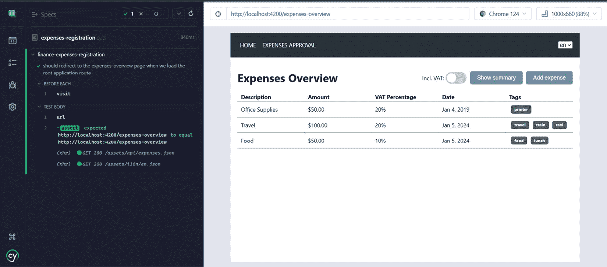
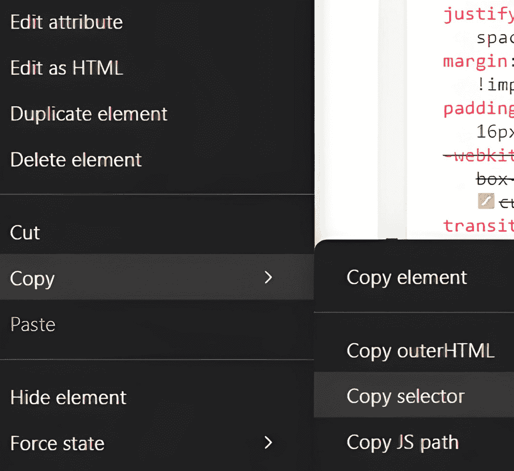

# 第十一章：测试 Angular 应用程序

为您的应用程序编写自动化测试与编写应用程序代码一样重要。许多开发者不喜欢编写测试或者完全跳过它们，因为他们觉得这太耗时了，但随着您的应用程序和工作空间的增长，拥有自动化测试变得越来越关键。当您在一个庞大的应用程序上工作时，您的更改可能会影响整个应用程序中的许多方面。小的更改可能会影响许多事物，当您在一个被许多应用程序使用的库中进行更改时，这一点尤为明显。您经常会发现自己处于这样的场景中：做出更改，甚至不知道您的更改会影响哪些应用程序的表面。因为您不想破坏功能，所以您不想每次更改时都手动处理或手动测试整个工作空间；您需要能够为您测试所有受影响代码的自动化测试。自动化测试将帮助您以不同的方式看待您的代码；它们可以帮助您编写更好、更坚固的代码。自动化测试还会在早期阶段捕捉到错误，并且应该让您有信心在所有测试成功通过后安全地将代码更改发布到生产环境。

本章将深入探讨不同类型的自动化测试以及它们在您的 Angular 应用程序中的目的。接下来，您将更深入地探讨单元测试的主题，并通过为我们的 Nx monorepo 编写单元测试来获得一些实践经验。最后，您将了解更多关于端到端测试的知识，并获得一些使用 Cypress 编写端到端测试的经验。到本章结束时，您将了解为什么您需要自动化测试以及如何为您的 Angular 应用程序编写它们。

本章将涵盖以下主题：

+   不同类型的应用程序测试

+   使用 Jest 对 Angular 应用程序进行单元测试

+   使用 Cypress 对 Angular 应用程序进行端到端测试

# 不同类型的应用程序测试

在软件在日益重要的世界中扮演越来越重要角色，而我们构建的应用程序变得越来越复杂的情况下，自动化测试正变得越来越关键。公司不断寻求改进他们的应用程序，以给用户提供更好的体验。为了实现这一点，许多公司追求持续交付他们的软件，这意味着他们的更新可以在任何给定时间自动发布到生产环境。为了确保您可以在不破坏生产环境中的事物的情况下安全地发布更新，您需要能够在您的构建管道中运行的自动化测试，在将更改发布到您的测试、验收和生产环境之前自动测试您的软件。

随着应用程序变得更加复杂，手动测试所有更改变得过于耗时，并且由于您的代码更改而未测试到的风险显著增加。手动测试也慢得多，重复且无聊。耗时、繁琐和重复的任务往往会被跳过，导致错误。所有这些人工劳动对于企业来说也是一笔相当大的开销，因此拥有一个健全的自动化测试系统是必需的。

除了加快测试过程并减少错误率外，自动化测试还应让您有信心，合并的任何代码都不会破坏现有的应用程序代码。如果您曾在没有良好测试套件的环境中合并过大型代码更改，您就知道这是一次多么令人紧张的经历，并且您从未真正有信心您的更改没有破坏任何东西。如果有测试，它们会捕获错误并帮助您以不同的方式思考您的代码实现，但能够有信心地发布更改是我们编写自动化测试时试图实现的真实目标。

当涉及到为您的 Angular 应用程序进行自动化测试时，您可以将其分为四大主要类型：

+   单元测试

+   端到端测试

+   组件测试

+   集成测试

让我们了解这四种测试类型，它们在 Angular 应用程序中的使用方式以及它们之间的区别。

## 理解单元测试

软件测试的基本方面之一是**单元测试**。简单来说，单元测试验证代码的小单元，通常是单个函数、属性或方法。单元测试用于测试属性在不同场景下的更新行为和函数的实现。给定一个特定的输入，您期望函数返回一个特定的值并更新某些属性。单元测试在与其他应用程序代码隔离的情况下运行，因此您可以在不受应用程序代码其他部分影响的情况下测试代码的小单元；这样，您可以根据其实现快速确定函数是否按预期工作。

开发应用程序的一种常见且流行的技术是**测试驱动开发**（**TDD**）。简单来说，当您使用 TDD 来开发应用程序时，您首先编写测试场景，然后编写代码实现。以这种方式开发代码允许您从另一个角度审视您的代码实现。编写测试有助于您以不同的方式看待代码实现。尽管如此，当您首先编写所有想要覆盖的可能测试场景，然后编写代码实现之后，这会改变您的视角。

在 Angular 应用程序中，单元测试通常使用 **Jest** 或 **Karma** 等框架来实现，通常测试特定的 Angular 组件、服务、管道或指令。这些测试对于验证每个代码单元是否按预期行为，遵守其定义的规范和需求至关重要。通过隔离每个代码单元，开发者可以在开发早期识别并解决错误和问题，从而促进更健壮和稳定的应用程序。

在 Angular 应用程序中，单元测试的主要目的是让开发者对其代码实现有信心，确保属性得到更新，函数按预期工作。通过在不同场景下彻底测试单个代码单元，开发者可以确保每一行代码都按预期工作，即使代码库随着时间的推移而演变和变化。这种信心对于开发者能够有信心地对应用程序进行更改和改进至关重要，同时确保现有功能保持完整。

单元测试的一个特点是它们运行速度快，允许开发者在开发过程中多次运行它们，这使得早期识别意外的副作用和错误变得容易。单元测试还旨在覆盖代码库的特定百分比。通常，公司喜欢测试 80% 到 100% 的代码行、函数和分支（或路径）；大多数单元测试框架可以强制执行这些阈值，所以如果你没有足够的测试覆盖率，就不能合并代码。

总结来说，单元测试用于测试如函数、方法和属性等小的代码单元。通过单元测试，你可以在不同的场景下测试代码实现，以增强你对代码在给定特定输入时按预期行为的信心。通常，你试图实现 80% 到 100% 的代码测试覆盖率；因此，与其他测试类型（端到端、组件和集成）相比，你的单元测试将拥有最多的测试用例。单元测试运行速度快，很少因为环境问题而失败，因为它们是在隔离状态下运行的。

既然你对单元测试有了很好的了解，知道它们为什么有用，那么让我们深入了解下一类测试：端到端测试。

## 理解端到端测试

**端到端**（**e2e**）测试是 Angular 应用程序测试策略的一个关键部分。它们提供了一个全面的方法来验证应用程序从用户角度的行为和功能。与专注于测试独立代码单元的单元测试不同，端到端测试模拟了与应用程序的真实用户交互，跨越多个组件和服务，以确保应用程序作为一个整体正确运行。

在 Angular 应用程序的背景下，端到端测试通常使用**Cypress**、**Playwright**或**Protractor**等框架来实现。这些框架提供了有助于自动化浏览器交互的有用工具，允许它们模拟用户操作，例如点击按钮、输入文本和在不同页面之间导航。通过自动化这些交互，开发者可以彻底测试应用程序的用户界面和工作流程，识别和解决在实际使用中可能出现的问题。

端到端测试的主要目标是验证应用程序从用户的角度来看是否按预期工作，包括应用程序的功能性和非功能性方面。端到端测试在真实浏览器中（你也可以在不打开浏览器的情况下运行它们）呈现应用程序（或应用程序的特定库或模块），访问特定的 URL，并以用户的方式与之交互。通过端到端测试，你可以测试组件是否正确渲染，以及诸如表单提交、数据检索和显示、模型和错误处理等功能是否按预期工作。通过端到端测试应用程序，开发者可以确保多个组件和服务能够无缝协作，提供一致的用户体验。

端到端测试的主要优势之一是它们能够检测在单独测试代码单元时可能缺失的问题。通过在测试期间对整个应用程序堆栈进行操作，包括前端用户界面、外部依赖项以及（可选的）后端服务，端到端测试可以揭示与数据流、组件间的通信以及与第三方服务的互操作性相关的问题。这种全面的测试方法有助于开发者识别和解决应用程序中可能存在的瓶颈和故障点，从而产生更健壮和可靠的应用软件产品。

然而，尽管端到端测试提供了许多好处，但它们也带来了一些挑战和开发者必须解决的问题。端到端测试的设置比单元测试更具挑战性，并且由于测试环境中的问题，端到端测试更容易失败。Nx 已经为我们处理了大部分设置工作，这使得开始我们的端到端测试变得更加容易。

使用端到端测试，你也没有简单的方法来检测代码覆盖率，因此它们需要更多的规划和协调，以确保测试了应用程序中的所有内容，并处理了不同的场景和用例。

此外，由于端到端测试依赖于浏览器自动化和模拟真实用户行为的需求，因此它们的执行可能比单元测试更耗时和资源密集。因此，开发者必须在端到端测试覆盖的深度和范围与测试执行时间和资源等实际约束之间取得平衡。

尽管存在这些挑战，端到端测试（e2e tests）在确保 Angular 应用程序的整体质量和可靠性方面发挥着至关重要的作用，它补充了其他测试技术，如单元测试和集成测试。通过彻底测试应用程序的每个环节，开发者可以对其行为和功能充满信心，在开发早期阶段识别并解决问题，最终向客户交付高质量的用户体验。

总结来说，端到端测试旨在从用户的角度测试你的应用程序，并在真实浏览器中与之交互。它们确保你的应用程序（或特定的库或模块）作为一个整体工作，并按预期对用户交互做出响应。虽然端到端测试在编写和执行方面比单元测试更耗时，但它们提供了用户可以按预期与你的应用程序交互的保证，从而与最终用户建立更强的联系。

现在你已经了解了端到端测试是什么以及它们与单元测试的不同之处，我将简要解释组件测试和集成测试。

## 理解组件测试

**组件测试**与单元测试和端到端测试相比是一个相对较新的概念。在现代前端框架如 Angular 中，我们使用 **组件** 来开发应用程序。组件可以是简单的组件，如按钮，也可以是更复杂的组件，如表格或表单。

使用组件测试，例如 Cypress 这样的框架提供了一种测试基于组件的应用程序的新方法。而不是访问 URL 并运行整个应用程序，组件测试会挂载单个组件并在隔离状态下测试这些组件。组件测试类似于端到端测试的单元测试。你仍然挂载组件并在浏览器中显示它，以便像用户一样与之交互，但你是在与应用程序的其他部分隔离的情况下进行测试。在隔离状态下测试组件允许你从用户交互的角度测试组件，而不必担心应用程序的其他部分。

需要记住的一点是，即使所有组件测试都通过，这也并不意味着你的应用程序按预期工作。组件可以独立工作，但在组合或需要与其他应用程序中的组件交互时可能会失败。与端到端测试相比，组件测试不需要执行整个系统，因此它们可以更快地运行，并且很少因为测试环境的问题而失败。

如果你和你的团队想要实施组件测试，这取决于你；这些测试可以帮助减少你需要编写的端到端测试的数量。我更喜欢编写更多的端到端测试而不是组件测试。组件测试仍然需要被采纳为行业标准；大多数公司只需要单元测试、端到端测试和集成测试。

总结来说，组件测试从用户的角度测试单个组件。组件测试确保组件在隔离状态下可以工作，但并不确保组件在应用程序的整个上下文中也能工作。组件测试比端到端测试更容易设置，因为它们不需要运行整个应用程序。你可以将组件测试视为单元测试和端到端测试之间的混合体。

现在你已经知道了组件测试是什么以及它们与端到端测试的不同，我们将通过解释集成测试来结束关于不同测试类型的这一部分。

## 理解集成测试

**集成测试**用于测试软件的不同模块和元素是否可以集成而不会出错。它们通常是你在将更改发布到生产之前进行的最终测试阶段。因此，单元测试专注于在隔离状态下测试单个代码单元，端到端测试模拟并测试特定应用程序库和模块的用户交互，而集成测试用于测试应用程序内各种模块和元素之间的交互。

集成测试可以在应用程序的不同集成级别中使用和编写。例如，你可以编写与单元测试相当的功能测试。然而，你测试的不是孤立组件或服务的代码实现，而是测试你的功能实现是否按预期工作，对于一组协同工作的组件或服务。你也可以从用户的角度编写集成测试，类似于端到端测试。当你从用户的角度编写集成测试时，你可以测试你的前端是否与 API 协同工作，或者你的部署应用程序是否由多个 Angular 应用程序组成。你还可以测试当所有内容都部署时，不同的应用程序是否可以协同工作。

当你从用户的角度创建集成测试时，你通常会在一个与生产环境相似的环境中运行测试。你使用实际部署的应用程序和真实的 API 以及数据进行测试。通过在部署的系统上进行测试，你可以测试你的软件的所有元素是否按预期协同工作，没有任何边界。

现在你已经了解了单元测试、端到端测试、组件测试和集成测试，是时候动手编写一些测试了。我们将跳过集成测试，因为我们没有大型系统或包含不同集成元素的部署版本。我们将从使用 Jest 测试框架为我们的 Angular 应用程序编写和运行单元测试开始。编写完单元测试后，我们将使用 Cypress 测试框架编写端到端测试来结束本章。

# 使用 Jest 对 Angular 应用程序进行单元测试

当你将 Angular 项目添加到你的 Nx 单一代码仓库中时，应用程序默认设置为使用 Jest 作为测试运行器。Jest 是一个常用的测试框架，通常用于编写和运行基于 JavaScript 和 TypeScript 的应用程序的自动化单元测试。本节将为你提供使用 Jest 为你的 Angular 应用程序编写单元测试的实践经验。在你开始编写测试之前，让我们扩展 Nx 提供的默认配置，以使你的测试体验更佳。

## 设置覆盖率阈值

在 Jest 配置中，你首先想要添加的是单元测试应该覆盖的最小行、函数和分支的覆盖率阈值。常用的百分比是 80%，但你可以将覆盖率百分比设置为你和你的团队认为足够的任何值，以确保新的更改不会破坏现有代码。你可以在 Nx 单一代码仓库根目录下的 `jest.preset.js` 文件中添加测试覆盖率的全局配置。此外，你还可以在每个项目的根目录下的 `jest.config.ts` 文件中为每个项目设置特定的配置。我将在 Nx 单一代码仓库根目录下的 `jest.preset.js` 中添加以下配置：

```js
coverageThreshold: {
  global: {
      lines: 80,
      functions: 80,
      branches: 80
  },
},
collectCoverage : true,
coverageReporters: [
  "cobertura",
  "lcov",
  "text",
]
```

上述配置确保所有分支、函数和行至少有 80% 的测试覆盖率。该配置还告诉 Jest 收集覆盖率结果并向你提供一个基于文本的覆盖率报告。在覆盖率报告中，你可以看到你的代码覆盖了多少，哪些行、函数和分支缺失，以及它们各自的页面行号。

现在你已经配置了测试覆盖率报告，是时候为 Transloco 添加一个测试模块了。

## 添加额外的配置

测试模块使得导入正确的配置来测试使用 Transloco 的组件变得容易。在你的 `expenses-registration` 项目根目录下，你可以创建一个 `transloco-testing.module.ts` 文件，并添加以下内容：

```js
import { TranslocoTestingModule, TranslocoTestingOptions } from '@ngneat/transloco';
import en from '../assets/i18n/en.json';
import nl from '../assets/i18n/nl.json';
export function getTranslocoModule(options: TranslocoTestingOptions = {}) {
  return TranslocoTestingModule.forRoot({
    langs: { en, nl },
    translocoConfig: {
      availableLangs: ['en', 'nl'],
      defaultLang: 'en',
    },
    preloadLangs: true,
    ...options
  });
}
```

在前面的示例中，我们创建了一个 `getTranslocoModule()` 函数。这个函数将在我们的单元测试文件中使用，为测试设置添加必要的 Transloco 配置。它只是一个返回 `TranslocoTestingModule` 类的函数，该类由 `Transloco` 库提供。在文件顶部，我们导入包含我们翻译的两个 JSON 文件。如果你想无障碍地导入这两个 JSON 文件，你需要在你的 `tsconfig.base.json` 文件中添加以下配置：

```js
"resolveJsonModule": true,
"esModuleInterop": true,
```

在添加上述配置和包含 `getTranslocoModule()` 函数的 `transloco-testing.module.ts` 文件之后，我们几乎完成了对 Nx 提供的默认 Jest 设置的补充。最后，我们需要更新 `jest.config.ts` 文件中的 `transformIgnorePatterns` 配置，如下所示：

```js
transformIgnorePatterns: ['node_modules/?!(.*\\.mjs$|@ngneat)'],
```

当你更改 `transformIgnorePatterns` 配置时，你确保 Jest 不会开始抱怨 `node_modules` 文件夹中缺少导入和包。在你的 Nx monorepo 中，每个 `jest.config.ts` 文件中已经存在 `transformIgnorePatterns` 配置，但在许多情况下，你需要调整它们，否则你的测试可能会因为 `node_modules` 文件夹中的内容而失败。

这就是我们将进行的所有额外设置。你总是可以根据需要添加额外的配置。你可以在他们的官方文档中找到所有额外的 Jest 配置：[`jestjs.io/docs/configuration`](https://jestjs.io/docs/configuration)。

现在你已经添加了测试 Transloco 所需的配置并获得了测试覆盖率报告，让我们开始编写和运行我们的 Angular 应用程序的单元测试。

## 编写和运行单元测试

你将单元测试写在为创建的资源创建的 `.spec.ts` 文件中。这些 `.spec.ts` 文件包含默认生成的单元测试。

让我们以 `expenses-registration` Angular 应用程序为例。当你生成应用程序时，Nx 为你生成了一个 `AppComponent` 类和一个 `app.component.spec.ts` 文件，其中包含为 `AppComponent` 生成的默认单元测试。此外，我们在 *expenses-registration 应用程序* 中创建了 `ExpensesOverviewPageComponent` 和 `ExpensesApprovalPageComponent`；对于这两个组件，Nx 也生成了 `.spec.ts` 文件。让我们从这些文件开始。

### 修复生成的 spec 文件

如果你现在在这些 spec 文件中运行测试，它们将会失败。测试会失败，因为我们自生成以来还没有修改过 spec 文件，但我们确实调整了组件类。所以在我们尝试运行测试之前，让我们逐个修复 spec 文件。我们还将编写一些新的测试并解释 Nx 为我们生成了什么。从 `app.component.spec.ts` 文件开始，让我们看看 Nx 在 spec 文件中生成了什么：

```js
describe('AppComponent', () => {
  beforeEach(async () => { …… });
  it(‹should render title›, () => { …… });
  it(`should have as title ‹finance-expenses-registration›`, () => { …… });
});
```

Nx 为你生成了前面的代码。正如你所见，有 `describe()`、`beforeEach()` 和两个 `it()` 函数。所有这些函数在其各自的回调函数中都有一些额外的代码，但我们现在将忽略这些代码。让我们首先解释 `describe()`、`beforeEach()` 和 `it()` 函数的用途：

+   `describe()`: `describe()` 函数用于将多个测试组合在一起并描述我们正在测试的元素。你向 `describe()` 函数提供两个参数：一个字符串，描述我们正在为哪些内容编写测试——在我们的例子中是 `AppComponent`——以及一个回调函数，我们将在这里编写具体的测试用例。

+   `beforeEach()`: `beforeEach()` 函数用于在每个测试之前执行特定的步骤，通常包括配置，如设置 `TestBed`、创建我们正在测试的组件、服务、管道或指令，以及我们在每个测试运行之前想要进行的任何其他配置。

+   `it()`：`it()`函数定义了每个测试用例。一个`it()`函数接受两个参数：一个包含测试用例描述的字符串和一个包含测试逻辑的回调函数。

现在你已经知道了`describe()`、`beforeEach()`和`it()`函数是什么，让我们用反映当前应用组件状态的代码替换`app.component.spec.ts`文件中生成的代码。

### 定义我们的测试用例

在我们开始调整 spec 文件中的代码之前，让我们首先明确我们想要测试的内容。

如果你查看你的`AppComponent`类，你会找到两个属性：一个`translationService`和一个`navItems`属性。此外，在你的应用组件的 HTML 模板中，你会找到一个带有一些输入和当选择的语言改变时的输出的导航栏组件。正如我们之前提到的，在编写单元测试时，你想要单独测试单个代码单元——在这种情况下，我们的应用组件。那么，与应用组件相关的功能有哪些？

+   定义组件类属性。

+   在导航栏的`translationService`属性上调用`setActiveLanguage`方法以触发`languageChange`事件。

上述提到的点是与应用组件相关的唯一组件逻辑；检查导航栏输入是否被正确处理以及导航栏是否正确渲染的逻辑是与导航栏相关的，应该在导航栏组件的 spec 文件中进行测试。如果我们要在应用组件的 spec 文件中检查这些内容，我们就会在测试导航栏和应用组件是否正确集成。出于同样的原因，我们不会检查在调用方法后`TranslationService`是否实际上调整了活动语言。这将测试应用组件和`TranslationService`之间的集成。从应用组件的角度来看，我们只对应用组件是否实际上调用了该函数感兴趣。现在我们知道了我们将要测试的内容，让我们定义我们将在 spec 文件中创建的`it()`语句：

+   它们应该创建组件并使用预期值设置组件属性。

+   当`languageChange`事件被触发时，它们应该调用`setActiveLanguage`方法。

既然我们已经定义了`app.component.spec.ts`文件中即将定义的`it()`语句，让我们一步一步地调整文件，以便我们能够成功测试这些语句。

### 调整 spec 文件中的代码

我们定义了我们想要编写的测试用例，并了解了 spec 文件中的三个主要函数。现在，让我们编写我们的测试用例，并学习如何配置测试模块，为测试用例进行断言，并实际运行测试。

#### `describe()`函数

我们将首先移除`describe()`函数内部的所有代码，这样我们就可以从头开始。`describe()`函数本身可以保持它为您生成的样子。在移除生成的代码后，首先在`describe()`函数内部定义三个属性：

```js
let component: AppComponent;
let fixture: ComponentFixture<AppComponent>;
const mockTranslationService = {
  setActiveLanguage: jest.fn(),
  getLanguages: jest.fn().mockReturnValue([]),
};
```

如您在前面的代码片段中所见，我们在`describe()`函数内部添加了`component`、`fixture`和`mockTranslationService`属性。`component`变量将保存我们`AppComponent`类的实例，`fixture`将是一个包含测试框架的元素，可以用来调试和与组件（类、原生元素、元素引用、生命周期方法等）交互，而`mockTranslationService`将作为我们在组件内部使用的`TranslationService`注入值的替代。我们使用这个`TranslationService`的模拟版本来简化我们在 spec 文件内部需要做的设置。因为我们不想测试组件和`TranslationService`之间的集成，我们希望单独测试组件。在定义了这三个属性之后，就是时候添加`beforeEach()`函数了。

#### `beforeEach()`函数

`beforeEach()`函数将添加在我们刚才添加的三个属性下面，并用于在每次测试之前配置`TestBed`和分配我们的`component`和`fixture`属性。让我们简单地定义`beforeEach()`方法本身：

```js
beforeEach(async () => {});
```

现在在`beforeEach()`函数的回调内部，我们首先使用`TestBed.configureTestingModule()`方法配置测试模块。测试模块需要创建我们的组件所需的一切：

```js
await TestBed.configureTestingModule({
  imports: [AppComponent, RouterTestingModule, getTranslocoModule()],
  providers: [{
      provide: TranslationService,
      useValue: mockTranslationService,
  }]
}).compileComponents();
```

如您在先前的代码中看到的那样，我们需要导入三个类并定义一个提供者来配置测试模块。您需要导入`AppComponent`类，因为`AppComponent`是一个独立组件，`RouterTestingModule`因为我们在组件模板内部使用了`RouterOutlet`，以及使用我们在本章的*添加额外配置*部分定义的`getTranslocoModule()`函数导入`TranslocoTestingModule`。除了导入之外，您还需要为`TranslationService`创建一个提供者，以便在测试期间组件使用`mockTranslationService`。在`configureTestingModule()`方法的末尾，您需要调用`compileComponents()`方法，这样 Jest 就会编译我们在测试模块配置内部定义的所有内容。

在配置好`TestBed`测试模块之后，我们将分配`component`和`fixture`属性。`fixture`属性将通过`TestBed.createComponent()`方法分配。在`TestBed`上调用`createComponent()`函数将冻结当前的`TestBed`类，这意味着您不能再调用`TestBed`配置方法了。它还将返回一个测试框架，可以用来与测试用例中创建的组件交互：

```js
fixture = TestBed.createComponent(AppComponent);
```

在分配`fixture`之后，您使用`fixture`的`componentInstance`属性来分配`component`变量。这个`componentInstance`属性是一个包含您正在测试的组件的所有属性和函数的对象——在我们的例子中是`AppComponent`：

```js
component = fixture.componentInstance;
```

最后，您需要在`fixture`上调用`detectChanges()`方法，以便为创建的应用组件运行变更检测：

```js
fixture.detectChanges();
```

现在您已经定义了`beforeEach()`函数并配置了`TestBed`，我们可以开始我们的第一个`it()`函数并定义第一个测试用例。

#### 第一个`it()`函数和测试用例

您可以在`beforeEach()`函数下方定义您的`it()`函数。在我们的例子中，第一个测试用例应该测试组件是否成功创建，以及`navItems`和`translationService`属性是否正确分配：

```js
it('should create the component and set the component properties with the expected values', () => {
  expect(component).toBeDefined();
  expect(component.navItems).toEqual([{ label: 'expenses approval', route: '/expenses-approval' }]);
  expect(component[‹translationService›]).toEqual(mockTranslationService);
});
```

如您在前面的代码中看到的，我们首先使用`it()`函数，并向该函数提供一个描述。然后，在回调函数中，我们使用`expect()`函数结合断言方法来评估我们想要测试的内容。您向`expect()`方法提供想要测试的值，并期望它为或不是某个值。在我们的例子中，我们首先期望组件属性（在`beforeEach()`函数内部没有分配组件实例）被定义。接下来，我们期望组件的`navItems`属性等于我们在组件类内部为`navItems`属性定义的对象。最后，我们期望`translationService`等于`mockTranslationService`。

现在您已经定义了`beforeEach()`函数，配置了`TestBed`，在`beforeEach()`函数内部创建了组件，并编写了您的第一个测试用例。您可以在`app.component.spec.ts`文件中运行测试。您通过在 Nx 单仓库的根目录中运行以下命令来运行单元测试：

```js
npx nx run <project-name>:test
```

在前面的终端命令中，您需要将`<project-name>`占位符替换为您想要运行测试的实际项目名称。您可以在每个应用程序或库的 Nx 单仓库中的`project.json`文件中找到项目名称。要为特定文件运行单元测试，请在命令末尾添加`–test-file`标志。例如，要为我们的`app.component.spec.ts`文件运行单元测试，您运行以下命令：

```js
npx nx run finance-expenses-registration:test --test-file=app.component.spec.ts
```

上述命令将在`app.component.spec.ts`文件中运行测试。在运行测试后，您会注意到您的测试用例失败，并显示以下错误消息：`NavbarComponent`和 Jest 不支持信号输入（截至编写时）。

作为一种解决方案，你可以创建一个简化的`NavbarComponent`副本，用于单元测试在其模板中使用`NavbarComponent`的组件。这样的副本通常被称为`AppComponent`的功能，而不是将其与`NavbarComponent`集成。你可以在`common-components`库中的`navbar`文件夹内创建 navbar 占位组件，通过添加一个包含以下内容的`navbar.component.stub.ts`文件来实现：

```js
@Component({
  selector: "bt-libs-navbar",
  standalone: true,
  template: ‹›,
})
export class StubNavbarComponent {
  @Input() navbarItems = [];
  @Input() languages = [];
  @Output() languageChange = new EventEmitter();
}
```

创建占位组件后，在`common-components`库的`index.ts`文件中导出它，这样你就可以在 spec 文件中访问占位组件。现在，在`app.component.spec.ts`文件的`beforeEach()`函数中，你可以确保在测试期间 app 组件使用的是 stub navbar 组件而不是常规的 navbar 组件。你可以通过使用`TestBed.overrideComponent()`方法更改 navbar 组件的导入为 stub navbar 组件来实现这一点。你需要简单地移除`NavbarComponent`的导入并添加`StubNavbarComponent`的导入：

```js
TestBed.overrideComponent(AppComponent, {
  add: {
    imports: [StubNavbarComponent],
  },
  remove: {
    imports: [NavbarComponent],
  },
});
```

如前述代码所示，我们从`AppComponent`中移除了`NavbarComponent`的导入，并添加了`StubNavbarComponent`。在调用`TestBed.createComponent()`方法并冻结`TestBed`之前覆盖组件导入是很重要的；否则，你的覆盖将不会包含在`TestBed`中。

在这种情况下，使用占位组件和服务可能会有所帮助，例如，Jest 仍然需要添加对特定功能的支持。此外，占位确保你正在进行单元测试，而不是集成测试，专注于代码的独立单元。如果你想对 navbar 进行单元测试，例如，你应该在 navbar 组件的 spec 文件中进行，而不是在 app 组件的 spec 文件中进行。此外，使用占位组件可以简化你在`beforeEach()`方法中需要的设置，以确保 Jest 可以创建你想要进行单元测试的组件或服务。

假设你在添加了 stub navbar 组件后重新运行 app 组件的单元测试。在这种情况下，你会看到我们在 spec 文件中定义的测试用例是通过的，这意味着测试成功创建了`componentInstance`。然而，测试运行失败，因为我们没有达到配置的 80%覆盖率要求。如果你查看终端中的覆盖率报告，你会看到你的`app.component.ts`和`app.component.html`文件的覆盖率是 100%，但你的`translation.service.ts`文件的覆盖率是 0%，使得总测试覆盖率低于所需的 80%。

那么，为什么测试覆盖率包括`translation.service.ts`，你应该关心吗？`translation.service.ts`文件被包含在你的覆盖率报告中，因为默认情况下，Jest（和其他测试运行器）将包括你测试类中导入和使用的所有文件——在这个例子中，是`AppComponent`类。你应该关心吗？你需要修复覆盖率百分比中的不足吗？

答案取决于你如何运行测试。如果你正在为单个文件运行测试，就像我们现在这样，你不必关心，只需关注与你要测试的单元相关的文件——在我们的例子中，是应用组件。毕竟，你想要编写浅层单元测试，只测试单个代码单元，所以如果你对与你要测试的单元相关的文件有 80%或更高的测试覆盖率，那就很好！然而，如果你通过省略`–test-file`标志来为整个项目运行单元测试，你应该关心覆盖率百分比。对于你的整个项目，你应该有足够的覆盖率。在这个例子中，与`translation.service.ts`文件相关的代码应该在`translation.service.spec.ts`文件中进行测试。如果你为整个项目运行单元测试，并在`translation.service.spec.ts`文件中覆盖了`translation.service.ts`文件的逻辑，你的覆盖率报告中就不会有缺口，测试运行将成功。现在我们已经澄清了这一点，让我们为`app.component.spec.ts`添加第二个`it()`函数。

#### 第二个`it()`函数

尽管我们对与我们的应用组件相关的文件实现了 100%的测试覆盖率，但我们的测试可能无法给我们提供所需的对一切按预期工作的信心。我们没有测试当导航栏发出`languageChange`事件时，应用组件类是否调用`setActiveLanguage`方法，因此让我们为这个功能添加一个测试。你可以添加以下代码来测试当应用组件接收到`languageChange`事件时是否调用`setActiveLanguage`方法：

```js
it('should call the setActiveLanguage method when the languageChange event is emitted', () => {
  const setActiveLanguage = jest.spyOn(component['translationService'], 'setActiveLanguage');
  const navbarElement = fixture.debugElement.query(By.directive(StubNavbarComponent));
  navbarElement.triggerEventHandler('languageChange', 'nl');
  expect(setActiveLanguage).toHaveBeenCalledWith('nl');
});
```

在前面的代码中，发生了很多事情，所以让我们仔细检查每一行。

首先，我们定义`it()`函数，并为其提供测试用例的描述。在回调函数内部，我们首先创建一个间谍元素。

`translationService`属性的`setActiveLanguage`方法被调用。通过使用`jest.spyOn()`函数创建间谍对象。在`jest.spyOn()`函数内部，首先提供包含你想要监视的函数的对象，然后，作为一个字符串，提供你想要监视的函数名。

创建间谍对象后，我们使用`fixture`的`debugElement`来访问 HTML 模板中的`StubNavbarComponent`，并将其保存在名为`navBarElement`的常量中。接下来，我们在`navBarElement`上使用`triggerEventHandler`方法来触发`languageChange`事件，并提供`nl`作为事件数据。

触发`languageChange`事件后，我们期望`setActiveLanguage()`方法使用`nl`参数被调用。我们通过向`expect()`函数提供`setActiveLanguage`间谍对象，并在`expect()`函数上调用`toHaveBeenCalledWith('nl')`断言方法来检查这是否正确。

在将第二个测试用例添加到`app.component.spec.ts`文件后，你可以再次运行测试，你会注意到两个测试用例都成功了。

总结一下，您了解到`describe()`函数用于分组测试用例，`beforeEach()`函数用于配置`TestBed`并在每个测试用例运行之前定义值。`it()`函数用于定义测试用例，在`it()`函数内部，您使用`expect()`函数结合断言方法来执行测试语句。您可以通过创建和使用间谍对象来验证函数是否被调用。在编写单元测试时，您应该编写浅层单元测试，专注于单个代码单元，而不是测试不同组件和服务的集成。您可以通过创建存根组件和服务来编写浅层单元测试，并防止因不支持的功能而产生问题，这些存根是用于单元测试中的简化副本。

现在您对单元测试有了更好的理解，并且已经创建了您的第一个测试，我们将修复`expenses-registration`组件的额外 spec 文件，以便我们可以成功运行应用测试。此外，您还将学习如何在 Nx monorepo 中运行多个项目的单元测试。

## 为支出登记应用添加额外的单元测试

现在，我们将开始编写一些额外的单元测试，以便您可以在不指定`–test-file`标志的情况下成功运行整个应用的单元测试。首先，我们将移除`expenses-approval-page.component.spec.ts`文件，因为我们还没有在支出审批组件中添加任何代码。在移除`expenses-approval-page.component.spec.ts`之后，我们将调整`expenses-overview-page.component.spec.ts`中的测试。我们对`ExpensesOverviewPageComponent`类进行了相当多的调整，因此修复相关的 spec 文件将比修复`AppComponent`的 spec 文件要费更多功夫。

让我们从以下命令开始运行单元测试，看看会出现什么情况：

```js
npx nx run finance-expenses-registration:test --test-file=expenses-overview-page.component.spec.ts
```

测试运行失败可能并不令人意外。让我们逐个修复 spec 文件中的问题，从 spec 文件中导入`ExpensesOverviewPageComponent`开始。

### 调整其他 spec 文件中的代码

由于我们将`ExpensesOverviewPageComponent`的导出更改为默认导出，我们还需要调整 spec 文件中的导入：

```js
import ExpensesOverviewPageComponent from './expenses-overview-page.component';
```

在更改`import`语句后，您需要调整 spec 文件，以便`TestBed`能够成功创建`expenses-overview`组件。就像 app 组件一样，`expenses-overview`组件使用`TranslationService`，因此我们将为这个服务创建一个模拟对象（或者，您也可以为它创建一个存根服务，并在 app 组件的 spec 文件中使用它）：

```js
const mockTranslationService = {
  translocoService: { translate: jest.fn() },
  translationsLoaded: signal(false) as WritableSignal<boolean>,
};
```

如前述代码所示，此规格文件的`mockTranslationService`与为应用程序组件的规格文件创建的`mockTranslationService`类不同。模拟对象的不同是因为我们只在我们即将测试的组件中包含我们需要的部分在模拟对象中；在这种情况下，`expenses-overview`组件只使用服务的`translocoService`和`translationsLoaded`属性。除了`mockTranslationService`之外，我们还需要为`ExpensesFacade`提供一个存根。您可以从本书的 GitHub 仓库中复制`StubExpensesFacade`。`expenses.facade.stub.ts`文件位于 finance `data-access`库中的常规`expenses.facade.ts`文件旁边。在创建了我们的单元测试所需的模拟和存根对象之后，我们可以创建`beforeEach()`函数并设置`TestBed`：

```js
beforeEach(async () => {
  await TestBed.configureTestingModule({
    imports: [ExpensesOverviewPageComponent, getTranslocoModule()],
    providers: [
      { provide: ExpensesFacade, useClass: StubExpensesFacade },
      { provide: TranslationService, useValue: mockTranslationService, },
      provideTranslocoLocale({
        langToLocaleMapping: { en: 'en-US', nl: 'nl-NL' }
      })
    ]
  }).compileComponents();
  fixture = TestBed.createComponent(ExpensesOverviewPageComponent);
  component = fixture.componentInstance;
  fixture.detectChanges();
});
```

如前述代码所示，我们使用`getTranslocoModule()`函数导入了`ExpensesOverviewPageComponent`和`TranslocoTestingModule`。在测试模块的导入之后，我们添加了一些需要配置测试模块的提供者。我们使用模拟和存根值提供`ExpensesFacade`和`TranslationService`，并提供了`TranslocoLocale`配置，因为我们使用本地化管道在`expenses-overview`页面中。在配置了测试模块的导入和提供者之后，我们创建了`fixture`和`component`属性，并在`fixture`上调用`detectChanges()`。现在我们已经配置了在`TestBed`内部创建组件所需的所有内容，让我们移除所有`it()`函数并编写我们自己的测试用例。

### 编写测试用例

我们将创建以下测试用例：

+   测试应该正确创建组件并初始化属性。

+   它应该在`init`时获取费用。

+   如果已加载翻译，它应该翻译标题。

+   如果调用`onSummaryChange`，它应该更改`summaryBtnText`。

+   当调用`onAddExpense`时，它应该在费用外观上使用正确的值调用`addExpense`。

现在我们已经定义了我们的测试用例，让我们逐个创建它们：

```js
it('should create the component and initialize the properties correctly', () => {
  expect(component).toBeTruthy();
  expect(component[‹expensesFacade›]).toBeInstanceOf(StubExpensesFacade);
  expect(component[‹translationService›]).toEqual(mockTranslationService);
  expect(component.translationEventsEffect).toBeDefined();
  expect(component.expenses()).toEqual(component[‹expensesFacade›].expenses());
  expect(component.showAddExpenseModal()).toBeFalsy();
  expect(component.showSummary()).toBeFalsy();
  expect(component.summaryBtnText()).toEqual('Show summary');
});
```

如前述代码所示，这个测试非常直接；我们只是简单地检查组件变量是否已定义，以及每个组件属性是否已用我们期望的值初始化。如您可能已注意到的，我们在这里使用了一些新的断言方法，例如`toBeFalsy()`和`toBeInstanceOf()`。这些断言方法可以用来检查在布尔上下文中一个值是否为假，以及一个对象是否是特定类的实例。除了`toBeFalsy()`和`toBeInstanceOf()`之外，在这个测试中我们没有做任何新的操作，所以让我们继续到下一个测试用例：

```js
it('should fetch expenses on init', () => {
  const fetchExpenses = jest.spyOn(component['expensesFacade'], 'fetchExpenses');
  component.ngOnInit();
  expect(fetchExpenses).toHaveBeenCalled();
});
```

在先前的测试中，我们创建了一个间谍对象来监视`ExpensesFacade`的`fetchExpenses()`函数。之后，我们调用我们正在测试的组件的`ngOnInit()`方法——在这种情况下，是`expenses-overview`页面组件——并在测试的末尾使用`expect()`函数来检查`fetchExpenses()`函数是否被调用。如您所见，调用我们正在测试的组件中声明的方法非常简单；您只需使用`component`变量并调用您想要运行的方法。现在我们已经覆盖了这个测试，让我们继续进行下一个测试用例：

```js
it('should translate title if translations are loaded', fakeAsync(() => {
  const translateSpy = jest.spyOn(component['translationService'].translocoService, 'translate');
  expect(component[‹translationService›].translationsLoaded()).toBeFalsy();
  expect(translateSpy).not.toHaveBeenCalled();
  mockTranslationService.translationsLoaded.set(true);
  tick();
  expect(translateSpy).toHaveBeenCalledWith(‹expenses_overview_page.title›);
}));
```

在先前的测试中，发生了一些更多的事情，我们使用了一些新技术。让我们更详细地探索我们在这里做了什么。因为在这个测试中我们正在测试信号效果，而信号效果是异步的，所以我们把`it()`函数的回调包裹在`fakeAsync()`函数内部。在`fakeAsync()`函数内部，时间是同步的。你可以通过调用`flushMicroTasks()`手动执行微任务，并通过`tick()`函数模拟时间的流逝。在使用`fakeAsync()`函数之后，我们首先定义一个间谍对象。然后，我们检查`translationsLoaded`信号是否有假值，以及我们用于信号效果的`translate()`函数没有被调用。接下来，我们将`translationsLoaded`信号值设置为`true`。这应该会再次触发信号效果，这次我们应该到达使用`translate()`函数的部分。因为信号效果是异步的，我们首先调用`tick()`函数来模拟时间的流逝，然后检查我们的间谍对象是否被带有正确翻译键的调用。

现在我们已经解释了在上一个测试用例中使用的`fakeAsync()`和`tick()`函数，让我们继续并添加下一个测试用例：

```js
it('should change the summaryBtnText if onSummaryChange is called', () => {
  expect(component.showSummary()).toBeFalsy();
  expect(component.summaryBtnText()).toEqual('Show summary');
  component.onSummaryChange();
  expect(component.showSummary()).toBeTruthy();
  expect(component.summaryBtnText()).toEqual('Hide summary');
});
```

如您在前面的代码中所见，这是一个简单的测试。我们首先检查`showSummary`信号是否为假，以及`summaryBtnText`计算信号返回`onSummaryChange()`函数，并检查`showSummary`信号和`summaryBtnText`计算信号是否调整正确。在添加前面的测试之后，我们只需要将一个测试用例添加到我们的规范文件中：

```js
it('should call addExpense on the expenses facade with the correct values when onAddExpense is called', () => {
  const addExpense = jest.spyOn(component['expensesFacade'], 'addExpense');
  const expenseToAdd = { description: 'test', amount: { value: 50, vatPercentage: 20 }, date: '2019-01-04', tags: ['printer'], id: 999 };
  component.onAddExpense(expenseToAdd);
  expect(addExpense).toHaveBeenCalledWith(expenseToAdd);
  expect(component.expenses().expenses).toContainEqual(expenseToAdd);
});
```

在前面的测试中，我们首先创建了一个 spy 对象来监视`ExpensesFacade`的`addExpense()`函数。在创建 spy 对象后，我们创建了一个`expense`对象以提供给`onAddExpense()`方法。在创建`expense`后，我们调用`onAddExpense()`方法并向其提供`expenseToAdd`属性。在调用`onAddExpense()`方法后，门面中的`addExpense()`函数应该以`expenseToAdd`属性作为函数参数被调用。我们使用`toHaveBeenCalledWith()`断言方法验证`addExpense()`函数是否以正确的参数被调用。最后，我们使用`toContainEqual()`断言方法来检查`expense`是否被添加到`expenses-overview`页面组件的`expenses`信号中。

在添加最后一个测试用例后，你可以使用以下命令再次运行测试：

```js
npx nx run finance-expenses-registration:test --test-file=expenses-overview-page.component.spec.ts
```

在再次运行测试后，你会发现所有测试都通过了，并且与`expenses-overview`组件相关的文件覆盖率达到了 100%。你可以编写一些额外的测试来测试模板，但这也将在下一节中我们将编写的端到端测试中得到覆盖。现在你已经知道了如何运行单个 spec 文件的单元测试，让我们来看看如何在 Nx 单仓库中运行一个或多个项目的单元测试。

### 运行一个或多个项目的单元测试

我们逐个运行了 spec 文件的单元测试，所以现在让我们运行整个`finance-expenses-registration`项目的单元测试。当你为一个整个项目运行单元测试时，它将在该 Nx 项目中找到的所有 spec 文件中运行测试。请注意，这不会包括你在项目中使用的任何库项目。例如，要运行`finance-expenses-registration`项目中的所有 spec 文件的测试，你使用以下终端命令：

```js
npx nx run finance-expenses-registration:test
```

当你运行前面的命令时，你会注意到测试运行失败，因为我们没有达到 80%的覆盖率阈值。这是因为我们没有测试`translation.service.ts`文件。作为一个练习，你可以自己创建`TranslationService`的 spec 文件；或者，你也可以降低覆盖率阈值。

除了为单个项目运行单元测试外，你还可以使用`run-many`命令同时运行多个项目的单元测试。当使用不带任何额外参数的`run-many`命令时，你将为在您的整个 Nx 单仓库中找到的项目运行单元测试：

```js
nx run-many -t test
```

此外，你可以在终端命令的末尾添加特定的项目名称，以仅运行特定项目的单元测试：

```js
nx run-many -t test -p proj1 proj2
```

你也可以使用`--exclude`标志运行所有项目的单元测试，并排除特定项目：

```js
nx run-many -t test --exclude excluded-app
```

最后，你可以使用 `affected` 终端命令。`affected` 命令可以用来运行受你更改影响的所有项目的单元测试。Nx 会查看其缓存并检查自上次运行单元测试以来哪些项目已更改。在最新缓存的测试运行之后所做的更改受影响的项目将在使用 `affected` 命令时运行。当你在构建管道上运行单元测试并希望在每次合并代码时测试你的代码时，`affected` 命令特别有用：

```js
nx affected -t test
```

总结一下，你可以为单个 spec 文件、一个或多个 Nx 项目，或受你更改影响的项目运行测试。单元测试旨在测试隔离的单元，并应让你有信心你的更改不会破坏现有的代码实现。单元测试由三个主要部分组成，即 `describe()`、`beforeEach()` 和 `it()` 函数，并在你的测试用例中使用 `expect()` 函数进行断言。

现在你已经知道了如何编写和运行单元测试，是时候更深入地探讨 e2e 测试的话题了。

# 使用 Cypress 对 Angular 应用程序进行端到端测试

当你使用 Nx CLI 或 Nx 控制台创建应用程序时，为你创建了两个项目：一个常规应用程序（在我们的例子中是一个 Angular 应用程序）和一个配置为使用 Cypress 测试框架测试生成应用程序项目的 e2e 项目。例如，当我们创建了 `expenses-registration` 项目时，Nx 也创建了一个 `expenses-registration-e2e` 项目。`expenses-registration-e2e` 项目的文件夹位于 `expenses-registration` 项目文件夹旁边。

在我们开始编写自己的 e2e 测试之前，让我们看看 Nx 在 `expenses-registration-e2e` 文件夹内为我们生成了什么。当你打开 `expenses-registration-e2e` 文件夹时，你会找到一些文件夹和四个文件。`.eslintrc.json`、`cypress.config.ts`、`project.json` 和 `tsconfig.json` 文件都是用来配置 Cypress 和 e2e 项目的。我们想在 `tsconfig.json` 文件中调整一个小东西；你可以不修改其他文件。在这个 `tsconfig.json` 文件中，你会找到一个 `include` 数组；在这个 `include` 数组中，添加以下字符串：

```js
"src/**/*.cy.ts"
```

除了 Nx 创建的配置之外，你还需要在 Nx monorepo 根目录下的 `.eslintrc.json` 文件中添加一个小东西。在你的 Nx monorepo 根目录下的 `.eslintrc.json` 文件中，你会找到一个 `project` 数组；在这个数组中，添加以下值：

```js
"apps/*/*/tsconfig.json"
```

如果没有上述两个配置的添加，你将遇到一些 ESLint 解析错误。添加了额外的配置后，让我们看看 Nx 在 `expenses-registration-e2e` 项目中又生成了什么。

你会在 `expenses-registration-e2e` 文件夹内看到一个 `cypress` 文件夹和一个 `src` 文件夹。`cypress` 文件夹可以忽略；在 `src` 文件夹内，你会找到 `e2e`、`fixtures` 和 `support` 文件夹，它们具有以下用途：

+   `e2e`：在`e2e`文件夹中，您将添加包含您的端到端测试的文件。Nx 已经在这个文件夹中为您生成了一个`app.cy.ts`文件。如您所见，文件名以`cy.ts`结尾。这是包含您的 Cypress 端到端测试的文件的命名约定。文件名末尾的`cy`是 Cypress 的简称。

+   `fixtures`：在`fixture`文件夹中，您可以添加包含您在端到端测试中想要使用的模拟数据的 JSON 文件。使用固定数据在您想要为端到端测试使用特定数据时很有用。此外，您在端到端测试期间通常不会有 API 或模拟服务可以使用或想要使用。在端到端测试中添加模拟服务或 API 通常需要在您的本地环境中以及您想要运行端到端测试的管道中进行大量的额外设置。除了额外的设置外，使用真实的 API 或与您的开发环境相同的模拟服务可能会导致您的端到端测试更加不稳定。

+   `support`：在`support`文件夹中，您将找到编写和运行您的端到端测试所需的一切。您放在`support`文件夹中的某些东西包括一个包含您在端到端项目中使用的所有导入的文件，一个包含在您的`.cy.ts`文件中使用的页面对象的文件，额外的设置文件或包含自定义 Cypress 命令的文件。

现在您已经了解了 Nx 为您生成的以及您端到端项目中文件和文件夹的用途，让我们开始为`expenses-registration`项目编写和运行端到端测试。

## 编写您的第一个端到端测试

首先，删除`app.cy.ts`文件，并用`expenses-registration.cy.ts`文件替换它。在这个`expenses-registration.cy.ts`文件中，我们将编写将要测试`*expenses-registration 应用程序*`的端到端测试。就像我们处理单元测试一样，我们定义一个`describe()`函数。您使用`describe()`函数来分组多个端到端测试，类似于我们用于单元测试的`describe()`函数。`describe()`函数接受两个参数：一个描述和一个回调函数：

```js
describe('finance-expenses-registration', () => {});
```

现在，在`describe()`函数的回调函数内部，我们将添加一个`beforeEach()`函数。在`beforeEach()`函数内部，您可以定义在每次端到端测试之前要执行的步骤。在`beforeEach()`函数内部定义的一些常见步骤包括访问应用程序的 URL、设置拦截器、以用户身份登录以及关闭 cookie 同意消息。在我们的例子中，我们只访问应用程序的 URL，稍后，我们将创建一个拦截器来演示您如何使用固定数据提供模拟数据：

```js
beforeEach(() => {
  cy.visit('');
});
```

在前面的代码中，我们定义了`beforeEach()`函数，并在回调函数内部使用`cy`对象上的`visit()`方法访问了我们的应用程序的基本 URL。`cy`对象是由 Cypress 框架提供的全局辅助对象，用于各种操作，例如访问页面、访问页面和窗口对象、响应事件、设置拦截器和等待请求。在前面的示例中，我们使用了`visit()`方法。我们向其提供了一个空字符串作为函数参数，以指示 Cypress 应访问我们应用程序的基本 URL。

在定义了`beforeEach()`函数并访问了应用程序的基本 URL 之后，让我们添加我们的第一个简单的端到端(e2e)测试。与单元测试一样，您的测试用例是通过`it()`函数定义的。与单元测试类似，您的`it()`函数接收一个描述和一个回调函数。在回调函数内部，您编写测试用例的代码。让我们从简单开始，编写一个端到端测试来检查当访问基本 URL 时，应用程序是否重定向到`expenses-overview`路由：

```js
it('should redirect to the expenses-overview page when we load the root application route', () => {
  cy.url().should(‹equal', 'http://localhost:4200/expenses-overview');
});
```

如前述代码所示，我们描述了测试用例，然后在`it()`函数的回调函数内部编写了我们的测试用例逻辑。对于先前的测试用例，我们只需要一行逻辑。`beforeEach()`函数将在基本 URL 上打开应用程序。当我们打开基本 URL 上的应用程序时，我们应该被重定向到`expenses-overview`路由，因此当我们到达`it()`函数时，应用程序应该被重定向到`expenses-overview`路由。在这个测试用例中，您只需断言当前 URL 是否等于`http://localhost:4200/expenses-overview`。在您的 Cypress 测试中，您通常获取一个页面或窗口元素，并与它们交互或断言文本、CSS 类或属性；在这种情况下，您获取浏览器 URL 并断言 URL 是否等于您期望的文本。

`cy`对象默认暴露了大多数窗口对象；如果您想从应用程序的 HTML 结构中访问元素，您可以使用`cy`对象上的`.get()`方法。在我们的示例中，我们感兴趣的是 URL，它位于`window`对象的`location.href`属性中。`cy`对象默认通过`.URL()`方法暴露了`location.href`属性。

在您获取要断言的元素之后，您可以通过链式`.should()`断言方法来执行您想要的断言。`.should()`方法接受两个参数：一个断言类型和一个用于执行断言的值。在我们的情况下，我们向`.should()`方法提供了`equal`断言类型，并提供了`http://localhost:4200/expenses-overview`值来检查我们提供的值是否等于我们想要断言的元素——在这个例子中，是 URL。

您可以在官方 Cypress 文档中找到所有断言类型的列表：[`docs.cypress.io/guides/references/assertions`](https://docs.cypress.io/guides/references/assertions).

现在我们已经编写了第一个端到端测试并解释了所有工作的原理，让我们运行端到端测试并看看测试是否会成功。您可以通过在您的 Nx 单一代码库的根目录下运行以下终端命令来开始您的端到端测试：

```js
nx e2e <project-name>
```

在前面的命令中，您需要将 `<项目名称>` 替换为 `project.json` 文件中找到的名称。就像单元测试一样，您也可以使用 `run-many` 命令运行多个项目的端到端测试，或者使用 `affected` 命令运行受影响的项目。

当运行上述命令之一时，端到端测试将以无头模式运行，这意味着不会打开浏览器来执行您的端到端测试。如果您想在构建管道或没有浏览器访问权限的其他环境中运行测试，无头模式运行端到端测试是理想的。

在开发过程中看到 Cypress 在真实浏览器中执行测试是非常好的。当 Cypress 在真实浏览器中执行测试时，您可以更好地理解测试失败的原因。有一个友好的用户界面，让您可以轻松地找到失败的测试，并导航到它们失败的具体步骤。要在一个真实浏览器中运行端到端测试，您可以使用以下命令：

```js
nx e2e <project-name> --watch
```

因此，让我们将 `<项目名称>` 占位符更改为 `finance-expenses-registration-e2e` 并运行我们创建的测试：

```js
nx e2e finance-expenses-registration-e2e --watch
```

如 *图 11.1* 所示，当您运行前面的终端命令时，Cypress UI 将启动并提示您选择一个浏览器：


图 11.1：Cypress UI 启动屏幕

选择位于您的 e2e 项目的 `e2e` 文件夹中的 `.cy.ts` 文件；在我们的例子中，我们只有一个文件，即 `expenses-registration.cy.ts` 文件。当您点击文件名时，Cypress 将为该特定文件运行端到端测试。在 *图 11.2* 中，您可以查看 `expenses-registration.cy.ts` 文件的测试运行情况：



图 11.2：Cypress UI 测试运行屏幕

如 *图 11.2* 所示，在左侧，您可以查看正在执行的测试以及它们是否通过或失败，而在右侧，您可以查看应用程序以及 Cypress 在应用程序内部执行的操作。

总结一下，Nx 使用 Nx cli 或 Nx 控制台为每个生成的应用程序创建一个端到端项目。你在`e2e`文件夹内创建`.cy.ts`文件来定义你的测试用例。测试用例使用`describe()`函数和`beforeEach()`函数分组，后者可以用来在每次端到端测试之前执行逻辑。测试用例本身使用`it()`函数定义，并在你的`it()`函数的回调中定义测试逻辑。你可以使用`cy`对象获取元素，并使用`.should()`方法结合断言类型和值来断言。当你定义测试时，你可以在真实浏览器中执行它们，或者如果你想在无法访问浏览器的环境中运行它们，可以选择无头模式。

现在你已经学习了端到端测试的基础，创建了你的第一个测试，并使用 Cypress UI 运行你的测试，让我们添加一些额外的端到端测试来了解在端到端测试中常用的额外概念和模式。

## 定义端到端测试的页面对象

在端到端测试中，**页面对象模式**是一个常见的模式。当使用页面对象模式时，你将页面元素的选取从实际测试中抽象出来，从而使得测试更加可读和易于维护。为了演示页面对象模式，我们首先创建一个不使用页面对象模式的新的端到端测试，然后通过使用页面对象模式来调整这个新的测试。新的测试用例将检查**显示摘要**按钮是否默认显示，以及当我们点击按钮时，摘要是否会显示。此外，测试还会检查按钮文本是否更改为**隐藏摘要**，以及如果我们再次点击按钮，摘要是否会消失。

要创建这个测试用例，让我们首先定义`it()`函数，并为测试用例提供描述：

```js
it('should toggle the summary and adjust the button text', () => {});
```

现在已经定义了`it()`函数，并提供了合适的描述，我们需要在`it()`函数的回调中添加测试逻辑。首先，我们需要获取用于切换摘要的按钮。如前所述，你可以使用`cy.get()`从你的应用程序中获取元素。你向`.get()`方法提供一个查询选择器；这些选择器与 jQuery 选择器工作方式相同：

```js
cy.get('business-tools-monorepo-expenses-overview-page > div > div > div > button:nth-child(2)');
```

在前面的代码片段中，你可以看到我们使用了`cy.get()`并提供查询选择器来获取**显示摘要**按钮。如果你不熟悉 jQuery 选择器，你可以通过 Chrome 浏览器的**DevTools**复制选择器。简单地检查 HTML 页面，找到你想要在 Cypress 测试中使用的元素，在**DevTools**中右键点击该元素，选择**复制**|**复制选择器**。在*图 11*.*3*中，你可以看到你可以复制选择器的位置：



图 11.3：DevTools 复制选择器

使用**DevTools**复制的选取器始终从 HTML 文档的根开始，可以通过删除选取器的前缀来简化。现在你知道了如何选择元素以便在测试中使用，让我们编写测试逻辑的其余部分：

```js
it('should toggle the summary and adjust the button text', () => {
  const button = () => cy.get('business-tools-monorepo-expenses-overview-page > div > div > div > button:nth-child(2)');
  const summary = () => cy.get('table > tr.summary > td');
  button().should(‹contain›, ‹Show summary›);
  summary().should(‹not.exist');
  button().click();
  button().should(‹contain›, ‹Hide summary›);
  summary().should(‹exist›);
  button().click();
  button().should(‹contain›, ‹Show summary›);
  summary().should(‹not.exist');
});
```

在前面的代码中，我们首先定义了两个常量，一个用于`button`，另一个用于`summary`。正如你所见，我们使用了一个返回`cy.get()`方法的函数。直接将`cy.get()`的返回值赋给变量是一种反模式，因为在测试过程中你可以修改返回值。通常，当你获取按钮时，你希望获取一个未经修改的按钮，所以我们创建了一个返回`cy.get()`函数调用的函数，并将其赋值给我们的变量。

在定义了两个常量之后，我们检查按钮是否包含**显示摘要**文本，以及摘要元素是否尚未存在。之后，我们点击按钮，检查按钮文本是否更改为**隐藏摘要**，以及摘要元素是否存在。最后，我们再次点击按钮，看看是否一切都被切换回初始状态。

如果你现在运行你的 e2e 测试，你会发现测试成功。虽然这个测试没有问题，但我们还可以做一些事情来稍微清理一下。首先，我们可以通过在想要选择的 HTML 元素上添加`data-test-id`属性来简化选取器。`data-test-id`属性是一个简单的 HTML 属性，通常添加到你想要在 e2e 测试中使用的元素上。所以，让我们在`expenses-overview-page.component.html`文件中的按钮和摘要元素上添加这个属性：

```js
<button data-test-id attribute to the button and provided it with a value of show-summary-btn. Next, we will do the same for the element where we show the summary:

```

通过使用`data-test-id`属性，你可以简化 e2e 测试内部使用的选取器。而不是使用用于选择按钮和摘要元素的长选取器，你可以使用以下语法：

```js
cy.get('[data-test-id="show-summary-btn"]');
cy.get('[data-test-id="summary"]')
```

正如你所见，这大大简化了 HTML 元素的选取器。除了通过引入`data-test-id`属性简化选取器外，你还可以创建一个函数来检查按钮文本，并检查是否存在摘要元素。你不需要在测试内部重复三次。

现在我们已经定义了测试用例的逻辑，是时候改进它并将一些逻辑移动到页面对象文件中。首先，从支持文件夹中删除`app.po.ts`文件，并添加一个`new expenses-overview.po.ts`文件。正如你可能已经猜到的，`.po.ts`是`.page-object.ts`的简称。在`expenses-overview.po.ts`文件中，你将定义所有用于`expenses-overview`页面 e2e 测试所需的元素逻辑。通过将元素选择抽象到页面对象文件中，你可以轻松地重用它们，使你的 e2e 测试更小、更容易阅读、编写和维护。目前，我们只有两个元素可以移动到页面对象文件中——摘要按钮和摘要元素：

```js
export const showHideSummaryBtn = () => cy.get('[data-test-id="show-summary-btn"]');
export const summaryValue = () => cy.get('[data-test-id="summary"]');
```

在前面的代码片段中，您可以看到我们将测试用例内部定义的两个常量移动到了页面对象文件中，并导出它们以便在端到端测试中使用。我们还给这两个常量起了更具有描述性的名字。现在，在`expenses-registration.cy.ts`文件中，导入这两个常量，并调整端到端测试以使用导入的常量。如果您现在需要在另一个端到端测试中使用按钮或摘要类型，您可以直接使用页面对象文件中定义的，而不是重新定义获取元素的逻辑。

在页面对象文件中，我们还可以添加一个函数来检查`切换摘要按钮`文本和摘要本身的可见性：

```js
export function summaryIsShwon(isShown: boolean) {
  showHideSummaryBtn().should('contain', isShown ? 'Hide summary' : 'Show summary');
  summaryValue().should(isShown ? 'exist' : 'not.exist');
}
```

在添加上述函数后，让我们更新端到端测试以使用该函数，并查看添加页面对象文件后的最终结果：

```js
it('should toggle the summary and adjust the button text', () => {
  summaryIsShwon(false);
  showHideSummaryBtn().click();
  summaryIsShwon(true);
  showHideSummaryBtn().click();
  summaryIsShwon(false);
});
```

如您在前面的代码中看到的，现在我们使用了页面对象模式，测试变得更加容易理解，并且需要的代码行数更少；除此之外，代码在新的测试用例中更容易重用。

总结一下，您可以使用`cy.get()`方法和与 jQuery 选择器相同的选择器来选择元素。为了简化您的选择器，您可以使用`data-test-id`属性，并且通过使用页面对象模式，您可以将元素选择逻辑从测试用例中抽象出来，使测试更容易阅读、编写和维护。现在您已经更好地掌握了如何选择元素以及页面对象模式如何帮助您编写更好的端到端测试，让我们学习如何在端到端测试中拦截请求并使用固定数据中的模拟数据。

在端到端测试中使用固定数据

固定数据用于为您的端到端测试提供特定的模拟数据。使用模拟数据为您的端到端测试确保您有稳定的数据来运行测试。通常，您需要在没有访问 API 或模拟服务的环境中运行端到端测试；在这种情况下，您可以使用固定数据中定义的数据。另一个常见场景是您在测试或验收环境中运行端到端测试，而这些环境中的数据并不总是稳定的，可能会随时间变化，导致测试失败。因此，根据您的环境，固定数据可以为您提供额外的稳定性，确保测试不会因为数据而失败，而只会因为您实际上在应用程序代码中破坏了某些内容而失败。

让我们先以生产模式运行端到端测试，以展示为什么您需要固定数据。如果我们提供应用的生产构建版本，我们的`mock.interceptor.ts`文件将不会返回模拟数据。您可以使用以下终端命令以应用的生产构建版本运行端到端测试：

```js
nx e2e finance-expenses-registration-e2e --watch --configuration=production
```

在运行前面的命令后，你会注意到在端到端测试期间应用程序没有数据可以显示。对于我们当前的测试用例，这没有问题，但当你有更多测试时，这很可能会导致一些测试失败。我们不必依赖于`mock.interceptor.ts`，可以使用固定装置在端到端测试期间提供数据。

要使用固定装置中的数据，你首先需要在`fixtures`文件夹内添加一个包含模拟数据的文件。我们将使用与我们的模拟拦截器相同的模拟数据，所以首先将`assets/api`文件夹中的`expenses.json`文件从你的*费用注册应用程序*复制到端到端项目的`fixtures`文件夹。

在复制`expenses.json`文件后，你需要调整`expenses-registration.cy.ts`文件中的`beforeEach()`函数。在`beforeEach()`函数内部，你需要设置一个拦截器来拦截我们获取费用的 API 请求，并向其提供一个来自你的固定装置的文件：

```js
beforeEach(() => {
  cy.intercept('GET', '**/api/expenses', { fixture: 'expenses.json' }).as('getExpenses');
  cy.visit('');
  cy.wait('@getExpenses');
});
```

在前面的代码中，你可以看到我们使用`cy.intercept()`方法设置了拦截器。`cy.intercept()`方法首先接受一个字符串来定义你想要拦截的 API 请求类型；在我们的情况下，我们想要拦截一个`GET`请求。接下来，你需要提供你想要拦截的 API URL，最后，你需要提供一个对象，其中包含一个固定属性，分配给你想要用作拦截请求响应的固定文件。在`cy.intercept()`方法的末尾，我们链式调用`.as()`方法，并为其提供一个拦截器的别名；在这种情况下，我们使用了`getExpenses`。

在设置拦截器之后，我们定义了`cy.visit()`方法来访问应用页面，就像我们之前做的那样。在`cy.visit()`方法之后，我们定义了`cy.wait()`方法，表示 Cypress 必须等待我们设置的拦截器。然后，向`cy.wait()`方法提供以`@`符号为前缀的拦截器别名。

前面的步骤涉及在端到端测试中使用固定文件进行模拟数据所需的所有内容。如果你需要为多个测试文件设置相同的拦截器和访问相同的页面，你可以将逻辑抽象成一个函数，并在`beforeEach()`回调内部调用该函数，这样你就不必多次重复。

你可以通过在生产环境中运行以下命令来测试拦截器和固定装置是否工作：

```js
nx e2e finance-expenses-registration-e2e --watch --configuration=production
```

在运行前面的命令后，你会注意到在运行端到端测试时应用程序再次显示数据。

总结一下，你了解到固定装置可以在端到端测试期间提供模拟数据。使用模拟数据可以为你的测试提供额外的稳定性，并帮助你在一个无法访问 API 或模拟服务的环境中运行测试。你通过在测试的`beforeEach()`函数中设置拦截器并提供固定文件来使用固定装置。

摘要

在本章中，你学习了自动化应用程序测试。你了解到单元测试用于独立测试小的代码单元，以确保代码实现按预期工作。端到端测试从用户的角度测试应用程序，并检查是否正确显示了值，以及用户交互是否在应用程序视图中正确处理和渲染。组件测试是一个相对较新的概念，与端到端测试类似，但不同的是，组件测试不是编译和测试整个应用程序，而是从用户的角度测试单个组件。最后，集成测试用于检查软件的不同模块和元素如何集成在一起。集成测试可以在多个级别上实现，例如，检查在组合多个组件和服务时代码实现是否仍然工作，或者当将多个 Angular 应用程序和后端 API 作为单一产品提供给客户时，应用程序是否仍然工作。

在了解了不同类型的测试之后，你创建了属于自己的单元测试和端到端测试。你学习了`describe()`、`beforeEach()`和`its()`函数，以及它们如何用于端到端和单元测试。你学习了如何在端到端测试中使用模拟数据，以及在单元测试中模拟组件和服务。在单元测试中，使用`expect()`函数断言值，而在端到端测试中，你使用`cy.should()`方法。

最后，你学习了不同的终端命令来运行单个文件、单个项目、多个项目或受你更改影响的项目上的测试。在本书的下一章和最后一章中，你将添加最后的修饰，并学习部署 Angular 应用程序到你的 Nx 单仓库所需采取的不同步骤。

```js

```
