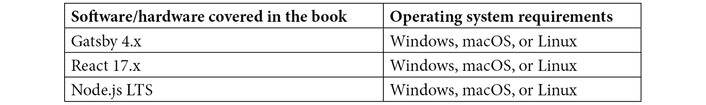

# 前言

*Gatsby 是一个强大的 React 静态网站生成器，它使你能够创建闪电般的网络体验。使用 Gatsby 的最新版本，你可以将你的静态内容与服务器端渲染和延迟静态内容相结合，创建一个全面的应用程序。通过 Gatsby 提升 React Web 开发为初学者提供全面的介绍，让你迅速掌握 GatsbyJS。*

*本书包含实践教程和项目，这本易于遵循的指南首先教你 GatsbyJS 的核心概念。然后，你会发现如何通过利用 GatsbyJS 框架的力量来构建高性能、可访问和可扩展的网站。本书采用实用方法，帮助你从个人网站到具有身份验证的大规模应用程序构建一切，让你的网站在 SEO 排名中脱颖而出。*

*到本书结束时，你将了解如何构建用户喜爱的客户网站。使用这个工具的每个方面，性能和可访问性都是重点，你将通过本书的材料学习如何充分利用它。*

# 本书面向对象

*本书面向希望使用 GatsbyJS 与 React 构建更好的静态和动态 Web 应用的 Web 开发者。React 基础知识的前期经验是必要的。Node.js 的基本经验将帮助你充分利用本书。*

# 本书涵盖内容

*第一章*，*Gatsby.js 入门概述*，为你提供 Gatsby.js 是什么以及我们在后续章节中构建我们的 Web 应用将使用的指导原则的基线知识。

*第二章*，*样式选择和创建可重用布局*，展示了如何就你希望如何设计你的应用程序做出明智的选择。我们将涵盖使用 CSS、SCSS、styled-components 和 Tailwind.css。

*第三章*，*从任何地方获取和查询数据*，让你能够轻松地从多种不同的来源将数据源入你的 Gatsby 项目中。

*第四章*，*创建可重用模板*，解释了如何使用你的源数据通过编程创建网站页面、博客文章等！

*第五章*，*处理图像*，展示了如何在不影响性能的情况下将响应式图像添加到你的 Gatsby 网站中。

*第六章*，*提高你的网站搜索引擎优化*，解释了 SEO 是如何工作的，搜索引擎在你的网站页面中寻找什么，以及如何提高你的网站在网上的存在感。

*第七章*，*测试和审计你的网站*，涵盖了使用行业标准工具进行测试和审计你的应用程序。

*第八章*, *网站分析和性能监控*，解释了如何向你的网站添加分析功能，并利用你的受众使你的网站变得更好！

*第九章*, *部署和托管*，展示了如何将我们一直在工作的项目部署出来，让全世界都能看到！

*第十章*, *创建 Gatsby 插件*，涵盖了创建源和主题插件，并解释了如何将它们贡献给 Gatsby 插件生态系统。

*第十一章*, *创建认证体验*，展示了如何添加受保护的路线以在你的网站上创建登录体验。

*第十二章*, *使用实时数据*，解释了你可以如何使用套接字来创建利用实时数据的体验。

*第十三章*, *国际化与本地化*，涵盖了你可以使用的模式，使你的网站在扩展时翻译变得简单。

# 要充分利用这本书

所有代码示例都已使用 macOS 上的 Gatsby 4.4.0 进行测试。然而，它们也应该适用于未来的 4.x 版本。



*本书假设你已经安装了一个你熟悉的* **集成开发环境**(**IDE**) *。*

**如果你使用的是这本书的数字版，我们建议你亲自输入代码或从书的 GitHub 仓库（下一节中有一个链接）获取代码。这样做将帮助你避免与代码复制粘贴相关的任何潜在错误。**

# 下载示例代码文件

你可以从 GitHub 下载本书的示例代码文件[`github.com/PacktPublishing/Elevating-React-Web-Development-with-Gatsby-4`](https://github.com/PacktPublishing/Elevating-React-Web-Development-with-Gatsby-4)。如果代码有更新，它将在 GitHub 仓库中更新。

我们还有其他来自我们丰富的书籍和视频目录的代码包，可在[`github.com/PacktPublishing/`](https://github.com/PacktPublishing/)找到。查看它们吧！

# 下载彩色图像

我们还提供了一份包含本书中使用的截图和图表彩色图像的 PDF 文件。你可以从这里下载：[`static.packt-cdn.com/downloads/9781800209091_ColorImages.pdf`](https://static.packt-cdn.com/downloads/9781800209091_ColorImages.pdf)。

# 使用的约定

本书使用了一些文本约定。

`文本中的代码`：表示文本中的代码单词、数据库表名、文件夹名、文件名、文件扩展名、路径名、虚拟 URL、用户输入和 Twitter 昵称。以下是一个示例：“在你的根目录中创建一个`gatsby-config.js`文件，并添加以下内容。”

代码块设置如下：

```js
module.exports = {
  plugins: [],
};
```

当我们希望您注意代码块中的特定部分时，相关的行或项目将以粗体显示：

```js
import React from "react"
import {Link} from "gatsby"
export default function Index() => {
    return (
        <div>
            <h1>My Landing Page</h1>
            <p>This is my landing page.</p>
            <Link to="/about">About Me</Link>
        </div>
    )
}
```

任何命令行输入或输出都应如下所示：

```js
gatsby develop -H 0.0.0.0
```

**粗体**：表示新术语、重要单词或屏幕上看到的单词。例如，菜单或对话框中的单词以**粗体**显示。以下是一个示例：“当你点击查询上方的**播放**按钮时，你将在中央右侧列中看到该查询的结果，其中包含一个包含数据属性和我们的查询结果的 JSON 对象。”

小贴士或重要注意事项

看起来像这样。

# 联系我们

我们始终欢迎读者的反馈。

**一般反馈**：如果您对本书的任何方面有疑问，请通过电子邮件发送至 customercare@packtpub.com，并在邮件主题中提及书名。

**勘误**：尽管我们已经尽一切努力确保内容的准确性，但错误仍然可能发生。如果您在这本书中发现了错误，我们将非常感激您能向我们报告。请访问 [www.packtpub.com/support/errata](http://www.packtpub.com/support/errata) 并填写表格。

**盗版**：如果您在互联网上发现我们作品的任何非法副本，我们将非常感激您能提供位置地址或网站名称。请通过电子邮件发送至 copyright@packt.com 并附上材料的链接。

**如果您有兴趣成为作者**：如果您在某个领域有专业知识，并且您有兴趣撰写或为本书做出贡献，请访问 [authors.packtpub.com](http://authors.packtpub.com)。
